# Part 75 - SAN Troubleshooting Scenarios: iSCSI, FC, LUNs, Paths, and Hosts

> **Section goal:** Diagnose Storage Area Network (SAN) symptoms across host, initiator, network or fabric, target, mapping, multipath, block object, and host-owned filesystem layers without risking data. By the end, you should be able to reason through iSCSI discovery/login/CHAP/MTU/routing; FC link, fabric login, zoning, optics and credits; LUN/igroup mappings and duplicate IDs; path loss, Multipath I/O (MPIO), Asymmetric Logical Unit Access (ALUA), NVMe Asymmetric Namespace Access (ANA), timeouts, queues, reservations, device signatures, Host Utilities, drivers, firmware, switches, target ports, and NVMe host mappings with exact evidence and safe escalation boundaries.

Covers index item **75** and maps directly to job-description responsibilities for storage depth, complex high-pressure troubleshooting, risk mitigation, supportability analysis, Support/Engineering collaboration, and customer communication.

**Explicit nonclaim:** You have not provisioned, mapped, rescanned, formatted, mounted, failed over, repaired, or diagnosed a production NetApp ONTAP SAN, LUN, namespace, igroup, subsystem, iSCSI, FC, NVMe, MPIO, ALUA, or ANA configuration.

**Privacy/access:** SAN evidence can expose customer topology, IQNs, WWPNs, NQNs, serials, LUN/namespace identifiers, hostnames, addresses, CHAP configuration, zoning, switch ports, drivers, firmware, filesystem labels, reservations, packet/frame contents, and support contracts. Use approved collection, minimum fields, secure transfer, need-to-know access, redaction/tokenization, retention, and authorized vendor/customer repositories. Never include CHAP secrets, credentials, unredacted dumps, or real identifiers in study artifacts.

**Synthetic-evidence rule:** Every customer, host, identifier, portal, fabric, zone, LUN, namespace, path, signature, reservation, event, metric, version, action, owner, and outcome below is fictional and sanitized. No scenario is a real ONTAP output, host report, switch trace, IMT result, case, command procedure, or customer event.

**Version/current source caveat:** ONTAP, host OS, hypervisor, Host Utilities, multipath stacks, adapters, drivers, firmware, switches, protocol standards, support matrices, commands, defaults, timeout values, and target behavior change. A **current-source check** means verifying the exact end-to-end recipe in the current authorized IMT and host/platform documentation, recording all notes and dates, and using qualified host, fabric, storage, application, and Support owners before live action.

This Part is a reasoning casebook, not a NetApp internal troubleshooting manual, host or switch runbook, compatibility result, command reference, change authorization, or permission to rescan, alter mappings, clear reservations, initialize media, or manipulate production paths.

> **No-production-NetApp boundary:** Your factual strengths are enterprise escalation, Windows and Azure infrastructure, networking, virtual machines, storage fundamentals, trace and event correlation, high-pressure communication, and cross-vendor coordination. Your exact nonclaim is: **you have not administered or troubleshot a production NetApp SAN.** These are synthetic reasoning exercises, not proof of ONTAP, FC, iSCSI, NVMe, or host-multipath production experience.

---

## 1. SAN is a chain of presentation and ownership

A SAN presents block devices to hosts. The storage system owns target presentation and backing storage; the host, hypervisor, database, or cluster normally owns partitions, volume managers, filesystems, reservations, and application consistency.

| Term | Plain meaning | Analogy | Why it matters |
|---|---|---|---|
| **Initiator** | Host endpoint starting block commands | Caller | Identity controls authorization and path evidence |
| **Target** | Storage endpoint receiving commands | Called service | Reachability is not mapping |
| **LUN** | SCSI logical block device presented to hosts | Blank numbered notebook | Host owns how pages are organized |
| **Namespace** | NVMe logical block address space | NVMe notebook | Mapped through subsystem/host identity |
| **igroup** | ONTAP group of authorized SCSI initiator identities | Approved caller list | Wrong membership can expose or hide devices |
| **Subsystem** | NVMe grouping connecting namespaces and hosts | Secure meeting room | Host NQN and namespace mapping both matter |
| **MPIO** | Host framework merging paths to one stable device | Several roads to one warehouse | Prevents duplicate mounting and enables failover |
| **ALUA** | SCSI target reports optimized/non-optimized path access | Preferred and secondary entrances | Path visible does not mean equally efficient |
| **ANA** | NVMe namespace path accessibility states | NVMe traffic signs | NVMe host should select usable/preferred paths |
| **Reservation** | Coordination state controlling which host may perform writes | Meeting-room booking | Clearing it incorrectly can cause corruption |

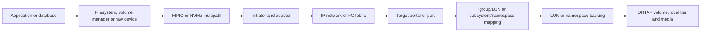

### Ownership warning

A storage-side device can be healthy while the host filesystem is damaged; a host can see a path while mapping is absent; a LUN can be mapped correctly while MPIO presents duplicates. Never initialize, format, repair, mount, resize, clone, or restore a block device until stable identity, ownership, application state, and recovery are proven.

---

## 2. The SAN evidence contract

Capture exact:

- Application symptom, host, cluster membership, device, operation, time, error, data risk.
- Protocol: iSCSI, FCP, NVMe/FC, NVMe/TCP, and negotiated/session state.
- Initiator IQN/WWPN/NQN and target IQN/WWPN/NQN/portal/port.
- Both fabric/network paths, switches, ports, VLANs/routes/MTU/credits/optics.
- LUN/namespace UUID, serial, size, LUN ID or namespace ID, mapping, igroup/subsystem.
- MPIO/ALUA/ANA device identity, policy, path states, owners, queue/timeouts.
- Host OS/kernel/hypervisor, Host Utilities, multipath/device handler, adapter, driver, firmware.
- ONTAP/platform/target adapter release and current IMT/HWU evidence.
- Reservation, partition/signature, filesystem/volume-manager and application ownership.
- Affected and unaffected controls, changes, and synchronized evidence.

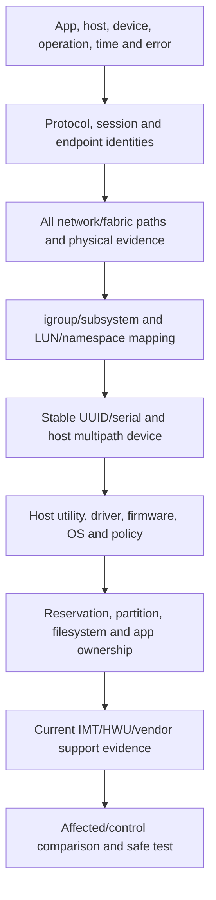

### 🔍 Plain-English deep-dive: visibility is a ladder, not a yes/no state

Seeing a target IP does not prove iSCSI login; fabric login does not prove zoning; zoning does not prove LUN mapping; mapping does not prove MPIO merge; a device object does not prove a healthy filesystem. **Analogy:** seeing an office building, entering the lobby, reaching a floor, opening an office, and reading the correct file are separate gates. **Why it matters:** diagnose the first failed boundary.

---

## 3. Protocol triage trees

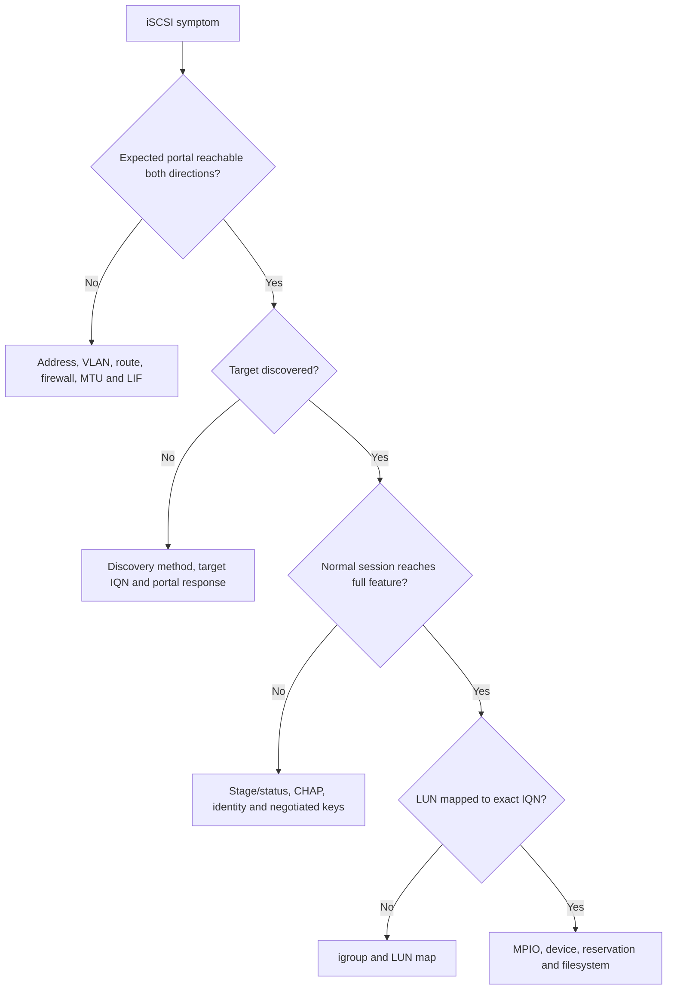

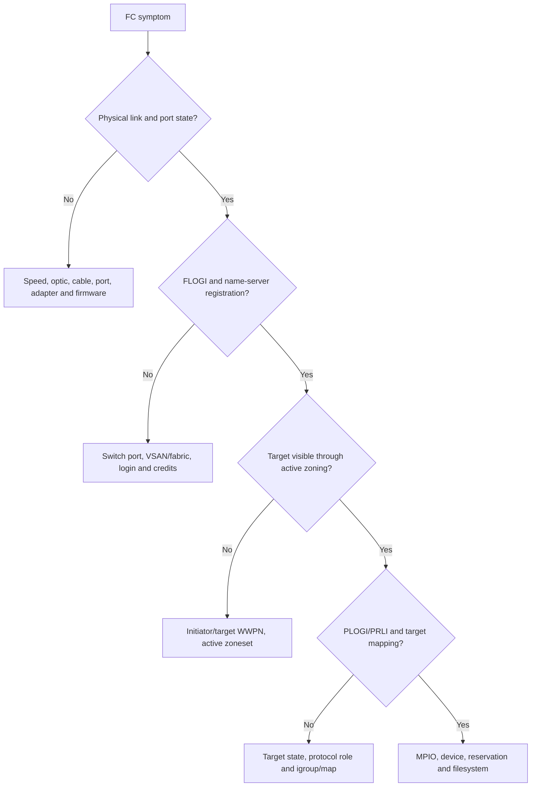

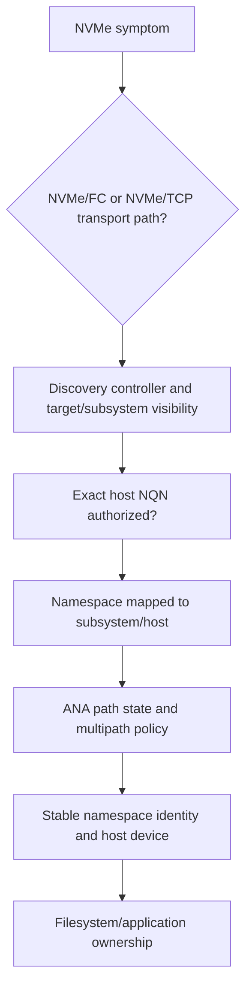

### 🔍 Plain-English deep-dive: redundancy is independence plus tested recovery

Four paths on a host screen may share one adapter, switch, power feed, VLAN, target port, or configuration error. **Analogy:** four road signs can still point to one bridge. **Why it matters:** map physical and logical failure domains, then test one-side loss and recovery under qualified ownership.

---

## 4. Fully synthetic sanitized scenario(s): discovery, login, fabric, and mapping cases 1-7

### Case 1 - iSCSI discovery returns no targets

**Symptom/scope:** A synthetic host reaches the portal IP but SendTargets discovery returns no target records; another subnet succeeds.

| Competing hypothesis | Prediction | Decisive evidence |
|---|---|---|
| Discovery request reaches wrong LIF/service policy | TCP may connect elsewhere; target service response absent | Exact destination LIF/service and iSCSI discovery response |
| Firewall permits handshake but blocks/reset application flow | TCP establishes then resets/times out | Both-direction packet and firewall state |
| Route/asymmetry selects another return path | Reply leaves unexpected interface | Host/SVM route and flow evidence |

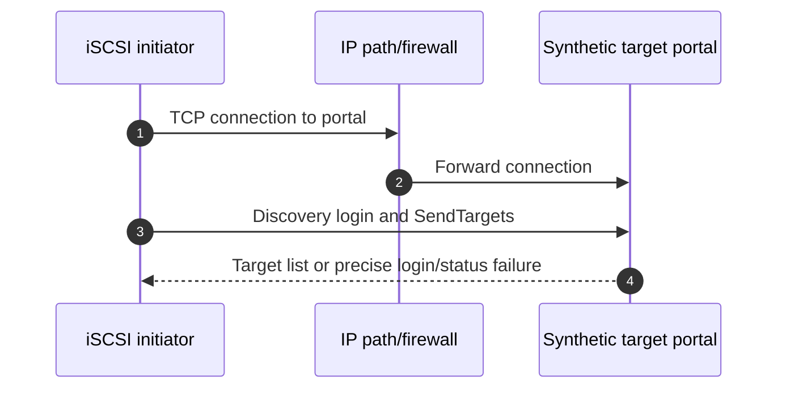

**Synthetic conclusion:** the tested IP is a reachable data LIF without the expected iSCSI service context. **Boundary:** storage/network owners verify intended portal design; do not add services or routes as a guess.

### Case 2 - iSCSI login fails at CHAP

**Symptom/scope:** Discovery works, but normal session login fails for one initiator after credential rotation.

| Competing hypothesis | Prediction | Evidence |
|---|---|---|
| CHAP identity/secret mismatch | Security negotiation fails at CHAP stage | Login status class/detail and redacted identity/config timestamps |
| Wrong initiator IQN | Target applies another auth/igroup context | Host-reported InitiatorName and target observation |
| Operational-key mismatch | Security succeeds; failure occurs later | Login stage and negotiated key evidence |

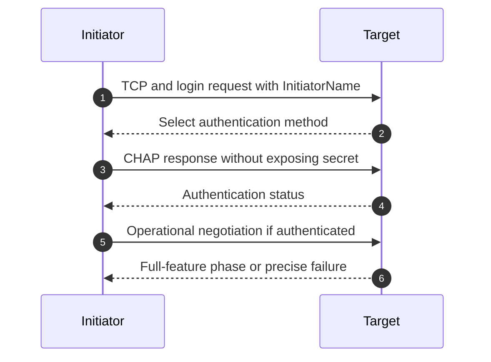

**Synthetic conclusion:** rotation updated one side only. **Privacy boundary:** never place CHAP secrets in traces, tickets, or screenshots; authorized owners rotate through the current secure procedure.

### Case 3 - iSCSI large I/O stalls with MTU and asymmetric routing

**Symptom/scope:** Login and small I/O work, but large synthetic writes stall on one path.

| Competing hypothesis | Prediction | Evidence |
|---|---|---|
| End-to-end MTU mismatch/PMTUD failure | Larger packets retransmit/black-hole; small operations pass | Both-direction packet size, ICMP/path MTU and interface counters |
| Asymmetric route through stateful firewall | One direction/path loses state | Route tables and firewall-node flow state |
| Target queue saturation | All paths/large operations show target service wait | Matching target and host queue/service evidence |

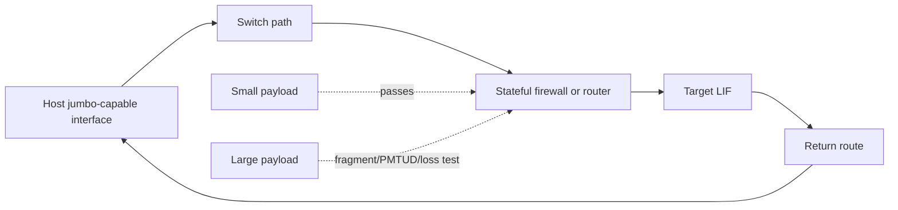

**Synthetic conclusion:** one routed segment has a lower MTU and required feedback is filtered. **Boundary:** do not toggle jumbo frames on endpoints independently; network/storage/host owners validate the whole path and supportability.

### Case 4 - FC link is up but FLOGI does not complete

**Symptom/scope:** Host adapter reports physical link, but no fabric-assigned FC ID appears.

| Competing hypothesis | Prediction | Evidence |
|---|---|---|
| Switch port mode/VSAN/fabric mismatch | Link up; FLOGI rejected or not registered in intended fabric | Switch login events, port mode, VSAN/fabric membership |
| Speed/optic/cable quality | Link flaps or physical errors rise | Port counters, optic diagnostics, both ends, time alignment |
| HBA driver/firmware problem | Host logs initialization/login failure; control port works | Exact HBA recipe and host events |

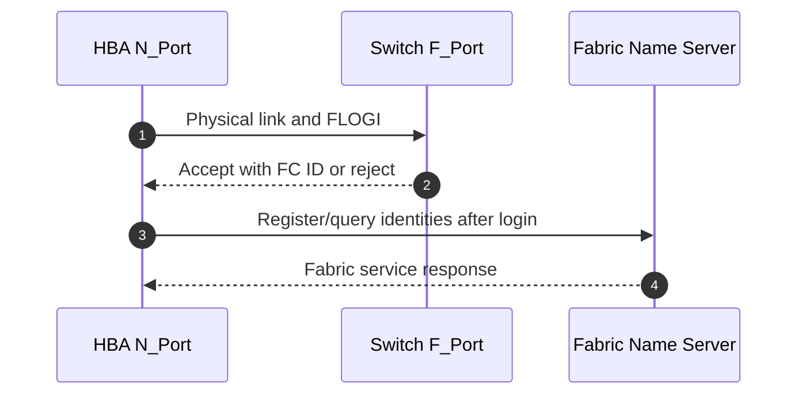

**Synthetic conclusion:** the switch port is assigned to the wrong logical fabric. **Boundary:** qualified fabric owner corrects configuration; no port reset or switch change is prescribed from this guide.

### Case 5 - FLOGI works, but target WWPN is invisible

**Symptom/scope:** Initiator registers in the fabric, yet no PLOGI to the intended target occurs.

| Competing hypothesis | Prediction | Evidence |
|---|---|---|
| Active zoning omits/wrong WWPN | Name server/zone visibility excludes target | Exact initiator/target WWPN and active zoneset |
| Target port not registered in same fabric/VSAN | Target absent regardless of zone definition | Target FLOGI/name-server registration and port state |
| Stale alias points to replaced port | Zone name looks right but member WWPN differs | Alias/member expansion versus current target identity |

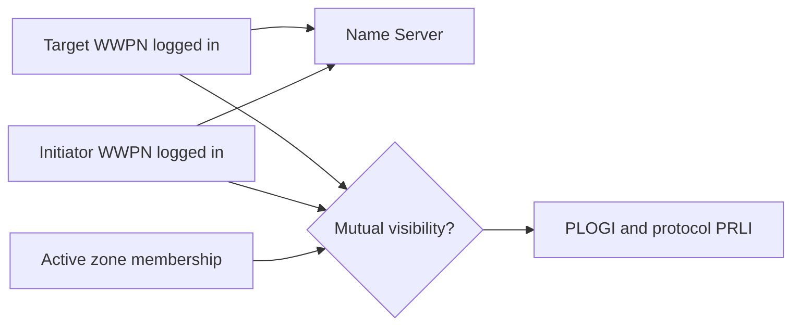

**Synthetic conclusion:** a stale alias contains an old target WWPN. **Boundary:** fabric/storage owners validate single-initiator zoning policy and current identifiers; never broadly zone all ports for convenience.

### Case 6 - LUN absent because igroup/mapping identity is wrong

**Symptom/scope:** FC PLOGI/PRLI succeeds, but one host cannot see the expected LUN.

| Competing hypothesis | Prediction | Evidence |
|---|---|---|
| Initiator WWPN missing from igroup | Target session exists; map not authorized for this WWPN | Exact observed WWPN, igroup membership and map |
| LUN mapped to another igroup/SVM | Correct object exists but presentation differs | LUN UUID/path, SVM and mapping table |
| Host scan/device issue | Target reports successful presentation/commands | Target-side command and host discovery evidence |

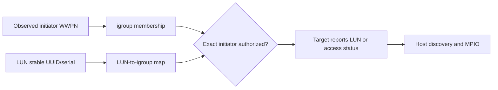

**Synthetic conclusion:** the host uses a replacement HBA WWPN absent from the intended igroup. **Safety:** adding identities can expose data; validate host ownership, cluster design, LUN, and all paths before authorized mapping change.

### Case 7 - Duplicate host LUN IDs create confusion

**Symptom/scope:** An administrator sees `LUN 12` in two mapping contexts and assumes they are the same device.

| Competing hypothesis | Prediction | Evidence |
|---|---|---|
| Same LUN mapped through paths | Stable UUID/serial matches despite path/LUN-ID views | Device identity across all paths |
| Different LUNs reuse numeric ID in different contexts | UUID/serial/size/backing differ | Mapping context and stable identities |
| Snapshot/clone creates similar signature | Host sees different device identity but duplicated filesystem signature | Storage clone lineage and host signature |

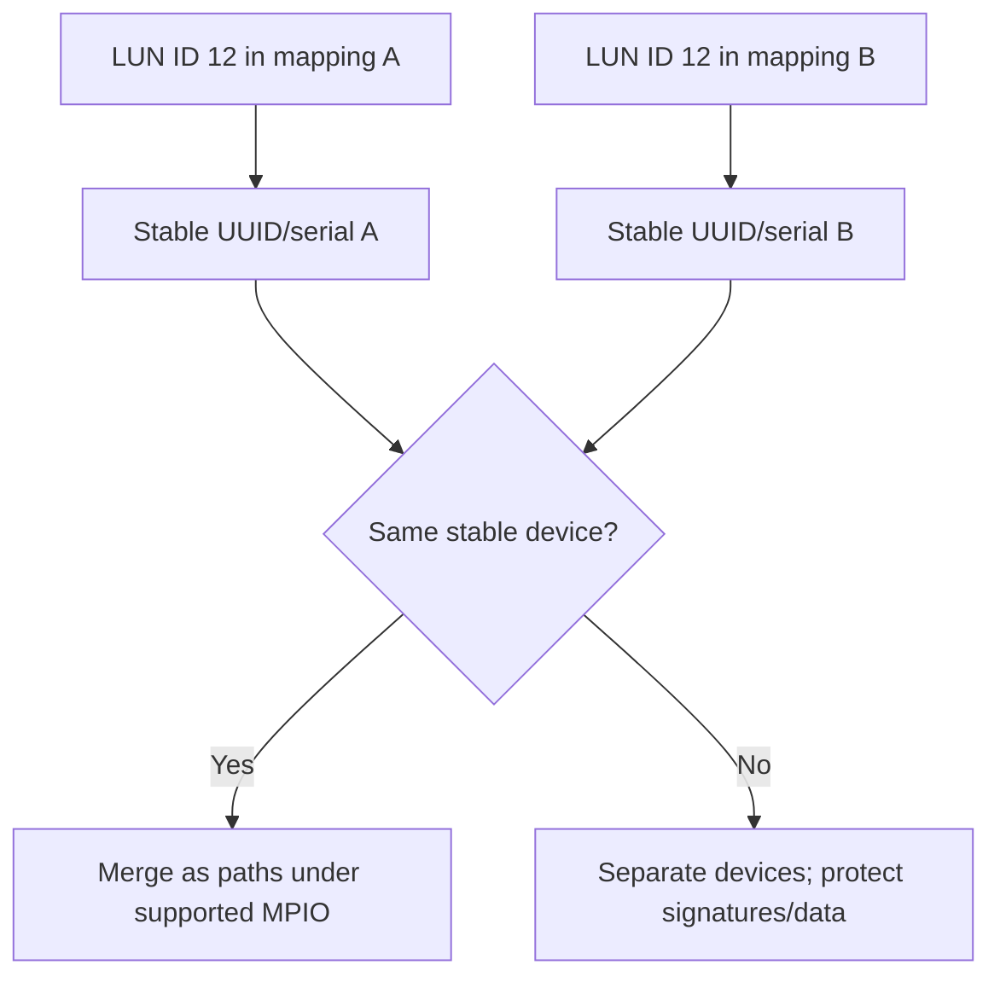

**Synthetic conclusion:** numeric LUN ID is reused for different devices in different host contexts. **Boundary:** never identify or format by LUN number alone.

---

## 5. Fully synthetic sanitized scenario(s): path, MPIO, ALUA, ANA, queue, and reservation cases 8-13

### Case 8 - One SAN fabric path disappears

**Symptom/scope:** One of four FC paths is lost; application remains online but latency rises.

| Competing hypothesis | Prediction | Evidence |
|---|---|---|
| Physical port/optic failure | Link/errors change on one exact hop | HBA/switch/target physical counters and optic diagnostics |
| Zoning change | Link remains up but target visibility/PLOGI disappears | Active zoneset/change and login history |
| Target port offline | Multiple hosts through same target port fail | Target-port state and cross-host controls |
| Host MPIO issue | Fabric sees path healthy, host marks it failed | Host path/device-handler evidence |

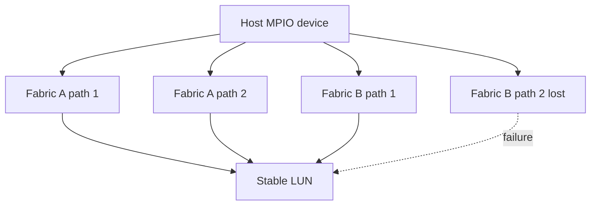

**Synthetic conclusion:** switch-port physical errors precede B2 loss. **Boundary:** service may be available but redundancy is degraded; do not force failover or reset paths before qualified fabric/hardware review.

### Case 9 - All paths are visible but use non-optimized access

**Symptom/scope:** Host shows active paths, yet latency is higher than baseline and all are reported non-optimized.

| Competing hypothesis | Prediction | Evidence |
|---|---|---|
| MPIO/ALUA handler not configured/supported | Host ignores or misreads target-port-group states | Host utility/device handler, ALUA state and IMT recipe |
| Optimized target paths absent | Zoning/network/mapping lacks owning-node preferred paths | Target port group and topology evidence |
| LUN ownership/location changed | Preferred paths change consistently with target state | LUN/volume/node and ALUA chronology |

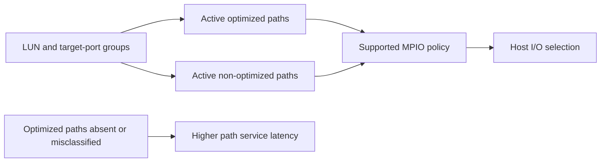

**Synthetic conclusion:** expected optimized target ports are missing from the host recipe after zoning work. **Boundary:** validate exact topology and support; `active` is not equivalent to `optimized`.

### Case 10 - MPIO presents duplicate devices instead of one

**Symptom/scope:** Host sees the same capacity multiple times; filesystem is mounted through one device path.

| Competing hypothesis | Prediction | Evidence |
|---|---|---|
| MPIO/device handler absent or unsupported | Same stable serial appears as separate OS devices | Host multipath inventory and exact recipe |
| Different LUNs share size/signature | Stable UUID/serial differs | Device identity and mapping |
| Storage clone duplicates filesystem signature | LUN identity differs but host signature collides | Clone lineage and partition/filesystem identifiers |

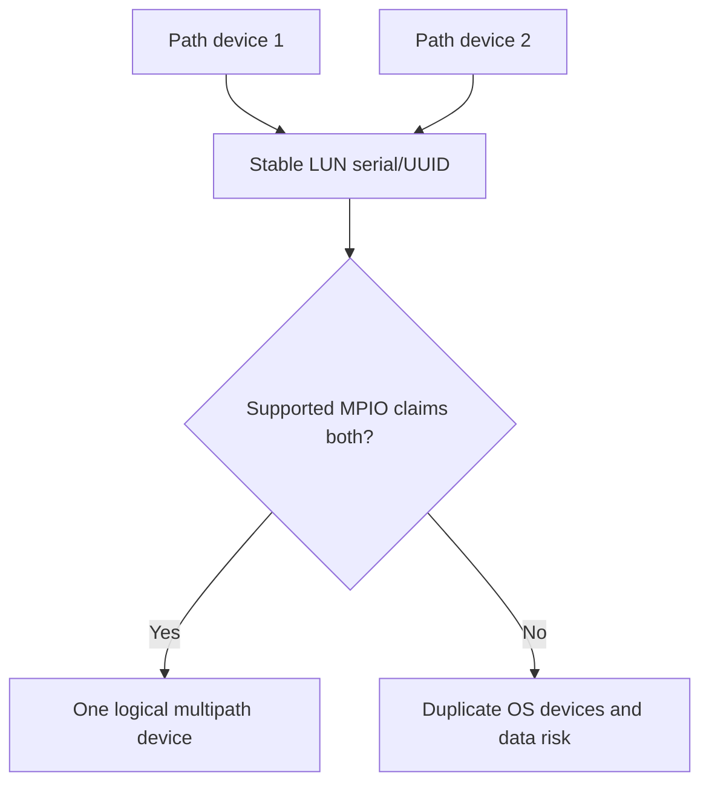

**Synthetic conclusion:** a required supported device handler is absent. **Safety:** do not mount both, initialize, or edit signatures; host/storage Support owners stabilize the exact recipe.

### Case 11 - NVMe paths show unexpected ANA states

**Symptom/scope:** NVMe namespace remains accessible, but hosts choose non-optimized paths and performance varies.

| Competing hypothesis | Prediction | Evidence |
|---|---|---|
| Expected optimized paths not connected | ANA optimized group absent | Controller/path/ANA state and topology |
| Host NVMe multipath policy/driver issue | Target reports correct ANA; host selection differs | Host driver, policy, logs and IMT recipe |
| Namespace ownership/availability transition | ANA state changes align with storage event | Target namespace/controller chronology |

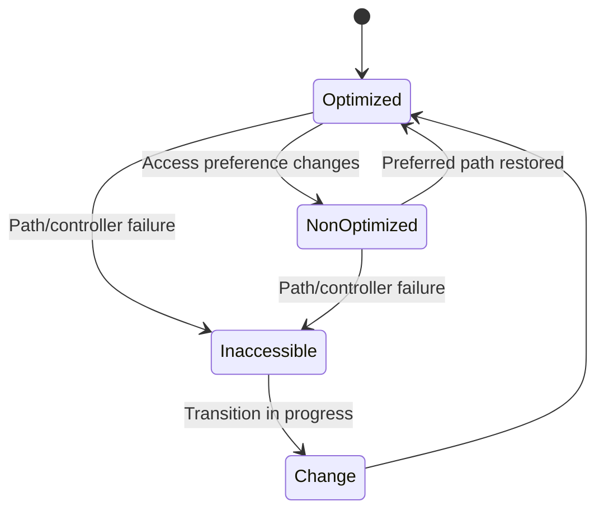

**Synthetic conclusion:** the host never established controllers through the preferred target interfaces. **Boundary:** ANA and ALUA are related multipath ideas but not interchangeable evidence or commands.

### Case 12 - Timeout and queue growth cause a retry storm

**Symptom/scope:** Synthetic database latency spikes; host queue and retries rise, target average remains moderate.

| Competing hypothesis | Prediction | Evidence |
|---|---|---|
| One slow path causes head-of-line waits/retries | Tail and retries correlate by path | Per-path latency/error and MPIO policy |
| Offered load exceeds bottleneck service | Queue grows, throughput plateaus, tail rises | IOPS/throughput/queue/latency time series |
| Timeout values unsupported/mismatched | Premature abort/retry before normal completion | Exact host/app timeout and support guidance |
| Target service problem | Matching LUN/workload service center rises first | Operation/object-level target evidence |

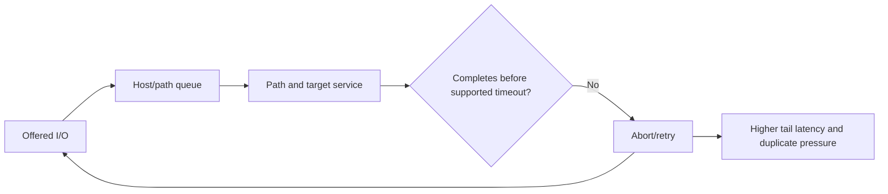

**Synthetic conclusion:** one path's tail triggers retries that amplify load. **Boundary:** do not increase queue depth/timeouts blindly; prove mechanism and use current application/host/vendor guidance.

### Case 13 - Persistent reservation conflict after cluster recovery

**Symptom/scope:** A host sees the LUN but writes receive reservation conflict after a synthetic cluster-node recovery.

| Competing hypothesis | Prediction | Evidence |
|---|---|---|
| Stale reservation holder/key | Reservation state names a prior host/key | Authorized reservation report and cluster ownership |
| Active peer legitimately owns write access | Peer is healthy and holds expected reservation | Application-cluster membership/state and reservation evidence |
| Mapping/identity changed | Recovered host presents another initiator identity/key | Initiator and cluster configuration chronology |

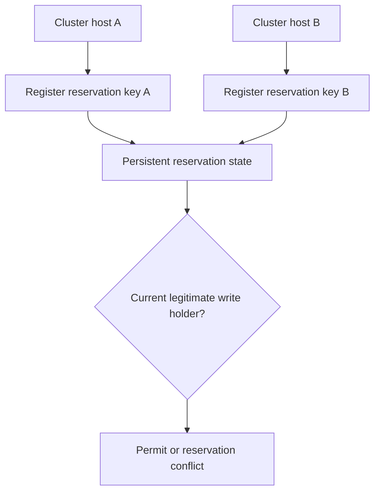

**Synthetic conclusion:** active peer legitimately owns the reservation during recovery. **Critical boundary:** never clear, preempt, or modify reservations without application-cluster owner, data-integrity safeguards, exact support procedure, and recovery plan.

### 🔍 Plain-English deep-dive: a reservation conflict may be a safety control working

A locked operating-room door can feel like an outage to the person outside, but opening it without confirming who is operating is dangerous. A SCSI reservation can prevent two uncoordinated hosts from writing the same data. **Why it matters:** `clear the reservation` is not generic troubleshooting; first prove cluster ownership and application state.

---

## 6. Fully synthetic sanitized scenario(s): host, compatibility, physical, target, and NVMe mapping cases 14-18

### Case 14 - Duplicate disk signature after a cloned LUN is presented

**Symptom/scope:** A host detects a new LUN but keeps it offline because its partition/filesystem signature duplicates an existing device.

| Competing hypothesis | Prediction | Evidence |
|---|---|---|
| Intentional storage clone retains host signature | LUN identity differs; partition/filesystem signature matches source | Clone lineage and host disk identity |
| Same LUN presented twice without MPIO | Stable LUN serial matches across devices | Path/device identity and multipath claim |
| Wrong LUN mapped | Neither expected identity nor lineage matches | Mapping and change record |

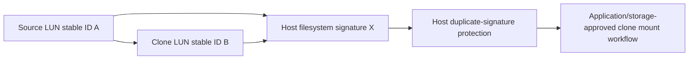

**Synthetic conclusion:** an intentional clone preserves host-level signatures. **Safety:** do not online, resignature, mount, or repair until source/clone purpose, application consistency, write isolation, and approved workflow are confirmed.

### Case 15 - Host Utilities, driver, firmware, and switch recipe is unlisted

**Symptom/scope:** Paths flap after a host OS update; the previous recipe was supported, but the mixed current state is unclear.

| Competing hypothesis | Prediction | Evidence |
|---|---|---|
| Driver/firmware mismatch | Only exact changed adapters flap | Fleet recipe partition and adapter events |
| Host Utilities/multipath settings stale | Path policy/device handler differs from current guidance | Host configuration and current host docs |
| Switch/target issue | Unchanged hosts sharing path also fail | Cross-host/fabric/target controls |
| Known product defect | Exact trigger/signature/version matches authorized record | Support-led defect qualification |

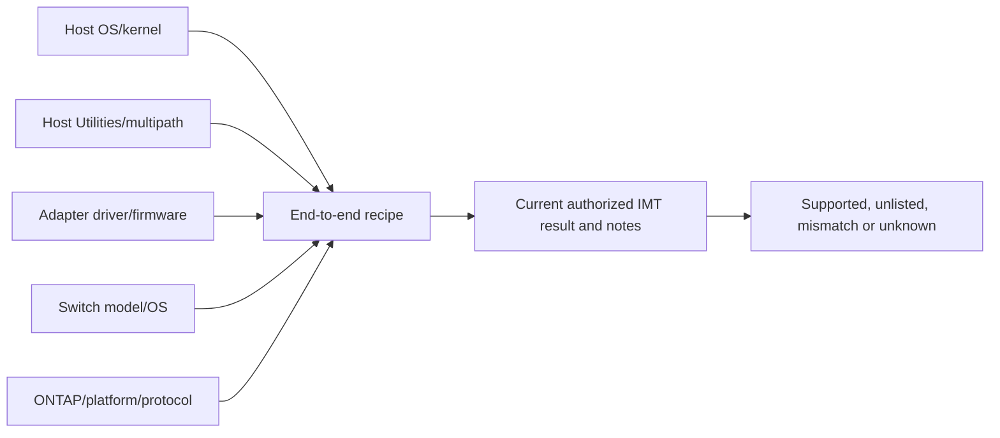

**Synthetic conclusion:** changed driver with old firmware is not validated in the synthetic exercise. **Boundary:** stop rollout and engage qualified owners; do not recommend firmware/downgrade from memory.

### Case 16 - FC optical errors and credit starvation

**Symptom/scope:** Throughput drops and tail latency rises on one fabric; no path is fully down.

| Competing hypothesis | Prediction | Evidence |
|---|---|---|
| Dirty/failing optic or cable | Physical error counters rise on one hop/direction | Both-end port counters and optical diagnostics |
| Slow-drain device/credit starvation | Credit-zero/congestion propagates from a port | Fabric credit/congestion timeline and affected flows |
| Target saturation | Both fabrics to the target show matching queue/service | Target-port and storage service evidence |
| Host queue behavior | One host drives burst/retry pattern | Host queue/retry and workload controls |

```mermaid
flowchart LR
    HBA[Host HBA] --> SWA[Edge switch port]
    SWA --> CORE[Fabric ISL/core]
    CORE --> SWT[Target edge port]
    SWT --> TGT[Target FC port]
    OPT[Optic/cable errors] -.one hop.-> SWA
    CREDIT[Credit starvation/slow drain] -.propagates.-> CORE
```

**Synthetic conclusion:** one optic shows directional errors, while credit symptoms are downstream effects. **Boundary:** qualified fabric/hardware owner handles replacement; do not reset the entire fabric or increase buffers as a guess.

### Case 17 - One target port rejects protocol login

**Symptom/scope:** Fabric visibility exists, but PRLI or I/O fails through one target port across several hosts.

| Competing hypothesis | Prediction | Evidence |
|---|---|---|
| Target port role/personality wrong | FLOGI/PLOGI may work; protocol PRLI rejected | Target port role/config and protocol events |
| Adapter/port hardware degradation | Physical errors and cross-host impact align | Target/switch counters and hardware events |
| Zoning/mapping issue | Visibility or LUN access differs by initiator | Active zone and igroup/map evidence |
| Firmware defect | Exact target adapter/release/signature matches authorized defect | Current Support/defect evidence |

```mermaid
sequenceDiagram
    autonumber
    participant H as Host initiator
    participant F as FC fabric
    participant T as Target port
    H->>F: FLOGI and Name Server query
    F-->>H: Target visibility
    H->>T: PLOGI
    T-->>H: Port login response
    H->>T: FCP or NVMe PRLI
    T-->>H: Protocol-role response
```

**Synthetic conclusion:** the port is configured for another supported role in the fictional topology. **Boundary:** do not change target-port personality while production paths depend on it; design, compatibility, HA, and change review are required.

### Case 18 - NVMe namespace absent for one host NQN

**Symptom/scope:** NVMe discovery finds the subsystem, but one host sees no expected namespace; another host does.

| Competing hypothesis | Prediction | Evidence |
|---|---|---|
| Host NQN not authorized to subsystem | Controller connects but namespace list excludes object | Exact observed host NQN and subsystem host membership |
| Namespace not mapped to subsystem | All hosts in subsystem miss it | Namespace/subsystem map and controls |
| Host cache/driver issue | Target reports namespace exposure to exact host | Target/controller log and host rescan evidence under owner |
| NQN duplication | Two hosts claim same identity, causing ambiguous ownership | Fleet NQN uniqueness and session evidence |

```mermaid
flowchart LR
    HOST[Observed host NQN] --> SUB[Subsystem authorized-host list]
    NS[Namespace stable UUID/NSID] --> MAP[Namespace-to-subsystem map]
    SUB --> EXPOSE{Host and namespace both authorized?}
    MAP --> EXPOSE
    EXPOSE --> CTRL[NVMe controller namespace list]
    CTRL --> ANA[ANA paths and host multipath device]
```

**Synthetic conclusion:** a replacement host generated a new NQN not added to the intended subsystem. **Safety:** mapping changes can expose blocks to the wrong host; validate identity uniqueness, application ownership, all paths, and current procedure.

---

## 7. Cross-case diagnosis matrix

| Symptom | First split | Common false conclusion | Decisive evidence |
|---|---|---|---|
| Portal reachable, no target | Discovery/service vs path | `iSCSI is up because TCP connects` | Login stage/status and target service identity |
| Login fails | CHAP/IQN vs operational negotiation | `Bad network` | Exact login stage and identity |
| FC link up, no devices | FLOGI, zoning, PRLI, mapping | `Cable is fine, so fabric is fine` | Login/name-server/zone/protocol/map chain |
| LUN absent | Target map vs host discovery | `Rescan more` | Exact initiator, map and target response |
| Duplicate devices | Same stable LUN vs separate signatures | `Format the extra disk` | UUID/serial, MPIO claim, clone lineage |
| Non-optimized paths | Missing preferred path vs host handler | `All active paths are equal` | ALUA/ANA target and host policy evidence |
| Timeouts/queue | Path tail, saturation, timeout, target | `Increase queue depth` | Per-path/service/throughput/tail chronology |
| Reservation conflict | Legitimate owner vs stale state | `Clear reservation` | Cluster/application ownership and reservation keys |
| Path performance | Optic/credit vs target/host | `Switch congestion` | Hop-by-hop directional physical and credit evidence |
| Namespace missing | NQN/subsystem/map vs host | `Storage did not create it` | Exact NQN, subsystem and namespace exposure |

```mermaid
flowchart LR
    FAIL[Failing host/path/device] --> DIFF[Compare healthy control]
    CTRL[Healthy host/path/device] --> DIFF
    DIFF --> ID[Initiator/target identity]
    DIFF --> RECIPE[OS, driver, firmware and utility recipe]
    DIFF --> FAB[Network/fabric/physical path]
    DIFF --> MAP[Mapping and stable device identity]
    DIFF --> STATE[MPIO/ALUA/ANA/reservation/filesystem state]
    ID --> TEST[Cheapest safe discriminating evidence]
    RECIPE --> TEST
    FAB --> TEST
    MAP --> TEST
    STATE --> TEST
```

### 🔍 Plain-English deep-dive: the host owns the filesystem truth

The storage array can present a perfectly healthy sequence of blocks while the host's partition table, volume manager, filesystem, cluster lock, or database is inconsistent. **Analogy:** a courier can deliver every numbered page intact while the recipient's binder index is wrong. **Why it matters:** storage-side restore, clone, resize, or remap cannot be judged safe without host/application ownership and consistency validation.

---

## 8. Safe SAN troubleshooting boundary

### Safe sequence

1. Freeze stable device identities, mapping, and application ownership in the record.
2. Preserve host, both fabrics/networks, target, and storage evidence with clocks.
3. Compare an unaffected path/host/device and exact recipe.
4. Validate current IMT, HWU, host, switch, and application guidance.
5. Prefer read-only evidence and synthetic/lab reproduction.
6. Route host, fabric/network, storage, application, and Support work to qualified owners.
7. For any live action, define authorization, scope, stop, recovery, data safeguards, and validation.
8. Validate application I/O, data, all expected paths, failover/recovery, protection, and residual risk.

```mermaid
flowchart TD
    ID[Freeze stable device and ownership identity] --> READ[Collect read-only host/path/target evidence]
    READ --> COMP[Validate exact current support recipe]
    COMP --> HYP[Competing hypotheses and controls]
    HYP --> LAB[Synthetic/lab or approved bounded test]
    LAB --> OWNER[Qualified application/host/fabric/storage/Support owners]
    OWNER --> CHANGE{Authorized live change required?}
    CHANGE -->|No| MON[Document and monitor]
    CHANGE -->|Yes| PLAN[Data-safe plan, stop/recovery and validation]
```

### Never use as exploratory shortcuts

- Initialize, format, online, offline, mount, repair, resignature, or overwrite an unknown device.
- Present one ordinary filesystem read/write to uncoordinated hosts.
- Add broad initiator groups, zones, subsystems, or mappings merely to test visibility.
- Clear or preempt reservations without application-cluster authority.
- Disable MPIO, remove paths, rescan repeatedly, reset HBAs/switches/target ports, force ALUA/ANA state, or trigger failover from memory.
- Change MTU, queue depth, timeouts, driver, firmware, switch OS, or target-port personality without current supportability and recovery.
- Expose CHAP secrets or real IQNs/WWPNs/NQNs in learning material.

---

## 9. Experience transfer and honesty and JD Mapping

```mermaid
flowchart LR
    WIN[Windows/Azure/VM fundamentals] --> HOST[Host, device and path reasoning]
    NET[Networking and traces] --> ISCSI[iSCSI route, MTU and flow evidence]
    ESC[Support escalation] --> EVID[Cross-vendor package and hypotheses]
    CRIT[Critical-situation communication] --> SAFE[Data-safe decisions and degraded-risk updates]
    HOST --> TRANS[Transferable SAN troubleshooting method]
    ISCSI --> TRANS
    EVID --> TRANS
    SAFE --> TRANS
    TRANS --> GAP[Production ONTAP SAN/fabric administration remains a gap]
```

| JD responsibility | Part 75 capability | Honest evidence/boundary |
|---|---|---|
| Storage/virtualization depth | 18 iSCSI/FC/NVMe/host cases | Synthetic learning, not production SAN |
| Technical risk | Stable identity, filesystem, reservation safety | No destructive action authority |
| Supportability | Exact IMT/HWU/host recipe discipline | No invented IMT result |
| High-pressure troubleshooting | Path controls, evidence and escalation | enterprise incident method transfers |
| Cross-functional work | Host/fabric/storage/app owner map | Existing vendor coordination skill |
| Customer communication | Available versus degraded redundancy and data risk | Production Microsoft communication experience |

### Honest interview wording

> `I troubleshoot SAN as a host-to-media chain: application and host device, MPIO or NVMe multipath, initiator, both independent networks/fabrics, target login, exact mapping, stable LUN or namespace identity, ALUA/ANA state, reservations and host filesystem ownership. I compare a healthy control and exact support recipe before any action. My production background is enterprise escalation and infrastructure, not ONTAP SAN administration, so I would work through qualified host, fabric, storage and Support owners.`

---

## 10. Labs, drills, and self-test

### Scenario lab

```mermaid
flowchart LR
    SELECT[Work all 18 synthetic cases] --> MAP[Draw host-to-media path and owners]
    MAP --> ID[Record stable identities and exact recipe]
    ID --> HYP[At least three competing hypotheses]
    HYP --> EVID[Prediction and decisive evidence]
    EVID --> SAFE[Data-safe test and escalation boundary]
    SAFE --> VALID[App, data, path and protection validation]
    VALID --> PANEL[Peer challenge and exact Q1-Q8 aloud]
```

### Required drills

1. Trace iSCSI discovery, login, CHAP, mapping, and MPIO as separate gates.
2. Diagnose small-I/O success/large-I/O failure with MTU and queue alternatives.
3. Trace FC link, FLOGI, Name Server, zoning, PLOGI, PRLI, and mapping.
4. Prove whether two path devices are one LUN or different LUNs.
5. Explain ALUA versus ANA without treating them as identical.
6. Diagnose all-active-but-non-optimized paths.
7. Explain timeout/retry feedback without blindly increasing timeouts/queues.
8. Defend why reservation conflict and duplicate signature can be safety controls.
9. Build an exact IMT recipe and gap statement without inventing results.
10. Create a data-safe escalation package for optic/credit or target-port evidence.

### Self-test

1. Define initiator, target, portal, fabric, LUN, namespace, igroup, subsystem, mapping, MPIO, ALUA, ANA, and reservation.
2. Draw SCSI/iSCSI, FCP, and NVMe paths.
3. Separate discovery, login, zoning, mapping, and host device stages.
4. Explain stable device identity versus LUN ID/NSID/path device.
5. Explain path independence and degraded redundancy.
6. Diagnose non-optimized paths and duplicate devices.
7. Explain queue, timeout, retry, and service-time interaction.
8. Explain host filesystem/signature/application ownership.
9. State exact supportability and evidence requirements.
10. State every unsafe shortcut and the no-production-NetApp boundary.

### Lab pass checklist

- [ ] All 18 cases contain symptom/scope, controls, competing hypotheses, evidence, conclusion, and safe boundary.
- [ ] iSCSI discovery, login, CHAP, MTU, routing, mapping, and MPIO are covered.
- [ ] FC link, FLOGI, zoning, PLOGI/PRLI, optics, credits, switches, and target ports are covered.
- [ ] LUN mapping, igroup identity, duplicate IDs, stable identity, and cloned signatures are covered.
- [ ] Path loss, non-optimized ALUA, MPIO duplicates, NVMe ANA, and NVMe mapping are covered.
- [ ] Timeout, queue, retry, and persistent reservation scenarios are covered.
- [ ] Host Utilities, OS, driver, firmware, switch, target, ONTAP, IMT, and HWU recipe are explicit.
- [ ] Host filesystem and application ownership are protected.
- [ ] No destructive rescan, format, mount, signature, reservation, zoning, mapping, path, firmware, or failover action is prescribed.
- [ ] Qualified host, fabric/network, storage, application, customer, and Support owners are explicit.
- [ ] All identifiers, evidence, compatibility states, and outcomes are synthetic and sanitized.
- [ ] No production NetApp SAN experience, support result, or tool access is claimed.
- [ ] Exact Q1-Q8 are answered aloud.

---

## 11. Official and Public Source Anchors

**Date checked: 2026-08-24.** Public sources anchor concepts and current navigation. The exact authorized IMT result, platform/host documentation, customer evidence, and qualified owners control live work.

| Topic | Official/public source | Bounded use |
|---|---|---|
| ONTAP SAN management | [ONTAP SAN storage management](https://docs.netapp.com/us-en/ontap/san-management/) | Current LUN, igroup, host and operations navigation |
| SAN configuration | [ONTAP SAN configuration](https://docs.netapp.com/us-en/ontap/san-config/) | Current FC/iSCSI architecture and prerequisites |
| iSCSI configuration | [ONTAP iSCSI configuration](https://docs.netapp.com/us-en/ontap/san-config/iscsi-config-concept.html) | Current SVM/portal/host setup orientation; exact release required |
| FC configuration | [ONTAP FC configuration](https://docs.netapp.com/us-en/ontap/san-config/fc-config-concept.html) | Current target/zoning/host prerequisite orientation |
| SAN hosts | [ONTAP SAN hosts and cloud clients](https://docs.netapp.com/us-en/ontap-sanhost/) | Current OS/protocol-specific Host Utilities and multipath navigation |
| NVMe hosts | [ONTAP SAN host configurations](https://docs.netapp.com/us-en/ontap-sanhost/overview.html) | Navigate current NVMe/FC or NVMe/TCP host guidance where supported |
| Interoperability | [NetApp Interoperability Matrix Tool](https://imt.netapp.com/) | Authorized exact end-to-end recipe and notes; never invent a result |
| Hardware | [NetApp Hardware Universe](https://hwu.netapp.com/) | Authorized current target adapter/port/platform rules and limits |
| Network/LIF | [ONTAP network management](https://docs.netapp.com/us-en/ontap/network-management/) | Current iSCSI/NVMe/TCP LIF, route, VLAN and MTU context |
| Support | [NetApp Support Services](https://www.netapp.com/services/support/) | Public context; exact entitlement, diagnosis and escalation route require confirmation |

### Source-use discipline

- Record exact host OS/kernel, Host Utilities, multipath/device handler, adapter, driver, firmware, switch, protocol, ONTAP and platform.
- Save the current authorized IMT result, notes, policies, history/date and actual-config comparison.
- Use HWU and exact platform/adapter docs for target hardware facts.
- Keep real initiator/target identities, CHAP data, zoning, signatures, reservations, and traces restricted.
- Use current vendor and application-cluster procedures for every production action.

---

## Likely Interview Questions

### Q1. How do you structure an end-to-end SAN investigation?

> **Model answer:** `I start with application impact, exact host/device/operation/time/error and data risk; identify protocol and initiator/target identities; map both independent network or FC paths; verify discovery/login/zoning/protocol state; confirm igroup/LUN or subsystem/namespace mapping and stable UUID/serial; inspect MPIO/ALUA or ANA, queues/timeouts/reservations; and protect host filesystem/application ownership. I compare an unaffected control and exact current support recipe.`

### Q2. How do you separate iSCSI discovery, login, mapping, and host-device failures?

> **Model answer:** `Portal reachability proves IP/TCP only. Discovery should return the intended target identity; normal login then passes security such as CHAP and operational negotiation to full-feature phase. The exact initiator IQN must be authorized through the igroup/LUN map. Finally the host must merge all presentations by stable identity under supported MPIO. I capture the first failed stage and status.`

### Q3. How do you trace an FC path from host to LUN?

> **Model answer:** `I verify physical HBA-to-switch link and errors; FLOGI and assigned FC ID; Name Server registration; active zoning between exact initiator and target WWPNs; PLOGI and FCP PRLI; target igroup/LUN mapping; then host MPIO and stable device identity. Link-up, zoning, or PLOGI alone does not prove LUN access.`

### Q4. What do MPIO, ALUA, and ANA tell you?

> **Model answer:** `MPIO merges multiple paths to one stable SCSI device and applies a supported selection/failover policy. ALUA reports SCSI target-port-group access characteristics such as optimized and non-optimized. ANA is NVMe namespace path accessibility state. I verify target and host views, physical independence, policy and failure recovery; visible paths are not necessarily optimized or independent.`

### Q5. How do you troubleshoot timeouts and queue growth?

> **Model answer:** `I align application, host, per-path, fabric/network and target operation evidence. I test one slow path, offered-load saturation, unsupported timeout/queue settings, target service, and retry amplification. Rising queue plus throughput plateau and tail/errors supports saturation; path-specific retries support a path issue. I do not increase queue depth or timeouts without mechanism and current vendor guidance.`

### Q6. Why are reservation conflicts and duplicate signatures dangerous to clear?

> **Model answer:** `A reservation may be correctly preventing an unauthorized cluster node from writing; a duplicate signature may be correctly preventing a clone or duplicate presentation from mounting over existing data. Before any clear, preempt, online, resignature, format, or mount action I prove stable identity, lineage, cluster/application ownership, consistency, recovery and exact authorized procedure.`

### Q7. How do you handle a driver, firmware, or switch compatibility concern?

> **Model answer:** `I freeze the exact current and target recipe across OS/kernel, Host Utilities, multipath, adapter, driver, firmware, switch, protocol, ONTAP and platform; partition affected versus control hosts; validate the current authorized IMT result and notes plus HWU/vendor/app requirements; stop rollout if mixed state is unvalidated; and engage qualified owners without guessing a downgrade or firmware action.`

### Q8. What experience transfers, and what remains your SAN gap?

> **Model answer:** `enterprise escalation, Windows/Azure networking, VMs, storage fundamentals, traces and cross-vendor incident work give me strong path and evidence discipline. I have not administered or troubleshot production ONTAP SAN, FC, iSCSI, NVMe or host multipathing. These cases are synthetic; live actions and supportability require current NetApp and ecosystem owners.`

---

## 30-Second Memory Hooks

- **SAN ladder:** App -> filesystem -> multipath -> initiator -> fabric -> target -> map -> blocks.
- **Visibility:** Portal, login, mapping, MPIO, filesystem are separate gates.
- **IQN/WWPN/NQN:** Exact initiator identity controls presentation.
- **LUN ID/NSID:** Address in context, not global stable identity.
- **Stable ID:** UUID/serial before path, mount, format, or restore.
- **MPIO:** Many paths, one device, supported policy.
- **ALUA:** SCSI preferred/non-preferred path characteristics.
- **ANA:** NVMe namespace access-state guidance.
- **Redundancy:** Independent failure domains plus tested recovery.
- **CHAP:** Validate identity securely; never expose the secret.
- **FC chain:** Link -> FLOGI -> Name Server -> zone -> PLOGI/PRLI -> map.
- **Queue storm:** Slow service -> timeout -> retry -> more load.
- **Reservation:** A write-safety lock, not clutter to clear.
- **Signature:** Host-owned identity may intentionally prevent a dangerous mount.
- **IMT:** Exact end-to-end recipe and notes, not a family-level guess.
- **Optics/credits:** Physical error and congestion need hop-by-hop direction/time evidence.
- **Host ownership:** Healthy blocks do not prove healthy filesystem/application.
- **Experience boundary:** Infrastructure reasoning transfers; production NetApp SAN does not.

---

## Completion Checklist

- [ ] Start with application impact, exact host/device/operation/time/error, and data risk.
- [ ] Record protocol plus exact initiator and target identities.
- [ ] Map both independent network/fabric paths and physical components.
- [ ] Separate discovery, login, zoning, protocol login, mapping, multipath, and filesystem stages.
- [ ] Freeze stable LUN/namespace UUID/serial and mapping context.
- [ ] Prove MPIO/ALUA or NVMe/ANA target and host state.
- [ ] Capture queues, timeouts, retries, reservations, signatures, and application ownership.
- [ ] Validate exact Host Utilities, OS, driver, firmware, switch, ONTAP, platform, IMT, and HWU recipe.
- [ ] Use affected and unaffected controls with synchronized evidence.
- [ ] Cover all 18 discovery, mapping, path, host, physical, and NVMe scenarios.
- [ ] Avoid destructive device, reservation, mapping, zoning, path, target, firmware, timeout, queue, MTU, or failover actions.
- [ ] Protect CHAP, real identities, topology, signatures, reservations, and customer data.
- [ ] Keep host, app/cluster, network/fabric, storage, security, customer, and Support ownership explicit.
- [ ] Validate application I/O, data, every path, failover/recovery, protection, and residual risk.
- [ ] Complete labs, drills, self-test, and exact Q1-Q8 aloud.
- [ ] State the explicit no-production-NetApp boundary.

---

*Next suggested section:* [Part 76 - Performance Troubleshooting Scenarios: Latency, Throughput, CPU, Disk, and Network](Part-76-performance-troubleshooting-scenarios.md)