# Part 76 - Performance Troubleshooting Scenarios: Latency, Throughput, CPU, Disk, and Network

> **Section goal:** Diagnose performance as an end-to-end customer outcome using workload identity, baseline, distributions, time alignment, competing hypotheses, controlled tests, and proof of improvement. By the end, Arti should be able to reason through application/host/protocol/network/ONTAP/media layers; latency, throughput, IOPS, tails, CPU, cache, consistency points, disks/local tiers, FabricPool, network loss/retransmission/MTU, QoS, noisy neighbors, backup, replication, capacity pressure, path imbalance, and seasonality without mistaking correlation or utilization for cause.

Covers index item **76** and maps directly to job-description responsibilities for analytics, storage depth, stability/risk mitigation, customer reviews, data-driven recommendations, complex troubleshooting, and cross-functional Support engagement.

**Explicit nonclaim:** Arti has not collected, interpreted, tuned, benchmarked, or remediated production ONTAP performance counters, QoS, WAFL consistency points, local tiers, FabricPool, or customer storage workloads.

**Privacy/access:** Performance data can expose customer workloads, object names, topology, usage patterns, transaction volumes, business peaks, addresses, identities, costs, capacity, cases, and application behavior. Use authorized purpose-limited collection, minimum grain, aggregation/redaction, secure transfer, access controls, retention, and audience-specific outputs. Never publish real customer metrics, screenshots, workload names, or gated counter exports in a study portfolio.

**Synthetic-evidence rule:** Every customer, workload, object, counter, unit, baseline, timestamp, threshold, trace, topology, test, action, version, owner, and outcome below is fictional and sanitized. No value is a real ONTAP, Active IQ, AutoSupport, application, host, network, or customer result.

**Version/current source caveat:** ONTAP releases, counters, REST fields, units, aggregation, QoS behavior, efficiency, FabricPool, hardware, host stacks, protocols, and tooling change. A **current-source check** means recording the exact release/platform/object/counter definition and current official or authorized source, then validating customer topology, workload and supportability before interpreting or changing anything.

This Part is a reasoning casebook, not a NetApp internal performance method, threshold catalog, tuning guide, benchmark, sizing result, QoS recommendation, command reference, or permission to load-test or change production.

> **No-production-NetApp boundary:** Arti's factual strengths are business analytics, statistics, Excel, Power BI, SQL, Python, Microsoft enterprise escalation, Azure/Windows networking, trace correlation, customer reviews, and evidence-based communication. Her exact nonclaim is: **she has not performed or remediated production ONTAP performance analysis.** All NetApp examples below are synthetic exercises.

---

## 1. Performance is a measured contract

| Term | Plain meaning | Analogy | Why it matters |
|---|---|---|---|
| **Latency** | Elapsed time for an operation between declared points | Trip duration | Must name start/end and distribution |
| **IOPS** | Completed input/output operations per second | Packages delivered per second | Says nothing about package size or delay alone |
| **Throughput** | Bytes transferred per second | Weight delivered per second | Approximately IOPS times average I/O size for comparable operations |
| **Percentile** | Value at or below which a fraction of observations falls | Slowest boundary for a ranked group | p99 can expose pain hidden by mean |
| **Utilization** | Busy fraction of a named resource | Checkout clerk occupied | High can be efficient or saturated depending on queue/output |
| **Queue depth** | Outstanding work in a named queue | People waiting plus being served | Needs service rate and response evidence |
| **Baseline** | Validated normal behavior for comparable conditions | Normal commute for Tuesday at 8 a.m. | Prevents comparison with the wrong population/season |
| **Bottleneck** | Resource limiting useful output under current demand | Narrowest pipe | Prove queue/backpressure and response to change |
| **Tail latency** | Slow end of the response distribution | Worst commutes | Often drives user timeout despite normal average |
| **SLO** | Service Level Objective for a defined user/service measure | Delivery promise target | Storage counters must link to customer outcome |

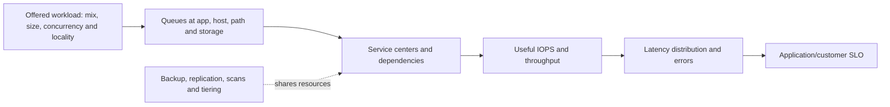

### Core equations as orientation

For comparable completed operations:

$$\text{Throughput} \approx \text{IOPS} \times \text{average I/O size}$$

Little's Law orientation for a stable bounded system:

$$L = \lambda W$$

where $L$ is average work in the system, $\lambda$ is average completion rate, and $W$ is average response time. This is not a tuning formula and does not replace distributions or stability checks.

### 🔍 Plain-English deep-dive: high utilization is not a guilty verdict

A busy restaurant can serve everyone quickly, while a half-busy restaurant can have one blocked kitchen station and long waits. **Why it matters:** prove a bottleneck through matching demand, queue/wait or backpressure, output plateau, tail/errors, and a controlled resource/load change that alters the customer outcome.

---

## 2. The performance evidence contract

Capture:

- Exact customer transaction, SLO, users, service, object, operation, error and interval.
- Workload fingerprint: read/write/metadata mix, I/O-size distribution, randomness, concurrency, locality, working set, burst, season.
- Application queue/spans, host CPU/cache/filesystem/device/MPIO evidence.
- Protocol operation/status, path/fabric loss, retransmission, RTT, MTU, congestion.
- ONTAP SVM, LIF/target, volume/LUN/workload, node CPU/cache/WAFL/CP, local tier/media/tier evidence.
- QoS policy group, floors/ceilings and competing workloads where applicable.
- Backup, replication, scans, efficiency, tiering and changes.
- Exact units, definitions, aggregation, sample count, gaps, clocks and transformations.
- Healthy controls and a comparable baseline.

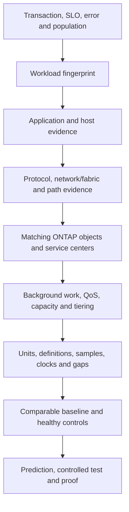

### Time and population alignment

Do not compare an application p99 for failed and successful transactions over 15 minutes to a storage average for all operations over one hour. Align transaction IDs or operation populations, objects, intervals, time zones, clock offsets, success/error filters, and aggregation.

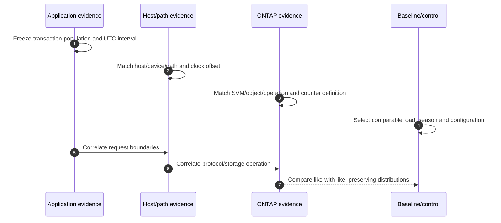

### 🔍 Plain-English deep-dive: correlation needs matching grains

Comparing citywide monthly rainfall to one driver's five-minute delay can create an impressive but meaningless chart. **Why it matters:** every join needs compatible identity, time, population and definition before temporal correlation can support a hypothesis.

---

## 3. Bottleneck proof and test design

### Bottleneck proof chain

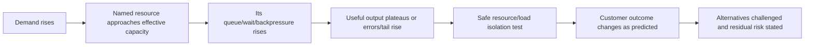

### Test card

| Field | Content |
|---|---|
| Question | Which hypothesis will the test distinguish? |
| Scope | Synthetic/lab/canary, objects, users, interval |
| Workload | Mix, size, concurrency, working set, background jobs |
| Variable | One intentional resource/load/path/policy change |
| Controls | Stable configuration and healthy comparison |
| Measures | Transaction p50/p95/p99/errors plus layer evidence |
| Safety | Authorization, data protection, stop/recovery, privacy |
| Proof | Predefined success, no-regression and observation window |

### Proof of improvement

Improvement is not `the graph went down`. Show comparable demand or normalization, customer SLO, distribution and errors, layer mechanism, no displaced bottleneck, protection/capacity effects, and sustained observation.

### 🔍 Plain-English deep-dive: removing one bottleneck can expose the next

Opening a narrow tollbooth can move the traffic jam to the next bridge. Performance systems behave the same way: a faster path may expose host CPU, target queue, media, application locking, or capacity pressure. **Why it matters:** validate the whole customer transaction, neighboring workloads, protection deadlines, capacity and the new limiting resource instead of declaring success from one improved counter.

---

## 4. Fully synthetic sanitized scenario(s): application, host, protocol, and network cases 1-6

### Case 1 - Application queue rises before storage calls

**Symptom/scope:** Synthetic order p99 rises from 400 ms to 4 s; storage operation latency rises later during the burst.

| Competing hypothesis | Prediction | Decisive evidence/test |
|---|---|---|
| Application worker queue is trigger | Queue rises before calls; canary worker scheduling changes app p99 without storage change | Transaction spans and controlled app canary |
| Storage service is trigger | Matching storage operation tail rises before app queue | Aligned object/operation distribution |
| Database lock contention | Wait type/lock precedes storage call | DB/app wait evidence |

```mermaid
timeline
    title Synthetic application-to-storage timing
    10:00 : Transaction p99 begins rising
    10:00:20 : Application worker queue grows
    10:00:55 : Storage request rate rises
    10:01:10 : Storage average/tail rises modestly
    10:05 : Controlled app canary reduces queue and transaction p99
```

**Synthetic conclusion/proof:** app queue is supported for this workload; storage response is downstream under increased burst demand. The claim is not generalized to every peak.

### Case 2 - Host CPU and cache behavior mimic storage latency

**Symptom/scope:** One VM reports high file-read latency while peer VMs and ONTAP object latency remain baseline.

| Competing hypothesis | Prediction | Evidence/test |
|---|---|---|
| Host CPU scheduling delay | Process waits before issuing/handling I/O | Host run queue, CPU steal/scheduling and request timestamps |
| Host cache miss working set | More device reads and colder response after restart | Cache hit/miss and device request volume |
| Storage path issue | Device/path latency and retries rise | Host path plus network/target evidence |

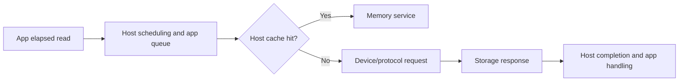

**Synthetic conclusion/proof:** CPU scheduling delay explains the client-target gap; moving the test process to a control VM normalizes elapsed latency with unchanged storage service.

### Case 3 - Metadata protocol operations dominate

**Symptom/scope:** Directory traversal is slow while large-file sequential reads are normal.

| Competing hypothesis | Prediction | Evidence/test |
|---|---|---|
| High metadata operation count/small I/O | LOOKUP/GETATTR/CREATE or SMB CREATE/query dominates | Protocol operation mix and file-count control |
| Identity lookup delay | Name/group resolution aligns per file/request | Name-service timing/cache evidence |
| Media throughput bottleneck | Bulk read should also degrade | Bulk-read control and local-tier evidence |

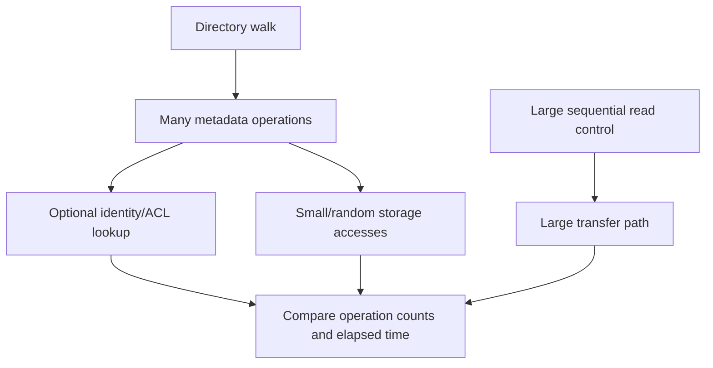

**Synthetic conclusion/proof:** operation amplification and identity lookup explain elapsed time; media throughput is healthy. A synthetic reduced-file-count control scales near operation count.

### Case 4 - Packet loss and retransmission inflate tail latency

**Symptom/scope:** One routed iSCSI/NFS path has intermittent p99 spikes; average RTT is normal.

| Competing hypothesis | Prediction | Evidence/test |
|---|---|---|
| Path-specific loss/retransmission | Tail aligns with missing sequence/retransmit on affected flows | Both-direction packet and interface-drop evidence |
| Target tail latency | Target completion rises before retransmission | Matching operation timestamps |
| Host timeout/retry policy | App tail follows host retry independent of network loss | Host path events and controls |

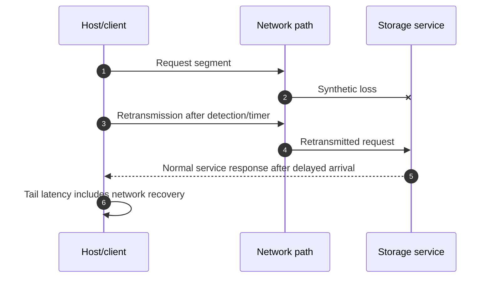

**Synthetic conclusion/proof:** path loss precedes delayed storage arrival; storage service after arrival remains baseline. Routing a synthetic canary through a healthy path removes the tail without storage change.

### Case 5 - MTU mismatch hurts large transfers

**Symptom/scope:** Small requests work; large throughput tests stall or fragment on one network path.

| Competing hypothesis | Prediction | Evidence/test |
|---|---|---|
| End-to-end MTU inconsistency | Failure begins above path size; fragmentation/feedback evidence | Bounded size sweep and both-direction trace |
| TCP window/receiver limitation | Throughput tracks window/RTT without size cliff | TCP flow-control evidence |
| Storage throughput ceiling | All paths and sizes plateau at same storage output | Matching storage throughput/service evidence |

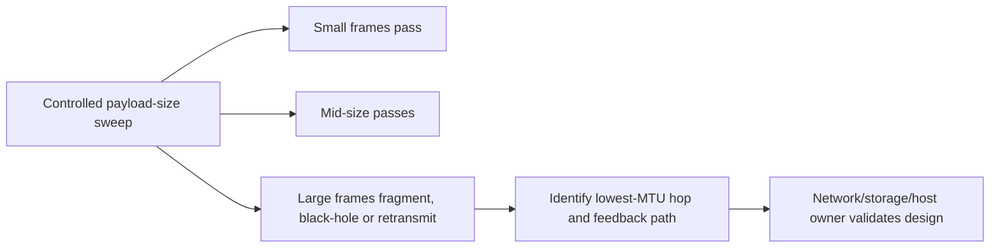

**Synthetic conclusion/proof:** a single hop has lower MTU and feedback is filtered. No endpoint-only jumbo change is recommended.

### Case 6 - One path carries most traffic

**Symptom/scope:** Aggregate throughput is below expectation; one path saturates while peers appear idle.

| Competing hypothesis | Prediction | Evidence/test |
|---|---|---|
| Hash/policy keeps flows on one path | Per-flow selection stable despite several links | Flow-to-link mapping and MPIO/LACP/SMB policy |
| Other paths non-optimized/unavailable | State shows ineligible or non-preferred paths | ALUA/ANA/channel/path evidence |
| Application uses one serial flow | Additional path cannot help without concurrency | Workload concurrency and flow count |

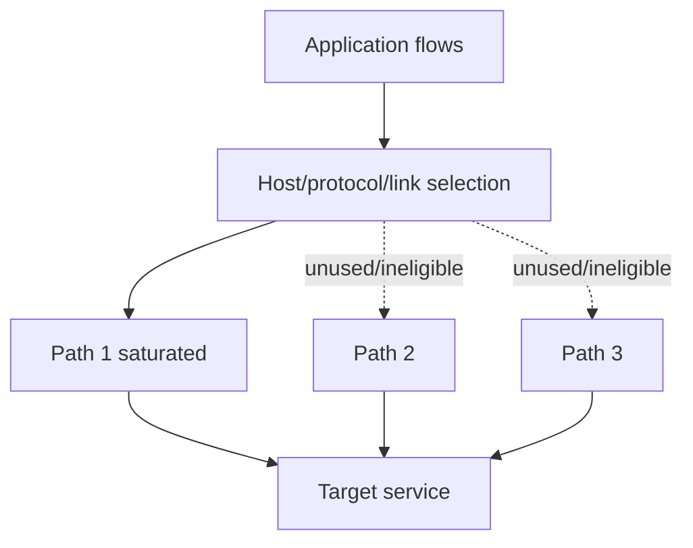

**Synthetic conclusion/proof:** one serial flow and stable hashing make one path the effective ceiling. A safe multi-flow synthetic control uses more links and raises aggregate throughput; the application design remains the decision context.

---

## 5. Fully synthetic sanitized scenario(s): ONTAP CPU, cache, CP, disk, and tier cases 7-10

### Case 7 - High node CPU is correlated but not limiting

**Symptom/scope:** Node CPU reads 85% during a workload peak; customer latency remains within SLO.

| Competing hypothesis | Prediction | Evidence/test |
|---|---|---|
| CPU is bottleneck | CPU queue/wait rises, output plateaus, latency/errors rise; load reduction changes outcome | CPU/service/throughput/tail and controlled demand |
| CPU reflects useful work | Throughput scales, queues/tails remain controlled | Output and service-center evidence |
| One core/service is constrained under average | Specific service queue/tail grows despite node average | More granular supported counters |

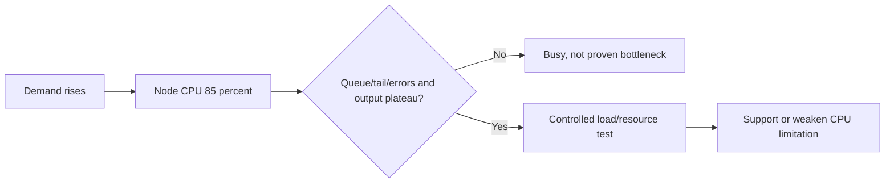

**Synthetic conclusion/proof:** output scales and SLO holds; CPU is a capacity watch signal, not an incident cause. Recommendation is trend/headroom review, not tuning from one threshold.

### Case 8 - Cache working-set change raises read latency

**Symptom/scope:** Read latency increases after a batch begins scanning a much larger dataset.

| Competing hypothesis | Prediction | Evidence/test |
|---|---|---|
| Working set exceeds effective cache | Cache hit behavior changes; media reads rise | Workload locality/working-set and cache/media evidence |
| Media degraded | Service time/errors rise independent of cache pattern | Disk/media health and control workload |
| FabricPool cold recall | Object-tier reads/recall align with cold blocks | Tier-specific operation and latency evidence |

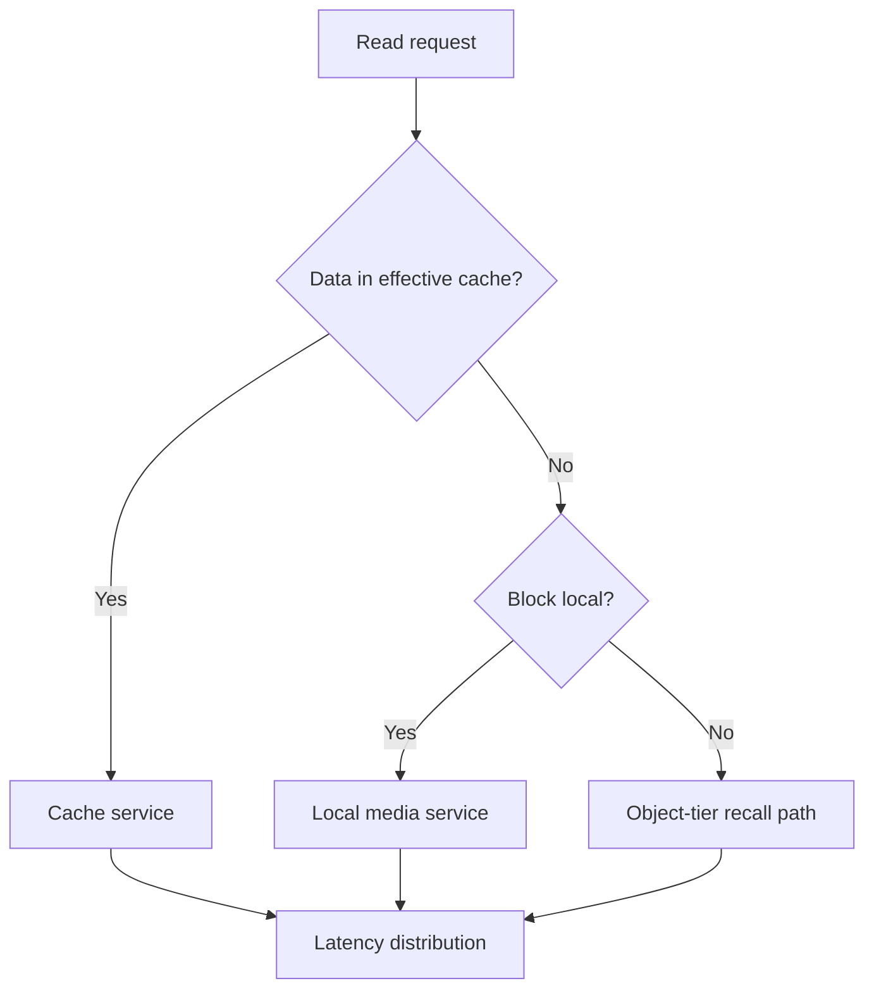

**Synthetic conclusion/proof:** a larger low-locality scan reduces hits and increases local-media reads; the media remains healthy. Returning to the comparable working set restores the prior distribution.

### Case 9 - Consistency-point pressure follows bursty writes

**Symptom/scope:** Write latency tails rise during a burst; consistency-point (CP) activity and dirty data increase.

| Competing hypothesis | Prediction | Evidence/test |
|---|---|---|
| Bursty write demand creates CP/backpressure | Write burst precedes dirty/CP pressure and latency; smoothing alters tail | Workload/CP/latency chronology and synthetic shaping |
| Disk/local-tier service limits CP completion | CP duration/queue aligns with media service saturation | Local-tier/media service evidence |
| CPU limits WAFL work | Relevant CPU/service queue rises with plateau | Supported service-center counters |

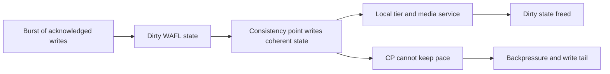

**Synthetic conclusion/proof:** burst rate, not daily average, temporarily exceeds CP/local-tier service. A synthetic rate-smoothed control lowers tail while total bytes remain comparable. Any production workload/QoS action requires application and storage owners.

### Case 10 - FabricPool recall storm after cold-data scan

**Symptom/scope:** A synthetic compliance scan reads cold files; latency and external-tier traffic rise.

| Competing hypothesis | Prediction | Evidence/test |
|---|---|---|
| Cold blocks recall from object tier | Recall/object operations align by file/time; repeated warm read improves | Tier evidence and warm/cold control |
| Local media saturation | Local service queue rises without object-tier dependency | Local-tier counters |
| Network path to object store impaired | Object operations show path loss/high RTT/errors | External path and service evidence |
| Scanner concurrency too high | Reducing scan concurrency lowers queues/tail | Approved synthetic concurrency sweep |

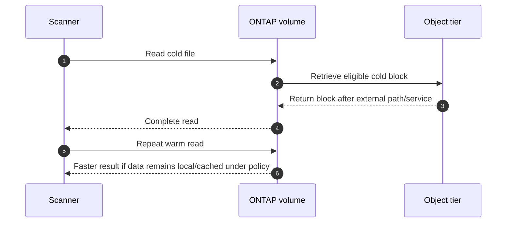

**Synthetic conclusion/proof:** cold recall plus aggressive scanner concurrency explains tail. The recommendation compares schedule/concurrency, tier policy, economics, and compliance needs; it does not disable tiering from one event.

### 🔍 Plain-English deep-dive: cache and tiering move work; they do not erase it

A pantry serves common ingredients quickly, while uncommon items require a trip to a warehouse. A larger scan can empty the pantry advantage and create warehouse traffic. **Why it matters:** describe working set, locality, hot/cold state, cache/tier hit behavior and external dependencies rather than calling the platform unpredictably slow.

---

## 6. Fully synthetic sanitized scenario(s): QoS, contention, background work, capacity, tails, and throughput cases 11-18

### Case 11 - QoS ceiling caps throughput

**Symptom/scope:** One workload plateaus at a repeatable IOPS/throughput level while latency rises under added demand.

| Competing hypothesis | Prediction | Evidence/test |
|---|---|---|
| QoS maximum/ceiling is binding | Output plateaus near policy behavior; QoS delay evidence rises | Policy membership, current docs and workload evidence |
| Media capacity limit | Shared local-tier queue affects other workloads | Resource and control workload evidence |
| Host/application concurrency limit | Offered demand does not actually increase | Host outstanding I/O and application queue |

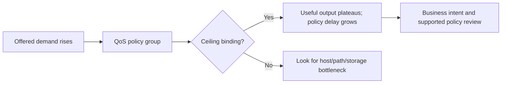

**Synthetic conclusion/proof:** policy is intentionally limiting a batch workload. The issue is expectation/requirement alignment, not automatically a fault. Any change considers neighbor protection and business owner approval.

### Case 12 - Noisy neighbor harms a critical workload

**Symptom/scope:** Critical workload p99 rises only when a synthetic analytics job runs on a shared resource.

| Competing hypothesis | Prediction | Evidence/test |
|---|---|---|
| Shared-resource contention | Victim and competitor share queue/service; separation changes victim p99 | Per-workload/resource timeline and controlled separation |
| Victim demand changed independently | Victim fingerprint shifts before competitor | Workload fingerprint |
| Network path shared bottleneck | Both workloads' path queues/loss align | Flow/link evidence |

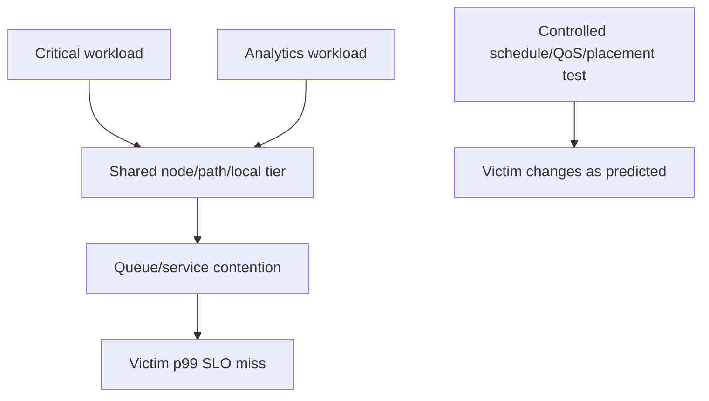

**Synthetic conclusion/proof:** scheduling the analytics control outside the peak restores victim p99 with comparable victim demand. Options include scheduling, QoS, placement, app concurrency or capacity; no universal QoS value is prescribed.

### Case 13 - Backup overlaps the business peak

**Symptom/scope:** Host/app latency rises nightly when backup snapshot/catalog/data movement begins.

| Competing hypothesis | Prediction | Evidence/test |
|---|---|---|
| Backup workload consumes shared host/path/storage resource | Overlap aligns; non-overlap control differs | Backup phase and layer counters |
| Snapshot creation itself causes all delay | Spike only at snapshot point, not long data movement | Phase-specific timeline |
| Business workload seasonality | Peak occurs even without backup | Comparable no-backup day/control |

```mermaid
timeline
    title Synthetic backup overlap
    22:00 : Business batch begins
    22:05 : Snapshot coordination
    22:07 : Backup data movement starts
    22:10 : Shared path and host queue rise
    22:12 : Application p99 misses SLO
    23:00 : Backup ends and backlog drains
```

**Synthetic conclusion/proof:** long data movement, not the snapshot instant alone, overlaps the batch and path queue. A schedule-shift simulation preserves backup success and improves app SLO; recovery objectives remain a decision constraint.

### Case 14 - Replication update competes with foreground traffic

**Symptom/scope:** Foreground latency rises during catch-up replication after an outage.

| Competing hypothesis | Prediction | Evidence/test |
|---|---|---|
| Replication uses shared source/destination/network resources | Transfer rate and shared queues align with victim | Relationship phase and resource evidence |
| Foreground burst alone | Similar burst without replication has same tail | Baseline/control window |
| Destination capacity/health slows transfer and prolongs overlap | Transfer service/backlog and destination state align | Both-end relationship/capacity evidence |

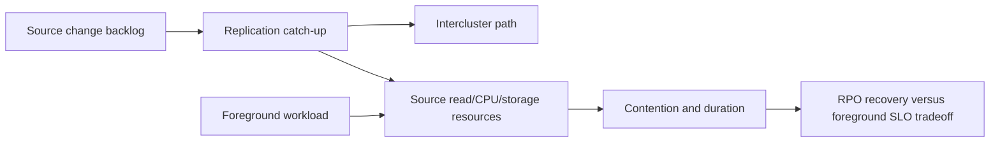

**Synthetic conclusion/proof:** catch-up shares source resources and extends into the peak. Any throttling/schedule/priority decision balances current SLO against RPO and is owned by continuity/application/storage authorities.

### Case 15 - Low capacity headroom degrades operations

**Symptom/scope:** Latency and background work rise as local capacity approaches an operational threshold.

| Competing hypothesis | Prediction | Evidence/test |
|---|---|---|
| Low headroom increases housekeeping/placement pressure | Free-space state and relevant background work align | Typed capacity and operation evidence |
| Snapshot growth drives physical consumption | Snapshot/changed-block growth precedes threshold | Snapshot/volume/local-tier ladder |
| Efficiency changed with data mix | Logical/physical relationship shifts | Measured data segments and efficiency scope |
| Performance issue unrelated to capacity | Same symptom on high-headroom control | Control object/resource evidence |

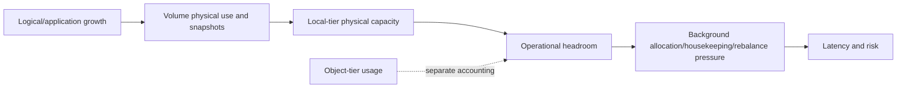

**Synthetic conclusion/proof:** snapshot change rate consumes local physical headroom and correlates with operational pressure. Capacity remediation needs typed accounting, protection retention, forecast and owner; deleting recovery points is not an exploratory performance test.

### Case 16 - Throughput is low because I/O is small and serial

**Symptom/scope:** Customer expects high MB/s but application issues one small random I/O at a time.

| Competing hypothesis | Prediction | Evidence/test |
|---|---|---|
| I/O size and concurrency limit throughput | Throughput follows IOPS x size; safe concurrency sweep raises output until knee | Workload fingerprint and synthetic sweep |
| Storage bandwidth limit | Larger/more concurrent control still plateaus at same resource | Resource output/queue evidence |
| Network limit | Link throughput/queue approaches capacity | Flow/link evidence |

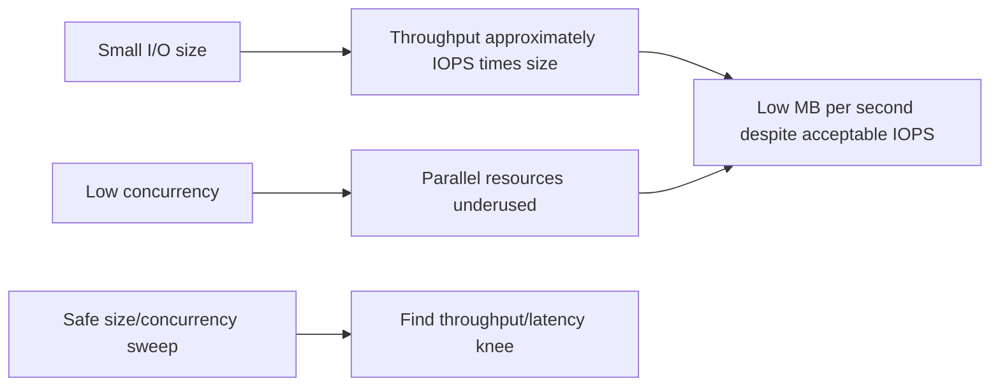

**Synthetic conclusion/proof:** workload semantics, not array bandwidth, explain output. A synthetic concurrency sweep raises throughput until tail rises; application consistency and latency requirements constrain any real change.

### Case 17 - Average latency hides a timeout-driving tail

**Symptom/scope:** Mean storage latency is 3 ms, but 1% of operations exceed an application timeout boundary.

| Competing hypothesis | Prediction | Evidence/test |
|---|---|---|
| One path/object/operation creates tail | Slow samples cluster by identity | Distribution segmented by path/object/operation |
| Interval aggregation artifact | Raw histogram differs from mean of means | Sample-weighted reconstruction and definitions |
| Application queue creates tail before storage | App elapsed tail lacks matching storage operation tail | Transaction-to-operation correlation |

```mermaid
flowchart TB
    OPS[Operation population] --> P50[p50: common case]
    OPS --> P95[p95: elevated]
    OPS --> P99[p99: tail]
    OPS --> ERR[Timeouts/errors]
    P99 --> SEG[Segment by path, object, operation and time]
    MEAN[Mean 3 ms] -.can hide.-> P99
```

**Synthetic conclusion/proof:** tail clusters on one path during credit starvation; global average is non-diagnostic. Path repair validation requires p99/errors and application timeout outcome, not mean alone.

### Case 18 - Seasonal peak is mistaken for a regression

**Symptom/scope:** Month-end throughput and CPU exceed last week's values after a release, prompting a regression claim.

| Competing hypothesis | Prediction | Evidence/test |
|---|---|---|
| Seasonal workload mix/volume changed | Comparable prior month-end resembles current behavior | Season-matched baseline and fingerprint |
| Release regression | Same workload/control performs worse after change | A/B or canary with exact version and demand normalization |
| Capacity trend reduced headroom | Month-end grows over several cycles | Longitudinal normalized trend |

```mermaid
flowchart LR
    CURRENT[Current month-end after release] --> COMPARE{Choose baseline}
    WEEK[Ordinary prior week] --> BAD[Invalid seasonal comparison]
    PRIOR[Prior month-end, comparable workload] --> GOOD[Valid starting comparison]
    GOOD --> NORM[Normalize mix, volume, concurrency and config]
    NORM --> TEST[Version canary or controlled analysis]
```

**Synthetic conclusion/proof:** normalized current and prior month-end are similar; weekly baseline caused the false regression. Capacity growth remains a separate forecast risk.

---

## 7. Cross-case matrix: symptom to proof

| Signal | It may mean | It does not prove | Required proof |
|---|---|---|---|
| High app latency | App queue, host, path, storage, dependency | Storage cause | First wait boundary and matching transaction |
| High CPU | Useful work or bottleneck | Saturation | Queue/output/tail and response to test |
| Low cache hit | Working-set/locality shift | Bad cache or media failure | Demand, media/tier service and control |
| CP activity | Normal persistence or pressure | CP is cause | Dirty/write chronology, CP/local-tier service, backpressure |
| High disk/local-tier use | Busy service | Bottleneck | Queue/service/output plateau/tail/test |
| Retransmissions | Loss/reordering/recovery | Network caused all delay | Flow-specific temporal impact |
| QoS plateau | Intended policy or other ceiling | Fault | Policy membership/delay and offered demand |
| Background overlap | Shared demand | Background job is wrong | Shared resource, control schedule and business objectives |
| Low free capacity | Risk/housekeeping context | Immediate latency cause | Typed headroom, mechanism and controlled evidence |
| Better after change | Correlation with recovery | Root cause or durable improvement | Comparable load, mechanism, no regressions, observation |

```mermaid
flowchart LR
    SIGNAL[Counter or symptom] --> DEF[Object, unit, definition, interval]
    DEF --> BASE[Comparable baseline and control]
    BASE --> HYP[Competing mechanisms]
    HYP --> PRED[Predictions at each layer]
    PRED --> TEST[Safe discriminating test]
    TEST --> PROOF[Customer SLO plus mechanism and no regression]
```

---

## 8. Safe performance-testing boundary

### Safe sequence

1. Define transaction/SLO and baseline before collecting broad counters.
2. Start read-only and preserve production demand rather than generating extra load.
3. Use synthetic/lab replay or a customer-approved canary for experiments.
4. Change one variable and predefine stop/recovery criteria.
5. Protect application consistency, data, capacity, protection windows, and neighbors.
6. Validate current supportability and exact counter definitions.
7. Use application, host, network/fabric, storage, continuity, capacity, and Support owners.
8. Prove improvement at customer and layer levels across a representative window.

```mermaid
flowchart TD
    OBS[Read-only production observation] --> MODEL[Workload, baseline and hypotheses]
    MODEL --> LAB[Synthetic/lab test]
    LAB --> CANARY{Approved canary needed?}
    CANARY -->|No| REC[Write bounded recommendation]
    CANARY -->|Yes| SAFE[Owner, support, scope, stop/recovery]
    SAFE --> RUN[One-variable test]
    RUN --> PROOF[SLO, distribution, mechanism and no-regression proof]
```

### Never use as exploratory shortcuts

- Run an uncontrolled benchmark or load generator against production.
- Raise/lower QoS, queues, timeouts, concurrency, cache, MTU, tiering, schedules, or data placement without owner and supportability.
- Delete snapshots, disable protection, stop replication/backup, or consume reserve capacity merely to test latency.
- Force failover, move workloads/LIFs/volumes, reset paths, or change firmware as a performance probe.
- Compare unlike time windows, average percentiles, omit errors, or hide data gaps.
- Promise a performance result from a synthetic model or marketing specification.

---

## 9. Arti transfer/honesty and JD Mapping

```mermaid
flowchart LR
    MBA[MBA analytics, statistics and forecasting] --> QUALITY[Units, distributions, baselines and uncertainty]
    PBI[Excel, Power BI, SQL and Python] --> CORR[Time-aligned multi-source analysis]
    ESC[Microsoft escalations] --> HYP[Layer hypotheses and controlled evidence]
    NET[Azure/Windows networking] --> PATH[Loss, retransmission, MTU and route reasoning]
    QUALITY --> TRANS[Transferable performance method]
    CORR --> TRANS
    HYP --> TRANS
    PATH --> TRANS
    TRANS --> GAP[Production ONTAP counter/tuning experience remains a gap]
```

| JD responsibility | Part 76 capability | Honest evidence/boundary |
|---|---|---|
| Analyze/report customer data | Grains, baselines, time alignment, distributions | Strong analytics background |
| Mitigate stability risk | Bottleneck proof and safe tests | No ONTAP production tuning claim |
| Storage depth | CPU/cache/CP/local tier/FabricPool/QoS scenarios | Conceptual/synthetic evidence |
| Customer reviews | SLO, trends, proof and residual risk | Existing review/communication strength |
| Cross-functional troubleshooting | App/host/network/storage owner model | Microsoft production escalation experience |
| Recommendations | Options, controlled validation, no-regression proof | Method transfers; values remain environment-specific |

### Honest interview wording

> `I define the customer transaction and SLO, fingerprint the workload, align application, host, path and storage evidence by object, operation and time, compare a valid baseline and healthy control, then test competing hypotheses. I call a bottleneck only when demand, queue/backpressure, output plateau or tail/errors and a controlled change support it. My analytics and Microsoft escalation experience transfer strongly; I have not tuned production ONTAP, so counters and actions require current NetApp sources and qualified owners.`

---

## 10. Labs, drills, and self-test

### Scenario lab

```mermaid
flowchart LR
    SELECT[Work all 18 synthetic cases] --> SLO[Define transaction, SLO and workload]
    SLO --> ALIGN[Align object, operation, population and clocks]
    ALIGN --> BASE[Choose comparable baseline/control]
    BASE --> HYP[At least three layer hypotheses]
    HYP --> TEST[One safe discriminating test]
    TEST --> PROOF[Customer and mechanism proof]
    PROOF --> REVIEW[Peer challenge and exact Q1-Q8 aloud]
```

### Required drills

1. Explain IOPS, throughput, latency, queue, utilization and percentiles with units.
2. Reject three invalid correlations caused by mismatched grains.
3. Prove or disprove CPU, disk/local-tier and network bottlenecks.
4. Separate app/host elapsed latency from storage service latency.
5. Diagnose cache/working-set and FabricPool recall cases.
6. Explain CP pressure without treating every CP as abnormal.
7. Test QoS ceiling and noisy-neighbor hypotheses safely.
8. Balance backup/replication protection objectives against foreground SLO.
9. Build typed capacity/performance mechanism and season-matched baseline.
10. Write proof of improvement with no-regression and residual risk.

### Self-test

1. Define every core metric and why it is insufficient alone.
2. Build a workload fingerprint.
3. Align application, host, network, ONTAP and background evidence.
4. Explain bottleneck proof and Little's Law limits.
5. Diagnose tail latency hidden by averages.
6. Explain CPU/cache/CP/local-tier/media/tier dependencies.
7. Diagnose loss/retransmission/MTU/path imbalance.
8. Explain QoS, noisy neighbor, backup and replication overlap.
9. Prove improvement across comparable demand and representative time.
10. State safe-testing, privacy, current-source and experience boundaries.

### Lab pass checklist

- [ ] All 18 cases have symptom/scope, controls, hypotheses, evidence/test, bounded conclusion, and proof.
- [ ] Application, host, protocol, network/fabric, ONTAP and media/tier layers are covered.
- [ ] Latency, p50/p95/p99, errors, IOPS, throughput, I/O size, concurrency, queue and utilization are explicit.
- [ ] CPU, cache, CP, local tier/media, FabricPool, QoS and capacity mechanisms are covered.
- [ ] Loss, retransmission, MTU and path imbalance are covered.
- [ ] Noisy neighbor, backup and replication overlap are covered.
- [ ] Every analysis uses matching object, operation, population, interval, units and clocks.
- [ ] Baselines match season, workload and configuration.
- [ ] Bottleneck claims require queue/backpressure, output/tail and controlled response.
- [ ] Improvement proof includes SLO, distribution, errors, mechanism, no regression and observation window.
- [ ] No unsafe production load, tuning, protection, capacity, path, failover or firmware action is proposed.
- [ ] All metrics, systems, sources and outcomes are fully synthetic and sanitized.
- [ ] No production ONTAP performance/tuning experience is claimed.
- [ ] Exact Q1-Q8 are answered aloud.

---

## 11. Official and Public Source Anchors

**Date checked: 2026-08-24.** Public sources anchor current concepts and navigation. Exact release, object, counter/API definition, authorized customer telemetry, and qualified owners govern live analysis.

| Topic | Official/public source | Bounded use |
|---|---|---|
| ONTAP performance | [ONTAP performance administration](https://docs.netapp.com/us-en/ontap-performance-admin/) | Current investigation and management navigation |
| Performance workflow | [Identify and resolve performance issues](https://docs.netapp.com/us-en/ontap/performance-admin/identify-resolve-issues-workflow-task.html) | Public workflow orientation; exact release/tool required |
| REST metrics | [Access performance metrics with ONTAP REST](https://docs.netapp.com/us-en/ontap-automation/rest/performance_metrics.html) | Current object/IOPS/latency/throughput categories and release availability |
| REST reference | [ONTAP REST API reference](https://docs.netapp.com/us-en/ontap-restapi/) | Exact current resources, fields, units, pagination and errors |
| QoS | [ONTAP QoS throughput guarantees](https://docs.netapp.com/us-en/ontap/performance-admin/guarantee-throughput-qos-task.html) | Current policy concepts and support notes; no value prescribed |
| Workload/QoS workflow | [ONTAP storage QoS workflow](https://docs.netapp.com/us-en/ontap/performance-admin/qos-workflow-concept.html) | Public monitoring-to-policy orientation |
| FabricPool | [ONTAP FabricPool management](https://docs.netapp.com/us-en/ontap/fabricpool/) | Current tiering, monitoring, recall, protection and operations context |
| Capacity/volumes | [ONTAP volume administration](https://docs.netapp.com/us-en/ontap/volumes/) | Current volume space, snapshots, autosize and efficiency context |
| Data protection | [ONTAP data protection and disaster recovery](https://docs.netapp.com/us-en/ontap/data-protection-disaster-recovery/) | Current backup/replication context; recovery objectives remain customer-owned |
| Network | [ONTAP network management](https://docs.netapp.com/us-en/ontap/network-management/) | Current LIF, route, MTU and network context |

### Source-use discipline

- Record exact counter/API source, object, operation, unit, aggregation, interval, sample count, gaps, release and date.
- Do not translate public examples into universal thresholds or guarantees.
- Keep customer telemetry, workload identity, business peaks, capacity, topology and cases restricted.
- Validate current ONTAP, IMT/HWU, host, network, application and protection context before action.
- Use customer/application/continuity and qualified Support owners for live tests or changes.

---

## Likely Interview Questions

### Q1. How do you structure a performance investigation?

> **Model answer:** `I define the customer transaction, SLO, users, errors and interval; map app, host, path, protocol, ONTAP object and media/tier; fingerprint mix, size, concurrency, locality, working set, burst and background work; align identities, clocks, units and populations; compare a valid baseline/control; then test competing hypotheses with one safe variable and prove improvement at customer and mechanism levels.`

### Q2. What proves a bottleneck?

> **Model answer:** `Demand must rise toward a named resource's effective capacity, its queue/wait or backpressure must grow, useful output should plateau or tail/errors should worsen, and a safe resource or load isolation should change the customer outcome as predicted. High utilization, CPU, queue or latency alone is not enough, and the bottleneck can move.`

### Q3. How do you avoid false correlation across tools?

> **Model answer:** `I align stable object and path identities, exact operations, success/error populations, UTC windows and clock offsets, units, aggregation, sample count and gaps. I do not compare app p99 with storage all-operation average, average percentiles, or join unlike seasonal loads. I preserve contradictory controls and counter definitions.`

### Q4. How do cache, CP, local media, and FabricPool affect latency?

> **Model answer:** `A cache hit avoids lower service; a miss may read local media or recall a cold block from object tier. Bursty writes create dirty WAFL state that consistency points persist through local-tier/media service; if service cannot keep pace, backpressure can raise tails. I correlate working set, locality, hit/miss, CP/dirty state, local service and tier operations before assigning cause.`

### Q5. How do you diagnose network loss, MTU, and path imbalance?

> **Model answer:** `I use both-direction flow and interface evidence to show loss/retransmission precedes delay for affected operations; run a bounded size comparison for an MTU cliff and feedback path; and map flow, hashing, MPIO/ALUA/ANA or SMB channels to physical paths. Several visible links do not guarantee independent or balanced use.`

### Q6. How do QoS and noisy neighbors change your reasoning?

> **Model answer:** `For QoS I prove policy membership, offered demand, output plateau and policy delay before calling the ceiling binding. For a noisy neighbor I map victim and competitor to a shared resource, hold victim demand comparable, and use scheduling, placement or a documented policy canary to see whether victim p99 changes. I preserve both workloads' objectives.`

### Q7. How do you prove a performance improvement?

> **Model answer:** `I compare equivalent demand, workload mix, season and configuration; show transaction SLO, p50/p95/p99 and errors improve; show the predicted layer queue/service mechanism changes; confirm throughput/capacity/protection and neighbors do not regress; observe across a representative window; and state residual risk and rollback or reopen triggers.`

### Q8. What experience transfers, and what remains your gap?

> **Model answer:** `My MBA analytics, statistics, Excel, Power BI, SQL, Python, Microsoft escalation and networking experience give me strong baseline, data-quality, distribution and cross-layer hypothesis skills. I have not analyzed or tuned production ONTAP performance, so these metrics are synthetic and live counters/actions require exact current NetApp definitions and qualified owners.`

---

## 30-Second Memory Hooks

- **Performance:** Demand -> queue -> service -> output -> latency/errors -> SLO.
- **IOPS:** Operations per second; **throughput:** bytes per second.
- **Latency:** Name start/end and preserve the distribution.
- **Tail:** p99 can hurt while mean smiles.
- **Baseline:** Compare Tuesday 8 a.m. with Tuesday 8 a.m.
- **Grain:** Same object + operation + population + time + units.
- **Bottleneck:** Demand, queue, plateau/tail and controlled response.
- **CPU:** Busy is not convicted.
- **Cache:** Working set and locality decide the pantry benefit.
- **CP:** Persistence work; pressure only when service cannot keep pace.
- **FabricPool:** Cold recall adds an external service path.
- **Loss:** Prove flow-specific temporal impact, not any dropped packet.
- **MTU:** End-to-end size contract.
- **QoS:** Policy may be intentionally protecting another outcome.
- **Noisy neighbor:** Shared resource + victim harm + separation proof.
- **Background work:** Balance protection objective and foreground SLO.
- **Capacity:** Typed headroom plus mechanism, not a red gauge.
- **Improvement:** Customer SLO + mechanism + no regression + time.
- **Arti boundary:** Analytics transfers; production ONTAP tuning does not.

---

## Completion Checklist

- [ ] Define exact transaction, SLO, users, errors, interval and business impact.
- [ ] Fingerprint operation mix, I/O size, concurrency, locality, working set, burst and seasonality.
- [ ] Map application, host, protocol, network/fabric, ONTAP, local tier/media and object tier.
- [ ] Align stable identities, operations, populations, clocks, units, intervals, samples and gaps.
- [ ] Use a comparable baseline and healthy controls.
- [ ] Preserve p50/p95/p99, errors and counts rather than averages alone.
- [ ] Require bottleneck proof, not high utilization or one graph.
- [ ] Cover all 18 app/host/network/ONTAP/media/QoS/background/capacity scenarios.
- [ ] Use one-variable synthetic/lab or approved canary tests with stop/recovery.
- [ ] Prove improvement at customer and mechanism levels with no regression.
- [ ] Revalidate exact release, counter/API definitions, supportability and owners.
- [ ] Avoid uncontrolled load, tuning, QoS, queue, timeout, MTU, tiering, protection, capacity, path, failover or firmware changes.
- [ ] Protect customer workload, telemetry, topology, business peaks and capacity data.
- [ ] Keep app, host, network/fabric, storage, continuity, capacity, customer and Support owners clear.
- [ ] Complete labs, drills, self-test and exact Q1-Q8 aloud.
- [ ] State the explicit no-production-NetApp boundary.

---

*Next suggested section:* [Part 77 - HA, Takeover/Giveback, Cluster Health, and Hardware-Failure Scenarios](Part-77-ha-cluster-hardware-scenarios.md)