# Part 77 - HA, Takeover/Giveback, Cluster Health, and Hardware-Failure Scenarios

> **Section goal:** Reason safely about ONTAP high availability (HA), cluster authority, path resilience, degraded hardware, environmentals, and field-replaceable-unit (FRU) work without equating current availability with full protection. By the end, Arti should be able to distinguish planned from unplanned takeover, validate giveback readiness, trace LIF and SAN path recovery, assess shelf/disk/port/interconnect failures, explain quorum and epsilon cautiously, identify common fate and degraded redundancy, coordinate power/cooling/FRU evidence, and escalate without improvising forced operations or physical replacement.

Covers index item **77** and maps directly to job-description responsibilities for storage depth, stability and risk mitigation, high-pressure coordination, hardware/lifecycle analysis, Support engagement, customer communication, and preventative recommendations.

**Explicit nonclaim:** Arti has not performed, approved, forced, monitored, or recovered a production ONTAP takeover/giveback, quorum event, LIF failover, shelf or disk repair, port change, environmental response, or NetApp FRU replacement.

**Privacy/access:** HA and hardware evidence can expose customer topology, serials, asset locations, platform models, cluster identity, IPs/WWPNs, cabling, slots, parts, firmware, support entitlement, environmental conditions, alarms, facility weaknesses, and maintenance plans. Use authorized minimum collection, approved secure channels, need-to-know access, redaction, retention, and qualified customer/facility/Support handling. Never publish real serials, site layouts, support outputs, or failure evidence in a portfolio.

**Synthetic-evidence rule:** Every customer, platform, node, cluster, port, disk, shelf, part, serial, sensor, event, metric, topology, version, action, owner, and outcome below is fictional and sanitized. No scenario represents a real NetApp failure, command output, service procedure, Hardware Universe result, Support case, or customer event.

**Version/current source caveat:** ONTAP HA behavior, takeover/giveback checks, quorum, epsilon, LIF policies, platform wiring, shelves, drives, ports, FRUs, firmware, service procedures, supportability, and environmental limits change by release and hardware. A **current-source check** means reopening exact current ONTAP, platform, Hardware Universe (HWU), Interoperability Matrix Tool (IMT), field-service, and authorized Support guidance for the precise system before action.

This Part is a reasoning casebook, not a NetApp internal service manual, command reference, takeover criterion, quorum procedure, FRU instruction, environmental limit, support commitment, or authorization to touch hardware or production state.

> **No-production-NetApp boundary:** Arti's factual strengths are Microsoft CRITSIT and enterprise support, high-availability concepts, Azure/VM/networking, incident communication, evidence correlation, vendor coordination, and risk tracking. Her exact nonclaim is: **she has not operated, repaired, or restored production NetApp HA, cluster, or hardware.** These scenarios demonstrate conceptual reasoning only.

---

## 1. HA protects service through controlled role transfer

| Term | Plain meaning | Analogy | Why it matters |
|---|---|---|---|
| **HA pair** | Two compatible partner nodes designed for storage failover | Two trained pilots | Partnership is specific, not every node with every other node |
| **Takeover** | One partner serves the other's storage/data processing under supported conditions | Copilot takes controls | Can be planned or response to failure |
| **Giveback** | Returned ownership/service from takeover node to recovered partner | Pilot resumes controls | Requires readiness and validation, not just power-on |
| **Degraded redundancy** | Service works but protection margin is reduced | Driving on the spare tire | Available now can still be high risk |
| **Quorum** | Voting authority needed for safe cluster decisions | Majority needed to open a vault | Prevents conflicting cluster authority |
| **Epsilon** | Additional voting weight assigned under ONTAP design | A tie-breaking vote | Not a magic availability switch |
| **FRU** | Field-replaceable unit serviced under exact procedure | Approved replaceable engine module | Physical fit does not prove compatibility or safe sequence |
| **Common fate** | Apparently redundant elements share one failure cause | Two lamps on one breaker | Redundancy count can overstate resilience |
| **Environmental** | Temperature, fan, power, voltage and facility conditions | Building life-support systems | Can threaten multiple components at once |

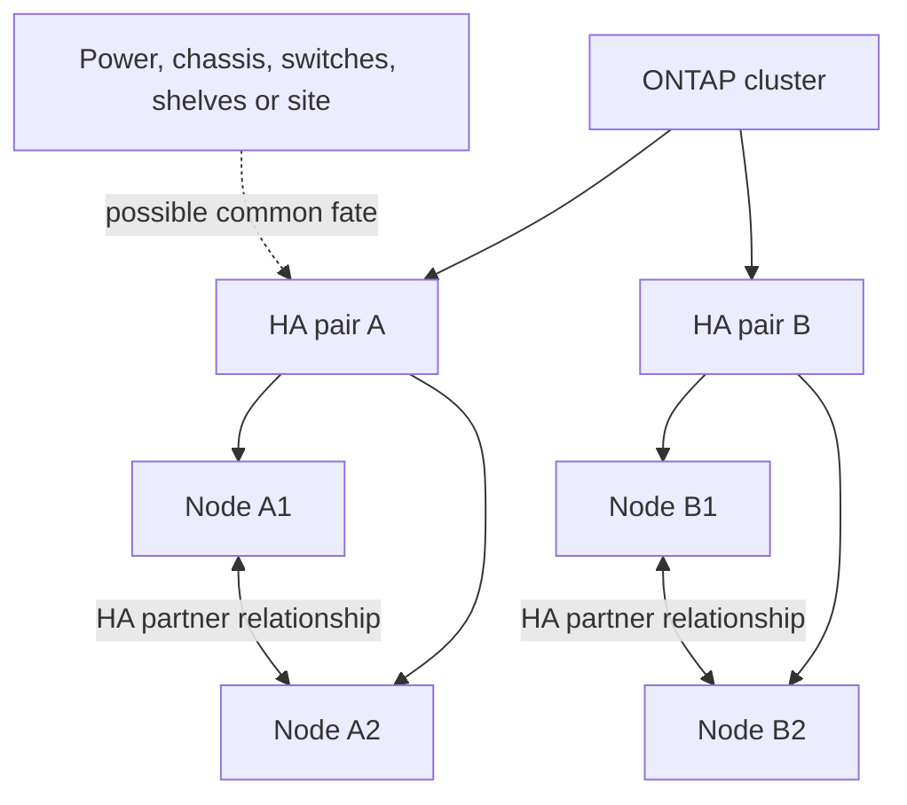

### Availability is multi-layered

Node health, cluster membership, HA readiness, storage paths, data LIFs/SAN target paths, protocol sessions, application transactions, and protection are separate. A successful takeover does not prove clients recovered; client recovery does not prove redundancy has returned.

### 🔍 Plain-English deep-dive: service restored is not resilience restored

A car on a spare tire can move, but it has lost its spare. **Why it matters:** communicate `service available, redundancy degraded` and track repair, monitoring, risk acceptance, and recovery validation rather than closing when traffic resumes.

---

## 2. The HA and hardware evidence contract

Capture exact:

- Customer service, data, protocol, affected population, SLO/RPO/RTO and current impact.
- Cluster/node/HA-pair identity, ONTAP release, platform/chassis and takeover/giveback state.
- Node health, reason/state, time, events, jobs, audit and Service Processor/BMC evidence.
- Cluster network, quorum/member view, epsilon orientation and partition topology.
- Storage ownership, shelf paths, adapters/ports, cabling, drives/partitions, RAID/local-tier state and spares.
- LIF home/current port, failover policy/group, routes/VLANs and client recovery.
- SAN target ports, host MPIO/ALUA/ANA paths and application state.
- Sensors, power supplies/feeds, fans, cooling, facility events and common fate.
- Exact FRU/part/slot/firmware/cabling identity and current HWU/platform procedure.
- Planned changes, owner, authority, stop/recovery, and customer validation.

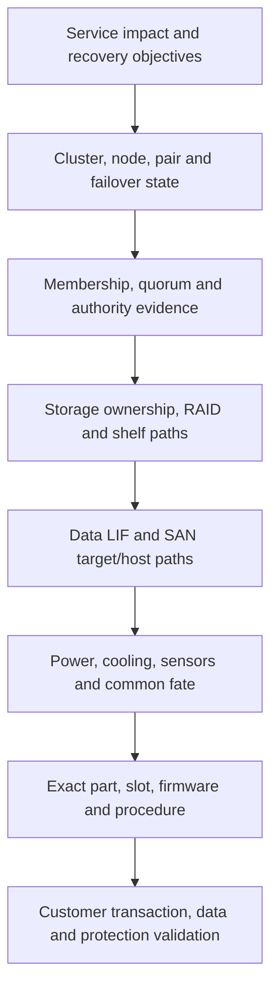

### Evidence before action

Never base takeover, giveback, epsilon, membership, shelf, disk, port, cabling, or FRU action on one alert or memory. Preserve exact current state and engage qualified Support before the state changes further when safety permits.

---

## 3. Planned versus unplanned response

| Dimension | Planned maintenance | Unplanned event |
|---|---|---|
| Objective | Prove readiness and move service within a window | Protect data/service and contain active risk |
| Evidence | Full baseline, supportability, client tests, rollback | Minimum volatile state plus rapid scope |
| Change | Approved sequence and stop gates | Emergency authority and bounded restoration |
| Communication | Maintenance milestones | Impact/cadence/uncertainty updates |
| Exit | Giveback and full redundancy validated | Stable service, degraded risk owned, repair plan |

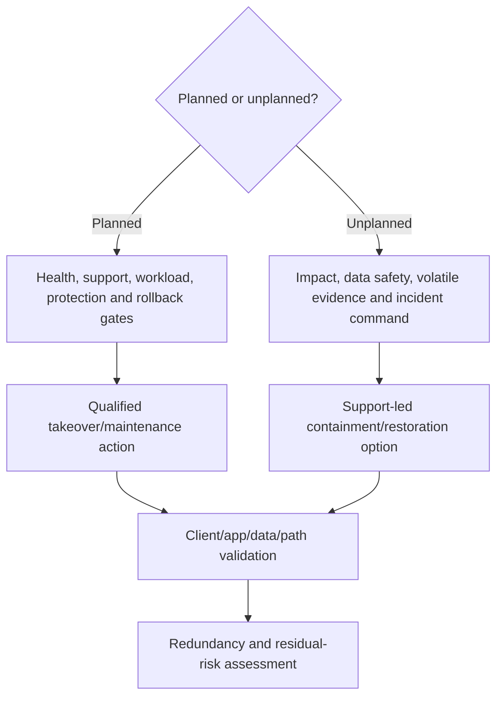

### 🔍 Plain-English deep-dive: planned takeover is a resilience test, not a checkbox

Moving controls in a flight simulator is useful only if instruments, crew, navigation, and landing are also tested. **Why it matters:** validate protocol sessions, LIF/target paths, application transactions, performance, protection, monitoring and giveback, not merely the storage state transition.

---

## 4. Fully synthetic sanitized scenario(s): takeover, giveback, and data-path cases 1-5

### Case 1 - Planned takeover readiness has hidden blockers

**Symptom/scope:** A synthetic maintenance window is approved, but one partner reports health warnings and the remaining node's workload headroom is uncertain.

| Competing hypothesis | Prediction | Decisive evidence |
|---|---|---|
| Partner cannot safely carry combined workload | Headroom/model predicts SLO risk | Comparable peak workload, node/service and capacity evidence |
| Warning is stale/non-blocking | Current state and official check show resolved condition | Exact event/current health and current procedure |
| Protection or backup dependency overlaps | Maintenance would collide with recovery objective | Protection jobs, RPO/RTO and schedule |
| Client path not resilient | Tests show one protocol population cannot recover | LIF/MPIO/session/application test plan |

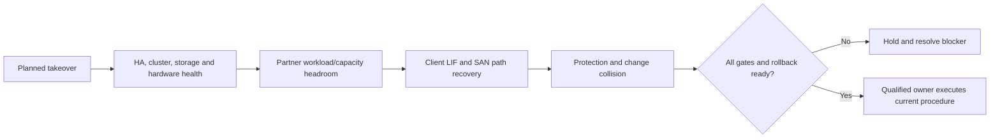

**Synthetic conclusion:** SAN control hosts have no validated surviving path through the partner-side target topology. The maintenance is postponed. **Boundary:** postponement is a success when readiness evidence fails.

### Case 2 - Unplanned takeover restores storage but app remains down

**Symptom/scope:** Partner takeover completes after a synthetic node loss; NFS/SMB/SAN storage state is available, but one application cannot transact.

| Competing hypothesis | Prediction | Evidence |
|---|---|---|
| Client/session/path recovery incomplete | Protocol clients show retry/reconnect failure | Client/session/LIF/MPIO evidence |
| Application dependency on failed management/identity node | Storage calls recover but app waits elsewhere | Application spans/dependency map |
| Takeover service degraded | Matching protocol/storage latency/errors remain high | ONTAP object/service evidence |

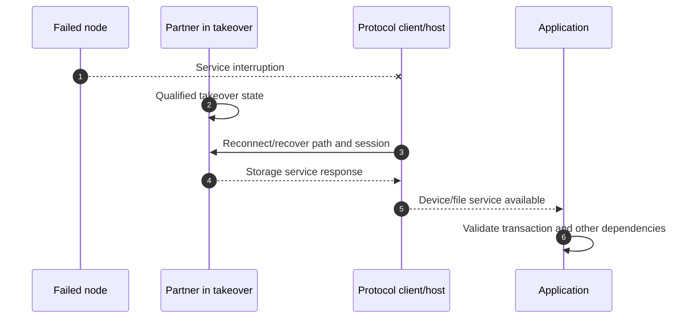

**Synthetic conclusion:** application identity service remains unavailable; takeover is technically successful but customer recovery is incomplete. **Lesson:** validate application-to-data, not array-only health.

### Case 3 - Giveback is requested while readiness is uncertain

**Symptom/scope:** Failed node is back online; stakeholders want immediate giveback to restore symmetry.

| Competing hypothesis | Prediction | Evidence |
|---|---|---|
| Original fault persists | Sensor/path/event recurs under current health check | Hardware/event/Support evidence |
| Giveback blockers protect consistency/readiness | Current checks identify explicit condition | Exact blocker and official procedure |
| Takeover node is overloaded, making delay risky | SLO/headroom worsens while waiting | Workload/capacity evidence |
| Client recovery cannot tolerate another transition | Test/known app behavior shows risk | Protocol/app recovery evidence |

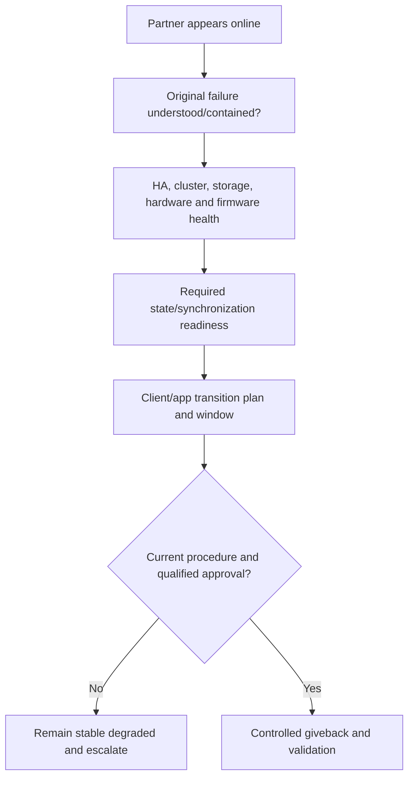

**Synthetic conclusion:** an environmental alarm remains active; service stays in takeover with monitored residual risk until facility/Support owners resolve it. No forced giveback is proposed.

### Case 4 - NAS LIF failover reaches an unusable port

**Symptom/scope:** LIF moves after port failure; local clients recover, routed clients do not.

| Competing hypothesis | Prediction | Evidence |
|---|---|---|
| Candidate port lacks upstream VLAN/route | LIF is up but routed path fails | Port/VLAN/broadcast-domain/SVM route and flow evidence |
| Stateful firewall asymmetry | Return path differs and sessions drop | Both-direction path/firewall state |
| DNS cache points elsewhere | Clients use stale address | Actual resolution and TTL/client evidence |

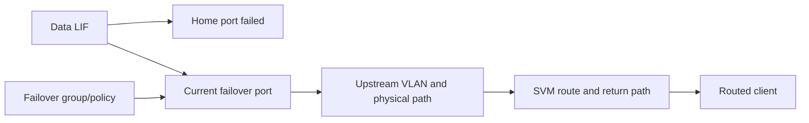

**Synthetic conclusion:** ONTAP eligibility includes a port whose upstream routed path is incomplete. **Boundary:** network/storage owners repair design and validation; repeated LIF movement is not a substitute for evidence.

### Case 5 - SAN survives takeover with only non-optimized paths

**Symptom/scope:** Hosts keep LUN access, but all paths are non-optimized and latency rises after takeover.

| Competing hypothesis | Prediction | Evidence |
|---|---|---|
| Optimized paths through alternate target topology missing | ALUA/ANA preferred states absent | Target/host path state and zoning/network map |
| Host multipath policy/utility issue | Target states correct but host selection wrong | Host utility/driver/policy and IMT evidence |
| Partner load/resource limitation | Storage service rises across protocols | Node/object/service evidence |

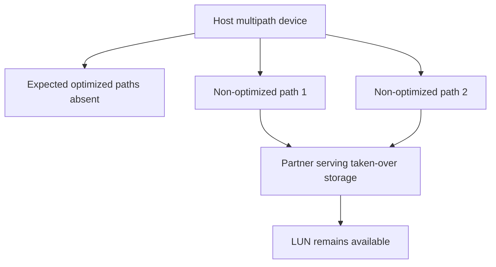

**Synthetic conclusion:** host zoning lacks the intended alternate optimized target ports. Service is available but path design is degraded; an approved remediation is planned outside incident pressure.

---

## 5. Fully synthetic sanitized scenario(s): shelf, disk, port, and cluster-network cases 6-9

### Case 6 - One shelf path is lost

**Symptom/scope:** All drives remain visible, but one I/O-module/cable path is unavailable.

| Competing hypothesis | Prediction | Evidence |
|---|---|---|
| Cable/optic/connector fault | One exact hop loses link/errors; alternate path works | Both-end port/path and physical map evidence |
| IOM or adapter fault | Multiple links through same component fail | Component-scope controls and events |
| Mis-cabling/common path | Supposed A/B routes share or cross incorrectly | Exact serial/port/cable peer map and platform guide |

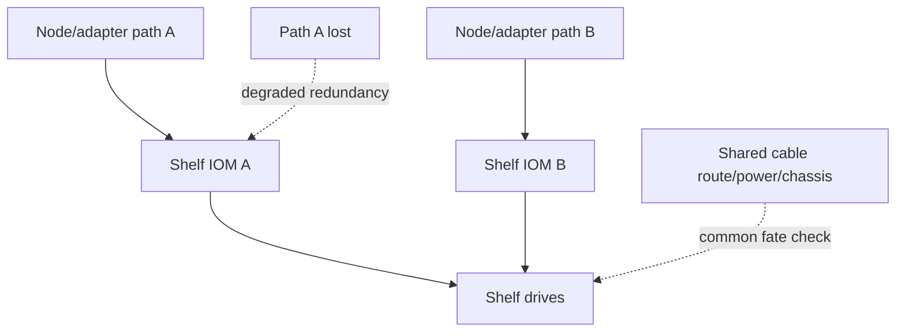

**Synthetic conclusion:** one cable path is lost while the alternate serves data. **Boundary:** do not reseat or recable live shelves without exact platform procedure and qualified Support; preserve port/serial mapping first.

### Case 7 - Disk failure leaves RAID degraded

**Symptom/scope:** One synthetic drive fails; data remains available under RAID protection, and reconstruction/spare behavior is in progress.

| Competing hypothesis | Prediction | Evidence |
|---|---|---|
| Isolated media failure | One drive health/serial fails; peers normal | Drive/platform events and RAID state |
| Shelf/path issue misreports multiple drives | Errors align by common path/IOM | Shelf path and cross-drive evidence |
| Correlated media/firmware issue | Similar errors across same type/batch | Fleet/firmware/Support evidence |
| No suitable spare/headroom | Reconstruction cannot start/complete as expected | Exact spare/partition/ownership and local-tier state |

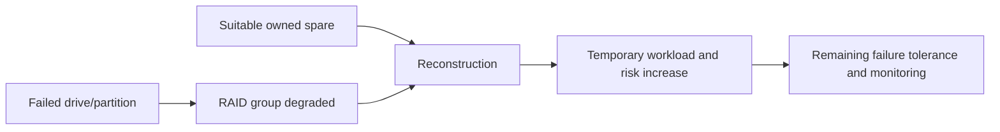

**Synthetic conclusion:** isolated drive failure with suitable spare; reconstruction increases temporary risk/work. **Boundary:** replacement and spare decisions use current platform/HWU/Support procedure; RAID availability is not permission to defer indefinitely.

### Case 8 - Data/cluster port or adapter failure has broad blast radius

**Symptom/scope:** A physical port failure affects several LIFs or target identities.

| Competing hypothesis | Prediction | Evidence |
|---|---|---|
| One physical port/adapter failure | All logical services on it move/fail together | Port, slot/adapter and LIF/target mapping |
| Upstream switch failure | Multiple storage ports on one switch affected | Cross-port/switch evidence |
| Software/config change | Link remains physical but logical role/state changes | Audit/change and port-role evidence |

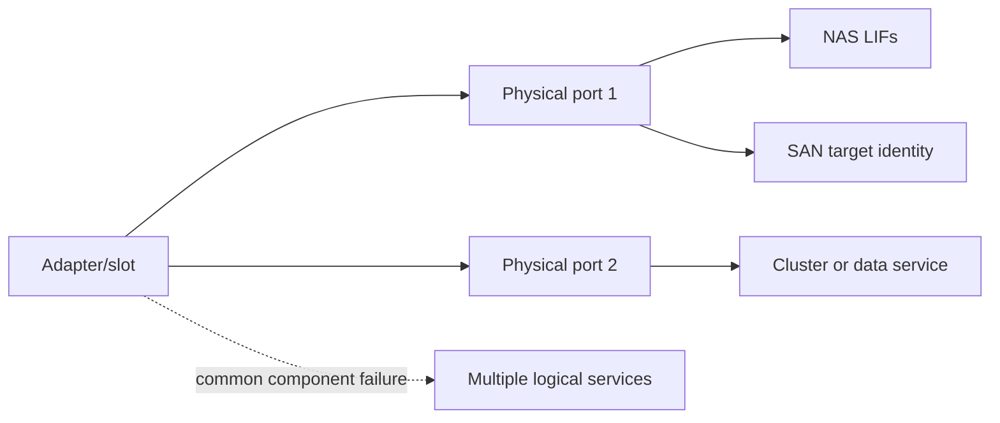

**Synthetic conclusion:** an adapter-level fault explains correlated services. **Boundary:** exact slot/card/platform/HA symmetry and replacement procedure must come from HWU/platform/Support; do not move every service blindly.

### Case 9 - Cluster interconnect degrades without immediate client outage

**Symptom/scope:** Client I/O continues, but cluster-network errors and internal-operation latency rise.

| Competing hypothesis | Prediction | Evidence |
|---|---|---|
| Physical cluster link/switch error | One hop shows errors/loss and path failover | Cluster port/switch/cable evidence |
| Congestion/internal traffic surge | Links busy/queues rise without physical errors | Traffic/service evidence and workload context |
| Misconfiguration/MTU mismatch | Specific sizes/paths fail after change | Config/change and packet/counter evidence |

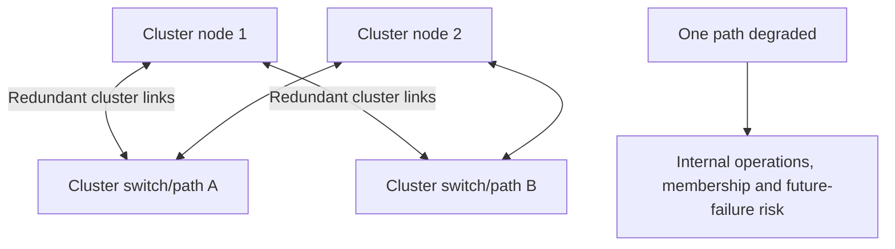

**Synthetic conclusion:** one cluster link has physical errors; current client service does not eliminate cluster risk. Unrelated maintenance is frozen and qualified network/hardware Support engaged.

---

## 6. Fully synthetic sanitized scenario(s): quorum, epsilon, and partition cases 10-11

### Case 10 - Cluster partition creates quorum uncertainty

**Symptom/scope:** Nodes split into two communication groups; management views disagree.

| Competing hypothesis | Prediction | Evidence |
|---|---|---|
| Network partition | Groups retain internal communication but not cross-partition | Independent cluster-network topology/evidence |
| Nodes failed/rebooted | Membership loss aligns with node health/power events | SP/BMC/node events and reachability |
| Management-plane visibility only | Cluster plane remains healthy despite one management view | Plane-specific evidence |

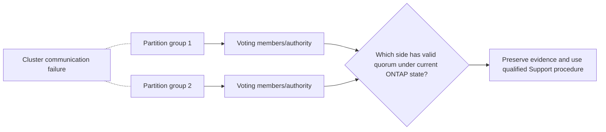

**Synthetic conclusion:** cluster-network partition is suspected, but no manual membership or quorum action is attempted. **Boundary:** authority mistakes can create conflicting state; exact current Support procedure is mandatory.

### Case 11 - Epsilon is treated as an availability toggle

**Symptom/scope:** A participant proposes moving epsilon during an incident to `restore quorum` without a verified topology.

| Competing hypothesis | Prediction | Evidence |
|---|---|---|
| Epsilon placement contributes to current voting calculation | Exact member/vote state shows bounded effect | Current cluster authority output and official docs |
| Partition/common failure is the real problem | Moving weight would not restore communication or hardware | Network/node evidence |
| Proposed action creates unsafe authority | Wrong side may gain/lose decision ability | Partition topology and Support analysis |

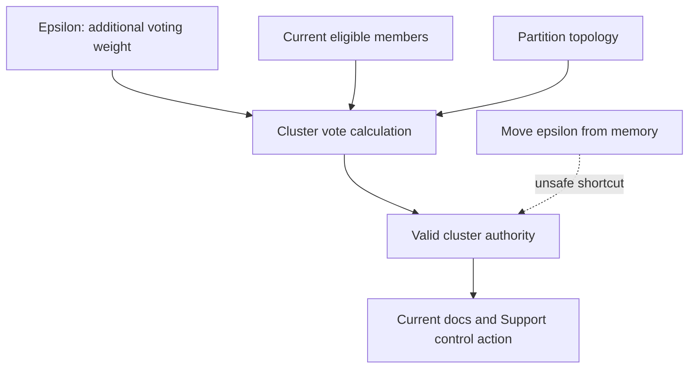

**Synthetic conclusion:** the proposal is rejected pending exact state and Support guidance. **Lesson:** epsilon does not repair links, power, failed nodes, or data paths.

### 🔍 Plain-English deep-dive: quorum protects against two captains

When communication splits, letting both halves independently steer the ship can be worse than stopping one. Quorum protects a single valid authority. **Why it matters:** availability pressure must not drive improvised membership, epsilon, or force actions that risk conflicting cluster state.

---

## 7. Fully synthetic sanitized scenario(s): environmental, power, cooling, FRU, and common-fate cases 12-16

### Case 12 - Rising temperature alert with service still available

**Symptom/scope:** A node reports increasing inlet/internal temperature; no client outage yet.

| Competing hypothesis | Prediction | Evidence |
|---|---|---|
| Facility cooling/inlet issue | Nearby systems/sensors and room conditions shift | Independent facility and platform sensor trend |
| Failed fan/airflow obstruction | Local fan/tach/zone evidence differs | Exact sensor/fan/platform evidence |
| Sensor fault | Cross-sensor/physical measurements disagree | Redundant sensors and qualified inspection |

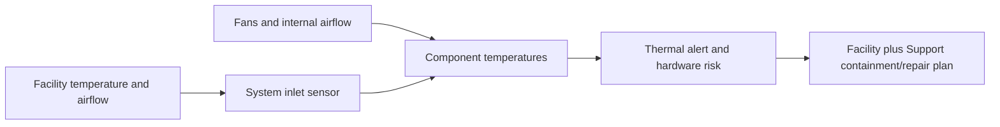

**Synthetic conclusion:** facility inlet temperature rises across two systems. **Boundary:** facilities and Support own containment; do not block vents, override fans, or force shutdown/takeover without qualified plan.

### Case 13 - Redundant power supplies share one upstream feed

**Symptom/scope:** Both power supplies are healthy, but a site review finds both connected to the same power distribution unit.

| Competing hypothesis | Prediction | Evidence |
|---|---|---|
| Common upstream feed removes redundancy | One PDU/feed failure removes both supplies | Physical cable/PDU/feed topology and test records |
| Feeds look separate but share upstream breaker/UPS | Labels differ; upstream dependency converges | Facility single-line diagram and owner validation |
| Monitoring labels are stale | Actual cabling differs from records | Authorized physical reconciliation |

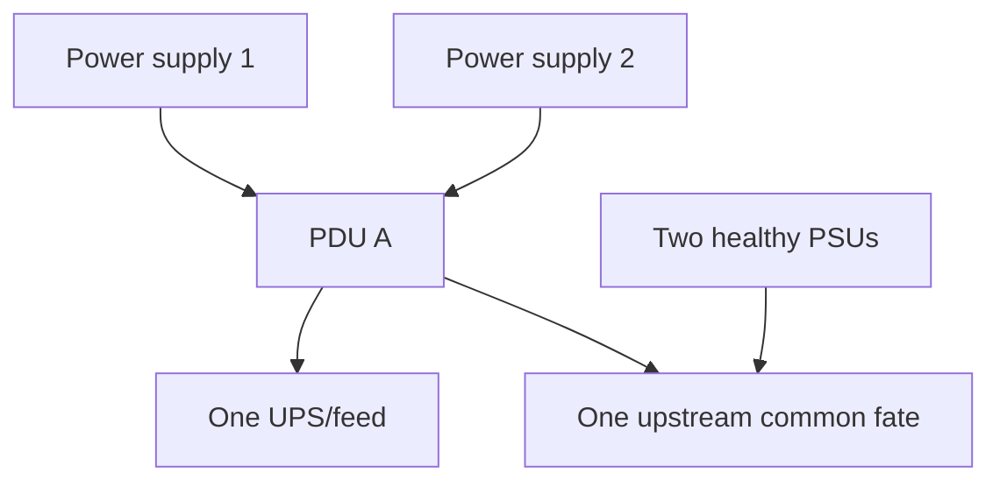

**Synthetic conclusion:** logical redundancy has common upstream fate. Recommendation is a facility/storage/Support-reviewed power-diversity change and evidence-based failover test, not live cable movement from a diagram.

### Case 14 - Fan failure and degraded cooling during peak load

**Symptom/scope:** One fan reports failure; remaining fans increase speed and temperatures remain within the synthetic normal range.

| Competing hypothesis | Prediction | Evidence |
|---|---|---|
| Isolated fan FRU failure | One fan tach/status fails; peers respond | Exact fan/sensor/event evidence |
| Control/firmware reporting issue | Physical behavior and telemetry disagree | Platform/firmware/Support evidence |
| Broader airflow/environment problem | Multiple zones/systems trend together | Environmental controls |

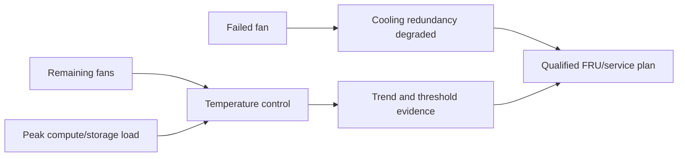

**Synthetic conclusion:** isolated fan failure with compensated cooling. Service remains available, but maintenance urgency reflects reduced margin and potential correlated thermal risk.

### Case 15 - FRU replacement restores hardware but not topology

**Symptom/scope:** A synthetic adapter is replaced; hardware health is green, but one path remains missing.

| Competing hypothesis | Prediction | Evidence |
|---|---|---|
| Cable returned to wrong port/peer | Link may rise but topology/identity differs | Before/after port-label, serial, peer and path map |
| Replacement part/firmware/config mismatch | Port role or support state differs | Exact FRU/slot/firmware/HWU and configuration |
| Upstream zoning/VLAN tied to old identity/port | New hardware works locally but service path absent | Switch/network and target/LIF evidence |

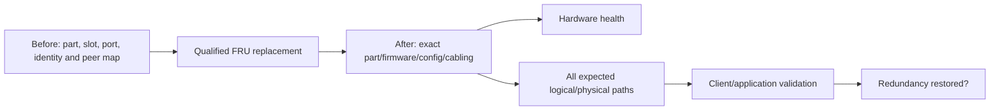

**Synthetic conclusion:** cable peer is incorrect after service. **Boundary:** only qualified field/fabric/storage owners correct it through exact procedure; green hardware alone is insufficient closure.

### Case 16 - Repeated hardware flaps reveal common fate

**Symptom/scope:** Two supposedly independent paths flap together during maintenance in a shared chassis/switch row.

| Competing hypothesis | Prediction | Evidence |
|---|---|---|
| Shared chassis/power/switch common cause | Both paths align to one dependency event | Physical dependency map and synchronized events |
| Independent simultaneous failures | Different precursors/signatures | Component-specific evidence |
| Monitoring duplication | One source event is displayed twice | Source provenance and event identity |

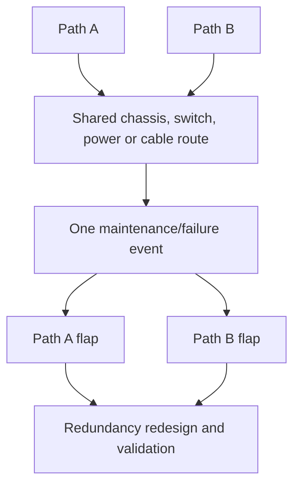

**Synthetic conclusion:** both paths share one switch power domain. The recommendation addresses architecture and change controls, not only the two observed ports.

---

## 8. Cross-case risk and validation matrix

| State | Customer wording | Required next proof |
|---|---|---|
| Available/healthy | Service and redundancy meet current validated state | Continue monitoring and exercises |
| Available/degraded | Service works; one or more protection paths/components unavailable | Repair owner/date, remaining-failure analysis, monitoring |
| Taken over | Partner serves workload; original node unavailable/not ready | Capacity/SLO, client paths, cause, repair and giveback plan |
| Recovered/monitoring | Customer tests pass after transition | Stability window, data/protection and recurrence checks |
| Hardware replaced | FRU health appears normal | Identity, firmware, cabling, all paths, app and redundancy |
| Cluster authority uncertain | Management views conflict or partition exists | Preserve state; qualified Support controls recovery |

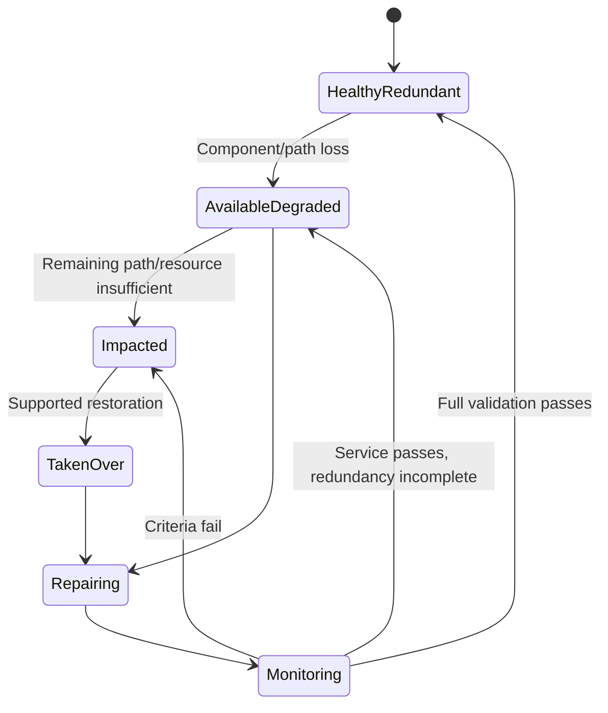

### Common-fate questions

- Do HA partners share a chassis, rack, PDU, UPS, cooling zone, switch, cable route, or site?
- Do shelf paths share one adapter, IOM, cable bundle, or enclosure?
- Do client paths share host HBA/NIC, switch, firewall, VLAN/VSAN, target adapter, or power?
- Do monitoring and management share the failed dependency?
- Can the partner carry combined workload and protection demand?

### 🔍 Plain-English deep-dive: count failure domains, not cables and icons

Two extension cords plugged into the same power strip do not provide power redundancy. Likewise, two paths can share an adapter, switch, cable route, PDU, chassis, configuration or site. **Why it matters:** resilience claims must identify independent failure domains and prove service through a controlled loss; visual duplication alone overstates protection.

---

## 9. Safe escalation and physical-service boundary

```mermaid
flowchart TD
    SIGNAL[HA/hardware signal] --> VERIFY[Exact object, time, current state and customer impact]
    VERIFY --> DEG[Define service and redundancy state]
    DEG --> PRES[Preserve volatile events, topology and identity]
    PRES --> SOURCE[Exact current ONTAP/platform/HWU/Support source]
    SOURCE --> OWN[Incident, customer, facility and qualified Support owners]
    OWN --> PLAN[Containment/service plan with stop/recovery]
    PLAN --> VALID[Hardware, cluster, paths, app, data and protection validation]
```

### Never use as exploratory shortcuts

- Force takeover/giveback, override vetoes, alter quorum/membership/epsilon, or reboot/power-cycle from memory.
- Reseat, recable, replace, pull, assign, zero, fail, or move disks, shelves, adapters, ports, fans, power supplies, or FRUs without exact qualified procedure.
- Move live power cables to `test redundancy` without facility, Support, maintenance, and recovery controls.
- Ignore degraded state because service is currently available.
- Infer hardware cause from one sensor or replace a part before topology/identity evidence.
- Publish serials, site/facility topology, support output, or failure history.

---

## 10. Arti transfer/honesty and JD Mapping

```mermaid
flowchart LR
    CRIT[Microsoft CRITSIT and restoration] --> CMD[Impact, roles, cadence and validation]
    AZ[Azure/VM/network HA concepts] --> LAYER[Node, path and application-layer thinking]
    NET[Networking evidence] --> PATH[Redundancy and common-fate mapping]
    VEND[Vendor coordination] --> FRU[Qualified hardware escalation and follow-through]
    CMD --> TRANS[Transferable HA risk method]
    LAYER --> TRANS
    PATH --> TRANS
    FRU --> TRANS
    TRANS --> GAP[Production NetApp HA/service execution remains a gap]
```

| JD responsibility | Part 77 capability | Honest evidence/boundary |
|---|---|---|
| Storage depth | HA pair, quorum, shelf/disk/FRU cases | Conceptual/synthetic, not production operation |
| Stability/risk | Available versus degraded and common fate | Strong incident/risk method transfers |
| High pressure | Restoration, evidence and communication | Microsoft CRITSIT experience |
| Hardware/lifecycle | Exact part/topology/source discipline | No physical NetApp service claim |
| Support engagement | Safe package and qualified procedure boundary | No NetApp internal route claim |
| Customer reviews | Degraded risk, owner/date, validation | Existing review/action tracking strength |

### Honest interview wording

> `I separate node/cluster/HA state from client service and full redundancy. For a failure I preserve exact topology and events, define current impact and remaining failure tolerance, validate LIF or host-path recovery and application transactions, map common fate, and use current platform/HWU/Support procedures for any takeover, giveback or FRU work. My production incident experience is Microsoft-based; I have not operated or repaired production NetApp HA hardware.`

---

## 11. Labs, drills, and self-test

### Scenario lab

```mermaid
flowchart LR
    SELECT[Work all 16 synthetic cases] --> MAP[Draw HA, cluster, storage, path and facility topology]
    MAP --> STATE[Classify service and redundancy state]
    STATE --> HYP[At least three competing hypotheses]
    HYP --> SAFE[Evidence and qualified escalation]
    SAFE --> PLAN[Containment/repair/giveback validation plan]
    PLAN --> PROOF[App, data, paths, protection and redundancy proof]
    PROOF --> PANEL[Peer challenge and exact Q1-Q8 aloud]
```

### Required drills

1. Build planned takeover go/no-go gates and stop criteria.
2. Explain technically successful takeover with failed application recovery.
3. Defend holding giveback while original hazard remains.
4. Diagnose NAS LIF and SAN path recovery separately.
5. Map shelf A/B paths and common components.
6. Explain RAID degradation, spare/reconstruction and temporary risk without hardcoded limits.
7. Trace port/adapter failure blast radius.
8. Explain cluster plane versus management/data plane and quorum.
9. Reject unsafe epsilon manipulation with calm customer wording.
10. Build environmental/power/cooling/FRU service and validation packages.

### Self-test

1. Define HA pair, takeover, giveback, degraded redundancy, quorum, epsilon, FRU and common fate.
2. Distinguish planned from unplanned response.
3. State every readiness and validation layer.
4. Explain LIF and SAN path behavior without universal promises.
5. Diagnose shelf, disk, port and cluster-interconnect cases.
6. Explain quorum/epsilon cautiously.
7. Map power, cooling, chassis, switch and site common fate.
8. Validate FRU replacement beyond component green.
9. Write an available-but-degraded customer update.
10. State physical-service, privacy, current-source and experience boundaries.

### Lab pass checklist

- [ ] All 16 cases include symptom/scope, controls, competing hypotheses, evidence, bounded conclusion, and boundary.
- [ ] Planned/unplanned takeover, giveback, LIF and SAN path recovery are covered.
- [ ] Shelf path, disk/RAID/spare, port/adapter and cluster-interconnect failures are covered.
- [ ] Quorum, partition and epsilon are explained without action recipes.
- [ ] Environmental, power, cooling, FRU and common-fate cases are covered.
- [ ] Service availability and redundancy state are always separate.
- [ ] Customer transaction, data, path, protection and monitoring validate recovery.
- [ ] Exact ONTAP, platform, HWU, IMT and Support sources are required.
- [ ] No force, override, reboot, power, recable, disk, port, shelf, epsilon or FRU shortcut is proposed.
- [ ] Customer, facility, network/fabric, storage, application, incident and Support owners are explicit.
- [ ] All systems, parts, topologies, evidence and outcomes are synthetic and sanitized.
- [ ] No production NetApp HA, hardware or service experience is claimed.
- [ ] Exact Q1-Q8 are answered aloud.

---

## 12. Official and Public Source Anchors

**Date checked: 2026-08-24.** Public sources anchor concepts and current navigation. Exact ONTAP release, platform, HWU result, service procedure, customer topology and qualified Support guidance govern live work.

| Topic | Official/public source | Bounded use |
|---|---|---|
| HA pair concepts | [ONTAP high-availability pairs](https://docs.netapp.com/us-en/ontap/concepts/high-availability-pairs-concept.html) | Public HA partner/takeover orientation |
| HA operations | [ONTAP HA pair management](https://docs.netapp.com/us-en/ontap/high-availability/) | Current takeover/giveback monitoring and procedure navigation; no command copied |
| Cluster administration | [ONTAP cluster administration](https://docs.netapp.com/us-en/ontap/cluster-admin/) | Current membership/quorum/epsilon context; qualified procedure required |
| Network/LIF | [ONTAP network management](https://docs.netapp.com/us-en/ontap/network-management/) | Current ports, LIFs, failover groups/policies, routes and broadcast domains |
| Disks/local tiers | [ONTAP disks and local tiers](https://docs.netapp.com/us-en/ontap/disks-aggregates/) | Current disk, RAID, spare and local-tier context |
| Hardware systems | [ONTAP hardware systems](https://docs.netapp.com/us-en/ontap-systems/) | Exact platform installation/maintenance/service navigation |
| FRU reference | [ONTAP component replacement reference](https://docs.netapp.com/us-en/ontap-systems/fru-reference/) | Links to current model-specific procedures; qualified service still required |
| Hardware Universe | [NetApp Hardware Universe](https://hwu.netapp.com/) | Authorized exact platform/part/slot/port/shelf/drive/limit evidence |
| Interoperability | [NetApp Interoperability Matrix Tool](https://imt.netapp.com/) | Authorized exact ecosystem recipe and notes |
| Support | [NetApp Support Services](https://www.netapp.com/services/support/) | Public context; entitlement, field service and escalation require confirmation |

### Source-use discipline

- Record exact cluster/node/platform/ONTAP/part/slot/port/shelf/drive/firmware and topology.
- Reopen exact platform and FRU procedure rather than use generic physical steps.
- Treat HWU/IMT/Support results and customer hardware data as gated/current.
- Preserve event, sensor, SP/BMC, cabling, facility and change evidence securely.
- Use qualified Support, facility, customer and change owners for every live operation.

---

## Likely Interview Questions

### Q1. How do you reason about ONTAP HA without overclaiming availability?

> **Model answer:** `I separate node, HA-pair, cluster, storage-ownership, LIF/target path, protocol session, application transaction, data and protection states. Takeover can restore storage processing while clients or dependencies remain down; service can be available while redundancy is degraded. I validate each layer and state the remaining failure tolerance and residual risk.`

### Q2. How do planned and unplanned takeover differ?

> **Model answer:** `Planned work begins with full health, supportability, partner headroom, client-path, protection, communication and rollback gates and treats a failed gate as a reason to postpone. Unplanned response prioritizes data/service safety, volatile evidence, incident command and the safest supported restoration option. Both require customer transaction, data, path and redundancy validation.`

### Q3. What must be true before giveback?

> **Model answer:** `The original failure must be understood or safely contained; node, HA, cluster, storage, hardware/firmware and required state must be ready under current procedure; the partner must remain stable; client/application transition, window, stop/recovery and communication must be approved. I never force giveback or bypass a veto from memory.`

### Q4. How do you troubleshoot client recovery after takeover?

> **Model answer:** `For NAS I verify LIF home/current port, failover policy/group, VLAN/route/firewall, DNS, protocol session and application path. For SAN I verify target ports, host MPIO/ALUA or ANA, stable device and application state. I then test the customer transaction, performance, data and protection. Storage takeover success alone is insufficient.`

### Q5. How do you assess shelf, disk, and port failures?

> **Model answer:** `I freeze exact node/adapter/port/cable/IOM/shelf/drive identities and topology, compare both paths and component scopes, inspect RAID/local-tier/spare/reconstruction and physical/events, and look for common fate. Available data with one path or drive failed is degraded risk. Qualified Support and exact platform/HWU procedures control recabling or replacement.`

### Q6. How do you explain quorum and epsilon safely?

> **Model answer:** `Quorum is voting authority for safe cluster decisions during membership or communication loss. Epsilon is additional voting weight assigned under ONTAP's design to help resolve an even split; it does not repair nodes, links, power or data paths. During partition uncertainty I preserve state and use current Support procedure, never manipulate membership or epsilon from memory.`

### Q7. How do you validate a hardware or FRU repair?

> **Model answer:** `I compare before/after exact part, serial, slot, firmware, configuration, port identities, cabling and peers; validate hardware sensors/events; restore every expected storage, cluster, NAS and SAN path; test application, data, performance, protection and failover as approved; then confirm redundancy and monitor. A green component is not complete topology recovery.`

### Q8. What experience transfers, and what remains your gap?

> **Model answer:** `Microsoft CRITSITs, Azure/VM/networking, evidence correlation, customer updates, vendor coordination and risk tracking give me strong HA incident method. I have not performed production ONTAP takeover/giveback, quorum recovery or hardware service, so these cases are synthetic and every live action requires exact current NetApp sources and qualified owners.`

---

## 30-Second Memory Hooks

- **HA pair:** Specific partners, not any two cluster nodes.
- **Takeover:** Partner carries work; **giveback:** controlled return.
- **Available/degraded:** Driving on the spare tire.
- **Validation:** Node -> path -> protocol -> app -> data -> protection -> redundancy.
- **Planned:** Failed readiness gate means postpone.
- **Unplanned:** Protect data/service, preserve state, use supported option.
- **LIF:** Eligible ONTAP port still needs usable upstream path.
- **SAN:** Visible paths can all be non-optimized.
- **Shelf path:** Data visible can still mean cabling redundancy lost.
- **Disk failure:** RAID protects now; reconstruction and next-failure risk remain.
- **Cluster interconnect:** Client green does not clear cluster-plane risk.
- **Quorum:** One valid captain.
- **Epsilon:** Voting weight, not a repair switch.
- **Common fate:** Two lamps on one breaker.
- **Environment:** Facility can fail many components together.
- **FRU:** Exact part + exact procedure + complete topology validation.
- **Arti boundary:** Incident method transfers; NetApp HA/hardware operation does not.

---

## Completion Checklist

- [ ] Define customer impact, data risk, SLO/RPO/RTO and current service state.
- [ ] Record exact cluster, node, HA pair, ONTAP, platform, state and chronology.
- [ ] Separate management, cluster, HA, storage and data-path evidence.
- [ ] Map LIF, SAN, shelf, port, disk, power, cooling and facility failure domains.
- [ ] Classify healthy, available/degraded, taken-over, impacted, repairing and monitoring states.
- [ ] Cover all 16 takeover, giveback, path, hardware, quorum and environmental cases.
- [ ] Use current ONTAP/platform/HWU/IMT/Support sources before any live conclusion.
- [ ] Keep planned readiness and unplanned restoration goals distinct.
- [ ] Preserve common-fate and remaining-failure analysis.
- [ ] Validate application, data, performance, protection, monitoring and full redundancy.
- [ ] Avoid force/override, membership/epsilon, reboot/power, recable, disk, port, shelf, fan, PSU or FRU shortcuts.
- [ ] Protect serials, site/facility topology, events, support evidence and maintenance plans.
- [ ] Keep customer, incident, facility, network/fabric, storage, application and Support ownership explicit.
- [ ] Complete labs, drills, self-test and exact Q1-Q8 aloud.
- [ ] State the explicit no-production-NetApp boundary.

---

*Next suggested section:* [Part 78 - Replication, Backup, Restore, MetroCluster, and DR Scenarios](Part-78-replication-backup-dr-scenarios.md)