# Part 78 - Replication, Backup, Restore, MetroCluster, and DR Scenarios

> **Section goal:** Diagnose data-protection and disaster-recovery (DR) gaps by proving usable recovery points and timed application recovery, not by trusting configured schedules or green jobs. By the end, you should be able to reason through replication baseline/update/lag/peering/network/capacity/relationship state; break/resync/reverse operations and data-direction risk; restore point, application consistency, catalog, backup failure, and immutability; MetroCluster switchover/heal/switchback and split-brain risk; stale runbooks and tests; and achieved Recovery Point Objective (RPO) and Recovery Time Objective (RTO) evidence.

Covers index item **78** and maps directly to job-description responsibilities for storage protection depth, stability/risk mitigation, customer reviews, high-pressure incidents, lifecycle/change planning, Support collaboration, and preventative recommendations.

**Explicit nonclaim:** You have not configured, broken, resynchronized, reversed, restored, switched over, healed, switched back, or declared recovery for a production NetApp SnapMirror, backup, MetroCluster, or DR environment.

**Privacy/access:** Protection evidence can expose customer data sets, recovery points, retention, topology, intercluster addresses, credentials, encryption keys, backup catalogs, immutability controls, legal holds, incident details, RPO/RTO, business priorities, and cyber-recovery weaknesses. Use authorized minimum collection, approved secure systems, separation of duties, need-to-know access, redaction, audit, retention, and security/legal/records governance. Never copy real catalog, snapshot, relationship, key, or customer recovery data into study material.

**Synthetic-evidence rule:** Every customer, cluster, relationship, snapshot, backup, catalog, object, credential, key, site, metric, date, RPO/RTO, action, owner, and outcome below is fictional and sanitized. No scenario is a real ONTAP result, MetroCluster event, backup product output, Support instruction, or customer recovery.

**Version/current source caveat:** ONTAP, SnapMirror policies/modes/states, backup services, catalogs, immutability, MetroCluster variants and operations, commands, limits, support matrices, and recovery procedures change. A **current-source check** means verifying exact release/platform/topology/relationship/policy/application and current official or authorized NetApp, backup-vendor, IMT/HWU, and Support guidance before any live operation.

This Part is a reasoning casebook, not a NetApp internal DR runbook, backup guarantee, command reference, relationship operation procedure, MetroCluster recovery instruction, legal/compliance statement, or authorization to change source/destination roles or restore data.

> **No-production-NetApp boundary:** Your factual strengths are enterprise support, data-service incidents, business continuity concepts, incident command, risk communication, analytics, change coordination, and customer reviews. Your exact nonclaim is: **you have not operated or validated production NetApp replication, backup, restore, MetroCluster, or DR.** All cases are synthetic learning evidence.

---

## 1. Protection is a recoverability chain

| Term | Plain meaning | Analogy | Why it matters |
|---|---|---|---|
| **RPO** | Maximum acceptable data-loss window measured backward from disruption | How far back a recovered ledger may be | A schedule is not achieved RPO |
| **RTO** | Target time to restore an acceptable service | Deadline to reopen the business | Includes app, identity, network and validation |
| **Baseline** | Initial replication establishing shared data lineage | First full copy of a library | Ongoing updates depend on valid relationship state |
| **Update** | Later transfer of selected changed state | Shipping changed pages | Change rate and path service determine catch-up |
| **Lag/recovery-point age** | How old the newest usable destination point is | Age of latest offsite ledger | More meaningful than schedule existence |
| **Break** | Change a destination relationship role for writable use under procedure | Open emergency branch office | Creates direction and divergence decisions |
| **Resync** | Re-establish replication lineage under supported behavior | Reconcile two ledgers | Can discard divergent state if direction is wrong |
| **Catalog** | Index of protected workloads, points and restore metadata | Library card catalog | Intact backup objects may be hard to recover without it |
| **Immutability** | Controlled resistance to change/deletion for a retention period | Sealed evidence box | Must include admin, key, catalog and control-plane threats |
| **Switchover/switchback** | Move MetroCluster service to surviving site and later return | Operate from alternate site, then return home | Exact readiness, healing and application order matter |

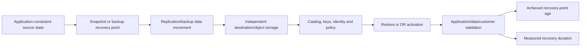

### 🔍 Plain-English deep-dive: configured protection is a promise; restore testing is evidence

A fire drill plan in a binder does not prove people can exit through today's locked doors. **Why it matters:** schedules, policies, green jobs and retained copies are inputs; recoverability requires catalog, keys, identities, network, application consistency, runbook, trained owners and a timed restore.

---

## 2. The protection evidence contract

Capture exact:

- Business service, data set, owner, consistency requirement, RPO/RTO and current impact.
- Source/destination cluster, SVM, volume/object identity, ONTAP/platform/release.
- Peering, intercluster LIFs, routes, DNS/time, security and network service.
- Relationship type/mode, policy, rules/labels, schedule, state/health, baseline/update history and lag definition.
- Source change rate, transfer rate, backlog, failures, path performance and destination capacity.
- Recovery point timestamp, application-consistency proof, retention and immutability state.
- Backup control plane, catalog, data plane, repository, IAM, keys and isolation.
- MetroCluster variant, aggregate/plex/SVM state, site/fabric, mediator/witness context where applicable.
- Break/resync/reverse/switchover/heal/switchback authority, direction, prerequisites and recovery.
- Timed restore/DR validation, data integrity, app dependencies, residual risk and action owners.

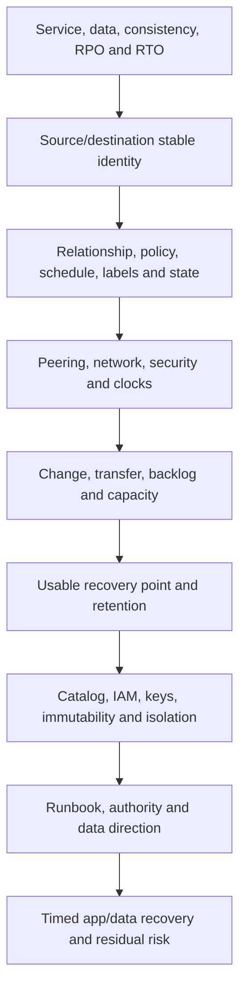

### Achieved objectives

At disruption time $t_d$, if the newest validated recovery point is $t_r$:

$$\text{Achieved recovery-point age} = t_d - t_r$$

Measured recovery duration:

$$\text{Achieved recovery time} = t_{acceptable\ service} - t_{recovery\ start}$$

Definitions must specify detection/declaration start, acceptable service, time zones, and application validation.

---

## 3. Replication flow and failure gates


### Rate model

If source changes faster than successful transfer service for long enough, backlog and recovery-point age grow even when every scheduled job starts.

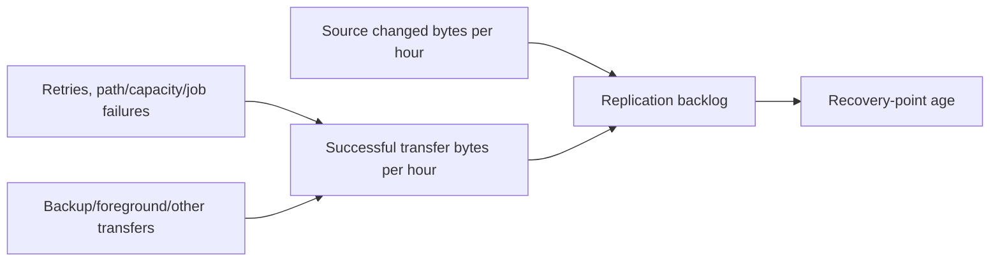

### 🔍 Plain-English deep-dive: lag is inventory, not just a timer

Backlog behaves like packages entering a depot. If arrivals exceed departures, the oldest undelivered package gets older. **Why it matters:** diagnose source change, eligible points, job start, path service, destination write/capacity and competing work instead of merely running updates more often.

---

## 4. Fully synthetic sanitized scenario(s): baseline, update, peering, network, capacity, and state cases 1-5

### Case 1 - Baseline never completes

**Symptom/scope:** A synthetic initial replication has run for two days and repeatedly restarts or makes little progress.

| Competing hypothesis | Prediction | Decisive evidence |
|---|---|---|
| Source change during baseline creates prolonged catch-up | Baseline data plus new change backlog grows | Source change, sent/received bytes and phase history |
| Path throughput/loss limits service | Transfer rate aligns with path errors/RTT | Both-end transfer and network evidence |
| Destination capacity/space limit | Failure or throttling follows destination state | Typed destination capacity and job error |
| Relationship/job repeatedly restarted | History shows administrative or transient resets | Job/audit/event chronology |

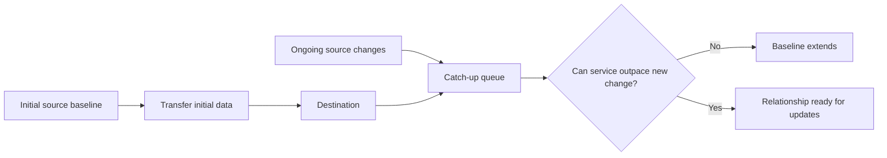

**Synthetic conclusion:** source change plus constrained shared path prevents catch-up. **Boundary:** options such as scheduling, seeding, throttling or path capacity require current Support/design and customer RPO/SLO decisions; do not restart repeatedly.

### Case 2 - Recovery-point age grows despite scheduled updates

**Symptom/scope:** Policy is scheduled hourly; newest validated destination point is five hours old.

| Competing hypothesis | Prediction | Evidence |
|---|---|---|
| Schedule not firing | No jobs at expected times | Scheduler and job history |
| Labels/rules select no eligible point | Jobs run but expected source points are absent | Policy/rules/labels and snapshot catalog |
| Updates run but cannot catch change | Active transfers, backlog and age grow | Change/transfer rates and completion history |
| Destination point exists but monitoring is stale | Direct destination evidence is newer | Data freshness/source comparison |

```mermaid
timeline
    title Synthetic scheduled update evidence
    08:00 : Eligible source point created
    08:05 : Update starts
    09:00 : New source point while prior update active
    10:00 : Backlog grows; schedule exists
    12:00 : Newest completed destination point still 07:00
    12:05 : RPO breach declared from validated point age
```

**Synthetic conclusion:** jobs run, but source change exceeds sustained transfer service. **Customer wording:** configured hourly schedule does not mean hourly achieved RPO.

### Case 3 - Peering/authentication and intercluster path fail

**Symptom/scope:** Replication relationship cannot start after certificate/network maintenance.

| Competing hypothesis | Prediction | Evidence |
|---|---|---|
| Peer authentication/trust issue | Network connects but peer validation fails | Peering status and auth/certificate evidence |
| Route/firewall failure | Both-end LIF path cannot exchange traffic | Routes, reachability, firewall state and trace |
| DNS/time dependency | Name/certificate/ticket validity differs | Exact names, clocks and service dependency evidence |
| Relationship configuration issue | Peer healthy; one relationship fails | Relationship identity/state and controls |

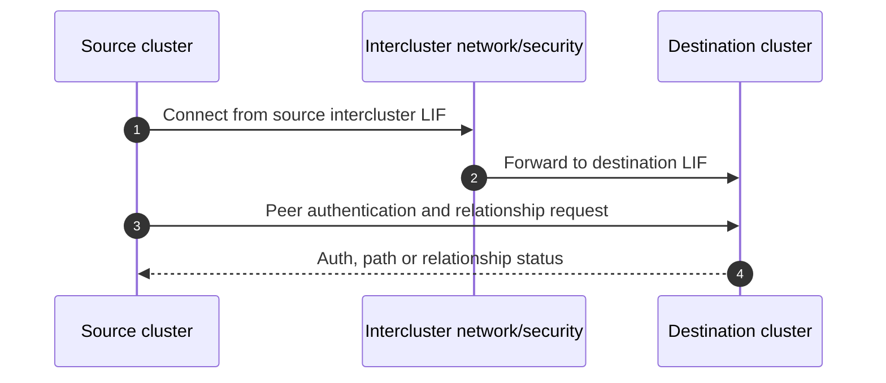

**Synthetic conclusion:** route is healthy, but peer trust material is stale after maintenance. **Boundary:** qualified storage/security owners use current peer procedure; no trust bypass is proposed.

### Case 4 - Destination capacity blocks updates

**Symptom/scope:** Updates fail as destination physical capacity/headroom approaches a threshold.

| Competing hypothesis | Prediction | Evidence |
|---|---|---|
| Destination volume/local-tier capacity is limiting | Job error and typed capacity align | Destination volume/local-tier/snapshot capacity evidence |
| Retention consumes more than planned | Destination catalog has excess/changed retention points | Policy/rules/point inventory |
| Source growth exceeds forecast | Incoming change rate changed | Source segment/growth evidence |
| Reporting/accounting mismatch | Dashboard stale or units/scopes differ | Direct source, freshness and definitions |

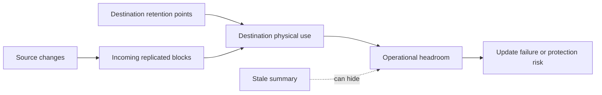

**Synthetic conclusion:** changed retention and source growth consume destination headroom. **Safety:** do not delete recovery points or reduce retention without data-owner, legal, continuity and Support review.

### Case 5 - Relationship is broken but monitoring says healthy

**Symptom/scope:** Destination was made writable for a prior test; monitoring still reports policy green while updates no longer occur.

| Competing hypothesis | Prediction | Evidence |
|---|---|---|
| Relationship state is broken/diverged | Destination writable and updates not expected in same way | Direct relationship state and audit chronology |
| Monitoring is stale/mis-scoped | Portal status lag/object mismatch | Freshness, identity and source comparison |
| Update failure unrelated to break | Relationship state supports update but job errors | Direct job/state evidence |

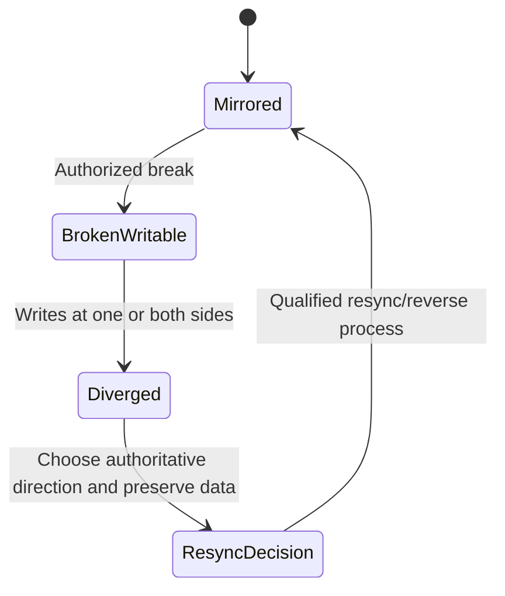

**Synthetic conclusion:** monitoring uses stale pre-test state; direct relationship evidence shows broken/writable. The risk is governance and state reconciliation, not an update scheduler fault.

---

## 5. Fully synthetic sanitized scenario(s): break, resync, reverse, and restore cases 6-9

### Case 6 - Business asks to break replication during primary outage

**Symptom/scope:** Primary service is unavailable; destination point is two hours old and business requests immediate writable activation.

| Competing consideration | Prediction/risk | Required evidence |
|---|---|---|
| Destination point meets/violates RPO | Up to point-age data may be absent | Validated point timestamp and consistency |
| Source may return with newer writes | Divergence and split ownership possible | Source fencing/isolation and transaction authority |
| App dependencies not ready at DR site | Storage writable but service remains down | Network, identity, compute, app and runbook evidence |
| Break action is correct path | Current relationship/topology/procedure supports it | Qualified Support/continuity approval |

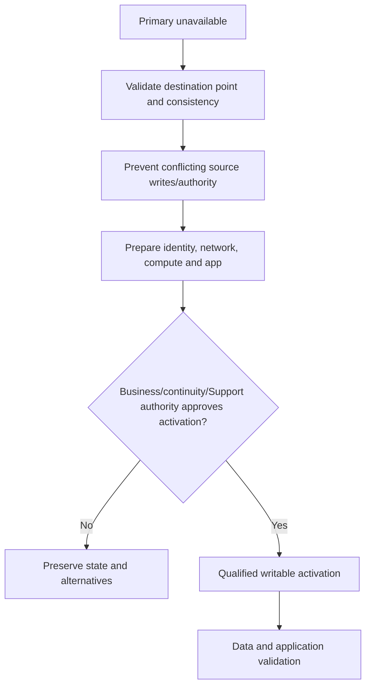

**Synthetic conclusion:** destination point violates stated RPO but manual business continuity is worse; the authorized customer accepts bounded data loss risk. This is a business decision, not a storage-only action.

### Case 7 - Resync direction could destroy divergent data

**Symptom/scope:** Both former source and DR destination received writes after a test; team proposes a quick resync.

| Competing question | Evidence needed |
|---|---|
| Which side is authoritative for each application/data set? | Business/app transaction records and ownership |
| What common snapshot/lineage exists? | Relationship and recovery-point catalog |
| What divergent data must be preserved/exported? | Application-consistent comparison and legal/data owner |
| Which direction and procedure is supported? | Exact release/relationship and qualified Support guidance |

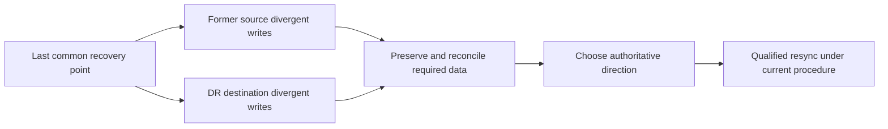

**Synthetic conclusion:** data reconciliation is required before any resync. **Critical boundary:** never choose direction from object labels alone; resync can make one side conform and discard divergence.

### Case 8 - Reverse replication/failback plan is incomplete

**Symptom/scope:** DR site has run production for a week; original site is repaired and team wants to return.

| Competing hypothesis/risk | Prediction | Evidence |
|---|---|---|
| Reverse path cannot keep up with week of changes | Baseline/backlog exceeds window | Change volume, path rate and capacity model |
| Original site dependencies remain unhealthy | Storage sync completes but app cannot run | Full site dependency validation |
| Client cutback causes excessive interruption | DNS/session/path/app recovery exceeds RTO | Rehearsed runbook and timed test |
| Protection gap during reversal | No independent point during transition | Backup/replication protection design |

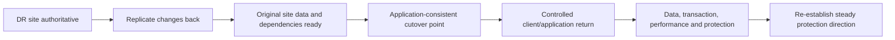

**Synthetic conclusion:** path rate cannot complete reverse catch-up inside the planned window. The return is postponed; no broad outage is risked for calendar convenience.

### Case 9 - Restore uses the wrong point and consistency level

**Symptom/scope:** A file/volume restore is requested after logical corruption, but the newest point already contains the corruption.

| Competing hypothesis/risk | Prediction | Evidence |
|---|---|---|
| Newest point is contaminated | Corruption timestamp precedes point | App/audit/data evidence and point catalog |
| Older point is crash-consistent only | App recovery may require log replay or fail | Consistency method and restore test |
| Item-level restore avoids broader rollback | Required object can be recovered independently | Exact supported restore granularity and dependencies |
| Restore over live data causes loss | New valid writes would be overwritten | Change freeze, clone/alternate restore and reconciliation plan |

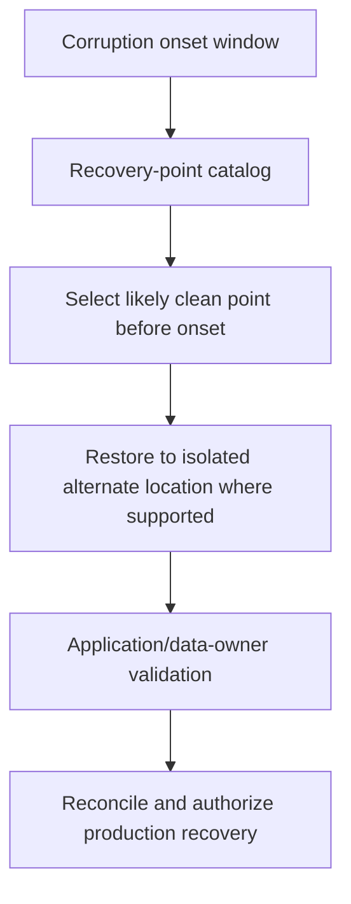

**Synthetic conclusion:** an older point is selected and restored to an isolated synthetic location for application validation. **Boundary:** do not overwrite live data or equate crash consistency with application consistency.

### 🔍 Plain-English deep-dive: recovery direction is a data-governance decision

When two ledgers diverge, choosing one as `source` is not a technical naming preference; it determines which transactions survive. **Why it matters:** break/resync/reverse/failback require business and application authority, preserved copies, explicit direction, consistency and qualified procedure.

---

## 6. Fully synthetic sanitized scenario(s): backup, catalog, immutability, MetroCluster, and runbook cases 10-16

### Case 10 - Backup objects exist but the catalog is unavailable

**Symptom/scope:** Repository storage is reachable, yet the backup application cannot enumerate recovery points.

| Competing hypothesis | Prediction | Evidence |
|---|---|---|
| Catalog database unavailable/corrupt | Objects exist but workload/point metadata inaccessible | Catalog service/backup control-plane evidence |
| IAM or key failure | Catalog/repository requests fail authorization/decryption | Identity/key service and audit evidence |
| Repository/object loss | Expected objects/checks fail independently | Repository inventory/integrity evidence |
| Network/DNS dependency | Control plane cannot reach catalog/key/repository | Service path evidence |

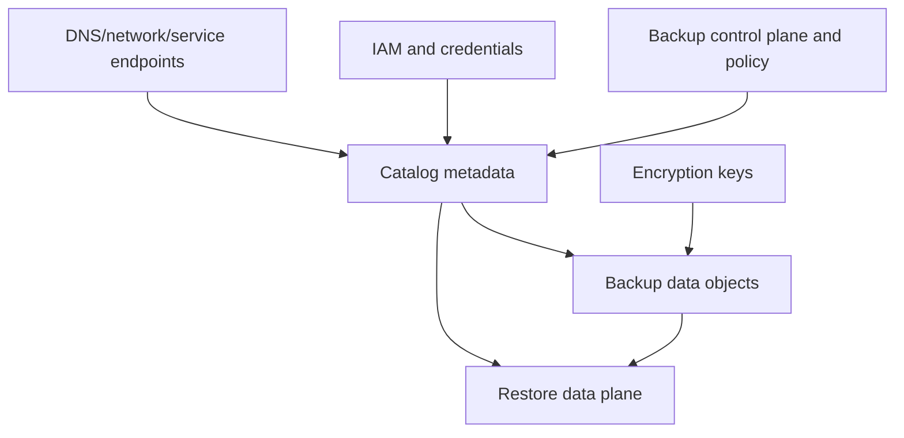

**Synthetic conclusion:** catalog service is unavailable while objects remain. Recovery is not declared until catalog recovery or an approved alternate reconstruction path and restore test succeed.

### Case 11 - Backup job says success but restore fails

**Symptom/scope:** A synthetic nightly backup is green; test restore cannot start the application.

| Competing hypothesis | Prediction | Evidence |
|---|---|---|
| Backup captured crash-inconsistent app state | Files restore but app recovery fails | App quiesce/coordination and logs |
| Missing dependent volumes/config/secrets | Partial dataset restores | Protection inventory and dependency map |
| Restore permissions/network differ | Data is intact but service cannot access | IAM/network/app evidence |
| Corrupt/incomplete backup objects | Integrity/read errors during restore | Checks/integrity and repository evidence |

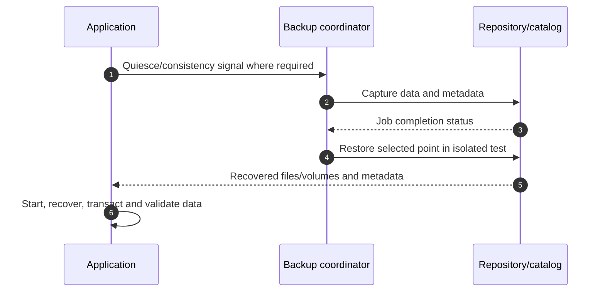

**Synthetic conclusion:** one dependent configuration volume was excluded. `Job success` proved only the configured job, not complete application recoverability.

### Case 12 - Immutability shares the same admin and key failure domain

**Symptom/scope:** Backups are labeled immutable, but the same privileged identity controls source, catalog, repository policy and keys.

| Competing risk | Evidence |
|---|---|
| Administrator can alter retention/delete through another control plane | IAM roles, policy and audit |
| Key deletion makes immutable objects unusable | Key custody/retention/separation |
| Catalog deletion hides recovery | Catalog backup/isolation/reconstruction |
| Network account compromise reaches all copies | Segmentation and independent identities |

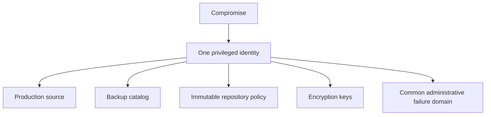

**Synthetic conclusion:** object retention is one layer, but recovery control planes share common fate. Recommendation adds separation of duties, independent credentials/keys/catalog protection and restore tests; it does not claim legal compliance.

### Case 13 - Planned MetroCluster switchover readiness fails

**Symptom/scope:** A synthetic site-maintenance switchover is proposed, but one mirrored aggregate and an application dependency are not ready.

| Competing concern | Evidence |
|---|---|
| Aggregate/plex mirror not healthy | Exact MetroCluster aggregate/plex state |
| SVM configuration replication/dependency incomplete | SVM/config and app topology evidence |
| Network/client path at alternate site untested | DNS, route, LIF, SAN path and app test |
| Protection/backup overlaps maintenance | Job/RPO/RTO/change calendar |

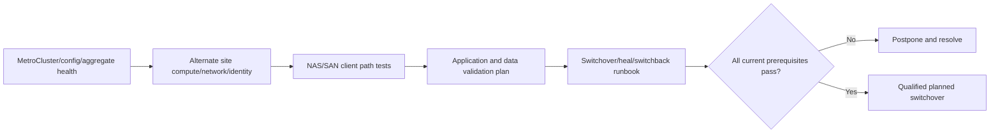

**Synthetic conclusion:** maintenance is postponed. A planned DR action with failed readiness gates is not made safe by calling it nondisruptive.

### Case 14 - Site isolation creates split-brain risk

**Symptom/scope:** Sites cannot communicate; each has partial evidence about the other. Business asks for forced activation.

| Competing hypothesis/risk | Required evidence |
|---|---|
| Remote site is truly down | Independent facility/network/cluster evidence |
| Remote site is alive but isolated | Fencing/authority and third-party observations |
| Storage mirror state permits current recovery path | Exact MetroCluster/aggregate/config state |
| Forced action could create dual writers | Application/network/source isolation proof |

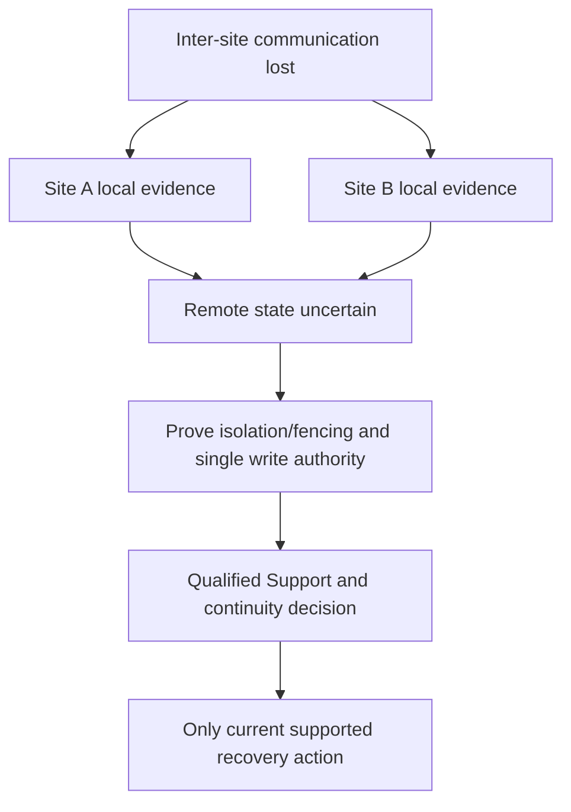

**Synthetic conclusion:** remote state cannot be proven and fencing is incomplete, so forced switchover is not attempted. Protecting single-writer authority outranks pressure to act from incomplete evidence.

### Case 15 - Heal and switchback order is incomplete

**Symptom/scope:** Service runs at surviving site; failed-site infrastructure returns and stakeholders want immediate switchback.

| Competing concern | Evidence |
|---|---|
| Storage/configuration not fully healed | Exact aggregate/plex/config state and current procedure |
| Repaired site dependencies remain stale | Network, identity, compute, application tests |
| New writes have not synchronized safely | Data direction and recovery-point evidence |
| Switchback exceeds application window | Timed rehearsal and rollback/stop criteria |

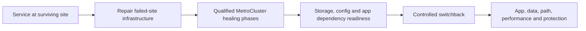

**Synthetic conclusion:** identity/network validation at repaired site fails; switchback is held after storage healing. Storage readiness is necessary but not sufficient.

### Case 16 - DR runbook is stale and RPO/RTO are assumed

**Symptom/scope:** A runbook was last tested 18 months ago; owners, endpoints and application versions changed.

| Competing risk | Evidence/test |
|---|---|
| Contacts/decision rights stale | Role and escalation recertification |
| Technical steps no longer apply | Current topology/release/source review |
| RPO missed | Validated recovery-point age across sample events |
| RTO missed | Timed end-to-end exercise including validation |
| Test omits negative/alternate path | Injected failure and recovery branch |


**Synthetic conclusion:** measured RTO exceeds objective because identity and catalog access take too long. The action addresses access/rehearsal, not just storage transfer speed.

### 🔍 Plain-English deep-dive: RPO and RTO are business outcomes, not product features

A train timetable is not the passenger's actual arrival time. Replication intervals and failover architecture propose capability; achieved RPO/RTO include detection, declaration, data point, catalog/keys, identity, network, compute, application startup, integrity checks and user readiness. **Why it matters:** measure the complete service recovery under an agreed definition.

---

## 7. Cross-case recovery matrix

| Signal | It proves | It does not prove |
|---|---|---|
| Schedule configured | An intended trigger exists | Job ran, completed or met RPO |
| Transfer succeeded | Named data movement completed | Point is app-consistent or restorable |
| Destination healthy | Storage object is available | App dependencies or client access work |
| Backup job green | Configured job completed by its status | All dependencies captured or restore works |
| Immutable label | A retention control may apply | Admin/key/catalog independence or compliance |
| Switchover complete | MetroCluster storage/service role changed | Application, data and RTO validation complete |
| Runbook approved | Document passed review | Current people can execute it within objectives |
| Restore test passed once | Tested point/scope worked then | All workloads/points/current state are recoverable |

```mermaid
flowchart LR
    CONFIG[Configured policy] --> EXEC[Actual job/transfer history]
    EXEC --> POINT[Usable consistent recovery point]
    POINT --> ACCESS[Catalog, identity, keys and network]
    ACCESS --> REC[Restore/activation]
    REC --> APP[Application transaction and data]
    APP --> OBJ[Measured RPO/RTO]
    OBJ --> REPEAT[Recurring test and drift control]
```

---

## 8. Safe protection and DR boundary

```mermaid
flowchart TD
    SIGNAL[Protection/DR signal] --> FREEZE[Freeze exact source/destination roles and state]
    FREEZE --> POINT[Preserve catalogs, points, keys and audit]
    POINT --> IMP[Define RPO/RTO, data loss and service impact]
    IMP --> SOURCE[Current exact product/vendor/Support procedure]
    SOURCE --> AUTH[Business, app, continuity, security, storage and Support owners]
    AUTH --> PLAN[Direction, fencing, consistency, stop/recovery and validation]
    PLAN --> TEST[Isolated or controlled execution]
    TEST --> PROOF[Data, app, objectives, protection and residual risk]
```

### Never use as exploratory shortcuts

- Break, resync, reverse, initialize, delete, release, restore-overwrite, switchover, force, heal or switch back from memory.
- Choose replication direction from source/destination labels after divergence.
- Delete snapshots/backups, shorten retention, remove immutability or keys to free space without owners and governance.
- Declare no data loss, app consistency, RPO/RTO or recoverability without evidence.
- Test DR by exposing two writable copies to uncoordinated applications.
- Share real recovery points, catalogs, keys, topology, legal holds or cyber weaknesses broadly.

---

## 9. Experience transfer and honesty and JD Mapping

```mermaid
flowchart LR
    DATA[SharePoint/OneDrive data-service support] --> CONS[Data, permissions and service dependency thinking]
    CRIT[Critical situation/incident command] --> DR[Impact, authority, restoration and communication]
    ANALYTICS[Analytics and customer reviews] --> RISK[RPO/RTO evidence, trends and actions]
    CHANGE[Cross-team change coordination] --> RUN[Runbook, owners, gates and validation]
    CONS --> TRANS[Transferable protection/DR method]
    DR --> TRANS
    RISK --> TRANS
    RUN --> TRANS
    TRANS --> GAP[Production NetApp protection operations remain a gap]
```

| JD responsibility | Part 78 capability | Honest evidence/boundary |
|---|---|---|
| Stability/risk | Achieved RPO/RTO and recoverability chain | Generic method; synthetic NetApp cases |
| Storage depth | SnapMirror, backup and MetroCluster scenario reasoning | No production operation claim |
| High pressure | Fencing, data direction and recovery decisions | enterprise incident method transfers |
| Customer review | Protection posture, test aging, action tracking | Strong review/analytics experience |
| Cross-functional | App, security, network, continuity, storage, Support roles | Existing coordination strength |
| Recommendations | Runbook/test/remediation and residual risk | Live actions require qualified owners |

### Honest interview wording

> `I treat protection as a recoverability chain: exact source and policy, actual jobs and transfer rates, usable application-consistent points, destination capacity, catalog/identity/keys, documented authority, and a timed application restore. I report achieved recovery-point age and recovery duration, not schedule intent. My production background is Microsoft data-service incidents and continuity coordination; I have not operated NetApp SnapMirror, MetroCluster or backup restoration.`

---

## 10. Labs, drills, and self-test

### Scenario lab

```mermaid
flowchart LR
    SELECT[Work all 16 synthetic cases] --> MAP[Draw source, path, destination, catalog and app]
    MAP --> OBJ[Define data consistency, RPO and RTO]
    OBJ --> HYP[Competing relationship/path/capacity/control hypotheses]
    HYP --> SAFE[Data-direction and authority safeguards]
    SAFE --> TEST[Isolated restore or tabletop/timed exercise]
    TEST --> PROOF[Achieved point/time, data, app and residual risk]
    PROOF --> PANEL[Peer challenge and exact Q1-Q8 aloud]
```

### Required drills

1. Explain baseline/update/lag through change-versus-service rate.
2. Diagnose schedule, labels, peering, network and capacity separately.
3. Write a break decision with point age, fencing and business acceptance.
4. Defend preserving divergent data before resync.
5. Build reverse-replication and failback readiness gates.
6. Select a restore point around a corruption window and consistency requirement.
7. Diagnose intact objects/unavailable catalog and green-job/failed-restore cases.
8. Threat-model immutability across admin, catalog, repository and keys.
9. Reject forced MetroCluster action under ambiguous remote state.
10. Measure full RPO/RTO in a stale-runbook exercise.

### Self-test

1. Define snapshot, replication, backup, archive, baseline, update, lag, break, resync, reverse, switchover, heal and switchback.
2. Distinguish configured schedule from achieved RPO.
3. Diagnose change rate, transfer service, backlog and capacity.
4. Explain data direction and divergence risk.
5. Explain crash versus application consistency.
6. Map catalog, IAM, keys, repository and immutability failure domains.
7. Explain MetroCluster readiness and split-brain prevention.
8. Build a timed restore/DR validation plan.
9. Write customer-safe degraded-protection wording.
10. State safety, privacy, current-source and experience boundaries.

### Lab pass checklist

- [ ] All 16 cases include symptom/scope, controls, competing hypotheses/risks, evidence, conclusion and safe boundary.
- [ ] Baseline, update, lag, peering, network, capacity and relationship state are covered.
- [ ] Break, resync, reverse and restore-direction risks are covered.
- [ ] Backup catalog, job failure, application consistency and immutability are covered.
- [ ] MetroCluster switchover, forced-action ambiguity, heal and switchback are covered.
- [ ] Split-brain/single-writer authority and fencing are explicit.
- [ ] Runbook recency, tabletop, isolated restore and timed app test are included.
- [ ] Achieved recovery-point age and recovery duration are measured under agreed definitions.
- [ ] No destructive relationship, restore, retention, key or MetroCluster operation is prescribed.
- [ ] Business, app, continuity, security, network, storage, customer and Support owners are explicit.
- [ ] All data, points, catalogs, topologies, objectives and outcomes are synthetic and sanitized.
- [ ] No production NetApp protection or DR experience is claimed.
- [ ] Exact Q1-Q8 are answered aloud.

---

## 11. Official and Public Source Anchors

**Date checked: 2026-08-24.** Public sources anchor concepts and current navigation. Exact release, relationship, application, backup service, MetroCluster topology, authorized sources and qualified owners govern live work.

| Topic | Official/public source | Bounded use |
|---|---|---|
| Data protection | [ONTAP data protection and disaster recovery](https://docs.netapp.com/us-en/ontap/data-protection-disaster-recovery/) | Current snapshot, replication and recovery navigation |
| SnapMirror async | [SnapMirror asynchronous disaster recovery](https://docs.netapp.com/us-en/ontap/data-protection/snapmirror-disaster-recovery-concept.html) | Current source/destination/baseline/update orientation |
| SnapMirror sync | [SnapMirror synchronous disaster recovery](https://docs.netapp.com/us-en/ontap/data-protection/snapmirror-synchronous-disaster-recovery-basics-concept.html) | Current mode/state orientation; exact matrix required |
| Replication operations | [ONTAP SnapMirror replication](https://docs.netapp.com/us-en/ontap/data-protection/) | Navigate current create/update/break/resync/reverse/restore procedures; none copied here |
| Backup and Recovery | [NetApp Backup and Recovery documentation](https://docs.netapp.com/us-en/data-services-backup-recovery/) | Current workload, policy, catalog, restore and limitations context |
| MetroCluster concepts | [ONTAP MetroCluster continuous availability](https://docs.netapp.com/us-en/ontap/concepts/mcc-config-concept.html) | Public broad two-cluster/site resilience orientation |
| MetroCluster operations | [ONTAP MetroCluster documentation](https://docs.netapp.com/us-en/ontap-metrocluster/) | Exact current install/manage/maintain/recover navigation |
| MetroCluster IP | [MetroCluster IP documentation](https://docs.netapp.com/us-en/ontap-metrocluster/install-ip/) | Current topology/prerequisite/test context |
| SnapLock/retention | [ONTAP SnapLock](https://docs.netapp.com/us-en/ontap/snaplock/) | Current WORM/retention context; not legal advice or universal backup immutability |
| Support | [NetApp Support Services](https://www.netapp.com/services/support/) | Public context; exact entitlement and recovery route require confirmation |

### Source-use discipline

- Record exact ONTAP/platform/relationship/policy/rules/labels/state and source date.
- Validate exact backup source/target/catalog/IAM/key/retention/restore documentation.
- Use current MetroCluster variant-specific installation/operation/recovery procedure and qualified Support.
- Keep customer points, catalogs, keys, retention, legal holds, topology and RPO/RTO restricted.
- Never infer a command sequence, data direction or guaranteed outcome from this guide.

---

## Likely Interview Questions

### Q1. How do you assess whether protection is actually healthy?

> **Model answer:** `I start with business service, data set, consistency, RPO/RTO and owner; verify source/destination identity, policy/rules/labels/schedule and actual job history; compare source change, transfer service, backlog, network and destination capacity; validate the newest usable application-consistent point; then prove catalog, IAM, keys, runbook and a timed restore. Green policy alone is not recoverability.`

### Q2. Why can lag grow even when updates are scheduled?

> **Model answer:** `A schedule can fire while no eligible point exists, a prior transfer remains active, the path or destination limits service, failures retry, or source change exceeds successful transfer rate. I measure completed recovery-point age, change rate, transfer rate, backlog, job phases, path and destination capacity rather than equating hourly configuration with hourly RPO.`

### Q3. How do you handle break, resync, and reverse replication safely?

> **Model answer:** `Before break I validate destination point/consistency, RPO impact, source fencing, dependencies and business authority. Before resync or reverse I preserve divergent data, identify the last common point and authoritative direction, model catch-up and protection gaps, and use the exact current supported procedure. Source/destination labels do not decide which transactions survive.`

### Q4. How do you select and validate a restore point?

> **Model answer:** `I bound loss/corruption onset, inspect the recovery-point catalog and consistency evidence, choose a likely clean point that meets business tradeoffs, restore to an isolated alternate location where supported, have the application/data owner validate integrity and transactions, then reconcile and authorize production recovery. I avoid overwriting newer good data.`

### Q5. Why can a successful backup still be unrecoverable?

> **Model answer:** `The job may have captured only configured files, omitted dependencies, lacked application quiesce, or succeeded while catalog, IAM, keys, network or restore workflow later fails. Repository objects alone are not enough. I test catalog access, decryption, complete dependency restore, application start, integrity, transaction and measured RTO.`

### Q6. How do you evaluate immutability?

> **Model answer:** `I define the protected object and retention control, then threat-model administrators, control plane, catalog, repository, credentials, encryption keys, legal holds, network and deletion paths. I verify separation of duties, independent identities/keys/catalog protection and restore evidence. An immutable label does not itself prove cyber resilience or compliance.`

### Q7. How do you approach MetroCluster switchover and switchback?

> **Model answer:** `For planned work I validate MetroCluster/aggregate/config health, alternate-site dependencies, client paths, application tests, protection and the current switchover/heal/switchback runbook. During ambiguous site isolation I prove fencing and single-writer authority and use qualified Support before forced action. Switchback waits for healing plus full site/app readiness.`

### Q8. What experience transfers, and what remains your gap?

> **Model answer:** `Microsoft data-service incidents, continuity concepts, critical-situation command, analytics, change coordination and reviews give me strong recoverability and risk communication skills. I have not operated production SnapMirror, backup restore or MetroCluster, so these cases are synthetic and every live relationship or site-role action requires current NetApp sources and qualified owners.`

---

## 30-Second Memory Hooks

- **Protection chain:** Point -> transfer -> destination -> catalog/keys -> restore -> app proof.
- **RPO:** Age of newest usable point, not schedule interval.
- **RTO:** Detection/decision/data/app/user recovery under an agreed clock.
- **Baseline:** First shared lineage; **update:** later selected change.
- **Lag:** Change arrivals minus successful transfer service.
- **Peering:** Trust plus network plus exact identities.
- **Capacity:** Retention and incoming change both consume destination space.
- **Break:** Writable DR role plus fencing and data-loss decision.
- **Resync:** Direction can erase divergence.
- **Reverse:** Replicate current authority back before controlled return.
- **Restore:** Clean point + consistency + isolated validation + reconciliation.
- **Catalog:** Recovery map; objects without it may be stranded.
- **Immutability:** Include admin, key, catalog and control-plane fate.
- **MetroCluster:** Storage/site resilience; app/network recovery remains separate.
- **Split brain:** Prove one writer before forced activation.
- **Runbook:** Current people + current topology + timed exercise.
- **Experience boundary:** Continuity method transfers; NetApp protection operation does not.

---

## Completion Checklist

- [ ] Define service/data owner, consistency, RPO/RTO, impact and data-loss tolerance.
- [ ] Record exact source/destination identity, release, relationship, policy, labels, schedule and state.
- [ ] Measure source change, transfer service, backlog, failures, path and destination capacity.
- [ ] Calculate achieved recovery-point age from a validated usable point.
- [ ] Validate catalog, IAM, keys, repository, retention, immutability and isolation.
- [ ] Protect source fencing, single-writer authority and data direction.
- [ ] Preserve divergent data before resync/reverse/failback.
- [ ] Select clean restore points and validate application consistency in isolation.
- [ ] Cover all 16 replication, backup, restore, MetroCluster and runbook cases.
- [ ] Measure full application recovery duration under agreed RTO definition.
- [ ] Use current exact NetApp/backup/MetroCluster/Support sources and owners.
- [ ] Avoid destructive relationship, point, retention, key, restore and site-role shortcuts.
- [ ] Protect customer data, catalogs, keys, topology, legal holds and continuity weaknesses.
- [ ] Keep business, app, continuity, security, network, storage, customer and Support ownership explicit.
- [ ] Complete labs, drills, self-test and exact Q1-Q8 aloud.
- [ ] State the explicit no-production-NetApp boundary.

---

*Next suggested section:* [Part 79 - Upgrade, Compatibility, Firmware, and Change-Failure Scenarios](Part-79-upgrade-compatibility-change-scenarios.md)