# Part 79 - Upgrade, Compatibility, Firmware, and Change-Failure Scenarios

> **Section goal:** Turn upgrades and cross-stack changes into evidence-gated state transitions rather than calendar-driven tasks. By the end, Arti should be able to diagnose failed prechecks, invalid upgrade paths, IMT and HWU gaps, bug/advisory applicability, firmware/Host Utilities/multipath/switch mismatches, partial and mixed states, constrained rollback, post-upgrade regression, application constraints, and change collisions; then make a defensible go/no-go decision with owners, stop gates, validation, and residual risk.

Covers index item **79** and maps directly to job-description responsibilities for upgrade advice, supportability, lifecycle risk, technical analysis, customer reviews, complex change coordination, high-pressure communication, and Support/Engineering engagement.

**Explicit nonclaim:** Arti has not planned, approved, executed, stopped, rolled back, or validated a production ONTAP, NetApp hardware/firmware, host, hypervisor, switch, multipath, or application-integrated upgrade.

**Privacy/access:** Change evidence can expose customer inventory, versions, serials, topology, vulnerabilities, bugs, support contracts, maintenance windows, application dependencies, business freezes, recovery plans, credentials, and vendor positions. Use authorized minimum collection, approved repositories, secure links, need-to-know access, redaction, retention, and controlled vendor sharing. Never publish real IMT/HWU results, bugs, Upgrade Advisor output, runbooks, or customer versions in study artifacts.

**Synthetic-evidence rule:** Every customer, product, release, path, result, compatibility state, defect, advisory, version, firmware, precheck, change, owner, timestamp, decision, rollback, and outcome below is fictional and sanitized. No table is a live IMT, HWU, Upgrade Advisor, Bugs Online, Support, vendor, or customer result.

**Version/current source caveat:** ONTAP release support, upgrade paths, Upgrade Advisor/Health Checker, prechecks, IMT/HWU, host utilities, drivers, firmware, switches, bugs, advisories, application certification, mixed-version behavior, and rollback options change. A **current-source check** means reopening exact current authorized results and official release/platform/application/vendor guidance for every current, intermediate, target, and rollback state immediately before a live decision.

This Part is a reasoning casebook, not an upgrade runbook, current support declaration, internal NetApp process, firmware bundle, command reference, bug applicability decision, rollback guarantee, or authorization to change production.

> **No-production-NetApp boundary:** Arti's factual strengths are Microsoft enterprise support, release/change incidents, Product/Engineering collaboration, Azure/Windows networking, technical risk analysis, stakeholder communication, analytics, and validation. Her exact nonclaim is: **she has not owned or executed a production NetApp or ONTAP upgrade.** All cases are synthetic planning and troubleshooting exercises.

---

## 1. An upgrade is a sequence of complete support states

| Term | Plain meaning | Analogy | Why it matters |
|---|---|---|---|
| **Current state** | Exact environment before change | Starting station | Must be healthy and fully inventoried |
| **Target state** | Exact intended environment after change | Destination station | Must meet business, lifecycle and support goals |
| **Intermediate state** | Temporary combination during rollout | Transfer station | Can be unsupported even when endpoints are supported |
| **Precheck** | Automated/manual readiness check | Pre-flight checklist | A pass is one gate, not complete assurance |
| **IMT** | Interoperability Matrix Tool for exact supported ecosystem recipes | Approved recipe book | Product-family compatibility is insufficient |
| **HWU** | Hardware Universe for exact platform/component rules and limits | Hardware fit-and-rule catalog | Physical fit is not supported configuration |
| **Go/no-go gate** | Evidence-based decision checkpoint | Launch hold point | Stops calendar pressure from overriding safety |
| **Rollback** | Return toward a prior acceptable state where supported | Return route | May be limited, slow, lossy, or unavailable |
| **Regression** | Previously acceptable behavior worsens after change | New route makes trip worse | Requires comparable baseline and causal evidence |

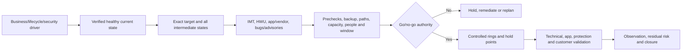

### 🔍 Plain-English deep-dive: endpoint support does not prove the journey

Two cities can each be safe while the bridge between them is closed. Likewise, current and target versions can each be supported, but a direct path, intermediate mixed state, host/driver combination, or application cutover may not be. **Why it matters:** validate every state the environment will actually occupy.

---

## 2. The change evidence contract

Capture exact:

- Business driver, service criticality, success criteria, deadline, maintenance constraint and risk appetite.
- Cluster/node/platform/ONTAP current build, target, exact supported path and intermediate states.
- Healthy baseline: HA, cluster, storage, capacity, performance, protection, telemetry and open incidents.
- Protocol/SVM/LIF/volume/LUN/relationship/security features and application dependencies.
- Host OS/kernel/hypervisor, Host Utilities, multipath, adapter, driver, firmware.
- Switch model/OS, path topology, target adapter/firmware and hardware components.
- Current and target IMT recipes/results/notes; HWU platform/component rules.
- Release notes/cautions, bugs, security advisories, lifecycle and application/vendor certification.
- Prechecks, Upgrade Advisor/Health Checker evidence where authorized, gaps and waivers.
- Rings, hold points, stop/recovery/rollback constraints, communications and owners.
- Before/during/after technical and customer validation plus observation window.

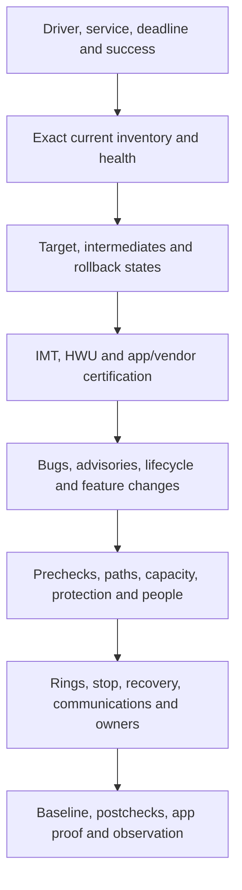

### State table

| State | Must be validated |
|---|---|
| Current | Healthy, supportable, recoverable, accurately inventoried |
| First intermediate | Exact mixed ONTAP/host/switch/firmware combinations |
| Every hold point | HA, paths, protocols, app, protection, telemetry |
| Target | Complete end-to-end support and business outcome |
| Rollback/recovery | Feasibility, data direction, artifacts, time, support |

---

## 3. Compatibility is combinational

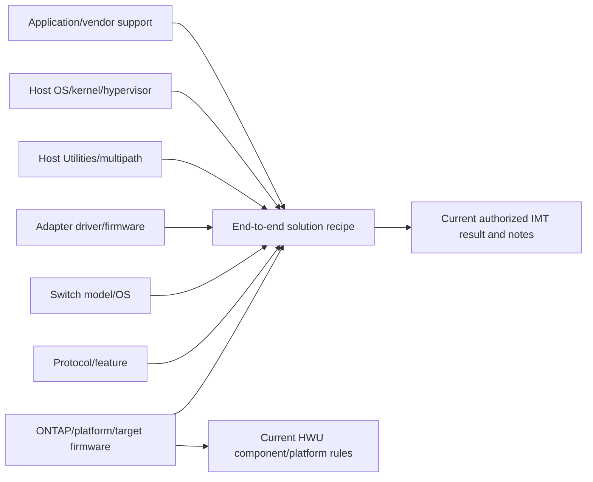

### Supportability states

| State | Meaning |
|---|---|
| Listed supported | Exact recipe appears with applicable notes/policies at evidence date |
| Unlisted | No complete matching recipe found; not proof of technical impossibility |
| Mismatch | Actual value differs from required result/note |
| Unknown | Value or access/evidence missing |
| Vendor-specific gap | App, hypervisor, switch, OS or other vendor requirement unresolved |

### 🔍 Plain-English deep-dive: `not found` is a result, not permission to guess

If a medication combination is absent from an approved reference, a clinician does not infer safety from the individual medicines. **Why it matters:** document search method and exact missing component, then use authorized Support/vendor resolution or redesign. Do not convert `unlisted` into either `supported` or `will fail` without evidence.

---

## 4. Fully synthetic sanitized scenario(s): precheck, path, IMT, HWU, and defect cases 1-5

### Case 1 - Upgrade precheck fails on cluster health

**Symptom/scope:** A synthetic upgrade readiness check reports an unresolved HA/cluster health condition.

| Competing hypothesis | Prediction | Decisive evidence |
|---|---|---|
| Active health issue blocks safe sequencing | Current state/event matches documented blocker | Exact precheck, health and official source |
| Stale resolved event | Current state healthy; check data stale | Fresh rerun/source timestamps and direct evidence |
| Monitoring/identity mismatch | Check references another node/object | Stable identities and scope |
| Tool/access gap | Check incomplete rather than failed | Manifest/status and missing evidence |

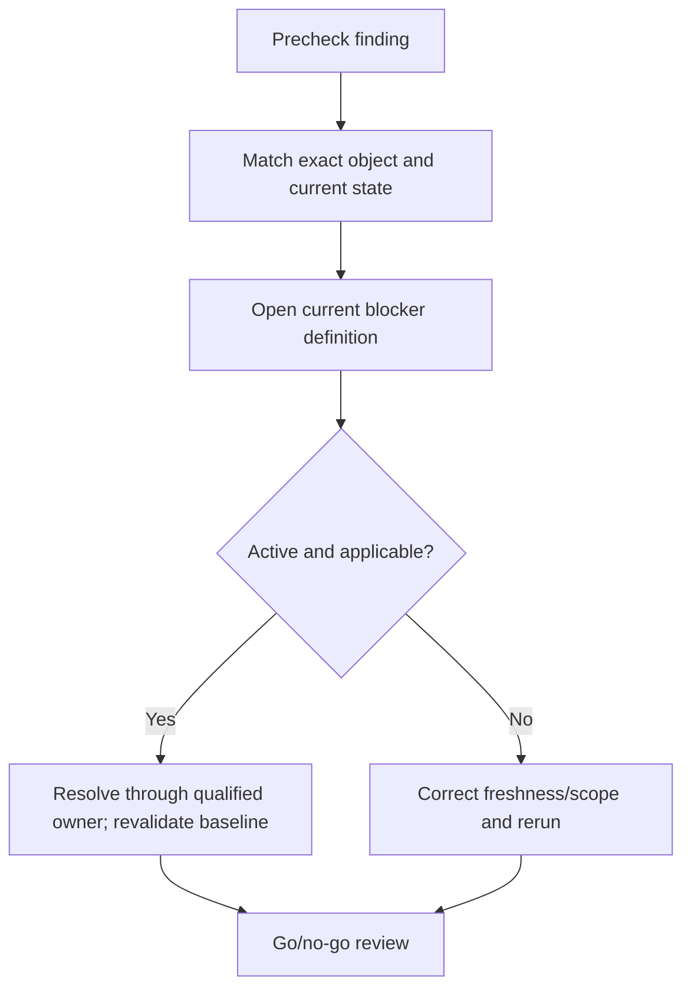

**Synthetic conclusion:** a real degraded path remains; the change is held. **Boundary:** do not suppress or override a blocker to preserve the calendar.

### Case 2 - Proposed direct upgrade path is invalid

**Symptom/scope:** The desired target is supported, but the current-to-target transition is not a current documented direct path.

| Competing hypothesis | Prediction | Evidence |
|---|---|---|
| Direct multi-hop automation is supported | Current path table/tool explicitly models intermediate image | Current official path and authorized plan |
| Separate staged upgrades required | Each intermediate needs independent execution/checkpoint | Current documentation and target selection evidence |
| Current inventory is wrong | Actual build changes path result | Direct cluster/build evidence |

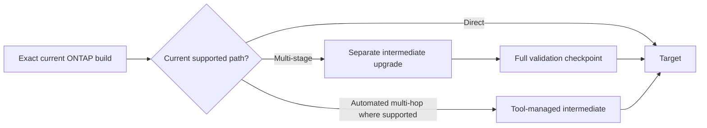

**Synthetic conclusion:** two separately governed stages are required. Window, testing and rollback assumptions are replanned rather than compressing steps.

### Case 3 - IMT has no exact target recipe

**Symptom/scope:** Target ONTAP plus host OS is found, but the exact adapter driver/firmware and multipath combination is not listed.

| Competing hypothesis | Prediction | Evidence |
|---|---|---|
| Search criteria/category wrong | Correct solution/search reveals recipe | Reproducible search and IMT workflow |
| Exact component value unlisted | No complete result after notes/history review | Saved result/search evidence |
| Planned host update creates listed target | Target bundle exists with prerequisites | Full target recipe and vendor docs |
| Policy exception exists | Current authorized note/process explicitly applies | Support/IMT policy evidence |

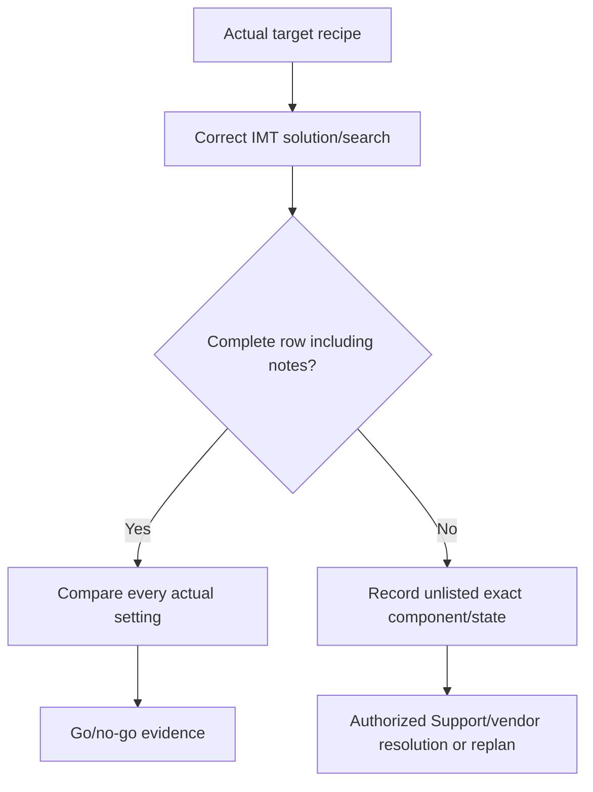

**Synthetic conclusion:** driver/firmware pair is unlisted. The change is no-go until a listed coordinated target or authorized resolution exists. No invented IMT result is used.

### Case 4 - HWU gap for an adapter and target release

**Symptom/scope:** A physical adapter fits the platform, but exact slot/port personality/release support is unclear.

| Competing hypothesis | Prediction | Evidence |
|---|---|---|
| Part unsupported in platform/slot | HWU excludes exact part/slot/release | Authorized HWU result/notes |
| Port mode differs after target | Current docs show personality/firmware constraint | Platform/adapter guidance |
| Inventory part number is wrong | Physical/support records disagree | Serial/FRU/slot reconciliation |

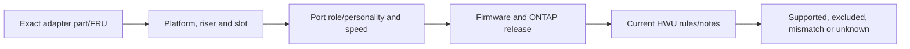

**Synthetic conclusion:** exact part is valid only in another slot under the fictional evidence. Physical fit/link-up is not proof. Hardware redesign/service uses qualified platform owners.

### Case 5 - Bug or security advisory may affect the target

**Symptom/scope:** A candidate release has a public/gated issue resembling a customer feature and trigger.

| Competing hypothesis | Prediction | Evidence |
|---|---|---|
| Applicable/exposed | Exact product/release/feature/config/trigger present | Current advisory/defect plus customer evidence |
| Applicable but mitigated | Compensating setting removes trigger under source | Control evidence and source wording |
| Not applicable | Product/feature/trigger differs | Exact comparison |
| Unknown | Gated source/customer state unavailable | Explicit evidence gap and owner |

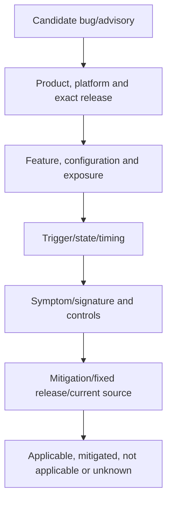

**Synthetic conclusion:** target is technically affected but the customer feature is disabled; target selection still considers lifecycle and future enablement. Severity, exposure and upgrade priority remain separate.

---

## 5. Fully synthetic sanitized scenario(s): firmware, host, multipath, switch, and mixed-state cases 6-10

### Case 6 - Firmware mismatch appears during pre-validation

**Symptom/scope:** One adapter or drive/shelf component is below the target-recommended/supported firmware state.

| Competing hypothesis | Prediction | Evidence |
|---|---|---|
| Firmware mismatch is real/applicable | Exact component/part/current version differs from current source | Direct inventory and HWU/platform/IMT evidence |
| Inventory is stale | Live value differs from report | Fresh authorized source and identity |
| Firmware can be sequenced independently | Current procedure supports safe pre/post stage | Vendor/platform guidance and HA/path plan |
| Combined change increases risk | Firmware and ONTAP changes obscure attribution/recovery | Dependency and rollback analysis |

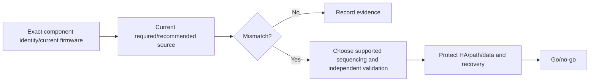

**Synthetic conclusion:** inventory is stale; fresh evidence shows compliant firmware. The correction still updates the source of truth before approval.

### Case 7 - Host Utilities/multipath setting is stale

**Symptom/scope:** Target ONTAP is listed, but host device handler/path policy differs from current host guidance.

| Competing hypothesis | Prediction | Evidence |
|---|---|---|
| Old Host Utilities/config leaves unsupported path policy | Exact settings differ and path test exposes issue | Host report, current docs, path failure test in safe scope |
| Storage-side path state issue | Target ALUA/ANA state wrong across hosts | Target and control-host evidence |
| Driver/firmware combination is root gap | All hosts with exact recipe affected | Fleet partition and IMT result |

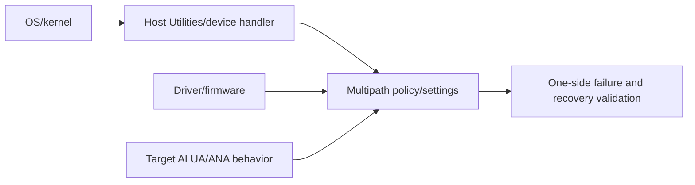

**Synthetic conclusion:** stale multipath setting is a blocker; host remediation is separated and validated before ONTAP change. `Paths visible` is not enough.

### Case 8 - Switch OS change creates an unsupported intermediate state

**Symptom/scope:** Storage and host targets are supported, but updating one of two fabrics creates a temporary mixed switch-OS state.

| Competing hypothesis | Prediction | Evidence |
|---|---|---|
| Mixed fabric versions are supported during rollout | Vendor/IMT notes explicitly permit state | Exact intermediate recipe and notes |
| Fabric independence makes mix irrelevant | Hosts still depend on cross-fabric common components/settings | Physical/logical topology and host policy |
| One-fabric-at-a-time provides safe rollback | Surviving fabric has tested capacity/path recovery | Failure test, load and rollback plan |

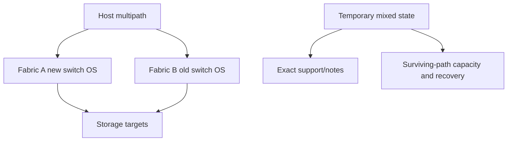

**Synthetic conclusion:** mixed state is unlisted and the surviving fabric lacks validated peak capacity. Rollout is redesigned rather than assumed safe from dual fabrics.

### Case 9 - ONTAP change stops in a partial/mixed state

**Symptom/scope:** A synthetic multi-node upgrade pauses after one node transition; service is available but cluster state is mixed.

| Competing hypothesis/risk | Prediction | Evidence |
|---|---|---|
| Supported transient mixed state | Current procedure identifies state and next action | Exact job/cluster/version and official source |
| Health blocker prevents continuation | New event/precheck condition appears | Health/job/error chronology |
| Rolling back changed node is supported | Current procedure explicitly permits and prerequisites pass | Authorized Support/upgrade guidance |
| Continuing increases risk | Client paths, HA or protection already degraded | End-to-end validation |

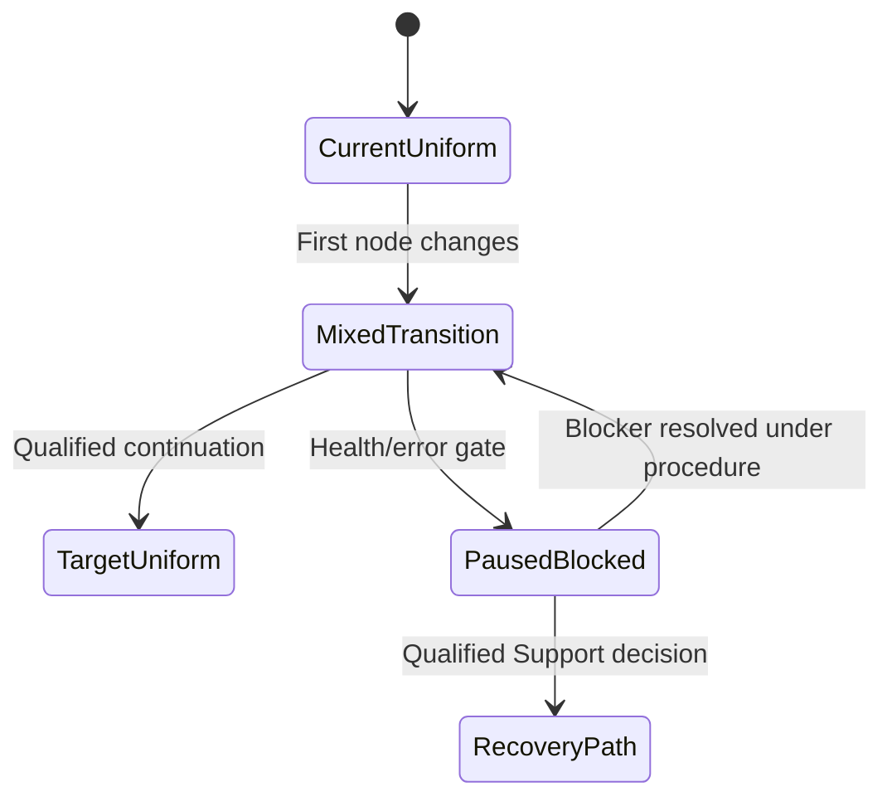

**Synthetic conclusion:** a path-health blocker requires hold and Support engagement. Service available does not justify improvising continuation or rollback.

### Case 10 - Host rollout creates unsupported fleet drift

**Symptom/scope:** Half the hosts have new OS/driver/firmware; others remain old, and one application cluster spans both rings.

| Competing hypothesis/risk | Evidence |
|---|---|
| Each endpoint recipe supported but cluster mix unsupported | App/vendor cluster support and IMT |
| Failover crosses incompatible states | Cluster ownership/path tests and app evidence |
| Inventory cannot identify ring accurately | Stable asset/version reconciliation |
| Rollout ring is too broad | Impact and control comparison |

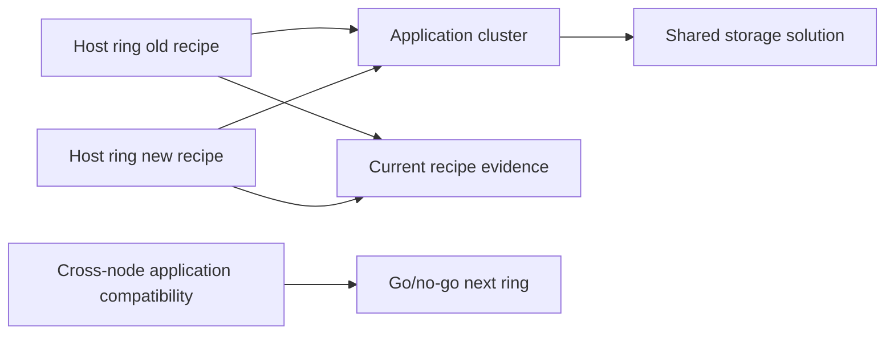

**Synthetic conclusion:** application vendor does not certify mixed cluster nodes. Rollout pauses before another node; exact cross-node state is treated as part of the recipe.

### 🔍 Plain-English deep-dive: mixed state is a real production configuration

A bridge under construction carries traffic through a temporary lane pattern; that pattern needs its own safety analysis. **Why it matters:** rolling changes create combinations of old/new nodes, hosts, drivers, switches, firmware and paths. Inventory and validate them rather than treating them as brief, invisible transitions.

---

## 6. Fully synthetic sanitized scenario(s): rollback, regression, application, collision, and decision cases 11-16

### Case 11 - Rollback is constrained or impossible

**Symptom/scope:** A post-change issue appears, but returning to the exact prior state may not be supported or may require restore/rebuild.

| Competing option | Evidence/risk |
|---|---|
| Continue forward to qualified fix | Known path/fix, current stability and time |
| Recover configuration/state without downgrade | Exact supported procedure and data effect |
| Restore/rebuild component | Recovery point, app consistency, RTO and data loss |
| Maintain mitigation while Engineering investigates | Sustainability, residual risk and monitoring |

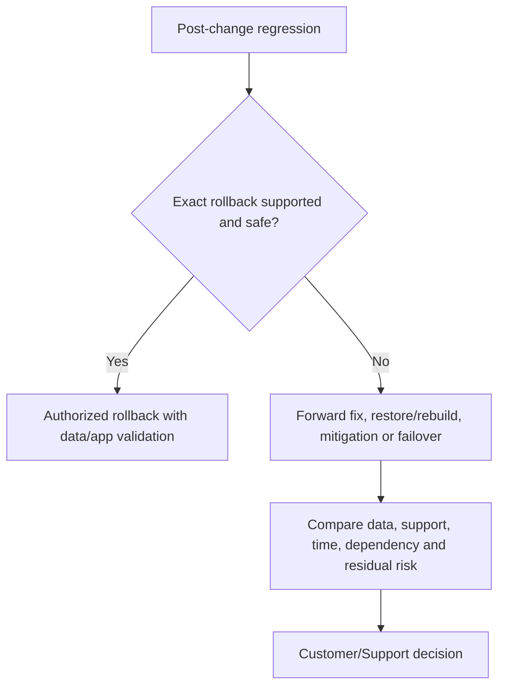

**Synthetic conclusion:** downgrade is unsupported; a bounded mitigation plus Support-led forward fix is safer. A rollback plan must describe limitations before change, not appear after failure.

### Case 12 - Performance regression after upgrade

**Symptom/scope:** Application p99 rises after ONTAP change; averages and total load also changed.

| Competing hypothesis | Prediction | Evidence/test |
|---|---|---|
| Product regression | Same workload/control worsens only on target and matches signature | Normalized baseline/canary and current bug evidence |
| Workload seasonality/change | Fingerprint/volume differs | Workload normalization and prior season control |
| Path/host setting changed with upgrade window | Host/fabric difference aligns | Change ledger and per-path evidence |
| Cache warmup/background post-work | Temporary state converges over documented window | Cache/job/time evidence |

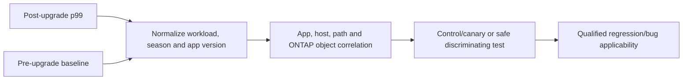

**Synthetic conclusion:** a simultaneous host path-policy change explains tail; ONTAP regression is weakened. The change ledger prevents a false product claim.

### Case 13 - Application certification blocks an otherwise supported stack

**Symptom/scope:** ONTAP/host/driver recipe is listed, but the business application vendor has not certified the target.

| Competing option | Evidence |
|---|---|
| Defer until certification | Lifecycle/security/business deadline tradeoff |
| Use supported application target/patch | Vendor matrix and test plan |
| Seek documented exception | Authorized app/vendor and customer risk process |
| Migrate workload or isolate ring | Architecture, cost and recovery evidence |

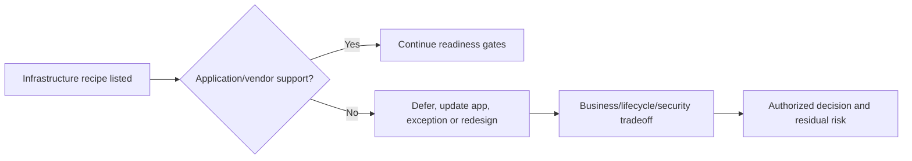

**Synthetic conclusion:** no-go until application owner/vendor resolves certification. IMT does not replace application support.

### Case 14 - Change collision with backup and network maintenance

**Symptom/scope:** ONTAP upgrade, switch work, and full backup are scheduled in the same weekend.

| Competing risk | Evidence |
|---|---|
| Simultaneous path and storage transition removes recovery margin | Dependency/failure-domain map |
| Backup consumes capacity/bandwidth and obscures attribution | Schedule/resource model |
| Rollback depends on network or backup unavailable during collision | Recovery dependency analysis |
| Combined window is necessary | Business deadline and alternative sequencing |

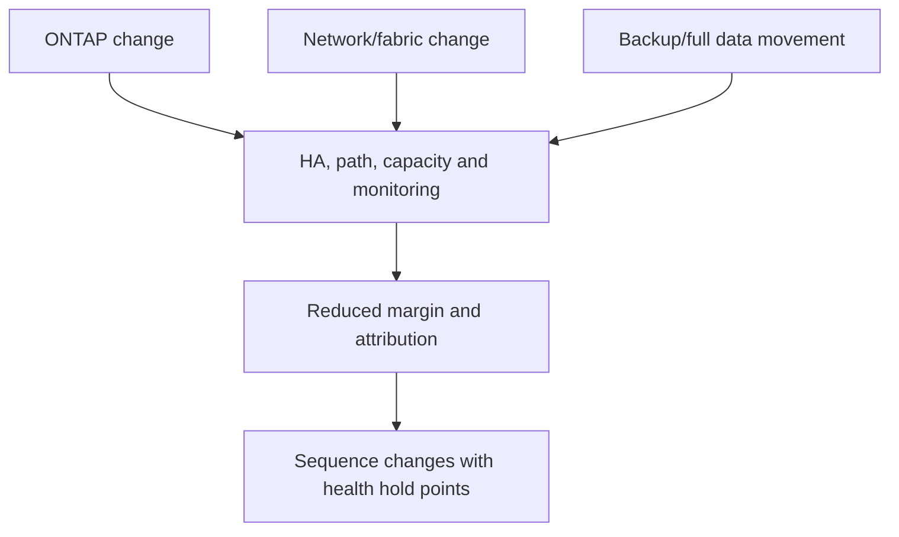

**Synthetic conclusion:** changes are sequenced into separate windows with restored baseline between them. Calendar efficiency does not outweigh common-failure and rollback risk.

### Case 15 - Protocol regression affects only new sessions

**Symptom/scope:** Existing SMB/NFS/iSCSI sessions continue after change; new sessions fail.

| Competing hypothesis | Prediction | Evidence |
|---|---|---|
| DNS/time/identity/control-plane dependency | New-session setup fails before data I/O; existing state persists | Protocol stage and dependency evidence |
| Protocol service regression | Exact target version/signature affects session setup | Server/client trace and defect qualification |
| Firewall/session policy changed | New flow state blocked; old state survives | Both-direction flow and firewall change |
| Certificate/key change | New authentication/negotiation fails | Auth/certificate evidence |

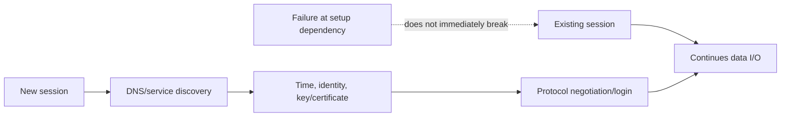

**Synthetic conclusion:** a firewall policy deployment blocks new connection state; storage data service is healthy. Recovery validates both existing and new sessions across failover paths.

### Case 16 - Go/no-go decision has unresolved unknowns

**Symptom/scope:** Maintenance deadline is close; one low-frequency workload has no representative test and a gated bug review is pending.

| Gate | Go evidence | No-go/hold evidence |
|---|---|---|
| Current health | All layers healthy and recoverable | Open degradation or stale evidence |
| Compatibility | Complete current/intermediate/target recipes | Unlisted/mismatch/unknown critical component |
| Product risk | Bugs/advisories assessed | Applicable or unresolved material trigger |
| Application | Representative validation/certification | Critical workload untested/uncertified |
| Recovery | Feasible stop/recovery and artifacts | Unsupported/untimed rollback |
| Operations | Owners, window, communications, capacity | Collision, missing owner or fatigue risk |

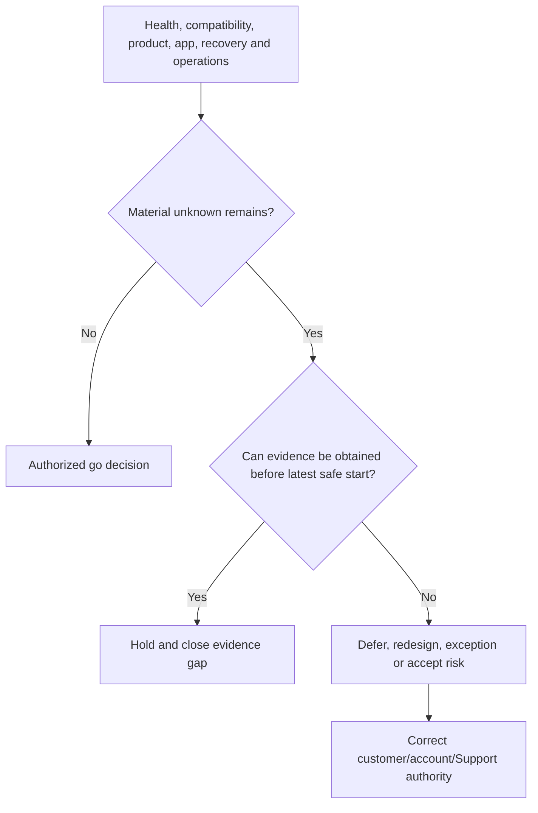

**Synthetic conclusion:** no-go because the unknown affects a critical workload and rollback is constrained. The decision record states deadline impact and the evidence required to reopen.

### 🔍 Plain-English deep-dive: no-go is an engineering outcome, not a failure of courage

A pilot aborting takeoff after a warning protects the mission. **Why it matters:** a hold preserves service and creates time to close a material evidence gap. Go decisions should reward readiness, not optimism or sunk planning effort.

---

## 7. Go/no-go and regression proof

### Go/no-go record

| Field | Content |
|---|---|
| Decision/time | Go, conditional go, hold/no-go; timestamp and authority |
| Driver/deadline | Business, lifecycle, security and latest safe start |
| Evidence cutoff | Exact sources, dates, inventories and freshness |
| Gate results | Health, compatibility, bugs, app, recovery, operations |
| Unknowns/exceptions | Materiality, owner, deadline and compensating control |
| Plan | Rings, sequence, hold points, communications |
| Stop/recovery | Trigger, authority, feasibility and data impact |
| Validation | Technical/app/protection/customer success and observation |
| Residual risk | Owner, acceptance, monitoring and reopen trigger |

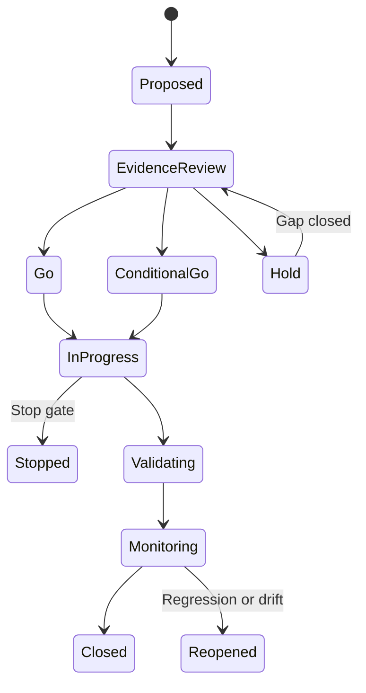

### Regression proof

Require comparable workload/season/configuration, before/after customer SLO and distributions, exact layer mechanism, controls or canary, alternate hypotheses, and response to a qualified correction. Temporal order alone is not enough.

---

## 8. Safe upgrade and change boundary

```mermaid
flowchart TD
    ASK[Change proposal] --> FREEZE[Freeze exact current/target/intermediate states]
    FREEZE --> SOURCES[Current IMT, HWU, docs, bugs, advisories and app support]
    SOURCES --> BASE[Healthy baseline, protection and recovery]
    BASE --> PLAN[Rings, owners, window, stop/recovery and communications]
    PLAN --> GATE{Authorized go/no-go}
    GATE -->|No| HOLD[Do not execute]
    GATE -->|Yes| EXEC[Qualified current procedure]
    EXEC --> VALID[App, path, data, protection and observation]
```

### Never use as exploratory shortcuts

- Override prechecks, force continuation, improvise direct paths, or assume rollback.
- Treat `not found` in IMT/HWU as supported or impossible without authorized resolution.
- Upgrade ONTAP, firmware, drivers, Host Utilities, switches, paths, protocols, or applications from remembered bundles.
- Stack unrelated changes, skip mixed-state validation, or change multiple failure domains before a hold point.
- Declare a bug or regression from temporal proximity alone.
- Publish gated IMT/HWU/bug/advisory/customer inventory or runbook evidence.

---

## 9. Arti transfer/honesty and JD Mapping

```mermaid
flowchart LR
    MS[Microsoft release/change incidents] --> GATE[Readiness, stop and validation discipline]
    ENG[Product/Engineering collaboration] --> BUG[Regression and defect qualification]
    AZ[Azure/Windows/networking] --> CROSS[Host, path and dependency analysis]
    ANALYTICS[Analytics and reviews] --> RISK[Evidence, decisions and residual risk]
    GATE --> TRANS[Transferable upgrade method]
    BUG --> TRANS
    CROSS --> TRANS
    RISK --> TRANS
    TRANS --> GAP[Production ONTAP upgrade execution remains a gap]
```

| JD responsibility | Part 79 capability | Honest evidence/boundary |
|---|---|---|
| Upgrade advice | State/path/compatibility/go-no-go framework | Synthetic NetApp plan only |
| Supportability | IMT/HWU/app/vendor exact-recipe discipline | No live tool-result claim |
| Risk mitigation | Prechecks, bugs/advisories, rollback and hold gates | Existing escalation/change reasoning transfers |
| Cross-functional | Host/fabric/storage/app/security owner sequencing | Microsoft coordination evidence |
| High pressure | Partial state, regression and no-go communication | Production Microsoft incidents |
| Customer review | Lifecycle roadmap, evidence and residual risk | Existing review/analytics strength |

### Honest interview wording

> `I treat an upgrade as a chain of exact current, intermediate, target and recovery states. I verify healthy baseline, current path, IMT/HWU and application support, bugs/advisories, host/driver/firmware/switch dependencies, protection, rings, stop gates and validation. I will recommend no-go when a material unknown or unsupported state remains. My production change experience is Microsoft-based; I have not executed an ONTAP upgrade.`

---

## 10. Labs, drills, and self-test

### Scenario lab

```mermaid
flowchart LR
    SELECT[Work all 16 synthetic cases] --> STATES[Inventory current, intermediate, target and recovery states]
    STATES --> SOURCES[Collect current IMT/HWU/app/bug/advisory evidence]
    SOURCES --> GAPS[Classify listed, unlisted, mismatch and unknown]
    GAPS --> PLAN[Sequence rings, hold points and collision controls]
    PLAN --> DEC[Write go/no-go decision]
    DEC --> REG[Inject partial state/regression and respond]
    REG --> PANEL[Peer challenge and exact Q1-Q8 aloud]
```

### Required drills

1. Triage failed precheck without override.
2. Distinguish direct, automated multi-hop and multi-stage path concepts using current evidence.
3. Document an IMT unlisted recipe and escalation ask.
4. Resolve an HWU part/slot/release gap.
5. Build bug/advisory applicability table.
6. Sequence firmware, Host Utilities, host and switch changes with independent validation.
7. Inventory every mixed state in a rolling change.
8. Compare forward fix, rollback, restore and mitigation after a regression.
9. Separate application certification from infrastructure support.
10. Defend a no-go to an executive with deadline impact and reopen criteria.

### Self-test

1. Define current, target, intermediate, precheck, IMT, HWU, go/no-go, rollback and regression.
2. Explain why endpoint support is insufficient.
3. Build an exact end-to-end compatibility recipe.
4. Handle unlisted/mismatch/unknown evidence honestly.
5. Assess bug/advisory applicability.
6. Explain firmware/host/multipath/switch sequencing.
7. Manage partial/mixed state safely.
8. Prove or weaken a post-upgrade regression.
9. Build complete go/no-go gates and decision record.
10. State privacy, current-source, safety and experience boundaries.

### Lab pass checklist

- [ ] All 16 cases have symptom/scope, controls, competing hypotheses/risks, evidence, conclusion and boundary.
- [ ] Failed precheck and invalid path cases are covered.
- [ ] IMT and HWU gaps are classified without invented results.
- [ ] Bugs/advisories include exact applicability and uncertainty.
- [ ] Firmware, Host Utilities, multipath, driver and switch states are covered.
- [ ] Partial ONTAP and mixed host/fabric states are treated as real configurations.
- [ ] Rollback constraints, post-change performance/protocol regression and application certification are covered.
- [ ] Change collision and evidence-based go/no-go are covered.
- [ ] Every current/intermediate/target/recovery state has support and validation evidence.
- [ ] Rings, hold points, stop/recovery, communications and owners are explicit.
- [ ] No precheck override, forced path, unsupported bundle, improvised rollback or bug claim is proposed.
- [ ] All versions, tools, defects, plans, evidence and outcomes are synthetic and sanitized.
- [ ] No production NetApp upgrade experience or live tool result is claimed.
- [ ] Exact Q1-Q8 are answered aloud.

---

## 11. Official and Public Source Anchors

**Date checked: 2026-08-24.** Public sources anchor concepts and current navigation. Exact authorized Upgrade Advisor/Health Checker, IMT, HWU, Bugs Online, release, application/vendor and customer evidence govern live decisions.

| Topic | Official/public source | Bounded use |
|---|---|---|
| ONTAP upgrade | [Learn about ONTAP upgrades](https://docs.netapp.com/us-en/ontap/upgrade/) | Current upgrade preparation/path/process navigation |
| Target selection | [Choose a target ONTAP version](https://docs.netapp.com/us-en/ontap/upgrade/choose-target-version.html) | Current public target orientation; complete validation still required |
| Upgrade planning tools | [Prepare with Upgrade Advisor or Upgrade Health Checker](https://docs.netapp.com/us-en/ontap/upgrade/create-upgrade-plan.html) | Current access/tool/blocker orientation; authorized result required |
| Configuration validation | [Confirm target hardware configuration](https://docs.netapp.com/us-en/ontap/upgrade/confirm-configuration.html) | Current HWU/SAN support verification orientation |
| IMT | [Interoperability Matrix Tool](https://imt.netapp.com/) | Authorized exact current/intermediate/target recipe and notes |
| IMT workflow | [IMT documentation](https://docs.netapp.com/us-en/interoperability-matrix-tool/) | Current solution/search/result workflow orientation |
| HWU | [Hardware Universe](https://hwu.netapp.com/) | Authorized exact hardware part/slot/port/release rules |
| SAN hosts | [ONTAP SAN hosts and cloud clients](https://docs.netapp.com/us-en/ontap-sanhost/) | Current OS/Host Utilities/multipath/driver/firmware navigation |
| Bugs | [NetApp Bugs Online](https://mysupport.netapp.com/site/bugs-online) | Authorized current defect records only |
| Release support | [ONTAP release support](https://docs.netapp.com/us-en/ontap/release-notes/release-support-reference.html) | Current public release support context; dates/capabilities can change |
| Security advisories | [NetApp Security Advisories](https://security.netapp.com/advisory/) | Current public advisory source; exact product/exposure required |

### Source-use discipline

- Record exact current, intermediate, target and recovery values plus source/revision/date.
- Save authorized IMT results/notes and HWU evidence; do not summarize from memory.
- Reopen exact current release notes/cautions, bugs/advisories and application/vendor matrices.
- Protect customer inventory, gated tool exports, bugs, runbooks, vulnerabilities and decisions.
- Use qualified change, application, host, fabric, storage, security, customer and Support owners.

---

## Likely Interview Questions

### Q1. How do you plan an upgrade safely?

> **Model answer:** `I start with business driver, service and deadline, then freeze a healthy exact current inventory. I select the target and every intermediate/recovery state, validate IMT/HWU and application/vendor support, release notes/cautions, bugs/advisories, firmware/host/switch dependencies, capacity/protection and prechecks, then use rings, hold points, stop/recovery, communications and customer/application validation before closure.`

### Q2. Why must you validate intermediate and mixed states?

> **Model answer:** `Rolling changes create real combinations such as one node new/one old, one fabric new/one old, target ONTAP with old hosts, or clustered app nodes on different recipes. Endpoints can be supported while a temporary state is unlisted or loses recovery margin. I inventory each state and validate support, paths, capacity and app behavior.`

### Q3. How do you handle a failed precheck or invalid path?

> **Model answer:** `I match the finding to exact current object/state and source, distinguish active blocker from stale/incomplete evidence, resolve through the qualified owner and rerun the complete baseline. For path I verify exact current and target in current docs or authorized plan, distinguish direct, tool-managed multi-hop and separate multi-stage behavior, and replan the window rather than override.`

### Q4. What do you do when IMT or HWU has no exact match?

> **Model answer:** `I verify correct solution/search, exact component values, notes/policies/history and date, then classify unlisted, mismatch or unknown. I do not call it supported or impossible. I document the exact gap and obtain authorized NetApp/ecosystem resolution, choose a listed target, or hold/replan. HWU hardware validity and IMT end-to-end interoperability are both required.`

### Q5. How do you coordinate firmware, Host Utilities, multipath, and switches?

> **Model answer:** `I map complete dependencies and every mixed state, validate exact bundles and notes, preserve independent healthy paths, change one failure domain at a time, use rings and hold points, test surviving-path capacity and recovery, and restore a clean baseline before the next layer. I avoid stacking firmware, host, switch and ONTAP changes in one attribution gap.`

### Q6. How do you respond to a partial change or constrained rollback?

> **Model answer:** `I freeze exact versions/state, protect service/data and evidence, validate whether the mixed state is supported, identify the blocker and client/protection status, and engage current Support procedure. I compare continuation, supported rollback, forward fix, restore/rebuild and mitigation by data, time, supportability and residual risk. I never improvise force or downgrade.`

### Q7. How do you prove a post-upgrade regression and make go/no-go decisions?

> **Model answer:** `For regression I normalize workload, season and configuration, align app/host/path/storage evidence, use controls or a canary, test simultaneous changes and qualify bugs. Go requires healthy baseline, complete support recipes, product/app risk resolved, feasible recovery, owners and validation. A material unknown with constrained rollback is a defensible no-go with reopen criteria.`

### Q8. What experience transfers, and what remains your gap?

> **Model answer:** `Microsoft enterprise release/change incidents, Engineering collaboration, networking, analytics, risk and validation give me strong change reasoning. I have not planned or executed production ONTAP, NetApp firmware or ecosystem upgrades, so these cases are synthetic and every live path, tool result, bundle and action requires current authorized sources and qualified owners.`

---

## 30-Second Memory Hooks

- **Upgrade:** Current -> intermediates -> target -> recovery, each fully validated.
- **Precheck:** One gate, not the whole safety case.
- **IMT:** Exact ecosystem recipe and notes.
- **HWU:** Exact hardware part, slot, port, release and limits.
- **Unlisted:** A gap to resolve, not permission to guess.
- **Path:** Supported endpoints do not prove the bridge.
- **Bug/advisory:** Product + release + feature + trigger + signature + fix.
- **Firmware:** Exact component/version and independent sequencing.
- **Host stack:** OS + HU + multipath + adapter + driver + firmware.
- **Mixed state:** A real production configuration.
- **Rollback:** A constrained engineering path, never a universal undo.
- **Regression:** Comparable demand + layer mechanism + control.
- **Application:** IMT does not replace app certification.
- **Collision:** Separate failure domains and restore baseline.
- **No-go:** A safety outcome with evidence and reopen criteria.
- **Arti boundary:** Microsoft change rigor transfers; production ONTAP execution does not.

---

## Completion Checklist

- [ ] Define business driver, service, deadline, success and latest safe start.
- [ ] Freeze exact healthy current inventory and baseline.
- [ ] Validate target, every intermediate/mixed state and recovery path.
- [ ] Capture complete ONTAP/platform/host/HU/multipath/driver/firmware/switch/app recipe.
- [ ] Use current authorized IMT/HWU results, notes, policies and dates.
- [ ] Assess release notes, cautions, bugs, advisories, lifecycle and app/vendor support.
- [ ] Resolve prechecks without override or stale assumptions.
- [ ] Sequence firmware, host, switch, path and ONTAP failure domains with hold points.
- [ ] Cover all 16 precheck, compatibility, mixed-state, rollback, regression and decision cases.
- [ ] Define rings, owner, communication, stop, recovery and validation.
- [ ] Prove regressions with normalized baseline, layer evidence and controls.
- [ ] Make go/no-go decisions explicit with unknowns, authority and residual risk.
- [ ] Avoid forced paths, unlisted assumptions, stacked changes, improvised rollback and unsupported product claims.
- [ ] Protect customer inventory, tool outputs, bugs, advisories, runbooks and decisions.
- [ ] Complete labs, drills, self-test and exact Q1-Q8 aloud.
- [ ] State the explicit no-production-NetApp boundary.

---

*Next suggested section:* [Part 80 - Service Review and Customer-Risk Scenarios](Part-80-service-review-customer-risk-scenarios.md)