# Part 80 - Service Review and Customer-Risk Scenarios

> **Section goal:** Turn difficult service-review situations into evidence-based customer decisions, owned actions, and measurable outcomes without overstating severity, value, certainty, or authority. By the end, you should be able to handle ignored recommendations, aging actions, disputed severity, missing telemetry, inaccurate install base, lifecycle debt, budget and downtime constraints, absent ownership, conflicting stakeholders, recurring incidents, data disagreement, stale-green dashboards, risk acceptance, executive challenge, value proof, and trust repair.

Covers index item **80** and maps directly to job-description responsibilities for operational service reviews, customer-risk mitigation, remediation adoption, install-base and telemetry quality, strategic planning, customer loyalty, executive communication, analytics, influence, and action tracking.

**Explicit nonclaim:** You have not led a production NetApp service review, owned a live NetApp account risk register, obtained customer acceptance of NetApp risk, committed customer/NetApp resources, or claimed NetApp-attributable customer value or loyalty outcomes.

**Privacy/access:** Service reviews can combine customer identity, topology, telemetry, incidents, vulnerabilities, bugs, contracts, lifecycle, budgets, staffing, stakeholders, decisions, sentiment, renewal information, accepted risk, and employee behavior. Use authorized purpose-limited access, role-based views, minimum personal/commercial data, approved repositories, secure distribution, redaction, retention, and authorized account/legal/security participation. Do not place restricted account or relationship information in broad technical notes or portfolios.

**Synthetic-evidence rule:** Every customer, asset, service, metric, score, threshold, incident, recommendation, budget, stakeholder, action, owner, date, decision, risk, value, objection, and outcome below is fictional and sanitized. No table is a real AutoSupport, Digital Advisor, account, contract, case, customer, renewal, health score, or NetApp process.

**Version/current source caveat:** NetApp products, Digital Advisor views, support services, lifecycle, recommendations, severity, contracts, costs, stakeholders, customer objectives, and product guidance change. A **current-source check** means revalidating exact technical evidence, source freshness, product/release, account/service scope, decision rights, and customer objectives before each review and before any later action.

This Part is a generic customer-risk and review model, not a NetApp internal account process, health model, severity matrix, commercial forecast, risk-acceptance policy, service commitment, or authority to promise technical or business outcomes.

> **No-production-NetApp boundary:** Your factual strengths are customer and business reviews, high CSAT, backlog and case-quality analysis, critical-situation ownership, recommendation follow-through, stakeholder communication, Excel/Power BI analytics, and Product/Engineering coordination. Your exact nonclaim is: **you have not owned or delivered a production NetApp service review or customer-risk decision.** These are synthetic role exercises.

---

## 1. A service review is a decision system

| Term | Plain meaning | Analogy | Why it matters |
|---|---|---|---|
| **Finding** | Verified interpretation of evidence in context | Doctor's observed condition | Must be distinct from recommendation |
| **Risk** | Uncertain future effect on an objective | Storm forecast for a route | Needs exposure, consequence, time and confidence |
| **Recommendation** | Proposed action with rationale and tradeoffs | Suggested safer route | Customer authority still decides |
| **Action** | Committed work with owner/date/proof | Booked road repair | Recommendation is not adoption until owned |
| **Residual risk** | Exposure remaining after controls/action | Remaining weather risk | Must be visible after `done` |
| **Accepted risk** | Authorized decision to retain exposure under conditions | Owner chooses to travel despite forecast | Requires scope, expiry, monitor and reopen trigger |
| **Value evidence** | Measured contribution to customer outcome | Reduced journey time measured before/after | Activity alone is not value |
| **Trust** | Confidence built through accuracy, reliability, empathy and ethics | Credit earned through repeated delivery | Cannot be claimed from one meeting score |

```mermaid
flowchart LR
    DATA[Verified customer evidence and context] --> FIND[Finding and confidence]
    FIND --> RISK[Risk to named objective]
    RISK --> OPT[Options and tradeoffs]
    OPT --> REC[Recommendation]
    REC --> DEC[Authorized customer decision]
    DEC --> ACT[Owner, date and dependency]
    ACT --> PROOF[Completion and effectiveness evidence]
    PROOF --> VALUE[Measured outcome and residual risk]
```

### 🔍 Plain-English deep-dive: a recommendation is not an instruction

A financial adviser can explain evidence, options and tradeoffs, but the account owner chooses. **Why it matters:** a TAM analyst makes the decision easier and safer without pretending to own the customer's production change, budget, risk acceptance or business priorities.

---

## 2. The service-review evidence contract

Each reviewed item needs:

- Customer objective/business service and technical scope.
- Stable asset/service identity, source, cutoff, freshness and data quality.
- Finding: condition versus baseline/current official source.
- Risk: trigger, consequence, exposure, time horizon and confidence.
- Current controls and residual risk.
- Options including status quo, prerequisites, cost/downtime/dependencies.
- Preferred recommendation and bounded customer wording.
- Decision authority, action owner, target date and escalation.
- Completion evidence, effectiveness measure and reopen trigger.
- Privacy, access, contract and supportability boundaries.

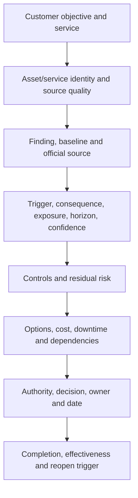

### Risk language

> `Because <verified condition> exists for <scope> under <trigger>, <uncertain event> could affect <customer objective> through <mechanism> within <horizon>. Current controls are <controls>; confidence is <level/reason>. We recommend <action/options> by <date>, validated by <proof>. Residual risk is <bounded remainder>.`

---

## 3. Review preparation and meeting control

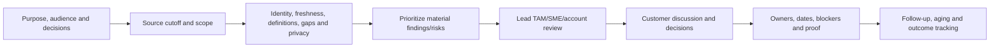

### Meeting rules

- Lead with customer outcomes and material changes, not dashboard navigation.
- Separate fact, interpretation, risk, recommendation, decision and action.
- Show source cutoff and critical unknowns.
- Invite customer context that can change priority.
- Do not surprise executives with an unreviewed technical claim.
- Record disagreement and decision authority, not just consensus.
- End each item with owner, date, dependency, proof and residual risk.

### 🔍 Plain-English deep-dive: a green dashboard can be a dark room

A security camera screen may look calm because the camera lost power yesterday. **Why it matters:** every health view needs population coverage, source freshness, telemetry delivery, identity reconciliation and critical unknowns. `No red signals` is not the same as `verified healthy`.

---

## 4. Fully synthetic sanitized scenario(s): recommendation, action, severity, telemetry, and inventory cases 1-5

### Case 1 - A high-risk recommendation was ignored

**Situation:** A synthetic firmware/lifecycle recommendation appeared in three reviews but was never adopted.

| Competing interpretation | Evidence needed |
|---|---|
| Customer rejected risk consciously | Decision record, authority, rationale and expiry |
| Recommendation was too generic | Asset/trigger/action/prerequisite/validation quality |
| Budget/window dependency blocked it | Planning and stakeholder evidence |
| No one owned follow-up | Action log and governance |

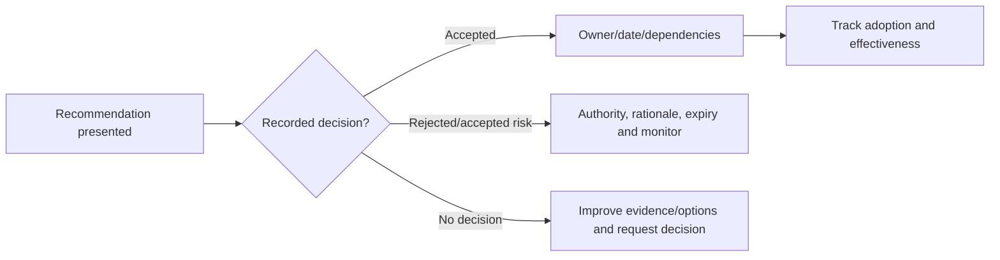

**Synthetic response:** Reframe from `upgrade recommended` to exact affected assets, support horizon, outage options and phased path; identify decision owner and latest safe start. **Residual risk:** remains visible until action or explicit acceptance.

### Case 2 - Preventative actions are aging

**Situation:** Eleven actions are overdue, and meetings repeatedly change dates.

| Competing hypothesis | Prediction/evidence |
|---|---|
| Priority is lower than stated | Actions repeatedly displaced without impact review |
| Dependencies/skills/windows block work | RAID/dependency records and capacity evidence |
| Owners lack authority | Decisions wait for another role |
| Tracker quality is poor | Duplicate, vague or completion-only actions |

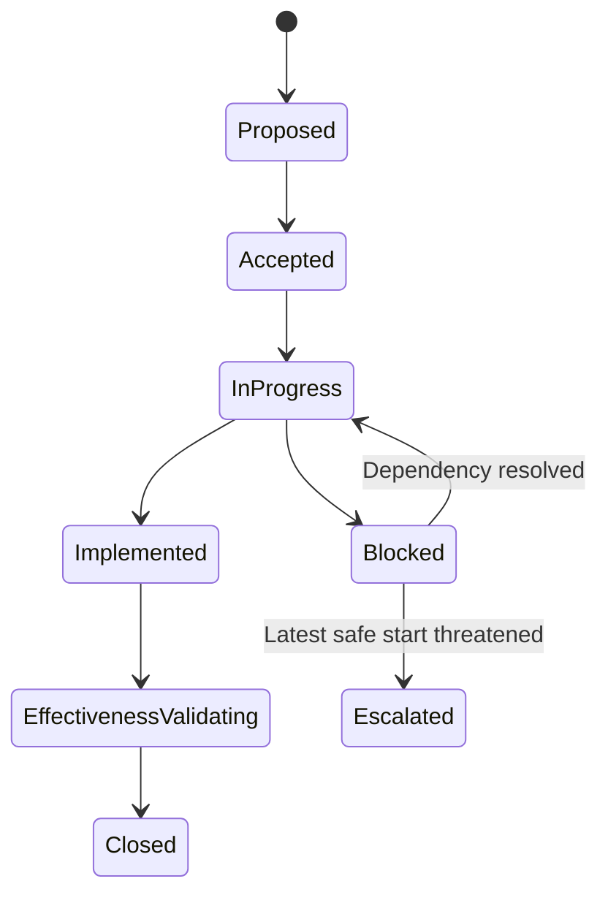

**Synthetic response:** Consolidate duplicates, state blockers and latest safe start, assign accountable owners, escalate decisions rather than people, and measure effectiveness. Aging without context is not a performance judgment.

### Case 3 - Customer disputes severity and priority

**Situation:** Customer calls a lifecycle gap `critical`; telemetry shows no current incident, but support horizon is near.

| Dimension | Evidence |
|---|---|
| Technical severity | Potential consequence if condition manifests |
| Exposure/likelihood | Trigger, feature and current controls |
| Urgency | Deadline minus lead time/latest safe start |
| Business priority | Criticality, appetite, other obligations |
| Confidence | Source quality and unknowns |

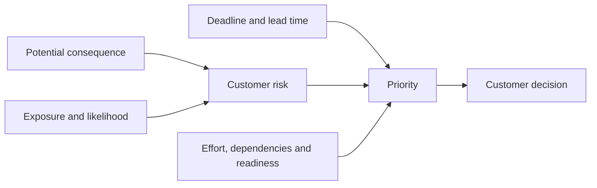

**Synthetic response:** Preserve source severity and separately show customer exposure, deadline, lead time and priority. Do not win the argument by changing definitions.

### Case 4 - Telemetry is missing for critical systems

**Situation:** Forty percent of a synthetic critical fleet has stale or absent AutoSupport/Digital Advisor data.

| Competing hypothesis | Evidence |
|---|---|
| Local collection/delivery failure | Local history, manifest and per-destination status |
| Entitlement/association problem | Remote visibility, serial/account mapping and contract owner |
| Systems are retired/moved | CMDB/site/customer confirmation |
| Secure environment intentionally limits telemetry | Approved operating model and alternate evidence |

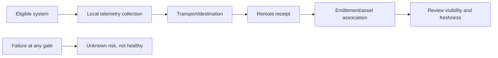

**Synthetic response:** Report coverage and freshness as a risk/control gap, use approved alternate evidence where required, and assign collection/association owners. Never fill missing metrics with zero.

### Case 5 - Install base is inaccurate

**Situation:** Review lists duplicate systems, a retired serial, and one active cluster under the wrong site.

| Competing hypothesis | Evidence |
|---|---|
| Duplicate logical versus physical entities | Cluster/node/system IDs and parent relationships |
| Move/add/change not propagated | Effective-dated events and owner |
| Portal/account association wrong | Support/account source and contract |
| Name-only joins attached data incorrectly | Stable keys and cardinality tests |

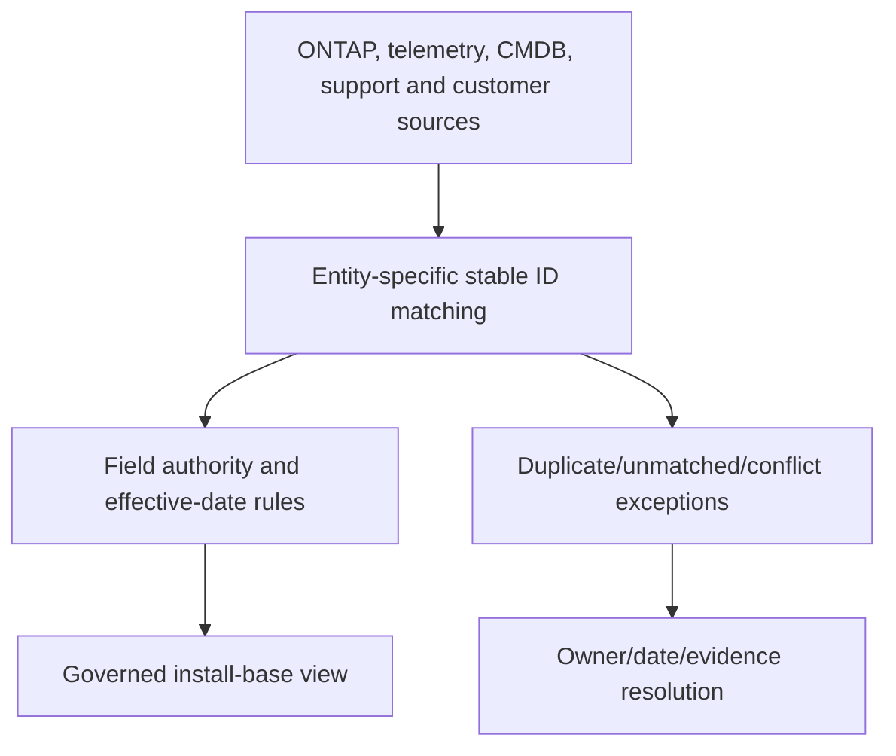

**Synthetic response:** Hold asset-level risk claims until identities are reconciled; show exceptions in the review. Correctness outranks a complete-looking slide.

---

## 5. Fully synthetic sanitized scenario(s): lifecycle, budget, downtime, ownership, and stakeholder cases 6-10

### Case 6 - Lifecycle debt has accumulated

**Situation:** Several synthetic systems/releases approach different support milestones; dependencies prevent one-step remediation.

| Competing option | Tradeoff/evidence |
|---|---|
| Do nothing temporarily | Support/security/change urgency and accepted risk |
| Phased software/firmware/host update | Windows, mixed states, dependencies and skills |
| Platform refresh/migration | Cost, data move, app certification, future runway |
| Temporary compensating controls | Effectiveness, expiry and residual risk |

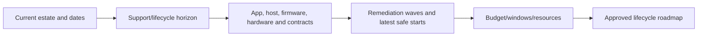

**Synthetic response:** Create a dependency-aware 12-month roadmap with critical path and no-regret first steps. Do not collapse different milestone definitions into one `EOL` label.

### Case 7 - Budget is not available this quarter

**Situation:** Customer agrees with risk but cannot fund the preferred platform change.

| Option | Evidence/tradeoff |
|---|---|
| Status quo with monitoring | Exposure, deadline and incident cost uncertainty |
| Phased remediation | Which risks fall first per unit effort |
| Operational compensating control | Sustainability and effectiveness |
| Commercial/design alternative | Authorized account/vendor analysis |

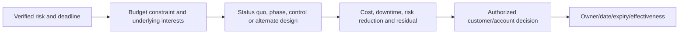

**Synthetic response:** Acknowledge budget reality, quantify relative risk reduction, and offer phased or temporary controls without representing commercial authority. Risk remains explicit.

### Case 8 - No downtime window exists

**Situation:** A 24x7 service has no accepted maintenance window for a required cross-stack change.

| Competing route | Evidence |
|---|---|
| Nondisruptive supported sequence | Exact app/protocol/path behavior and failure tests |
| Rolling application maintenance | App clustering and session recovery |
| Business micro-window | Impact model and rollback |
| Delay with controls | Deadline, monitoring and residual risk |

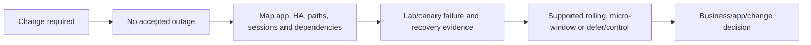

**Synthetic response:** Replace `nondisruptive` promise with exact interruption/recovery evidence and options. Customer service owner decides tolerated impact.

### Case 9 - Action has no accountable owner

**Situation:** `Storage/network teams to investigate` remains open across four reviews.

| Problem | Correction |
|---|---|
| Several contributors, no accountable result owner | Name one accountable owner and contributors |
| No exact output | Define decision/artifact/change and proof |
| Authority missing | Route to decision owner/sponsor |
| Date has no dependency | Add prerequisites, latest safe start and checkpoints |

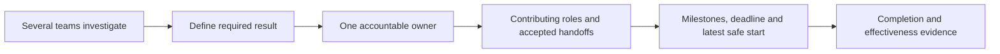

**Synthetic response:** Action becomes `Customer platform owner approves one of two validated path-remediation options by 2026-10-15; network and storage leads provide evidence by 2026-10-08.`

### Case 10 - Stakeholders disagree on risk and timing

**Situation:** Storage wants immediate change; application fears outage; security wants a shorter deadline; finance blocks spend.

| Stakeholder | Interest to surface |
|---|---|
| Storage | Supportability, stability, operational load |
| Application | Continuity, validation, release freeze |
| Security | Exposure, controls, compliance horizon |
| Finance | Budget timing, alternatives and value |
| Executive owner | Business objective and risk appetite |

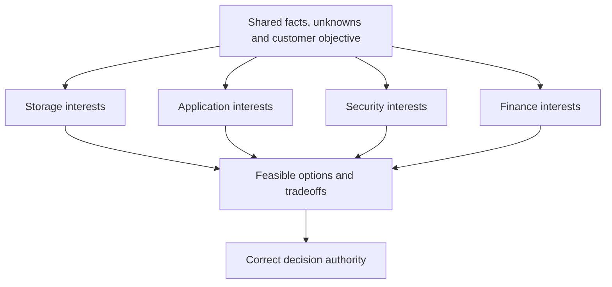

**Synthetic response:** Separate positions from interests, agree evidence, offer phased options, record dissent and let the authorized owner decide. Technical expertise does not grant budget or risk authority.

### 🔍 Plain-English deep-dive: objections are often missing requirements

`No upgrade` may mean `no outage at month-end`, `no app test owner`, `no budget`, or `no trusted rollback`. **Why it matters:** respond to the underlying constraint with evidence and options rather than repeating the recommendation louder.

---

## 6. Fully synthetic sanitized scenario(s): recurring incidents, data disputes, dashboards, risk, executive, value, and trust cases 11-18

### Case 11 - Recurring incidents are treated as unrelated

**Situation:** Five synthetic access incidents have different ticket titles but share one dependency and trigger pattern.

| Competing hypothesis | Evidence |
|---|---|
| Common systemic cause | Shared service/topology/trigger/signature/timeline |
| Superficially similar, different causes | Different mechanisms and controls |
| Case categorization hides theme | Taxonomy and free-text review |
| Prevention action ineffective | Recurrence after action and control test |

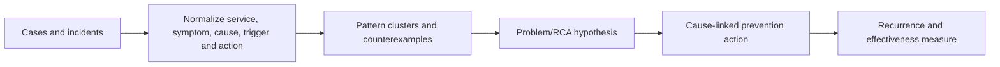

**Synthetic response:** Escalate the shared pattern into problem/prevention governance while preserving each incident's distinct cause evidence. Ticket count alone does not prove one root cause.

### Case 12 - Customer and vendor data disagree

**Situation:** Customer CMDB says 42 systems; telemetry says 38; support inventory says 45.

| Competing explanation | Evidence |
|---|---|
| Different grain/population definitions | Cluster/node/system/site inclusion rules |
| Different cutoffs/freshness | Extract time and event-effective dates |
| Retired/moved/unentitled systems | Lifecycle and ownership evidence |
| Weak joins/duplicates | Stable IDs and cardinality |

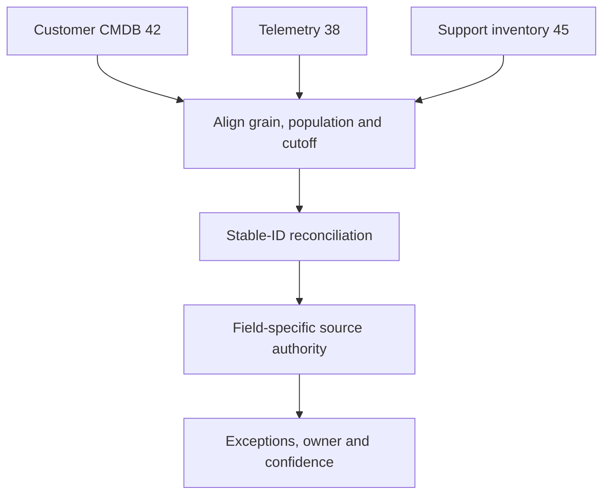

**Synthetic response:** Do not choose the vendor number by default. Reconcile definitions and field authorities, publish coverage/confidence and retain exceptions.

### Case 13 - Dashboard is green because data is stale

**Situation:** Health summary shows all green, but 30% of records have not refreshed in 60 days.

| Competing hypothesis | Evidence |
|---|---|
| Stale assets are omitted from denominator | Population and filter logic |
| Null/unknown converted to green/zero | Measure and mapping rules |
| Source refresh failed | Refresh/gateway/source audit |
| Systems truly inactive/retired | Install-base confirmation |

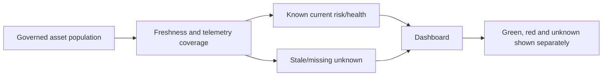

**Synthetic response:** Reclassify stale as unknown, show denominator and coverage, fix refresh/identity, and avoid health claims until evidence returns.

### Case 14 - Customer accepts risk without conditions

**Situation:** Executive says `We accept the risk` in a meeting, but scope, duration and triggers are undefined.

| Required field | Purpose |
|---|---|
| Exact risk/scope | What condition and assets are retained |
| Authority | Who can accept for the customer objective |
| Rationale/options | Informed decision and alternatives |
| Controls/monitor | How exposure is bounded/detected |
| Expiry/review | Prevent permanent accidental acceptance |
| Trigger | Reopen if incident, deadline or evidence changes |

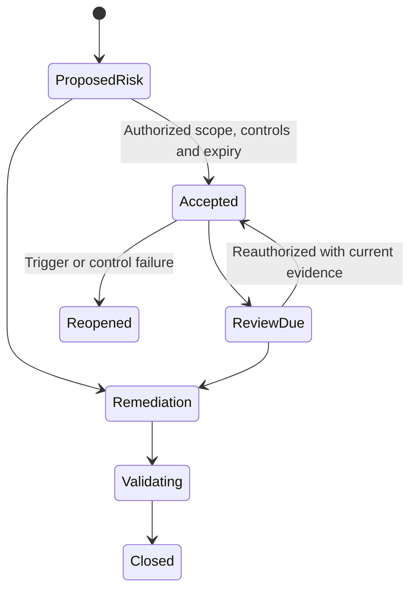

**Synthetic response:** Read back the bounded decision and obtain confirmation through the approved customer process. A meeting comment is not automatically durable governance.

### Case 15 - Executive challenges the recommendation

**Situation:** `Nothing has failed. Why should we spend money now?`

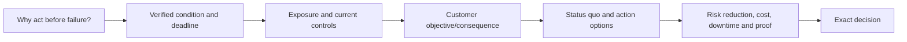

**Synthetic response:** `The service is currently available. The issue is that the current platform/support state leaves a narrower recovery path after <date>. Option A retains exposure with monitoring; option B phases remediation across two windows; option C refreshes the platform. We recommend B because it reduces the highest exposure before the deadline with bounded downtime. The decision today is whether to fund validation and reserve the first window.`

### Case 16 - Value is asserted from activity counts

**Situation:** Review claims value because 20 recommendations and 12 meetings occurred.

| Weak activity | Stronger outcome evidence |
|---|---|
| Recommendations issued | Material recommendations adopted/effective |
| Meetings held | Decisions unblocked and action aging reduced |
| Alerts reviewed | Unknown exposure reduced, false positives corrected |
| Upgrades completed | Supportability improved with SLO/protection preserved |
| Incidents discussed | Recurrence/detection/recovery improved |

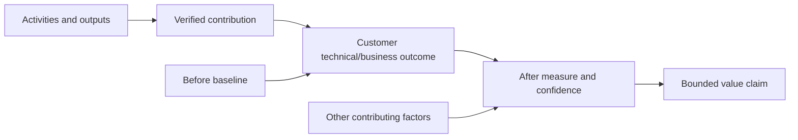

**Synthetic response:** Use contribution language: `The review process helped move six high-risk actions to validated closure and reduced median action age in the synthetic data; other customer programs also contributed.` Avoid causal ROI without a defensible model.

### Case 17 - Trust is damaged by an incorrect recommendation

**Situation:** A prior synthetic recommendation cited stale inventory and targeted the wrong systems.

| Repair step | Evidence/action |
|---|---|
| Acknowledge specifically | State error and customer impact without excuses |
| Correct record | Withdraw/update recommendation and affected outputs |
| Explain control gap | Identity/freshness/review failure, not blame |
| Prevent recurrence | Source cutoff, stable-ID QA and peer review |
| Demonstrate reliability | Deliver corrected work and verify over time |

```mermaid
sequenceDiagram
    autonumber
    participant T as TAM/analyst
    participant C as Customer
    participant O as Account/data owner
    T->>C: Acknowledge stale-inventory error and impact
    T->>O: Correct source mapping and withdraw wrong actions
    O-->>T: Validate corrected population and controls
    T->>C: Present corrected evidence, uncertainty and next step
    C-->>T: Confirm accuracy; trust assessed over future delivery
```

**Synthetic response:** Do not ask the customer to `move on` or hide behind the source. Trust repair is repeated accurate behavior, not one apology.

### Case 18 - Review is becoming a status meeting with no decisions

**Situation:** Every monthly review repeats 40 slides and no action changes state.

| Competing cause | Evidence/correction |
|---|---|
| Wrong audience/decision rights | Stakeholder and authority map |
| No pre-read or decision asks | Agenda/content audit |
| Too many KPIs, no narrative | Materiality and message titles |
| Actions lack owner/proof | Action quality review |
| Cadence does not match decision cycle | Governance redesign |

```mermaid
flowchart LR
    STATUS[Repeated status slides] --> PURPOSE[Reset purpose and decisions]
    PURPOSE --> PRE[Send evidence pre-read]
    PRE --> DISCUSS[Meeting focuses on exceptions/options]
    DISCUSS --> DECIDE[Authority decides]
    DECIDE --> ACTION[Owner, date, proof and residual risk]
    ACTION --> FOLLOW[Between-meeting follow-through]
```

**Synthetic response:** Move detail to appendix/pre-read, invite decision owners only where needed, and make titles tell the risk-to-action story. Meeting time is for context, options and decisions.

### 🔍 Plain-English deep-dive: trust is a lagging result of reliable controls

A restaurant cannot repair trust by announcing `quality restored`; customers infer it after repeated safe meals and transparent handling. **Why it matters:** measure corrected data, commitments met, honest uncertainty, action effectiveness and customer feedback without claiming loyalty or renewal causality.

---

## 7. Review response framework

Use **E-C-R-O-D-A-V**:

1. **Evidence** - exact source, scope, cutoff, quality.
2. **Context** - customer objective, service, constraints.
3. **Risk** - trigger, consequence, horizon, confidence.
4. **Options** - status quo and feasible paths/tradeoffs.
5. **Decision** - correct authority and exact ask.
6. **Action** - owner, date, dependency, milestone.
7. **Validation** - completion, effectiveness, residual risk.

```mermaid
flowchart LR
    E[Evidence] --> C[Context]
    C --> R[Risk]
    R --> O[Options]
    O --> D[Decision]
    D --> A[Action]
    A --> V[Validation and residual risk]
```

### Customer-safe disagreement language

> `We agree on <facts/outcome>. We interpret <severity/priority/data> differently because <definition/evidence>. The source establishes <bounded claim>; customer priority also depends on <context>. Here are the options and tradeoffs. <Role> owns the decision. We will record dissent, action and revisit trigger.`

---

## 8. Safe account and risk boundary

```mermaid
flowchart TD
    SIGNAL[Risk or review signal] --> QA[Identity, freshness, definition, applicability and privacy QA]
    QA --> TECH[Lead TAM/SME/account technical review]
    TECH --> CUST[Customer context and decision authority]
    CUST --> OPT[Options, tradeoffs and recommendation]
    OPT --> DEC[Authorized decision/risk acceptance]
    DEC --> TRACK[Owner/date/dependency/effectiveness]
    TRACK --> REVIEW[Residual risk and next review]
```

### Never use as shortcuts

- Call stale/missing data healthy or convert unknown to zero.
- Inflate technical severity, incident probability, financial value, loyalty or renewal impact.
- Promise budget, resource, downtime, product behavior, support response or business outcome.
- Accept risk for the customer or treat meeting silence as acceptance.
- Expose relationship sentiment, contracts, vulnerabilities, names or accepted risks broadly.
- Use escalation as punishment for an overdue action.
- Hide an error in inventory, analysis or recommendation.

---

## 9. Experience transfer and honesty and JD Mapping

```mermaid
flowchart LR
    REV[customer and business reviews] --> MEET[Audience, narrative, decisions and follow-up]
    CSAT[High CSAT and support experience] --> TRUST[Empathy, accuracy and expectation setting]
    DATA[Backlog/case quality, Excel and Power BI] --> RISK[Trends, action aging and data QA]
    CRIT[Critical situation/Product collaboration] --> EXEC[High-pressure risk and corrective action]
    MEET --> TRANS[Transferable service-review method]
    TRUST --> TRANS
    RISK --> TRANS
    EXEC --> TRANS
    TRANS --> GAP[Production NetApp account ownership remains a gap]
```

| JD responsibility | Part 80 capability | Honest evidence/boundary |
|---|---|---|
| Operational reviews | Decision lifecycle and 18 scenarios | Microsoft review experience; no NetApp review claim |
| Customer risk | Evidence, options, actions and residual risk | Strong support/risk method transfers |
| Install base/telemetry | Freshness, identity and exception handling | Analytics strength; no live NetApp source access |
| Adoption/influence | Constraint-based options and ownership | No customer risk/budget authority |
| Value/loyalty | Bounded contribution and trust controls | No renewal or loyalty causality claim |
| Executive communication | BLUF, challenge and error repair | Existing customer-facing strength |

### Honest interview wording

> `I run a review as a decision system: validate source identity/freshness, connect the finding to the customer's objective and risk, present status quo plus feasible options, request the correct decision, and track owner/date/dependency through effectiveness and residual risk. I have led customer and business reviews, but not a production NetApp account review; the NetApp data and actions here are synthetic.`

---

## 10. Labs, drills, and self-test

### Scenario lab

```mermaid
flowchart LR
    SELECT[Work all 18 synthetic situations] --> EVID[Validate evidence and data quality]
    EVID --> FRAME[Write finding, risk and customer context]
    FRAME --> OPT[Create status quo plus options]
    OPT --> ROLE[Identify authority, owner and stakeholder interests]
    ROLE --> COMM[Practice review response and objection]
    COMM --> TRACK[Action, effectiveness and residual risk]
    TRACK --> PANEL[Mock executive panel and exact Q1-Q8]
```

### Required drills

1. Reframe an ignored generic recommendation into an actionable decision.
2. Build action-aging and latest-safe-start view.
3. Separate severity, exposure, urgency, priority and confidence.
4. Present missing telemetry and install-base uncertainty honestly.
5. Build phased lifecycle options under budget/downtime constraints.
6. Assign one accountable owner across conflicting teams.
7. Cluster recurring incidents without forcing one cause.
8. Reconcile three disagreeing asset counts.
9. Write bounded risk acceptance and executive challenge responses.
10. Repair a stale-data recommendation error and define trust evidence.

### Self-test

1. Define finding, risk, recommendation, action, residual risk, accepted risk, value and trust.
2. Recite the service-review evidence contract.
3. Explain unknown versus healthy.
4. Handle ignored and aging actions.
5. Handle budget, downtime and lifecycle debt.
6. Resolve stakeholder/data disagreement without authority overreach.
7. Build recurring-incident and stale-dashboard narratives.
8. Create valid risk-acceptance controls.
9. Answer executive value and prevention challenges.
10. State privacy, current-source, commercial and experience boundaries.

### Lab pass checklist

- [ ] All 18 situations include evidence, competing interpretation/constraint, customer response, action and residual risk.
- [ ] Ignored recommendations and aging actions are covered.
- [ ] Severity/priority dispute, missing telemetry and inaccurate install base are covered.
- [ ] Lifecycle debt, budget, downtime and ownership gaps are covered.
- [ ] Conflicting stakeholders, recurring incidents and data disagreement are covered.
- [ ] Stale-green dashboard, risk acceptance and executive challenge are covered.
- [ ] Value contribution, trust repair and meeting redesign are covered.
- [ ] Every action has authority, owner, date, dependency, completion and effectiveness proof.
- [ ] Unknown, stale and missing remain visible rather than green/zero.
- [ ] No severity, probability, ROI, loyalty, renewal, budget or outcome is invented.
- [ ] Customer/account/privacy/commercial and technical ownership boundaries are explicit.
- [ ] All customer data, stakeholders, decisions and outcomes are synthetic and sanitized.
- [ ] No production NetApp review, risk acceptance or customer value claim is made.
- [ ] Exact Q1-Q8 are answered aloud.

---

## 11. Official and Public Source Anchors

**Date checked: 2026-08-24.** Public sources anchor product/service/data-quality concepts. Exact customer/account scope, gated data, contracts, decision rights and current technical sources govern live reviews.

| Topic | Official/public source | Bounded use |
|---|---|---|
| NetApp support context | [NetApp Support Services](https://www.netapp.com/services/support/) | Public service orientation; exact purchased service/roles require confirmation |
| Digital Advisor | [NetApp Digital Advisor documentation](https://docs.netapp.com/us-en/active-iq/) | Public feature and evidence context; customer data is gated |
| Wellness/risk | [Learn about Digital Advisor wellness](https://docs.netapp.com/us-en/active-iq/concept_overview_wellness.html) | Public risk-category orientation; customer applicability/current severity require evidence |
| Risk actions | [View risks and take corrective actions](https://docs.netapp.com/us-en/active-iq/task_view_risk_and_take_action.html) | Public risk/action workflow orientation; not change authority |
| Inventory | [View storage system inventory details](https://docs.netapp.com/us-en/active-iq/task_view_inventory_details.html) | Public inventory orientation; access/fields/current population can vary |
| AutoSupport | [Learn about ONTAP AutoSupport](https://docs.netapp.com/us-en/ontap/system-admin/manage-autosupport-concept.html) | Public telemetry purpose; delivery/association/customer payload require evidence |
| Lifecycle | [ONTAP release support](https://docs.netapp.com/us-en/ontap/release-notes/release-support-reference.html) | Current public release support context; dates/capabilities can change |
| Support policies | [NetApp Support Policies and Offerings](https://mysupport.netapp.com/site/info/policies-and-offerings) | Current policy definitions where authorized; contract remains customer-specific |
| Project governance | [What is project management? - PMI](https://www.pmi.org/about/learn-about-pmi/what-is-project-management) | Public stakeholder/outcome/action context; not NetApp account process |
| Service management | [ITIL information from PeopleCert](https://www.peoplecert.org/browse-certifications/it-governance-and-service-management/ITIL-1) | Official framework-owner context; no NetApp review method inferred |

### Source-use discipline

- Record source, scope, object/population, cutoff, freshness, definition, quality and access.
- Revalidate exact product/release/lifecycle/compatibility/bug evidence before decisions.
- Keep customer telemetry, contracts, stakeholders, risks, budgets and sentiment restricted.
- Confirm lead TAM/account/customer decision rights and purchased service scope.
- Label synthetic exercises and never imply real Digital Advisor or account results.

---

## Likely Interview Questions

### Q1. How do you turn a service review into decisions and outcomes?

> **Model answer:** `I define purpose, audience, scope, cutoff and decisions; validate identity, freshness, definitions, applicability and privacy; connect each material finding to a customer objective and bounded risk; present status quo and options; request the correct authority's decision; and track owner, date and dependency through completion, effectiveness and residual risk.`

### Q2. How do you handle ignored recommendations and aging actions?

> **Model answer:** `I check whether the recommendation was specific, reviewed and decided; surface the real budget/window/skill/authority dependency; quantify latest safe start and displaced work; offer phased or temporary options; and request a bounded decision. I consolidate vague actions, assign one accountable owner, escalate the missing decision rather than punish people, and keep residual risk visible.`

### Q3. How do you resolve a severity or data dispute?

> **Model answer:** `I preserve source definitions and separate technical severity, exposure/likelihood, urgency/deadline, business priority and confidence. For data I align grain, population, cutoff, stable IDs and field authority, retaining exceptions. I state agreement and disagreement, show what evidence would change the view and let the authorized customer owner decide.`

### Q4. How do you present missing telemetry or inaccurate inventory?

> **Model answer:** `I show coverage, freshness, affected critical population and failure gate, classify stale/missing as unknown rather than healthy, reconcile stable asset identities and field authorities, and assign owners for collection, delivery, entitlement/association or approved alternate evidence. I bound every risk/health claim to the verified population.`

### Q5. How do you address budget and downtime objections?

> **Model answer:** `I acknowledge the constraint, uncover the underlying interest, and compare status quo, phased remediation, compensating controls and alternate design by risk reduction, cost, outage, dependency, deadline and residual risk. I use current support/app evidence and let customer/account authorities decide; I do not promise nondisruption or commercial terms.`

### Q6. What makes risk acceptance valid?

> **Model answer:** `It names the exact risk and scope, authorized customer decision owner, evidence and options, rationale, controls, monitor, expiry/review date, trigger and residual exposure. It is confirmed through the approved process and reopened when evidence, deadline, control or incident changes. Silence or a casual meeting comment is not enough.`

### Q7. How do you demonstrate value and repair trust?

> **Model answer:** `I measure a before/after customer outcome such as validated risk reduction, supportability, action aging, recurrence or recovery, and use contribution rather than unsupported causation. If wrong, I acknowledge the specific error, correct outputs/actions, explain the control gap, add QA and peer review, and rebuild trust through repeated accurate delivery.`

### Q8. What experience transfers, and what remains your gap?

> **Model answer:** `customer and business reviews, high CSAT, case and backlog analytics, critical situations, Product collaboration, Excel/Power BI and action follow-through give me strong review skills. I have not delivered a production NetApp service review or owned customer NetApp risk/value, so these situations are synthetic and live account roles/data require authorized NetApp/customer owners.`

---

## 30-Second Memory Hooks

- **Review:** Evidence -> context -> risk -> options -> decision -> action -> validation.
- **Finding:** Verified interpretation; **risk:** uncertain objective effect.
- **Recommendation:** Advice; **action:** accepted owner/date/proof.
- **Ignored:** Check decision, quality, constraint and ownership.
- **Aging:** Show blocker and latest safe start, not blame.
- **Severity:** Consequence; **priority:** what goes first in context.
- **Telemetry:** Missing means unknown, not green.
- **Install base:** Stable identity before risk joins.
- **Lifecycle:** Different milestones, dependency-aware waves.
- **Budget/downtime:** Interests create options; authority decides.
- **Owner:** One accountable result owner plus contributors.
- **Recurring:** Normalize patterns but preserve counterexamples.
- **Dashboard:** Denominator + freshness + unknowns.
- **Risk acceptance:** Scope + authority + controls + expiry + trigger.
- **Value:** Measured contribution, not meetings and counts.
- **Trust:** Correct errors, improve controls, deliver reliably.
- **Experience boundary:** Microsoft reviews transfer; NetApp account ownership does not.

---

## Completion Checklist

- [ ] Define review purpose, audience, scope, cutoff and decisions.
- [ ] Validate stable identity, freshness, definitions, applicability, coverage and privacy.
- [ ] Separate finding, risk, recommendation, decision, action and outcome.
- [ ] Connect each item to a customer objective, service and residual risk.
- [ ] Present status quo and feasible options with cost/downtime/dependency tradeoffs.
- [ ] Identify correct authority, one accountable owner, date, milestone and proof.
- [ ] Cover all 18 recommendation, data, lifecycle, stakeholder, risk, value and trust situations.
- [ ] Treat stale/missing/unknown separately from healthy.
- [ ] Reconcile data by grain, population, cutoff, stable ID and field authority.
- [ ] Make risk acceptance bounded, authorized, monitored, expiring and reopenable.
- [ ] Measure completion and effectiveness separately.
- [ ] Avoid invented severity, probability, ROI, loyalty, renewal or commercial claims.
- [ ] Protect customer/account data, budgets, stakeholders, risks, contracts and sentiment.
- [ ] Keep lead TAM/account/customer/support/security/commercial decision boundaries clear.
- [ ] Complete labs, drills, self-test and exact Q1-Q8 aloud.
- [ ] State the explicit no-production-NetApp boundary.

---

*Next suggested section:* [Part 81 - Integrated TAM Casebook: Twenty End-to-End Customer Cases](Part-81-integrated-tam-casebook.md)