# Part 81 - Integrated TAM Casebook: Twenty End-to-End Customer Cases

> **Section goal:** Integrate Parts 1-80 into concise, defensible customer-case reasoning that can survive technical, executive, and interview follow-up. By the end, Arti should be able to select and answer exactly twenty diverse cases across NAS, SAN, performance, capacity, protection, security, upgrades, telemetry, data quality, lifecycle, incidents, service reviews, and governance from discovery through measured outcome and residual risk.

Covers index item **81** and maps directly to job-description responsibilities for customer-data analysis, strategic planning, supportability, risk mitigation, operational reviews, recommendation adoption, special projects, high-pressure work, cross-functional/SME contribution, customer loyalty, and technical communication.

**Explicit nonclaim:** Arti has not owned, investigated, recommended, changed, reviewed, or measured any of the fictional NetApp customer cases below in production, and she does not claim access to live AutoSupport, Digital Advisor, IMT, HWU, Bugs Online, ONTAP, account, Support, or Engineering data.

**Privacy/access:** End-to-end cases can combine customer identity, topology, telemetry, serials, protocols, files, users, performance, capacity, incidents, vulnerabilities, defects, contracts, budgets, stakeholders, actions, accepted risks, and business outcomes. Use only authorized minimum data in approved systems, separate technical/account/commercial access, redact/tokenize for wider review, use secure links, retain/dispose under policy, and never move real or gated evidence into interview portfolios or unapproved AI tools.

**Synthetic-evidence rule:** Every customer, asset, service, identity, topology, version, metric, threshold, defect, advisory, compatibility result, incident, recommendation, objection, owner, date, decision, outcome, and quote below is fictional and sanitized. No case represents a real NetApp customer, process, result, commitment, or Arti production experience.

**Version/current source caveat:** Products, ONTAP releases, support services, Digital Advisor, IMT/HWU, bugs/advisories, lifecycle, host/application support, procedures, account roles, and customer conditions change. A **current-source check** means reopening the exact official or authorized source for the current product/release/configuration and recording source/date/cutoff immediately before any live conclusion or decision.

This Part is a synthetic interview and learning casebook, not a NetApp internal case library, support process, severity model, service-review method, tool output, product guarantee, change procedure, or authority to represent NetApp/customer decisions.

> **No-production-NetApp boundary:** Arti's factual strengths are Microsoft enterprise Support Escalation Engineering, CRITSIT ownership, SharePoint/OneDrive and identity/network troubleshooting, Product/Engineering collaboration, business/customer reviews, high CSAT, mentoring, Excel/Power BI/SQL/Python/statistics, risk/action tracking, and executive communication. Her exact nonclaim is: **she has not delivered any production NetApp TAM case outcome.** She may use the frameworks and explicitly synthetic exercises below to demonstrate reasoning while naming the gap.

---

## 1. The integrated TAM loop

```mermaid
flowchart LR
    DISC[Discover customer outcome and environment] --> DATA[Verify identity, sources, freshness and privacy]
    DATA --> ANALYZE[Analyze symptoms, trends and competing hypotheses]
    ANALYZE --> GATE[Validate supportability, bugs, advisories and lifecycle]
    GATE --> RISK[State risk, confidence, controls and horizon]
    RISK --> REC[Compare options and recommend]
    REC --> REVIEW[Review, objections and authorized decision]
    REVIEW --> ACTION[Owner, date, dependency and change/incident plan]
    ACTION --> VALID[Validate outcome and residual risk]
    VALID --> LEARN[Measure value, learn and refresh evidence]
```

### Case vocabulary

| Term | Plain meaning | Analogy | Why it matters |
|---|---|---|---|
| **Discovery** | Learn the business outcome, service and complete environment | Physician takes history before diagnosis | Prevents array-only assumptions |
| **Identity/data quality** | Prove which asset/object/metric and whether evidence is trustworthy | Verify patient and lab label | Wrong joins create wrong recommendations |
| **Supportability gate** | Validate exact listed configuration and notes | Approved recipe check | Working does not mean supported |
| **Applicability** | Match exact product, release, feature, trigger and signature | Confirm recall applies to this car | Avoids family-level bug/advisory claims |
| **Risk** | Uncertain effect on customer objective | Forecast tied to one route | Adds exposure, time and controls to severity |
| **Objection** | Constraint or concern about action | Missing requirement in a design review | Reveals better options |
| **Measured outcome** | Verified before/after customer or control result | Post-treatment test | Activity count is not value |
| **Residual risk** | Remaining exposure after action | Risk still outside the repaired area | Keeps closure honest |

### 🔍 Plain-English deep-dive: integration is traceability, not mentioning every tool

A complete medical case does not list every test in the hospital; it links the decisive history, test, diagnosis, treatment and follow-up. **Why it matters:** an integrated TAM answer uses only evidence needed to connect customer objective -> finding -> risk -> option -> decision -> action -> proof, while naming the current-source and authority boundaries.

---

## 2. DIAGNOSE answer framework

Use **DIAGNOSE** for a 3-5 minute case answer:

| Letter | Step | Questions |
|---|---|---|
| **D** | Discover | Business service, users/data, SLO/RPO/RTO, topology, owners, constraints? |
| **I** | Identity and data | Stable asset/object IDs, sources, cutoff, freshness, units, privacy, unknowns? |
| **A** | Analyze | Exact symptom/trend, baseline, timeline, changes, competing hypotheses, decisive evidence? |
| **G** | Gate | Exact IMT/HWU/app support, release notes, bugs/advisories, lifecycle, entitlement? |
| **N** | Name risk | Trigger, mechanism, consequence, scope, horizon, controls, confidence? |
| **O** | Options and recommendation | Status quo and feasible actions, cost/downtime/dependency, preferred option? |
| **S** | Stakeholder review | Lead TAM/SME/Support/customer roles, likely objection, decision authority, wording? |
| **E** | Execute and evaluate | Owner, date, change/incident/validation, success, measured outcome, residual risk? |

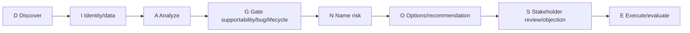

### 90-second compression

> `The customer outcome is <D>. I verified <I>. The evidence supports <A> while <alternative> remains. Current support/bug/lifecycle evidence says <G>. The risk is <N>. I recommend <O>. The decision owner and likely objection are <S>. <Owner> will act by <date>; we validate <E>, with residual risk <remainder>.`

### 🔍 Plain-English deep-dive: confidence is not certainty theater

An analyst can be decisive about the next action while uncertain about root cause. **Analogy:** a pilot can divert safely before knowing which sensor failed. **Why it matters:** state supported, weakened and unknown hypotheses; choose reversible evidence-rich actions; never invent a probability or product fact to sound confident.

---

## 3. Case-selection matrix

| Case | Primary domain | Secondary domain | Main interview competency | Pressure type |
|---:|---|---|---|---|
| 1 | NFS identity/permissions | Data quality | Layer isolation | Access outage |
| 2 | SMB Kerberos/AD | Customer communication | Cross-team diagnosis | New sessions fail |
| 3 | iSCSI/MPIO | Compatibility | Data-safe SAN reasoning | Degraded path |
| 4 | FC/LUN mapping | Change governance | Stable identity | Missing device |
| 5 | Performance | Application/host | Causality and baseline | Executive blame |
| 6 | QoS/noisy neighbor | Influence | Tradeoffs | Competing workloads |
| 7 | Capacity | Protection | Forecast and headroom | Deadline |
| 8 | FabricPool | Cost/performance | Option framing | Recall storm |
| 9 | SnapMirror | RPO/network | Rate/backlog reasoning | Protection breach |
| 10 | Backup/restore | Catalog/IAM | Recoverability proof | Restore failure |
| 11 | Security/ransomware | Advisory/immutability | Layered risk | Suspected attack |
| 12 | ONTAP upgrade | Lifecycle/app | Go/no-go | Fixed window |
| 13 | Firmware/IMT | SAN mixed states | Supportability | Rollout blocked |
| 14 | HA/hardware | Common fate | Degraded-risk communication | Component failure |
| 15 | MetroCluster/DR | Governance | Single-writer safety | Site ambiguity |
| 16 | AutoSupport/telemetry | Privacy/entitlement | Unknown-risk handling | Blind fleet |
| 17 | Install base/data | Analytics | Reconciliation | Conflicting reports |
| 18 | Bug scrub | Recurring incidents | Engineering package | Duplicate dispute |
| 19 | Service review | Budget/adoption | Influence | Ignored actions |
| 20 | Governance/trust | Special project | Leadership and repair | Executive scrutiny |

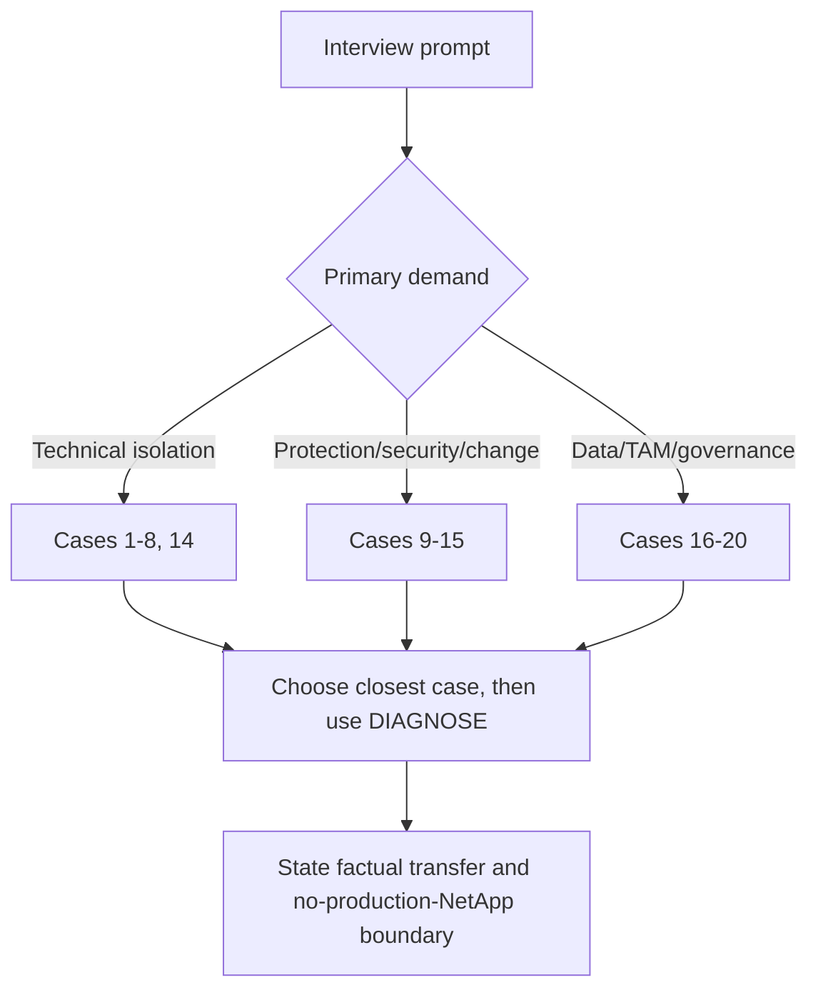

### Selection rule

Choose the case with the closest **decision and failure shape**, not merely the same product noun. A path-loss case can answer a redundancy question; a stale-dashboard case can answer an analytics-ethics question.

### 🔍 Plain-English deep-dive: match the shape, not the label

A smoke alarm in a kitchen and a temperature alarm in a server room use different technology but share a decision shape: verify the signal, protect people/service, distinguish local from systemic cause, and act through the correct owner. **Why it matters:** when an interview prompt is unfamiliar, borrow the closest evidence, authority and risk pattern instead of forcing a memorized product story.

---

## 4. Fully synthetic sanitized scenario(s): exactly twenty integrated cases

### Case 1 - NFS write denial after identity maintenance

**Discovery:** Synthetic research workloads on two of twelve Linux clients can mount/read `/research` but cannot create files after directory-service maintenance. The customer requires same-day access; existing data remains readable.

**Identity/data:** Exact client source, NFSv4.1 security, effective UID/GID/groups, export path/rule, file ACL/mode, UTC clocks and one healthy control are captured. Names are tokenized; no file contents are collected.

**Analysis and gate:**

| Hypothesis | Prediction/evidence | State |
|---|---|---|
| Export rule selected read-only | Failing source selects different rule | Weakened: same RW rule |
| Effective groups stale/different | Required group absent on failing clients | Supported by numeric identity evidence |
| NFS lock/state conflict | Lock/state status on new file | Weakened: new file denied before lock |
| ONTAP defect | Exact release/trigger/signature and Support evidence | Unknown, low current support |

Current NFS client/ONTAP support and release docs would be revalidated; no defect is claimed. Lifecycle is not material unless identity client support is stale.

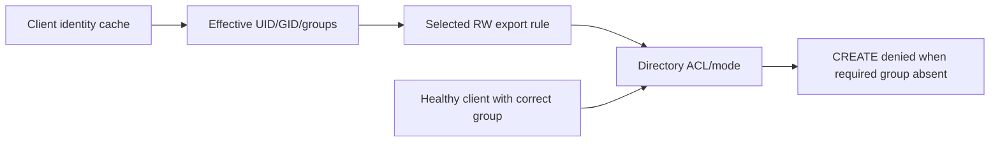

**Risk/recommendation:** Misaligned identity could deny or misgrant research data. Recommend authorized identity reconciliation and fleet drift check, not broad root or world-write access.

**Review/objection:** Objection: `Storage should just allow the user.` Response: explain authentication versus effective authorization and show the healthy control.

**Action/validation/outcome:** Identity owner by **2026-09-03**; storage owner validates expected allow/deny after cache/config correction. Synthetic measured outcome: 20/20 intended creates pass, 10/10 negative controls deny, no ACL change. Residual risk: other unmanaged clients may drift.

**Customer wording:** `The export is reachable and permits write for the selected rule. The failing clients present a different effective group set; we are correcting identity consistency and validating both allowed and denied access. No storage defect is established.`

### Case 2 - SMB Kerberos fails for an alias while NTLM masks the issue

**Discovery:** New SMB sessions to a synthetic legal alias fail where NTLM is blocked; direct server name and existing sessions work.

**Identity/data:** Capture exact UNC name, DNS answers, client/SVM/DC time, requested SPN, SPN owner/uniqueness, actual authentication mechanism, SMB dialect and session status. Tickets/secrets remain restricted.

**Analysis and gate:** Alias/SPN mismatch predicts KDC failure; time, trust, firewall and SMB service remain competing hypotheses. Exact ONTAP/Windows/SMB support and current security policy are gates. No recommendation relies on enabling NTLM.

```mermaid
sequenceDiagram
    autonumber
    participant C as SMB client
    participant D as DNS
    participant K as KDC
    participant S as Synthetic SMB service
    C->>D: Resolve legal alias
    C->>K: Request CIFS ticket for alias SPN
    K-->>C: SPN not correctly mapped
    C->>S: Fallback blocked by policy
    S-->>C: New session fails; existing session persists
```

**Risk/recommendation:** Hidden Kerberos defect creates access and security-policy risk. Recommend identity/storage owners correct unique alias/SPN design under current procedure and test new/existing sessions, failover names and audit.

**Review/objection:** `NTLM works elsewhere, so remove the block.` Response: fallback hides broken service identity and conflicts with customer policy.

**Action/validation/outcome:** AD identity owner **2026-09-04**; storage owner and application owner validate. Synthetic outcome: 30/30 new Kerberos sessions succeed through alias; NTLM remains blocked; no access expansion. Residual: other aliases need inventory.

**Customer wording:** `The service is available, but the alias does not currently map to the intended Kerberos service identity. We will repair the name/SPN mapping rather than weaken authentication policy.`

### Case 3 - iSCSI path loss exposes unsupported host multipath state

**Discovery:** A synthetic database remains online after one path loss, but latency rises and the host shows three separate device objects rather than one MPIO device.

**Identity/data:** Freeze host, IQN, target IQN/portals, LUN UUID/serial, each path, OS, Host Utilities, device handler, adapter driver/firmware, ONTAP and IMT evidence date.

**Analysis and gate:** Same stable LUN serial across devices supports missing/incorrect MPIO claim; mapping duplication and cloned LUN remain alternatives. Exact current IMT/host docs are required; no live matrix result is invented.

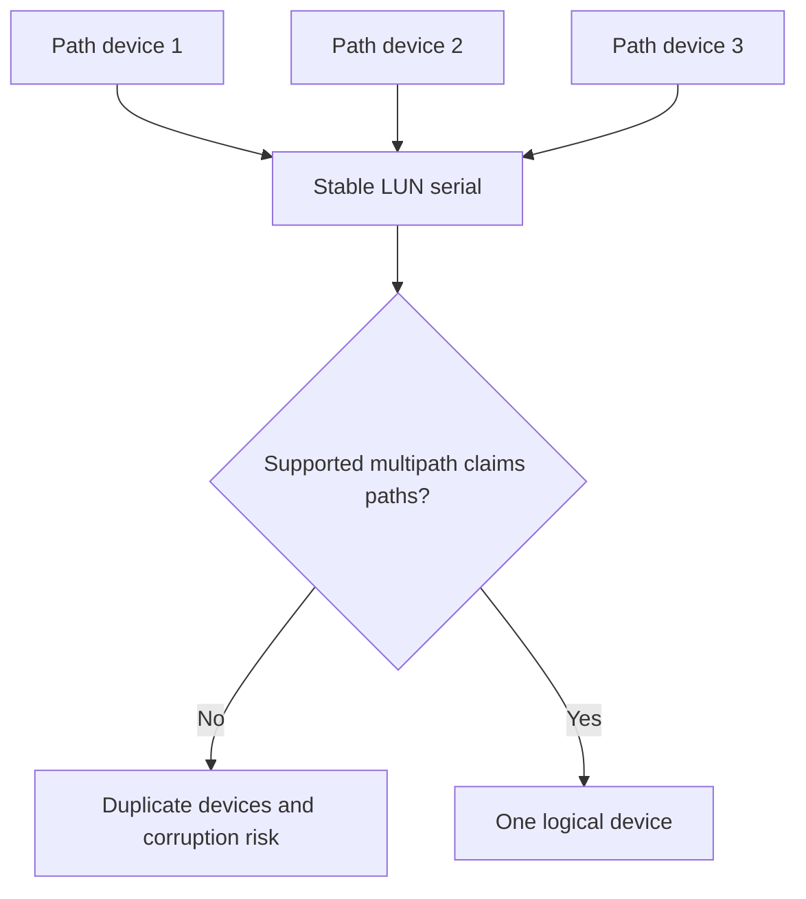

**Risk/recommendation:** Duplicate presentation risks unsafe mount/write and removes failover assurance. Stop further host rollout; qualified host/storage Support aligns a listed recipe and validates one-path loss/recovery.

**Review/objection:** `The database is still up, so change later.` Response: current availability uses degraded/uncontrolled presentation and the next path event has higher consequence.

**Action/validation/outcome:** Host platform owner **2026-09-06**; maintenance validation by **2026-09-10**. Synthetic outcome: one stable MPIO device, four expected paths, one-side failure with no duplicate mount, application p99 within SLO. Residual: remaining hosts require recipe audit.

**Customer wording:** `The LUN remains available, but the host is not merging all presentations through the validated multipath stack. We are treating this as degraded data-safety and failover risk, not as healthy redundancy.`

### Case 4 - FC LUN disappears after HBA replacement

**Discovery:** A synthetic host completes fabric login after an HBA replacement but cannot see one mapped LUN; peer host is healthy.

**Identity/data:** Reconcile old/new HBA WWPN, switch port/VSAN, Name Server, active zone, PLOGI/PRLI, igroup membership, LUN UUID/map/LUN ID, driver/firmware and change record.

**Analysis and gate:** New WWPN absent from igroup predicts target access failure; stale zone alias and host rescan remain alternatives. HWU/IMT/platform/host support for replacement recipe is required.

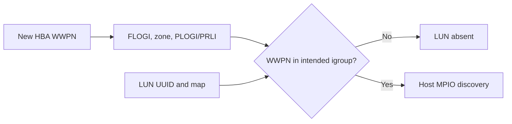

**Risk/recommendation:** Adding the wrong identity could expose data; recommend before/after identity review and customer-approved mapping correction by qualified owners, then all-path/app validation.

**Review/objection:** `Add the whole server group to all LUNs to restore quickly.` Response: broad mapping creates greater data exposure and does not prove device ownership.

**Action/validation/outcome:** Fabric and storage owners **2026-09-08**. Synthetic outcome: intended WWPN only, exact LUN visible once through MPIO, negative LUN access denied, cluster app validates. Residual: asset process must capture HBA identity changes.

**Customer wording:** `Fabric login succeeds; the remaining failure is exact initiator authorization to the LUN. We will correct only the verified replacement identity and test both expected access and expected denial.`

### Case 5 - Application blames storage for month-end latency

**Discovery:** Synthetic transaction p99 rises to 5 seconds; storage node average is 4 ms. Application, host and storage teams disagree.

**Identity/data:** Align transaction IDs, app queue/spans, host/device/path, matching ONTAP SVM/volume/workload operations, p50/p95/p99/errors, workload fingerprint and prior month-end baseline.

**Analysis and gate:** App worker queue rises 40 seconds before storage demand; path loss and storage service-center hypotheses are weakened by controls. Counter definitions and exact ONTAP release remain current-source gates.

```mermaid
timeline
    title Synthetic month-end causal order
    14:00 : Application worker queue rises
    14:00:40 : Storage request rate rises
    14:01 : Storage latency increases modestly under burst
    14:05 : App canary reduces queue and transaction p99
```

**Risk/recommendation:** Premature storage change could add risk and leave cause. Recommend bounded application concurrency/scheduling canary while all teams monitor layer evidence.

**Review/objection:** `CPU and storage latency rose, so both need tuning.` Response: correlation follows upstream offered demand; test the first wait boundary.

**Action/validation/outcome:** Application owner **2026-09-05**; performance review **2026-09-12**. Synthetic outcome: p99 5 s -> 700 ms at comparable volume; storage service remains stable; error rate falls. Residual: another workload pattern may have a different cause.

**Customer wording:** `The synchronized evidence supports application queueing as the initiating delay for this pattern; storage load rises afterward. We will change the smallest application variable and retain cross-layer monitoring.`

### Case 6 - Noisy analytics workload harms critical service

**Discovery:** Critical synthetic service p99 misses SLO only during an analytics job sharing a node/local tier/path.

**Identity/data:** Map victim/competitor workloads to shared resources, preserve per-workload demand, QoS policy membership, app SLO, path and ONTAP object counters, schedule and baseline.

**Analysis and gate:** Controlled schedule separation changes victim p99 with comparable victim demand, supporting contention. Current QoS feature/release support, policy effects and workload requirements are gated.

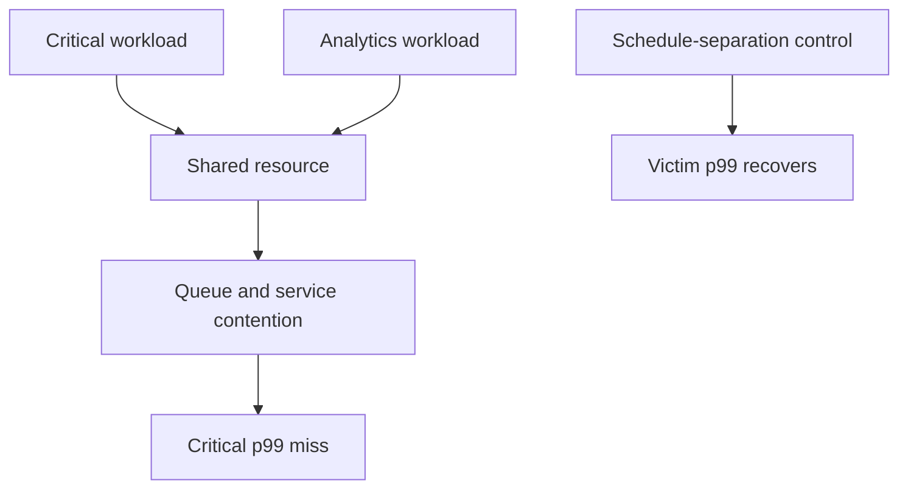

**Risk/recommendation:** Recurrence risks customer SLO; options are scheduling, app concurrency, placement, QoS or capacity. Recommend schedule isolation first because it is reversible and proven.

**Review/objection:** Analytics owner says deadline forbids delay. Offer narrower window plus explicit critical-service floor/ceiling evaluation under current docs, not an arbitrary QoS number.

**Action/validation/outcome:** Joint app owners **2026-09-09**; capacity owner reviews by **2026-09-20**. Synthetic outcome: victim p99 improves 62%, analytics finishes within deadline. Residual: shared headroom remains low for coincident bursts.

**Customer wording:** `The workloads share the constrained service center, and separation changes the critical-service tail as predicted. We recommend the lowest-risk schedule control while evaluating a durable capacity or policy option.`

### Case 7 - Snapshot growth consumes capacity headroom

**Discovery:** Synthetic volume free space looks adequate, but local-tier headroom falls and update/protection work slows.

**Identity/data:** Build raw/usable/volume logical/physical/snapshot/local-tier/object-tier ladder with units, cutoff, snapshot change rate, retention, autosize and protection dependencies.

**Analysis and gate:** Retained changed blocks, not active logical growth alone, drive physical use. Capacity counter definitions, ONTAP release, snapshot/retention policies and lifecycle demand are gates.

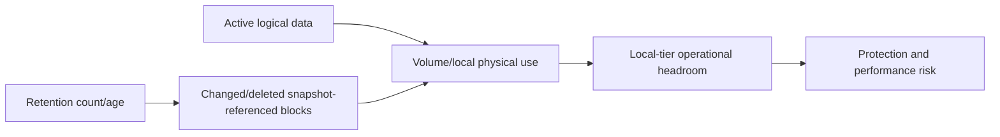

**Risk/recommendation:** Physical exhaustion could interrupt writes/protection. Recommend data-owner-approved retention correction, capacity addition/placement and threshold/forecast controls; do not delete recovery points as a quick fix.

**Review/objection:** `Deduplication ratio means we have months.` Response: future efficiency is uncertain and snapshot/change accounting differs.

**Action/validation/outcome:** Capacity/data-protection owners **2026-09-15**. Synthetic outcome: headroom from 8% to 21%, required restore coverage preserved, 90-day forecast exceeds action lead time. Residual: onboarding project can consume buffer.

**Customer wording:** `The risk is at the physical local-tier layer, driven mainly by retained changed blocks. We will preserve required recovery points while restoring measurable operational headroom.`

### Case 8 - FabricPool recall creates latency and cloud-cost concern

**Discovery:** A synthetic compliance scan reads cold files, increasing tail latency and object-tier retrieval traffic/cost.

**Identity/data:** Identify workload/files, policy/cooling state, local/object physical use, recall operations, object-path latency/errors, scanner concurrency and repeat warm control; keep filenames sanitized.

**Analysis and gate:** Cold recall plus concurrency predicts first-read tail and external traffic; local-media and path-fault alternatives are tested. Exact FabricPool release/policy/provider/cost and app requirements are gates.

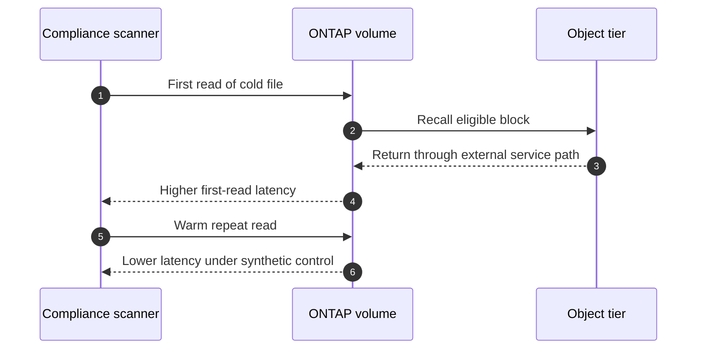

**Risk/recommendation:** Scan deadline, user SLO and retrieval cost conflict. Recommend concurrency/schedule shaping and tier-policy economics review, not disabling tiering.

**Review/objection:** `Bring everything back local.` Response: compare capacity/cost, working set and repeated scan need; broad recall may create another risk.

**Action/validation/outcome:** Compliance and storage owners **2026-09-18**. Synthetic outcome: p99 improves 45%, deadline met, retrieval bytes fall 30% versus uncontrolled run. Residual: rare legal requests still incur cold-read latency.

**Customer wording:** `The latency pattern is consistent with cold-block retrieval under the scan's concurrency. We recommend shaping the scan and reviewing policy economics rather than treating the tier as failed.`

### Case 9 - SnapMirror lag breaches RPO

**Discovery:** Synthetic primary service is healthy, but newest validated destination point is six hours old against a two-hour RPO.

**Identity/data:** Verify source/destination IDs, relationship/policy/labels/state, jobs, change and transfer rates, backlog, intercluster paths, destination capacity, point timestamps and clocks.

**Analysis and gate:** Updates run, but change rate plus another transfer exceeds path service; schedule and destination capacity alternatives are weakened. Current SnapMirror release/policy/support and continuity priorities are gates.

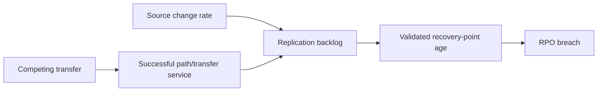

**Risk/recommendation:** A disruption could lose more accepted data than objective. Recommend continuity-owned transfer scheduling/priority and path-capacity review, with alternate backup point verification.

**Review/objection:** `Run updates every 15 minutes.` Response: more triggers do not increase service rate and can add queueing.

**Action/validation/outcome:** Protection/network owners **2026-09-07**. Synthetic outcome: recovery-point age falls below 90 minutes for seven comparable cycles; foreground SLO holds. Residual: exceptional change bursts can breach without more capacity.

**Customer wording:** `The configured schedule is firing; the gap is sustained transfer service versus source change and competing work. We are correcting that rate imbalance and measuring the actual destination point age.`

### Case 10 - Green backup cannot restore the application

**Discovery:** Synthetic backup job is green, but isolated restore lacks a configuration volume and application start fails.

**Identity/data:** Reconcile protected workload components, snapshot/app-consistency method, catalog, repository objects, IAM/keys, restore steps, exact point and app logs.

**Analysis and gate:** Job scope omitted a dependency; corruption, key and network alternatives are weakened. Current backup product/ONTAP/app integration and retention/immutability support are gates.

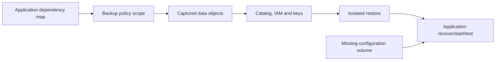

**Risk/recommendation:** Green jobs create false recoverability; recommend complete workload policy and recurring isolated timed restore.

**Review/objection:** `The vendor says success.` Response: success refers to configured job, not complete application recovery.

**Action/validation/outcome:** Backup/app owners **2026-09-14**. Synthetic outcome: full restore starts, integrity checks pass, RTO 72 minutes versus 90-minute objective. Residual: identity-site dependency remains untested.

**Customer wording:** `The backup job completed its configured scope, but that scope omitted an application dependency. We are correcting protection inventory and validating the complete service through a timed restore.`

### Case 11 - Suspected ransomware plus advisory exposure

**Discovery:** Synthetic NAS volume shows rapid file changes and an anomaly alert; a public security advisory may affect the management plane.

**Identity/data:** Preserve alert/events, file-operation metadata without content, user/client/process, endpoint/security logs, snapshots, backup points, management exposure, exact product/release/feature and advisory revision.

**Analysis and gate:** Legitimate encryption job and malicious activity compete; advisory applicability is assessed separately by product/release/feature/path/trigger. Security incident authority controls containment.

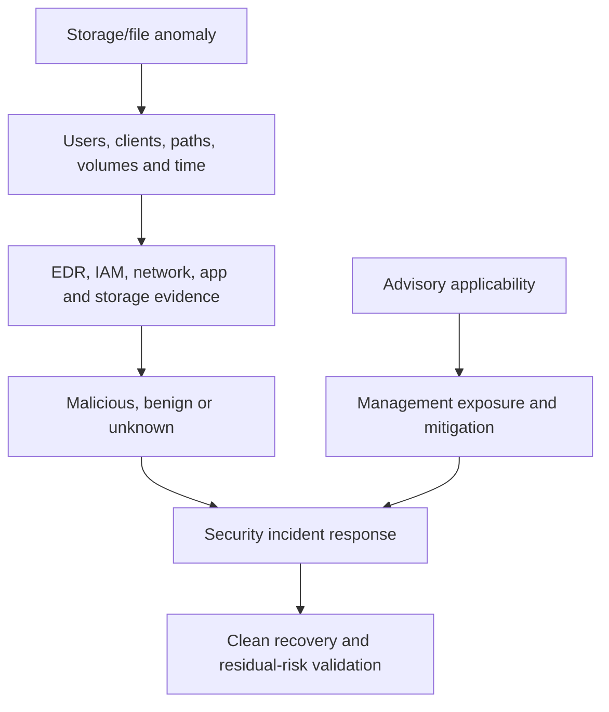

**Risk/recommendation:** Potential integrity/security event plus management exposure. Recommend security-led isolation/evidence, protect immutable independent recovery points, validate advisory mitigation/fix through current source, and test clean recovery.

**Review/objection:** `Restore immediately.` Response: restoring before containment and clean-point validation can reinfect or overwrite evidence.

**Action/validation/outcome:** Security incident owner immediately; storage/app recovery owners at approved checkpoint. Synthetic outcome: event classified as authorized encryption but advisory remains applicable and mitigated pending fix. Residual: endpoint allowlisting governance gap.

**Customer wording:** `The file-change pattern is under security investigation and is not yet classified as malicious. Separately, the management advisory is applicable under the current release; the documented mitigation is active while a supported fix is planned.`

### Case 12 - ONTAP upgrade blocked by lifecycle and application constraints

**Discovery:** Synthetic ONTAP release nears support horizon; preferred target is not yet certified by a critical application.

**Identity/data:** Exact cluster/platform/current/target/path, app/host/protocol recipe, IMT/HWU, release notes, bugs/advisories, lifecycle date, prechecks, protection, windows and owners.

**Analysis and gate:** Infrastructure target is listed, but application certification is missing; staying has lifecycle/security risk. No-go/phase/exception/migration options are compared.

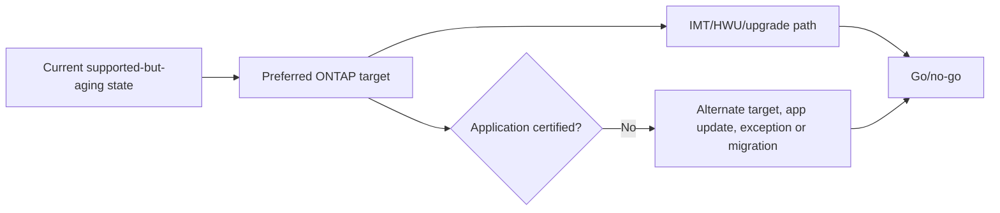

**Risk/recommendation:** Avoid unsupported application state and missed lifecycle deadline. Recommend immediate app certification/update work, reserve two windows, and retain current controls with expiry.

**Review/objection:** `Infrastructure is supported, so proceed.` Response: application support is a separate gate and rollback is constrained.

**Action/validation/outcome:** App owner **2026-09-20**, storage/change owner **2026-10-05** conditional plan. Synthetic outcome: alternate certified target selected; prechecks and app canary pass; support runway extended. Residual: later preferred feature deferred.

**Customer wording:** `The infrastructure recipe is listed, but the critical application does not yet support the preferred target. We recommend a certified interim target rather than accepting an unbounded application-support gap.`

### Case 13 - Firmware and IMT mixed state blocks SAN rollout

**Discovery:** Half of synthetic hosts have new OS/driver while old HBA firmware remains; path flaps appear only in changed ring.

**Identity/data:** Exact per-host OS, Host Utilities, multipath, HBA, driver/firmware, switch, ONTAP/platform, paths and IMT result/notes; asset IDs and rollout times reconciled.

**Analysis and gate:** Changed driver/old firmware recipe is unlisted; switch/target defects remain alternatives. Exact vendor and IMT resolution is required; no firmware recommendation from memory.

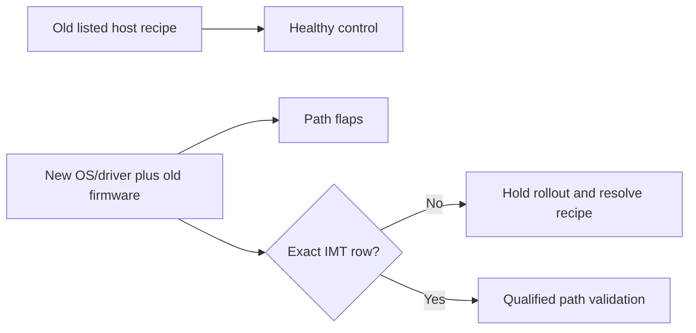

**Risk/recommendation:** Path instability and unsupported mixed state threaten clustered application. Stop rollout, preserve one listed control ring, coordinate a listed bundle and one-side path test.

**Review/objection:** `Only one path flaps; finish rollout for consistency.` Response: expanding an unlisted unstable state increases exposure and removes control evidence.

**Action/validation/outcome:** Host/fabric/storage owners **2026-09-11**. Synthetic outcome: listed bundle validated on two canaries, zero path flaps over test window, app failover passes. Residual: remaining rollout requires staged monitoring.

**Customer wording:** `The affected hosts share an unlisted driver/firmware combination. We have stopped expansion, preserved a healthy control, and will resume only after a listed recipe and path-failure validation.`

### Case 14 - HA hardware alert leaves service available but degraded

**Discovery:** Synthetic shelf path and one fan fail while application remains available; stakeholders want to wait until quarter end.

**Identity/data:** Exact HA pair, shelf/IOM/cable/adapter/drive paths, fan/sensors, platform/release/FRU, power/cooling, events, partner headroom, client LIF/SAN paths and Support evidence.

**Analysis and gate:** Independent cable and fan failures versus shared chassis/environment are compared; current platform/HWU/FRU procedures and Support entitlement gate action.

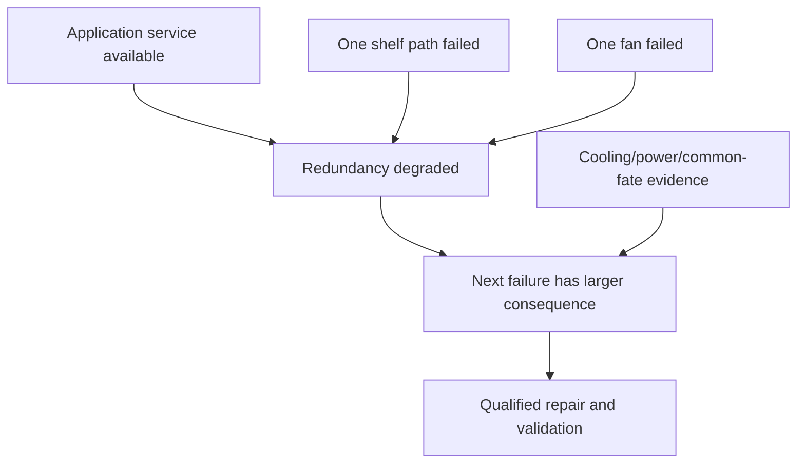

**Risk/recommendation:** Current availability masks reduced storage/cooling margin. Recommend expedited qualified repair, unrelated-change freeze and full topology/application validation.

**Review/objection:** `HA means one failure is safe.` Response: two independent degraded controls and common-fate uncertainty reduce remaining tolerance.

**Action/validation/outcome:** Customer facility/Support/storage owners **2026-09-02**. Synthetic outcome: path/fan restored, sensors stable, all client paths and takeover-readiness test pass. Residual: power feeds still share one upstream PDU.

**Customer wording:** `Service is available, but both storage-path and cooling redundancy are degraded. We recommend repairing before the next maintenance event because the remaining failure margin is reduced.`

### Case 15 - MetroCluster site ambiguity and DR pressure

**Discovery:** Inter-site connectivity is lost; each synthetic site has incomplete information and business requests forced switchover.

**Identity/data:** Exact MetroCluster variant/release, site/fabric, cluster/aggregate/plex/config state, independent facility evidence, client networks, source-write authority, application dependencies, RPO/RTO and current Support route.

**Analysis and gate:** Remote-site failure versus isolation competes; split-brain/dual-writer consequence is dominant. Exact variant-specific current procedure and Support authority are mandatory.

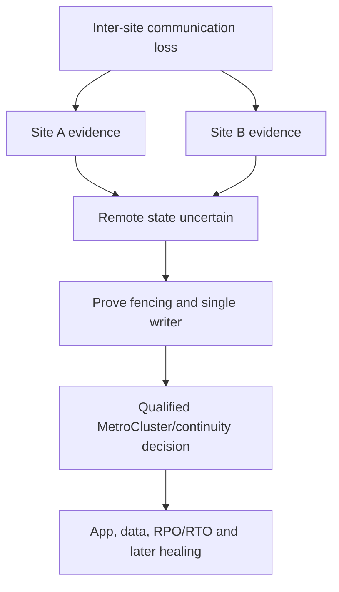

**Risk/recommendation:** Forced action without fencing could create conflicting writes. Recommend preserve state, establish independent remote evidence/fencing and follow Support-led recovery.

**Review/objection:** `Every minute costs money.` Response: quantify delay but explain that dual-writer corruption can make recovery materially worse.

**Action/validation/outcome:** Incident/continuity/Support owners immediate, 15-minute checkpoints. Synthetic outcome: remote site proven down and fenced; supported switchover, app recovery in 48 minutes versus 60-minute RTO. Residual: switchback waits for network root cause and full healing.

**Customer wording:** `We recognize the outage cost. We will not create dual-write risk from incomplete remote-state evidence; fencing and qualified Support confirmation are the immediate critical path to safe activation.`

### Case 16 - Missing AutoSupport creates a blind critical fleet

**Discovery:** Synthetic Digital Advisor review shows 35% of critical systems stale; customer believes the green remainder proves fleet health.

**Identity/data:** Reconcile governed install base, serial/cluster/node IDs, AutoSupport local history/manifest/destination, remote receipt/association, entitlement, freshness and secure-environment exceptions.

**Analysis and gate:** Collection, transport, association, retirement and intentional restriction hypotheses are tested per system. Privacy/contract and exact AutoSupport release behavior gate action.

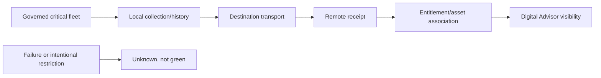

**Risk/recommendation:** Missing wellness/support evidence can delay proactive risk identification. Recommend gate-by-gate remediation or approved alternate evidence, coverage KPI and owner.

**Review/objection:** `Telemetry conflicts with privacy policy.` Response: confirm approved payload/destination/minimization and use a governed alternative; do not bypass privacy.

**Action/validation/outcome:** Customer security/storage/account owners **2026-09-16**. Synthetic outcome: fresh coverage 65% -> 92%; remaining 8% has approved alternate monthly evidence. Residual: remote association depends on entitlement maintenance.

**Customer wording:** `The current dashboard covers only 65% of the critical population. We are treating the remainder as unknown and restoring privacy-approved evidence coverage before making fleet-health claims.`

### Case 17 - Install-base joins attach risks to the wrong systems

**Discovery:** A synthetic review shows 45 assets, but CMDB has 42 and telemetry 38; two lifecycle risks appear on retired nodes.

**Identity/data:** Declare entity grain, stable cluster/node/system/SVM IDs, effective dates, source authority, duplicates/null reasons, join cardinality and cutoff. No name-only join.

**Analysis and gate:** Mismatched grains and stale customer/site mapping multiply/reattach risk rows. Digital Advisor/install-base field semantics and lifecycle sources are current-source gates.

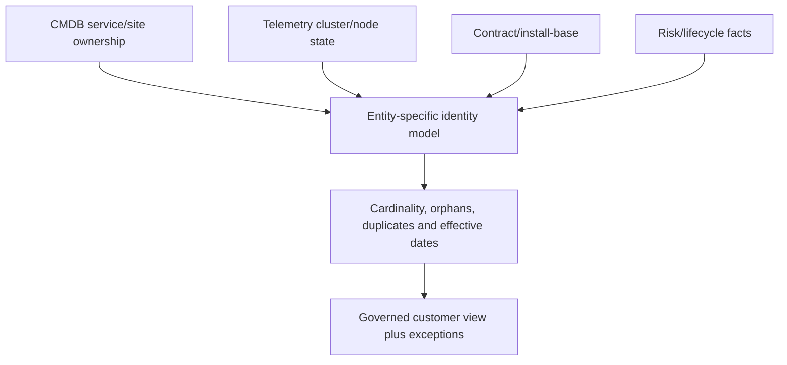

**Risk/recommendation:** Wrong-asset action wastes effort and harms trust. Recommend field-specific authority, stable-ID bridges, effective-dated events and exception review before publishing.

**Review/objection:** `Use the largest number to be safe.` Response: overcounting and wrong associations are not conservative; they create false actions.

**Action/validation/outcome:** Data steward **2026-09-13**, customer asset owner **2026-09-17**. Synthetic outcome: 40 active governed systems, zero duplicate risk joins, three explicit unresolved exceptions. Residual: manual move/add/change lag.

**Customer wording:** `The source counts use different grains and cutoffs. We have reconciled 40 active systems and are withholding three asset-level conclusions until their identities are resolved.`

### Case 18 - Recurring incidents may match a defect

**Discovery:** Five synthetic cases across two sites show similar client timeouts; account team asks Engineering to declare a duplicate bug.

**Identity/data:** Normalize service, exact product/release/platform/protocol, trigger, signature, path, changes, affected/control scope, actions and outcome; defect details remain gated.

**Analysis and gate:** Three cases match one path-loss mechanism; two have different app-queue timing. Candidate defect matches version but not proven trigger/signature. Support owns case and Engineering route.

```mermaid
flowchart LR
    CASES[Five incident records] --> NORM[Normalize recipe, trigger and signature]
    NORM --> C1[Three path-loss cluster]
    NORM --> C2[Two app-queue cluster]
    C1 --> DEF[Candidate defect applicability]
    DEF --> ASK[Support-led exact Engineering ask]
    C2 --> APP[Separate application problem action]
```

**Risk/recommendation:** False deduplication can apply wrong fix; recommend two problem records, path containment, exact defect evidence package and current fixed-release/workaround assessment.

**Review/objection:** `One bug ID makes the executive story simpler.` Response: simplicity cannot erase contradictory mechanisms.

**Action/validation/outcome:** Support owner **2026-09-05**, network/app owners **2026-09-12**. Synthetic outcome: path cases cease after qualified correction; app cases improve after queue fix. Residual: candidate defect remains unknown and is not customer-claimed.

**Customer wording:** `The incidents share a symptom label but split into two evidence patterns. We are addressing each demonstrated mechanism and asking Support to assess defect applicability only for the matching group.`

### Case 19 - Preventative recommendations stall on budget and downtime

**Discovery:** Synthetic service review has six aging lifecycle/path/protection actions; customer has no current budget or outage window.

**Identity/data:** Verify each asset/risk/source/deadline, action state, blocker, owner, dependency, latest safe start, business service, outage requirement and current controls.

**Analysis and gate:** Generic recommendations and no accountable decision owner contributed to aging. Current lifecycle/compatibility evidence gates urgency; commercial options require authorized account role.

```mermaid
flowchart LR
    ACTIONS[Aging recommendations] --> BLOCK[Budget, window, owner and prerequisite blockers]
    BLOCK --> PRIOR[Risk, deadline and latest safe start]
    PRIOR --> OPT[Status quo, phased, control or redesign options]
    OPT --> DEC[Authorized customer/account decision]
    DEC --> TRACK[Owner/date/proof/residual risk]
```

**Risk/recommendation:** Missing lifecycle deadline or compound degraded state. Recommend phase no-regret evidence/application testing now, reserve micro-windows and record bounded risk acceptance for deferred spend.

**Review/objection:** `Come back next fiscal year.` Response: show which evidence tasks cost little now and which latest-safe-start arrives before budget.

**Action/validation/outcome:** Customer platform sponsor **2026-09-30** decision; technical validation owners **2026-09-15**. Synthetic outcome: four actions funded/phased, one risk accepted with expiry, one closed as non-applicable; median action age falls 35%. Residual: refresh funding remains contingent.

**Customer wording:** `We have separated immediate evidence and risk-reduction work from capital spend. The decision now is to reserve the first validation windows so the lifecycle deadline does not become an emergency.`

### Case 20 - Trust and governance recovery after a wrong fleet recommendation

**Discovery:** A synthetic quarterly review recommended upgrades for the wrong asset population because stale names and a many-to-many join multiplied records. Executives challenge the analyst's credibility.

**Identity/data:** Preserve the erroneous release, identify grain/key/cutoff/query version, correct stable identities and field authority, quantify affected decisions, protect stakeholder/account details and peer-review the corrected model.

**Analysis and gate:** Root cause is an analysis-control failure: weak keys plus missing cardinality/freshness gate, not one person's carelessness. All technical recommendations are revalidated against current IMT/HWU/lifecycle/bug sources.

```mermaid
flowchart LR
    ERROR[Wrong fleet recommendation] --> ACK[Acknowledge and freeze affected actions]
    ACK --> TRACE[Trace grain, key, join, cutoff and source authority]
    TRACE --> FIX[Correct model and recommendations]
    FIX --> CONTROL[Add QA, peer review, release/evidence record]
    CONTROL --> DELIVER[Deliver corrected review and commitments]
    DELIVER --> TRUST[Measure reliability over future cycles]
```

**Risk/recommendation:** Wrong changes, wasted spend and trust loss. Recommend immediate withdrawal/correction, decision-impact review, governed data model, automated duplicate/orphan tests, dual review and a special-project closure report.

**Review/objection:** `Why should we trust the new report?` Response: show the defect, corrected controls, independent review, exception list and reproducible evidence; do not ask for trust on assertion.

**Action/validation/outcome:** Analyst/data steward **2026-09-06**, lead TAM/account owner **2026-09-08**, project closure **2026-10-01**. Synthetic outcome: zero duplicate joins, 100% high-risk actions traced to stable assets/current sources, two subsequent review cycles meet quality rubric and commitments. Residual: manual source updates can still be late and remain exceptioned.

**Customer wording:** `Our earlier analysis used stale names and an uncontrolled many-to-many join, which attached recommendations to the wrong systems. We have withdrawn those actions, corrected the model, added independent identity/freshness/cardinality checks, and provided a traceable exception list. We will rebuild confidence through verifiable delivery, not ask you to assume it.`

---

## 5. Coverage and balance check

```mermaid
quadrantChart
    title Casebook balance: technical depth and customer-governance intensity
    x-axis Lower governance intensity --> Higher governance intensity
    y-axis Lower technical depth --> Higher technical depth
    quadrant-1 Integrated technical TAM
    quadrant-2 Deep technical isolation
    quadrant-3 Data/process foundation
    quadrant-4 Customer governance
    NAS-SAN: [0.35, 0.82]
    Perf-Capacity: [0.48, 0.78]
    Protection-Security: [0.62, 0.84]
    Telemetry-Data: [0.70, 0.50]
    Review-Trust: [0.90, 0.45]
```

| Domain | Cases | Required proof style |
|---|---|---|
| NAS/SAN | 1-4 | Exact gate, identity, path, mapping and safe access/device proof |
| Performance/capacity | 5-8 | Comparable baseline, distribution, mechanism, controlled response |
| Protection/security/DR | 9-11, 15 | Usable point, clean recovery, single-writer/security authority |
| Upgrade/supportability/HA | 12-14 | Current/intermediate state, exact matrix/source, go/no-go and redundancy |
| Telemetry/data/bugs | 16-18 | Coverage, stable identity, applicability and gated ownership |
| Review/governance | 19-20 | Decision rights, adoption, quality controls, measured trust/value |

### Completeness audit for any case

- Discovery and customer outcome.
- Identity/data quality/privacy.
- Competing analysis and decisive evidence.
- Supportability, bug/advisory and lifecycle gates where relevant.
- Risk, controls, confidence and horizon.
- Status quo/options/recommendation.
- Review, likely objection and decision authority.
- Action owner and date.
- Incident/restoration or change/validation method.
- Measured outcome, residual risk and customer wording.

---

## 6. Scoring rubric

Score a case out of 100. A technically clever answer with invented experience or unsafe action cannot pass.

| Dimension | Points | Full-credit behavior | Automatic concern |
|---|---:|---|---|
| Discovery/customer outcome | 10 | Business service, impact, objective, owners, constraints | Starts with product change |
| Identity/data/privacy | 10 | Stable IDs, source/cutoff/freshness/grain/access | Uses screenshot/name-only join |
| Analysis/hypotheses | 15 | Baseline/timeline, alternatives, predictions, controls | One-cause assertion |
| Supportability/bug/lifecycle | 10 | Exact current sources and applicability | Invented matrix/bug/tool result |
| Risk quality | 10 | Trigger, consequence, exposure, horizon, controls, confidence | Severity equals probability |
| Options/recommendation | 10 | Status quo and tradeoffs; safe preferred action | One generic best practice |
| Stakeholder/review | 10 | Roles, objection, decision authority, customer wording | Analyst accepts customer risk |
| Execution/incident safety | 10 | Owner/date, approval, stop/recovery, secure evidence | Destructive/unsafe shortcut |
| Validation/outcome | 10 | Customer and layer proof, comparable measures | `Green` or activity only |
| Honesty/communication | 5 | Nonclaim, uncertainty, concise BLUF | Implies production NetApp experience |

```mermaid
flowchart TD
    ANSWER[Case answer] --> SAFETY{Safe, private and honest?}
    SAFETY -->|No| FAIL[Cannot pass regardless of score]
    SAFETY -->|Yes| SCORE[Score ten dimensions]
    SCORE --> BAND{Total}
    BAND -->|90-100| EX[Executive-ready with technical follow-up]
    BAND -->|75-89| GOOD[Strong; tighten gaps]
    BAND -->|60-74| DEV[Develop evidence/ownership/validation]
    BAND -->|Below 60| REBUILD[Rebuild with DIAGNOSE]
```

### Rubric anchors

- **90+**: exact, bounded, safe, customer-specific, current-source aware, measurable.
- **75-89**: sound method with one weak gate, metric, objection or residual-risk detail.
- **60-74**: plausible but generic, tool-led, incomplete ownership or weak proof.
- **Below 60**: jumps to cause/action, unsafe, untraceable, or experience-inflated.

### 🔍 Plain-English deep-dive: a strong answer is falsifiable and operational

`I would investigate` cannot be scored because it names no evidence or decision. A strong answer says what observation would support or weaken each hypothesis, who can act, what success means and what remains risky. **Why it matters:** interviews test judgment under incomplete information, not memorized product nouns.

---

## 7. Mock panel

### Roles

| Panel role | What they test |
|---|---|
| Lead TAM | Customer context, account boundaries, review quality |
| Storage SME | Architecture, failure gates, current-source discipline |
| Support/Engineering | Reproduction, evidence package, defect boundary |
| Customer operations lead | Practical action, downtime, ownership, communication |
| Executive sponsor | Impact, options, decision, value and trust |

```mermaid
sequenceDiagram
    autonumber
    participant P as Panel
    participant A as Arti
    P->>A: Present one case prompt with missing information
    A->>P: Clarifying discovery and data questions
    P-->>A: Supply synthetic evidence and one contradiction
    A->>P: DIAGNOSE answer in 3-5 minutes
    P->>A: Technical counterhypothesis and customer objection
    A->>P: Update confidence, options and decision boundary
    P->>A: Ask for 60-second executive version
    A->>P: Impact, evidence, risk, recommendation, owner/date/proof
    P->>P: Score rubric and give one improvement target
```

### Mock-panel rounds

1. **Round 1 - Technical isolation:** Randomly choose Cases 1-8 or 14.
2. **Round 2 - Protection/change:** Choose Cases 9-15.
3. **Round 3 - Data and account:** Choose Cases 16-20.
4. **Round 4 - Contrarian:** Panel changes one fact that weakens the preferred hypothesis.
5. **Round 5 - Executive:** Compress to 60 seconds with exact decision ask.
6. **Round 6 - Honesty:** State what Arti did in production versus learned/synthetic.

### Follow-up challenge bank

- What evidence would make you reverse your recommendation?
- Which source is authoritative, and how current is it?
- Why is this Support versus Engineering versus customer-owned work?
- What happens if the customer does nothing?
- What is the safest reversible first action?
- How does the recommendation affect RPO/RTO, security, capacity and neighbors?
- What if rollback is unavailable?
- How do you know the outcome was caused by the action?
- What remains unknown and who accepts it?
- Explain it without naming a NetApp tool.

---

## 8. Case answer templates

### Technical deep-dive template

```mermaid
flowchart LR
    S[Symptom/transaction] --> PATH[End-to-end path and first failed gate]
    PATH --> OBS[Observations and controls]
    OBS --> HYP[Hypotheses and predictions]
    HYP --> GATE[Supportability/bug/lifecycle]
    GATE --> TEST[Safe discriminating test]
    TEST --> ACT[Recommendation and owner]
    ACT --> PROOF[App/data/layer validation and residual]
```

### Executive template

> `As of <time>, <customer outcome> is <state>. We verified <decisive evidence>; <unknown> remains. The material risk is <consequence/horizon>. Options are <status quo/A/B>; we recommend <option> because <tradeoff>. <authority> must decide <ask>. <owner> will act by <date>; success is <measure>. Residual risk is <remainder>.`

### Objection template

> `I understand the concern is <interest/constraint>. We agree on <facts>. The current evidence means <bounded claim>, not <overclaim>. We can choose <options> with these tradeoffs. <role> owns the decision; I will document <action/proof/residual>.`

---

## 9. Arti transfer/honesty and JD Mapping

```mermaid
flowchart LR
    MS[Microsoft enterprise Support/CRITSIT] --> INCIDENT[Incident, RCA and Engineering evidence]
    M365[SharePoint/OneDrive/AD/networking] --> DATA[Data, identity and dependency reasoning]
    BI[MBA, Excel, Power BI, SQL, Python] --> ANALYTICS[Quality, risk, trend and outcome analysis]
    REVIEW[Customer reviews, CSAT and mentoring] --> TAM[Communication, influence and knowledge]
    INCIDENT --> TRANS[Transferable TAM case method]
    DATA --> TRANS
    ANALYTICS --> TRANS
    TAM --> TRANS
    TRANS --> GAP[Production NetApp tools/operations/account outcomes remain gaps]
```

| JD responsibility | Casebook evidence | Honest boundary |
|---|---|---|
| Analyze/report customer data | Cases 5-8, 16-17, 20 | Synthetic NetApp data; real analytics skills |
| Strategic upgrade advice | Cases 12-13 | No production ONTAP execution |
| Install-base accuracy | Cases 16-17, 20 | No live NetApp source access |
| Operational reviews | Cases 19-20 and all customer wording | Microsoft reviews transfer |
| Risk/stability | All cases, especially 9-15 | Qualified owners control live actions |
| Remediation adoption | Cases 6, 12, 19 | No customer budget/risk authority |
| High-pressure situations | Cases 11, 14-15 | Microsoft CRITSIT evidence |
| Cross-functional/SME | Cases 2-4, 13, 18 | No NetApp internal role claim |
| Value/customer loyalty | Cases 19-20 | Contribution only; no renewal causality |

### Honest interview statement

> `My production examples are Microsoft enterprise support, CRITSIT, identity/data-service troubleshooting, Engineering engagement, analytics and customer reviews. I use the same structured method in these twenty fully synthetic NetApp cases: verify the customer outcome and data, test competing hypotheses, validate current supportability and lifecycle, frame risk and options, respect decision boundaries, and measure the result. I have not operated NetApp in production, and I would use current NetApp tools and qualified owners for live work.`

---

## 10. Labs, drills, and self-test

### Twenty-case practice plan

```mermaid
flowchart LR
    READ[Read one case] --> CLOSE[Close the model answer]
    CLOSE --> SPEAK[Answer from DIAGNOSE in 3-5 minutes]
    SPEAK --> RECORD[Record audio or notes]
    RECORD --> SCORE[Score 100-point rubric]
    SCORE --> CHALLENGE[Add one contradiction/objection]
    CHALLENGE --> EXEC[Repeat in 60 seconds]
    EXEC --> RETEST[Revisit after spaced interval]
```

### Self-quiz tracker

| Case | First score | Technical gap | Customer gap | Honesty boundary stated? | Retest date | Retest score |
|---:|---:|---|---|---|---|---:|
| 1-4 |  |  |  |  |  |  |
| 5-8 |  |  |  |  |  |  |
| 9-12 |  |  |  |  |  |  |
| 13-16 |  |  |  |  |  |  |
| 17-20 |  |  |  |  |  |  |

### Required drills

1. Answer every case in 3-5 minutes without reading.
2. Compress every case to 60 seconds.
3. For each case, name two observations that could reverse the recommendation.
4. Replace every product/tool noun with a plain-English explanation.
5. Identify the exact customer decision owner and Support/Engineering boundary.
6. State source date/currency and data/privacy limit.
7. Add one objection and one alternative option.
8. State measurable outcome and residual risk.
9. Separate Microsoft production evidence from synthetic NetApp practice.
10. Run the six-round mock panel three times with randomized cases.

### Self-test

1. Recite DIAGNOSE and the 90-second compression.
2. Select cases by decision/failure shape.
3. Explain all twenty customer wordings without overclaiming cause.
4. Build current-source gates for IMT/HWU/bugs/lifecycle/docs.
5. Explain Support, Engineering, account and customer authority in each relevant case.
6. Produce owner/date/validation/residual risk for any prompt.
7. Score an answer and identify the weakest dimension.
8. Respond when panel evidence falsifies the first hypothesis.
9. Give an executive answer with one exact ask.
10. State all privacy, synthetic and no-production-NetApp boundaries.

### Casebook pass checklist

- [ ] Exactly twenty labeled cases are present and practiced.
- [ ] Every case includes discovery and customer outcome.
- [ ] Every case validates data/identity/freshness/privacy.
- [ ] Every case uses competing analysis and decisive evidence.
- [ ] Every case includes supportability, bug/advisory and lifecycle gates where relevant.
- [ ] Every case states risk, confidence, controls and horizon.
- [ ] Every case compares options and gives a bounded recommendation.
- [ ] Every case includes review, objection, decision authority and customer wording.
- [ ] Every case names action owner and date.
- [ ] Every case includes incident/restoration or validation approach.
- [ ] Every case reports measured synthetic outcome and residual risk.
- [ ] NAS, SAN, performance, capacity, protection, security, upgrade, telemetry, data and governance are diverse.
- [ ] No unsafe command, destructive action or invented internal process appears.
- [ ] All evidence, tools, customers, decisions and results are fully synthetic and sanitized.
- [ ] Production Microsoft transfer and NetApp gaps are explicit.
- [ ] Exact Q1-Q8 are answered aloud.

---

## 11. Official and Public Source Anchors

**Date checked: 2026-08-24.** These sources anchor public concepts and navigation across the casebook. They do not prove any fictional case, live supportability, defect, entitlement, account state, or customer outcome.

| Topic | Official/public source | Bounded use |
|---|---|---|
| NetApp documentation | [NetApp Documentation](https://docs.netapp.com/) | Current product/release source entry; exact topic required |
| ONTAP concepts | [ONTAP concepts](https://docs.netapp.com/us-en/ontap/concepts/) | Broad architecture vocabulary |
| NAS | [ONTAP NAS management](https://docs.netapp.com/us-en/ontap/nas-management/) | Current NFS/SMB/namespace orientation |
| SAN and hosts | [ONTAP SAN storage management](https://docs.netapp.com/us-en/ontap/san-management/), [ONTAP SAN hosts](https://docs.netapp.com/us-en/ontap-sanhost/) | Current LUN/igroup/host/multipath navigation |
| Performance/QoS | [ONTAP performance administration](https://docs.netapp.com/us-en/ontap-performance-admin/) | Current counter/workflow/QoS navigation |
| Capacity/FabricPool | [ONTAP volume administration](https://docs.netapp.com/us-en/ontap/volumes/), [FabricPool](https://docs.netapp.com/us-en/ontap/fabricpool/) | Current capacity/tiering context |
| Protection/DR | [ONTAP data protection and disaster recovery](https://docs.netapp.com/us-en/ontap/data-protection-disaster-recovery/), [MetroCluster](https://docs.netapp.com/us-en/ontap-metrocluster/) | Current replication/restore/DR navigation |
| Security | [ONTAP security and data encryption](https://docs.netapp.com/us-en/ontap/security-encryption/), [NetApp Security Advisories](https://security.netapp.com/advisory/) | Current security/advisory context; exact applicability required |
| Upgrades/lifecycle | [ONTAP upgrade](https://docs.netapp.com/us-en/ontap/upgrade/), [ONTAP release support](https://docs.netapp.com/us-en/ontap/release-notes/release-support-reference.html) | Current planning/support context |
| AutoSupport/Digital Advisor | [AutoSupport](https://docs.netapp.com/us-en/ontap/system-admin/manage-autosupport-concept.html), [Digital Advisor](https://docs.netapp.com/us-en/active-iq/) | Public telemetry/service context; customer data gated |
| IMT/HWU/bugs | [IMT](https://imt.netapp.com/), [HWU](https://hwu.netapp.com/), [Bugs Online](https://mysupport.netapp.com/site/bugs-online) | Authorized current evidence only; never invent results |
| Support | [NetApp Support Services](https://www.netapp.com/services/support/) | Public service context; exact entitlement/route requires confirmation |

### Source-use discipline

- Reopen exact product/release/configuration pages and gated tools at decision time.
- Record source URL/tool, revision/date, scope, identity, cutoff and access class.
- Never turn a public overview into a customer configuration, guaranteed outcome or internal process.
- Keep IMT/HWU/bugs, cases, telemetry, customer data and account decisions in approved systems.
- Route live technical actions through qualified Support/customer/change owners.

---

## Likely Interview Questions

### Q1. How do you approach an unfamiliar end-to-end customer case?

> **Model answer:** `I use DIAGNOSE: discover the business outcome and environment; verify stable identities, evidence quality and privacy; analyze baseline, timeline and competing hypotheses; gate conclusions through current supportability, bug/advisory and lifecycle sources; name risk and confidence; compare options; review objections and decision authority; then execute through an owner/date and evaluate customer outcome and residual risk.`

### Q2. How do you choose which evidence and tools to use?

> **Model answer:** `I begin with the decision and first failed interface, then request the minimum evidence that can distinguish hypotheses. I require object, population, time, definition, provenance, freshness and access. Tools are sources, not answers: I reconcile ONTAP/host/network/app data and use IMT, HWU, bugs, lifecycle or Digital Advisor only when relevant and current.`

### Q3. How do you connect technical findings to customer risk?

> **Model answer:** `I state the verified condition, exact exposure/trigger and mechanism, potential consequence to a named customer objective, scope and horizon, current controls, confidence and unknowns. I preserve source severity separately from likelihood, urgency and business priority, then compare status quo and actions with residual risk.`

### Q4. How do you handle objections and authority boundaries?

> **Model answer:** `I acknowledge the underlying interest such as downtime, budget, app support or evidence trust; restate agreed facts and bounded claim; offer feasible options with tradeoffs; and identify who owns Support progression, Engineering product decisions, customer change/risk, account coordination and commercial terms. I influence the decision but do not impersonate its owner.`

### Q5. What makes a recommendation actionable and measurable?

> **Model answer:** `It has exact scope and rationale, status quo and alternatives, prerequisites, owner, target date, dependency, supportability, canary or incident safeguards, stop/recovery, customer and technical success criteria, observation window and residual risk. Completion is distinct from effectiveness, and the outcome is compared with a valid baseline.`

### Q6. How do you respond when new evidence weakens your first hypothesis?

> **Model answer:** `I say which prediction failed, lower confidence, preserve the evidence and customer objective, promote the alternative that now best fits, and choose the next safe discriminating test. I correct any customer or decision record immediately. Changing the model is disciplined troubleshooting, not loss of credibility.`

### Q7. How would you present one case differently to an SME and an executive?

> **Model answer:** `For an SME I include exact topology, versions, operation, trace/counter definitions, competing hypotheses, supportability and test. For an executive I lead with impact/state, decisive evidence and uncertainty, risk/horizon, options, recommendation, decision ask, owner/date and proof. Both versions use the same facts and claim limits.`

### Q8. How does your background transfer, and how do you avoid overstating NetApp experience?

> **Model answer:** `Microsoft enterprise escalation, CRITSIT, M365 identity/data services, networking, Product/Engineering collaboration, analytics and customer reviews give me the core method. I explicitly say I have not operated NetApp in production; these twenty cases are fully synthetic. For live work I would use current NetApp tools and qualified owners while contributing strong evidence, communication and follow-through.`

---

## 30-Second Memory Hooks

- **DIAGNOSE:** Discover, Identity/data, Analyze, Gate, Name risk, Options, Stakeholders, Execute/evaluate.
- **Case:** Customer outcome -> evidence -> mechanism -> decision -> proof.
- **Identity:** Wrong asset means wrong everything.
- **Data:** Source + cutoff + freshness + definition + privacy.
- **Hypothesis:** Predict evidence and be willing to lose.
- **Gate:** Exact IMT/HWU/app/bug/lifecycle, current date.
- **Risk:** Trigger + mechanism + objective consequence + horizon + confidence.
- **Options:** Always include status quo and tradeoffs.
- **Authority:** Expertise advises; customer/Support/Engineering/account roles decide within scope.
- **Action:** Owner + date + dependency + stop/recovery + proof.
- **Outcome:** Customer SLO/RPO/RTO/risk/data quality, not activity count.
- **Residual:** What can still fail after `done`.
- **Objection:** Often a hidden requirement.
- **Executive:** Impact, evidence, risk, recommendation, ask, owner/date, proof.
- **Contradiction:** Update the model and correct the record.
- **Honesty:** Microsoft production evidence transfers; twenty NetApp cases remain synthetic.

---

## Completion Checklist

- [ ] Exactly twenty labeled cases are present, diverse and fully synthetic.
- [ ] Use DIAGNOSE for every spoken and written case answer.
- [ ] Start with customer outcome, service and constraints.
- [ ] Verify stable identity, source, cutoff, freshness, units, grain and privacy.
- [ ] Build competing hypotheses with predictions, controls and counterevidence.
- [ ] Revalidate exact supportability, bugs/advisories, lifecycle and source dates where relevant.
- [ ] State bounded risk, confidence, current controls and time horizon.
- [ ] Compare status quo and feasible options before recommending.
- [ ] Address objections and preserve Support/Engineering/customer/account authority.
- [ ] Name owner, date, dependencies, stop/recovery and exact validation.
- [ ] Report measured synthetic outcome and residual risk.
- [ ] Use customer-safe wording that separates facts, uncertainty and action.
- [ ] Score each case with the rubric and retest weak dimensions.
- [ ] Complete six-round mock panels across technical, protection and governance cases.
- [ ] Never use unsafe commands, real data, invented tool output or internal process.
- [ ] State the exact no-production-NetApp boundary and Arti's factual transfer.
- [ ] Answer exact Q1-Q8 aloud.

---

*Next suggested section:* [Part 82 - Safe NetApp Practice Environment and Evidence Portfolio](Part-82-safe-netapp-practice-environment.md)