# Part 82 - Safe NetApp Practice Environment and Evidence Portfolio

> **Section goal:** Build a legal, isolated, cost-aware way to practice NetApp concepts and produce honest evidence without touching a customer system, bypassing access controls, or pretending that a paper exercise is production experience. By the end, Arti can choose an authorized route, design the environment before acting, collect reproducible evidence, clean it up, and describe exactly what she did.

Covers index item **82** and maps directly to job-description responsibilities for learning new technology, technical analysis, risk mitigation, documentation, customer-data handling, Microsoft Office deliverables, special projects, coaching, and trustworthy customer communication.

**Privacy and access boundary:** Use only environments, identities, licenses, data, downloads, and systems that the learner is explicitly authorized to use; never place customer data, credentials, or restricted artifacts in the portfolio.

**Synthetic-evidence rule:** Every persona, system, result, screenshot description, cost, date, and finding in the fallback exercises is fictional and sanitized.

**Version caveat:** Availability, licensing, access routes, interfaces, features, commands, limits, and costs change; perform a current-doc check before every lab.

**Lab safety contract:** The access fallback is a complete synthetic design exercise. Use read-only first, obtain authorization before change, run a positive test and negative test, use bounded failure injection, document recovery and rollback, capture evidence, complete cleanup, control cost and privacy, and use honest interview language that distinguishes production, lab, and conceptual work.

**Explicit nonclaim:** Arti has not built, licensed, administered, or validated a production NetApp practice environment, ONTAP lab, simulator, customer sandbox, or NetApp training tenancy. Completing this Part alone does not establish hands-on ONTAP experience.

**Privacy/access:** Use only systems, software, subscriptions, data, identities, networks, portals, and documentation for which the owner has explicitly authorized the intended learning activity. Never use a customer system for personal practice, copy customer evidence into a portfolio, reuse credentials, expose management interfaces publicly, or place gated material in public Git repositories or unapproved AI tools.

**Synthetic-evidence:** Every organization, person, hostname, address, serial-like identifier, workload, ticket, metric, screenshot description, finding, cost example, result, and artifact below is fictional and sanitized. Synthetic artifacts must be visibly labeled so they cannot be mistaken for NetApp, employer, or customer records.

**Version/current-doc:** Product names, downloads, simulator or evaluation availability, licensing, entitlement, supported hypervisors, hardware requirements, interfaces, commands, cloud services, regions, quotas, and prices change. Verify the exact current official page and applicable terms before downloading, deploying, paying, or following a procedure. Sources in this Part were checked **2026-08-24**; that date is not a promise of current availability.

This Part supplies governance and design guidance, not credentials, software, licenses, support entitlement, a production runbook, a purchasing recommendation, or permission to use any NetApp/customer environment. It contains no bypass, cracked image, unofficial download, credential, or guaranteed-cost route.

> **No-production-NetApp boundary:** Arti's factual strengths are Microsoft enterprise Support Escalation Engineering, Azure and virtual-machine fundamentals, Windows networking, identity, CRITSIT evidence handling, customer reviews, Excel/Power BI/SQL/Python, mentoring, and technical writing. Her exact nonclaim is: **she has not operated a production NetApp lab or customer environment.** She may call a completed route `authorized lab work`, a paper route `synthetic design exercise`, and a documentation route `conceptual study`; she must not call any of them production NetApp administration.

---

## 1. Objectives, prerequisites, safety, and ethics

### Objectives

- Select a legitimate hands-on, official-course, documentation-only, or fully synthetic route without inventing access.
- Design workstation, network, identity, data, evidence, cost and cleanup controls before deployment.
- Separate read-only discovery from explicitly authorized change and failure testing.
- Produce positive, negative, failure, recovery and rollback evidence that is reproducible and safe to show.
- Describe production, authorized-lab, course, synthetic and conceptual evidence without inflating experience.

### Prerequisites

The minimum path needs a personally controlled editor, public official documentation, generated synthetic data, a private evidence location and time to complete privacy/claim review. A hands-on path additionally needs lawful media/equipment or an official sandbox, current license/entitlement, owner authorization, supported requirements, isolated networking, lab-only identities, cost approval and a cleanup plan. If any hands-on prerequisite is absent, use the documentation/synthetic fallback.

### The safety contract comes before the topology

A **practice environment** is a deliberately bounded place to learn. Think of it as a driving school course: permission, barriers, supervision, and cleanup matter before speed.

| Boundary | Required question | Safe evidence |
|---|---|---|
| Ownership | Who owns every system and account? | Written authorization or personally controlled tenancy |
| License | Does the right to download also permit this use? | Current official terms and entitlement record |
| Scope | What may be observed, changed, stopped, or deleted? | Approved scope and change gate |
| Data | Could any record identify a real customer or person? | Synthetic seed data and redaction check |
| Network | Can the management plane be reached from the internet? | Private segments, explicit rules, no broad exposure |
| Cost | What can accrue and who approves it? | Budget owner, alert, cap/stop rule, deletion proof |
| Claim | How will the exercise be represented? | Production/lab/conceptual label in every artifact |

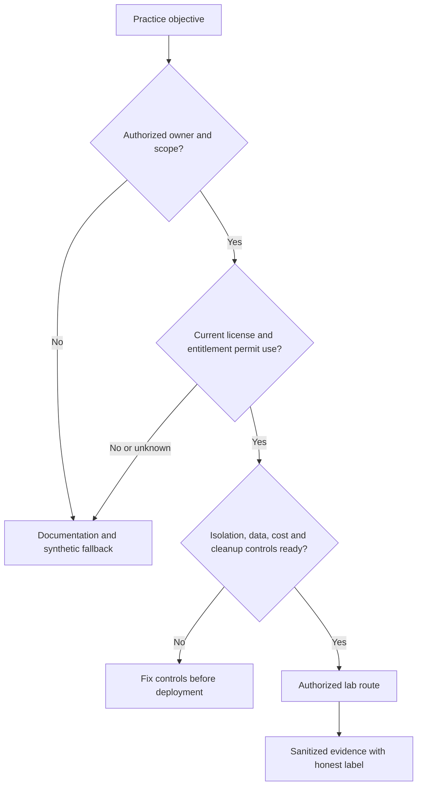

### 🔍 Plain-English deep-dive: access is not authorization

Being technically able to open a portal or system does not grant permission to use it for interview practice. A master key can open an office, but it does not let its holder run a private experiment there. Authorization must cover the owner, purpose, period, actions, data, and evidence handling.

## 2. Legitimate access routes and the complete fallback ladder

Choose the highest route that is genuinely available; do not manufacture access.

| Route | Conditions | What can be claimed | Fallback |
|---|---|---|---|
| Personally owned supported equipment | Lawful acquisition, licenses, safe power/network, current docs | `I built an isolated personal lab` | Synthetic design if hardware is unavailable |
| Employer training/sandbox | Written scope, approved account, training purpose, data rules | `I used an authorized training sandbox` | Documentation exercise |
| Authorized customer sandbox | Customer and employer approve exact activity; never default | `I performed the approved sandbox exercise` | Do not use customer production |
| Official course/lab | Enrollment and terms permit exercises | `I completed the named official lab` | Record course and date, not hidden content |
| Officially available simulator/evaluation | Current official download and terms explicitly permit use | `I used the authorized version in a lab` | Do not use mirrors or leaked images |
| Documentation-only | Public official docs | `I designed and reasoned through the workflow` | Complete synthetic dataset |
| Fully synthetic case | Self-created sanitized records | `I built a synthetic evidence portfolio` | Always available |

**Simulator rule:** Simulator availability is deliberately not asserted here. Check only current official NetApp channels and applicable entitlement/terms. If no legitimate route is visible, stop; do not search mirrors, torrents, shared drives, old credentials, license keys, or copied virtual-machine images.

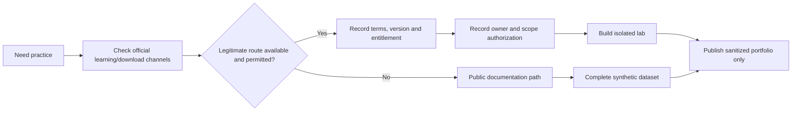

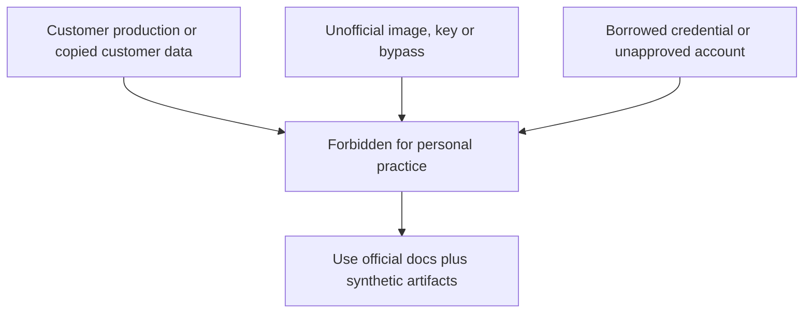

## 3. Licensing, entitlement, cost, and promise boundaries

- **License** means the legal terms governing use, like a rental agreement for software.
- **Entitlement** means the account is currently allowed to obtain a service or artifact, like a valid event ticket.
- **Subscription cost** means charges can continue while resources exist, like a running taxi meter.
- **Support entitlement** is not inferred from possession of media or hardware.

No dollar figure in a study guide is durable. Record currency, region, tax assumptions, discount exclusions, calculator timestamp, and who approved spend. Never promise that a route is free, available, supported, or capped.

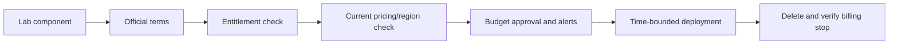

## 4. Workstation, compute, storage, and isolation design

Capacity-plan the lab like a small project. Record processor virtualization support, memory, local storage, hypervisor/version, management browser, client virtual machines, backup needs, and expected concurrent load. Requirements must come from the current authorized package, not this guide.

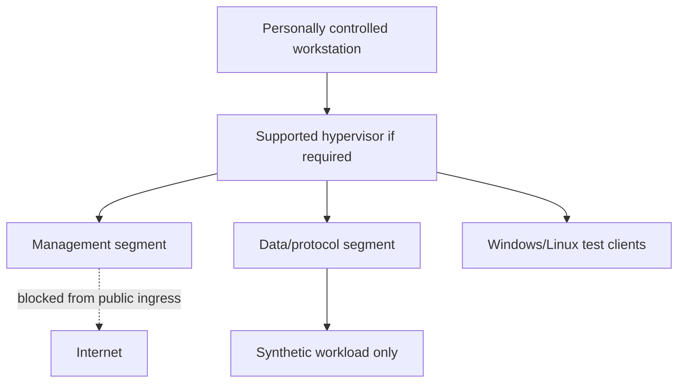

### Network controls

| Control | Purpose | Verification |
|---|---|---|
| Private addressing | Prevent accidental public reachability | Route/interface inventory |
| Host firewall | Permit only intended management/client flows | Explicit rules and negative test |
| Separate management/data segments | Limit blast radius and clarify traces | Topology plus reachability matrix |
| No inbound internet exposure | Avoid creating a target | External negative test under authorization |
| DNS/NTP plan | Keep names and timestamps reproducible | Forward/reverse/time checks |
| Snapshot/checkpoint policy | Support lab reset, not production backup claims | Controlled rollback test |

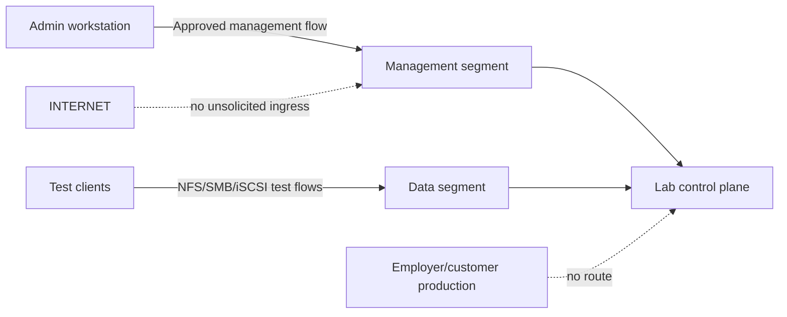

## 5. Synthetic organization, personas, data, workloads, and names

Use a stable fictional tenant: **Northstar Research Cooperative**, never a real customer. Personas make authorization and outcomes testable.

| Persona | Synthetic need | Allowed test identity |
|---|---|---|
| Maya, storage learner | Read-only discovery, then approved changes | `lab-storage-operator` |
| Dev, Linux researcher | NFS project files | `nrc-researcher-01` |
| Lina, Windows analyst | SMB team share | `nrc-analyst-01` |
| Omar, database operator | iSCSI block device | `nrc-db-operator` |
| Priya, reviewer | Evidence and risk review | `lab-reviewer` |

Naming pattern: `nrc-lab-<role>-<nn>`, documentation classification `SYNTHETIC-TRAINING`, dates in UTC, RFC 5737 documentation IP ranges when examples need addresses, and generated files such as `sample-0001.txt`. Never imitate a real company domain, serial, user, ticket, or share name.

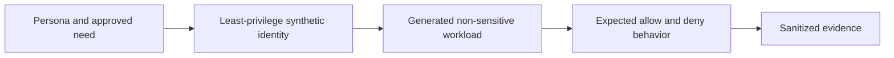

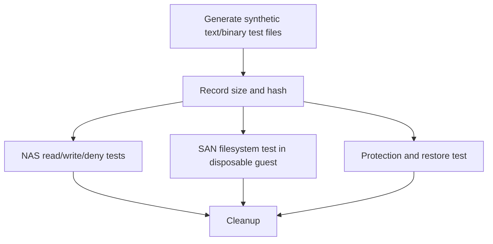

## 6. Secrets, identities, and least privilege

A **secret** is authentication material such as a password, token, key, or certificate private key. Treat it like a house key, not a screenshot decoration.

- Create lab-only identities; never reuse work/customer credentials.
- Prefer a secret manager or protected local mechanism supported by the environment.
- Keep secrets out of commands, shell history, screenshots, Markdown, Git, exports, and AI prompts.
- Use short-lived credentials where available; rotate after accidental disclosure.
- Separate read-only discovery from change roles.
- Do not weaken TLS, certificate validation, authentication, or firewall controls to make a demo easier.

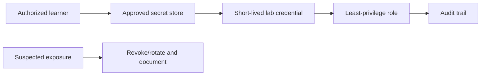

### 🔍 Plain-English deep-dive: redaction is not just drawing a black box

Image editors and document layers can retain underlying text or metadata. A paper label placed over a parcel does not remove the address beneath it. Crop only after creating a sanitized source, flatten/export safely, inspect metadata, search the final file, and have another person review it.

## 7. Architecture before steps

Before any deployment or paper exercise, produce six diagrams: ownership, logical topology, network flows, identity/trust, data path, and failure/cleanup boundaries. Procedures without architecture teach button memory; architecture lets the learner predict results.

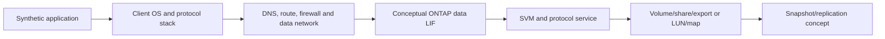

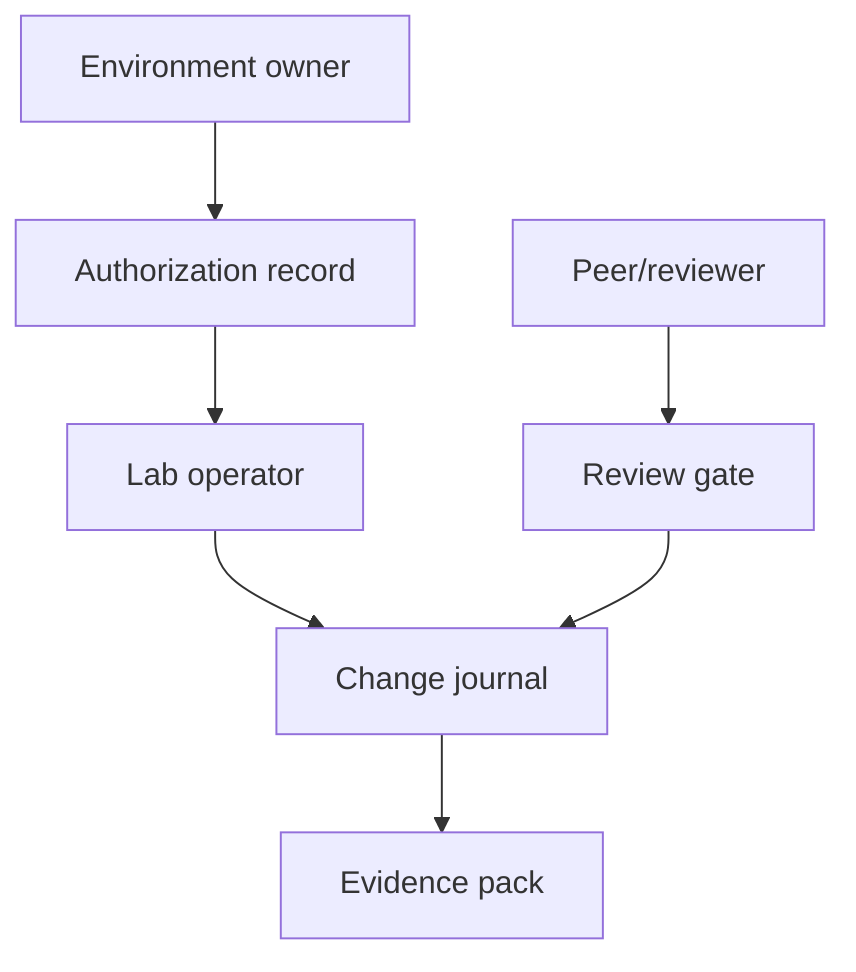

## 8. Read-only first, explicit change authorization second

The first pass inventories state without changing it. A state-changing action requires an approved objective, exact scope, prerequisites, expected effect, risk, backup/checkpoint, stop rule, rollback/recovery path, and reviewer.

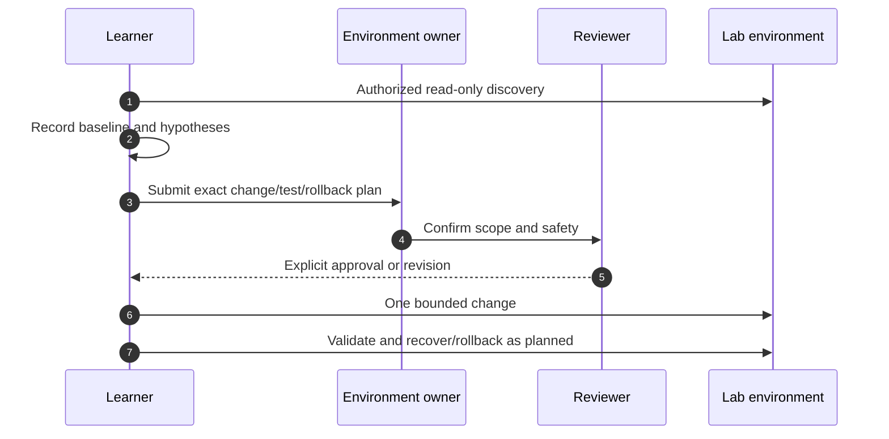

**Command policy:** command text in later labs is a conceptual placeholder unless an official public example is explicitly cited. Before use, verify syntax, privilege, side effects, release, environment, and rollback in current official documentation. Never paste a remembered production command from this guide.

## 9. Test model: positive, negative, failure, recovery, and rollback

| Test | Question | Example evidence |
|---|---|---|
| Positive | Does authorized intended behavior work? | Expected identity can read/write synthetic file |
| Negative | Is unintended behavior denied? | Unauthorized identity receives expected denial |
| Failure injection | Does a safe, reversible fault produce the predicted symptom? | One disposable client loses a lab-only route |
| Recovery | Does the approved restoration return service? | Same test passes and health returns |
| Rollback | Can the state change be reversed without hidden residue? | Before/after configuration and artifact inventory |

Failure injection is permitted only in an isolated lab with owner approval, a known blast radius, stop rule, recovery path, and no customer or production dependency.

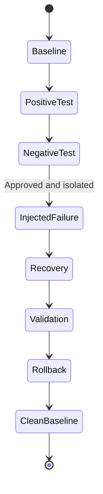

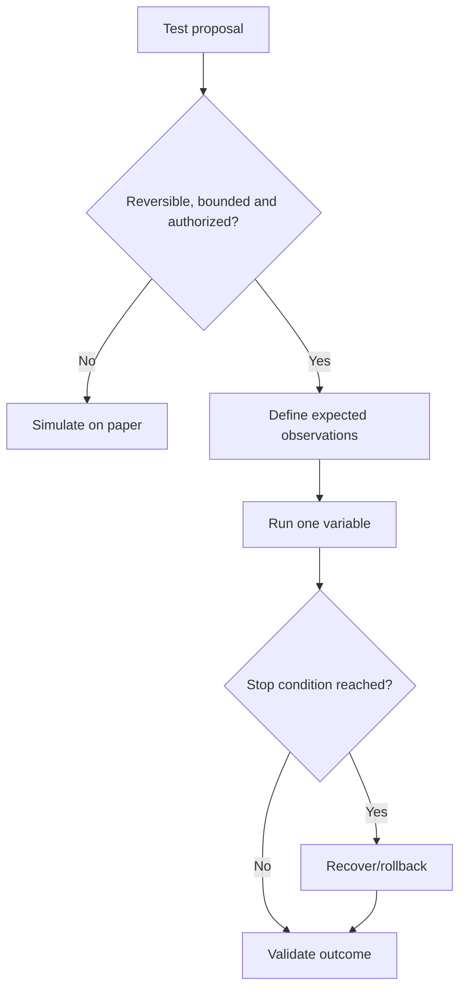

## 10. Evidence journal and version record

Every artifact needs provenance: where it came from, what it represents, when it was observed, and what it cannot prove.

| Field | Example |
|---|---|
| Artifact ID | `NRC-LAB82-E014` |
| Classification | `SYNTHETIC-TRAINING` |
| Objective | Prove management segment is isolated |
| Environment/owner | Personal lab / Arti |
| Product/interface | Conceptual ONTAP topology; no product output |
| Version/source | Exact official URL or `synthetic-only` |
| UTC start/end | ISO 8601 timestamps |
| Action/authorization | Read-only test / self-owned lab |
| Expected/observed | Public ingress denied / synthetic observation |
| Integrity | Hash for generated export where useful |
| Redaction | Reviewer/date |
| Limitation | Does not prove production supportability |

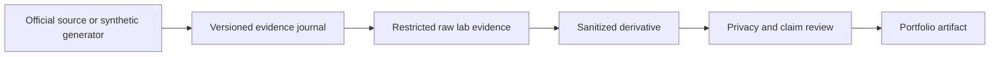

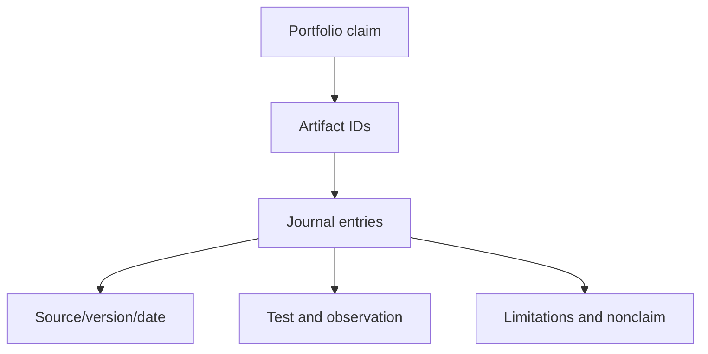

## 11. Git, screenshots, and document hygiene

Use a private repository by default. Commit only sanitized Markdown, diagrams, empty schemas, generated synthetic data, and scripts that contain no secrets or restricted text. A `.gitignore` reduces accidental additions but does not erase prior commits.

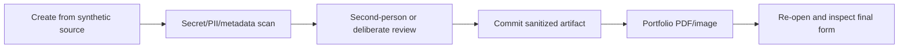

Screenshot checklist:

1. Use a synthetic source screen where possible.
2. Remove usernames, domains, IPs, browser profile, bookmarks, notifications, serials, tabs, paths, and timestamps that reveal context.
3. Do not show portal URLs, gated content, license keys, tokens, cookies, QR codes, or command history.
4. Crop, flatten, inspect metadata and optical-character-recognition text, then peer review.
5. Add `Synthetic lab evidence; not customer or production data` on the artifact.

## 12. Portfolio architecture and honest language

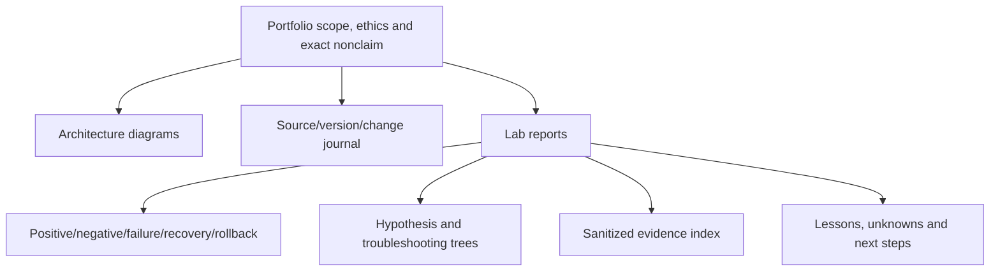

| Evidence level | Honest wording | Forbidden inflation |
|---|---|---|
| Production | `In Microsoft production support, I...` | Recasting it as NetApp administration |
| Authorized hands-on lab | `In an isolated authorized lab, I...` | `I deployed this for customers` |
| Official course lab | `I completed the course exercise...` | Claiming independent production design |
| Synthetic case | `I built a fully synthetic case and...` | Calling generated output telemetry |
| Documentation-only | `I studied current docs and would validate...` | `I implemented` or `I verified in ONTAP` |

### Arti tie-in and JD Mapping

| Arti evidence | Transfer to this portfolio | Gap stated honestly |
|---|---|---|
| Microsoft CRITSIT evidence discipline | Timelines, provenance, secure handling, rollback thinking | No production ONTAP changes |
| Azure/VM/network fundamentals | Isolated topology and dependency diagrams | No claim of a supported ONTAP simulator stack |
| Excel/Power BI/SQL/Python | Synthetic data generation, QA, analysis and visuals | No live Digital Advisor/customer export |
| Customer reviews and technical writing | Decision-ready findings and limitations | No NetApp service-review delivery |
| Mentoring | Teach-back and reviewer checklist | No NetApp certification or instructor status |

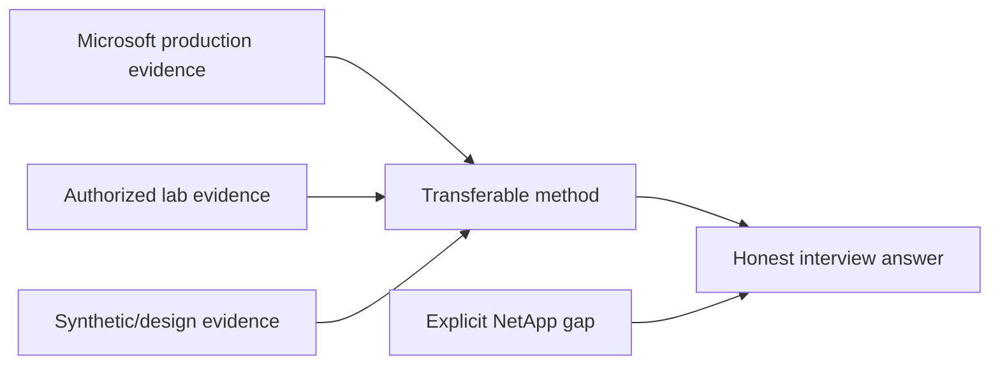

### 🔍 Plain-English deep-dive: a portfolio is an audit trail, not theater

A science notebook is valuable because another person can see the question, setup, observation, limitation, and revision. A polished screenshot without provenance is only a picture. The strongest portfolio may say `not tested` where access was unavailable and still demonstrate excellent reasoning.

## 13. Cleanup, cost closure, and privacy closure

Cleanup is part of the lab, not an optional final chore.

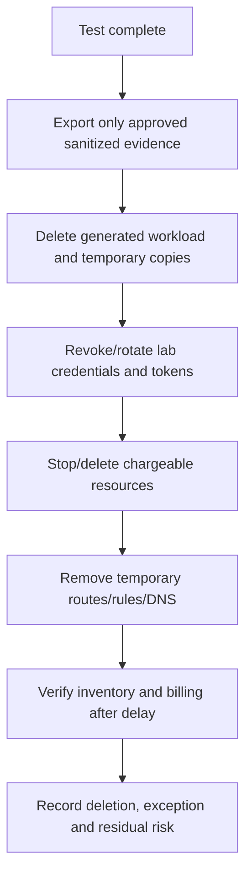

| Closure dimension | Proof |
|---|---|
| Resource | Final inventory contains no unintended running resource |
| Cost | Billing/usage rechecked after provider reporting delay |
| Secret | Temporary credentials revoked or rotated |
| Data | Synthetic datasets and restricted raw captures handled per plan |
| Network | Temporary exposure and routes removed |
| License | Media retained or deleted according to terms |
| Evidence | Only sanitized derivatives remain in portfolio |

## 14. Common failures and hypothesis tree

```mermaid
flowchart TD
    FAIL[Lab unavailable, unsafe or nonreproducible] --> A{Access/entitlement?}
    A -->|No| DOC[Use official-doc/synthetic fallback]
    A -->|Yes| C{Compute/storage capacity?}
    C -->|No| RESIZE[Adjust within current requirements]
    C -->|Yes| N{Network/DNS/time/isolation?}
    N -->|Fault| FIXN[Repair lab network without weakening controls]
    N -->|Healthy| I{Identity/secret/role?}
    I -->|Fault| FIXI[Correct least-privilege identity]
    I -->|Healthy| V{Version/procedure mismatch?}
    V -->|Yes| DOCS[Recheck exact current official docs]
    V -->|No| ESC[Preserve evidence; use authorized support/course route]
```

Common mistakes:

- Treating an old blog, community mirror, or remembered requirement as current authorization.
- Bridging a lab management network to public or corporate networks for convenience.
- Using realistic customer-like data when generated data would answer the question.
- Capturing screenshots before sanitizing the source.
- Committing a secret and believing deletion from the latest Git revision removed history.
- Running failure tests without a recovery checkpoint or stop rule.
- Reporting a paper design as a configured lab.
- Forgetting cloud disks, snapshots, IPs, logs, or backups that continue to cost money.

### 🔍 Plain-English deep-dive: rollback and recovery are different

**Rollback** restores the previous configuration; **recovery** restores the required service or data. Reinstalling a lab may recover learning capability without restoring the former state. Conversely, reverting a setting may not repair corrupted test data. Plan and prove both where applicable.

## 15. Fully synthetic sanitized scenario: Northstar Lab 82

**Objective:** Create a portfolio-ready design and paper validation for later ONTAP labs without asserting simulator access.

**Prerequisites:** Public official documentation, a Markdown editor, a diagram renderer, generated text files, a private local repository, and no NetApp software or customer data.

**Architecture before steps:** Two synthetic clients, separate management/data segments, conceptual two-node ONTAP cluster, NAS/SAN objects, a reviewer role, and no route to production.

```mermaid
flowchart TB
    ARTI[Arti - synthetic lab operator] --> M[Private management segment]
    WIN[Windows test persona] --> D[Private data segment]
    LINUX[Linux test persona] --> D
    M --> C[Conceptual two-node ONTAP cluster]
    D --> C
    C --> NAS[Synthetic NFS/SMB service]
    C --> SAN[Synthetic iSCSI service]
    C --> DP[Synthetic protection relationship]
    PROD[Customer/Employer production] -. prohibited/no route .-> C
```

**Read-only first:** Build an inventory schema and expected discovery map before proposing any configuration. **Explicit change authorization:** if an authorized hands-on route later becomes available, record owner approval for every state-changing phase; otherwise remain on the paper path.

**Test register:**

| ID | Type | Synthetic action | Expected observation | Recovery/rollback |
|---|---|---|---|---|
| T01 | Positive | Reviewer follows artifact-to-source links | Every claim resolves to source/date/limit | Repair broken references |
| T02 | Negative | Search repository for customer names/secrets | Zero matches | Remove, rotate if needed, rewrite history through approved method |
| T03 | Failure injection | Mark one source stale | Quality gate blocks recommendation | Refresh or label unknown |
| T04 | Recovery | Replace stale source with current dated record | Gate reopens after review | Preserve superseded record in journal |
| T05 | Rollback | Revert one synthetic topology revision | Prior diagram and inventory reconcile | Restore approved revision |
| T06 | Cleanup | Compare final inventory to zero-resource target | No live resource; only sanitized files | Delete exceptions and recheck |

```mermaid
sequenceDiagram
    autonumber
    participant A as Arti
    participant J as Evidence journal
    participant R as Reviewer
    A->>J: Record objective, source date and synthetic label
    A->>J: Add architecture and expected observations
    A->>R: Submit privacy/claim/version review
    R-->>A: Reject stale-source artifact
    A->>J: Refresh source or mark unknown
    R-->>A: Approve sanitized portfolio artifact
```

**Expected observations:** the design is internally consistent; no credential, customer identifier, gated screenshot, unsupported availability claim, or live cost exists; stale evidence blocks a conclusion; and every output states its evidence level.

**Evidence capture:** architecture set, authorization template, source journal, test register, evidence index, redaction checklist, cleanup record, hypothesis tree, and one-page reflection. Label all `SYNTHETIC-TRAINING`.

**Common failure:** A reviewer asks for a live UI screenshot. The correct response is not to borrow one; provide a clearly labeled diagram/table and explain that legitimate access was unavailable.

**Honest portfolio/interview language:** `I designed and peer-checked a fully synthetic NetApp practice environment. I validated evidence provenance, privacy, test, rollback and cleanup controls, but I did not deploy ONTAP or use a customer system. When legitimate access is available, I will apply the same gates to an authorized lab.`

```mermaid
flowchart LR
    PLAN[Plan and label synthetic] --> BUILD[Build diagrams/schemas]
    BUILD --> TEST[Run document/evidence tests]
    TEST --> REVIEW[Independent claim/privacy review]
    REVIEW --> PORT[Publish sanitized portfolio]
    PORT --> LEARN[Record gaps for Labs 1-5]
```

## 16. Source and version-control workflow

```mermaid
flowchart LR
    OFF[Official page] --> DATE[Checked 2026-08-24]
    DATE --> SCOPE[Record product/release/scope]
    SCOPE --> QUOTE[Paraphrase bounded claim]
    QUOTE --> REVIEW[Reviewer verifies link and limit]
    REVIEW --> EXP[Expiry/recheck trigger]
```

Recheck when a lab begins, a version changes, a link redirects, a service is renamed, access terms change, pricing/region matters, or a claim will guide a live decision.

## 17. Official and Public Source Anchors

**Date checked: 2026-08-24.** These sources establish public concepts and navigation only. They do not establish download entitlement, simulator availability, license rights, supportability, pricing, region availability, or permission for a specific environment.

| Topic | Official source | Bounded use |
|---|---|---|
| NetApp documentation | [NetApp Documentation](https://docs.netapp.com/) | Current public documentation entry point |
| ONTAP concepts | [ONTAP concepts](https://docs.netapp.com/us-en/ontap/concepts/) | Architecture vocabulary for paper designs |
| ONTAP administration | [ONTAP documentation](https://docs.netapp.com/us-en/ontap/) | Release-aware task navigation; verify exact page |
| NetApp learning | [NetApp Learning Services](https://www.netapp.com/support-and-training/netapp-learning-services/) | Official training entry point; availability and terms vary |
| NetApp Support | [NetApp Support](https://mysupport.netapp.com/) | Entitled/gated downloads and support; access does not imply portfolio permission |
| Security advisories | [NetApp Security Advisories](https://security.netapp.com/advisory/) | Public security updates; exact applicability requires validation |
| Git secret hygiene | [GitHub documentation: removing sensitive data](https://docs.github.com/en/authentication/keeping-your-account-and-data-secure/removing-sensitive-data-from-a-repository) | General repository remediation; follow owner policy |
| Documentation IP addresses | [IETF RFC 5737](https://www.rfc-editor.org/rfc/rfc5737) | Reserved IPv4 ranges for examples |

## 18. Self-Test and Teach-Back

1. Draw the authorization decision and explain why possession is not permission.
2. Name six legitimate routes/fallbacks and the claim allowed for each.
3. Design management/data isolation and prove there is no production route.
4. Create five synthetic personas, identities, workloads, allow tests and deny tests.
5. Write a read-only baseline and an explicit change-authorization template.
6. Produce positive, negative, failure, recovery, rollback and cleanup tests.
7. Build an evidence journal entry with source/version/date/provenance/limitation.
8. Inspect a sample Git export and screenshot for secrets, metadata and claim inflation.
9. Explain license, entitlement, support and cost as four separate checks.
10. Deliver the exact no-production-NetApp boundary in under 30 seconds.

---

## Likely Interview Questions

### Q1. How would you obtain a safe NetApp practice environment?

> **Model answer:** `I would start with official training, support or evaluation channels and verify current entitlement, license terms and requirements. I would use only personally controlled or explicitly authorized resources, isolate management and data networks, use synthetic data and set cost/cleanup controls. If legitimate software or hardware access is unavailable, I use official documentation plus a fully synthetic design; I never use customer production, borrowed credentials or unofficial images.`

### Q2. What is your no-production-NetApp boundary?

> **Model answer:** `I have Microsoft production support, incident, analytics and customer-review experience, but I have not operated a production NetApp lab or customer environment. I distinguish authorized lab work, official course work, synthetic exercises and conceptual study in every artifact and answer.`

### Q3. How do you protect secrets and customer information in a portfolio?

> **Model answer:** `I create from synthetic sources, use lab-only least-privilege identities, keep secrets out of commands and Git, sanitize before capture, inspect image/document metadata, scan the final repository, use approved private storage, and obtain a deliberate review. Real customer or gated evidence never enters the portfolio.`

### Q4. Why do you design architecture before following steps?

> **Model answer:** `Architecture identifies owners, trust, traffic, data paths, failure domains and cleanup boundaries. It lets me predict observations and detect a wrong step rather than memorizing clicks. I document ownership, logical topology, network, identity, data path and failure/cleanup views before changes.`

### Q5. What evidence proves a lab exercise was rigorous?

> **Model answer:** `A reproducible journal links objective, authorization, environment, exact source/version/date, baseline, action, expected and observed result, positive and negative controls, failure/recovery/rollback, sanitized artifacts, limitations and cleanup. A screenshot alone proves very little.`

### Q6. How do you handle simulator availability or cloud cost questions?

> **Model answer:** `I do not promise either. I verify simulator or evaluation availability only through current official channels and applicable terms. For cloud I check current region, calculator, quotas, discounts, taxes and owner approval; set alerts and stop rules; then delete and verify. Documentation and synthetic exercises are the fallback.`

### Q7. What is the difference between rollback and recovery?

> **Model answer:** `Rollback returns configuration toward its prior state; recovery returns the required service or data to an acceptable state. They can diverge, so I define and test both, including stop conditions and validation, before an authorized failure exercise.`

### Q8. How does your background help you build this portfolio?

> **Model answer:** `Microsoft escalation and CRITSIT work gives me secure evidence, hypothesis, change and communication discipline; Azure and networking help with isolation; analytics helps with synthetic data and QA; and customer reviews help translate findings into decisions. Those methods transfer, while the portfolio explicitly does not claim production ONTAP experience.`

---

## 30-Second Memory Hooks

- **Access is not authorization:** a key is not permission.
- **License/entitlement/support:** terms, ticket and assistance are separate.
- **Fallback ladder:** official lab -> authorized sandbox -> docs -> synthetic case.
- **No customer practice:** production is never a personal playground.
- **Architecture first:** map owners, trust, flow, failure and cleanup.
- **Read-only first:** observe before changing.
- **Test five:** positive, negative, failure, recovery, rollback.
- **Evidence:** source + version + time + observation + limitation.
- **Secrets:** never in history, screenshots, Git or prompts.
- **Cost:** approve, alert, stop, delete, recheck.
- **Portfolio:** audit trail, not screenshot theater.
- **Claim:** production, lab, course, synthetic or conceptual; say which.

---

## Completion Checklist

- [ ] State the Explicit nonclaim, Privacy/access, Synthetic-evidence, Version/current-doc and No-production-NetApp boundary exactly.
- [ ] Use only legitimate access routes; never use unofficial images, bypasses, keys or borrowed credentials.
- [ ] Verify simulator/evaluation availability only through current official sources and terms.
- [ ] Keep customer and employer production systems forbidden for personal practice.
- [ ] Record license, entitlement, support, region, cost, budget owner and stop rules separately.
- [ ] Draw ownership, topology, network, identity, data-path and cleanup architecture before steps.
- [ ] Use synthetic personas, identities, names, addresses, data and workloads.
- [ ] Separate read-only discovery from explicitly authorized changes.
- [ ] Define expected observations and positive, negative, failure, recovery and rollback tests.
- [ ] Capture source/version/date, provenance, limitations and sanitized evidence.
- [ ] Protect secrets, screenshots, metadata, Git history and final exports.
- [ ] Complete resource, network, secret, data, license and cost cleanup.
- [ ] Build the Northstar synthetic portfolio and have it claim-reviewed.
- [ ] Use current official sources dated 2026-08-24 and recheck before action.
- [ ] Answer exact Q1-Q8 aloud and complete all self-tests.

---

*Next suggested section:* [Part 83 - LAB 1 - ONTAP Discovery, Topology, Inventory, and Health Baseline](Part-83-lab-ontap-discovery-health-baseline.md)