# Part 83 - LAB 1 - ONTAP Discovery, Topology, Inventory, and Health Baseline

> **Section goal:** Discover what an ONTAP environment contains, how its components relate, and what is healthy, degraded, unknown, or unsupported without changing state. By the end, you can turn authorized read-only evidence or a complete synthetic dataset into a reconciled install base, topology, health baseline, risk list, and interview-safe portfolio report.

Covers index item **83** and maps directly to job-description responsibilities for customer-environment understanding, install-base accuracy, customer-data analysis, risk mitigation, strategic planning, operational reviews, technical communication, and support-experience improvement.

**Privacy and access boundary:** Discovery requires explicit authorization, least privilege, approved evidence storage, redaction, retention, and separation from customer or restricted systems.

**Synthetic-evidence rule:** Every topology, identifier, health state, event, result, date, and recommendation in the fallback is fictional and sanitized.

**Version caveat:** Objects, fields, commands, APIs, health checks, limits, and interfaces change; complete a current-doc check for the exact release and lab route.

**Lab safety contract:** The access fallback is a complete synthetic dataset. Use read-only first, obtain authorization before change, run a positive test and negative test, use bounded failure injection only where approved, document recovery and rollback, capture evidence, complete cleanup, control cost and privacy, and use honest interview language.

**Explicit nonclaim:** You have not discovered, inventoried, health-checked, reconciled, or certified a production ONTAP cluster. This lab does not make you a NetApp administrator and does not establish that any example configuration is supported.

**Privacy/access:** Collect only the fields authorized for the stated purpose. Cluster names, serials, UUIDs, addresses, sites, users, events, support contracts, versions, topology, capacity, security posture, and protection relationships can be sensitive. Keep raw evidence in approved restricted storage; tokenize portfolio derivatives; never publish customer data, credentials, gated outputs, or real support records.

**Synthetic-evidence:** Every customer, cluster, node, serial-like value, SVM, LIF, address, port, volume, relationship, event, version, metric, finding, risk, and output below is fictional and sanitized. The complete fallback dataset is not copied from ONTAP, AutoSupport, Digital Advisor, IMT, HWU, or a customer.

**Version/current-doc:** ONTAP objects, fields, command syntax, REST resources, System Manager views, health definitions, defaults, support policies, and product names change. Sources were checked **2026-08-24**. Before an authorized session, verify the exact release and current official documentation; treat every command name below as a conceptual discovery family unless the current public command reference confirms it.

This is a learning lab, not a customer assessment, security audit, supportability certification, health guarantee, or production change runbook.

> **No-production-NetApp boundary:** Your production strengths are enterprise discovery, case evidence, Azure/VM/network mapping, Active Directory, data-quality analysis, Excel/Power BI, critical-situation communication, and customer reviews. Your exact nonclaim is: **you have not run ONTAP discovery or declared a production NetApp environment healthy.** You may present a completed authorized lab or this fully synthetic analysis with the evidence level stated.

---

## 1. Objectives, prerequisites, safety, and ethics

### Objectives

1. Identify cluster, node, high-availability pair, storage virtual machine, logical interface, network, storage, volume, protocol, protection, security, version, event, and health objects.
2. Join technical observations to a stable install-base record.
3. Draw physical, logical, service, and protection topology.
4. Separate `healthy`, `degraded`, `at risk`, `unknown`, and `not assessed`.
5. Produce a dated baseline with evidence, assumptions, reviewer, and next actions.

### Prerequisites and routes

| Route | Prerequisite | Permitted outcome |
|---|---|---|
| Authorized hands-on | Owner-approved read-only role, exact scope, current docs, secure evidence location | Observed lab baseline |
| Official course sandbox | Current enrollment and course scope | Course-lab evidence with course/date |
| Documentation path | Public official docs only | Conceptual discovery plan |
| Complete synthetic fallback | Dataset in this Part | Fully synthetic baseline report |

Customer production is forbidden for personal practice. No access bypass, borrowed account, credential, hidden API, unsupported scraper, or unofficial software is permitted.

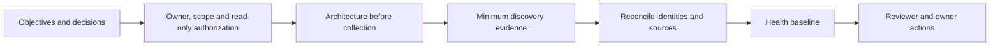

### Safety gate

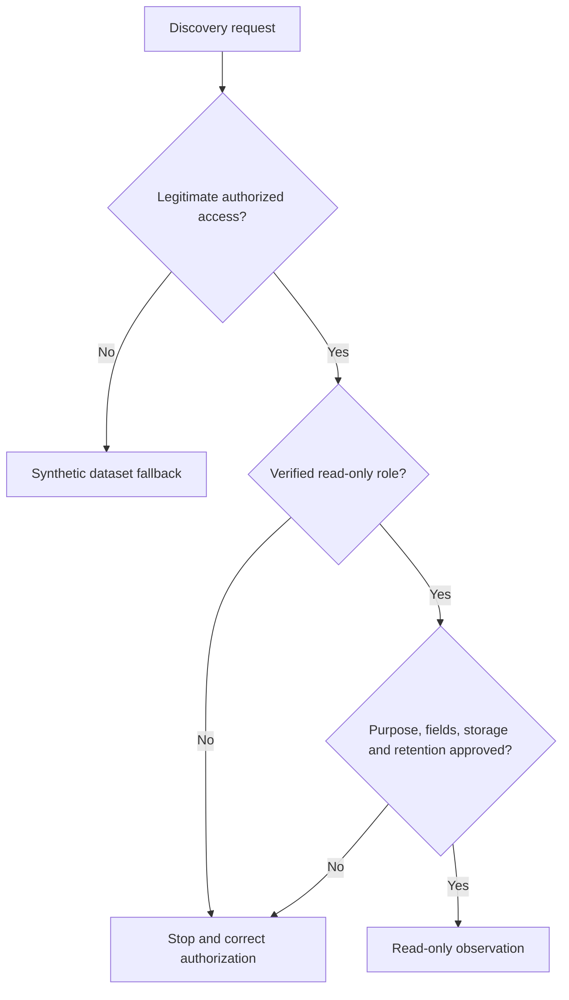

### 🔍 Plain-English deep-dive: inventory and health are different

An airline's aircraft register answers `which aircraft exist`; a maintenance inspection answers `what condition each is in`. A complete asset list can contain unhealthy systems, and a green dashboard can omit systems. Reconcile population first, then assess condition and coverage.

## 2. Architecture before steps: the object hierarchy

- A **cluster** is the cooperating ONTAP management and data system.
- A **node** is one controller member.
- A **high-availability (HA) pair** is two nodes designed to protect each other under supported conditions.
- A **storage virtual machine (SVM)** is a logical data-service boundary.
- A **logical interface (LIF)** is an IP or SAN-facing logical endpoint.
- A **local tier** (historically aggregate) groups physical storage for volume placement.
- A **volume** is a logical data container; a **LUN** presents block storage inside a volume.

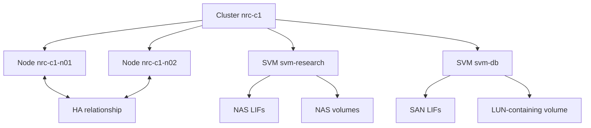

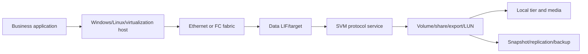

## 3. Discovery order and evidence contract

Read from broad identity to dependent detail. Do not infer a child object's meaning until its parent and owner are known.

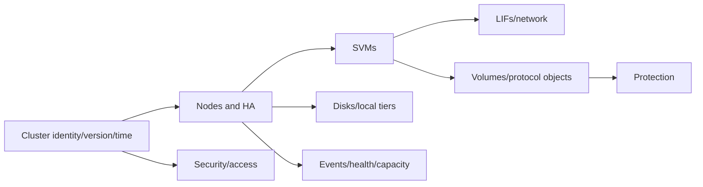

| Evidence field | Why it matters |
|---|---|
| Object type and stable ID | Prevents name-only joins |
| Parent ID | Reconstructs topology |
| Source/interface | Explains definition and authority |
| UTC observation interval | Supports timeline and freshness |
| Release/interface version | Prevents schema/behavior assumptions |
| Expected population | Exposes missing objects |
| Status plus raw reason | Preserves evidence behind labels |
| Access/classification | Protects customer and support data |
| Limitation/unknown | Prevents false green conclusions |

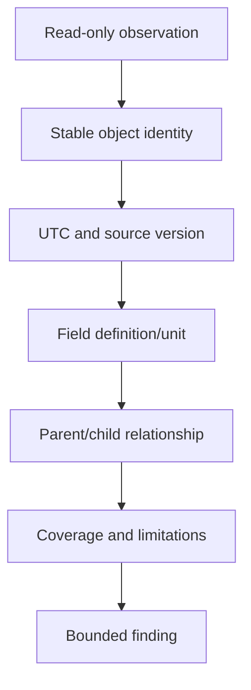

## 4. Cluster, version, time, and management-plane discovery

Record cluster UUID/name, nodes, management endpoint, ONTAP release string, system time/time zone, DNS/NTP configuration status, license/feature context where authorized, and management access method. Do not publish real addresses or license details.

**Conceptual read-only families:** cluster identity/show, version, date/time, DNS/NTP, REST `GET` resources, and System Manager overview. Verify exact current syntax and privileges before use.

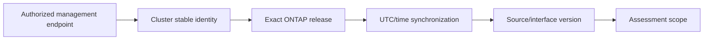

Expected observations: one stable cluster identity, expected node count, consistent time, and a release that can be mapped to current support/release documentation. A version alone does not prove supportability.

## 5. Nodes, HA pairs, cluster membership, and quorum context

Discover node IDs/names, membership, health/eligibility, HA partner, storage failover state, uptime/reboot context, cluster-ring or quorum health where documented, and management/cluster connectivity signals.

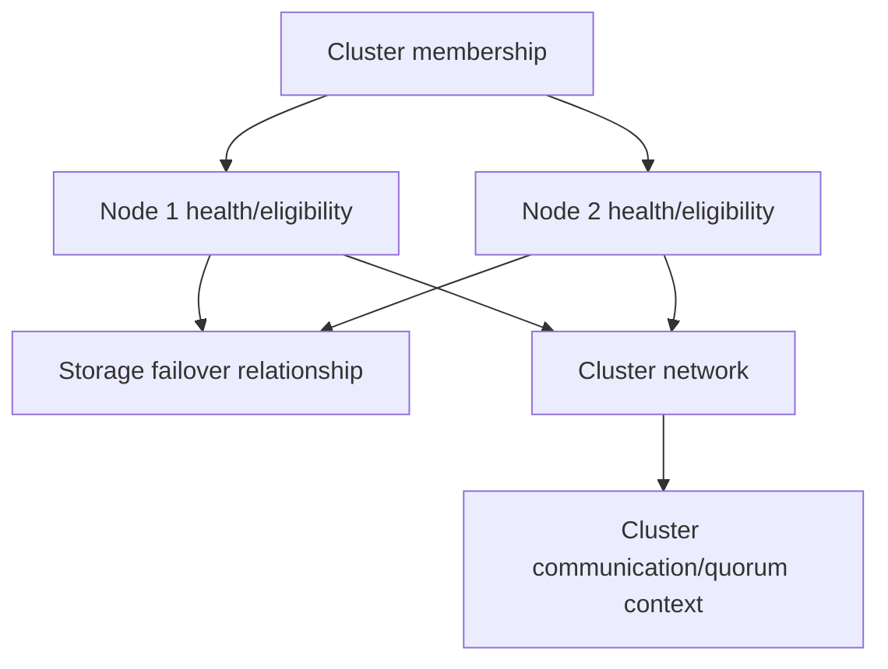

Do not perform takeover/giveback, reboot, failover, or hardware actions in this discovery lab. An unhealthy or ambiguous HA state is an escalation/risk finding, not an invitation to test production resilience.

## 6. SVMs, LIFs, network ports, broadcast domains, and routes

For each SVM, identify role/state, enabled protocols, root/namespace context, administrative owner, and data boundaries. For each LIF, record stable ID/name, role/service policy, protocol, address family, home/current node and port, operational/administrative state, failover group/policy where relevant, and route/DNS dependency.

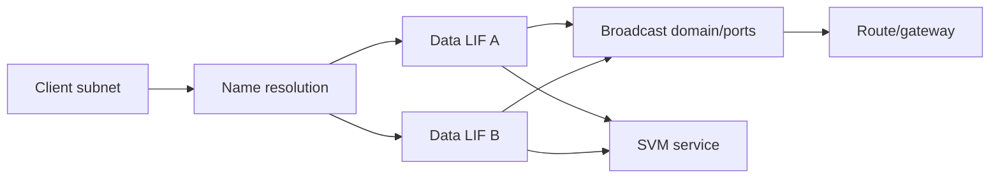

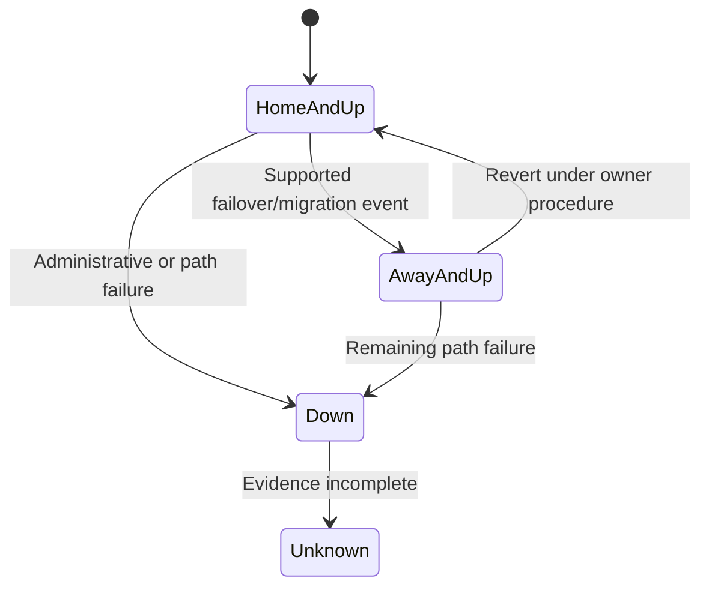

### 🔍 Plain-English deep-dive: home location versus current location

A train has a home depot but can be operating from another platform. Similarly, a LIF can have configured home placement and a different current placement after a supported event. `Away` is context, not automatically failure; combine it with reason, policy, reachability, service impact, and current documentation.

## 7. Physical storage, local tiers, volumes, and capacity ladder

Discover shelves/drives only to the authorized level, disk ownership/state, RAID/local-tier identity, node ownership, physical/usable/free capacity, volume identity/type/style/state, junction or LUN context, logical/physical/snapshot use, autosize/guarantee context, and thresholds. Never treat effective savings as immediately allocatable physical space.

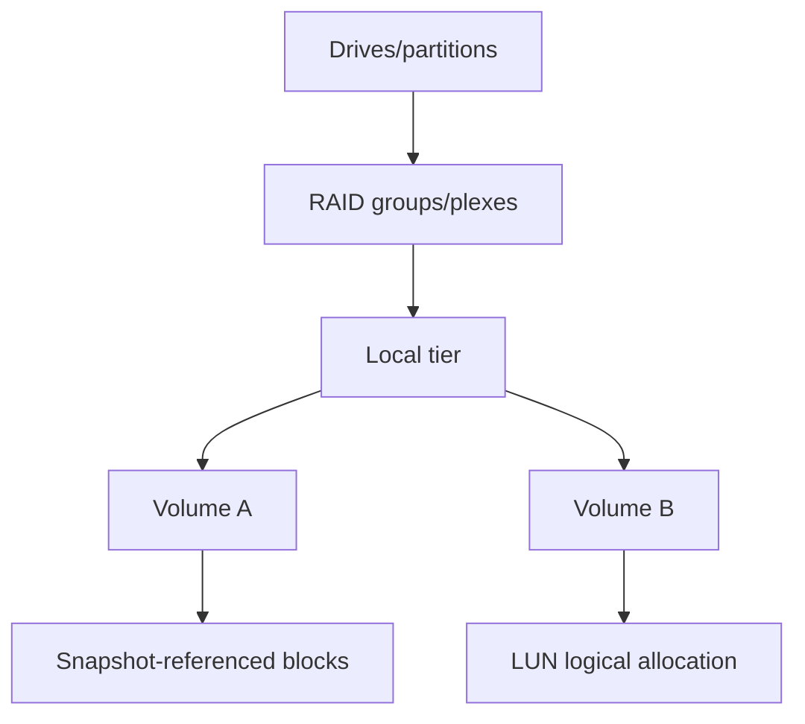

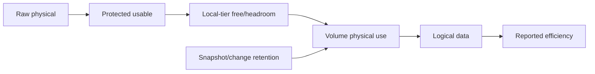

## 8. Protocol and data-service inventory

Inventory enabled NFS/SMB/iSCSI/FC/NVMe/S3 services only where in scope. Record service state, endpoint/LIF mapping, namespaces/junctions, exports/shares, LUNs/igroups/maps, initiator/target identities, and client/host owners. Do not collect file contents or secrets.

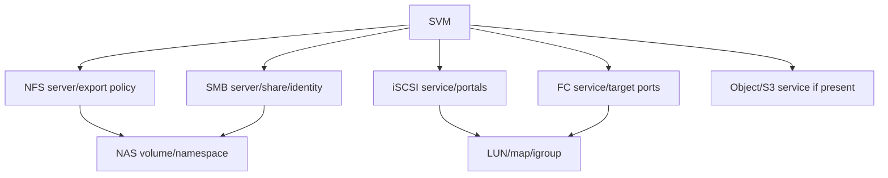

Expected observation is an explainable end-to-end service chain. A service shown as enabled does not prove clients can resolve names, authenticate, reach every path, or use a supported recipe.

## 9. Protection and recoverability inventory

Record snapshot policies, recent recovery-point timestamps, SnapMirror relationship identities/type/state/health/lag, destination and schedule/policy, backup integration at a conceptual level, and whether a restore/DR test has evidence. Do not break, resync, restore, or delete anything in Lab 1.

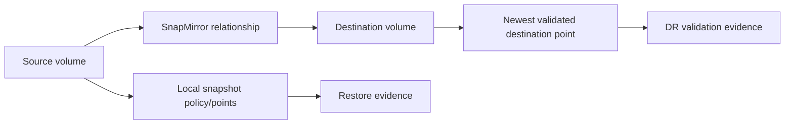

Classify `configured`, `recent transfer`, and `proven recoverable` separately.

## 10. Security, access, audit, and telemetry posture

Without exposing sensitive details, record management authentication methods, role-based access control (RBAC) boundaries, certificate/TLS status, encryption context, audit logging, AutoSupport configuration/delivery freshness, and security/advisory review status. A discovery role should not reveal private keys or passwords.

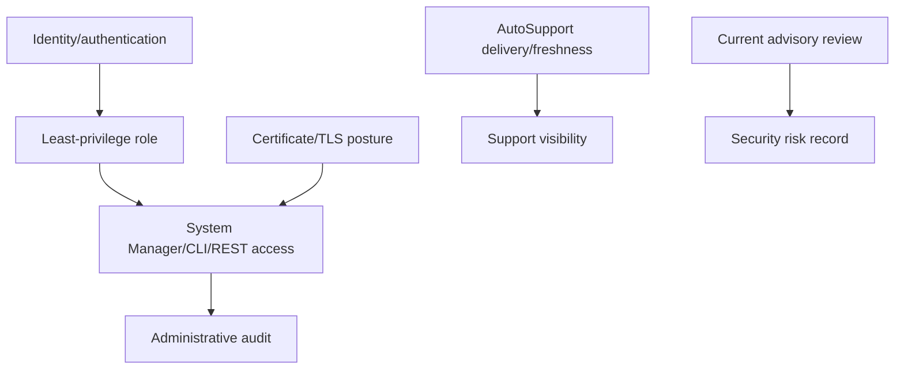

## 11. Events, health, performance, and capacity baseline

Use a fixed observation interval and explain definitions. Capture active/recent events, node/cluster/service health, failed/degraded components, capacity/headroom, workload demand, latency/throughput/input-output operations per second (IOPS), and protection freshness. Average values do not prove tail behavior or future health.

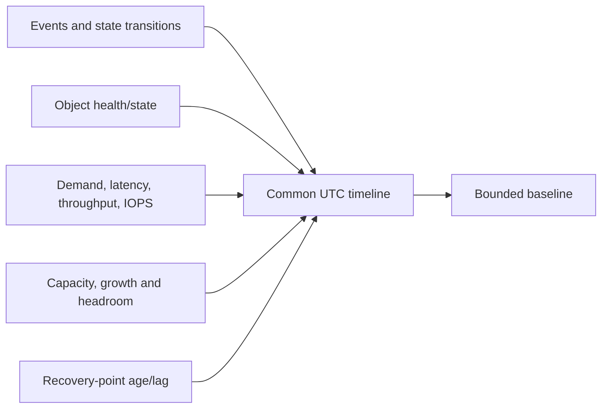

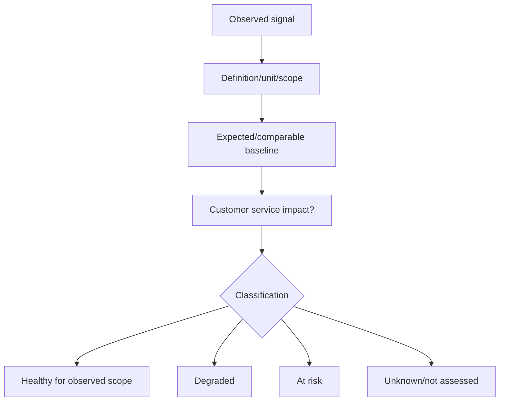

### 🔍 Plain-English deep-dive: green is bounded by coverage

A classroom can report 100% pass rate if only one of thirty students took the test. A health conclusion must state expected population, observed population, freshness, interval, and unassessed dimensions. Missing telemetry is `unknown`, never zero or green.

## 12. Current version, supportability, lifecycle, and source gates

This lab records version and dependencies; it does not certify supportability. Exact validation can require ONTAP release support references, Interoperability Matrix Tool (IMT), Hardware Universe (HWU), host/application vendor matrices, advisories, and entitlement.

### 🔍 Plain-English deep-dive: healthy today is not the same as supportable tomorrow

A car can start and drive while using a part combination the manufacturer has never approved, or while nearing the end of supported service. `Observed healthy` describes evidence during this interval; `supportable` describes whether the exact current combination is listed under current vendor policy; `lifecycle risk` describes the shrinking time to act. Keep all three columns separate so a green observation cannot hide an unvalidated recipe or approaching deadline.

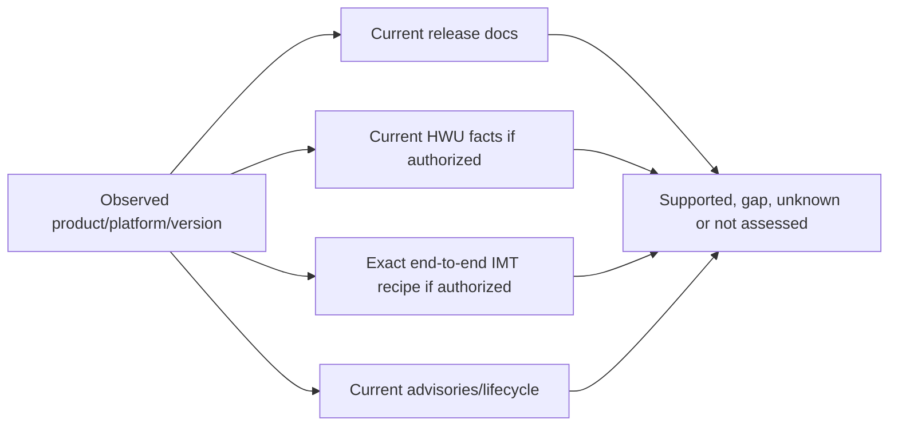

## 13. Install-base reconciliation

Use stable identifiers and effective dates, not display names alone. Reconcile cluster, nodes, serial/system IDs where authorized, site, account, support record, telemetry object, owner, lifecycle and status.

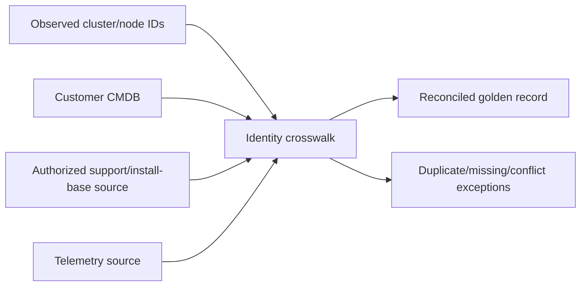

| Rule | Example outcome |
|---|---|
| Exact stable ID | Deterministic match |
| Parent-child consistency | Node belongs to expected cluster |
| Effective date | Moved/retired asset not treated as current |
| Source priority by field | Customer site owner may outrank stale portal location |
| Conflict retained | Do not silently overwrite disagreement |
| Coverage denominator | Expected 4 nodes, observed 3 = 75%, one unknown |

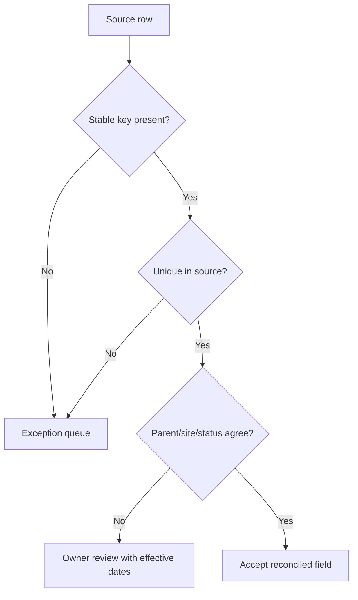

## 14. Topology and baseline report

Create four views: physical/HA, SVM/service, network/path, and protection. Then produce a baseline table.

```mermaid
flowchart TB
    TOPO[Validated topology] --> INV[Reconciled inventory]
    INV --> HEALTH[Health/capacity/performance/protection]
    HEALTH --> FIND[Findings with confidence]
    FIND --> RISK[Risk and unknowns]
    RISK --> ACTION[Owner, due date and validation]
    ACTION --> REVIEW[Qualified review]
```

| Baseline field | Required content |
|---|---|
| Scope/cutoff | Expected assets, included assets, UTC interval |
| Data quality | Freshness, coverage, duplicates, conflicts |
| Architecture | Four linked topology views |
| Condition | Healthy/degraded/risk/unknown/not assessed by object |
| Findings | Evidence, definition, baseline and confidence |
| Risks | Customer objective, trigger, consequence, horizon, controls |
| Actions | Owner, date, dependency, validation, residual risk |
| Review | Reviewer, date, disagreements and approvals |

## 15. Tests, expected observations, and rollback

Read-only discovery normally has no system rollback; its **evidence rollback** restores a prior report/model when a bad join or interpretation is introduced. Any future change requires separate authorization.

```mermaid
stateDiagram-v2
    [*] --> AuthorizedBaseline
    AuthorizedBaseline --> Positive: Expected objects found
    Positive --> Negative: Out-of-scope/unauthorized fields excluded
    Negative --> FailureInjection: Synthetic source removed or stale
    FailureInjection --> Recovery: Restore source or mark unknown
    Recovery --> Reconcile
    Reconcile --> ReviewedBaseline
    ReviewedBaseline --> EvidenceRollback: Bad model revision detected
    EvidenceRollback --> ReviewedBaseline
```

| Test | Expected observation |
|---|---|
| Positive | Every expected synthetic object has a stable key and parent |
| Negative | A user without authorization cannot obtain restricted fields |
| Failure injection | Removing one node source lowers coverage and creates `unknown` |
| Recovery | Restored source reopens analysis only after identity/freshness QA |
| Rollback | Prior approved report is reproducible from version history |
| Contradiction | Conflicting site values remain visible until owner resolves them |

## 16. Evidence capture, cleanup, and cost/privacy closure

```mermaid
flowchart LR
    COLLECT[Minimum raw read-only evidence] --> RESTRICT[Restricted approved store]
    RESTRICT --> HASH[Integrity/provenance record]
    HASH --> MODEL[Reconciled analysis model]
    MODEL --> SAN[Tokenized portfolio derivative]
    SAN --> QA[Privacy/claim review]
    QA --> RETAIN[Retain/delete by policy]
```

Capture source/version/date, query/view, role, UTC interval, expected/observed population, stable keys, definitions, raw status, transformations, exclusions, reviewer, and limitations. Do not capture credentials, private keys, file content, real names, unnecessary addresses, or gated screenshots.

Cleanup temporary exports, sessions, local caches, generated datasets, temporary accounts and any chargeable training resources. Recheck provider inventory/billing if used; no cost or free-tier promise is made.

## 17. Common failures and hypothesis tree

```mermaid
flowchart TD
    BAD[Baseline incomplete or contradictory] --> SCOPE{Expected population defined?}
    SCOPE -->|No| FIXS[Define authoritative scope]
    SCOPE -->|Yes| ACCESS{Read-only access covers fields?}
    ACCESS -->|No| OWNER[Request approved source or label unknown]
    ACCESS -->|Yes| ID{Stable identities reconcile?}
    ID -->|No| EXC[Resolve duplicate/move/retire conflict]
    ID -->|Yes| TIME{Fresh and clock-aligned?}
    TIME -->|No| REFRESH[Refresh or bound interval]
    TIME -->|Yes| DEF{Definitions/version current?}
    DEF -->|No| DOC[Recheck current docs]
    DEF -->|Yes| ESC[Qualified review/escalation]
```

Common errors include name-only joins, node/cluster double-counting, volume logical versus physical confusion, assuming `up` means reachable, treating protection configuration as recoverability, merging stale/current records, ignoring scope gaps, and labeling unknowns healthy.

## 18. Fully synthetic sanitized scenario and dataset

**Customer:** Northstar Research Cooperative (`SYNTHETIC-TRAINING`). **Objective:** establish a baseline before a fictional analytics onboarding. **Access route:** dataset-only fallback; no ONTAP access.

### Synthetic inventory

| Object | Stable ID | Parent | State | Key observation |
|---|---|---|---|---|
| Cluster `nrc-c1` | `clu-0001` | - | Healthy for observed scope | Synthetic ONTAP release `R-current-demo`; exact real release intentionally omitted |
| Node `nrc-c1-n01` | `node-0001` | `clu-0001` | Healthy | HA partner n02 |
| Node `nrc-c1-n02` | `node-0002` | `clu-0001` | Degraded | One synthetic network port down |
| SVM `svm-research` | `svm-0001` | `clu-0001` | Serving | NFS and SMB enabled |
| SVM `svm-db` | `svm-0002` | `clu-0001` | Serving | iSCSI enabled |
| LIF `research-a` | `lif-0001` | `svm-0001` | Up/away | Current n02; reason unknown |
| LIF `research-b` | `lif-0002` | `svm-0001` | Up/home | Control path |
| Volume `research` | `vol-0001` | `svm-0001` | Online | 71% physical; snapshots 14% |
| Volume `db-san` | `vol-0002` | `svm-db` | Online | LUN `lun-0001`; mapping present |
| SnapMirror `rel-0001` | `rel-0001` | `vol-0001` | Unknown | Destination source omitted/stale |
| AutoSupport coverage | `cov-0001` | `clu-0001` | Unknown | Last synthetic record 19 days old |

```mermaid
flowchart TB
    C[nrc-c1 / clu-0001] --> N1[n01 / node-0001]
    C --> N2[n02 / node-0002]
    N1 <--> HA[HA pair]
    C --> SR[svm-research]
    C --> SD[svm-db]
    SR --> LA[research-a up/away]
    SR --> LB[research-b up/home]
    SR --> VR[research volume]
    SD --> LI[iSCSI LIFs]
    SD --> VD[db-san volume/LUN]
    VR --> SM[SnapMirror evidence stale]
```

### Reconciliation exceptions

| Exception | Evidence | Classification | Owner/action |
|---|---|---|---|
| CMDB lists retired `node-0003` | No matching current synthetic source; retirement record exists | Data-quality issue | Asset owner closes effective-dated record |
| `research-a` away from home | State observed; reason/history missing | Unknown, not incident | Storage owner validates event/reason |
| Node n02 port down | Alternate path serving; redundancy reduced | Degraded risk | Network/storage owners inspect authorized evidence |
| Protection source stale | Destination point cannot be established | RPO unknown | Protection owner refreshes evidence |
| Telemetry stale | No current remote wellness basis | Visibility risk | Telemetry/account owner checks pipeline |

```mermaid
flowchart LR
    DATA[Complete synthetic dataset] --> RECON[Identity and coverage QA]
    RECON --> TOPO[Four topology views]
    TOPO --> CLASS[Healthy/degraded/risk/unknown]
    CLASS --> FIND[Five bounded findings]
    FIND --> ACTION[Owners and evidence requests]
    ACTION --> REPORT[Baseline report and review]
```

### Expected outcome and portfolio language

The report concludes that services are observed as serving in the synthetic interval, but redundancy, protection freshness, and telemetry visibility require review. It does **not** declare the cluster globally healthy or unsupported. Evidence artifacts are the inventory workbook schema, four diagrams, exception log, baseline report, source journal and review rubric.

**Honest interview language:** `I completed a fully synthetic ONTAP discovery exercise. I reconciled stable IDs, built physical/logical/service/protection topology, separated degraded from unknown, and wrote owner-specific evidence requests. I did not query a production ONTAP cluster or claim live tool results.`

## 19. JD Mapping and your advantage

```mermaid
flowchart LR
    MS[Microsoft discovery and critical-situation evidence] --> METHOD[Scope, timeline, identity and secure evidence]
    ANALYTICS[Excel/Power BI/SQL] --> RECON[Coverage, joins and exception model]
    REVIEWS[Customer reviews] --> REPORT[Decision-ready baseline]
    METHOD --> TAM[NetApp TAM discovery capability]
    RECON --> TAM
    REPORT --> TAM
    GAP[No production ONTAP discovery] --> TAM
```

| JD responsibility | Lab evidence |
|---|---|
| Analyze enterprise customer data | Source ledger, stable-key model, coverage tests |
| Maintain accurate install base | Reconciled inventory and exception queue |
| Understand customer environment | Four topology views and ownership map |
| Mitigate risk | Bounded findings, unknowns, controls and owner actions |
| Deliver service reviews | Dated baseline with executive/technical layers |
| Communicate clearly | Exact claim, evidence, confidence and next ask |

## 20. Official and Public Source Anchors

**Date checked: 2026-08-24.** These public sources support vocabulary and navigation. They do not validate the synthetic dataset, establish customer health, or replace current IMT/HWU/Support evidence.

| Topic | Official source | Use |
|---|---|---|
| ONTAP documentation | [ONTAP documentation](https://docs.netapp.com/us-en/ontap/) | Current task and concept navigation |
| Cluster concepts | [ONTAP cluster and SVM administration](https://docs.netapp.com/us-en/ontap/system-admin/index.html) | Cluster, node and administration context |
| Network | [ONTAP network management](https://docs.netapp.com/us-en/ontap/network-management/) | LIF, port, broadcast-domain and route concepts |
| Storage | [ONTAP disks and local tiers](https://docs.netapp.com/us-en/ontap/disks-aggregates/) | Physical-to-logical storage concepts |
| Volumes | [ONTAP volume administration](https://docs.netapp.com/us-en/ontap/volumes/) | Volume and capacity concepts |
| NAS | [ONTAP NAS management](https://docs.netapp.com/us-en/ontap/nas-management/) | SVM, namespace, NFS/SMB navigation |
| SAN | [ONTAP SAN management](https://docs.netapp.com/us-en/ontap/san-management/) | LUN, igroup and SAN navigation |
| Protection | [ONTAP data protection and disaster recovery](https://docs.netapp.com/us-en/ontap/data-protection-disaster-recovery/) | Snapshot/SnapMirror concepts |
| Security | [ONTAP security and data encryption](https://docs.netapp.com/us-en/ontap/security-encryption/) | RBAC, TLS, audit and encryption navigation |
| REST | [ONTAP REST API documentation](https://docs.netapp.com/us-en/ontap-automation/) | Version-aware read-only automation concepts |
| AutoSupport | [Manage AutoSupport](https://docs.netapp.com/us-en/ontap/system-admin/manage-autosupport-concept.html) | Telemetry architecture and freshness context |
| Release support | [ONTAP release support](https://docs.netapp.com/us-en/ontap/release-notes/release-support-reference.html) | Current public release-support reference |

## 21. Self-Test and Teach-Back

1. Draw cluster -> node/HA -> SVM -> LIF -> data-object hierarchy from memory.
2. Explain why inventory completeness precedes health scoring.
3. Build a discovery field list for network, storage, protocols, protection and security.
4. Reconcile a duplicate node and a moved site without name-only joins.
5. Classify five observations as healthy, degraded, risk, unknown or not assessed.
6. Explain why `up`, `configured`, `green`, and `supported` are different claims.
7. Produce four topology views and a one-page baseline from the synthetic dataset.
8. Run positive, negative, stale-source, recovery and evidence-rollback tests.
9. State what data must remain out of a portfolio.
10. Deliver the no-production-NetApp boundary and ask for qualified review.

---

## Likely Interview Questions

### Q1. How would you discover an unfamiliar ONTAP environment?

> **Model answer:** `I begin with authorized read-only scope and expected population, then collect cluster identity/version/time, nodes and HA, SVMs, LIF/network, physical/logical storage, volumes, protocols, protection, security, events and health. I retain stable IDs, parents, source, UTC, definitions and limitations, reconcile the install base, draw four topology views, and separate healthy, degraded, risk, unknown and not assessed.`

### Q2. How do you keep discovery safe?

> **Model answer:** `I use a verified read-only role, minimum fields, approved storage and retention, no credentials or content, and current release documentation. I do not run failover or state-changing tests. Any later change has a separate authorization, plan, stop rule, recovery and rollback. Without legitimate access I use the complete synthetic fallback.`

### Q3. What is the difference between inventory, topology, and baseline?

> **Model answer:** `Inventory says which objects exist and their stable identities; topology says how they depend on one another; a baseline describes observed condition and demand over a defined interval. Like a city register, map and traffic survey, all three answer different questions and must reconcile.`

### Q4. How do you reconcile conflicting install-base records?

> **Model answer:** `I join on stable IDs, preserve parent relationships and effective dates, define field-level source authority, detect duplicate and missing keys, retain conflicts in an exception queue, ask the accountable owner, and report coverage. I never silently choose the newest-looking name.`

### Q5. When can you call an environment healthy?

> **Model answer:** `Only for an explicit scope, population, interval and set of dimensions with fresh evidence. I distinguish service state, component degradation, capacity/performance, protection, telemetry, security and supportability. Missing or stale evidence is unknown, and a serving service can still have reduced redundancy or risk.`

### Q6. What would your baseline report contain?

> **Model answer:** `Scope/cutoff, source quality and coverage, reconciled inventory, physical/logical/service/protection topology, health/capacity/performance/protection observations, findings with confidence, unknowns, customer risks and controls, owner/date/evidence requests, current-source gates, reviewer decisions and residual risk.`

### Q7. How would you use commands or REST in this lab?

> **Model answer:** `Only through authorized read-only access. I map each required field to a current official CLI, System Manager or REST source for the exact release, verify privilege and side effects, record query and timestamp, and cross-check population. This guide's command families are conceptual, not production recipes.`

### Q8. How does your prior experience transfer and what remains unproven?

> **Model answer:** `My production strengths in enterprise discovery, identity/network mapping, critical-situation evidence, analytics and customer reviews transfer directly to scope, joins, timelines and communication. I have not discovered or health-certified a production ONTAP cluster; this exercise is synthetic unless I later complete an explicitly authorized lab.`

---

## 30-Second Memory Hooks

- **Inventory/topology/baseline:** register, map, traffic survey.
- **Order:** cluster -> node/HA -> SVM -> LIF/network -> storage/data -> protection/security/health.
- **Stable ID:** names can change; identity must survive.
- **Coverage:** observed divided by expected; missing is unknown.
- **LIF home/current:** depot versus present platform.
- **Capacity:** raw -> usable -> physical -> logical -> effective.
- **Protection:** configured is not recovered.
- **Green:** only as broad as fresh evidence.
- **Read-only:** discovery does not include failover experiments.
- **Report:** evidence -> finding -> risk -> owner -> validation.

---

## Completion Checklist

- [ ] State all five required safety labels and the exact nonclaim.
- [ ] Use an authorized read-only route or the complete synthetic fallback only.
- [ ] Document objectives, prerequisites, safety, ethics and architecture before steps.
- [ ] Discover cluster, node, HA, SVM, LIF, network, storage, volume and protocols.
- [ ] Cover protection, security, version, events, performance, capacity and health.
- [ ] Record stable IDs, parents, UTC, source/version, definitions, coverage and limits.
- [ ] Reconcile install-base sources without name-only joins or silent overwrites.
- [ ] Produce physical/HA, SVM/service, network/path and protection topology.
- [ ] Separate healthy, degraded, risk, unknown and not assessed.
- [ ] Include expected observations and positive/negative/failure/recovery/rollback tests.
- [ ] Capture sanitized evidence and close privacy, temporary access and cost.
- [ ] Use the common-failure hypothesis tree before escalating.
- [ ] Produce the synthetic baseline, risks, evidence requests and honest portfolio statement.
- [ ] Recheck official sources dated 2026-08-24 for the exact release before use.
- [ ] Answer exact Q1-Q8 aloud and complete every self-test.

---

*Next suggested section:* [Part 84 - LAB 2 - NAS Data Service and Troubleshooting](Part-84-lab-nas-data-service-troubleshooting.md)