# Part 84 - LAB 2 - NAS Data Service and Troubleshooting

> **Section goal:** Design, implement only when explicitly authorized, or paper-model a complete NFS and SMB data service; trace each request through naming, network, identity, policy, namespace, and storage; inject safe synthetic faults; recover; and convert the evidence into prevention. By the end, Arti can troubleshoot NAS by locating the first failed interface rather than changing permissions blindly.

Covers index item **84** and maps to job-description responsibilities for customer-environment understanding, storage best practices, technical risk mitigation, high-pressure troubleshooting, recommendation writing, supportability validation, operational reviews, and cross-functional coordination.

**Privacy and access boundary:** NAS identities, names, paths, permissions, packets, logs, and configuration require authorization, minimum access, redaction, and approved storage.

**Synthetic-evidence rule:** Every SVM, user, path, policy, packet, fault, result, and recommendation in the fallback is fictional and sanitized.

**Version caveat:** NAS features, policy evaluation, commands, fields, client support, and recovery behavior change; complete a current-doc check before use.

**Lab safety contract:** The access fallback is a complete synthetic paper lab. Use read-only first, obtain authorization before change, run a positive test and negative test, perform only bounded failure injection, document recovery and rollback, capture evidence, complete cleanup, control cost and privacy, and use honest interview language.

**Explicit nonclaim:** Arti has not designed, configured, joined, exported, shared, secured, failed, restored, or troubleshot a production ONTAP NFS or SMB service. This lab cannot establish production NAS authority or a supported customer configuration.

**Privacy/access:** NAS evidence can reveal filenames, contents, domains, users, groups, security identifiers, numeric identities, service principal names, tickets, addresses, exports, shares, access-control lists, sessions, locks, packets, and business activity. Use minimum authorized fields, generated files, synthetic identities, approved capture locations, secure transfer, redaction, retention, and no authentication secrets or customer content.

**Synthetic-evidence:** Every tenant, domain, user, group, UID/GID, SID, hostname, address, SVM, LIF, volume, path, export, share, policy, packet description, event, fault, metric, and result below is fictional and sanitized. No output is copied from ONTAP, Active Directory, a client, packet capture, or customer.

**Version/current-doc:** ONTAP releases, NFS minor versions, SMB dialects, Kerberos/NTLM policy, encryption/signing, export/share options, name services, identity mapping, commands, REST resources, defaults, and client behavior change. Sources were checked **2026-08-24**. Verify the exact ONTAP/client/domain versions and current official procedure before any authorized action.

This is an isolated learning workflow, not a production configuration guide, security policy, Active Directory procedure, packet-capture authorization, or promise of nondisruption.

> **No-production-NetApp boundary:** Arti's factual strengths are SharePoint/OneDrive permissions and data-service support, Active Directory, Windows networking, DNS/TCP/TLS troubleshooting, trace correlation, CRITSIT ownership, and customer communication. Her exact nonclaim is: **she has not operated or troubleshot production ONTAP NAS.** She may describe an authorized lab or this fully synthetic paper exercise while naming that gap.

---

## 1. Objectives, prerequisites, safety, and ethics

### Objectives

- Draw both NFS and SMB request paths before configuration.
- Model SVM, LIF, DNS, Active Directory, name service, namespace, export, share, identity, and policy dependencies.
- Perform read-only discovery first; separate design, authorization, implementation, validation, and cleanup.
- Prove expected access and expected denial.
- Inject isolated DNS, export, permission, lock, and path faults with stop/recovery rules.
- Build a hypothesis tree, evidence pack, prevention plan, and honest portfolio statement.

### Prerequisites and legitimate routes

| Route | Prerequisite | Boundary |
|---|---|---|
| Authorized isolated lab | Owner-approved ONTAP/client/domain scope and synthetic data | Changes only after explicit approval |
| Official training lab | Current enrollment and task scope | Follow course controls and wording |
| Paper model | Current public docs, diagrams and generated records | No configured-service claim |
| Synthetic trace lab | Tables and events in this Part | No packet/tool-output claim |

Customer production and real domains are forbidden for personal practice. Never obtain images, credentials, tickets, keys, packets, or directory exports through unofficial or bypass routes.

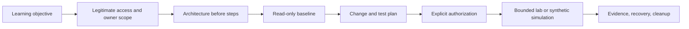

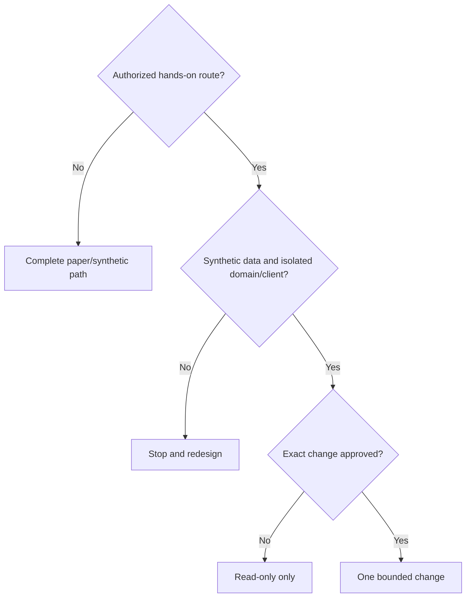

### 🔍 Plain-English deep-dive: authentication, authorization, and access are three gates

**Authentication** proves who a client is, like showing an ID. **Authorization** applies export, share, file and identity policy, like checking the guest list. **Access** is the final operation succeeding through the network and filesystem. A valid identity can still be denied, and permissive policy cannot repair an unreachable path.

## 2. Architecture before steps: shared NAS layers

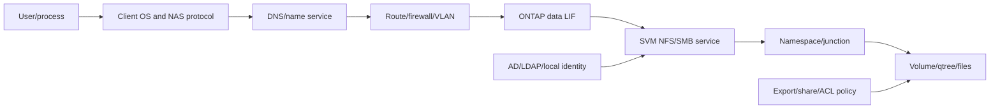

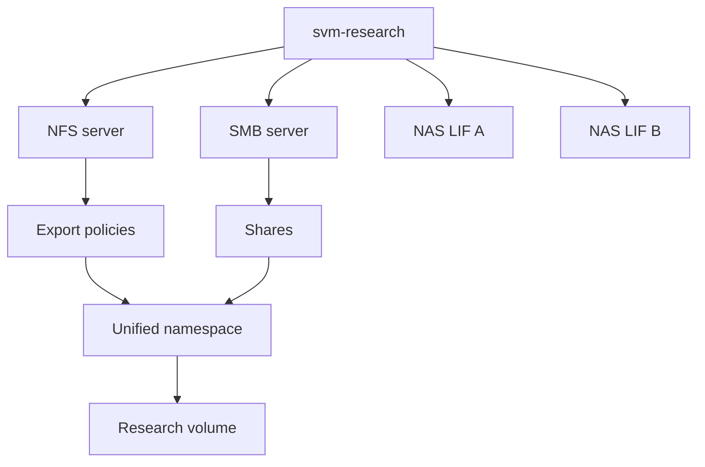

## 3. NFS request path from name to file operation

**Network File System (NFS)** is a file protocol commonly used by Unix/Linux clients. A mount is only the beginning; effective user/group identity and export/file policy control each operation.

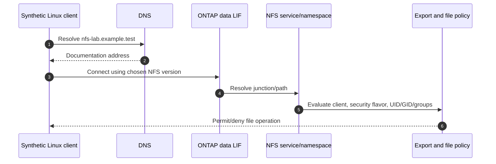

NFS discovery must record client source identity, DNS result, route, selected NFS version/minor version, mount path, SVM/LIF, junction, volume, export policy/rule order, client match, security flavor, superuser mapping, effective UID/GID/groups, NFSv4 domain/name-service context, lock/state evidence, and file permissions/ACL.

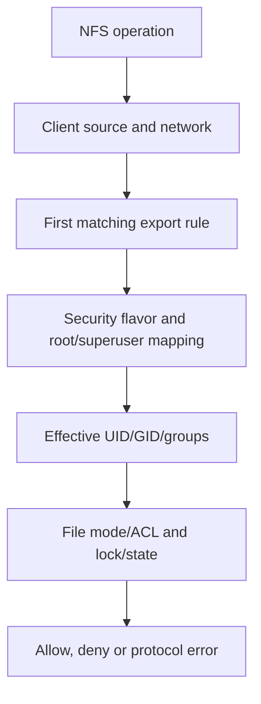

## 4. SMB request path from UNC name to open file

**Server Message Block (SMB)** is a stateful file protocol heavily integrated with Windows identity. A Universal Naming Convention (UNC) path such as `\\server\share` names the service and share.

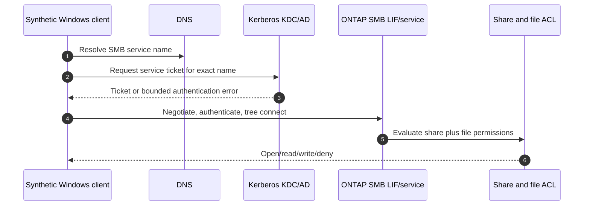

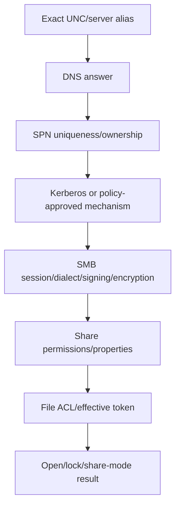

Record exact server name, DNS answers, client/SVM/domain-controller clocks, domain trust context, requested service principal name (SPN), authentication mechanism, SMB dialect, signing/encryption state, session/tree connection, effective security token, share properties, share permission, file ACL, open-file/share mode, and path/referral context. Never capture tickets or hashes into the portfolio.

## 5. SVM, LIF, DNS, AD, and time dependencies

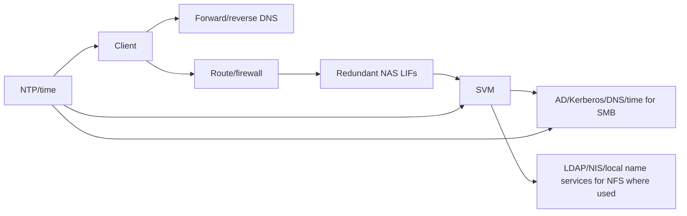

| Dependency | Expected evidence | Failure signature |
|---|---|---|
| DNS | Correct name/address and TTL context | Name fails or reaches wrong endpoint |
| Routing/firewall | Bidirectional permitted path | Timeout/unreachable/reset depending layer |
| LIF/service policy | Correct role and operational placement | Some addresses/protocols fail |
| Time | Acceptable synchronized clocks | Kerberos or correlation errors |
| AD/SPN/trust | Exact service identity and reachable DC | Authentication failure/fallback behavior |
| NFS name service | Stable numeric/name mapping | Wrong ownership or access denied |

### 🔍 Plain-English deep-dive: DNS is part of identity, not just convenience

For SMB, the server name helps select the Kerberos service identity; for NFS, names can steer clients to endpoints and affect mount paths or referrals. Calling by address to “fix DNS” can change authentication and policy behavior. It is like entering through a side door with a different guest list, not merely shortening the address.

## 6. Namespace, junctions, exports, shares, and path ownership

```mermaid
flowchart TB
    ROOT[SVM root namespace /] --> J1[/research junction]
    ROOT --> J2[/archive junction]
    J1 --> V1[vol_research]
    J2 --> V2[vol_archive]
    NFS[NFS export path] --> J1
    SMB[SMB share path] --> J1
```

| Construct | Plain meaning | Common mistake |
|---|---|---|
| Junction | Mounts a volume into SVM namespace | Volume online but path not connected |
| Export policy | NFS client/security access rules | Assuming policy name proves effective rule |
| SMB share | Published path plus share properties/permissions | Ignoring file ACL intersection |
| Qtree | Optional subcontainer/policy boundary | Treating it as independent volume |
| Referral | Redirects a client to another path/server where supported | Troubleshooting only initial name |

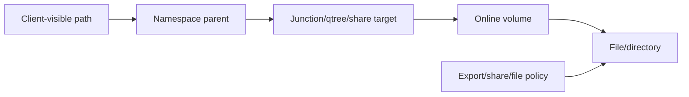

## 7. Identity and policy evaluation

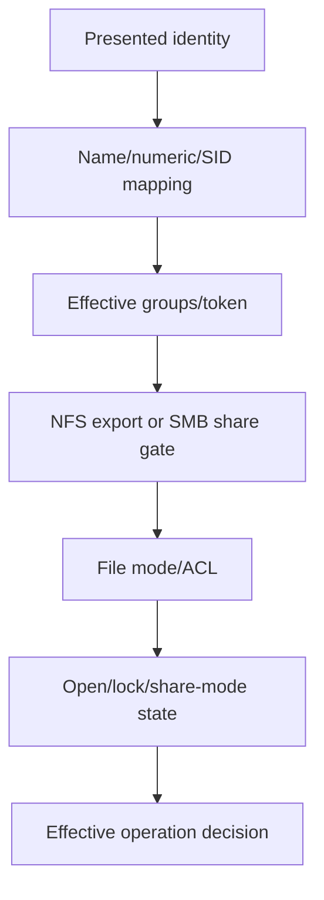

For NFS, preserve numeric UID/GID and group evidence instead of relying only on displayed names. For SMB, preserve SID/token and both share/file permissions. In multiprotocol designs, name mapping adds another explicit transformation; do not assume matching text names mean matching identity.

### 🔍 Plain-English deep-dive: permissions combine like multiple doors

An office may require building access, floor access, room access, and an unlocked cabinet. Passing one door does not cancel the others. NFS export and filesystem checks, or SMB share and file ACL checks, combine; broadening the first gate cannot repair a denial at the final object and may create unintended access.

## 8. Architecture-to-implementation gate

No configuration is required to complete the paper route. For an authorized lab, the qualified owner maps the design to current official UI/CLI/REST procedures.

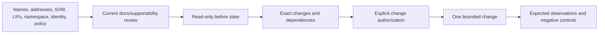

**Conceptual phases, not production commands:** create/enable scoped SVM protocol service; configure LIF/network/name services; establish SMB domain identity or NFS settings; create volume and namespace junction; apply export/share and object policy; validate; capture evidence; clean up. Verify current syntax and supportability, and never paste credentials into a command or guide.

## 9. Read-only baseline and explicit change authorization

Read-only first:

- Inventory exact client/service names, SVM, LIFs, routes, DNS/time, protocol versions, namespace, objects, policies, identities, sessions, locks, events, and known healthy controls.
- Record current configuration and who owns DNS, AD/name service, network, client, application, and storage.
- Establish synthetic data checksums and a recovery checkpoint.

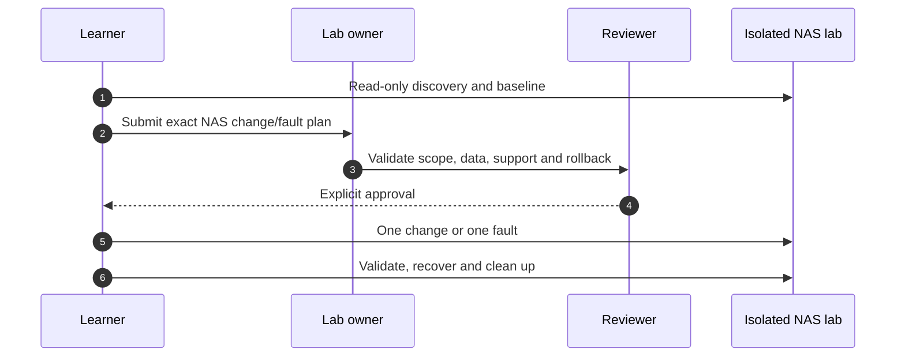

Authorization record: objective, exact objects/identities, window, commands/interface after current-doc review, expected result, blast radius, backups/checkpoints, stop conditions, recovery, rollback, owners, and evidence handling.

## 10. Request trace and discriminating evidence

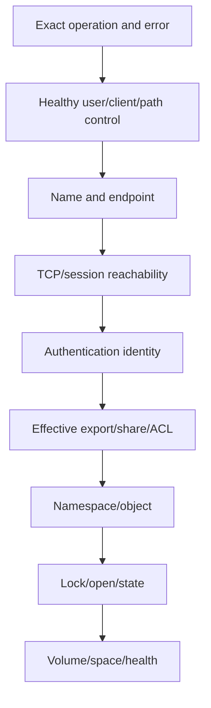

At each interface ask: expected input, observed output, stable identity, UTC time, healthy control, competing hypotheses, and evidence that could disconfirm the leading hypothesis.

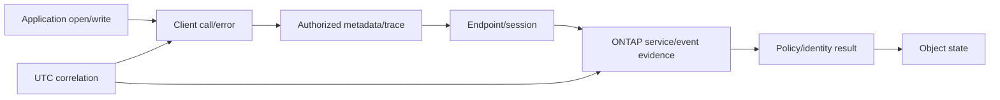

## 11. Positive and negative test matrix

| Test | NFS expected | SMB expected |
|---|---|---|
| Authorized read | Correct identity reads generated file | Correct SID/token reads generated file |
| Authorized write | Approved UID/group creates file | Approved group creates file |
| Unauthorized read | Synthetic outsider denied | Synthetic outsider denied |
| Root/admin boundary | Root mapping behaves as designed | Admin does not bypass object policy without authorized right |
| Wrong path | Clear missing-path behavior | Clear missing-share/path behavior |
| Alternate LIF/path | Service works only where design permits | Name/auth/path behavior remains expected |
| Lock conflict | Predicted lock/state error, no corruption | Predicted share-mode/lock conflict |

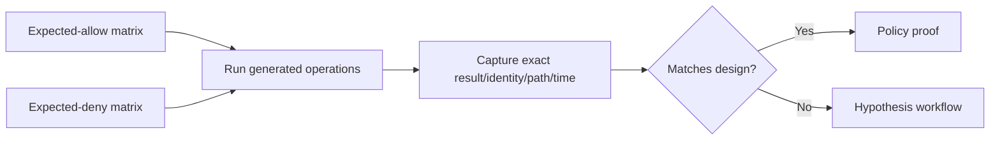

## 12. Controlled fault 1: DNS

**Synthetic injection:** in a disposable client-only hosts-file or isolated DNS view, map the lab service name to the wrong documentation address. Do not alter shared or production DNS.

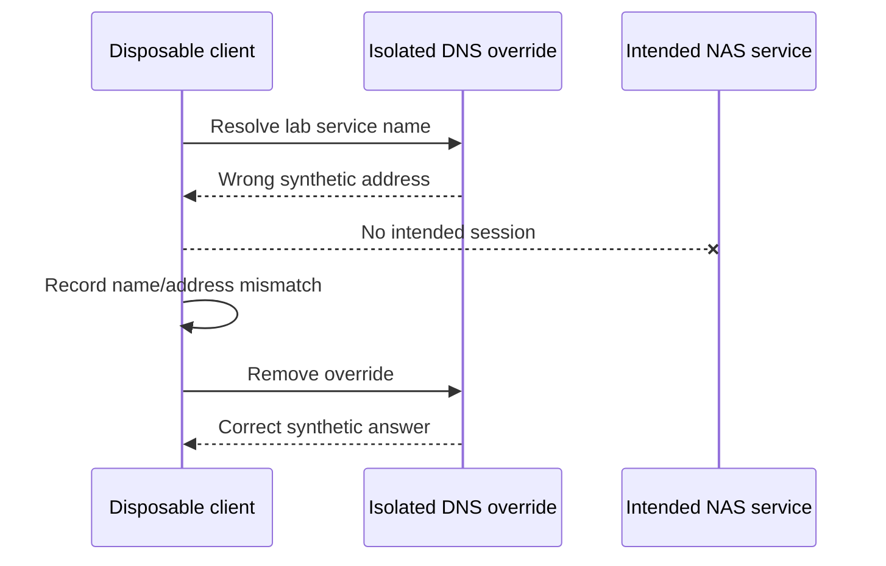

Expected: name-based path fails or reaches wrong endpoint while a known-good resolution control differs. Recovery: remove override, flush only authorized client cache as current OS docs allow, re-resolve, validate authentication and service. Prevention: controlled DNS change, pre/post checks, TTL awareness, endpoint inventory.

## 13. Controlled fault 2: export-rule mismatch

Paper-model or use an isolated synthetic client subnet/rule under explicit approval. Never broaden a production export.

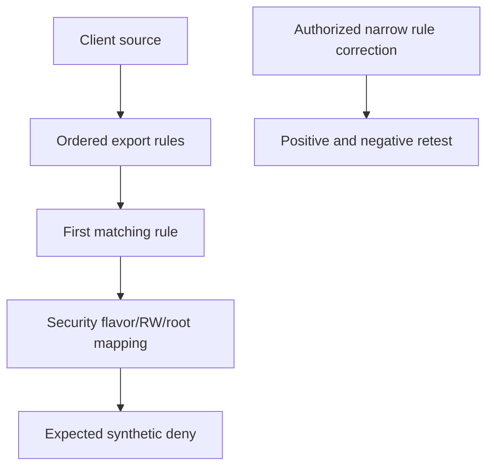

Expected: mount or operation behavior follows the selected rule, not the intended rule name. Recovery/rollback: restore reviewed policy assignment/rule state, verify intended source allowed and outsider denied. Prevention: rule-order review, explicit client matching, policy-as-evidence table.

## 14. Controlled fault 3: permission/identity mismatch

Inject by removing the required synthetic group from one disposable identity, not by weakening file permissions.

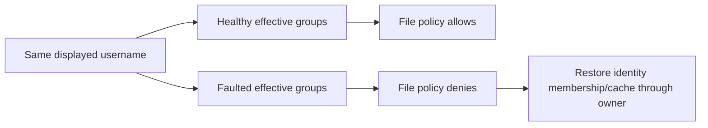

Expected: service reachable and authentication may succeed, but create/open is denied. Recovery: identity owner restores intended membership/mapping; validate allowed and denied controls. Prevention: source-of-truth groups, identity drift checks, no world-write/full-control workaround.

## 15. Controlled fault 4: lock or open-mode conflict

Use two test processes on one generated disposable file and a documented lock/open mode; never kill a production session or clear locks without owner procedure.

```mermaid
sequenceDiagram
    participant A as Test client A
    participant F as Generated file
    participant B as Test client B
    A->>F: Acquire documented exclusive lock/open
    B->>F: Conflicting operation
    F-->>B: Expected lock/share violation
    A->>F: Clean close/release
    B->>F: Retry and succeed
```

Expected: conflict is scoped to the file/operation and clears after clean release. Recovery: close through owning test application; do not force-clear state unless current owner-approved procedure and data-safety conditions are met. Prevention: application lock design, timeout/retry observability, graceful shutdown.

## 16. Controlled fault 5: path/LIF reachability

In an isolated client or virtual switch, block one lab-only path while another remains. Do not migrate LIFs or modify shared switching in this exercise.

```mermaid
flowchart TB
    CLIENT[Disposable client] --> P1[Path/LIF A blocked]
    CLIENT --> P2[Path/LIF B healthy]
    P1 --> FAIL[Predicted timeout/unreachable]
    P2 --> SERVICE[NAS service reachable]
    REC[Remove lab-only block] --> P1
```

Expected observations depend on client naming/session behavior; do not promise transparent failover. Recovery: remove client/switch lab rule, verify routes and both paths. Prevention: redundant design, correct DNS/load distribution, path monitoring, change tests.

## 17. Failure-injection state machine, recovery, and rollback

```mermaid
stateDiagram-v2
    [*] --> HealthyBaseline
    HealthyBaseline --> ApprovedFault
    ApprovedFault --> PredictedSymptom
    PredictedSymptom --> StopAndPreserve
    StopAndPreserve --> Recovery
    Recovery --> PositiveRetest
    PositiveRetest --> NegativeRetest
    NegativeRetest --> RollbackVerified
    RollbackVerified --> CleanBaseline
```

Stop immediately if scope expands, data integrity is uncertain, control path fails, observed error differs materially, or recovery evidence is unavailable. Recovery returns service; rollback restores configuration; validate both independently.

### 🔍 Plain-English deep-dive: the first error is not always the first failed interface

An application may report `access denied` after a referral, cache, retry, or fallback obscures the original name or authentication problem. Correlate the exact operation across client, network, service, identity and object with common time. Error text is a witness statement, not the whole incident reconstruction.

## 18. Evidence capture and request-trace schema

```mermaid
flowchart LR
    TEST[Test ID/objective] --> CLIENT[Client identity/path/error]
    CLIENT --> NET[DNS/route/session metadata]
    NET --> SERVICE[SVM/LIF/protocol/session]
    SERVICE --> POLICY[Identity/effective policy]
    POLICY --> OBJECT[Namespace/file/lock]
    OBJECT --> RESULT[Expected/observed/recovery]
    RESULT --> SAN[Sanitized portfolio derivative]
```

| Field | Requirement |
|---|---|
| Operation | Exact mount/connect/open/read/write/lock action |
| Object | Stable synthetic client, SVM, LIF, path and file ID |
| Identity | Effective UID/GID/groups or SID/token summary |
| Time | UTC start/end and clock quality |
| Network | Name answer, endpoint and bounded session evidence |
| Policy | Selected export rule or share/file decision inputs |
| Expected/observed | Include negative control and exact mismatch |
| Recovery/rollback | Owner, action, result and residual risk |
| Privacy | Data omitted/redacted and reviewer |

## 19. Common failures and hypothesis tree

```mermaid
flowchart TD
    NAS[NAS operation fails] --> NAME{Name resolves to intended endpoint?}
    NAME -->|No| DNS[DNS/alias/cache/TTL hypothesis]
    NAME -->|Yes| PATH{Transport/session established?}
    PATH -->|No| NET[Route/firewall/LIF/service hypothesis]
    PATH -->|Yes| AUTH{Authentication succeeds as intended?}
    AUTH -->|No| IDP[AD/Kerberos/time/trust or NFS identity hypothesis]
    AUTH -->|Yes| NS{Correct share/export/path/object?}
    NS -->|No| NAMESPACE[Namespace/junction/share/export hypothesis]
    NS -->|Yes| PERM{Effective policy permits operation?}
    PERM -->|No| POLICY[Rule/share/ACL/identity hypothesis]
    PERM -->|Yes| STATE{Lock/space/health?}
    STATE -->|Fault| OBJ[Lock/open/space/volume hypothesis]
    STATE -->|Healthy| ESC[Current docs and qualified escalation]
```

Common anti-patterns: testing by IP and changing identity semantics; clearing all sessions/locks; granting root/full control/everyone; changing DNS and permissions simultaneously; ignoring healthy controls; collecting packet contents unnecessarily; blaming storage from client error alone; or claiming an ONTAP bug without exact release/trigger/signature/current source.

## 20. Fully synthetic sanitized scenario: Northstar dual NAS lab

**Design:** `svm-research` provides NFSv4.x conceptually to Linux researchers and SMB 3.x conceptually to Windows analysts through redundant documentation addresses. `vol-research` is joined at `/research`; export and share paths target generated data. Exact protocol versions/options remain a current-doc design decision.

```mermaid
flowchart TB
    LIN[Linux synthetic clients] --> DNS[lab DNS]
    WIN[Windows synthetic clients] --> DNS
    DNS --> L1[NAS LIF A]
    DNS --> L2[NAS LIF B]
    L1 --> SVM[svm-research]
    L2 --> SVM
    SVM --> NFS[NFS service/export]
    SVM --> SMB[SMB service/share/AD identity]
    NFS --> VOL[vol-research /research]
    SMB --> VOL
```

### Synthetic observations

| Case | Symptom | Supported hypothesis | Decisive synthetic evidence | Recovery/prevention |
|---|---|---|---|---|
| N1 | One Linux client denied create | Effective group drift | Correct rule and path; missing group only on failing client | Restore group; drift check |
| N2 | Mount name fails | Client-only DNS override | Wrong answer; direct healthy control uses correct answer | Remove override; DNS QA |
| N3 | Wrong subnet denied | Export first-match behavior | Expected negative rule selected | No fix; denial proves design |
| S1 | SMB alias fails Kerberos | Alias/SPN mapping mismatch | Direct name works; exact alias ticket fails | Identity-owner correction; alias inventory |
| S2 | Second writer blocked | Intended share-mode conflict | Lock owner and clean release correlate | Graceful close; app retry telemetry |
| P1 | One path unavailable | Isolated path block | Alternate endpoint works; blocked path restores after rule removal | Path monitoring/change test |

```mermaid
flowchart LR
    SCEN[Six synthetic cases] --> HYP[Competing hypotheses]
    HYP --> TEST[One discriminating test]
    TEST --> REC[Recovery and negative retest]
    REC --> PREV[Prevention action]
    PREV --> PORT[Sanitized evidence pack]
```

**Expected final state:** intended personas can use generated data; outsiders and wrong subnet remain denied; both service names resolve correctly; no stale locks; lab-only path controls removed; all data and temporary identities cleaned according to plan.

**Honest portfolio language:** `I completed a fully synthetic dual-NAS lab design and fault-analysis exercise. I traced NFS and SMB operations through DNS, path, identity, export/share policy, namespace and locks; specified positive/negative and recovery tests; and documented prevention. I did not configure or troubleshoot production ONTAP NAS.`

## 21. Cleanup, cost, privacy, and evidence closure

```mermaid
flowchart LR
    FINISH[Tests complete] --> RELEASE[Close test sessions/locks]
    RELEASE --> DATA[Delete generated files/temporary exports]
    DATA --> ID[Disable/delete lab identities and rotate exposed secrets]
    ID --> DNS[Remove client DNS/path overrides]
    DNS --> RESOURCE[Remove lab shares/exports/resources if approved]
    RESOURCE --> REVIEW[Verify zero residual exposure/cost]
```

No product cost, free tier, license, simulator, cloud region, or availability is promised. Verify current terms and delete chargeable resources through the owner; recheck billing later. Preserve only sanitized artifacts and an audit record of disposal.

## 22. JD Mapping and Arti tie

```mermaid
flowchart LR
    M365[SharePoint/OneDrive permissions] --> ID[Identity and policy reasoning]
    AD[Active Directory/DNS/networking] --> PATH[SMB name/auth/path isolation]
    CRIT[CRITSIT/trace correlation] --> TROUBLE[Layered hypothesis workflow]
    COMM[Customer communication] --> REC[Bounded recommendation/prevention]
    ID --> TAM[NAS TAM capability]
    PATH --> TAM
    TROUBLE --> TAM
    REC --> TAM
```

| JD need | Lab proof |
|---|---|
| Storage best practice | Layered architecture and deny-by-design tests |
| Risk mitigation | Narrow recovery, no broad permission shortcuts |
| Customer environment | End-to-end owner/dependency map |
| Technical analysis | Correlated request trace and hypothesis tree |
| Recommendation quality | Prevention tied to observed mechanism |
| Support experience | Secure evidence pack and clear escalation ask |

## 23. Official and Public Source Anchors

**Date checked: 2026-08-24.** These sources anchor public concepts. They do not validate a live domain, client, release, security policy, command, or supportability result.

| Topic | Official source | Use |
|---|---|---|
| ONTAP NAS | [ONTAP NAS management](https://docs.netapp.com/us-en/ontap/nas-management/) | Namespace and NAS overview |
| NFS | [ONTAP NFS management](https://docs.netapp.com/us-en/ontap/nfs-admin/) | NFS server, exports and identity navigation |
| SMB | [ONTAP SMB management](https://docs.netapp.com/us-en/ontap/smb-admin/) | SMB server, shares, AD and session navigation |
| Multiprotocol | [ONTAP multiprotocol management](https://docs.netapp.com/us-en/ontap-multiprotocol/) | Name-mapping and multiprotocol concepts |
| Network | [ONTAP network management](https://docs.netapp.com/us-en/ontap/network-management/) | LIF, DNS and route concepts |
| Security | [ONTAP security and data encryption](https://docs.netapp.com/us-en/ontap/security-encryption/) | RBAC, TLS and audit context |
| Microsoft Kerberos | [Microsoft Kerberos authentication overview](https://learn.microsoft.com/windows-server/security/kerberos/kerberos-authentication-overview) | Windows identity concepts; verify OS/domain version |
| NFS standard | [IETF NFSv4.1 RFC 8881](https://www.rfc-editor.org/rfc/rfc8881) | Protocol-standard context, not ONTAP configuration |
| SMB protocol | [Microsoft Open Specifications: SMB](https://learn.microsoft.com/openspecs/windows_protocols/ms-smb2/) | Protocol behavior context, not customer policy |

## 24. Self-Test and Teach-Back

1. Draw NFS and SMB request paths without notes.
2. Explain authentication, authorization, access and their evidence.
3. Trace an NFS create denial through client source, rule, identity and object.
4. Trace an SMB alias failure through DNS, SPN, ticket, session, share and ACL.
5. Design expected-allow and expected-deny matrices.
6. Write authorization, stop, recovery and rollback for all five faults.
7. Explain why testing by IP or broadening permissions can mislead or harm.
8. Build a request-trace evidence row with privacy controls.
9. Turn each synthetic fault into one prevention action.
10. Deliver the exact nonclaim and Arti transfer statement.

---

## Likely Interview Questions

### Q1. How do you design an ONTAP NAS service?

> **Model answer:** `I start with personas, data, protocol/version, identity and availability requirements; map client, DNS, routes, LIFs, SVM, namespace, volume and protection; then define NFS exports or SMB service/share plus object policy. I validate current supportability and security, use read-only baseline before approved implementation, and prove intended allow, intended deny, failure, recovery and rollback.`

### Q2. How do you troubleshoot NFS access denied?

> **Model answer:** `I preserve the exact operation, client source, path and effective UID/GID/groups; prove DNS/path and selected NFS version; identify the first matching export rule, security flavor and root mapping; then inspect namespace and file mode/ACL plus lock state. I compare a healthy control and never jump to world-write or broad root access.`

### Q3. How do you troubleshoot an SMB authentication or access failure?

> **Model answer:** `I record the exact UNC name, DNS result, clocks, requested SPN, ticket/auth mechanism, SMB dialect and session; then distinguish authentication from share and file authorization, effective token, path and open/lock state. I avoid IP tests or NTLM fallback that change the identity path.`

### Q4. What tests prove a NAS design is secure and usable?

> **Model answer:** `Positive read/write for each intended persona, negative tests for outsiders/wrong subnet/wrong security flavor, exact namespace paths, both approved endpoints, authentication policy, share/export plus object permissions, lock behavior, failure/recovery, rollback and cleanup. A successful administrator test alone is insufficient.`

### Q5. How would you inject faults safely?

> **Model answer:** `Only in an isolated authorized lab with generated data, one variable, a predicted signature, bounded blast radius, healthy control, stop condition, recovery and rollback. I prefer client-local DNS/path or synthetic identity faults and paper-model any unsafe shared-service change.`

### Q6. What evidence belongs in a NAS escalation package?

> **Model answer:** `Exact operation/error, affected/unaffected scope, UTC timeline, topology, client/protocol/version, DNS/endpoint/session, effective identity, selected policy, namespace/object/lock state, healthy control, actions tried, hypotheses and exact ask. I minimize content and credentials and use current official sources.`

### Q7. How do you convert recovery into prevention?

> **Model answer:** `I verify the causal mechanism rather than crediting the last change, then map it to a control: DNS ownership/QA, export-rule review, identity drift detection, lock observability/graceful close, path monitoring, or documentation. Each prevention action has owner, date, effectiveness test and residual risk.`

### Q8. What is your relevant experience and boundary?

> **Model answer:** `My Microsoft production work provides permissions, AD, DNS/network, trace, incident and customer-communication experience. I have not operated production ONTAP NAS. This lab is fully synthetic unless completed later in an explicitly authorized environment, and I would use current NetApp/client/domain guidance and qualified owners.`

---

## 30-Second Memory Hooks

- **NAS path:** user -> client -> DNS/network -> LIF/SVM -> namespace -> object.
- **Three gates:** authenticate, authorize, access.
- **NFS:** source + rule + security flavor + UID/GID/groups + file.
- **SMB:** name + SPN/ticket + session + share + ACL + open.
- **DNS:** endpoint and identity, not just convenience.
- **Permissions:** multiple doors; broadening one is not diagnosis.
- **Trace:** first failed interface beats the loudest error.
- **Controls:** intended allow plus intended deny.
- **Fault:** one variable, prediction, stop, recovery, rollback.
- **Prevention:** mechanism -> owner -> control -> effectiveness proof.

---

## Completion Checklist

- [ ] State all five safety labels and exact no-production-NetApp boundary.
- [ ] Use legitimate authorized access or complete synthetic/documentation fallback.
- [ ] Document objectives, prerequisites, safety, ethics and architecture before steps.
- [ ] Design SVM, LIF, DNS, AD/name service, namespace, export/share and policy.
- [ ] Explain NFS and SMB request paths and identity transformations.
- [ ] Perform read-only discovery before any explicitly authorized change.
- [ ] Treat command text as conceptual/current-doc-gated, never a remembered production recipe.
- [ ] Run positive and negative tests for intended and unintended access.
- [ ] Inject or simulate DNS, export, permission, lock and path faults safely.
- [ ] Record expected observations, healthy controls, stop, recovery and rollback.
- [ ] Capture a privacy-minimized request trace and sanitized evidence pack.
- [ ] Complete cleanup, secret/data/access/cost closure and residual-risk review.
- [ ] Use the hypothesis tree and convert mechanisms into prevention actions.
- [ ] Recheck official sources dated 2026-08-24 for exact versions and policy.
- [ ] Answer exact Q1-Q8 aloud and complete every self-test.

---

*Next suggested section:* [Part 85 - LAB 3 - SAN Data Service, Multipathing, and Troubleshooting](Part-85-lab-san-multipathing-troubleshooting.md)