# Part 85 - LAB 3 - SAN Data Service, Multipathing, and Troubleshooting

> **Section goal:** Design, implement only in an explicitly authorized isolated lab, or paper-model an ONTAP block service from LUN to host filesystem while preserving one stable device identity across redundant iSCSI or Fibre Channel paths. By the end, you can validate discovery, login/zoning, mapping, ALUA-aware multipathing, path failure/recovery, negative access, compatibility, and data safety without initializing an unknown device.

Covers index item **85** and maps to job-description responsibilities for storage/virtualization depth, supportability validation, technical risk mitigation, complex troubleshooting, upgrade coordination, cross-vendor collaboration, evidence quality, and customer communication.

**Privacy and access boundary:** SAN identifiers, zoning, paths, host configuration, packets, logs, and storage mappings require explicit authorization, least privilege, redaction, and approved storage.

**Synthetic-evidence rule:** Every host, initiator, target, LUN, path, fabric, result, fault, and recommendation in the fallback is fictional and sanitized.

**Version caveat:** SAN features, host utilities, multipathing, commands, fields, and supported combinations change; complete a current-doc and IMT check before use.

**Lab safety contract:** The access fallback is a complete synthetic design. Use read-only first, obtain authorization before change, run a positive test and negative test, perform only bounded failure injection with no data-loss risk, document recovery and rollback, capture evidence, complete cleanup, control cost and privacy, and use honest interview language.

**Explicit nonclaim:** You have not created, mapped, zoned, discovered, initialized, formatted, mounted, failed over, recovered, or troubleshot a production ONTAP LUN, igroup, iSCSI, Fibre Channel, MPIO, or ALUA environment. This lab is not proof of production SAN administration.

**Privacy/access:** SAN evidence can expose initiator/target names, IQNs, WWPNs, addresses, zoning, switch ports, LUN serials, host filesystems, reservations, CHAP configuration, drivers, firmware, contracts, and topology. Use synthetic identifiers, minimum authorized data, approved repositories, redaction, and no CHAP secrets, credentials, customer serials, packet contents, or unapproved switch dumps.

**Synthetic-evidence:** Every customer, host, SVM, LIF, port, fabric, initiator, target, IQN, WWPN, LUN, serial, igroup, map, path, driver, firmware, metric, event, fault, and result below is fictional and sanitized. No row is an ONTAP, host, switch, IMT, HWU, or customer output.

**Version/current-doc:** ONTAP, host OS/hypervisor, Host Utilities, multipath software, ALUA behavior, adapters, drivers, firmware, switches, zoning, iSCSI/FC defaults, timeouts, commands, and support matrices change. Sources were checked **2026-08-24**. Validate the exact end-to-end current recipe in official/authorized documentation and IMT before any hands-on action.

This Part contains no production storage recipe, zoning instruction, timeout recommendation, data migration procedure, compatibility result, or guarantee of nondisruptive failover.

> **No-production-NetApp boundary:** Your factual strengths are enterprise escalation, Windows/Azure infrastructure, virtual machines, networking, event/trace correlation, high-pressure coordination, and storage fundamentals. Your exact nonclaim is: **you have not administered or troubleshot a production NetApp SAN.** You may present this fully synthetic exercise or a later authorized lab with the evidence level explicit.

---

## 1. Objectives, prerequisites, safety, and ethics

### Objectives

- Explain LUN, igroup, map, initiator, target, iSCSI session, FC fabric/zone, MPIO, and ALUA before using them.
- Draw storage, network/fabric, host multipath, and application ownership views before steps.
- Validate read-only identity and current compatibility before any mapping or host action.
- Prove one logical device, expected paths, intended access, unintended denial, path failure and recovery.
- Preserve data with explicit unknown-device, filesystem, reservation, and rollback gates.
- Produce a synthetic compatibility record, evidence pack, hypothesis tree, and honest claim.

### Prerequisites and legitimate routes

| Route | Required | Output |
|---|---|---|
| Authorized isolated iSCSI lab | Disposable host/data, owner approval, supported recipe, isolated network | Hands-on lab evidence |
| Authorized FC training lab | Qualified fabric/storage/host owners and lab fabric | Scoped course/lab evidence |
| Paper model | Public docs and synthetic topology | Design and validation plan |
| Complete synthetic dataset | This Part | Evidence analysis, no live output claim |

Never use customer production for personal practice, borrow switch/storage credentials, obtain unofficial images, reuse CHAP secrets, or test path failure against an unapproved application.

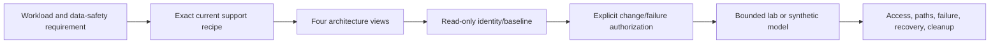

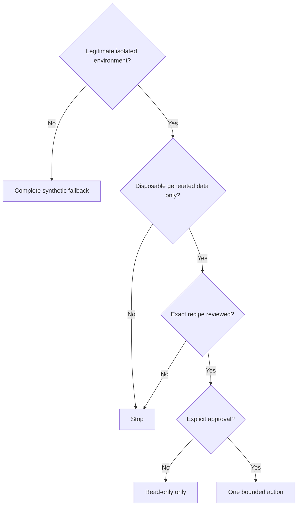

### 🔍 Plain-English deep-dive: a LUN is raw land, not a ready office

A **logical unit number (LUN)** is block space presented by storage. The host still decides partition table, filesystem, cluster ownership, mount point, and application use. Initializing or formatting is like bulldozing land: safe only when exact identity and ownership are proven and the data is disposable or protected. Never click `initialize` because a device appears new.

## 2. Architecture before steps: ownership and data path

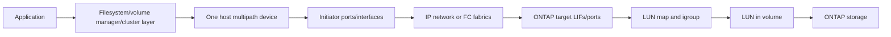

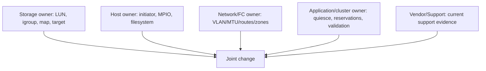

## 3. Core objects and stable identity

| Object | Plain meaning | Stable evidence |
|---|---|---|
| LUN | ONTAP block object | UUID/serial and exact map |
| igroup | Authorized initiator collection | Type/OS and IQN/WWPN members |
| LUN map | Connects LUN to igroup, with host-visible LUN ID | LUN UUID + igroup + LUN ID |
| Initiator | Host-side iSCSI/FC identity | IQN or WWPN |
| Target | Storage-side iSCSI/FC endpoint | Target IQN/portal or WWPN/port |
| Path | One initiator-to-target route to same device | Endpoint pair + same LUN serial |
| MPIO | Multipath I/O layer that merges paths | One device with expected path set |
| ALUA | Asymmetric Logical Unit Access path-state model | Optimized/nonoptimized/unavailable states |

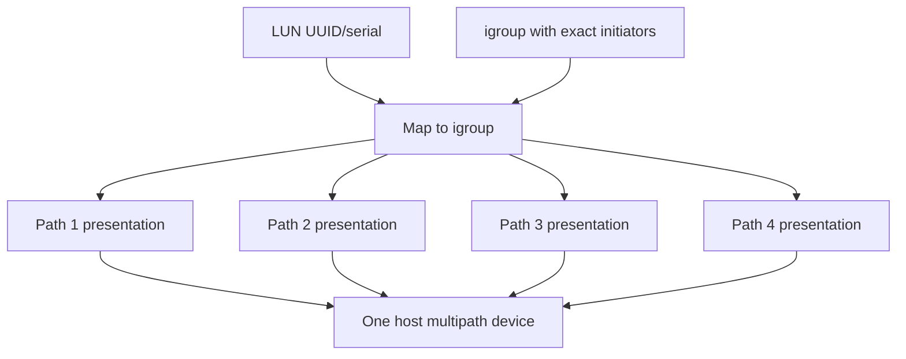

### 🔍 Plain-English deep-dive: multiple paths must converge on one identity

Four roads to the same warehouse should not create four warehouses in the inventory system. Every presentation must carry the same stable LUN identity, and the supported multipath stack must merge them into one logical device. Multiple host devices for one serial are a stop condition because mounting or formatting duplicates can corrupt data.

## 4. iSCSI architecture, discovery, and login

**Internet Small Computer Systems Interface (iSCSI)** carries SCSI block commands over TCP/IP. The host **initiator** logs into storage **target portals** using an initiator qualified name (IQN) and target IQN.

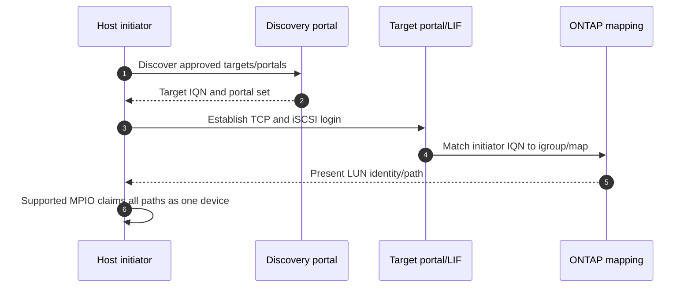

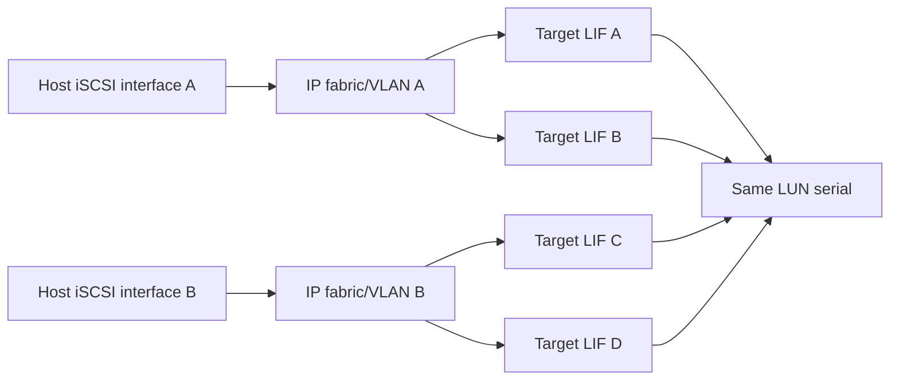

Discovery does not equal authorization; login does not equal LUN visibility; LUN visibility does not equal supported MPIO; and MPIO does not establish filesystem ownership.

## 5. Fibre Channel architecture, zoning, and presentation

**Fibre Channel (FC)** is a dedicated storage fabric. A **worldwide port name (WWPN)** identifies an initiator or target port. **Zoning** limits which ports may communicate; LUN masking through igroups separately controls which LUN is visible.

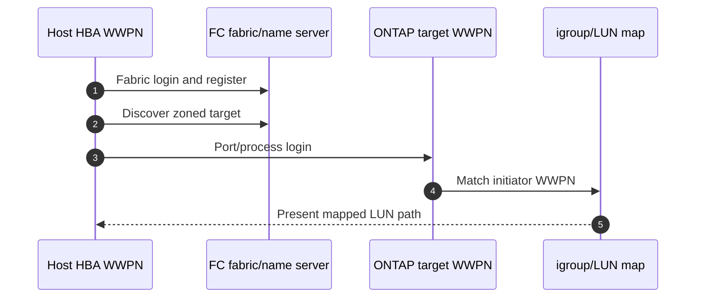

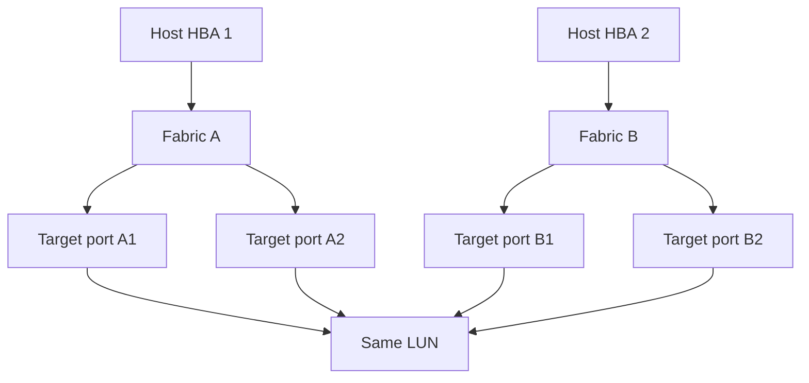

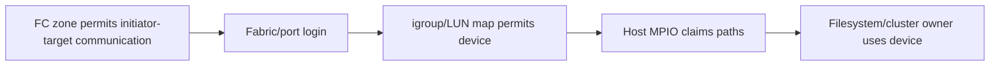

### 🔍 Plain-English deep-dive: zoning and LUN masking are two different security gates

Zoning is the building lobby list: it permits two FC ports to meet. LUN masking is the room key: it decides which storage object an authenticated initiator can see. Broad zoning does not authorize a LUN, and correct mapping cannot repair a missing fabric path. Troubleshoot and review both independently.

## 6. LUN, igroup, mapping, and host-type design

Design inputs: workload, capacity/growth, application consistency, filesystem/cluster ownership, protocol, host OS/hypervisor, initiator identities, expected paths, data LIF/target topology, local tier/volume, space/thin settings, QoS if required, snapshots/protection, alignment, reservations, and support recipe.

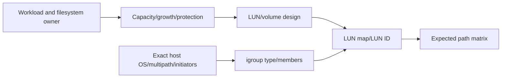

Negative design rule: only intended initiators belong to the intended igroup; unrelated hosts must not see the LUN. Avoid broad group membership or “map everywhere” restoration.

## 7. ALUA and path states

**Asymmetric Logical Unit Access (ALUA)** lets a target describe relative path access characteristics. Host multipath software uses current supported rules to select paths and respond to changes.

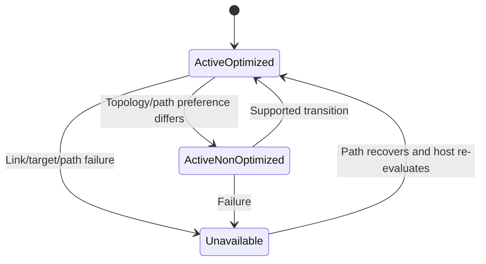

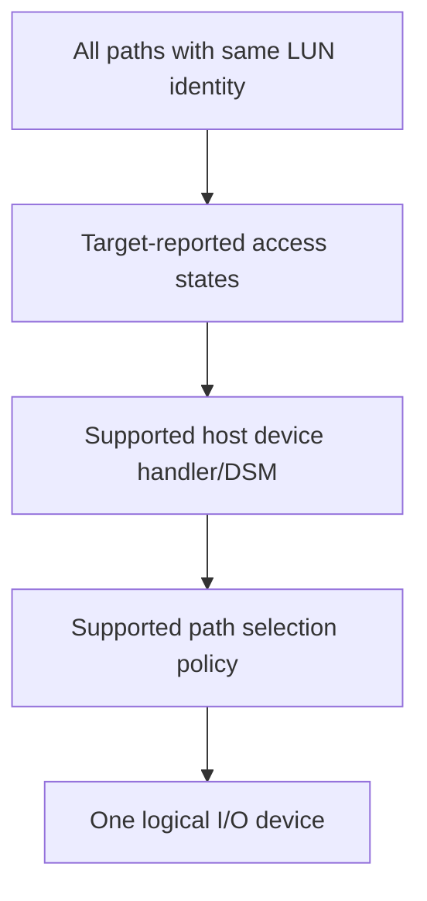

Do not hard-code a universal preferred policy, timeout, or path count; validate the exact IMT/host-utilities/application recipe.

## 8. Compatibility record: end-to-end, not component-by-component

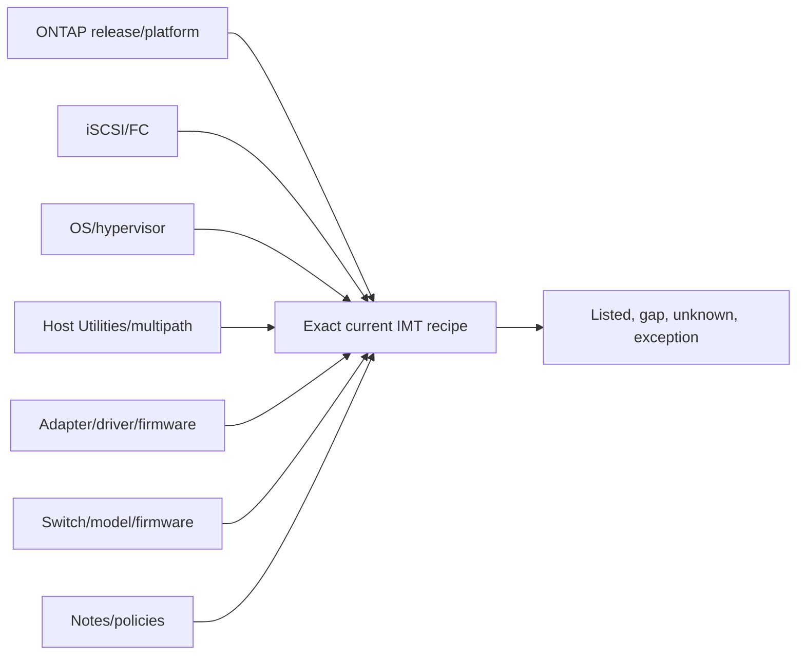

| Field | Required evidence |
|---|---|
| ONTAP/platform | Exact observed version/model |
| Protocol | iSCSI or FC and relevant options |
| Host | OS/hypervisor edition/build/kernel |
| Multipath | Product/component/version/configuration |
| Adapter | Model, driver, firmware |
| Switch | Model, OS/firmware and fabric design |
| Utilities | Host Utilities/plugin package |
| IMT | Exact solution/result/notes/date/access |
| Other vendor | Current application/OS/switch matrix |
| Verdict | Listed/gap/unknown plus reviewer |

No synthetic row is a live IMT result. An unlisted combination requires authorized vendor resolution, not inference that it is unsupported or safe.

## 9. Read-only baseline before implementation

Inventory host initiators, target services/endpoints, network/fabric paths, SVM, existing LUN/igroup/maps, stable serials, host devices/path states, filesystem/signature/reservation, application owner, current versions and events. Never rescan, initialize, online, mount, format, change zoning, log in, map, or fail a path under a read-only-only authorization.

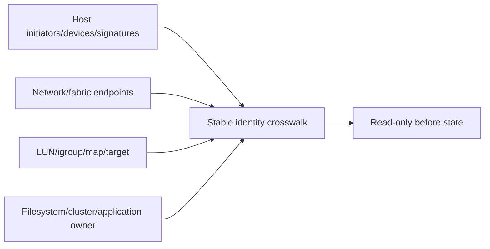

## 10. Explicit change authorization and data-loss safeguards

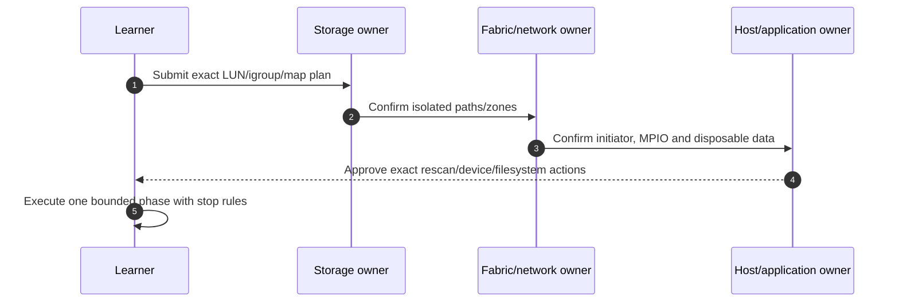

**Stop conditions:** unexpected serial, unexpected existing partition/filesystem/signature/reservation, multiple unmerged devices, wrong initiator access, path count/state mismatch, application I/O error, unsupported recipe, lost control path, or uncertain rollback.

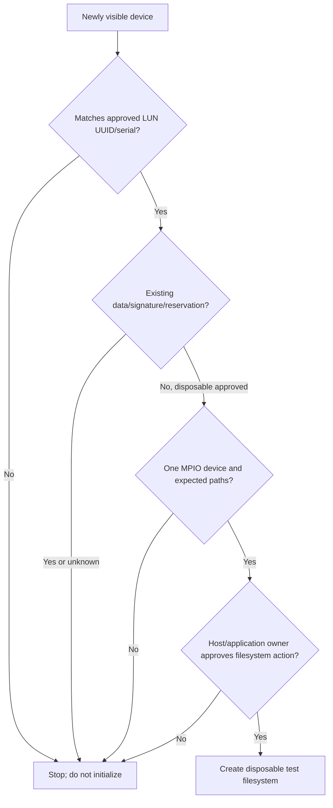

## 11. Conceptual implementation phases

The exact UI/CLI/REST/host/switch procedure must be taken from current official documentation. This guide provides phase gates only.

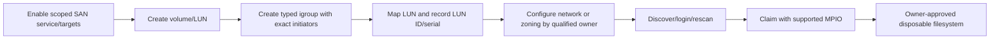

For iSCSI, current docs must govern network, discovery and login. For FC, qualified fabric owners govern zoning and switch changes. Never include credentials, CHAP secrets, or a universal command sequence in portfolio material.

## 12. Positive and negative validation matrix

| Test | Expected observation |
|---|---|
| Intended host visibility | Exact LUN serial visible once through MPIO |
| Path count | Matches approved topology, no duplicate device |
| Path state | Supported ALUA states; no unexpected failed path |
| Disposable I/O | Generated file checksum stable across write/read |
| Wrong initiator | LUN not presented |
| Wrong target/fabric | No unintended route/device |
| Capacity | Host and ONTAP logical/physical views explain differences |
| Restart/reconnect if approved | Identity remains stable; ownership is preserved |

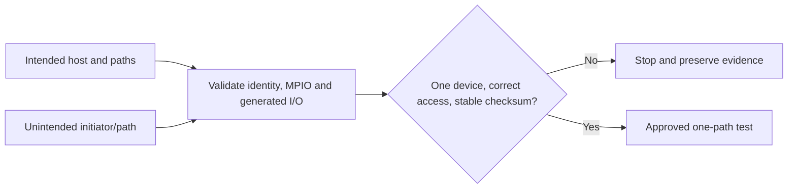

## 13. Path-failure test design

Fail only one isolated host interface, virtual link, lab switch port, or target path approved by all owners. Never pull production cables, disable shared ports, stop all paths, or claim nondisruptive behavior without measurement.

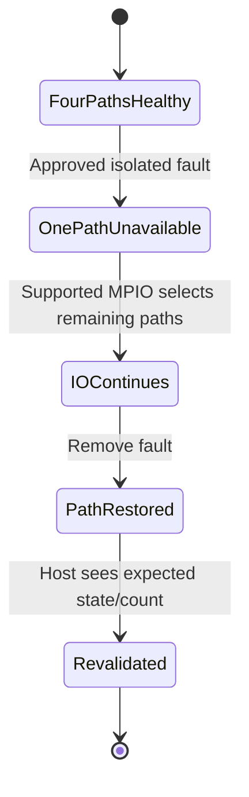

```mermaid
sequenceDiagram
    autonumber
    participant A as Synthetic application
    participant M as Host MPIO
    participant P1 as Path 1
    participant P2 as Remaining paths
    A->>M: Timed generated I/O
    M->>P1: I/O before fault
    P1--xM: Approved path failure
    M->>P2: Continue/retry per supported stack
    P2-->>A: I/O result and latency measured
    P1-->>M: Path restored and re-evaluated
```

Expected observations: one path changes state, the logical device identity remains, application outcome and latency/errors are measured, remaining paths are stable, and restored path returns to expected state. Stop if device duplicates, filesystem errors, reservation changes, all paths degrade, or results differ from the plan.

### 🔍 Plain-English deep-dive: availability is an application observation, not a green path icon

MPIO may report a successful transition while the application times out, a cluster fence triggers, or latency exceeds its objective. A bridge can remain standing while traffic misses every delivery deadline. Validate block device, filesystem/cluster, application transaction and data integrity, not just path state.

## 14. Recovery and rollback

```mermaid
flowchart TD
    FAULT[Approved fault] --> PRESERVE[Preserve host/fabric/ONTAP/app timeline]
    PRESERVE --> RESTORE[Restore exact isolated path]
    RESTORE --> RESCAN[Owner-approved path re-evaluation]
    RESCAN --> VERIFY[Expected path count/state and app checksum]
    VERIFY --> ROLLBACK{Remove lab service?}
    ROLLBACK -->|Yes| UNMOUNT[Stop app/unmount through host owner]
    UNMOUNT --> UNMAP[Unmap/delete only exact disposable objects]
    ROLLBACK -->|No| CLEAN[Return to approved baseline]
```

Rollback order protects host ownership: stop application, flush/quiesce, unmount/offline as current host procedure requires, remove host sessions/claim only when approved, remove mapping, then delete exact disposable LUN/volume if authorized. Never delete a LUN to “reset” an unknown host device.

## 15. Troubleshooting: discovery, login, zoning, mapping, and claim

```mermaid
flowchart TD
    MISS[LUN/path missing or duplicated] --> HOST{Initiator identity correct?}
    HOST -->|No| I[Host identity/config hypothesis]
    HOST -->|Yes| CONN{Target reachable/logged in?}
    CONN -->|No| NET[iSCSI network/login or FC zoning/fabric hypothesis]
    CONN -->|Yes| MAP{Exact initiator in igroup and LUN mapped?}
    MAP -->|No| M[Mapping hypothesis]
    MAP -->|Yes| SERIAL{All presentations same serial?}
    SERIAL -->|No| DATA[Wrong LUN/clone/data-safety stop]
    SERIAL -->|Yes| MPIO{Supported multipath claims one device?}
    MPIO -->|No| STACK[Host utilities/driver/firmware/config hypothesis]
    MPIO -->|Yes| APP[Filesystem/reservation/application hypothesis]
```

```mermaid
flowchart LR
    SYM[Exact symptom/time] --> CTRL[Healthy path/host control]
    CTRL --> FAB[Network/fabric evidence]
    FAB --> TARGET[Target service/port evidence]
    TARGET --> MAP[igroup/LUN map identity]
    MAP --> HOST[Host serial/path/MPIO]
    HOST --> APP[Filesystem/reservation/app]
    APP --> GATE[IMT/current docs/Support]
```

## 16. Fully synthetic sanitized scenario and complete dataset

**Customer:** Northstar Research Cooperative. **Workload:** disposable database benchmark with generated data. **Design:** one synthetic LUN `lun-db01` in `svm-db`, mapped only to `igroup-db01`; four iSCSI paths across two isolated IP fabrics; one host MPIO device. FC is paper-modeled with equivalent dual-fabric evidence.

| Object | Synthetic identity | Expected |
|---|---|---|
| Host initiator | `iqn.2026-08.test.example:nrc-db01` | Sole igroup member |
| LUN | `lun-uuid-0001`, serial `SYN-LUN-0001` | One stable device |
| igroup | `igroup-db01` | Correct host type from hypothetical current recipe |
| Map | LUN -> igroup, synthetic LUN ID 10 | Exact intended presentation |
| Paths | `p1`-`p4` | Same serial, supported ALUA states |
| Filesystem | `SYNTHETIC-DISPOSABLE` | Generated files only |

```mermaid
flowchart TB
    H[db01 initiator] --> A1[Host interface A]
    H --> B1[Host interface B]
    A1 --> PA[IP fabric A]
    B1 --> PB[IP fabric B]
    PA --> T1[Target LIF 1]
    PA --> T2[Target LIF 2]
    PB --> T3[Target LIF 3]
    PB --> T4[Target LIF 4]
    T1 --> L[SYN-LUN-0001]
    T2 --> L
    T3 --> L
    T4 --> L
    L --> ONE[One MPIO device]
```

### Synthetic fault cases

| Case | Symptom | Leading hypothesis | Decisive evidence | Recovery/prevention |
|---|---|---|---|---|
| 1 | Discovery returns no target | Wrong isolated VLAN/route | TCP path absent; config identities correct | Restore route; network precheck |
| 2 | Login succeeds, no LUN | Initiator absent from igroup | Exact IQN differs by one token | Correct approved member; identity crosswalk |
| 3 | Four OS devices | MPIO component/config missing | Same serial on all devices; no merge | Stop I/O; align current supported host recipe |
| 4 | One path failed | Lab-only link block | Other paths healthy, same device | Restore link; monitor path coverage |
| 5 | Wrong host sees LUN | Overbroad igroup membership | Unintended IQN present | Unmap/correct with data-safety gate; membership review |
| 6 | Device has unknown signature | Reused/non-disposable LUN | Existing metadata | Stop; do not initialize; owner resolution |

```mermaid
flowchart LR
    CASE[Six synthetic cases] --> PRED[Prediction and stop condition]
    PRED --> EVID[Host/fabric/ONTAP/app evidence]
    EVID --> REC[Recovery and negative retest]
    REC --> PREV[Compatibility/configuration control]
    PREV --> PORT[Sanitized portfolio pack]
```

**Honest portfolio language:** `I completed a fully synthetic SAN design and troubleshooting lab. I reconciled LUN/initiator identities, modeled iSCSI and FC paths, required one MPIO device, built a compatibility record, and specified data-safe path failure/recovery and negative tests. I did not configure or fail production NetApp SAN paths.`

## 17. Evidence capture, cleanup, cost, and privacy

```mermaid
flowchart LR
    BEFORE[Before: identities/recipe/path map/signatures] --> DURING[During: UTC host/fabric/ONTAP/app evidence]
    DURING --> AFTER[After: path state/checksum/negative access]
    AFTER --> ROLL[Rollback and object inventory]
    ROLL --> SAN[Tokenized portfolio derivative]
```

Capture exact stable LUN serial, initiator/target tokenized IDs, path matrix, version/recipe date, expected/observed state, generated-data checksum, application result, stop/recovery/rollback, reviewer, and residual risk. Exclude secrets and gated screenshots.

Cleanup in owner-approved order; verify no temporary mapping, initiator membership, session, zone, route, filesystem, snapshot, LUN, volume, credential, or chargeable resource remains. No cost, license, simulator, or cloud availability is promised.

## 18. JD Mapping and background tie

```mermaid
flowchart LR
    AZ[Azure/VM/network fundamentals] --> PATH[Host-to-target path reasoning]
    MS[enterprise escalation] --> EVID[Cross-team evidence/timeline]
    CRIT[Critical situation] --> SAFE[Data-safe stop and recovery]
    ANALYTICS[Analytics] --> MATRIX[Path/compatibility coverage model]
    PATH --> TAM[SAN TAM capability]
    EVID --> TAM
    SAFE --> TAM
    MATRIX --> TAM
```

| JD need | Lab proof |
|---|---|
| Storage/virtualization depth | End-to-end LUN and host ownership map |
| Supportability | Exact recipe schema and current-doc gate |
| Risk mitigation | Unknown-device and duplicate-device stop rules |
| Troubleshooting | Layered discovery/login/zoning/mapping/MPIO tree |
| Cross-functional work | Storage/fabric/host/app RACI |
| Communication | Bounded findings and honest evidence level |

## 19. Official and Public Source Anchors

**Date checked: 2026-08-24.** These sources provide public concepts and navigation. They do not validate the synthetic configuration or replace exact authorized IMT, switch, host, application, or Support evidence.

| Topic | Official source | Use |
|---|---|---|
| ONTAP SAN | [ONTAP SAN storage management](https://docs.netapp.com/us-en/ontap/san-management/) | LUN, igroup, map and SAN concepts |
| SAN hosts | [ONTAP SAN hosts](https://docs.netapp.com/us-en/ontap-sanhost/) | Host Utilities and host-specific navigation |
| iSCSI | [ONTAP iSCSI configuration](https://docs.netapp.com/us-en/ontap-sanhost/hu_iscsi_80.html) | Public host/iSCSI entry; verify current host page |
| FC | [ONTAP FC configuration](https://docs.netapp.com/us-en/ontap/san-config/fc-config-concept.html) | FC configuration concepts |
| Network | [ONTAP network management](https://docs.netapp.com/us-en/ontap/network-management/) | IP path/LIF concepts |
| IMT | [NetApp Interoperability Matrix Tool](https://imt.netapp.com/) | Authorized exact end-to-end supportability check |
| HWU | [NetApp Hardware Universe](https://hwu.netapp.com/) | Authorized current platform/adapter/port facts |
| ALUA standard context | [INCITS T10 standards](https://www.t10.org/) | SCSI standards entry; not an ONTAP recipe |
| Microsoft MPIO | [Microsoft Multipath I/O overview](https://learn.microsoft.com/windows-server/storage/mpio/mpio-overview) | Windows MPIO concept; verify OS/vendor recipe |

## 20. Self-Test and Teach-Back

1. Draw iSCSI and FC paths from application to LUN.
2. Explain zoning versus LUN masking and discovery versus authorization.
3. Prove why four paths must become one device.
4. Build an exact compatibility-record schema.
5. Identify all conditions that prohibit initialization or formatting.
6. Design positive, negative and one-path failure tests.
7. Correlate host, fabric, ONTAP and application evidence in UTC.
8. Explain recovery versus rollback and safe cleanup order.
9. Work all six synthetic fault cases through the hypothesis tree.
10. State the no-production-NetApp boundary and current-doc requirement.

---

## Likely Interview Questions

### Q1. How do LUNs, igroups, and mappings work together?

> **Model answer:** `A LUN is the block object, an igroup contains the exact authorized host initiator IQNs or WWPNs with the appropriate host type, and a LUN map connects them with a host-visible LUN ID. Network reachability or zoning enables communication but does not replace masking. I reconcile stable LUN and initiator identities before host action.`

### Q2. How do you validate multipathing safely?

> **Model answer:** `I first validate the exact current IMT/host recipe, then prove every path reaches the same LUN serial and the supported MPIO stack exposes one device with expected ALUA states. With disposable data and explicit storage/fabric/host/app authorization, I fail one isolated path, measure application and device behavior, restore it, verify path state/count and checksum, and retain stop/rollback evidence.`

### Q3. How do iSCSI and FC troubleshooting differ?

> **Model answer:** `Both share initiator, target, mapping, stable LUN identity, MPIO and application layers. iSCSI adds IP interfaces, VLANs, routes, TCP, discovery and login; FC adds HBAs, fabrics, Name Server, zoning and fabric/port login. I isolate reachability before mapping and host claim in either case.`

### Q4. What prevents data loss when a new device appears?

> **Model answer:** `I stop until its LUN UUID/serial matches the approved map, all presentations merge into one device, ownership is known, existing partition/filesystem/signature/reservation checks are complete, the exact recipe is supported, and the host/application owner authorizes the disposable filesystem action. I never initialize an unknown or duplicate device.`

### Q5. What does ALUA contribute?

> **Model answer:** `ALUA communicates relative target-port access states so a supported host multipath component can select and transition paths appropriately. It does not by itself prove application availability; I validate the exact stack, path states, device identity, application transaction and data integrity.`

### Q6. What belongs in a SAN compatibility record?

> **Model answer:** `Exact ONTAP/platform, protocol, host OS/hypervisor, Host Utilities and multipath component, adapter model/driver/firmware, switch/model/firmware, application constraints, IMT solution/result/notes/date and vendor matrices. I classify listed, gap, unknown or exception and retain a reviewer; I never infer from individually supported parts.`

### Q7. How do you troubleshoot a missing or duplicate LUN?

> **Model answer:** `I verify initiator identity, target/fabric connectivity and login, exact igroup membership and map, then compare stable serials across presentations. A serial mismatch is a data-safety stop; matching serials that remain separate point to host MPIO/driver/firmware/configuration. Only then do I inspect filesystem, reservation and application ownership.`

### Q8. What experience do you bring and what is the boundary?

> **Model answer:** `My prior escalation, Windows/Azure, networking, VM, trace and cross-team incident experience transfers to layered path diagnosis and safe coordination. I have not administered production NetApp SAN. This is synthetic unless later completed in an authorized lab with current IMT and qualified owners.`

---

## 30-Second Memory Hooks

- **LUN:** raw land; host ownership comes later.
- **igroup/map:** exact initiator guest list plus room key.
- **iSCSI:** IP/TCP discovery/login before masking and MPIO.
- **FC:** fabric/zoning before masking and MPIO.
- **Zoning/masking:** lobby list versus room key.
- **Identity:** every path must carry one LUN serial.
- **MPIO:** many roads, one warehouse.
- **ALUA:** target path-state guidance, not app proof.
- **Unknown device:** stop; never initialize.
- **Fail one:** measure app, restore path, verify checksum.
- **Compatibility:** exact combination and notes, current date.

---

## Completion Checklist

- [ ] State all five safety labels and the exact nonclaim.
- [ ] Use legitimate isolated access or complete synthetic/paper fallback only.
- [ ] Document objectives, prerequisites, safety, ethics and architecture before steps.
- [ ] Explain LUN, igroup, map, iSCSI, FC, MPIO and ALUA from zero.
- [ ] Draw storage, fabric/network, host and application ownership views.
- [ ] Validate exact current IMT/host/switch/application recipe before changes.
- [ ] Perform read-only identity/signature/path discovery first.
- [ ] Obtain explicit storage/fabric/host/application change authorization.
- [ ] Enforce unknown-device, duplicate-device, reservation and filesystem stop rules.
- [ ] Prove intended access, unintended denial, one device and expected paths.
- [ ] Run or simulate one-path failure, application observation, recovery and rollback.
- [ ] Capture stable IDs, UTC evidence, generated checksum and residual risk.
- [ ] Clean up every mapping, member, session, zone, route, object, secret and cost.
- [ ] Use the hypothesis tree and honest portfolio language.
- [ ] Recheck official sources dated 2026-08-24 and answer exact Q1-Q8 aloud.

---

*Next suggested section:* [Part 86 - LAB 4 - Snapshots, SnapMirror, Restore, and DR Validation](Part-86-lab-snapshot-snapmirror-dr.md)