# Part 86 - LAB 4 - Snapshots, SnapMirror, Restore, and DR Validation

> **Section goal:** Convert business recovery requirements into a layered snapshot and SnapMirror design, then execute only in an explicitly authorized isolated lab or simulate baseline, update, lag, break, resync, restore, and disaster-recovery validation. By the end, you can measure actual recovery point objective and recovery time objective, prove application consistency, preserve single-writer safety, and report residual risk.

Covers index item **86** and maps to job-description responsibilities for strategic planning, storage best practices, stability/risk mitigation, upgrade and change advice, technical analysis, high-pressure recovery communication, cross-team coordination, and operational service reviews.

**Privacy and access boundary:** Protection inventories, snapshots, relationships, credentials, recovery data, runbooks, and results require authorization, minimum access, approved storage, and careful retention.

**Synthetic-evidence rule:** Every source, destination, policy, recovery point, relationship, date, RPO/RTO result, fault, and recommendation in the fallback is fictional and sanitized.

**Version caveat:** Protection features, relationship states, commands, restore behavior, limits, and supported designs change; complete a current-doc check before use.

**Lab safety contract:** The access fallback is a complete synthetic simulation. Use read-only first, obtain authorization before change, run a positive test and negative test, perform bounded failure injection, document recovery and rollback, capture evidence, complete cleanup, control cost and privacy, and use honest interview language.

**Explicit nonclaim:** You have not configured, initialized, updated, broken, resynchronized, reversed, restored, failed over, or validated production ONTAP snapshots, SnapMirror, backup, or disaster recovery. This lab does not establish production recovery authority or guarantee recoverability.

**Privacy/access:** Protection evidence can expose data sets, recovery points, retention, topology, intercluster addresses, encryption, credentials, catalogs, legal holds, ransomware controls, business priorities, RPO/RTO, and recovery weaknesses. Use generated data, synthetic identities, minimum authorized evidence, approved repositories, separation of duties, redaction, audit, retention, and no keys, secrets, customer snapshots, or catalog exports.

**Synthetic-evidence:** Every organization, application, cluster, SVM, volume, snapshot, relationship, policy, label, schedule, timestamp, transfer, lag, failure, metric, restore, owner, and result below is fictional and sanitized. No table is ONTAP, NetApp Console, backup, Support, or customer output.

**Version/current-doc:** ONTAP releases, snapshot and SnapMirror policies/types/states, relationship commands, resync/reverse behavior, application integrations, consistency methods, limits, encryption, backup services, and DR procedures change. Sources were checked **2026-08-24**. Verify exact releases, topology, relationship, policy, application and current official/authorized procedure before action.

This Part is a learning and simulation workflow, not a production DR runbook, backup guarantee, cyber-recovery plan, data-retention instruction, or authorization to break/resync/restore any relationship.

> **No-production-NetApp boundary:** Your production strengths are Microsoft data-service incidents, business continuity concepts, critical-situation coordination, change governance, analytics, risk communication, and customer reviews. Your exact nonclaim is: **you have not operated or validated production NetApp snapshots, SnapMirror, restore, or DR.** You may present this synthetic exercise or an authorized lab while stating its evidence level.

---

## 1. Objectives, prerequisites, safety, and ethics

### Objectives

- Translate service, data and dependency requirements into protection policy.
- Separate snapshots, replication, backup, archive and disaster recovery.
- Draw source, destination, network, management, application and authority architecture before steps.
- Use read-only baseline before any relationship or data operation.
- Simulate or authorize baseline, update, lag, break, resync, restore and DR transitions.
- Measure achieved RPO/RTO and application/data integrity rather than job status alone.
- Test positive, negative, failure, recovery and rollback cases.

### Prerequisites and legitimate routes

| Route | Requirement | Output |
|---|---|---|
| Authorized isolated two-endpoint lab | Generated data, disposable source/destination, owner-approved operations | Hands-on lab evidence |
| Official training lab | Enrollment and exact task scope | Course-lab evidence |
| Single-system snapshot lab | Authorized disposable volume | Local recovery evidence only |
| Paper/synthetic simulation | Current public docs and this dataset | State/measurement exercise, no tool claim |

Customer production is forbidden for personal practice. Never use unapproved customer recovery points, copied credentials, unofficial images, forced operations, or real ransomware/DR events for portfolio material.

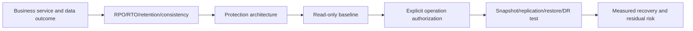

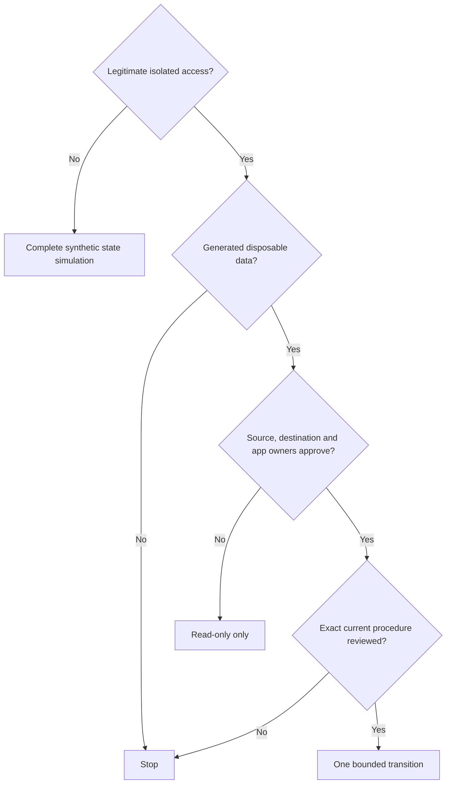

### 🔍 Plain-English deep-dive: protection controls answer different failure questions

A snapshot is a local rewind point; replication keeps another copy/location current; backup adds an independently managed recovery copy/catalog; archive preserves data for long periods; DR restores a business service at an alternate location. One spare house key does not solve fire, theft, legal retention, or a city-wide outage. Layer controls to the failure model.

## 2. Requirements before products

- **Recovery point objective (RPO):** maximum acceptable data-loss time, measured from failure to newest usable recovery point.
- **Recovery time objective (RTO):** target time to restore the required service.
- **Retention:** how long/which points must remain.
- **Application consistency:** whether recovered components form a valid application state.
- **Crash consistency:** storage reflects a sudden-stop state; application recovery may still be needed.
- **Failure domain:** components one event can affect together.

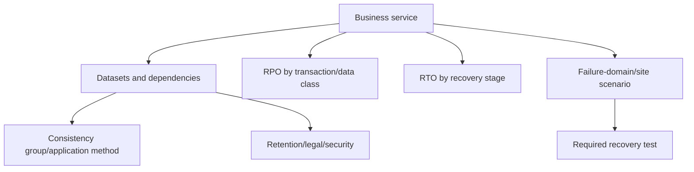

| Question | Example synthetic answer |
|---|---|
| What must recover together? | Database data, logs, configuration, identity dependency |
| Accepted loss? | 30 minutes for transactions; exact value is fictional |
| Accepted outage? | 90 minutes to validated service |
| Which failures? | File deletion, volume error, source-cluster loss, credential loss |
| Who declares disaster? | Named business continuity authority |
| What is out of scope? | External identity service in first exercise |

## 3. Architecture before steps: local and remote controls

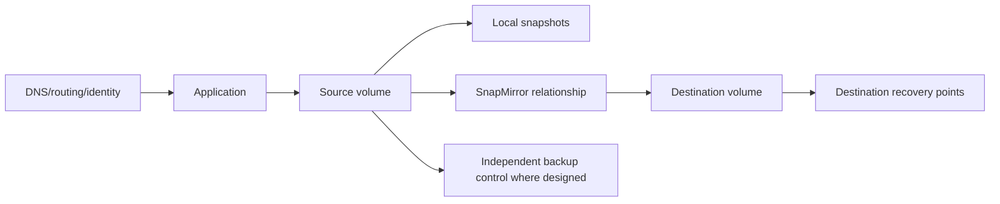

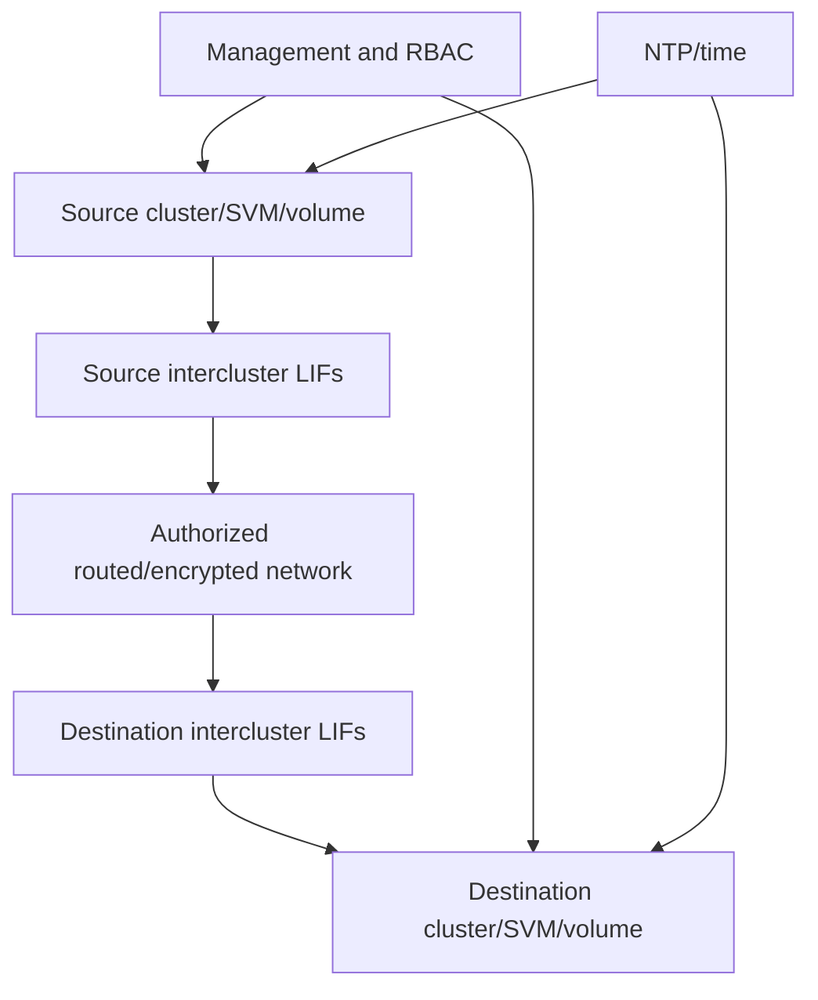

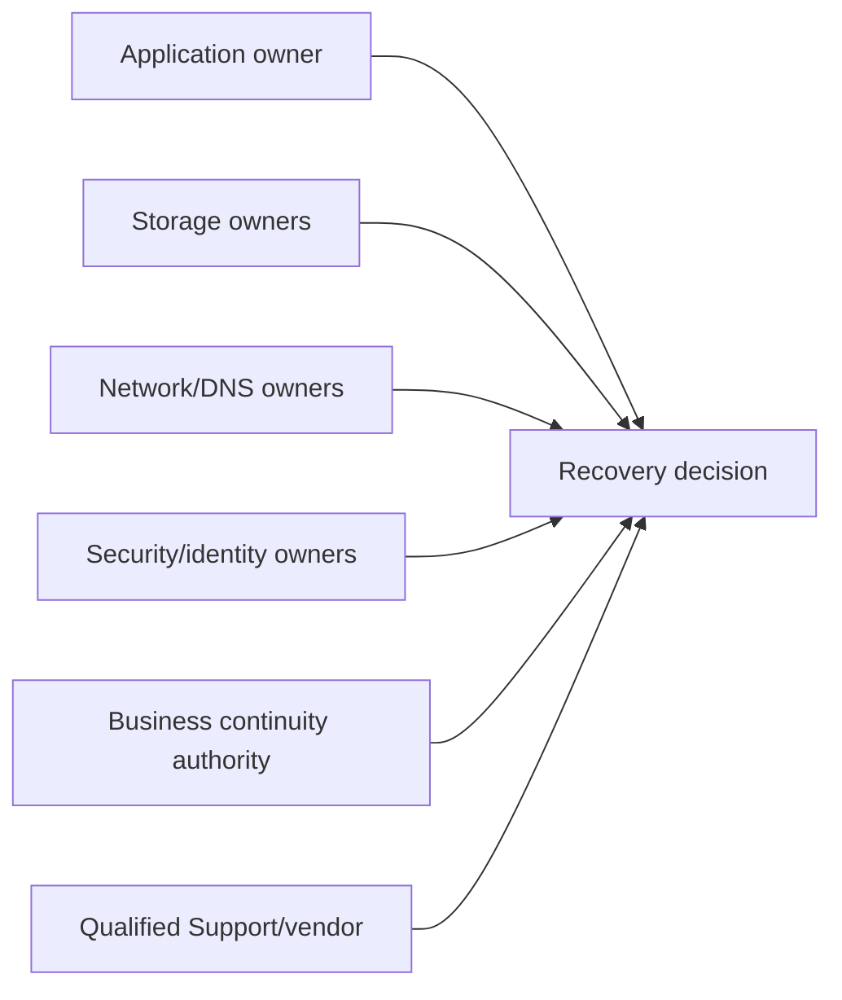

## 4. Snapshot policy design and space behavior

A snapshot records a point-in-time view using ONTAP storage semantics; it is not a separate independent copy by default. Policy must match change rate, retention, restore need, space/headroom and compliance.

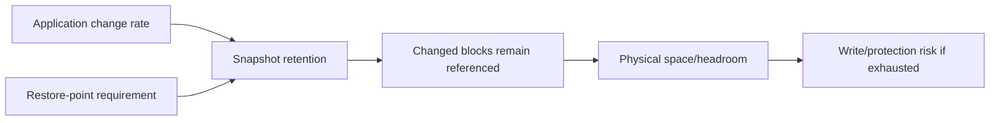

```mermaid
timeline
    title Synthetic snapshot schedule and data points
    09:00 : app-consistent point A
    09:15 : scheduled point B
    09:30 : scheduled point C
    09:42 : synthetic failure
    09:45 : next scheduled point not yet usable at failure
```

### 🔍 Plain-English deep-dive: snapshot age is not automatically data loss

If the latest recovery point is 09:30 and failure occurs at 09:42, the **potential** time gap is 12 minutes. Actual lost transactions depend on what changed and what other logs/controls can replay. Report recovery-point age and validated application recovery separately; do not claim exact lost records from timestamps alone.

## 5. Application consistency and dependency groups

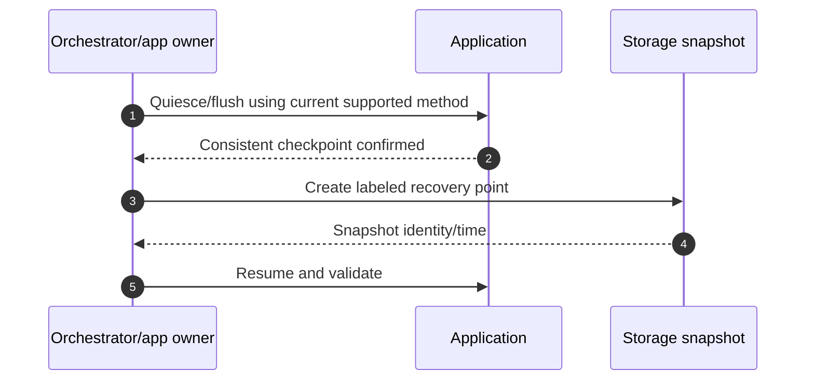

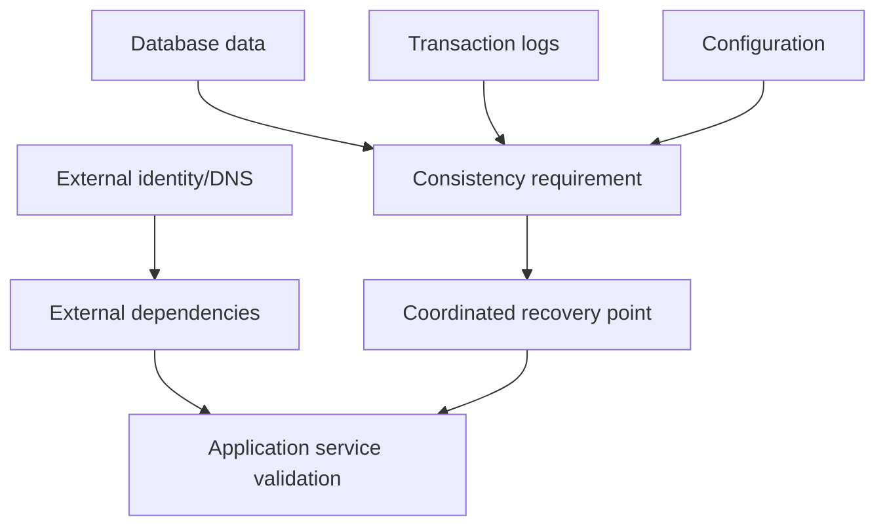

Never invent an application quiesce procedure. Use the current application/vendor/NetApp integration and qualified application owner. Crash-consistent points can still be valid if the application supports crash recovery and testing proves the objective.

## 6. SnapMirror topology, policy, labels, and schedule

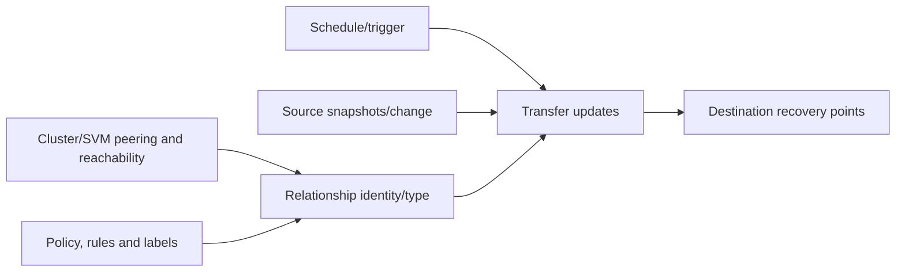

Record exact source/destination stable IDs, relationship UUID/type/state/health, policy/rules/labels, schedule, last successful transfer, last error, transfer rate/backlog, destination capacity and newest validated destination point. Relationship status alone does not prove the required point exists.

## 7. Baseline transfer and incremental updates

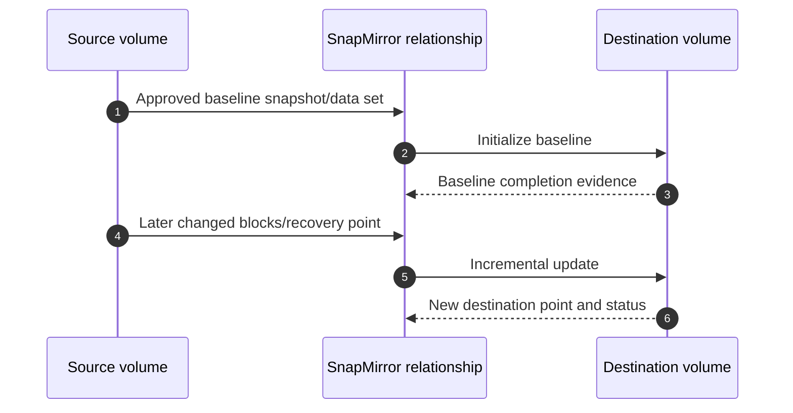

Baseline can be resource-intensive and requires capacity/network/time planning. In a paper route, calculate and simulate transitions without issuing commands. An authorized route uses exact current official steps and owner-approved monitoring/stop conditions.

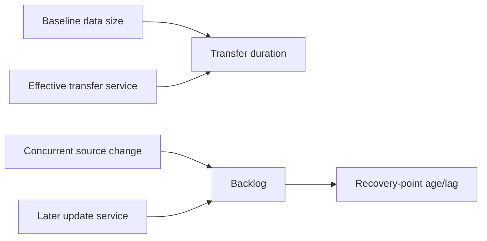

## 8. Lag and achieved RPO measurement

Do not confuse schedule interval, relationship `lag` field, last transfer completion, and newest application-valid destination point.

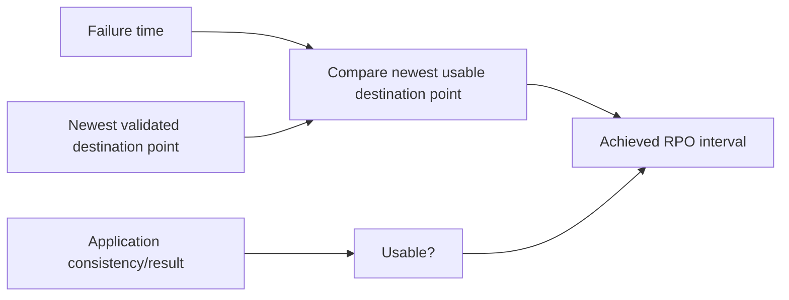

$$\text{Achieved RPO} = t_{failure} - t_{newest\ usable\ recovery\ point}$$

For the synthetic example, failure at 12:00 and newest validated point at 11:18 yields an achieved recovery-point age of 42 minutes. This does not claim 42 minutes of records were lost.

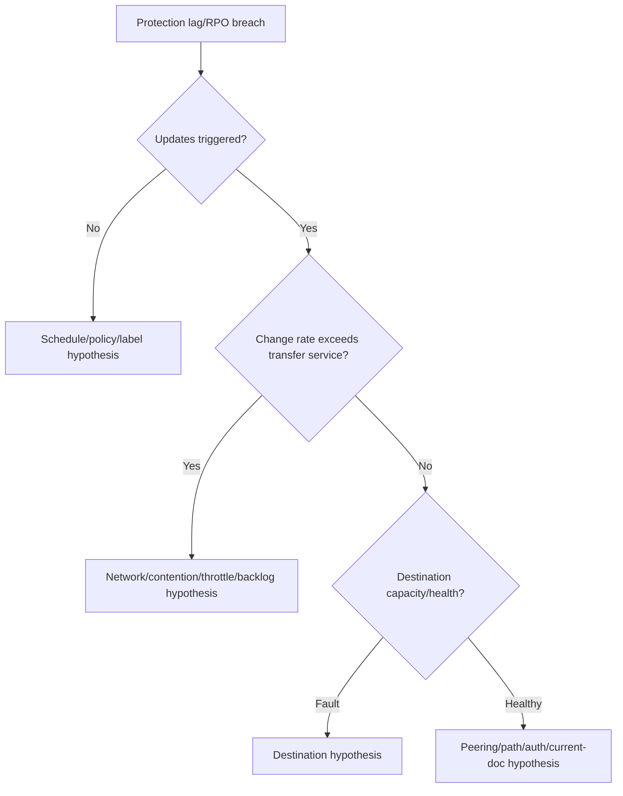

## 9. Break, promote, and single-writer authority

Breaking a relationship or making a destination writable changes authority and can create divergent data. It requires an exact use case, application shutdown/fencing, business decision, current procedure and rollback/resync plan.

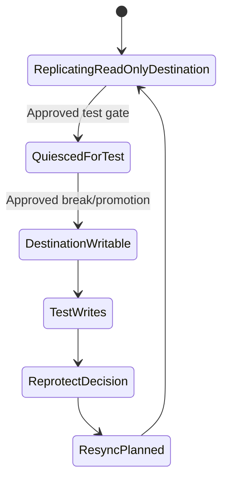

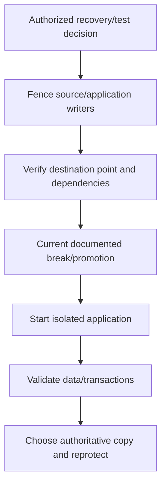

### 🔍 Plain-English deep-dive: resync chooses history, it does not merge stories

If two notebooks receive different edits, resync is not a word processor that intelligently combines them. A resync can discard changes on the selected destination side according to the operation and common point. Identify the authoritative copy, preserve evidence/needed data, obtain approval, and use current procedure before any resync.

## 10. Restore scopes and validation

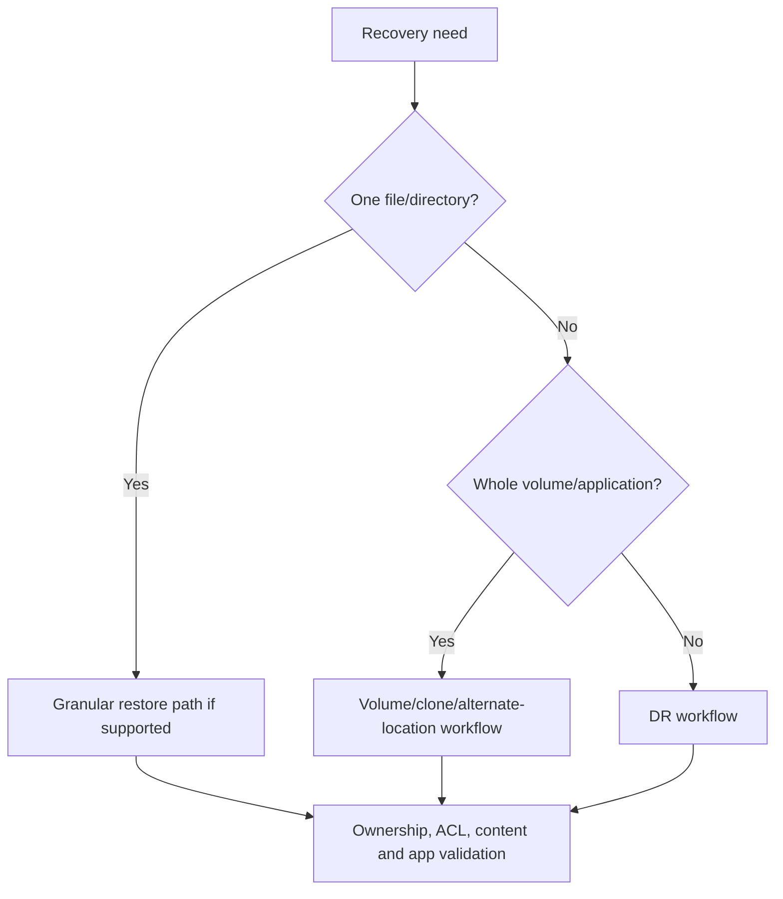

Prefer alternate-location or isolated validation when it reduces overwrite risk. Validate exact point, file/object identity, ownership/permissions, checksums where useful, database recovery, application transactions, dependent services, monitoring, security, and business acceptance.

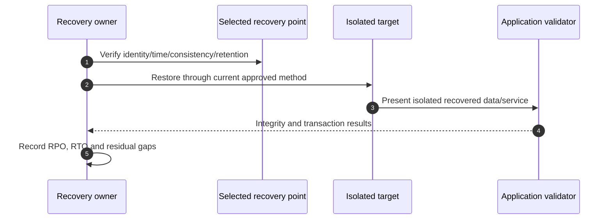

## 11. RTO measurement by milestones

### 🔍 Plain-English deep-dive: a healthy replication relationship is not a recovered service

A courier can deliver every sealed box on time while one box omits the instruction manual needed to assemble the machine. Relationship health proves a storage transfer state; recoverability also needs the correct point, application-consistent component set, keys and credentials, DNS/network/identity dependencies, startup order, integrity checks and business acceptance. Report each milestone instead of converting one green status into an end-to-end guarantee.

```mermaid
timeline
    title Synthetic DR elapsed-time milestones
    12:00 : Incident/recovery clock starts
    12:08 : Authority and point selected
    12:20 : Destination made available
    12:37 : Network/DNS/identity ready
    12:55 : Application starts
    13:08 : Integrity and transaction validation completes
```

$$\text{Achieved RTO} = t_{service\ accepted} - t_{recovery\ clock\ start}$$

Synthetic achieved RTO is 68 minutes. Also report decision, storage, dependency, application and validation durations so improvement targets the real delay.

```mermaid
flowchart LR
    DECLARE[Decision/authority time] --> STORAGE[Storage recovery time]
    STORAGE --> DEP[DNS/network/identity time]
    DEP --> APP[Application start/recovery time]
    APP --> VAL[Business validation time]
    VAL --> RTO[Achieved RTO]
```

## 12. Positive, negative, failure, recovery, and rollback tests

| Type | Synthetic test | Expected observation |
|---|---|---|
| Positive | Restore selected generated file/application point | Correct checksum and application transaction |
| Negative | Request a point outside retention | Controlled no-point result, no fabrication |
| Failure injection | Block isolated intercluster path or mark transfer source stale in simulation | Lag/backlog increases with predicted signature |
| Recovery | Restore path/update and prove newest destination point | Relationship and point evidence recover |
| Rollback | End DR test, choose authority, remove test writes/resources, reprotect | Single-writer state and expected relationship restored |
| Permission negative | Unauthorized persona attempts restore/break | Denied and audited |

```mermaid
stateDiagram-v2
    [*] --> Baseline
    Baseline --> PositiveRestore
    PositiveRestore --> NegativePointTest
    NegativePointTest --> LagFault
    LagFault --> TransferRecovery
    TransferRecovery --> DRTest
    DRTest --> AuthorityDecision
    AuthorityDecision --> RollbackReprotect
    RollbackReprotect --> CleanBaseline
```

## 13. Read-only first and explicit operation authorization

Read-only baseline: source/destination IDs, relationship state/type/policy, snapshots and labels, newest points, lag/transfer history, capacity, network/peering, application consistency, current writers, protection dependencies, health/events, versions, and prior test evidence.

```mermaid
sequenceDiagram
    autonumber
    participant L as Learner
    participant B as Business continuity/app owner
    participant S as Storage/network/security owners
    participant R as Reviewer
    L->>L: Read-only baseline and synthetic data hash
    L->>B: Submit exact point/scenario/RPO/RTO plan
    B->>S: Confirm writer fencing, dependencies and operations
    S->>R: Review current procedure, stop and rollback
    R-->>L: Explicit authorization or paper simulation only
```

Each state-changing operation needs exact objects/point, current procedure, authority, writer status, impact, stop conditions, recovery, rollback/reprotect, data handling, observation window and reviewer.

## 14. Common failure cases and hypothesis tree

```mermaid
flowchart TD
    FAIL[Protection or recovery objective fails] --> POINT{Correct recovery point exists?}
    POINT -->|No| POLICY[Schedule/label/retention/backup scope]
    POINT -->|Yes| XFER{Destination received it?}
    XFER -->|No| PATH[Peering/network/auth/rate/capacity]
    XFER -->|Yes| CONS{Application-consistent/usable?}
    CONS -->|No| APP[Quiesce/log/dependency/catalog/key]
    CONS -->|Yes| AUTH{Recovery authority and access ready?}
    AUTH -->|No| GOV[Runbook/RBAC/decision/dependency]
    AUTH -->|Yes| START{Application starts and validates?}
    START -->|No| DEP[DNS/identity/network/order/config]
    START -->|Yes| PROVE[Measure RPO/RTO and residual risk]
```

Common failures: green transfer but unusable point; stale clocks; wrong label; destination space; path bottleneck; missing app component; expired key/credential; unclear disaster authority; both sides writable; restore overwrites source; resync direction wrong; untested DNS/identity; cleanup leaves temporary writable destination.

## 15. Fully synthetic sanitized scenario: Northstar recovery exercise

**Service:** synthetic research catalog. **Requirements:** fictional RPO 30 minutes and RTO 90 minutes. **Data:** generated records and checksums only. **Architecture:** source `vol-catalog-a`, destination `vol-catalog-b`, local snapshots, asynchronous synthetic relationship, isolated DR application.

```mermaid
flowchart LR
    APP[Catalog app at Site A] --> VA[vol-catalog-a]
    VA --> SA[Local snapshots]
    VA --> REL[Async synthetic relationship]
    REL --> VB[vol-catalog-b at Site B]
    VB --> DR[Isolated DR app]
    ID[External identity/DNS] --> APP
    ID --> DR
```

### Synthetic timeline and results

| UTC | Event | Evidence/result |
|---|---|---|
| 10:00 | App-consistent point `p1000` | Generated dataset hash A |
| 10:20 | Incremental point `p1020` | Hash B; destination received 10:24 |
| 10:40 | Intercluster path fault starts | Updates queue; source app healthy |
| 11:15 | Path restored | Backlog drains by 11:31 |
| 11:40 | Point `p1140` created | Destination receives 11:44 |
| 12:00 | Simulated source loss | Newest usable destination point 11:40 |
| 12:08 | Recovery authorized | Single-writer/fencing recorded |
| 13:08 | App accepted at DR | Achieved RPO 20 minutes; RTO 68 minutes |

```mermaid
flowchart LR
    P1000[p1000] --> P1020[p1020]
    P1020 --> FAULT[Path fault/backlog]
    FAULT --> CATCH[Catch-up]
    CATCH --> P1140[p1140 usable at destination]
    P1140 --> FAIL[Source loss at 12:00]
    FAIL --> DR[DR accepted at 13:08]
```

### Negative/failure outcomes

- Selecting `p1000` restores but fails the 30-minute RPO; point validity and objective are separate.
- A test without identity dependency starts storage but not the service; dependency time is visible in RTO.
- Attempted concurrent source write is blocked by synthetic fencing control.
- Wrong resync-direction proposal is rejected before action because authority is unproven.

**Recovery/rollback:** after testing, preserve generated test-write evidence, stop DR writers, explicitly choose the intended authoritative side, simulate current documented resync/reprotect, verify new common point, return destination to protected role, remove temporary DNS/routes/identities, and run positive/negative tests.

```mermaid
flowchart TD
    TEST[DR test complete] --> PRES[Preserve synthetic test evidence]
    PRES --> STOP[Stop/fence DR writers]
    STOP --> AUTH[Approve authoritative side]
    AUTH --> REPRO[Simulate resync/reprotect]
    REPRO --> VERIFY[New common point and relationship health]
    VERIFY --> CLEAN[Remove temporary app/network/access]
```

**Honest portfolio language:** `I completed a fully synthetic snapshot, replication, restore and DR exercise. I modeled relationship states, lag and application-consistent points, measured a 20-minute synthetic RPO and 68-minute synthetic RTO, enforced single-writer authority, and documented rollback/reprotection. I did not operate production SnapMirror or customer recovery data.`

## 16. Evidence capture, cleanup, cost, and privacy

```mermaid
flowchart LR
    REQ[Requirements/owners] --> BEFORE[Topology/policy/points/before state]
    BEFORE --> OPS[Authorized or simulated transitions]
    OPS --> DATA[Hashes/app transactions/RPO/RTO]
    DATA --> ROLL[Authority/rollback/reprotect proof]
    ROLL --> SAN[Sanitized portfolio and deletion log]
```

Capture requirements, source/destination identities, source date/version, relationship/policy/point identities, UTC clocks, application consistency method, expected/observed state, transfer/lag, selected point, milestone RTO, checksums/transactions, writer fencing, authorization, failures, recovery, rollback, cleanup, reviewer and residual risk.

Remove generated data, temporary snapshots/relationships/clones, DR app resources, DNS/routes, accounts, credentials and chargeable services only through the approved plan. Verify inventory/billing after delay. No cost, region, license, simulator or availability promise is made.

## 17. JD Mapping and background tie

```mermaid
flowchart LR
    CRIT[Critical situation and continuity reasoning] --> AUTH[Authority, milestones and recovery]
    DATA[Microsoft data-service support] --> CONS[Application/dependency consistency]
    ANALYTICS[Analytics] --> METRIC[RPO/RTO/lag measurement]
    REVIEW[Customer reviews] --> PLAN[Risk/action narrative]
    AUTH --> TAM[Protection TAM capability]
    CONS --> TAM
    METRIC --> TAM
    PLAN --> TAM
```

| JD need | Lab proof |
|---|---|
| Strategic planning | Requirements-to-protection architecture |
| Stability/risk | Layered controls and single-writer gates |
| Technical analysis | Lag/backlog and milestone RPO/RTO evidence |
| High pressure | Authority, fencing, recovery and communication sequence |
| Recommendations | Owner-specific control and residual risk |
| Service review | Test results, gaps and improvement actions |

## 18. Official and Public Source Anchors

**Date checked: 2026-08-24.** These sources anchor public concepts and navigation. They do not validate the synthetic policy, relationship, procedure, RPO/RTO, application consistency, or supportability.

| Topic | Official source | Use |
|---|---|---|
| ONTAP data protection | [ONTAP data protection and disaster recovery](https://docs.netapp.com/us-en/ontap/data-protection-disaster-recovery/) | Protection overview and current navigation |
| Snapshots | [ONTAP snapshot management](https://docs.netapp.com/us-en/ontap/data-protection/manage-local-snapshot-copies-concept.html) | Local recovery-point concepts |
| SnapMirror | [SnapMirror replication](https://docs.netapp.com/us-en/ontap/data-protection/snapmirror-replication-concept.html) | Relationship concepts and current task links |
| Restore | [ONTAP restore data](https://docs.netapp.com/us-en/ontap/data-protection/restore-volume-snapvault-backup-task.html) | Example task navigation; verify exact relationship/use case |
| Peering | [ONTAP cluster and SVM peering](https://docs.netapp.com/us-en/ontap/peering/) | Connectivity/trust concepts |
| Security | [ONTAP security and data encryption](https://docs.netapp.com/us-en/ontap/security-encryption/) | RBAC/encryption/audit context |
| Business continuity vocabulary | [NIST SP 800-34 Rev. 1](https://csrc.nist.gov/pubs/sp/800/34/r1/final) | Contingency planning context, not a product runbook |

## 19. Self-Test and Teach-Back

1. Distinguish snapshot, replication, backup, archive and DR.
2. Build requirements for one application and dependency group.
3. Draw source/destination/network/authority architecture.
4. Explain baseline, incremental update, lag, break and resync states.
5. Calculate achieved RPO and milestone RTO from the synthetic timeline.
6. Explain crash versus application consistency and how to prove usability.
7. Design positive, negative, lag-failure, recovery and rollback tests.
8. Defend single-writer and resync-direction gates.
9. Build evidence and cleanup records without customer data.
10. Deliver the exact no-production-NetApp boundary.

---

## Likely Interview Questions

### Q1. How do you turn recovery requirements into a protection design?

> **Model answer:** `I map the business service, data and external dependencies; define RPO, RTO, retention, consistency, failure scenarios and decision authority; then layer local snapshots, replication, independent backup/archive and DR as needed. I define source/destination/network/security architecture, current supportability, test cadence, owner and measurable recovery acceptance.`

### Q2. What is the difference between a snapshot and SnapMirror?

> **Model answer:** `A snapshot is a point-in-time view in the local ONTAP storage context; SnapMirror transfers protected data/recovery points to a destination according to a relationship and policy. A local snapshot shares local failure domains, while replication addresses another location/control but can copy corruption and needs tested application recovery. Neither alone is automatically an independent backup.`

### Q3. How do you measure actual RPO and RTO?

> **Model answer:** `Achieved RPO is failure time minus the newest usable, application-valid recovery point, with limits on interpreting records lost. Achieved RTO is recovery-clock start to business acceptance. I record decision, storage, dependency, application and validation milestones so schedule settings or green jobs are not mistaken for outcomes.`

### Q4. Why is application consistency important?

> **Model answer:** `Related data, logs and configuration must form a recoverable application state. I use a current supported application quiesce/orchestration or validated crash-recovery method, record the exact point, and prove recovery through integrity and transactions. Storage completion alone does not prove service recovery.`

### Q5. What makes break and resync dangerous?

> **Model answer:** `Break can create a writable destination and divergent histories. Resync selects a common history/direction and can discard changes; it is not an automatic merge. I require fencing, single-writer authority, point validation, explicit business/storage approval, current procedure, preservation of needed data, rollback/reprotect and post-test validation.`

### Q6. How do you troubleshoot SnapMirror lag?

> **Model answer:** `I verify clocks, exact relationship/policy/labels/schedule, whether updates trigger, newest usable destination point, source change rate versus transfer service, competing transfers, intercluster path, peering/authentication, destination capacity/health and errors. I state RPO impact and controls rather than merely shortening the schedule.`

### Q7. What proves a restore or DR test succeeded?

> **Model answer:** `Correct point and scope, expected identity/permissions, data integrity, application recovery and transactions, required DNS/network/identity/security dependencies, measured RPO/RTO, business-owner acceptance, rollback/reprotection, cleanup and residual risk. A mounted volume or green job is intermediate evidence.`

### Q8. What is your experience boundary?

> **Model answer:** `My prior data-service incident, continuity, change, analytics and customer-communication experience transfers to requirements and recovery governance. I have not operated production ONTAP snapshots or SnapMirror. This exercise is synthetic unless completed in an authorized lab using current NetApp and application procedures.`

---

## 30-Second Memory Hooks

- **Snapshot/replication/backup/DR:** rewind, second location, independent recovery copy, restored service.
- **Requirements:** data + dependencies + RPO + RTO + consistency + authority.
- **Point:** newest usable application-valid point, not newest timestamp alone.
- **RPO:** failure time minus usable point time.
- **RTO:** recovery start to accepted service.
- **Lag:** schedule is not service rate.
- **Break:** writable authority changes.
- **Resync:** chooses history; does not merge stories.
- **Restore:** alternate/isolated first where safer.
- **Proof:** integrity + transaction + dependencies + rollback/reprotect.

---

## Completion Checklist

- [ ] State all five safety labels and the exact nonclaim.
- [ ] Use legitimate isolated access or complete synthetic simulation only.
- [ ] Document objectives, prerequisites, safety, ethics and architecture before steps.
- [ ] Define service/data/dependencies, RPO, RTO, retention and consistency.
- [ ] Separate snapshots, replication, backup, archive and DR controls.
- [ ] Design snapshot policy and SnapMirror topology/policy/schedule/points.
- [ ] Perform read-only baseline before any explicitly authorized transition.
- [ ] Simulate or authorize baseline, update, lag, break, resync, restore and DR.
- [ ] Enforce single-writer, fencing, point and resync-direction safeguards.
- [ ] Run positive, negative, failure-injection, recovery and rollback/reprotect tests.
- [ ] Measure achieved RPO/RTO and prove application/data integrity.
- [ ] Capture authorized sanitized evidence and complete privacy/cost cleanup.
- [ ] Use the hypothesis tree and report residual risk honestly.
- [ ] Recheck official sources dated 2026-08-24 before exact operations.
- [ ] Answer exact Q1-Q8 aloud and complete every self-test.

---

*Next suggested section:* [Part 87 - VMware vSphere and Virtualized Workloads on NetApp](Part-87-vmware-vsphere-netapp.md)