# Part 87 - VMware vSphere and Virtualized Workloads on NetApp

> **Section goal:** Explain how a virtual-machine I/O travels through VMware vSphere to ONTAP over NFS, iSCSI, or Fibre Channel; compare VMFS, NFS datastores, and broad VVols concepts; and reason about multipathing, offloads, storage policy, protection, compatibility, performance, failure domains, and troubleshooting. By the end, Arti can discuss the architecture accurately without claiming a product guarantee.

Covers index item **87** and maps to job-description requirements for storage and virtualization depth, customer-environment discovery, best-practice and upgrade advice, supportability/risk analysis, technical troubleshooting, cross-vendor coordination, and operational service reviews.

**Privacy and access boundary:** Virtualization inventories, VM names, datastore paths, host identifiers, support records, and performance data require authorization and approved handling.

**Synthetic-evidence rule:** Every vCenter, ESXi host, datastore, VM, path, metric, version, result, and recommendation below is fictional and sanitized unless explicitly cited as a public concept.

**Version caveat:** VMware and NetApp names, plugins, features, compatibility, commands, licensing, and limits change; complete current-doc, IMT, and vendor checks before customer use.

**Explicit nonclaim:** Arti has not designed, deployed, managed, upgraded, protected, benchmarked, or troubleshot a production VMware vSphere environment on NetApp storage, and has not operated ONTAP tools for VMware vSphere or SnapCenter Plug-in for VMware vSphere in production.

**Privacy/access:** Virtualization evidence can expose vCenter inventory, hosts, clusters, VM names, applications, datastores, storage paths, IPs/WWPNs, credentials, snapshots, backups, performance, licenses, support contracts, and business topology. Use least privilege, minimum fields, approved tools/repositories, redaction/tokenization, secure transfer, retention, and no customer exports, secrets, support bundles, or gated screenshots in a portfolio.

**Synthetic-evidence:** Every vCenter, ESXi host, VM, datastore, network, adapter, target, volume, LUN, storage container, policy, snapshot, metric, event, version, incident, and recommendation below is fictional and sanitized. No diagram/table is a live VMware, NetApp, IMT, or customer result.

**Version/current-doc:** VMware product/licensing names, vSphere/ESXi/vCenter releases, APIs, NFS/VMFS/VVols behavior, VAAI primitives, multipathing, NetApp product/plugin names, support matrices, limits, and procedures change. Sources were checked **2026-08-24**. Verify exact current Broadcom/VMware and NetApp documentation, release notes, IMT and licensing before any conclusion.

This Part is an architecture and troubleshooting guide, not a sizing rule, supported recipe, license statement, migration plan, backup guarantee, or production runbook.

> **No-production-NetApp boundary:** Arti's factual strengths are Azure and virtual-machine fundamentals, Windows/networking, Microsoft enterprise escalation, performance evidence, change coordination, analytics, and customer communication. Her exact nonclaim is: **she has not operated production VMware workloads on NetApp.** She may use the fully synthetic scenario to demonstrate reasoning and state how she would validate a live design.

---

## 1. vSphere from zero

- **Virtual machine (VM):** software-defined computer with virtual CPU, memory, disks and network.
- **ESXi:** VMware's bare-metal hypervisor running VMs.
- **vCenter Server:** management/control plane for hosts, clusters, inventory and policies.
- **Cluster:** group of ESXi hosts managed together for scheduling/availability features.
- **Datastore:** logical storage container visible to ESXi for VM files.
- **VMDK:** common virtual-disk file/representation used by a VM.

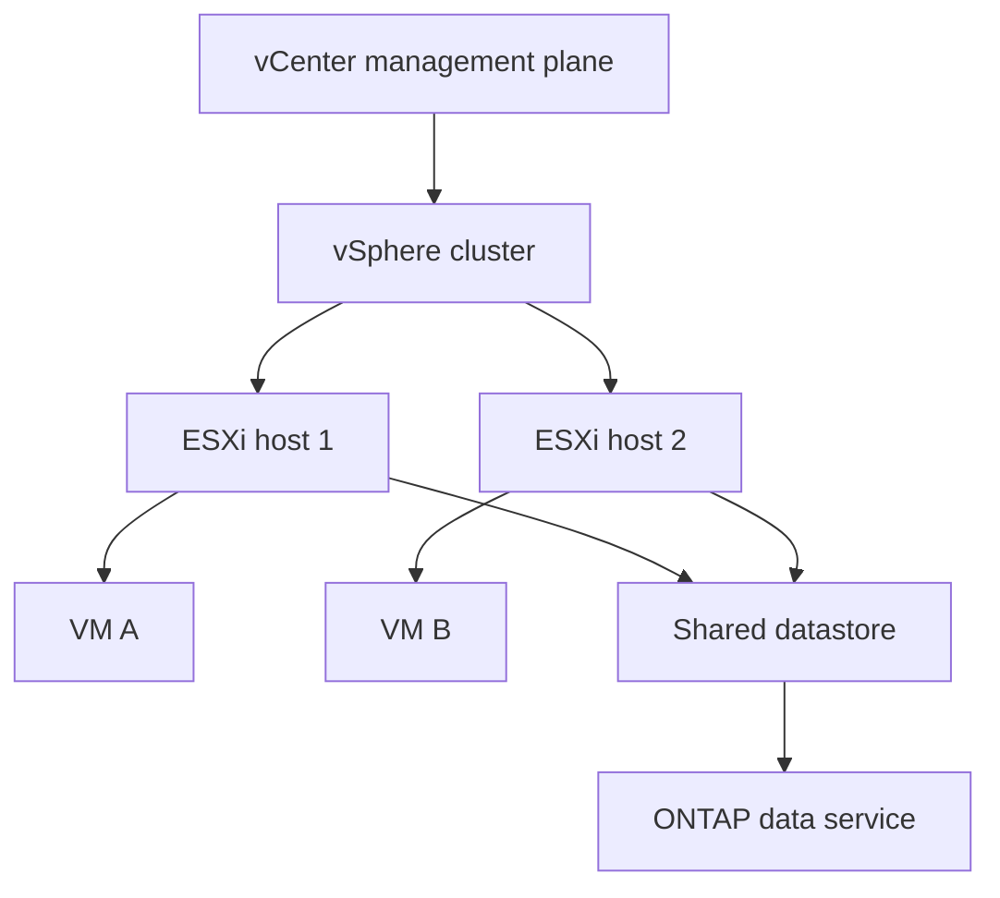

### 🔍 Plain-English deep-dive: control plane and data plane

vCenter is like air-traffic control: it manages inventory and placement, but it is not in every aircraft's engine path. VM storage I/O normally travels from ESXi through the storage network to ONTAP, not through vCenter. A vCenter outage can impair management while existing VM I/O continues; always separate control-plane and data-plane symptoms.

## 2. VM I/O path and ownership boundaries

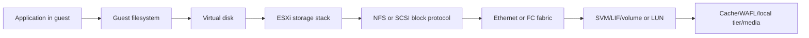

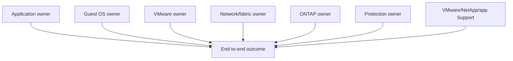

A storage latency graph is one interface, not the full transaction. Preserve matching VM, virtual disk/datastore, host/path, ONTAP object, operation and UTC interval.

## 3. Datastore design choices

| Choice | Storage semantics | ESXi sees | ONTAP object | Key ownership |
|---|---|---|---|---|
| NFS datastore | File protocol | Remote NFS filesystem/datastore | NAS volume/export/path | ONTAP serves filesystem |
| VMFS on iSCSI | SCSI block over IP | Multipathed LUN formatted VMFS | LUN/igroup/map | ESXi cluster owns VMFS |
| VMFS on FC | SCSI block over FC | Multipathed LUN formatted VMFS | LUN/igroup/map | ESXi cluster owns VMFS |
| VVols | Policy/object-oriented VMware storage model | Protocol endpoint and storage container abstractions | Vendor-provider-managed storage objects | Policy/provider integration |

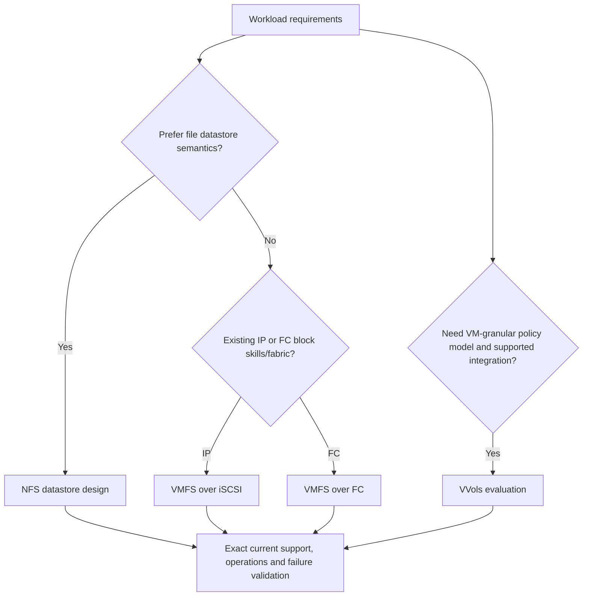

There is no universally best protocol. Existing skills, application support, networking/fabrics, scale, operations, recovery, policy, migration, cost and exact supportability decide.

## 4. NFS datastores on ONTAP

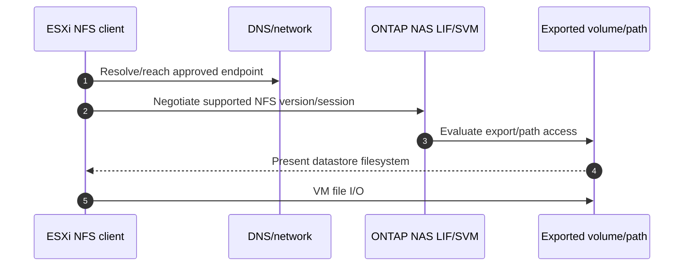

Discover exact NFS version, ESXi vmkernel interfaces/routes, data LIFs, export policy/client matching, junction/path, volume, datastore identity, host mounting consistency, locking/session state, DNS/time, MTU and redundant network design.

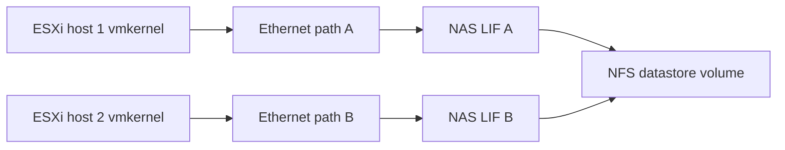

Do not assume generic block MPIO concepts map directly to NFS; validate the exact VMware/ONTAP NFS version and supported path/session design.

## 5. VMFS over iSCSI or Fibre Channel

**Virtual Machine File System (VMFS)** is VMware's clustered filesystem on a block device. The ESXi cluster, not ONTAP, owns VMFS metadata.

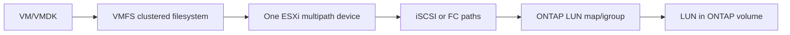

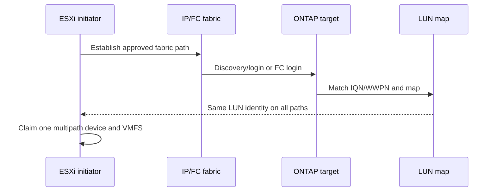

### 🔍 Plain-English deep-dive: VMFS belongs to the hosts

ONTAP supplies blocks, like a landlord supplies a locked warehouse floor. ESXi builds and coordinates the VMFS shelving. Taking a storage snapshot preserves blocks but does not make ONTAP understand every in-guest transaction or VMFS coordination event. Host/application-aware protection and supported orchestration matter.

## 6. Multipathing and path selection

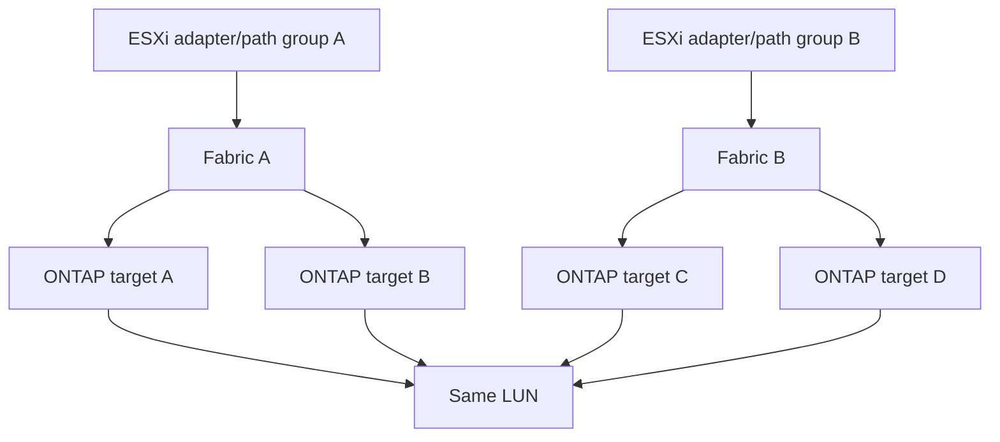

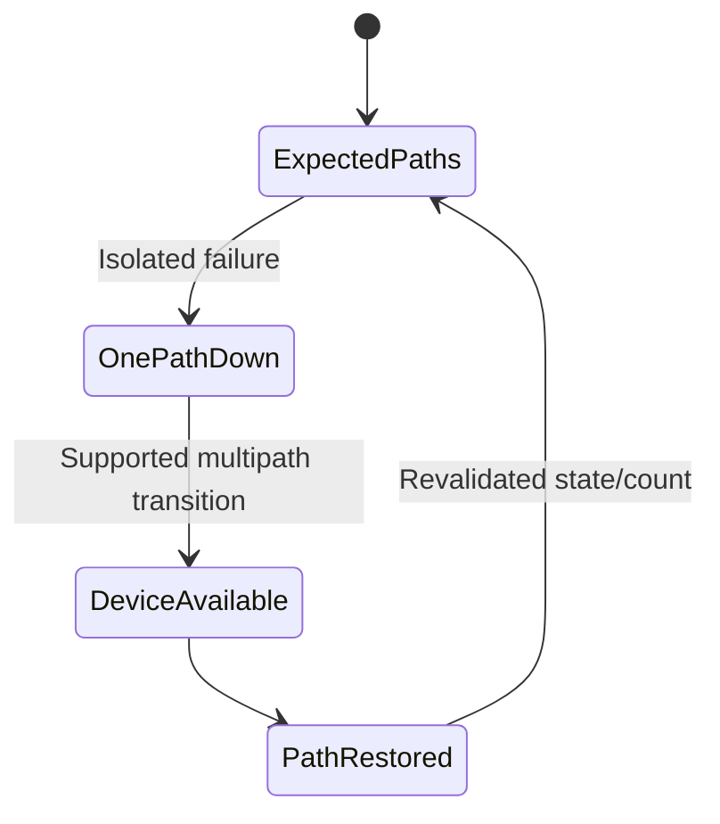

Validate exact VMware Native Multipathing Plugin/path selection plug-in, ALUA/SATP/PSP concepts, adapters, drivers, firmware, switch and ONTAP recipe through current IMT/VMware docs. Do not prescribe one universal policy or timeout.

## 7. VAAI concepts and offload proof

**vStorage APIs for Array Integration (VAAI)** are APIs/primitives that can offload supported storage operations from ESXi to an array. File and block integrations expose different primitives and requirements; naming and support change by release.

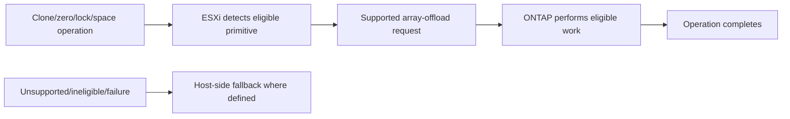

An offload-capable design does not prove a specific operation was offloaded. Verify capability, eligibility, observed counters/events and outcome for the exact release/protocol.

## 8. VVols broad architecture

**VMware vSphere Virtual Volumes (VVols)** are a storage integration model that exposes VM-granular storage objects and policy rather than making every VM merely files inside one conventional datastore/LUN.

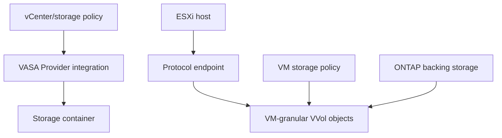

- **VASA Provider:** vendor integration that advertises capabilities and coordinates policy/object operations.
- **Storage container:** logical pool exposed for policy-based consumption.
- **Protocol endpoint:** I/O access point, not necessarily one conventional per-VM LUN.
- **Storage policy-based management:** matches requested policy to advertised capabilities.

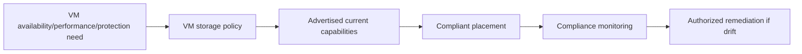

Do not assume all features, protocols, migrations or protections behave identically across conventional datastores and VVols; verify current product and interoperability docs.

## 9. Current NetApp integrations and naming discipline

As checked on **2026-08-24**, official NetApp documentation uses **ONTAP tools for VMware vSphere** for the integration suite and **SnapCenter Plug-in for VMware vSphere** for VM/datastore protection workflows. Exact release, deployment architecture, licensing, VMware compatibility, features and previous-name migration must be rechecked.

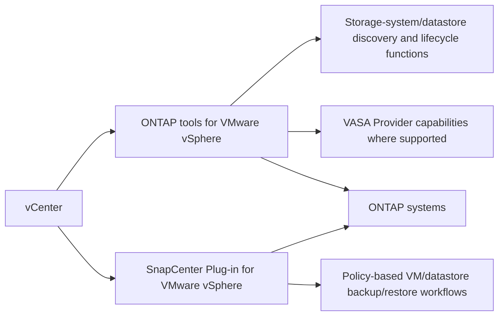

Never say `the plugin guarantees consistency` or infer capability from a remembered product name. State exact release, integration, application-consistency method, current documentation and validation evidence.

## 10. VM snapshots, ONTAP snapshots, backup, and recovery

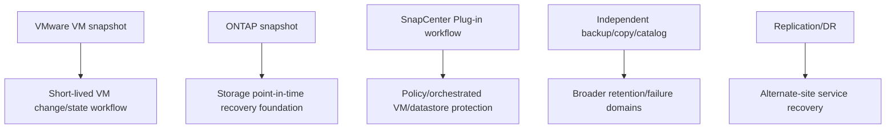

Long-lived VM snapshots can affect operation/capacity and are not automatically backups. An ONTAP snapshot alone may be crash-consistent at storage level. Prove exact VM/application point, dependencies, restore path, RPO/RTO, checksum/application transaction and rollback.

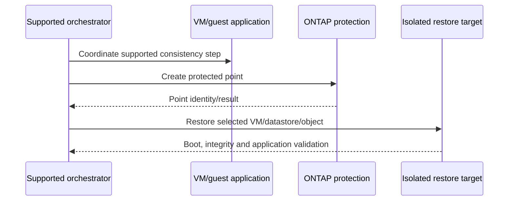

### 🔍 Plain-English deep-dive: a snapshot is a time marker, not a recovery certificate

A photograph proves how a room looked from one angle at one instant; it does not prove the building can reopen after a fire. Recovery proof needs all VM disks/configuration, guest/application consistency, identity/network dependencies, boot order, data integrity, timed restore and owner acceptance.

## 11. Storage policy, placement, and compliance

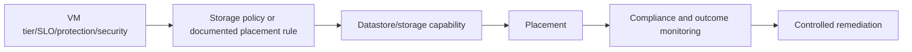

Policy labels are promises only when backed by current capability, measured behavior and governance. Define who owns policy, what noncompliance means, how drift is detected, and whether automatic remediation is authorized.

## 12. Compatibility and lifecycle gate

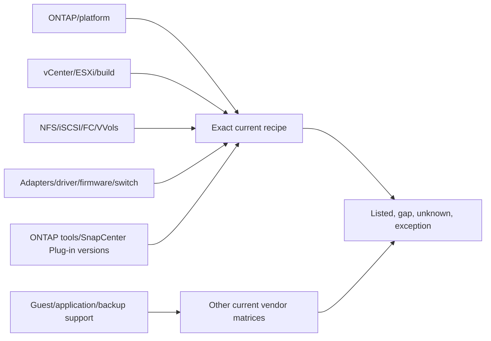

Record ESXi/vCenter build, edition/licensing where relevant, ONTAP/platform, datastore/protocol, adapter/driver/firmware, switch, host utilities, plugin/provider versions, VM hardware/tools where relevant, application and backup integrations, matrix result/notes/date and lifecycle horizons. `It works` is not a supportability conclusion.

## 13. Performance and capacity reasoning

### 🔍 Plain-English deep-dive: virtualization scope is a diagnostic fingerprint

If one VM is slow, begin with its guest, application and virtual-disk path; if many VMs on one host are slow, inspect host/adapters/queues; if many hosts using one datastore are slow, inspect that datastore's shared network and ONTAP objects. It is like seeing which rooms lost power to infer whether the fault is a lamp, a circuit or the building supply. Scope prioritizes hypotheses but still needs evidence.


Correlate workload read/write mix, I/O size, burst/concurrency, VM/host contention, datastore demand, path states, network loss/MTU, ONTAP latency/service centers, capacity/snapshot growth and competing workload. Use matching percentiles and UTC; averages can hide a few affected VMs.

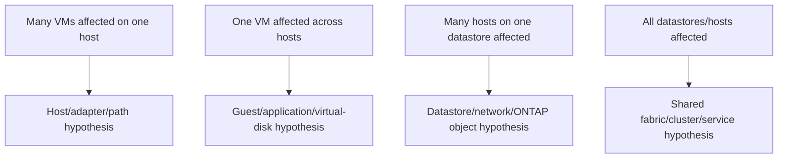

## 14. Failure domains and availability

```mermaid
flowchart TB
    VM[VM/application] --> HOST[ESXi host]
    HOST --> CLUSTER[vSphere cluster/control dependencies]
    HOST --> ADAPTER[Adapters/vmkernel]
    ADAPTER --> SWITCH[Ethernet/FC switches]
    SWITCH --> LIF[ONTAP LIF/target ports]
    LIF --> NODE[ONTAP nodes/HA]
    NODE --> TIER[Storage/media]
    VM --> DNS[DNS/identity/management dependencies]
```

Redundant paths that share one switch, VLAN gateway, adapter, power source or configuration can fail together. Map physical and administrative common fate, not just line count.

## 15. Troubleshooting workflow

```mermaid
flowchart TD
    SYM[Exact VM/app symptom] --> SCOPE[Affected VMs/hosts/datastores/paths/time]
    SCOPE --> CTRL[Healthy comparison]
    CTRL --> GUEST{Guest/app boundary healthy?}
    GUEST -->|No| GA[Guest/application hypothesis]
    GUEST -->|Yes| HOST{ESXi/virtual disk/datastore healthy?}
    HOST -->|No| HV[Host/VMware hypothesis]
    HOST -->|Yes| PATH{Protocol/network/fabric paths healthy?}
    PATH -->|No| NET[Network/fabric/multipath hypothesis]
    PATH -->|Yes| STORE{ONTAP object/service healthy?}
    STORE -->|No| ON[ONTAP/capacity/performance hypothesis]
    STORE -->|Yes| INT[Integration/backup/policy/current support hypothesis]
```

```mermaid
timeline
    title Correlated synthetic incident timeline
    14:00 : ESXi path state changes
    14:00:02 : Datastore latency rises
    14:00:04 : VM guest I/O wait rises
    14:00:08 : Application p99 misses SLO
    14:03 : Path recovers; app validation follows
```

Evidence: VM/app transaction, guest metrics/logs, ESXi/vCenter events, datastore/device/path state, vmkernel/network/fabric evidence, exact ONTAP SVM/volume/LUN counters/events, integrations, versions, changes and support recipe. Do not blame storage from datastore latency alone.

## 16. Fully synthetic sanitized scenario: Northstar vSphere service

**Environment:** synthetic three-host cluster, eight VMs, NFS datastore `ds-research-nfs` and VMFS/iSCSI datastore `ds-db-vmfs`. **Issue:** two database VMs show p99 latency after maintenance; one iSCSI path is down on host `esx-02`, while NFS VMs are unaffected.

```mermaid
flowchart TB
    VC[nrc-vc01] --> C[cluster-a]
    C --> E1[esx-01]
    C --> E2[esx-02]
    C --> E3[esx-03]
    E1 --> NFS[ds-research-nfs]
    E2 --> NFS
    E3 --> NFS
    E1 --> VMFS[ds-db-vmfs / iSCSI]
    E2 --> VMFS
    E3 --> VMFS
    NFS --> ON[ONTAP synthetic NAS volume]
    VMFS --> OL[ONTAP synthetic LUN]
```

| Hypothesis | Prediction | Synthetic result |
|---|---|---|
| ONTAP-wide latency | NFS and all hosts affected | Weakened: NFS controls healthy |
| Host `esx-02` path degradation | VMs on that host/device show path event first | Supported |
| Guest database lock | Persists after migration/control | Weakened in scenario |
| Plugin/backup snapshot | Correlates to snapshot task and all scoped VMs | No matching task |
| Unsupported mixed adapter state | Changed host recipe differs from peers | Unknown until current IMT review |

```mermaid
flowchart LR
    EVENT[esx-02 path event] --> DEVICE[VMFS device reduced paths]
    DEVICE --> DS[Datastore tail latency]
    DS --> VM[Two DB VM guest wait]
    VM --> APP[Application p99]
    RECIPE[Current IMT/driver/firmware check] --> DEC[Hold further rollout]
```

**Recommendation:** preserve service, stop rollout of the changed host adapter stack, validate exact current recipe, repair through qualified host/fabric/storage owners, test one-path failure/recovery in an approved window, and measure app plus datastore outcomes. No product defect or guarantee is claimed.

**Honest interview language:** `I completed a fully synthetic vSphere-on-ONTAP case. I mapped VM-to-storage paths, distinguished NFS from VMFS ownership, correlated a host path event with application tail latency, and gated remediation on the exact current recipe. I have not operated production VMware on NetApp.`

## 17. Evidence, privacy, and current-source record

```mermaid
flowchart LR
    VM[VM/app evidence] --> UTC[Common UTC/object IDs]
    ESX[ESXi/vCenter/datastore/path] --> UTC
    NET[Network/fabric] --> UTC
    ONTAP[ONTAP objects/counters/events] --> UTC
    TOOL[Integration/backup/policy] --> UTC
    UTC --> FIND[Bounded finding and alternatives]
    FIND --> SAN[Tokenized portfolio artifact]
```

Record exact object relationships, versions/builds, definitions, population, interval, changes, healthy controls, support sources/notes/date, access class, reviewer and limitation. Delete temporary exports/accounts/snapshots/test VMs and chargeable resources through authorization; no licensing or cost promise is made.

## 18. JD Mapping and Arti tie

```mermaid
flowchart LR
    AZ[Azure/VM fundamentals] --> HV[Hypervisor/guest/control-plane reasoning]
    NET[Windows/networking] --> PATH[Protocol/path isolation]
    CRIT[Escalation/CRITSIT] --> EVID[Cross-vendor timeline and ownership]
    DATA[Analytics] --> PERF[Scope and percentile correlation]
    HV --> TAM[Virtualization TAM capability]
    PATH --> TAM
    EVID --> TAM
    PERF --> TAM
```

| JD need | Evidence from this Part |
|---|---|
| Virtualization depth | ESXi/vCenter/VM/datastore/I/O architecture |
| Strategic advice | Requirements-based NFS/VMFS/VVols choice |
| Supportability | Exact matrix and lifecycle record |
| Stability | Failure-domain and path controls |
| Troubleshooting | Guest-to-ONTAP evidence chain |
| Service review | Policy, protection, risk and action summary |

## 19. Official and Public Source Anchors

**Date checked: 2026-08-24.** Product names and pages must be rechecked at use time. These sources do not establish licensing, a live supported recipe, performance, compatibility, or recovery guarantee.

| Topic | Official source | Bounded use |
|---|---|---|
| NetApp VMware solutions | [NetApp VMware solutions documentation](https://docs.netapp.com/us-en/netapp-solutions-virtualization/vmware/index.html) | Architecture/solution navigation |
| ONTAP tools | [ONTAP tools for VMware vSphere documentation](https://docs.netapp.com/us-en/ontap-tools-vmware-vsphere/) | Current product naming, releases and tasks |
| SnapCenter VMware plug-in | [SnapCenter Plug-in for VMware vSphere](https://docs.netapp.com/us-en/sc-plugin-vmware-vsphere/) | Current protection integration navigation |
| ONTAP NFS | [ONTAP NFS management](https://docs.netapp.com/us-en/ontap/nfs-admin/) | NFS service concepts |
| ONTAP SAN | [ONTAP SAN hosts](https://docs.netapp.com/us-en/ontap-sanhost/) | ESXi host/SAN navigation |
| IMT | [NetApp Interoperability Matrix Tool](https://imt.netapp.com/) | Authorized exact solution validation |
| VMware vSphere | [VMware vSphere documentation](https://techdocs.broadcom.com/us/en/vmware-cis/vsphere.html) | Current VMware product documentation entry |
| VMware storage | [vSphere storage documentation](https://techdocs.broadcom.com/us/en/vmware-cis/vsphere/vsphere/8-0/vsphere-storage-8-0.html) | Datastore, multipathing, VAAI/VVol concepts; verify current release |

## 20. Self-Test and Teach-Back

1. Draw the VM application-to-ONTAP path and name every owner.
2. Compare NFS datastore, VMFS/iSCSI, VMFS/FC and VVols.
3. Explain why vCenter can fail without being in the data path.
4. Explain VMFS ownership and why unknown LUN actions are dangerous.
5. Describe VAAI as a capability and how to prove actual offload.
6. Draw VASA/storage-container/protocol-endpoint/policy relationships.
7. Build a complete vSphere-NetApp compatibility record.
8. Troubleshoot the Northstar path case with competing hypotheses.
9. Define protection proof beyond a green snapshot job.
10. Deliver the exact nonclaim and current-source caveat.

---

## Likely Interview Questions

### Q1. How does a VM I/O reach ONTAP?

> **Model answer:** `The application writes through the guest filesystem and virtual disk, ESXi storage stack and datastore layer, then NFS or a SCSI block path over Ethernet/FC to an ONTAP SVM/LIF and volume or LUN, through WAFL/cache/storage. I correlate the same VM, virtual disk/datastore, host/path, ONTAP object, operation and UTC interval.`

### Q2. How do NFS and VMFS datastores differ?

> **Model answer:** `With NFS, ONTAP serves a file filesystem and ESXi stores VM files through NFS. With VMFS, ONTAP presents a multipathed block LUN and ESXi owns the VMFS clustered filesystem. That changes identity, access, path, locking, snapshot and troubleshooting ownership; neither protocol is universally better.`

### Q3. What are VAAI and VVols?

> **Model answer:** `VAAI is a set of supported array-integration primitives that can offload eligible operations; I prove capability and actual use. VVols is a policy/object integration model using a VASA Provider, storage containers and protocol endpoints to manage VM-granular storage objects. Exact features and support are version-dependent.`

### Q4. What NetApp tools integrate with vSphere?

> **Model answer:** `Current official naming must be checked. As of my 2026-08-24 source review, ONTAP tools for VMware vSphere provides storage and VASA-related integration capabilities by release, and SnapCenter Plug-in for VMware vSphere provides policy-based VM/datastore protection workflows. I would validate exact VMware/ONTAP/tool versions, licensing, features and release notes.`

### Q5. How do you validate vSphere storage multipathing?

> **Model answer:** `I verify the exact IMT/VMware recipe, then prove every presentation has the same LUN identity, one ESXi multipath device, expected adapters/fabrics/targets and supported path states/policy. An approved one-path test measures device, datastore, VM and application behavior, recovery and checksum, not just a green path icon.`

### Q6. How do you troubleshoot VM latency blamed on storage?

> **Model answer:** `I scope affected VMs, hosts, datastores, paths and time; compare healthy controls; correlate guest/app queue, virtual disk/ESXi/datastore, network/fabric and exact ONTAP object counters/events with changes. I find the first failed interface and test alternatives such as host contention, path loss, snapshot task, capacity or ONTAP service center.`

### Q7. What proves VM recoverability?

> **Model answer:** `The correct VM disks/configuration and application-consistent point, required identity/network dependencies, supported restore workflow, isolated boot, data integrity and application transactions, measured RPO/RTO, owner acceptance, cleanup and residual risk. A successful VM or ONTAP snapshot alone is not sufficient.`

### Q8. What is your experience boundary?

> **Model answer:** `Azure/VM, Windows/networking, Microsoft escalation, analytics and change coordination transfer to virtualization reasoning. I have not operated production VMware on NetApp or the integrations. The scenario is synthetic, and live advice requires current NetApp/VMware docs, IMT and qualified owners.`

---

## 30-Second Memory Hooks

- **vCenter/ESXi:** air-traffic control versus aircraft engine path.
- **VM path:** app -> guest -> virtual disk -> ESXi -> datastore/protocol -> ONTAP.
- **NFS:** ONTAP owns filesystem; **VMFS:** ESXi owns filesystem.
- **MPIO:** same LUN identity, one device, many paths.
- **VAAI:** eligible operation offload; prove actual use.
- **VVols:** VASA + container + protocol endpoint + VM policy objects.
- **Tools:** verify ONTAP tools and SnapCenter plug-in current naming/releases.
- **Snapshot:** time marker, not recovery certificate.
- **Scope:** VM, host, datastore and ONTAP object must align.
- **Support:** exact recipe, notes and date.

---

## Completion Checklist

- [ ] State all five safety labels and the exact no-production-NetApp boundary.
- [ ] Explain ESXi, vCenter, VM, cluster, datastore and VMDK from zero.
- [ ] Draw control and data planes plus end-to-end VM I/O.
- [ ] Compare NFS, VMFS/iSCSI, VMFS/FC and broad VVols tradeoffs.
- [ ] Explain multipathing/ALUA and validate exact current recipe.
- [ ] Explain VAAI capability versus observed offload.
- [ ] Use current ONTAP tools and SnapCenter Plug-in naming with release caveat.
- [ ] Separate VM, ONTAP and orchestrated backup/protection semantics.
- [ ] Cover storage policy, compliance, performance, capacity and failure domains.
- [ ] Build a full compatibility/lifecycle record with no product guarantee.
- [ ] Troubleshoot from guest/app through host/path to exact ONTAP object.
- [ ] Complete the fully synthetic scenario and honest portfolio statement.
- [ ] Protect evidence, access, privacy, cleanup and cost boundaries.
- [ ] Recheck official sources dated 2026-08-24 before live conclusions.
- [ ] Answer exact Q1-Q8 aloud and complete every self-test.

---

*Next suggested section:* [Part 88 - Kubernetes, Containers, Trident, and Application-Aware Data Management](Part-88-kubernetes-trident-data-management.md)