# Part 88 - Kubernetes, Containers, Trident, and Application-Aware Data Management

> **Section goal:** Explain how Kubernetes turns an application's storage request into a persistent volume through the Container Storage Interface and NetApp Trident, then reason about access modes, volume modes, snapshots, clones, application-aware protection, RBAC, secrets, networking, supportability, failure domains, and troubleshooting. By the end, Arti can trace a Pending pod or claim across Kubernetes, CSI, Trident, ONTAP, node and application layers.

Covers index item **88** and maps to job-description requirements for container and storage depth, customer-environment discovery, new-technology learning, supportability/risk analysis, proactive recommendations, complex troubleshooting, cross-functional work, and technical communication.

**Privacy and access boundary:** Cluster identities, namespaces, secrets, manifests, backends, application data, logs, and support records require authorization, least privilege, and approved handling.

**Synthetic-evidence rule:** Every cluster, namespace, pod, PVC, PV, backend, result, failure, and recommendation below is fictional and sanitized unless explicitly sourced as a public concept.

**Version caveat:** Kubernetes, CSI, Trident, ONTAP, API, feature, compatibility, and lifecycle behavior changes; complete current-doc and supportability checks before customer use.

**Explicit nonclaim:** Arti has not deployed, administered, upgraded, protected, or troubleshot a production Kubernetes cluster, Trident installation, ONTAP backend, persistent workload, or Trident protect workflow. This Part does not establish Kubernetes or NetApp production experience.

**Privacy/access:** Kubernetes and storage evidence can expose cluster names, namespaces, service accounts, tokens, secrets, registry data, node addresses, application names, PVC/PV/backend identifiers, credentials, snapshots, manifests, logs, and business topology. Use least privilege, minimum fields, approved repositories, secret redaction, encryption, retention, and no kubeconfigs, bearer tokens, backend credentials, customer YAML, or support bundles in portfolios or unapproved AI tools.

**Synthetic-evidence:** Every cluster, namespace, node, pod, StatefulSet, StorageClass, PVC, PV, CSI object, Trident backend, ONTAP object, snapshot, protection job, event, metric, fault, and outcome below is fictional and sanitized. No YAML/table is live Kubernetes, Trident, ONTAP, or customer output.

**Version/current-doc:** Kubernetes, CSI, snapshot APIs, access/volume modes, sidecars, Trident releases, product names, backend drivers, support matrices, operator/Helm procedures, Trident protect capabilities, ONTAP features, commands and defaults change. Sources were checked **2026-08-24**. Verify exact current Kubernetes distribution/version, Trident release, ONTAP/platform, protocol and application support before use.

This Part is conceptual and scenario-based, not a production manifest set, credential/configuration recipe, support declaration, backup guarantee, or capacity/performance promise.

> **No-production-NetApp boundary:** Arti's factual strengths are Azure/VM/cloud fundamentals, Microsoft enterprise support, networking/identity troubleshooting, analytics, incident coordination, AI workload awareness, and customer communication. Her exact nonclaim is: **she has not operated production Kubernetes or Trident on NetApp.** She may explain the architecture and fully synthetic case while stating how she would validate a live environment.

---

## 1. Containers and Kubernetes from zero

A **container** packages an application process and dependencies while sharing a host kernel. A **container image** is the immutable template; a running **container** is an instance. Kubernetes is an orchestration system that continually tries to make actual cluster state match declared desired state.

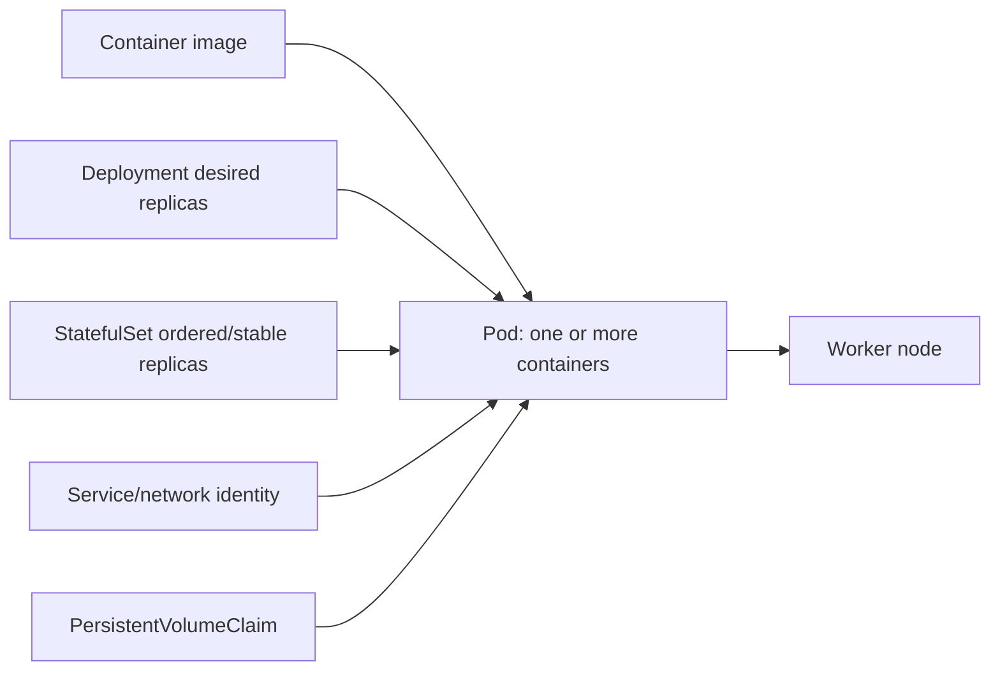

- **Control plane:** API and controllers that store/drive desired state.
- **Worker node:** machine that runs pods through kubelet and a container runtime.
- **Pod:** smallest scheduled unit.
- **Deployment:** controller for interchangeable replicas.
- **StatefulSet:** controller for workloads needing stable identity/order and often persistent storage.

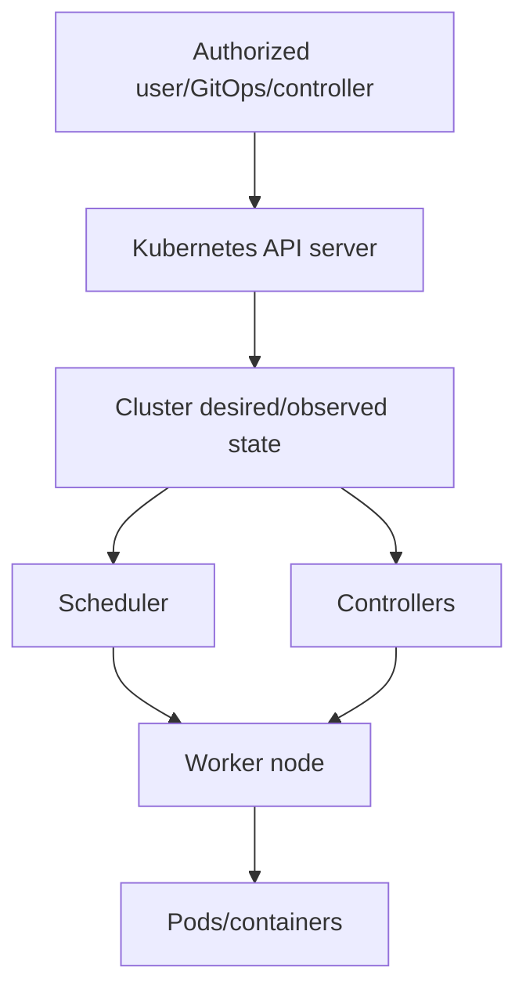

### 🔍 Plain-English deep-dive: reconciliation is a thermostat, not a one-time script

You set a thermostat to 21 degrees; it repeatedly observes and acts when room temperature differs. Kubernetes controllers similarly reconcile desired and actual state. A YAML object being accepted means the request exists, not that storage, networking, scheduling or application readiness has succeeded.

## 2. Stateless versus stateful workloads

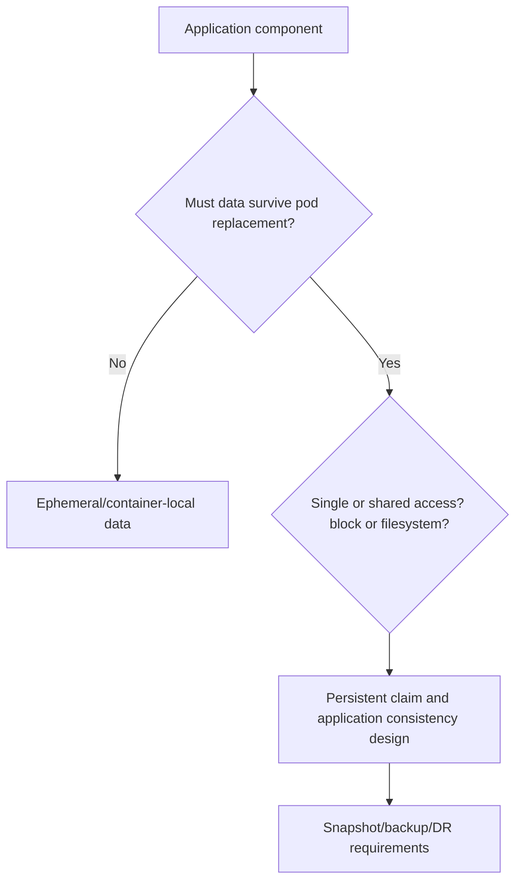

State is broader than volume bytes: database logs, configuration, identity, secrets, external queues, object stores, DNS and startup order may be required. A persistent volume keeps data across pod recreation; it does not automatically make the application highly available or recoverable.

## 3. CSI architecture

The **Container Storage Interface (CSI)** is a standard interface between container orchestrators and storage drivers. Kubernetes requests lifecycle operations; a CSI driver implements supported storage behavior.

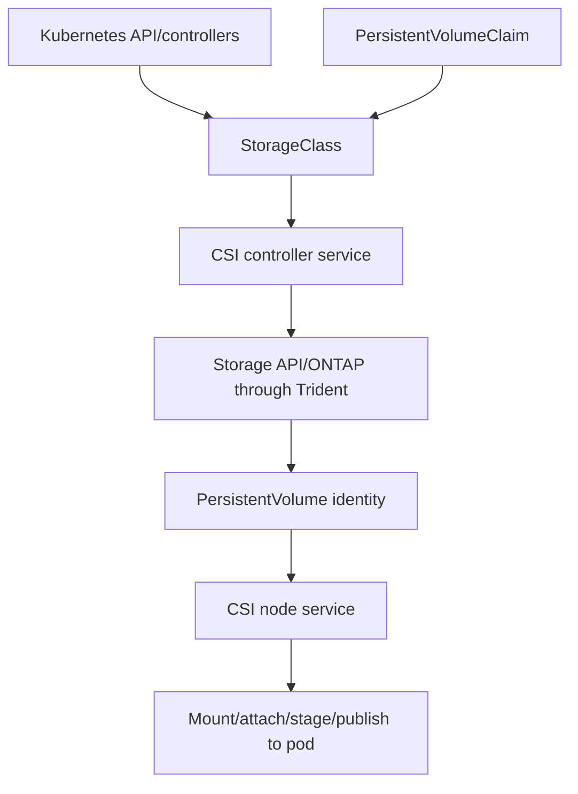

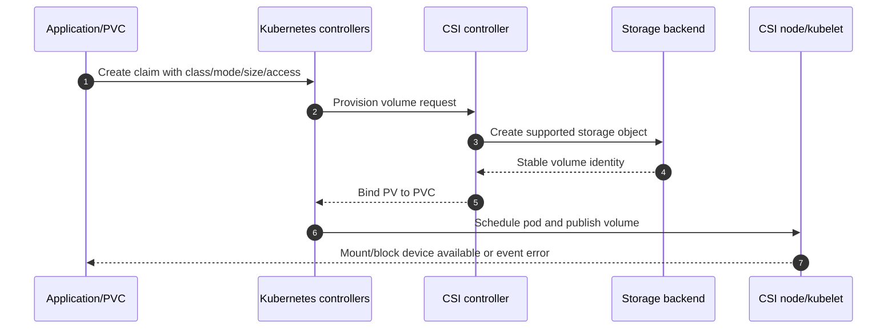

### 🔍 Plain-English deep-dive: Kubernetes object success and storage success are different checkpoints

A restaurant can accept an order, assign a ticket and still fail to cook or deliver it. A PVC can exist while provisioning, binding, scheduling, attachment, mount, permissions or the application fails. Read events and identities at each checkpoint rather than treating `kubectl apply` as completion.

## 4. StorageClass, PVC, PV, and binding

- **StorageClass:** named provisioning policy and parameters, like a catalog tier.
- **PersistentVolumeClaim (PVC):** application/namespace request for storage.
- **PersistentVolume (PV):** cluster object representing actual provisioned storage.
- **Binding:** one PVC and one PV become associated under matching rules.
- **Dynamic provisioning:** driver creates storage in response to a claim.
- **Static provisioning:** administrator pre-creates a PV/object.

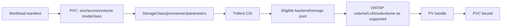

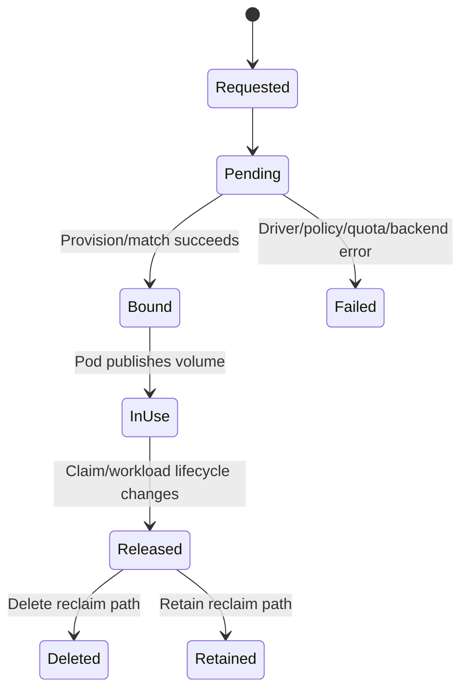

## 5. Access modes, volume modes, and reclaim policy

| Concept | Plain meaning | Caveat |
|---|---|---|
| ReadWriteOnce | Read-write mounted by one node under Kubernetes semantics | Not a universal single-pod lock |
| ReadOnlyMany | Read-only by many nodes | Protocol/backend/application must support it |
| ReadWriteMany | Read-write by many nodes | Shared filesystem semantics and app locking matter |
| ReadWriteOncePod | Read-write constrained to one pod where supported | Version/driver requirements apply |
| Filesystem mode | Node mounts a filesystem | Filesystem/permissions/identity matter |
| Block mode | Raw block device to pod | Application owns formatting/coordination |
| Delete reclaim | Backend object deleted with lifecycle under policy | Data-loss risk if misunderstood |
| Retain reclaim | Object remains for manual handling | Orphan/cost/privacy risk |

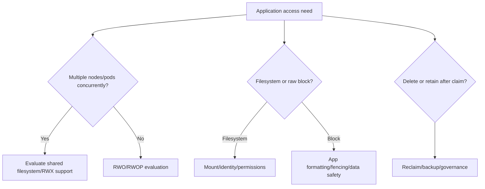

## 6. Dynamic provisioning and topology-aware placement

### 🔍 Plain-English deep-dive: deleting a claim is a policy decision about data

A reclaim policy is like the instruction attached to a rented storage locker after the renter leaves: empty and destroy it, or retain it for a named owner to inspect. `Delete` can remove backend data according to the supported lifecycle; `Retain` can leave sensitive, chargeable or orphaned storage. Test the exact policy and ownership flow with generated data before allowing application teams to treat PVC deletion as routine cleanup.

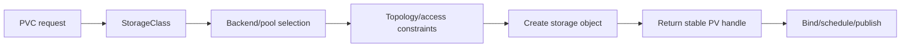

Scheduling and volume topology can interact: a pod may require a node/location that can reach the provisioned volume. `WaitForFirstConsumer`-style binding concepts, topology labels and backend reachability are version/design-specific; verify current Kubernetes and Trident docs.

## 7. Trident architecture and current naming

As checked **2026-08-24**, current official documentation uses **Trident** for NetApp's CSI storage orchestrator. Older materials may use **Astra Trident**; do not assume names, repositories or procedures are interchangeable. Current official documentation also describes **Trident protect** for application-aware data-management workflows. Recheck release, support, licensing/entitlement and naming.

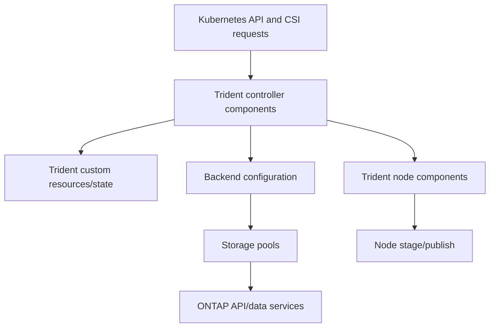

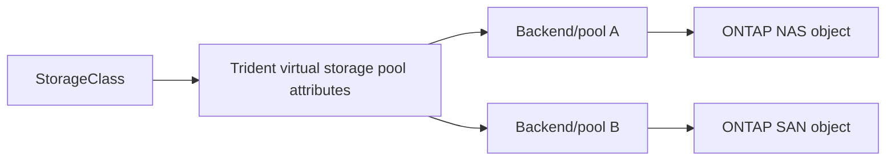

**Backend:** Trident's connection/configuration describing an eligible storage system and driver. **Storage pool:** selectable capacity/capability within a backend. **Driver:** protocol/storage implementation with release-specific behavior. Never paste backend credentials into Git; use current secret-handling guidance.

## 8. Backend and protocol selection

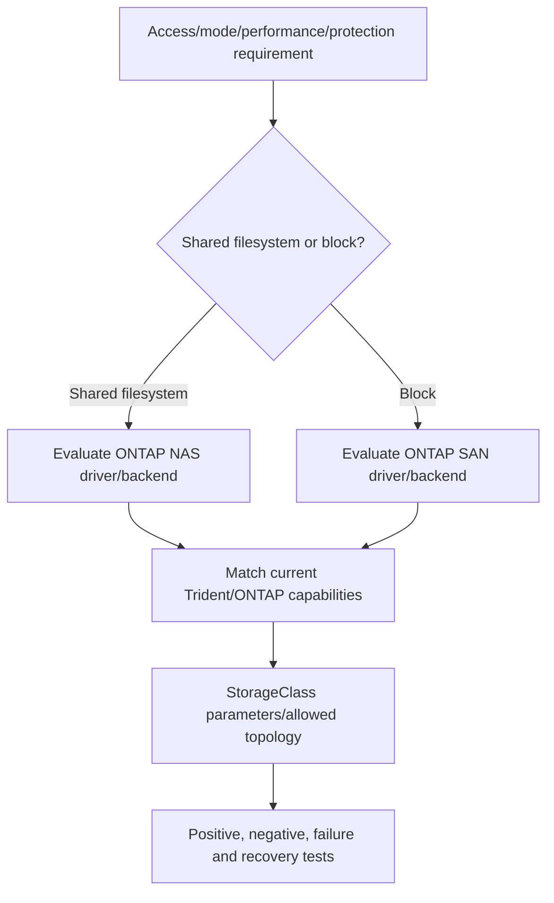

Selection must include Kubernetes distribution/version, Trident/CSI release, ONTAP/platform/release, protocol, network, node OS/kernel, multipath for block, filesystem/mount behavior, access modes, snapshot/cloning, encryption/security, application and exact support matrices.

## 9. Snapshots and clones

CSI **VolumeSnapshot** resources coordinate driver-supported point-in-time operations. A clone creates a new volume from a supported source/point. Exact classes, APIs, consistency, topology, size, access and retention vary.

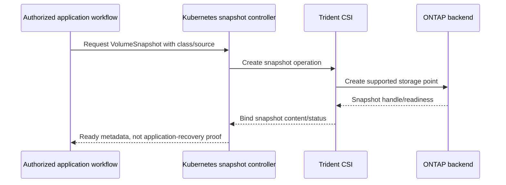

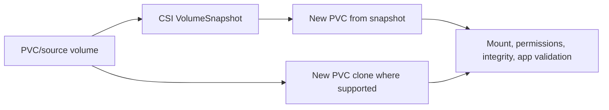

### 🔍 Plain-English deep-dive: a volume snapshot sees storage, not the whole application

A distributed application may have several PVCs plus database logs, object data, queues, secrets and external services. Photographing one cupboard does not capture the whole kitchen at a coordinated instant. Application-aware protection must define consistency, component grouping, hooks/orchestration, ordering and restore validation.

## 10. Application-aware protection and Trident protect concepts

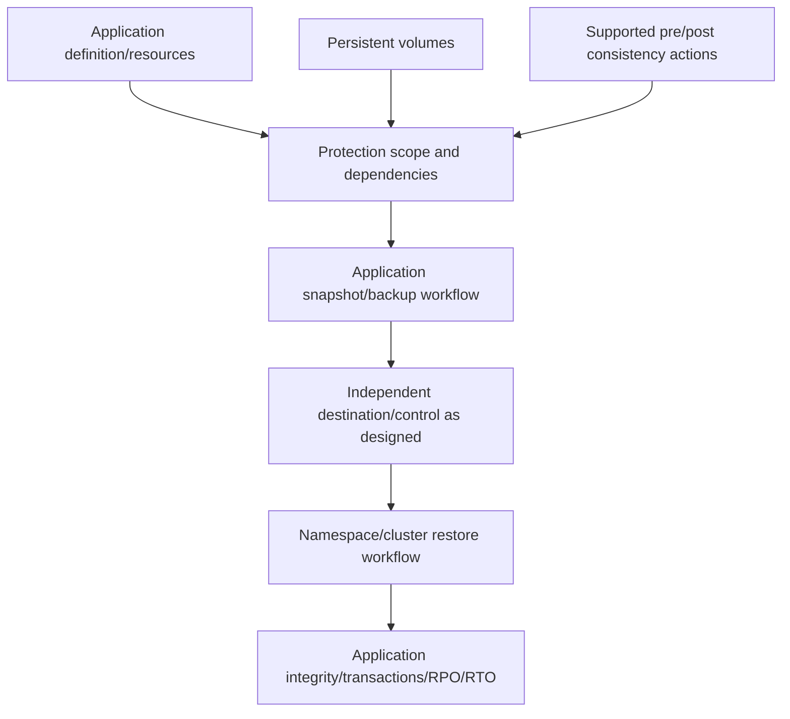

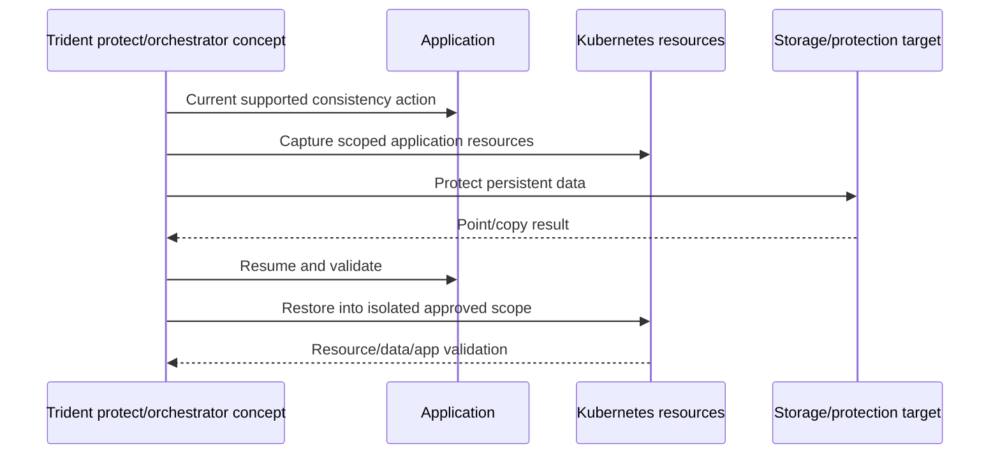

Do not claim Trident protect supports a workflow, application, target or cross-cluster operation without exact current documentation and support evidence. A green job is not recovery proof.

## 11. RBAC, service accounts, secrets, and tenancy

**Role-based access control (RBAC)** grants verbs on Kubernetes resource scopes. A **service account** is an in-cluster workload identity. A Kubernetes **Secret** is an API object requiring encryption/access controls; base64 encoding is not encryption.

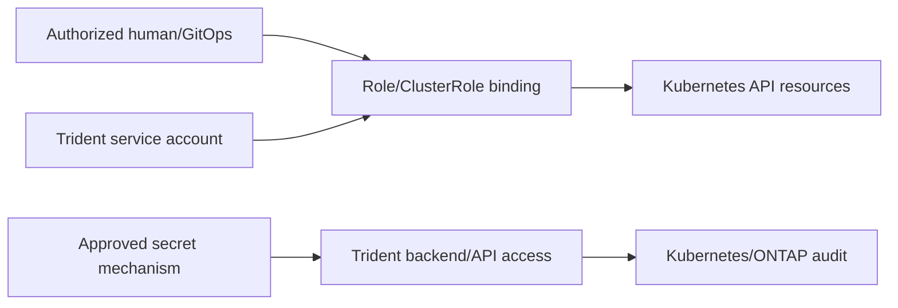

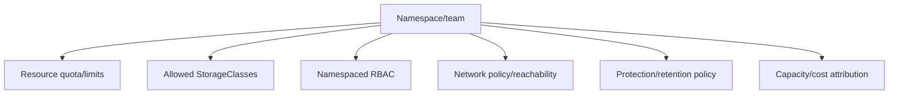

Use least privilege, restricted backend access, secret rotation, audit, network segmentation, quota, admission/policy controls and separated protection authority. Never put kubeconfig/backend secrets in manifests shown publicly.

## 12. Network and node data path

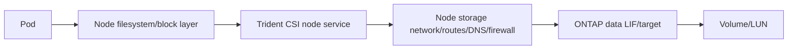

For NAS, node network/mount/identity semantics matter. For SAN, supported initiator, multipath, device identity and node packages matter. Control-plane access to ONTAP for provisioning and data-plane access from nodes to storage are different paths.

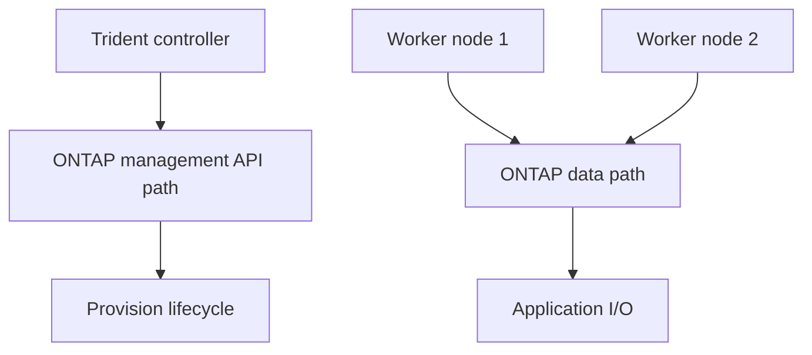

## 13. Failure domains and lifecycle

```mermaid
flowchart TB
    APP[Application/pod/controller] --> KAPI[Kubernetes API/controllers]
    APP --> NODE[Worker node/kubelet/runtime]
    KAPI --> TRIDENT[Trident controller/CRDs]
    NODE --> CSINODE[Trident CSI node]
    TRIDENT --> MGMT[ONTAP management path]
    CSINODE --> DATA[Storage data path]
    DATA --> ONTAP[ONTAP/SVM/LIF/object]
    APP --> EXT[DNS/identity/external services]
```

Plan version skew and lifecycle across Kubernetes distribution, CSI snapshot components, Trident, ONTAP, node OS/kernel, protocol packages/multipath, operator/Helm method and application. Upgrade order and compatibility require current support docs; do not assume independent component upgrades are safe.

## 14. Performance, capacity, quota, and observability

```mermaid
flowchart LR
    APP[Application operation] --> POD[Pod/container limits/queues]
    POD --> NODE[Node CPU/memory/I/O/network]
    NODE --> PROTO[Filesystem/block/multipath]
    PROTO --> NET[Storage network]
    NET --> ONTAP[Volume/LUN/cache/CPU/media]
    ONTAP --> RESULT[Latency/throughput/IOPS]
```

Track requested/provisioned/used capacity separately, thin-provisioning and snapshots, quota and backend headroom, orphan/released volumes, per-workload demand, node saturation, network, ONTAP object metrics and application percentiles. Resource requests/limits and storage capacity are separate schedulers of risk.

## 15. Troubleshooting workflow

```mermaid
flowchart TD
    SYM[Pending PVC/pod or I/O/recovery failure] --> EVENT[Kubernetes object state/events]
    EVENT --> CLASS{Request/policy valid?}
    CLASS -->|No| SPEC[StorageClass/PVC/access/mode/topology/RBAC]
    CLASS -->|Yes| CSI{CSI controller healthy?}
    CSI -->|No| CTRL[Trident controller/sidecar/API]
    CSI -->|Yes| BACK{Backend/pool/capacity/credentials reachable?}
    BACK -->|No| BE[Backend/ONTAP management path]
    BACK -->|Yes| NODE{Scheduled and node publish succeeds?}
    NODE -->|No| NP[Node CSI/network/mount/multipath]
    NODE -->|Yes| APP[Permissions/filesystem/app consistency]
```

```mermaid
flowchart LR
    PVC[PVC UID/class/mode/events] --> PV[PV handle/status]
    PV --> TRI[Trident volume/backend/job identity]
    TRI --> ONTAP[ONTAP volume/LUN stable identity]
    ONTAP --> NODE[Node mount/device]
    NODE --> POD[Pod path/application]
    CLOCK[UTC and versions] --> PVC
    CLOCK --> TRI
    CLOCK --> NODE
```

Common failures: nonexistent/misconfigured class, unsupported access/mode, RBAC denial, controller unavailable, backend offline, invalid/expired secret, quota/capacity, management path failure, data path failure, node package/multipath issue, topology conflict, mount permission, reclaim misunderstanding, snapshot controller mismatch, incomplete app scope or unsupported version combination.

## 16. Fully synthetic sanitized scenario: Pending claim and failed recovery

**Environment:** synthetic Kubernetes cluster `nrc-k8s-a`, three nodes, Trident current-name concept, ONTAP NAS backend, StatefulSet `catalog-db`, PVC `catalog-data`. **Symptom:** PVC remains Pending after a StorageClass edit; a separate snapshot object reports ready but an isolated restored app misses configuration.

```mermaid
flowchart TB
    STS[StatefulSet catalog-db] --> PVC[PVC catalog-data Pending]
    PVC --> SC[StorageClass gold-rwx]
    SC --> TRI[Trident CSI]
    TRI --> BE[ONTAP NAS backend]
    BE --> VOL[Expected volume]
    SNAP[VolumeSnapshot ready] --> REST[Restored data PVC]
    CFG[Missing ConfigMap/secret/dependency] --> APP[Restored app fails]
    REST --> APP
```

| Hypothesis | Prediction | Synthetic evidence |
|---|---|---|
| Backend full | Trident backend/pool capacity event | Weakened: headroom synthetic record is sufficient |
| StorageClass selector mismatch | No eligible virtual pool | Supported after edit introduced unsupported attribute |
| RBAC | Forbidden event/controller audit | Weakened in claim case |
| Node mount | PVC would bind, pod would fail later | Weakened: claim never bound |
| Snapshot corrupt | Data checksum fails | Weakened: data valid |
| Incomplete app scope | Data restores; config/dependency absent | Supported for recovery case |

```mermaid
sequenceDiagram
    participant A as App owner
    participant K as Kubernetes
    participant T as Trident
    participant O as ONTAP synthetic backend
    A->>K: Create PVC using edited class
    K->>T: Provision request
    T->>T: No eligible pool matches selector
    T-->>K: Bounded event; PVC Pending
    A->>K: Restore data snapshot separately
    K-->>A: Data PVC ready
    A->>A: App fails because config scope omitted
```

**Recommendation:** restore the reviewed StorageClass selector through change control, add policy tests that assert eligible pools, build application scope including Kubernetes resources/dependencies, perform isolated restore and transaction validation, and recheck exact current Trident/Kubernetes/ONTAP support.

**Honest interview language:** `I completed a fully synthetic Kubernetes/Trident case. I traced a PVC from class selection through CSI/backend eligibility and separated a data-volume snapshot from complete application recovery. I have not deployed or supported production Trident.`

## 17. Evidence, cleanup, and cost/privacy closure

```mermaid
flowchart LR
    KOBJ[Kubernetes object UIDs/spec/status/events] --> UTC[Common UTC/version record]
    TRI[Trident components/backend/volume events] --> UTC
    ONTAP[Tokenized storage object evidence] --> UTC
    NODE[Node mount/device/network] --> UTC
    APP[Integrity/transaction outcome] --> UTC
    UTC --> SAN[Sanitized portfolio artifact]
```

Capture desired/observed object state, UIDs/handles, versions, class parameters without secrets, access/volume/reclaim modes, backend/pool identity, exact events, node, storage object, timestamps, expected/observed result, healthy control, recovery, reviewer and support source date.

Delete test namespaces/workloads/claims/PVs only with reclaim semantics understood; remove snapshots/clones/backends/secrets/accounts/routes and chargeable resources through authorization. Verify retained/orphan objects and billing. No cost, cloud region, license, service or support promise is made.

## 18. JD Mapping and Arti tie

```mermaid
flowchart LR
    CLOUD[Azure/VM/cloud fundamentals] --> ORCH[Control/data-plane reasoning]
    MS[Microsoft escalation] --> EVID[Object/event/timeline evidence]
    ID[Identity/networking] --> SEC[RBAC/secret/path isolation]
    AI[AI workload awareness] --> STATE[Stateful workload requirements]
    ORCH --> TAM[Container TAM capability]
    EVID --> TAM
    SEC --> TAM
    STATE --> TAM
```

| JD need | Part evidence |
|---|---|
| Learn new technology | Layered Kubernetes/CSI/Trident model |
| Container/storage depth | PVC-to-ONTAP and node data path |
| Supportability | Exact cross-stack version record |
| Stability/risk | RBAC, secrets, reclaim and failure domains |
| Troubleshooting | Object-state and stable-handle chain |
| Strategic advice | Requirements-based backend/protocol/protection choice |

## 19. Official and Public Source Anchors

**Date checked: 2026-08-24.** Names, releases and support must be rechecked. These sources do not validate the synthetic environment or guarantee a feature, application, platform or recovery result.

| Topic | Official source | Bounded use |
|---|---|---|
| Trident | [NetApp Trident documentation](https://docs.netapp.com/us-en/trident/) | Current naming, architecture, installation and backend navigation |
| Trident support | [Trident requirements](https://docs.netapp.com/us-en/trident/trident-get-started/requirements.html) | Current prerequisite/support entry; verify release |
| Trident protect | [NetApp Trident protect documentation](https://docs.netapp.com/us-en/trident-protect/) | Current application-data-management navigation |
| Kubernetes concepts | [Kubernetes documentation](https://kubernetes.io/docs/concepts/) | Control plane, workload and object concepts |
| Persistent volumes | [Kubernetes persistent volumes](https://kubernetes.io/docs/concepts/storage/persistent-volumes/) | PVC/PV/class/access/reclaim concepts |
| CSI | [Kubernetes CSI volume drivers](https://kubernetes.io/docs/concepts/storage/volumes/#csi) | CSI integration concepts |
| Volume snapshots | [Kubernetes volume snapshots](https://kubernetes.io/docs/concepts/storage/volume-snapshots/) | Snapshot API concepts |
| RBAC | [Kubernetes RBAC](https://kubernetes.io/docs/reference/access-authn-authz/rbac/) | Authorization model |
| Secrets | [Kubernetes Secrets](https://kubernetes.io/docs/concepts/configuration/secret/) | Secret-object caveats and controls |

## 20. Self-Test and Teach-Back

1. Draw control plane, worker node, pod and persistent-storage paths.
2. Explain StorageClass, PVC, PV, binding and dynamic provisioning.
3. Compare access modes, volume modes and reclaim policies.
4. Draw Trident controller/node/backend/pool/ONTAP architecture.
5. Explain current Trident versus older Astra Trident naming.
6. Trace a Pending PVC using events and stable handles.
7. Explain VolumeSnapshot/clone versus application-aware protection.
8. Build a version/support, RBAC, secret and network checklist.
9. Troubleshoot the complete synthetic case and define cleanup.
10. Deliver the exact production nonclaim.

---

## Likely Interview Questions

### Q1. How does Kubernetes provision persistent storage?

> **Model answer:** `An application creates a PVC with class, size, access and volume mode. Kubernetes and CSI controllers call the configured driver; Trident selects an eligible backend/pool, creates a supported ONTAP object and returns a stable PV handle. The PVC binds, then the CSI node/kubelet stages and publishes the filesystem or block device to a scheduled pod.`

### Q2. What do StorageClass, PVC, and PV each represent?

> **Model answer:** `StorageClass is the provisioning policy/catalog entry; PVC is the namespaced application request; PV is the cluster object representing actual provisioned storage. Binding connects claim and volume. I also check access/volume mode, topology, reclaim policy and driver/backend parameters.`

### Q3. What is Trident?

> **Model answer:** `Trident is NetApp's CSI storage orchestrator for Kubernetes in current official naming as of my 2026-08-24 check. Its controller and node components translate CSI lifecycle operations to eligible NetApp backends/pools and publish storage to nodes. Older content may say Astra Trident; exact release, driver, platform and support must be verified.`

### Q4. How do you choose NAS versus SAN for a Kubernetes workload?

> **Model answer:** `I begin with application access pattern, concurrent-node need, filesystem versus raw block, consistency, performance, topology, node OS/multipath, protection and operations. Shared ReadWriteMany often points toward a supported file design; single-writer/raw block may fit SAN. I validate exact Kubernetes/Trident/ONTAP/protocol support and test semantics.`

### Q5. Why is a CSI snapshot not automatically an application backup?

> **Model answer:** `It captures a supported storage volume point, while the application may span several PVCs, Kubernetes resources, logs, secrets and external dependencies. Application-aware protection defines scope, consistency/orchestration, independent copy/retention where needed and an isolated restore proving integrity, transactions, RPO/RTO and dependencies.`

### Q6. How do you troubleshoot a Pending PVC?

> **Model answer:** `I read PVC/StorageClass events and validate class, modes, topology, quota and RBAC; then CSI/Trident controller health, backend/pool eligibility, capacity, credentials and ONTAP management path. If binding succeeds but the pod fails, I move to scheduling, CSI node, storage data path, mount/multipath, permissions and application.`

### Q7. What security controls matter?

> **Model answer:** `Least-privilege RBAC and service accounts, approved secret storage/rotation, API and ONTAP audit, network segmentation for control and data paths, namespace/class/quota governance, encryption, restricted backend access, protection separation and safe reclaim/retention. Kubeconfigs and backend credentials never enter Git or portfolios.`

### Q8. What is your experience boundary?

> **Model answer:** `My Azure/VM, networking/identity, Microsoft escalation, analytics and incident experience transfers to layered cloud-native diagnosis. I have not operated production Kubernetes or Trident. This scenario is synthetic, and live work requires current Kubernetes distribution, Trident, ONTAP and application support evidence.`

---

## 30-Second Memory Hooks

- **Kubernetes:** desired-state thermostat.
- **Pod/StatefulSet:** running unit versus stable ordered controller.
- **CSI:** orchestrator-to-storage contract.
- **Class/PVC/PV:** catalog, request, supplied volume.
- **Binding:** request meets volume.
- **Access/mode/reclaim:** who mounts, what appears, what happens after delete.
- **Trident:** CSI controller/node plus backend/pool to ONTAP.
- **Two paths:** management provisioning path and node data path.
- **Snapshot:** one volume point; application protection needs scope and consistency.
- **Pending:** event -> class -> CSI -> backend -> node -> app.

---

## Completion Checklist

- [ ] State all five safety labels and the exact no-production-NetApp boundary.
- [ ] Explain containers, control plane, nodes, pods and StatefulSets from zero.
- [ ] Draw Kubernetes, CSI, Trident, backend, ONTAP and node data paths.
- [ ] Define StorageClass, PVC, PV, binding and dynamic/static provisioning.
- [ ] Compare access modes, volume modes, reclaim policies and topology.
- [ ] Use current Trident/Trident protect naming with version/support caveats.
- [ ] Explain backend, pool, driver and NAS/SAN selection.
- [ ] Cover snapshots, clones and application-aware protection/restore proof.
- [ ] Apply RBAC, service-account, secret, network and tenancy controls.
- [ ] Build a complete version/support/lifecycle record.
- [ ] Analyze performance, capacity, failure domains and object identities.
- [ ] Troubleshoot the fully synthetic Pending-PVC/recovery scenario.
- [ ] Capture sanitized evidence and perform data/secret/resource/cost cleanup.
- [ ] Recheck official sources dated 2026-08-24 before live conclusions.
- [ ] Answer exact Q1-Q8 aloud and complete every self-test.

---

*Next suggested section:* [Part 89 - Cloud and Hybrid Data Services: ONTAP and Major Cloud Integrations](Part-89-cloud-hybrid-data-services.md)