# Part 89 - Cloud and Hybrid Data Services: ONTAP and Major Cloud Integrations

> **Section goal:** Distinguish Cloud Volumes ONTAP from major cloud-provider-managed file services involving NetApp technology, map the shared-responsibility and network/data paths for each, and select a model using workload requirements rather than brand familiarity. By the end, you can discuss NetApp Console, AWS, Azure, Google Cloud, hybrid mobility, security, capacity, performance, cost, resilience, protection, limits, observability, and current-source validation without promising availability or price.

Covers index item **89** and maps to job-description requirements for cloud/storage depth, customer-environment discovery, strategic planning, best-practice and upgrade advice, install-base accuracy, technical risk mitigation, analytics, current product knowledge, and customer communication.

**Privacy and access boundary:** Cloud accounts, subscriptions, projects, IAM, networks, data, bills, support records, and architecture require authorization and approved handling.

**Synthetic-evidence rule:** Every tenant, account, region, service, workload, cost, metric, result, and recommendation below is fictional and sanitized unless directly cited from a public source.

**Version caveat:** Service names, regions, features, prices, quotas, limits, architectures, and shared-responsibility boundaries change; complete current-doc and provider checks before customer use.

**Explicit nonclaim:** You have not deployed, licensed, administered, migrated, protected, cost-optimized, or troubleshot a production Cloud Volumes ONTAP, NetApp Console, Amazon FSx for NetApp ONTAP, Azure NetApp Files, or Google Cloud NetApp Volumes environment.

**Privacy/access:** Cloud evidence can expose account/subscription/project IDs, tenants, regions, networks, routes, private endpoints, identities, policies, keys, volumes, snapshots, billing, contracts, quotas, topology, data residency and security posture. Use least privilege, approved accounts/tools, minimum fields, redaction/tokenization, secure repositories, retention, and no customer exports, credentials, private offers, invoices, support cases, or gated screenshots in portfolios.

**Synthetic-evidence:** Every tenant, account, region, network, endpoint, identity, volume, service level, capacity, price assumption, workload, metric, recovery point, issue and recommendation below is fictional and sanitized. No table is a live cloud calculator, NetApp Console, provider, billing, support, or customer result.

**Version/current-doc:** Product names, management planes, service tiers, protocols, HA options, regions, quotas, limits, pricing, licensing, support, APIs, network/security behavior and migration tools change frequently. Sources were checked **2026-08-24**. Reopen exact official NetApp and cloud-provider pages for the intended region/account/configuration immediately before design or commitment.

This Part is a conceptual selection and troubleshooting guide, not a product guarantee, deployment recipe, region/feature statement, price quote, savings claim, licensing interpretation, migration commitment, or cloud architecture approval.

> **No-production-NetApp boundary:** Your factual strengths are Azure and cloud/VM fundamentals, Microsoft 365 data services, networking/identity, enterprise escalation, analytics, customer reviews, and hybrid dependency reasoning. Your exact nonclaim is: **you have not operated a production NetApp cloud data service.** You may explain this fully synthetic comparison and how you would validate a live choice.

---

## 1. Three operating models

| Model | Plain meaning | Customer responsibility emphasis |
|---|---|---|
| On-premises ONTAP | Customer-controlled NetApp platform in customer/site environment | Hardware/platform operations plus ONTAP/data service, depending contract |
| Cloud Volumes ONTAP (CVO) | ONTAP software deployed using cloud compute/storage/network resources | Cloud infrastructure design plus ONTAP instance/data-service operations; exact responsibilities vary |
| Provider-managed file service | Cloud provider exposes managed file service involving NetApp technology | Consume service/API while provider manages more infrastructure; customer still owns data, access, network and workload design |

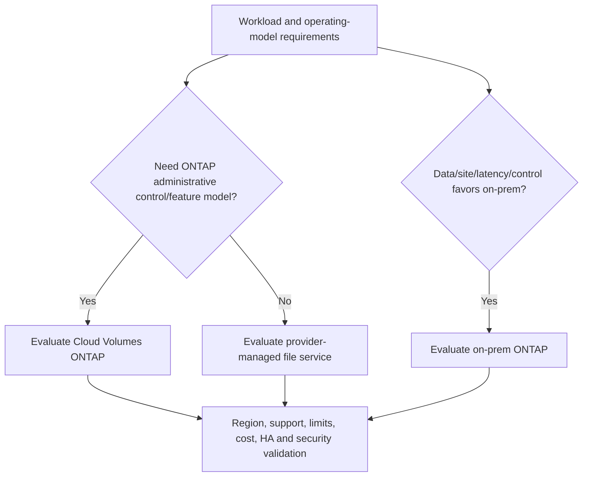

### 🔍 Plain-English deep-dive: managed does not mean responsibility-free

A managed apartment removes roof and boiler maintenance, but the tenant still controls keys, guests, valuables and how rooms are used. A managed file service shifts infrastructure duties, not responsibility for IAM, network exposure, data classification, permissions, workload fit, backup/DR, monitoring, quota or cost governance.

## 2. Current naming: NetApp Console and Cloud Volumes ONTAP

As checked **2026-08-24**, official NetApp documentation uses **NetApp Console** as the management experience name in current materials; older content may refer to **BlueXP**. **Cloud Volumes ONTAP** remains the ONTAP software deployment concept in supported cloud environments. Recheck naming, account model, agents/connectors, APIs, licensing and service availability because transitions can leave older names in URLs and documentation.

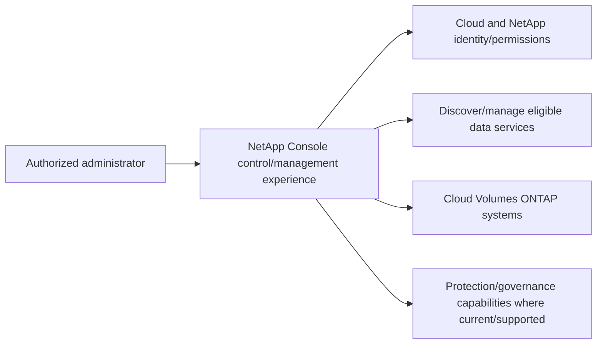

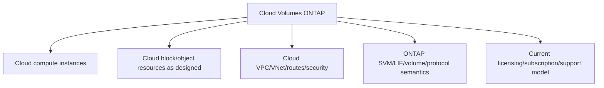

Do not infer that an on-premises ONTAP feature, limit, HA behavior or procedure is identical in CVO. Exact cloud/provider/CVO release and deployment type control the answer.

## 3. Major first-party cloud file services involving NetApp technology

As checked **2026-08-24**, the major first-party services relevant to this guide are:

- **Amazon FSx for NetApp ONTAP** in Amazon Web Services (AWS).
- **Azure NetApp Files** in Microsoft Azure.
- **Google Cloud NetApp Volumes** in Google Cloud.

These are not interchangeable wrappers around one universal configuration. Each has provider-specific identity, networking, capacity/service levels, protocols, protection, limits, billing, regions, APIs and support model.

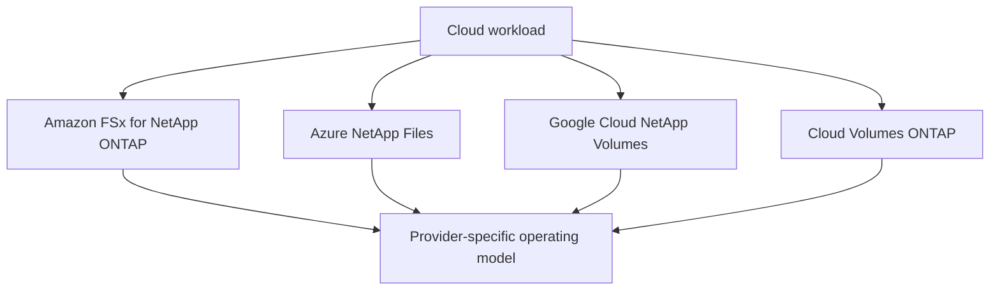

## 4. Shared-responsibility model

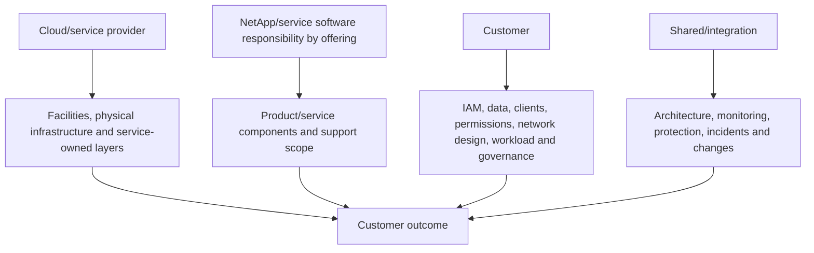

| Responsibility question | Must be answered per service |
|---|---|
| Who patches/operates ONTAP or service infrastructure? | Offering-specific official responsibility |
| Who configures IAM, networks, DNS and client access? | Usually customer-owned or shared; verify |
| Who protects application data and tests recovery? | Customer retains outcome ownership even when features are managed |
| Who monitors service/quotas/cost? | Customer plus provider signals/support |
| Who handles incident layers? | Workload/customer, service/provider, NetApp and network responsibilities differ |

### 🔍 Plain-English deep-dive: support boundaries follow the failing interface

If a cloud VM cannot mount a file service, the cause may be guest configuration, IAM, DNS, route/security policy, provider endpoint, protocol policy or storage service. The logo on the service is not an automatic ticket route. Preserve the first failed interface and engage the owner/provider that can inspect it, while one coordinator maintains the end-to-end customer timeline.

## 5. Deployment and trust architecture

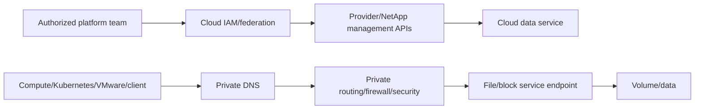

Management API and data I/O are separate trust paths. Record identities, roles, subscriptions/projects/accounts, network ownership, service endpoints, encryption/key choices, logging and separation of duties.

## 6. IAM, RBAC, credentials, and data permissions

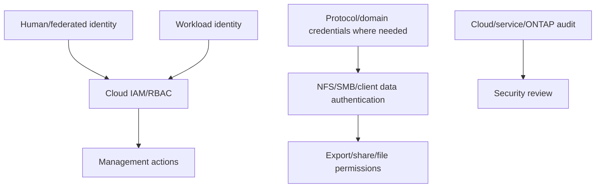

Cloud IAM permission to create a volume does not grant file access; file permissions do not grant cloud API rights. Use least privilege, managed identities/workload identity where supported, secret rotation, no long-lived keys in scripts, and current service-specific authentication documentation.

## 7. VPC/VNet, DNS, routes, firewalls, and private connectivity

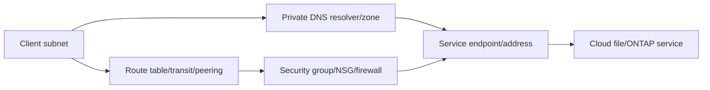

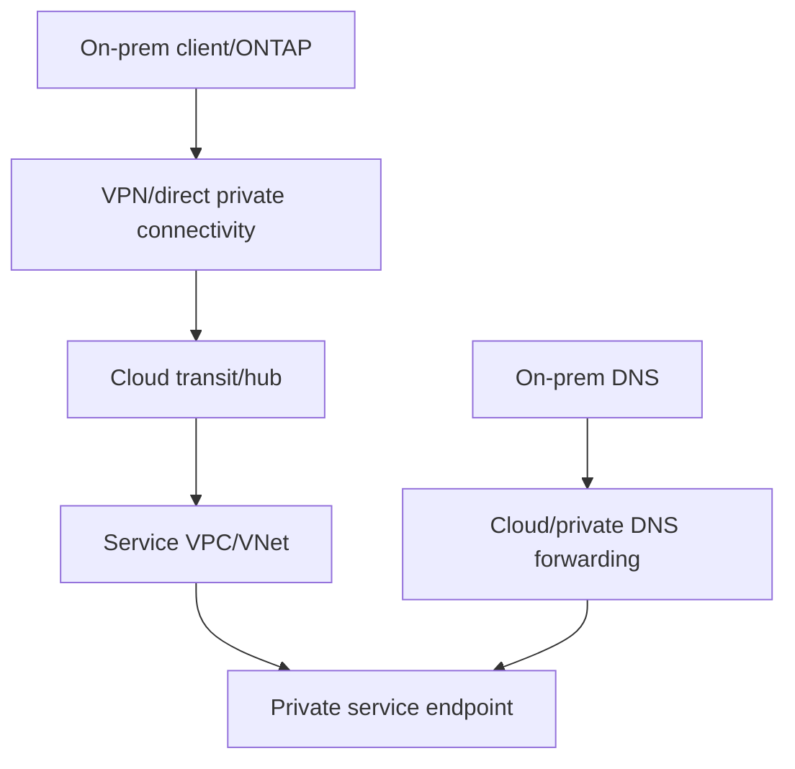

Validate CIDR overlap, asymmetric routing, MTU, firewall state, DNS forwarding, AD/domain-controller reachability, time, provider service-network rules and quotas. Never expose management/data endpoints publicly merely to simplify a test.

## 8. Protocol and workload semantics

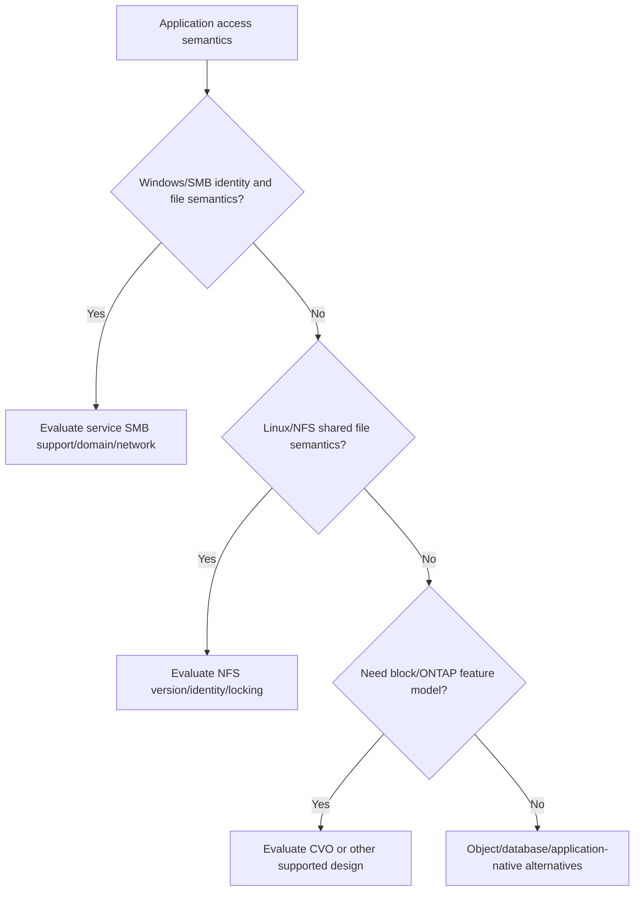

First-party managed services in this Part are file-service choices; protocol availability and versions vary by service/region/tier. CVO may expose ONTAP protocols according to exact deployment/support. Match application certification, file locking, identity, latency, throughput, availability and recovery semantics.

## 9. Capacity, performance, service levels, and scaling

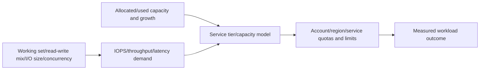

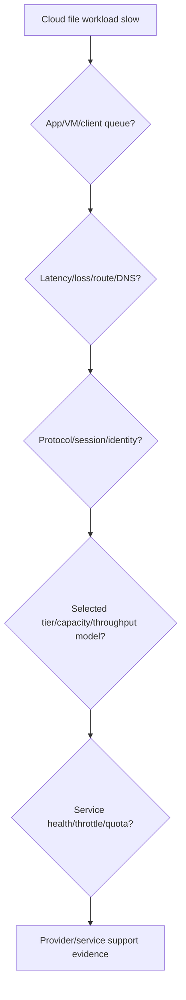

Capacity and throughput can be coupled or independently configured depending service/tier. Do not memorize a number. Record exact region, tier, allocated/used capacity, quota, workload fingerprint, observation window, service metrics and current official limit page.

## 10. Cost model and FinOps discipline

Cost can include provisioned/used capacity, service tier/performance, compute and disks for CVO, licenses/subscriptions, snapshots/backups, cross-zone/region/network transfer, object tiering, operations/API, private connectivity, monitoring and support. Exact billing differs.

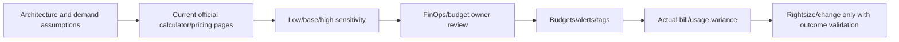

### 🔍 Plain-English deep-dive: effective cost is a system, not a price per GiB

A flight's ticket price is not the whole trip if luggage, transfers, hotels and change risk differ. Compare the complete workload architecture: performance tier, provisioned headroom, HA, backups, transfer, operations labor, migration, downtime risk, support and exit path. Never promise savings from a list-price comparison.

## 11. Availability, HA, zones, and failure domains

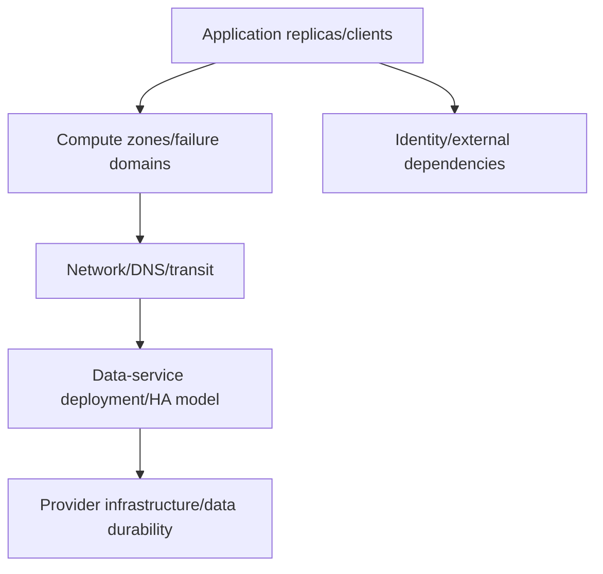

Different offerings expose different zone/region and HA semantics. Validate failure model, service-level agreement terms, client retry/failover, endpoint behavior, maintenance, write authority and application testing. `Multi-zone` in one layer does not remove common DNS, IAM, region or application dependencies.

## 12. Snapshots, backup, DR, ransomware, and cyber recovery

### 🔍 Plain-English deep-dive: durable storage can preserve the wrong state perfectly

Provider durability protects against certain infrastructure-loss events, but a highly durable service can faithfully preserve accidental deletion, corrupt application writes, ransomware-encrypted files or an overprivileged administrator's action. Recoverability needs versioned points/copies in appropriate failure and trust domains, protected identities, known-good selection and tested application restore.

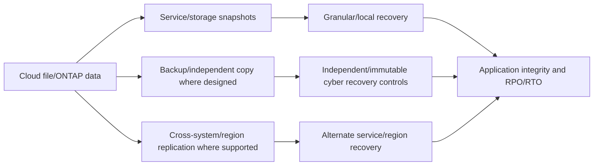

Verify current feature, region pairing, retention, immutability, keys, catalogs, application consistency and restore procedures. Provider durability is not a substitute for protection against deletion, corruption, ransomware or account compromise.

## 13. Data mobility and hybrid patterns

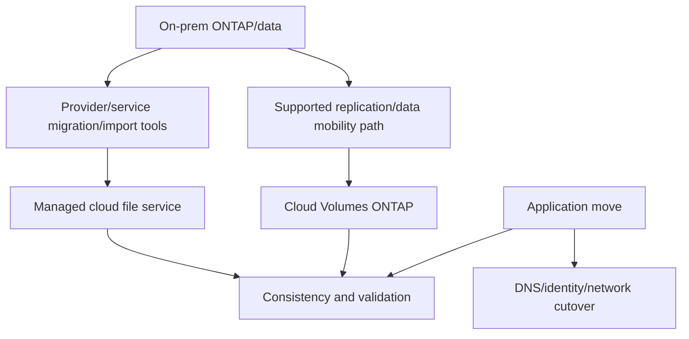

Data movement is not application migration. Plan source/destination support, protocol/permissions, names, identities, consistency, incremental sync, bandwidth/time, egress cost, freeze/cutover, rollback, validation, protection and decommissioning. Exact paths between products/services require current official support evidence.

## 14. Observability, telemetry, and install-base accuracy

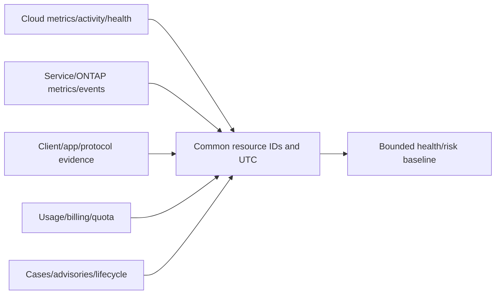

Reconcile provider resource ID, NetApp system/volume IDs, account/subscription/project, region/zone, network, owner, service, data classification, support, telemetry freshness, protection and lifecycle. Missing metrics or inaccessible tenants are unknown, not healthy.

## 15. Selection framework

| Dimension | Questions |
|---|---|
| Workload | Protocol, semantics, latency, throughput, concurrency, scale, app certification? |
| Operating model | Need ONTAP control or prefer provider-managed file service? |
| Cloud placement | Provider, regions, zones, data residency and service availability? |
| Network/identity | Private access, DNS, AD/LDAP, hybrid routing, segmentation? |
| Protection | RPO/RTO, backup, cross-region, immutability, application consistency? |
| Supportability | Exact CVO/service/host/app versions and current support? |
| Cost | Full architecture, transfer, HA, protection, labor, exit and uncertainty? |
| Lock-in/exit | APIs, data format/semantics, egress, migration path and skills? |

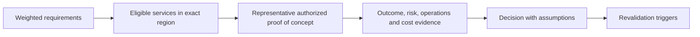

Use a proof of concept only when legitimate and approved; synthetic design is the fallback. Do not turn a vendor demo into a production guarantee.

## 16. Troubleshooting and hypothesis tree

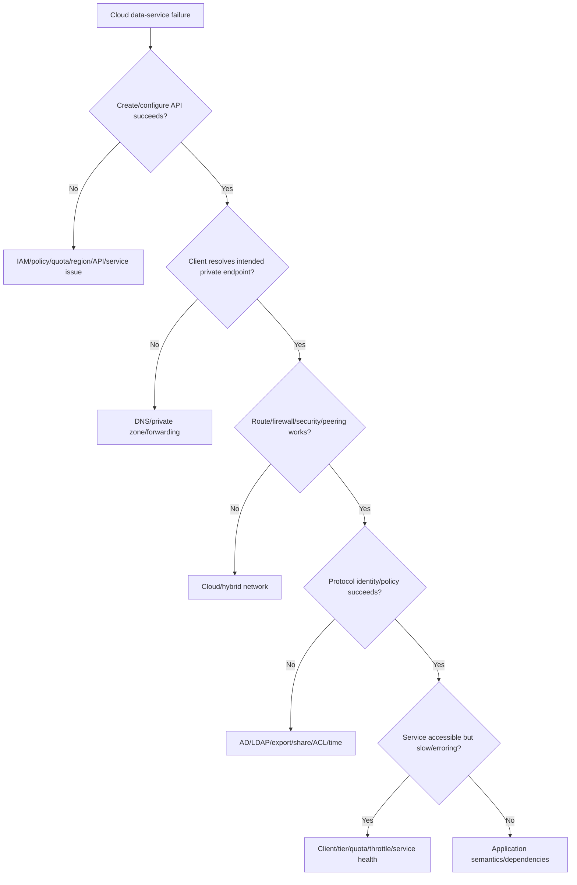

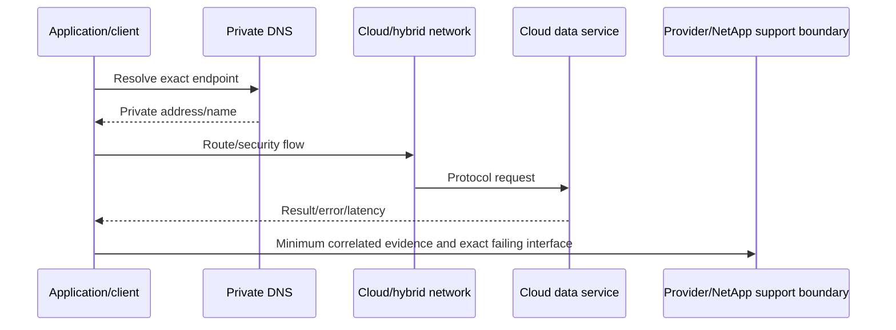

## 17. Fully synthetic sanitized scenario: hybrid research archive

**Need:** Northstar Research Cooperative must place shared Linux research files near cloud analytics while preserving on-premises operations and a tested recovery path. Requirements are fictional: NFS, private connectivity, predictable batch throughput, 30-day growth visibility, recovery in another failure domain, no public endpoint, and exit documentation.

```mermaid
flowchart TB
    ONP[On-prem synthetic ONTAP] --> WAN[Private hybrid connectivity]
    WAN --> CLOUD[Cloud analytics VPC/VNet]
    CLOUD --> C1[Option A: CVO]
    CLOUD --> C2[Option B: provider-managed NetApp file service]
    C1 --> APP[Analytics clients]
    C2 --> APP
    DNS[Hybrid private DNS] --> APP
    ID[Identity/name service] --> APP
```

| Criterion | CVO option | Managed-service option | Decision status |
|---|---|---|---|
| ONTAP administrative control | Greater by model, exact limits vary | Provider-managed abstraction | Requirement not decisive |
| Operational labor | Customer operates more layers | Provider operates more service layers | Managed favored |
| Region/service availability | Must verify | Must verify | Unknown pending current check |
| Hybrid data mobility | Exact supported path required | Exact import/migration path required | Unknown |
| Performance/capacity model | CVO/cloud-resource specific | Service/tier specific | Needs representative test |
| Full cost | Compute/disks/license/network/protection/ops | Service/tier/network/protection/ops | Calculator and FinOps review required |
| Exit | Replication/export/migration constraints | Provider export/egress/migration constraints | Document both |

```mermaid
flowchart LR
    REQUIRE[Requirements] --> ELIG[Verify exact region/service eligibility]
    ELIG --> NET[Private DNS/routing/identity design]
    NET --> TEST[Representative synthetic workload/recovery test]
    TEST --> COST[Full-cost sensitivity]
    COST --> DEC[Decision with unknowns and exit plan]
```

**Synthetic incident:** management API succeeds, but clients time out. Cloud service health is green. A route table lacks the private service prefix; DNS is correct. The first failed interface is network routing, not the storage service. Recommendation: qualified network owner corrects the exact approved route, negative public-path test remains denied, application throughput and recovery are revalidated.

**Honest interview language:** `I completed a fully synthetic hybrid-cloud selection and troubleshooting case. I distinguished CVO from provider-managed file services, mapped shared responsibility and private data paths, kept region/price/limit claims current-source gated, and isolated a routing failure. I have not operated these services in production.`

## 18. Evidence, cleanup, and review record

```mermaid
flowchart LR
    REQ[Requirements/assumptions] --> SRC[Official service/region/limit/price source dates]
    SRC --> ARCH[Identity/network/data/protection architecture]
    ARCH --> TEST[Representative outcome and failure tests]
    TEST --> COST[Cost sensitivity and actual variance plan]
    COST --> RISK[Recommendation/unknowns/exit/residual risk]
    RISK --> SAN[Sanitized portfolio artifact]
```

Record exact service name, account/region token, architecture, ownership, current source/date, quotas/limits, pricing assumptions, workload, test interval, metrics, protection, security, cost ranges, unknowns, reviewer and recheck triggers. Delete trial resources, volumes, snapshots, IPs, agents/connectors, logs, secrets and network links through authorization; verify billing later.

## 19. JD Mapping and background tie

```mermaid
flowchart LR
    AZ[Azure/cloud/VM fundamentals] --> MODEL[Cloud operating-model reasoning]
    M365[Microsoft 365 data services] --> DATA[Identity, data and customer impact]
    NET[Networking/DNS] --> HYBRID[Private hybrid path isolation]
    ANALYTICS[Analytics/reviews] --> COST[Capacity/cost/risk narrative]
    MODEL --> TAM[Hybrid-cloud TAM capability]
    DATA --> TAM
    HYBRID --> TAM
    COST --> TAM
```

| JD need | Part evidence |
|---|---|
| Cloud/storage depth | Four operating/service models |
| Strategic planning | Requirements and operating-model selection |
| Customer environment | IAM, network, data, protection and owner map |
| Risk mitigation | Shared responsibility and failure domains |
| Analytics | Capacity/performance/cost sensitivity |
| Current knowledge | Date-stamped provider/NetApp sources and recheck gates |

## 20. Official and Public Source Anchors

**Date checked: 2026-08-24.** Recheck names, regions, tiers, limits, pricing, licensing and support immediately before use. These links do not prove service availability or a supported customer architecture.

| Topic | Official source | Bounded use |
|---|---|---|
| NetApp Console | [NetApp Console documentation](https://docs.netapp.com/us-en/console-setup-admin/) | Current management-experience naming/setup navigation |
| Cloud Volumes ONTAP | [Cloud Volumes ONTAP documentation](https://docs.netapp.com/us-en/cloud-volumes-ontap/) | Current CVO release/provider/deployment navigation |
| AWS service | [Amazon FSx for NetApp ONTAP](https://docs.aws.amazon.com/fsx/latest/ONTAPGuide/what-is-fsx-ontap.html) | AWS first-party service concepts/current docs |
| Azure service | [Azure NetApp Files documentation](https://learn.microsoft.com/azure/azure-netapp-files/) | Azure first-party service concepts/current docs |
| Google service | [Google Cloud NetApp Volumes documentation](https://cloud.google.com/netapp/volumes/docs) | Google first-party service concepts/current docs |
| AWS pricing/regions | [AWS FSx pricing](https://aws.amazon.com/fsx/netapp-ontap/pricing/), [AWS regional services](https://aws.amazon.com/about-aws/global-infrastructure/regional-product-services/) | Verify current price/region; no quote |
| Azure pricing/regions | [Azure NetApp Files pricing](https://azure.microsoft.com/pricing/details/netapp/), [Azure products by region](https://azure.microsoft.com/explore/global-infrastructure/products-by-region/) | Verify current price/region; no quote |
| Google pricing/locations | [Google Cloud NetApp Volumes pricing](https://cloud.google.com/netapp/volumes/pricing), [Google Cloud locations](https://cloud.google.com/about/locations) | Verify current price/location; no quote |

## 21. Self-Test and Teach-Back

1. Compare on-prem ONTAP, CVO and provider-managed file services.
2. State current NetApp Console naming and BlueXP legacy-name caveat.
3. Name the AWS, Azure and Google first-party services exactly.
4. Draw management and data paths plus shared responsibility.
5. Build IAM, DNS, route, firewall and hybrid-connectivity checks.
6. Explain capacity/performance/service-level coupling without memorized numbers.
7. Create a full-cost sensitivity and no-savings-promise statement.
8. Design protection, DR and data-mobility validation.
9. Troubleshoot the synthetic routing incident and identify ticket owner.
10. Deliver the exact nonclaim and current-source caveat.

---

## Likely Interview Questions

### Q1. How does Cloud Volumes ONTAP differ from managed cloud file services?

> **Model answer:** `CVO is ONTAP software deployed on cloud compute/storage/network resources with more ONTAP and cloud-infrastructure responsibility retained by the customer, subject to exact provider/deployment limits. Amazon FSx for NetApp ONTAP, Azure NetApp Files and Google Cloud NetApp Volumes are provider-managed first-party file services with different APIs, tiers, regions and responsibility. Requirements decide.`

### Q2. What is NetApp Console?

> **Model answer:** `As of my 2026-08-24 official-source review, NetApp Console is the current management-experience naming in NetApp materials; older content may say BlueXP. I would verify current account architecture, agents/connectors, permissions, supported services, licensing and API behavior before design or migration.`

### Q3. How do you design private cloud file access?

> **Model answer:** `I map client subnet, private DNS/forwarding, route/transit/peering, firewall/security groups, private service endpoints, AD/LDAP/time dependencies and protocol identity/permissions. I separate management API and data paths, avoid public exposure, run positive and negative reachability tests and retain exact region/service network requirements.`

### Q4. What does shared responsibility mean here?

> **Model answer:** `The provider/service may operate facilities and more infrastructure, while the customer still owns workload design, data, IAM, network configuration, client/protocol permissions, protection requirements, monitoring, quotas, cost and recovery validation. The exact boundary varies by offering, so incidents route by the first failed interface.`

### Q5. How would you compare cost without making a false savings claim?

> **Model answer:** `I model complete architecture under current regional pricing: capacity/tier/performance, CVO compute/disks/license where relevant, HA, snapshots/backups, transfer, private connectivity, monitoring, support, operations, migration, downtime risk and exit. I show low/base/high assumptions, owner review and actual-bill variance; I do not promise savings.`

### Q6. How do you plan hybrid data mobility?

> **Model answer:** `I validate the exact supported source/destination path, protocol and permission fidelity, application consistency, bandwidth/time and egress, incremental synchronization, DNS/identity/network cutover, protection, rollback, application testing and decommissioning. Moving bytes is not the same as migrating the service.`

### Q7. How do you troubleshoot a cloud file mount failure?

> **Model answer:** `I check management provisioning separately from data access, then exact endpoint DNS, route/peering/transit, firewall/security, protocol session, AD/LDAP/time, export/share/ACL, service health/quota and client/application. I correlate resource IDs and UTC and route evidence to the owner of the first failed interface.`

### Q8. What is your experience boundary?

> **Model answer:** `Azure/cloud/VM, Microsoft data services, networking/identity, enterprise escalation and analytics transfer strongly. I have not operated production CVO, NetApp Console or these first-party services. The comparison is synthetic and every live region, limit, tier, price and feature requires current official validation.`

---

## 30-Second Memory Hooks

- **Models:** on-prem ONTAP, CVO, provider-managed file service.
- **Current name:** NetApp Console; older content may say BlueXP.
- **Cloud trio:** FSx for ONTAP, Azure NetApp Files, Google Cloud NetApp Volumes.
- **Managed:** fewer infrastructure chores, not fewer outcome responsibilities.
- **Two paths:** management API and private data I/O.
- **Cloud access:** IAM + DNS + route + firewall + protocol policy.
- **Performance:** workload + tier/capacity + quota + network + measurement.
- **Cost:** whole architecture, ranges, actual bill; no savings promise.
- **Mobility:** bytes + app + identity + cutover + rollback.
- **Troubleshoot:** first failed interface owns the next evidence ask.

---

## Completion Checklist

- [ ] State all five safety labels and exact no-production-NetApp boundary.
- [ ] Compare on-prem ONTAP, CVO and provider-managed file services.
- [ ] Use current NetApp Console naming and legacy BlueXP caveat.
- [ ] Name AWS/Azure/Google first-party services accurately.
- [ ] Map deployment/shared responsibility and management/data paths.
- [ ] Cover IAM, RBAC, DNS, routes, firewalls, private connectivity and security.
- [ ] Match protocols and workload semantics to exact service support.
- [ ] Analyze capacity, performance, quotas, tiers and observability.
- [ ] Build complete cost sensitivity without quotes, promises or invented savings.
- [ ] Cover HA/failure domains, backup, DR, cyber recovery and data mobility.
- [ ] Verify current regions, service limits, prices, licensing and support.
- [ ] Troubleshoot the fully synthetic hybrid scenario and route ownership.
- [ ] Capture sanitized evidence and complete resource/secret/data/cost cleanup.
- [ ] Recheck official sources dated 2026-08-24 immediately before decisions.
- [ ] Answer exact Q1-Q8 aloud and complete every self-test.

---

*Next suggested section:* [Part 90 - LAB 5 - AutoSupport, Active IQ, IMT, Bug Scrub, and Upgrade Assessment](Part-90-lab-proactive-risk-upgrade-assessment.md)