# Part 90 - LAB 5 - AutoSupport, Active IQ, IMT, Bug Scrub, and Upgrade Assessment

> **Section goal:** Build an auditable proactive-risk and upgrade assessment from telemetry freshness, Digital Advisor evidence, reconciled inventory, exact IMT and Hardware Universe checks, lifecycle, advisories, bugs, release notes, upgrade path and prechecks. By the end, you can turn authorized gated evidence or a complete synthetic pack into a risk-ranked, reviewer-approved recommendation without fabricating tool access or promising an upgrade outcome.

Covers index item **90** and maps directly to job-description responsibilities for generating/analyzing customer data, maintaining the install base, strategic upgrade planning, using NetApp tools, risk mitigation, preventative remediation, recommendation representation, Microsoft Office analysis, and operational reviews.

**Privacy and access boundary:** Telemetry, assets, IMT/HWU results, bugs, cases, lifecycle data, upgrade plans, and recommendations require authorized access, redaction, and approved storage.

**Synthetic-evidence rule:** Every extract, identifier, recipe, bug, lifecycle date, upgrade path, score, result, and recommendation in this lab is fictional and sanitized.

**Version caveat:** Tool views, results, product status, matrices, advisories, paths, and support guidance change; complete a current-doc and authorized-tool check at decision time.

**Lab safety contract:** The access fallback is the default complete synthetic assessment. Use read-only first, obtain authorization before change, run a positive test and negative test of the analysis, use bounded failure injection only in synthetic evidence, document recovery and rollback assumptions, capture evidence, complete cleanup, control cost and privacy, and use honest interview language.

**Explicit nonclaim:** You have not accessed or operated a production customer's AutoSupport, Active IQ Digital Advisor, IMT, Hardware Universe, Bugs Online, Upgrade Advisor, lifecycle, advisory, or release-planning workflow; has not performed a production NetApp bug scrub; and has not approved an ONTAP upgrade.

**Privacy/access:** Proactive assessments can combine serials, UUIDs, topology, versions, telemetry, wellness, cases, defects, vulnerabilities, entitlement, lifecycle, contracts, performance, capacity, business criticality and planned changes. Use purpose-limited authorization, role-based/gated access, approved secure repositories, minimum exports, redaction/tokenization, retention, and no customer or private NetApp data in portfolios or unapproved AI tools.

**Synthetic-evidence:** Every customer, system, serial-like ID, telemetry message, Digital Advisor row, IMT recipe, HWU fact, bug, advisory, lifecycle date, release, precheck, score, recommendation and result below is fictional and sanitized. No synthetic table is a live tool result, support position, product defect, security advisory, customer record or NetApp commitment.

**Version/current-doc:** Tools, product names, views, schemas, access, releases, upgrade paths, support status, IMT/HWU data, bugs/advisories, prechecks and procedures change. Sources were checked **2026-08-24**. A live assessment must reopen exact official/authorized evidence for the observed configuration and record revision/date/cutoff immediately before recommendation and change.

This Part is an analytical learning lab, not NetApp internal methodology, a severity model, a live compatibility result, an advisory, a defect record, an Upgrade Advisor plan, a change approval, or a guarantee of nondisruptive upgrade.

> **No-production-NetApp boundary:** Your factual strengths are enterprise telemetry/support analysis, case and escalation quality, Product/Engineering collaboration, Excel/Power BI/SQL/Python/statistics, release/change reasoning, risk communication, and business reviews. Your exact nonclaim is: **you have not performed a production NetApp proactive-risk or upgrade assessment.** You may present this fully synthetic pack and the transferable method while naming gated-tool and production gaps.

---

## 1. Objectives, prerequisites, safety, and ethics

### Objectives

- Prove telemetry population, generation, delivery, association, freshness and completeness.
- Reconcile stable system/component identities across inventory and evidence sources.
- Validate exact end-to-end supportability through an authorized IMT result and HWU/platform facts.
- Assess lifecycle, public advisories, authorized bugs, release notes and applicability.
- Select candidate target/path and identify prechecks, dependencies, change and rollback limits.
- Score risk transparently with assumptions, confidence and expert override.
- Produce a recommendation pack, audit trail, reviewer record and customer-safe language.

### Prerequisites and legitimate routes

| Route | Requirement | Boundary |
|---|---|---|
| Authorized live assessment | Customer/employer purpose, entitlement, least privilege, approved repository, qualified reviewer | Use exact gated evidence only within scope |
| Official training environment | Enrollment and provided fictional data | Describe as course lab |
| Complete synthetic fallback | Dataset and templates below | No claim of tool access or live results |
| Public-doc-only | Official docs/advisories/release pages | No customer applicability conclusion |

No scraping, credential sharing, hidden APIs, bypass, copied customer exports, private bug screenshots, or invented result rows. If a gated source is inaccessible, mark `not accessed/unknown` and use the synthetic fallback.

```mermaid
flowchart LR
    SCOPE[Customer objective/scope/cutoff] --> AUTH[Authorized sources and access class]
    AUTH --> COLLECT[Minimum evidence]
    COLLECT --> QA[Identity/freshness/definition/reconciliation QA]
    QA --> ANALYZE[Health/supportability/lifecycle/bug/upgrade analysis]
    ANALYZE --> RISK[Risk, confidence and priority]
    RISK --> REVIEW[Qualified reviewer]
    REVIEW --> PACK[Recommendation and action pack]
```

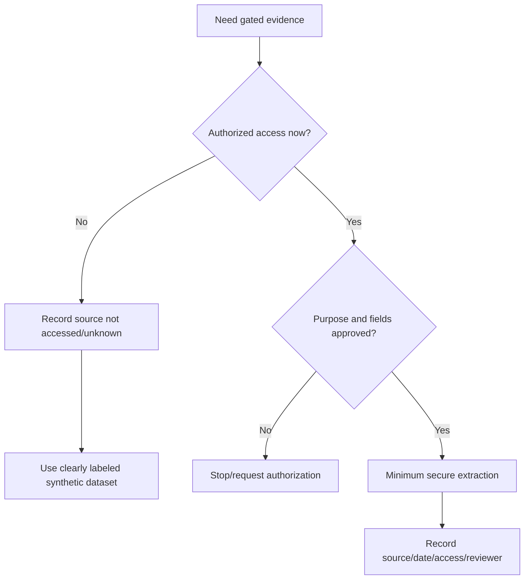

### 🔍 Plain-English deep-dive: a tool row is evidence, not a recommendation

A lab result can show high cholesterol, but treatment depends on patient identity, history, risk, other conditions and current clinical guidance. Digital Advisor, IMT, HWU, bugs and release notes each answer a bounded question. Join the exact asset/configuration and customer context before turning a signal into an action.

## 2. Architecture before steps: source-to-decision pipeline

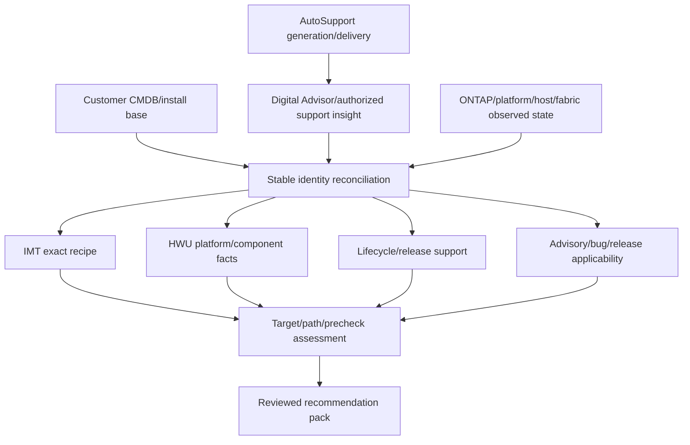

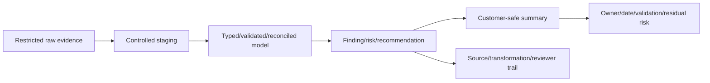

## 3. Telemetry freshness: six proof gates

Telemetry freshness is not one last-seen timestamp.

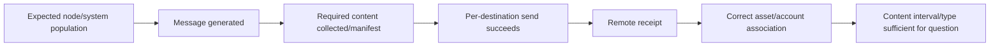

| Gate | Evidence | Failure meaning |
|---|---|---|
| Population | Expected versus observed nodes/systems | Blind asset or retired record |
| Generation | Correct message type/time | Local trigger/schedule issue |
| Collection | Manifest/content status | Partial package |
| Delivery | Per-destination status/error | DNS/proxy/TLS/SMTP/path issue |
| Association | Serial/system/account mapping | Portal visibility/entitlement issue |
| Sufficiency | Correct period/content for analysis | Recent but irrelevant evidence |

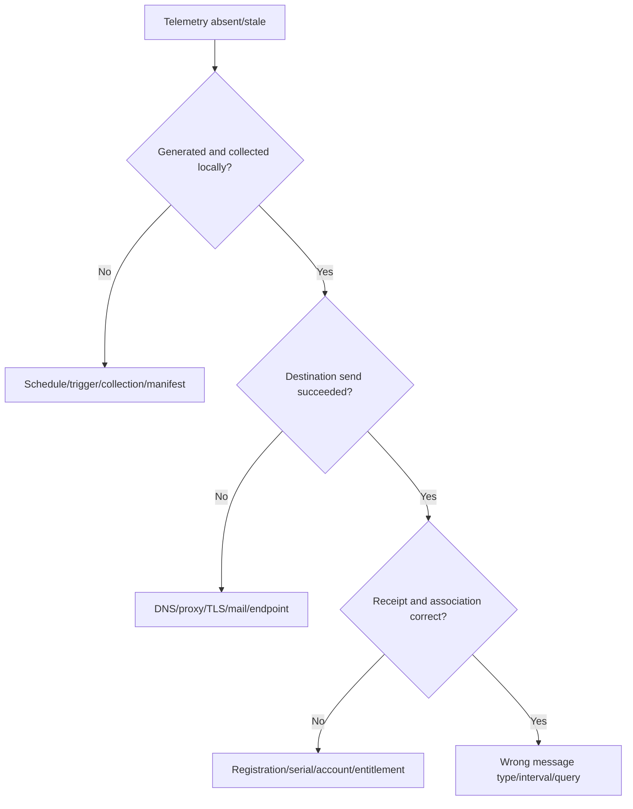

## 4. Digital Advisor extract discipline

As official current product naming and views can change, record exact service name/page, access class, customer/system scope, filter, export time, data cutoff, field definitions, row count, freshness and exclusions. Do not recreate a fake screenshot.

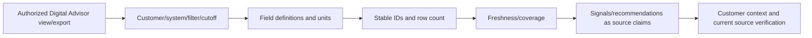

### 🔍 Plain-English deep-dive: missing data is not zero risk

A smoke detector with a dead battery produces no alarm, but that is not proof of no smoke. In dashboards, a blank, zero or absent row may mean no event, excluded population, stale telemetry, failed join or insufficient access. Preserve null/unknown and report coverage before aggregating wellness.

## 5. Reconciled inventory and configuration fingerprint

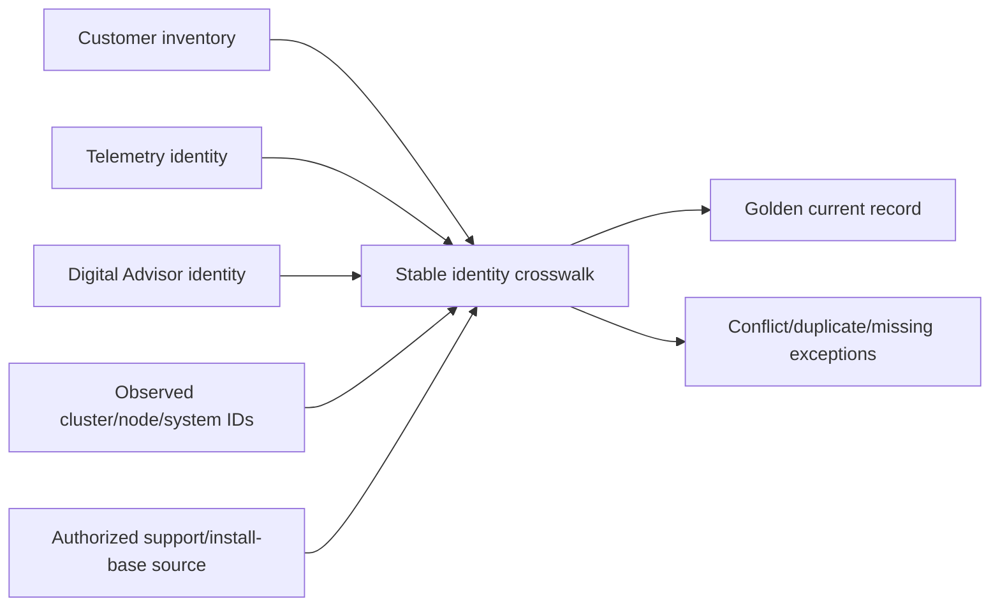

Configuration fingerprint fields: customer/site/service, cluster/node/system IDs, platform, ONTAP release, protocols, SVMs, host/hypervisor/application, adapters/drivers/firmware, switches, multipath, protection, support/lifecycle, telemetry freshness and owner. Use effective dates for moves/retirements.

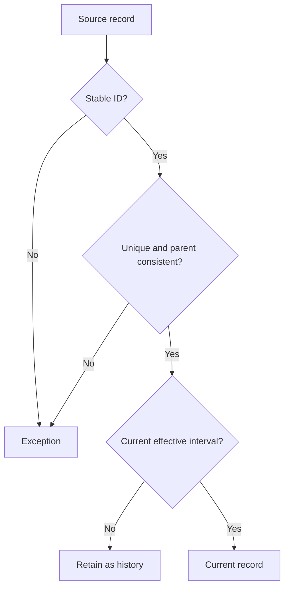

## 6. IMT recipe validation

The **Interoperability Matrix Tool (IMT)** validates exact supported solution combinations and notes. Access may be gated. Never invent a result.

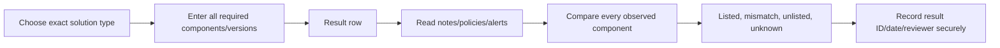

| Component family | Example fields |
|---|---|
| Storage | ONTAP, platform, protocol |
| Host/hypervisor | OS/build/kernel/vSphere/application |
| Utility/multipath | Host Utilities, DSM/MPIO/device handler |
| Adapter | Model, driver, firmware |
| Fabric | Switch model/OS/firmware |
| Integration | Plugin/provider/backup/application versions |
| Notes | Restrictions, required settings, policies, exceptions |

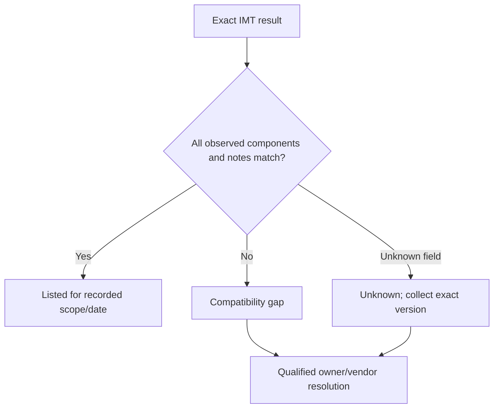

## 7. Hardware Universe facts and limits

The **Hardware Universe (HWU)** provides current platform/component specifications, supported configurations and limits. It complements, not replaces, IMT.

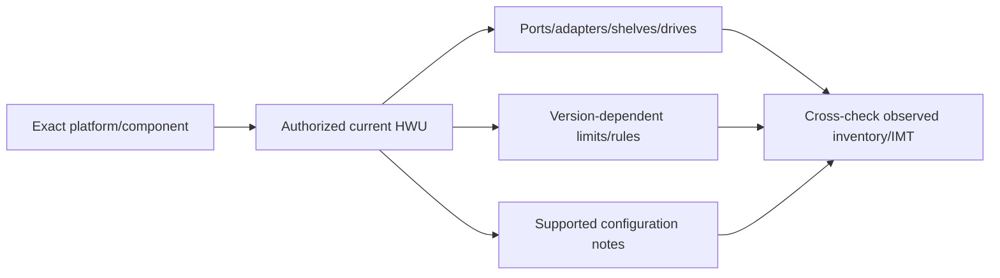

Record exact model/component, ONTAP dependency, fact/limit, unit, configuration notes, source date and reviewer. Do not copy gated tables into a public portfolio or use remembered limits.

## 8. Lifecycle and release-support horizon

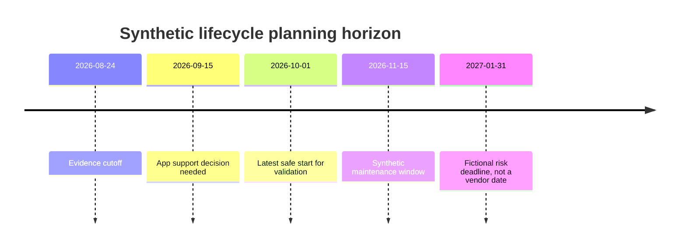

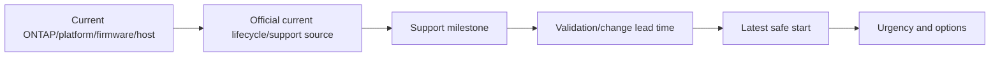

Keep synthetic dates visibly fictional. Live lifecycle milestones require exact official/authorized pages and customer contract/support context.

## 9. Advisories and bug-scrub applicability

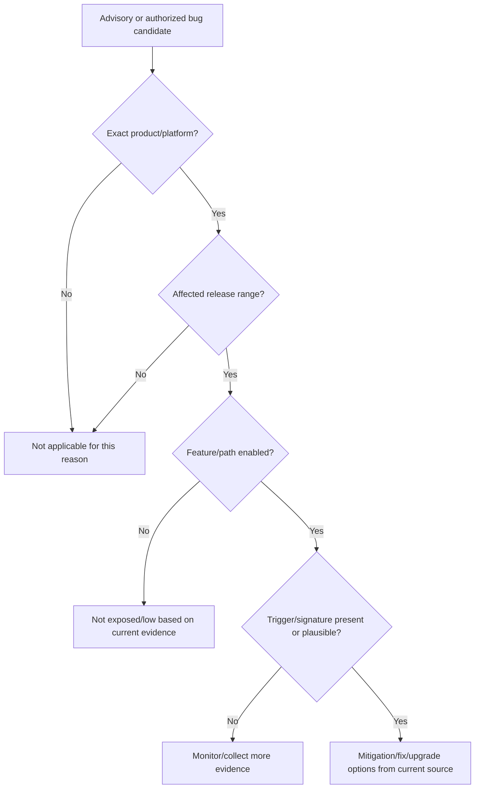

| Field | Required |
|---|---|
| Source | Public advisory or authorized bug source and revision/date |
| Scope | Product/platform/release/feature/path |
| Symptom/signature | Exact observable behavior |
| Trigger/exposure | Conditions required |
| Customer evidence | Present/absent/unknown with source |
| Mitigation/fix | Current official text, dependencies and limits |
| Applicability | Applicable/not/unknown plus confidence |
| Action | Owner/date/validation/residual risk |

### 🔍 Plain-English deep-dive: symptom similarity is not defect proof

Two illnesses can both cause fever. A bug requires matching product, release, feature, trigger and signature, plus current authorized evidence; even then, Support/Engineering owns formal defect handling. Report `consistent with` or `candidate` until proved, and never expose private bug details.

## 10. Release notes and target selection

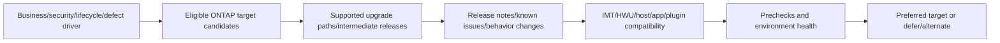

Compare current/target release support, hardware, protocols, applications, integrations, hosts, switches, multipath, protection, security, bugs/advisories, release-note changes, upgrade path, mixed-version behavior, prechecks, maintenance windows, validation and rollback limitations.

## 11. Upgrade path and precheck model

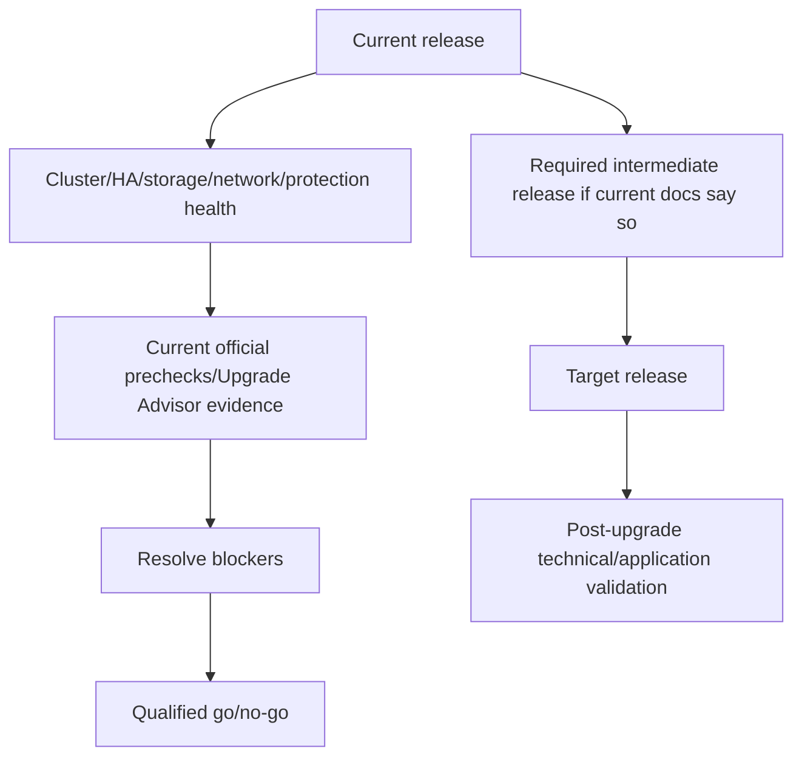

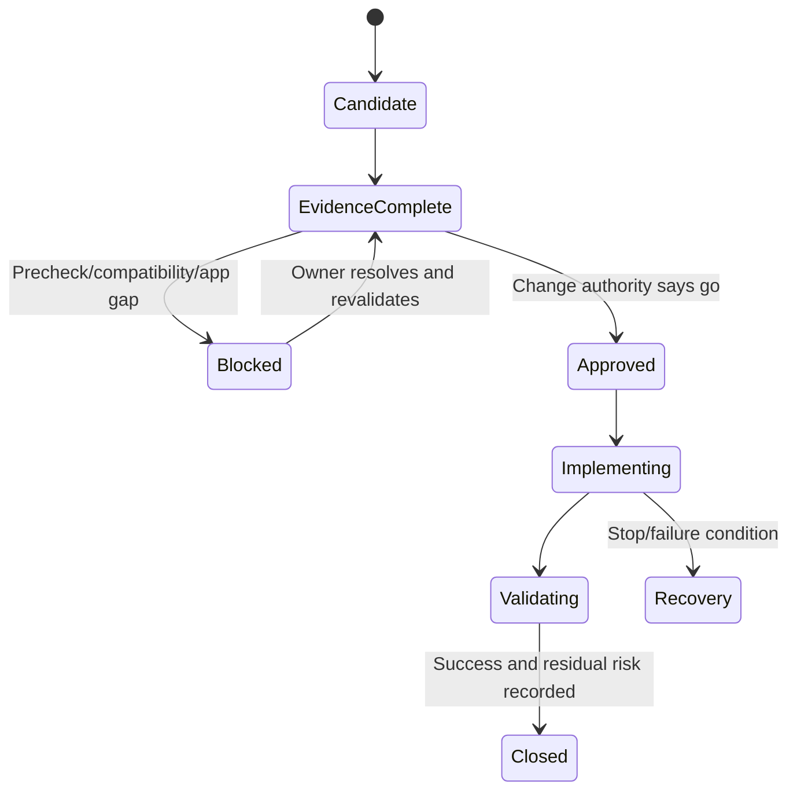

Rollback can be limited or not equivalent to downgrade. Never promise it; obtain current product/Support guidance and an application/data recovery plan.

## 12. Risk scoring with confidence and override

Use a teaching model, not a NetApp severity method.

| Dimension | Synthetic scale question |
|---|---|
| Impact | What customer objective could be affected? |
| Exposure | Is the trigger/configuration present? |
| Urgency | Deadline minus validated lead time? |
| Control weakness | Protection/detection/alternate path? |
| Supportability | Listed/current, gap or unknown? |
| Confidence | Source quality/completeness/recency? |

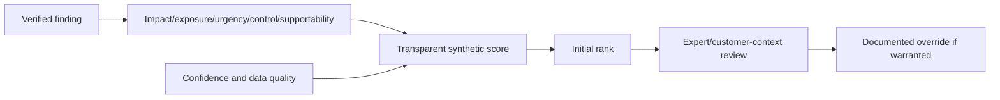

### 🔍 Plain-English deep-dive: a score sorts work; it does not make truth

Airport departure boards sort flights by time but do not decide which passenger's trip matters most. A risk score creates consistency; critical business service, exploitability, unsupported configuration, maintenance dependency or data-quality gaps can justify a documented override. Preserve the underlying dimensions and uncertainty.

## 13. Recommendation pack schema

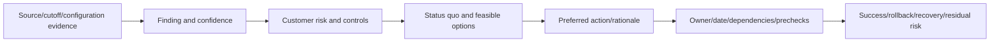

Deliverables:

1. Scope/data-quality and telemetry-coverage page.
2. Reconciled inventory/configuration fingerprint.
3. IMT/HWU supportability record.
4. Lifecycle/advisory/bug applicability register.
5. Release/target/path/precheck assessment.
6. Risk register with confidence and override log.
7. Prioritized recommendations and action tracker.
8. Executive summary plus technical appendix.
9. Audit trail and reviewer approval.

## 14. Read-only first and explicit change authorization

This lab analysis is read-only. Any telemetry test, configuration collection, precheck, upgrade or remediation requires a separate owner-approved plan and current procedure.

```mermaid
sequenceDiagram
    autonumber
    participant A as Analyst
    participant D as Data/tool owners
    participant R as Qualified reviewer
    participant C as Change authority
    A->>D: Request minimum read-only evidence and cutoff
    D-->>A: Authorized export or access denial
    A->>A: Reconcile, analyze, state unknowns
    A->>R: Submit evidence and recommendation pack
    R-->>A: Approve/revise technical conclusion
    A->>C: Separate change proposal
    C-->>A: Go/no-go under customer process
```

Never convert this guide into a remembered upgrade command sequence. Exact commands/interfaces are current-doc conceptual placeholders only.

## 15. Positive, negative, failure, recovery, and rollback tests

| Type | Test | Expected |
|---|---|---|
| Positive | All expected assets join to stable IDs | Complete current population or explicit exceptions |
| Negative | Fake/retired asset is excluded | No metric or recommendation attached to wrong object |
| Failure injection | Remove/stale one telemetry source | Coverage falls; finding becomes unknown/lower confidence |
| Failure injection | Mismatch one IMT component | Recipe marked gap, not “mostly supported” |
| Recovery | Refresh/correct source and rerun QA | Conclusion changes only after validation/reviewer |
| Rollback | Revert flawed model/transformation | Prior approved outputs reproducible |
| Security negative | Unauthorized user requests gated export | Access denied/audited |

```mermaid
stateDiagram-v2
    [*] --> ApprovedSources
    ApprovedSources --> ReconciledModel
    ReconciledModel --> SourceFault
    SourceFault --> UnknownState
    UnknownState --> SourceRecovered
    SourceRecovered --> QAReview
    QAReview --> ApprovedModel
    ApprovedModel --> EvidenceRollback: Transformation defect found
    EvidenceRollback --> ApprovedModel
```

## 16. Fully synthetic sanitized scenario and complete dataset

**Customer:** Northstar Research Cooperative. **Scope:** two synthetic clusters supporting a research-file service and a database service. All versions/dates/results are deliberately fictional except public source-check date.

### Synthetic source records

| Asset | Service | Platform/release | Telemetry | Compatibility | Lifecycle | Candidate issue |
|---|---|---|---|---|---|---|
| `clu-0001` | Research NAS | `platform-A / release-R1` | 2/2 nodes fresh | Exact recipe synthetically `listed` | Deadline >12 months (fictional) | Public advisory candidate; feature not enabled |
| `clu-0002` | Database SAN | `platform-B / release-R0` | 1/2 nodes stale | Driver/firmware component synthetic mismatch | Deadline 5 months (fictional) | Bug candidate; trigger unknown |

```mermaid
flowchart TB
    C1[clu-0001 / research NAS] --> T1[Fresh 2/2]
    C1 --> I1[Listed synthetic recipe]
    C1 --> A1[Advisory not exposed: feature absent]
    C2[clu-0002 / database SAN] --> T2[Fresh 1/2]
    C2 --> I2[Driver/firmware mismatch]
    C2 --> B2[Bug candidate: trigger unknown]
    C2 --> L2[Short synthetic lifecycle runway]
```

### Synthetic recommendation logic

| ID | Finding | Confidence | Risk | Recommendation | Validation |
|---|---|---|---|---|---|
| R1 | One SAN node telemetry stale | High for freshness, low for health | Blind spot during upgrade planning | Repair/resolve authorized telemetry pipeline before target decision | Two expected nodes with complete current messages |
| R2 | Host adapter recipe mismatch | High in synthetic pack | Path/support risk | Stop rollout; resolve exact current listed bundle | Current authorized IMT row plus one-path test |
| R3 | Release runway short | Medium until live source | Planning urgency | Start target/application dependency assessment now | Approved target/path/window before latest safe start |
| R4 | Bug candidate trigger unknown | Low | Unbounded recurrence concern | Collect trigger/signature evidence; do not call applicable | Support-reviewed applicability |
| R5 | NAS advisory feature absent | Medium synthetic | Low observed exposure; source revision still matters | Monitor revision; retain evidence | Current product/version/feature check |

```mermaid
flowchart LR
    BLIND[Telemetry blind spot] --> BLOCK[Blocks high-confidence health conclusion]
    MISMATCH[Compatibility mismatch] --> HOLD[Hold rollout]
    LIFE[Short runway] --> PLAN[Begin target/path/app planning]
    BUG[Unknown bug trigger] --> COLLECT[Collect evidence/Support review]
    PLAN --> PACK[Prioritized upgrade assessment]
    HOLD --> PACK
    BLOCK --> PACK
    COLLECT --> PACK
```

### Synthetic target assessment

- `Target-R2` is only a candidate, not a real release.
- Current-to-target path is `unknown pending authorized current source`.
- Application certification, IMT, release notes, HWU and prechecks are mandatory gates.
- Rollback is `not promised`; recovery/protection and Support procedure must be approved.
- Reviewer: synthetic `Lead TAM Reviewer`; decision authority remains customer/change owner.

**Honest portfolio language:** `I completed a fully synthetic proactive-risk and upgrade assessment. I measured telemetry coverage, reconciled stable IDs, modeled IMT/HWU and lifecycle gates, performed bounded advisory/bug applicability, scored confidence and produced a reviewed recommendation pack. I did not access live NetApp gated tools or approve a production upgrade.`

## 17. Audit trail, evidence capture, cleanup, and privacy

```mermaid
flowchart LR
    SOURCE[Source ID/access class/URL/tool/revision/date] --> RAW[Restricted raw hash/count]
    RAW --> TRANS[Transformation/query/version]
    TRANS --> ROW[Stable IDs/exclusions/exceptions]
    ROW --> CLAIM[Finding/risk/recommendation]
    CLAIM --> REVIEW[Reviewer/date/decision]
    REVIEW --> OUTPUT[Customer-safe derivative]
```

Audit fields: run ID, analyst, purpose, scope, cutoff, source owner, access class, source revision/date, query/filter, row count/hash, schema, transformation version, exceptions, claim IDs, assumptions, confidence, reviewer, decision and superseded output.

```mermaid
flowchart TD
    DONE[Assessment complete] --> EXPORT[Retain approved customer output]
    EXPORT --> DELETE[Delete temporary downloads/staging]
    DELETE --> REVOKE[Revoke temporary access/tokens]
    REVOKE --> CHECK[Check local/cloud copies and retention]
    CHECK --> LOG[Record disposal and exceptions]
```

No cost, entitlement, service, response time, or product outcome is promised. Delete temporary environments/resources and verify billing where applicable.

## 18. Common failures and hypothesis tree

```mermaid
flowchart TD
    BAD[Assessment contradictory or low confidence] --> POP{Expected population reconciled?}
    POP -->|No| INV[Inventory/identity exception]
    POP -->|Yes| FRESH{Telemetry complete/fresh?}
    FRESH -->|No| TEL[Generation/delivery/association gap]
    FRESH -->|Yes| RECIPE{Exact IMT/HWU facts current?}
    RECIPE -->|No| SUP[Supportability unknown/gap]
    RECIPE -->|Yes| APPLY{Bug/advisory applicability proven?}
    APPLY -->|No| BUG[Collect trigger/signature/current revision]
    APPLY -->|Yes| TARGET{Target/path/app/prechecks complete?}
    TARGET -->|No| PLAN[Upgrade decision not ready]
    TARGET -->|Yes| REVIEW[Qualified reviewer/customer decision]
```

Common errors: joining by name, treating missing as healthy, copying a portal recommendation without context, checking components separately instead of one IMT recipe, ignoring notes, using stale HWU limits, calling a bug applicable from symptom, selecting newest release by memory, promising rollback, hiding low confidence, and publishing gated evidence.

## 19. JD Mapping and background tie

```mermaid
flowchart LR
    MS[Microsoft telemetry/case/release evidence] --> PIPE[Source quality and applicability]
    DATA[Excel/Power BI/SQL/Python/statistics] --> MODEL[Reconciliation/risk/audit model]
    ENG[Product/Engineering collaboration] --> BUG[Bounded bug/escalation reasoning]
    REVIEW[Business/customer reviews] --> PACK[Decision-ready recommendation]
    PIPE --> TAM[Proactive NetApp TAM capability]
    MODEL --> TAM
    BUG --> TAM
    PACK --> TAM
```

| JD need | Lab proof |
|---|---|
| Generate/analyze customer data | Reproducible source-to-model pipeline |
| Maintain install base | Stable-ID crosswalk and exception queue |
| Use tools for prevention | Bounded Digital Advisor/IMT/HWU/bug/lifecycle workflow |
| Upgrade advice | Target/path/precheck/app dependency gates |
| Improve representation | Confidence, source, reviewer and audit trail |
| Track remediation | Owner/date/validation/residual-risk register |

## 20. Official and Public Source Anchors

**Date checked: 2026-08-24.** Gated tools require authorized access. These links anchor public navigation and concepts; they do not validate the synthetic rows or a live customer decision.

| Topic | Official source | Bounded use |
|---|---|---|
| AutoSupport | [ONTAP AutoSupport](https://docs.netapp.com/us-en/ontap/system-admin/manage-autosupport-concept.html) | Generation/delivery architecture |
| Digital Advisor | [Active IQ Digital Advisor documentation](https://docs.netapp.com/us-en/active-iq/) | Current public service navigation |
| IMT | [NetApp Interoperability Matrix Tool](https://imt.netapp.com/) | Authorized exact recipe and notes |
| HWU | [NetApp Hardware Universe](https://hwu.netapp.com/) | Authorized platform/component facts |
| Bugs Online | [NetApp Bugs Online](https://mysupport.netapp.com/site/bugs-online) | Authorized bug evidence only |
| Security advisories | [NetApp Security Advisories](https://security.netapp.com/advisory/) | Public advisory revision/applicability source |
| ONTAP release notes | [ONTAP release notes](https://docs.netapp.com/us-en/ontap-release-notes/) | Current feature/change/known issue navigation |
| Release support | [ONTAP release support](https://docs.netapp.com/us-en/ontap/release-notes/release-support-reference.html) | Public support-status reference |
| Upgrade | [Upgrade ONTAP](https://docs.netapp.com/us-en/ontap/upgrade/) | Current planning/path/precheck task navigation |
| Support | [NetApp Support](https://mysupport.netapp.com/) | Entitled evidence and qualified assistance |

## 21. Self-Test and Teach-Back

1. Draw the complete source-to-recommendation architecture.
2. Explain six telemetry freshness gates and missing-data behavior.
3. Build a stable-ID inventory crosswalk and exception queue.
4. Define an exact IMT recipe and HWU fact record.
5. Perform advisory/bug applicability without claiming a defect.
6. Compare target releases using path, release notes, app and prechecks.
7. Score the synthetic risks, then justify one documented override.
8. Build a recommendation pack and complete audit trail.
9. Run source-staleness, IMT-mismatch, recovery and model-rollback tests.
10. Deliver the exact gated-tool and production nonclaim.

---

## Likely Interview Questions

### Q1. How do you conduct a proactive NetApp risk assessment?

> **Model answer:** `I define scope/population/cutoff; prove AutoSupport generation, delivery, association and sufficiency; reconcile stable asset/configuration identities; validate exact IMT and HWU; assess lifecycle, advisories, bugs and releases; evaluate target/path/prechecks; then state findings, customer risk, confidence, options, owners, validation and residual risk with a qualified reviewer and audit trail.`

### Q2. How do you know telemetry is fresh enough?

> **Model answer:** `I prove every expected node/system generated the required message, content/manifest is complete, each destination send succeeded, remote receipt occurred, asset/account association is correct and the message type/interval answers the question. A recent partial test message or missing row is not a green health result.`

### Q3. How do IMT and HWU differ?

> **Model answer:** `IMT validates an exact end-to-end solution combination and notes across ONTAP, host, protocol, utilities, adapter, driver/firmware, switch and integrations. HWU supplies platform/component specifications, supported configurations and limits. I cross-check both; individually valid parts do not prove one supported recipe.`

### Q4. How do you perform a bug or advisory scrub?

> **Model answer:** `For each current source item I match exact product/platform, release, feature/path, trigger and signature; compare customer evidence; record mitigation/fix and source revision; classify applicable, not, or unknown with confidence; and route formal defect handling through Support/Engineering. Symptom similarity is not proof.`

### Q5. How do you select an ONTAP upgrade target?

> **Model answer:** `I begin with business/security/lifecycle/defect drivers, then compare eligible supported targets and paths, release notes, known issues, hardware, protocols, IMT, hosts/switches/multipath, applications/plugins, protection, prechecks, windows, validation and recovery limits. The newest release is not automatically the right target.`

### Q6. How do you use risk scoring responsibly?

> **Model answer:** `I expose dimensions such as impact, exposure, urgency, controls and supportability, keep confidence/data quality separate, use the score for consistent sorting, and permit a documented expert/customer-context override. I never present the teaching score as NetApp severity or substitute it for evidence.`

### Q7. What makes the assessment auditable?

> **Model answer:** `Every claim links to source/tool/URL, access class, revision/date/cutoff, stable object IDs, query/filter, row count/hash, schema/transformation version, exclusions/exceptions, assumptions, confidence, reviewer and decision. Customer output is a sanitized derivative, and superseded versions remain traceable under policy.`

### Q8. What is your experience boundary?

> **Model answer:** `Microsoft telemetry, escalation, release, analytics and engineering collaboration transfer directly. I have not accessed live customer NetApp gated tools or approved a production upgrade. This pack is fully synthetic; live conclusions require authorized current evidence and qualified NetApp/customer owners.`

---

## 30-Second Memory Hooks

- **Freshness six:** population, generate, collect, send, receive/associate, sufficient.
- **Dashboard:** signal, not recommendation.
- **Inventory:** stable ID + parent + effective date.
- **IMT:** exact combination and notes.
- **HWU:** platform facts and limits.
- **Bug:** product + version + feature + trigger + signature.
- **Lifecycle:** deadline minus lead time equals latest safe start.
- **Target:** driver + path + compatibility + notes + prechecks + recovery.
- **Score:** sorter, not truth; confidence stays visible.
- **Audit:** source -> transform -> claim -> reviewer -> decision.

---

## Completion Checklist

- [ ] State all five safety labels and exact gated-tool/production nonclaim.
- [ ] Use authorized access or complete synthetic/public fallback only.
- [ ] Document objectives, prerequisites, safety, ethics and architecture before steps.
- [ ] Prove telemetry population, collection, delivery, association and sufficiency.
- [ ] Build a disciplined Digital Advisor extract record without fake screenshots.
- [ ] Reconcile inventory/configuration through stable IDs and effective dates.
- [ ] Validate exact IMT recipe/notes and HWU facts/limits.
- [ ] Assess lifecycle, advisories, bugs and release notes with applicability evidence.
- [ ] Evaluate upgrade driver, target, path, dependencies and prechecks.
- [ ] Keep rollback limitations and recovery/protection explicit.
- [ ] Score risk transparently with confidence and reviewer override.
- [ ] Produce the nine-part recommendation pack and audit trail.
- [ ] Run positive, negative, failure-injection, recovery and model-rollback tests.
- [ ] Clean up exports/access/resources and preserve privacy/retention.
- [ ] Recheck official sources dated 2026-08-24 and answer exact Q1-Q8 aloud.

---

*Next suggested section:* [Part 91 - CAPSTONE - NetApp TAM Quarterly Service Review and Stability Plan](Part-91-capstone-netapp-tam-service-review.md)