# Part 91 - CAPSTONE - NetApp TAM Quarterly Service Review and Stability Plan

> **Section goal:** Complete a full fictional Technical Account Manager quarterly cycle: discovery, install-base reconciliation, data-quality review, health/performance/capacity/protection/supportability/bug/lifecycle/incident analysis, risk scoring, prioritized recommendations, Excel model, Power BI concept, PowerPoint service review, objections, decisions, action register, follow-up and measured value. By the end, you can defend every claim from evidence to customer outcome while preserving authority and experience boundaries.

Covers index item **91** and maps to nearly every job-description responsibility: customer-data analysis, strategic planning, install-base accuracy, operational reviews, risk mitigation, preventative remediation adoption, recommendation quality, Microsoft Office, complex priorities, special projects, cross-functional work, customer loyalty and technical communication.

**Privacy and access boundary:** Account, technical, commercial, case, telemetry, risk, owner, decision, and meeting information requires authorization, audience-specific redaction, and approved handling.

**Synthetic-evidence rule:** Every customer, asset, metric, risk, bug, compatibility result, slide, objection, decision, action, date, and outcome in the capstone is fictional and sanitized.

**Version caveat:** Product behavior, tool outputs, supportability, lifecycle, upgrade paths, interfaces, and terminology change; complete current-doc and authorized-source checks before adapting the capstone.

**Lab safety contract:** The access fallback is the complete synthetic capstone and requires no customer system. Use read-only first, obtain authorization before any real-world adaptation, run a positive test and negative test of every key conclusion, use bounded failure injection only in synthetic cases, document recovery and rollback assumptions, capture evidence, complete cleanup, control cost and privacy, and use honest interview language.

**Explicit nonclaim:** You have not served as a NetApp TAM, delivered a production NetApp quarterly service review, accessed the referenced gated tools for a live account, approved the recommendations below, committed NetApp/customer resources, or produced the fictional outcomes for a real customer.

**Privacy/access:** A service review can combine customer identity, topology, serials, telemetry, cases, vulnerabilities, defects, contracts, lifecycle, performance, capacity, protection, budgets, stakeholders, accepted risk, sentiment and commercial context. Use purpose-limited role access, approved repositories/distribution, minimum fields, secure links, redaction/tokenization, retention and authorized account/security/legal review. Never use customer or gated evidence in a portfolio or unapproved AI tool.

**Synthetic-evidence:** Every customer, person, cluster, serial-like ID, version, metric, source row, incident, bug, advisory, compatibility result, risk score, recommendation, cost, date, decision, quote, objection, action and outcome below is fictional and sanitized. It is not a NetApp internal process, customer result or service commitment.

**Version/current-doc:** Products, tools, service roles, support/lifecycle, IMT/HWU, advisories/bugs, releases, telemetry, procedures, Microsoft Office features and customer conditions change. Sources were checked **2026-08-24**. A live review must refresh exact official/authorized sources, customer objectives and account decision rights at its stated cutoff.

This capstone is a learning simulation, not a live account plan, health score, severity model, forecast, value guarantee, internal NetApp template, commercial advice, or production change authorization.

> **No-production-NetApp boundary:** Your factual strengths are enterprise Support Escalation Engineering, critical situation, SharePoint/OneDrive and identity/networking, Product/Engineering collaboration, high CSAT, business/customer reviews, mentoring, Excel/Power BI/SQL/Python/statistics and executive communication. Your exact nonclaim is: **you have not delivered a production NetApp TAM service review or stability plan.** You may present this fully synthetic capstone as evidence of preparation and transferable method.

---

## 1. Objectives, prerequisites, safety, and ethics

### Objectives

- Build a complete fictional account/environment profile and stakeholder model.
- Reconcile inventory and prove data/telemetry quality before health conclusions.
- Analyze health, performance, capacity, protection, supportability, lifecycle, bugs/advisories and incidents.
- Score and prioritize risks transparently; compare status quo and options.
- Produce Excel-model, Power BI-concept and PowerPoint-service-review artifacts.
- Present a 20-minute review, handle objections, record decisions and actions.
- Validate recommendation quality, follow-up, effectiveness, residual risk and value.

### Prerequisites and legitimate routes

Use Parts 1–90, current public sources and the complete synthetic dataset below. A live version requires account/customer authorization, gated-tool entitlement, approved templates/repositories and lead-TAM/SME review. Customer production is forbidden for personal practice; no bypass, credential sharing, private bugs, real exports or fabricated tool screens.

```mermaid
flowchart LR
    DISC[Discovery and objectives] --> DATA[Sources, cutoff and privacy]
    DATA --> RECON[Install-base/data-quality reconciliation]
    RECON --> ANALYZE[Technical/account analysis]
    ANALYZE --> RISK[Risk and priorities]
    RISK --> REC[Recommendations/options]
    REC --> REVIEW[Service-review meeting]
    REVIEW --> ACTION[Decisions/actions]
    ACTION --> PROOF[Follow-up/outcome/residual risk]
```

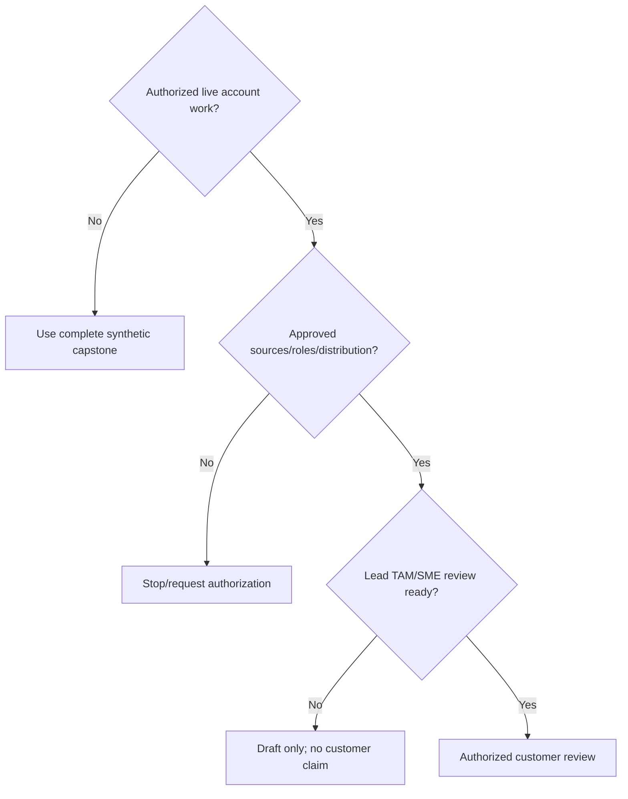

### 🔍 Plain-English deep-dive: a service review is a decision system

A cockpit dashboard is useful only because pilots connect instruments to decisions, owners and actions. A quarterly review is not a tour of charts; it selects material changes and risks, shows evidence and uncertainty, compares options, obtains decisions, assigns owners and later proves effectiveness.

## 2. Fully synthetic sanitized scenario: fictional account and discovery profile

**Customer:** Northstar Research Cooperative (`SYNTHETIC-TRAINING`). **Mission:** genomic research and regulated collaboration. **Services:** research NAS, database SAN, vSphere analytics, Kubernetes catalog, hybrid archive. **Review cutoff:** fictional `2026-08-24 00:00 UTC`.

| Persona | Outcome/concern | Decision right |
|---|---|---|
| CIO `NRC-EX-01` | Stability, risk, research deadlines | Business priority/risk acceptance |
| Infrastructure director | Roadmap, budget, windows | Infrastructure resources/sequence |
| Storage lead | ONTAP/protection operations | Storage implementation recommendation |
| VMware/platform lead | Host/hypervisor/app dependencies | Platform changes/testing |
| Security lead | Advisory/ransomware/access | Security controls/incident authority |
| App owners | Transactions, RPO/RTO, validation | App downtime and acceptance |
| Lead TAM (synthetic) | Integrated account governance | Review/coordination, not customer change |
| You role-play | Analysis and deliverables | Evidence quality; no production authority |

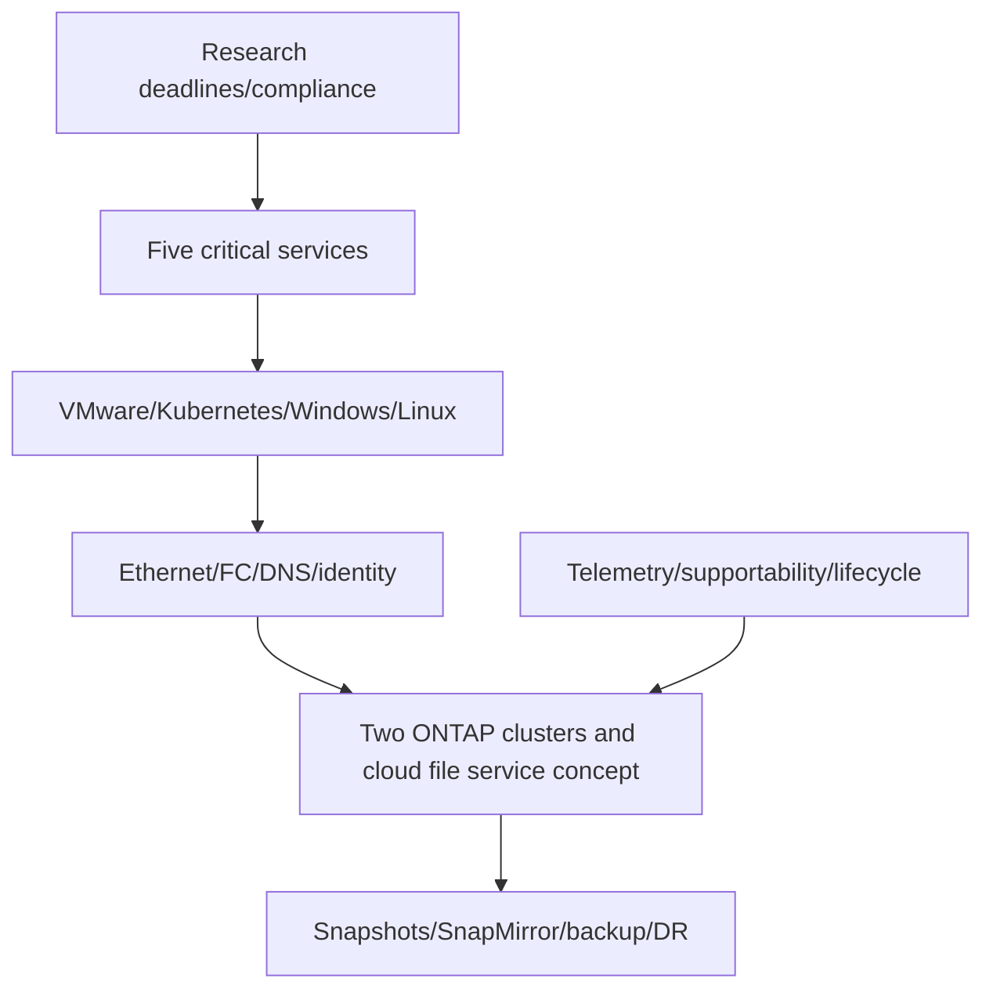

### Discovery questionnaire schema

| Area | Questions/evidence |
|---|---|
| Outcomes | Critical services, users, deadlines, compliance, planned growth |
| Objectives | SLA/SLO, RPO/RTO, retention, security, budget/window |
| Environment | App/host/network/storage/protection/cloud topology |
| Operations | Owners, change calendar, incidents, support model, suppliers |
| Risk | Known pain, accepted risk, unresolved actions, dependencies |
| Data | Source owners, population, freshness, definitions, access |

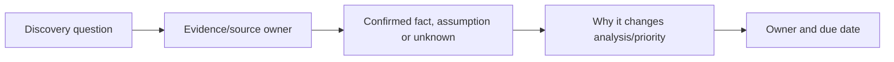

## 3. Architecture and failure domains before analysis

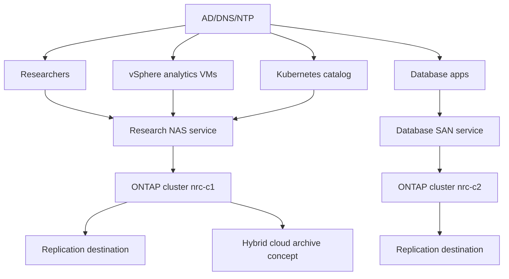

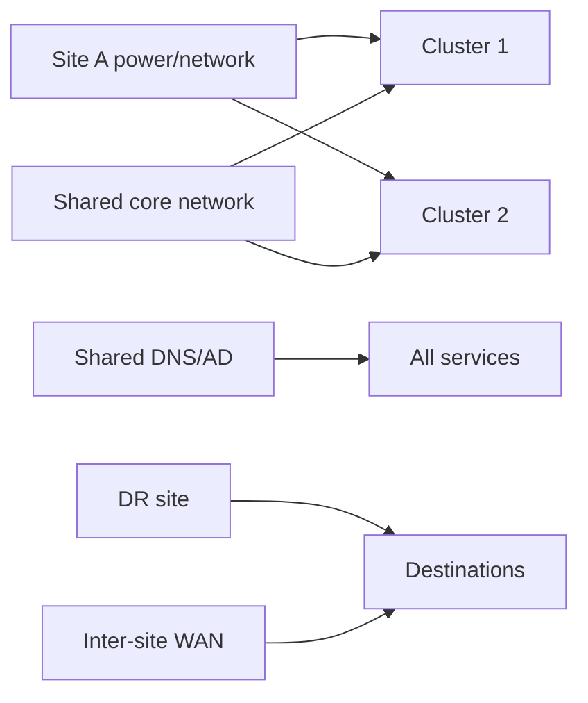

Common-fate finding: storage clusters are separate, but synthetic DNS/AD and one WAN hub are cross-service dependencies. Redundant arrays do not remove those failure domains.

## 4. Source register, cutoff, and privacy model

| Source ID | Synthetic source | Cutoff/freshness | Access | Primary use |
|---|---|---|---|---|
| S01 | CMDB extract | Current to cutoff | Restricted | Expected population/site/owner |
| S02 | AutoSupport history | One node stale | Gated-equivalent synthetic | Telemetry coverage/configuration |
| S03 | Digital Advisor export | Synthetic dated extract | Gated-equivalent synthetic | Wellness signals/trends |
| S04 | ONTAP inventory/health | Synthetic read-only | Restricted | Topology/state/version |
| S05 | IMT/HWU record | Synthetic result | Gated-equivalent synthetic | Compatibility/platform facts |
| S06 | Bugs/advisories/releases | Synthetic/public concepts | Mixed | Applicability/target |
| S07 | Incident/action history | Synthetic | Restricted | Recurrence/adoption |
| S08 | App SLO/RPO/RTO | Synthetic approved requirements | Restricted | Customer outcome |

### Read-only first and explicit change authorization

The capstone's discovery, extraction, reconciliation and analysis are read-only. Any live telemetry test, configuration collection beyond approved scope, remediation, failover, restore, upgrade or other state change is a separate work item requiring exact customer/owner authorization, current procedure, supportability, impact, stop condition, recovery/rollback, communication and validation. A service-review recommendation never authorizes its own implementation.

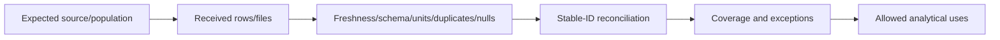

No source is silently substituted. Each visual carries cutoff and unknowns; account/commercial/security detail is separated by audience.

## 5. Install-base reconciliation

### Synthetic expected and observed population

| Asset | Stable ID | Expected state | Observed issue |
|---|---|---|---|
| Cluster 1 | `clu-0001` | Active, 2 nodes | Complete |
| Cluster 2 | `clu-0002` | Active, 2 nodes | Node 2 telemetry stale |
| Retired node | `node-0099` | Retired effective 2026-06-30 fictional | Still active in CMDB view |
| DR destination 1 | `dst-0001` | Active | Protection data current |
| DR destination 2 | `dst-0002` | Active | Latest app-valid point unknown |
| Cloud archive | `cloud-0001` | Pilot concept | Region/cost/support not decided |

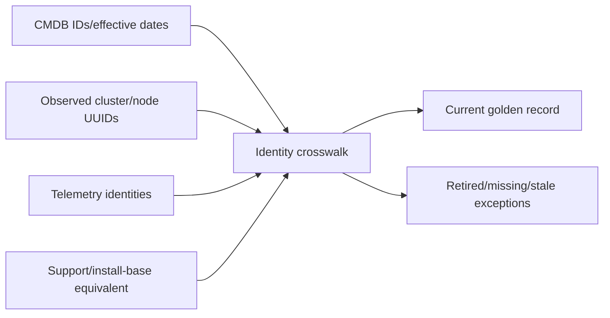

$$\text{Telemetry coverage} = \frac{3\ fresh\ expected\ nodes}{4\ expected\ nodes} = 75\%$$

The 75% is synthetic and applies only to this cutoff/definition; it is not a health score.

### 🔍 Plain-English deep-dive: a denominator is a governance decision

If the expected fleet excludes an inconvenient missing node, coverage looks perfect. The denominator must come from an accountable inventory owner and effective dates, not the telemetry system being evaluated. Show included, excluded and disputed assets so a percentage cannot hide population errors.

## 6. Health and telemetry assessment

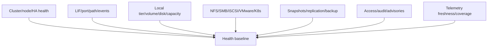

| Dimension | Synthetic condition | Classification |
|---|---|---|
| Cluster/HA | No current critical cluster state in observed data | Healthy for covered interval only |
| Network/path | One SAN path intermittently down on one host ring | Degraded/risk |
| Telemetry | Cluster 2 node 2 stale | Visibility risk/unknown health |
| Events | Three repeated path events in quarter | Recurrence signal |
| Security | Advisory feature absent on C1; C2 applicability unknown | Low/unknown split |

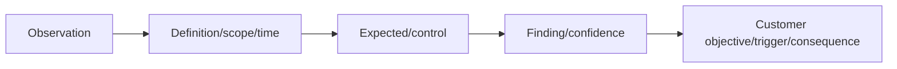

## 7. Performance assessment

**Synthetic workload:** database p99 transaction rises during monthly batch; ONTAP average latency remains moderate; affected VMs cluster on one ESXi host with a path event.

```mermaid
timeline
    title Synthetic batch incident causal order
    14:00 : Host path state changes
    14:00:02 : Datastore tail latency rises
    14:00:05 : Guest I/O wait rises
    14:00:08 : Database p99 misses SLO
    14:06 : Path restores; app recovers
```

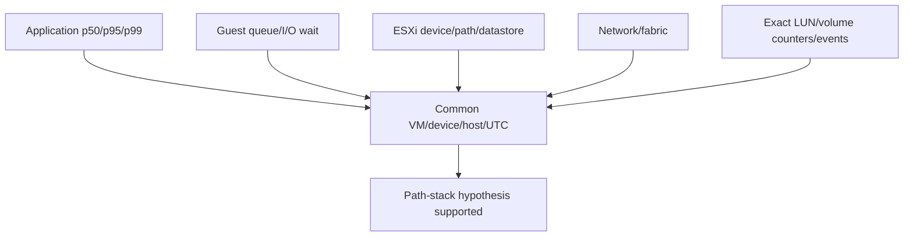

Finding: path-stack state correlates earlier than application tail for one host; an ONTAP-wide bottleneck is weakened. Exact driver/firmware support remains a current IMT gate. No defect or cause is declared from correlation alone.

## 8. Capacity and growth assessment

| Object | Physical used | Growth | Headroom/forecast | Synthetic concern |
|---|---:|---:|---|---|
| Research volume | 71% | 3%/month | Moderate | Snapshot growth adds uncertainty |
| Cluster 1 local tier | 78% | 2.4%/month | Action in forecast horizon | New analytics onboarding not modeled |
| Database volume | 65% | 1.2%/month | Adequate for current baseline | Batch change can raise snapshot use |
| DR destination 2 | Unknown current | Unknown | Unknown | Stale source blocks conclusion |

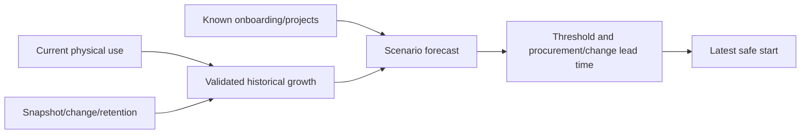

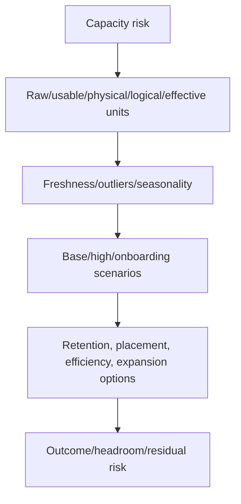

No sizing or purchase promise is made. The recommendation is to validate project demand and destination data before capacity commitment.

## 9. Protection and recoverability

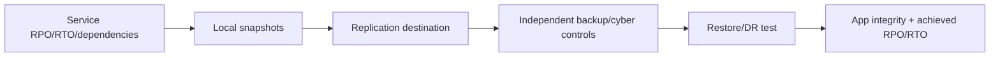

| Service | Requirement | Synthetic evidence | Gap |
|---|---|---|---|
| Research NAS | RPO 2h/RTO 4h fictional | Destination points under 90m; file restore tested | App dependency test incomplete |
| Database SAN | RPO 30m/RTO 90m fictional | Relationship configured; latest app-valid point unknown | Material recoverability unknown |
| Kubernetes catalog | RPO 1h/RTO 2h fictional | Volume snapshot ready | App config/secret/dependency omitted in prior test |

### 🔍 Plain-English deep-dive: protection status is a chain of custody

A package is useful only if it contains the right item, reaches the right destination, can be opened, and arrives before the deadline. Protection proof links application scope, consistent point, transfer/copy, catalog/keys/access, isolated restore, integrity/transactions, measured RPO/RTO and rollback/reprotection.

## 10. Supportability, lifecycle, advisory, and bug analysis

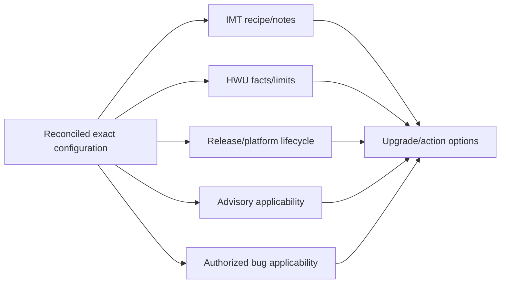

| Finding | Synthetic status | Confidence/action |
|---|---|---|
| C2 host adapter driver/firmware pair | Mismatch against synthetic exact recipe | High synthetic; hold rollout, verify live current IMT |
| C2 release runway | Five fictional months | Medium until live source; begin planning |
| Bug candidate | Similar symptom, trigger unknown | Low; collect signature and Support review |
| Public advisory C1 | Product/release match; feature absent | Medium; monitor revision, no exposure claim beyond evidence |
| HWU capacity fact | Source modeled current at cutoff | Revalidate before design |

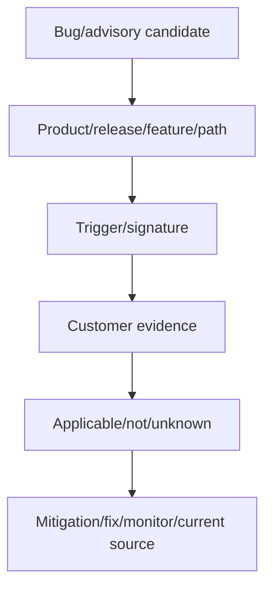

## 11. Incident and support-experience analysis

Synthetic quarter: seven cases, two path-related incidents, one recurring after a partial host rollout, one NAS identity issue, one telemetry case and three unrelated questions. Metrics are descriptive, not service commitments.

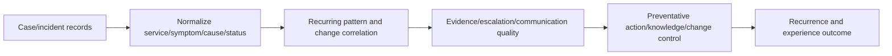

Finding: recurrence is linked to incomplete cross-stack compatibility and rollout controls, not case volume alone. Customer experience risk includes repeated evidence collection and uncertain ownership.

## 12. Risk model and prioritized register

Teaching model: Impact 1–5, Exposure 1–5, Urgency 1–5, Control weakness 1–5. The synthetic score is a discussion aid, not NetApp severity.

| Rank | Risk | I/E/U/C | Score | Confidence | Priority rationale |
|---:|---|---|---:|---|---|
| 1 | Database SAN path/support gap | 5/4/4/4 | 17 | High synthetic | Critical service, recurrence, rollout continuing |
| 2 | Database recovery unproven | 5/3/4/5 | 17 | Medium | High consequence; missing app-valid point |
| 3 | C2 telemetry blind spot | 4/4/3/4 | 15 | High | Blocks upgrade/health confidence |
| 4 | Lifecycle runway | 4/4/4/2 | 14 | Medium | Lead time makes action urgent |
| 5 | C1 capacity/onboarding | 4/3/3/3 | 13 | Medium | Forecast lacks project demand |
| 6 | Kubernetes app-scope gap | 3/3/3/4 | 13 | High synthetic | Volume point does not restore service |

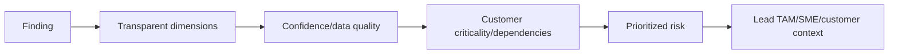

## 13. Prioritized recommendations

| ID | Recommendation | Owner(s) | Target | Validation | Residual risk |
|---|---|---|---|---|---|
| A1 | Stop host-stack rollout; validate listed recipe and canary path failure/recovery | VMware/fabric/storage | Fictional 2026-09-15 | Exact recipe + zero path errors + app SLO | Remaining hosts pending staged rollout |
| A2 | Run isolated database recovery test with complete dependencies | App/protection/BC | 2026-09-22 | App-valid point; RPO/RTO/integrity | Site-wide identity dependency still separate |
| A3 | Repair C2 node telemetry/association | Storage/network/account | 2026-09-05 | 2/2 nodes complete/fresh | Secure environments may need alternate evidence |
| A4 | Approve target/path planning workstream | Storage/app/change | 2026-09-12 | Current IMT/HWU/release/path/prechecks/window | Target not yet approved |
| A5 | Add analytics onboarding to capacity scenarios | Capacity/app/finance | 2026-09-10 | Base/high forecast and latest safe start | Demand uncertainty remains |
| A6 | Expand Kubernetes application protection scope | Platform/app/security | 2026-09-25 | Isolated app transaction test | External service dependency remains |

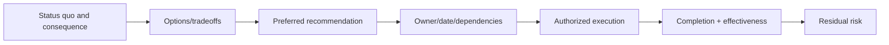

## 14. Excel workbook model and schemas

Workbook tabs:

| Tab | Grain/key | Purpose/quality gate |
|---|---|---|
| `README_Control` | Run | Scope, cutoff, classifications, refresh and limitations |
| `Sources` | Source ID | Owner/access/revision/date/row count/hash |
| `Assets` | Stable asset ID | Golden install base/effective dates |
| `Services` | Service ID | Criticality/SLO/RPO/RTO/owners |
| `Telemetry` | Asset-message-time | Freshness/coverage/content |
| `Health_Perf_Cap` | Object-time-metric | Typed units/definitions/baselines |
| `Supportability` | Configuration ID | IMT/HWU/lifecycle/app evidence |
| `Applicability` | Item-asset | Advisory/bug evidence/classification |
| `Incidents` | Incident ID | Service/timeline/cause/action |
| `Risks` | Risk ID | Dimensions/confidence/controls |
| `Recommendations` | Recommendation ID | Options/owner/date/validation/residual |
| `Actions` | Action ID | Status/blocker/aging/proof |

```mermaid
erDiagram
    SERVICES ||--o{ ASSETS : depends_on
    ASSETS ||--o{ TELEMETRY : emits
    ASSETS ||--o{ METRICS : has
    ASSETS ||--o{ SUPPORTABILITY : evaluated_by
    ASSETS ||--o{ APPLICABILITY : assessed_for
    SERVICES ||--o{ INCIDENTS : experiences
    SERVICES ||--o{ RISKS : threatened_by
    RISKS ||--o{ RECOMMENDATIONS : addressed_by
    RECOMMENDATIONS ||--o{ ACTIONS : implemented_by
```

Quality checks: unique keys, referential integrity, effective-date overlap, source coverage, null classification, unit/type checks, duplicate joins, row-count reconciliation, cutoff enforcement, formulas isolated from raw data, refresh log and reviewer signoff.

## 15. Power BI dashboard concept

```mermaid
flowchart TB
    MODEL[Star-schema semantic model] --> EXEC[Executive page: outcomes/material risk]
    MODEL --> FLEET[Fleet page: coverage/health/lifecycle]
    MODEL --> TECH[Technical page: performance/capacity/protection]
    MODEL --> ACTIONS[Action page: owners/aging/blockers]
    MODEL --> QA[Data quality page: freshness/exceptions]
    EXEC --> DRILL[Drill-through to evidence IDs]
    FLEET --> DRILL
    TECH --> DRILL
    ACTIONS --> DRILL
```

Dashboard rules: show denominator and cutoff; distinguish unknown from zero; accessible color/labels; do not imply causation; protect row-level access; use tooltips for definitions; link to evidence not restricted raw data; separate source severity from customer priority.

### 🔍 Plain-English deep-dive: a dashboard compresses evidence and can compress away truth

A map helps navigation by omitting detail, but a missing bridge changes the journey. Every KPI needs population, time, definition, unit, unknown count and drill-through. The executive page simplifies; it must not erase evidence gaps, confidence or residual risk.

## 16. PowerPoint service-review storyboard

| Slide | Message headline | Decision/owner |
|---:|---|---|
| 1 | Northstar stability is broadly serviceable, with two material unproven controls | Frame review |
| 2 | Coverage is 75%; one stale node limits C2 health/upgrade confidence | Approve telemetry owner/date |
| 3 | SAN recurrence correlates with a mixed host-stack rollout | Hold rollout; validate recipe/canary |
| 4 | Database protection is configured but application recovery is unproven | Approve isolated recovery test |
| 5 | Lifecycle runway requires target planning now, not an immediate upgrade promise | Start planning workstream |
| 6 | C1 capacity remains manageable only if onboarding demand is included | Supply project forecast |
| 7 | Six recommendations reduce near-term stability and planning risk | Confirm priority/owners |
| 8 | Decisions and actions for the next 30 days | Close meeting |
| Appendix | Topology, sources, IMT/HWU, bug/advisory, metrics, definitions | Technical defense |

```mermaid
flowchart LR
    OUT[Customer objectives/outcomes] --> CHANGE[What changed this quarter]
    CHANGE --> RISKS[Material risks and evidence]
    RISKS --> OPTIONS[Options/recommendations]
    OPTIONS --> DEC[Decision asks]
    DEC --> ACTIONS[Owners/dates/proof]
    ACTIONS --> APPENDIX[Technical evidence appendix]
```

Do not paste portal screenshots when a recreated sanitized chart communicates the decision. Label every chart `Synthetic`, cutoff, source IDs and limitations.

## 17. Twenty-minute presentation script

```mermaid
timeline
    title Synthetic 20-minute quarterly service review
    00-02 : Purpose, outcomes, decisions needed
    02-05 : Scope, coverage and material changes
    05-10 : SAN and protection risks
    10-13 : Lifecycle and capacity planning
    13-17 : Recommendations and tradeoffs
    17-20 : Decisions, owners, dates and close
```

### Opening

`This is a fully synthetic review. At the fictional 24 August cutoff, core services are observed as available for covered data, but one stale telemetry source limits cluster-2 confidence. The two material decisions are to pause the mixed SAN host-stack rollout pending exact compatibility/canary validation and to approve an isolated database recovery test. I will separate verified facts, unknowns, recommendations and customer decisions.`

### Technical-risk transition

`The recurring database symptom begins with a host-path state change before datastore and application tail latency. That weakens an ONTAP-wide bottleneck and makes the mixed host recipe the leading hypothesis, but exact live IMT evidence would still be required. The safest action is to stop expansion, preserve a healthy control ring and validate one listed recipe.`

### Protection transition

`Replication is configured, but the latest application-valid database point and complete dependency recovery have not been proved. The recommendation is an isolated timed test, not a production failover.`

### Close

`We need six decisions/owners today. Completion will not equal value: we will close actions only after telemetry coverage, path stability, application recovery, planning readiness and capacity forecast are validated. Residual risk stays visible.`

## 18. Objections, decisions, and action register

| Objection | Interest underneath | Evidence-based response | Decision path |
|---|---|---|---|
| `The database is up; do not delay rollout` | Deadline/efficiency | Degraded path plus unvalidated recipe raises next-event exposure; preserve healthy control and canary | Infrastructure director decides after app/fabric input |
| `Backup jobs are green` | Avoid test effort | Jobs prove configured tasks, not complete app recovery/RTO | BC/app owner approves isolated test |
| `Upgrade to the newest release` | Remove lifecycle risk quickly | Target requires exact hardware/host/app/path/release/precheck validation | Planning workstream chooses target |
| `The dashboard says capacity is fine` | Avoid spend | Project demand and DR data are missing; show scenarios/unknowns | Capacity/app owner supplies forecast |
| `Share the raw export` | Evidence trust | Restricted/gated data remains secure; provide sourced sanitized appendix and controlled review | Data owner grants role-specific access |

```mermaid
flowchart LR
    OBJECT[Acknowledge objection/interest] --> FACT[Restate agreed facts/unknowns]
    FACT --> OPT[Offer feasible options/tradeoffs]
    OPT --> AUTH[Identify decision authority]
    AUTH --> LOG[Decision/rationale/expiry]
    LOG --> ACT[Owner/date/proof/residual]
```

### Action-register schema

| Field | Example |
|---|---|
| Action ID | `A1` |
| Recommendation/risk | `R1 SAN path/support gap` |
| Accountable owner | VMware platform lead |
| Contributors | Storage/fabric/app/Support |
| Target/latest safe start | Fictional dates, both recorded |
| Status/blocker | Accepted / current IMT validation pending |
| Completion evidence | Recipe and canary report |
| Effectiveness evidence | No path recurrence; app p99 within SLO |
| Residual risk/reopen trigger | Remaining hosts; any new path event |
| Decision source | Meeting/date/persona token |

```mermaid
stateDiagram-v2
    [*] --> Proposed
    Proposed --> Accepted
    Accepted --> InProgress
    InProgress --> Blocked
    Blocked --> InProgress
    InProgress --> Implemented
    Implemented --> EffectivenessValidating
    EffectivenessValidating --> Closed
    EffectivenessValidating --> Reopened: Success not sustained
```

## 19. Follow-up and value measurement

```mermaid
flowchart LR
    MINUTES[24-hour synthetic minutes/decisions] --> TRACK[Weekly owner/blocker follow-up]
    TRACK --> EVID[Implementation evidence]
    EVID --> EFFECT[Effectiveness window]
    EFFECT --> VALUE[Customer outcome contribution]
    VALUE --> NEXT[Next review/baseline]
```

| Outcome | Baseline | Success evidence | Attribution caveat |
|---|---|---|---|
| Telemetry coverage | 75% | 4/4 expected nodes complete/fresh | Coverage, not health by itself |
| SAN stability | 3 path events/quarter synthetic | No recurrence over agreed comparable interval and canary pass | Workload/change differences remain |
| Recoverability | App-valid point/RTO unknown | Integrity/transactions and RPO/RTO within objective | One scenario does not prove all disasters |
| Planning readiness | Target/path incomplete | Reviewed target/path/prechecks/window | Upgrade not yet executed |
| Capacity decision | Onboarding absent | Approved high/base scenario and latest safe start | Demand forecast uncertain |

### 🔍 Plain-English deep-dive: value is contribution, not ownership of causation

A coach can contribute to a team's improvement but cannot claim every win. A TAM connects earlier evidence, decisions and coordinated action to measured movement while naming customer/team contributions and external factors. Meetings, slides and closed tickets are activities; verified risk reduction or decision readiness is value evidence.

## 20. Positive, negative, failure, recovery, and rollback tests

| Test | Expected capstone behavior |
|---|---|
| Positive | Every slide claim resolves to workbook evidence and source IDs | Traceability passes |
| Negative | Retired asset cannot receive current metric/risk | Join/QA blocks it |
| Failure injection | Remove C2 telemetry source | Coverage and confidence fall; conclusion becomes unknown |
| Failure injection | Challenge SAN cause with healthy-control evidence | Model retains alternatives and changes if prediction fails |
| Recovery | Restore source/correct model and rerun review | Outputs update after reviewer approval |
| Rollback | Revert flawed workbook/dashboard/deck version | Prior approved package reproducible |
| Privacy negative | Request raw gated/customer data for portfolio | Denied; sanitized schema/diagram supplied |

```mermaid
stateDiagram-v2
    [*] --> DraftPack
    DraftPack --> QA
    QA --> ReviewerRejected: Evidence/claim/privacy gap
    ReviewerRejected --> Revised
    Revised --> QA
    QA --> ApprovedSyntheticReview
    ApprovedSyntheticReview --> Presented
    Presented --> DecisionsLogged
    DecisionsLogged --> FollowUp
    FollowUp --> EffectivenessValidated
```

## 21. Evidence capture, cleanup, and portfolio structure

```mermaid
flowchart TB
    README[Scope, synthetic label, exact nonclaim] --> SRC[Source/version register]
    README --> XLS[Workbook schema and sample synthetic rows]
    README --> PBI[Dashboard wireframes/measure definitions]
    README --> PPT[Slide storyboard and script]
    README --> RISKS[Risk/recommendation/action registers]
    README --> RUBRIC[Validation and panel scores]
    README --> REFLECT[Lessons, unknowns, next steps]
```

Keep raw synthetic generator files separate from presentation derivatives; label every page. Delete temporary accounts, exports, test resources, screenshots and chargeable infrastructure according to the plan; verify no secrets/metadata or real identifiers. No cost, product result or job outcome is promised.

**Honest portfolio/interview language:** `I built and defended a fully synthetic NetApp TAM quarterly-service-review capstone covering discovery, data quality, technical risk, recommendations, workbook/dashboard/deck schemas, objections and follow-up. I did not access live NetApp customer tools, deliver a production NetApp review, authorize changes or produce these fictional outcomes.`

## 22. Common failures and capstone hypothesis tree

```mermaid
flowchart TD
    WEAK[Review challenged or action stalls] --> DATA{Population/source/freshness trusted?}
    DATA -->|No| QA[Repair data quality/coverage]
    DATA -->|Yes| CLAIM{Finding mechanism and alternatives supported?}
    CLAIM -->|No| ANALYZE[Reframe/collect discriminating evidence]
    CLAIM -->|Yes| RISK{Connected to customer objective/horizon?}
    RISK -->|No| CONTEXT[Add business exposure/controls]
    RISK -->|Yes| ACTION{Feasible owner/options/dependencies?}
    ACTION -->|No| REDESIGN[Reframe recommendation]
    ACTION -->|Yes| AUTH{Decision authority engaged?}
    AUTH -->|No| GOV[Use governance/escalation]
    AUTH -->|Yes| PROOF[Track completion/effectiveness/residual]
```

Failure patterns: dashboard recital, stale-green data, name-only joins, every issue labeled critical, generic best practice, newest-release bias, hidden uncertainty, slide without decision, action without accountable owner, completion without effectiveness, value overclaim, raw restricted evidence, invented product result or NetApp authority.

## 23. Panel defense

```mermaid
flowchart LR
    PANEL[Panel question] --> CLARIFY[Clarify service/scope/decision]
    CLARIFY --> CLAIM[State bounded claim and evidence]
    CLAIM --> ALT[Name alternative/unknown]
    ALT --> ACTION[Recommend option/owner/test]
    ACTION --> BOUND[State authority and experience boundary]
```

### Defense prompts

1. Why is SAN risk ranked above lifecycle when scores overlap?
2. What evidence would falsify the host-path hypothesis?
3. Why not upgrade immediately?
4. Why is a green replication relationship insufficient?
5. What would you remove for a five-minute executive version?
6. How do you protect restricted data while earning trust?
7. Which recommendation would you defer if resources halve?
8. What can you truthfully claim you did?

### Defense language

`The synthetic score ties, but the SAN issue has observed recurrence in a critical service and an active rollout multiplier, so I apply a documented priority override. If matched evidence shows the same latency on healthy hosts/paths before the path event, I would lower that hypothesis and test shared storage or application causes. I recommend pausing expansion, not declaring root cause.`

## 24. Validation rubric

| Dimension | 1 - weak | 3 - competent | 5 - interview-ready |
|---|---|---|---|
| Discovery | Array-only | Services/owners mapped | Outcomes, dependencies, constraints and unknowns drive analysis |
| Data quality | Unstated | Cutoff/coverage shown | Stable IDs, provenance, exceptions and reproducible QA |
| Technical depth | Product nouns | Layered findings | Mechanisms, controls, alternatives and current support gates |
| Risk | Color only | Impact/likelihood stated | Trigger, objective, horizon, controls, confidence, residual |
| Recommendations | Generic | Owner/action/date | Options, dependencies, validation, rollback/recovery, value |
| Communication | Dense slides | Clear narrative | Audience-calibrated decisions and defensible appendix |
| Influence | Pushes answer | Handles objection | Reveals interest, options, authority and records decision |
| Ethics | Overclaims | Labels synthetic | Protects access/privacy and exact production boundary |
| Follow-up | Completion only | Action tracker | Effectiveness, reopen trigger and measured contribution |

```mermaid
flowchart LR
    SCORE[Self and peer score] --> LOW[Dimensions below 4]
    LOW --> PRACTICE[Targeted artifact/answer revision]
    PRACTICE --> PANEL[Repeat panel defense]
    PANEL --> READY[All critical dimensions at 4+ with honest boundary]
```

## 25. JD Mapping and background tie

| JD responsibility | Capstone evidence | Your factual bridge and boundary |
|---|---|---|
| Generate/analyze/report customer data | Source register, install-base model, workbook and dashboard schemas | Microsoft analytics/reviews transfer; all NetApp account data here is synthetic |
| Strategic planning and upgrade advice | Lifecycle/supportability gates, target-planning action and scenario roadmap | Release/change reasoning transfers; no production ONTAP upgrade approval |
| Maintain accurate install base | Stable-ID/effective-date reconciliation and exception queue | Data-quality experience transfers; no live NetApp install-base ownership |
| Conduct operational reviews | Eight-slide storyboard, timed script, objections and decision log | Microsoft business reviews transfer; no production NetApp review delivery |
| Mitigate risk and track remediation | Risk register, recommendations, action/effectiveness/residual-risk model | critical situation/action tracking transfers; customer change authority remains external |
| Improve technical recommendations | Evidence-to-claim traceability, confidence, reviewer and rubric | Technical writing/Engineering collaboration transfer; no NetApp support position claimed |
| Microsoft Office and communication | Excel, Power BI and PowerPoint artifact schemas | Factual tool/communication strengths applied to synthetic data |
| Coach and contribute to SMEs | Panel defense, reusable templates and teach-back artifacts | Mentoring experience transfers; no NetApp SME or certification claim |

## 26. Official and Public Source Anchors

**Date checked: 2026-08-24.** These sources anchor public concepts/navigation only. They do not validate the fictional account, scores, recommendations, product support, bugs, service roles or outcomes.

| Topic | Official source | Bounded use |
|---|---|---|
| ONTAP | [NetApp ONTAP documentation](https://docs.netapp.com/us-en/ontap/) | Current architecture/task navigation |
| AutoSupport | [ONTAP AutoSupport](https://docs.netapp.com/us-en/ontap/system-admin/manage-autosupport-concept.html) | Telemetry architecture |
| Digital Advisor | [Active IQ Digital Advisor](https://docs.netapp.com/us-en/active-iq/) | Current public service navigation |
| IMT | [NetApp Interoperability Matrix Tool](https://imt.netapp.com/) | Authorized exact compatibility evidence |
| HWU | [NetApp Hardware Universe](https://hwu.netapp.com/) | Authorized platform facts/limits |
| Bugs | [NetApp Bugs Online](https://mysupport.netapp.com/site/bugs-online) | Authorized bug evidence |
| Advisories | [NetApp Security Advisories](https://security.netapp.com/advisory/) | Public current advisory source |
| Release/upgrade | [ONTAP release notes](https://docs.netapp.com/us-en/ontap-release-notes/), [Upgrade ONTAP](https://docs.netapp.com/us-en/ontap/upgrade/) | Target/path/precheck navigation |
| Protection | [ONTAP data protection and disaster recovery](https://docs.netapp.com/us-en/ontap/data-protection-disaster-recovery/) | Recovery architecture |
| Microsoft tools | [Excel documentation](https://support.microsoft.com/excel), [Power BI documentation](https://learn.microsoft.com/power-bi/), [PowerPoint documentation](https://support.microsoft.com/powerpoint) | Current Office feature guidance |

## 27. Self-Test and Teach-Back

1. Deliver the account/outcome/topology story in two minutes.
2. Reconcile the install base and explain the 75% denominator.
3. Defend each health/performance/capacity/protection finding and alternative.
4. Build IMT/HWU/lifecycle/bug/advisory applicability records.
5. Recalculate risks and justify the SAN priority override.
6. Recreate workbook schemas, dashboard pages and slide headlines.
7. Deliver the 20-minute script and five-minute executive cut.
8. Answer all five objections and log decisions/actions.
9. Score the package with the rubric and repeat the eight panel prompts.
10. State exact synthetic and no-production-NetApp boundaries.

---

## Likely Interview Questions

### Q1. How would you prepare a quarterly service review?

> **Model answer:** `I agree outcomes, audience, decisions, scope and cutoff; reconcile install base and source coverage; analyze health, performance, capacity, protection, supportability, lifecycle, bugs/advisories and incidents; prioritize risks with confidence; review recommendations with the lead TAM/SMEs; build a message-first deck and appendix; then capture decisions, owners, dates, proof and residual risk.`

### Q2. What are the two most important findings in this capstone?

> **Model answer:** `First, recurring database path events correlate with a mixed host-stack rollout, so expansion should pause pending exact current recipe and canary path validation. Second, database replication is configured but an application-valid point and complete recovery are unproved, so an isolated timed restore is required. Both are synthetic and remain current-source/owner gated.`

### Q3. How do you ensure the review data is trustworthy?

> **Model answer:** `I define the expected population independently, use stable IDs/effective dates, record source/access/revision/cutoff, reconcile row counts and parent relationships, preserve null/unknown, validate units/definitions and transformations, maintain exception and audit logs, and make every slide claim drill to evidence IDs and a reviewer.`

### Q4. How do you prioritize and communicate risk?

> **Model answer:** `I expose impact, exposure, urgency, controls and supportability plus confidence, then add customer criticality/dependencies and document overrides. I communicate verified condition, trigger/mechanism, customer objective, horizon, controls, options, recommendation, owner/date, validation and residual risk, keeping source severity separate from priority.`

### Q5. How do you handle a customer who rejects your top recommendation?

> **Model answer:** `I identify the interest—deadline, outage, cost or evidence trust—restate facts and unknowns, offer feasible status-quo/phased/canary options and tradeoffs, and identify decision authority. If deferred, I record rationale, owner, expiry/latest safe start, monitoring, reopen trigger and residual risk rather than claiming adoption.`

### Q6. How do Excel, Power BI, and PowerPoint work together?

> **Model answer:** `Excel/Power Query can hold controlled source, reconciliation and analysis tables; Power BI can provide governed interactive population/trend/action views; PowerPoint presents the decision narrative and appendix. They share stable IDs, definitions, cutoff and evidence links. I QA each layer and never let a visual hide unknowns or restricted raw data.`

### Q7. How do you prove TAM value after the review?

> **Model answer:** `I distinguish action completion from effectiveness and compare agreed baselines with sustained outcomes: coverage, recurrence, recoverability, planning readiness, headroom or decision cycle. I state contribution and attribution limits, preserve customer/team ownership and keep residual risk/reopen triggers visible. Meetings and slides alone are activity.`

### Q8. What can you honestly claim from this capstone?

> **Model answer:** `I can say I built and defended a fully synthetic NetApp TAM service-review capstone using public concepts: discovery, data QA, technical analysis, risk, recommendations, workbook/dashboard/deck schemas, objections and follow-up. I cannot say I accessed live tools, managed a NetApp account, approved changes or produced these outcomes in production.`

---

## 30-Second Memory Hooks

- **Review:** decision system, not dashboard tour.
- **Flow:** discover -> reconcile -> analyze -> risk -> recommend -> decide -> prove.
- **Denominator:** expected population comes from accountable inventory.
- **Health:** covered interval and dimensions only.
- **Performance:** correlate VM/path/object/UTC; alternatives remain.
- **Protection:** point + transfer + access + app restore + RPO/RTO.
- **Risk:** dimensions + confidence + context + documented override.
- **Workbook/dashboard/deck:** model, explore, decide.
- **Action:** owner + date + blocker + completion + effectiveness + residual.
- **Value:** measured contribution, never activity or sole causation.
- **Capstone claim:** fully synthetic preparation, not NetApp production work.

---

## Completion Checklist

- [ ] State all five safety labels and exact synthetic/production nonclaim.
- [ ] Use only the complete synthetic pack or fully authorized account route.
- [ ] Document objectives, prerequisites, safety, ethics and architecture first.
- [ ] Complete discovery, personas, outcomes, topology and source register.
- [ ] Reconcile install base, effective dates, telemetry coverage and exceptions.
- [ ] Analyze health, performance, capacity, protection and incidents.
- [ ] Validate supportability, lifecycle, advisory, bug and upgrade evidence.
- [ ] Score/prioritize risks transparently with confidence and override rationale.
- [ ] Produce option-based recommendations with owners/dates/proof/residual risk.
- [ ] Build all Excel schemas, Power BI pages and PowerPoint storyboard/script.
- [ ] Handle objections, decisions, action register and follow-up/value measures.
- [ ] Run positive, negative, failure-injection, recovery and package-rollback tests.
- [ ] Defend the package through eight panel prompts and score the rubric.
- [ ] Capture sanitized evidence and complete privacy/access/resource/cost cleanup.
- [ ] Recheck official sources dated 2026-08-24 and answer exact Q1-Q8 aloud.

---

*Next suggested section:* [Part 92 - ITIL, SRE, Support Operations, Quality, and Continual Improvement](Part-92-itil-sre-support-operations.md)