# Part 92 - ITIL, SRE, Support Operations, Quality, and Continual Improvement

> **Section goal:** Use ITIL 4, Site Reliability Engineering, and Knowledge-Centered Service as distinct but complementary lenses for reliable support operations. By the end, Arti can distinguish incidents, problems, changes, requests, known errors and knowledge; reason about severity, SLA/OLA, SLI/SLO/error budgets and toil; manage queue quality; run PIRs; and design safe improvement experiments without claiming certification or a NetApp internal process.

Covers index item **92** and maps to job-description responsibilities for support experience, complex/high-pressure work, quality improvement, technical analysis, preventative remediation, special projects, coaching, knowledge contribution, cross-functional teams, operational reviews and customer loyalty.

**Privacy and access boundary:** Tickets, incidents, problems, changes, known errors, knowledge, service metrics, and personnel data require role-based access and approved handling.

**Synthetic-evidence rule:** Every service, SLI/SLO, error budget, queue, incident, quality sample, result, and improvement below is fictional and sanitized.

**Version caveat:** Framework publications, terminology, certification schemes, products, and organizational practices change; complete current-doc checks and use the employer's approved process.

**Explicit nonclaim:** Arti does not claim ITIL, SRE, KCS or NetApp service-management certification; has not designed NetApp internal support operations; and has not implemented the fictional metrics, processes, automations or outcomes below for a NetApp customer or team.

**Privacy/access:** Support operations can expose customer identity, incidents, employee performance, cases, severity, contracts, vulnerabilities, defects, communications, quality scores, sentiment, staffing and commercial information. Use purpose-limited access, minimum personal data, calibrated/aggregated reporting, approved repositories, retention, secure links and authorized HR/legal/security/customer review. Do not use individual metrics for hidden surveillance or publish customer/case data.

**Synthetic-evidence:** Every customer, incident, queue, SLA/OLA, SLI/SLO, error budget, score, threshold, known error, article, automation, experiment, person, date and outcome below is fictional and sanitized. Nothing is a NetApp internal target, process, service commitment or employee record.

**Version/current-doc:** ITIL, SRE and KCS guidance, certifications, terminology, standards, organizational policies, service contracts, products, tooling and legal requirements change. Sources were checked **2026-08-24**. Verify current official sources and the actual organization's definitions before applying a framework.

This Part is an educational orientation, not certification training, legal/contract interpretation, a fixed severity matrix, an SLO commitment, a staffing formula or authority to change support policy.

> **No-production-NetApp boundary:** Arti's factual strengths are Microsoft enterprise support/escalation, CRITSIT, CSAT, case-quality and backlog analysis, Product/Engineering collaboration, mentoring, technical writing, analytics and process improvement. Her exact nonclaim is: **she has not operated NetApp support or reliability processes.** She may use Microsoft examples factually and the NetApp scenario only as a synthetic exercise.

---

## 1. Three lenses, three purposes

| Lens | Plain orientation | Core question | Do not confuse with |
|---|---|---|---|
| ITIL 4 | Service-management practices and value-system concepts | How do people, processes, partners and technology co-create service value? | A rigid universal workflow |
| SRE | Engineering reliability using service objectives, automation and operational feedback | What reliability do users need, how do we measure it, and where should engineering effort go? | Only an operations job title |
| KCS | Knowledge created, reused and improved as part of solving work | How does each interaction improve findability and collective resolution? | A static article-writing project |

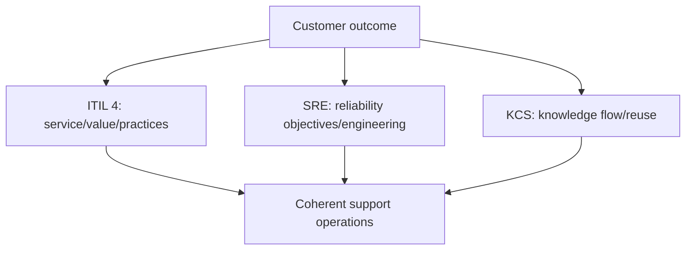

### 🔍 Plain-English deep-dive: frameworks are maps, not laws of physics

A city map helps navigation but does not tell every driver exactly when to turn in every traffic condition. Frameworks provide vocabulary, principles and patterns; organizations tailor definitions, ownership and controls. Say `ITIL-aligned concept` or `SRE practice` only when accurate, and never invent a NetApp internal workflow from a public framework.

## 2. ITIL 4 value orientation

ITIL 4 discusses a **service value system** and practices that help organizations co-create value. A **service** enables outcomes without customers owning every underlying cost and risk; the exact relationship remains contract/context-specific.

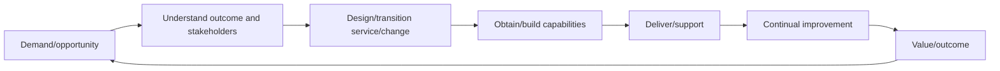

Do not present this learning diagram as the precise official ITIL service value chain text or a NetApp process; consult licensed/current official materials for formal certification content.

## 3. Incident, problem, change, request, and known error

| Concept | Plain meaning | Primary outcome |
|---|---|---|
| Incident | Unplanned interruption/reduction or service-impact event | Restore acceptable service safely |
| Problem | Cause or potential cause of incidents | Understand/control recurrence risk |
| Change | Addition/modification/removal that can affect service | Achieve benefit with controlled risk |
| Service request | Standard user/customer request for information/access/service | Fulfill agreed request efficiently |
| Known error | Problem understood enough to document cause/workaround or control | Faster/safer diagnosis and mitigation |
| Knowledge | Reusable contextual guidance/evidence | Improve decisions and resolution quality |

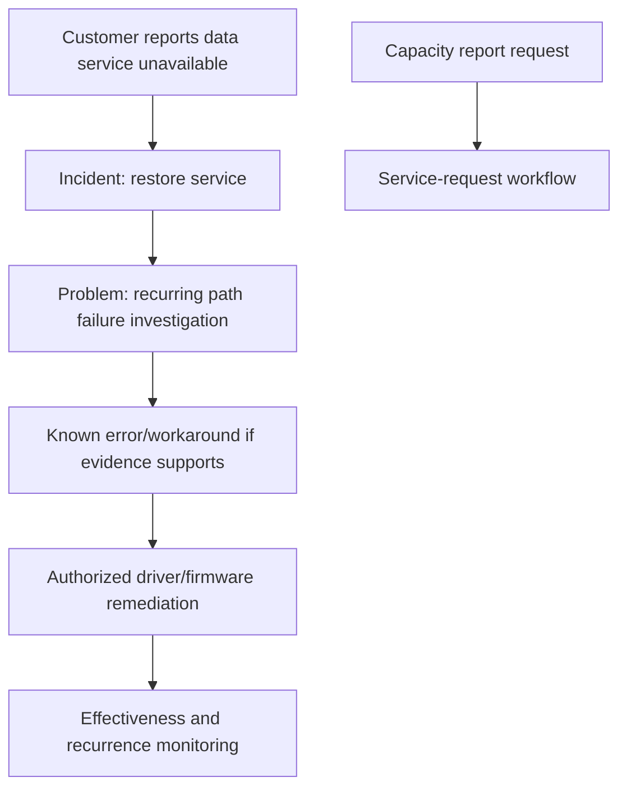

### 🔍 Plain-English deep-dive: recovery does not prove root cause

Resetting a circuit breaker may restore power, but it does not explain why it tripped. Incident management prioritizes safe restoration and communication; problem management develops a defensible causal model and prevention. Keep mitigation, workaround, recovery, fix, root cause and contributing factors distinct.

## 4. Incident lifecycle and command

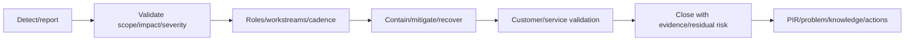

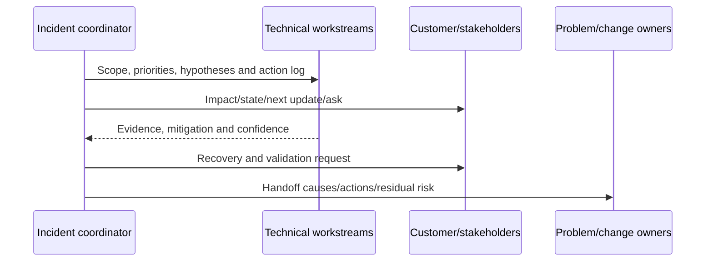

Severity should reflect agreed impact/urgency and contract/policy, not emotional volume. Incident roles and communications can scale without turning every event into a major incident.

## 5. Severity, priority, SLA, OLA, and SLO are not synonyms

- **Severity:** classification of incident impact/urgency under a defined scheme.
- **Priority:** relative order for work, considering severity plus deadlines, dependencies and risk.
- **Service-level agreement (SLA):** documented service commitment between provider and customer under its actual terms.
- **Operational-level agreement (OLA):** internal/operational commitment supporting a service, organization-specific.
- **Service-level objective (SLO):** target level for a measured service indicator, commonly used in SRE.

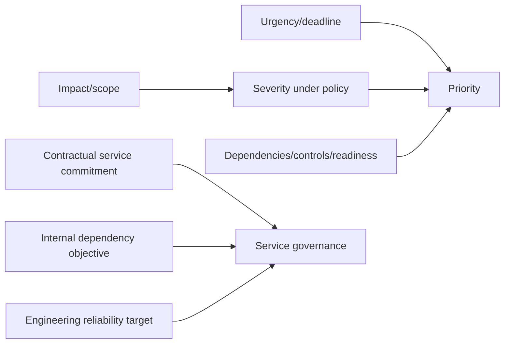

Never quote a response/resolution commitment without the actual contract and current policy. A severity label does not prove defect severity or customer business priority.

## 6. SRE: SLI, SLO, SLA, and user journey

- **Service-level indicator (SLI):** measured signal representing a user-relevant service behavior.
- **SLO:** target/range for an SLI over a defined window.
- **SLA:** agreement with consequences/terms; not every SLO is an SLA.

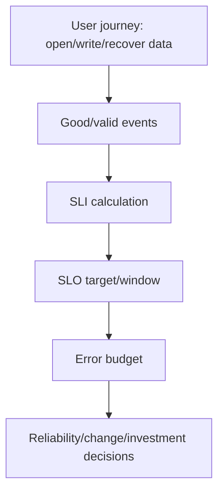

Example synthetic availability SLI:

$$\text{SLI} = \frac{\text{successful valid user operations}}{\text{eligible user operations}}$$

Define eligibility, success, exclusions, measurement source, window and missing-data handling. Storage uptime may be a component indicator, not the end-user SLI.

## 7. Error budgets and reliability tradeoffs

An **error budget** is the permitted unreliability implied by an SLO over a window. For an SLO target $S$, the nominal budget fraction is $1-S$ under the exact SLI definition.

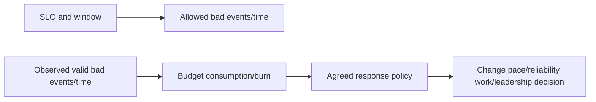

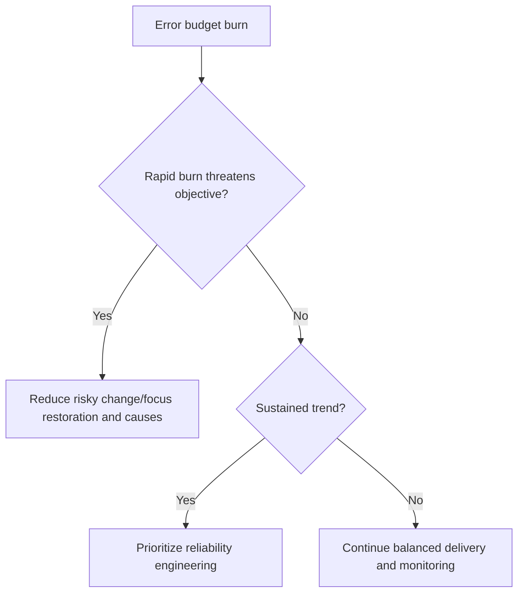

### 🔍 Plain-English deep-dive: an error budget is a decision tool, not permission to fail

A household budget allows planned spending but does not require wasting the balance. Error budgets make reliability tradeoffs visible; they do not excuse avoidable incidents or override safety, security, legal or customer obligations. Policies must state who decides and what signals change release behavior.

## 8. Toil, automation, and reliability engineering

**Toil** in SRE is manual, repetitive, automatable, tactical work that scales with service growth and lacks enduring value, under the precise context. Not all operational work is toil; judgment, relationship and learning can be valuable.

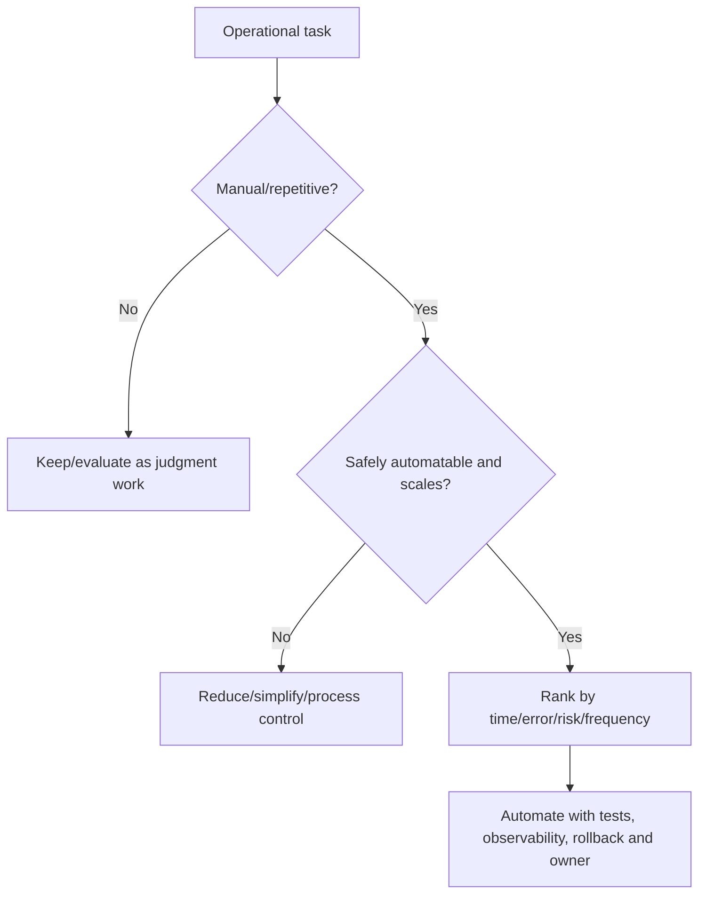

Automation lifecycle:

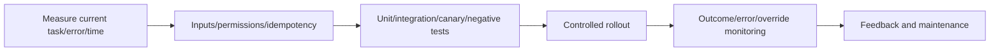

Automating a bad process increases speed and blast radius. Use least privilege, dry-run/read-only modes, audit, human approval where risk warrants, stop/rollback and ownership.

## 9. Problem management, known errors, and corrective actions

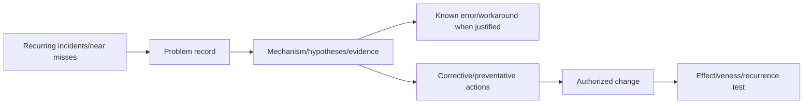

Corrective action schema: causal condition, control type, exact scope, owner, due date, dependency, implementation evidence, effectiveness metric/window, unintended consequence, rollback and residual risk. Counting actions closed is not proof of recurrence reduction.

## 10. Change enablement and risk

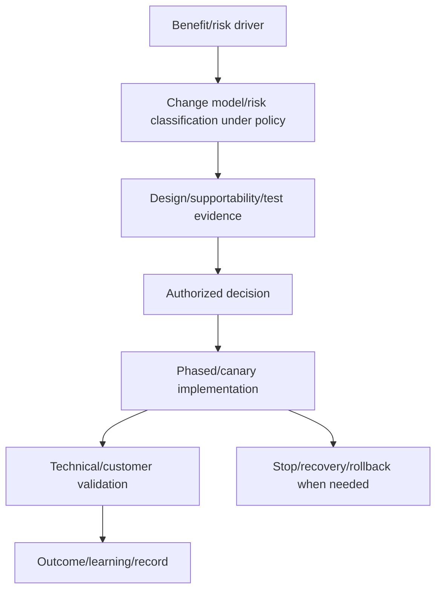

Separate standard, normal and emergency change terminology only according to the actual organization's current policy. Emergency does not mean undocumented; capture authority, risk, evidence, communication and retrospective review.

## 11. Service requests and request fulfillment

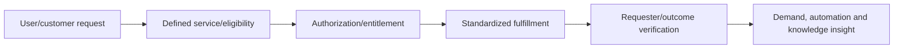

Do not disguise an incident or risky change as a request to bypass controls. Clear catalog scope, data requirements, approval and target expectations reduce back-and-forth.

## 12. KCS orientation: knowledge in the workflow

KCS, associated with the Consortium for Service Innovation, orients teams to capture/reuse/improve knowledge while solving cases. Formal practices/licensing/certification should come from current official sources.

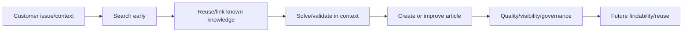

Article schema: symptom/customer language, environment/scope, cause/mechanism where proven, resolution/workaround, validation, risks/permissions, version/current-source date, owner, audience, security classification, feedback and expiry/review trigger.

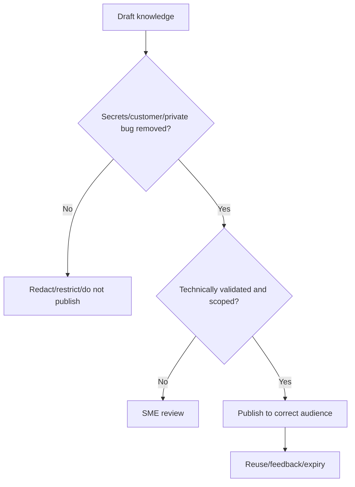

## 13. Queue, backlog, aging, and flow

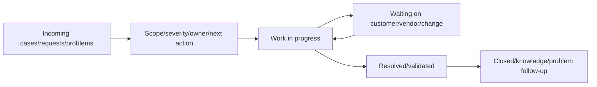

Useful measures include arrival rate, throughput, work in progress, age distribution, wait reasons, reopen rate, handoffs, severity mix, time to next meaningful action, customer update quality and outcome. A lower backlog can result from unsafe closure; metrics need balancing measures and sampling.

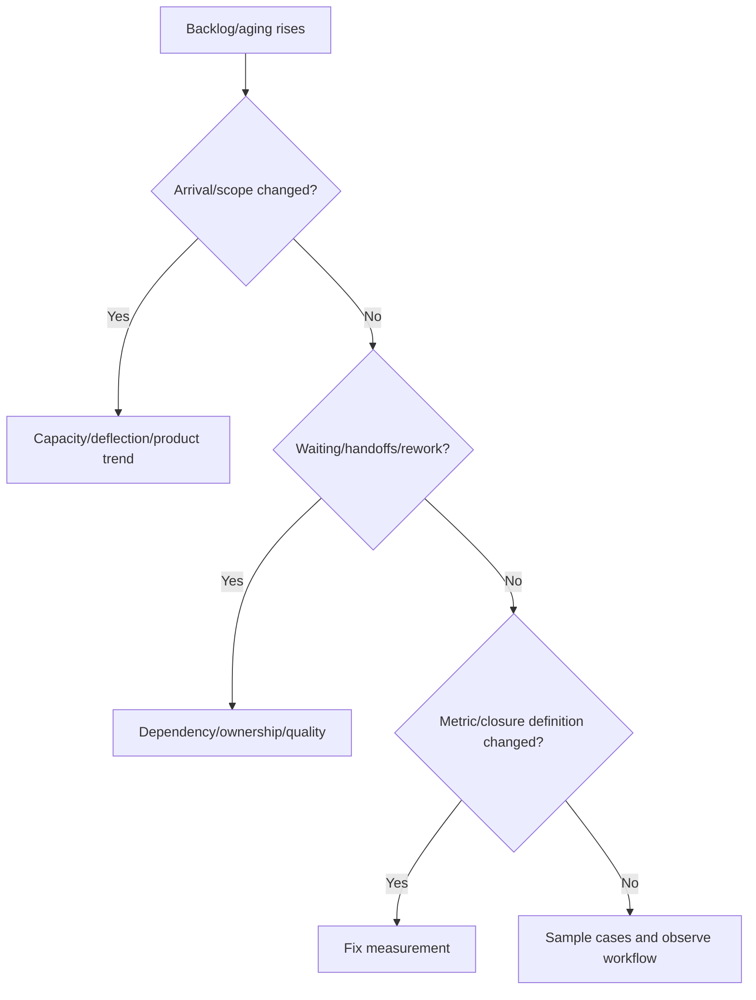

## 14. Quality sampling and calibration

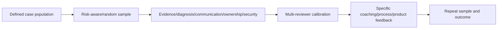

Quality rubric dimensions: scope/problem statement, evidence/provenance, hypothesis/testing, technical correctness, secure handling, customer communication, ownership/next action, escalation package, resolution validation, knowledge linkage and residual risk. Protect employee privacy; use metrics for learning, not simplistic ranking.

## 15. Post-incident review (PIR)

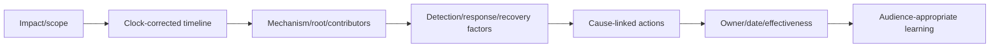

A **post-incident review (PIR)** should preserve contradictions and uncertainty, separate recovery from cause, avoid blame, and still maintain accountable controls. Include what went well and where systems made the wrong action easy.

## 16. Continual improvement and experiments

```mermaid
flowchart TD
    OUTCOME[Desired customer/operational outcome] --> BASE[Current baseline/data quality]
    BASE --> HYP[Improvement hypothesis]
    HYP --> TEST[Small safe experiment/control]
    TEST --> MEASURE[Leading/balancing/lagging measures]
    MEASURE --> DEC[Adopt, adapt or stop]
    DEC --> STANDARD[Standardize/knowledge/owner]
    STANDARD --> OUTCOME
```

Experiment template:

| Field | Example synthetic content |
|---|---|
| Problem/outcome | Repeated evidence requests delay SAN cases |
| Hypothesis | Minimum evidence template reduces first rework |
| Population/control | Two comparable synthetic case cohorts |
| Change | Guided intake plus stable-ID/path checklist |
| Primary measure | Cases needing second basic-evidence request |
| Balancing measures | Customer effort, secure-data violations, resolution quality |
| Stop rule | Any privacy issue or quality regression |
| Review | Adopt/adapt/stop with confidence and limits |

### 🔍 Plain-English deep-dive: improvement needs a counterfactual

If backlog falls after a template launch, seasonality, staffing or case mix may explain it. A counterfactual asks what likely would have happened without the change, using a control/comparison, pre/post trend and balancing measures. Do not claim causation from timing alone.

## 17. Fully synthetic sanitized scenario: Northstar support improvement

**Problem:** synthetic SAN cases repeatedly reach engineering without stable LUN IDs, path matrix, host-stack versions or exact change timeline. Median fictional rework is 2 handoffs; customer updates repeat basic questions.

```mermaid
flowchart LR
    CUSTOMER[Customer path symptom] --> INTAKE[Initial case intake]
    INTAKE --> GAP[Missing identity/path/version evidence]
    GAP --> HANDOFF[Storage-host-fabric handoffs]
    HANDOFF --> DELAY[Delayed hypothesis and repeated questions]
    DELAY --> EXPERIENCE[Customer effort/trust impact]
```

**Experiment:** use a secure minimum-evidence template and 15-minute technical calibration for four fictional weeks; retain a prior comparable synthetic cohort.

| Measure | Baseline | Experiment | Interpretation |
|---|---:|---:|---|
| Basic-evidence re-request rate | 60% | 25% | Improvement signal; synthetic only |
| Median handoffs | 2 | 1 | Flow improved |
| Quality sample | 82/100 | 91/100 | No obvious quality tradeoff |
| Customer effort proxy | 4 requests | 2 requests | Fewer repeated asks |
| Privacy exceptions | 0 | 0 | Required balancing gate passes |
| Time to resolution | Variable | Not claimed causal | Case mix differs |

```mermaid
flowchart TB
    TEMPLATE[Evidence template] --> ID[Stable LUN/host/path identities]
    TEMPLATE --> VERS[Versions/IMT fields]
    TEMPLATE --> TIME[UTC timeline/change]
    TEMPLATE --> PRIV[Privacy/classification]
    ID --> PACKAGE[Higher-quality escalation]
    VERS --> PACKAGE
    TIME --> PACKAGE
    PRIV --> PACKAGE
```

**Decision:** adopt the template with quarterly sampling, maintain privacy gate, update knowledge from feedback, and do not claim reduced resolution time until comparable evidence exists.

**Honest interview language:** `In Microsoft support I have factual case-quality, backlog, mentoring and escalation experience. For NetApp preparation, I built this fully synthetic ITIL/SRE/KCS-oriented experiment; I did not implement it inside NetApp or claim framework certification.`

## 18. JD Mapping and Arti tie

```mermaid
flowchart LR
    CRIT[Microsoft CRITSIT/incident ownership] --> INCIDENT[Incident/PIR/communication]
    QA[Case quality/backlog/CSAT] --> FLOW[Queue, sampling and improvement]
    ENG[Product/Engineering collaboration] --> PROBLEM[Problem/known error/change]
    MENTOR[Mentoring/technical writing] --> KCS[Knowledge/coaching]
    ANALYTICS[Analytics] --> SRE[SLI/SLO/experiment evidence]
    INCIDENT --> TAM[Support-operations TAM capability]
    FLOW --> TAM
    PROBLEM --> TAM
    KCS --> TAM
    SRE --> TAM
```

| JD need | Part evidence |
|---|---|
| Support experience | Incident/request/queue/customer-effort model |
| Preventative stability | Problem/known error/change/action chain |
| Quality improvement | Sampling/calibration and experiment |
| High-pressure work | Incident roles/cadence/validation |
| Coaching/knowledge | KCS-oriented workflow and article schema |
| Analytics | SLI/SLO/error budget/flow/balancing measures |

## 19. Official and Public Source Anchors

**Date checked: 2026-08-24.** These are public orientation sources. Formal certification/training may require licensed materials. No source proves a NetApp internal process or synthetic result.

| Topic | Official/public source | Bounded use |
|---|---|---|
| ITIL | [PeopleCert ITIL](https://www.peoplecert.org/browse-certifications/it-governance-and-service-management/ITIL-1) | Current official certification/framework entry; no certification claim |
| ITIL overview | [PeopleCert ITIL](https://www.peoplecert.org/ITIL-4) | Current official product/framework orientation |
| Google SRE | [Google Site Reliability Engineering books](https://sre.google/books/) | Public SRE principles, SLOs and operations guidance |
| SLOs | [Google SRE workbook: implementing SLOs](https://sre.google/workbook/implementing-slos/) | SLI/SLO workflow orientation |
| KCS | [Consortium for Service Innovation: KCS](https://www.serviceinnovation.org/kcs/) | Official KCS orientation/current resources |
| Incident learning | [Google SRE: postmortem culture](https://sre.google/sre-book/postmortem-culture/) | Blameless learning orientation |
| NetApp Support | [NetApp Support Services](https://www.netapp.com/services/support/) | Public service context only; exact contract/process varies |

## 20. Self-Test and Teach-Back

1. Compare ITIL 4, SRE and KCS without blending them.
2. Classify ten examples as incident/problem/change/request/known error/knowledge.
3. Explain severity, priority, SLA, OLA, SLI and SLO.
4. Define one user-centered storage SLI and its exclusions.
5. Calculate/error-budget reasoning without turning it into permission to fail.
6. Identify toil and design a safe automation lifecycle.
7. Build a queue/quality sample and protect employee/customer privacy.
8. Write a blame-free PIR with cause-linked effectiveness actions.
9. Defend the Northstar experiment and its causation limits.
10. Deliver the no-certification and no-NetApp-process nonclaim.

---

## Likely Interview Questions

### Q1. How do ITIL, SRE, and KCS differ?

> **Model answer:** `ITIL 4 offers service-management and value/practice concepts; SRE applies engineering, user-centered service objectives, error budgets, automation and operational learning to reliability; KCS integrates knowledge search, reuse, capture and improvement into solving work. They can complement each other, but I would tailor them to actual policy and do not claim certification.`

### Q2. What is the difference between incident and problem management?

> **Model answer:** `Incident management restores acceptable service safely and communicates impact/state. Problem management investigates causal conditions and recurrence risk, develops known errors/workarounds where justified and drives corrective actions through change. Recovery after a restart is evidence of mitigation, not root-cause proof.`

### Q3. How do severity, priority, SLA, OLA, and SLO differ?

> **Model answer:** `Severity classifies incident impact/urgency under policy; priority orders work using severity plus deadlines/dependencies/risk. SLA is an actual provider-customer commitment; OLA is an internal supporting agreement; SLO is a measured target for an SLI. I verify contract and definitions rather than quoting generic targets.`

### Q4. What is an error budget?

> **Model answer:** `It is the permitted unreliability implied by an SLO over a window under a precise SLI definition. Teams compare observed burn with an agreed policy to balance feature/change pace and reliability work. It is not permission to cause avoidable incidents or override security, safety, legal or customer obligations.`

### Q5. How do you identify and automate toil safely?

> **Model answer:** `I look for manual, repetitive, automatable tactical work that scales and lacks enduring value; measure time/error/risk; simplify first; then build least-privilege, idempotent, observable automation with tests, canary, audit, human gates, stop/rollback and owner. I retain judgment-heavy work where it creates value.`

### Q6. How would you improve support backlog without gaming metrics?

> **Model answer:** `I segment arrival, WIP, age, wait reasons, handoffs, reopen and severity; sample cases; identify demand/flow/quality causes; run a bounded experiment; and use balancing measures such as customer effort, resolution quality, security and recurrence. Closing cases faster is not improvement if reopen or risk rises.`

### Q7. What makes a PIR and improvement action credible?

> **Model answer:** `A clock-corrected impact/timeline, evidence-based mechanism, root and contributing/detection/recovery factors, contradictions and blame-free context. Actions map to causes with owner/date, implementation evidence, effectiveness metric/window, unintended consequences, rollback and residual risk.`

### Q8. What is your experience and certification boundary?

> **Model answer:** `I factually bring Microsoft CRITSIT, case quality, backlog/CSAT, Engineering collaboration, mentoring and analytics. I do not claim ITIL/SRE/KCS certification or NetApp support-operations ownership. The Northstar process and results are fully synthetic.`

---

## 30-Second Memory Hooks

- **ITIL/SRE/KCS:** manage service, engineer reliability, grow knowledge.
- **Incident/problem:** restore now, prevent recurrence later.
- **Change/request:** controlled service impact versus standard fulfillment.
- **Known error:** understood condition plus bounded workaround/control.
- **Severity/priority:** classify impact versus order work.
- **SLA/OLA/SLO:** customer agreement, internal agreement, measured target.
- **SLI:** user-centered indicator with exact good/valid events.
- **Error budget:** decision budget, never permission to fail.
- **Toil:** manual, repetitive, automatable, scaling, low enduring value.
- **PIR:** timeline -> mechanism -> actions -> effectiveness.
- **Improve:** baseline -> hypothesis -> safe experiment -> balancing measures.

---

## Completion Checklist

- [ ] State all five safety labels and exact no-certification/NetApp-process nonclaim.
- [ ] Distinguish ITIL 4, SRE and KCS orientations accurately.
- [ ] Define incident, problem, change, request, known error and knowledge.
- [ ] Explain severity, priority, SLA, OLA, SLI, SLO and error budget.
- [ ] Use customer journeys and precise event/measurement definitions.
- [ ] Identify toil and design least-privilege tested automation.
- [ ] Link recurring incidents to problem/known error/change/effectiveness.
- [ ] Manage queue, backlog, aging, wait reasons and balancing measures.
- [ ] Create a calibrated quality-sampling and coaching model.
- [ ] Write a blame-free PIR with cause-linked actions.
- [ ] Run a continual-improvement experiment with counterfactual limits.
- [ ] Complete the fully synthetic Northstar scenario and honest statement.
- [ ] Protect customer/employee privacy and avoid metric surveillance/gaming.
- [ ] Recheck official sources dated 2026-08-24 before framework claims.
- [ ] Answer exact Q1-Q8 aloud and complete every self-test.

---

*Next suggested section:* [Part 93 - Competitive Landscape, Workload Choices, and Customer Tradeoffs](Part-93-competitive-landscape-workload-tradeoffs.md)