# Part 93 - Competitive Landscape, Workload Choices, and Customer Tradeoffs

> **Section goal:** Compare enterprise data-platform choices neutrally by workload, architecture, semantics, operations, protection, ecosystem, support, cost, lock-in and sustainability rather than memorized vendor claims. By the end, you can structure a fair evaluation involving NetApp, Dell Technologies, Pure Storage, Hewlett Packard Enterprise, IBM, Hitachi Vantara, cloud-native services, software-defined storage, hyperconverged infrastructure and backup platforms without inventing current specifications or disparaging competitors.

Covers index item **93** and maps to job-description responsibilities for strategic planning, customer environment understanding, best-practice guidance, risk/supportability analysis, customer-tailored recommendations, influence, executive communication, current market awareness and maximizing solution value.

**Privacy and access boundary:** Customer requirements, pricing, contracts, proposals, benchmarks, architectures, and vendor evaluations require authorization and controlled disclosure.

**Synthetic-evidence rule:** Every customer, score, requirement, price, benchmark, product comparison, result, and recommendation below is fictional and sanitized unless cited from a current public source.

**Version caveat:** Portfolios, features, licensing, support, prices, limits, and market positions change; complete current-doc checks and avoid remembered or unsourced comparisons.

**Explicit nonclaim:** You have not led a production competitive storage evaluation, procurement, benchmark, proof of concept, migration or vendor selection for NetApp or the fictional customer; has not validated current commercial offers; and does not claim production administration of the compared platforms.

**Privacy/access:** Competitive evaluations can expose customer workloads, topology, performance, capacity, costs, contracts, discounts, bids, security, support experience, vendor roadmaps, licensing and employee opinions. Use approved procurement/legal/security processes, minimum role access, neutral evidence, secure repositories, conflict disclosure, retention and no confidential proposals, benchmarks, customer data or vendor-restricted material in portfolios.

**Synthetic-evidence:** Every customer, score, weight, workload, metric, benchmark, cost, quote, product result, objection and recommendation below is fictional and sanitized. No table is a current product specification, price, contract, benchmark result, analyst ranking, vendor commitment or customer outcome.

**Version/current-doc:** Portfolios, product names, architectures, features, protocols, limits, licenses, subscriptions, services, support, sustainability data, integrations, pricing and company ownership change. Sources were checked **2026-08-24**. Verify exact current official vendor/provider documentation and independent customer-approved evidence immediately before a real comparison.

This Part is a decision framework, not a vendor ranking, product endorsement, benchmark, request for proposal, procurement/legal advice, sustainability assurance, price comparison or guarantee.

> **No-production-NetApp boundary:** Your factual strengths are enterprise support, Azure/cloud fundamentals, Microsoft 365 data services, analytics, customer reviews, stakeholder communication and evidence-based recommendations. Your exact nonclaim is: **you have not selected or competitively positioned production NetApp storage for a customer.** You may present the synthetic framework while distinguishing verified facts, hypotheses and gaps.

---

## 1. Start with requirements, not vendor names

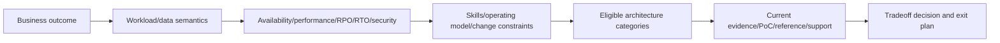

| Requirement family | Questions |
|---|---|
| Business | Which service, users, deadlines, compliance and risk appetite? |
| Data semantics | File, block, object, database-native; locking/consistency/sharing? |
| Scale/performance | Capacity/growth, working set, I/O size/mix, IOPS, throughput, p99 latency? |
| Availability/protection | Failure domains, RPO/RTO, backup, immutability, cyber recovery? |
| Deployment | Data center, edge, cloud, hybrid, Kubernetes, VMware, bare metal? |
| Operations | Skills, automation, observability, lifecycle, support and change windows? |
| Economics | Full lifecycle cost, uncertainty, labor, migration, transfer and exit? |
| Governance | Security, sovereignty, sustainability, procurement, lock-in and audit? |

### 🔍 Plain-English deep-dive: products do not win; designs fit requirements

Hiking boots and running shoes are both excellent when matched to terrain. A vendor can have strong technology and still be the wrong operating model, protocol, ecosystem or risk fit for one workload. Say `best fit under these weighted requirements and evidence`, not `best storage`.

## 2. Separate architecture categories

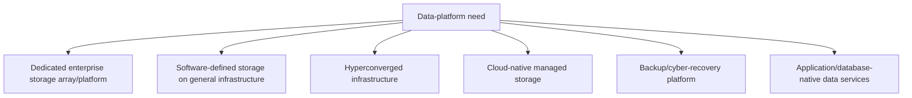

These categories can coexist. A backup platform is not a primary low-latency datastore; HCI combines compute/storage operations differently; cloud managed services shift responsibility; software-defined systems depend on validated hardware/network design; arrays can serve shared data across compute domains.

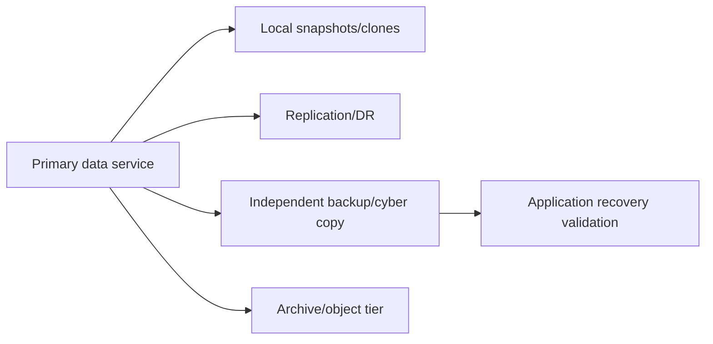

## 3. Vendor landscape orientation without hard specs

The enterprise comparison set in this Part includes **NetApp**, **Dell Technologies**, **Pure Storage**, **Hewlett Packard Enterprise (HPE)**, **IBM**, and **Hitachi Vantara**. Each has multiple product/service families and can participate in more than one category. Use official current portfolio pages to identify eligible products; do not infer every family shares one architecture or capability.

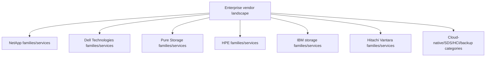

Neutral language:

- `Vendor documentation states capability X for product/release Y; customer validation remains required.`
- `The option is eligible/ineligible/unknown under requirement Z as of source date.`
- `We have not tested this claim with the representative workload.`
- `Commercial and support terms require authorized confirmation.`

## 4. Architecture and data layout

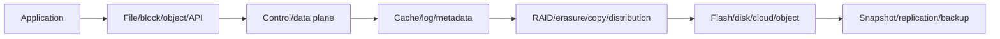

Compare controllers/nodes, scale-up/out, metadata ownership, write acknowledgment, cache/persistence, failure/quorum, media, data placement, consistency, maintenance and upgrade behavior. Do not convert a marketing architecture term into an assumed outcome; validate failure and workload behavior.

### 🔍 Plain-English deep-dive: shared terminology can hide different mechanisms

Two restaurants can both advertise `fresh`, yet one cooks to order and another replenishes small batches. Terms such as snapshot, active-active, scale-out, deduplication or cloud-native can describe materially different scope and failure semantics. Define mechanism, boundary and evidence before comparing labels.

## 5. Data semantics and protocol fit

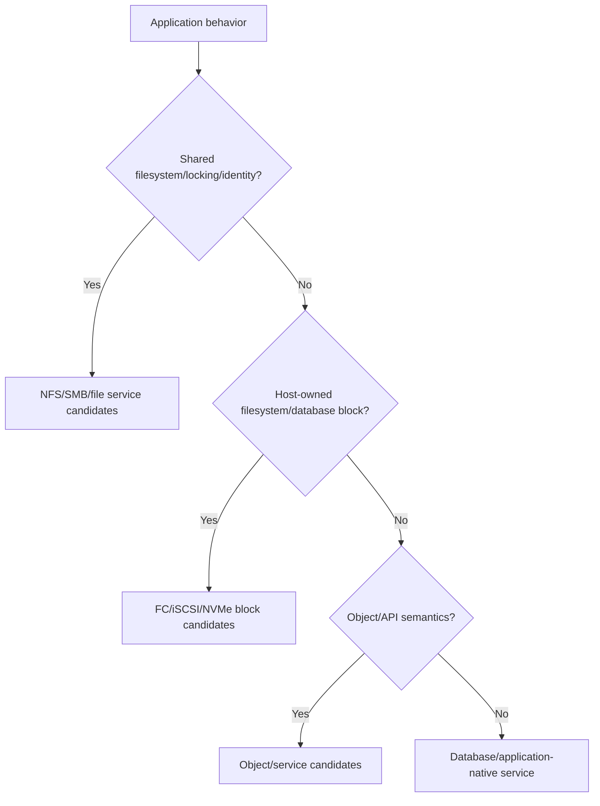

Compare supported NFS/SMB variants, FC/iSCSI/NVMe transports, object APIs, multiprotocol behavior, identity/security, locking, multipathing, host/hypervisor/container integrations and application certification. Protocol presence alone does not prove semantic or support fit.

## 6. Deployment and operating model

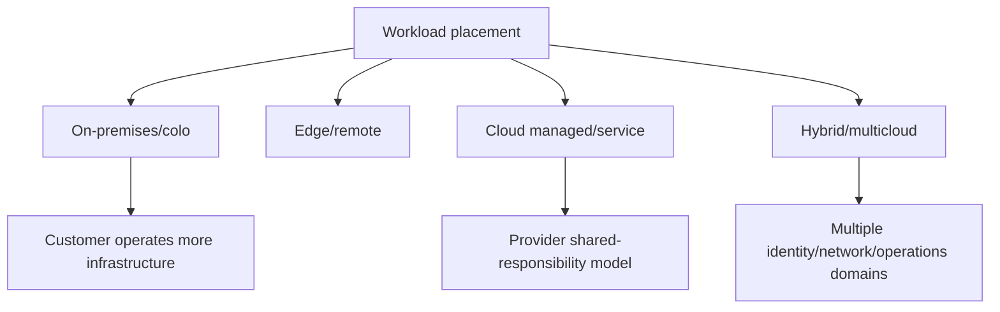

| Model | Evaluate |
|---|---|
| Appliance/platform | Hardware lifecycle, facilities, skills, support, expansion |
| SDS | Validated servers/media/network, orchestration, performance isolation |
| HCI | Compute/storage coupling, scaling granularity, cluster operations |
| Managed cloud | Regions, quotas, service levels, IAM/network, shared responsibility |
| Hybrid | Data mobility, latency/egress, identity/DNS, consistent governance |

## 7. Protection, continuity, and cyber resilience

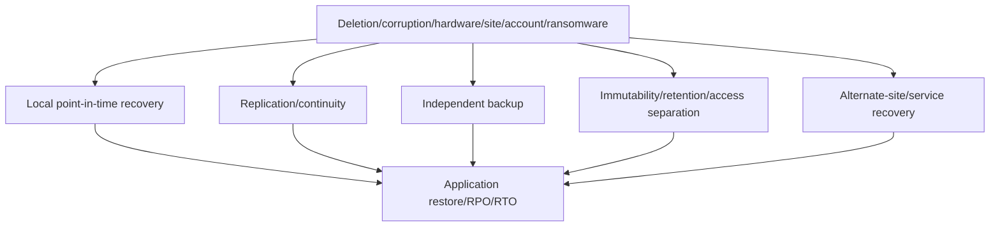

Compare failure domains, consistency, retention, catalog/key dependency, isolation, privileged access, ransomware detection, replication of corruption, restore granularity, orchestration and tested application recovery. Avoid `zero data loss` or `ransomware-proof` without bounded design evidence.

## 8. Performance and workload evidence

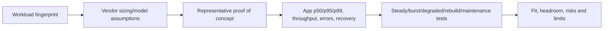

Representative evidence includes data set/working set, compressibility, I/O mix/size/locality, concurrency/queue, protocol, host stack, network, cache warm/cold, steady/burst, failure/rebuild, snapshot/replication/background work, capacity/headroom and app outcome. Vendor benchmark results can inform hypotheses but should not substitute for customer workload validation.

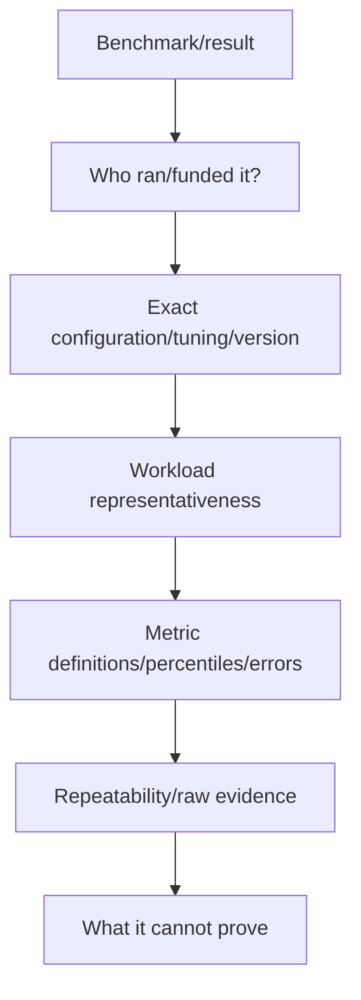

## 9. Capacity, efficiency, and scaling

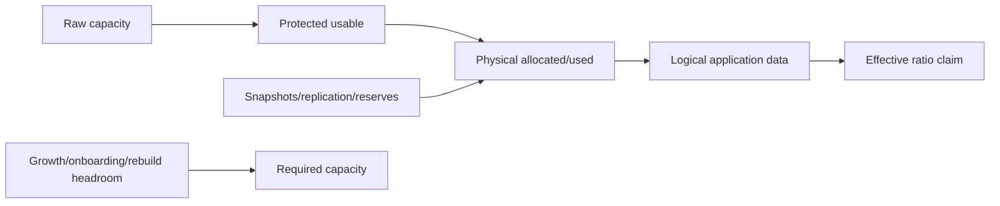

Compare scaling unit, controller/node balance, media, reserve/headroom, thin provisioning, snapshot behavior, dedup/compression assumptions, workload exclusions, guaranteed/effective claims, expansion/rebalance, failure/rebuild and forecast. Never compare one vendor's raw capacity to another's effective claim.

## 10. Operations, automation, and observability

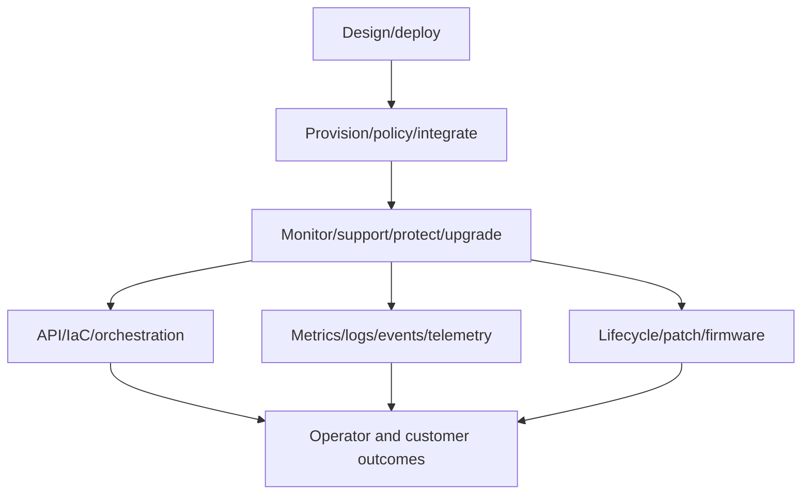

Evaluate management planes, RBAC/MFA/audit, API/SDK/Ansible/Terraform where current, policy and drift, multi-tenancy, alerts/telemetry, fleet management, support bundles, upgrade/firmware, nondisruption prerequisites, rollback/recovery, training and staffing. Count workflow steps only after considering risk and frequency.

## 11. Ecosystem and supportability

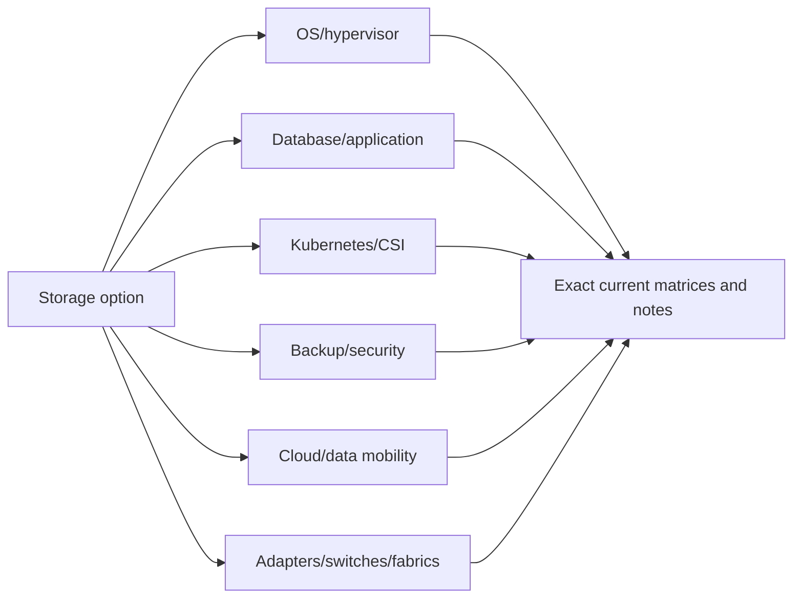

Compare exact supported combinations, certifications, partner integrations, current product lifecycle, support responsibility, escalation interfaces, local coverage, required entitlements and evidence quality. A broad ecosystem logo page is not an exact supported recipe.

## 12. Support experience and organizational fit

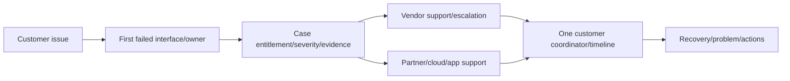

Evaluate support terms from actual contracts, case quality, cross-vendor diagnostics, telemetry/privacy, escalation, field/service coverage, lifecycle advice, documentation, knowledge and customer references. Avoid anecdotal universal claims from one case.

## 13. Economics and total cost of ownership

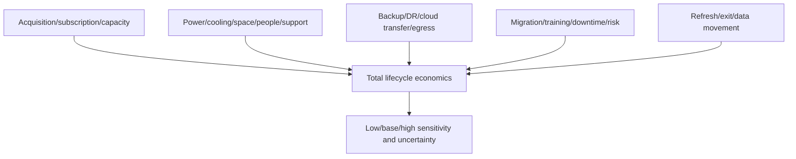

Do not compare confidential discounts or assume list price. Record currency, period, capacity/performance assumptions, growth, support, labor, facilities, cloud transfer, protection, migration and residual value. Procurement/legal/finance validate commercial terms.

### 🔍 Plain-English deep-dive: the cheapest unit price can create the most expensive system

A low-cost engine is not a low-cost car if maintenance, fuel, downtime and resale are poor. Storage economics include operations, protection, network, skills, expansion, migration and business risk. Show sensitivity rather than manufacturing one precise total from uncertain assumptions.

## 14. Lock-in, portability, and exit

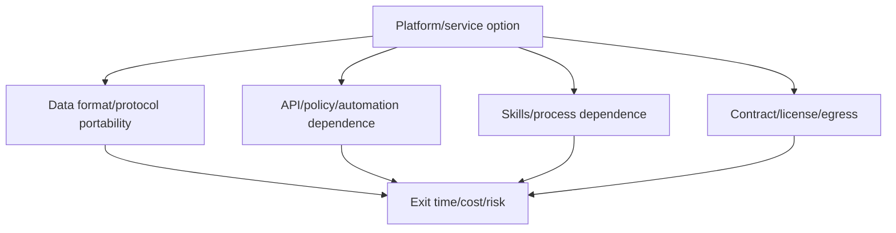

Lock-in is not automatically bad; specialized capability can create value. Make it explicit: data export path, protocol fidelity, snapshot/clone portability, migration tooling, egress/bandwidth, contract, retraining, dual-running, rollback and data-destruction proof.

## 15. Sustainability and responsible evidence

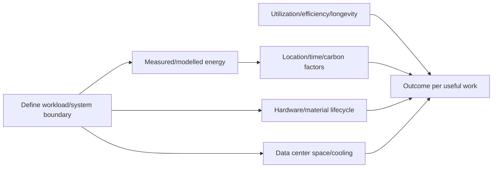

Compare vendor-published data only when boundary, methodology, product/configuration, utilization, region and date align. Include embodied/operational considerations, refresh life, utilization, data reduction workload effects and cloud shared-infrastructure uncertainty. Avoid `greenest` claims without independently validated comparable evidence.

## 16. Weighted decision matrix without score theater

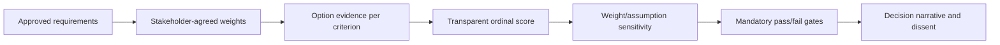

| Criterion | Weight | Option evidence | Score | Confidence |
|---|---:|---|---:|---|
| Application/protocol fit | Customer-defined | Current matrix + PoC | 1–5 | H/M/L |
| Recoverability | Customer-defined | Isolated restore test | 1–5 | H/M/L |
| Operations/lifecycle | Customer-defined | Workflow/current roadmap | 1–5 | H/M/L |
| Economics | Customer-defined | Sensitivity, not single quote | 1–5 | H/M/L |
| Exit/lock-in | Customer-defined | Tested/estimated exit | 1–5 | H/M/L |

Mandatory gates such as security, data residency, application support or RPO/RTO cannot be averaged away by good scores elsewhere.

### 🔍 Plain-English deep-dive: weights reveal values; they do not remove judgment

A family choosing a home may weight commute, schools and price differently. A matrix exposes priorities and assumptions, but small weight changes can flip close options. Run sensitivity, show confidence and dissent, and make the final tradeoff narrative more important than the total score.

## 17. Proof-of-concept and failure validation

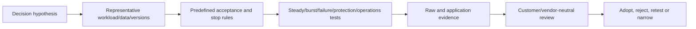

Include positive, negative, degraded path/node, rebuild/maintenance, snapshot/backup/restore, security/RBAC, automation, upgrade and cleanup tests where relevant and safe. Use generated data; owner-approved environments; no public leaderboard from a private PoC.

## 18. Fully synthetic sanitized scenario: Northstar analytics platform

**Need:** select a primary data platform for a fictional mixed research workload: NFS collaboration, VMware database block storage, Kubernetes persistent data, 1.2-PiB fictional five-year logical forecast, two sites, hybrid-cloud analytics, ransomware recovery, small operations team and strict application support.

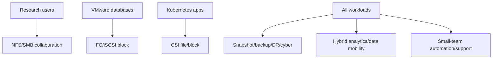

### Candidate categories

- NetApp unified/hybrid data-platform option.
- Dell enterprise storage option(s), exact family chosen after current source check.
- Pure Storage enterprise option(s), exact family chosen after current source check.
- HPE enterprise storage option(s), exact family chosen after current source check.
- IBM storage option(s), exact family chosen after current source check.
- Hitachi Vantara enterprise storage option(s), exact family chosen after current source check.
- Cloud-managed/SDS/HCI combination.
- Separate primary platforms plus independent backup/cyber-recovery category.

No option receives a product score until exact eligible family, version, region and support are known.

```mermaid
flowchart LR
    GATES[Pass gates: app support/security/residency/RPO-RTO] --> SHORT[Shortlist]
    SHORT --> POC[Representative NFS/block/K8s/failure/restore PoC]
    POC --> OPS[Operational/lifecycle/support assessment]
    OPS --> COST[Full-cost/exit sensitivity]
    COST --> DEC[Decision with confidence/dissent]
```

### Synthetic decision record

| Observation | Decision effect |
|---|---|
| Unified operations is valuable but not mandatory | Keep unified and best-of-breed paths |
| Database vendor cert is pass/fail | Any unknown recipe stays ineligible |
| Cyber recovery requires independent trust domain | Primary snapshots alone cannot pass |
| Small team strongly weights automation/support | Workflow PoC and references matter |
| Cloud analytics has uncertain egress/region demand | Run sensitivity; avoid fixed savings claim |
| Exit path must fit 18-month fictional window | Migration test and bandwidth estimate required |

**Recommendation language:** `Shortlist only options that pass exact application, security, residency and recovery gates. Run the same representative workload and failure/restore test, document current support and full-cost/exit sensitivity, then select the best fit under customer-approved weights. No vendor winner is declared from this synthetic exercise.`

**Honest interview language:** `I built a neutral synthetic comparison across enterprise vendors and architecture categories. I defined pass gates, evidence and PoC tests before scoring, and I did not invent current specs, prices or a winner. I have not led a production NetApp competitive selection.`

## 19. Objection handling without disparagement

```mermaid
flowchart LR
    CLAIM[Stakeholder/vendor claim] --> DEFINE[Define product/release/scope/metric]
    DEFINE --> SOURCE[Current official/independent evidence]
    SOURCE --> TEST[Customer-representative validation]
    TEST --> TRADE[Tradeoff and limitations]
    TRADE --> DEC[Record decision, not insult]
```

| Claim | Neutral response |
|---|---|
| `Vendor X is always faster` | `For which product/configuration/workload/percentile/failure state? Let us validate representative conditions.` |
| `NetApp does everything` | `Map exact eligible products/releases and verify each mandatory requirement/support matrix.` |
| `Cloud is cheaper` | `Compare full architecture, transfer, HA, protection, labor and exit under current regional pricing.` |
| `One platform avoids all lock-in` | `Every API, format, skill, contract and migration path creates some dependency; quantify value and exit.` |
| `Competitor support is poor` | `Use actual contract, scoped references and case evidence; one anecdote is not a universal fact.` |

## 20. JD Mapping and background tie

```mermaid
flowchart LR
    MS[Microsoft multi-vendor escalation] --> BOUND[Evidence and ownership boundaries]
    AZ[Azure/cloud fundamentals] --> MODEL[Cloud/SDS/HCI operating models]
    DATA[Analytics/statistics] --> MATRIX[Weights/sensitivity/benchmark critique]
    COMM[Customer/business reviews] --> TRADE[Neutral tradeoff narrative]
    BOUND --> TAM[Strategic TAM capability]
    MODEL --> TAM
    MATRIX --> TAM
    TRADE --> TAM
```

| JD need | Part evidence |
|---|---|
| Strategic planning | Requirements, pass gates, PoC and exit plan |
| Customer understanding | Workload and operating-model profile |
| Risk/supportability | Exact matrices, lifecycle and failure tests |
| Influence | Neutral objection handling and decision record |
| Current knowledge | Dated vendor sources with no hard-memory claims |
| Value | Fit and measurable outcome, not brand ranking |

## 21. Official and Public Source Anchors

**Date checked: 2026-08-24.** These official portfolio entry points establish only that vendors/categories exist and provide current navigation. Recheck exact products/releases/features/support/sustainability/commercial terms; vendor claims require customer validation.

| Vendor/category | Official source | Bounded use |
|---|---|---|
| NetApp | [NetApp data storage](https://www.netapp.com/data-storage/) | Current portfolio navigation |
| Dell Technologies | [Dell data storage](https://www.dell.com/en-us/shop/storage-products/sf/storage-products) | Current portfolio navigation |
| Pure Storage | [Pure Storage products](https://www.purestorage.com/products.html) | Current portfolio navigation |
| HPE | [HPE storage](https://www.hpe.com/us/en/storage.html) | Current portfolio navigation |
| IBM | [IBM Storage](https://www.ibm.com/storage) | Current portfolio navigation |
| Hitachi Vantara | [Hitachi Vantara data storage](https://www.hitachivantara.com/en-us/products/storage-platforms) | Current portfolio navigation |
| AWS storage | [AWS cloud storage](https://aws.amazon.com/products/storage/) | Cloud-native category navigation |
| Microsoft Azure storage | [Azure Storage](https://azure.microsoft.com/products/category/storage/) | Cloud-native category navigation |
| Google Cloud storage | [Google Cloud storage products](https://cloud.google.com/products/storage) | Cloud-native category navigation |
| SNIA | [Storage Networking Industry Association](https://www.snia.org/) | Vendor-neutral storage standards/education context |
| Sustainability evidence | [Greenhouse Gas Protocol](https://ghgprotocol.org/) | Emissions-accounting orientation; not vendor ranking |

## 22. Self-Test and Teach-Back

1. Convert a brand-first request into workload/operating requirements.
2. Separate array, SDS, HCI, cloud-managed, backup and app-native categories.
3. Compare architecture and semantics without relying on labels.
4. Build a representative performance/failure/restore PoC.
5. Normalize capacity and challenge a benchmark.
6. Create full-cost, lock-in/exit and sustainability evidence schemas.
7. Build pass gates, weighted matrix and sensitivity analysis.
8. Defend why no synthetic vendor winner is declared.
9. Answer all five disparaging/absolute claims neutrally.
10. Deliver the exact competitive-evaluation and production nonclaim.

---

## Likely Interview Questions

### Q1. How would you compare NetApp with competitors?

> **Model answer:** `I begin with customer workloads, semantics, SLO/RPO/RTO, security, deployment, skills, ecosystem and economics; define mandatory gates; identify exact current eligible products from each vendor; validate support and architecture; run the same representative workload, failure and restore tests; compare operations, support, full cost and exit; then show confidence and tradeoffs, not a brand ranking.`

### Q2. Which vendors and categories belong in the landscape?

> **Model answer:** `Depending requirements, I would consider exact current offerings from NetApp, Dell Technologies, Pure Storage, HPE, IBM and Hitachi Vantara, plus cloud-native managed storage, software-defined storage, HCI, backup/cyber-recovery and application-native services. Each vendor has multiple families, so I never generalize one architecture to the entire company.`

### Q3. How do you keep a comparison neutral and current?

> **Model answer:** `I use customer-approved requirements and weights, exact product/release names, dated official sources, independent or customer-run evidence, identical test definitions, confidence and limits. I separate facts from vendor claims and hypotheses, disclose sponsorship/conflicts, avoid confidential terms and let every option fail the same mandatory gates.`

### Q4. How do you evaluate performance claims?

> **Model answer:** `I inspect sponsor, exact configuration/version/tuning, workload/data/working set, protocol/host/network, cache state, concurrency, percentiles/errors, background work, failure/rebuild state, repeatability and raw evidence. Then I run a representative PoC measuring application outcomes and operational behavior, not only peak IOPS.`

### Q5. How do you compare cost and lock-in?

> **Model answer:** `I model acquisition/subscription, capacity/performance, support, facilities, people, protection, network/cloud transfer, migration, downtime risk and exit under low/base/high assumptions. Lock-in includes data/protocol, APIs/policy, skills, contracts and egress. Specialized dependence may be worthwhile if value exceeds a tested exit cost.`

### Q6. How do sustainability considerations enter the decision?

> **Model answer:** `I define workload/system boundary, useful work and time; use comparable methodology for operational energy/carbon, cooling/space, embodied hardware, utilization, efficiency and lifecycle; record region and uncertainty; and avoid claims from noncomparable vendor studies. Sustainability is one weighted requirement, not marketing shorthand.`

### Q7. What do you say when a stakeholder disparages a competitor?

> **Model answer:** `I translate the claim into a testable dimension—exact product, release, workload, metric, contract or support event—request current evidence, compare under the same conditions and state limitations. I focus on fit and risk rather than repeating an anecdote or using fear.`

### Q8. What is your experience boundary?

> **Model answer:** `My prior enterprise, Azure/cloud, analytics and customer-review experience transfers to evidence and tradeoff decisions. I have not led a production NetApp competitive selection or administered the compared platforms. The Northstar evaluation is fully synthetic and intentionally declares no winner.`

---

## 30-Second Memory Hooks

- **Compare:** outcomes -> workload -> requirements -> eligible options -> evidence -> decision.
- **Categories:** array, SDS, HCI, cloud, backup, app-native.
- **Labels:** same word can hide different mechanisms.
- **Protocols:** presence is not semantic or support fit.
- **PoC:** same workload, failure, restore and operations tests.
- **Capacity:** raw is not usable is not effective.
- **TCO:** acquire + operate + protect + migrate + exit + risk.
- **Lock-in:** dependency can create value; quantify the exit.
- **Sustainability:** comparable boundary/method or no ranking.
- **Matrix:** pass gates first; weights/scores need sensitivity/confidence.
- **Neutrality:** test claims, never disparage.

---

## Completion Checklist

- [ ] State all five safety labels and exact competitive/production nonclaim.
- [ ] Begin with workload, outcomes and operating model, not vendor names.
- [ ] Separate arrays, SDS, HCI, cloud-native, backup and app-native categories.
- [ ] Include NetApp, Dell, Pure, HPE, IBM and Hitachi Vantara neutrally.
- [ ] Compare architecture, semantics, protocols and deployment models.
- [ ] Compare protection, cyber recovery, performance, capacity and scaling.
- [ ] Evaluate operations, automation, observability, ecosystem and support.
- [ ] Build complete cost, lock-in/exit and sustainability evidence models.
- [ ] Avoid current hard specs, confidential prices, disparagement and invented claims.
- [ ] Define mandatory gates, weighted matrix, confidence and sensitivity.
- [ ] Design representative positive/negative/failure/restore PoC tests.
- [ ] Complete the fully synthetic Northstar scenario without declaring a winner.
- [ ] Use only dated official/current sources and approved evidence.
- [ ] Recheck sources dated 2026-08-24 before live decisions.
- [ ] Answer exact Q1-Q8 aloud and complete every self-test.

---

*Next suggested section:* [Part 94 - NCDA and Specialization Roadmap, Standards, and Current Trends](Part-94-ncda-specialization-standards-trends.md)