# Part 94 - NCDA and Specialization Roadmap, Standards, and Current Trends

> **Section goal:** Build an honest, official-source-aligned path toward the NetApp Certified Data Administrator, ONTAP credential and later specialization while connecting vendor skills to SNIA storage concepts, NIST security/cyber-resiliency guidance, sustainability, analytics/AIOps, NVMe, containers, hybrid cloud, ransomware resilience and AI data infrastructure. By the end, you can choose a learning path, prepare legally, and execute a 30/60/90-day teach-back plan without claiming certification or production experience.

Covers index item **94** and maps to job-description responsibilities for learning new technology, building a specialization, contributing to SME teams, coaching, storage/cloud/virtualization depth, current best practices, risk analysis, customer communication and continuous improvement.

**Privacy and access boundary:** Exam materials, credentials, employer/customer examples, lab artifacts, community discussions, and certification records must follow provider rules and approved handling.

**Synthetic-evidence rule:** Every study score, exam scenario, customer example, milestone, trend forecast, and outcome below is fictional and sanitized unless cited from a current public source.

**Version caveat:** Certification names, exam codes, objectives, prerequisites, policies, costs, standards, and technology trends change; complete current-doc checks on official NetApp and standards-provider pages before acting.

**Explicit nonclaim:** You are not represented here as NetApp certified, NCDA certified, an ONTAP administrator, a NetApp specialist, a standards expert, a cyber-resilience assessor, or an AI/storage architect. Completing this guide or a practice plan does not award a credential, course completion, badge, exam pass or production competence.

**Privacy/access:** Certification and learning records can expose candidate IDs, account/email, exam history, scores, accommodations, employer affiliation, vouchers and badges. Labs and contributions can expose customer systems, gated courseware, exam content, credentials and private product data. Use official accounts/channels, approved training data, secure storage and minimum disclosure; never publish exam questions, score reports, candidate IDs, customer data or gated course materials.

**Synthetic-evidence:** Every learner score, lab result, schedule, readiness percentage, mentor, specialization decision, customer, workload, metric, contribution and outcome below is fictional and sanitized unless clearly identified as your factual background. No synthetic item is a NetApp exam result, course completion, certification, customer outcome or employer commitment.

**Version/current-doc:** Certification names/codes/domains, paths, prerequisites, exam delivery, fees, retake/expiration policies, learning courses, products, standards and trends change. Sources were checked **2026-08-24**. Reopen the official NetApp certification page, program policies, CertCenter and learning path immediately before registration or making a credential claim.

This Part is a preparation roadmap, not an exam dump, live-question reconstruction, guaranteed-pass plan, fee quote, voucher source, booking service, credential verification, training entitlement, production recipe or employment promise.

> **No-production-NetApp boundary:** Your factual strengths are enterprise Support Escalation Engineering, critical situation, Microsoft 365 data services, Azure/VM/networking, analytics, Product/Engineering collaboration, customer reviews, mentoring and technical writing. Your exact nonclaim is: **you have not earned NCDA and has not administered production ONTAP.** You may say you are `preparing through official objectives, public documentation and clearly labeled synthetic/authorized labs` only when true.

---

## 1. Official-current certification facts

From NetApp official pages checked **2026-08-24**:

| Fact | Official-current wording/evidence | Boundary |
|---|---|---|
| Credential title | **NetApp Certified Data Administrator, ONTAP** | Use exact official punctuation/title when claiming only after verification |
| Common abbreviation | **NCDA** appears in official policies/learning materials | Abbreviation does not prove active status |
| Exam code | **NS0-163** is stated in NetApp Certification Program expiration policy | Verify in CertCenter at booking; do not trust memory |
| Purpose | Tests ability to administer NetApp ONTAP solutions | It is not a universal storage or architecture credential |
| Experience guidance | Official page says candidates should have six to twelve months with ONTAP solutions, including configuration, storage administration and data management | Guidance, not evidence you have that experience |
| Foundation knowledge | Networking, cloud, virtualization, SAN/NAS, Windows/Linux, ONTAP/data protection/HA | Build these before exam cramming |
| Registration | Official certification page links to CertCenter | Actual availability, delivery and checkout control booking |

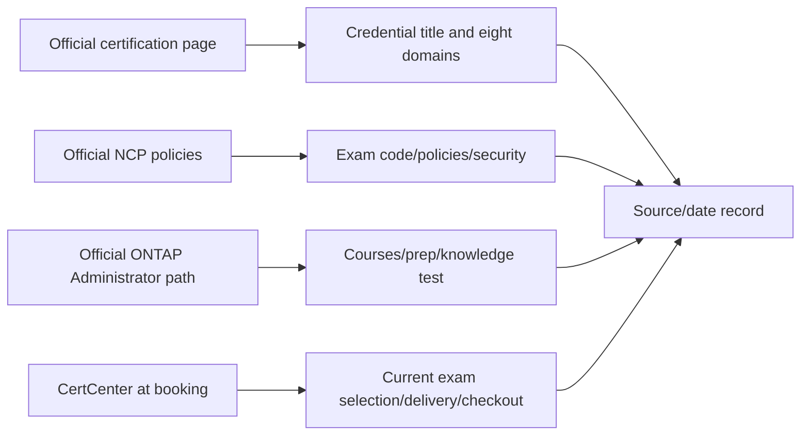

### 🔍 Plain-English deep-dive: certification is validated evidence, not a substitute for experience

A driving theory test verifies an important knowledge threshold, but it does not prove years of safe driving in every road condition. Certification, official labs, personal labs, synthetic exercises and production outcomes are different evidence levels. Use the credential only if active and verifiable; describe practice separately.

## 2. The eight official NCDA exam domains

The official certification page checked **2026-08-24** publishes these domains and bullets:

| Domain | Official topic areas | Guide preparation map |
|---:|---|---|
| 1. Storage Platforms | Physical storage systems; software-defined on-premises or cloud storage systems; upgrading or scaling ONTAP clusters | Parts 5–6, 19, 21, 23, 26, 53–55, 89–90 |
| 2. Core ONTAP | ONTAP system management; high availability; Storage Virtual Machine management | Parts 20–25, 47–49, 83 |
| 3. ONTAP Storage | Logical storage features; NetApp storage efficiency features | Parts 7, 10, 23, 32, 34, 45 |
| 4. Networking | Network components; troubleshoot network components | Parts 11–13, 22, 24–25, 71, 83–85 |
| 5. Storage Protocols and Connectivity | SAN/troubleshooting; NAS/troubleshooting; ONTAP S3 | Parts 14–18, 27–33, 74–75, 84–85 |
| 6. Data Protection | ONTAP data protection; business continuity; troubleshoot DP | Parts 8, 35–39, 78, 86 |
| 7. Security | Protocol security; hardening; in-flight/at-rest encryption; anti-ransomware | Parts 39–42, 47, 84–86, 92–94 |
| 8. Performance | ONTAP monitoring; troubleshoot storage-system performance | Parts 9, 43–46, 76, 83, 87–91 |

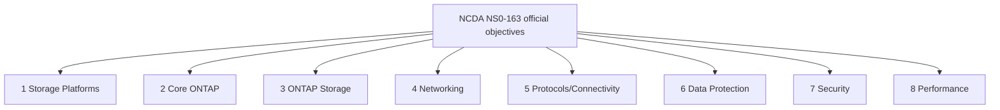

The official public page shown to this guide did not publish domain weights. Do not invent weights or allocate study time by rumor; diagnose skill gaps through objective-based self-testing.

## 3. Official path and prerequisite language

The official certification map includes **NetApp Certified Professional Technology Solutions** and **NetApp Certified Professional Data Administrator ONTAP** on several paths, followed by role-specific credentials. The NCDA page says to **consider** NetApp Cloud Native Associate and NetApp Hybrid Cloud Associate accreditations; the ONTAP Administrator learning path encourages the ONTAP Associate path first. These statements are recommendations/path context, not proof of a mandatory prerequisite unless current CertCenter/program rules explicitly say so.

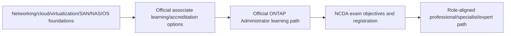

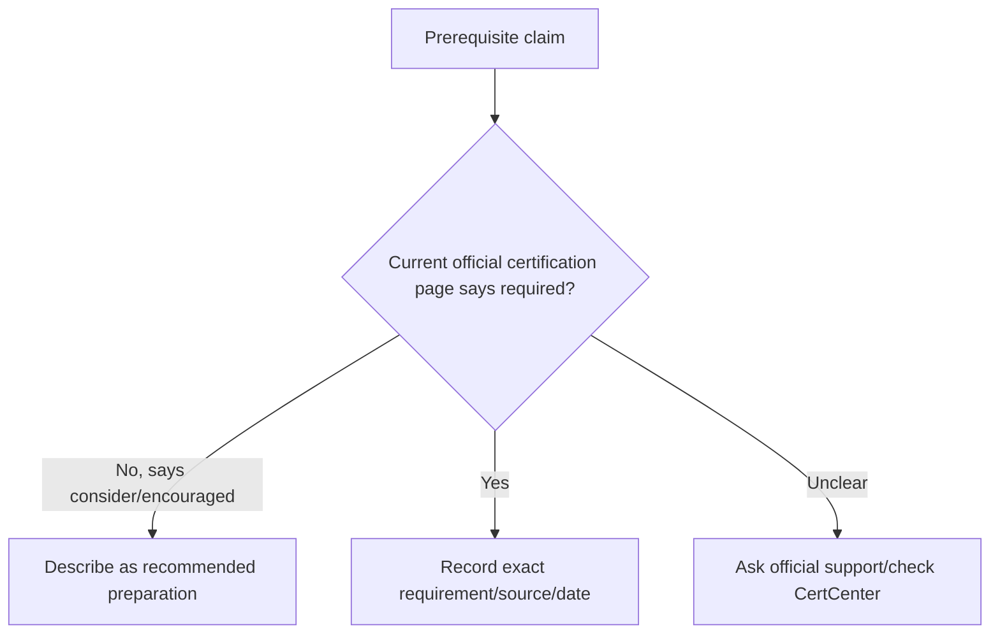

## 4. Exam security and ethical preparation

NetApp's official policy prohibits live exam questions/answers, disclosure/distribution, requesting protected materials, unauthorized assistance/materials and reconstruction through memorization. This guide contains objective-based practice only.

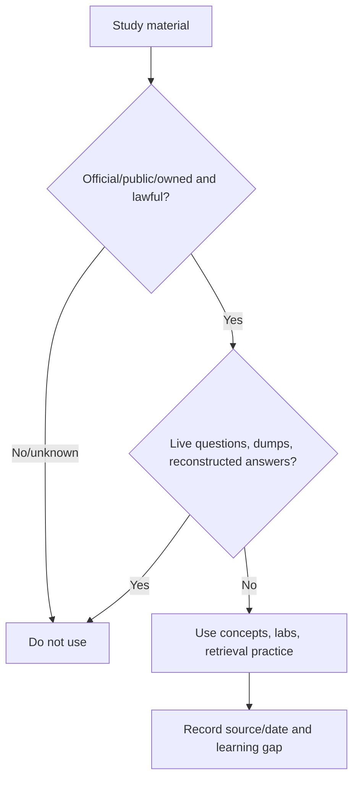

Forbidden: dumps, braindumps, screenshots, copied questions, recalled-question banks, unauthorized vouchers, another person's account, proxy test taker or assistance during an exam. Legal prep: official objectives, courses, public docs, authorized labs, original scenario questions, teach-back and mock architecture/troubleshooting.

### 🔍 Plain-English deep-dive: remembering concepts and reconstructing exam content are different

After a course, it is appropriate to explain how HA, NFS or SnapMirror works from public knowledge. It is not appropriate to recreate confidential question wording, options or answer patterns from an active exam. Build new scenario questions from official domains and public documentation, not from protected exam memory.

## 5. Booking, account, delivery, and policy caveats

Official policy checked **2026-08-24** states that a NetApp account is required; the certification page links to CertCenter; candidates must accept the candidate agreement; and Pearson VUE/OnVUE resources are linked. Policies also cover retakes, expiration, badges, account/ID linking, accommodations, vouchers and disclosure.

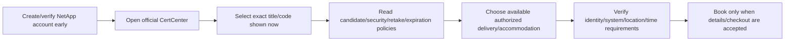

Booking checklist:

- Verify current exam title/code, language, delivery options, appointment time/time zone and identity requirements in CertCenter/Pearson VUE.
- Read candidate agreement, security, retake, expiration/renewal, reschedule/cancel, accommodation and voucher terms from official pages.
- Verify current fee at official checkout; **this guide does not quote or promise a cost, discount, refund, voucher or availability**.
- Use only NetApp/authorized-partner/Pearson VUE channels for vouchers where applicable.
- Link account/certification IDs according to current official procedure; protect candidate identifiers.
- Save confirmation privately and recheck system test/center instructions.

## 6. Official learning path and lab plan

The official ONTAP Administrator learning path checked **2026-08-24** describes configuration, management/maintenance, data protection/security and performance-resolution responsibilities. It lists instructor-led paths for cluster administration, data protection, NFS, SMB, SAN and performance, plus official NCDA prep resources. Course names, duration, training units, delivery and cost must be rechecked; this guide makes no enrollment promise.

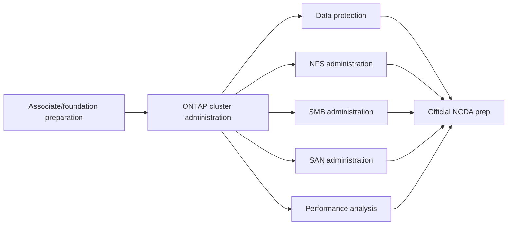

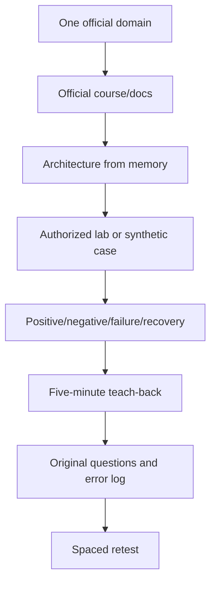

## 7. Domain-by-domain preparation map

| Domain | Learn from zero | Practice artifact | Readiness proof |
|---|---|---|---|
| Platforms | Hardware, CVO/SDS, cluster scale/upgrade | Physical/logical topology and target-path case | Explain tradeoffs/current source gates |
| Core ONTAP | Management, HA, SVM | Discovery baseline | Reconstruct object hierarchy and failure reasoning |
| ONTAP Storage | Volumes/local tiers/efficiency | Capacity ladder/forecast | Explain units, risk and controls |
| Networking | Ports/LIFs/DNS/routes | Path map and fault tree | Find first failed interface |
| Protocols | NAS/SAN/S3 | NFS/SMB/iSCSI/FC cases | Positive/negative and data-safe reasoning |
| Data Protection | Snapshots/SnapMirror/BC | RPO/RTO recovery case | Prove app recovery, not job status |
| Security | Access/encryption/hardening/ARP | Threat/control/recovery map | State applicability and residual risk |
| Performance | Counters/baselines/queues | Cross-layer timeline | Separate demand, contention and cause |

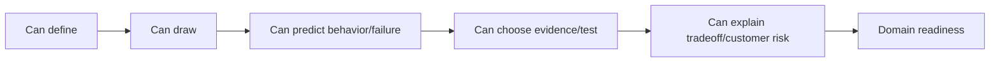

### 🔍 Plain-English deep-dive: recognition is not recall

Seeing an answer and thinking `that looks right` is recognition. An interview or exam requires retrieval: define the term, draw the flow, predict a failure and distinguish close alternatives without prompts. Practice closed-book first, then use sources to correct the model and record the error.

## 8. Practice design and readiness tracker

Do not use live exam questions. Build original prompts from the published domain verbs and concepts.

| Skill | 0 | 1 | 2 | 3 | 4 |
|---|---|---|---|---|---|
| Define | Blank | Vague | Correct basics | Precise with boundary | Teaches and handles follow-up |
| Draw | Cannot | Partial | Correct main flow | Dependencies/failures | Recreates and adapts |
| Troubleshoot | Guesses | One cause | Layered | Competing hypotheses/test | Data-safe and customer-ready |
| Current source | None | General link | Exact page | Version/date/limits | Revalidation trigger/reviewer |
| Hands-on evidence | None | Watched | Synthetic | Authorized lab | Repeated lab with recovery/cleanup |

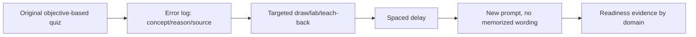

## 9. Specialization matrix

The official certification map checked **2026-08-24** includes paths/titles in areas such as ONTAP, hybrid cloud, cloud services, AI, cyber resilience, support, FlexPod, installation, SAN, data protection and MetroCluster. Names and prerequisite/renewal links change; verify each credential page.

| Direction | Best fit when | Foundation evidence | Official-current examples to verify |
|---|---|---|---|
| ONTAP administration | Broad cluster/data-service ownership | NCDA domains/labs | NetApp Certified Data Administrator, ONTAP |
| SAN implementation | Host/fabric/block depth | SAN lab, exact IMT recipes | Implementation Engineer SAN ONTAP specialist path |
| Data protection | SnapMirror/restore/BC focus | Recovery lab, RPO/RTO | Implementation Engineer Data Protection specialist path |
| MetroCluster | Site resilience specialization | HA/DR architecture and safe operations | MetroCluster specialist path |
| Support engineering | Cases, evidence, defects, troubleshooting | Escalation packages/PIR/quality | Support Engineer professional/specialist paths |
| Hybrid cloud/cloud services | CVO/provider services/operations | Cloud IAM/network/data path | Hybrid Cloud Administrator/Implementation/Architect or Cloud and Storage Services path |
| Containers | Kubernetes/CSI/application protection | Trident scenario/lab | Current Trident learning plus related cloud/admin credentials |
| Cyber resilience | Security, detection, immutable recovery | NIST/control/restore evidence | Cyber Resiliency expert path |
| AI data infrastructure | GPU/data pipeline/storage for AI | AI workload data-path project | AI Expert/AI Data Infrastructure paths |
| FlexPod/integrated infrastructure | Cisco/NetApp design/implementation | Network/compute/storage integration | Current joint design/implementation paths |

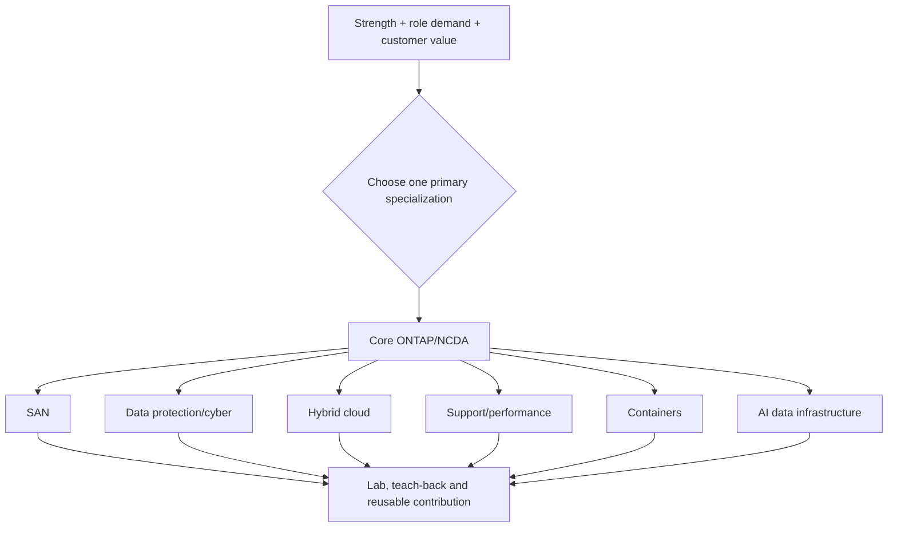

### Recommended sequence for you

1. Core ONTAP/NCDA learning because it closes the broadest role gap.
2. Support/performance as the fastest leverage of enterprise escalation and analytics.
3. Data protection/cyber resilience for TAM risk value.
4. Hybrid cloud/containers as Azure and modern workload bridge.
5. SAN or AI data infrastructure after role demand and authorized practice clarify priority.

This is a learning recommendation, not a certification guarantee or hiring requirement.

## 10. SNIA vendor-neutral storage concepts

The **Storage Networking Industry Association (SNIA)** publishes vendor-neutral storage education, a dictionary and technical work. Its website blocked automated retrieval during this check, so this Part links the official source but does not quote inaccessible text. Verify current definitions directly.

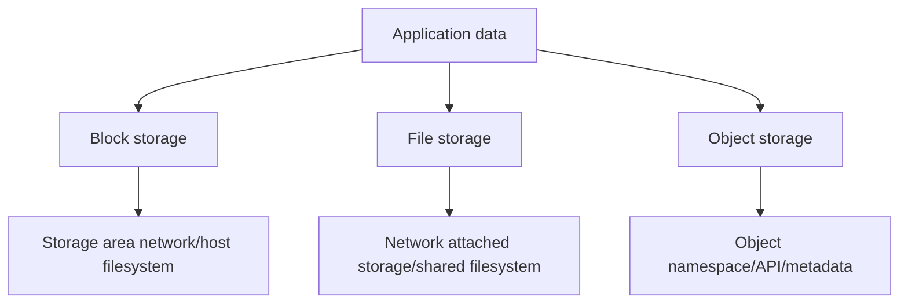

Vendor-neutral concepts to master:

| Concept | Plain meaning | NetApp tie without proprietary claim |
|---|---|---|
| Block/file/object | Access semantics, not media type | Compare LUN, NAS and S3-style service behavior |
| SAN/NAS | Block network versus file service | Trace initiator/target or client/server paths |
| Availability/durability | Accessible now versus data remains intact | Map HA, RAID, protection and recovery separately |
| Snapshot/replication/backup | Point, copy movement and independent recovery control | Explain layered failure models |
| Virtualization/SDS/HCI | Abstraction and deployment models | Compare CVO, managed cloud and on-prem models carefully |
| Data security | Identity, access, encryption, audit, media and recovery | Apply NIST plus product-specific controls |

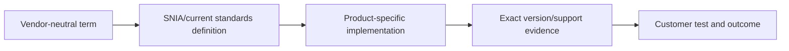

## 11. NIST storage security and cyber-resiliency context

**NIST SP 800-209, Security Guidelines for Storage Infrastructure** covers block, file, object, storage arrays, virtualization, SDS, HCI, cloud storage, data protection, backup and replication with security topics such as access, authentication, audit, configuration, encryption and media protection. **NIST SP 800-160 Vol. 2 Rev. 1** addresses cyber-resilient systems engineering. These are guidance/context, not NetApp product certification.

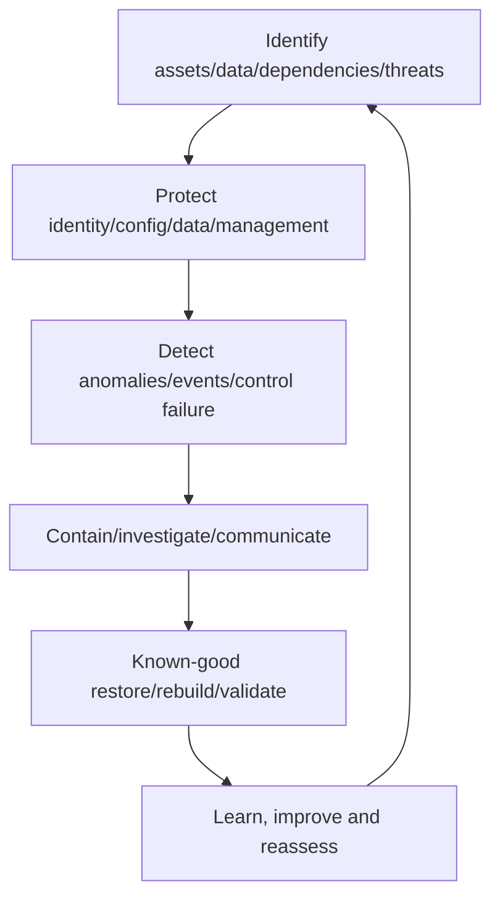

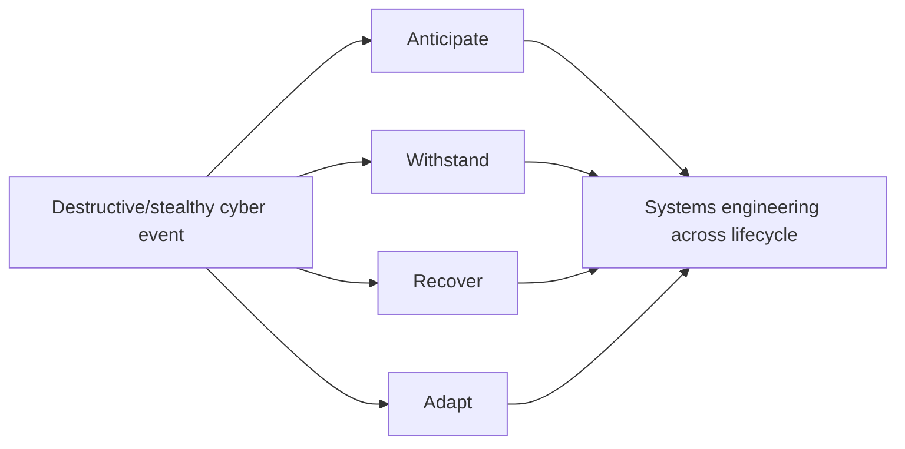

Map product controls only after current applicability validation: least privilege/MFA where supported, network segmentation, hardening, encryption/key separation, audit/telemetry, anomaly detection, snapshots/immutability/independent backup, clean recovery, exercises and residual risk.

### 🔍 Plain-English deep-dive: cyber resilience assumes prevention can fail

A fire-safe building still needs alarms, compartmentation, evacuation and rebuilding plans. Cyber resilience does not abandon prevention; it designs systems to anticipate, withstand, recover and adapt when attacks or control failures occur. Storage contributes, but endpoints, identity, networks, applications, people and governance remain part of the system.

## 12. Current trend radar: evidence before hype

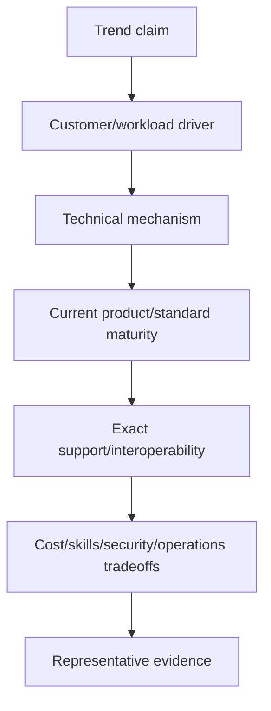

| Trend | Why it matters | Questions before recommendation |
|---|---|---|
| Analytics/AIOps | Fleet signals, anomaly/risk prioritization and automation | Coverage, definitions, false positives, explainability, authority, privacy? |
| NVMe/NVMe-oF | Lower-overhead storage protocol/transport opportunities | App/host/adapter/fabric/ONTAP support, multipathing, operational need? |
| Containers | Dynamic persistent state and app-aware mobility/protection | K8s/CSI/Trident versions, access, topology, recovery scope? |
| Hybrid/multicloud | Workload placement and data mobility across operating models | IAM/network/DNS/egress/consistency/support/exit? |
| Ransomware/cyber recovery | Destructive attack and account compromise risk | Prevention/detection/immutability/independence/clean restore? |
| AI workloads | High-throughput pipelines, many files/objects, checkpoints, governance | Ingest/prepare/train/infer/archive paths, GPU feeding, metadata, cost/security? |
| Sustainability | Energy/carbon/material/space pressure as data grows | Comparable boundary, workload, utilization, methodology and evidence? |

## 13. Analytics and AIOps trend

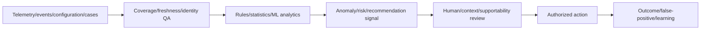

Do not call every dashboard or automation `AI`. Ask what model/rule exists, training/baseline, drift, confidence, privacy, bias, explainability, access, false positives/negatives and who authorizes action. AIOps can reduce noise and surface patterns; it does not replace asset identity or customer context.

## 14. NVMe and NVMe over Fabrics trend

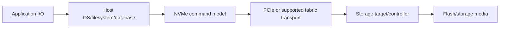

NVMe over Fabrics (NVMe-oF) extends NVMe communication over supported fabrics such as FC or TCP contexts. Compare SCSI and NVMe semantics, discovery, namespaces/subsystems, NQNs, ANA/multipathing, adapters/network, host/application support and operations. Do not promise lower application latency from protocol name alone; measure the whole path.

## 15. Containers and application data management trend

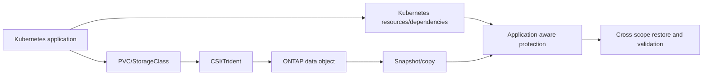

The trend is not merely dynamic volume creation; it is policy, topology, security, mobility and application-consistent protection across rapidly changing clusters. Track version skew and reclaim/orphan risks.

## 16. Hybrid cloud trend

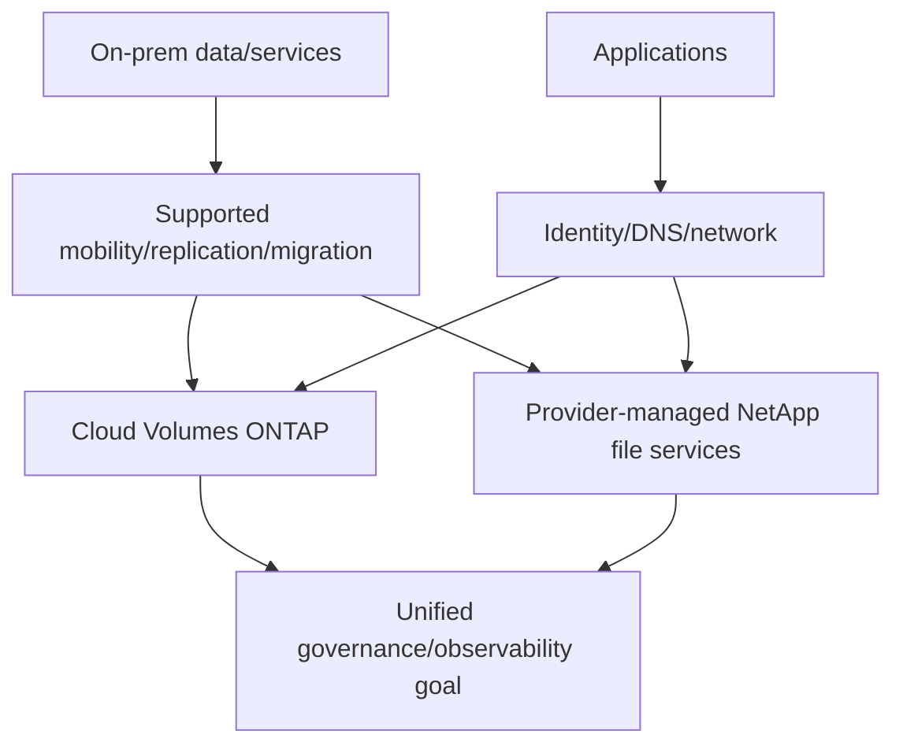

Hybrid value depends on latency, sovereignty, operations, support, protection and economics. Product naming and cross-service mobility require current source checks; data movement is not application migration.

## 17. Ransomware and cyber-recovery trend

```mermaid
flowchart LR
    PREVENT[Least privilege/hardening/segmentation] --> DATA[Data service]
    DETECT[Endpoint/identity/network/storage anomaly detection] --> RESP[Security response]
    DATA --> IMM[Immutable/retained/independent recovery points]
    RESP --> CLEAN[Contain and select known-good point]
    IMM --> CLEAN
    CLEAN --> REST[Isolated restore/integrity/app validation]
    REST --> ADAPT[Close control gaps]
```

Avoid `ransomware-proof`. State threat model, version/current feature support, confidence, false positives, privileged compromise, independent control domains, clean-room/isolated recovery and tested RPO/RTO.

## 18. AI workload trend

```mermaid
flowchart LR
    INGEST[Ingest multimodal/raw data] --> PREP[Clean/label/transform]
    PREP --> TRAIN[GPU training/checkpoints]
    TRAIN --> MODEL[Model registry/artifacts]
    MODEL --> INFER[Inference/RAG services]
    INFER --> FEED[Feedback/monitoring]
    FEED --> INGEST
    ARCHIVE[Retention/archive/governance] --> INGEST
    MODEL --> ARCHIVE
```

AI data infrastructure can combine many-small-file metadata, large sequential streams, object/file access, high throughput, checkpoint bursts, GPU locality, versioning, lineage, security/privacy and lifecycle. Workload characterization, not `AI-ready` branding, decides design.

```mermaid
flowchart TD
    GPU[GPU utilization below target] --> INPUT{Data pipeline supplies required rate?}
    INPUT -->|No| CLIENT[Client/loader/format/metadata]
    CLIENT --> NET[Network/protocol]
    NET --> STORAGE[Storage throughput/latency/concurrency]
    INPUT -->|Yes| COMPUTE[GPU/model/communication hypothesis]
    STORAGE --> EVID[End-to-end timeline and counters]
    COMPUTE --> EVID
```

## 19. Sustainability trend

```mermaid
flowchart LR
    WORK[Useful workload/data outcome] --> UTIL[Utilization and data efficiency]
    UTIL --> ENERGY[Operational energy/cooling]
    WORK --> HARD[Hardware/media/lifecycle]
    ENERGY --> GHG[Location/time emissions factors]
    HARD --> EMB[Embodied/material/circularity]
    GHG --> DEC[Comparable evidence and tradeoff]
    EMB --> DEC
```

NetApp's official responsibility materials discuss energy management, GHG emissions, energy-efficient products, product stewardship/circularity, privacy/security and supply chain. Treat vendor reports as source-specific evidence: record reporting period, organizational/product boundary, methodology, baseline and assurance; do not convert corporate metrics into a customer workload result.

## 20. Fully synthetic sanitized scenario: Your specialization choice

**Goal:** choose one 90-day primary learning track that creates role value while maintaining honest evidence.

| Track | Transferable strength | Gap | 90-day artifact | Decision |
|---|---|---|---|---|
| Support/performance | Escalation, analytics, critical situation | ONTAP counters/tool access | Synthetic cross-layer case + teach-back | Primary after core NCDA |
| Data protection/cyber | Incident/risk/customer reviews | Production SnapMirror/security | Recovery/cyber tabletop | Secondary |
| Hybrid cloud | Azure/networking | CVO/managed-service operations | Architecture/cost/routing case | Secondary |
| Containers | Cloud/AI interest | Kubernetes/Trident production | PVC/recovery scenario | Exploration |
| SAN | Networking/VM fundamentals | FC/MPIO production | Data-safe path lab | Later targeted |
| AI infrastructure | AI/Copilot awareness | GPU/storage pipelines | Workload characterization | Trend project |

```mermaid
flowchart LR
    CORE[Core ONTAP and eight NCDA domains] --> PRIMARY[Support/performance specialization]
    PRIMARY --> PROJECT[Cross-layer evidence/latency case]
    PROJECT --> TEACH[Teach-back and knowledge article]
    TEACH --> FEEDBACK[SME/mock-panel feedback]
    FEEDBACK --> SECOND[Data protection/cyber or hybrid-cloud next]
```

**Synthetic readiness conclusion:** You are not declared exam-ready or certified. The plan prioritizes fundamentals, authorized practice, retrieval and contribution. Booking occurs only after official-objective retests, policy review and a personal decision.

**Honest interview language:** `I am preparing for the NetApp Certified Data Administrator, ONTAP objectives using official sources and synthetic/authorized labs. I have not earned NCDA or administered ONTAP in production. My planned specialization is support/performance first because it best leverages my prior escalation and analytics background, followed by data protection/cyber resilience.`

## 21. 30/60/90-day learning and contribution plan

```mermaid
timeline
    title Synthetic 30/60/90 learning plan
    Days 1-30 : Core ONTAP architecture, networking, storage, official domain baseline
    Days 31-60 : NAS/SAN/protection/performance labs and error-log retests
    Days 61-90 : Capstone, specialization project, teach-backs, mock panel, booking decision
```

### Days 1–30: foundation and evidence hygiene

- Recheck official NCDA title/code/domains/path/policies.
- Baseline eight domains with closed-book draw/explain/troubleshoot prompts.
- Study Parts 4–35 and current ONTAP concepts; build glossary and architecture atlas privately.
- Complete Part 82 safe-lab governance and Part 83 synthetic discovery.
- Teach back cluster/node/HA/SVM/LIF/local tier/volume/protocol in 15 minutes.
- Contribution: one sanitized `ONTAP object hierarchy for support engineers` article draft.

```mermaid
flowchart LR
    BASE[Domain baseline] --> GAP[Top three knowledge gaps]
    GAP --> STUDY[Official docs/course + guide]
    STUDY --> DRAW[Closed-book architecture]
    DRAW --> TEACH[Teach-back]
    TEACH --> REVIEW[Peer/mock feedback]
```

### Days 31–60: operations and failure reasoning

- Complete authorized or synthetic NAS, SAN and protection labs.
- Practice positive/negative/failure/recovery/rollback and exact nonclaims.
- Build IMT/HWU/lifecycle/bug schemas without inventing gated results.
- Work performance timelines and capacity forecasts with Excel/Power BI concepts.
- Retest all eight domains with new original questions.
- Contribution: one evidence checklist and one troubleshooting tree.

```mermaid
flowchart LR
    LAB[Lab/design] --> FAIL[Failure hypothesis]
    FAIL --> TEST[Discriminating safe test]
    TEST --> REC[Recovery/rollback]
    REC --> EVID[Sanitized evidence]
    EVID --> TEACH[Teach-back and review]
```

### Days 61–90: integration, specialization and decision

- Defend Parts 90–91 assessment/capstone to a mock panel.
- Complete one support/performance specialization project and one cyber/DR tabletop.
- Review official free prep/resources and any legitimately enrolled training.
- Run timed original-domain quizzes; analyze errors by concept, not score alone.
- Recheck CertCenter and policies; decide whether to schedule. No booking pressure.
- Contribution: 30-minute brown-bag, knowledge article and onboarding checklist.

```mermaid
flowchart LR
    CAP[Capstone/panel] --> SPEC[Specialization project]
    SPEC --> MOCK[Original timed mocks]
    MOCK --> ERR[Error log and spaced retest]
    ERR --> POLICY[Official page/policy recheck]
    POLICY --> DEC{Evidence-based booking decision}
    DEC -->|Not ready| PLAN[Extend practice]
    DEC -->|Ready by personal criteria| BOOK[Use official CertCenter]
```

## 22. Teach-back and contribution ladder

```mermaid
flowchart TD
    LEARN[Learn concept] --> EXPLAIN[Explain to non-specialist]
    EXPLAIN --> DRAW[Draw architecture/failure]
    DRAW --> DEMO[Authorized lab or synthetic demo]
    DEMO --> ARTICLE[Versioned knowledge article]
    ARTICLE --> REVIEW[Peer/SME feedback]
    REVIEW --> COACH[Coach another learner]
    COACH --> IMPROVE[Update artifact and evidence]
```

Contribution quality checklist: audience/problem, prerequisite vocabulary, architecture, current sources/date, safe steps or synthetic fallback, expected observations, failure/recovery, privacy/access, limitations, reviewer and expiry trigger. Do not reproduce gated course or exam material.

## 23. Source/version/trend journal

```mermaid
flowchart LR
    CLAIM[Certification/standard/trend claim] --> SRC[Official source URL/title]
    SRC --> DATE[Checked date/revision/status]
    DATE --> SCOPE[Product/version/domain/boundary]
    SCOPE --> NOTE[What it supports/does not support]
    NOTE --> RECHECK[Expiry/recheck trigger]
```

Recheck triggers: exam booking, path/policy page changes, certification nearing expiration, product rename/release, standards revision/withdrawal, new workload requirement, customer recommendation or published contribution.

## 24. JD Mapping and background tie

```mermaid
flowchart LR
    SUPPORT[enterprise escalation/critical situation] --> SPEC[Support/performance specialization]
    ANALYTICS[Analytics/statistics] --> AIOPS[Telemetry/performance/trend rigor]
    AZ[Azure/networking] --> HYBRID[Hybrid cloud and containers]
    COMM[Reviews/mentoring/writing] --> CONTRIB[Teach-back/SME contribution]
    CORE[Core ONTAP/NCDA objectives] --> ROLE[NetApp TAM readiness]
    SPEC --> ROLE
    AIOPS --> ROLE
    HYBRID --> ROLE
    CONTRIB --> ROLE
```

| JD need | Roadmap evidence |
|---|---|
| Learn new technology | Eight-domain retrieval/lab plan |
| Build specialization | Support/performance primary track plus next options |
| Coach/buddy | Teach-back and onboarding checklist |
| SME contribution | Versioned article/tree/brown-bag with review |
| Current trends | Evidence-gated radar, no hype claims |
| Storage/cloud depth | SNIA concepts plus ONTAP/cloud/container/cyber links |

## 25. Official and Public Source Anchors

**Date checked: 2026-08-24.** Certification facts use official NetApp sources only. All names, codes, domains, policies, availability, delivery, fees, courses and renewal rules must be rechecked before action. This guide does not reproduce protected exam content.

| Topic | Official source | Bounded use |
|---|---|---|
| Certification catalog/paths | [NetApp Certifications](https://www.netapp.com/support-and-training/netapp-learning-services/certifications/) | Current credential/path map and registration entry |
| NCDA title/domains/guidance | [NetApp Certified Data Administrator, ONTAP](https://www.netapp.com/support-and-training/netapp-learning-services/certifications/ontap-data-administration/) | Exact current title, experience guidance and eight domains |
| Exam code/policies | [NetApp Certification Program policies](https://www.netapp.com/support-and-training/certification-program-policies/) | NS0-163, account, agreement, security, retake/expiration and booking policies; recheck |
| ONTAP Administrator path | [ONTAP Administrator learning path](https://www.netapp.com/support-and-training/netapp-learning-services/learning-paths/ontap-administrator/) | Current recommended courses/prep/registration navigation |
| NetApp Learning | [NetApp Learning Services](https://www.netapp.com/support-and-training/netapp-learning-services/) | Learning paths, catalog and account entry |
| ONTAP docs | [ONTAP documentation](https://docs.netapp.com/us-en/ontap/) | Product concepts/tasks; exact release required |
| SNIA | [SNIA](https://www.snia.org/), [SNIA Dictionary](https://www.snia.org/education/online-dictionary) | Vendor-neutral terminology/standards entry; direct verification required |
| Storage security | [NIST SP 800-209](https://csrc.nist.gov/pubs/sp/800/209/final) | Storage-infrastructure security guidance context |
| Cyber resiliency | [NIST SP 800-160 Vol. 2 Rev. 1](https://csrc.nist.gov/pubs/sp/800/160/v2/r1/final) | Cyber-resilient systems engineering context |
| NVMe | [NVM Express specifications](https://nvmexpress.org/specifications/) | Current standards entry; product support still separate |
| Trident | [NetApp Trident documentation](https://docs.netapp.com/us-en/trident/) | Current container-storage naming/releases |
| Cloud | [NetApp Console documentation](https://docs.netapp.com/us-en/console-setup-admin/), [Cloud Volumes ONTAP](https://docs.netapp.com/us-en/cloud-volumes-ontap/) | Current hybrid-cloud naming/product navigation |
| Ransomware security | [ONTAP ransomware protection](https://docs.netapp.com/us-en/ontap/anti-ransomware/) | Current product feature/operational navigation |
| AI | [NetApp AI solutions](https://www.netapp.com/artificial-intelligence/) | Current portfolio/trend orientation, not workload guarantee |
| Sustainability | [NetApp Responsibility](https://www.netapp.com/responsibility/) | Corporate sustainability/reporting source; do not infer workload result |

## 26. Self-Test and Teach-Back

1. State exact NCDA title, code and eight official domains with source date.
2. Explain official prerequisite recommendations versus mandatory requirements.
3. Describe legal exam preparation and list prohibited exam-security behaviors.
4. Build a domain-by-domain learn/draw/lab/troubleshoot/teach plan.
5. Select and defend one specialization using role demand and evidence.
6. Explain SNIA block/file/object and SAN/NAS concepts vendor-neutrally.
7. Apply NIST storage security/cyber-resiliency context without claiming compliance.
8. Explain seven trends through driver/mechanism/support/tradeoff/evidence.
9. Deliver the 30/60/90 plan and one contribution artifact outline.
10. State exact no-certification and no-production-NetApp boundaries.

---

## Likely Interview Questions

### Q1. What is the current NCDA credential and what does it cover?

> **Model answer:** `Official NetApp sources checked 2026-08-24 call it NetApp Certified Data Administrator, ONTAP. NetApp program policies identify exam code NS0-163. The public page lists eight domains: Storage Platforms, Core ONTAP, ONTAP Storage, Networking, Storage Protocols and Connectivity, Data Protection, Security and Performance. I would recheck CertCenter before booking.`

### Q2. What prerequisites and experience are expected?

> **Model answer:** `The official page says candidates should have six to twelve months with ONTAP solutions and foundation knowledge in networking, cloud, virtualization, SAN/NAS, host OS, ONTAP, data protection and HA. It says to consider associate accreditations, and the administrator path encourages an associate path first. I distinguish guidance from mandatory prerequisites and do not claim the experience yet.`

### Q3. How will you prepare ethically?

> **Model answer:** `I use official objectives, NetApp learning paths/prep, public documentation, authorized labs or clearly synthetic cases, closed-book diagrams, original questions, teach-back and spaced error-log retests. I will not use dumps, reconstructed live questions, protected screenshots, unauthorized vouchers, assistance or shared accounts, and I will reread the candidate agreement/security policy.`

### Q4. Which specialization would you choose and why?

> **Model answer:** `Core ONTAP/NCDA learning first, then support/performance because enterprise escalation, critical situation and analytics are my strongest transfer. It helps a TAM connect symptoms, evidence and customer risk. Data protection/cyber resilience is my next track, followed by hybrid cloud/containers. I would adjust to customer and team demand.`

### Q5. How do SNIA and NIST add value to vendor learning?

> **Model answer:** `SNIA provides vendor-neutral storage terminology and standards context, helping separate block/file/object, SAN/NAS and protection concepts from product implementation. NIST SP 800-209 frames storage security, and SP 800-160 Vol. 2 frames cyber-resilient systems engineering. They guide questions and controls but do not certify a NetApp product or customer design.`

### Q6. Which storage trends matter most?

> **Model answer:** `Analytics/AIOps, NVMe/NVMe-oF, containers and application-aware data management, hybrid cloud, ransomware/cyber recovery, AI data pipelines and sustainability. I evaluate each through customer driver, technical mechanism, maturity/current support, security/operations/cost tradeoffs and representative evidence, not hype.`

### Q7. What will you deliver in your first 90 days of learning?

> **Model answer:** `Days 1–30: eight-domain baseline, core ONTAP architecture, safe discovery and a teach-back article. Days 31–60: synthetic/authorized NAS, SAN, protection and performance labs plus evidence checklists. Days 61–90: proactive-risk capstone, support/performance project, cyber tabletop, mock panel and three reviewed contributions. Booking remains evidence- and policy-based.`

### Q8. Are you NCDA certified or production-experienced now?

> **Model answer:** `No. I am not claiming NCDA or production ONTAP administration. I can accurately describe my prior production strengths and this official-objective-aligned synthetic/authorized preparation. I will claim a credential only after earning it and verifying active status.`

---

## 30-Second Memory Hooks

- **NCDA:** NetApp Certified Data Administrator, ONTAP; verify NS0-163 at booking.
- **Eight domains:** platforms, core, storage, network, protocols, protection, security, performance.
- **Guidance:** six-to-twelve-month experience statement is not your experience claim.
- **Path:** foundations -> associate preparation -> ONTAP admin -> NCDA -> specialization.
- **Ethics:** objectives and original practice, never dumps or reconstructed questions.
- **Readiness:** define -> draw -> predict -> test -> teach.
- **SNIA:** vendor-neutral terms before product implementations.
- **NIST:** storage security plus anticipate/withstand/recover/adapt context.
- **Trends:** driver -> mechanism -> maturity/support -> tradeoff -> evidence.
- **Specialize:** core first; support/performance leverages your strongest proof.
- **90 days:** foundation, labs, capstone/contribution, then booking decision.
- **Claim:** preparing is not certified; lab is not production.

---

## Completion Checklist

- [ ] State all five safety labels and exact no-certification/production nonclaim.
- [ ] Verify official NCDA title, NS0-163 code and eight domains dated 2026-08-24.
- [ ] Separate experience/prerequisite guidance from mandatory requirements.
- [ ] Recheck CertCenter, account, agreement, delivery, security and all policies before booking.
- [ ] Make no fee, voucher, availability, refund, pass or job promise.
- [ ] Use no dumps, live questions, reconstruction, unauthorized materials or assistance.
- [ ] Build the official-domain learn/draw/lab/troubleshoot/teach map.
- [ ] Use legitimate labs or complete synthetic/documentation fallback.
- [ ] Select a specialization through role/customer value and evidence.
- [ ] Explain SNIA concepts and NIST context without compliance/certification overclaim.
- [ ] Cover sustainability, AIOps, NVMe, containers, hybrid cloud, ransomware and AI workloads.
- [ ] Execute the 30/60/90 plan with teach-backs and reviewed contributions.
- [ ] Maintain a source/version/trend journal and recheck triggers.
- [ ] Complete the fully synthetic specialization scenario honestly.
- [ ] Answer exact Q1-Q8 aloud and complete every self-test.

---

*Next suggested section:* [Part 95 - Interview Question Bank - 200+ Questions with Answers and Self-Quiz Tracker](Part-95-interview-question-bank.md)