# Part 95 - Interview Question Bank - 200+ Questions with Answers and Self-Quiz Tracker

> **Section goal:** Convert Parts 1-94 into repeatable interview performance through **240 unique bank questions**: 48 Basic, 48 Intermediate, and 144 Advanced. Each prompt includes a concise model answer or answer direction and a linked Part for correction, while the practice system tests recall, architecture, numerical reasoning, troubleshooting, customer judgment, behavioral evidence, and closing readiness.

Covers index item **95** and maps to every job-description responsibility: customer-data analysis, storage and virtualization knowledge, environment discovery, proactive risk, supportability, lifecycle and upgrade advice, install-base accuracy, operational reviews, recommendation adoption, special projects, high-pressure work, communication, coaching, cross-functional contribution, specialization, and customer time-zone alignment.

**Privacy/access boundary:** Practice only with public material and sanitized examples. Do not expose customer/employer data, credentials, gated support records, exam content, candidate details, incident evidence, commercial information, or private bug information in an interview, recording, portfolio, or unapproved AI tool.

**Synthetic-evidence rule:** Every customer, topology, metric, version, incident, action, score, mock result, date, and outcome in this Part is fictional and sanitized unless explicitly identified as your supported CV fact.

**Version/current-source caveat:** Product names, releases, limits, defaults, commands, features, support matrices, lifecycle status, certification details, and tools change. Official/public sources were checked **2026-08-24**. Revalidate the exact current product, release, platform, host, protocol, and source before a live recommendation.

**Explicit nonclaim:** This bank is original interview preparation, not a NetApp exam dump, internal interview script, hiring rubric, product guarantee, support procedure, or proof of production ONTAP experience. You must not claim NetApp employment, certification, tool entitlement, customer outcomes, or production administration that you have not earned.

> **No-production-NetApp boundary and background tie:** You can factually discuss enterprise Support Escalation Engineering, critical situation/business-critical escalations, enterprise and partner customers, SharePoint/OneDrive/Copilot, advisory work, Product/Engineering collaboration, analytics, reviews, mentoring, recognition, and automation/AI learning. You must label NetApp answers as conceptual study, clearly synthetic exercise, or authorized lab evidence as applicable. Your transferable method is real; the NetApp production claim is not.

---

## 1. How to use the bank

The bank uses three levels:

| Level | Count | Share | Expected response |
|---|---:|---:|---|
| Basic | 48 | 20% | Define, distinguish, calculate, or draw the core idea in 30-60 seconds |
| Intermediate | 48 | 20% | Connect components, evidence, customer context, and tradeoffs in 60-120 seconds |
| Advanced | 144 | 60% | Diagnose, architect, calculate, prioritize, influence, or defend judgment in 2-5 minutes |
| **Total** | **240** | **100%** | Closed-book first; correct from the linked Part afterward |

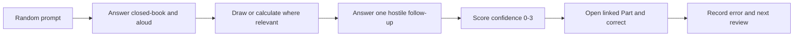

### 🔍 Plain-English deep-dive: retrieval, not rereading

Rereading is like recognizing a familiar road from the passenger seat; an interview asks you to drive without turn-by-turn directions. Start with no notes, commit to an answer, and then compare it with the linked Part. The discomfort identifies the exact memory or reasoning gap.

### Standard answer labels

- **Production fact:** directly supported by your CV/background.
- **Transferable method:** a real method used in prior work, applied carefully to a new domain.
- **Conceptual:** understood from study and official public sources.
- **Synthetic exercise:** practiced on fictional sanitized evidence.
- **Authorized lab:** use only after actually completing an authorized lab.
- **Unknown/current check required:** the honest answer when exact facts require live tools or current documentation.

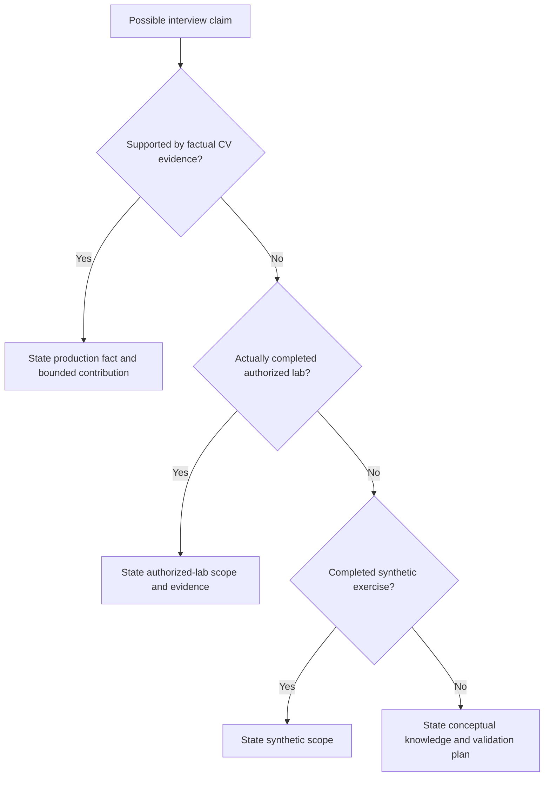

---

## Basic Bank - 48 Questions

## Basic A - Role, TAM, and customer outcomes

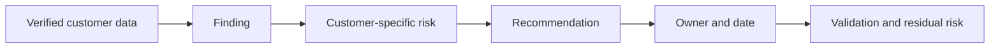

#### B001. What does a TAM Technical Analyst do?
**Model answer:** Turns verified customer and technical evidence into prioritized recommendations, action tracking, and validated outcomes under the lead TAM's account direction. **Review:** [Part 1](Part-01-role-map-netapp-tam-story.md).

#### B002. How is proactive TAM work different from reactive Support?
**Model answer:** Support progresses a current case or fault; TAM work uses account context, trends, lifecycle, and planned change to reduce future exposure and improve long-term value. **Review:** [Part 3](Part-03-technical-account-management-customer-success.md).

#### B003. What makes a recommendation defensible?
**Model answer:** Evidence, customer context, risk mechanism, feasible action/options, owner/date, validation, and residual risk must form one traceable argument. **Review:** [Part 58](Part-58-recommendation-writing.md).

#### B004. Who accepts customer business risk?
**Model answer:** The authorized customer decision owner; a TAM or analyst explains evidence and options but does not accept risk for the customer. **Review:** [Part 63](Part-63-stakeholders-account-team-raci.md).

#### B005. What is an operational service review?
**Model answer:** A recurring evidence-led customer review of environment changes, health, incidents, risks, recommendations, decisions, actions, and outcomes. **Review:** [Part 61](Part-61-operational-service-review-lifecycle.md).

#### B006. What is install-base hygiene?
**Model answer:** Repeatedly reconciling asset identity, ownership, site, status, versions, entitlement, telemetry, duplicates, and retired records. **Review:** [Part 49](Part-49-install-base-management-data-quality.md).

#### B007. What is residual risk?
**Model answer:** Exposure that remains after a control, remediation, deferral, or acceptance decision; no action makes risk disappear automatically. **Review:** [Part 57](Part-57-risk-scoring-prioritization.md).

#### B008. How should you describe your NetApp experience?
**Model answer:** State prior production strengths factually, then label NetApp knowledge as conceptual, synthetic, or authorized-lab evidence; do not imply production ONTAP administration. **Review:** [Part 1](Part-01-role-map-netapp-tam-story.md).

## Basic B - Storage fundamentals and math

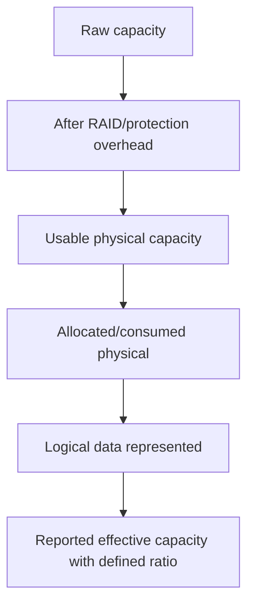

#### B009. What is the difference between a bit, byte, block, file, and object?
**Model answer:** Bits form bytes; storage transfers fixed-size blocks; files add names/directories/metadata; objects combine payload, metadata, and an object identifier/API. **Review:** [Part 4](Part-04-data-storage-bits-blocks-files-objects.md).

#### B010. What is random versus sequential I/O?
**Model answer:** Sequential I/O accesses nearby addresses in order; random I/O jumps between addresses, changing seek, cache, queue, and media behavior. **Review:** [Part 4](Part-04-data-storage-bits-blocks-files-objects.md).

#### B011. What are IOPS, throughput, and latency?
**Model answer:** IOPS is operations per second, throughput is data per second, and latency is time per operation; one metric cannot substitute for the others. **Review:** [Part 9](Part-09-performance-iops-throughput-latency-queues.md).

#### B012. Calculate throughput for 10,000 IOPS at an average 8 KiB per operation.
**Model answer:** $10{,}000 \times 8\ \text{KiB/s}=80{,}000\ \text{KiB/s}\approx78.125\ \text{MiB/s}$ because $80{,}000/1024=78.125$. **Review:** [Part 9](Part-09-performance-iops-throughput-latency-queues.md).

#### B013. What is RAID?
**Model answer:** A method of arranging drives with striping, mirroring, or parity to balance usable capacity, performance, and failure tolerance; it is not backup. **Review:** [Part 6](Part-06-raid-erasure-protection-rebuild-risk.md).

#### B014. Why is RAID not backup?
**Model answer:** RAID helps survive selected media failures but usually shares the same system and cannot independently recover every deletion, corruption, attack, or site loss. **Review:** [Part 8](Part-08-availability-durability-resilience-backup-dr.md).

#### B015. What is raw, usable, used, and effective capacity?
**Model answer:** Raw is installed media; usable follows protection/system overhead; used is consumed physical space at a defined layer; effective expresses represented logical data using a declared efficiency assumption. **Review:** [Part 10](Part-10-capacity-growth-efficiency-headroom.md).

#### B016. A pool has 100 TiB usable and 72 TiB used. What is utilization?
**Model answer:** $72/100\times100=72\%$ utilization, leaving 28 TiB before operational reserves or thresholds. **Review:** [Part 10](Part-10-capacity-growth-efficiency-headroom.md).

#### B017. Used capacity grows from 60 TiB to 66 TiB in three months. What is simple monthly growth?
**Model answer:** $(66-60)/3=2$ TiB per month; do not call that a reliable forecast without comparable history and workload context. **Review:** [Part 45](Part-45-capacity-analytics-forecasting.md).

#### B018. At 66 TiB used, 90 TiB action threshold, and 2 TiB/month growth, what is time to threshold?
**Model answer:** $(90-66)/2=12$ months, before adding uncertainty, seasonality, procurement lead time, and planned workload. **Review:** [Part 45](Part-45-capacity-analytics-forecasting.md).

#### B019. What are RPO and RTO?
**Model answer:** Recovery point objective is tolerated data loss measured in time; recovery time objective is tolerated time to restore the service. **Review:** [Part 8](Part-08-availability-durability-resilience-backup-dr.md).

#### B020. What is Little's Law intuition?
**Model answer:** Average work in a stable system is arrival rate times average time, $L=\lambda W$; more concurrency can reflect waiting rather than useful throughput. **Review:** [Part 9](Part-09-performance-iops-throughput-latency-queues.md).

## Basic C - Networking

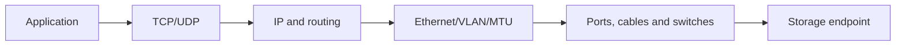

#### B021. What is the purpose of the OSI/TCP-IP layered model?
**Model answer:** It separates responsibilities so a symptom can be isolated from physical link through network transport to application protocol. **Review:** [Part 11](Part-11-osi-tcpip-storage-professionals.md).

#### B022. What happens in a TCP three-way handshake?
**Model answer:** Client sends SYN, server replies SYN-ACK, client sends ACK, establishing sequence state before reliable byte transfer. **Review:** [Part 11](Part-11-osi-tcpip-storage-professionals.md).

#### B023. What is a VLAN?
**Model answer:** A logical Layer-2 broadcast domain carried over Ethernet switching; routing is required to cross VLAN boundaries. **Review:** [Part 12](Part-12-ethernet-vlan-lacp-mtu-qos.md).

#### B024. What is LACP?
**Model answer:** Link Aggregation Control Protocol coordinates eligible physical links into a logical group; per-flow hashing means one flow may not use every link. **Review:** [Part 12](Part-12-ethernet-vlan-lacp-mtu-qos.md).

#### B025. Why must MTU be consistent end to end?
**Model answer:** A larger frame fails or fragments where unsupported; a partial jumbo-frame configuration can create size-dependent loss despite successful small pings. **Review:** [Part 12](Part-12-ethernet-vlan-lacp-mtu-qos.md).

#### B026. What is a subnet and default gateway?
**Model answer:** A subnet defines directly reachable IP neighbors; the default gateway routes traffic whose destination is outside that local prefix. **Review:** [Part 13](Part-13-ip-routing-dns-dhcp-ntp-firewalls.md).

#### B027. Why do DNS and NTP matter to storage?
**Model answer:** DNS supports service discovery and identity names; accurate time supports Kerberos, certificates, logs, and cross-system correlation. **Review:** [Part 13](Part-13-ip-routing-dns-dhcp-ntp-firewalls.md).

#### B028. What do retransmissions indicate?
**Model answer:** TCP did not receive expected acknowledgment in time; possible causes include loss, congestion, path/MTU faults, receiver delay, or reordering, so retransmission alone does not prove the layer. **Review:** [Part 11](Part-11-osi-tcpip-storage-professionals.md).

## Basic D - NFS, SMB, iSCSI, FC, and NVMe

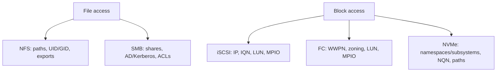

#### B029. What is NAS versus SAN?
**Model answer:** NAS serves files through a shared namespace; SAN presents blocks that a host treats as devices and usually formats with its own filesystem. **Review:** [Part 14](Part-14-nas-san-file-block-architecture.md).

#### B030. What is NFS?
**Model answer:** A network file protocol commonly used by Unix/Linux clients to access exported paths using identity, export policy, namespace, locking, and network services. **Review:** [Part 15](Part-15-nfs-versions-identity-locks-troubleshooting.md).

#### B031. What is an NFS export policy?
**Model answer:** Rules that decide which clients and security/identity conditions receive specified access; mount visibility does not automatically mean write authorization. **Review:** [Part 28](Part-28-ontap-nfs-configuration-security.md).

#### B032. What is SMB?
**Model answer:** A network file-sharing protocol used heavily with Windows environments, involving sessions, shares, identity, authentication, permissions, locking, DNS, and time. **Review:** [Part 16](Part-16-smb-active-directory-authentication-continuity.md).

#### B033. How do share and file permissions interact in SMB?
**Model answer:** Effective access is constrained by both layers; the user needs permission through the share and underlying file/folder authorization. **Review:** [Part 29](Part-29-ontap-smb-active-directory.md).

#### B034. Why does Kerberos need DNS and time?
**Model answer:** Kerberos relies on correct service names/SPNs and bounded clock skew; wrong name resolution or time can prevent ticket-based authentication. **Review:** [Part 16](Part-16-smb-active-directory-authentication-continuity.md).

#### B035. What is iSCSI?
**Model answer:** A block-storage protocol carrying SCSI commands over TCP/IP between an initiator and target. **Review:** [Part 17](Part-17-iscsi-luns-chap-mpio.md).

#### B036. What are IQN, target portal, and CHAP?
**Model answer:** An IQN identifies an iSCSI node, a portal is a reachable target IP/port endpoint, and CHAP provides challenge-response authentication; none replaces LUN mapping. **Review:** [Part 17](Part-17-iscsi-luns-chap-mpio.md).

#### B037. What is Fibre Channel zoning?
**Model answer:** Fabric policy controlling which initiator and target port identities can communicate; zoning does not by itself authorize a host to a LUN. **Review:** [Part 18](Part-18-fibre-channel-fcoe-nvme-fabrics.md).

#### B038. What is a WWPN?
**Model answer:** A World Wide Port Name uniquely identifies an FC port endpoint and is used in fabric and storage access configuration. **Review:** [Part 18](Part-18-fibre-channel-fcoe-nvme-fabrics.md).

#### B039. What is MPIO?
**Model answer:** Multipath I/O combines redundant paths to one stable block device and handles path selection/failure according to a supported host/storage recipe. **Review:** [Part 30](Part-30-ontap-san-luns-igroups-multipathing.md).

#### B040. What changes with NVMe compared with SCSI-oriented storage?
**Model answer:** NVMe uses a command model designed for parallel low-overhead storage and exposes namespaces/subsystems and NQNs; end-to-end support and application benefit still require validation. **Review:** [Part 18](Part-18-fibre-channel-fcoe-nvme-fabrics.md).

## Basic E - ONTAP, data services, and evidence

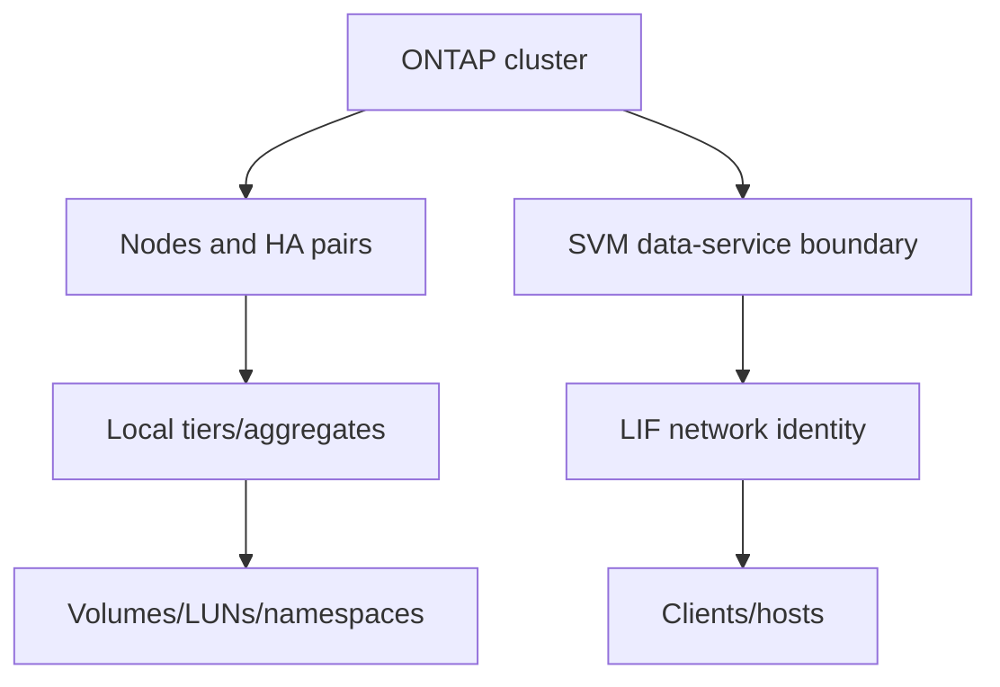

#### B041. What is ONTAP?
**Model answer:** NetApp's data-management operating system for supported storage platforms and deployment models; exact capabilities depend on product and release. **Review:** [Part 19](Part-19-netapp-portfolio-solution-map.md).

#### B042. What is WAFL?
**Model answer:** ONTAP's write-anywhere file-layout architecture, using redirected writes and consistency concepts to manage data and metadata; it should not be reduced to a generic host filesystem. **Review:** [Part 20](Part-20-ontap-wafl-architecture.md).

#### B043. What is an HA pair?
**Model answer:** Two controllers designed to provide takeover/giveback and access to partner storage under supported conditions; HA is not the same as backup or site DR. **Review:** [Part 21](Part-21-clustered-ontap-nodes-ha-quorum.md).

#### B044. What is an SVM?
**Model answer:** A Storage Virtual Machine is a logical data-service and administrative boundary that owns protocol configuration, namespaces, and LIFs. **Review:** [Part 22](Part-22-svms-lifs-namespaces-junctions.md).

#### B045. What is a LIF?
**Model answer:** A logical interface that provides an ONTAP network identity for data, management, cluster, or intercluster purpose according to role and release. **Review:** [Part 22](Part-22-svms-lifs-namespaces-junctions.md).

#### B046. What is a snapshot?
**Model answer:** A point-in-time storage representation that preserves referenced blocks efficiently; it needs application-consistency and recovery validation and is not automatically an independent backup. **Review:** [Part 35](Part-35-snapshots-restores-clones.md).

#### B047. What are AutoSupport and Digital Advisor?
**Model answer:** AutoSupport generates/transmits system information under configured conditions; Digital Advisor presents eligible support insights. Both require identity, freshness, entitlement, privacy, and applicability checks. **Review:** [Part 47](Part-47-autosupport-architecture-delivery.md).

#### B048. What are IMT and Hardware Universe used for?
**Model answer:** IMT checks supported end-to-end solution combinations; Hardware Universe provides current platform/component/limit information. Neither should be answered from memory for a live design. **Review:** [Part 50](Part-50-imt-supportability-validation.md).

---

## Intermediate Bank - 48 Questions

## Intermediate A - ONTAP architecture, layout, administration, and evidence

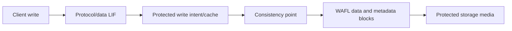

#### I001. Explain a client write through ONTAP at a conceptual level.
**Model answer:** The request reaches the SVM through a protocol LIF, is acknowledged only under the architecture's protected-write rules, and is later organized through a consistency point into WAFL-managed protected storage. Validate exact release behavior. **Review:** [Part 20](Part-20-ontap-wafl-architecture.md).

#### I002. Why separate cluster, node, HA pair, SVM, LIF, local tier, and volume in a diagram?
**Model answer:** They represent different failure, ownership, network, administrative, and storage boundaries; collapsing them hides where a fault or decision lives. **Review:** [Part 22](Part-22-svms-lifs-namespaces-junctions.md).

#### I003. What is takeover/giveback, and what does it not guarantee?
**Model answer:** It transfers controller service responsibility within an HA pair under supported conditions and later returns it; it does not prove application continuity, path correctness, or site resilience. **Review:** [Part 21](Part-21-clustered-ontap-nodes-ha-quorum.md).

#### I004. How would you explain a local tier/aggregate versus a volume?
**Model answer:** The local tier is protected physical storage capacity owned by a node; a volume is a logical data container placed on that storage and presented through data services. **Review:** [Part 23](Part-23-ontap-disks-raid-aggregates-volumes.md).

#### I005. Why use read-only discovery before change?
**Model answer:** It establishes exact identity, state, dependencies, health, and evidence before introducing a new variable or risking customer data. **Review:** [Part 24](Part-24-ontap-system-manager-cli-rest.md).

#### I006. What makes an ONTAP evidence package reproducible?
**Model answer:** Exact object identity, command/API/view, fields, source, UTC time, release, scope, raw reference, interpretation, redaction, and current-doc check. **Review:** [Part 25](Part-25-ontap-ems-logs-audit-evidence.md).

#### I007. How do EMS, audit logs, and performance archives differ?
**Model answer:** EMS reports system events, audit evidence records administrative/API activity where configured, and performance archives provide time-series behavior; they answer different questions and require clock correlation. **Review:** [Part 25](Part-25-ontap-ems-logs-audit-evidence.md).

#### I008. What hardware evidence would you gather for a degraded shelf path?
**Model answer:** Exact platform, HA pair, shelf/IOM, cabling/path topology, ports/adapters, drive ownership, environmentals, events, current HWU/procedure, and client impact. **Review:** [Part 26](Part-26-netapp-hardware-shelves-cabling-frus.md).

## Intermediate B - NAS, SAN, S3, and efficiency

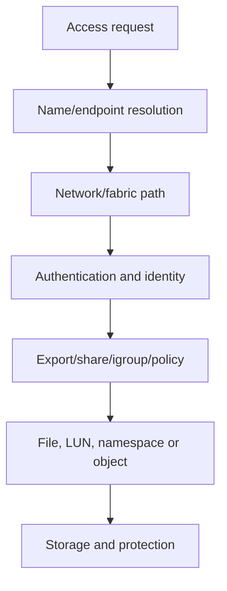

#### I009. A user can mount NFS but cannot write. What layers do you check?
**Model answer:** Client identity/groups, selected export rule, security flavor, namespace/path, file mode/ACL, read-only state, locks/quota/space, and one healthy control. **Review:** [Part 74](Part-74-nas-troubleshooting-scenarios.md).

#### I010. SMB works by direct server name but fails by alias. What is your leading path?
**Model answer:** Check DNS alias, requested SPN, SPN ownership/uniqueness, Kerberos ticket, time, session mechanism, and policy before weakening authentication. **Review:** [Part 74](Part-74-nas-troubleshooting-scenarios.md).

#### I011. Explain a unified NAS namespace.
**Model answer:** Volumes are joined under SVM namespace paths so clients use stable logical paths while storage layout and volume placement remain managed underneath. **Review:** [Part 27](Part-27-ontap-nas-architecture.md).

#### I012. Why can a LUN be visible multiple times but still be one device?
**Model answer:** Redundant paths present the same stable LUN identity; supported multipathing must claim them as one logical device, not allow separate mounts. **Review:** [Part 30](Part-30-ontap-san-luns-igroups-multipathing.md).

#### I013. Distinguish FC zoning, igroup membership, LUN mapping, and MPIO.
**Model answer:** Zoning permits fabric communication, igroup identifies authorized initiators, mapping assigns a LUN, and MPIO safely combines redundant host paths. **Review:** [Part 31](Part-31-ontap-iscsi-fc-nvme-configuration.md).

#### I014. What is ONTAP S3 conceptually?
**Model answer:** An object service exposing buckets and objects through S3-style APIs within supported ONTAP configurations; it differs from file shares and block devices. **Review:** [Part 33](Part-33-ontap-s3-object-storage.md).

#### I015. How do thin provisioning and deduplication create different risks?
**Model answer:** Thin provisioning commits logical capacity before physical use; deduplication may reduce physical consumption. Both can create overconfidence if ratios, layers, and workload change are ignored. **Review:** [Part 34](Part-34-storage-efficiency-fabricpool.md).

#### I016. Why can FabricPool affect first-read latency and cost?
**Model answer:** Cold blocks may need retrieval through an object-tier path; concurrency, working set, provider behavior, policy, and repeated access shape latency and transfer cost. **Review:** [Part 34](Part-34-storage-efficiency-fabricpool.md).

## Intermediate C - Protection, DR, security, and ransomware

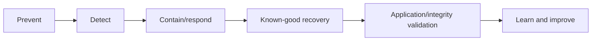

#### I017. Compare snapshot, replication, backup, archive, and DR.
**Model answer:** Snapshot is a point-in-time local representation; replication moves copies/state; backup adds independently managed recovery; archive retains long term; DR restores a service under disruption. **Review:** [Part 37](Part-37-backup-archive-bluexp-integration.md).

#### I018. What makes a SnapMirror relationship useful to the business?
**Model answer:** The destination must hold a validated point within RPO and be recoverable through an owned runbook within RTO; a green transfer alone is insufficient. **Review:** [Part 36](Part-36-snapmirror-replication-policies.md).

#### I019. Why is resync a high-judgment operation?
**Model answer:** It can establish a common baseline and discard divergent data depending on direction/context, so exact source/destination identity, newest valid data, backups, procedure, and approval are mandatory. **Review:** [Part 36](Part-36-snapmirror-replication-policies.md).

#### I020. What is the key safety principle in site failover?
**Model answer:** Preserve single-writer authority and prove fencing/remote state before forcing action; split-brain can make recovery worse. **Review:** [Part 38](Part-38-metrocluster-site-resilience-dr.md).

#### I021. What is immutability, and what does it not solve?
**Model answer:** It prevents specified data changes/deletion under configured retention controls; it does not by itself secure identities, detect attack, ensure clean data, or prove restore. **Review:** [Part 39](Part-39-snaplock-immutability-retention.md).

#### I022. Name core storage-security layers.
**Model answer:** Identity/MFA where supported, least privilege, network segmentation, hardening, encryption, key separation, auditing, vulnerability response, anomaly detection, immutable/independent recovery, and tested restoration. **Review:** [Part 40](Part-40-ontap-security-rbac-encryption-audit.md).

#### I023. How should a TAM discuss ransomware protection?
**Model answer:** State the threat model and layered controls, avoid `ransomware-proof`, validate exact feature/release, preserve security-incident authority, and prove known-good recovery. **Review:** [Part 41](Part-41-ransomware-resilience-arp.md).

#### I024. How do you decide whether a security advisory applies?
**Model answer:** Match exact product, release, component/feature, exposure path, prerequisites/trigger, advisory revision, mitigations, and fix; record uncertainty and current source date. **Review:** [Part 42](Part-42-security-advisories-vulnerability-response.md).

## Intermediate D - Performance, capacity, and QoS

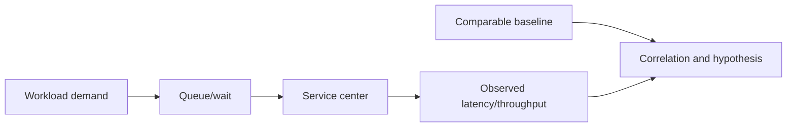

#### I025. Why is average latency insufficient?
**Model answer:** It can hide tail pain and mixed workloads; use distributions/percentiles, operation type, time windows, errors, and application-aligned baselines. **Review:** [Part 43](Part-43-ontap-performance-counters.md).

#### I026. How do you distinguish demand from bottleneck?
**Model answer:** Correlate offered workload, queueing, utilization, service time, throughput, errors, and response to a controlled change across layers. **Review:** [Part 44](Part-44-workload-baselines-bottlenecks-qos.md).

#### I027. What is a noisy neighbor?
**Model answer:** A competing workload consumes a shared constrained resource and degrades another workload; prove shared resource, timing, comparable victim demand, and response to isolation/policy. **Review:** [Part 44](Part-44-workload-baselines-bottlenecks-qos.md).

#### I028. What is the difference between a QoS floor and ceiling?
**Model answer:** A ceiling limits a workload's maximum service; a floor expresses minimum service behavior under supported conditions. Exact implementation and capacity prerequisites require current docs. **Review:** [Part 44](Part-44-workload-baselines-bottlenecks-qos.md).

#### I029. A 200 MiB/s change stream replicates over a sustained 150 MiB/s path. What happens?
**Model answer:** Backlog grows at roughly $200-150=50$ MiB/s while those rates persist, so RPO worsens even if scheduled updates trigger. **Review:** [Part 46](Part-46-performance-capacity-case-studies.md).

#### I030. Why should a capacity forecast include a latest-safe-start date?
**Model answer:** Procurement, approval, delivery, implementation, and validation lead time mean action must begin before the threshold date, not when capacity is exhausted. **Review:** [Part 45](Part-45-capacity-analytics-forecasting.md).

#### I031. How do snapshots complicate capacity interpretation?
**Model answer:** Changed or deleted active blocks can remain referenced by snapshots, so active logical data may be flat while physical use rises. **Review:** [Part 35](Part-35-snapshots-restores-clones.md).

#### I032. What does a controlled performance test require?
**Model answer:** Defined question, baseline, one bounded variable where possible, synchronized clocks, representative load, stop/rollback criteria, layer evidence, and application outcome. **Review:** [Part 46](Part-46-performance-capacity-case-studies.md).

## Intermediate E - AutoSupport, Digital Advisor, install base, IMT, HWU, bugs, lifecycle, and upgrades

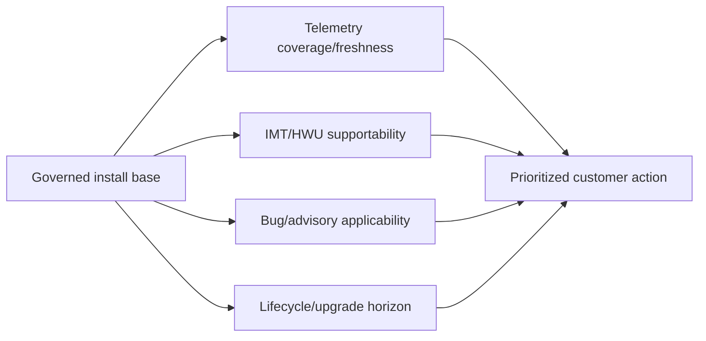

#### I033. How do you troubleshoot missing AutoSupport visibility?
**Model answer:** Check governed asset identity, local generation/history, payload/configuration, DNS/proxy/TLS/route, destination receipt, entitlement/association, privacy restrictions, and approved alternate evidence. **Review:** [Part 47](Part-47-autosupport-architecture-delivery.md).

#### I034. Why is a green Digital Advisor dashboard not proof of fleet health?
**Model answer:** Missing, stale, unentitled, misassociated, or excluded assets may be absent; calculate coverage against the governed critical population and label gaps unknown. **Review:** [Part 48](Part-48-active-iq-digital-advisor-wellness.md).

#### I035. What is the safest join key for install-base analysis?
**Model answer:** A stable entity-specific identifier with declared grain and effective dates; names alone and uncontrolled many-to-many joins are unsafe. **Review:** [Part 49](Part-49-install-base-management-data-quality.md).

#### I036. What does an `unlisted` IMT combination mean?
**Model answer:** Do not infer support or impossibility; verify selection, components, notes, policies, current data, and route the gap through authorized Support/account channels before change. **Review:** [Part 50](Part-50-imt-supportability-validation.md).

#### I037. How should Hardware Universe evidence be recorded?
**Model answer:** Exact platform/component, release dependency if relevant, limit/configuration claim, page/result reference, date checked, assumptions, and reviewer. **Review:** [Part 51](Part-51-hardware-universe-platform-limits.md).

#### I038. What is a bug scrub?
**Model answer:** A systematic comparison of known defects against exact customer product, release, feature, trigger, signature, exposure, workaround, and fixed path. **Review:** [Part 52](Part-52-burts-defects-release-notes-bug-scrub.md).

#### I039. Why is `upgrade to latest` weak advice?
**Model answer:** The target must fit platform, path, protocols, hosts, applications, dependencies, bugs/advisories, lifecycle, windows, tests, and rollback limits. **Review:** [Part 54](Part-54-ontap-upgrade-planning.md).

#### I040. Why coordinate host, adapter, firmware, switch, multipath, and storage upgrades?
**Model answer:** Supportability is an end-to-end recipe; mixed intermediate states and sequencing can remove path resilience or create unlisted combinations. **Review:** [Part 55](Part-55-firmware-host-switch-upgrade-coordination.md).

## Intermediate F - Analytics, reviews, influence, troubleshooting, and ecosystem

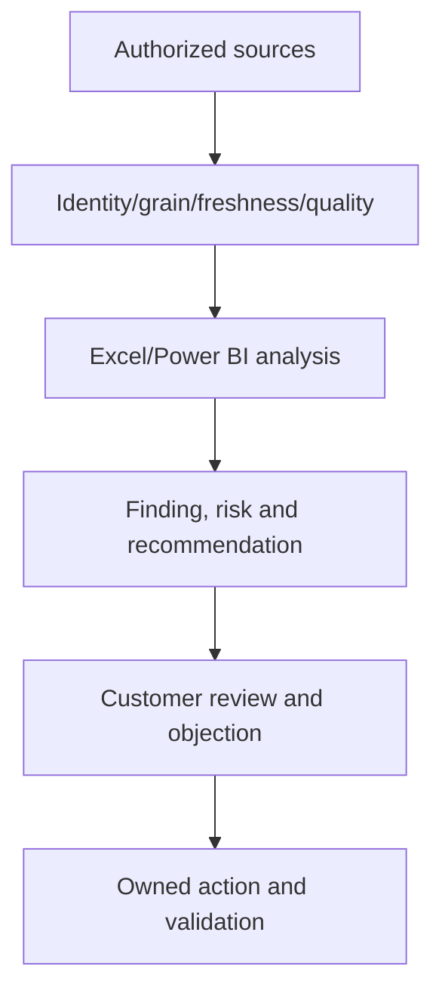

#### I041. What data-quality checks belong before a dashboard?
**Model answer:** Purpose, grain, stable keys, cardinality, nulls, duplicates, orphans, units, time zones, freshness, source authority, reconciliation, lineage, and privacy. **Review:** [Part 56](Part-56-customer-data-pipeline.md).

#### I042. When would you use Power Query, pivots, and Power BI?
**Model answer:** Power Query for repeatable ingest/cleaning, pivots for rapid grouped analysis, and Power BI for governed relational measures and interactive audience views. **Review:** [Part 59](Part-59-excel-tam-analysis.md).

#### I043. How should an executive slide differ from a technical appendix?
**Model answer:** The executive slide leads with outcome, material risk, choice, and action; the appendix preserves definitions, source, scope, calculations, and detailed evidence. **Review:** [Part 65](Part-65-powerpoint-data-storytelling.md).

#### I044. How do you influence a customer who rejects downtime?
**Model answer:** Explore the underlying constraint, show risk horizon/latest safe start, compare phased or reversible options, preserve decision rights, and record residual risk. **Review:** [Part 67](Part-67-influence-negotiation-objections.md).

#### I045. What is a good troubleshooting hypothesis?
**Model answer:** A falsifiable explanation that predicts observable evidence and can be distinguished from alternatives by a safe, cheap test. **Review:** [Part 71](Part-71-structured-troubleshooting-rca.md).

#### I046. What belongs in an engineering escalation package?
**Model answer:** Impact, exact scope/topology/version, timeline, changes, evidence, reproduction, actions/results, competing hypotheses, secure artifact location, and a specific ask. **Review:** [Part 73](Part-73-escalation-packages-engineering-engagement.md).

#### I047. What does Kubernetes CSI/Trident do conceptually?
**Model answer:** Kubernetes requests persistent storage through CSI; Trident maps storage classes/claims to supported backend operations and lifecycle, with app consistency and supportability handled separately. **Review:** [Part 88](Part-88-kubernetes-trident-data-management.md).

#### I048. How do ITIL and SRE complement TAM work?
**Model answer:** ITIL supplies service-management practices and ownership; SRE emphasizes measurable reliability, SLOs, error budgets, toil reduction, and learning. Use both pragmatically around customer outcomes. **Review:** [Part 92](Part-92-itil-sre-support-operations.md).

---

## Advanced Bank - 144 Questions

## Advanced A - ONTAP architecture, WAFL, HA, SVM/LIF, layout, admin, evidence, and hardware

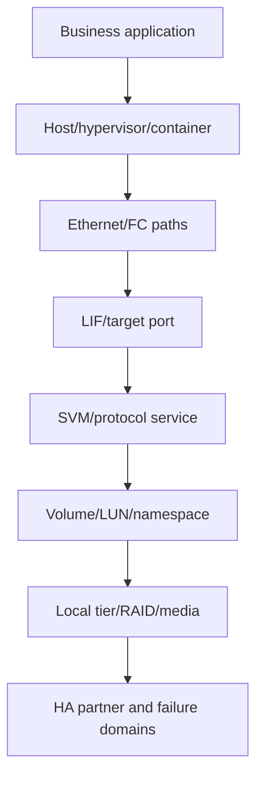

### 🔍 Plain-English deep-dive: a whiteboard is a prediction tool

An architecture drawing is not decoration. Like a transit map, it should show where requests enter, where identity changes, which component owns data, what can fail together, and how service continues. After drawing, point to the evidence source and failure symptom at every boundary.

#### A001. Whiteboard a complete application-to-ONTAP data path.
**Model answer:** Draw user/app, host or hypervisor, filesystem/database, protocol client/initiator, redundant network/fabric, LIF/target, SVM, volume/LUN, local tier/RAID/media, HA pair, protection copy, and owners; label failure domains and evidence. **Follow-up:** Remove one path and predict app-visible behavior. **Review:** [Part 2](Part-02-customer-environment-application-to-data.md).

#### A002. Whiteboard ONTAP logical and physical object hierarchy for a beginner.
**Model answer:** Separate cluster -> nodes/HA pairs -> physical ports/local tiers from SVM -> LIF -> namespace/share/export/LUN/object service -> volume; connect logical data ownership to physical placement without implying one-to-one identity. **Follow-up:** Identify movable versus node-owned elements. **Review:** [Part 23](Part-23-ontap-disks-raid-aggregates-volumes.md).

#### A003. A customer says `the cluster is HA, so the application is HA`. Challenge the claim.
**Model answer:** Controller HA covers one layer; verify client paths, LIF behavior, protocol session recovery, host MPIO, DNS, network/fabric diversity, application clustering, dependencies, and tested outcomes. **Follow-up:** Name the cheapest failure test. **Review:** [Part 21](Part-21-clustered-ontap-nodes-ha-quorum.md).

#### A004. Explain WAFL and consistency points without overclaiming internals.
**Model answer:** Describe redirected/write-anywhere block placement, protected write intent, metadata/data organization, and consistency-point persistence at conceptual level; state that exact implementation is release/platform dependent. **Follow-up:** Relate this to snapshots and crash consistency. **Review:** [Part 20](Part-20-ontap-wafl-architecture.md).

#### A005. One node is healthy but its partner is degraded. How do you frame risk?
**Model answer:** Current service can be available while failover margin is reduced; identify degraded component, partner load/headroom, common-fate dependencies, next-failure consequence, Support procedure, change freeze, and validation after repair. **Follow-up:** Respond to `wait until quarter end`. **Review:** [Part 77](Part-77-ha-cluster-hardware-scenarios.md).

#### A006. Design SVM and LIF boundaries for two business units with different protocols and administrators.
**Model answer:** Start with isolation, identity, namespace, policy, network, delegation, DR, and operational requirements; use SVMs/LIF roles and RBAC as supported, avoiding arbitrary tenancy claims. **Follow-up:** Explain shared physical failure domains. **Review:** [Part 22](Part-22-svms-lifs-namespaces-junctions.md).

#### A007. A data LIF is reachable but the application fails after failover. What next?
**Model answer:** Verify exact endpoint/session path, protocol recovery, DNS, routes/VLAN/MTU, LIF home/current port/failover policy, client retry/multipath, service state, and application timeout before moving the LIF blindly. **Follow-up:** Choose one control client. **Review:** [Part 77](Part-77-ha-cluster-hardware-scenarios.md).

#### A008. Build a read-only ONTAP discovery plan for a new account.
**Model answer:** Confirm authorization and release, then collect cluster/node/HA health, SVM/LIF/network, local tiers/volumes/LUNs/protocols, protection, events, capacity/performance, identity, source/time, and unknowns; reconcile with customer topology. **Follow-up:** Define portfolio redaction. **Review:** [Part 83](Part-83-lab-ontap-discovery-health-baseline.md).

#### A009. A volume reports free space but its local tier is near full. Explain and act.
**Model answer:** Volume and local-tier layers differ; inspect physical consumption, guarantees/reserves, snapshots, thin allocations, autosize, efficiencies, other volumes, and growth. Protect physical headroom with owned, validated action. **Follow-up:** Reject unsafe snapshot deletion. **Review:** [Part 45](Part-45-capacity-analytics-forecasting.md).

#### A010. How would you validate a hardware expansion recommendation?
**Model answer:** Tie workload/capacity need to exact platform, controller, slots/ports, shelves/drives/adapters, cabling, limits, ONTAP dependencies, HA symmetry, power/cooling, IMT/HWU, lifecycle, implementation ownership, and tests. **Follow-up:** State what needs current tools. **Review:** [Part 51](Part-51-hardware-universe-platform-limits.md).

#### A011. An EMS event and application alert differ by seven minutes. How do you correlate?
**Model answer:** Normalize UTC and time sources, preserve raw timestamps/time zones, account for collection/display delay, map stable object identities, align related network/host/storage evidence, and state the uncertainty window. **Follow-up:** Explain why sequence is not causality. **Review:** [Part 25](Part-25-ontap-ems-logs-audit-evidence.md).

#### A012. Design a safe admin automation workflow using REST or CLI.
**Model answer:** Use least privilege, discovery first, current API/command docs, desired-state/idempotency where possible, input validation, dry run, approval, bounded batch/canary, logging, error handling, rollback/stop criteria, and post-validation. **Follow-up:** Handle partial success. **Review:** [Part 24](Part-24-ontap-system-manager-cli-rest.md).

## Advanced B - NFS, SMB, iSCSI, FC, NVMe, NAS, SAN, S3, and efficiency troubleshooting

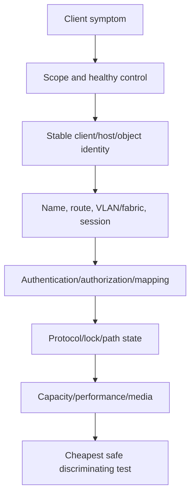

#### A013. NFS mounts fail for one subnet after a network change. Troubleshoot.
**Model answer:** Compare healthy subnet; verify client source/route, DNS, VLAN/MTU/firewall, data LIF/broadcast domain, export rule client matching/security flavor, namespace, and packet/event timing. **Follow-up:** Predict what a small versus large packet test distinguishes. **Review:** [Part 74](Part-74-nas-troubleshooting-scenarios.md).

#### A014. NFS reads work but writes fail only for two users.
**Model answer:** Preserve numeric UID/GID/groups, selected export rule, root/superuser mapping, name service/domain, file mode/ACL, quota/space, security flavor, and healthy user control. **Follow-up:** Explain why `chmod 777` is unsafe. **Review:** [Part 28](Part-28-ontap-nfs-configuration-security.md).

#### A015. SMB users receive intermittent authentication prompts after a domain change.
**Model answer:** Scope new versus existing sessions, client/site/DC, DNS SRV/alias, time, trust, SPNs, Kerberos tickets, NTLM policy, LIF/service identity, and DC/network reachability. **Follow-up:** Preserve security policy while restoring. **Review:** [Part 29](Part-29-ontap-smb-active-directory.md).

#### A016. An SMB share is accessible but one folder is denied.
**Model answer:** Confirm exact identity/token/groups, share permissions, file/folder ACL inheritance/owner, name mapping, path/referral, deny entries, and healthy sibling control; do not conflate authentication with authorization. **Follow-up:** Define a negative test. **Review:** [Part 74](Part-74-nas-troubleshooting-scenarios.md).

#### A017. Whiteboard iSCSI from application to media with two fabrics.
**Model answer:** Draw app/filesystem -> one MPIO device -> initiator IQN -> two independent IP/VLAN/switch paths -> target portals/LIFs -> SVM -> igroup/map -> stable LUN -> volume/local tier/HA. **Follow-up:** Predict one-side failure. **Review:** [Part 85](Part-85-lab-san-multipathing-troubleshooting.md).

#### A018. An iSCSI host discovers targets but no LUN.
**Model answer:** Verify stable host/IQN, session/login, target portal, SVM service, igroup membership, exact LUN map, LUN state, host rescan, MPIO, CHAP boundary, and one healthy host. **Follow-up:** Explain why discovery is not authorization. **Review:** [Part 75](Part-75-san-troubleshooting-scenarios.md).

#### A019. An FC host logs into the fabric but a LUN disappears after HBA replacement.
**Model answer:** Reconcile new WWPN, switch port/VSAN, Name Server, zones/aliases, PLOGI/PRLI, igroup, map/LUN identity, driver/firmware, and host rescan; add only verified identity. **Follow-up:** Reject broad mapping. **Review:** [Part 75](Part-75-san-troubleshooting-scenarios.md).

#### A020. Four paths appear as four disks after a host upgrade. What is the risk?
**Model answer:** The multipath layer may not claim one stable LUN, risking duplicate mounts/corruption and failed failover. Freeze rollout, verify serial identity and exact IMT host recipe, then test one logical device and path loss. **Follow-up:** Define data-safe validation. **Review:** [Part 85](Part-85-lab-san-multipathing-troubleshooting.md).

#### A021. When would NVMe/FC or NVMe/TCP be worth evaluating?
**Model answer:** When measured workload, latency/parallelism goals, operations, host/fabric skills, multipathing, app support, and current end-to-end interoperability justify it; protocol branding alone is insufficient. **Follow-up:** Compare migration risk with SCSI path. **Review:** [Part 18](Part-18-fibre-channel-fcoe-nvme-fabrics.md).

#### A022. Design an ONTAP S3 troubleshooting tree for access denied.
**Model answer:** Check endpoint/DNS/TLS/time, bucket/object identity, user/key without exposing secrets, policy evaluation, requested action/resource, network path, service state, audit/error evidence, and current release support. **Follow-up:** Separate 403 from reachability. **Review:** [Part 33](Part-33-ontap-s3-object-storage.md).

#### A023. An efficiency ratio falls after encrypted/compressed application data arrives. How do you respond?
**Model answer:** Validate metric layer/definition and physical growth, characterize incompressible/unique workload, separate ratio from business value, revise forecast/headroom, and avoid promising previous savings. **Follow-up:** Explain executive impact. **Review:** [Part 34](Part-34-storage-efficiency-fabricpool.md).

#### A024. A FlexGroup workload has uneven constituent pressure. What questions matter?
**Model answer:** Verify exact release/support, workload/file distribution, constituent capacity/performance, growth, placement, namespace, quotas, protection, and supported balancing/remediation options; do not manually improvise. **Follow-up:** State current-doc gate. **Review:** [Part 32](Part-32-flexgroup-flexcache-qtrees-quotas.md).

## Advanced C - Protection, DR, security, ransomware, and cyber resilience

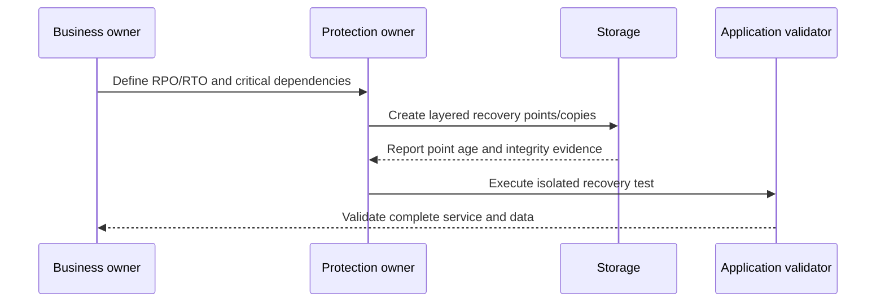

#### A025. Whiteboard a layered recovery architecture for ransomware.
**Model answer:** Include least privilege/segmentation/hardening, endpoint/identity/network/storage detection, local points, immutable and independently controlled copy, off-site/site-resilient copy, protected catalog/keys, isolated clean recovery, app validation, and governance. **Follow-up:** Assume admin compromise. **Review:** [Part 41](Part-41-ransomware-resilience-arp.md).

#### A026. SnapMirror is green but the newest usable point is six hours old against a two-hour RPO.
**Model answer:** Treat actual destination point age as breach; compare source change rate, transfer service, competing jobs, schedules, backlog, path, destination space, policy/labels, and clock. **Follow-up:** Explain why more frequent schedules may fail. **Review:** [Part 78](Part-78-replication-backup-dr-scenarios.md).

#### A027. Calculate replication backlog growth: source changes at 180 MiB/s, transfer sustains 140 MiB/s for 45 minutes.
**Model answer:** Net $40$ MiB/s for $2{,}700$ seconds gives $108{,}000$ MiB, about $105.47$ GiB backlog, before protocol/compression effects. **Follow-up:** State assumptions. **Review:** [Part 46](Part-46-performance-capacity-case-studies.md).

#### A028. A backup job is green but application restore fails. Lead the review.
**Model answer:** Reconcile complete dependency map, policy scope, app-consistency method, catalog, repository, IAM/keys, network, exact recovery point, runbook, and app validation. Redefine success as service recovery. **Follow-up:** Set next test. **Review:** [Part 78](Part-78-replication-backup-dr-scenarios.md).

#### A029. A customer wants to delete snapshots immediately to resolve capacity pressure.
**Model answer:** Stop and quantify layer, point ownership, retention/legal/protection dependencies, active versus snapshot-referenced blocks, alternative headroom actions, approvals, and restore impact; preserve required recovery. **Follow-up:** Offer a reversible first action. **Review:** [Part 35](Part-35-snapshots-restores-clones.md).

#### A030. Sites lose communication and executives demand forced failover.
**Model answer:** Establish independent site state, fencing/single-writer authority, exact architecture/release, Support-led procedure, business impact, app dependencies, and checkpoints; do not force from ambiguous remote state. **Follow-up:** Explain delay versus corruption risk. **Review:** [Part 38](Part-38-metrocluster-site-resilience-dr.md).

#### A031. How do you assess whether retention/immutability design meets a compliance need?
**Model answer:** Start with legal policy and data scope, retention duration/clock, mode, authorized roles, holds/deletion behavior, audit, replication/backup, recovery tests, lifecycle, and current product docs; avoid legal conclusions. **Follow-up:** Identify irreversible choices. **Review:** [Part 39](Part-39-snaplock-immutability-retention.md).

#### A032. A ransomware alert fires during a legitimate encryption project. What do you do?
**Model answer:** Security owner controls incident classification; preserve evidence, scope user/client/path/time, correlate EDR/IAM/network/storage/change records, protect recovery points, avoid destructive cleanup, and tune only after classification. **Follow-up:** Communicate uncertainty. **Review:** [Part 41](Part-41-ransomware-resilience-arp.md).

#### A033. A public CVE matches the product family but the exact feature is disabled.
**Model answer:** Use current advisory to verify release/component/feature/exposure/trigger; disabled feature may make it non-applicable or reduce exposure, but document evidence, controls, exceptions, and recheck triggers. **Follow-up:** Avoid `not vulnerable` overstatement. **Review:** [Part 42](Part-42-security-advisories-vulnerability-response.md).

#### A034. Design a least-privilege model for TAM evidence access.
**Model answer:** Separate customer/account/technical/commercial scopes, read-only role where possible, purpose-limited fields, approved systems, strong authentication, audit, secure links, redaction, retention, and periodic review/revocation. **Follow-up:** Handle a broad export request. **Review:** [Part 40](Part-40-ontap-security-rbac-encryption-audit.md).

#### A035. The customer met RPO but missed RTO. How do you analyze?
**Model answer:** Preserve point age separately from restoration timeline; decompose detect/decide/access/catalog/transfer/config/start/integrity/user validation steps, identify critical path and dependencies, then retest. **Follow-up:** Distinguish storage from app delay. **Review:** [Part 86](Part-86-lab-snapshot-snapmirror-dr.md).

#### A036. How would you run a cyber-recovery tabletop without claiming certainty?
**Model answer:** Define threat, authority, service/dependencies, detection/containment, credential and control-plane compromise, point selection, isolated recovery, app/data validation, communications, evidence, gaps, owners, and follow-up test. **Follow-up:** Add insider risk. **Review:** [Part 94](Part-94-ncda-specialization-standards-trends.md).

## Advanced D - Performance, capacity, QoS, and numerical reasoning

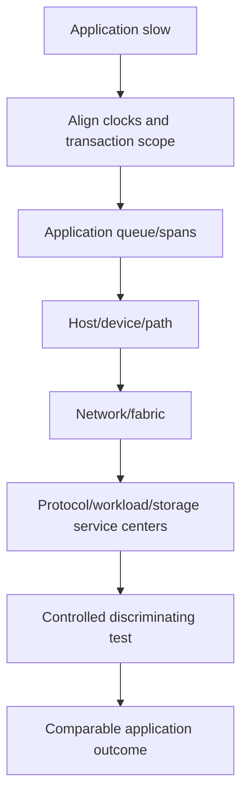

### 🔍 Plain-English deep-dive: performance is a timeline, not a blame chart

A restaurant customer experiences total wait from queue, ordering, cooking, and delivery. A fast kitchen average does not disprove a long entrance queue, and a busy kitchen does not prove it started the delay. Align clocks and follow one transaction through every wait boundary.

#### A037. App p99 is 4 seconds while storage average is 5 ms. What can you conclude?
**Model answer:** Only that those differently scoped metrics do not yet explain the transaction. Align transaction IDs/time, percentiles, operations, host/path/app queues, errors, workload, and controls before assigning cause. **Follow-up:** Request the first three artifacts. **Review:** [Part 76](Part-76-performance-troubleshooting-scenarios.md).

#### A038. A node reaches high CPU during peaks. Is CPU the bottleneck?
**Model answer:** Not automatically; examine workload/operations, latency/service time, queueing, throughput scaling, protocol/network/disk behavior, imbalance, baseline, and response to controlled demand change. **Follow-up:** Define saturation evidence. **Review:** [Part 43](Part-43-ontap-performance-counters.md).

#### A039. Calculate throughput for 25,000 IOPS at 32 KiB average I/O.
**Model answer:** $25{,}000\times32=800{,}000$ KiB/s, or $781.25$ MiB/s. State that read/write direction, protocol overhead, cache, and concurrency affect observed wire/media rates. **Follow-up:** Convert approximately to GiB/s. **Review:** [Part 9](Part-09-performance-iops-throughput-latency-queues.md).

#### A040. A service completes 8,000 IOPS with 12 ms average response. Estimate average outstanding work.
**Model answer:** Little's Law gives $L=8{,}000\times0.012=96$ operations, assuming a stable comparable system and matching arrival/completion scope. **Follow-up:** Explain why 96 is not a recommended queue depth. **Review:** [Part 9](Part-09-performance-iops-throughput-latency-queues.md).

#### A041. Used capacity rises from 240 TiB to 276 TiB over six comparable months. Threshold is 330 TiB. Estimate time.
**Model answer:** Growth is $36/6=6$ TiB/month; headroom to threshold is $54$ TiB; simple estimate is $54/6=9$ months. Add uncertainty, planned change, seasonality, and lead time. **Follow-up:** Give latest-safe-start logic. **Review:** [Part 45](Part-45-capacity-analytics-forecasting.md).

#### A042. A 500 TiB logical dataset consumes 250 TiB physical. What is the data-reduction ratio?
**Model answer:** $500/250=2.0:1$ for the declared logical/physical scope. Do not translate that into guaranteed future savings or compare unlike definitions. **Follow-up:** Explain denominator risk. **Review:** [Part 34](Part-34-storage-efficiency-fabricpool.md).

#### A043. Design a baseline for a month-end performance complaint.
**Model answer:** Use comparable month-end windows, transaction demand and p50/p95/p99, errors, app/host/path/storage metrics, workload fingerprint, changes, time sync, healthy controls, and data-quality notes. **Follow-up:** Handle business growth. **Review:** [Part 44](Part-44-workload-baselines-bottlenecks-qos.md).

#### A044. Two workloads share a constrained resource. How do you prove noisy-neighbor behavior?
**Model answer:** Map shared service center, align victim/competitor demand, preserve victim control, change competitor schedule/rate or placement safely, and show predicted victim-tail response at comparable victim load. **Follow-up:** Compare QoS versus capacity. **Review:** [Part 46](Part-46-performance-capacity-case-studies.md).

#### A045. The customer asks for a QoS number without a workload baseline.
**Model answer:** Decline arbitrary tuning; define SLO, demand distribution, shared constraints, supported policy semantics, headroom, failure behavior, canary, monitoring, rollback, and affected stakeholders first. **Follow-up:** Offer temporary containment. **Review:** [Part 44](Part-44-workload-baselines-bottlenecks-qos.md).

#### A046. Forecast says 14 months to full, but a project adds 30 TiB in four months. What changes?
**Model answer:** Add event-driven demand to trend, recompute the operational threshold date, assess physical/efficiency/snapshot layers, align project timing and procurement lead time, and show scenarios rather than one line. **Follow-up:** Present to finance. **Review:** [Part 45](Part-45-capacity-analytics-forecasting.md).

#### A047. After a change, average improves but p99 worsens. Is the change successful?
**Model answer:** Not until success criteria are checked by workload and user objective; inspect distribution, outliers, errors, volume, affected cohort, and side effects, and roll back or adjust if tail SLO worsened. **Follow-up:** Explain Simpson's paradox risk. **Review:** [Part 60](Part-60-power-bi-dashboards-kpis.md).

#### A048. Design a performance escalation package.
**Model answer:** Include business impact/SLO, topology, exact versions, symptom scope, synchronized timeline, workload/baseline, app-host-network-storage metrics, changes, hypotheses/predictions, tests/results, raw evidence, and specific ask. **Follow-up:** Remove sensitive fields. **Review:** [Part 73](Part-73-escalation-packages-engineering-engagement.md).

## Advanced E - AutoSupport, Digital Advisor, install base, IMT, HWU, bugs, lifecycle, and upgrades

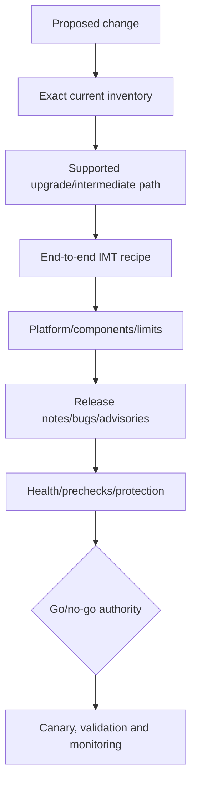

#### A049. Digital Advisor covers 65 of 100 critical systems. How do you report health?
**Model answer:** Report 65% fresh covered population and 35% unknown, not 100% green; reconcile missing systems through local AutoSupport, entitlement/association, privacy, retirement, and alternate evidence. **Follow-up:** Set a coverage KPI. **Review:** [Part 48](Part-48-active-iq-digital-advisor-wellness.md).

#### A050. Design an AutoSupport delivery fault tree.
**Model answer:** Local trigger/generation -> payload/config -> DNS/time -> proxy/firewall/TLS/route -> destination receipt -> entitlement/asset association -> portal display; preserve privacy and exact release. **Follow-up:** Distinguish local success from remote visibility. **Review:** [Part 47](Part-47-autosupport-architecture-delivery.md).

#### A051. Three sources show 120, 116, and 109 assets. What is your method?
**Model answer:** Declare each grain/cutoff/authority, use stable entity IDs and effective dates, profile duplicates/nulls/orphans/cardinality, reconcile active/retired/moved assets, and publish governed count plus exceptions. **Follow-up:** Reject `use largest`. **Review:** [Part 49](Part-49-install-base-management-data-quality.md).

#### A052. A many-to-many join duplicates risk rows. How do you detect and prevent it?
**Model answer:** Define expected cardinality, compare pre/post row counts and distinct keys, inspect duplicates/orphans, create entity-specific bridges/effective dates, fail refresh on unexpected multiplication, and peer review. **Follow-up:** Explain customer impact. **Review:** [Part 56](Part-56-customer-data-pipeline.md).

#### A053. An IMT search is unlisted although each component is individually supported.
**Model answer:** Individual support does not prove combination support; verify solution/category, exact versions, notes/policies, spelling/selection, current matrix, intermediate states, and route exception before change. **Follow-up:** Answer executive pressure. **Review:** [Part 50](Part-50-imt-supportability-validation.md).

#### A054. Hardware Universe and an old design document disagree.
**Model answer:** Freeze the disputed assumption, verify exact platform/component/release and current HWU plus official docs/Support, record source/date, assess affected decisions, and update the governed design. **Follow-up:** Preserve audit history. **Review:** [Part 51](Part-51-hardware-universe-platform-limits.md).

#### A055. Five incidents have similar symptoms. When is a bug match credible?
**Model answer:** Normalize exact recipe, trigger, signature, path, controls, and timing; group by mechanism, then use current bug details through authorized channels. Version or symptom-label match alone is insufficient. **Follow-up:** Build Engineering ask. **Review:** [Part 52](Part-52-burts-defects-release-notes-bug-scrub.md).

#### A056. A platform approaches lifecycle deadline but has no current incidents. Why act?
**Model answer:** Lifecycle risk concerns shrinking support, security, compatibility, skills/parts, and emergency-change options over time; quantify horizon/latest safe start and phase work before urgency. **Follow-up:** Avoid calling it an outage. **Review:** [Part 53](Part-53-lifecycle-management.md).

#### A057. Preferred ONTAP target is not certified by a critical application.
**Model answer:** Treat application support as a separate gate; compare interim listed target, app update/certification, exception with bounded expiry, or migration while preserving lifecycle controls. **Follow-up:** Defend no-go. **Review:** [Part 79](Part-79-upgrade-compatibility-change-scenarios.md).

#### A058. Build an upgrade go/no-go checklist.
**Model answer:** Business driver/window, health/HA/protection, capacity, exact current/target/path, IMT/HWU, app/host/switch/firmware/multipath, bugs/advisories, prechecks, backups, roles, communications, rollback limits, validation, and monitoring. **Follow-up:** Name decision owner. **Review:** [Part 54](Part-54-ontap-upgrade-planning.md).

#### A059. A staged host upgrade creates mixed driver/firmware states and path flaps.
**Model answer:** Stop expansion, preserve listed healthy control, capture exact per-host recipe and path timeline, check IMT/vendor matrices, coordinate listed bundle, canary one-side failure, and resume only on evidence. **Follow-up:** Explain blast radius. **Review:** [Part 55](Part-55-firmware-host-switch-upgrade-coordination.md).

#### A060. Post-upgrade latency rises. How do you avoid immediate rollback or denial?
**Model answer:** Protect service, compare pre/post workload and topology, identify changed components/config, align layer evidence, check known issues/release notes, run bounded tests, and decide rollback against current risk and rollback feasibility. **Follow-up:** Communicate at 30 minutes. **Review:** [Part 79](Part-79-upgrade-compatibility-change-scenarios.md).

## Advanced F - Analytics, Excel, Power BI, reviews, influence, projects, and coaching

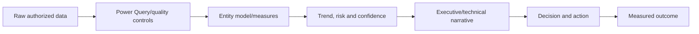

#### A061. Design an Excel install-base and risk workbook.
**Model answer:** Separate raw immutable inputs, mapping tables, Power Query transforms, governed asset table, risk facts, actions, source/date fields, exception QA, pivots/charts, parameters, refresh log, and protected outputs. **Follow-up:** Prevent manual overwrite. **Review:** [Part 59](Part-59-excel-tam-analysis.md).

#### A062. What measures belong on a TAM Power BI dashboard?
**Model answer:** Governed asset coverage/freshness, risks by status/materiality, action aging/blockers, lifecycle horizon, capacity headroom, incident themes, review cutoff, confidence/unknowns, and drill-through to evidence. **Follow-up:** Avoid vanity metrics. **Review:** [Part 60](Part-60-power-bi-dashboards-kpis.md).

#### A063. A dashboard turns green because stale assets dropped out. How do you expose it?
**Model answer:** Use fixed governed denominator, freshness cohort, missing/unknown category, source cutoff, trend in coverage, reconciliation exceptions, and alert on denominator changes. **Follow-up:** Explain to executives. **Review:** [Part 60](Part-60-power-bi-dashboards-kpis.md).

#### A064. Build a quarterly service-review story from twenty findings.
**Model answer:** Deduplicate and rank by customer objective/materiality; lead with outcomes/changes, top decisions, evidence and confidence, recommendations/options, action movement, residual risk, and technical appendix. **Follow-up:** Limit to three asks. **Review:** [Part 61](Part-61-operational-service-review-lifecycle.md).

#### A065. An executive disputes your risk score.
**Model answer:** Do not defend the number as truth; unpack evidence, condition, mechanism, impact, horizon, controls, confidence, thresholds, and options, then revise if customer context changes materiality. **Follow-up:** Preserve audit trail. **Review:** [Part 57](Part-57-risk-scoring-prioritization.md).

#### A066. A customer repeatedly ignores a recommendation.
**Model answer:** Verify current applicability, identify blocker/interests and decision authority, clarify consequence/latest safe start, offer phased/reversible options, assign owner/date, and record deferral or accepted risk with review trigger. **Follow-up:** Avoid nagging. **Review:** [Part 80](Part-80-service-review-customer-risk-scenarios.md).

#### A067. You must influence a platform owner without authority.
**Model answer:** Align on their outcome, show bounded evidence and tradeoffs, involve the correct SME/lead TAM, reduce action cost, propose a reversible proof, preserve choice, and document the decision. **Follow-up:** Handle rejection. **Review:** [Part 67](Part-67-influence-negotiation-objections.md).

#### A068. Design a special project to improve recommendation quality.
**Model answer:** Charter objective/scope/sponsor, baseline defects, stakeholders/RACI, milestones, rubric, data/privacy, pilot, risks/dependencies, communication, adoption measures, closure, and lessons. **Follow-up:** Handle slippage. **Review:** [Part 68](Part-68-prioritization-time-zones-special-projects.md).

#### A069. A lead TAM asks for a report in two hours, but source quality is poor.
**Model answer:** State what can be safely delivered, label cutoff/coverage/unknowns, prioritize material validated facts, withhold asset-level claims where identity fails, provide exception list and follow-up plan. **Follow-up:** Give BLUF wording. **Review:** [Part 66](Part-66-executive-communication-technical-writing.md).

#### A070. How would you coach a new hire on bug-scrub quality?
**Model answer:** Define competency/rubric, demonstrate one sanitized example, reverse-shadow exact applicability reasoning, give SBI feedback, require source/date/nonclaim, retest with varied case, and escalate gated uncertainty. **Follow-up:** Measure readiness. **Review:** [Part 69](Part-69-coaching-new-hires-knowledge-quality.md).

#### A071. Two SMEs disagree in a customer meeting.
**Model answer:** Restate shared outcome, separate observations from hypotheses, preserve customer confidence without false consensus, choose a safe discriminating test/owner/checkpoint, and record decision/dissent. **Follow-up:** Repair relationship afterward. **Review:** [Part 70](Part-70-cross-functional-sme-conflict.md).

#### A072. How do you prove a service review created value?
**Model answer:** Compare starting condition with verified customer actions/outcomes such as coverage, supportability, risk movement, action completion, recovery proof, or decision lead time; attribute contribution carefully, not meeting count. **Follow-up:** Handle no measurable outcome. **Review:** [Part 64](Part-64-customer-health-success-value.md).

## Advanced G - Troubleshooting, incidents, escalation, and accepted risk

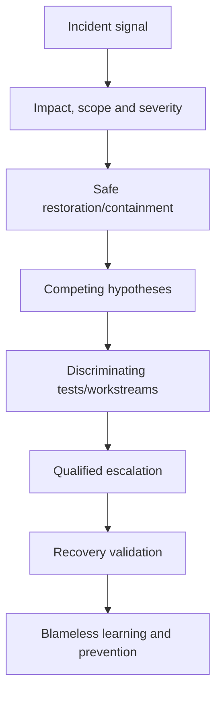

### 🔍 Plain-English deep-dive: restoration and root cause are different clocks

During a building fire, evacuation cannot wait for the forensic report. In an incident, stabilize and restore safely while preserving evidence; root-cause confidence can follow. Keep mitigation, causal claim, and permanent corrective action separate.

#### A073. What are your first 15 minutes in a business-critical incident?
**Model answer:** Confirm command/roles, impact/scope/time, safety/security, current state/changes, restoration options, evidence preservation, workstreams, customer update cadence, exact owners, and next checkpoint. **Follow-up:** State what not to do. **Review:** [Part 72](Part-72-major-incident-high-pressure-communication.md).

#### A074. Multiple teams blame storage. How do you reset the bridge?
**Model answer:** Anchor on application outcome and synchronized timeline, ask each layer for observations/predictions, define competing hypotheses and safe tests, assign owners, and avoid arguing from utilization screenshots. **Follow-up:** Give executive update. **Review:** [Part 71](Part-71-structured-troubleshooting-rca.md).

#### A075. Service restores after a reboot. Is reboot the root cause?
**Model answer:** No; it is a correlated mitigation that changed many variables and may erase evidence. Preserve pre-reboot artifacts where possible, identify mechanism candidates, recurrence controls, and follow-up tests. **Follow-up:** Explain to customer. **Review:** [Part 71](Part-71-structured-troubleshooting-rca.md).

#### A076. A support case is stalled between vendors.
**Model answer:** Build one chronology/system boundary, preserve vendor-private evidence, document each hypothesis/action/result, define exact asks and accepted owners/checkpoints, escalate missing authority/expertise rather than blame. **Follow-up:** Choose coordinator. **Review:** [Part 70](Part-70-cross-functional-sme-conflict.md).

#### A077. What makes an escalation urgent but still high quality?
**Model answer:** Concise impact/severity, exact scope/version/topology, current state, decisive evidence, actions/results, known/unknown, safe containment, secure artifacts, and one specific request with checkpoint. **Follow-up:** Compress to 60 seconds. **Review:** [Part 73](Part-73-escalation-packages-engineering-engagement.md).

#### A078. A customer demands an unsupported change during an outage.
**Model answer:** Acknowledge impact, state evidence/support boundary and potential consequence, involve authorized incident/Support/change owners, offer safer reversible alternatives, record decision authority, and never secretly proceed. **Follow-up:** If customer accepts risk. **Review:** [Part 72](Part-72-major-incident-high-pressure-communication.md).

#### A079. How do you distinguish root cause, contributing factor, trigger, and detection gap?
**Model answer:** Root cause explains the systemic condition, trigger initiates this occurrence, contributing factors worsen likelihood/impact, and detection gap delays recognition; validate each with evidence and corrective action. **Follow-up:** Avoid five-whys oversimplification. **Review:** [Part 71](Part-71-structured-troubleshooting-rca.md).

#### A080. A path failover test keeps service up but p99 doubles. Pass or fail?
**Model answer:** Compare predefined availability and performance criteria; survival may pass continuity but fail degraded-mode SLO. Investigate path policy, queue/timeouts, remaining path capacity, and app behavior before approval. **Follow-up:** Define retest. **Review:** [Part 75](Part-75-san-troubleshooting-scenarios.md).

#### A081. A customer accepts lifecycle risk. What must be recorded?
**Model answer:** Exact condition/source/date, affected scope/objective, mechanism/horizon, current controls, options/recommendation, authorized decision owner, rationale, expiry/review trigger, monitoring, and residual risk. **Follow-up:** Separate vendor advice from customer decision. **Review:** [Part 67](Part-67-influence-negotiation-objections.md).

#### A082. How do you run a blameless PIR after a data-quality error?
**Model answer:** Freeze affected actions, quantify impact, trace grain/key/source/cutoff/control failure, correct results, add automated and peer controls, assign owners, communicate transparently, and measure future reliability. **Follow-up:** Address accountability. **Review:** [Part 81](Part-81-integrated-tam-casebook.md).

#### A083. Prioritize three simultaneous issues: production outage, upgrade deadline in two weeks, and overdue dashboard.
**Model answer:** Protect outage restoration first with delegated workstreams; preserve latest-safe-start work for upgrade through named owner/checkpoint; renegotiate dashboard scope/date transparently. Reassess impact and dependencies. **Follow-up:** Time-zone handoff. **Review:** [Part 68](Part-68-prioritization-time-zones-special-projects.md).

#### A084. Design a follow-the-sun incident handoff.
**Model answer:** Include impact/scope, UTC chronology, current state, roles, changes, evidence links, completed actions/results, supported/weakened/unknown hypotheses, holds, next discriminating step, owner, customer message, and checkpoint. **Follow-up:** Confirm receipt. **Review:** [Part 72](Part-72-major-incident-high-pressure-communication.md).

## Advanced H - VMware, Kubernetes, cloud, and hybrid architecture

```mermaid
flowchart TB
    VM[VM/application] --> VDISK[Virtual disk/datastore]
    VDISK --> ESXI[ESXi host/storage stack]
    ESXI --> NFS[NFS datastore path]
    ESXI --> SAN[VMFS over supported SAN paths]
    NFS --> ONTAP[ONTAP data service]
    SAN --> ONTAP
    ONTAP --> PROT[Snapshot/backup/replication]
```

#### A085. Whiteboard VMware on ONTAP using NFS and block alternatives.
**Model answer:** Show VM/app -> guest -> virtual disk -> ESXi -> NFS vmkernel/network/export/datastore or HBA/iSCSI/FC/MPIO -> VMFS LUN -> ONTAP SVM/LIF/volume/local tier, plus vCenter, protection, and supportability. **Follow-up:** Compare ownership boundaries. **Review:** [Part 87](Part-87-vmware-vsphere-netapp.md).

#### A086. One ESXi host loses datastore access while peers remain healthy.
**Model answer:** Use peer control; verify host vmkernel/HBA, route/VLAN/MTU or fabric login/zoning, DNS if used, session/path state, export/mapping identity, MPIO, host logs, and exact support recipe. **Follow-up:** Avoid datastore resignature. **Review:** [Part 87](Part-87-vmware-vsphere-netapp.md).

#### A087. How do VMware snapshots differ from storage snapshots?
**Model answer:** VMware snapshots track VM virtual-disk state and can affect datastore behavior; storage snapshots preserve storage blocks. Application consistency, coordination, retention, and restore scope must be designed explicitly. **Follow-up:** Explain long-lived snapshot risk. **Review:** [Part 87](Part-87-vmware-vsphere-netapp.md).

#### A088. Whiteboard Kubernetes persistent storage through Trident.
**Model answer:** Draw app/pod -> PVC -> StorageClass -> CSI/Trident controller/node components -> backend -> ONTAP volume/LUN -> PV, with secrets/RBAC, topology, snapshots, reclaim, and app protection. **Follow-up:** Delete the namespace. **Review:** [Part 88](Part-88-kubernetes-trident-data-management.md).

#### A089. A PVC remains Pending. Troubleshoot.
**Model answer:** Check request/events, StorageClass/provisioner, access mode/size/topology, Trident health/logs, backend credentials/connectivity/capacity/policy, quotas, Kubernetes/Trident/ONTAP support, and failed cleanup. **Follow-up:** Separate scheduler from storage. **Review:** [Part 88](Part-88-kubernetes-trident-data-management.md).

#### A090. A Kubernetes snapshot succeeds but application restore is inconsistent.
**Model answer:** CSI/storage point may be crash-consistent only; map all app resources/volumes, quiesce or app-aware workflow, ordering, secrets/config, database recovery, cross-namespace dependencies, and restore validation. **Follow-up:** Define RPO/RTO test. **Review:** [Part 88](Part-88-kubernetes-trident-data-management.md).

#### A091. Compare on-prem ONTAP, Cloud Volumes ONTAP, and provider-managed file services.
**Model answer:** Compare control/operations, responsibility, deployment, networking/IAM, availability, scaling, performance, licensing/cost, protection, support, and current service capabilities; avoid generic feature equivalence. **Follow-up:** Ask five placement questions. **Review:** [Part 89](Part-89-cloud-hybrid-data-services.md).

#### A092. A cloud file workload is slow from on-prem clients.
**Model answer:** Measure client/app, DNS, route/VPN/ExpressRoute-like path, latency/loss/MTU, security inspection, protocol behavior, service endpoint, throughput limits, workload concurrency, and cloud-region placement. **Follow-up:** Distinguish distance from service saturation. **Review:** [Part 89](Part-89-cloud-hybrid-data-services.md).

#### A093. What does shared responsibility mean for cloud storage?
**Model answer:** Provider, vendor, customer, and partner own different infrastructure, service configuration, identity, network, data, protection, monitoring, and recovery controls; map exact service terms and decisions. **Follow-up:** Assign backup ownership. **Review:** [Part 89](Part-89-cloud-hybrid-data-services.md).

#### A094. Design a hybrid data-mobility recommendation.
**Model answer:** Start with app/data dependencies, consistency, change rate, latency, sovereignty, security/IAM, network/egress, target compatibility, cutover/rollback, protection, operations, cost, and exit strategy. **Follow-up:** Explain why data movement is not app migration. **Review:** [Part 89](Part-89-cloud-hybrid-data-services.md).

#### A095. A customer wants one dashboard across on-prem and cloud. What are the traps?
**Model answer:** Different entity grains, metric semantics, clocks, coverage, service responsibility, units, cost models, access/privacy, and lifecycle can create false comparisons; govern a shared model with source-specific boundaries. **Follow-up:** Define three common KPIs. **Review:** [Part 60](Part-60-power-bi-dashboards-kpis.md).

#### A096. How would experience bridge your Azure experience honestly?
**Model answer:** Use real cloud/network/VM/identity/troubleshooting concepts as transferable foundations, state no production NetApp cloud claim, and show current-doc architecture plus synthetic/authorized practice and a ramp plan. **Follow-up:** Give a 30-second answer. **Review:** [Part 89](Part-89-cloud-hybrid-data-services.md).

## Advanced I - ITIL, SRE, competition, NCDA, standards, and trends

```mermaid
flowchart LR
    INCIDENT[Restore current service] --> PROBLEM[Understand recurring/systemic causes]
    PROBLEM --> CHANGE[Controlled improvement]
    CHANGE --> SLO[Measure reliability/SLO]
    SLO --> TOIL[Reduce toil and improve learning]
    TOIL --> REVIEW[Continual service improvement]
```

#### A097. How do incident, problem, change, request, and known error differ?
**Model answer:** Incident restores service, problem manages causes, change controls state alteration, request fulfills a standard need, and known error records an understood issue/workaround; organizations tailor exact processes. **Follow-up:** Map a recurring path fault. **Review:** [Part 92](Part-92-itil-sre-support-operations.md).

#### A098. What is an SLO and error budget, and how can a TAM use them?
**Model answer:** SLO is a measured reliability target; error budget is tolerated unreliability. TAM can align risks/change pace to customer objectives, but must not invent SLOs or replace customer governance. **Follow-up:** Handle exhausted budget. **Review:** [Part 92](Part-92-itil-sre-support-operations.md).

#### A099. What is toil, and what TAM work should not be automated blindly?
**Model answer:** Toil is repetitive manual operational work with limited enduring value; automate deterministic collection/QA carefully, but preserve human context, authority, privacy, applicability, and high-impact judgment. **Follow-up:** Propose one pilot. **Review:** [Part 92](Part-92-itil-sre-support-operations.md).

#### A100. A customer asks `Why NetApp instead of competitor X?`
**Model answer:** Do not attack vendors; discover workload/outcomes and compare current evidence across architecture, protocols, operations, protection, cyber resilience, ecosystem, cloud, support, skills, cost, migration, and risk. **Follow-up:** Admit where another option fits. **Review:** [Part 93](Part-93-competitive-landscape-workload-tradeoffs.md).

#### A101. Compare array, software-defined, hyperconverged, and cloud-native storage choices.
**Model answer:** Compare control plane, failure/scaling model, workload access, performance, protection, operations, hardware/cloud coupling, skills, portability, cost, and support boundaries; no model is universally superior. **Follow-up:** Choose for a branch workload. **Review:** [Part 93](Part-93-competitive-landscape-workload-tradeoffs.md).

#### A102. How do you avoid fabricated competitive claims?
**Model answer:** Use current public sources, date and scope each fact, distinguish measured customer evidence from vendor statements, avoid secret roadmaps, and frame uncertainty/validation criteria. **Follow-up:** Correct an interviewer premise politely. **Review:** [Part 93](Part-93-competitive-landscape-workload-tradeoffs.md).

#### A103. What are the official NCDA domains checked 2026-08-24?
**Model answer:** Storage Platforms, Core ONTAP, ONTAP Storage, Networking, Storage Protocols and Connectivity, Data Protection, Security, and Performance; recheck official pages and CertCenter. **Follow-up:** State certification nonclaim. **Review:** [Part 94](Part-94-ncda-specialization-standards-trends.md).

#### A104. How would you prepare for NCDA ethically?
**Model answer:** Official objectives/courses/public docs, authorized labs or synthetic cases, original questions, closed-book diagrams, troubleshooting, teach-back, error logs, and current policy review; never dumps or reconstructed live questions. **Follow-up:** Explain readiness evidence. **Review:** [Part 94](Part-94-ncda-specialization-standards-trends.md).

#### A105. How do SNIA and NIST complement vendor learning?
**Model answer:** SNIA provides vendor-neutral storage vocabulary/standards context; NIST provides storage-security and cyber-resilience guidance. They improve questions and design reasoning but do not certify a product or customer implementation. **Follow-up:** Cite bounded use. **Review:** [Part 94](Part-94-ncda-specialization-standards-trends.md).

#### A106. Which trends matter to a storage TAM now?
**Model answer:** Analytics/AIOps, NVMe/NVMe-oF, Kubernetes/application-aware data, hybrid cloud, ransomware/cyber recovery, AI data pipelines, and sustainability; evaluate driver, mechanism, maturity/support, tradeoffs, and evidence. **Follow-up:** Pick one specialization. **Review:** [Part 94](Part-94-ncda-specialization-standards-trends.md).

#### A107. How do you evaluate an `AI-ready storage` claim?
**Model answer:** Characterize ingest, many-small-file/stream/object patterns, metadata, training/checkpoint bursts, GPU feed rate, inference/RAG, security/lineage, lifecycle, network, scale, cost, and measured bottlenecks. **Follow-up:** Avoid protocol hype. **Review:** [Part 94](Part-94-ncda-specialization-standards-trends.md).

#### A108. How do you evaluate a sustainability claim?
**Model answer:** Define comparable workload/outcome, utilization, efficiency, operational energy/cooling, embodied impact/lifecycle, reporting boundary/period/method, location factors, and source assurance; do not infer customer savings from corporate metrics. **Follow-up:** Present tradeoff. **Review:** [Part 94](Part-94-ncda-specialization-standards-trends.md).

## Advanced J - Behavioral and leadership judgment

```mermaid
flowchart LR
    S[Situation: bounded context] --> T[Task: responsibility and constraint]
    T --> A[Action: choices, evidence and collaboration]
    A --> R[Result: factual outcome]
    R --> L[Learning: reflection and changed behavior]
```

#### A109. Tell me about a business-critical escalation you handled.
**Model answer:** Use a supported enterprise critical situation/business-critical example: bound impact and personal role, describe triage/evidence/stakeholder cadence/escalation, state factual result only, and add learning. **Follow-up:** What would you change? **Review:** [Part 72](Part-72-major-incident-high-pressure-communication.md).

#### A110. Tell me about a difficult enterprise or partner customer.
**Model answer:** Use a factual customer-support case without identity/details: listen, restate outcome, separate emotion from evidence, set checkpoints, coordinate owners, and report only supported CSAT/recognition or resolution facts. **Follow-up:** Where did you push back? **Review:** [Part 66](Part-66-executive-communication-technical-writing.md).

#### A111. Tell me about influencing without authority.
**Model answer:** Use technical advisory, roadblock, case-bash, triage, or Product/Engineering coordination: align shared outcome, bring evidence, offer options, earn owner commitment, and avoid claiming decision authority. **Follow-up:** What if they said no? **Review:** [Part 67](Part-67-influence-negotiation-objections.md).

#### A112. Tell me about a conflict with another technical team.
**Model answer:** Use a factual cross-team case: define disagreement, compare hypotheses/evidence, agree test and ownership, preserve relationship, and state outcome/learning without inventing fault. **Follow-up:** Your contribution to tension? **Review:** [Part 70](Part-70-cross-functional-sme-conflict.md).

#### A113. Tell me about a product defect and fix validation.
**Model answer:** Use supported Microsoft Product/Engineering collaboration: describe symptom/evidence/reproduction or escalation package, exact role, validation method, customer-safe communication, and factual result. **Follow-up:** How did you rule out alternatives? **Review:** [Part 73](Part-73-escalation-packages-engineering-engagement.md).

#### A114. Tell me about a mistake or failure.
**Model answer:** Select a real bounded mistake, own the decision/control gap, explain immediate correction, stakeholder communication, systemic prevention, and evidence that behavior changed; never fabricate severity. **Follow-up:** Who was affected? **Review:** [Part 71](Part-71-structured-troubleshooting-rca.md).

#### A115. Tell me about prioritizing under pressure.
**Model answer:** Use simultaneous escalations or advisory work: rank impact/urgency/dependency, protect critical commitments, delegate/escalate, set customer checkpoints, hand off cleanly, and state factual outcome. **Follow-up:** What slipped? **Review:** [Part 68](Part-68-prioritization-time-zones-special-projects.md).

#### A116. Tell me about working across time zones.
**Model answer:** Use enterprise/partner support: agree overlap and urgent routes, document UTC checkpoints, create complete handoffs, preserve boundaries, and escalate unsustainable patterns. **Follow-up:** How did you avoid burnout? **Review:** [Part 68](Part-68-prioritization-time-zones-special-projects.md).

#### A117. Tell me about a rejected recommendation.
**Model answer:** Use advisory evidence: understand objection, test assumptions, reframe risk/options, phase action, preserve customer decision rights, and state whether action changed, was deferred, or remained accepted risk. **Follow-up:** Did you escalate? **Review:** [Part 80](Part-80-service-review-customer-risk-scenarios.md).

#### A118. Tell me about ambiguity.
**Model answer:** Use a case with incomplete evidence: label known/unknown, choose reversible next step, gather discriminating evidence, communicate confidence, and update direction as facts change. **Follow-up:** When did you decide? **Review:** [Part 71](Part-71-structured-troubleshooting-rca.md).

#### A119. Tell me about learning a new technology quickly.
**Model answer:** Use SharePoint/OneDrive/Copilot, AI agents, or Copilot Studio learning: baseline gap, use authoritative sources, practice, seek review, teach back, apply within scope, and state the factual outcome. **Follow-up:** How will you learn ONTAP? **Review:** [Part 94](Part-94-ncda-specialization-standards-trends.md).

#### A120. Tell me about mentoring or onboarding someone.
**Model answer:** Use factual mentoring/onboarding/interview experience: assess needs, decompose task, demonstrate, reverse-shadow, give feedback, check independence, and avoid inventing team size or promotion outcomes. **Follow-up:** A learner struggled; what then? **Review:** [Part 69](Part-69-coaching-new-hires-knowledge-quality.md).

#### A121. Tell me about the a structured technical-advisor programme.
**Model answer:** State it as an eight-month factual development/advisory experience; explain responsibilities and learning actually supported by the CV, how it improved advisory/leadership behavior, and one bounded example without expanding title or authority. **Follow-up:** Most useful feedback? **Review:** [Part 1](Part-01-role-map-netapp-tam-story.md).

#### A122. Tell me about using data to change a decision.
**Model answer:** Use business reviews/KPIs, CSAT, backlog, quality, or trend analysis: define question/data QA, analysis, insight, recommendation, stakeholder decision, and factual result. **Follow-up:** What could the data not prove? **Review:** [Part 56](Part-56-customer-data-pipeline.md).

#### A123. Tell me about presenting to leadership.
**Model answer:** Use business reviews, a leadership-development council and global events, or an executive roundtable participation: state exact role, audience, message, preparation, questions, outcome, and learning without claiming event ownership. **Follow-up:** Toughest question? **Review:** [Part 65](Part-65-powerpoint-data-storytelling.md).

#### A124. Tell me about a cross-functional project.
**Model answer:** Use Power Automate/Power Apps, AI enablement, advisory, or process improvement: define scope/role, stakeholders, milestones, risks, decisions, evidence, factual recognition/outcome, and learning. **Follow-up:** What was outside scope? **Review:** [Part 68](Part-68-prioritization-time-zones-special-projects.md).

#### A125. Tell me about recognition you value.
**Model answer:** Cite repeated peer and customer recognition or supported peer recognition and explain the repeatable behaviors behind them; do not equate recognition count with business impact or invent award criteria. **Follow-up:** What feedback changed you? **Review:** [Part 64](Part-64-customer-health-success-value.md).

#### A126. How do your CSAT results demonstrate customer focus?
**Model answer:** State supported results, over the enterprise segment and over the SMB segment, with scope exactly as documented; connect them to listening, ownership, clarity, and follow-through while avoiding sole-causation claims. **Follow-up:** A dissatisfied customer? **Review:** [Part 64](Part-64-customer-health-success-value.md).

#### A127. Tell me about an ethical challenge.
**Model answer:** Use a real privacy, evidence, supportability, or expectation boundary if available: identify stakeholders/policy, refuse unsupported claim/action, escalate appropriately, protect data, and explain outcome without confidential detail. **Follow-up:** What did it cost? **Review:** [Part 40](Part-40-ontap-security-rbac-encryption-audit.md).

#### A128. Tell me about accepting or communicating risk.
**Model answer:** Clarify that you advised or tracked rather than accepted customer risk unless factually authorized; state evidence, options, owner decision, controls, expiry, and follow-up. **Follow-up:** What if no owner responds? **Review:** [Part 57](Part-57-risk-scoring-prioritization.md).

#### A129. Tell me about improving a process.
**Model answer:** Use case bashes/triages, quality analysis, automation, onboarding, or review improvement: baseline problem, root cause, pilot, controls, adoption, factual outcome/recognition, and lesson. **Follow-up:** Unintended consequence? **Review:** [Part 92](Part-92-itil-sre-support-operations.md).

#### A130. Tell me about giving difficult feedback.
**Model answer:** Use mentoring or interview/onboarding context: specific situation/behavior/impact, invite perspective, agree next step, preserve dignity/privacy, and follow up on observable improvement. **Follow-up:** They disagreed? **Review:** [Part 69](Part-69-coaching-new-hires-knowledge-quality.md).

#### A131. Tell me about receiving difficult feedback.
**Model answer:** Choose factual feedback from advisor/leader/peer, describe initial reaction honestly, clarify evidence, change one behavior, seek follow-up, and show learning without manufacturing a dramatic flaw. **Follow-up:** What remains hard? **Review:** [Part 69](Part-69-coaching-new-hires-knowledge-quality.md).

#### A132. What is your leadership style?
**Model answer:** Evidence-led, calm under pressure, clear on ownership, inclusive in questions, and focused on enabling others; support with mentoring, advisory, critical situation, analytics, and cross-team examples rather than labels alone. **Follow-up:** When must you be directive? **Review:** [Part 70](Part-70-cross-functional-sme-conflict.md).

## Advanced K - Closing, motivation, candidacy, and first 90 days

```mermaid
flowchart LR
    PAST[enterprise support and advisory proof] --> MOVE[Why proactive storage TAM]
    MOVE --> FIT[Role strengths and honest gaps]
    FIT --> RAMP[30/60/90 learning and contribution]
    RAMP --> VALUE[Customer evidence, risk and follow-through]
```

#### A133. Tell me about yourself in 60-90 seconds.
**Model answer:** Present enterprise Support Escalation Engineering, business-critical ownership, Microsoft 365/Copilot depth, analytics/reviews/mentoring, then the move to proactive infrastructure TAM and honest ONTAP ramp. **Follow-up:** Make it 30 seconds. **Review:** [Part 1](Part-01-role-map-netapp-tam-story.md).

#### A134. Why NetApp?
**Model answer:** Connect the role to data infrastructure, customer stability, hybrid environments, protection/cyber resilience, and evidence-led lifecycle work; cite current public learning, not invented culture or product claims. **Follow-up:** Why now? **Review:** [Part 19](Part-19-netapp-portfolio-solution-map.md).

#### A135. Why this TAM Technical Analyst role?
**Model answer:** It combines your strongest proof: complex support, advisory communication, analytics, reviews, action tracking, Product/Engineering collaboration, and mentoring, while offering a deliberate storage/ONTAP growth path. **Follow-up:** Why not Support? **Review:** [Part 3](Part-03-technical-account-management-customer-success.md).

#### A136. Why move from Microsoft?
**Model answer:** Frame it positively as moving from mostly reactive/product support toward persistent account context, proactive risk, storage infrastructure, and long-term customer outcomes; do not criticize Microsoft. **Follow-up:** What will you miss? **Review:** [Part 1](Part-01-role-map-netapp-tam-story.md).

#### A137. Why should we hire you despite the storage gap?
**Model answer:** Lead with demonstrated escalation, customer, analytics, advisory, learning, and coaching strengths; name the ONTAP gap directly; show Parts/labs/official-source ramp and safe validation habits. **Follow-up:** First contribution? **Review:** [Part 94](Part-94-ncda-specialization-standards-trends.md).

#### A138. What is your greatest strength?
**Model answer:** Choose one supported strength such as calm evidence-led ownership across technical/customer boundaries, prove it with critical situation/advisory/CSAT examples, and link it to TAM outcomes. **Follow-up:** Overuse risk? **Review:** [Part 72](Part-72-major-incident-high-pressure-communication.md).

#### A139. What is a development area?
**Model answer:** Production NetApp/ONTAP depth is the honest role-relevant gap; explain concrete official-source, lab, teach-back, mentor, and validation plan without calling it a disguised strength. **Follow-up:** Current evidence? **Review:** [Part 94](Part-94-ncda-specialization-standards-trends.md).

#### A140. What would your first 30/60/90 days look like?
**Model answer:** 30: learn account/service, tools, data, ONTAP foundations, shadow and validate access; 60: own bounded analysis/reconciliation and reviewed recommendations; 90: deliver a quality-reviewed service-review contribution and specialization plan. **Follow-up:** Measures? **Review:** [Part 91](Part-91-capstone-netapp-tam-service-review.md).

#### A141. What are your salary expectations?
**Model answer:** State openness to the role's approved range and total package, ask for range/location level, and avoid inventing market figures; answer factually from personal constraints when known. **Follow-up:** Give a range only if prepared. **Review:** [Part 66](Part-66-executive-communication-technical-writing.md).

#### A142. Are you comfortable with location, hybrid work, travel, and customer time zones?
**Model answer:** Answer actual availability and constraints directly, ask for expected cadence/coverage/travel, and avoid promising permanent availability or relocation not decided. **Follow-up:** Handle urgent coverage. **Review:** [Part 68](Part-68-prioritization-time-zones-special-projects.md).

#### A143. What questions would you ask the hiring manager?
**Model answer:** Ask what success looks like at 90 days/year, account model and lead-TAM partnership, analysis/review ownership, tool access/ramp, top customer risks, quality measures, coaching, and specialization paths. **Follow-up:** Choose top three. **Review:** [Part 63](Part-63-stakeholders-account-team-raci.md).

#### A144. Close the interview.
**Model answer:** Summarize fit through customer escalation, analytics/advisory, communication and learning; restate honest storage gap/ramp; express specific interest; ask whether any concern needs evidence or clarification. **Follow-up:** Send a concise factual note. **Review:** [Part 66](Part-66-executive-communication-technical-writing.md).

---

## 2. Architecture-whiteboard round plan

```mermaid
flowchart TD
    PROMPT[Receive architecture prompt] --> OUTCOME[State workload and business outcome]
    OUTCOME --> DRAW[Draw left-to-right request/data path]
    DRAW --> BOUND[Label identities, owners and failure domains]
    BOUND --> PROTECT[Add availability/protection/security]
    PROTECT --> EVID[Name evidence at each boundary]
    EVID --> FAIL[Inject one failure and predict]
    FAIL --> TRADE[Compare one alternative/tradeoff]
```

Use these bank prompts as whiteboard rounds: A001, A002, A006, A017, A025, A050, A058, A085, A088, and A094.

Whiteboard score, 0-3 per dimension:

| Dimension | 0 | 1 | 2 | 3 |
|---|---|---|---|---|
| End-to-end path | Missing | Fragments | Correct main flow | Adapts under follow-up |
| Boundaries | None | Some labels | Identity/owner/failure domains | Decision and escalation boundaries |
| Resilience | Ignored | Generic HA | Layered and scoped | Predicts degraded behavior |
| Evidence | Guesses | Tool names | Exact evidence questions | Discriminating tests/current gates |
| Communication | Unclear | Jargon-heavy | Beginner-clear | Executive plus technical depth |

## 3. Numerical drill method

```mermaid
flowchart LR
    GIVEN[Write given values and units] --> FORM[Choose formula]
    FORM --> CALC[Calculate with unit conversion]
    CALC --> ASSUME[State assumptions]
    ASSUME --> CHECK[Sanity check magnitude]
    CHECK --> DEC[Translate into customer decision]
```

Numerical prompts: B012, B016-B020, I029-I030, A027, and A039-A042. Never stop at arithmetic: explain metric layer, assumptions, uncertainty, operational threshold, and action lead time.

### 🔍 Plain-English deep-dive: correct math can still support a wrong decision

A speed calculation is useless if distance was miles and time was minutes but the formula assumed kilometers and hours. Storage interviews reward unit discipline and judgment: define KiB/MiB/TiB, logical versus physical, average versus percentile, and trend versus one-time event.

## 4. Self-quiz tracker

### Confidence rubric, 0-3

| Score | Meaning | Required action |
|---:|---|---|
| 0 | Blank, materially wrong, unsafe, or fabricated | Relearn linked Part today; create a one-sentence correction |
| 1 | Recognizes concept but needs prompts or misses boundary | Review targeted section; retry tomorrow with a new follow-up |
| 2 | Correct core answer with honest boundary; minor depth gap | Retry in 3-7 days and add architecture/evidence detail |
| 3 | Clear, correct, concise, handles follow-up and current-source/nonclaim | Retest in 14-30 days; keep randomized |

### Master tracker by bank section

| Section | IDs | Count | First pass | Average 0-3 | Zero/one count | Next review | Evidence/notes |
|---|---|---:|---|---:|---:|---|---|
| Basic role | B001-B008 | 8 |  |  |  |  |  |
| Basic storage/math | B009-B020 | 12 |  |  |  |  |  |
| Basic networking | B021-B028 | 8 |  |  |  |  |  |
| Basic protocols | B029-B040 | 12 |  |  |  |  |  |
| Basic ONTAP/evidence | B041-B048 | 8 |  |  |  |  |  |
| Intermediate ONTAP | I001-I008 | 8 |  |  |  |  |  |
| Intermediate data services | I009-I016 | 8 |  |  |  |  |  |
| Intermediate protection/security | I017-I024 | 8 |  |  |  |  |  |
| Intermediate performance/capacity | I025-I032 | 8 |  |  |  |  |  |
| Intermediate proactive support | I033-I040 | 8 |  |  |  |  |  |
| Intermediate TAM/ecosystem | I041-I048 | 8 |  |  |  |  |  |
| Advanced ONTAP/hardware | A001-A012 | 12 |  |  |  |  |  |
| Advanced data services | A013-A024 | 12 |  |  |  |  |  |
| Advanced protection/security | A025-A036 | 12 |  |  |  |  |  |
| Advanced performance/math | A037-A048 | 12 |  |  |  |  |  |
| Advanced proactive support | A049-A060 | 12 |  |  |  |  |  |
| Advanced analytics/customer | A061-A072 | 12 |  |  |  |  |  |
| Advanced incidents | A073-A084 | 12 |  |  |  |  |  |
| Advanced ecosystem | A085-A096 | 12 |  |  |  |  |  |
| Advanced extra edge | A097-A108 | 12 |  |  |  |  |  |
| Advanced behavioral | A109-A132 | 24 |  |  |  |  |  |
| Advanced closing | A133-A144 | 12 |  |  |  |  |  |

### Individual error log

| Question ID | Date | Score 0-3 | Error type | Correct one-sentence model | Linked Part reviewed | New follow-up | Retest date |
|---|---|---:|---|---|---|---|---|
|  |  |  | Definition / architecture / math / evidence / judgment / honesty / delivery |  |  |  |  |

## 5. Spaced repetition and randomization

```mermaid
flowchart LR
    D0[Day 0 first attempt] --> D1[Day 1: 0-1 scores]
    D1 --> D3[Day 3: mixed retry]
    D3 --> D7[Day 7: scenario/follow-up]
    D7 --> D14[Day 14: timed mock]
    D14 --> D30[Day 30: retention check]
```

| Score after attempt | Next review | Review form |
|---:|---|---|
| 0 | Same day after study, then next day | Teach-back plus fresh example |
| 1 | Next day and day 3 | Closed-book answer plus one follow-up |
| 2 | Day 7 | Randomized answer, diagram, or calculation |
| 3 | Day 14-30 | Mixed mock; no same-order repetition |

**Randomization method:** Put only question IDs in a randomizer, draw across at least four domains, hide answers, and never practice a whole section in fixed order after the first baseline. For every ten questions, include two Basic, two Intermediate, and six Advanced. Rotate one architecture, one numerical, one troubleshooting, one customer-judgment, and one behavioral prompt.

**Answer-aloud method:** 10 seconds to structure; answer without notes; state evidence boundary; stop at target time; take one follow-up; score before opening the model; then record one correction. Listening to a private recording is optional and must contain no customer/employer data.

## 6. Mock interview rounds

```mermaid
flowchart TD
    SCREEN[Round 1: role/motivation, 30 min] --> TECH[Round 2: fundamentals/math, 45 min]
    TECH --> ARCH[Round 3: architecture, 45 min]
    ARCH --> TROUBLE[Round 4: troubleshooting/incident, 60 min]
    TROUBLE --> TAM[Round 5: customer review/influence, 45 min]
    TAM --> BEHAV[Round 6: behavioral/closing, 45 min]
    BEHAV --> PANEL[Round 7: mixed panel, 60 min]
```

| Round | Prompt mix | Pass evidence |
|---|---|---|
| 1 | A133-A144 plus B001-B008 | Factual story, role clarity, honest gap, concise motivation |
| 2 | 8 Basic, 6 Intermediate, 4 numerical | At least 80% score 2+, no unsafe/fabricated answer |
| 3 | Two whiteboards and failure injections | Complete path, boundaries, current gates, adaptation |
| 4 | Three A013-A060/A073-A084 scenarios | Competing hypotheses, restoration, evidence, escalation |
| 5 | A061-A072 plus service-review case | Customer context, decision, influence, owner/proof |
| 6 | Six A109-A144 prompts | Supported STAR evidence, reflection, no inflated ownership |
| 7 | Random 2/2/6 ratio plus hostile follow-ups | Sustained clarity under pressure and recovery from unknowns |

### Mock scorecard

| Dimension | Weight | Score 0-3 | Weighted notes |
|---|---:|---:|---|
| Technical correctness | 20% |  |  |
| Architecture/system thinking | 15% |  |  |
| Troubleshooting/evidence | 15% |  |  |
| Customer/TAM judgment | 15% |  |  |
| Communication/structure | 10% |  |  |
| Numerical/unit discipline | 5% |  |  |
| Behavioral specificity/reflection | 10% |  |  |
| Honesty/privacy/current-source boundaries | 10% |  |  |

**Score calculation:** convert each 0-3 rating to its weighted contribution. A perfect weighted result is 3.0. Readiness is not an average-only decision because one unsafe fabrication can outweigh fluent answers.

## 7. Candid readiness gates

```mermaid
flowchart TD
    START[Interview readiness check] --> BANK{At least 85% bank at score 2+?}
    BANK -->|No| STUDY[Target weak Parts and retest]
    BANK -->|Yes| SAFETY{Zero fabrication/privacy/unsafe-change failures in 3 mocks?}
    SAFETY -->|No| BOUND[Repair boundary behavior]
    SAFETY -->|Yes| MOCK{Two mixed mocks at 2.4/3 or better?}
    MOCK -->|No| PRACTICE[Answer aloud under follow-up]
    MOCK -->|Yes| STAR{Six factual adaptable stories and closing ready?}
    STAR -->|No| P96[Complete Part 96 practice]
    STAR -->|Yes| READY[Reasonably interview-ready; continue refresh]
```

**Minimum candid gate:**

- All 240 attempted closed-book at least once.
- At least 204 of 240 (85%) score 2 or 3; all Basic questions score at least 2.
- At least 80% of Advanced scenarios score 2 or 3.
- Every numerical prompt has correct units and assumptions.
- Three architecture diagrams can be drawn from memory in under five minutes each.
- Three troubleshooting answers present competing hypotheses and safe tests.
- No invented NetApp production experience, certification, current product fact, customer data, or personal ownership in three consecutive mocks.
- At least six factual STAR stories can flex across twelve behavioral prompts.
- Two mixed mock scores are at least 2.4/3 with no dimension below 2.
- Unknowns are handled with a current-source/evidence plan rather than bluffing.

Reading the guide alone does not pass the gate. Interview readiness requires aloud retrieval, correction, whiteboarding, calculations, factual story rehearsal, and mock pressure.

## 8. JD Mapping and background tie

| JD behavior | Bank evidence | Your connection and honesty boundary |
|---|---|---|
| Generate/analyze/report customer data | I041-I043, A049-A052, A061-A065 | Excel/Power BI/business analytics are factual; NetApp data access is not claimed |
| Strategic planning/best practices/upgrades | I033-I040, A053-A060 | Advisory/fix validation transfer; production ONTAP upgrades remain a gap |
| Understand environment/install base | B006, A001-A012, A049-A052 | Enterprise discovery/data quality transfer |
| Conduct operational reviews | B005, A064-A072 | Business reviews/KPIs are factual; NetApp service-review ownership is not |
| Mitigate risk/stability | A025-A060, A073-A084 | critical situation/escalation proof plus NetApp conceptual/synthetic reasoning |
| Track remediation/influence | A066-A072, A081 | Advisory and cross-team follow-through transfer |
| Improve analysis/representation | A061-A072 | Analytics, writing, presentations, automation, recognition |
| Special projects/time zones/pressure | A068-A069, A073-A084, A115-A116 | Microsoft global enterprise/partner and business-critical work |
| Storage/virtualization depth | B009-B048, I001-I040, A001-A060, A085-A096 | Learned depth; no production ONTAP/VMware-on-NetApp claim |
| Learn/apply new technology | A103-A108, A119, A137-A140 | SharePoint/OneDrive/Copilot/AI learning and eight-month TA program |
| Coach/buddy/contribute to SMEs | A070-A071, A120-A132 | Mentoring, onboarding, interviews, Product/Engineering work |
| Communication and Microsoft Office | I041-I044, A061-A072, A109-A144 | Supported business reviews, CSAT, recognition, Excel/Power BI |

## 9. Official and public source anchors

**Official/public sources checked: 2026-08-24.** The bank intentionally sends detailed learning to Parts 1-94. Reopen current official documentation before using any version-sensitive statement.

| Topic | Source | Bounded use |
|---|---|---|
| ONTAP | [NetApp ONTAP documentation](https://docs.netapp.com/us-en/ontap/) | Current concepts/tasks by exact release |
| AutoSupport | [NetApp AutoSupport documentation](https://docs.netapp.com/us-en/ontap/system-admin/manage-autosupport-concept.html) | Current collection/delivery concepts; configuration varies |
| Digital Advisor | [NetApp Active IQ Digital Advisor documentation](https://docs.netapp.com/us-en/active-iq/) | Current portal concepts, access and views |
| Interoperability | [NetApp Interoperability Matrix Tool](https://imt.netapp.com/) | Authorized current end-to-end supportability checks |
| Hardware | [NetApp Hardware Universe](https://hwu.netapp.com/) | Authorized current platform/components/limits |
| Security advisories | [NetApp Product Security](https://security.netapp.com/) | Current public advisory revisions and affected scope |
| Certification | [NetApp certifications](https://www.netapp.com/support-and-training/netapp-learning-services/certifications/) | Current credential/path entry; recheck CertCenter/policies |
| Kubernetes | [NetApp Trident documentation](https://docs.netapp.com/us-en/trident/) | Current CSI/Trident architecture and support navigation |
| Cloud | [Cloud Volumes ONTAP documentation](https://docs.netapp.com/us-en/cloud-volumes-ontap/) | Current cloud product concepts and provider-specific guidance |
| Storage security | [NIST SP 800-209](https://csrc.nist.gov/pubs/sp/800/209/final) | Vendor-neutral storage-security context |
| Cyber resilience | [NIST SP 800-160 Vol. 2 Rev. 1](https://csrc.nist.gov/pubs/sp/800/160/v2/r1/final) | Anticipate/withstand/recover/adapt context |

---

## Likely Interview Questions

### Q1. Tell me about yourself and why this role now.

> **Full model answer:** `I have several years in enterprise Support Escalation Engineering, where I worked with enterprise and partner customers across business-critical escalations, SharePoint, OneDrive, Microsoft 365 and newer Copilot scenarios. My strongest pattern is turning a complex technical issue into a clear evidence plan, coordinating the right teams, keeping customers informed and validating the outcome. I also bring business analytics, customer-review, mentoring and interview experience, with a strong customer-satisfaction record and repeated peer and customer recognition as documented in my background. I now want to apply those strengths in a more proactive technical-account role: understanding an environment over time, identifying risk before it becomes urgent, and helping customers adopt durable actions. I am deliberately building ONTAP and storage depth; I do not claim production NetApp administration, but I can show a structured official-source and scenario-based ramp plan.` **Review:** [Part 1](Part-01-role-map-netapp-tam-story.md) and [Part 94](Part-94-ncda-specialization-standards-trends.md).

### Q2. Whiteboard a NetApp customer environment and explain where you would look first during an issue.

> **Full model answer:** `I would start with the business service and users, then draw application, host or hypervisor/container, filesystem or database, network or FC fabric, protocol client or initiator, ONTAP LIF or target port, SVM, volume or LUN, local tier and media, HA pair, and protection/DR copy. I would label stable identities, owners, clocks and failure domains. During an issue I would first scope affected versus healthy controls and find the first boundary where expected evidence changes. I would not start by changing storage merely because it is visible in the path.` **Review:** [Part 2](Part-02-customer-environment-application-to-data.md) and [Part 71](Part-71-structured-troubleshooting-rca.md).

### Q3. How would you turn Digital Advisor or AutoSupport signals into a customer recommendation?

> **Full model answer:** `I would first reconcile the signal to the governed install base: exact system identity, coverage, freshness, entitlement and privacy. Then I would validate the condition against the current configuration and official product, lifecycle, compatibility, advisory or bug source. I would add customer criticality, controls, planned changes and time horizon; compare feasible options; and write evidence, risk, action, owner, date, validation and residual risk. Missing telemetry is unknown, not green, and a generic dashboard recommendation is not yet customer advice.` **Review:** [Part 47](Part-47-autosupport-architecture-delivery.md), [Part 48](Part-48-active-iq-digital-advisor-wellness.md), and [Part 58](Part-58-recommendation-writing.md).

### Q4. A customer says storage caused application latency. How do you respond?

> **Full model answer:** `I would acknowledge impact and avoid defending a component. I would align clocks and one affected transaction, compare affected and healthy scope, and follow wait time through application queues, host/device paths, network or fabric, protocol operations and ONTAP service centers. I would characterize workload and compare a relevant baseline, then state competing hypotheses and choose the cheapest safe test that predicts different outcomes. I can be decisive about restoration or next evidence while root cause remains uncertain.` **Review:** [Part 76](Part-76-performance-troubleshooting-scenarios.md).

### Q5. How would you advise an ONTAP upgrade without production NetApp experience?

> **Full model answer:** `I would be explicit that I have not owned a production ONTAP upgrade. My contribution would begin with a complete current-state and dependency inventory, customer drivers and windows, then exact supported path, IMT and Hardware Universe evidence, application/host/switch/firmware/multipath dependencies, health and protection prechecks, release notes, bugs and advisories, roles, canary/validation, monitoring and rollback limitations. I would have current evidence reviewed by the lead TAM and qualified SMEs and would not convert conceptual knowledge into change authority.` **Review:** [Part 54](Part-54-ontap-upgrade-planning.md) and [Part 79](Part-79-upgrade-compatibility-change-scenarios.md).

### Q6. Tell me about handling a high-pressure customer escalation.

> **Full model answer:** Use one factual enterprise critical situation: `The situation was a business-critical customer escalation; I will keep customer identity and confidential details out. My responsibility was to structure technical progress and customer communication within my support role. I clarified impact and scope, established evidence and workstreams, coordinated the correct teams, kept checkpoints predictable, and separated restoration from longer root-cause work. I would insert the exact factual result and my contribution from the selected CV-backed example. The lesson I carry into TAM work is that calm structure, clean handoffs and explicit unknowns build more trust than premature certainty.` **Review:** [Part 72](Part-72-major-incident-high-pressure-communication.md).

### Q7. Why should we hire you given your ONTAP gap?

> **Full model answer:** `You would be hiring demonstrated customer-facing technical judgment, not a claim I have not earned. I bring enterprise escalation ownership, Microsoft 365 data-service depth, Product/Engineering collaboration, advisory and review experience, analytics, strong customer outcomes, mentoring, and a record of learning new areas. My gap is production ONTAP and NetApp tool experience. I address it through an explicit foundations-to-architecture-to-lab-to-teach-back plan, current-source validation and early review by qualified teammates. That combination lets me contribute immediately to evidence quality, customer communication and follow-through while I build product depth safely.` **Review:** [Part 1](Part-01-role-map-netapp-tam-story.md) and [Part 94](Part-94-ncda-specialization-standards-trends.md).

### Q8. What would you do in your first 90 days?

> **Full model answer:** `In days 1-30 I would learn the service model, customers, stakeholders, data/privacy rules, tools and current ONTAP foundations; shadow account reviews and build a verified glossary/topology. In days 31-60 I would own bounded, reviewable work such as install-base reconciliation, data-quality checks, action tracking and a synthetic or authorized technical assessment while using lead-TAM/SME review. In days 61-90 I would deliver a quality-reviewed section of an operational review, close a measurable analysis or workflow improvement, publish a sanitized learning contribution, and agree a specialization plan. Measures would be accuracy, review quality, action clarity, learning evidence and stakeholder feedback, not unsupported promises of customer outcomes.` **Review:** [Part 91](Part-91-capstone-netapp-tam-service-review.md) and [Part 94](Part-94-ncda-specialization-standards-trends.md).

---

## Self-Test and Teach-Back

1. Draw three architectures from memory: ONTAP object hierarchy, redundant SAN, and layered cyber recovery.
2. Answer ten randomized questions in the 2/2/6 ratio without notes.
3. Solve five numerical prompts with units, assumptions, and customer implication.
4. Take three troubleshooting prompts and state two competing hypotheses plus one discriminating test.
5. Give three customer recommendations with evidence, owner, validation, and residual risk.
6. Answer A133-A144 in under 90 seconds each without criticizing a former employer or hiding the storage gap.
7. Deliver six factual behavioral answers, each with reflection and no invented details.
8. Explain the production/conceptual/synthetic/authorized-lab/current-check labels without notes.
9. Run one 60-minute mixed mock and complete the scorecard before reading answers.
10. Recheck every score 0-1 through the linked Part and schedule the next review.

## 30-Second Memory Hooks

- **240 split:** 48 Basic + 48 Intermediate + 144 Advanced = 20/20/60.
- **TAM chain:** evidence -> context -> risk -> action -> owner -> proof -> residual risk.
- **Architecture:** path, identity, owner, failure domain, evidence, recovery.
- **Math:** values + units + formula + assumptions + decision.
- **Troubleshooting:** scope -> timeline -> hypotheses -> discriminating test -> safe action.
- **Performance:** follow the wait, not the blame.
- **Supportability:** exact current end-to-end recipe, never component memory.
- **Telemetry:** missing is unknown, not green.
- **Behavioral:** factual STAR-L; bounded role and result.
- **Gap:** say it, bridge it, prove the ramp, never bluff it.
- **Readiness:** aloud retrieval and mocks, not completed reading.

## Completion Checklist

- [ ] Attempt all B001-B048, I001-I048, and A001-A144 closed-book.
- [ ] Record one score and next review date for every question.
- [ ] Keep 48/48/144 counts and unique IDs intact.
- [ ] Use linked Parts to correct every weak answer.
- [ ] Complete architecture, numerical, troubleshooting, customer, behavioral, and closing rounds.
- [ ] Use only factual CV evidence for personal stories and metrics.
- [ ] Never claim production ONTAP, NCDA, gated-tool access, or invented customer outcomes.
- [ ] Recheck version-sensitive product/support/certification claims against current official sources.
- [ ] Complete three consecutive mocks without fabrication, privacy, or unsafe-change failure.
- [ ] Meet the candid readiness gates rather than relying on average confidence.
- [ ] Carry weak behavioral and closing items into Part 96 for factual story construction.

---

*Next suggested section:* [Part 96 - Behavioral, Leadership, Customer Scenarios, and Closing Preparation](Part-96-behavioral-leadership-closing.md)