# Part 96 - Behavioral, Leadership, Customer Scenarios, and Closing Preparation

> **Section goal:** Turn Arti's supported Microsoft experience into clear, adaptable, truthful interview evidence for the NetApp TAM Technical Analyst role. By the end, she can structure STAR/STAR-L/CAR answers, select factual stories, handle consulting and customer role-plays, explain the move and storage gap honestly, ask useful questions, close confidently, and judge readiness through recorded practice rather than reading alone.

Covers index item **96** and maps to every job-description behavior: customer data and reporting, strategic advice, environment understanding, install-base discipline, service reviews, proactive risk, supportability and lifecycle, recommendation adoption, analysis quality, projects, communication, Office/analytics, time zones, pressure, storage/virtualization learning, influence, coaching, cross-functional/SME work, specialization, and experience/education fit.

**Privacy and access boundary:** Personal stories must omit or sanitize customer names, tenant identifiers, case numbers, contracts, vulnerabilities, incident evidence, employee performance details, private Product/Engineering information, credentials, commercial information, and any data the employer or customer has not authorized for interview use.

**Synthetic-evidence rule:** Every consulting case, customer role-play, sample stakeholder, NetApp scenario, schedule, score, metric, and outcome in this Part is fictional and sanitized unless explicitly labeled as a supported CV fact. Synthetic cases demonstrate reasoning, not production NetApp experience.

**Version/current-source caveat:** NetApp products, role expectations, organizational structures, work arrangements, certifications, services, terminology, and public company information change. Official/public sources were checked **2026-08-24**; recheck current sources, the current job description, recruiter guidance, and interview instructions before use.

**Explicit nonclaim:** Arti has not administered production ONTAP, owned a NetApp customer account, led a NetApp service review, accepted customer risk, commanded a NetApp incident, used gated NetApp support tools in production, earned NCDA, or represented NetApp Product/Engineering. This Part does not create those claims.

**Factual-source boundary:** The supplied CV, role-specific CV, job description, and user-confirmed fact list are the authority for personal claims. Where they do not provide incident detail, date, team size, savings, outage duration, customer identity, scale, causal attribution, or exact personal ownership, the answer must remain general or insert a verified fact later. Never make the story smoother by making it false.

> **Arti tie and evidence labels:** Use **Production fact** for supported Microsoft work, **Transferable method** for applying that real method to TAM/storage work, **Conceptual** for studied NetApp knowledge, **Synthetic exercise** for fictional practice, **Authorized lab** only after actual completion, and **Unknown/current check required** when evidence is unavailable.

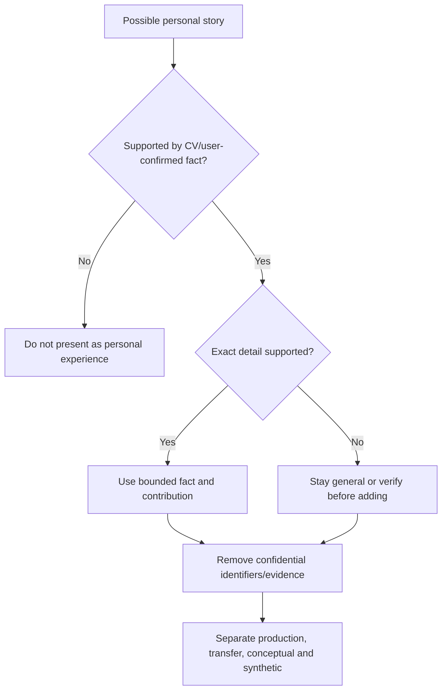

---

## 1. What behavioral interviews are testing

A behavioral question uses past behavior as evidence for how a candidate may operate in a similar future situation. It is not an invitation to perform a heroic autobiography. Interviewers usually listen for judgment, ownership, collaboration, communication, learning, and relevance to the role.

| Signal | What strong evidence sounds like | Weak substitute |
|---|---|---|
| Ownership | Exact responsibility, choice, and follow-through | `We handled it` with no personal role |
| Judgment | Alternatives, evidence, constraints, and why | Activity list |
| Customer focus | Impact, listening, clarity, and outcome | Customer-is-always-right slogan |
| Collaboration | Boundaries, handoffs, influence, and credit | Claiming solo rescue |
| Results | Factual outcome at the right scope | Invented savings or attribution |
| Learning | Reflection and changed future behavior | `I would do nothing differently` |
| Integrity | Limits, confidentiality, and honest gaps | Bluffing technical depth |

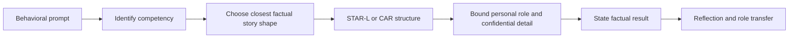

### 🔍 Plain-English deep-dive: the interview wants a decision, not a diary

A security-camera transcript contains everything that happened; an incident review selects the moments that explain the decision and result. A behavioral answer should do the same. Give enough context to understand the stakes, then spend most of the time on what you decided, did, learned, and would transfer.

---

## 2. STAR, STAR-L, and CAR methods

### STAR

- **Situation:** bounded context and stakes.
- **Task:** your responsibility, target, and constraint.
- **Action:** the choices and behaviors you personally performed.
- **Result:** factual outcome, including what remained unresolved.

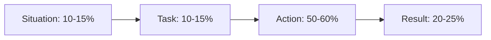

### STAR-L

STAR-L adds **Learning**: what the experience changed in your method, and how that lesson applies to the new role.

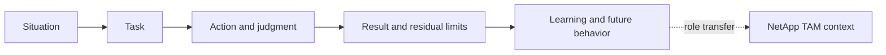

### CAR

- **Challenge:** the problem, constraint, and importance.
- **Action:** your decisions and behavior.
- **Result:** factual outcome and learning.

CAR is useful for 45-60-second answers or recruiter screens.

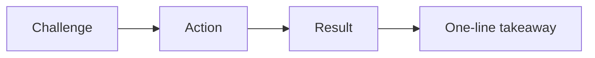

| Prompt type | Best default | Why |
|---|---|---|
| Full behavioral | STAR-L | Shows context, judgment, outcome, growth |
| Fast follow-up | CAR | Compresses without losing result |
| Failure/mistake | STAR-L | Requires ownership and changed behavior |
| Technical case | DIAGNOSE from Part 81 | Evidence and customer decision matter more than chronology |
| Motivation/closing | Past -> move -> fit -> future | Not a behavioral chronology |

---

## 3. Story selection and answer construction

Choose a story by **competency and decision shape**, not by matching one word in the prompt.

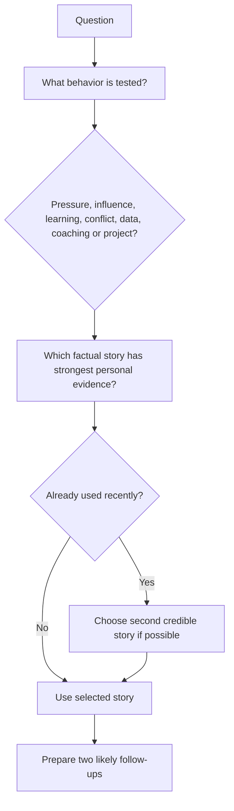

### Story card

| Field | Write before practice |
|---|---|
| Story name | Neutral memorable title |
| Supported anchors | Exact CV/user-confirmed facts only |
| Competencies | Three to five prompts it can answer |
| Situation | Customer/product context without identifiers |
| Task | Exact personal responsibility and boundary |
| Actions | Three decisions in sequence; use `I` accurately |
| Result | Supported metric/recognition/outcome or bounded qualitative result |
| Learning | What changed in later behavior |
| Transfer | How it helps in TAM Technical Analyst work |
| Guardrails | Details that must not be invented or disclosed |

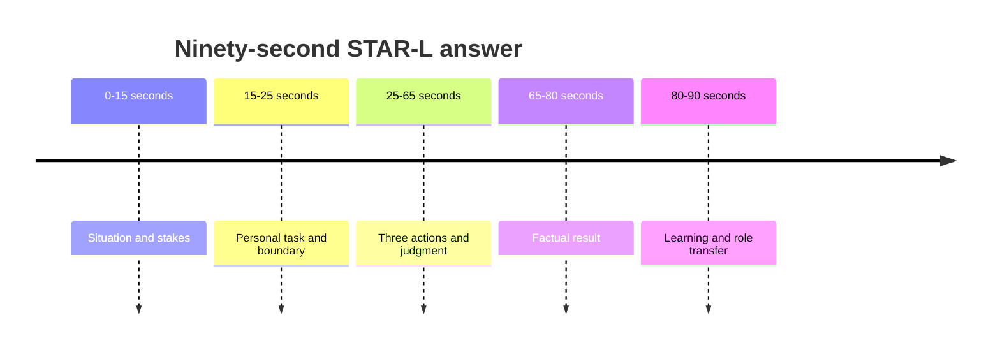

---

## 4. Quantify honestly

Supported quantitative anchors include:

- More than five years in Microsoft support/escalation work, where stated in the CV.
- CSAT above **4.75 Enterprise** and above **4.85 SMB**.
- More than **100 recognitions**.
- An **eight-month Technical Advisor program**.

Use these only with the scope and wording supported by the source. Do not create sample size, date range, rank, baseline, team size, revenue, savings, outage duration, defect count, or causal claim.

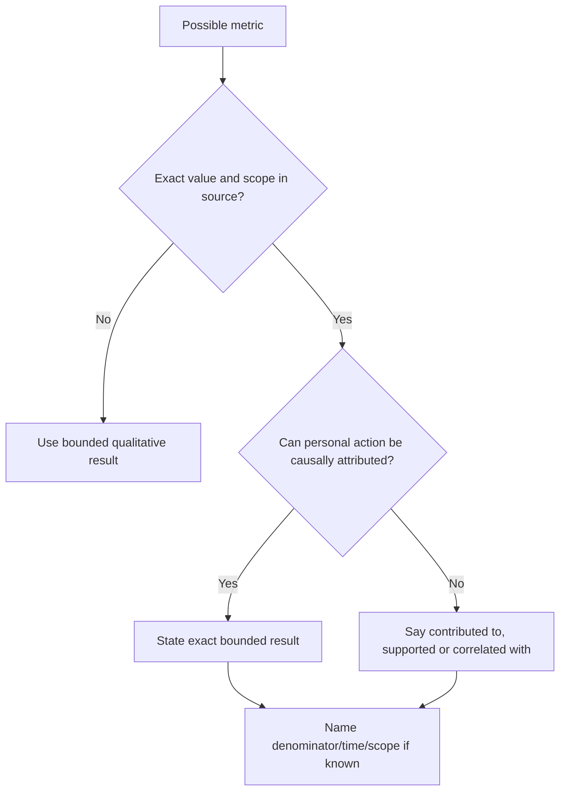

### 🔍 Plain-English deep-dive: precision is not permission

A number can be precise and still misleading. Saying `saved $2 million` requires evidence for the amount, counterfactual, attribution, period, and personal role. When those facts are absent, a truthful qualitative result such as `the issue was progressed through the correct engineering route and the fix was validated within my support scope` is stronger than invented precision.

### Safe result language

- `The documented result was ...`
- `My contribution was ...`
- `The team outcome was ..., and I specifically owned ...`
- `The supported evidence shows ..., but it does not prove ...`
- `I do not have a verified number for that effect, so I would not estimate it.`
- `The CV supports the recognition/CSAT result; it does not establish sole causation.`

---

## 5. Handling follow-ups and reflection

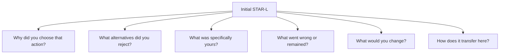

Prepare these follow-ups for every core story:

1. What was your personal role versus the team's?
2. What evidence changed your direction?
3. What was the hardest tradeoff?
4. Who disagreed, and how did you respond?
5. What did not go as planned?
6. What did the customer or stakeholder do?
7. What result can you prove?
8. What would you do differently now?
9. How have you reused the learning?
10. How does this apply without pretending it was NetApp work?

Reflection should be specific: `I now define the decision owner and next checkpoint at the start of a multi-team escalation` is stronger than `communication is important`.

---

## 6. Factual background-to-competency translation

| Supported background fact | Competency evidence | TAM transfer | Boundary |
|---|---|---|---|
| Microsoft Support Escalation Engineering | Technical depth, evidence, ownership, customer communication | Complex account issues and escalation quality | Not NetApp Support authority |
| CRITSIT/business-critical escalations | Pressure, prioritization, cadence, restoration focus | High-pressure customer/account coordination | Do not claim NetApp incident command |
| Enterprise and partner customers | Stakeholder adaptation and cross-boundary work | Customer/account/partner ecosystem | No customer names or contracts |
| SharePoint and OneDrive | Data-service, sync, permissions, identity, dependency thinking | Bridge to file/data availability concepts | Not ONTAP NAS production work |
| Copilot, AI agents, Copilot Studio training | Learning agility and modern technology communication | Ramp to AI-data and automation topics | State exact training/application scope only |
| Technical advisory, roadblocks, case bashes, triages | Influence, prioritization, quality improvement | Recommendation adoption and service improvement | Do not invent program metrics |
| Product defects and fix validation | Escalation package, Engineering collaboration, validation | Bug applicability and upgrade evidence discipline | Not NetApp BURT ownership |
| CSAT >4.75 Enterprise, >4.85 SMB | Consistent customer-experience signal | Customer communication and trust | Not storage expertise or TAM value proof |
| 100+ recognitions and peer recognition | Repeated acknowledgement of contribution | Collaboration, service quality, reliability | Corroboration, not the whole story |
| Business reviews and KPIs | Analytics-to-narrative and executive communication | Operational service reviews | No production NetApp OSR claim |
| Mentoring, onboarding, interviews | Coaching, calibration, talent judgment | Buddy new hires and standard tasks | Not people-management authority unless sourced |
| Eight-month Technical Advisor program | Advisory growth, broader contribution, feedback | Lead-TAM partnership and specialization ramp | Not equivalent to NetApp TAM tenure |
| Aspire Leadership Council/global events/CVP roundtable | Leadership exposure, preparation, executive listening | Cross-functional/executive presence | State participation, not event ownership |
| Power Automate/Power Apps Evolve awards | Automation, project contribution, learning recognition | Improve analysis and repeatable workflow | Do not invent savings, scale, or sole authorship |
| Internship foundations | Early learning, customer/technical discipline, growth | Demonstrates development arc | Use exact organization/work only if sourced |
| MBA Business Analytics; Excel/Power BI/SQL/Python/statistics | Analytical reasoning and communication | Fleet health, capacity, risk, KPI analysis | Tools do not replace storage context |

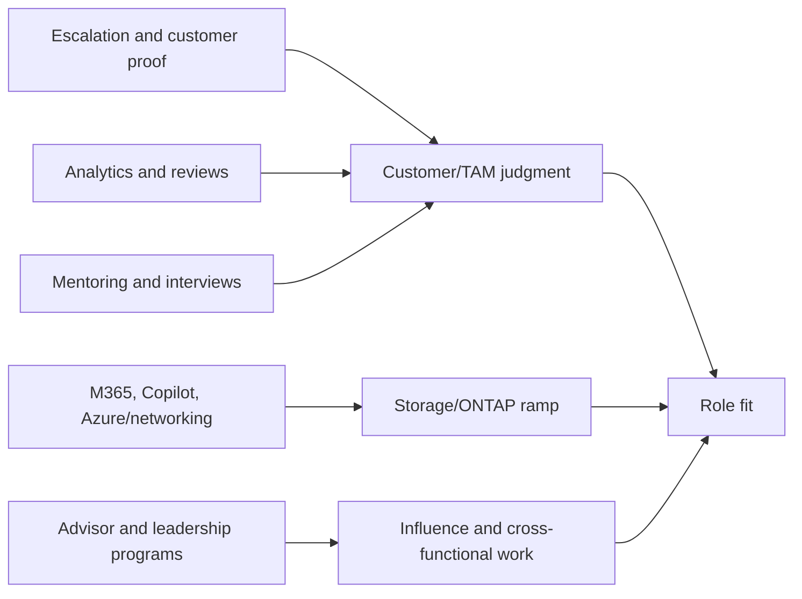

---

## 7. JD Mapping - every behavior

| JD responsibility or behavior | Best factual proof | Planned story blueprints | Honest gap/transfer |
|---|---|---|---|
| Generate customer data from enterprise sources | Analytics, case/review data, Excel/Power BI | 8, 14 | NetApp sources require access/ramp |
| Analyze and report customer data | KPIs, business reviews, CSAT/quality trends | 7, 8, 14 | No live Digital Advisor claim |
| Strategic planning | Advisory/program/project planning | 5, 10, 12 | NetApp estate strategy is new domain |
| Storage best-practice guidance | M365 data-service/system thinking plus study | 3, 16 | Conceptual until qualified review/lab |
| Upgrade advice | Product defect/fix validation and change discipline | 6, 16 | No ONTAP upgrade ownership |
| Understand customer environment | Enterprise/partner troubleshooting and discovery | 2, 3 | Translate to application-to-data mapping |
| Maintain install-base accuracy | Data quality, case/review discipline | 8, 14 | No NetApp install-base production use |
| Conduct operational service reviews | Business reviews, KPI communication | 8, 11 | NetApp OSR remains synthetic/observed initially |
| Use AutoSupport-related evidence | Evidence validation method | 6, 8 | No direct gated-tool access claim |
| Mitigate risk and improve stability | CRITSIT, escalations, fix validation | 1, 6, 15 | NetApp mechanisms require current expertise |
| Track remediation and influence adoption | Advisory, roadblocks, triages | 5, 10, 14 | Do not claim customer risk acceptance |
| Improve analysis and recommendation representation | Analytics, automation, business reviews | 8, 12, 14 | Show artifacts, not invented savings |
| Manage special projects | TA program, AI enablement, automation awards | 10, 12, 13 | Exact scope/role remains source-bounded |
| Written/verbal communication | Enterprise/partner customers, reviews, recognitions | 2, 7, 8, 11 | Protect confidentiality |
| Microsoft Office/Excel/PowerPoint | Analytics and business-review work | 8, 14 | Prepare tangible sanitized examples |
| Customer time-zone alignment | Global enterprise/partner work | 2, 15 | State actual availability honestly |
| High-pressure work and prioritization | CRITSIT/business-critical escalations | 1, 15 | No NetApp IC claim |
| Storage and/or virtualization knowledge | Azure/VM/networking/storage foundations plus guide | 3, 16 | Production ONTAP/SAN/NAS/VMware gap is explicit |
| Learn/apply new technology | Copilot/AI agents/Copilot Studio; TA program | 4, 10, 13 | Demonstrate learning method and current plan |
| Understand risk/supportability parameters | Escalation evidence, fix validation, boundaries | 6, 16 | IMT/HWU/BURT are learned/access-sensitive |
| Influence/negotiate under lead TAM | Advisory, roadblocks, Product/Engineering work | 5, 6, 10 | No commercial/customer decision authority |
| Buddy new hires/coach standard tasks | Mentoring, onboarding, interviews | 9 | NetApp task certification requires observation |
| Contribute to cross-functional/SME teams | Product/Engineering, partner, leadership events | 6, 10, 11 | No NetApp SME status |
| Build specialization | SharePoint/OneDrive/Copilot depth; planned ONTAP path | 3, 4, 10, 16 | Specialization must be earned |
| 5-8 years/degree/support fit | 5+ years where CV states; MBA Business Analytics | 7, 8, 13 | Do not convert Support into unclaimed TAM tenure |

---

## 8. Sixteen ready-to-adapt factual STAR-L story blueprints

Each blueprint contains only supported anchors. Bracketed prompts require verified detail before use; they are not permission to invent.

### Story Blueprint 1 - Business-critical escalation / CRITSIT

**Supported anchors:** Microsoft business-critical escalation and CRITSIT ownership; Support Escalation Engineering; multi-team coordination; customer updates; Engineering engagement; recovery/fix validation.

| STAR-L | Ready-to-adapt content |
|---|---|
| Situation | `In Microsoft enterprise support, I handled a business-critical escalation affecting a customer service. I keep the customer and technical details confidential.` |
| Task | `My responsibility was to progress the escalation within my support scope, organize evidence, and keep technical and customer stakeholders aligned.` |
| Action | Bound impact and scope; established a chronology and competing technical paths; coordinated the correct teams; gave predictable evidence-based updates; separated restoration from deeper cause/fix work; validated the supported outcome. |
| Result | Insert only the verified case result. If exact duration/scale is not documented, say `service progression/recovery and the next technical path were validated` rather than inventing numbers. |
| Learning | `I learned to establish role, evidence source, and next checkpoint early; calm structure is more useful than premature certainty.` |

**Best prompts:** high pressure, difficult customer, prioritization, cross-functional work, executive communication. **Guardrails:** no customer name, outage duration, user count, revenue, root cause, or sole-hero claim unless verified.

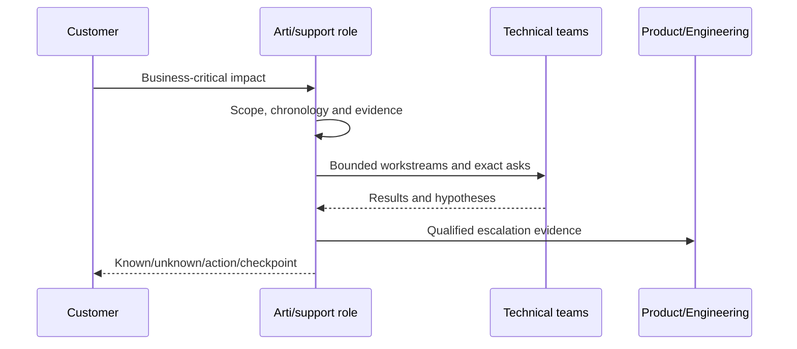

### Story Blueprint 2 - Enterprise or partner customer under tension

**Supported anchors:** Enterprise and partner customer support; technical advisory; customer communication; high CSAT and recognition context.

| STAR-L | Ready-to-adapt content |
|---|---|
| Situation | `An enterprise or partner customer was dissatisfied or under pressure during a complex support interaction.` |
| Task | `I needed to understand the impact, restore a productive working rhythm, and progress the technical path without promising an unsupported outcome.` |
| Action | Listened and reflected impact; clarified scope and expectations; separated verified facts from assumptions; agreed owners/checkpoints; tailored technical depth to audience; followed through. |
| Result | Use the factual resolution/feedback if verified; CSAT/recognition can corroborate the broader behavior but must not be attached to this exact case unless documented. |
| Learning | `Empathy acknowledges impact; it does not require agreeing with an unproven cause or promise.` |

**Best prompts:** difficult customer, conflict, rejected recommendation, influence, time zones. **Guardrails:** no customer identity, contract, case content, or invented satisfaction quote.

### Story Blueprint 3 - SharePoint/OneDrive data-service troubleshooting

**Supported anchors:** SharePoint, OneDrive, Microsoft 365 support; sync, permissions, identity/network/data-service context.

| STAR-L | Ready-to-adapt content |
|---|---|
| Situation | `A customer experienced a SharePoint or OneDrive service, access, sync, or dependency issue within my Microsoft support scope.` |
| Task | `I had to locate the failing boundary and explain a clear next action across customer and Microsoft ownership.` |
| Action | Mapped user/client/identity/network/service/data dependencies; compared affected and healthy scope; gathered decisive evidence; tested alternatives; involved the right owner; communicated the bounded conclusion. |
| Result | Insert exact supported result only; otherwise state `the issue was narrowed/progressed and the validated action communicated.` |
| Learning | `This built my application-to-data thinking, but I do not present it as ONTAP NAS administration.` |

**Best prompts:** technical complexity, ambiguity, customer environment, learning transfer, storage gap. **Guardrails:** no tenant data, user names, internal diagnostics, or ONTAP equivalence.

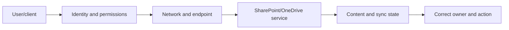

### Story Blueprint 4 - Copilot, AI agents, and Copilot Studio learning

**Supported anchors:** Copilot-related work; AI agents/Copilot Studio training; learning new technology customer-facing.

| STAR-L | Ready-to-adapt content |
|---|---|
| Situation | `Microsoft's Copilot and AI-agent capabilities created a new learning and customer-support/advisory need.` |
| Task | `I needed to build enough accurate understanding to communicate or contribute within my role without overclaiming emerging product behavior.` |
| Action | Used authoritative learning; built concept maps or examples; practiced; asked for review; connected learning to customer scenarios; taught back or shared learning where supported; maintained privacy and current-source checks. |
| Result | State exact training/completion/contribution supported by the CV; do not invent adoption, savings, or customer outcome. |
| Learning | `My ramp pattern is source -> practice -> review -> teach-back -> bounded application, which I will use for ONTAP.` |

**Best prompts:** learning agility, ambiguity, development plan, specialization, project. **Guardrails:** training is not production AI architecture ownership.

### Story Blueprint 5 - Technical advisory, roadblocks, case bashes, and triages

**Supported anchors:** Technical advisory; roadblocks; case bashes; triages; customer/team guidance.

| STAR-L | Ready-to-adapt content |
|---|---|
| Situation | `A set of cases or technical roadblocks needed structured review rather than isolated handling.` |
| Task | `I contributed advisory analysis to identify themes, unblock owners, and improve next actions.` |
| Action | Defined scope/criteria; reviewed evidence; separated recurring symptom from common cause; grouped themes; identified owner/action; facilitated or contributed to triage; tracked follow-through. |
| Result | Use factual outcome/recognition only if sourced; otherwise state the validated process output such as clearer actions or routing. |
| Learning | `A pattern label is not a root cause; normalization and evidence protect decision quality.` |

**Best prompts:** influence without authority, process improvement, rejected advice, data analysis, prioritization. **Guardrails:** no invented case count, time saved, backlog reduction, or formal program ownership.

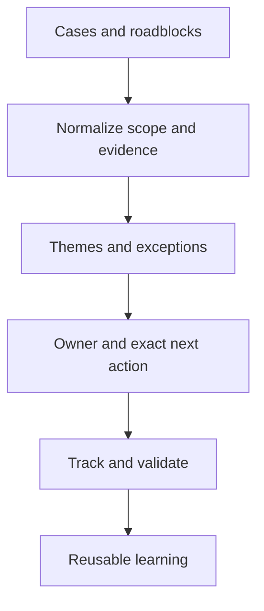

### Story Blueprint 6 - Product defect escalation and fix validation

**Supported anchors:** Product/Engineering collaboration; product defects; reproduction/evidence; fix validation; customer updates.

| STAR-L | Ready-to-adapt content |
|---|---|
| Situation | `A customer issue showed evidence consistent with a product defect and required Product/Engineering engagement.` |
| Task | `My role was to make the technical package actionable and validate the returned fix or guidance within my support scope.` |
| Action | Captured exact symptom/scope/version/trigger; ruled out alternatives where possible; built reproduction or evidence package; asked a specific Engineering question; maintained customer-safe updates; validated expected and negative behavior. |
| Result | Insert supported fix-validation/result wording; do not name private defects, dates, customers, release commitments, or claim Engineering ownership. |
| Learning | `Similarity is not applicability; exact trigger, signature, and validation matter.` |

**Best prompts:** cross-functional, conflict, influence, technical challenge, risk/supportability. **Guardrails:** not a NetApp BURT story; protect private product details.

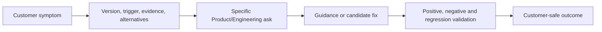

### Story Blueprint 7 - Customer outcomes through CSAT and recognition

**Supported anchors:** CSAT above 4.75 Enterprise and above 4.85 SMB; more than 100 recognitions; peer recognition.

| STAR-L | Ready-to-adapt content |
|---|---|
| Situation | `Across my Microsoft support work, I served Enterprise and SMB customer contexts with measured experience feedback.` |
| Task | `My recurring responsibility was to combine technical progression with clear ownership and communication.` |
| Action | Prepared context; listened; set realistic expectations; explained evidence; maintained follow-through; adapted detail; learned from feedback. |
| Result | `My documented customer outcomes include CSAT above 4.75 in Enterprise and above 4.85 in SMB, alongside more than 100 recognitions.` |
| Learning | `These metrics corroborate consistent behaviors; they do not prove storage expertise or sole causation.` |

**Best prompts:** why you, customer focus, strength, recognition, quality. **Guardrails:** do not invent denominator, period, ranking, award criteria, or attach aggregate metrics to one case.

### Story Blueprint 8 - Business reviews, KPIs, and data storytelling

**Supported anchors:** Customer/business reviews; KPIs; backlog/case-quality/CSAT analysis; Excel/Power BI; MBA Business Analytics.

| STAR-L | Ready-to-adapt content |
|---|---|
| Situation | `A business or customer review needed a clear view of performance, quality, trends, or priorities.` |
| Task | `I had to turn source data into a decision-ready narrative for the intended audience.` |
| Action | Defined question/grain/cutoff; cleaned and reconciled data; selected meaningful KPIs; separated correlation from cause; built concise visuals; highlighted actions/owners; handled questions and corrected uncertainty. |
| Result | Use exact review decision or improvement only if documented; otherwise state `the review produced a clearer evidence-based action/priority discussion.` |
| Learning | `A dashboard is useful only when denominator, freshness, and decision are visible.` |

**Best prompts:** data analysis, executive review, ambiguity, project, influence. **Guardrails:** no invented KPI movement, savings, or NetApp OSR ownership.

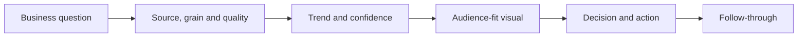

### Story Blueprint 9 - Mentoring, onboarding, and interviews

**Supported anchors:** Mentoring; onboarding; technical interviews; coaching/knowledge creation.

| STAR-L | Ready-to-adapt content |
|---|---|
| Situation | `A new hire, peer, or candidate needed a clear and fair path to demonstrate or build technical capability.` |
| Task | `I contributed mentoring, onboarding, or interview support within my role.` |
| Action | Clarified competency; decomposed task; used examples; encouraged questions; observed/asked evidence-based questions; provided specific feedback; checked understanding; escalated decisions outside authority. |
| Result | State factual readiness/feedback/contribution only if sourced; avoid team-size, hiring-decision, or promotion claims. |
| Learning | `Good coaching builds safe independence and makes uncertainty discussable.` |

**Best prompts:** coaching, leadership, difficult feedback, inclusion, quality. **Guardrails:** do not claim manager, final hiring authority, formal curriculum owner, or NetApp task certification.

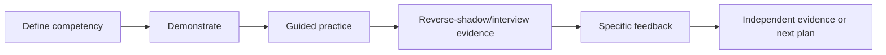

### Story Blueprint 10 - Eight-month Technical Advisor program

**Supported anchors:** Eight-month Technical Advisor program; advisory development; broader team contribution.

| STAR-L | Ready-to-adapt content |
|---|---|
| Situation | `I participated in an eight-month Technical Advisor program to broaden my advisory and leadership capability.` |
| Task | `My goal was to contribute beyond individual case execution and improve how technical issues, roadblocks, or learning were handled.` |
| Action | Insert only supported program activities; emphasize feedback, advisory reasoning, stakeholder communication, structured contribution, and teach-back where factual. |
| Result | State program completion/contribution supported by the CV; do not invent project metrics or title equivalence. |
| Learning | `The program strengthened my interest in persistent technical context and proactive account work, which is why the TAM analyst path fits.` |

**Best prompts:** why TAM, leadership, influence, learning, project, specialization. **Guardrails:** not NetApp TAM tenure; no unsupported program ownership.

### Story Blueprint 11 - Aspire Leadership Council, global events, and CVP roundtable

**Supported anchors:** Aspire Leadership Council; global events; CVP roundtable participation; peer recognition.

| STAR-L | Ready-to-adapt content |
|---|---|
| Situation | `I had opportunities to participate in leadership forums, global events, and a CVP roundtable.` |
| Task | `I needed to prepare, contribute thoughtfully, represent my perspective accurately, and learn from senior/cross-regional stakeholders.` |
| Action | Prepared questions/context; listened for strategic themes; contributed within assigned role; connected learning to peers/work; followed up or reflected where supported. |
| Result | State participation, recognition, or resulting contribution exactly as documented; do not claim event design, executive sponsorship, or policy impact. |
| Learning | `Executive presence is concise preparation, listening, and useful follow-through, not speaking the most.` |

**Best prompts:** executive communication, leadership, cross-cultural work, ambiguity, why you. **Guardrails:** no invented audience size, direct executive relationship, or event ownership.

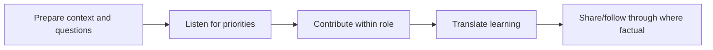

### Story Blueprint 12 - Power Automate/Power Apps and Evolve awards

**Supported anchors:** Power Automate/Power Apps work; Evolve awards; automation/process improvement.

| STAR-L | Ready-to-adapt content |
|---|---|
| Situation | `A repeatable work or information-flow problem created an opportunity for Power Automate or Power Apps.` |
| Task | `I contributed to designing or delivering an automation/process improvement within the supported scope.` |
| Action | Clarified user/problem and data boundary; mapped current flow; built/tested incrementally; handled errors/access; gathered feedback; documented and improved. |
| Result | State the exact Evolve award/recognition and supported outcome; do not invent hours, savings, adoption count, or sole authorship. |
| Learning | `Automation should remove deterministic toil while preserving exception handling, privacy, and human judgment.` |

**Best prompts:** project, innovation, process improvement, data, cross-functional work. **Guardrails:** award is recognition, not proof of a specific financial outcome.

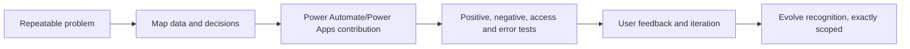

### Story Blueprint 13 - Internship foundations and growth arc

**Supported anchors:** Internship foundations; progression into Microsoft support, advisory, analytics, leadership, and AI learning.

| STAR-L | Ready-to-adapt content |
|---|---|
| Situation | `My internship provided an early foundation for professional technical/customer work.` |
| Task | `I needed to learn the environment, deliver assigned work reliably, and build professional habits.` |
| Action | Insert exact supported internship work; emphasize asking questions, documentation, feedback, ownership, and learning rather than invented project scope. |
| Result | State only documented internship outcome/progression. |
| Learning | `The arc from internship foundations to escalation/advisory work shows that I ramp through disciplined learning and feedback.` |

**Best prompts:** career journey, learning, failure, why move, development area. **Guardrails:** no dates, employer, technology, deliverable, or result beyond source.

### Story Blueprint 14 - Analytics-led quality or process improvement

**Supported anchors:** Backlog health; case quality; KPIs; Excel/Power BI; case bashes/triages; business analytics.

| STAR-L | Ready-to-adapt content |
|---|---|
| Situation | `The team needed a clearer view of backlog, case quality, or recurring support themes.` |
| Task | `I contributed analysis and review discipline to identify actionable patterns.` |
| Action | Defined metric and grain; checked data quality; segmented trends; reviewed exceptions; discussed with owners; converted insight into bounded actions; monitored feedback. |
| Result | Use only supported quality/review result or recognition; do not invent percentage improvement or time saved. |
| Learning | `Metrics should direct inquiry and action, not become targets that hide quality.` |

**Best prompts:** data analysis, process improvement, project, rejected recommendation, ethical challenge. **Guardrails:** no unsupported denominator or causal claim.

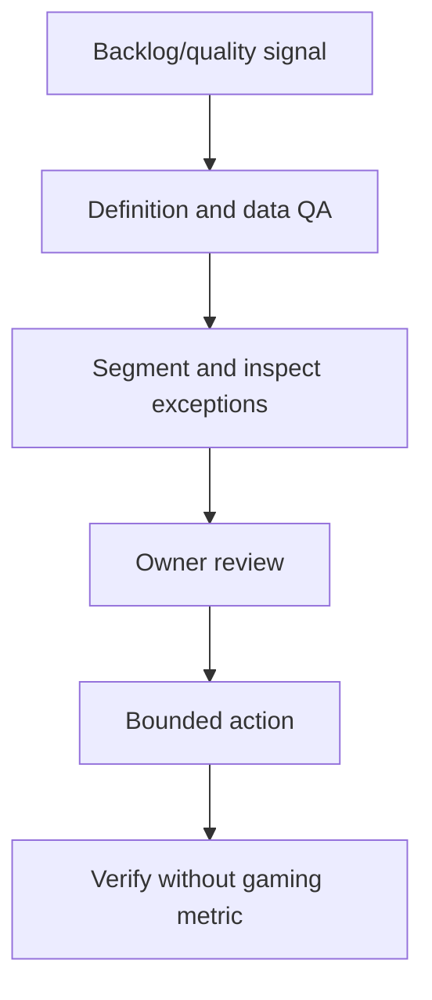

### Story Blueprint 15 - Prioritization across pressure and time zones

**Supported anchors:** CRITSIT/business-critical prioritization; global enterprise/partner customers; time-sensitive escalation; backlog health; handoffs.

| STAR-L | Ready-to-adapt content |
|---|---|
| Situation | `Multiple customer commitments or escalations competed across time zones.` |
| Task | `I needed to protect the highest-impact work while keeping other owners informed and preserving handoff quality.` |
| Action | Assessed impact/urgency/dependency; limited WIP; named displaced work; coordinated owner/backup; used UTC checkpoints and complete handoffs; escalated capacity/authority when needed. |
| Result | State factual delivery/continuity result if documented; do not invent workload volume or response time. |
| Learning | `A new priority must change an old commitment visibly; silent overload is not ownership.` |

**Best prompts:** prioritization, high pressure, time zones, difficult stakeholder, work-life boundaries. **Guardrails:** do not promise permanent availability.

### Story Blueprint 16 - Honest storage/ONTAP ramp and specialization

**Supported anchors:** Azure/VM/networking/storage fundamentals; SharePoint/OneDrive/Copilot; analytics; complete study path; no production ONTAP or NCDA claim.

| STAR-L | Ready-to-adapt content |
|---|---|
| Situation | `The NetApp role requires storage and ONTAP depth beyond my current production experience.` |
| Task | `I need to close the gap without misrepresenting readiness or slowing customer work.` |
| Action | Map role domains; study foundations/ONTAP/protocols; use official sources; draw architectures; complete authorized or synthetic labs; answer aloud; seek SME review; contribute first through evidence/analytics/communication strengths. |
| Result | Current result is preparation evidence, not production competence or certification; update only when labs/credentials are actually completed. |
| Learning | `A credible gap answer combines candor, adjacent proof, a measurable ramp, and safe escalation.` |

**Best prompts:** development area, why you, why NetApp, learning, 30/60/90, NCDA. **Guardrails:** no production, certification, tool-access, or completed-lab claim unless true.

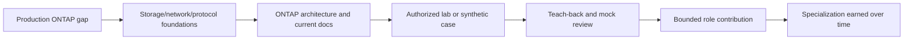

---

## 9. Story-to-question matrix

| Interview prompt | Primary stories | Alternate or answer boundary |
|---|---|---|
| Failure or mistake | 1, 5, 8, 12, 14 | Use a real control/communication/process miss; insert verified detail |
| Conflict | 2, 5, 6, 10 | Focus on evidence and relationship repair |
| Difficult customer | 1, 2, 3 | Do not blame customer |
| High pressure | 1, 15 | Show structure and boundaries |
| Prioritization/time zones | 15, 1 | Name displaced work and handoff |
| Influence without authority | 5, 6, 10 | Preserve decision authority |
| Rejected recommendation | 2, 5, 8 | Explain objection and revised option |
| Ambiguity | 1, 3, 4, 6 | Known/unknown and reversible test |
| Learning new technology | 4, 10, 13, 16 | Source/practice/review/teach-back |
| Coaching | 9, 10 | No manager overclaim |
| Cross-functional | 1, 6, 10, 11, 12 | Credit other roles |
| Project | 10, 12, 14 | Scope, milestones, risks, learning |
| Data analysis | 8, 14 | Grain, QA, insight, action |
| Executive review | 8, 11 | BLUF, evidence, decision |
| Ethical challenge | 6, 8, 14, 16 | Use a real boundary; do not invent drama |
| Accepted risk | 5, 6, 8 | Say advised/tracked unless authorized to accept |
| Strength | 1, 2, 7 | Evidence-led customer ownership |
| Development area | 16 | Production ONTAP depth |

### Failure, conflict, ethics, and accepted-risk guardrail

The source confirms these **competency areas**, not one specific personal incident for each. Select an actual event from private memory/records that can be discussed lawfully, then complete the story card. If no factual example can be verified, say so and use a closely related supported example; never invent a `perfect failure`.

### 🔍 Plain-English deep-dive: honesty can be specific without exposing secrets

`I cannot share the customer or internal defect details, but I can explain my role, the evidence method, the decision boundary, and what I learned` is specific enough to be useful. Confidentiality should remove identifiers and restricted payload, not turn the answer into vague slogans.

---

## 10. Full factual introductions

### 60-second introduction

> `I have more than five years of Microsoft support and escalation experience, working with enterprise and partner customers across SharePoint, OneDrive, Microsoft 365, business-critical escalations, and newer Copilot-related areas. My strongest skills are structuring complex technical evidence, coordinating Product and Engineering or other stakeholders, communicating clearly with customers, and following work through validation. I also bring business analytics, Excel and Power BI, business-review experience, mentoring, onboarding, and technical interviews. My documented customer outcomes include CSAT above 4.75 in Enterprise and above 4.85 in SMB, with more than 100 recognitions. I am now moving toward proactive technical account work where I can use those strengths across an environment over time. I am transparent that production ONTAP is a development area, and I have a structured official-source, architecture, lab, and teach-back plan to close it safely.`

### 90-second introduction

> `My background is in Microsoft enterprise Support Escalation Engineering, with more than five years of experience supporting enterprise and partner customers. I have worked across SharePoint, OneDrive, and Microsoft 365, business-critical and CRITSIT escalations, technical advisory, Product and Engineering collaboration, product-defect and fix-validation work, business reviews, and newer Copilot-related areas. The common thread is that I take a complex situation, establish the customer impact and evidence, organize the right owners, communicate what is known and unknown, and follow the action through validation. Alongside that technical work, I have an MBA in Business Analytics and experience with Excel, Power BI, and KPI-based reviews. I have also mentored and onboarded colleagues, supported technical interviews, participated in an eight-month Technical Advisor program, engaged in leadership forums, and continued learning through AI-agent and Copilot Studio training. My documented customer outcomes include CSAT above 4.75 in Enterprise and above 4.85 in SMB and more than 100 recognitions. I want this TAM Technical Analyst role because it shifts those strengths from isolated case response toward persistent customer context, proactive risk, operational reviews, and long-term follow-through. I do not claim production ONTAP experience; I am building that depth deliberately and would use qualified review and current NetApp sources while contributing immediately through escalation judgment, analytics, communication, and coaching.`

```mermaid
flowchart LR
    NOW[Current Microsoft proof] --> PATTERN[Evidence, customer, analytics and coaching pattern]
    PATTERN --> MOVE[Why proactive TAM]
    MOVE --> GAP[Honest ONTAP gap]
    GAP --> RAMP[Measured ramp and immediate contribution]
```

---

## 11. Full motivation and fit answers

### Why NetApp

> `I am interested in NetApp because the work sits at the center of data availability, performance, protection, cyber resilience, and hybrid infrastructure, all of which have direct customer consequences. The public portfolio and ONTAP learning path also make the role a strong bridge from my Microsoft data-service, cloud, networking, and escalation background into deeper storage infrastructure. What attracts me is not one product slogan; it is the opportunity to understand a customer's complete environment, use technical and support evidence to identify risk, and help turn recommendations into stable long-term outcomes. I would continue validating current product details from official sources rather than relying on interview-level generalizations.`

### Why the TAM Technical Analyst role

> `This role combines the parts of my work where I have the strongest evidence: complex customer support, technical advisory, Product and Engineering collaboration, business reviews, analytics, recommendation follow-through, high-pressure communication, and mentoring. I enjoy solving the immediate issue, but I am especially motivated by the next questions: what pattern is emerging, what risk should be addressed before the next incident, which owner must act, and how do we prove the outcome? The Technical Analyst role lets me contribute that evidence and follow-through under a lead TAM while building deeper storage specialization.`

### Why move from Microsoft

> `I value the experience I have built at Microsoft and would describe the move positively. My support background taught me technical depth, customer ownership, and escalation discipline. I now want a role with more persistent account context and proactive infrastructure work: environment baselines, supportability, lifecycle, risk reviews, and preventative action across time. NetApp's TAM Technical Analyst role is a logical next step because it uses what I have proved while giving me a demanding storage and hybrid-data learning path.`

### Why you

> `I offer a combination of evidence-led escalation judgment, customer communication, analytics, and team enablement. I have handled business-critical Microsoft escalations, worked across enterprise and partner customers, collaborated with Product and Engineering, validated fixes, delivered reviews and KPI analysis, and mentored or interviewed others. My documented CSAT and recognition record supports the consistency of those behaviors. I will not pretend the storage gap is already closed: production ONTAP is new for me. My value is that I know how to learn safely, state boundaries, use current evidence, ask strong cross-layer questions, and contribute immediately to analysis quality, customer clarity, and action follow-through while I build product depth.`

### Why TAM rather than continuing in Support

> `Support and TAM are complementary. Support taught me how to respond deeply when a customer reports a problem. TAM work adds continuity across the estate: trends, lifecycle, upcoming changes, supportability, recurring risks, governance, and value. I want to carry the incident lessons forward into preventative actions and customer planning rather than treating each case as a separate endpoint.`

```mermaid
flowchart TD
    WHY[Strong why answer] --> EVID[What I have proved]
    WHY --> PULL[What specifically attracts me]
    WHY --> FIT[Why role/company context fits]
    WHY --> GAP[What I still need to learn]
    WHY --> FUT[How I will contribute and grow]
```

---

## 12. Handling the storage gap honestly

### Four-step GAP answer

1. **G - Gap:** Name it directly: no production ONTAP administration.
2. **A - Adjacent proof:** Microsoft data services, Azure/VM/networking, escalation, analytics, identity, and customer work.
3. **P - Plan:** Official docs, architecture, authorized/synthetic labs, teach-back, shadowing, SME review, and NCDA objectives without certification claim.
4. **Proof boundary:** State what evidence exists today and what will count as progress.

```mermaid
flowchart LR
    G[Name the gap] --> A[Show adjacent factual proof]
    A --> P[Give time-bound learning plan]
    P --> SAFE[Explain safe review/escalation]
    SAFE --> PROOF[State current and future evidence]
```

### Full gap answer

> `The clearest gap is that I have not administered ONTAP in production and I have not earned NCDA. I would not hide that. My adjacent production experience includes Microsoft 365 data services, identity, networking, Azure and virtual-machine fundamentals, complex escalation, Product and Engineering work, analytics, and customer communication. My ramp is structured: master storage, network, and protocol foundations; learn ONTAP architecture from current official sources; draw and troubleshoot complete data paths; complete authorized labs where available or clearly synthetic cases; seek review from qualified teammates; and use teach-back and scenario testing to expose gaps. Early in the role I would contribute through data quality, evidence packages, analysis, reviews, and action tracking while technical recommendations receive the required lead-TAM/SME validation.`

### Unsafe gap answers

| Avoid | Why |
|---|---|
| `Storage is basically the same as OneDrive` | Collapses different architecture and operations |
| `I can learn anything in a week` | No evidence or safe boundary |
| `I completed this guide, so I am production-ready` | Reading is not operational competence |
| `I am almost NCDA` | Preparing is not a credential |
| `I would just ask an SME` | Collaboration without personal ramp is weak |

### 🔍 Plain-English deep-dive: transferable experience is a bridge, not a passport

Knowing how to investigate a Microsoft data-service issue gives Arti useful habits: map dependencies, verify identity, compare healthy controls, coordinate owners, and communicate uncertainty. It does not automatically grant entry into production ONTAP administration. A bridge gets her to the new domain faster; current product knowledge, supervised practice, evidence, and authorization still determine what she may safely claim or do.

---

## 13. Thirty/sixty/ninety-day plan

```mermaid
timeline
    title Role-entry 30/60/90 plan
    Days 1-30 : Learn service, customers, stakeholders, privacy and tools
              : Build ONTAP foundation, shadow and verify account evidence
    Days 31-60 : Own bounded analysis, reconciliation and action tracking
               : Complete reviewed technical cases/labs and contribute to reviews
    Days 61-90 : Deliver quality-reviewed service-review contribution
               : Close one process improvement and agree specialization roadmap
```

| Period | Learn | Contribute | Evidence/measure | Boundary |
|---|---|---|---|---|
| Days 1-30 | Role/service scope, account model, customer outcomes, data/privacy, tools/access, ONTAP architecture, protocols, portfolio, support routes | Shadow reviews and analyses; reconcile terminology/topology; create question/learning log | Manager/lead-TAM feedback; accurate teach-backs; access and source hygiene; no preventable privacy/claim errors | No independent high-risk recommendation/change |
| Days 31-60 | AutoSupport/Digital Advisor/IMT/HWU/bug/lifecycle workflows as access permits; review quality standards | Own bounded install-base/data-quality/action-tracker work; prepare reviewed finding/recommendation; complete authorized or synthetic labs | Rework rate, source traceability, review rubric, clear owner/validation; lab evidence honestly labeled | Qualified review for product/supportability conclusions |
| Days 61-90 | Customer-specific priorities and chosen specialization | Deliver part of an operational review under lead TAM; close one analysis/workflow improvement; publish sanitized knowledge contribution | Stakeholder feedback, on-time quality deliverable, measurable control/process result, specialization plan | Customer outcomes depend on account/customer owners |

### 30/60/90 interview answer

> `In the first 30 days I would focus on the service model, customers, stakeholders, data/privacy rules, tool access, and core ONTAP architecture, while shadowing reviews and building accurate account context. By 60 days I would aim to own bounded, reviewable work such as install-base reconciliation, data-quality checks, action tracking, and a first evidence-based recommendation, with product conclusions reviewed by qualified teammates. By 90 days I would contribute a quality-reviewed section of an operational service review, close one measurable analysis or workflow improvement, and agree a specialization roadmap. I would measure accuracy, traceability, rework, stakeholder feedback, and action clarity rather than promise customer outcomes I do not control.`

---

## 14. Difficult behavioral and judgment prompts

### Failure or mistake

Use an actual factual case. Structure:

> `I made or participated in <bounded decision or control miss>. The impact was <verified, sanitized>. I first <contained/corrected and informed>. I then traced the gap to <process/evidence/communication>, changed <specific control>, and validated <supported result>. I learned <changed behavior>.`

Do not choose a fake weakness, blame a customer, or make the failure so severe that confidentiality forces the entire answer into vagueness.

### Conflict

> `We agreed on <shared outcome> but disagreed about <specific interpretation/action>. I separated observations from hypotheses, asked what evidence would distinguish them, involved the correct authority, and recorded the decision. My contribution to the tension was <honest reflection if applicable>. The relationship/result was <supported outcome>, and I now <changed behavior>.`

### Rejected recommendation

> `I treated the rejection as information about evidence, cost, timing, authority, or trust. I asked what constraint mattered, revalidated the recommendation, compared status quo and phased options, and preserved the stakeholder's decision right. The result was <accepted/phased/deferred/unchanged> with <owner/checkpoint> where factual.`

### Difficult customer

> `I would begin by acknowledging the impact and listening for the underlying concern. I would clarify the outcome, separate experience from unproven technical cause, agree a fact-based next path and checkpoint, and follow through. I would use Story 2 or a verified CRITSIT rather than portray the customer as the problem.`

### High pressure and prioritization

> `I would use Story 1 or 15: verify impact and urgency, protect the current critical path, limit work in progress, make displaced commitments visible, establish owners and UTC checkpoints, and maintain a clean handoff. I would not use long hours as the result.`

### Ambiguity

> `I make known, unknown, assumed, and current-check-required facts explicit. I choose the smallest reversible action or test that will reduce uncertainty and update stakeholders when evidence changes the direction.`

### Learning and coaching

Use Stories 4, 9, 10, 13, or 16. Show learning objective, authoritative source, practice, feedback, teach-back, bounded application, and what evidence marked progress.

### Cross-functional project and data analysis

Use Stories 6, 8, 10, 12, or 14. State scope, stakeholders, personal contribution, evidence/data QA, decisions, outcome, and limits; never add savings or adoption numbers not in the source.

### Ethical challenge

> `I would not invent a dramatic ethics story. I would use a real example involving privacy, unsupported certainty, evidence quality, access, or expectation setting. I would explain the policy or interest, the pressure, the boundary I protected, the escalation route, and the factual outcome.`

### Accepted risk

Arti should say `I explained, documented, or tracked the risk` unless she factually had authority to accept it. Customer/business risk acceptance belongs to the authorized decision owner.

```mermaid
flowchart TD
    PRESSURE[Pressure, disagreement or ethical issue] --> FACTS[Clarify evidence and impact]
    FACTS --> AUTH[Identify policy and decision authority]
    AUTH --> OPTIONS[Present safe options and tradeoffs]
    OPTIONS --> DEC[Authorized decision]
    DEC --> RECORD[Record action, expiry and residual risk]
    RECORD --> REFLECT[Learning and relationship repair]
```

---

## 15. Consulting and customer case framework

For consulting-style prompts, use **CONTEXT**:

| Letter | Step | Interview behavior |
|---|---|---|
| C | Customer outcome | Business service, users/data, priority, SLO/RPO/RTO |
| O | Observe current state | Scope, timeline, topology, evidence, healthy controls |
| N | Name unknowns | Assumptions, missing data, confidence, access/privacy |
| T | Test hypotheses | Alternatives and cheapest safe discriminating evidence |
| E | Evaluate options | Status quo, action, cost, downtime, supportability, risk |
| X | eXecute through owners | Authority, RACI, owner/date/change/escalation |
| T | Track outcome | Validation, customer measure, residual risk, review |

```mermaid
flowchart LR
    C[Customer outcome] --> O[Observe state]
    O --> N[Name unknowns]
    N --> T[Test hypotheses]
    T --> E[Evaluate options]
    E --> X[Execute through owners]
    X --> T2[Track result/residual risk]
```

### Fully synthetic consulting cases

| Case | Prompt | Strong opening | Main trap |
|---|---|---|---|
| Missing telemetry | 35% of critical fleet is absent from dashboard | `I would first reconcile the governed population and label missing systems unknown, not green.` | Treating visible population as denominator |
| Lifecycle pressure | Budget is next year, support horizon is nearer | `I would quantify latest safe start and separate low-cost evidence work from capital change.` | Generic `upgrade now` |
| Performance blame | App p99 is high; storage average looks low | `The metrics are differently scoped; I would align one transaction and cross-layer timeline.` | Defending storage or accepting blame |
| Rejected remediation | Customer refuses downtime | `I would discover the underlying constraint and compare phased/reversible options.` | Escalating as punishment |
| Data-quality failure | Wrong assets received upgrade recommendation | `Freeze affected actions, acknowledge the error, trace grain/key/cutoff, and correct controls.` | Hiding mistake or blaming source |
| DR confidence | Replication is green; restore was never tested | `Job state is not recoverability; I would map service dependencies and run an owned isolated test.` | Promising recovery |

### Consulting-case rubric

| Dimension | 0 | 1 | 2 | 3 |
|---|---|---|---|---|
| Discovery | Jumps to answer | Few generic questions | Customer outcome and scope | Prioritized questions and controls |
| Technical reasoning | Unsafe/incorrect | One hypothesis | Layered alternatives | Discriminating evidence and adaptation |
| Customer judgment | Ignores constraints | Generic empathy | Options and decision rights | Influence, residual risk, and value |
| Execution | No owner/proof | Vague action | Owner/date/validation | Dependencies, escalation, and review |
| Honesty | Fabricates | Hides uncertainty | States limits | Uses current-source and evidence labels fluently |

---

## 16. Customer role-play scenarios

```mermaid
sequenceDiagram
    participant C as Customer stakeholder
    participant A as Arti/TAM analyst candidate
    participant L as Lead TAM/owner
    C->>A: Objection, pressure or challenge
    A->>C: Acknowledge impact and clarify outcome
    A->>C: State evidence, unknowns and boundary
    A->>C: Offer options and tradeoffs
    A->>L: Route decision/authority where required
    L-->>C: Decision/governance
    A-->>C: Confirm owner, date, proof and residual risk
```

### Role-play 1 - `Your recommendation is generic`

**Response:** `That is a fair challenge. I would not ask you to act on a generic best practice. Let me connect it to the exact affected assets, current source, business service, trigger, time horizon, and controls. If that evidence does not establish material exposure, I will revise or withdraw the recommendation.`

### Role-play 2 - `We cannot take downtime`

**Response:** `I understand continuity is the constraint. I would compare the risk of status quo with phased evidence work, canaries, smaller windows, temporary controls, or a later redesign. The customer change owner decides; my role is to make consequence, prerequisites, and latest safe start visible.`

### Role-play 3 - `Storage is causing the outage`

**Response:** `I understand why timing makes storage a concern. The application impact is real; the layer cause is not yet established. I would align the transaction timeline and test application, host/path, network/fabric, and storage hypotheses in parallel, while incident owners pursue the safest restoration option.`

### Role-play 4 - `Why did your report identify the wrong assets?`

**Response:** `The earlier analysis used an invalid identity/join control. I would withdraw affected actions, explain scope and impact, correct the model, add cardinality/freshness/peer checks, and provide independently reviewable evidence. I would rebuild confidence through verifiable delivery, not ask you to assume it.`

### Role-play 5 - `Give me a fix date`

**Response:** `I can commit to the next evidence-based update and the owner of the current path. I cannot invent an Engineering or release commitment. I will state the accepted facts, current dependency, exact ask, and next checkpoint.`

### Role-play rubric

| Behavior | 0 | 1 | 2 | 3 |
|---|---|---|---|---|
| Listening/empathy | Dismissive | Scripted | Reflects impact | Reveals true constraint |
| Evidence | Unsupported | Generic | Scoped facts/unknowns | Testable and current-source-aware |
| Boundaries | Overpromises | Vague | Correct authority | Preserves relationship while holding line |
| Options | One command | Generic choices | Feasible tradeoffs | Phased/reversible/customer-specific |
| Close | No next step | `We will review` | Owner/date/checkpoint | Proof and residual risk |

---

## 17. Strengths, development area, and practical recruiter topics

### Strength

> `My strongest capability is evidence-led customer ownership under complexity. In Microsoft escalation work I have had to connect technical facts, customer impact, cross-team action, and clear updates, and my documented CSAT and recognition record supports the consistency of that behavior. In a TAM analyst role, that translates to trustworthy analysis, escalation quality, and recommendation follow-through.`

### Development area

> `My most relevant development area is production ONTAP and NetApp tool depth. I am not presenting it as a disguised strength. I am addressing it through current official sources, architecture practice, authorized or synthetic labs, teach-back, mock scenarios, and qualified review, while contributing immediately through analytics, customer communication, and escalation discipline.`

### Salary

> `I am interested in the role and would like to understand the approved range and total package for this level and location. I am open to discussing alignment based on scope, expectations, and the overall package.`

Give a numeric range only when Arti has researched and chosen one. Do not fabricate market data or claim flexibility beyond real constraints.

### Location, hybrid, travel, and time zones

> `I can answer based on my actual location and commitments. Could you clarify the expected office cadence, travel frequency, customer time-zone coverage, and urgent-support boundaries? I want to confirm a sustainable arrangement rather than overpromise availability.`

### Notice period and work authorization

Answer exact facts only. Do not estimate documentation status, start date, relocation, sponsorship need, or notice period.

---

## 18. Questions to ask each interviewer persona

```mermaid
flowchart TD
    PERSONA[Interviewer persona] --> REC[Recruiter: process and logistics]
    PERSONA --> HM[Hiring manager: outcomes and team]
    PERSONA --> TAM[Lead TAM: account model]
    PERSONA --> PEER[Peer analyst: workflow and quality]
    PERSONA --> SME[Storage SME: ramp and technical bar]
    PERSONA --> SUP[Support/Engineering: escalation interface]
    PERSONA --> ACCT[Account/cross-functional: customer decisions]
    PERSONA --> EXEC[Leader: strategy and success]
```

### Recruiter

- What are the interview stages and the main competency assessed in each?
- What location, hybrid, travel, and time-zone expectations should candidates understand?
- What range and level are approved for the role?
- Is there anything in my background the panel wants explored in more depth?

### Hiring manager

- What outcomes distinguish a strong first 90 days and first year?
- Which deliverables does the Technical Analyst own versus prepare under lead-TAM review?
- What are the team's biggest current quality, scale, or customer challenges?
- How are product depth and customer judgment calibrated during ramp?

### Lead TAM

- How do lead TAMs and Technical Analysts divide discovery, analysis, reviews, and follow-through?
- Which findings most often struggle to become customer action?
- What makes an analyst's service-review contribution genuinely useful?
- How are disagreements about risk or priority resolved?

### Peer Technical Analyst

- What does a typical week look like across analysis, reviews, incidents, and projects?
- Which data-quality or tool-access problems consume the most time?
- What review feedback helped you ramp fastest?
- Which reusable artifact or habit most improves your work?

### Storage architect or SME

- Which technical domains are essential in the first three months?
- What lab or evidence best demonstrates safe ONTAP progress?
- Where do candidates from cloud/SaaS support most often make incorrect storage assumptions?
- How does the team validate supportability before customer advice?

### Support or Engineering interviewer

- What makes a TAM-originated escalation package high quality?
- How do Support and TAM share context without duplicating case ownership?
- Which recurring evidence gaps slow defect or incident progression?
- How are product findings translated into customer-safe recommendations?

### Account, Sales, Customer Success, or cross-functional interviewer

- How are technical risk, customer priorities, and commercial context kept appropriately separate and aligned?
- What customer objections most often block preventative action?
- Who owns the decision log and action follow-through?
- What creates trust across the account team?

### Executive or senior leader

- Which customer outcomes matter most for this team over the next year?
- Where can this role create leverage beyond producing reports?
- What specialization or capability would most benefit the organization?
- What behavior differentiates people who grow successfully in this team?

### Question and interview red flags

- Questions answered clearly on the job posting or public page.
- Asking about promotion before understanding success in the role.
- Competitive questions framed as criticism.
- Requests for confidential customers, incidents, roadmaps, interview answers, or internal scoring.
- Ten-part questions that prevent a real conversation.
- Salary/logistics questions directed to a technical interviewer when recruiter is the right owner.
- Interviewer requests to disclose customer/employer secrets, bypass policy, or misrepresent experience.
- Pressure to claim availability, relocation, travel, compensation, or work authorization that is not true.

---

## 19. Closing statement and follow-up note

### Closing statement

> `Thank you. This conversation strengthened my interest because the role combines technical analysis, customer context, proactive risk, and follow-through. My Microsoft escalation, advisory, analytics, review, and mentoring experience gives me a strong base for the customer and operating parts of the role. I am also clear that production ONTAP is a gap I must earn through structured learning and qualified practice. I would be excited to contribute immediately through evidence quality, communication, and action discipline while building that depth. Before we close, is there any concern about my fit or evidence that I can address directly?`

### Follow-up note

> **Subject:** Thank you - TAM Technical Analyst conversation  
> `Thank you for the conversation about the TAM Technical Analyst role. I especially valued the discussion about <specific factual topic>. It reinforced the fit between my Microsoft enterprise escalation, customer communication, analytics, and mentoring experience and the team's need for <specific role outcome>. I also appreciated the clarity on <ONTAP/ramp/account model topic>; I would approach that gap through current official learning, reviewed practice, and bounded early ownership. Please let me know if I can provide any additional factual example or work sample. Thank you for your time and consideration.`

Do not include confidential interview content, customer details, exaggerated enthusiasm, or new unsupported claims.

---

## 20. One-page night-before cheat sheet

| Area | Recall |
|---|---|
| Role sentence | Verified customer evidence -> prioritized recommendation -> owner -> validated outcome |
| Introduction | Microsoft escalation + M365/Copilot + analytics/reviews + mentoring -> proactive TAM move |
| Why NetApp | Data infrastructure, protection/cyber/hybrid, customer outcomes; current-source wording |
| Why role | Advisory + analytics + customer + follow-through under lead TAM |
| Honest gap | No production ONTAP/NCDA; adjacent proof + measured ramp + review boundary |
| Core stories | 1 CRITSIT, 2 customer, 6 defect, 8 data/review, 9 coaching, 12 project/automation |
| Metrics | >4.75 Enterprise CSAT; >4.85 SMB CSAT; 100+ recognitions; eight-month TA program |
| Technical structure | Outcome -> architecture -> evidence -> hypotheses -> options -> owner -> proof |
| Behavioral structure | STAR-L; actions are most of answer; result and learning are factual |
| Unknown | `I have not used that in production; here is the model and how I would validate.` |
| Customer challenge | Acknowledge impact, protect evidence boundary, offer options, confirm authority/checkpoint |
| Questions | Pick two persona-specific questions, not a list recital |
| Close | Fit + honest gap/ramp + specific interest + ask for concern |

```mermaid
flowchart LR
    SIX[Six core stories] --> EIGHT[Eight featured answers]
    EIGHT --> THREE[Three whiteboards/cases]
    THREE --> TWO[Two interviewer questions]
    TWO --> ONE[One honest closing statement]
```

### Night-before rules

- Review cue cards, not all 96 Parts.
- Say the introduction, why answers, six stories, and closing once each.
- Verify interview time, time zone, format, names, links, device, power, audio, and location.
- Prepare water, notebook, role/JD summary, and permitted sanitized portfolio items.
- Stop early enough to sleep; last-minute volume harms recall.

---

## 21. Day-of plan

```mermaid
timeline
    title Interview day
    90 minutes before : Confirm schedule, device, network, room and materials
    45 minutes before : Light vocal/whiteboard warm-up; no new study
    15 minutes before : Close notes, breathe, water, join-ready
    During : Listen, structure, answer, check the question, handle follow-up
    Immediately after : Record questions and factual gaps privately
    Same day : Send concise personalized follow-up
```

### During each answer

1. Listen to the whole question.
2. Clarify ambiguity in one sentence.
3. Take 5-10 seconds to choose a structure.
4. Lead with the answer, not background.
5. State personal role and evidence boundary.
6. Watch time and stop cleanly.
7. Ask whether the interviewer wants deeper technical detail.
8. Correct yourself directly if needed.

### Recovery phrases

- `Let me separate what I know from what I would validate.`
- `I started too broadly; the direct answer is ...`
- `I have not used that NetApp tool in production. Conceptually ..., and I would verify ...`
- `That result belonged to the team; my specific contribution was ...`
- `I do not have a verified number, so I will describe the qualitative result.`
- `May I take a moment to choose the most relevant factual example?`

---

## 22. Answer tracker

| Prompt | Chosen story/answer | Version 60/90/180 sec | Factual guardrail checked | Score 0-3 | Weak follow-up | Next rehearsal |
|---|---|---|---|---:|---|---|
| Tell me about yourself | Introduction | 60/90 |  |  |  |  |
| Why NetApp | Motivation | 60/90 |  |  |  |  |
| Why role/move/you | Fit set | 60/90 |  |  |  |  |
| High pressure | Story 1 or 15 | 90/180 |  |  |  |  |
| Difficult customer | Story 2 | 90/180 |  |  |  |  |
| Influence/conflict | Story 5/6/10 | 90/180 |  |  |  |  |
| Failure/mistake | Verified personal story | 90/180 |  |  |  |  |
| Learning | Story 4/10/16 | 90 |  |  |  |  |
| Coaching | Story 9 | 90/180 |  |  |  |  |
| Cross-functional | Story 1/6/10/11 | 90/180 |  |  |  |  |
| Project | Story 12/14 | 90/180 |  |  |  |  |
| Data/review | Story 8/14 | 90/180 |  |  |  |  |
| Ethical/risk | Verified personal story | 90/180 |  |  |  |  |
| 30/60/90 | Plan | 90 |  |  |  |  |
| Strength/development | Fit set | 60 |  |  |  |  |
| Closing | Closing statement | 45 |  |  |  |  |

---

## 23. Mock-interview plan and scorecard

```mermaid
flowchart TD
    M1[Mock 1: recruiter and motivations] --> FIX1[Correct length and claims]
    FIX1 --> M2[Mock 2: behavioral deep dive]
    M2 --> FIX2[Strengthen actions/results/reflection]
    FIX2 --> M3[Mock 3: customer consulting cases]
    M3 --> FIX3[Improve discovery/judgment]
    FIX3 --> M4[Mock 4: technical plus behavioral panel]
    M4 --> READY[Readiness decision]
```

### Mock scorecard

| Dimension | Weight | 0 | 1 | 2 | 3 | Score |
|---|---:|---|---|---|---|---:|
| Factual integrity/privacy | 20% | Fabricated/disclosed | Unclear boundary | Accurate and safe | Proactively precise |  |
| Relevance and structure | 15% | Does not answer | Wanders | Clear STAR-L/fit answer | Adapts crisply |  |
| Personal ownership | 10% | Heroic/hidden | Mostly `we` | Exact contribution | Credits team and boundaries |  |
| Judgment | 15% | Activity only | One unexplained choice | Evidence/tradeoff | Alternatives and adaptation |  |
| Customer communication | 10% | Dismissive/overpromises | Generic empathy | Impact plus clarity | Trust under challenge |  |
| Results and learning | 10% | Invented/no learning | Vague | Factual result and lesson | Changed behavior proven |  |
| Role/NetApp transfer | 10% | False equivalence | Generic | Specific transfer and gap | Safe first contribution/ramp |  |
| Delivery and follow-up | 10% | Unclear/defensive | Timing issues | Concise and responsive | Calm under hostile follow-up |  |

### Scoring

Rate each dimension from 0-3, multiply by weight, and sum to a 0-3 weighted score. One fabrication, confidentiality breach, false certification/production claim, or unsafe authority claim is an automatic mock fail regardless of average.

### Candid readiness standard

- Six core stories and four backups are fact-checked and can answer at least fifteen prompt shapes.
- Introduction, why NetApp, why role, why move, why you, gap, 30/60/90, and close all score at least 2 in two separate mocks.
- Two consecutive mixed mocks score at least 2.4/3, with factual integrity at 3 and no dimension below 2.
- Every story states personal role, team credit, factual result, and learning.
- Failure/conflict/ethics answers use actual verified events or are honestly withheld/reframed.
- Three consulting cases score at least 2 in discovery, technical reasoning, customer judgment, execution, and honesty.
- Arti can answer an unfamiliar NetApp question without bluffing: conceptual model, current-source gate, qualified owner, and next evidence.
- Practical constraints such as salary, location, hybrid, travel, notice period, and time zones have truthful prepared answers.

Reading these scripts is not readiness. Rewrite them in Arti's natural voice, verify every personal detail, speak them aloud, accept probing follow-ups, and run timed mocks.

```mermaid
flowchart TD
    FACT[All personal facts verified?] -->|No| NOT[Not ready]
    FACT -->|Yes| STORIES{Six core stories flexible?}
    STORIES -->|No| PRACTICE[Practice and diversify]
    STORIES -->|Yes| MOCK{Two mocks at least 2.4 with no low dimension?}
    MOCK -->|No| REPAIR[Repair weakest behavior]
    MOCK -->|Yes| BOUND{No fabrication/privacy/authority failure?}
    BOUND -->|No| NOT
    BOUND -->|Yes| READY[Reasonably ready; continue refresh]
```

---

## 24. Official and public source anchors

**Official/public sources checked: 2026-08-24.** Personal facts come from the supplied CV/JD and user-confirmed fact list; public sources provide only current company/product/learning context.

| Topic | Source | Bounded use |
|---|---|---|
| Company context | [NetApp company](https://www.netapp.com/company/) | Current public company orientation; do not infer interview culture or internal process |
| Portfolio | [NetApp data storage](https://www.netapp.com/data-storage/) | Current public portfolio orientation |
| ONTAP | [NetApp ONTAP documentation](https://docs.netapp.com/us-en/ontap/) | Current product learning by exact release |
| Certification/learning | [NetApp certifications](https://www.netapp.com/support-and-training/netapp-learning-services/certifications/) | Current credential paths; recheck policies/CertCenter before claims |
| Product security | [NetApp Product Security](https://security.netapp.com/) | Current public advisory context |
| Kubernetes | [NetApp Trident documentation](https://docs.netapp.com/us-en/trident/) | Current container-storage learning context |
| Cloud | [Cloud Volumes ONTAP documentation](https://docs.netapp.com/us-en/cloud-volumes-ontap/) | Current hybrid-cloud product context |

---

## Likely Interview Questions

### Q1. Tell me about yourself.

> **Full model answer:** `I have more than five years of Microsoft support and escalation experience with enterprise and partner customers across SharePoint, OneDrive, Microsoft 365, business-critical escalations, and Copilot-related areas. My core strength is turning a complex issue into a structured evidence plan, coordinating the right technical and customer stakeholders, communicating clearly, and validating the outcome. I also bring business analytics, Excel/Power BI, business-review, mentoring, and interview experience, with documented CSAT above 4.75 Enterprise and above 4.85 SMB and more than 100 recognitions. I now want to apply those strengths in proactive technical account work. Production ONTAP is an honest gap, and I have a structured official-source, practice, and review plan to build it safely.`

### Q2. Why NetApp, this role, and this move?

> **Full model answer:** `NetApp interests me because data infrastructure decisions directly affect availability, performance, protection, cyber resilience, and hybrid-cloud operations. The TAM Technical Analyst role combines my strongest evidence: enterprise escalation, advisory communication, analytics, business reviews, Product/Engineering collaboration, and mentoring. I value my Microsoft background; the move is toward persistent account context and preventative technical work rather than away from Support. I want to help customers understand their estate, prioritize risk, and follow recommendations to validated outcomes while earning deeper ONTAP specialization.`

### Q3. Tell me about a high-pressure customer situation.

> **Full model answer:** Use Story 1 with one verified CRITSIT. `In a Microsoft business-critical escalation, my responsibility was to progress the technical path and maintain customer alignment within my support role. I bounded impact, organized a chronology and workstreams, engaged the correct Product/Engineering or specialist owners, and kept updates focused on known facts, actions, and checkpoints. I would insert the exact supported result here rather than disclose or invent incident detail. The lesson was to establish roles, evidence source, and communication rhythm early. That transfers directly to high-pressure TAM coordination, though I would not claim NetApp incident-command authority.`

### Q4. Tell me about influencing without authority or handling conflict.

> **Full model answer:** Use Story 5, 6, or 10. `In technical advisory work, I needed another owner or team to act on a roadblock without having authority over them. I aligned on the shared customer outcome, brought the evidence and uncertainty, asked about their constraint, and framed options with a specific next step. Where technical views differed, I focused on what test could distinguish them rather than who was senior. I would insert the factual decision/result from the selected example. I learned that influence is strongest when the action is easy to evaluate and the decision right remains clear.`

### Q5. Tell me about a failure or mistake.

> **Full model answer:** `I would use a real verified case rather than manufacture a polished failure. I would state the bounded control, analysis, or communication mistake; the impact I can safely disclose; how I corrected and communicated it; the process control I changed; and the evidence that my later behavior improved. If the exact result or scale is not documented, I will keep it qualitative. The important points are ownership without self-dramatization, protection of customer confidentiality, and a specific changed behavior.`

### Q6. How will you overcome your storage and ONTAP gap?

> **Full model answer:** `I have not administered production ONTAP and I have not earned NCDA. My adjacent production base is Microsoft 365 data services, Azure/VM/networking, identity, escalation, analytics, and customer communication. My ramp is foundations first, then current ONTAP architecture and protocols, authorized labs or clearly synthetic cases, whiteboarding and troubleshooting, teach-back, and qualified review. Early on I can add value through data quality, evidence packages, reviews, and action tracking while product-specific conclusions receive the right technical validation.`

### Q7. What would you do in your first 90 days?

> **Full model answer:** `Days 1-30: learn the service/account model, customers, privacy, tools, and core ONTAP architecture; shadow and build accurate context. Days 31-60: own bounded install-base, data-quality, and action-tracking work and produce a reviewed technical finding or synthetic/authorized assessment. Days 61-90: deliver a quality-reviewed operational-review contribution, close one measurable analysis/process improvement, and agree a specialization plan. I would measure accuracy, traceability, rework, stakeholder feedback, and action clarity.`

### Q8. Why should we hire you, and is there anything else you want us to know?

> **Full model answer:** `You should hire me for the combination I have already demonstrated: evidence-led escalation judgment, enterprise customer communication, analytics, cross-functional Product/Engineering work, reviews, and coaching. My CSAT and recognition record supports the consistency of those behaviors. I am also candid about the production ONTAP gap and have a concrete ramp rather than a confidence claim. I can contribute immediately to analysis quality, customer clarity, and follow-through while earning deeper product credibility. I am very interested in the role; is there any concern about my fit or evidence that I can address directly?`

---

## Self-Test and Teach-Back

1. Deliver the 60- and 90-second introductions without notes or added facts.
2. Give why NetApp, why role, why move, and why you in under 90 seconds each.
3. Complete story cards for six core stories and four backups; verify every detail.
4. Answer failure, conflict, rejected recommendation, ambiguity, ethical challenge, and accepted-risk prompts.
5. Deliver one CRITSIT, one customer, one defect, one data/review, one coaching, and one project story with two follow-ups each.
6. Run all six synthetic consulting cases using CONTEXT.
7. Role-play all five customer objections and score the rubric.
8. State the ONTAP gap and 30/60/90 plan without apology, bluffing, or certification claim.
9. Ask two questions appropriate to each interviewer persona.
10. Deliver the closing statement and write the follow-up note from memory.
11. Complete two timed mixed mocks and calculate the weighted score.
12. Explain why reading alone does not meet the candid readiness standard.

## 30-Second Memory Hooks

- **STAR:** context, responsibility, choices, factual result.
- **STAR-L:** add what changed in your behavior.
- **CAR:** challenge, action, result for short answers.
- **Story shape:** choose the competency, not the matching noun.
- **Quantify:** exact source, scope, and attribution or stay qualitative.
- **Ownership:** `I` for your action; `we` for the team result.
- **Conflict:** shared outcome -> evidence -> test -> authority -> repair.
- **Customer pressure:** empathy for impact, discipline on cause and promise.
- **Gap:** name it -> adjacent proof -> measurable ramp -> safe review.
- **Why:** past proof -> specific pull -> role fit -> future contribution.
- **Close:** fit, honest gap, specific interest, ask for concern.
- **Readiness:** factual stories spoken aloud under follow-up, not scripts read silently.

## Completion Checklist

- [ ] Verify every personal detail against the supplied CV/user-confirmed facts.
- [ ] Remove customer, case, tenant, employee, defect, and restricted identifiers.
- [ ] Prepare at least six core and four backup STAR-L stories.
- [ ] Keep all 16 blueprints within factual ownership and result boundaries.
- [ ] Never invent dates, scale, savings, outage duration, customer names, or sole ownership.
- [ ] State CSAT, recognition, and eight-month program metrics only at supported scope.
- [ ] Practice full why NetApp/role/move/you and 60/90-second introductions.
- [ ] Practice failure, conflict, difficult customer, pressure, prioritization, influence, rejection, ambiguity, learning, coaching, cross-functional, project, analytics, executive, ethics, and risk prompts.
- [ ] Complete consulting cases and customer role-play rubrics.
- [ ] Prepare truthful salary, location, hybrid, travel, time-zone, notice, and work-authorization answers.
- [ ] Ask persona-specific questions and avoid confidential/internal requests.
- [ ] Deliver the 30/60/90 plan, closing statement, and follow-up note.
- [ ] Pass two mocks at 2.4/3 with factual integrity at 3 and no dimension below 2.
- [ ] Recheck current official sources and current interview instructions.
- [ ] Be candid: production ONTAP, NetApp account ownership, and NCDA are not current claims.

---

*Guide Parts complete: Parts 1-96 are complete. Planned next artifact: [Appendix A - Master Glossary and Acronym Decoder](Appendix-A-master-glossary-acronyms.md). No appendix has been created yet.*