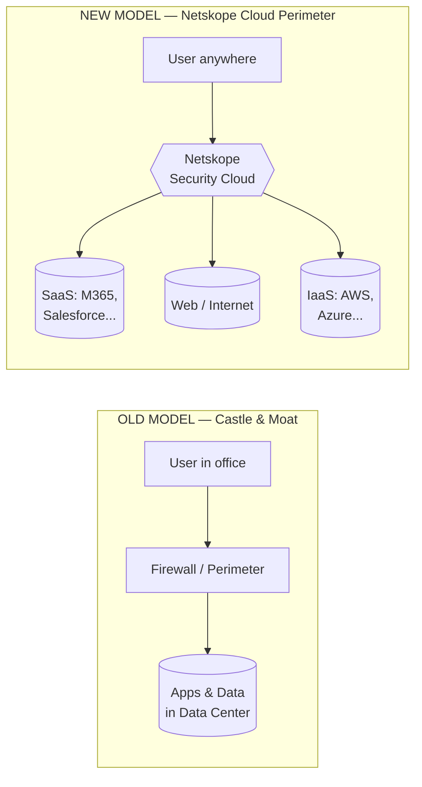
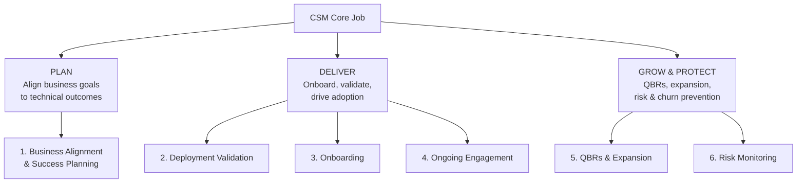
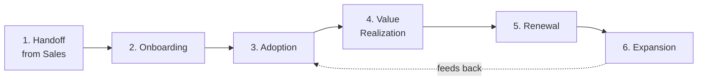

# Part A — Role & Company Context

> Section goal: Be able to confidently explain *what Netskope does*, *what a CSM does*, *how the CSM role differs from neighbouring roles*, and *the customer journey you'd own*. These are the "warm-up" questions almost every interview opens with — nail them and you set the tone.

Covers index items **1–4**.

---

## 1. About Netskope — The Story

### The one-line pitch
> Netskope is a **cloud security company** that protects data and users wherever they go — by moving security *into the cloud* instead of keeping it locked inside the corporate network.

### The core narrative (memorize this — it's in the JD almost word-for-word)
For decades, security worked like a **castle and moat**:
- All the important stuff (apps, data, users) lived **inside** the corporate office/data center.
- You built a strong wall (firewall) around the building. Anything inside = trusted. Anything outside = untrusted.
- This trusted boundary is called the **network perimeter**.

Then three things broke that model:
1. **Apps moved to the cloud** (Microsoft 365, Salesforce, Google Workspace, AWS) — the data is no longer inside your walls.
2. **Users moved out** (remote/hybrid work) — people work from home, cafés, airports.
3. **Data follows them everywhere** — on laptops, phones, personal devices, dozens of SaaS apps.

> **Result: "There's more data and users *outside* the enterprise than inside."** The wall now protects an empty castle. The perimeter has **dissolved**.

---

### 🔍 Plain-English deep-dive: the words behind the story

**What is a "network perimeter"?**
- A "**network**" is just computers connected together so they can share data. A company network connects all the office PCs, servers, and apps.
- The "**perimeter**" is the **boundary line** between *the company's private network* and *the public internet outside*. Everything inside the line was treated as trusted ("our people"); everything outside was untrusted ("strangers").
- **Analogy:** the perimeter is the **property fence** around your house. Inside the fence = family (trusted). Outside = the public street (untrusted).

**What is a "firewall"?**
- A **firewall** is the **security gate in that fence** — a device (or software) that checks network traffic and decides what's allowed in or out, based on rules.
- **Analogy:** the **guard at the front gate** who only lets approved people through.

**What is "the cloud" / a "data center"?**
- A "**data center**" is a building full of powerful computers (servers) that store data and run applications. A company used to keep its own data center *inside its own walls*.
- "**The cloud**" just means **someone else's data centers, rented over the internet** — Microsoft, Amazon, Google run huge data centers and let companies use them. "Moving to the cloud" = stop running your own servers in-house and use these internet-based ones instead.
- **Analogy:** owning a generator in your basement (own data center) vs. buying electricity from the power grid (the cloud). Same result, but you no longer own/maintain the machinery.

**What is "SaaS"?** (you'll hear this constantly)
- **SaaS = Software as a Service** = software you *use over the internet* instead of installing/running yourself. **Microsoft 365, OneDrive, SharePoint, Salesforce, Gmail** are all SaaS.
- The key point: with SaaS, **your company's data lives on the vendor's cloud servers, outside your old perimeter.** That's exactly why the old fence stopped working.

> **Putting it together in one breath:** "Companies used to keep all their apps and data inside their own building behind a firewall — that boundary was the *perimeter*. Now the apps live in the cloud (SaaS like Microsoft 365), and employees work from home, so the important stuff is *outside* the old fence. Guarding an empty building is pointless — so security has to move to where the data and users actually are: the cloud."

Netskope's answer: build a **new perimeter in the cloud** that **follows and protects the data wherever it goes**, instead of where the office used to be.

### Quick facts to drop naturally
- **Founded:** 2012. **Category:** market-leading cloud security / SSE vendor.
- **What they redefine:** "**Cloud, Network, and Data Security**" (their exact phrasing).
- **Global footprint:** Santa Clara (HQ), St. Louis, Bangalore, London, Paris, Melbourne, Taipei, Tokyo.
- **Core values:** **openness, honesty, transparency.**
- **Culture cue:** collaborative, fast-paced, high-growth. (AWON = Awesome Women of Netskope — shows you read the JD.)
- **Recognized as:** a **Leader in the Gartner Magic Quadrant for SSE** (good to mention; signals you researched the market).

> 💡 **Why this matters for a CSM:** You are the person who makes sure the customer actually *realizes* this promise — that their data really is protected wherever it goes. You translate the vision into outcomes the customer can see.

---

## 2. What a Customer Success Manager (CSM) Does

### The essence
> A CSM is the **post-sales owner of the customer relationship**, responsible for making sure the customer **adopts the product, gets real business value from it, stays (renews), and grows (expands)**.

Sales sells the *promise*. The CSM delivers the *proof*.

### The 4 outcomes a CSM is measured on
| Outcome | Plain-English meaning |
|---------|----------------------|
| **Adoption** | Are people actually *using* the product, and using the right features? |
| **Value realization** | Is the customer getting the *business result* they bought it for? |
| **Retention** | Will they *renew*? (Prevent churn.) |
| **Expansion** | Can they buy *more* (more users, more modules like DLP/ZTNA)? |

### Mapping to *this* JD (so you can speak their language)
The JD lists 6 responsibility areas — group them mentally into 3 buckets:

### Two phrases from the JD to internalize
- **"Single-threaded owner"** = *you* are the one accountable person for that customer's success. The buck stops with you; you coordinate everyone else (Sales, SE, Support, Product).
- **"Business value realization"** = don't just confirm the product *works technically*; prove it delivered the **business outcome** (e.g., "reduced data-exfiltration risk," "enabled secure hybrid work," "passed the compliance audit").

> 💡 **The technical CSM angle:** This is a *technical* CSM role. You're expected to understand the architecture (SSE/SASE), read telemetry/health checks, and validate deployments — not just send friendly check-in emails. This is exactly where your escalation-engineer background is an asset.

---

## 3. CSM vs TAM vs Support vs Sales Engineer

This is a **very common interview question** ("How do you see the difference between Support and Customer Success?"). Know it cold.

| Role | Primary question they answer | Reactive/Proactive | Owns the relationship? |
|------|------------------------------|--------------------|------------------------|
| **Support Engineer** (your current world) | "Something is broken — how do we fix *this case*?" | **Reactive** (ticket-driven) | No — owns the *issue* |
| **TAM** (Technical Account Manager) | "How do we keep this customer technically healthy day-to-day?" | Mostly proactive, technical | Partial — technical relationship |
| **CSM** (this role) | "Is the customer getting *business value* and will they *renew & grow*?" | **Proactive & strategic** | **Yes — owns the outcome** |
| **Sales Engineer (SE)** | "Can the product technically do what the customer needs?" (pre-sales) | Pre-sales, technical | No — owns the *technical sale* |
| **Account Executive (Sales)** | "What's the deal / commercial relationship?" | Pre-sales + renewal commercials | Owns the *contract* |

### The key contrast to say out loud
> "Support is **reactive and case-based** — you solve the problem in front of you and close the ticket. Customer Success is **proactive and relationship-based** — instead of waiting for a ticket, you watch telemetry and adoption trends to spot risk *before* it becomes a problem, and you're measured on whether the customer achieves their business goals and renews. My escalation background gives me the technical depth; the CSM role adds the proactive, outcome-ownership layer on top."

> 💡 **Your transition story:** You already do the *hard technical* part (deep troubleshooting, escalations, talking to frustrated enterprise customers). The CSM shift is moving from *"fix the broken thing"* to *"prevent problems and prove value."* Frame your move as **earning the right to be strategic** because you've mastered the technical foundation.

---

## 4. The Customer Success Lifecycle

The journey you own as a CSM — from the moment Sales closes the deal to renewal and beyond. **Memorize the stages and what happens in each.**

| Stage | What you do | JD link | Key metric |
|-------|-------------|---------|------------|
| **1. Handoff** | Capture business objectives, security priorities, success metrics, risks, stakeholders from Sales. | Resp. #1 | Clean handoff checklist |
| **2. Onboarding** | Get the platform deployed, validated, operational fast. Train the customer's team. | Resp. #2, #3 | **Time-to-Value (TTV)** |
| **3. Adoption** | Drive usage of the right features; monitor utilization; remove blockers. | Resp. #4 | Adoption / utilization rate |
| **4. Value Realization** | Prove the business outcomes via QBRs; show realized security value. | Resp. #5 | Business value scorecard |
| **5. Renewal** | Maintain health, mitigate risk early, prevent churn. | Resp. #6 | **GRR (Gross Retention)** |
| **6. Expansion** | Identify upsell/cross-sell (more users, more modules). | Resp. #5 | **NRR (Net Retention)** |

### The one sentence that ties it together
> "My job is to take a customer from *signed contract* to *measurable business value* as fast as possible, keep them healthy so they renew, and grow the relationship by aligning new Netskope capabilities to their evolving security needs."

---

### 🔍 Plain-English deep-dive: the Customer Success business words

These terms come up constantly in CSM interviews. Know them in plain language.

| Term | What it actually means | Everyday analogy |
|------|------------------------|------------------|
| **Churn** | A customer **leaves / cancels** (doesn't renew). The thing a CSM exists to prevent. | A gym member quitting. |
| **Retention** | Keeping customers (the opposite of churn). | Members renewing their membership. |
| **Adoption** | Customers **actually using** the product, and using the *right* features — not just paying for it and ignoring it. | Buying a gym membership *and* showing up to work out. |
| **Time-to-Value (TTV)** | How **fast** a new customer gets their first real benefit after buying. Shorter = better. | How quickly a new gym member sees results. |
| **Upsell / Expansion** | Selling the customer **more** — more user licenses, or extra modules (add DLP, add ZTNA). | A member upgrading to add personal training. |
| **Renewal** | The customer **signs up again** when the contract ends. | Renewing the yearly membership. |
| **QBR** (Quarterly Business Review) | A **formal meeting every 3 months** to show the customer the value they got and plan next steps. | A quarterly progress check-in with your trainer. |
| **GRR** (Gross Retention Rate) | % of revenue you **kept** from existing customers (ignoring any growth). Can't exceed 100%. | How many members *didn't quit*. |
| **NRR** (Net Retention Rate) | % of revenue from existing customers **including upsells**. Can exceed 100% if they buy more. | Members who stayed *and* upgraded. |
| **Single-threaded owner** | **One named person** fully accountable for a customer's success, who coordinates everyone else. | The one project manager whose job is "this customer succeeds." |

> 💡 You don't need the *formulas* (those are in **Part J**) — for now just know what each word means so you never freeze when an interviewer uses one.

---

## ⭐ Likely Interview Questions for This Section

**Q1. "What does Netskope do, in your own words?"**
> *Model answer:* "Netskope is a cloud security company. The old security model assumed everything important lived inside the corporate network, protected by a firewall — the perimeter. But apps moved to the cloud, users went remote, and data now lives everywhere outside that wall. Netskope builds a new security perimeter *in the cloud* that follows users and data wherever they go — inspecting traffic to web, SaaS, and cloud apps inline to protect against threats and data loss. They're a recognized leader in the SSE category."

**Q2. "How is Customer Success different from the Support work you do today?"**
> Use the reactive-vs-proactive contrast from Section 3. Emphasize: ticket-based fixing → proactive, telemetry-driven, outcome-owning. Highlight that your technical depth transfers and de-risks the move.

**Q3. "What do you think a CSM is responsible for / measured on?"**
> Adoption, value realization, retention (renewal), expansion. Mention being the **single-threaded owner** who coordinates Sales/SE/Support/Product around the customer's business outcomes.

**Q4. "Walk me through what happens after a customer signs."**
> Walk the lifecycle: handoff → onboarding (drive TTV) → adoption (monitor utilization) → value realization (QBRs) → renewal (health & risk) → expansion. Name a metric per stage.

**Q5. "Why do you want to move from Support to Customer Success / why Netskope?"**
> Tie your story: deep enterprise technical troubleshooting at Microsoft (OneDrive/SharePoint) + networking + identity fundamentals → natural fit for a *technical* CSM in SSE. You enjoy the customer relationship and want to work proactively on outcomes, not just reactively on tickets. Netskope's market leadership and the technical-CSM nature of the role match where you want to grow.

---

## 🧠 30-Second Memory Hooks
- **Netskope = "new perimeter in the cloud that follows the data."**
- **CSM = post-sales owner of Adoption → Value → Retention → Expansion.**
- **Single-threaded owner** = the one accountable person.
- **Support is reactive; CS is proactive.**
- **Lifecycle:** Handoff → Onboard → Adopt → Value → Renew → Expand.

---

*Next suggested section:* **Part B — Security Fundamentals** (gives you the vocabulary that everything else builds on), or jump to **Part C — SASE & SSE** if you want to tackle the core technical topic first.
