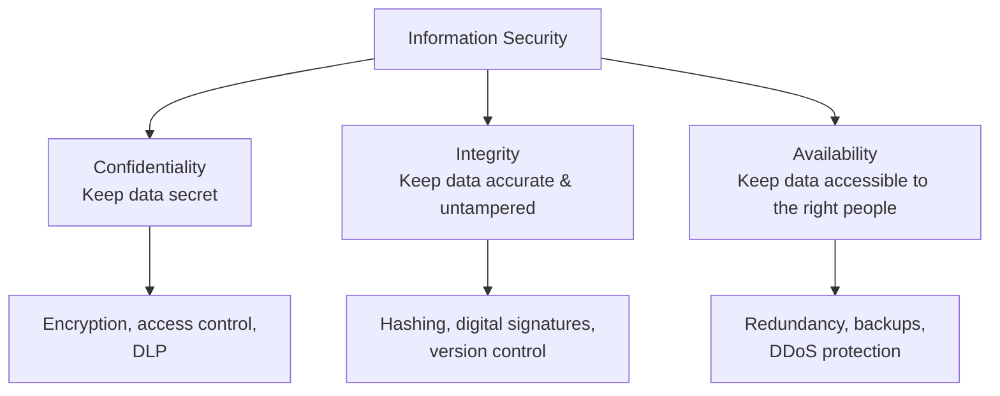
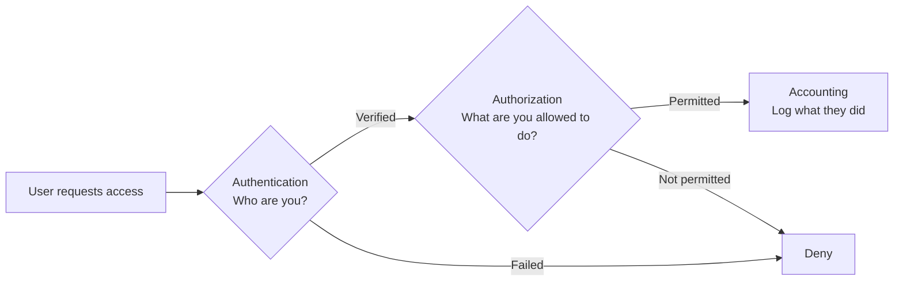
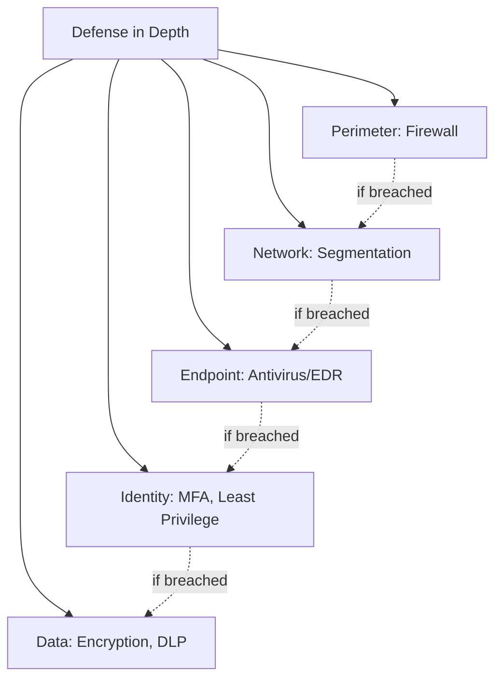
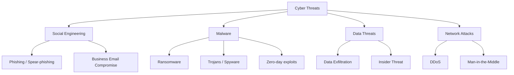
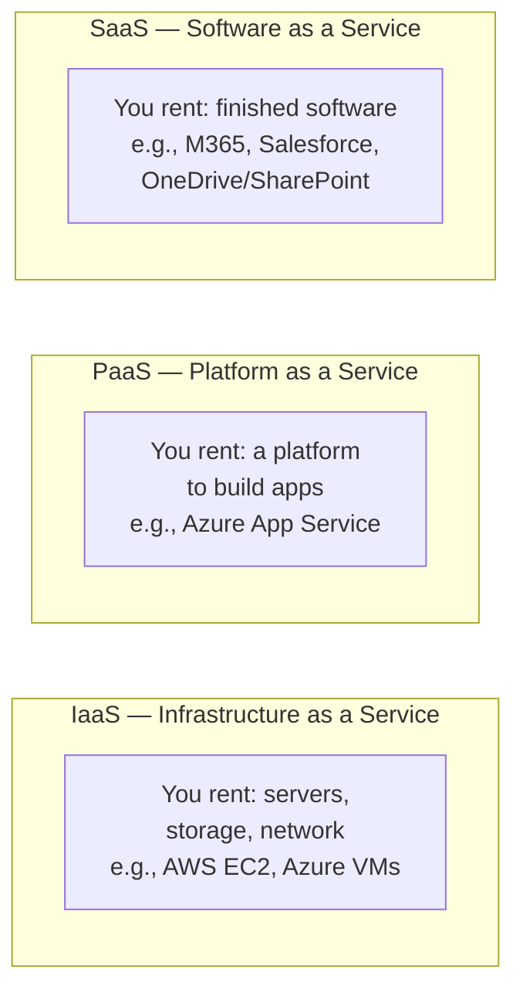
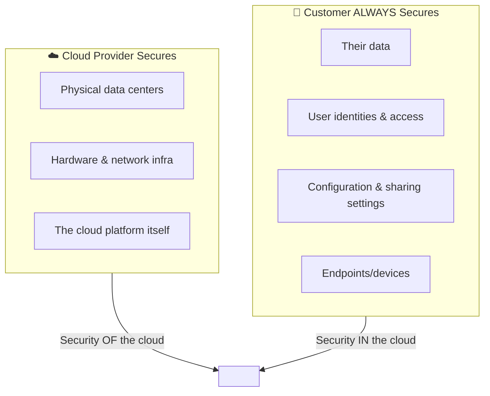
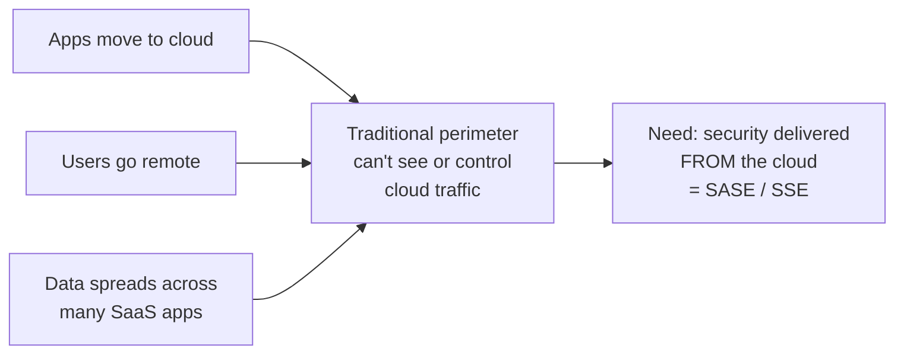

# Part B — Security Fundamentals

> Section goal: Build the **security vocabulary** that everything else in this prep stands on. If an interviewer asks "what do you mean by confidentiality / least privilege / shared responsibility?" you should answer in one clean sentence. These are the building blocks for SASE, SSE, CASB, and DLP later.

Covers index items **5–7**.

---

## 5. Core Security Concepts

### 5.1 The CIA Triad — the foundation of all security
Every security control exists to protect one or more of these three properties:

| Property | Plain-English meaning | Broken when... | Example control |
|----------|----------------------|----------------|-----------------|
| **Confidentiality** | Only authorized people can see the data. | A laptop is stolen and files are readable. | Encryption, DLP, access control |
| **Integrity** | Data isn't altered without authorization. | Malware changes a financial record. | Hashing, digital signatures |
| **Availability** | The data/service is up when needed. | Ransomware locks the files; a DDoS takes the site down. | Backups, redundancy, DDoS defense |

> 💡 **Netskope tie-in:** DLP protects **Confidentiality**, threat protection (anti-malware) protects **Integrity**, and a cloud-delivered, globally distributed network (NewEdge) supports **Availability**.

---

#### 🔍 Plain-English deep-dive: the security mechanisms named above

**Encryption** — *scrambling data so only the right person can read it.*
- It uses a secret "key" to turn readable data ("Hello") into unreadable gibberish ("X7$kp@"). Only someone with the matching key can unscramble it.
- **Why it matters:** if a laptop or file is stolen but it's encrypted, the thief just gets gibberish. Protects **Confidentiality**.
- **Analogy:** a locked safe — useless to anyone without the key.

**Hashing** — *a tamper-detector / digital fingerprint.*
- A "hash" runs data through a one-way math formula to produce a short fixed code (a fingerprint). The *same* input always gives the *same* fingerprint; **change even one character and the fingerprint changes completely.**
- Unlike encryption, it's **one-way** — you can't turn the fingerprint back into the original. It's not for hiding data; it's for **proving data wasn't altered**.
- **Why it matters:** compare the fingerprint before and after — if they match, the data is intact. Protects **Integrity**.
- **Analogy:** a wax seal on a letter — if it's broken/changed, you know someone tampered with it.

**MFA — Multi-Factor Authentication** — *proving who you are with more than just a password.*
- "Factors" are categories of proof: **something you know** (password), **something you have** (your phone / a code), **something you are** (fingerprint/face).
- MFA requires **two or more** of these. So even if a hacker steals your password, they still can't log in without your phone.
- **Why it matters:** stops the #1 attack — stolen passwords. You'll mention MFA constantly.
- **Analogy:** an ATM needs your card (have) *and* your PIN (know) — one alone isn't enough.

**DDoS — Distributed Denial of Service** — *overwhelming a service so it crashes.*
- Attackers flood a website/server with so much fake traffic (from thousands of hijacked computers) that it can't serve real users and goes down.
- **Why it matters:** attacks **Availability**.
- **Analogy:** a mob crowding a shop's doorway so real customers can't get in.

---

### 5.2 AAA — Authentication, Authorization, Accounting
How a system controls *who gets in and what they can do*.

| Term | Question it answers | Example |
|------|--------------------|---------| 
| **Authentication (AuthN)** | "Who are you?" | Username + password + MFA |
| **Authorization (AuthZ)** | "What are you allowed to do?" | You can read but not delete |
| **Accounting (Auditing)** | "What did you actually do?" | Logs, audit trail |

> ⚠️ **Don't confuse AuthN vs AuthZ** — this is a classic gotcha. *AuthN = identity, AuthZ = permissions.* We go deeper in **Part E**.

---

### 5.3 Key principles to name-drop
| Principle | Meaning | One-liner |
|-----------|---------|-----------|
| **Defense in Depth** | Multiple layers of security, so one failure doesn't = breach. | "Like a castle with a moat *and* walls *and* guards." |
| **Least Privilege** | Give users the *minimum* access they need, nothing more. | "Interns don't get admin rights." |
| **Zero Trust** | Never trust by default — verify *every* request, even from "inside." | "Never trust, always verify." |
| **Principle of Need-to-Know** | Access data only if your job requires it. | Even with clearance, you only see what you need. |
| **Separation of Duties** | No single person controls an entire critical process. | The person who requests a payment can't also approve it. |

> 💡 **Netskope tie-in:** Zero Trust + Least Privilege are the philosophy behind **ZTNA** (Zero Trust Network Access), one of the SSE pillars in Part C.

---

## 6. The Modern Threat Landscape

What CSMs help customers defend against. Know the *categories* and a one-line description of each.

| Threat | What it is | Why it matters to a cloud-security buyer |
|--------|-----------|------------------------------------------|
| **Phishing** | Tricking a user into revealing credentials or clicking a malicious link. | #1 entry point for breaches. SWG blocks malicious sites. |
| **Ransomware** | Malware that encrypts data and demands payment. | Threat protection + sandboxing catch it inline. |
| **Malware (general)** | Malicious software (trojans, spyware, worms). | Netskope scans traffic for malware in real time. |
| **Zero-day** | An exploit for a vulnerability with no patch yet. | Sandboxing & ML detect unknown threats. |
| **Data Exfiltration** | Sensitive data leaving the org (intentionally or not). | **DLP** is the direct control. |
| **Insider Threat** | A legitimate user misusing access (malicious or careless). | UEBA / DLP / least privilege. |
| **Shadow IT** | Employees using unsanctioned apps (e.g., personal Dropbox). | **CASB** discovers and controls this. |
| **Account Compromise** | Attacker steals valid credentials. | MFA + Zero Trust + anomaly detection. |

> 💡 **From your world:** A user uploading a sensitive SharePoint file to a personal Google Drive = **data exfiltration via Shadow IT**. That's a textbook Netskope CASB+DLP use case — a great example to mention.

---

#### 🔍 Plain-English deep-dive: the less-obvious threat terms

**Phishing vs Spear-phishing**
- **Phishing** = mass fake messages ("Your account is locked, click here") sent to thousands, hoping a few fall for it and hand over passwords.
- **Spear-phishing** = a *targeted*, personalized version aimed at one specific person (e.g., a fake email pretending to be *your* CEO, using your real name). More convincing, more dangerous.

**BEC — Business Email Compromise** — *fraud using a trusted email identity.*
- Attacker gets into (or convincingly fakes) a real business email account — often a finance person or executive — and uses that trust to **trick staff into wiring money or sharing data**.
- **Analogy:** a con artist wearing a real employee's uniform to walk past security.

**MITM — Man-in-the-Middle** — *secretly intercepting a conversation.*
- The attacker sits **between** you and the website, silently reading or altering the data passing through (common on unsecured public Wi-Fi).
- **Analogy:** a postal worker steaming open your letters, reading them, resealing, and passing them on — you never notice.
- **Defense:** encryption (HTTPS/TLS) — if the data is scrambled, the middleman only sees gibberish.

**Insider Threat** — *the danger comes from inside.*
- A legitimate employee/contractor misuses their access — either **maliciously** (stealing data before quitting) or **carelessly** (accidentally emailing a sensitive file to the wrong person).
- **Why it matters:** firewalls don't help — the person is already "inside." DLP and least privilege do.

**Zero-day** — *an attack with no patch yet.*
- "Day zero" = the vendor has had **zero days** to fix a newly discovered vulnerability. Until a patch exists, normal defenses that rely on known signatures may miss it.
- **Defense:** sandboxing and ML/behavioral detection that spot *suspicious behavior* rather than a known fingerprint.

---

## 7. Cloud Computing & Cloud Security Basics

### 7.1 The three cloud service models

| Model | You manage | Provider manages | Example |
|-------|-----------|------------------|---------|
| **IaaS** | OS, apps, data | Hardware, virtualization | AWS EC2, Azure VMs |
| **PaaS** | Apps, data | OS, runtime, hardware | Azure App Service, Heroku |
| **SaaS** | Just your data & users | Everything else | **Microsoft 365 / OneDrive / SharePoint**, Salesforce |

> 💡 **Pizza analogy** (memorable for interviews): IaaS = you get the kitchen; PaaS = you get the kitchen + ingredients; SaaS = pizza delivered, you just eat.

---

### 7.2 The Shared Responsibility Model — **critical concept**
The single most important cloud-security idea. The cloud provider secures *some* things; the **customer is always responsible for their own data and access**.

> **The classic line:** *"The provider secures the cloud; the customer secures what they put **in** the cloud."*

- Microsoft secures the M365 *infrastructure*. **You** are responsible for who you *share* a SharePoint file with, and whether sensitive data leaks.
- This **gap is exactly where Netskope lives** — giving the customer visibility and control over *their* data and usage across all cloud apps.

> 💡 **Powerful interview point:** "Most cloud breaches aren't the provider's fault — they're **misconfigurations** and **data-handling mistakes** on the customer side of the shared responsibility model. That's the gap Netskope's CASB and DLP close."

---

### 7.3 Why cloud changed security (the bridge to Part C)

This is the natural lead-in to **Part C (SASE & SSE)** — the cloud broke the old model, so security had to move to the cloud too.

---

## ⭐ Likely Interview Questions for This Section

**Q1. "What is the CIA triad?"**
> Confidentiality (only authorized people see data), Integrity (data isn't tampered with), Availability (it's there when needed). Every control maps to one of these.

**Q2. "What's the difference between authentication and authorization?"**
> Authentication = *who you are* (verifying identity, e.g., password + MFA). Authorization = *what you're allowed to do* (permissions). AuthN comes first, then AuthZ.

**Q3. "Explain the shared responsibility model."**
> The provider secures the cloud infrastructure ("security *of* the cloud"); the customer secures their own data, identities, and configuration ("security *in* the cloud"). Most breaches happen on the customer side — misconfiguration and data leakage — which is where Netskope adds value.

**Q4. "What's the difference between SaaS, PaaS, and IaaS?"**
> Use the table / pizza analogy. SaaS = finished software (M365); PaaS = platform to build on; IaaS = raw infrastructure (VMs). The more "as-a-service," the less the customer manages.

**Q5. "What are the biggest threats enterprises face today?"**
> Phishing (top breach entry point), ransomware, data exfiltration, insider threat, and shadow IT. Tie each to a Netskope control (SWG, threat protection, DLP, CASB).

**Q6. "What is Zero Trust?"**
> "Never trust, always verify." No user or device is trusted by default just because it's "inside" the network — every request is authenticated, authorized, and inspected. It's the philosophy behind ZTNA.

---

## 🧠 30-Second Memory Hooks
- **CIA** = Confidentiality, Integrity, Availability.
- **AAA** = Authentication (who?), Authorization (what can you do?), Accounting (what did you do?).
- **Least Privilege** = minimum access needed.
- **Zero Trust** = never trust, always verify.
- **Shared Responsibility** = provider secures the cloud, customer secures what's *in* it.
- **Service models** = IaaS (infra) → PaaS (platform) → SaaS (software). Pizza analogy.
- **Top threats** = phishing, ransomware, exfiltration, insider, shadow IT.

---

*Next suggested section:* **Part C — SASE & SSE** (the heart of the role — now you have all the vocabulary you need for it).
