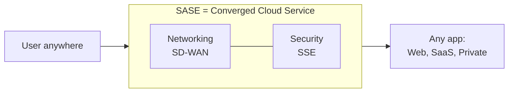
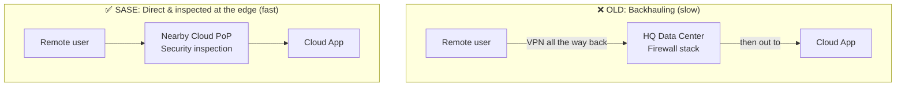
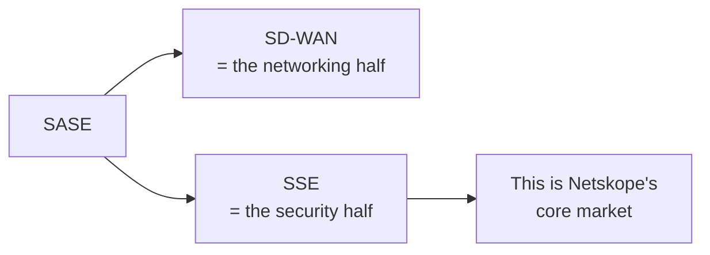
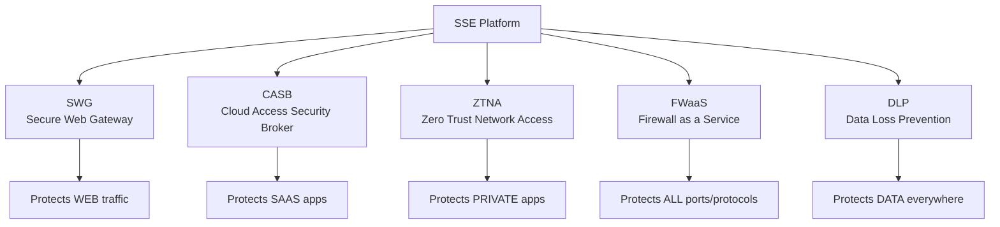
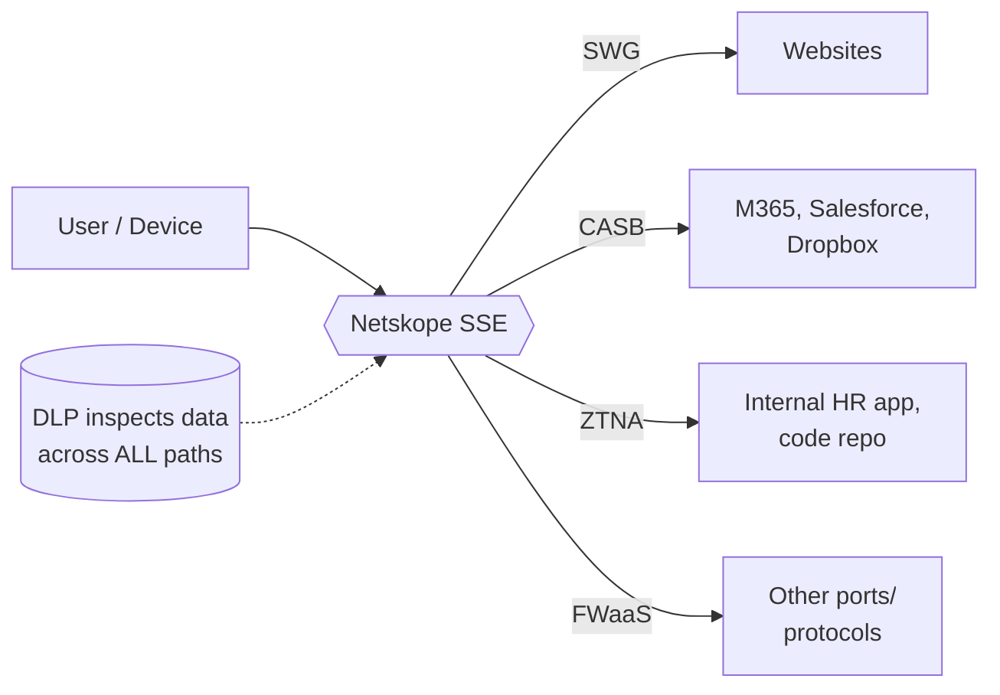
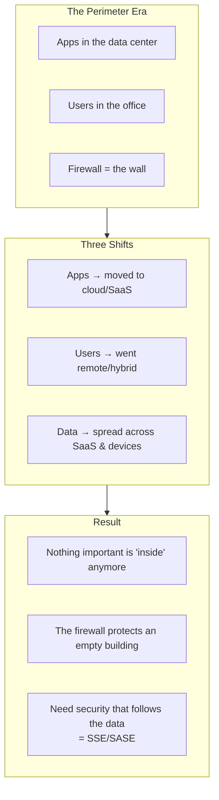
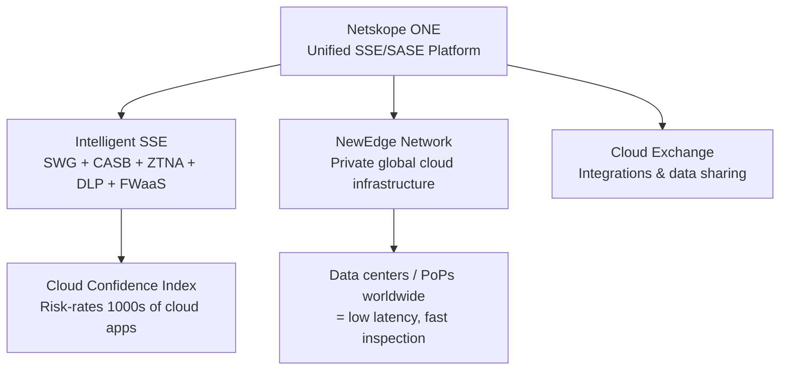

# Part C — SASE & SSE (The Heart of the Role)

> Section goal: This is **the** technical topic for a Netskope CSM. If you can confidently explain SASE, SSE, the five pillars, and *why the perimeter dissolved*, you've covered the majority of the technical bar. Take your time here — everything in Parts D–H is a deeper zoom into one of these pillars.

Covers index items **8–12**.

---

## 8. What is SASE (Secure Access Service Edge)

**Pronounced "sassy."** Coined by Gartner in 2019.

### The one-line definition
> **SASE = Networking + Security, both delivered together from the cloud, as a single service, close to the user.**

It **converges** two things that used to be separate:

### The two halves of SASE
| Half | What it does | Key technology |
|------|-------------|----------------|
| **Networking half** | Connect users to apps *efficiently* (fast, optimized routing). | **SD-WAN** (Software-Defined WAN) |
| **Security half** | Inspect & protect that traffic. | **SSE** (Security Service Edge) |

> **Simple formula to memorize:**
> ## **SASE = SD-WAN + SSE**

---

### 🔍 Plain-English deep-dive: what do these words actually mean?

**What is a "WAN"?**
- **LAN** = Local Area Network = the network *inside one building* (your office Wi-Fi, the cables connecting desks). "Local" = one location.
- **WAN** = Wide Area Network = the network that *connects multiple locations together* over long distances. If a company has offices in Delhi, London, and New York, the WAN is what links them all (and links them to the internet/data center).
- Think of it like roads: a LAN is the streets *inside* a town; a WAN is the *highways* connecting towns.

**What is "SD-WAN" (Software-Defined WAN)?**
- Traditionally, those highways between offices were expensive dedicated leased lines (called **MPLS**), and changing how traffic flowed meant a technician reconfiguring physical hardware at each site.
- **SD-WAN** makes the WAN **software-controlled**. Instead of fixed physical routes, software decides — in real time — the best path for each piece of traffic (e.g., "send video calls over the fast link, send backups over the cheap link").
- **In one line:** *SD-WAN = using software (not manual hardware setup) to intelligently steer network traffic between locations and to the cloud, choosing the fastest/cheapest path automatically.*
- **Why it matters for SASE:** SD-WAN is the "get the traffic there efficiently" part. It's the smart traffic-routing layer.

> 💡 You will **not** be tested deeply on SD-WAN for an SSE-focused CSM role — Netskope's core is the *security* (SSE) half. Just know SD-WAN = smart, software-driven network routing between sites and cloud.

**What is "SSE" (Security Service Edge)?**
- It's the bundle of **security checks** applied to traffic *as it travels* to its destination. Before your data reaches a website or cloud app, it passes through these cloud-based security services that inspect it for threats and data leaks.
- **In one line:** *SSE = the cloud-delivered security inspection layer — the "airport security checkpoint" every piece of traffic passes through on its way to the internet or cloud apps.*

**What does "Edge" mean here? (the confusing word)**
- "Edge" = the **outer boundary of a network where it meets the outside world** — and in cloud terms, a location *physically near the user*.
- Cloud providers run many small data centers spread around the world, called **Points of Presence (PoPs)**. A PoP near you is an "edge" location.
- **Why it matters:** if you're in Bangalore and the security checkpoint is also in Bangalore (the "edge"), your traffic gets inspected and on its way in milliseconds. If the only checkpoint were in a data center in the USA, your traffic would have to travel across the planet and back first — slow.
- **In one line:** *"Edge" = doing the security work at a location close to the user, instead of in one faraway central data center.*

> 🍔 **Analogy for the whole thing:** Imagine airport security. The *old way* was one giant security checkpoint in a single city — everyone in the country had to fly *there first* to be screened, then fly back out to their real destination (slow, ridiculous). **SASE/edge** puts a security checkpoint in *every* airport, near every traveler. SD-WAN is the smart system deciding which flights (traffic) take which routes; SSE is the security screening itself.

### Why "Edge"? (summary)
Security/networking is delivered at the **edge** of the cloud — at points of presence (PoPs) **physically close to the user** — instead of forcing traffic back to a central data center. Closer = faster.

### The old way vs SASE — "hairpinning / backhauling"

> 💡 **The pain SASE solves:** Old VPNs forced a remote user's traffic to travel *all the way back* to HQ for security inspection, then back out to the cloud app — slow and inefficient ("hairpinning" or "backhauling"). SASE inspects traffic at a nearby cloud point-of-presence, so it's secure *and* fast.

---

## 9. What is SSE (Security Service Edge)

### The one-line definition
> **SSE is the *security half* of SASE** — the set of cloud-delivered security services that protect access to web, cloud, and private apps. Gartner split it out as its own category in 2021.

> ⭐ **This is the category Netskope leads** (Gartner Magic Quadrant for SSE Leader). When the JD says "SSE/SASE architectures," *this* is the center of gravity.

### SASE vs SSE in one breath
> "SASE is the full vision — networking *and* security from the cloud. SSE is specifically the **security** portion of SASE. Netskope is a leader in SSE."

---

## 10. The SSE Pillars (SWG, CASB, ZTNA, FWaaS, DLP)

SSE is made of a few converged security services. **Memorize these — they're the backbone of every Netskope conversation.**

| Pillar | Protects... | In one sentence | "Replaces" the old... |
|--------|-------------|-----------------|----------------------|
| **SWG** (Secure Web Gateway) | The **web/internet** | Inspects web traffic; blocks malicious/inappropriate sites & threats. | Web proxy / URL filter |
| **CASB** (Cloud Access Security Broker) | **SaaS / cloud apps** | Visibility & control over sanctioned *and* unsanctioned cloud apps (M365, Salesforce, shadow IT). | Manual SaaS controls |
| **ZTNA** (Zero Trust Network Access) | **Private / internal apps** | Gives remote users access to *specific* internal apps — never the whole network. | Legacy VPN |
| **FWaaS** (Firewall as a Service) | **All ports & protocols** | Cloud-delivered firewall for non-web traffic too. | Hardware branch firewall |
| **DLP** (Data Loss Prevention) | **Sensitive data** | Detects & stops sensitive data from leaking — works *across* the other pillars. | On-prem DLP appliance |

---

### 🔍 Plain-English deep-dive: each pillar explained for a non-networking person

**1. SWG — Secure Web Gateway** → *protects general web browsing*
- A "**gateway**" is just a checkpoint your traffic passes through to get somewhere. A "web gateway" is the checkpoint for **websites/internet browsing**.
- It checks every website you try to visit: *Is this site malicious? Does it contain malware? Is it a category we block (gambling, adult content)? Is someone uploading a sensitive file to it?*
- **Everyday analogy:** a **content filter + virus scanner for the whole internet**, sitting between you and every website.
- **Replaces:** the old hardware "web proxy" box that used to sit in the office.

**2. CASB — Cloud Access Security Broker** → *protects your SaaS/cloud apps*
- A "**broker**" sits in the middle of two parties and controls what passes between them. A CASB sits between **your users** and **cloud apps** (Microsoft 365, Salesforce, Dropbox, Google Drive).
- It gives you two things you otherwise can't see: **(a) which cloud apps your employees are using** (including unapproved "shadow IT" ones), and **(b) control over what they do inside those apps** (e.g., "you can download from the company OneDrive, but not from a personal one").
- **Everyday analogy:** a **security guard standing between your staff and every cloud app**, checking IDs and what files move in/out.
- (Full deep-dive in **Part F**.)

**3. ZTNA — Zero Trust Network Access** → *protects private/internal apps*
- "**Private apps**" = internal tools a company runs for itself that aren't on the public internet (an internal HR portal, a finance system, a developer code repository).
- Old way: a **VPN** let a remote employee "dial in" and become part of the whole internal network — like giving someone a master key to the entire building just so they can reach one office.
- **ZTNA** instead gives access to **only the one specific app** the person is allowed to use, and **re-checks every time** (who are you, is your device healthy, are you allowed). Never trust automatically.
- **Everyday analogy:** instead of a master key to the building (VPN), you get a **one-time escorted visit to exactly one room** (ZTNA).
- **In one line:** *ZTNA = give users access to specific internal apps, not the whole network, and verify every single request.*

**4. FWaaS — Firewall as a Service** → *protects everything else (all ports & protocols)*
- A "**firewall**" is a barrier that decides which network traffic is allowed in/out based on rules. Traditionally it was a physical box in each office.
- "**Ports & protocols**": think of an IP address as a building and **ports** as numbered doors on it — web traffic uses door 443, email uses other doors, etc. SWG mainly watches the "web" doors; a firewall watches **all** the doors.
- **FWaaS** delivers that firewall **from the cloud** instead of as hardware, so even small branch offices and remote users get full firewall protection without buying appliances.
- **Everyday analogy:** a **cloud-based bouncer checking every door of the building**, not just the front entrance.

**5. DLP — Data Loss Prevention** → *protects the sensitive data itself*
- The other four pillars protect **paths** (web, SaaS, private apps, all ports). DLP protects the **data** that travels *along* those paths.
- It inspects content for **sensitive information** — credit-card numbers, passport/PAN numbers, health records, confidential documents — and **blocks or alerts** when someone tries to send it somewhere it shouldn't go.
- **Everyday analogy:** an **X-ray scanner that reads the *contents* of every package** leaving the building and stops the ones containing secrets.
- Because it works *across* all the other pillars, DLP is often called a "cross-cutting" service. (Full deep-dive in **Part G**.)

> 💡 **The big idea, in plain words:** Old-school companies bought **five separate hardware boxes** from five vendors to do these five jobs, and stitched them together. SSE delivers **all five as one cloud service**, inspecting your traffic **once** and applying every protection consistently. That's the "convergence" interviewers love to hear about.

### How they fit together (one user, one platform)

> 💡 **Key insight to say out loud:** "The power of SSE isn't any single feature — it's that **one platform, one inspection point** covers web, SaaS, and private apps, with DLP and threat protection applied consistently across all of them. The customer no longer stitches together five separate point products."

### Memory device for the pillars
**"Some Cats Zealously Fight Danger"** → **S**WG, **C**ASB, **Z**TNA, **F**WaaS, **D**LP.
Or remember by *what each protects*: **Web, SaaS, Private apps, All-ports, Data.**

---

## 11. Why the Network Perimeter Dissolved (The Core Narrative)

This connects back to Part A — but now you can explain it *technically*. Expect to be asked: **"Why do customers need SASE/SSE at all?"**

### The argument in 4 sentences (rehearse this)
1. The old model trusted everything *inside* the network perimeter and put a firewall around it.
2. But apps moved to the cloud, users went remote, and data now lives everywhere — so there's **more data and users outside the enterprise than inside**.
3. Backhauling all that traffic to a central firewall is slow, expensive, and blind to cloud/SaaS context.
4. So security had to **move to the cloud** and **follow the user and data** — that's SASE, and its security core is SSE.

> 💡 This is **the exact thesis in Netskope's own JD intro.** If you can deliver this cleanly, you've shown you *get* the company.

---

## 12. Netskope Platform Overview

You don't need deep product depth for a CSM interview, but knowing the **names** shows you did your homework.

| Component | What it is | Why it matters |
|-----------|-----------|----------------|
| **Netskope ONE** | The unified platform branding tying all services together. | "One platform, one console, one policy engine." |
| **Intelligent SSE** | The converged security services (the 5 pillars). | The core product you'd help customers adopt. |
| **NewEdge** | Netskope's **privately-owned global network** of data centers / points of presence. | A differentiator — they own the network, so inspection is *fast* (low latency) and reliable. Often a competitive talking point. |
| **Cloud Confidence Index (CCI)** | A database that risk-rates 60,000+ cloud apps. | Powers CASB / shadow IT discovery (Part F). |
| **Cloud Exchange** | Integration framework to share Netskope telemetry with other tools (SIEM, etc.). | Shows the platform plays well with a customer's ecosystem. |

> 💡 **NewEdge is a favorite differentiator** — Netskope *built and owns* its global network rather than renting public cloud capacity, which they argue gives better performance and a better user experience. Good to mention when an interviewer asks "what makes Netskope different?"

---

## ⭐ Likely Interview Questions for This Section

**Q1. "What is SASE?"**
> "Secure Access Service Edge — the convergence of networking (SD-WAN) and security (SSE), delivered together from the cloud, close to the user. Formula: **SASE = SD-WAN + SSE.** It replaces the old model of backhauling traffic to a central data center."

**Q2. "What is SSE and how is it different from SASE?"**
> "SSE is the *security half* of SASE — the cloud-delivered security services (SWG, CASB, ZTNA, FWaaS, DLP). SASE is the bigger picture that also includes the networking/SD-WAN side. Netskope is a recognized leader in SSE."

**Q3. "What are the main components/pillars of SSE?"**
> SWG (web), CASB (SaaS), ZTNA (private apps), FWaaS (all ports), DLP (data). Name what each protects. Emphasize convergence: one platform, one inspection point.

**Q4. "Why do organizations need SASE/SSE — what problem does it solve?"**
> Deliver the "perimeter dissolved" argument (Section 11): apps to cloud, users remote, data everywhere → backhauling is slow and blind → security moved to the cloud to follow the data.

**Q5. "How does ZTNA differ from a traditional VPN?"**
> VPN puts you *on the network* (broad access — risky if credentials are stolen). ZTNA gives access to *specific applications only*, verifying identity and context per request — never trust, always verify, least privilege. (Deep dive in Part E.)

**Q6. "What makes Netskope different from competitors?"**
> Single converged platform (Netskope ONE), the privately-owned **NewEdge** network for performance, deep **data-context/DLP** heritage, and the Cloud Confidence Index for app risk. Leader in the Gartner MQ for SSE.

---

## 🧠 30-Second Memory Hooks
- **SASE = SD-WAN + SSE** (networking + security from the cloud, at the edge).
- **SSE = the security half of SASE** = Netskope's home turf.
- **5 pillars:** SWG (web), CASB (SaaS), ZTNA (private apps), FWaaS (all ports), DLP (data).
- **Why SASE:** apps→cloud, users→remote, data→everywhere ⇒ perimeter dissolved ⇒ backhauling is slow ⇒ move security to the cloud.
- **Netskope names:** Netskope ONE (platform), Intelligent SSE (services), **NewEdge** (their private global network), CCI (app risk ratings).
- **ZTNA ≠ VPN:** app-level access, not network-level.

---

*Next suggested section:* **Part D — Networking** (your strength — refresh TCP/IP, proxies, TLS inspection, and traffic steering so you can speak to *how* traffic actually gets to Netskope), or **Part E — Identity & Access** to go deep on ZTNA/Zero Trust.
