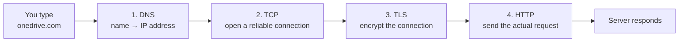
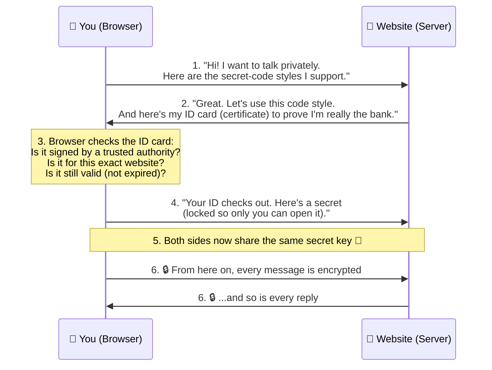
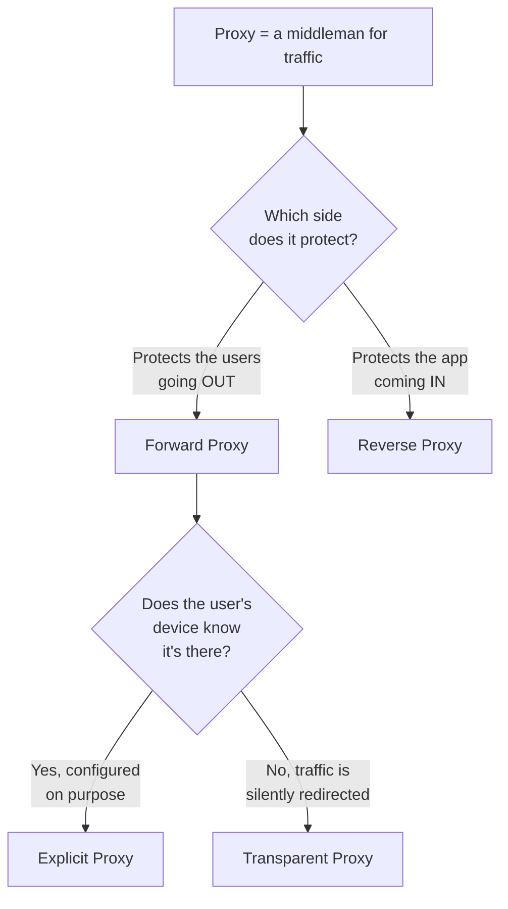
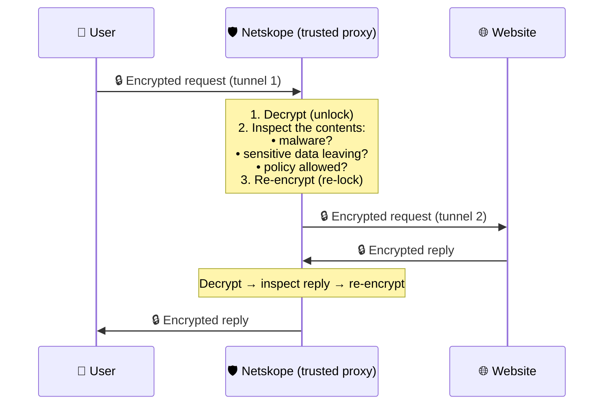
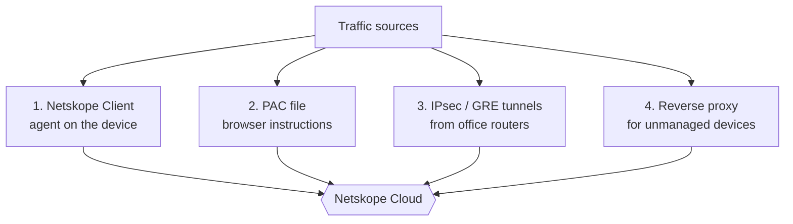
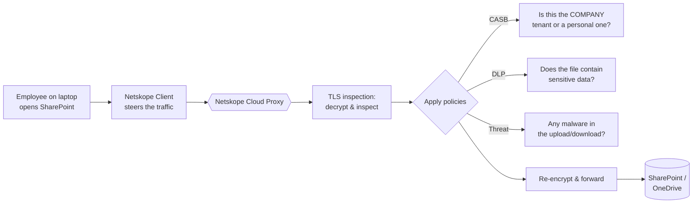

# Part D — Networking (Your Strength — Tie It In)

> Section goal: You already know networking fundamentals — this section sharpens them into the *specific* networking story Netskope cares about: **how does a user's traffic actually reach Netskope's cloud, get inspected, and continue to the app?** This is where your background becomes a genuine advantage. We keep every concept beginner-friendly so you can also *explain* it to a non-technical stakeholder (a core CSM skill).

Covers index items **13–16**.

---

## 13. TCP/IP, DNS, HTTP/HTTPS, TLS — The Refresher

You know these, so this is a *fast* refresher framed around **why each one matters to Netskope**.

### 13.1 The journey of a web request (the big picture)

> 💡 **Why this matters for Netskope:** Netskope inserts itself **into this journey** — it becomes a checkpoint between steps 2–4, so it can see and control the traffic. To explain *how*, you need to be comfortable with each step.

> 🧭 **One analogy for the whole journey (sending a parcel to a friend):**
> - **DNS** = looking up your friend's *address* from their name.
> - **TCP/IP** = the *postal system* that splits the parcel into boxes, labels them, and guarantees they all arrive in order.
> - **TLS** = putting everything in a *locked, tamper-proof crate* so no one can peek on the way.
> - **HTTP** = the actual *letter inside* saying what you want ("please send me your photos").
> Keep this picture in mind and the four terms below will feel obvious.

---

### 13.2 IP addresses — *the postal addresses of the internet*
- Every device on a network has an **IP address** (e.g., `140.82.112.3`) — a unique number that says *where* it is, so data knows where to go.
- **Analogy:** a street address on an envelope. Without it, the mail (data) can't be delivered.

### 13.3 TCP/IP — *the delivery system that doesn't lose pages*
- **IP** handles *addressing and routing* (getting a packet to the right place). **TCP** handles *reliability* (making sure all the pieces arrive, in order, with none missing).
- Big data is broken into small **packets**, sent separately, and reassembled at the other end. TCP re-requests any lost packet.
- **Analogy:** mailing a 300-page book by sending each page in its own envelope. IP writes the address; TCP numbers the pages and checks that all 300 arrived, asking for re-sends if any go missing.
- **The "handshake":** before sending data, TCP does a quick 3-step "hello" (SYN → SYN-ACK → ACK) to set up the connection. *(You know this — just be ready to name it.)*

### 13.4 DNS — *the internet's phone book*
- Humans remember names (`onedrive.com`); computers need numbers (IP addresses). **DNS (Domain Name System)** translates the name into the number.
- **Analogy:** looking up a contact's name in your phone to get their number before calling.
- **Why it matters for security:** DNS is also a *control point* — you can block known-bad domains at the DNS level before a connection is even made. (Netskope offers DNS-based security too.)

### 13.5 HTTP & HTTPS — *the language of the web (and the lock)*
- **HTTP (HyperText Transfer Protocol)** = the language browsers and web servers use to request and send pages.
- **HTTPS** = HTTP **+ Secure**. The "S" means the conversation is **encrypted** so nobody in the middle can read it. The padlock icon in your browser = HTTPS.
- **Analogy:** HTTP is a postcard (anyone handling it can read it); HTTPS is a sealed, locked envelope.

### 13.6 TLS — *the technology that creates the lock*
- **TLS (Transport Layer Security)** is the actual mechanism that encrypts an HTTPS connection. (You may hear "SSL" — that's the old name for the same idea; TLS is the modern version. People still say "SSL" out of habit.)
- In one sentence: **TLS is how your browser and a website agree on a secret code so that nobody in between can read what they say to each other.**

#### The TLS handshake — told as a simple story
Imagine you (the browser) walk up to a bank teller (the website) and want to have a *private* conversation that nobody waiting in line can overhear. Here's what happens, step by step:

**What each step means in plain words:**
1. **"Client Hello"** — your browser says hello and lists the encryption methods it understands.
2. **"Server Hello" + certificate** — the website picks a method and sends its **digital certificate** (its ID card).
3. **Certificate check** — your browser verifies that ID card is genuine: signed by a trusted authority, issued to *this* website, and not expired. *(This is what the padlock icon means — the check passed.)*
4. **Key exchange** — your browser and the website securely agree on a shared secret key that only the two of them know.
5. **Shared secret established** — both sides now hold the same key.
6. **Encrypted conversation** — everything from now on is scrambled with that key, so anyone listening hears only gibberish.

- **Analogy:** two people meet, check each other's ID, agree on a secret code language, *then* start the real conversation — so eavesdroppers hear only nonsense.

**What is a "certificate" and a "Certificate Authority (CA)"?**
- A **certificate** is a website's digital ID card. It says "I am `onedrive.com`" and is stamped by a trusted third party.
- A **Certificate Authority (CA)** is that trusted third party (companies like DigiCert) — the "passport office" of the internet. Your browser/computer ships with a built-in list of CAs it trusts. If a website's certificate is signed by one of them, the browser trusts it. If not, you get a scary "Not Secure" warning.
- **Why this matters later:** for Netskope to inspect encrypted traffic (Section 14.3), the company makes its devices trust **Netskope as a CA** — that's the trick that lets inspection happen without warnings.

> ⚠️ **The big challenge this creates:** roughly **95% of web traffic is now encrypted (HTTPS/TLS)**. Great for privacy — but it means security tools **can't see inside** the traffic to check for malware or leaking data. *Everything looks like a sealed, identical envelope.* This is the single biggest reason **SSL/TLS inspection** (Section 14) exists — and it's a concept you'll almost certainly be asked about.

---

## 14. Proxies & TLS/SSL Inspection

### 14.1 What is a "proxy"? — *a middleman for your traffic*
- A **proxy** is a server that sits **between you and the internet**. Instead of talking to a website directly, your traffic goes *to the proxy first*, which then talks to the website on your behalf and passes the answer back.
- **Why use one?** Because while traffic passes *through* the proxy, you can **inspect it, filter it, log it, and apply security policies.** A proxy is a natural checkpoint.
- **Analogy:** a mailroom that opens, inspects, and logs all incoming/outgoing packages before passing them along.

> 💡 **Netskope is fundamentally a cloud proxy.** Its core job is to sit in the middle of your traffic (in the cloud) and inspect it. Understanding proxies = understanding how Netskope works.

### 14.2 The main types of proxy — *the same idea, different setups*

People often only mention "forward" and "reverse," but there are a few important flavours. Here's the full picture in plain language. The first split is **which side it protects**; the second split is **whether the user knows it's there**.

#### A. Forward Proxy — *guards the people going out*
- Sits in front of **your users** and controls/inspects their traffic **as it leaves** toward the internet and cloud apps.
- **Analogy:** the mailroom that screens everything *employees send out* of the building.
- This is the most common mode for **SWG and inline CASB**.

#### B. Reverse Proxy — *guards the door of a specific app*
- Sits in front of **an application/server** and controls traffic **coming in** to it — even from devices you don't manage.
- **Analogy:** the security desk at the entrance of *one specific building*, checking everyone who wants in.
- Netskope uses this for **agentless control of SaaS apps** (e.g., a personal phone logging into company Microsoft 365 — Netskope inserts itself at login time).

#### C. Explicit Proxy — *the device is TOLD to use it*
- A **forward proxy that the device is deliberately configured to use.** The browser/OS has a setting (or a **PAC file**) that says "send traffic to this proxy at this address."
- The user/device **knows** the proxy is there because it was set up on purpose.
- **Analogy:** you're given written instructions: "for outgoing mail, always drop it at the mailroom on floor 2 first."
- **Pro:** precise control. **Con:** something has to be configured on each device.

#### D. Transparent Proxy — *the device DOESN'T know it's there*
- A proxy that **silently intercepts** traffic without any setting on the device. The network quietly redirects traffic through it. Also called an "inline" or "intercepting" proxy.
- **Analogy:** without telling you, the building secretly routes *all* outgoing mail past the mailroom — you never changed anything, it just happens.
- **Pro:** nothing to configure on each device — easy at scale. **Con:** less granular; trickier with encrypted traffic.

> 💡 **How this maps to Netskope steering (Section 15):**
> - **PAC file** steering = an **explicit forward proxy** (the browser is told where to go).
> - **IPsec/GRE tunnel** steering = behaves like a **transparent proxy** (a whole office's traffic is silently redirected; devices aren't individually configured).
> - **Netskope Client** = a smart agent that steers traffic for you (a managed, device-level version of the same idea).
> - **Reverse proxy** = Netskope's agentless mode for unmanaged devices hitting SaaS apps.

#### Quick comparison
| Proxy type | Protects | Does the device know? | Typical Netskope use |
|------------|----------|------------------------|----------------------|
| **Forward** | Users going out | — | SWG / inline CASB |
| **Reverse** | An app coming in | (app-side) | Agentless SaaS control, BYOD |
| **Explicit** | Users going out | **Yes** (configured) | PAC-file steering |
| **Transparent** | Users going out | **No** (silent) | Tunnel-based steering |

> 📝 **One more term you may hear: "NG-SWG" (Next-Gen Secure Web Gateway).** It just means Netskope's proxy is *cloud-native and content-aware* — it doesn't only look at the website address, it understands the **app, the action, and the data** (e.g., "allow viewing a file in corporate OneDrive, but block uploading to personal OneDrive"). A traditional proxy could only allow/block whole websites.

### 14.3 SSL/TLS Inspection (a.k.a. "SSL decryption") — *opening the sealed envelope safely*
This is **a flagship interview concept.** Here's the problem and the solution in plain terms.

**The problem:** Almost all traffic is encrypted (HTTPS). A security tool looking at encrypted traffic just sees gibberish — it can't tell if there's malware hidden inside or sensitive data leaking out.

**The solution — TLS inspection:** Netskope (as a trusted proxy in the middle) does this. The key idea: **instead of one locked tunnel from you all the way to the website, there are now TWO locked tunnels — you-to-Netskope and Netskope-to-website — and Netskope can see the contents in the middle where it briefly unlocks them.**

**Step by step in plain words:**
1. Normally your encrypted tunnel would run **all the way** to the website. With steering, it instead **ends at Netskope**.
2. Netskope **unlocks (decrypts)** the traffic, so it can finally *read* what's inside.
3. It **inspects** the readable content — Is there malware? Is sensitive data leaving? Is this allowed by policy?
4. It **re-locks (re-encrypts)** the traffic and opens a *second* secure tunnel onward to the real website.
5. The reply comes back the same way: Netskope unlocks it, inspects it, re-locks it, and hands it to you.
6. To you, the padlock is still there and everything looks normal — Netskope has become a **trusted** middleman.

- **Analogy:** airport security opening your sealed luggage, X-raying the contents, then resealing it before it continues — done by a *trusted authority*, not a thief.
- **Why "trusted":** for this to work without browser warnings, the company installs Netskope's **certificate (CA)** on its managed devices, so the devices trust Netskope to do this. (This ties back to your Active Directory knowledge — certificates are often pushed to devices via **Group Policy / Intune**.)

> ⚠️ **Important nuance to mention:** Some traffic is deliberately **NOT** decrypted — e.g., banking or healthcare sites — for **privacy/compliance** reasons. A good CSM helps a customer build sensible **decryption policies** (inspect risky traffic, bypass sensitive personal traffic). This is a real onboarding conversation.

---

## 15. Traffic Steering — *How do you get traffic TO Netskope in the first place?*

This is the **most Netskope-specific networking topic** and a very likely question: *"What are the different ways to steer traffic to Netskope?"* "Steering" just means **directing the user's traffic to Netskope's cloud** so it can be inspected.

### The four main steering methods (know these by name)

**1. Netskope Client (agent)** — *software installed on the laptop/phone*
- A small program on the managed device automatically sends the right traffic to Netskope.
- **Best for:** remote/roaming users (works anywhere they go — home, café, airport).
- **Analogy:** a personal escort attached to the device that walks all its traffic through security, wherever it is.

**2. PAC file (Proxy Auto-Config)** — *a rules file telling the browser where to send traffic*
- A small text file that tells the browser, "send *these* destinations to Netskope, send *those* directly." No agent needed.
- **Best for:** quick deployments, or where you can't install an agent.
- **Analogy:** a sticky note on the browser saying "for these addresses, go through the mailroom first."

**3. IPsec / GRE tunnels** — *a secure pipe from an entire office*
- Instead of configuring every device, the **office's router** builds an encrypted "tunnel" that sends *all* the office's traffic to Netskope.
- **IPsec** = an *encrypted* tunnel; **GRE** = a *plain* tunnel (often used inside already-trusted links). Both are ways to forward a whole site's traffic at once.
- **Best for:** office/branch locations with many users.
- **Analogy:** instead of escorting each person, you build a dedicated secure hallway from the whole building straight to the security checkpoint.

**4. Reverse proxy / API** — *for devices you don't control*
- For unmanaged/personal (BYOD) devices where you can't install anything, Netskope uses **reverse proxy** (via the identity login) or **API connections** to the cloud app to enforce control. (More in Part F.)

| Method | Needs software on device? | Best for | Granularity |
|--------|---------------------------|----------|-------------|
| **Client/agent** | Yes | Remote/roaming users | Per-device, very precise |
| **PAC file** | No | Quick/agentless web steering | Browser-level |
| **IPsec/GRE tunnel** | No | Whole offices/branches | Site-level |
| **Reverse proxy/API** | No | Unmanaged/BYOD devices | App-level |

> 💡 **CSM relevance:** During **onboarding** (JD responsibility #3) and **deployment validation** (#2), choosing and verifying the right steering method is a core task. A customer with mostly remote staff leans on the **Client**; one with big branch offices uses **tunnels**. Being able to discuss this makes you credible.

---

## 16. How OneDrive / SharePoint Traffic Flows Through Netskope

This is **your secret weapon** — a real, end-to-end example from your own domain. Walk an interviewer through this and you prove both your technical depth *and* that you understand Netskope's value.

### Walk-through in plain language
1. **User action:** An employee opens SharePoint Online or uploads a file to OneDrive.
2. **Steering:** The **Netskope Client** on their laptop directs that traffic to the Netskope cloud (instead of straight to Microsoft).
3. **TLS inspection:** Netskope decrypts the HTTPS traffic so it can actually *see* what's happening.
4. **CASB policy — "instance awareness":** Netskope can tell the difference between the **corporate** Microsoft 365 tenant and an employee's **personal** OneDrive. It can *allow* the company tenant but *block uploads* to a personal one — stopping data from sneaking out. *(This is something a basic firewall cannot do, because both look like `microsoft.com`.)*
5. **DLP policy:** As a file uploads, Netskope inspects the **content** — if it contains, say, customer PII or a confidential document, it can block or alert.
6. **Threat policy:** Files are scanned for malware in both directions.
7. **Forward:** If everything's clean and allowed, Netskope re-encrypts and passes it to Microsoft — invisibly to the user.

> 💡 **The killer point:** "A traditional firewall just sees an encrypted connection to `microsoft.com` and allows it — it can't tell corporate OneDrive from personal OneDrive, and can't see the file contents. Netskope's CASB+DLP understands the *app context* and the *data*, so it can allow legitimate corporate use while blocking data leaking to personal accounts. That's the difference between network security and *cloud + data* security."

This single example demonstrates: **steering → TLS inspection → CASB instance awareness → DLP → threat protection** — i.e., half the platform, told through an app you support every day.

---

## ⭐ Likely Interview Questions for This Section

**Q1. "Walk me through what happens when you type a URL and hit enter."**
> DNS resolves name→IP → TCP sets up a reliable connection (3-way handshake) → TLS encrypts it (certificate check + shared key) → HTTP request sent → server responds. Mention that Netskope inserts itself as a proxy in this flow.

**Q2. "What is SSL/TLS inspection and why is it needed?"**
> Most traffic is encrypted, so security tools can't see threats or data leaks inside it. Netskope, as a trusted proxy, decrypts → inspects → re-encrypts. Mention the trusted certificate on managed devices and that sensitive categories (banking/health) are usually bypassed for privacy.

**Q3. "What's the difference between a forward and reverse proxy?"**
> Forward proxy sits in front of *users* (controls outbound traffic). Reverse proxy sits in front of an *app* (controls inbound, even from unmanaged devices). Netskope uses both.

**Q3b. "What proxy types are there besides forward and reverse?"**
> Two more distinctions on the *forward* side based on whether the device knows the proxy is there: **explicit** (the device is configured to use it, e.g. via a PAC file) vs **transparent/intercepting** (traffic is silently redirected, e.g. via a tunnel — nothing configured on the device). So the four to know are forward, reverse, explicit, and transparent.

**Q4. "How do you steer/get traffic to Netskope?"**
> Four ways: Netskope Client/agent (roaming users), PAC file (agentless browser steering), IPsec/GRE tunnels (whole offices), reverse proxy/API (unmanaged/BYOD). Match method to scenario.

**Q5. "Give an example of Netskope protecting a real cloud app."**
> Use the OneDrive/SharePoint walk-through — emphasize CASB **instance awareness** (corporate vs personal tenant) + DLP on file content. This is your strongest, most authentic answer.

**Q6. "Why can't a traditional firewall do what Netskope does?"**
> A firewall sees IPs/ports and an encrypted blob to `microsoft.com`. It can't distinguish corporate vs personal instances or read file content. Netskope decrypts and understands app + data context.

---

## 🧠 30-Second Memory Hooks
- **The journey:** DNS (phonebook) → TCP (reliable delivery) → TLS (the lock) → HTTP (the language). *Parcel analogy: address → postal system → locked crate → the letter inside.*
- **Proxy** = middleman checkpoint. **Netskope is a cloud proxy.**
- **4 proxy types:** **Forward** (guards users going out) · **Reverse** (guards an app coming in) · **Explicit** (device is *told* to use it, e.g. PAC file) · **Transparent** (device *doesn't know*, traffic silently redirected, e.g. tunnels).
- **TLS inspection** = two locked tunnels with Netskope in the middle: decrypt → inspect → re-encrypt (trusted man-in-the-middle). Needed because ~95% of traffic is encrypted.
- **4 steering methods:** Client (roaming), PAC file (agentless/explicit), IPsec/GRE tunnel (offices/transparent), reverse proxy/API (BYOD).
- **OneDrive example** = steering → TLS inspect → CASB instance awareness (corp vs personal) → DLP → threat. *Your signature answer.*

---

*Next suggested section:* **Part E — Identity & Access** (builds directly on your AD knowledge: SSO, SAML, OAuth, SCIM, and a deep dive on Zero Trust / ZTNA).
