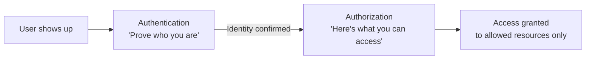
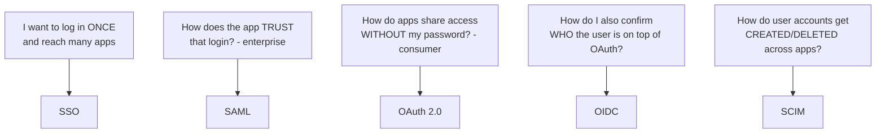
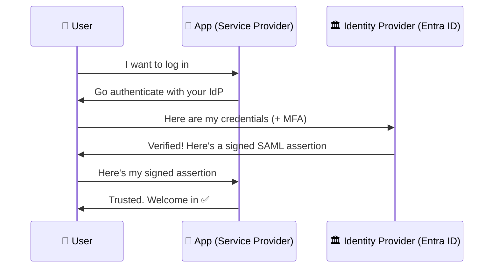
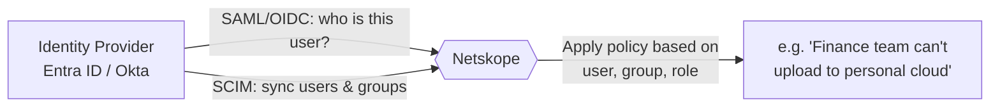
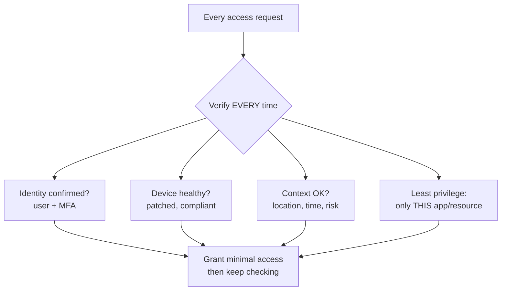
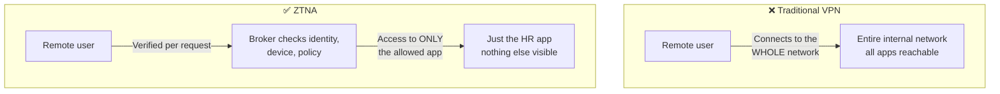
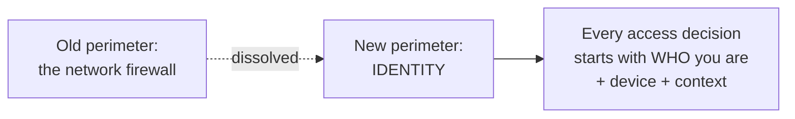

# Part E — Identity & Access (Your AD Knowledge — Tie It In)

> Section goal: Identity is the **new perimeter**. In a world with no network wall, *"who are you and what are you allowed to do?"* becomes the main security control. You already know Active Directory — this section connects that to the modern cloud-identity world (SSO, SAML, OAuth, OIDC, SCIM) and the concept Netskope cares about most: **Zero Trust / ZTNA**.

Covers index items **17–20**.

---

## 17. Authentication vs Authorization (The Foundation)

We touched this in Part B — here it's the *core* of the whole section, so let's lock it in with a clean mental model.

| | **Authentication (AuthN)** | **Authorization (AuthZ)** |
|---|---|---|
| **Question** | *Who are you?* | *What are you allowed to do?* |
| **Happens** | First | Second (only after AuthN) |
| **Example** | Logging in with password + MFA | Being allowed to open the Finance folder but not HR |
| **Analogy** | Showing your **passport** at the airport | Your **boarding pass** says which flight/seat you can board |

> 💡 **The one-liner that nails it:** "Authentication proves *who you are*; authorization decides *what you can do*. You authenticate **once**, but you're authorized **for each thing** you try to access."

---

## 18. SSO, SAML, OAuth, OIDC, SCIM — The Modern Identity Toolkit

These five acronyms scare people, but each solves one simple problem. Learn them as a *set* — they work together.

### 18.1 SSO — Single Sign-On — *log in once, get into everything*
- **The problem it solves:** without SSO, you'd have a separate username/password for every app (M365, Salesforce, Zoom, Slack…) — annoying and insecure.
- **SSO** lets you **log in once** to a central identity system, and then reach all your connected apps without logging in again.
- **Analogy:** a **theme-park wristband** — you prove your identity once at the gate, then every ride just checks the wristband instead of re-checking your ticket.
- **You know this:** logging into your Windows PC and then reaching M365 without re-entering your password is SSO in action.

### 18.2 SAML — *the enterprise "trust letter" between login system and app*
- **SAML (Security Assertion Markup Language)** is the older, enterprise standard that makes SSO work for business web apps.
- **How it works in plain terms:** when you try to open an app, the app says "I don't handle logins — go prove yourself to your company's identity system." You log in there, and it sends the app a **signed digital 'assertion'** that says "Yes, this is really Arti, and she's allowed in."
- The two players:
  - **IdP (Identity Provider)** = the system that *verifies* you (e.g., **Microsoft Entra ID / Azure AD**, Okta).
  - **SP (Service Provider)** = the app you're trying to use (e.g., Salesforce).
- **Analogy:** a **notarized letter**. The app doesn't know you, but it trusts the notary (the IdP). The notary checks your ID and hands you a sealed letter the app will accept.

### 18.3 OAuth 2.0 — *letting one app use another WITHOUT sharing your password*
- **OAuth is about authorization (access), not login.** It lets you grant one app *limited permission* to act on your behalf in another app — **without giving it your password.**
- **Classic example:** an app asks "Can I access your Google contacts?" You approve, and Google gives that app a **limited token** — not your password. You can revoke it anytime.
- **Analogy:** a **hotel key card** (a valet key). It opens *your room only*, expires at checkout, and you never had to hand over your *house keys* (master password).
- **Key word: "token"** — a temporary, limited-permission pass. OAuth hands out tokens instead of passwords.

### 18.4 OIDC — OpenID Connect — *OAuth, plus telling the app WHO you are*
- **The gap OAuth left:** OAuth proves you *granted access* but doesn't cleanly tell the app *who you are*.
- **OIDC (OpenID Connect)** is a thin layer **on top of OAuth 2.0** that adds identity — it also returns an **ID token** confirming your identity. This is what powers "**Sign in with Google / Microsoft**" buttons.
- **Analogy:** OAuth gives you the key card; OIDC also clips a **photo ID badge** on you so the app knows your name, not just that you have a key.
- **Quick way to remember:** **SAML = enterprise SSO (older, web apps); OIDC = modern SSO (newer, mobile & consumer, built on OAuth).** They solve the same "single sign-on" problem for different eras/use-cases.

### 18.5 SCIM — *automatically creating and deleting user accounts across apps*
- **The problem it solves:** when someone **joins**, you must create their account in every app; when they **leave**, you must delete it everywhere (or risk an orphaned account a hacker could use).
- **SCIM (System for Cross-domain Identity Management)** automates this **provisioning/de-provisioning** — the IdP pushes account create/update/delete to all connected apps automatically.
- **Analogy:** an **HR system wired to every door lock** — hire someone and all their badges activate automatically; offboard them and every badge dies instantly.
- **Security angle:** SCIM closes the dangerous gap where an ex-employee still has live accounts. This is a real **least-privilege / risk** topic a CSM can speak to.

> 🧩 **How they fit together (one sentence):** "**SSO** is the goal (log in once); **SAML** and **OIDC** are the two protocols that *deliver* SSO and prove *who* you are; **OAuth** grants apps *limited access* via tokens without your password; and **SCIM** keeps the *accounts themselves* in sync as people join and leave."

| Acronym | Solves | One word |
|---------|--------|----------|
| **SSO** | Log in once, reach many apps | Convenience |
| **SAML** | Enterprise web-app SSO trust | Trust-letter |
| **OAuth 2.0** | App-to-app access without password | Valet-key |
| **OIDC** | Identity on top of OAuth (modern SSO) | Photo-ID |
| **SCIM** | Auto create/delete accounts | Sync |

---

## 19. Identity Providers & Netskope Integration

### 19.1 What is an Identity Provider (IdP)?
- The **IdP** is the central system that holds everyone's identity and verifies logins — the "**source of truth for who's who**."
- The dominant ones: **Microsoft Entra ID (formerly Azure AD)**, Okta, Ping. On-premises, the classic is **Active Directory (AD)** — *your home turf.*

### 19.2 AD vs Azure AD / Entra ID — *connecting your knowledge to the cloud*
This is worth being crisp on, because you know AD and interviewers love a candidate who can bridge old and new.

| | **Active Directory (AD)** | **Microsoft Entra ID (Azure AD)** |
|---|---|---|
| **Where** | On-premises (your data center) | Cloud |
| **Talks via** | Kerberos, LDAP | SAML, OAuth, OIDC, SCIM |
| **Manages** | Domain PCs, on-prem servers, GPOs | Cloud apps (M365, SaaS), modern SSO |
| **Think of it as** | The classic office network directory | The cloud identity hub for SaaS |

- Most enterprises run **both**, synced together (via **Entra Connect**), so the same identity works on-prem *and* in the cloud. This **hybrid identity** setup is extremely common — and exactly the environment Netskope plugs into.

### 19.3 How Netskope uses the IdP
Netskope doesn't replace your IdP — it **integrates with it**:

- **Why it matters:** Netskope ties its **security policies to identity**. Instead of "block this IP," you write human policies like *"members of the **Finance** group cannot upload sensitive files to personal cloud storage."* That's only possible because Netskope knows *who* the user is — from the IdP.
- **Your AD tie-in:** the **users and groups** Netskope uses for policy often originate in **Active Directory**, synced up to Entra ID, then shared with Netskope via SAML/SCIM. You can speak to that whole chain.

> 💡 **Strong interview point:** "Netskope makes identity the control plane. Because it integrates with the customer's IdP — Entra ID, Okta — policies are written about *people and groups*, not IP addresses. That's what makes them understandable to the business and enforceable wherever the user goes."

---

## 20. Zero Trust & ZTNA (The Big One in This Section)

This is the **most important concept in Part E** and a near-guaranteed interview topic.

### 20.1 Zero Trust — the philosophy
- **Old model ("castle and moat"):** once you're inside the network, you're trusted. Problem: if an attacker gets in (stolen password, infected laptop), they can roam freely.
- **Zero Trust:** **"Never trust, always verify."** *No one* is trusted automatically — not even users already "inside." **Every** request is checked: Who are you? Is your device healthy? Are you allowed *this specific thing*, *right now*?

**The three Zero Trust principles to quote:**
1. **Verify explicitly** — always authenticate & authorize on every request, using all signals (identity, device, location, risk).
2. **Use least-privilege access** — give the minimum needed, just-in-time. No standing master keys.
3. **Assume breach** — design as if an attacker is *already* inside; segment everything to limit the blast radius.

### 20.2 ZTNA — Zero Trust Network Access — *Zero Trust applied to app access*
- **ZTNA is the technology that delivers Zero Trust for connecting users to private/internal apps.** It's one of the SSE pillars (Part C) and Netskope's **VPN replacement**.

### 20.3 ZTNA vs VPN — *the comparison they WILL ask about*

| | **VPN (old)** | **ZTNA (new)** |
|---|---|---|
| **What you get access to** | The **whole network** | **Only the specific app(s)** you're allowed |
| **Trust model** | Trust once, then you're "inside" | Verify **every** request, never assume |
| **If credentials are stolen** | Attacker roams the whole network | Attacker reaches *one* app at most |
| **Are apps visible?** | Yes — the network is discoverable/scannable | No — apps are **hidden** until you're authorized ("dark") |
| **Checks device health?** | Usually no | Yes — continuously |

- **The killer analogy:** A **VPN is a master key** to the whole building — risky if it's stolen. **ZTNA is a one-time escorted visit to exactly one room** — and they re-check your badge every single time.

> 💡 **Why customers move from VPN to ZTNA (great talking point):** VPNs are slow (backhauling — see Part C), give too much access (over-privileged), and expose the network to anyone with stolen credentials. ZTNA is faster (cloud edge), grants least-privilege app-level access, hides apps from attackers, and continuously verifies identity *and* device posture. It's Zero Trust made real.

### 20.4 Identity as the new perimeter — tying the section together

> "When the network wall disappeared (Part A/C), **identity became the new perimeter**. The first question for any access isn't 'are you on the network?' — it's 'who are you, is your device healthy, and are you allowed *this*?' That's Zero Trust, and ZTNA is how Netskope enforces it for private apps."

---

## ⭐ Likely Interview Questions for This Section

**Q1. "What's the difference between authentication and authorization?"**
> AuthN = proving who you are (passport). AuthZ = what you're allowed to do (boarding pass). AuthN first, then AuthZ per resource.

**Q2. "Explain SSO. What protocols make it work?"**
> SSO = log in once, reach many apps (theme-park wristband). Delivered by **SAML** (older, enterprise web apps) and **OIDC** (modern, built on OAuth, powers "Sign in with Microsoft"). An IdP (Entra ID/Okta) verifies you and vouches to each app.

**Q3. "What's the difference between SAML, OAuth, and OIDC?"**
> SAML = enterprise SSO trust (a notarized login letter). OAuth = granting limited app access via tokens *without* sharing your password (valet key). OIDC = OAuth + identity, modern SSO (key card + photo ID). SAML and OIDC both do SSO; OAuth is about delegated access.

**Q4. "What is SCIM / why does it matter?"**
> Automated user provisioning/de-provisioning across apps. Joiner = accounts auto-created; leaver = accounts auto-removed everywhere. Closes the dangerous orphaned-account gap — a least-privilege win.

**Q5. "Explain Zero Trust."**
> "Never trust, always verify." No implicit trust from being "inside." Three principles: verify explicitly, least privilege, assume breach. Every request checked on identity + device + context.

**Q6. "How is ZTNA different from a VPN?"** *(very likely)*
> VPN = access to the whole network, trust-once (master key) — dangerous if credentials are stolen. ZTNA = access to only the specific allowed app, verify-every-time, apps hidden until authorized (escorted single-room visit). Faster and least-privilege.

**Q7. "How does Netskope use identity?"**
> It integrates with the customer's IdP (Entra ID/Okta) via SAML/OIDC/SCIM, so security policies are written about *users and groups*, not IPs — e.g., "Finance can't upload to personal cloud storage." Identity becomes the control plane.

---

## 🧠 30-Second Memory Hooks
- **AuthN** = who you are (passport). **AuthZ** = what you can do (boarding pass).
- **SSO** = log in once (wristband). **SAML** = enterprise SSO (notarized letter). **OIDC** = modern SSO on OAuth (key card + photo ID). **OAuth** = app access without password (valet key). **SCIM** = auto create/delete accounts (HR wired to door locks).
- **IdP** = source of truth for identity (Entra ID/Okta); **AD** = on-prem classic, often synced to Entra ID (hybrid).
- **Zero Trust** = never trust, always verify → verify explicitly, least privilege, assume breach.
- **ZTNA vs VPN** = one room (verified each time) vs master key to the whole building.
- **Identity is the new perimeter.**

---

*Next suggested section:* **Part F — CASB** (deep dive on shadow IT, sanctioned vs unsanctioned apps, inline vs API mode — building right on the OneDrive example from Part D).
