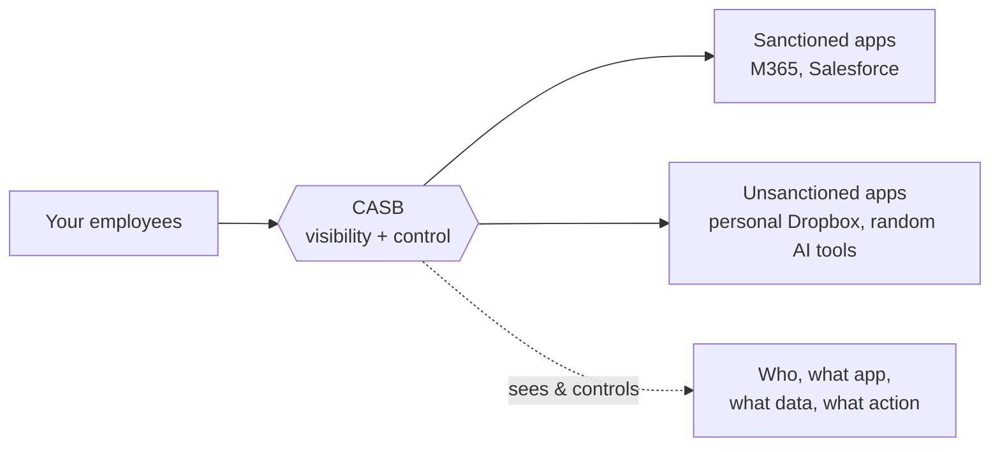
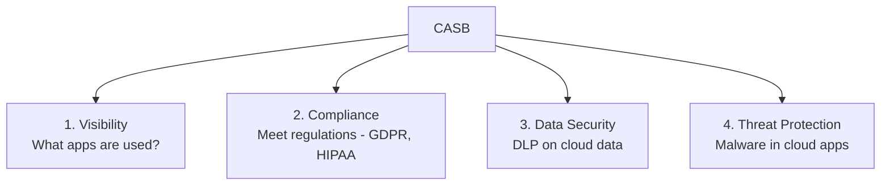
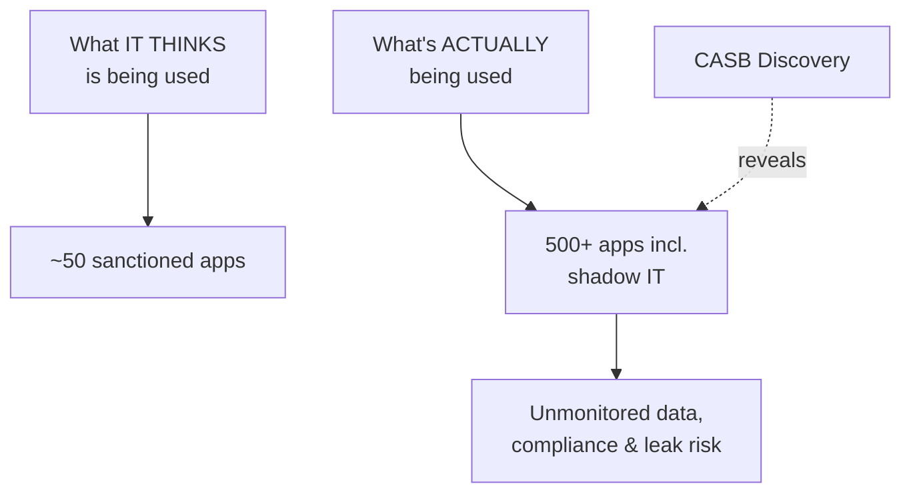
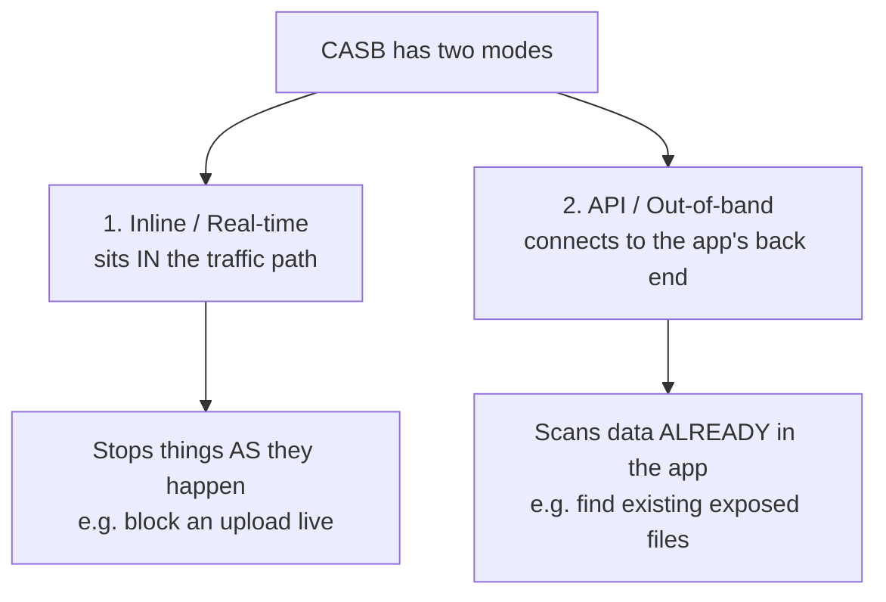
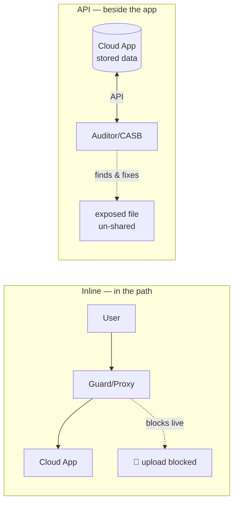

# Part F — Cloud Access Security Broker (CASB)

> Section goal: CASB is **Netskope's heritage** — it's the pillar the company was originally famous for, and it's where your OneDrive/SharePoint expertise makes you genuinely credible. By the end you should be able to explain what a CASB does, the difference between its two deployment modes (inline vs API), and walk through real use cases without hesitating.

Covers index items **21–23**.

---

## 21. The Core Problem CASB Solves: Visibility & Control of Cloud Apps

### 21.1 What is a CASB, really?
- **CASB (Cloud Access Security Broker)** — pronounced "**caz-bee**" — is a security checkpoint that sits **between your users and the cloud apps they use** (Microsoft 365, Salesforce, Dropbox, Google Drive, Box…).
- A "**broker**" is a middleman who controls what passes between two parties. The CASB's job is to give the company **visibility** ("what cloud apps are my people using, and what are they doing in them?") and **control** ("enforce rules on that activity").
- **Analogy:** a **security guard standing between your staff and every cloud app** — checking who's going in, what files they carry in and out, and whether they're even allowed to use that app at all.

### 21.2 The four pillars of CASB (Gartner's classic framing)
A common interview-friendly way to describe *what a CASB does*. Remember **"V-C-D-T"**:

| Pillar | Question it answers | Example |
|--------|--------------------|---------| 
| **Visibility** | "What cloud apps are my employees using?" | Discovers 500 apps in use when IT only knew about 50. |
| **Compliance** | "Are we meeting regulations?" | Flags personal data stored in a non-compliant app. |
| **Data Security** | "Is sensitive data safe in the cloud?" | Blocks a confidential file upload to personal OneDrive (DLP). |
| **Threat Protection** | "Is malware spreading via cloud apps?" | Detects malware uploaded to a shared SharePoint site. |

---

## 22. Shadow IT, Sanctioned vs Unsanctioned Apps, and the Cloud Confidence Index

### 22.1 Sanctioned vs Unsanctioned apps — *approved vs not*
- **Sanctioned apps** = cloud apps the company has **officially approved and manages** (e.g., the corporate Microsoft 365 tenant).
- **Unsanctioned apps** = apps employees use that IT has **not** approved (e.g., someone using personal Dropbox or a random online PDF converter for work files).

### 22.2 Shadow IT — *the apps IT doesn't know about*
- **Shadow IT** = all the unsanctioned apps and services employees use **without IT's knowledge or approval.** It's "in the shadows" because IT can't see it.
- **Why it's dangerous:** company data ends up in apps nobody is securing, backing up, or monitoring. A leaving employee's personal Dropbox could walk out with sensitive files.
- **Analogy:** employees bringing in their **own unauthorized tools and filing cabinets** — IT has no idea what company data is sitting in them.
- **Why it happens:** usually not malicious — people just want to get work done and grab whatever tool is convenient.

> 💡 **The classic CASB "aha" moment:** A CASB analyzes traffic logs and shows the customer they have **500+ cloud apps in use** when they thought they had 50. That eye-opening discovery is often how a CASB project starts — and a great story to tell: *"the first value a CASB delivers is simply showing the customer the truth about their own environment."*

### 22.3 Cloud Confidence Index (CCI) — *Netskope's app risk-rating database*
- Once you discover hundreds of apps, you need to know **which ones are safe**. The **Cloud Confidence Index (CCI)** is Netskope's database that **risk-rates tens of thousands of cloud apps** (60,000+) on things like: Do they encrypt data? Are they GDPR/SOC 2 compliant? Who owns the data? What's their security history?
- Each app gets a rating (e.g., high / medium / low / poor), so the customer can make decisions like *"allow enterprise-ready apps, block poor-rated ones, and allow-but-monitor the rest."*
- **Analogy:** a **credit score for cloud apps** — an instant trustworthiness rating so you don't have to investigate each one yourself.

> 💡 **CSM relevance:** Helping a customer turn CCI discovery into **policy** ("coach users off risky apps toward the sanctioned equivalent") is exactly the kind of **adoption + risk-reduction** outcome a CSM drives.

---

## 23. Inline (Forward/Reverse Proxy) vs API-Based (Out-of-Band) CASB

This is **the** technical CASB interview topic. A CASB can control cloud apps in **two fundamentally different ways**, and the best deployments use **both together**. Know the difference cold.

### 23.1 Inline mode (real-time) — *standing in the traffic path*
- The CASB sits **in the live traffic path** (using the proxy techniques from Part D — forward or reverse proxy). It sees activity **as it happens** and can **block it in real time.**
- **Can control:** uploads, downloads, sharing — *while they're happening.* Works on **sanctioned AND unsanctioned** apps (it sees all traffic, even to apps IT never approved).
- **Example:** the moment a user tries to upload a confidential file to personal OneDrive, inline CASB **blocks it before it leaves.**
- **Analogy:** a **security guard at the door** stopping a forbidden package *before* it goes out.
- **Trade-off:** must be in the traffic path (needs steering — Client/PAC/tunnel), and only sees activity that flows through it.

### 23.2 API mode (out-of-band) — *plugging into the app's back end*
- The CASB connects directly to the cloud app's **API** (a back-end management connection) — it is **not** in the live traffic path. It inspects data **already sitting inside** sanctioned apps.
- **Can control:** **data at rest** — files already stored in M365/Box/Salesforce — and find risky **sharing settings** (e.g., a SharePoint file shared "to anyone with the link").
- **Example:** scans your entire OneDrive/SharePoint tenant and finds 200 existing files containing credit-card numbers that are publicly shared — then fixes the sharing or quarantines them.
- **Analogy:** an **auditor with keys to the warehouse** who walks the aisles checking what's *already stored* and how it's exposed — even files saved months ago.
- **Trade-off:** works only on **sanctioned apps that offer APIs**, and it's **near-real-time, not instant** (it reacts shortly *after* something happens, not before). Can't see unsanctioned/shadow IT apps.

### 23.3 The comparison table (memorize this)
| | **Inline (real-time)** | **API (out-of-band)** |
|---|---|---|
| **Where it sits** | **In** the traffic path (proxy) | **Beside** the app (API connection) |
| **Timing** | **Before** it happens — can block live | **After** — near-real-time scan |
| **Data it sees** | Data **in motion** (active uploads/downloads) | Data **at rest** (already stored) |
| **Apps covered** | Sanctioned **and** unsanctioned (incl. shadow IT) | **Sanctioned only** (needs an API) |
| **Needs steering?** | **Yes** (Client/PAC/tunnel) | **No** (connects to the app directly) |
| **Best at** | Stopping risky actions live | Finding existing exposure & fixing sharing |
| **Analogy** | Guard at the door | Auditor in the warehouse |

> 💡 **The answer that impresses:** "They're complementary, not either/or. **Inline** stops risky activity in real time and covers shadow IT, but only sees what flows through it. **API** reaches back into sanctioned apps to find data and sharing risks that already exist — even files from before you deployed. A mature deployment uses **both**: inline for live control, API for at-rest cleanup and continuous posture. Netskope offers both in one platform."

---

## 23.4 Real-World CASB Use Cases (great for "give me an example" questions)

| Use case | Mode | What happens |
|----------|------|--------------|
| **Discover shadow IT** | Inline (log analysis) | Reveal all 500+ apps in use; risk-rate via CCI. |
| **Block uploads to personal cloud** | Inline | Allow corporate OneDrive; block personal OneDrive/Dropbox uploads. |
| **Find exposed sensitive files** | API | Scan SharePoint/OneDrive for PII shared publicly; fix sharing. |
| **Coach users in real time** | Inline | Pop a message: "This app isn't approved — use the corporate version instead." |
| **Stop malware in cloud apps** | API + Inline | Detect/quarantine malware uploaded to a shared site. |
| **Control specific activities** | Inline | Allow *viewing* a Salesforce report but block *exporting/downloading* it. |

### Your signature CASB story (uses your real expertise)
> "Take Microsoft 365, which I support today. With Netskope CASB inline, the platform can tell the difference between the **corporate** tenant and a user's **personal** OneDrive — both look like `microsoft.com` to a firewall — so it allows legitimate corporate work but blocks data going to personal accounts. Then with **API mode**, it scans the existing SharePoint and OneDrive content for sensitive files that are over-shared and remediates them. Inline handles the *live* risk; API cleans up the *resting* risk. That combination is exactly what a firewall or simple proxy can't do."

---

## ⭐ Likely Interview Questions for This Section

**Q1. "What is a CASB and what problem does it solve?"**
> A security broker between users and cloud apps that gives **visibility** (what apps/data are in use) and **control** (enforce policy). It solves the loss of visibility/control when data moved to SaaS — including discovering shadow IT. Four pillars: Visibility, Compliance, Data Security, Threat Protection.

**Q2. "What's shadow IT and why does it matter?"**
> Unsanctioned apps employees use without IT's approval/knowledge. Risk: company data in unmonitored, unsecured apps. CASB discovers it; CCI risk-rates the apps so you can allow/block/coach.

**Q3. "Explain inline vs API-based CASB."** *(the key one)*
> Inline sits in the traffic path (proxy) and blocks risky actions **in real time**, covering sanctioned + unsanctioned apps, but needs steering and only sees traffic in motion. API connects to a sanctioned app's back end (out-of-band) to scan **data at rest** and fix sharing — near-real-time, no steering, sanctioned only. Use both together: guard at the door + auditor in the warehouse.

**Q4. "Give a real CASB use case."**
> Use the M365 story: inline blocks uploads to personal OneDrive (instance awareness) while allowing corporate; API scans SharePoint for over-shared sensitive files and remediates.

**Q5. "What is the Cloud Confidence Index?"**
> Netskope's database that risk-rates 60,000+ cloud apps (encryption, compliance, data ownership, etc.) — a "credit score for cloud apps" that turns discovery into policy decisions.

**Q6. "Why isn't a firewall enough to control cloud apps?"**
> A firewall sees IPs/ports and an encrypted blob to `microsoft.com` — it can't distinguish corporate vs personal instances, can't see file content, and can't control specific actions (view vs download). CASB understands app, action, and data context.

---

## 🧠 30-Second Memory Hooks
- **CASB** = security broker between users and cloud apps → **visibility + control.**
- **4 pillars (V-C-D-T):** Visibility, Compliance, Data security, Threat protection.
- **Shadow IT** = unsanctioned apps IT can't see; CASB discovers them; **CCI** = "credit score for cloud apps."
- **Inline** = guard at the door, real-time block, sanctioned + shadow IT, needs steering.
- **API** = auditor in the warehouse, scans data at rest, fixes over-sharing, sanctioned only, no steering.
- **Use both together.** Netskope was *born* as a CASB — this is their heritage.
- **Your story:** corporate vs personal OneDrive (instance awareness) — inline blocks live, API cleans up at rest.

---

*Next suggested section:* **Part G — DLP** (the "bonus" differentiator in the JD — data classification, detection techniques like EDM/fingerprinting/ML, and the policy/incident workflow). It pairs naturally with everything you just learned about CASB.
