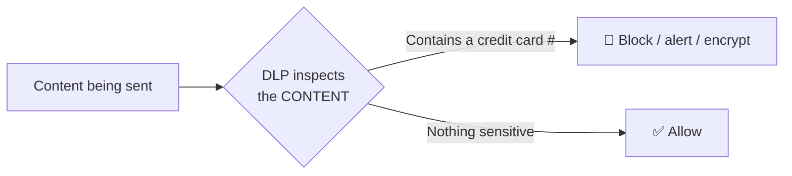
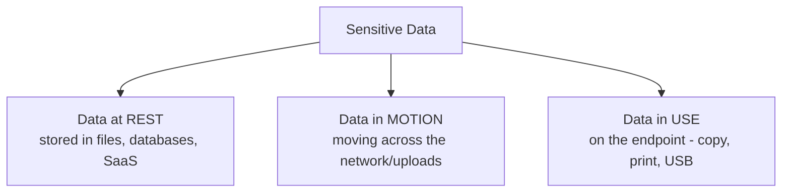
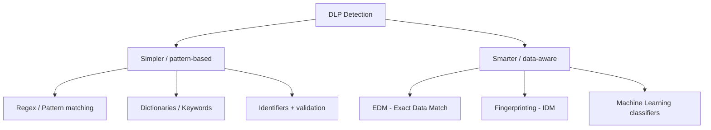
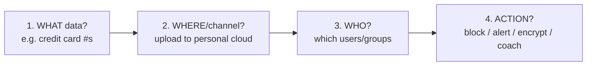
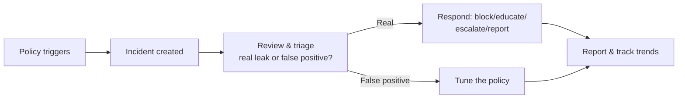

# Part G — Data Loss Prevention (DLP) — The Bonus Differentiator

> Section goal: The JD says DLP experience "would be a bonus." That means if you can speak about DLP with confidence, you **stand out** from other candidates. DLP is also Netskope's deep heritage — they're known for being *data-centric*. This section makes you fluent: what DLP is, how it *detects* sensitive data (the techniques), and how a DLP program actually runs (policy + incidents).

Covers index items **24–26**.

---

## 24. DLP Concepts & Data Classification

### 24.1 What is DLP?
- **DLP (Data Loss Prevention)** is the security discipline that **finds sensitive data and stops it from leaving the organization** (or being exposed) where it shouldn't.
- While the other SSE pillars protect *paths* (web, SaaS, private apps), **DLP protects the *data itself*** — it inspects the actual content flowing through those paths.
- **Analogy:** an **X-ray scanner that reads the contents of every package** leaving the building and stops the ones containing secrets — regardless of which door they try to leave by.

### 24.2 The three states of data — *where DLP has to look*
A classic framing interviewers like. Sensitive data exists in three states, and DLP must cover all of them:

| State | Meaning | Example | Netskope coverage |
|-------|---------|---------|-------------------|
| **At rest** | Data **sitting** in storage | Files in SharePoint, OneDrive, a database | **API-mode CASB + DLP** scans stored data |
| **In motion** | Data **moving** across the network | Uploading a file to a website, sending email | **Inline DLP** inspects live traffic |
| **In use** | Data being **actively handled** on a device | Copy-paste, print, save to USB | **Endpoint DLP** (on the device) |

> 💡 **Tie-back:** This maps perfectly to Part F — **inline** handles data *in motion*, **API mode** handles data *at rest*. DLP is the engine that inspects the content in both.

### 24.3 Data Classification — *you can't protect what you haven't labeled*
- **Data classification** = sorting data by **how sensitive it is**, so you can apply the right level of protection. You can't protect everything equally — you focus effort on what matters.
- Typical tiers: **Public** → **Internal** → **Confidential** → **Restricted/Highly Confidential.**
- **Analogy:** document stamps — *"Public," "Internal Use Only," "Confidential," "Top Secret."* The stamp tells everyone how carefully to handle it.
- **Why it matters for DLP:** classification tells the DLP engine *what to look for and how hard to enforce*. (In the Microsoft world you may know this as **sensitivity labels / Microsoft Purview Information Protection** — a great connection to make.)

### 24.4 Common types of sensitive data (know the categories)
| Category | Examples |
|----------|----------|
| **PII** (Personally Identifiable Information) | Name, address, Aadhaar/SSN, passport, PAN |
| **PCI** (Payment Card data) | Credit/debit card numbers (PCI-DSS regulated) |
| **PHI** (Protected Health Information) | Medical records, diagnoses (HIPAA regulated) |
| **IP** (Intellectual Property) | Source code, designs, formulas, trade secrets |
| **Financial / Legal** | Contracts, M&A docs, earnings before release |

> 💡 Knowing these acronyms (**PII, PCI, PHI, IP**) signals real DLP literacy — they map directly to regulations (GDPR, PCI-DSS, HIPAA) customers must comply with.

---

## 25. DLP Detection Techniques — *How DLP Actually Recognizes Sensitive Data*

This is the **technical heart** of DLP and what separates a candidate who "knows the word DLP" from one who understands it. Techniques range from **simple** (pattern matching) to **sophisticated** (fingerprinting, ML). Know them from simplest to smartest.

### 25.1 Regex / Pattern Matching — *spotting a recognizable shape*
- **Regex (regular expression)** = a rule describing a **pattern of characters.** Great for data with a predictable format.
- **Example:** a credit-card number is "16 digits in groups of four" → a regex can spot that shape anywhere in a document.
- **Analogy:** recognizing a phone number by its *shape* (xxx-xxx-xxxx) without knowing whose it is.
- **Weakness:** can cause **false positives** (16 random digits that *aren't* a card). Often combined with validation (below).

### 25.2 Dictionaries / Keyword lists — *looking for specific words*
- A **dictionary** is a list of **trigger words/phrases** (e.g., "Confidential," "Project Falcon," medical terms). If the content contains them, it's flagged.
- **Analogy:** a watch-list of words a censor scans every letter for.
- **Weakness:** crude on its own; usually combined with other signals.

### 25.3 Identifiers + validation (checksums) — *smarter pattern matching*
- Many ID numbers have a built-in **math check** (a checksum). Credit cards pass the **Luhn algorithm**; many national IDs have check digits.
- DLP applies the pattern **and** the math check → far fewer false positives.
- **Analogy:** not just "looks like a card number" but "**passes the validity test** of a real card number."

### 25.4 EDM — Exact Data Match — *matching YOUR specific records*
- **EDM** matches against a **specific database of the customer's real sensitive values** — e.g., the actual list of *your* customers' account numbers.
- Instead of "any 16-digit number," it triggers only on **the exact values that belong to you.**
- **Analogy:** not "any passport-shaped number," but "**this exact list of our employees' passport numbers.**"
- **Strength:** extremely precise — almost no false positives. **Use:** protecting known structured datasets (customer lists, employee records).

### 25.5 Fingerprinting / IDM (Indexed Document Matching) — *recognizing a specific document*
- The DLP system creates a **digital fingerprint of an entire sensitive document** (or template). Later it can detect that document — **even partially copied or modified** — anywhere it travels.
- **Analogy:** taking a fingerprint of a confidential contract; if someone copies two paragraphs into an email, DLP still recognizes the "fingerprint."
- **Use:** protecting specific files — board decks, source code, design docs, contract templates.

### 25.6 Machine Learning classifiers — *recognizing a TYPE of document by learning*
- Instead of rules, you **train a model** on examples (e.g., hundreds of resumes, or source-code files). It learns to recognize *that category* of document even when it's brand new and matches no keyword or pattern.
- **Analogy:** teaching someone what a "resume" looks like by showing many examples — afterward they recognize a new one instantly, even in a new format.
- **Use:** fuzzy categories that defy simple rules — "this looks like a financial statement / source code / a medical record."

### 25.7 The progression in one glance
| Technique | Recognizes | Precision | Best for |
|-----------|-----------|-----------|----------|
| **Regex** | A *format/shape* | Low–medium | Card numbers, emails, IDs |
| **Dictionary** | *Specific words* | Low | Keywords, code-names |
| **Identifier + checksum** | A *valid* ID number | Medium–high | Real card/ID numbers |
| **EDM** | *Your exact records* | Very high | Customer/employee datasets |
| **Fingerprinting (IDM)** | A *specific document* | Very high | Contracts, source, designs |
| **ML classifier** | A *category* of document | High (fuzzy) | Resumes, financials, code |

> 💡 **The maturity story to tell:** "Basic DLP is just regex and keywords, which generate a lot of false positives and frustrate users. Mature DLP layers in **EDM** (your exact data), **fingerprinting** (specific documents), and **ML** (document types) to be **precise** — catching real leaks without drowning the team in false alarms. Netskope's data-centric heritage is exactly this depth." *(Reducing false positives = a real customer-success outcome you can speak to.)*

---

## 26. DLP Policy Workflow & Incident Management

Knowing detection isn't enough — you should understand how a DLP **program runs day to day**, because that's where a CSM adds value (driving adoption without disrupting the business).

### 26.1 Anatomy of a DLP policy
A DLP policy answers four questions:

| Element | Question | Example |
|---------|----------|---------|
| **Data** | What are we protecting? | Files containing PCI card numbers |
| **Channel** | Through which path? | Upload to **personal** OneDrive |
| **Identity** | For whom? | The **Finance** group |
| **Action** | What do we do? | **Block** + notify user + log incident |

### 26.2 Possible DLP actions (it's not just "block")
- **Allow** — permit (often with logging).
- **Alert / Monitor** — let it through but record an incident (common at first, to learn before enforcing).
- **Block** — stop the action entirely.
- **Encrypt** — allow but protect it.
- **Quarantine** — move an at-rest file somewhere safe pending review.
- **User coaching** — pop a message: *"This looks like sensitive data — are you sure? Here's the policy."* (Often lets the user justify and proceed, which **educates** rather than just blocking.)

> 💡 **Critical CSM insight — start in "monitor" mode:** Smart DLP rollouts begin in **alert/monitor mode** (watch, don't block) to **tune out false positives** before enforcing. Blocking too aggressively on day one frustrates users and creates backlash. Phasing monitor → coach → block is a textbook **adoption best practice** — exactly the kind of guidance a CSM gives. This single point shows you understand DLP *as a program*, not just a feature.

### 26.3 Incident management lifecycle
When a policy triggers, it creates an **incident** that someone has to handle:

1. **Trigger → incident** logged with details (who, what data, what channel, what action taken).
2. **Triage:** is it a **true positive** (real leak) or a **false positive** (over-eager rule)?
3. **Respond:** educate the user, enforce the block, or escalate a genuine insider/exfiltration case.
4. **Tune:** false positives feed back into improving the policy (fewer future false alarms).
5. **Report:** track incident **trends** over time — falling incidents = improving data hygiene = a **business-value story for QBRs.**

> 💡 **Link to the JD:** Responsibility #4 says "analyze support cases, telemetry, and usage trends to surface systemic issues." DLP incident **trends** are a perfect example — a rising trend in "card numbers to personal email" reveals a process problem you can help the customer fix. That's proactive value, not reactive ticket-closing.

---

## ⭐ Likely Interview Questions for This Section

**Q1. "What is DLP?"**
> A discipline/technology that identifies sensitive data and prevents it from leaking or being exposed. It inspects content (not just paths) across data at rest, in motion, and in use. Think "X-ray scanner reading every package leaving the building."

**Q2. "What are the three states of data?"**
> At rest (stored — scanned via API/CASB), in motion (moving — inline inspection), in use (on the endpoint — endpoint DLP). DLP must cover all three.

**Q3. "How does DLP detect sensitive data?"** *(the differentiator question)*
> Walk simplest→smartest: regex/patterns (shape), dictionaries (keywords), identifiers+checksums (valid IDs), EDM (your exact records), fingerprinting/IDM (specific documents even partially copied), ML classifiers (document *types*). Mature DLP layers these to cut false positives.

**Q4. "What's the difference between regex and EDM/fingerprinting?"**
> Regex matches a generic *format* ("any 16-digit number") — prone to false positives. EDM matches *your exact data* (this specific customer list); fingerprinting matches a *specific document* even if partially copied. Both are far more precise.

**Q5. "How would you roll out DLP without disrupting the business?"** *(CSM gold)*
> Classify data first; start in **monitor/alert mode** to baseline and tune false positives; add **user coaching**; then move to **block** for the highest-risk flows. Phase it, report trends, iterate. Avoid day-one hard blocks that frustrate users.

**Q6. "What actions can a DLP policy take?"**
> Allow/log, alert/monitor, block, encrypt, quarantine (at rest), and user-coach. Not just block — coaching educates users and reduces repeat incidents.

**Q7. "How does DLP create business value you'd show in a QBR?"**
> Track incident **trends** — falling sensitive-data exposures, fewer risky-app uploads, reduced exfiltration attempts. Quantify risk reduction and compliance posture (PCI/HIPAA/GDPR). That's measurable value realization.

---

## 🧠 30-Second Memory Hooks
- **DLP** = find sensitive data + stop it leaking. Protects the **data**, not the path. *X-ray scanner on every package.*
- **3 states:** at rest (API), in motion (inline), in use (endpoint).
- **Sensitive types:** PII, PCI, PHI, IP.
- **Detection, simple→smart:** regex (shape) → dictionary (words) → checksum (valid ID) → **EDM** (your exact records) → **fingerprinting** (specific document) → **ML** (document type).
- **Actions:** allow, alert, block, encrypt, quarantine, **coach**.
- **Rollout:** monitor → coach → block. Tune false positives. (CSM best practice.)
- **Value:** falling incident trends = risk reduction = QBR story.

---

*Next suggested section:* **Part H — Threat Protection** (malware scanning, sandboxing, ATP, Remote Browser Isolation, and Cloud Firewall — completing the SSE pillar tour).
