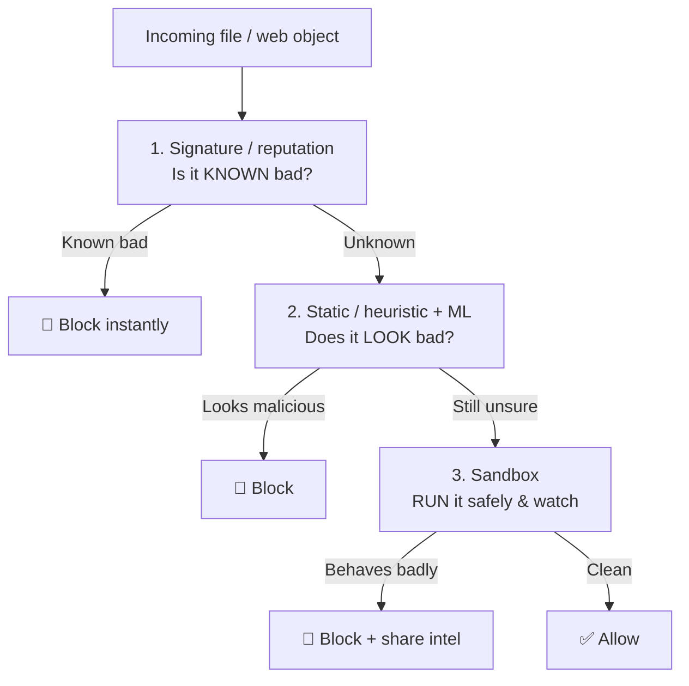
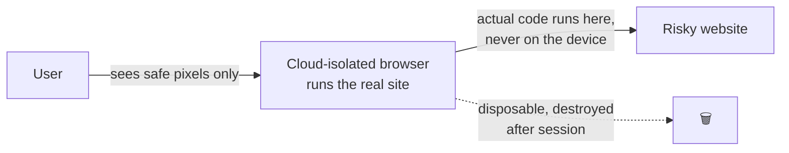
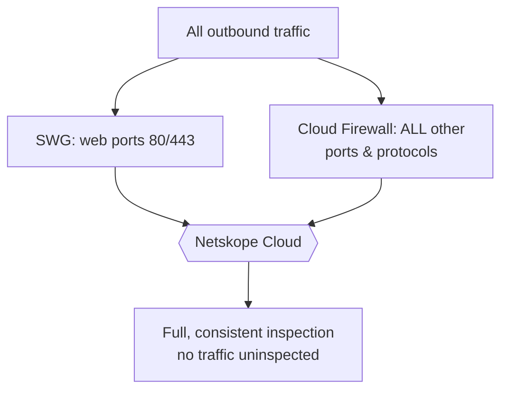
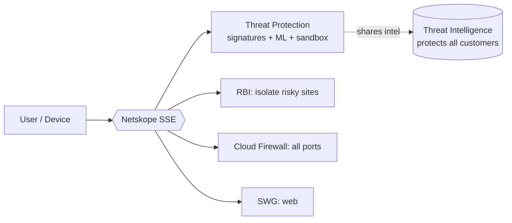

# Part H — Threat Protection

> Section goal: Round out the SSE platform tour. The other pillars control *access* and *data*; threat protection stops the **bad stuff** — malware, ransomware, phishing, zero-days — from reaching users through web and cloud traffic. Know the layered approach (signatures → ML → sandbox), plus two extras the JD's world cares about: **Remote Browser Isolation** and **Cloud Firewall**.

Covers index items **27–28**.

---

## 27. Malware Scanning, Sandboxing & Advanced Threat Protection

### 27.1 The layered detection model — *fast cheap checks first, deep checks last*
No single technique catches everything, so threat protection works in **layers**, from fastest/cheapest to slowest/deepest. A file or web object passes through each layer.

### 27.2 Layer 1 — Signature & reputation — *the "known criminals" check*
- **Signature-based detection** compares a file against a database of **known malware fingerprints (hashes)**. If it matches a known threat, block instantly.
- **Reputation** checks known-bad URLs/IPs/domains and senders.
- **Analogy:** a **wanted-poster / fingerprint database** at the door — instantly recognizes known criminals.
- **Weakness:** only catches **known** threats. A brand-new (zero-day) or slightly-altered malware has no signature yet → it slips past. That's why we need the next layers.

### 27.3 Layer 2 — Static analysis, heuristics & ML — *"does it look suspicious?"*
- Instead of an exact match, this examines the file's **characteristics and structure** for suspicious traits (e.g., code that tries to hide itself, or a "document" that contains executable code).
- **Machine learning** models, trained on millions of good and bad files, predict whether something *new* is likely malicious — **without ever having seen it before.**
- **Analogy:** a trained security officer spotting **suspicious behavior** in someone who isn't on any wanted list — based on experience, not a poster.
- **Strength:** catches **unknown/zero-day** variants that signatures miss.

### 27.4 Layer 3 — Sandboxing — *"detonate it in a safe room and watch"*
- A **sandbox** is an **isolated, disposable virtual environment** where a suspicious file is actually **opened/run** to see what it *does* — safely, away from real systems.
- If, when executed, it tries to encrypt files, contact a known attacker server, or steal data → it's confirmed malicious and blocked. If it's clean, it's released.
- **Analogy:** a **bomb-disposal containment chamber** — you detonate the suspicious package in a sealed room to see if it explodes, where it can't hurt anyone.
- **Strength:** catches the most evasive, never-before-seen threats because it judges **behavior**, not appearance.
- **Trade-off:** slower and resource-heavy → used only for the unknowns the cheaper layers couldn't clear.

> 💡 **The key insight to articulate:** "Signatures catch *known* threats instantly but miss new ones; ML catches things that *look* malicious; sandboxing catches the truly novel by *running* them and watching behavior. Layering them gives both **speed** and **depth** — you don't sandbox everything (too slow), only the unknowns."

### 27.5 Advanced Threat Protection (ATP) & threat intelligence
- **ATP** is the umbrella term for this **multi-layered defense against sophisticated/zero-day threats** (ML + sandboxing + behavioral analysis working together).
- **Threat intelligence** is the constantly-updated knowledge of current threats (bad IPs, malware hashes, attacker techniques). When Netskope's cloud catches a new threat for *one* customer, that intel can protect **all** customers — a **network effect** of cloud-delivered security.
- **Analogy:** a global **neighbourhood watch** — once one house spots a burglar, every house on the street is warned instantly.

### 27.6 Inline vs at-rest threat scanning (ties to CASB, Part F)
| Mode | When it scans | Example |
|------|---------------|---------|
| **Inline** | As traffic flows (real time) | Block a malware download from a website *as it happens* |
| **API / at-rest** | Files already in cloud apps | Scan SharePoint/OneDrive and **quarantine** an infected file someone already uploaded |

> 💡 **Your-world example:** malware uploaded to a shared **SharePoint** site could spread to everyone with access. Netskope's **API-mode** threat scanning finds and quarantines it even if it was uploaded before policies were tightened — while **inline** stops the next infected download in real time.

---

## 28. Remote Browser Isolation (RBI) & Cloud Firewall

Two more capabilities that complete the picture. Both come up as "what else does Netskope do?" questions.

### 28.1 Remote Browser Isolation (RBI) — *browse risky sites without touching them*
- **The problem:** some websites are **risky but not confirmed malicious** — you don't want to fully block them (users need to work), but you don't want that code running on the user's laptop either.
- **RBI** runs the website in a **disposable browser in the cloud**, and streams only a **safe visual rendering** (like a video/pixels) to the user. The actual web code **never touches the user's device.** When done, the cloud browser is destroyed.
- **Analogy:** viewing a potentially-contaminated item through **thick protective glass / a live video feed** — you can see and interact with it, but it can never physically reach you.

- **Use cases:** risky/uncategorized websites, links in emails, or letting **unmanaged/contractor devices** reach an internal app safely without installing anything.
- **Why it's elegant:** turns "block vs allow" (a hard choice) into a **safe third option** — *allow, but isolated.*

### 28.2 Cloud Firewall (FWaaS) — *firewall for ALL traffic, delivered from the cloud*
- Recall from Part C: **SWG handles web traffic (the "web doors")**, but apps also use **other ports and protocols** (think of an IP address as a building with many numbered doors — web uses 80/443, but email, file transfer, and other services use different doors).
- **Cloud Firewall (FWaaS)** extends control to **all ports and protocols**, delivered **from the cloud** instead of a hardware box in each office — so even small branches and remote users get full firewall protection.
- **Analogy:** SWG is a guard watching the **main web entrances**; the Cloud Firewall is a guard checking **every door of the building**, and it's provided as a cloud service so you don't buy/maintain hardware everywhere.
- **Why it matters:** completes the coverage — *no traffic escapes inspection*, web or non-web.

---

## How the Threat & Coverage Pieces Fit Together

> 💡 **The convergence message (again):** all of this — threat protection, RBI, firewall, plus SWG/CASB/ZTNA/DLP from earlier — runs on **one platform, inspecting traffic once.** That's the entire SSE value proposition, and you've now toured every pillar.

---

## ⭐ Likely Interview Questions for This Section

**Q1. "How does Netskope detect malware / threats?"**
> A layered model: (1) **signatures/reputation** catch known threats instantly; (2) **static analysis + ML** catch things that *look* malicious (unknown variants); (3) **sandboxing** runs truly novel files in an isolated environment and judges *behavior*. Layering balances speed and depth.

**Q2. "What is sandboxing?"**
> Running a suspicious file in an isolated, disposable virtual environment to observe what it does — if it behaves maliciously (encrypts files, calls an attacker server), it's blocked. Catches zero-day threats that signatures miss. "Bomb-disposal chamber" analogy.

**Q3. "Why aren't signature-based defenses enough?"**
> They only catch *known* threats. New/zero-day or slightly-altered malware has no signature yet. You need ML (looks suspicious) and sandboxing (behaves suspicious) to catch the unknown.

**Q4. "What is Remote Browser Isolation?"**
> Risky sites run in a disposable cloud browser; only safe visual pixels stream to the user, so malicious code never touches the device. Turns block-vs-allow into a safe "allow-but-isolated" third option. "Protective glass" analogy.

**Q5. "What's the difference between SWG and Cloud Firewall?"**
> SWG inspects **web** traffic (ports 80/443); Cloud Firewall extends control to **all** ports/protocols, delivered from the cloud. Together they ensure no traffic — web or non-web — goes uninspected.

**Q6. "How does cloud-delivered threat protection have an advantage?"**
> Network effect: a threat caught for one customer becomes intelligence that protects all customers instantly. Plus inline (real-time) **and** API/at-rest scanning (e.g., quarantine malware already sitting in SharePoint).

---

## 🧠 30-Second Memory Hooks
- **Layered detection:** signatures (known bad) → ML/heuristics (looks bad) → **sandbox** (run it & watch behavior). Speed + depth.
- **Signatures = wanted poster; ML = spotting suspicious behavior; sandbox = bomb-disposal chamber.**
- **ATP** = the multi-layer defense umbrella; **threat intel** = neighbourhood watch (one customer's catch protects all).
- **RBI** = run risky sites in a disposable cloud browser; stream only safe pixels — "view through protective glass." Allow-but-isolated.
- **SWG** = web doors; **Cloud Firewall (FWaaS)** = every door, all ports/protocols, from the cloud.
- **Inline** stops threats live; **API mode** quarantines malware already in cloud apps (e.g., SharePoint).

---

*Next suggested section:* **Part I — Customer Success Craft** (the process & soft-skills core of the actual job: handoff, onboarding/TTV, cadence & health scoring, QBRs, risk playbooks, expansion, stakeholder management). This is where the *technical* prep meets the *CSM* prep.
