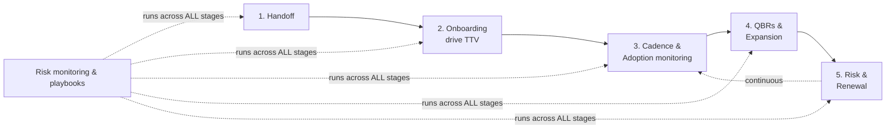
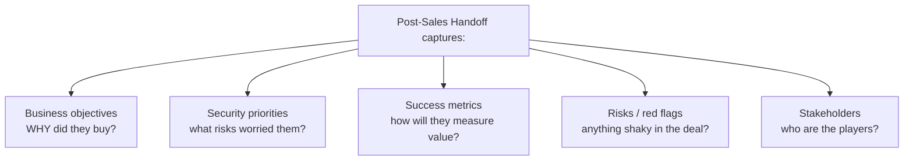
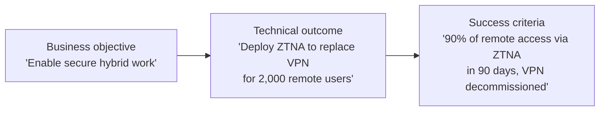
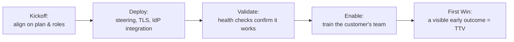
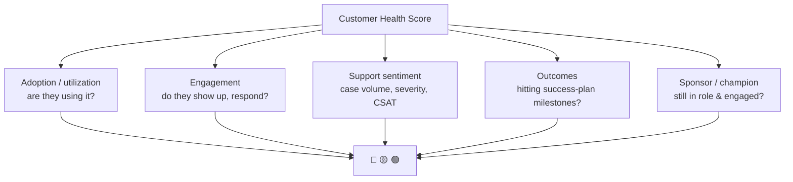
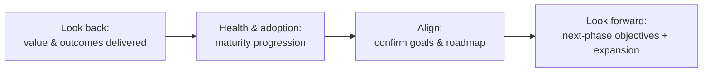
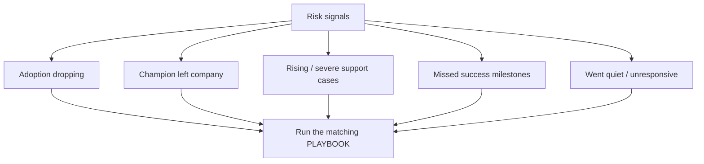
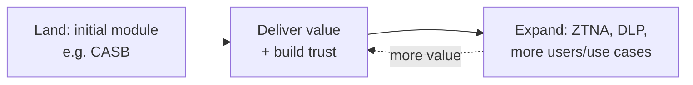
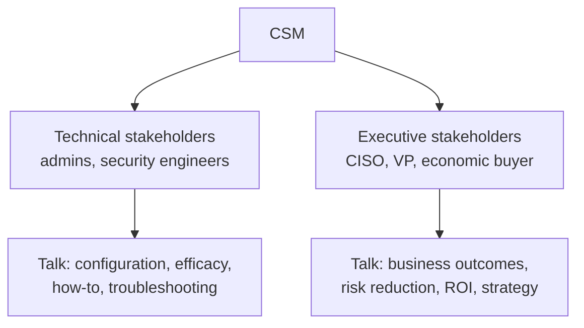

# Part I — Customer Success Craft (Process & Soft Skills)

> Section goal: This is where technical knowledge meets the *actual job*. Parts A–H made you credible on the platform; Part I makes you credible as a **CSM**. Every topic here maps directly to a numbered responsibility in the JD — so these are the questions the hiring manager cares about most. The goal: speak about the **process** of driving customer success with structure and confidence.

Covers index items **29–35** and maps to JD responsibilities **#1–6**.

---

## The big picture: the CSM operating rhythm

> Everything below is one loop you run continuously per customer. Keep this rhythm in your head — it's the backbone of every answer in this section.

---

## 29. Post-Sales Handoff & Success Planning (JD #1)

### 29.1 Why the handoff matters
- When Sales closes a deal, they hold all the context: *why* the customer bought, what success looks like, who the stakeholders are. If that knowledge isn't transferred cleanly, the CSM starts blind and the customer has to repeat themselves — a terrible first impression.
- **The handoff** is the structured transfer of that context from Sales → CSM.
- **Analogy:** a **relay race baton pass** — the race is lost if the baton drops between runners, no matter how fast each one is.

### 29.2 What to capture in a handoff (know this checklist)

| Capture | Why it matters |
|---------|----------------|
| **Business objectives** | The *outcome* the customer is buying (e.g., "secure our hybrid workforce," "pass a compliance audit"). Everything you do ladders up to this. |
| **Security priorities & use cases** | Which problems to solve first (e.g., stop data leaving to personal cloud). |
| **Success metrics** | How the customer will *judge* success — so you can prove it later. |
| **Risks** | Known concerns (skeptical stakeholder, tight timeline, prior bad vendor experience). |
| **Stakeholders** | Champion, economic buyer, technical owners, and any detractors. |

### 29.3 Translating business objectives into technical outcomes (the core CSM skill)
The JD explicitly calls this out: *"Translate business objectives into clear technical outcomes and use cases."* This is the heart of a **technical** CSM.

| Business objective (what the exec wants) | Technical outcome (what you deploy) | Measurable success criterion |
|------------------------------------------|--------------------------------------|------------------------------|
| "Enable secure hybrid work" | Roll out ZTNA to replace VPN | 90% remote access via ZTNA in 90 days |
| "Stop sensitive data leaking" | Deploy DLP + CASB on M365 | 50% drop in risky uploads in one quarter |
| "Gain visibility into cloud usage" | Turn on CASB shadow-IT discovery | Full app inventory + risk ratings in 30 days |
| "Pass our compliance audit" | DLP policies for PCI/HIPAA + reporting | Audit-ready evidence by deadline |

> 💡 **Say this in the interview:** "My job starts by asking *why* — what business outcome did they buy this for? Then I translate that into specific technical use cases and **measurable success criteria**, so 'value' isn't a feeling at renewal time — it's something we agreed and tracked from day one." This is the **Success Plan**.

### 29.4 The Success Plan & "single-threaded owner"
- A **Success Plan** is the living document capturing objectives → outcomes → success criteria → milestones → owners. It's your shared roadmap with the customer.
- **Single-threaded owner** (JD term): you are the **one accountable person** for that customer's success, coordinating Sales, SEs, Support, and Product around the plan. The customer always knows who to call.

---

## 30. Onboarding & Time-to-Value (JD #2, #3)

### 30.1 Why onboarding is make-or-break
- The fastest way to lose a customer is a slow, messy start where they never get the product working. The fastest way to *keep* them is an early **win**.
- **Time-to-Value (TTV)** = how quickly the customer gets their **first meaningful benefit**. Shorter TTV = stronger adoption, renewal, and trust.
- **Analogy:** a new gym member who sees a result in week one keeps going; one who's confused and sees nothing quits.

### 30.2 What good onboarding looks like

1. **Kickoff** — align on the Success Plan, timelines, and who does what.
2. **Deploy** — get core capabilities live: traffic **steering** (Client/PAC/tunnel — Part D), **TLS inspection** policies, **IdP integration** (Part E).
3. **Validate** — confirm it's actually working and aligned to best practice (JD #2: "validate deployments using automation and telemetry").
4. **Enable** — train the customer's admins so they're **confident operating it themselves** (JD #3: "enable customer teams with knowledge and confidence").
5. **First win** — land an early, visible outcome (e.g., shadow-IT report delivered, first DLP policy live) → that's TTV achieved.

### 30.3 Deployment validation & health checks (JD #2)
- **Health checks** = automated/telemetry-driven verification that the deployment is **configured to best practice and actually effective** (right coverage, policies working, traffic flowing through Netskope).
- **Why it matters:** a deployment that's "installed" but misconfigured delivers no value. Validating efficacy = the difference between *deployed* and *delivering*.
- **Your fit:** this is **exactly** your escalation-engineer skill set — verifying configuration, reading telemetry, confirming things work end to end. Say so.

> 💡 **Interview line:** "Onboarding isn't 'is it installed?' — it's 'is it deployed to best practice, validated by telemetry, and is the customer's team confident operating it?' My troubleshooting background means I can actually validate efficacy, not just tick a box."

---

## 31. Cadence Calls, Adoption Monitoring & Health Scoring (JD #4)

### 31.1 Cadence calls — *the regular heartbeat*
- **Cadence calls** = regular scheduled check-ins (e.g., weekly/biweekly/monthly depending on customer tier) focused on **progress, risks, and next steps.**
- Not status theatre — each call tracks progress against the Success Plan and surfaces blockers early.
- **Analogy:** regular **physio appointments** — small, consistent check-ins that catch problems before they become injuries.

### 31.2 Adoption & utilization monitoring
- **Adoption** = are they actually *using* the product, and the *right* features? **Utilization** = how much of what they bought is in active use.
- You watch telemetry: Are users steering traffic? Are policies live? Which modules (CASB/DLP/ZTNA) are switched on vs sitting idle ("shelfware")?
- **Spotting risk:** low adoption is the #1 leading indicator of churn. Idle licenses at renewal = a hard conversation. Catching it early = a save.

### 31.3 Customer Health Score — *a dashboard for "are they okay?"*
- A **health score** combines multiple signals into one **red/yellow/green** indicator of how likely a customer is to renew and succeed.
- **Analogy:** a **car dashboard** — one glance tells you if something needs attention before it becomes a breakdown.

| Signal | Healthy looks like | Risk looks like |
|--------|--------------------|-----------------|
| **Adoption** | Features in active use, growing | Idle modules, flat/declining usage |
| **Engagement** | Joins calls, responsive | Ghosting, cancelled meetings |
| **Support** | Low/normal cases, positive CSAT | Rising severe cases, frustration |
| **Outcomes** | Hitting milestones | Slipping behind the plan |
| **Champion** | Engaged, influential | Left the company / disengaged |

> 💡 **JD #4 link:** "Analyze support cases, telemetry, and usage trends to surface systemic issues." A spike in cases of one type, or a steady drop in adoption, is a **leading signal** you act on *before* it becomes a churn risk. That's proactive — the essence of CS vs reactive support.

---

## 32. Quarterly Business Reviews (QBRs) (JD #5)

### 32.1 What a QBR is
- A **QBR** is a **strategic meeting (usually quarterly) with the customer's stakeholders — including executives** — to step back from day-to-day and review **value delivered, progress, and what's next.**
- It's the moment you **prove business value**, not just report activity.
- **Analogy:** a **quarterly board meeting** for the partnership — zoom out, show results, set direction.

### 32.2 The anatomy of a strong QBR

| Section | What you show | Why |
|---------|---------------|-----|
| **Value realized** | Outcomes vs the success criteria you set at handoff (risk reduced, incidents down, VPN retired). | Proves ROI → justifies renewal. |
| **Adoption & maturity** | How usage/maturity has progressed; where they are on the journey. | Shows momentum, surfaces gaps. |
| **Strategic alignment** | Confirm their goals haven't shifted; align to roadmap. | Keeps you relevant to *current* needs. |
| **Next phase & expansion** | Propose next outcomes — often new modules (add ZTNA, add DLP). | Natural, value-led expansion. |

> 💡 **Golden rule of QBRs:** lead with **business outcomes**, not feature usage. Executives care about *"we cut data-exfiltration risk by X and retired our legacy VPN,"* not *"you have 14 policies configured."* Tie everything back to the **success criteria agreed at handoff** — that closes the loop and makes value undeniable.

---

## 33. Risk Monitoring, Churn Prevention & Success Playbooks (JD #6)

### 33.1 Churn and why it's the enemy
- **Churn** = a customer leaving/not renewing. Preventing churn is the CSM's core defensive mission (retention funds the business).
- **Leading vs lagging indicators:** don't wait for a cancellation (lagging). Watch **leading** signals — falling adoption, a lost champion, rising escalations, missed milestones — and act early.

### 33.2 Common risk signals (and the play to run)

| Risk signal | Likely play |
|-------------|-------------|
| **Adoption dropping** | Re-engage, re-train, remove blockers, revisit use cases. |
| **Champion left** | Quickly find & build a new champion; re-establish exec sponsor. |
| **Support escalations rising** | Coordinate with Support, get a fix plan, communicate proactively. |
| **Milestones slipping** | Reset the Success Plan, re-prioritize, escalate internally for help. |
| **Customer gone quiet** | Multi-thread (reach other stakeholders), bring value to re-open dialogue. |

### 33.3 Success Playbooks — *consistent, repeatable responses*
- A **playbook** is a **predefined, repeatable set of steps** for a recurring situation (onboarding, low adoption, renewal risk, churn warning). Instead of improvising, you follow a proven process.
- **Analogy:** a **fire drill** — when the alarm sounds, everyone follows the rehearsed plan instead of panicking. Consistent, fast, reliable.
- **Why the JD stresses this:** "mitigate risks using defined customer success playbooks, ensuring consistent and repeatable execution." Scale and consistency matter — playbooks make good outcomes repeatable across many customers.

### 33.4 Escalation & coordinated mitigation
- When risk is serious, you **escalate decisively** and align the **account team** (Sales, SE, Support, Services) around a coordinated mitigation — you orchestrate, as the single-threaded owner.
- **Your strength:** you come from an *escalation* background — you already know how to drive cross-team coordination under pressure. That's a direct, credible asset here.

---

## 34. Expansion & Upsell — Land and Expand (JD #5)

### 34.1 The "land and expand" model
- **Land** = the initial sale (maybe one module, e.g., CASB). **Expand** = grow the account over time (add DLP, ZTNA, more users, more use cases).
- Expansion isn't pushy selling — done right, it's **value-led**: you've delivered outcomes, earned trust, and now align *new capabilities to new needs.*
- **Analogy:** a trusted **family doctor** who, having helped you, recommends the next sensible step for your health — you trust the advice because it's worked before.

### 34.2 Spotting expansion the right way
- Expansion opportunities emerge from **evolving needs** surfaced in cadence calls and QBRs: a new compliance requirement → DLP; a VPN-replacement project → ZTNA; growth → more licenses.
- **CSM + GTM partnership:** the JD says align expansion "with GTM teams." You **surface and shape** the opportunity (you know the customer's needs); the account/sales team helps **close** the commercials.

> 💡 **Reframe for the interview:** "Expansion is the natural result of delivering value. When you've solved a real problem and built trust, aligning the *next* Netskope capability to the customer's *next* business need is a service, not a sales pitch. NRR above 100% is the scoreboard for that."

---

## 35. Stakeholder Management (Technical Teams + Executives)

### 35.1 Know your audience — *speak two languages*
A CSM constantly shifts between technical operators and business executives. Same product, **different message.**

| Stakeholder | What they care about | How you talk to them |
|-------------|----------------------|----------------------|
| **Technical (admins/engineers)** | Does it work? Is it configured right? | Hands-on, detailed, practical. *(Your comfort zone.)* |
| **Champion** | Looking good internally; getting value | Enable & equip them to advocate for you. |
| **Executive (CISO/VP/buyer)** | Business outcomes, risk, money, strategy | Concise, outcome-focused; no jargon. |

### 35.2 Key relationships to maintain
- **Champion** — your internal advocate; keep them successful and visible (their win is your renewal).
- **Economic buyer / executive sponsor** — controls the budget; needs to *see value* at QBRs.
- **Detractors** — skeptics; win them over with proof and responsiveness, don't ignore them.
- **Multi-threading** = building relationships with **several** stakeholders, not just one — so you're not exposed if your single champion leaves (a top churn risk).

> 💡 **Translate technical → business (the signature CSM skill):** Practice converting a technical fact into an executive outcome:
> - *Technical:* "DLP blocked 1,200 risky uploads." → *Executive:* "We prevented 1,200 potential data-leak incidents this quarter, materially reducing breach and compliance risk."
> - *Technical:* "ZTNA is deployed to 2,000 users." → *Executive:* "We retired the legacy VPN, cut remote-access risk, and improved the experience for 2,000 employees."

---

## ⭐ Likely Interview Questions for This Section

**Q1. "Walk me through how you'd onboard a new customer."**
> Kickoff & Success Plan → deploy core capabilities (steering, TLS, IdP) → validate with health checks/telemetry → enable/train their team → land a first visible win (TTV). Emphasize validating *efficacy*, not just installation.

**Q2. "How do you define and measure customer success / value?"**
> Start at handoff: capture business objectives → translate to technical outcomes → set **measurable success criteria**. Track against them; prove them at QBRs. Value is agreed and measured, not assumed.

**Q3. "How do you identify a customer at risk of churning?"**
> Watch leading indicators: falling adoption, lost champion, rising severe support cases, missed milestones, going quiet. Act early with the matching playbook; escalate and coordinate the account team if serious.

**Q4. "What's a QBR and what do you put in it?"**
> Quarterly strategic review with stakeholders incl. execs: value realized vs success criteria, adoption/maturity, strategic alignment, next-phase objectives + expansion. Lead with business outcomes, not feature counts.

**Q5. "How do you handle expansion/upsell as a CSM?"**
> Value-led, not pushy: deliver outcomes, build trust, then align new capabilities (ZTNA/DLP/more users) to evolving needs surfaced in cadence/QBRs. Partner with GTM to close. NRR is the scoreboard.

**Q6. "How do you communicate with executives vs technical teams?"**
> Same facts, different framing. Technical: configuration, efficacy, how-to. Executive: outcomes, risk reduction, ROI, strategy — no jargon. Multi-thread so you're not reliant on one contact.

**Q7. "A customer's adoption has stalled. What do you do?"**
> Diagnose why (technical blocker? training gap? wrong use cases? lost champion?) via telemetry + a conversation → run the low-adoption playbook: re-engage, re-train, remove blockers, reset the plan, re-establish the value. Escalate internally if needed.

**Q8. "What does 'single-threaded owner' mean to you?"**
> I'm the one person accountable for that customer's success, orchestrating Sales, SE, Support, and Product around their outcomes. The customer always knows who owns their success — me.

---

## 🧠 30-Second Memory Hooks
- **CSM loop:** Handoff → Onboard (TTV) → Cadence/Adoption → QBR/Expansion → Risk/Renewal. Risk monitoring runs across all.
- **Handoff** = relay baton pass; capture objectives, priorities, metrics, risks, stakeholders.
- **Core skill:** translate **business objective → technical outcome → measurable success criterion.**
- **TTV** = first meaningful win, fast. Onboarding = deploy → validate efficacy → enable → win.
- **Health score** = car dashboard (adoption, engagement, support, outcomes, champion → R/Y/G).
- **QBR** = prove business value to execs; lead with outcomes, tie to agreed success criteria.
- **Churn defense** = watch leading signals, run playbooks (fire drill), escalate & coordinate.
- **Expansion** = value-led land-and-expand; NRR is the scoreboard.
- **Stakeholders** = speak tech to admins, outcomes to execs; **multi-thread.**

---

*Next suggested section:* **Part J — Metrics & Business Acumen** (the numbers behind all of this: NRR, GRR, CSAT, NPS, adoption rate, TTV, churn — so you can speak the quantitative language of CS).
