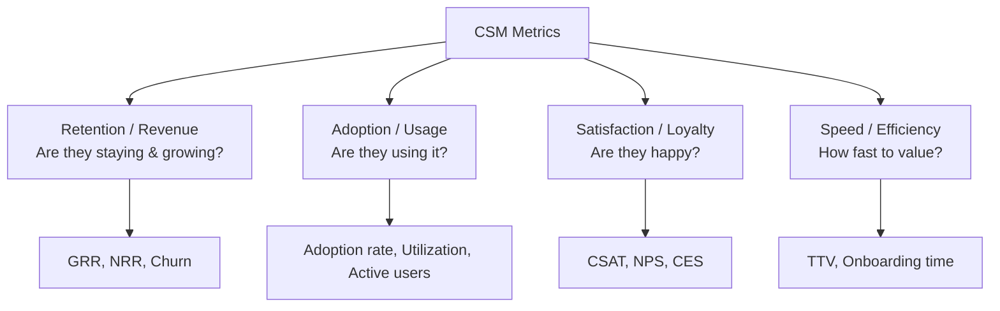
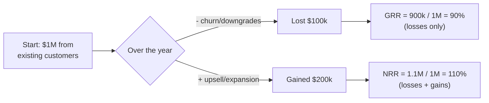
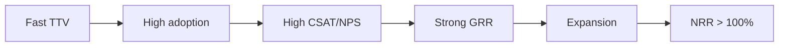

# Part J — Metrics & Business Acumen

> Section goal: CS is a numbers-driven discipline. You don't need to be a finance expert, but you must **speak the language** — know what each core metric means, why it matters, and roughly how it's calculated. When an interviewer drops "NRR" or "GRR," you should answer instantly and even connect it to *what you'd do* to move it.

Covers index item **36**.

---

## 36. The Core CSM Metrics

### The big picture: what the numbers measure

---

### 36.1 Retention & Revenue metrics (the most important)

#### GRR — Gross Retention Rate — *how much revenue you KEPT*
- **What it is:** the % of recurring revenue you retained from existing customers over a period, **ignoring** any upsell/expansion. Only counts losses (churn + downgrades).
- **Key trait:** **can never exceed 100%** (you can't keep more than you started with). 100% = perfect, lost nothing.
- **Plain words:** "Of the money we had from existing customers, how much did we *not lose*?"
- **Analogy:** a bucket of water — GRR measures **how much leaked out** (only the holes, not any refilling).

#### NRR — Net Retention Rate — *revenue kept PLUS growth*
- **What it is:** same as GRR but **includes expansion/upsell.** So it can go **above 100%** if existing customers buy more.
- **Why it's the star metric:** **NRR > 100%** means the company grows *even if it adds zero new customers* — existing accounts expand faster than others churn. Investors love it.
- **Plain words:** "Counting both losses *and* the extra existing customers bought, did our existing-customer revenue grow or shrink?"
- **Analogy:** the same bucket — NRR counts the leaks **and** the extra water poured back in. Above 100% = the bucket is fuller than before.

> 💡 **The one-liner:** "**GRR is defense** (how little did we lose), capped at 100%. **NRR is defense + offense** (did existing accounts grow), and above 100% is the goal. As a CSM I drive GRR by preventing churn and NRR by driving value-led expansion."

#### Churn Rate — *the revenue/customers you LOST*
- **Customer churn** = % of customers who left. **Revenue churn** = % of revenue lost. It's the inverse of retention — the thing you fight.
- **Logo churn** = losing the customer entirely ("logo" = the company's brand/account).

---

### 36.2 Adoption & Usage metrics

| Metric | What it measures | Why it matters |
|--------|------------------|----------------|
| **Adoption rate** | % of licensed users/features actually in use | Low adoption = leading churn signal & idle "shelfware" |
| **Utilization** | How much of purchased capacity is used | Under-utilization weakens the renewal case |
| **Active users (DAU/MAU)** | Daily / Monthly Active Users | Stickiness — are people using it routinely? |
| **Feature adoption** | Which modules are switched on (CASB/DLP/ZTNA) | Idle modules = expansion-at-risk or untapped value |

> 💡 **Adoption is the CSM's leading indicator.** Revenue metrics (GRR/NRR) are *lagging* — by the time revenue drops, it's late. Adoption tells you *early*. You watch adoption to protect retention.

---

### 36.3 Satisfaction & Loyalty metrics

#### CSAT — Customer Satisfaction Score
- **What:** short "how satisfied were you?" survey (often 1–5), usually after an interaction. Measures **short-term, specific** satisfaction.
- **Analogy:** rating a single restaurant meal right after eating.

#### NPS — Net Promoter Score
- **What:** "How likely are you to **recommend** us to a colleague?" on **0–10.** Measures **long-term loyalty/advocacy.**
- **How it's scored:** **Promoters (9–10)** − **Detractors (0–6)** = NPS (Passives 7–8 ignored). Ranges −100 to +100.
- **Analogy:** would you *tell your friends* about this restaurant? (loyalty, not just one meal).

#### CES — Customer Effort Score
- **What:** "How easy was it to get what you needed?" Low effort = high loyalty. People stay where things are *easy.*

| Metric | Question | Measures | Horizon |
|--------|----------|----------|---------|
| **CSAT** | "How satisfied?" | Specific interaction | Short-term |
| **NPS** | "Would you recommend?" | Overall loyalty/advocacy | Long-term |
| **CES** | "How easy was it?" | Friction/effort | Per-interaction |

---

### 36.4 Speed metrics

#### TTV — Time-to-Value
- **What:** how long from purchase to the customer's **first meaningful benefit.** Shorter = better adoption, trust, retention.
- Already core from Part I — here just know it's a **measured** metric, not a vibe.

#### Onboarding time / Time-to-First-Value
- How long to get the customer live and seeing an early win. A key onboarding KPI.

---

### 36.5 How the metrics connect (the cause-and-effect chain)

> **The story to tell:** "These aren't separate scores — they're a chain. Fast **TTV** drives **adoption**, which drives **satisfaction (NPS/CSAT)**, which protects **retention (GRR)**, which enables **expansion (NRR > 100%)**. As a CSM I work the *front* of that chain — value and adoption — because that's what ultimately moves the revenue numbers at the end."

---

## ⭐ Likely Interview Questions for This Section

**Q1. "What's the difference between GRR and NRR?"**
> GRR = revenue retained from existing customers **excluding** expansion — capped at 100%, pure defense. NRR = **includes** upsell, so it can exceed 100%. NRR > 100% means existing accounts grow even with zero new logos. GRR measures churn defense; NRR adds expansion offense.

**Q2. "What metrics would you track as a CSM?"**
> Group them: retention (GRR/NRR, churn), adoption (adoption rate, active users, feature usage), satisfaction (CSAT, NPS), speed (TTV). Emphasize adoption as the **leading** indicator you watch to protect the **lagging** revenue metrics.

**Q3. "What's the difference between CSAT and NPS?"**
> CSAT = short-term satisfaction with a specific interaction ("how satisfied?", 1–5). NPS = long-term loyalty/advocacy ("would you recommend?", 0–10, Promoters − Detractors). CSAT = the meal; NPS = would you tell friends.

**Q4. "Which metric matters most and why?"**
> Defensible answer: **NRR**, because it captures both retention and expansion — the truest measure of whether you're delivering ongoing value to existing customers. But note adoption is the *leading* signal you actually act on day-to-day to move NRR.

**Q5. "How do you connect your daily work to these numbers?"**
> Use the chain: I drive TTV and adoption (my levers) → that lifts satisfaction → protects GRR → enables NRR. I can't directly "make" someone renew, but I can ensure they get value and adopt, which is what makes renewal and expansion happen.

**Q6. "What is churn and how do you reduce it?"**
> Churn = customers/revenue lost. Reduce it by watching leading indicators (adoption, engagement, support sentiment, champion changes), running playbooks early, proving value at QBRs, and multi-threading relationships.

---

## 🧠 30-Second Memory Hooks
- **GRR** = revenue *kept* (defense), **max 100%**. **NRR** = kept **+ expansion**, **can exceed 100%** (the star metric).
- **Bucket analogy:** GRR = the leaks only; NRR = leaks + water poured back in.
- **Churn** = revenue/customers lost (inverse of retention).
- **Adoption** = the **leading** indicator; GRR/NRR are **lagging.** Watch adoption to protect revenue.
- **CSAT** = short-term meal rating; **NPS** = would-you-recommend loyalty (Promoters − Detractors, 0–10); **CES** = how easy.
- **TTV** = time to first value (faster = better).
- **The chain:** TTV → adoption → CSAT/NPS → GRR → expansion → NRR.

---

*Next section:* **Part K — Behavioral & Closing** (turning your Microsoft experience into STAR stories, smart questions to ask, and a final cheat sheet).
