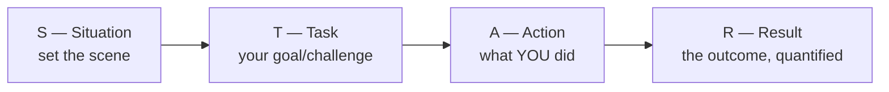
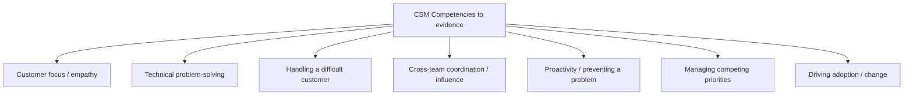
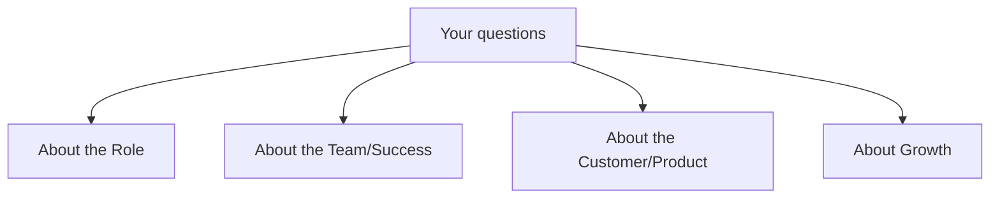

# Part K — Behavioral & Closing

> Section goal: Knowledge gets you in the door; **stories and presence** get you the offer. This section turns your real Microsoft/OneDrive/SharePoint escalation experience into compelling behavioral answers, gives you smart questions to ask, and ends with a one-page cheat sheet for the night before.

Covers index items **37–39**.

---

## 37. STAR Stories — Mapping Your Microsoft Experience to CSM Competencies

### 37.1 What is STAR?
A simple structure so behavioral answers don't ramble. Interviewers are trained to listen for it.

| Letter | Answers | Keep it |
|--------|---------|---------|
| **S — Situation** | What was the context? | Brief — 1–2 sentences |
| **T — Task** | What needed to happen / your responsibility? | 1 sentence |
| **A — Action** | What **you** specifically did (use "I", not "we") | The meat — most of your answer |
| **R — Result** | What happened? **Quantify** if possible | End on impact |

> 💡 **Golden rules:** (1) Talk about **"I"**, not "we" — they're hiring *you*. (2) Spend most time on **Action**. (3) Always land a **Result**, ideally with a number. (4) Pick stories you can tell in **~2 minutes.**

### 37.2 The competencies this role tests (prepare one story each)
The JD points to these. Have a ready story for each — many can come straight from escalation work.

### 37.3 Your experience → CSM translation table
Your escalation background is **rich** with CSM-relevant material. Here's how to reframe it:

| Your Microsoft reality | The CSM competency it proves | How to frame it |
|------------------------|------------------------------|-----------------|
| De-escalating a frustrated enterprise customer on a Sev-A case | **Difficult-customer management, empathy, calm under pressure** | "I owned the relationship, set expectations, communicated proactively, and turned frustration into trust." |
| Deep-diving a OneDrive/SharePoint sync/auth issue | **Technical problem-solving, depth** | "I systematically isolated the root cause across client, network, and identity layers." |
| Coordinating a fix across PG/product, networking, and the customer | **Cross-team orchestration (single-threaded owner!)** | "I drove alignment across multiple internal teams toward one outcome for the customer." |
| Spotting a recurring issue pattern across cases | **Proactivity, trend analysis (JD #4!)** | "I noticed a systemic pattern and pushed a preventative fix, reducing repeat cases." |
| Explaining a complex root cause to a non-technical stakeholder | **Translating technical → business** | "I tailored the message to the audience — detail for engineers, impact for leadership." |
| Juggling multiple escalations at once | **Managing competing priorities** | "I triaged by business impact and kept every stakeholder informed." |

> 💡 **Your strongest narrative thread:** *escalation = the moment a customer relationship is most at risk, and you're the one who saves it.* That is **exactly** what churn-prevention and risk-mitigation are in CS. You've been doing the hardest part of customer success — under pressure — already.

### 37.4 Three model STAR stories (adapt with your real details)

**Story 1 — Difficult customer / turning it around** *(competency: relationship + empathy)*
- **S:** A large enterprise customer was escalating angrily after repeated OneDrive sync failures affecting their workforce.
- **T:** I had to resolve the technical issue *and* rebuild their trust before they churned/escalated to leadership.
- **A:** I took single ownership, set a clear communication cadence, isolated the root cause across client/network/identity, coordinated with the product team for a fix, and kept the customer informed at every step — including honest updates when there was no news.
- **R:** Issue resolved; the customer specifically thanked me for the communication and the relationship recovered. *(Add your real metric/feedback.)*
- **CSM link:** "That's risk mitigation and single-threaded ownership — the core of the CSM role."

**Story 2 — Proactive pattern-spotting** *(competency: proactivity + trend analysis, JD #4)*
- **S:** I noticed several separate customers hitting the same class of SharePoint/auth issue.
- **T:** Rather than just close each ticket, I wanted to stop the recurrence.
- **A:** I analyzed the pattern, documented the systemic root cause, and drove a preventative fix / knowledge-base guidance with the broader team.
- **R:** Repeat cases of that type dropped. *(Quantify if you can.)*
- **CSM link:** "Analyzing case and telemetry trends to surface systemic issues is literally JD responsibility #4."

**Story 3 — Cross-team coordination under pressure** *(competency: orchestration/influence)*
- **S:** A critical issue spanned networking, identity, and the product group, with the customer waiting.
- **T:** No single team owned it end to end; I had to drive resolution across all of them.
- **A:** I became the coordination point — aligned the teams on impact and a plan, chased actions, and gave the customer one consistent voice.
- **R:** Coordinated resolution; customer had a single point of contact throughout.
- **CSM link:** "Aligning Sales, SE, Support, and Product around a customer outcome is exactly what a single-threaded CSM does."

### 37.5 The "why this move?" questions (rehearse these verbatim)

**"Why do you want to move from Support to Customer Success?"**
> "I love the customer relationship and the technical problem-solving — but in escalation I only engage when something's already broken. I want to work **proactively**: prevent problems, drive adoption, and own the customer's *business outcome*, not just the ticket. CS lets me use my technical depth in a more strategic, relationship-led way."

**"Why Netskope / why SSE?"**
> "Two reasons. First, the space — I've lived the shift to cloud at Microsoft; SSE is *the* architecture securing that shift, and Netskope leads it. Second, the role is a **technical** CSM, which fits me: I bring real depth in cloud apps, networking, and identity, and I want to grow into the strategic, value-driven side of customer success. Netskope's data-centric heritage and market leadership make it where I want to do that."

**"Why should we hire you over a CSM who already has 5 years in the title?"**
> "I bring something many career CSMs don't: genuine **technical depth** in cloud, networking, and identity, plus years of owning enterprise relationships *at their most fragile* — escalations. I've done the hard part of customer success under pressure. I'm hungry to add the strategic CS craft on top of a foundation that's hard to teach."

---

## 38. Smart Questions to Ask the Interviewer

Asking good questions signals genuine interest and seniority. **Always have 3–5 ready.** Never say "no, I'm good."

**About the role & success**
- "What does success look like for this CSM in the first 90 days, and in the first year?"
- "How is success *measured* here — which metrics matter most for this role (NRR, adoption, CSAT)?"
- "What's the typical book of business — how many accounts and what segment?"

**About the team & ways of working**
- "How does the CSM team partner with Sales, SEs, and Support day to day?"
- "How mature are the success **playbooks** today — established, or still being built?"
- "What separates a *great* CSM from a good one on this team?"

**About customers & product**
- "What are the most common business outcomes customers buy Netskope to achieve?"
- "Where do customers most often get stuck in adoption, and how does the team help?"
- "Which part of the platform is driving the most expansion right now?"

**About growth & culture**
- "How do you support CSMs who come from a deep technical background growing into the strategic side?"
- "How does the team embody the openness/honesty/transparency values in practice?"

> 💡 **Pick a few that genuinely interest you** and weave in something you learned here ("I read Netskope leads the SSE space — where do you see the platform heading next?"). Tailoring shows you did the work.

---

## 39. Quick-Reference Cheat Sheet (Night-Before Review)

### The whole platform in one breath
> "Netskope is an **SSE leader** — cloud-delivered security that follows users and data after the network perimeter dissolved. One platform converges **SWG** (web), **CASB** (SaaS), **ZTNA** (private apps), **FWaaS** (all ports), and **DLP** (data), with threat protection across all of it, on their private **NewEdge** network."

### The acronym rapid-fire
| Acronym | One-liner |
|---------|-----------|
| **SASE** | SD-WAN + SSE — networking + security from the cloud |
| **SSE** | The security half of SASE (Netskope's category) |
| **SWG** | Secure Web Gateway — inspects web traffic |
| **CASB** | Broker between users & cloud apps — visibility + control |
| **ZTNA** | App-level access, verify every time (VPN replacement) |
| **FWaaS** | Cloud firewall for all ports/protocols |
| **DLP** | Finds & stops sensitive data leaving |
| **Zero Trust** | Never trust, always verify |
| **TLS inspection** | Decrypt → inspect → re-encrypt (trusted middleman) |
| **SAML/OIDC** | Protocols that deliver SSO |
| **OAuth** | Delegated app access via tokens (no password shared) |
| **SCIM** | Auto user provisioning/de-provisioning |
| **GRR / NRR** | Revenue kept (≤100%) / kept + expansion (can be >100%) |
| **TTV** | Time-to-Value — speed to first benefit |
| **CSAT / NPS** | Short-term satisfaction / long-term loyalty |

### The signature stories to have loaded
- **Technical depth:** OneDrive/SharePoint flow through Netskope (steering → TLS inspect → CASB instance awareness → DLP → threat).
- **CASB value:** corporate vs personal OneDrive — a firewall can't tell them apart; Netskope can.
- **Behavioral:** the de-escalation save, the proactive pattern-spot, the cross-team coordination.

### The mindset to project
- **Proactive, not reactive** (CS vs Support).
- **Outcome owner** — business value, not feature counts.
- **Single-threaded owner** — accountable, orchestrates everyone.
- **Translate tech ↔ business** — speak both languages.

### Final confidence reminders
- You **already do** the hardest part of CS — owning enterprise relationships under pressure.
- Your **technical depth** (cloud + networking + identity) is rare and hard to teach.
- For any question: don't go blank — **start from the fundamental concept** (that's what these docs trained you to do), then build up.

---

## ⭐ Likely Behavioral Questions (rapid list — prep a STAR for each)
- "Tell me about a time you turned around an unhappy customer."
- "Tell me about a complex technical problem you solved."
- "Describe a time you coordinated multiple teams to fix something."
- "Give an example of being proactive / preventing a problem."
- "How do you handle competing priorities / multiple urgent customers?"
- "Tell me about a time you explained something technical to a non-technical person."
- "Describe a time you failed or a customer you couldn't save — what did you learn?"
- "Why Customer Success? Why Netskope? Why you?"

---

## 🧠 30-Second Memory Hooks
- **STAR:** Situation → Task → **Action (I, the most)** → **Result (quantified).** ~2 min, "I" not "we".
- **Your thread:** escalation = saving the relationship at its most fragile = the heart of CS risk-mitigation.
- **One story per competency:** difficult customer, technical depth, cross-team, proactivity, prioritization, tech→business translation.
- **Always ask 3–5 questions.** Never "no questions."
- **Why-move answer:** proactive + outcome-ownership + technical depth into strategic CS.
- **Cheat sheet:** the platform in one breath + acronym rapid-fire + signature stories.

---

🎉 **You've completed all sections (A–K).** Open the master index — [Netskope CSM - Interview Prep.md](../Netskope%20CSM%20-%20Interview%20Prep.md) — to navigate the whole prep. Review the 🧠 memory hooks at the bottom of each Part the night before, and you're ready.
