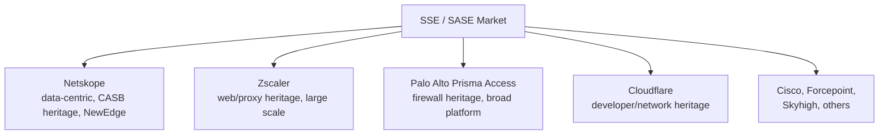
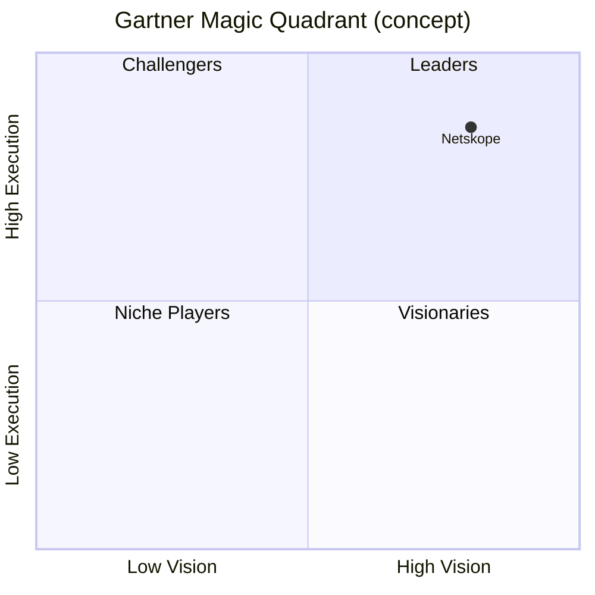
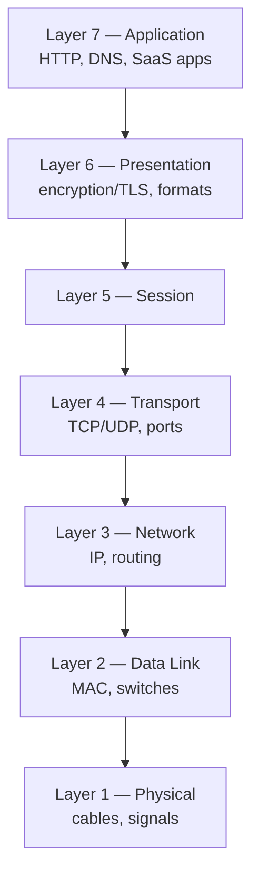
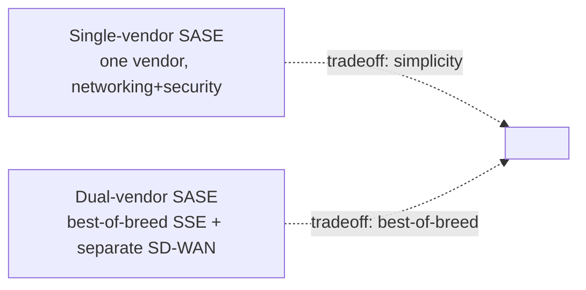

# Part L — Miscellaneous & Deeper Topics

> Section goal: A grab-bag of **deeper, adjacent, and "nice-to-have-an-edge"** topics that don't fit neatly into Parts A–K but can come up — especially with a sharp interviewer or a technical panel. You don't need to *master* all of these, but skimming them means fewer surprises. Treat this as your "extra credit" file.

Covers topics beyond the core index — go as deep as time allows.

---

## L1. Competitive Landscape — Who Netskope Competes With

Interviewers may ask *"what do you know about our competitors?"* or *"how is Netskope different?"* Know the names and the one-line positioning.

| Vendor | Heritage / known for | Netskope's differentiator vs them |
|--------|----------------------|-----------------------------------|
| **Zscaler** | The other SSE leader; strong **web/proxy** + ZTNA, huge scale | Netskope emphasizes **data context & CASB/DLP depth** and app/instance awareness |
| **Palo Alto (Prisma Access)** | **Firewall** giant extending into SASE | Netskope is **cloud-native/data-centric** rather than firewall-extended |
| **Cloudflare** | **Network/developer** platform moving into Zero Trust | Netskope is more **enterprise data-security** focused |
| **Microsoft (Entra/Defender for Cloud Apps)** | Bundled with M365; "good enough" CASB | Netskope offers **deeper, multi-cloud, vendor-neutral** inspection & DLP |

> 💡 **The graceful way to handle "why you over Zscaler?":** Acknowledge Zscaler is a strong, fellow Gartner Leader, then pivot to Netskope's **data-centric heritage** — born as a CASB, deep DLP, granular **app/instance awareness** (corporate vs personal OneDrive), and the privately-owned **NewEdge** network for performance. Never trash a competitor — it looks unprofessional.

> ⚠️ **Note on your role:** As a CSM you're not selling against competitors daily, but knowing this shows commercial awareness and that you understand where Netskope sits.

---

## L2. Gartner Magic Quadrant & Analyst Validation

- The **Gartner Magic Quadrant (MQ)** plots vendors on **Ability to Execute** (y-axis) vs **Completeness of Vision** (x-axis) into four boxes: **Leaders, Challengers, Visionaries, Niche Players.**
- **Netskope is a recognized Leader in the MQ for Security Service Edge (SSE).** Also referenced in **Gartner Peer Insights** and the **Forrester Wave**.
- **Why it matters in CS:** customers buy validated platforms; you can reference analyst standing when reinforcing Netskope as a *strategic* partner (JD #5).

---

## L3. Compliance & Regulatory Frameworks (the alphabet soup)

DLP and CASB exist largely to help customers meet **regulations.** Know what these acronyms govern — a customer's "business objective" is often "comply with X."

| Framework | Governs | One-liner |
|-----------|---------|-----------|
| **GDPR** | EU personal data privacy | Strict rules on handling EU residents' personal data; big fines. |
| **HIPAA** | US healthcare data (PHI) | Protects medical information. |
| **PCI-DSS** | Payment card data | Rules for anyone handling credit-card numbers. |
| **SOC 2** | Service-provider security controls | An audited report proving a vendor's security practices. |
| **ISO 27001** | Information security management | International standard for an organization's security program. |
| **DPDP Act** | India personal data | India's data-protection law (relevant in Bangalore/India context). |
| **SOX** | US financial reporting | Controls over financial data integrity. |

> 💡 **CSM angle:** "A customer's objective is rarely 'turn on DLP' — it's 'pass our **HIPAA** audit' or 'stay **GDPR**-compliant.' My job is to connect the Netskope capability to that regulatory outcome." (This is *exactly* the business-objective → technical-outcome translation from Part I.)

---

## L4. SPLT / The OSI Model Refresher (for the technical panel)

You know networking, but a technical interviewer might probe the **OSI model** — the 7-layer mental model of how network communication works. Know where Netskope operates.

- **Mnemonic (top-down):** **A**ll **P**eople **S**eem **T**o **N**eed **D**ata **P**rocessing (Application→Physical).
- **Where Netskope lives:** primarily **Layer 7 (Application)** — it understands HTTP, apps, and *content*. This is why it can tell corporate vs personal OneDrive (app context), where a traditional firewall historically operated at **Layers 3–4** (just IPs and ports) and couldn't see that detail.
- **The key contrast:** *"Old firewalls = Layer 3/4 (IP + port). Netskope = Layer 7 (app + content + data)."* That single line explains the whole "next-gen" value.

---

## L5. SD-WAN & SASE Convergence (deeper)

From Part C you know **SASE = SD-WAN + SSE.** A deeper note for completeness:
- **Netskope's focus is SSE** (the security half). For the full SASE picture, networking/SD-WAN often comes via **partnerships** (and Netskope has its own **Borderless SD-WAN** offering).
- **Single-vendor SASE vs dual-vendor SASE:** some customers want one vendor for *everything* (single-vendor SASE); others pair a best-of-breed SSE (Netskope) with a separate SD-WAN vendor (dual-vendor). Knowing this distinction signals market awareness.

---

## L6. SWG vs NG-SWG, and "Inline" deep concepts

- **Traditional SWG** = URL filtering + basic malware on web traffic; allow/block whole sites.
- **NG-SWG (Next-Gen SWG)** = Netskope's cloud-native, **content- and app-aware** gateway: understands the **app, the activity (post/upload/download/share), and the data** — not just the URL. This is what enables granular policy like "allow view, block upload."
- **Why "inline" matters:** inline = in the live traffic path = can **block in real time** and applies to **any** app (sanctioned or not). The trade-off is it requires steering and only sees traffic flowing through it. (Cross-reference Part F's inline vs API.)

---

## L7. UEBA & Behavioral Analytics

- **UEBA (User and Entity Behavior Analytics)** = building a **baseline of normal behavior** for each user/device, then flagging anomalies.
- **Examples:** a user who normally downloads 5 files suddenly downloads 5,000; a login from two countries an hour apart ("impossible travel"); mass-sharing late at night.
- **Why it matters:** catches **insider threats** and **compromised accounts** that don't trip a simple rule. It's a *risk-scoring* layer — Netskope can raise a user's risk score and tighten policy automatically.
- **Analogy:** a bank noticing your card was suddenly used abroad — unusual behavior triggers a flag even though the card/PIN are "valid."

> 💡 **Adaptive/risk-based policy:** modern SSE ties **UEBA risk scores** to enforcement — e.g., a high-risk user automatically gets stricter controls (read-only, extra verification). This is **Zero Trust in action** (continuous verification, Part E).

---

## L8. SSPM, CSPM, CWPP — the "posture" cousins

CASB has relatives focused on **configuration/posture** rather than traffic. Worth recognizing the acronyms.

| Acronym | Full name | Protects | One-liner |
|---------|-----------|----------|-----------|
| **SSPM** | SaaS Security Posture Management | SaaS **app settings** | Continuously checks SaaS configs (e.g., M365 settings) for risky misconfigurations. |
| **CSPM** | Cloud Security Posture Management | IaaS/PaaS **cloud configs** | Finds misconfigured AWS/Azure resources (open S3 buckets, etc.). |
| **CWPP** | Cloud Workload Protection Platform | Cloud **workloads** (VMs, containers) | Protects the running workloads themselves. |
| **DSPM** | Data Security Posture Management | **Data** wherever it lives | Discovers & classifies sensitive data across clouds. |

> 💡 **Tie-in:** these address the **customer side of the shared responsibility model** (Part B) — misconfiguration is the #1 cloud breach cause. Netskope's platform extends into SSPM/DSPM territory, reinforcing the "data-centric" story.

---

## L9. RBAC, ABAC & Conditional Access (identity depth)

Builds on Part E. How access *decisions* get made:
- **RBAC (Role-Based Access Control)** — permissions based on your **role** (e.g., "Finance role can see Finance folder"). Simple, common.
- **ABAC (Attribute-Based Access Control)** — permissions based on **multiple attributes** (role **+** device health **+** location **+** time **+** risk). More granular; the basis of Zero Trust decisions.
- **Conditional Access** (Microsoft term you may know) — the **if-then** policies in Entra ID: *"IF a risky sign-in, THEN require MFA / block."* A direct cousin to how Netskope enforces context-aware policy.

> 💡 **Your AD/Entra knowledge shines here** — Conditional Access is exactly the kind of identity-driven, context-aware control Netskope layers on for cloud and private-app access.

---

## L10. Key Netskope-Specific Terms Glossary (quick hits)

| Term | Meaning |
|------|---------|
| **Netskope ONE** | The unified platform brand for all services |
| **Intelligent SSE** | Netskope's converged security services (the pillars) |
| **NewEdge** | Netskope's privately-owned global network of data centers/PoPs |
| **Cloud Confidence Index (CCI)** | Risk-rating database of 60,000+ cloud apps |
| **Cloud Exchange** | Integration framework (share telemetry with SIEM/SOAR, etc.) |
| **Cloud XD** | The deep-analysis engine that decodes app activity/context |
| **Real-time Protection policy** | Inline policies acting on live traffic |
| **API Data Protection** | Out-of-band policies scanning data at rest in SaaS |
| **Steering** | Directing user traffic to Netskope (Client/PAC/tunnel) |
| **Publisher** | The lightweight connector that brokers ZTNA access to a private app |
| **Instance awareness** | Distinguishing corporate vs personal tenant of the same app |
| **Tenant** | A customer's isolated instance of a cloud service (e.g., your M365 tenant) |

---

## L11. The AI/GenAI Angle (very current — bonus points)

A *hot* 2024–2026 topic. Showing awareness signals you're current.
- **The problem:** employees paste sensitive data into **public GenAI tools** (ChatGPT, Gemini, Copilot) — a new **data-leakage** and **shadow-IT** channel.
- **How SSE/Netskope helps:** discover which AI apps are used (CASB), risk-rate them (CCI), and apply **DLP** to block/coach when someone tries to paste sensitive data into a public LLM — while still *allowing safe use* (e.g., the sanctioned enterprise version).
- **The framing:** "GenAI is the newest shadow-IT and data-exfiltration vector. Netskope's CASB+DLP gives customers **visibility and granular control** so they can adopt AI safely instead of banning it outright."

> 💡 **Great QBR/expansion hook:** helping a customer roll out **safe GenAI usage** is a very current business outcome — and a natural expansion conversation.

---

## L12. Things Customers Actually Struggle With (real-world empathy)

Speaking to *real* adoption friction shows maturity beyond theory:
- **TLS-inspection scope** — deciding what to decrypt vs bypass (privacy/compliance balance).
- **False positives in DLP** — too aggressive = user backlash (hence monitor→coach→block, Part G).
- **Steering edge cases** — certificate-pinned apps, captive portals, VPN conflicts.
- **Change management** — users resisting new controls; needs comms + coaching, not just tech.
- **Policy sprawl** — too many overlapping policies become unmanageable; periodic cleanup helps.
- **Proving value** — without baselining at the start, it's hard to *show* improvement later (set metrics at handoff!).

> 💡 **Interview gold:** naming these shows you understand the *human and operational* side of adoption — that CS is change management, not just deployment.

---

## 🧠 30-Second Memory Hooks
- **Competitors:** Zscaler (web/proxy), Palo Alto (firewall), Cloudflare (network) — Netskope = **data-centric, CASB/DLP depth, NewEdge.** Never trash competitors.
- **Gartner MQ:** Netskope = **Leader in SSE.** Leaders/Challengers/Visionaries/Niche.
- **Compliance:** GDPR (EU privacy), HIPAA (health), PCI-DSS (cards), SOC 2, ISO 27001, DPDP (India). Customer objective = compliance.
- **OSI:** old firewall = L3/4 (IP/port); Netskope = **L7 (app + data).**
- **UEBA** = baseline normal, flag anomalies (insider/compromised accounts) → risk-based policy.
- **Posture cousins:** SSPM (SaaS config), CSPM (cloud config), DSPM (data) — the shared-responsibility gap.
- **RBAC/ABAC/Conditional Access** — role vs attributes vs if-then; your Entra knowledge fits.
- **GenAI** = newest shadow-IT/data-leak vector → CASB+DLP enable *safe* adoption.
- **Real friction:** TLS scope, DLP false positives, steering edge cases, change management, proving value.

---

*This file is your "extra edge."* Skim it after you're solid on A–K. For practice questions, see **Part M**.
