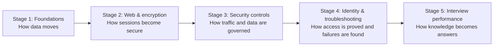

# Networking, Security & Azure Identity - Study Guide (Beginner to Advanced)

> **Goal:** build enough understanding to explain networking and security concepts clearly in an interview, reason through scenarios, and avoid memorizing disconnected definitions.

---

## About this guide

- **Written for a complete beginner.** Every acronym and technical term will be explained before it is used.
- **Designed for a few focused days.** The first pass is organized as a six-day sprint; later review turns recognition into interview recall.
- **Simple first, precise second.** Each Part starts with an everyday analogy, then adds packet-level detail, trade-offs, troubleshooting, and interview questions.
- **Vendor-neutral foundations, Microsoft examples.** Core networking concepts apply everywhere; identity examples use Microsoft Entra ID and Azure.
- **Interview focused.** The final Parts include applied scenarios, a 115-question technical bank, behavioral preparation, and a night-before review sheet.

### Terminology assumptions

- **SSL vs TLS:** Secure Sockets Layer (SSL) is obsolete; modern secure connections use Transport Layer Security (TLS). Both names are covered because interviewers and products still say "SSL."
- **Web application filter:** this is treated as a **Web Application Firewall (WAF)**. A WAF filters HTTP/HTTPS requests to protect web applications.
- **Direct proxy:** this is treated as a comparison among a direct connection, an explicit forward proxy, and a transparent proxy.
- **Azure identity:** current product names use **Microsoft Entra ID** (formerly Azure Active Directory).

---

## Learning path

**Recommended order:** Part A through Part P. Each Part assumes only the Parts before it.

---

## Grouped index

### Stage 1 - Networking foundations

**Part A - Networks from Zero**

1. What a network is: endpoints, links, messages, and shared rules
2. LAN, WAN, internet, intranet, cloud network, and the client-server model
3. Bits, bytes, frames, packets, segments, datagrams, and streams
4. NICs, MAC addresses, switches, routers, gateways, access points, and modems
5. Bandwidth, throughput, latency, jitter, packet loss, and availability
6. Unicast, broadcast, multicast, and anycast
7. A browser-to-website journey in plain English

**Part B - OSI, TCP/IP & Encapsulation**

8. Why layered models exist and how to use them without overthinking them
9. The seven OSI layers with one practical example per layer
10. The four-layer TCP/IP model and how it maps to OSI
11. Encapsulation and decapsulation: headers, payloads, and trailers
12. Protocol Data Units and which device acts at which layer
13. Following one HTTPS request down and back up the stack
14. Interview traps: "Layer 2 vs Layer 3" and where TLS belongs

**Part C - Addressing, Local Delivery & Routing**

15. IPv4 and IPv6 addresses, prefixes, subnet masks, and CIDR
16. Public, private, loopback, link-local, and unspecified addresses
17. Binary subnet math, multi-octet prefixes, VLSM, and graded practice
18. Default gateways, static/dynamic routes, longest-prefix match, OSPF, BGP, and convergence
19. NAT, PAT, and why private devices can reach the internet
20. ARP for IPv4 and Neighbor Discovery for IPv6
21. ICMP, ping, traceroute, TTL/hop limit, and common error messages
22. Layer 2 switching, VLAN trunks, STP/RSTP, LACP, multicast, Wi-Fi security, and troubleshooting

**Part D - Core Services & Protocol Map**

23. DNS: names, records, recursion, caching, TTL, and the lookup path
24. DHCP: discover, offer, request, acknowledge, leases, renewal, and relay
25. Ports, well-known services, client ephemeral ports, and sockets
26. SSH, FTP/FTPS/SFTP, SMTP, IMAP, POP3, SMB, and RDP
27. NTP hierarchy/offset/drift, SNMP, LDAP/LDAPS, Kerberos, and Syslog
28. QUIC, HTTP/3, WebSocket, gRPC, and when they appear
29. Protocol/port quick-reference table and why ports are clues, not proof

**Part E - TCP, UDP & Socket Conversations**

30. Connection-oriented vs connectionless communication
31. TCP three-way handshake, sequence numbers, acknowledgements, and flags
32. Reliability, retransmission, ordering, flow control, and congestion control
33. TCP connection close, resets, timeouts, and common failure patterns
34. UDP behavior, strengths, trade-offs, and common use cases
35. The socket five-tuple and how simultaneous conversations stay separate
36. Choosing TCP, UDP, or QUIC in scenario questions

### Stage 2 - Web traffic and encryption

**Part F - HTTP, HTTPS & APIs**

37. URL anatomy and what a browser does after Enter is pressed
38. HTTP requests and responses: methods, headers, body, and versions
39. Status-code families, cookies, sessions, caching, and content types
40. Persistent connections, multiplexing, compression, and redirects
41. REST APIs, JSON, idempotency, authentication headers, and CORS
42. HTTP/1.1 vs HTTP/2 vs HTTP/3
43. HTTPS as HTTP carried inside TLS

**Part G - TLS, Certificates & PKI**

44. Encryption, hashing, signing, and encoding: four different jobs
45. Symmetric vs asymmetric cryptography and why TLS uses both
46. Certificates, public/private keys, Certificate Authorities, and trust chains
47. The TLS handshake: ClientHello to protected application data
48. SNI, ALPN, cipher suites, certificate validation, and hostname matching
49. TLS termination, bridging, pass-through, and enterprise inspection
50. mTLS, certificate revocation, OCSP, expiry, and common TLS failures
51. Why SSL is obsolete and how to answer "SSL vs TLS"

**Part H - Direct, Forward & Reverse Proxy Traffic**

52. Direct connections compared with proxied connections
53. Forward proxies: explicit, transparent, and PAC-file based
54. Reverse proxies, load balancers, API gateways, and CDNs
55. CONNECT tunnels and how HTTPS crosses a forward proxy
56. Proxy authentication, header changes, TLS inspection, and certificate effects
57. Source-IP visibility, X-Forwarded-For, and trust boundaries
58. Proxy bypasses, loops, timeouts, and troubleshooting flow

### Stage 3 - Network and cloud security controls

**Part I - Firewalls, NGFW & WAF**

59. Why firewalls exist: allow lists, deny lists, zones, and policy order
60. Stateless filters vs stateful firewalls and connection tracking
61. Network firewalls vs host firewalls vs cloud security groups
62. Next-Generation Firewalls: application awareness, identity, IPS, and TLS inspection
63. Application signatures: identifying behavior beyond port numbers
64. WAF operation: HTTP-aware filtering and common web attacks
65. WAF vs NGFW vs reverse proxy vs IDS/IPS
66. Rule design, false positives, logging, and least privilege

**Part J - SWG, CASB, DLP, SASE & App Connectors**

67. Secure Web Gateway: controlling user access to internet destinations
68. CASB: visibility and policy for cloud application use
69. DLP: discovering, classifying, monitoring, and protecting sensitive data
70. Inline vs API-based controls and data at rest, in motion, and in use
71. Application signatures, sanctioned/unsanctioned apps, and shadow IT
72. Application connectors: outbound tunnels, private application access, and reduced exposure
73. Zero Trust Network Access, SASE, and SSE in plain English
74. How SWG, CASB, DLP, NGFW, WAF, and identity controls work together

**Part K - VPNs & IPsec**

75. What a tunnel is and what a VPN does and does not guarantee
76. Remote-access vs site-to-site VPNs; full tunnel vs split tunnel
77. IPsec architecture: AH, ESP, transport mode, and tunnel mode
78. IKE negotiation, Security Associations, proposals, keys, and lifetimes
79. Policy-based vs route-based VPNs and NAT traversal
80. SSL/TLS VPNs compared with IPsec VPNs
81. Common VPN failures: routing, DNS, MTU, authentication, and mismatched proposals

### Stage 4 - Identity, packet analysis, and applied reasoning

**Part L - Azure Identity & Authentication Protocols**

82. Identity, authentication, authorization, accounting, and federation
83. Microsoft Entra ID: tenants, users, groups, applications, and service principals
84. Passwords, passwordless, MFA, Conditional Access, device identity, PIM, access reviews, and lifecycle governance
85. Tokens, claims, scopes, roles, consent, and token lifetime
86. OAuth 2.0 roles and common flows without confusing OAuth with authentication
87. OpenID Connect, SAML, WS-Federation, Kerberos, NTLM, and LDAP
88. Managed identities, workload identities, secrets, and certificates
89. Single sign-on, federation, B2B/B2C concepts, and hybrid identity
90. Diagnosing sign-in and authorization failures from logs and symptoms

**Part M - Wireshark & Systematic Troubleshooting**

91. What packet capture can prove, what it cannot prove, and capture ethics
92. Wireshark interface, capture/display filters, profiles, and a 20-minute DNS-to-HTTPS lab
93. Reading Ethernet, ARP, IP, ICMP, TCP, UDP, DNS, HTTP, and TLS packets
94. Following streams, inspecting handshakes, and using expert information
95. Recognizing retransmissions, duplicate ACKs, resets, zero windows, and fragmentation
96. A layer-by-layer troubleshooting method: physical to application
97. Using ping, tracert/traceroute, ipconfig, nslookup, curl, Test-NetConnection, and route tools
98. Correlating packet evidence with firewall, proxy, identity, application, and ETW logs

**Part N - Applied Architecture & Troubleshooting Scenarios**

99. Draw and explain a user-to-SaaS traffic flow through DNS, SWG, TLS, and identity
100. Draw and explain an internet-to-web-app flow through CDN, WAF, proxy, and application tiers
101. Diagnose "website does not load" without guessing
102. Diagnose DNS, TCP, TLS, HTTP, proxy, firewall, VPN, and authentication failures separately
103. Design secure access for users, branches, remote workers, cloud apps, and private apps
104. Compare controls, identify overlap, and choose the correct enforcement point
105. Read a small packet trace and present evidence, hypothesis, test, and conclusion
106. Whiteboard and scenario-answer frameworks for technical interviews

### Stage 5 - Extra depth and interview performance

**Part O - Miscellaneous & Deeper Topics**

107. IPv6 deeper dive, dual stack, transition, and common misconceptions
108. MTU, MSS, fragmentation, Path MTU Discovery, and black-hole symptoms
109. High availability, load balancing, health probes, failover, and a measured failure exercise
110. SDN, SD-WAN, QoS, cloud service models, Azure hierarchy/traffic services, peering, and private access
111. IDS/IPS, EDR/XDR, SIEM/SOAR, NAC, and where they fit
112. Zero Trust principles, defense in depth, and the shared-responsibility model
113. Current direction: encrypted DNS, QUIC, passwordless identity, SSE, and identity-aware access

**Part P - Interview Question Bank (115) & Behavioral Closing**

114. 115 technical questions: 23 basic (20%), 23 intermediate (20%), and 69 advanced (60%)
115. Concise answer hints and cross-references to the teaching Parts
116. Packet-reading, architecture, comparison, and troubleshooting scenarios
117. Self-quiz confidence tracker and weak-topic review loop
118. STAR method and adaptable troubleshooting/teamwork stories
119. "Why networking/security?", "Why this role?", and "Why you?"
120. Questions to ask the interviewer and a one-page night-before sheet

---

## Parts status

| Part | File | Focus | Est. first pass | Status |
|------|------|-------|-----------------|--------|
| A | [prep/Part-A-networks-from-zero.md](prep/Part-A-networks-from-zero.md) | Basic vocabulary, devices, and performance | 45 min | Complete |
| B | [prep/Part-B-osi-tcpip-encapsulation.md](prep/Part-B-osi-tcpip-encapsulation.md) | Layer models and packet journey | 50 min | Complete |
| C | [prep/Part-C-addressing-local-delivery-routing.md](prep/Part-C-addressing-local-delivery-routing.md) | IP, subnetting, routing, NAT, ARP, ICMP | 75 min | Complete |
| D | [prep/Part-D-core-services-protocol-map.md](prep/Part-D-core-services-protocol-map.md) | DNS, DHCP, ports, and protocol catalog | 60 min | Complete |
| E | [prep/Part-E-tcp-udp-sockets.md](prep/Part-E-tcp-udp-sockets.md) | Transport behavior and socket conversations | 60 min | Complete |
| F | [prep/Part-F-http-https-apis.md](prep/Part-F-http-https-apis.md) | Web traffic and APIs | 55 min | Complete |
| G | [prep/Part-G-tls-certificates-pki.md](prep/Part-G-tls-certificates-pki.md) | Encryption, TLS handshake, and certificates | 75 min | Complete |
| H | [prep/Part-H-direct-forward-reverse-proxies.md](prep/Part-H-direct-forward-reverse-proxies.md) | Proxy traffic patterns | 60 min | Complete |
| I | [prep/Part-I-firewalls-ngfw-waf.md](prep/Part-I-firewalls-ngfw-waf.md) | Firewall families and application controls | 65 min | Complete |
| J | [prep/Part-J-swg-casb-dlp-connectors.md](prep/Part-J-swg-casb-dlp-connectors.md) | Cloud-delivered security controls | 75 min | Complete |
| K | [prep/Part-K-vpn-ipsec.md](prep/Part-K-vpn-ipsec.md) | VPN and IPsec design/troubleshooting | 60 min | Complete |
| L | [prep/Part-L-azure-identity-auth-protocols.md](prep/Part-L-azure-identity-auth-protocols.md) | Entra ID and authentication protocols | 90 min | Complete |
| M | [prep/Part-M-wireshark-troubleshooting.md](prep/Part-M-wireshark-troubleshooting.md) | Packet analysis and troubleshooting tools | 90 min | Complete |
| N | [prep/Part-N-applied-scenarios.md](prep/Part-N-applied-scenarios.md) | End-to-end architecture and diagnosis | 75 min | Complete |
| O | [prep/Part-O-miscellaneous-deeper-topics.md](prep/Part-O-miscellaneous-deeper-topics.md) | Advanced and adjacent topics | 60 min | Complete |
| P | [prep/Part-P-interview-question-bank-behavioral.md](prep/Part-P-interview-question-bank-behavioral.md) | 115 questions, STAR, and closing | 120 min | Complete |

---

## Six-day first-pass plan

| Day | Parts | Outcome |
|-----|-------|---------|
| 1 | A, B, C | Explain how a packet moves locally and across networks |
| 2 | D, E, F | Explain core services, TCP/UDP, and a web request |
| 3 | G, H, I | Explain TLS, proxies, firewalls, NGFW, and WAF |
| 4 | J, K, L | Explain cloud security controls, VPN/IPsec, and Azure identity |
| 5 | M, N | Analyze packet evidence and solve end-to-end scenarios |
| 6 | O, P | Add advanced depth, answer aloud, and close interview gaps |

This is a **first pass**, not permanent mastery. On each day, spend about 70% of the time learning and 30% answering questions aloud without looking at the notes.

### Linear dependency checkpoints

The Parts are deliberately ordered to avoid circular learning. Do not advance because a page was read; advance when you can complete the stage checkpoint without notes.

| After Parts | You should be able to do | If not, return to |
|-------------|--------------------------|-------------------|
| A-B | Narrate a browser request through endpoint, link, packet, transport, and application layers | Device roles, PDU names, OSI/TCP-IP mapping, encapsulation |
| C | Calculate `/26` and `/20`, allocate a small VLSM plan, explain local-vs-gateway delivery, compare OSPF/BGP, and diagnose a basic VLAN/Wi-Fi fault | Binary table, routing sources, STP/trunks, Wi-Fi join flow |
| D-E | Explain DNS/DHCP/NTP and interpret TCP handshake, ACK progress, reset, timeout, window, and UDP trade-offs | Protocol map, ports/sockets, TCP/UDP sections |
| F-H | Read HTTP status/headers, explain a TLS chain/handshake, and draw direct, forward-proxy, reverse-proxy, and CONNECT paths | HTTP semantics, PKI/TLS, two-leg proxy model |
| I-J | Select firewall/NGFW/WAF/SWG/CASB/DLP/ZTNA controls by asset, traffic direction, application, identity, and data | Security vocabulary and enforcement-point tables |
| K-L | Draw IKEv2/IPsec and OIDC/OAuth/SAML flows; distinguish tunnel, token, identity, permission, and governance failures | VPN stages, token boundaries, Conditional Access, PIM/reviews |
| M-N | Capture one DNS-to-HTTPS flow and solve an unseen scenario with path, boundary, evidence, alternative, and verification | Wireshark lab and eight scenario answer guides |
| O-P | Explain IPv6/MTU/HA/QoS/Azure placement and score against the 115-question readiness gates | Advanced examples, HA exercise, weak-topic tracker |

The dependency direction is always **A -> P**. Later Parts may remind you of earlier concepts, but they do not redefine them incompatibly.

---

## Requested-topic coverage map

| Requested area | Primary Parts |
|----------------|---------------|
| Networking fundamentals | A, B |
| TCP/IP and OSI | B, E |
| IP addressing, ARP, ICMP, routing | C |
| DNS and DHCP | D |
| Different networking protocols | D, E, F, O |
| HTTP and HTTPS | F, G |
| TLS and SSL | G |
| Direct, forward, and reverse proxies | H |
| Firewalls and Next-Generation Firewalls | I |
| Web Application Firewall/filter | I |
| Secure Web Gateway | J |
| CASB | J |
| Application signatures and app connectors | I, J |
| Data Loss Prevention | J |
| IPsec and VPN | K |
| Azure identity and authentication protocols | L |
| Wireshark and troubleshooting | M, N |
| Binary subnetting and VLSM | C |
| Static routing, OSPF, and BGP | C |
| Switching loops, STP/RSTP, trunks, and LACP | C |
| Wi-Fi, WPA2/WPA3, 802.1X, and roaming | C |
| NTP and time troubleshooting | D |
| Security foundations and risk vocabulary | I |
| PIM, access reviews, and identity lifecycle | L |
| QoS and congestion treatment | O |
| Azure networking service placement | O |
| Guided hands-on labs and exercises | C, M, N, O |
| Advanced and current topics | O |
| Technical and behavioral interview practice | P |

---

## How each Part will teach

Every teaching Part will contain:

1. A zero-knowledge explanation and everyday analogy
2. A vocabulary table with every acronym expanded
3. Mermaid diagrams showing traffic or decision flow
4. A plain-English deep dive for the difficult ideas
5. Comparison tables and a quick-reference sheet
6. Worked examples and realistic troubleshooting scenarios
7. Five to eight likely interview questions with model answers
8. Thirty-second memory hooks and a pointer to the next Part

---

## How to use this guide

1. Follow the six-day order for the first pass.
2. Draw each important flow from memory: packet journey, TCP, DNS, TLS, proxy, VPN, and sign-in.
3. Answer every end-of-Part interview question aloud before reading its model answer.
4. Record weak concepts in the Part P tracker and revisit only those concepts.
5. Practice explaining the same topic at three levels: to a child, to a colleague, and to an interviewer.

---

*Status: complete. All 16 Parts are ready; use Part P for retrieval practice and mock interviews.*