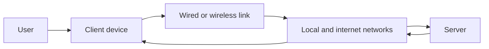
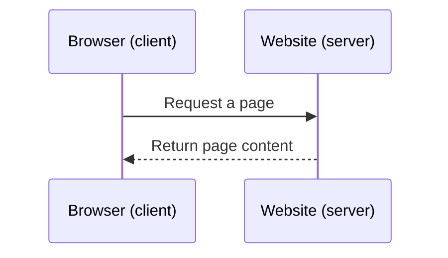
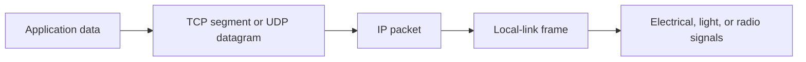
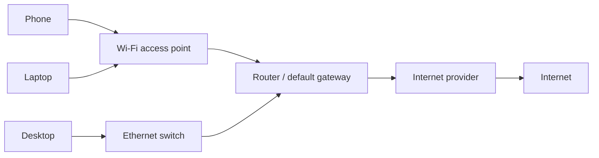
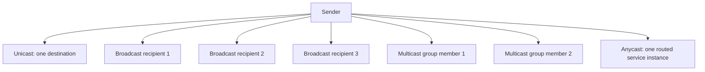
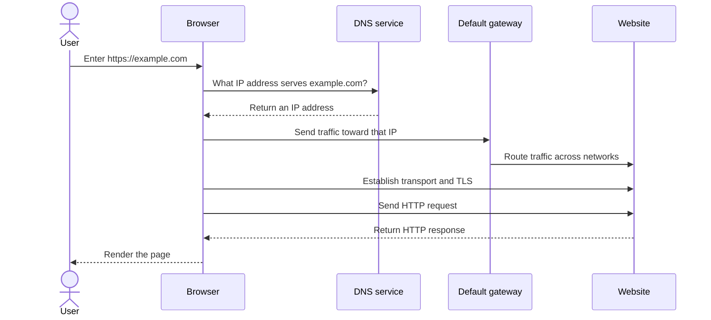

# Part A - Networks from Zero

> **Section goal:** understand what a network does, recognize its basic building blocks, and describe a simple browser-to-website journey without relying on unexplained jargon.

Covers index items **1-7**.

[Back to the master guide](../Networking%20Security%20and%20Azure%20Identity%20-%20Study%20Guide.md)

---

## Start Here: The One-Sentence Mental Model

A **network** is a group of devices that exchange data by following shared rules.

Think of a postal system:

- Devices are buildings.
- Addresses identify destinations.
- Links are roads.
- Data is divided into deliverable packages.
- Network devices choose where packages go.
- Protocols are the addressing, packaging, and delivery rules.

This analogy is not perfect, but it gives every later concept somewhere to attach.

---

## 1. What a Network Is

A network allows two or more **endpoints** to exchange **messages** across **links** by using **protocols**.

### Core vocabulary

| Term | Plain meaning | Everyday analogy | Why it matters |
|------|---------------|------------------|----------------|
| Endpoint or host | A device that sends or receives data | A house sending or receiving mail | Communication begins and ends here |
| Node | Any device participating in a network | Any stop in a delivery system | A node may be an endpoint or an intermediate device |
| Link | The medium connecting devices | A road | It may be copper, fiber, radio, or virtual |
| Message | Information one device wants to send | A letter | Networks exist to transport messages |
| Protocol | Agreed communication rules | Postal formatting rules | Both sides must interpret data the same way |
| Address | A value identifying a location or interface | A street address | It helps data reach the intended destination |
| Path | The links and devices data crosses | A delivery route | Failures or delays can occur anywhere on it |

### The four questions behind most networking

For almost any network conversation, ask:

1. **Who is communicating?** Identify the source and destination.
2. **What are they sending?** Identify the application and protocol.
3. **How will it get there?** Identify addresses, links, and network devices.
4. **What could stop it?** Check reachability, policy, reliability, and application behavior.

### Physical and virtual networks

A network does not have to be made only of visible cables and boxes.

- A **physical network** uses real network interface cards, cables, radio waves, switches, and routers.
- A **virtual network** represents similar functions in software, such as an Azure Virtual Network.
- A typical cloud network is virtual but still ultimately runs on physical infrastructure.

> 🔍 **Plain-English deep dive: data is not teleported**
>
> A video call can feel instant, but the devices repeatedly convert information into electrical, light, or radio signals. Intermediate devices receive enough information to forward the data toward its destination. The receiver reconstructs the data and gives it to the application. Later Parts explain the exact layers and headers involved.

---

## 2. LAN, WAN, Internet, Intranet, Cloud, and Client-Server

Network names often describe either **scope** or **purpose**.

| Term | Expanded name | Plain meaning | Example |
|------|---------------|---------------|---------|
| LAN | Local Area Network | A network covering a limited area | Home, office floor, or small campus |
| WLAN | Wireless Local Area Network | A LAN using Wi-Fi radio links | Home Wi-Fi |
| WAN | Wide Area Network | A network connecting distant locations | Company offices in two countries |
| Internet | Inter-network | The global network of interconnected networks | Public websites and services |
| Intranet | Internal network | Private services intended for an organization | An employee-only portal |
| Cloud network | Software-defined provider network | A logically isolated network in a cloud platform | An Azure Virtual Network |

### Client and server

A **client** initiates a request for a service. A **server** listens for requests and provides that service.

**Analogy:** in a restaurant, a customer requests a meal and the kitchen provides it. The words describe roles in an interaction, not permanent device types.

- A web browser acts as a client when requesting a page.
- A web server responds with content.
- The same computer can be a client in one conversation and a server in another.

### Client-server vs peer-to-peer

| Client-server | Peer-to-peer |
|---------------|--------------|
| Central service responds to clients | Peers can both request and provide resources |
| Easier centralized control | Can distribute work and data |
| Server may need redundancy to avoid a single failure point | Coordination and trust can be harder |
| Common for websites, email, and enterprise apps | Common in some file-sharing and real-time systems |

### Internet vs web

The **internet** is the global networking infrastructure. The **World Wide Web** is one service that uses that infrastructure, mainly through the Hypertext Transfer Protocol (HTTP) and HTTP protected by TLS (HTTPS).

Email, online gaming, voice calls, and Virtual Private Network (VPN) traffic can use the internet without being web browsing.

---

## 3. Bits, Bytes, Frames, Packets, Segments, Datagrams, and Streams

Large messages are divided into smaller units for transport. Different networking layers use different names for those units.

### Basic measurement

- A **bit** is a binary value: `0` or `1`.
- A **byte** is normally eight bits.
- Network speed is commonly measured in **bits per second**, such as Mbps or Gbps.
- File size is commonly measured in **bytes**, such as MB or GB.

| Written as | Usually means | Example |
|------------|---------------|---------|
| b | bit | `100 Mb/s` network rate |
| B | byte | `100 MB` file size |
| K/M/G | thousand/million/billion in many network-rate contexts | `1 Gb/s` link |

An idealized transfer time can be estimated as:

$$
\text{time in seconds} = \frac{\text{file size in bits}}{\text{rate in bits per second}}
$$

Real transfers take longer because of protocol overhead, delay, congestion, and competing traffic.

### Names for units of data

| Unit | Where the name is commonly used | Simple description |
|------|----------------------------------|--------------------|
| Frame | Local-link delivery | A local delivery envelope, such as Ethernet |
| Packet | Internet Protocol delivery | An IP-addressed unit that routers forward |
| Segment | Transmission Control Protocol (TCP) transport | A unit of a reliable TCP byte stream |
| Datagram | User Datagram Protocol (UDP) transport | A self-contained UDP message; IP packets are also called datagrams |
| Stream | Application view of TCP | An ordered flow of bytes without built-in message boundaries |
| Payload | Any layer | The useful data carried inside that layer's wrapper |
| Header | Any layer | Control information placed before the payload |
| Trailer | Some layers | Control information placed after the payload |

> 🔍 **Plain-English deep dive: one object, several wrappers**
>
> Imagine placing a note in a small envelope, that envelope in a courier bag, and the bag in a delivery van. The note did not become three unrelated messages. Each delivery stage added the information it needed. Networking similarly wraps application data with transport, IP, and local-link information. This is called **encapsulation** and is the focus of Part B.

---

## 4. NICs, Switches, Routers, Gateways, Access Points, and Modems

Different devices solve different delivery problems.

| Component | Main job | Think of it as | Important distinction |
|-----------|----------|----------------|-----------------------|
| NIC | Connect a host to a network | The building's mailroom door | NIC means Network Interface Card/Controller |
| Switch | Connect devices within a local network | A building mailroom sorting by internal destination | Mainly forwards local frames using Media Access Control (MAC) addresses |
| Router | Connect different IP networks | A regional sorting center | Forwards IP packets using routes |
| Default gateway | Router a host uses for non-local destinations | The local exit toward other regions | It is a role, often performed by a router |
| Wireless access point | Bridge Wi-Fi devices onto a LAN | A wireless entrance to the local road | It is not automatically the internet router |
| Modem/optical network terminal (ONT) | Adapt signals for an internet-provider link | A road-surface adapter | Cable or Digital Subscriber Line (DSL) often uses a modem; fiber often uses an ONT |
| Firewall | Enforce traffic policy | A security checkpoint | It permits or blocks based on rules and context |
| Load balancer | Distribute service traffic | A receptionist choosing an available desk | It improves scale and availability |

**MAC** means Media Access Control. A MAC address identifies a network interface for local-link delivery. IP addressing and MAC addressing solve different problems; Part C connects them.

### A common home setup

A device sold as a "Wi-Fi router" often combines several roles:

- Ethernet switch
- Wireless access point
- IP router/default gateway
- Firewall
- Dynamic Host Configuration Protocol (DHCP) server, which leases network settings
- Network Address Translation device

Do not assume one box means one networking function.

### Hub vs switch

An old Ethernet **hub** repeats incoming signals to every port. A **switch** learns where local interfaces are and forwards frames more selectively. Modern networks normally use switches.

---

## 5. Bandwidth, Throughput, Latency, Jitter, Loss, and Availability

"The network is slow" is not a diagnosis. Several measurable properties can produce that experience.

| Metric | Plain meaning | Road analogy | Typical impact |
|--------|---------------|--------------|----------------|
| Bandwidth | The theoretical carrying capacity | Number of traffic lanes | Upper limit on data rate |
| Throughput | Useful data delivered per second | Cars reaching the destination per minute | Actual transfer performance |
| Latency | Time for data to travel | Travel time for one car | Interactive delay |
| Round-trip time | Time to go to a destination and receive a response | Out-and-back travel time | Commonly observed with ping |
| Jitter | Variation in delay | Travel time changing on every trip | Choppy voice/video |
| Packet loss | Data that never arrives | Cars lost before arrival | Retransmissions, pauses, or gaps |
| Availability | Portion of time a service is usable | Road being open | Reliability over time |

### Examples

- A large download needs good **throughput**.
- A video call needs low **latency**, low **jitter**, and low **loss**.
- A service can have a high-bandwidth connection but still respond slowly because its application or database is overloaded.

### Serialization delay

Even before propagation and processing, placing bits onto a link takes time:

$$
\text{serialization delay} = \frac{\text{packet size in bits}}{\text{link rate in bits per second}}
$$

For beginner interviews, the important point is simpler: **capacity and delay are not the same measurement**.

### Availability shorthand

| Availability | Approximate maximum downtime per 30-day month |
|--------------|------------------------------------------------|
| 99% | 7 hours 12 minutes |
| 99.9% | 43 minutes 12 seconds |
| 99.99% | 4 minutes 19 seconds |

These are mathematical targets, not proof that every user had a good experience.

---

## 6. Unicast, Broadcast, Multicast, and Anycast

These terms describe how many destinations a sender intends to reach.

| Delivery type | Pattern | Example | Key boundary |
|---------------|---------|---------|--------------|
| Unicast | One sender to one destination | Browser to a web server | Most normal client-server traffic |
| Broadcast | One sender to every device in a local broadcast domain | An IPv4 Address Resolution Protocol (ARP) request | Routers normally do not forward local broadcasts |
| Multicast | One sender to an interested group | Some media or routing protocols | Receivers join a group |
| Anycast | One shared address routed to a suitable instance | Global DNS or Content Delivery Network (CDN), a distributed edge service | Routing selects one instance, often a nearby one |

> 🔍 **Plain-English deep dive: anycast is not broadcast**
>
> Broadcast attempts to reach everyone in a local scope. Anycast advertises the same IP prefix from multiple places, but normal routing delivers a packet to one selected place. Think "one of these equivalent branches" rather than "all branches."

---

## 7. A Browser-to-Website Journey in Plain English

Suppose a user enters `https://example.com`.

1. The browser interprets the Uniform Resource Locator (URL), the web address, and sees that HTTPS is required.
2. The device asks the Domain Name System (**DNS**) for an IP address for `example.com`.
3. The device decides whether the destination is local or must be reached through its default gateway.
4. Local-link delivery gets the data to the next device, commonly the default gateway.
5. Routers forward IP packets across networks toward the destination.
6. A transport conversation is established, commonly TCP or QUIC, a secure multiplexed transport built over UDP.
7. Transport Layer Security (**TLS**) establishes encryption and authenticates the server.
8. The browser sends an HTTP request through that protected conversation.
9. The server sends an HTTP response containing page content.
10. The browser retrieves additional resources and renders the page.

### What can fail at each stage?

| Stage | Example failure | User-visible symptom |
|-------|-----------------|----------------------|
| Local connection | Wi-Fi disconnected | No network access |
| Address configuration | Missing IP address or gateway | Local or remote destinations unreachable |
| DNS | Name does not resolve | Name error, while direct IP may work |
| Routing | No valid path | Timeout or unreachable response |
| Policy | Firewall or proxy blocks traffic | Block page, rejection, reset, or timeout |
| Transport | Server port closed | Connection refused or reset |
| TLS | Certificate invalid or no shared settings | Certificate or secure-connection error |
| HTTP/application | Server error | HTTP error or incorrect page behavior |

This layered view is the beginning of systematic troubleshooting: locate the earliest failed stage instead of changing random settings.

---

## Quick Reference

| Question | First concept to consider |
|----------|---------------------------|
| Who sends or receives? | Endpoint/client/server |
| Is the destination local or remote? | Subnet and default gateway |
| What moves traffic locally? | Switch/access point |
| What moves traffic between networks? | Router |
| Is capacity the problem? | Bandwidth and throughput |
| Is response time the problem? | Latency |
| Is real-time traffic uneven? | Jitter and loss |
| Is one, all, a group, or one-of-many targeted? | Unicast, broadcast, multicast, anycast |

> 💡 **Tie-in for any background:** You already troubleshoot layered systems in daily life. If a parcel is late, you separate an incorrect address, blocked road, sorting delay, and absent recipient. Networking uses different terms, but the reasoning habit is the same: identify the stage, collect evidence, and test one explanation at a time.

---

## ⭐ Likely Interview Questions for This Section

**Q1. What is a computer network?**

> *Model answer:* A network is a group of endpoints and intermediate devices that exchange data across wired, wireless, or virtual links using agreed protocols. Addresses identify where data should go, and devices such as switches and routers help deliver it.

**Q2. What is the difference between a LAN and a WAN?**

> *Model answer:* A LAN covers a limited local area such as a home or office. A WAN connects networks across larger distances, often through a service provider. The distinction is mainly scope and the technologies or operators connecting the locations.

**Q3. What is the difference between the internet and the web?**

> *Model answer:* The internet is the global network infrastructure connecting many networks. The web is an application service that runs over the internet, mainly using HTTP or HTTPS. Other services, such as email and VPNs, also use the internet.

**Q4. What is the difference between a switch and a router?**

> *Model answer:* A switch primarily forwards frames within a local network using MAC-address information. A router forwards IP packets between different networks using a routing table. A typical home device may perform both functions.

**Q5. Explain bandwidth, throughput, and latency.**

> *Model answer:* Bandwidth is a link's theoretical capacity, throughput is the useful data rate actually achieved, and latency is the time data takes to travel. A connection can have high bandwidth but still have high latency or low throughput.

**Q6. What are a packet and a frame?**

> *Model answer:* A packet is commonly the IP-layer unit routers forward between networks. A frame is the local-link wrapper used for one local hop, such as Ethernet. An IP packet can be carried inside a different frame at each hop.

**Q7. Compare unicast, broadcast, multicast, and anycast.**

> *Model answer:* Unicast targets one destination, broadcast targets all devices in a local broadcast domain, multicast targets members of a group, and anycast uses a shared address whose routing leads to one suitable service instance.

**Q8. At a high level, what happens when you open an HTTPS website?**

> *Model answer:* The client resolves the name through DNS, routes traffic toward the returned IP address, establishes a transport connection, negotiates TLS to authenticate and encrypt, sends an HTTP request, receives a response, and renders the content. Security and network devices may enforce policy along the path.

---

## 🧠 30-Second Memory Hooks

- **Network** = devices + links + shared rules.
- **Protocol** = an agreed language and procedure.
- **Client asks; server serves.** These are conversation roles.
- **Switch local; router between networks.**
- **Frame for the local hop; packet across networks.**
- **Bandwidth is capacity; throughput is achieved rate; latency is delay.**
- **Unicast one, broadcast all-local, multicast group, anycast one-of-many.**
- **Troubleshoot the earliest failed stage, not the loudest symptom.**

---

*Next suggested section:* **[Part B - OSI, TCP/IP & Encapsulation](Part-B-osi-tcpip-encapsulation.md)**, which turns this vocabulary into a precise layered model of one packet journey.