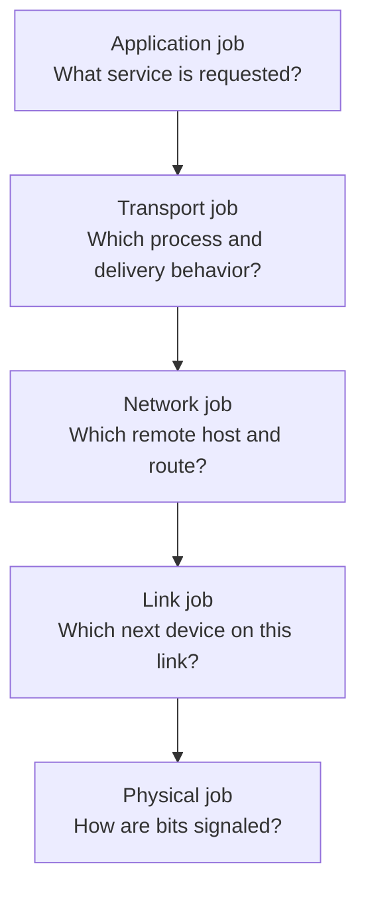
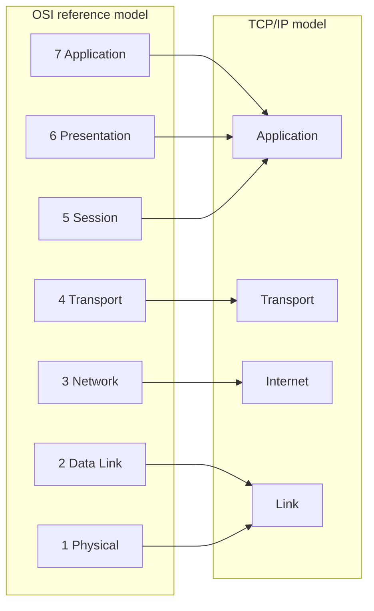
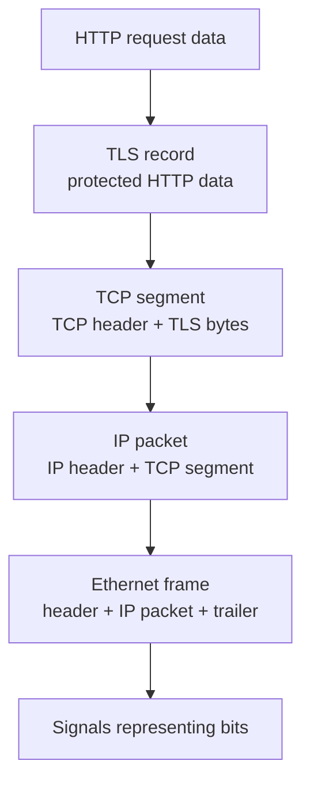
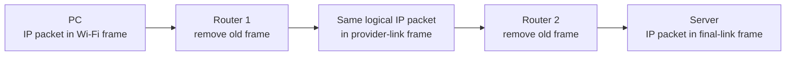
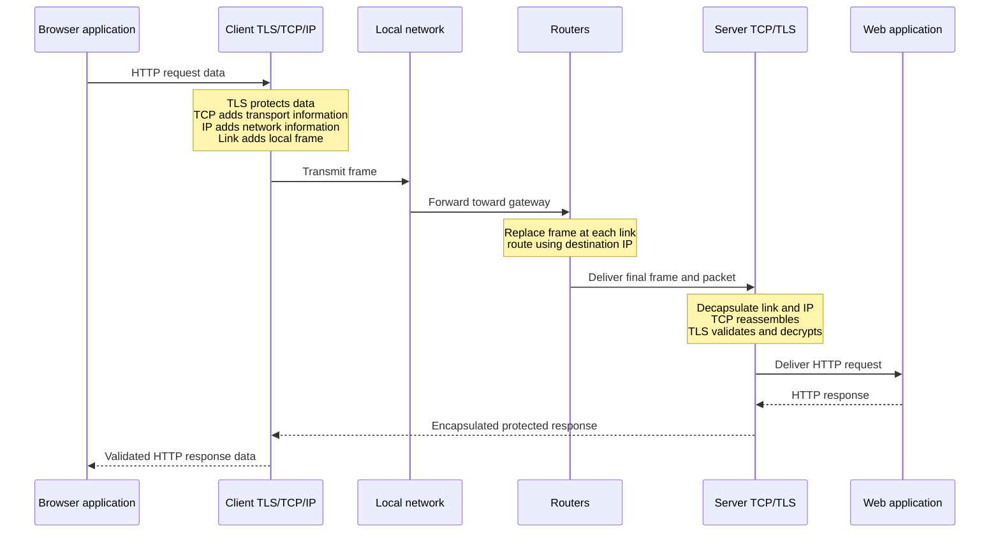

# Part B - OSI, TCP/IP & Encapsulation

> **Section goal:** use layered models to explain where protocols operate, how application data becomes signals, and what changes as traffic crosses a network.

Covers index items **8-14**.

[Back to the master guide](../Networking%20Security%20and%20Azure%20Identity%20-%20Study%20Guide.md) | [Previous: Part A](Part-A-networks-from-zero.md)

---

## 8. Why Layered Models Exist

A **layered model** divides a complicated communication system into smaller jobs with clear responsibilities.

**Analogy:** sending a gift involves choosing the gift, packaging it, addressing it, transporting it, and delivering it. Each stage can change without redesigning every other stage. A courier can replace trucks with aircraft without changing the gift.

Networking layers give us three practical benefits:

1. **Interoperability:** products from different vendors can communicate through shared standards.
2. **Modularity:** one technology can change while adjacent layers keep a stable interface.
3. **Troubleshooting:** we can locate a failure by asking which responsibility failed.

### Models are maps, not the territory

The Open Systems Interconnection (**OSI**) model and the TCP/IP model are conceptual tools. Real operating systems and products do not always create seven perfectly isolated boxes.

> 🔍 **Plain-English deep dive: abstraction**
>
> An **abstraction** hides details that are unnecessary for the current question. A driver can use a road map without knowing how asphalt is manufactured. A web developer can use TCP without controlling how Wi-Fi represents bits as radio signals. When diagnosing a fault, we deliberately move down into the hidden details only when evidence points there.

Use layers to organize reasoning. Do not turn them into rigid labels that ignore actual implementation.

---

## 9. The Seven OSI Layers

The **OSI model** is a seven-layer reference model. A useful memory direction is:

- Layer 7 is closest to the application.
- Layer 1 is closest to the physical medium.
- Data moves down the layers when sent and up the layers when received.

| Layer | Name | Main question | Examples | Everyday analogy |
|------:|------|---------------|----------|------------------|
| 7 | Application | What network service does the software use? | HTTP, DNS, Simple Mail Transfer Protocol (SMTP) | Writing the message |
| 6 | Presentation | How is information represented or protected? | Encoding, compression, encryption concepts | Translation and sealing |
| 5 | Session | How is a dialog established and maintained? | Session/checkpoint concepts | Managing a conversation |
| 4 | Transport | Which process, and what delivery behavior? | TCP, UDP, ports | Registered vs ordinary delivery |
| 3 | Network | Which host/network, and which route? | IPv4, IPv6, Internet Control Message Protocol (ICMP) | Intercity addressing and route choice |
| 2 | Data Link | Which interface gets the frame on this local link? | Ethernet, Wi-Fi, MAC, Virtual Local Area Network (VLAN) | Delivery on the current street |
| 1 | Physical | How are bits represented on the medium? | Copper, fiber, radio | Road surface and moving vehicle |

### Layer 7 - Application

The application layer provides network services to software. It defines messages such as an HTTP request, DNS query, or email transfer command.

"Application layer" does not mean the entire browser interface. It means the protocols and services through which applications communicate.

### Layer 6 - Presentation

The presentation layer describes data representation, transformation, encryption, and compression concepts.

Examples include character encoding and serialization formats. TLS performs encryption-related functions often associated with this layer, but real Internet protocol stacks do not implement TLS as a literal OSI Layer 6 module.

### Layer 5 - Session

The session layer describes establishing, maintaining, and ending a dialog, including checkpoints and recovery concepts.

In modern TCP/IP discussions, session functions are usually handled by applications, libraries, or application protocols rather than a separately visible OSI component.

### Layer 4 - Transport

The transport layer provides process-to-process communication.

- **TCP** offers a reliable, ordered byte stream.
- **UDP** offers independent datagrams with low protocol overhead.
- **Port numbers** help an operating system deliver traffic to the correct application endpoint.

### Layer 3 - Network

The network layer provides logical addressing and forwarding across multiple networks.

- IP addresses identify interfaces and network location.
- Routers inspect destination IP information to choose a next hop.
- IPv4 and IPv6 are the main Internet Protocol versions.

### Layer 2 - Data Link

The data-link layer provides delivery over one link or local network segment.

- Ethernet and Wi-Fi are common Layer 2 technologies.
- MAC addresses identify interfaces for local frame delivery.
- Switches mainly use Layer 2 information to forward Ethernet frames.

### Layer 1 - Physical

The physical layer transmits bits as electrical, light, or radio signals. It covers media, connectors, frequencies, modulation, and signaling characteristics.

### A mnemonic, with a warning

From Layer 7 down to Layer 1:

**All People Seem To Need Data Processing**

The mnemonic helps recall names, but interview confidence comes from remembering each layer's **job**, not only its label.

---

## 10. The Four-Layer TCP/IP Model

The **TCP/IP model** describes the protocol suite used by the internet. It is often shown with four layers.

| TCP/IP layer | Rough OSI mapping | Main examples |
|--------------|-------------------|---------------|
| Application | OSI 7, 6, and 5 | HTTP, DNS, TLS, Secure Shell (SSH), SMTP |
| Transport | OSI 4 | TCP, UDP, QUIC's transport functions |
| Internet | OSI 3 | IPv4, IPv6, ICMP |
| Link or Network Access | OSI 2 and 1 | Ethernet, Wi-Fi, ARP, physical media |

Some books show a five-layer Internet model by separating Data Link and Physical. That is not a contradiction; it is a different level of detail.

### OSI vs TCP/IP

| OSI | TCP/IP |
|-----|--------|
| Seven-layer reference model | Practical Internet protocol-suite model |
| Useful for precise vocabulary and troubleshooting | Useful for describing real Internet protocols |
| Separates session and presentation concepts | Groups those functions into application |
| Defines separate data-link and physical layers | Often groups both into link/network access |

In an interview, state which model you are using before naming a layer.

---

## 11. Encapsulation and Decapsulation

**Encapsulation** means each sending layer adds control information around data received from the layer above.

**Decapsulation** means each receiving layer reads and removes its control information before passing the remaining content upward.

### A simplified send path

Suppose a browser sends an HTTP request using TLS over TCP over IPv4 over Ethernet.

1. HTTP creates request data.
2. TLS protects that data and creates TLS records.
3. TCP carries bytes and adds a TCP header.
4. IPv4 adds an IP header.
5. Ethernet adds a frame header and trailer.
6. The NIC transmits encoded bits.

### What each wrapper contributes

| Wrapper | Selected information | Purpose |
|---------|----------------------|---------|
| TLS record | Protected content and integrity information | Confidentiality and tamper detection |
| TCP header | Source/destination ports, sequence and acknowledgement information, flags | Process delivery and reliable byte stream |
| IP header | Source/destination IP, Hop Limit or Time To Live (TTL), next-header/protocol value | Delivery across IP networks |
| Ethernet header/trailer | Source/destination MAC, EtherType identifying the carried protocol, frame check sequence | Delivery and error detection on one Ethernet link |

**Payload is relative.** A TCP segment is the payload of an IP packet. That IP packet is then the payload of an Ethernet frame.

### The receive path

The receiver reverses the process:

1. The NIC receives a frame.
2. Ethernet processing validates local-link information and passes the IP packet upward.
3. IP processing validates network-layer information and passes transport content upward.
4. TCP reorders/reassembles bytes and delivers them to the appropriate socket.
5. TLS validates and decrypts protected records.
6. HTTP processing interprets the request or response.

> 🔍 **Plain-English deep dive: headers are instructions, not decorative labels**
>
> Each header exists for a different decision. A switch needs local-link information, a router needs network-layer information, and the destination operating system needs transport information. Security devices may inspect several layers, but the original responsibilities remain distinct.

---

## 12. Protocol Data Units and Device Layers

A **Protocol Data Unit (PDU)** is the data structure exchanged at a particular protocol layer.

| OSI area | Common PDU name | Typical addressing or identifier |
|----------|-----------------|----------------------------------|
| Application | Data/message | Name, URL, method, application-specific ID |
| Transport | TCP segment / UDP datagram | Port number |
| Network | Packet | IP address |
| Data Link | Frame | MAC address |
| Physical | Bits/signals | Physical encoding |

### Which device works at which layer?

| Device/function | Primary layer | Main decision information |
|-----------------|---------------|---------------------------|
| Repeater/hub | Layer 1 | Signals/bits |
| Ethernet switch | Layer 2 | Destination MAC and VLAN |
| Router | Layer 3 | Destination IP and routing table |
| Traditional port firewall | Layers 3-4 | IPs, protocol, ports, connection state |
| Load balancer | Layer 4 or 7 | Transport connection or application request |
| Next-Generation Firewall | Layers 3-7 | Connection, application, identity, content |
| WAF/reverse proxy | Layer 7 | HTTP request and application policy |

"A switch is Layer 2" is a useful default, not a universal product specification. Multilayer switches can route, and security appliances inspect several layers.

### A frame changes hop by hop

When a router forwards an IP packet onto a new link:

1. It receives and removes the old link-layer frame.
2. It processes the destination IP and selects a next hop.
3. It reduces the IPv4 TTL or IPv6 Hop Limit.
4. It places the packet into a new frame appropriate for the outgoing link.

The IP packet is logically end-to-end, although fields such as TTL change and devices performing Network Address Translation (NAT) can rewrite addresses. The local-link frame serves only its current hop.

---

## 13. One HTTPS Request Down and Up the Stack

This flow combines the models without pretending every implementation has seven separate modules.

### End-to-end vs hop-by-hop

| Scope | Examples | Meaning |
|-------|----------|---------|
| End-to-end | HTTP conversation, TLS session, TCP connection, IP source/destination in the usual case | Relates the communicating endpoints |
| Hop-by-hop | Ethernet/Wi-Fi frame, next-hop MAC address | Applies to one local link at a time |

TLS can terminate at a reverse proxy, load balancer, or inspection device. In that design, encryption is end-to-end only for each separate TLS leg, not necessarily from the original browser to the final application server.

### What a packet capture can see

Capture location changes the evidence:

- On the client, you may see client-side frames, IP packets, and encrypted TLS records.
- On a router interface, you see traffic on that particular link.
- Behind TLS termination, you may see a separate connection to the backend.
- A normal network capture cannot read properly encrypted HTTP content without session keys or termination access.

---

## 14. Interview Traps and Layer Placement

### Trap 1: treating OSI as a physical implementation diagram

Better answer: "OSI is a reference model. TCP/IP groups several OSI responsibilities differently, and real products can inspect multiple layers."

### Trap 2: saying HTTPS is a different transport protocol

HTTPS is HTTP protected by TLS. It commonly uses TCP port 443, while HTTP/3 uses QUIC over UDP. A port is a convention and clue, not proof of application identity.

### Trap 3: insisting TLS has one universally correct OSI layer

TLS sits between application protocols such as HTTP and a transport such as TCP. Its presentation and session functions are often associated with OSI Layers 6 and 5, while the TCP/IP model places it in the application layer. Explain the model and the relationship instead of giving an unsupported single number.

### Trap 4: confusing MAC and IP scope

- MAC information is normally used for local-link delivery.
- IP information supports delivery across routed networks.
- A host sends a remote packet to the gateway's local MAC address while retaining the remote destination IP address.

### Trap 5: assuming every device sees everything

A normal switch forwards using Layer 2 information. A router forwards using Layer 3 information. A WAF intentionally processes Layer 7 HTTP. Advanced appliances can inspect more, but encryption and architecture affect visibility.

### Layer-first troubleshooting table

| Evidence | Likely area to investigate first |
|----------|----------------------------------|
| No physical link or weak radio | Layer 1/link access |
| Wrong VLAN or local frame delivery | Layer 2 |
| Missing address, gateway, or route | Layer 3 |
| Connection timeout/reset or port issue | Layer 4 or policy device |
| TLS alert or certificate warning | TLS/application area |
| HTTP error or incorrect response | Application layer |

> 💡 **Tie-in for any background:** Layering is the same reasoning used in any service workflow. You separate what the user requested, how it was packaged, where it was routed, and how it physically traveled. This prevents a visible application symptom from automatically being blamed on "the network."

---

## Quick Reference

| Recall prompt | Answer |
|---------------|--------|
| OSI direction when sending | Layer 7 down to Layer 1 |
| OSI direction when receiving | Layer 1 up to Layer 7 |
| TCP/IP layers | Application, Transport, Internet, Link |
| Encapsulation | Add each layer's control information on send |
| Decapsulation | Read/remove each layer's control information on receive |
| Layer 2 unit | Frame |
| Layer 3 unit | Packet |
| TCP/UDP identifiers | Ports |
| Local vs remote forwarding | Switch/local link vs router/between IP networks |

---

## ⭐ Likely Interview Questions for This Section

**Q1. Why do networks use layered models?**

> *Model answer:* Layered models divide communication into clear responsibilities. They enable interoperable standards, allow one technology to change without redesigning everything, and provide a structured troubleshooting method. OSI is a reference model, while TCP/IP maps more directly to Internet protocols.

**Q2. Name the seven OSI layers and their main jobs.**

> *Model answer:* Application provides network services to software; Presentation handles representation and protection concepts; Session manages dialogs; Transport provides process delivery; Network provides logical addressing and routing; Data Link provides local frame delivery; Physical represents bits on media.

**Q3. How does TCP/IP map to OSI?**

> *Model answer:* TCP/IP Application roughly combines OSI Application, Presentation, and Session. TCP/IP Transport maps to OSI Transport, Internet maps to Network, and Link commonly combines Data Link and Physical. The mapping is approximate because they are different models.

**Q4. What is encapsulation?**

> *Model answer:* Encapsulation is the sending process in which each layer adds control information around data from the layer above. For example, TCP adds a transport header, IP adds a network header, and Ethernet adds a local-link header and trailer. The receiver decapsulates in reverse.

**Q5. What changes when a packet crosses a router?**

> *Model answer:* The router removes the incoming link-layer frame, examines the destination IP, selects a next hop, reduces TTL or Hop Limit, and creates a new frame for the outgoing link. The logical IP packet continues, although NAT or other processing may rewrite fields.

**Q6. At which layer does TLS operate?**

> *Model answer:* TLS sits above a transport such as TCP and below application protocols such as HTTP. Its functions resemble OSI presentation and session responsibilities, but TCP/IP normally groups TLS into the application layer. I would state the model instead of claiming one universal OSI layer number.

**Q7. What is the difference between a frame, packet, and segment?**

> *Model answer:* A frame is a local-link unit, a packet is commonly an IP-layer unit routed between networks, and a segment is a TCP transport unit. A TCP segment is carried inside an IP packet, which is carried inside a frame for each local hop.

**Q8. How would you use layers to troubleshoot an HTTPS failure?**

> *Model answer:* I would find the earliest failed stage: verify link, addressing and route, then transport establishment, TLS negotiation, and finally HTTP/application behavior. I would use evidence such as interface state, route and DNS results, connection tests, packet capture, TLS errors, and HTTP status rather than guessing.

---

## 🧠 30-Second Memory Hooks

- **Layers divide jobs; they do not divide reality perfectly.**
- **OSI has seven; TCP/IP commonly has four.**
- **Send goes down and wraps; receive goes up and unwraps.**
- **Ports find processes, IP finds networks/hosts, MAC finds the next local interface.**
- **Frame is hop-by-hop; packet is logically routed end-to-end.**
- **A router replaces the frame and forwards the packet.**
- **TLS sits above transport and below HTTP; name the model before naming a layer.**
- **Find the earliest failed layer.**

---

*Next suggested section:* **[Part C - Addressing, Local Delivery & Routing](Part-C-addressing-local-delivery-routing.md)**, which explains how a host decides whether a destination is local and how packets find remote networks.