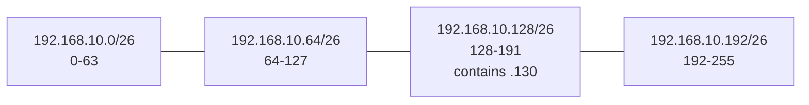
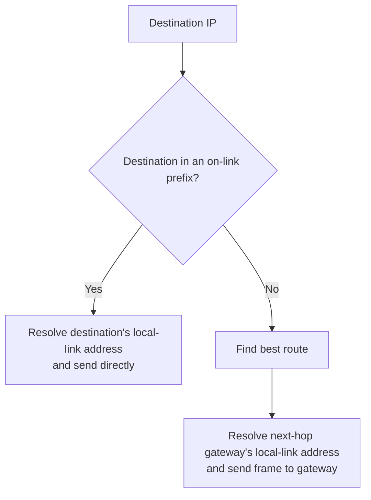
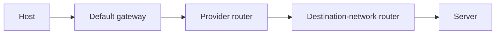
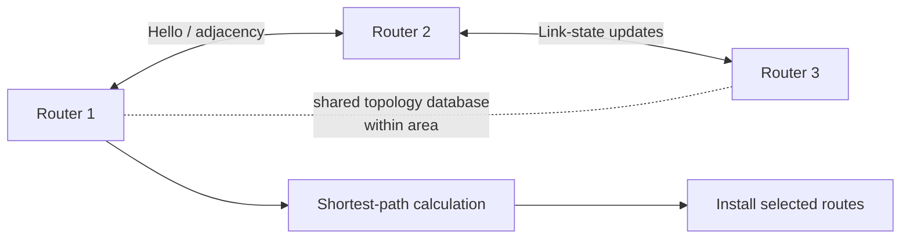
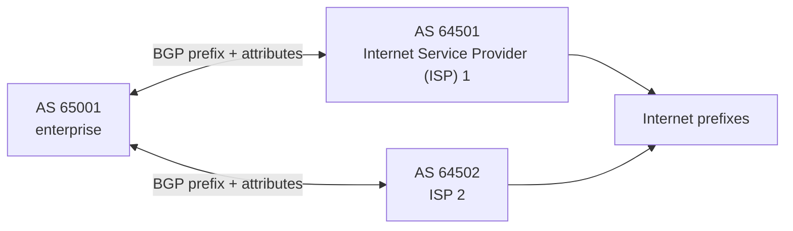
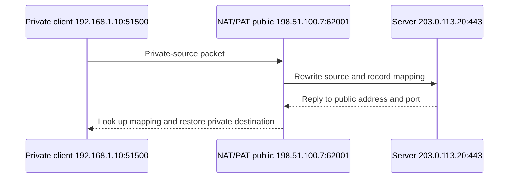
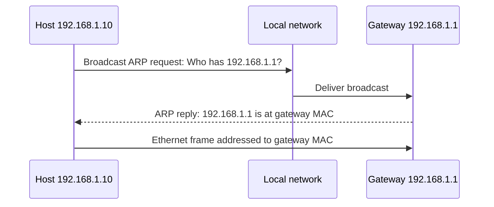
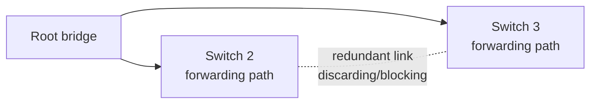
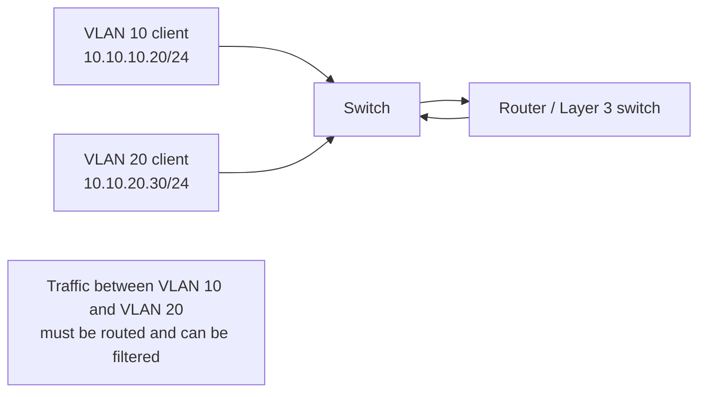

# Part C - Addressing, Local Delivery & Routing

> **Section goal:** decide whether an IP destination is local or remote, calculate common IPv4 subnets, and explain how frames and packets move through switches, gateways, and routers.

Covers index items **15-22**.

[Back to the master guide](../Networking%20Security%20and%20Azure%20Identity%20-%20Study%20Guide.md) | [Previous: Part B](Part-B-osi-tcpip-encapsulation.md)

---

## Start Here: Three Addresses, Three Jobs

For a typical TCP/IP conversation, keep three identifiers separate:

| Identifier | Job | Scope |
|------------|-----|-------|
| Name | Human-friendly service identity | Resolved through a naming system such as DNS |
| IP address | Logical network location | Used to route across IP networks |
| MAC address | Local-interface delivery | Used on the current Ethernet/Wi-Fi link |

**Analogy:** a person's name identifies whom you want, a street address locates the building across a city, and an apartment/door instruction completes the local delivery.

---

## 15. IPv4, IPv6, Prefixes, Masks, and CIDR

An **IP address** is a logical address assigned to a network interface. It contains bits that a prefix divides into a network part and an interface/host part.

### IPv4

An IPv4 address has **32 bits**, normally written as four decimal octets:

```text
192.168.10.37
```

Each octet represents eight bits and ranges from 0 through 255.

### Binary place values

Computers apply subnet masks bit by bit. Each bit in an IPv4 octet has a fixed decimal value:

| Bit position | 1 | 2 | 3 | 4 | 5 | 6 | 7 | 8 |
|--------------|---|---|---|---|---|---|---|---|
| Place value | 128 | 64 | 32 | 16 | 8 | 4 | 2 | 1 |

Add the place values whose bits are `1`:

```text
Binary:  1 1 0 0 0 0 0 0
Values: 128 + 64             = 192

Binary:  1 0 1 0 1 0 1 0
Values: 128 + 32 + 8 + 2     = 170
```

Common mask octets follow directly:

| Leading 1 bits | Binary | Decimal |
|---------------:|--------|--------:|
| 0 | `00000000` | 0 |
| 1 | `10000000` | 128 |
| 2 | `11000000` | 192 |
| 3 | `11100000` | 224 |
| 4 | `11110000` | 240 |
| 5 | `11111000` | 248 |
| 6 | `11111100` | 252 |
| 7 | `11111110` | 254 |
| 8 | `11111111` | 255 |

### Bitwise AND finds the network

A **bitwise AND** returns `1` only where both address and mask bits are `1`.

```text
Address octet: 130 = 10000010
Mask octet:    192 = 11000000
AND result:    128 = 10000000
```

Therefore, the last octet of `192.168.10.130/26` belongs to the block beginning at 128. This is what a host/router computes; the block-size shortcut in Section 17 is the faster interview method.

### IPv6

An IPv6 address has **128 bits**, written as eight hexadecimal groups. Zeros can be compressed:

```text
Full:       2001:0db8:0000:0000:0000:0000:0000:0042
Compressed: 2001:db8::42
```

Hexadecimal uses `0-9` and `a-f`. Each hexadecimal digit represents four bits.

### Prefix length and CIDR

**CIDR** means Classless Inter-Domain Routing. Slash notation states how many leading bits form the network prefix.

- `192.168.10.37/24` has 24 network-prefix bits and 8 host bits.
- `2001:db8:1234:1::42/64` has a 64-bit network prefix and 64 interface-identifier bits.

A **subnet mask** is the IPv4 dotted-decimal form of the prefix boundary.

| Prefix | Mask | Total IPv4 addresses | Traditional usable host addresses |
|--------|------|----------------------|-----------------------------------|
| /8 | 255.0.0.0 | 16,777,216 | 16,777,214 |
| /16 | 255.255.0.0 | 65,536 | 65,534 |
| /24 | 255.255.255.0 | 256 | 254 |
| /25 | 255.255.255.128 | 128 | 126 |
| /26 | 255.255.255.192 | 64 | 62 |
| /27 | 255.255.255.224 | 32 | 30 |
| /28 | 255.255.255.240 | 16 | 14 |
| /30 | 255.255.255.252 | 4 | 2 |
| /32 | 255.255.255.255 | 1 | A single host route |

The traditional IPv4 usable-host formula is:

$$
\text{usable hosts} = 2^{(32-\text{prefix length})} - 2
$$

The subtraction reserves the subnet's network address and directed broadcast address. Modern `/31` point-to-point links are a deliberate exception and use both addresses; `/32` identifies one address.

### Network, host range, and broadcast

For `192.168.10.37/24`:

- Network: `192.168.10.0`
- Traditional usable range: `192.168.10.1` through `192.168.10.254`
- Directed broadcast: `192.168.10.255`

> 🔍 **Plain-English deep dive: an address does not carry its own boundary**
>
> `192.168.10.37` alone does not tell you which bits identify the subnet. The `/24` is essential. The same address under `/16`, `/24`, and `/28` belongs to differently sized subnets and may classify destinations differently.

### IPv4 vs IPv6

| IPv4 | IPv6 |
|------|------|
| 32-bit addresses | 128-bit addresses |
| Dotted decimal | Colon-separated hexadecimal |
| Broadcast exists | No broadcast; multicast is used instead |
| ARP maps local IPv4 to MAC | Neighbor Discovery uses ICMPv6 |
| NAT is widespread | Globally unique addressing is plentiful; NAT is not a design requirement |
| Router reduces TTL | Router reduces Hop Limit |

---

## 16. Public, Private, Loopback, Link-Local, and Unspecified Addresses

An address range often has a defined scope or purpose.

### Common IPv4 ranges

| Type | Range | Meaning |
|------|-------|---------|
| Private | `10.0.0.0/8` | Used inside private networks |
| Private | `172.16.0.0/12` | `172.16.0.0` through `172.31.255.255` |
| Private | `192.168.0.0/16` | Common in homes and small offices |
| Loopback | `127.0.0.0/8` | Refers back to the local host; commonly `127.0.0.1` |
| Link-local | `169.254.0.0/16` | Local-link self-configuration, often seen when DHCP fails |
| Unspecified | `0.0.0.0` | No particular address; meaning depends on context |
| Limited broadcast | `255.255.255.255` | All hosts on the local IPv4 broadcast domain |
| Documentation | `192.0.2.0/24`, `198.51.100.0/24`, `203.0.113.0/24` | Safe examples in documentation |

Private IPv4 addresses are not routed on the public internet. An edge device commonly translates them using NAT.

### Common IPv6 ranges

| Type | Example/range | Meaning |
|------|---------------|---------|
| Global unicast | Commonly `2000::/3` | Publicly routable IPv6 space |
| Unique local | `fc00::/7` | Private-use style addressing; commonly locally assigned from `fd00::/8` |
| Link-local | `fe80::/10` | Required local-link communication |
| Loopback | `::1` | Local host |
| Unspecified | `::` | No particular address |
| Multicast | `ff00::/8` | One-to-group delivery |
| Documentation | `2001:db8::/32` | Examples and documentation |

### Address vs interface

A host can have many addresses:

- Ethernet and Wi-Fi interfaces can each have addresses.
- One interface can have several IPv6 addresses.
- A loopback interface is separate from an external interface.
- VPN software can add a virtual interface and routes.

Avoid saying "the computer's IP" as though there can be only one.

---

## 17. Subnetting from Intuition to Interview Calculations

**Subnetting** divides an address block into smaller networks by extending the prefix.

**Analogy:** a postal district can be divided into neighborhoods. A longer prefix describes a smaller neighborhood with fewer addresses.

### Rule 1: a larger slash number means a smaller subnet

| Prefix | Host bits | Total addresses |
|--------|-----------|-----------------|
| /24 | 8 | 256 |
| /25 | 7 | 128 |
| /26 | 6 | 64 |
| /27 | 5 | 32 |
| /28 | 4 | 16 |

Each added prefix bit halves the block.

### Rule 2: use block size in the changing octet

For an IPv4 mask octet:

$$
\text{block size} = 256 - \text{mask value}
$$

Example: `/26` has mask `255.255.255.192`.

$$
256 - 192 = 64
$$

The subnet boundaries in the last octet are `0`, `64`, `128`, and `192`.

### Worked example: `192.168.10.130/26`

1. `/26` gives blocks of 64.
2. `130` falls in the `128-191` block.
3. Network address: `192.168.10.128`.
4. Directed broadcast: `192.168.10.191`.
5. Traditional usable range: `192.168.10.129-192.168.10.190`.



### Multi-octet example: `172.16.37.20/20`

A `/20` mask is `255.255.240.0`. The changing octet is the third octet:

$$
256 - 240 = 16
$$

Third-octet boundaries are `0, 16, 32, 48, ...`. The value `37` falls in the `32-47` block.

- Network: `172.16.32.0/20`
- Broadcast: `172.16.47.255`
- Traditional usable range: `172.16.32.1` through `172.16.47.254`
- Total addresses: $2^{12} = 4096$
- Traditional usable hosts: 4094

The method is unchanged when the boundary is not in the fourth octet: find the mask's changing octet, calculate its block size, and preserve all octets to its left.

### Worked requirement: at least 50 hosts

Find enough host bits so that:

$$
2^h - 2 \ge 50
$$

- Five host bits give 30 usable addresses, which is too small.
- Six host bits give 62 usable addresses.
- Prefix length is `32 - 6 = /26`.

### Are two addresses in the same subnet?

Apply the same prefix to both and compare the resulting network portions.

- `192.168.10.130/26` belongs to `192.168.10.128/26`.
- `192.168.10.190/26` is in the same subnet.
- `192.168.10.200/26` belongs to `192.168.10.192/26`, so it is remote from `.130` under this mask.

### IPv6 subnetting

IPv6 commonly uses `/64` for an ordinary LAN. Organizations receive a larger prefix and use additional bits to identify subnets.

For example, `2001:db8:1234::/48` can contain `/64` subnets such as:

- `2001:db8:1234:1::/64`
- `2001:db8:1234:2::/64`
- `2001:db8:1234:abcd::/64`

Do not apply IPv4's network/broadcast host subtraction to IPv6. IPv6 has no broadcast address.

### VLSM: right-size several subnets

**Variable Length Subnet Masking (VLSM)** uses different prefix lengths inside one larger block so each subnet fits its requirement.

Suppose `10.20.30.0/24` must support LANs needing 100, 50, 20, and 10 hosts. Allocate largest first:

| Need | Smallest fitting prefix | Allocation | Traditional usable range |
|------|-------------------------|------------|--------------------------|
| 100 hosts | `/25` (126 usable) | `10.20.30.0/25` | `.1-.126` |
| 50 hosts | `/26` (62 usable) | `10.20.30.128/26` | `.129-.190` |
| 20 hosts | `/27` (30 usable) | `10.20.30.192/27` | `.193-.222` |
| 10 hosts | `/28` (14 usable) | `10.20.30.224/28` | `.225-.238` |

The remaining `10.20.30.240/28` can be reserved. Allocating largest first prevents a small early allocation from splitting the only space that fits a large subnet.

### Subnetting practice

Try these before opening the answers:

1. Convert binary `11100000` to decimal.
2. How many total and traditionally usable addresses are in a `/27`?
3. Find the network, broadcast, and usable range for `192.0.2.77/28`.
4. Are `10.1.31.250/20` and `10.1.32.1/20` in the same subnet?
5. Which prefix is the smallest traditional subnet for 200 hosts?

<details>
<summary>Subnetting answer key</summary>

1. `224` because $128 + 64 + 32 = 224$.
2. `/27` leaves five host bits: $2^5=32$ total and traditionally 30 usable.
3. `/28` block size is 16; `77` falls in `64-79`. Network `192.0.2.64`, broadcast `.79`, usable `.65-.78`.
4. No. `/20` third-octet blocks are `0-15`, `16-31`, `32-47`, and so on. They belong to `10.1.16.0/20` and `10.1.32.0/20`.
5. `/24`, providing 256 total and traditionally 254 usable addresses.

</details>

---

## 18. Default Gateways, Routing Tables, and Longest-Prefix Match

A host first decides whether the destination is **on-link** (local) or **off-link** (remote).

- For an on-link destination, the host sends directly using local-link delivery.
- For an off-link destination, the host sends the frame to a router, usually its default gateway.



### The important remote-delivery distinction

Suppose `192.168.1.10/24` sends to `203.0.113.20` through gateway `192.168.1.1`.

| Field | Value on the first local Ethernet hop |
|-------|----------------------------------------|
| Source IP | `192.168.1.10` |
| Destination IP | `203.0.113.20` |
| Source MAC | Client NIC's MAC |
| Destination MAC | Gateway's MAC |

The remote server's IP remains the IP destination, but the gateway is the next local frame destination.

### Routing table

A routing table contains destination prefixes and instructions for reaching them.

| Destination prefix | Next hop/interface | Meaning |
|--------------------|--------------------|---------|
| `192.168.1.0/24` | Local Ethernet | This subnet is directly connected |
| `10.20.0.0/16` | VPN interface | Corporate subnet through VPN |
| `0.0.0.0/0` | `192.168.1.1` | IPv4 default route |
| `::/0` | IPv6 gateway | IPv6 default route |

### Longest-prefix match

When several routes match, IP forwarding chooses the route with the **longest matching prefix**, meaning the most specific destination range.

Given these routes:

- `0.0.0.0/0` through the internet gateway
- `10.0.0.0/8` through a corporate router
- `10.20.0.0/16` through a special VPN

Traffic to `10.20.5.9` uses `/16`, because `/16` is more specific than `/8` and `/0`.

Route **metric** or preference helps choose among routes of otherwise equivalent specificity, depending on the operating system and routing protocol.

### Each router chooses only the next hop

Routers do not need a complete physical itinerary inside each packet. Each router examines the destination, chooses a next hop, and sends the packet onward.



### Connected, static, and dynamic routes

Routes enter a routing table from several sources:

| Route source | How it appears | Best fit |
|--------------|----------------|----------|
| Connected | Interface has an address in that prefix | Directly attached subnet |
| Static | Administrator/configuration names destination and next hop/interface | Stable simple path, default, or controlled exception |
| Dynamic | Routing protocol learns and withdraws reachability | Multiple routers, changing paths, and failover |
| Default | Catch-all `0.0.0.0/0` or `::/0` | Destinations without a more-specific route |

A route is usable only while its next hop/interface is reachable under the platform's rules. A static route is not automatically safer or faster; it is simply configured rather than learned.

### Metrics, preference, and convergence

- **Administrative preference/distance** ranks different route sources on many platforms.
- A protocol **metric** ranks paths learned by that protocol.
- Longest-prefix match selects specificity first; preference/metric then help choose among equivalent destination prefixes according to the platform.
- **Convergence** is the time required for routers to learn a change and settle on consistent forwarding paths.

During convergence, packets can temporarily loop, take a longer path, or be dropped.

### OSPF: routing inside an organization

**Open Shortest Path First (OSPF)** is a link-state **Interior Gateway Protocol (IGP)** commonly used inside one administrative routing domain.

At a high level:

1. Neighboring routers discover each other with Hello messages.
2. They form adjacencies when key settings agree.
3. They flood link-state information describing topology.
4. Each router builds a link-state database for its area.
5. Each runs a shortest-path calculation and installs best routes.



OSPF uses **cost** as its metric, organizes scale with **areas**, and uses Area 0 as the backbone in ordinary multi-area design. Common adjacency failures involve area mismatch, timer mismatch, authentication, Maximum Transmission Unit (MTU), network type, duplicate router ID, or blocked protocol traffic.

### BGP: policy between routing domains

**Border Gateway Protocol (BGP)** is a path-vector protocol used between **Autonomous Systems (ASes)** and also inside large networks to exchange policy-rich routes.

BGP advertises prefixes with path attributes rather than discovering every physical link. Important concepts include:

| Concept | Meaning |
|---------|---------|
| AS number | Identifier for an administrative routing domain |
| AS_PATH | Sequence of ASes a route advertisement traversed; also prevents loops |
| NEXT_HOP | Address toward which traffic should be sent |
| LOCAL_PREF | Common internal preference for outbound path; higher is preferred |
| MED | Suggestion about preferred entry path to a neighboring AS; lower is commonly preferred under comparable conditions |
| Import/export policy | Which routes are accepted, preferred, or advertised |



BGP's "best" path is policy-driven, not necessarily the lowest-latency physical path. Route filtering, maximum-prefix limits, authentication/session protection, and Resource Public Key Infrastructure (**RPKI**) origin validation help reduce route leaks and hijacks.

### OSPF vs BGP

| OSPF | BGP |
|------|-----|
| Link-state IGP | Path-vector inter-domain/policy protocol |
| Learns internal topology | Exchanges reachable prefixes and attributes |
| Shortest-path cost | Ordered policy and path-attribute selection |
| Fast internal convergence focus | Scale, stability, and administrative policy focus |
| Areas organize topology | ASes and routing policy organize trust/reachability |

For troubleshooting dynamic routing, separate: neighbor/session establishment, route advertisement/receipt, route-policy acceptance, route-table installation, and actual forwarding.

---

## 19. NAT and PAT

**Network Address Translation (NAT)** rewrites IP addressing information as traffic crosses a translating device.

**Port Address Translation (PAT)** also uses transport ports so many private flows can share one public IPv4 address. Consumer products often call PAT simply "NAT."

### Outbound PAT example

| Before translation | After translation |
|--------------------|-------------------|
| `192.168.1.10:51500 -> 203.0.113.20:443` | `198.51.100.7:62001 -> 203.0.113.20:443` |
| `192.168.1.11:51500 -> 203.0.113.20:443` | `198.51.100.7:62002 -> 203.0.113.20:443` |

The translating device stores mappings so returning traffic reaches the correct internal flow.



### Common NAT forms

| Form | What changes | Typical use |
|------|--------------|-------------|
| Source NAT (SNAT) | Source address, often source port | Private clients going outward |
| Destination NAT (DNAT) | Destination address, often destination port | Publishing an internal service |
| Static one-to-one NAT | Fixed inside/outside mapping | Stable service mapping |
| PAT/overload | Address plus ports | Many clients sharing a public IPv4 address |

### What NAT is not

- NAT is not encryption.
- NAT is not a substitute for firewall policy.
- NAT complicates unsolicited inbound connections but does not provide complete security.
- NAT can make logging and troubleshooting harder because observed addresses differ by capture location.

> 🔍 **Plain-English deep dive: routing chooses; NAT rewrites**
>
> Routing decides where a packet should go next. NAT changes address or port fields and maintains translation state. One device may perform both jobs, but the jobs are conceptually different.

---

## 20. ARP for IPv4 and Neighbor Discovery for IPv6

An Ethernet sender needs a destination MAC address for the next local hop. Here, MAC means **Media Access Control**, not the cryptographic Message Authentication Code introduced later.

### ARP

The **Address Resolution Protocol (ARP)** maps an on-link IPv4 address to a MAC address.

1. The sender checks its ARP cache.
2. If no valid mapping exists, it broadcasts: "Who has this IPv4 address?"
3. The owner replies with its MAC address.
4. The sender caches the result for a limited time.
5. The sender builds and transmits the Ethernet frame.



For a remote IP destination, the host resolves the **gateway's** MAC, not the remote server's MAC.

### Neighbor Discovery

IPv6 does not use ARP. **Neighbor Discovery (ND)** uses Internet Control Message Protocol version 6 (**ICMPv6**) messages.

ND performs several jobs:

- Neighbor Solicitation and Advertisement for address-to-link-layer resolution
- Router Solicitation and Advertisement for router and prefix information
- Neighbor Unreachability Detection
- Duplicate Address Detection
- Redirect information in appropriate cases

IPv6 uses multicast instead of IPv4-style broadcast for neighbor discovery.

### Security concerns

ARP and basic Neighbor Discovery assume trust on the local link. Attackers on that link may attempt spoofing or poisoning. Controls include segmentation, switch protections, monitoring, secure Wi-Fi, and higher-layer encryption.

---

## 21. ICMP, Ping, Traceroute, TTL, and Errors

**Internet Control Message Protocol (ICMP)** carries network-layer control, error, and diagnostic messages. ICMPv4 supports IPv4; ICMPv6 is essential to IPv6 operation.

### Important ICMP functions

| Function | Example meaning |
|----------|-----------------|
| Echo Request/Reply | Used by ping to test a response path |
| Destination Unreachable | Network, host, protocol, port, or policy-related failure |
| Time Exceeded | TTL/Hop Limit reached zero, used by traceroute |
| Packet Too Big / fragmentation-needed signaling | Supports Path Maximum Transmission Unit (MTU) Discovery, which finds the largest usable packet size |
| Redirect | Suggests a better local next hop in limited designs |

### Ping

**Ping** commonly sends ICMP Echo Requests and measures replies.

A successful ping can show:

- The destination (or responding device) was reachable for that ICMP exchange.
- A return path existed.
- Approximate round-trip time and loss were observed during the test.

A failed ping does **not** prove the host is down. ICMP may be filtered or rate-limited while HTTPS still works.

### TTL and Hop Limit

IPv4 **Time To Live (TTL)** and IPv6 **Hop Limit** prevent routing loops from circulating packets forever. Every router reduces the value; when it reaches zero, the router discards the packet and normally sends a Time Exceeded message.

### Traceroute

Traceroute sends probes with progressively larger TTL/Hop Limit values.

1. A probe with value 1 expires at the first router.
2. A probe with value 2 expires at the second router.
3. The process continues toward the destination.

Implementations may use ICMP, UDP, or TCP probes. Missing stars can mean filtering or rate limiting, not necessarily a broken forwarding path.

```mermaid
sequenceDiagram
    participant H as Host
    participant R1 as Router 1
    participant R2 as Router 2
    participant D as Destination
    H->>R1: Probe with TTL 1
    R1-->>H: ICMP Time Exceeded
    H->>R1: Probe with TTL 2
    R1->>R2: Forward; TTL becomes 1
    R2-->>H: ICMP Time Exceeded
    H->>R1: Probe with TTL 3+
    R1->>R2: Forward
    R2->>D: Forward toward destination
    D-->>H: Final response
```

Blocking all ICMP can break useful operations such as Path MTU Discovery, especially in IPv6. Security policy should be specific rather than assuming all ICMP is dangerous.

---

## 22. Switching, Routing, and VLAN Basics

### Ethernet switching

A switch learns source MAC addresses and associates them with ports in a MAC address table.

- For a known unicast destination, it forwards toward the learned port.
- For an unknown unicast destination, it floods within the VLAN.
- It also floods relevant broadcast traffic within the VLAN.
- It does not normally route traffic between IP subnets.

### Why Layer 2 loops are dangerous

Ethernet frames do not have an IP-style TTL. If redundant switch links create a forwarding loop:

- Broadcast and unknown-unicast frames can circulate and multiply.
- Switch MAC tables can flap as the same source appears on different ports.
- Links and switch CPUs can become saturated in a **broadcast storm**.
- Normal traffic becomes unstable or unusable.

### STP and RSTP

**Spanning Tree Protocol (STP)** and **Rapid Spanning Tree Protocol (RSTP)** create a loop-free logical topology while retaining redundant physical links.



Simplified process:

1. Switches exchange Bridge Protocol Data Units (**BPDUs**).
2. They elect a **root bridge** using bridge priority and MAC-based bridge ID.
3. Each non-root switch selects its best **root port** toward the root.
4. Each segment selects a **designated port**.
5. Other redundant ports discard/block data frames until topology failure requires reconvergence.

RSTP converges faster than classic STP. Protect edge ports with features such as BPDU Guard where appropriate, and deliberately choose the root rather than letting an accidental switch win.

### Access, trunk, and native VLAN mismatch

- An **access port** carries one endpoint VLAN, normally untagged toward that endpoint.
- An Institute of Electrical and Electronics Engineers (IEEE) 802.1Q **trunk** carries multiple VLANs with tags.
- A trunk's **native VLAN** may be sent untagged depending on configuration.

Both ends of a trunk must agree on trunking, allowed VLANs, and native VLAN. A mismatch can place untagged traffic into different VLANs, create leakage, or make only selected VLANs fail.

### Link aggregation

**Link Aggregation Control Protocol (LACP)** bundles compatible physical links into one logical link for capacity and redundancy.

- Both sides must agree on membership and parameters.
- A single flow commonly follows one member based on hashing, so one flow may not use the entire bundle capacity.
- Failed members reduce aggregate capacity without necessarily dropping the logical link.

### Multicast and IGMP

IPv4 **Internet Group Management Protocol (IGMP)** lets hosts report multicast-group membership to local routers. **IGMP snooping** lets a switch forward multicast only to interested ports rather than flooding it like unknown traffic. IPv6 uses Multicast Listener Discovery (**MLD**) for comparable local membership functions.

### VLAN

A **Virtual Local Area Network (VLAN)** creates a logical Layer 2 broadcast domain on switched infrastructure.

**Analogy:** one physical office building can contain separate secured departments. The hallways are shared infrastructure, but access boundaries separate the groups.

| Term | Meaning |
|------|---------|
| Access port | Carries traffic for one VLAN to an endpoint |
| Trunk port | Carries multiple tagged VLANs between network devices |
| 802.1Q tag | Ethernet information identifying a VLAN on a trunk |
| Inter-VLAN routing | A router or Layer 3 switch forwards between VLAN subnets |



### Collision and broadcast domains

- Each modern switched Ethernet port is its own collision domain.
- Each VLAN is a separate Layer 2 broadcast domain.
- Routers separate broadcast domains.

### End-to-end example

Client `10.10.10.20/24` wants server `10.10.20.30/24`:

1. The client calculates that `10.10.20.30` is not in `10.10.10.0/24`.
2. It selects a route through its default gateway, perhaps `10.10.10.1`.
3. It resolves the gateway's local MAC using ARP.
4. It sends a frame to the gateway MAC with destination IP `10.10.20.30`.
5. The Layer 3 device routes and applies any policy between VLANs.
6. On VLAN 20, it resolves the server's MAC and creates a new frame.
7. The server receives the IP packet and returns traffic through its routing decision.

### Wi-Fi foundations

Wi-Fi is an IEEE 802.11 wireless LAN technology. It still carries local-link frames, but radio is a shared, variable medium.

| Term | Plain meaning |
|------|---------------|
| Service Set Identifier (SSID) | Human-visible wireless network name |
| Basic Service Set Identifier (BSSID) | Identifier, commonly a radio/access-point (AP) interface MAC, for one basic service set |
| Access point (AP) | Bridges wireless stations into the distribution/local network |
| Channel | Radio-frequency slice used by a Wi-Fi transmission |
| Association | Client joins a selected AP/BSSID after discovery/authentication steps |
| RSSI | Received Signal Strength Indicator; vendor-scaled signal level |
| SNR | Signal-to-Noise Ratio; usable signal compared with background noise |
| Roaming | Client moves its association between APs while trying to preserve service |

#### Bands and channels

| Band | General traits |
|------|----------------|
| 2.4 GHz | Longer reach and wall penetration, fewer non-overlapping channels, more interference |
| 5 GHz | More channels/capacity, shorter reach than 2.4 GHz under similar conditions |
| 6 GHz | More clean spectrum and modern capabilities, but client/regulatory/range considerations |

Wider channels can increase peak throughput but consume more spectrum and may increase contention/interference. Good design balances channel reuse, power, client density, and physical environment.

#### Joining a protected Wi-Fi network

```mermaid
sequenceDiagram
    participant C as Wi-Fi client
    participant A as Access point
    participant R as RADIUS/identity service
    C->>A: Discover/select SSID and BSSID
    C->>A: 802.11 authentication/association
    alt WPA2/WPA3 Personal
        C->>A: Prove shared-password-derived credential and establish keys
    else WPA2/WPA3 Enterprise
        C->>A: 802.1X / EAP exchange
        A->>R: Relay authentication through RADIUS
        R-->>A: Accept/reject and policy
    end
    A-->>C: Complete key handshake; protected data allowed
```

**Wi-Fi Protected Access 2/3 (WPA2/WPA3) Personal** uses a shared password/passphrase model. **Enterprise** mode uses IEEE 802.1X with an **Extensible Authentication Protocol (EAP)** method and an authentication service commonly reached through **Remote Authentication Dial-In User Service (RADIUS)**.

#### WPA2 vs WPA3

| Area | WPA2 | WPA3 |
|------|------|------|
| Personal authentication | Pre-Shared Key (PSK) four-way handshake uses a password-derived key | Simultaneous Authentication of Equals (SAE) replaces the PSK exchange while still starting from a password |
| Stolen capture and password guessing | A captured WPA2-Personal handshake can support offline password guesses | SAE resists passive offline dictionary attacks; an attacker must interact for guesses, enabling rate controls |
| Forward secrecy in Personal mode | Later password knowledge can expose previously captured compatible handshakes/traffic under relevant conditions | SAE establishes fresh secrets so later password compromise does not reveal previously captured sessions |
| Management-frame protection | Protected Management Frames (PMF) support exists but may be optional depending on mode/configuration | PMF is required, improving resistance to forged deauthentication/disassociation frames |
| Enterprise mode | Uses 802.1X/EAP; security depends strongly on EAP method, certificate validation, and cipher policy | Still uses 802.1X/EAP, with stronger required cryptographic/security profiles; WPA3-Enterprise 192-bit mode exists for higher-security needs |
| Compatibility | Broad legacy-client support | Requires capable clients/APs; transition mode can permit WPA2 and WPA3 together |

**SAE** is a password-authenticated key exchange, sometimes marketed as the WPA3 "Dragonfly" handshake. It prevents a passive observer from capturing one exchange and testing unlimited guesses offline, but weak passwords, active attacks, implementation flaws, and compromised endpoints remain risks.

**Protected Management Frames (PMF)** authenticate selected 802.11 management frames so an attacker cannot as easily forge disconnect messages. PMF does not encrypt every management frame or stop radio interference/jamming.

WPA3 **transition mode** helps older WPA2 clients coexist, but the network then retains WPA2 exposure for those clients and can face downgrade/compatibility concerns. Prefer WPA3-only where the client population supports it, and measure failures before removing transition mode.

In Enterprise EAP, clients must validate the authentication server certificate and expected server name/issuer to resist credential-stealing rogue access points. WPA3 does not compensate for clients that blindly trust an attacker-controlled authentication server.

#### Wi-Fi troubleshooting

| Symptom | First evidence |
|---------|----------------|
| SSID not visible | AP/radio/channel/regulatory state and client band support |
| Sees SSID, cannot associate | Authentication mode, password/EAP, certificate, AP/client logs |
| Connected, no IP | VLAN mapping, DHCP, relay, address exhaustion |
| Good signal, poor performance | SNR, interference, channel utilization, retries, client count |
| Drops while moving | Roam decisions, coverage overlap, authentication/key caching |
| Only one band/client fails | Driver/capability/channel width/security compatibility |
| Wi-Fi works, app fails | Continue DNS/route/TLS/app troubleshooting; association is only Layer 2 success |

Do not use RSSI alone. Strong signal with strong interference can still have poor SNR and high retransmission rates.

### Switching and Wi-Fi practice

1. Why can two redundant switch links cause a broadcast storm?
2. What does STP block logically, and what happens after the active path fails?
3. Why can VLAN 10 work across a trunk while VLAN 20 fails?
4. Why can a Wi-Fi client show strong signal but low throughput?
5. What is the security difference between WPA3 Personal and Enterprise?
6. How does WPA3 improve on WPA2, and what risk remains in transition mode?

<details>
<summary>Switching and Wi-Fi answer key</summary>

1. Ethernet frames have no hop limit; broadcast/unknown traffic can circulate and multiply while MAC entries flap.
2. It places redundant ports/paths in a discarding state; after topology change RSTP reconverges and can activate a backup path.
3. VLAN 20 may be absent from one trunk's allowed list, have inconsistent tagging/native configuration, or lack the correct Layer 3 interface/policy.
4. Interference, low SNR, channel contention, retries, client density, width mismatch, or upstream congestion can coexist with strong RSSI.
5. Personal uses shared-password-derived credentials; Enterprise authenticates users/devices through 802.1X/EAP and commonly RADIUS, enabling individual identity and policy.
6. WPA3-Personal replaces WPA2's PSK exchange with SAE, resists passive offline password guessing, adds forward secrecy, and requires protected management frames. Transition mode still permits WPA2 clients, so the older path and downgrade/compatibility risks remain until WPA2 is removed.

</details>

> 💡 **Tie-in for any background:** Treat the prefix as a neighborhood boundary, ARP/ND as finding the next local door, and routing as choosing the next road toward another neighborhood. Keeping those three decisions separate solves many interview scenarios.

---

## Quick Troubleshooting Checklist

| Check | Question | Useful evidence |
|-------|----------|-----------------|
| Address | Does the interface have the expected IP and prefix? | `ipconfig /all`, `Get-NetIPConfiguration`, `ip addr` |
| Locality | Is the destination really on-link under this prefix? | Manual subnet calculation |
| Gateway | Is a usable default gateway configured? | Interface configuration |
| Neighbor | Did ARP/ND resolve the next hop? | `arp -a`, `Get-NetNeighbor`, `ip neigh`, packet capture |
| Route | Which longest-prefix route wins? | `route print`, `Get-NetRoute`, `ip route` |
| Path | Where do responses stop or change? | ping, traceroute/tracert, capture |
| NAT | Which address/port exists at this observation point? | NAT table, edge logs, captures on both sides |
| VLAN | Are endpoint port, VLAN, trunk, and Layer 3 interface consistent? | Switch configuration and MAC table |
| Policy | Is inter-subnet traffic allowed? | Firewall/security-group logs |

---

## ⭐ Likely Interview Questions for This Section

**Q1. What does `/24` mean in an IPv4 address?**

> *Model answer:* It means the first 24 of 32 bits identify the network prefix, leaving eight host bits. The equivalent mask is `255.255.255.0`, giving 256 addresses in the block and traditionally 254 usable host addresses.

**Q2. Find the subnet for `192.168.10.130/26`.**

> *Model answer:* A `/26` has blocks of 64 in the last octet. The boundaries are 0, 64, 128, and 192, so `.130` belongs to `192.168.10.128/26`. Broadcast is `.191`, with traditional usable addresses `.129` through `.190`.

**Q3. How does a host decide whether to use its default gateway?**

> *Model answer:* It compares the destination against its on-link prefixes and routing table. If the destination is on-link, it sends directly. Otherwise it selects the longest-prefix route, commonly the default route, and sends the local frame to that route's next-hop gateway.

**Q4. For a remote destination, which MAC address does the client use?**

> *Model answer:* On the first Ethernet hop, it uses the next-hop gateway's MAC address, while the IP destination remains the remote host. It resolves the gateway MAC using ARP for IPv4 or Neighbor Discovery for IPv6.

**Q5. What is the difference between routing and NAT?**

> *Model answer:* Routing chooses the next hop based on destination prefixes. NAT rewrites address or port fields and usually keeps translation state. A device can perform both, but they are separate functions; NAT is not encryption or complete firewall security.

**Q6. What is ARP, and does IPv6 use it?**

> *Model answer:* ARP maps an on-link IPv4 address to a MAC address using a broadcast request and a reply. IPv6 does not use ARP; it uses ICMPv6 Neighbor Discovery with multicast-based Solicitation and Advertisement messages.

**Q7. What can ping and traceroute prove?**

> *Model answer:* Ping can show that an ICMP exchange and return path worked during the test, plus observed delay and loss. Failure may only mean ICMP is filtered. Traceroute uses increasing TTL or Hop Limit values to reveal responding hops, but missing responses do not automatically prove forwarding failure.

**Q8. What is a VLAN, and how does traffic cross VLANs?**

> *Model answer:* A VLAN is a logical Layer 2 broadcast domain on switched infrastructure. Different VLANs normally use different IP subnets. Traffic crosses between them through routing on a router or Layer 3 switch, where security policy can be applied.

---

## 🧠 30-Second Memory Hooks

- **Prefix length draws the subnet boundary. Larger slash, smaller block.**
- **IPv4 has 32 bits; IPv6 has 128.**
- **Same subnet: deliver directly. Different subnet: use a route and next hop.**
- **Longest prefix wins because it is the most specific route.**
- **Remote IP, local gateway MAC.**
- **ARP is IPv4 address-to-MAC; IPv6 uses Neighbor Discovery.**
- **Routing chooses; NAT rewrites.**
- **TTL/Hop Limit stops loops; traceroute turns expiration into evidence.**
- **One VLAN equals one Layer 2 broadcast domain.**

---

*Next suggested section:* **[Part D - Core Services & Protocol Map](Part-D-core-services-protocol-map.md)**, which explains how devices obtain configuration, resolve names, and locate common network services.