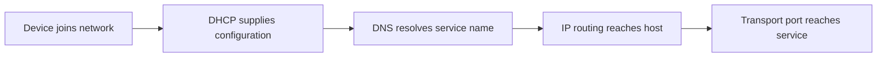
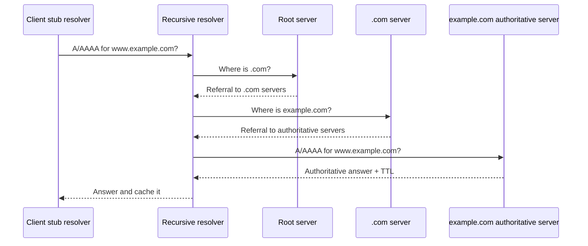
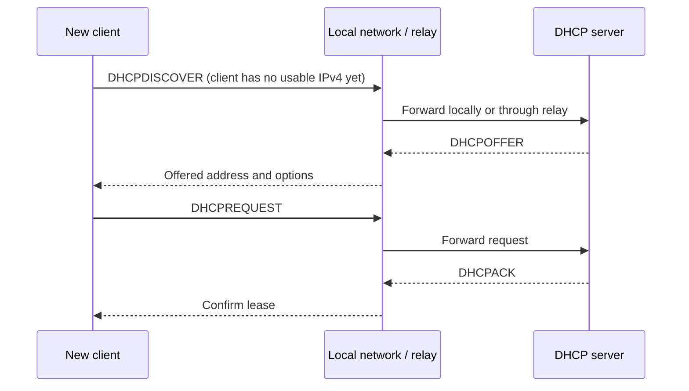
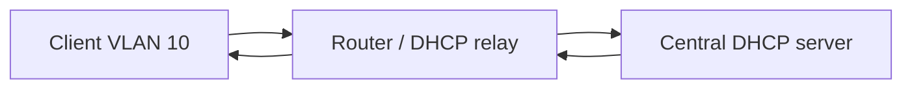
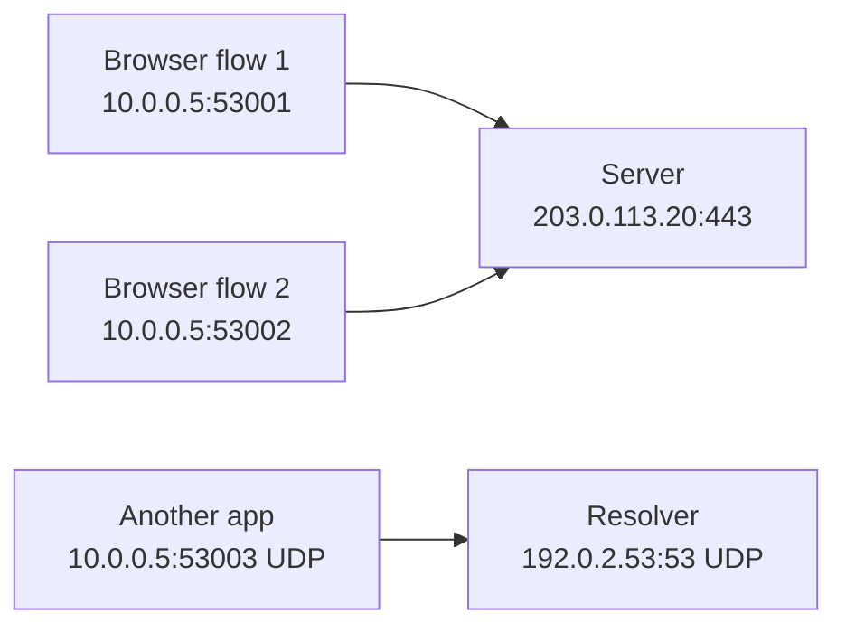
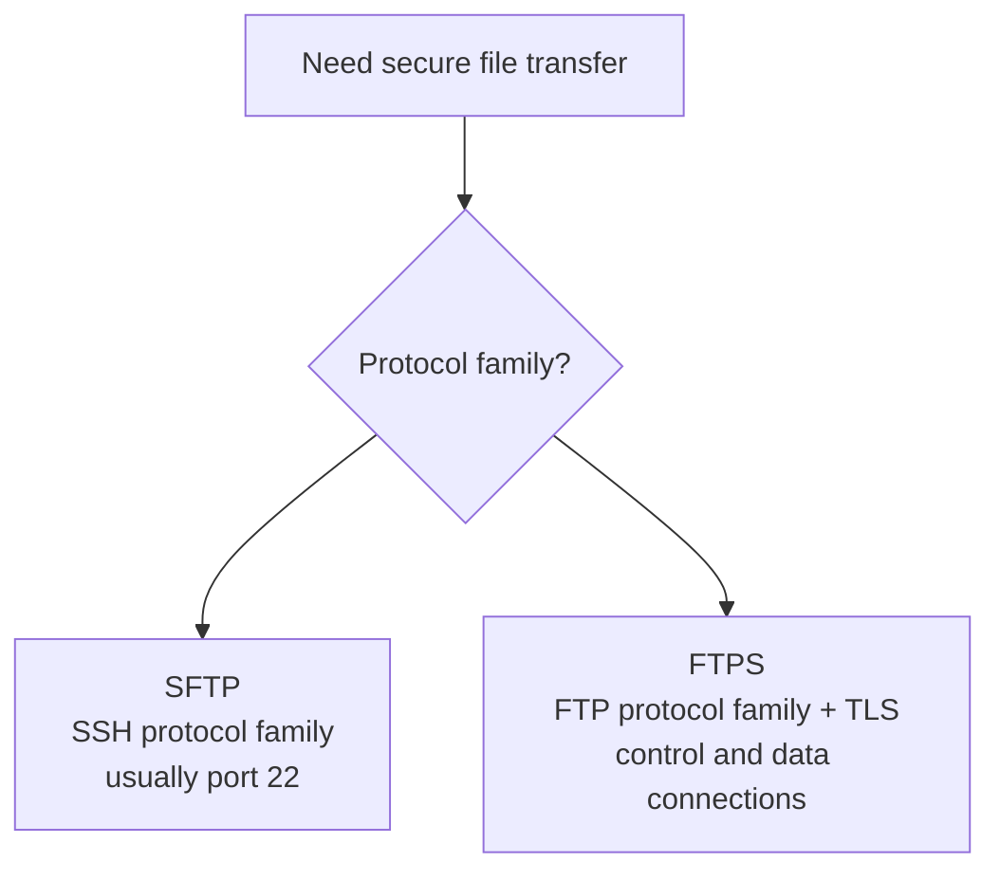
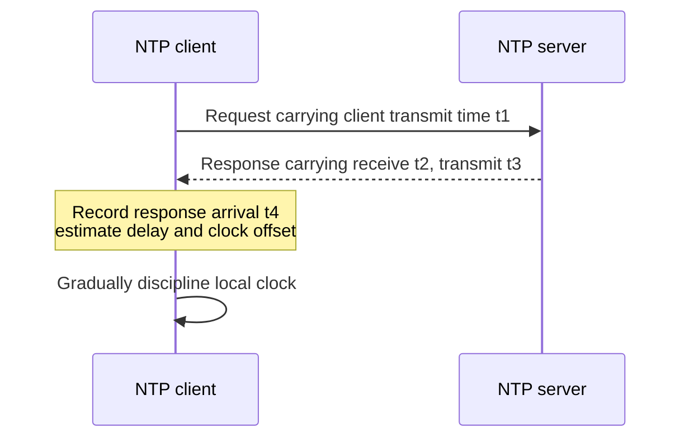
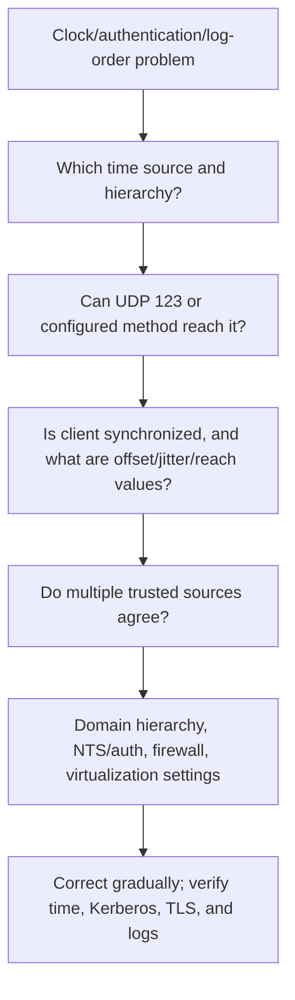
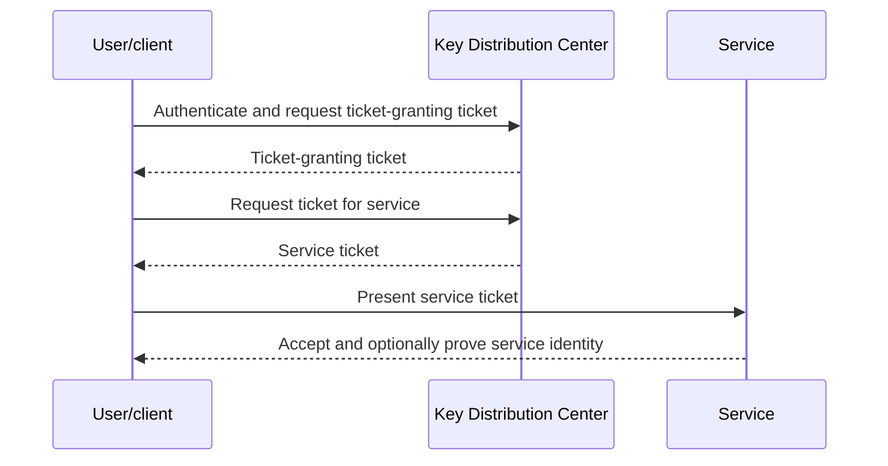
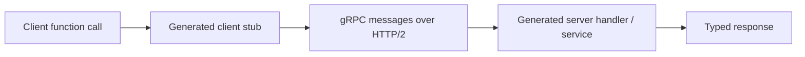

# Part D - Core Services & Protocol Map

> **Section goal:** explain how devices obtain network configuration, how names become addresses, how ports identify services, and where common enterprise protocols fit.

Covers index items **23-29**.

[Back to the master guide](../Networking%20Security%20and%20Azure%20Identity%20-%20Study%20Guide.md) | [Previous: Part C](Part-C-addressing-local-delivery-routing.md)

---

## Start Here: Configuration, Location, and Conversation

Three services make ordinary network use feel automatic:

1. **DHCP** gives a device usable network configuration.
2. **DNS** translates names into information such as IP addresses.
3. **Ports and sockets** let an operating system deliver each conversation to the correct process.

**Analogy:** DHCP gives a new employee a desk and office instructions, DNS is the company directory, and a port is the extension that reaches a particular department.



---

## 23. DNS: Names, Records, Recursion, Caching, and Lookup

The **Domain Name System (DNS)** is a distributed database that stores information about names.

Its most familiar job is mapping a name such as `www.example.com` to an IPv4 or IPv6 address. DNS does more than name-to-address lookup: it also identifies mail servers, service locations, authoritative name servers, and policy information.

### DNS vocabulary

| Term | Plain meaning | Analogy |
|------|---------------|---------|
| Domain name | Hierarchical human-readable name | A person's full organizational name |
| Label | One component between dots | A department or surname |
| Fully Qualified Domain Name (FQDN) | Complete name in the DNS hierarchy | Full postal address |
| Zone | Administratively managed portion of DNS | A directory section owned by one team |
| Record | A typed DNS data entry | One directory field |
| Name server | Server that answers DNS questions | Directory service desk |
| Resolver | Software that seeks an answer | Assistant looking up the entry |
| Recursive resolver | Service that obtains or caches a final answer for a client | Librarian researching across catalogs |
| Authoritative server | Source responsible for a zone's data | Official records office |
| TTL | Time To Live for cached DNS data | Expiration time on a copied notice |

### The hierarchy

Read a DNS name from right to left:

```text
www.example.com.
 |      |    |
host/domain  top-level domain  root
```

- The final dot represents the DNS root and is usually omitted in everyday writing.
- `.com` is a top-level domain (**TLD**).
- `example.com` is a domain below `.com`.
- `www` is a label within that domain; it may identify a host or service name.

### Common DNS records

| Type | Stores | Example use |
|------|--------|-------------|
| A | IPv4 address | `www.example.com -> 192.0.2.20` |
| AAAA | IPv6 address | `www.example.com -> 2001:db8::20` |
| CNAME | Alias to another canonical name | `shop.example.com -> hosting.vendor.example` |
| MX | Mail exchanger and preference | Where mail for a domain should go |
| NS | Authoritative name server for a zone/delegation | Who answers officially for the zone |
| SOA | Zone authority and timing metadata | Primary zone information and serial |
| TXT | Text data | Domain verification and email-security policies |
| PTR | Reverse lookup from address to name | `192.0.2.20 -> host.example.com` |
| SRV | Service location with port, priority, and weight | Discovering directory or communication services |
| CAA | Which Certificate Authorities may issue certificates | Certificate-issuance policy |

A CNAME points to another **name**, not directly to an IP address. The resolver must continue resolving the target.

### Recursive lookup

A client normally uses a **stub resolver**, a small operating-system component that asks a configured recursive resolver for an answer.

If the answer is not cached, a simplified lookup is:



The recursive resolver may already have root, TLD, delegation, or final records cached, so it often performs fewer steps.

### Recursive vs iterative queries

| Recursive request | Iterative response pattern |
|-------------------|----------------------------|
| Client asks a resolver to return the final answer or an error | A server returns the best information it has, often a referral |
| Common from endpoint to enterprise/Internet Service Provider (ISP) resolver | Common among resolvers and DNS hierarchy servers |

### DNS caching

Caching reduces delay and load, but it means updates are not instantly visible everywhere.

- Positive answers are cached according to TTL.
- Negative answers, such as a proven nonexistent name, can also be cached.
- Browsers, applications, operating systems, recursive resolvers, and forwarders may all cache.
- A stale answer may exist at one layer even after another cache is cleared.

### DNS transport and security

| Method | Common transport/port | What it provides |
|--------|-----------------------|------------------|
| Classic DNS | UDP 53, with TCP 53 when needed | DNS messages without transport encryption |
| DNS over TLS (DoT) | TCP 853 | Encrypted channel to a DNS resolver |
| DNS over HTTPS (DoH) | HTTPS, usually TCP/QUIC 443 | DNS carried in HTTPS |
| Domain Name System Security Extensions (DNSSEC) | DNS signatures | Origin authenticity and integrity for signed DNS data, not query confidentiality |

DNS commonly starts with UDP for efficiency, but TCP is normal for cases such as larger responses, zone transfers, or fallback. "DNS only uses UDP" is incorrect.

> 🔍 **Plain-English deep dive: DNS success is not service success**
>
> DNS can return the correct IP while routing, TCP, TLS, or the application later fails. Conversely, a working connection to a remembered IP does not prove current DNS works. Test each stage separately.

---

## 24. DHCP: DORA, Leases, Renewal, and Relay

The **Dynamic Host Configuration Protocol (DHCP)** automatically supplies network settings to a client.

Typical IPv4 settings include:

- IP address and subnet mask/prefix
- Default gateway
- DNS server addresses
- Lease duration
- Optional domain, routes, time server, or vendor-specific data

### DORA

The common initial DHCPv4 exchange is remembered as **DORA**:

1. **Discover:** client looks for DHCP servers.
2. **Offer:** server proposes an address and options.
3. **Request:** client selects and requests an offered lease.
4. **Acknowledge:** server confirms the lease.



DHCPv4 servers use UDP port 67 and clients use UDP port 68. Early messages may use broadcast because the client does not yet have full IP configuration.

### Lease lifecycle

A DHCP address is leased for a period rather than permanently assigned.

| Stage | Typical behavior |
|-------|------------------|
| Bound | Client uses the confirmed configuration |
| T1 renewal | Client normally tries to renew directly with the original server, often around 50% of the lease |
| T2 rebinding | Client broadens the request to available servers, often around 87.5% |
| Expiry | Client must stop using the address if renewal/rebinding failed |

Exact timers come from protocol behavior and server options; the common percentages are defaults, not universal operational guarantees.

### DHCP relay

Routers normally do not forward local broadcasts. A **DHCP relay agent** receives a client's local DHCP message and forwards it to a server on another subnet, adding information about the client network.



This lets one central service manage many subnets while selecting addresses from the correct scope.

### DHCP failures

| Symptom | Possible area |
|---------|---------------|
| IPv4 address in `169.254.0.0/16` | Client did not obtain normal DHCP configuration |
| Address but no gateway | Scope option or client configuration problem |
| Address from wrong subnet | Wrong VLAN, relay, or scope selection |
| Duplicate-address warning | Stale lease, static conflict, or detection failure |
| Works until lease expires | Renewal path, relay, server availability, or policy issue |
| Some clients fail only | Exhausted scope, reservations, client state, or filtering |

### IPv6 configuration

IPv6 may use:

- **Router Advertisements (RA)** for prefix and default-router information
- **Stateless Address Autoconfiguration (SLAAC)** to construct an address
- **DHCPv6** for stateful addresses and/or additional options

DHCPv6 uses UDP 546 on clients and UDP 547 on servers. DHCPv6 does not itself provide the IPv6 default gateway; Router Advertisements do.

---

## 25. Ports, Well-Known Services, Ephemeral Ports, and Sockets

An IP address gets traffic to a host/interface. A **transport port** helps the operating system deliver traffic to the correct application endpoint.

TCP and UDP each have separate 16-bit port-number spaces from 0 through 65535.

### Port ranges

| Range | Internet Assigned Numbers Authority (IANA) category | Typical meaning |
|-------|---------------|-----------------|
| 0-1023 | System / well-known | Common standardized services |
| 1024-49151 | User / registered | Registered applications and services |
| 49152-65535 | Dynamic / private | Common client ephemeral range and private use |

Operating systems can configure ephemeral ranges differently. The category does not force every implementation to allocate exactly that range.

### Client and server port example

A browser may open:

```text
192.168.1.10:53120 -> 203.0.113.20:443 over TCP
```

- `53120` is the temporary client source port.
- `443` is the conventional HTTPS server destination port.
- Replies reverse source and destination.

### Socket and five-tuple

A **socket** is an operating-system communication endpoint exposed to an application through an Application Programming Interface (API).

A network flow is commonly identified by a five-tuple:

1. Source IP
2. Destination IP
3. Source port
4. Destination port
5. Transport protocol



Different source ports and protocols let conversations coexist even when they involve the same hosts.

### Listening vs established

- A **listening socket** waits for new connection attempts on a local address/port.
- An **established TCP socket** represents one specific conversation.
- UDP is connectionless at the protocol level, although an operating system can associate a UDP socket with a peer for API convenience.

### Ports are clues, not proof

- HTTPS commonly uses 443, but another application can also use 443.
- SSH can be configured on a nonstandard port.
- Modern inspection may identify application behavior rather than trust the port alone.
- A listening process, firewall rule, route, and application health must all align for a service to work.

---

## 26. SSH, FTP/FTPS/SFTP, SMTP, IMAP, POP3, SMB, and RDP

### Remote administration and file transfer

| Protocol | Purpose | Common port(s) | Security note |
|----------|---------|----------------|---------------|
| SSH | Secure Shell remote login, commands, tunnels | TCP 22 | Encrypted and server-authenticated; supports key authentication |
| SFTP | SSH File Transfer Protocol | TCP 22 | File-transfer subsystem inside SSH; not "secure FTP" |
| SCP | Secure Copy over SSH | TCP 22 | File copy using SSH security |
| FTP | File Transfer Protocol | TCP 21 control; separate data connections | Credentials/data can be cleartext without TLS |
| FTPS explicit | FTP upgraded with TLS | TCP 21 plus negotiated data connections | FTP semantics protected by TLS |
| FTPS implicit | TLS expected immediately | Commonly TCP 990 plus data connections | Distinct from SFTP |

FTP is firewall-sensitive because it uses separate control and data connections. In active mode the server initiates a data connection; in passive mode the client connects to a server-advertised data port.



### Email protocols

| Protocol | Job | Common ports |
|----------|-----|--------------|
| Simple Mail Transfer Protocol (SMTP) | Send/relay email | TCP 25 server relay; 587 message submission; 465 implicit TLS submission |
| Internet Message Access Protocol (IMAP) | Synchronize and manage mailbox on server | TCP 143; 993 implicit TLS |
| Post Office Protocol version 3 (POP3) | Download mailbox messages using a simpler model | TCP 110; 995 implicit TLS |

SMTP sends mail. IMAP and POP3 retrieve/access mail. "Email uses port 25" is incomplete because client submission and mailbox access use other ports.

### SMB and RDP

- **Server Message Block (SMB)** provides Windows-oriented file/printer sharing and named-pipe services, commonly on TCP 445.
- **Remote Desktop Protocol (RDP)** provides graphical remote sessions, commonly on TCP and UDP 3389 in modern deployments.

Exposing management and file-sharing services directly to the public internet creates significant risk. Secure designs use access controls, VPN or Zero Trust Network Access (ZTNA), hardened gateways, monitoring, and patching.

---

## 27. NTP, SNMP, LDAP/LDAPS, Kerberos, and Syslog

These protocols often appear in enterprise troubleshooting and identity flows.

| Protocol | Purpose | Common transport/port | Key security point |
|----------|---------|-----------------------|--------------------|
| NTP | Network Time Protocol, synchronizes clocks | UDP 123 | Accurate time supports logs, certificates, and Kerberos |
| SNMP | Simple Network Management Protocol, reads/changes management data | UDP 161 | Prefer SNMPv3 security over weak community strings |
| SNMP Trap/Inform | Device sends management events | UDP 162 commonly | Unsolicited monitoring notification |
| LDAP | Lightweight Directory Access Protocol | TCP/UDP 389 depending on use | Plain LDAP does not automatically mean encrypted |
| LDAPS | LDAP over TLS from connection start | TCP 636 | Protects directory channel when correctly validated |
| Kerberos | Ticket-based network authentication | TCP/UDP 88 | Depends heavily on names, trust, and time |
| Syslog | Event-message transport | UDP/TCP 514 commonly | Plain transport may lack confidentiality/integrity |
| Syslog over TLS | Protected syslog transport | TCP 6514 commonly | TLS validation and reliable delivery still matter |

### Why time matters

Clock error can cause:

- Kerberos authentication rejection because tickets are outside allowed skew
- TLS certificate "not yet valid" or "expired" errors
- Confusing event correlation across systems
- Incorrect token and log timestamps

### How NTP synchronizes time

The **Network Time Protocol (NTP)** exchanges timestamped messages, normally over UDP 123, so a client can estimate clock offset and network delay relative to a time source.

**Analogy:** if you know when a reply left, arrived, and returned, you can estimate how much of the difference came from travel and how much from the clocks disagreeing.



A simplified symmetric-path estimate is:

$$
D_{RTT} = (t_4-t_1) - (t_3-t_2)
$$

$$
O_{clock} = ((t_2-t_1)+(t_3-t_4))/2
$$

Here, $D_{RTT}$ is estimated round-trip delay and $O_{clock}$ is estimated clock offset.

Path asymmetry limits the accuracy of this estimate, so clients sample multiple times and reject poor/outlier sources.

### Stratum and hierarchy

NTP uses **stratum** to describe logical distance from a reference clock:

| Stratum | Meaning |
|---------|---------|
| 0 | Reference device such as an atomic/Global Navigation Satellite System (GNSS) clock; not an ordinary network server |
| 1 | Server directly connected to a reference clock |
| 2 | Server synchronized from stratum 1 |
| Higher | Additional synchronization hops, up to protocol limits |

Lower stratum does not automatically mean lower latency, better path, or honest time. Selection also considers reachability, quality, offset, jitter, and source agreement.

Clients should use multiple independent appropriate sources so one failed or false source does not dictate time.

### Drift, step, and slew

- **Drift** is the local oscillator gradually gaining or losing time.
- A **step** immediately changes the clock, which can disrupt logs, timers, databases, and security assumptions.
- A **slew** gradually adjusts clock rate to converge more safely.

Time services choose behavior based on offset size, startup state, and policy. Do not manually change production clocks without understanding distributed-system and authentication consequences.

### Authenticated time

Ordinary NTP does not inherently prove that every response is trustworthy. Options include controlled internal time hierarchies, symmetric-key authentication in supported deployments, and **Network Time Security (NTS)** for cryptographic protection in capable implementations.

Windows Active Directory Domain Services (AD DS) domain members normally follow the Windows Time service hierarchy rooted toward the forest-root PDC emulator, which should use reliable upstream sources. **PDC** means Primary Domain Controller in this role name; the current role is an operations-master role, not an old-style standalone PDC architecture.

### NTP troubleshooting flow



Check:

1. Time source/peer actually selected
2. Client synchronization state and last successful update
3. Offset, delay, jitter, and reachability
4. UDP 123 firewall/NAT path or configured secure method
5. Virtual-machine host/guest time-source conflict
6. AD DS hierarchy and PDC emulator source where applicable
7. Leap/time-zone confusion: NTP distributes Coordinated Universal Time (UTC)-like time, while time zone affects display
8. Post-correction Kerberos, TLS, token, and log correlation

### LDAP vs Active Directory vs Entra ID

- LDAP is a protocol for accessing directory information.
- Active Directory Domain Services is a directory service that supports LDAP, Kerberos, DNS integration, and more.
- Microsoft Entra ID is a cloud identity platform that primarily uses modern web identity protocols rather than being a cloud LDAP server.

### Kerberos in one diagram



Part L returns to Kerberos and compares it with cloud identity protocols.

---

## 28. QUIC, HTTP/3, WebSocket, and gRPC

### QUIC and HTTP/3

**QUIC** is a secure, multiplexed transport implemented over UDP. It integrates TLS 1.3 into its handshake and avoids some limitations of layering multiple HTTP/2 streams over one TCP connection.

**HTTP/3** maps HTTP semantics onto QUIC and commonly uses UDP port 443.

| HTTP/2 over TCP/TLS | HTTP/3 over QUIC |
|---------------------|------------------|
| TCP connection, then TLS | QUIC handshake integrates TLS 1.3 |
| Multiple HTTP streams share one TCP byte stream | Independent QUIC streams share one connection |
| Lost TCP packet can delay all application streams on that connection | Loss in one QUIC stream need not block delivery of unrelated stream data |
| Connection identified traditionally by network tuple | Connection IDs help survive some address/path changes |

QUIC still handles congestion control and reliable delivery for streams. "UDP means unreliable application" is therefore too simplistic.

### WebSocket

**WebSocket** provides a long-lived, full-duplex message channel between client and server.

- It commonly begins with an HTTP/1.1 Upgrade exchange.
- `ws://` is unprotected WebSocket; `wss://` is protected with TLS.
- After the upgrade, both sides can send messages without repeated HTTP request/response polling.

Typical uses include live dashboards, chat, and interactive updates.

### gRPC

**gRPC** is a remote procedure call framework. It commonly uses:

- Protocol Buffers for a compact typed message contract
- HTTP/2 for multiplexing and streaming
- TLS for transport security in production

It supports unary calls and client, server, or bidirectional streaming.



### Choosing among them

| Need | Likely approach |
|------|-----------------|
| Ordinary browser page or Representational State Transfer (REST) API | HTTP/HTTPS |
| Modern browser HTTP with improved transport behavior | HTTP/3 over QUIC where supported |
| Continuous two-way browser messages | WebSocket |
| Strongly typed service-to-service RPC and streaming | gRPC |

---

## 29. Protocol and Port Quick Reference

| Protocol/service | Common port(s) | Transport | Primary purpose |
|------------------|----------------|-----------|-----------------|
| FTP | 21 control; 20 active data; dynamic passive data | TCP | File transfer |
| SSH/SFTP | 22 | TCP | Secure remote shell/file transfer |
| SMTP relay | 25 | TCP | Mail transfer between servers |
| DNS | 53 | UDP/TCP | Name service |
| DHCPv4 | 67 server, 68 client | UDP | IPv4 configuration |
| HTTP | 80 | TCP | Unencrypted web traffic |
| Kerberos | 88 | UDP/TCP | Ticket-based authentication |
| POP3 | 110 | TCP | Mail retrieval |
| NTP | 123 | UDP | Time synchronization |
| IMAP | 143 | TCP | Mailbox synchronization |
| SNMP | 161 queries, 162 traps | UDP commonly | Network management |
| LDAP | 389 | TCP/UDP | Directory access |
| HTTPS | 443 | TCP; QUIC uses UDP | Protected web traffic |
| SMB | 445 | TCP | File and related Windows services |
| Syslog | 514 | UDP/TCP | Event transport |
| LDAPS | 636 | TCP | LDAP over TLS |
| DoT | 853 | TCP | DNS over TLS |
| IMAPS | 993 | TCP | IMAP with implicit TLS |
| POP3S | 995 | TCP | POP3 with implicit TLS |
| RDP | 3389 | TCP/UDP | Remote graphical session |
| Syslog over TLS | 6514 | TCP | Protected syslog |

### Five interview cautions

1. A port is a convention, not proof of application identity.
2. TCP and UDP can use the same numeric port for different services.
3. Client source ports are usually ephemeral.
4. Some protocols negotiate additional dynamic connections.
5. Encryption can hide application content while metadata remains visible.

### A service-resolution checklist

When `app.example.com` is unavailable, separate these questions:

1. Does the client have valid address, route, and DNS configuration?
2. Does DNS return the intended record and address?
3. Is the destination address reachable through the selected route?
4. Is the expected transport port reachable and listening?
5. Does TLS or application negotiation succeed?
6. Is a firewall, proxy, or identity policy making the decision?

> 💡 **Tie-in for any background:** Treat protocol names as job descriptions, not trivia. DNS locates, DHCP configures, TCP/UDP transport, and application protocols define the service conversation. Port numbers become easier to remember after the job and flow make sense.

---

## ⭐ Likely Interview Questions for This Section

**Q1. Explain a DNS lookup for `www.example.com`.**

> *Model answer:* The client stub asks a recursive resolver. If the answer is not cached, the resolver follows referrals from a root server to the relevant TLD and then the domain's authoritative server. It returns the typed record and caches it according to TTL. DNS success only proves name resolution, not service connectivity.

**Q2. What is the difference between an A, AAAA, and CNAME record?**

> *Model answer:* An A record returns an IPv4 address, an AAAA record returns an IPv6 address, and a CNAME makes one name an alias of another name. A resolver must continue resolving the CNAME target to obtain usable address records.

**Q3. Does DNS use UDP or TCP?**

> *Model answer:* It uses both. Classic DNS commonly begins with UDP port 53, while TCP port 53 is used when needed, including larger responses, some fallback cases, and zone transfers. Encrypted forms include DoT on TCP 853 and DoH over HTTPS.

**Q4. Explain the DHCP DORA process.**

> *Model answer:* A new DHCPv4 client sends Discover, servers may send Offers, the client sends a Request for one offer, and the chosen server sends an Acknowledgement. The lease includes an address and options such as prefix, gateway, DNS servers, and lease timers.

**Q5. Why is a DHCP relay needed?**

> *Model answer:* Initial DHCPv4 traffic may be broadcast, and routers do not normally forward broadcasts. A relay receives it on the client subnet and forwards it to a centralized server while identifying the originating network so the server selects the correct scope.

**Q6. What is a socket and a five-tuple?**

> *Model answer:* A socket is an operating-system communication endpoint used by an application. A flow is commonly identified by source IP, destination IP, source port, destination port, and transport protocol, which separates simultaneous conversations.

**Q7. Compare SFTP and FTPS.**

> *Model answer:* SFTP is the SSH File Transfer Protocol and normally runs as an SSH subsystem on port 22. FTPS is the FTP protocol protected by TLS and retains FTP's separate control and data connection behavior. They are different protocol families.

**Q8. What is the relationship between QUIC and HTTP/3?**

> *Model answer:* QUIC is a secure multiplexed transport built over UDP with TLS 1.3 integrated into its handshake. HTTP/3 maps HTTP semantics onto QUIC. It commonly uses UDP 443 and can avoid connection-wide stream blocking caused by TCP packet loss.

---

## 🧠 30-Second Memory Hooks

- **DHCP configures; DNS locates; ports reach the process.**
- **DNS hierarchy: root -> TLD -> authoritative answer.**
- **A is IPv4, AAAA is IPv6, CNAME is another name.**
- **DNS uses UDP and TCP; DNSSEC signs data but does not hide queries.**
- **DORA: Discover, Offer, Request, Acknowledge.**
- **IP reaches the host; port reaches the service; five-tuple identifies the flow.**
- **SFTP is SSH; FTPS is FTP plus TLS.**
- **SMTP sends; IMAP synchronizes; POP3 downloads.**
- **QUIC is secure transport over UDP; HTTP/3 uses QUIC.**
- **Ports are clues, not proof.**

---

*Next suggested section:* **[Part E - TCP, UDP & Socket Conversations](Part-E-tcp-udp-sockets.md)**, which explains transport behavior, handshakes, reliability, resets, and protocol choice in depth.