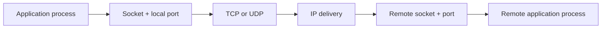
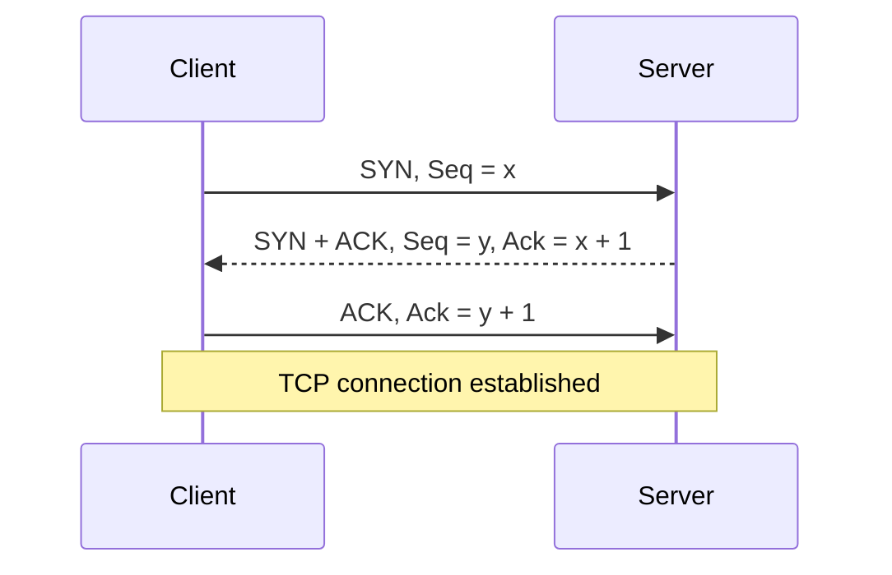
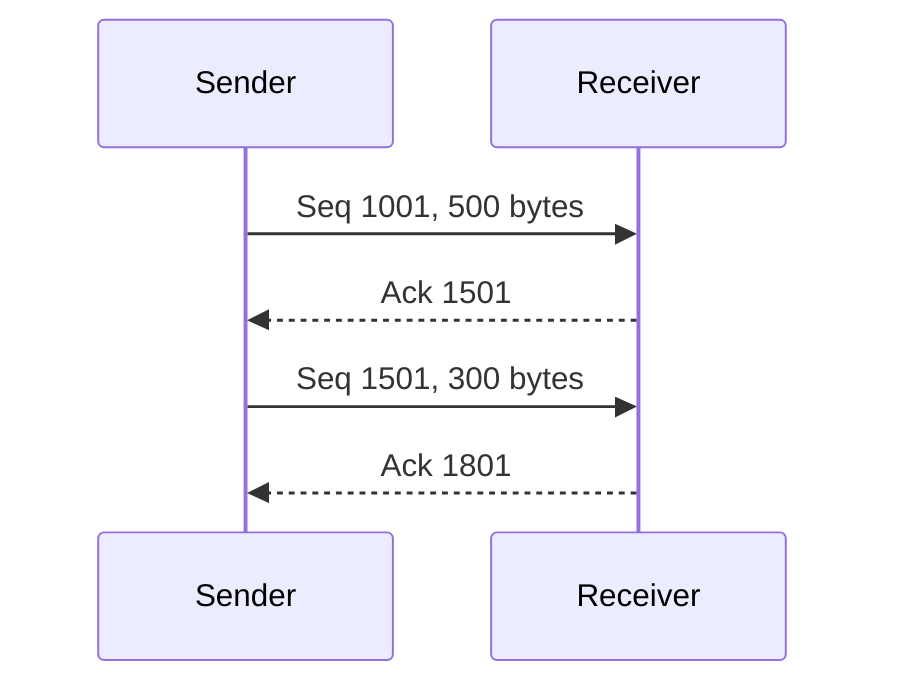
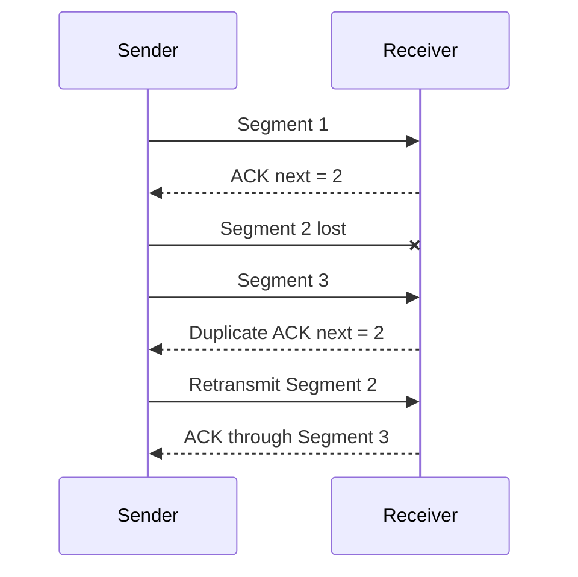
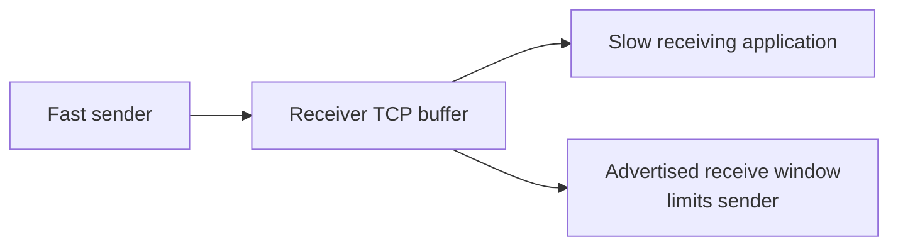
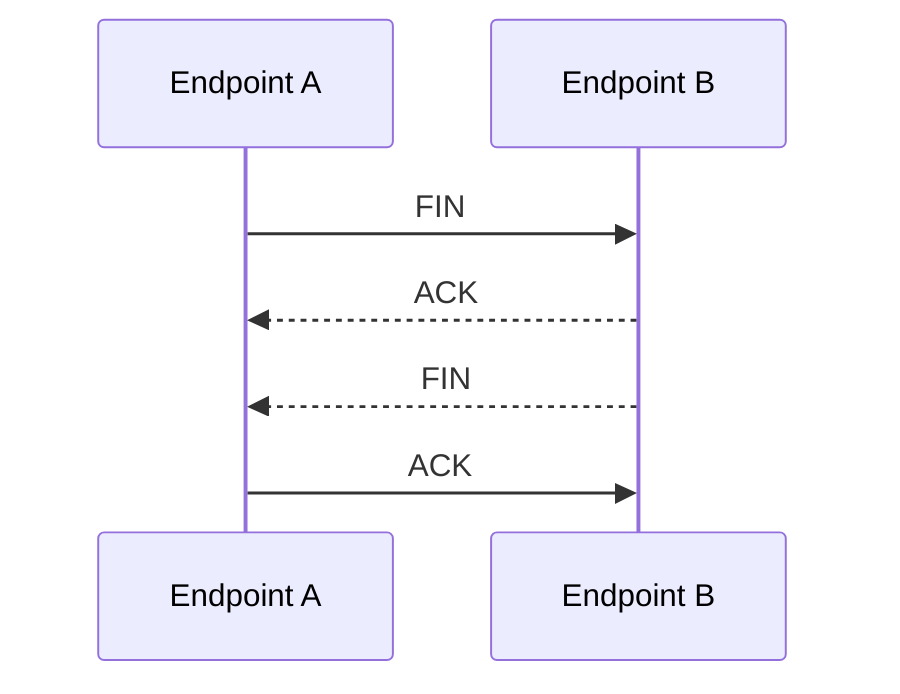
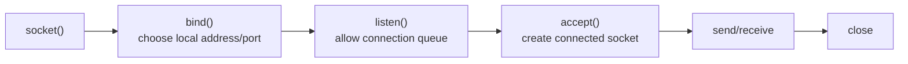
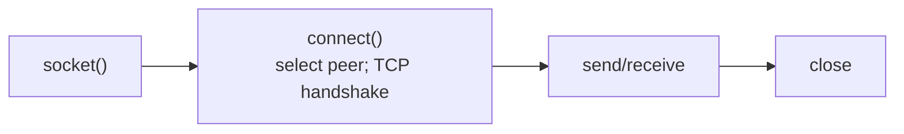
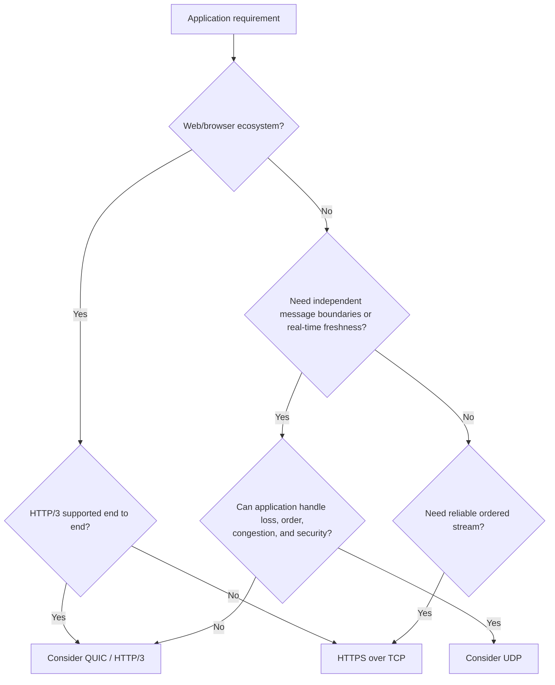

# Part E - TCP, UDP & Socket Conversations

> **Section goal:** explain how TCP and UDP carry application data, recognize common TCP failure patterns, and choose an appropriate transport based on application requirements.

Covers index items **30-36**.

[Back to the master guide](../Networking%20Security%20and%20Azure%20Identity%20-%20Study%20Guide.md) | [Previous: Part D](Part-D-core-services-protocol-map.md)

---

## Start Here: Transport Connects Processes

IP gets a packet toward a host. A **transport protocol** provides communication between application endpoints on hosts.

The two foundational Internet transports are:

- **Transmission Control Protocol (TCP):** a reliable, ordered byte stream.
- **User Datagram Protocol (UDP):** independent messages with minimal transport behavior.

**Analogy:** TCP resembles a tracked phone conversation in which order and missing pieces are managed. UDP resembles sending individual postcards: each preserves its boundary, but delivery and order are not guaranteed by the postal method.



---

## 30. Connection-Oriented vs Connectionless Communication

### Connection-oriented TCP

Before carrying normal application bytes, TCP peers establish shared connection state.

That state includes:

- Initial sequence numbers
- Acknowledgement progress
- Receive-window information
- Negotiated options such as Maximum Segment Size (**MSS**) and window scaling
- Timers and congestion-control state

TCP is called **connection-oriented** because endpoints coordinate and maintain this logical state. It does not mean the internet reserves one physical wire for the connection.

### Connectionless UDP

UDP sends self-contained datagrams without a transport handshake or shared reliability state.

Each datagram carries source port, destination port, length, and checksum information. The application decides whether it needs retries, ordering, duplicate handling, timing, or session state.

### Side-by-side

| TCP | UDP |
|-----|-----|
| Connection-oriented | Connectionless at protocol level |
| Reliable ordered byte stream | Best-effort independent datagrams |
| Retransmits detected missing bytes | No built-in retransmission |
| Flow and congestion control | No equivalent built-in transport behavior |
| Preserves byte order, not message boundaries | Preserves datagram boundaries |
| Larger state and handshake cost | Small header and no transport handshake |
| Examples: HTTPS over TCP, SSH, SMB | Examples: DNS queries, voice/video, DHCP |

### What "reliable" does not mean

TCP reliability means it attempts to deliver an ordered byte stream or reports connection failure. It does not guarantee:

- The remote application processed a business transaction
- The data is encrypted or authenticated
- The network has no delay
- A connection will eventually succeed
- Application message boundaries are preserved

An application-level acknowledgement may still be required, such as an order-confirmation ID after payment processing.

> 🔍 **Plain-English deep dive: protocol guarantees belong to a layer**
>
> TCP can confirm that bytes reached the peer's TCP stack, not that a human read them or a database committed them. Always ask, "Reliable at which layer and for which event?"

---

## 31. TCP Handshake, Sequence Numbers, Acknowledgements, and Flags

### The three-way handshake

TCP establishes both directions and synchronizes initial sequence numbers with three logical steps:

1. Client sends **SYN** with its initial sequence number.
2. Server sends **SYN-ACK**, acknowledging the client and announcing its own initial sequence number.
3. Client sends **ACK**, acknowledging the server.



The handshake confirms a two-way path at that moment and lets both sides exchange connection options.

### Sequence numbers

TCP numbers bytes in its logical stream.

- A segment's **Sequence Number** identifies the first byte represented in that segment.
- An **Acknowledgement Number** normally identifies the next byte the receiver expects.
- SYN and FIN each consume one sequence number even without ordinary payload bytes.

Simplified example:



An ACK of 1501 means, "I have received the continuous byte stream through 1500; send from 1501 next."

### Common TCP flags

| Flag | Meaning | Common observation |
|------|---------|--------------------|
| SYN | Synchronize connection state | Open a connection |
| ACK | Acknowledgement field is valid | Most packets after initial SYN |
| FIN | Sender has no more bytes to send | Graceful half-close |
| RST | Abort/reset connection | Closed port, invalid state, or forced termination |
| PSH | Request prompt delivery toward application | Often set on application-data segments |
| URG | Urgent Pointer is meaningful | Rare in modern applications |
| ECE/CWR | Explicit Congestion Notification signaling | Congestion feedback when negotiated |

Flags can be combined. A packet described as "SYN-ACK" has both SYN and ACK set.

### Handshake options

| Option | Purpose |
|--------|---------|
| MSS | Largest TCP payload the sender wants in one segment for this direction |
| Window Scale | Allows receive windows larger than the 16-bit header field directly represents |
| Selective Acknowledgement (SACK) Permitted | Lets the receiver later identify noncontiguous received ranges |
| Timestamps | Supports timing and protection against old duplicate segments |

Options may differ by direction. The MSS advertised by one endpoint constrains what the other should send toward it.

---

## 32. Reliability, Ordering, Flow Control, and Congestion Control

TCP reliability is a collection of mechanisms, not a single feature.

### Detecting and retransmitting loss

A sender retains unacknowledged bytes and retransmits when it concludes data was lost.

| Signal | Simplified interpretation |
|--------|---------------------------|
| Retransmission timeout (RTO) | Expected acknowledgement did not arrive before an adaptive timer expired |
| Duplicate ACKs | Receiver repeatedly reports the same next expected byte, suggesting a gap |
| SACK information | Receiver identifies ranges received beyond a gap |
| Fast retransmit | Sender retransmits likely missing data before waiting for the full RTO |



A capture at one location may label a packet "retransmission" based on what that capture observed. Capture loss, asymmetric paths, and offload can create misleading analysis, so corroborate with sequence/ACK behavior and capture location.

### Ordering

IP packets can arrive out of order. TCP uses sequence numbers and a receive buffer to present ordered bytes to the application.

This can create **head-of-line blocking**: later bytes may be present, but the ordered stream waits for a missing earlier range.

### Flow control

**Flow control** protects the receiver.

The receiver advertises a **receive window** showing how much additional data it can buffer. If the application reads slowly and the buffer fills, the advertised window can shrink to zero.



- A **Zero Window** says the receiver currently cannot accept more stream bytes.
- **Window probes** periodically test whether space has reopened.
- A zero window points toward receiver-side consumption or resources, not automatically network congestion.

### Congestion control

**Congestion control** protects the network path.

The sender maintains a congestion window (**cwnd**) and adapts its sending rate based on acknowledgements, loss, and possibly Explicit Congestion Notification (**ECN**).

| Flow control | Congestion control |
|--------------|--------------------|
| Protects receiver buffer | Protects network path |
| Driven by advertised receive window | Driven by sender congestion algorithm and path signals |
| "Can the receiver accept more?" | "Can the path carry more safely?" |

The sender's effective in-flight limit is constrained by both the receive window and congestion window.

### Cumulative and selective acknowledgement

- Normal TCP ACKs are cumulative: they confirm a continuous byte range.
- SACK can report later ranges already received while an earlier gap remains.
- SACK improves recovery efficiency but does not change the ordered byte stream seen by the application.

---

## 33. TCP Close, Resets, Timeouts, and Failure Patterns

### Graceful close

TCP is full duplex, so each direction closes independently.

A common four-segment close is:



FIN means, "I have no more stream bytes to send." It is not necessarily an error.

### TIME_WAIT

The endpoint performing the active close commonly enters **TIME_WAIT** long enough to:

- Retransmit the final ACK if needed
- Prevent delayed packets from an old connection being confused with a new connection using the same tuple

Many TIME_WAIT sockets can be normal for a busy short-connection service. Investigate architecture and rates before treating the state as a defect.

### Reset

An **RST** immediately aborts a TCP conversation.

Common causes include:

- SYN reaches a host with no listening service on that port
- Firewall or middlebox actively rejects a connection
- Application closes a socket abortively
- Endpoint receives traffic for connection state it does not recognize
- Service crashes or restarts
- Timeout or policy causes a proxy/load balancer to terminate one side

An RST tells you which observed IP sent the reset, not automatically which human-configured component caused it. NAT, proxies, and transparent devices affect attribution.

### Timeout

A **timeout** means an expected event did not occur before a timer expired. It does not identify the cause by itself.

Potential causes include:

- Packet silently dropped by policy
- Route or return-path failure
- Server unavailable or overloaded
- NAT/firewall state expired
- Retransmissions exhausted
- Application-level response took too long
- Client timer was shorter than downstream processing time

### Common packet patterns

| Pattern | Immediate fact | Productive next question |
|---------|----------------|--------------------------|
| Repeated SYN, no response | Client capture saw no SYN-ACK/RST | Did SYN arrive at next observation point, and could reply return? |
| SYN followed by RST | A device rejected/aborted promptly | Which device generated RST, and was service listening? |
| Handshake succeeds, then TLS alert | TCP path worked for handshake | Which TLS negotiation or validation failed? |
| Data then retransmissions | ACK progress stopped or capture missed evidence | Loss, delay, receiver state, capture quality, or asymmetric path? |
| Zero Window | Receiver advertised no buffer space | Why is receiving application not draining data? |
| FIN exchange | Graceful transport shutdown | Was close expected at application layer? |
| RST after idle period | Connection was aborted after inactivity | Which endpoint/middlebox idle timer expired? |

> 🔍 **Plain-English deep dive: absence has many causes**
>
> "No SYN-ACK in the client capture" means only that the client capture did not observe one. The SYN may have been dropped outbound, reached a server that could not reply, received a reply that was dropped on return, or suffered capture loss. Move capture/log observation points along the path to narrow the boundary.

---

## 34. UDP Behavior, Strengths, Trade-offs, and Uses

UDP preserves message boundaries: one application send normally creates one datagram, and the receiver receives datagrams rather than an undifferentiated byte stream.

### UDP header jobs

UDP provides:

- Source port
- Destination port
- Datagram length
- Checksum for error detection (required in IPv6; special optional-zero behavior exists in IPv4)

It does not provide built-in:

- Connection handshake
- Retransmission
- Ordered delivery
- Duplicate removal
- Flow control
- Congestion control

Applications should still behave responsibly under congestion.

### Why choose UDP?

- Small request/response exchanges can avoid a TCP handshake.
- Real-time media may prefer current data over delayed retransmission of old data.
- Multicast applications rely on datagram delivery.
- Applications can implement specialized reliability and multiplexing, as QUIC does.

### Common uses

| Use | Why UDP can fit |
|-----|-----------------|
| DNS query | Small independent request/response, with retry/fallback behavior |
| DHCP | Client initially lacks normal network configuration |
| Voice/video media | Late packets may be less useful than small gaps |
| NTP | Compact timing exchanges |
| SNMP | Simple management queries/events |
| QUIC/HTTP/3 | Application-space secure transport builds richer behavior over UDP |

### Size and fragmentation

A UDP datagram is carried inside IP. If it exceeds the usable path size, IP fragmentation or failed delivery can result depending on IP version, sender behavior, and path policy.

Good designs avoid assuming that a large UDP datagram will traverse every path. Path MTU is covered in Part O.

### UDP "connection"

An application can call `connect` on a UDP socket. This can set a default peer and filter delivered datagrams at the socket API, but it does not create a TCP-style wire handshake or reliable connection.

---

## 35. The Socket Five-Tuple and Application Lifecycle

### Five-tuple identity

A TCP conversation is commonly distinguished by:

```text
(source IP, source port, destination IP, destination port, transport protocol)
```

Example:

```text
10.0.0.5:53001 -> 203.0.113.20:443 TCP
10.0.0.5:53002 -> 203.0.113.20:443 TCP
```

These are two separate connections because the client source ports differ.

### Simplified server socket lifecycle



The original listening socket can continue accepting new connections while each accepted socket represents one established conversation.

### Simplified client lifecycle



The operating system commonly chooses a suitable source IP and ephemeral source port if the application does not bind them explicitly.

### Wildcard listening

A server may bind:

- One specific local IP, limiting where it listens
- A wildcard IPv4 address such as `0.0.0.0`, meaning all appropriate local IPv4 interfaces
- An IPv6 wildcard `::`, with dual-stack behavior depending on operating-system/socket settings
- Loopback only, preventing direct remote access

A process "listening on port 8080" is incomplete evidence until you know address family and bound local address.

### NAT and observed tuples

NAT/PAT rewrites tuple fields. A client, edge device, server, and proxy may log different source addresses and ports for related traffic. Correlation may require timestamps, translation tables, connection IDs, proxy headers, or trace identifiers.

### Socket vs connection vs session

| Term | Useful meaning |
|------|----------------|
| Socket | Operating-system endpoint/API object |
| TCP connection | Transport state between a specific pair of endpoints |
| TLS session/connection | Cryptographic state carried over transport |
| Application session | Application-defined identity/state, often spanning multiple transport connections |

Do not assume all four lifetimes are identical.

---

## 36. Choosing TCP, UDP, or QUIC

Start with application requirements, not a favorite protocol.



### Decision table

| Requirement | TCP | UDP | QUIC |
|-------------|-----|-----|------|
| Reliable ordered byte stream | Built in | Application must build it | Reliable independent streams available |
| Message/datagram boundary | No | Yes | Datagram and stream capabilities depend on use/API |
| Transport handshake | Yes | No | Yes, integrated with TLS 1.3 |
| Built-in encryption | No | No | Yes for QUIC protocol state and application payload |
| Kernel/middlebox compatibility | Very mature | Mature, but policy may limit some UDP | Modern; UDP/QUIC blocking can trigger fallback |
| Connection migration | Not inherent | Application-defined | Connection IDs support migration scenarios |
| Multicast | No | Yes | No standard multicast transport behavior |

### Scenario examples

| Scenario | Reasonable choice | Reasoning |
|----------|-------------------|-----------|
| SSH terminal | TCP | Ordered reliable stream is essential |
| DNS lookup | UDP first, TCP when needed | Small independent query with protocol retry/fallback |
| Live voice media | UDP with real-time media protocols | Freshness can matter more than old-packet retransmission |
| Web API | HTTPS over TCP or HTTP/3 over QUIC | Broad web semantics, security, and infrastructure support |
| Large file transfer | TCP or QUIC-based application protocol | Reliable delivery and congestion control |
| One-to-many local discovery | UDP multicast/broadcast where designed | Group delivery and simple discovery |

### Troubleshooting transport choice

If HTTP/3 fails but HTTPS over TCP works, investigate:

- UDP 443 policy
- QUIC support at client, proxy, firewall, load balancer, and server
- NAT handling and idle timeout
- Path MTU behavior
- Product fallback behavior

> 💡 **Tie-in for any background:** The transport choice is a service-level trade-off. Ask whether order, guaranteed byte delivery, timeliness, message boundaries, mobility, and infrastructure compatibility matter. That turns protocol selection into reasoning rather than memorization.

---

## Quick Transport Troubleshooting Checklist

| Step | Evidence question |
|------|-------------------|
| 1 | Which IPs, ports, and transport protocol form the observed tuple? |
| 2 | For TCP, did SYN, SYN-ACK, ACK complete? |
| 3 | If not, was there silence, ICMP, or RST, and at which observation point? |
| 4 | Are sequence numbers and cumulative ACKs progressing? |
| 5 | Are retransmissions genuine path loss, receiver delay, or capture artifacts? |
| 6 | Did either endpoint advertise a small/zero receive window? |
| 7 | Was closure graceful with FIN or abortive with RST? |
| 8 | Do NAT, proxy, or load-balancer timers alter the connection? |
| 9 | For UDP, does the application provide retries, correlation, and security? |
| 10 | Does a TCP/QUIC fallback difference isolate a transport-policy issue? |

---

## ⭐ Likely Interview Questions for This Section

**Q1. Compare TCP and UDP.**

> *Model answer:* TCP is connection-oriented and provides a reliable ordered byte stream with retransmission, flow control, and congestion control. UDP sends independent datagrams without those built-in guarantees. UDP has less transport overhead, but the application must supply any required reliability, ordering, security, and congestion behavior.

**Q2. Explain the TCP three-way handshake.**

> *Model answer:* The client sends SYN with its initial sequence number, the server replies SYN-ACK with its own sequence number and acknowledgement, and the client returns ACK. This synchronizes both directions, confirms a two-way path at that time, and negotiates TCP options.

**Q3. What do TCP sequence and acknowledgement numbers mean?**

> *Model answer:* TCP numbers stream bytes. A segment's sequence number identifies its first byte, while the acknowledgement number normally states the next byte expected, cumulatively confirming all earlier continuous bytes. SYN and FIN each consume sequence space.

**Q4. What is the difference between flow control and congestion control?**

> *Model answer:* Flow control protects the receiver and uses the advertised receive window to prevent buffer overflow. Congestion control protects the network path and adjusts sender behavior based on ACKs, loss, ECN, and an algorithm's congestion window.

**Q5. What is the difference between FIN, RST, and timeout?**

> *Model answer:* FIN gracefully closes one sending direction, RST immediately aborts a connection, and timeout means an expected event did not occur before a timer expired. A timeout identifies a symptom, so I would use captures and logs at multiple points to locate the missing event.

**Q6. A client repeatedly sends SYN with no response. What does that prove?**

> *Model answer:* It proves that the client-side capture observed repeated attempts and no response. It does not locate the drop. I would determine whether the SYN reaches the server-side path and whether a response is generated and can return, checking routes, policy, service state, NAT, and capture quality.

**Q7. What is a TCP socket five-tuple?**

> *Model answer:* Source IP, source port, destination IP, destination port, and transport protocol identify a flow. Distinct client ephemeral ports let many simultaneous connections reach the same server IP and port.

**Q8. Why can QUIC provide reliability even though it uses UDP?**

> *Model answer:* UDP is only QUIC's underlying datagram carrier. QUIC implements its own secure handshake, acknowledgements, retransmission, congestion control, and independent streams in application space. Therefore, "UDP has no reliability" does not mean protocols built over UDP cannot provide it.

---

## 🧠 30-Second Memory Hooks

- **IP reaches a host; transport reaches a process.**
- **TCP is an ordered byte stream; UDP is independent datagrams.**
- **SYN, SYN-ACK, ACK opens TCP.**
- **ACK means next byte expected.**
- **Flow control protects receiver; congestion control protects path.**
- **FIN is graceful; RST aborts; timeout only says the clock expired.**
- **Five-tuple separates conversations.**
- **A TCP socket can listen, accept, exchange bytes, and close.**
- **Reliability is layer-specific, not proof of business completion.**
- **QUIC builds secure reliable streams over UDP.**

---

*Next suggested section:* **[Part F - HTTP, HTTPS & APIs](Part-F-http-https-apis.md)**, which applies transport knowledge to browser requests, status codes, cookies, caching, APIs, and modern HTTP versions.