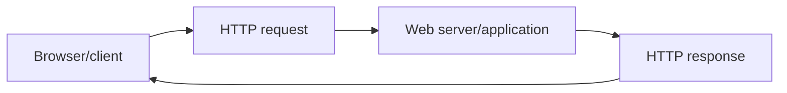
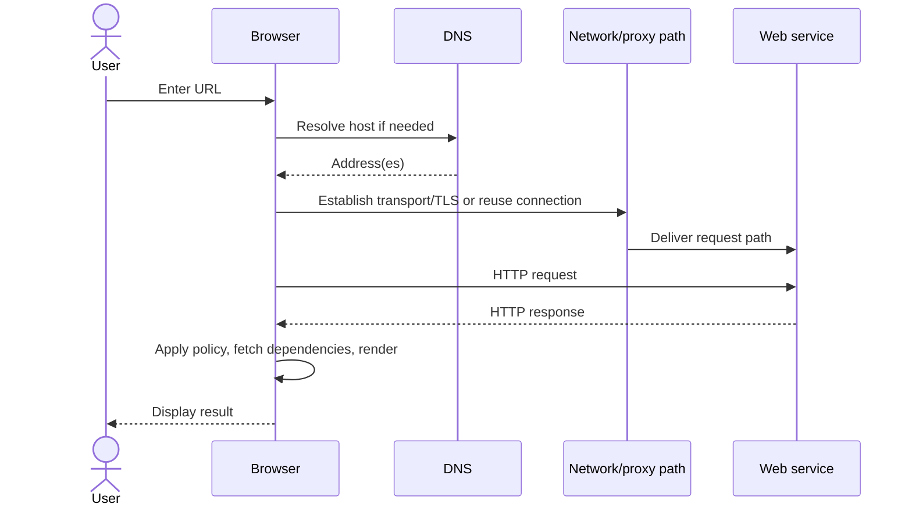
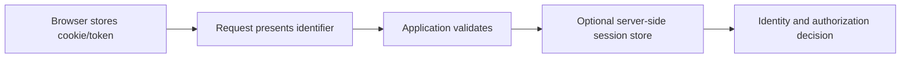
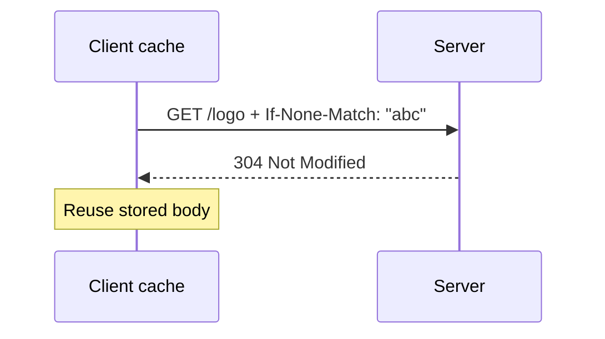
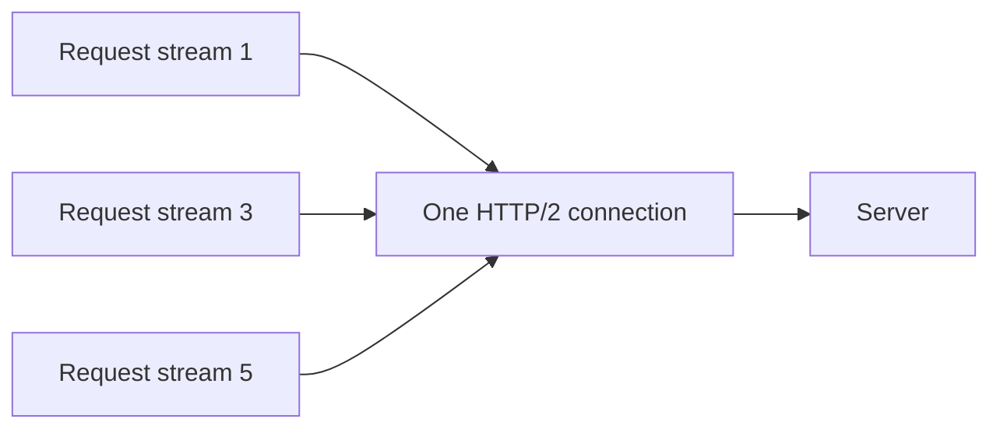
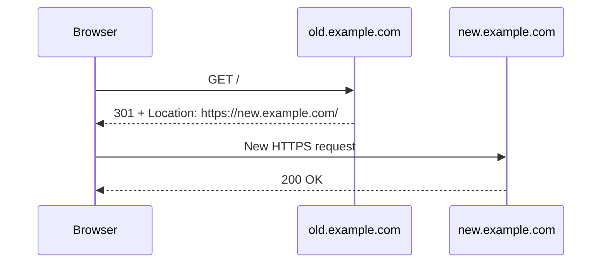
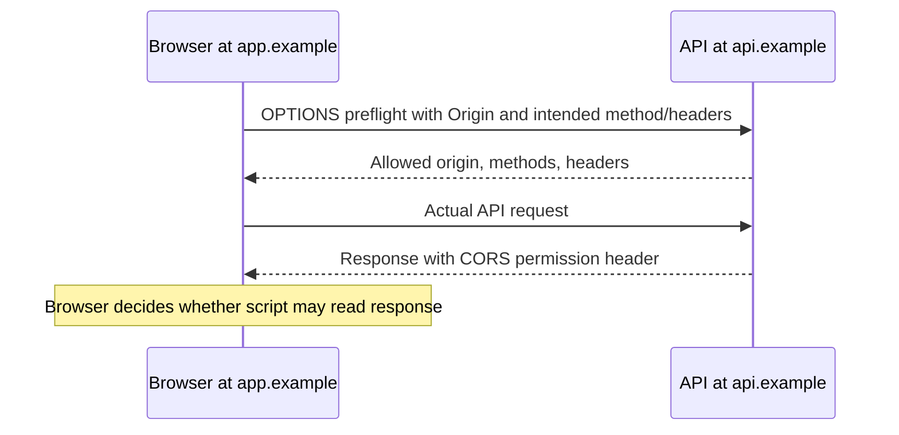
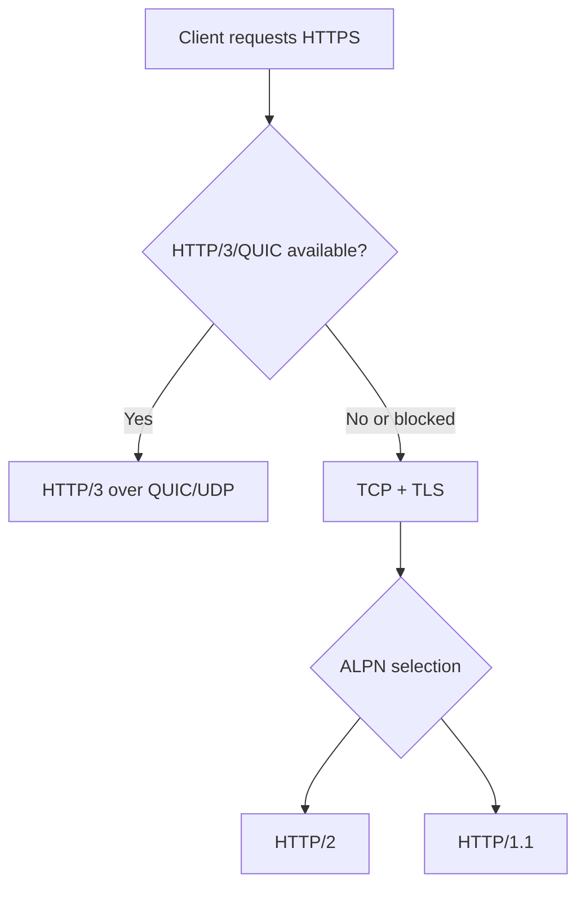
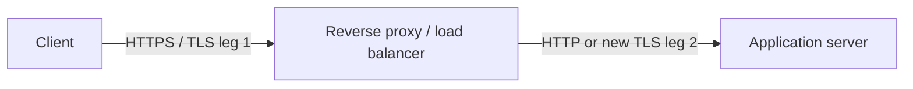

# Part F - HTTP, HTTPS & APIs

> **Section goal:** read and explain web requests and responses, distinguish browser, HTTP, TLS, and transport responsibilities, and diagnose failures using status and protocol evidence.

Covers index items **37-43**.

[Back to the master guide](../Networking%20Security%20and%20Azure%20Identity%20-%20Study%20Guide.md) | [Previous: Part E](Part-E-tcp-udp-sockets.md)

---

## Start Here: HTTP Is a Conversation Format

The **Hypertext Transfer Protocol (HTTP)** defines how a client requests a resource or action and how a server responds.

**Analogy:** HTTP is an order form and response receipt. TCP or QUIC transports it, IP routes it, and TLS can place it inside a protected envelope.



HTTP is **stateless** at the protocol-semantic level: each request contains what is needed to interpret that request. Applications build continuity with cookies, tokens, server-side sessions, and other identifiers.

---

## 37. URL Anatomy and the Browser Journey

A **Uniform Resource Locator (URL)** identifies how and where to access a resource.

Consider:

```text
https://shop.example.com:443/products/42?currency=USD#reviews
```

| Component | Value | Meaning |
|-----------|-------|---------|
| Scheme | `https` | Access method/protocol context |
| Host | `shop.example.com` | Service name to resolve/connect to |
| Port | `443` | Explicit transport port; omitted when default applies |
| Path | `/products/42` | Resource path at the origin |
| Query | `currency=USD` | Parameters sent as part of the request target |
| Fragment | `reviews` | Client-side reference; normally not sent in the HTTP request |

### Origin

For browser security, an **origin** is the tuple:

```text
(scheme, host, port)
```

`https://app.example.com` and `https://api.example.com` are different origins because the hosts differ. `http://example.com` and `https://example.com` are different because the schemes differ.

### What happens after Enter?

A simplified path is:

1. Browser parses the URL and applies local policy, cache, and service-worker behavior.
2. It determines proxy configuration and whether a connection can be reused.
3. DNS resolves the host if a usable result is not cached.
4. Routing and local delivery reach the next hop.
5. A transport connection is established or reused: TCP for HTTP/1.1 or HTTP/2, QUIC for HTTP/3.
6. For HTTPS, TLS authenticates the server and establishes protected keys.
7. Browser sends the HTTP request.
8. Server, proxy, or application returns an HTTP response.
9. Browser applies redirects, cookies, cache rules, and security policy.
10. It parses content, requests dependencies, lays out the page, and renders it.



Modern browsers perform many steps concurrently and can reuse DNS, TLS, and transport state. The sequence is a reasoning model, not a promise that every page load creates a new connection.

---

## 38. HTTP Requests and Responses

HTTP messages contain a start line, headers, and optionally a body. HTTP/2 and HTTP/3 encode these semantics into binary frames, but the concepts remain.

### HTTP/1.1 request example

```http
GET /products/42?currency=USD HTTP/1.1
Host: shop.example.com
Accept: application/json
Authorization: Bearer <token>
User-Agent: ExampleClient/1.0

```

| Part | Purpose |
|------|---------|
| Method `GET` | Requested operation semantics |
| Request target | Path and query sent to this server/proxy |
| Version | HTTP syntax/behavior version |
| `Host` | Intended virtual host/origin authority |
| Headers | Metadata and controls |
| Blank line | Ends the HTTP/1.1 header section |
| Body | Optional content, absent in this example |

### Response example

```http
HTTP/1.1 200 OK
Content-Type: application/json
Content-Length: 46
Cache-Control: private, max-age=60

{"id":42,"name":"Keyboard","currency":"USD"}
```

The response includes a status code, headers, and optional body.

### Common methods

| Method | Typical intent | Safe? | Idempotent? |
|--------|----------------|-------|-------------|
| GET | Retrieve a representation | Yes | Yes |
| HEAD | Retrieve headers without response body | Yes | Yes |
| POST | Submit/process or create under a collection | No | Not guaranteed |
| PUT | Create/replace resource at target Uniform Resource Identifier (URI) | No | Yes by semantics |
| PATCH | Partially modify a resource | No | Not guaranteed |
| DELETE | Remove target resource | No | Yes by semantics |
| OPTIONS | Ask about communication options; used in Cross-Origin Resource Sharing (CORS) preflight | Yes | Yes |

**Safe** means intended to be read-only. **Idempotent** means repeating the same intended operation has the same effect as doing it once. Responses can still differ because of timestamps, logs, counters, or current state.

### Important headers

| Header | Direction | Job |
|--------|-----------|-----|
| Host / `:authority` | Request | Select intended host at shared address |
| Content-Type | Both | Media type of body |
| Content-Length | Both | Body length where used |
| Accept | Request | Response formats the client can process |
| Authorization | Request | Credentials/token for the target resource |
| Location | Response | Redirect or created-resource location |
| Set-Cookie | Response | Ask user agent to store/update a cookie |
| Cookie | Request | Return applicable stored cookies |
| Cache-Control | Both | Caching directives |
| Origin | Request | Origin initiating certain browser requests |
| Access-Control-Allow-Origin | Response | CORS permission signal to browser |
| Via | Both | Proxy traversal information where added |

Headers are application metadata and may contain secrets. Logs should redact tokens, cookies, and personal data.

---

## 39. Status Codes, Cookies, Sessions, Caching, and Content Types

### Status-code families

| Family | Meaning | Common examples |
|--------|---------|-----------------|
| 1xx | Informational | 100 Continue, 101 Switching Protocols |
| 2xx | Successful processing | 200 OK, 201 Created, 204 No Content |
| 3xx | Redirection or cache behavior | 301, 302, 304, 307, 308 |
| 4xx | Request/client-side problem or policy result | 400, 401, 403, 404, 408, 409, 429 |
| 5xx | Server/proxy failed to fulfill valid-looking request | 500, 502, 503, 504 |

### Frequently confused codes

| Code | Useful interpretation |
|------|-----------------------|
| 200 OK | Request succeeded; body meaning depends on method/application |
| 201 Created | Resource created; `Location` may identify it |
| 204 No Content | Success with no response body |
| 301 / 308 | Permanent redirect; 308 preserves method/body semantics |
| 302 / 303 / 307 | Temporary/see-other behavior; method handling differs by code and clients |
| 304 Not Modified | Reuse cached representation; not a normal body response |
| 400 Bad Request | Server cannot process request syntax/shape |
| 401 Unauthorized | Authentication is missing/invalid; name is historically confusing |
| 403 Forbidden | Server understood identity/request but refuses access |
| 404 Not Found | Target not found or intentionally concealed |
| 429 Too Many Requests | Rate limiting; `Retry-After` may help |
| 500 Internal Server Error | Unhandled/general server-side failure |
| 502 Bad Gateway | Proxy/gateway received invalid failure response from upstream |
| 503 Service Unavailable | Service currently unable to handle request |
| 504 Gateway Timeout | Proxy/gateway timed out waiting for upstream |

A status code is evidence from the component that generated it. A branded proxy or WAF can return a code even when the origin application never saw the request.

### Cookies and sessions

A **cookie** is a small name/value item a user agent stores and returns under matching rules.

```http
Set-Cookie: session_id=opaque-value; Secure; HttpOnly; SameSite=Lax; Path=/
```

| Attribute | Purpose |
|-----------|---------|
| Secure | Send only over secure transport contexts |
| HttpOnly | Prevent normal JavaScript access, reducing some token-theft paths |
| SameSite | Restrict cross-site sending to reduce Cross-Site Request Forgery (CSRF) risk |
| Path / Domain | Limit where cookie applies |
| Expires / Max-Age | Control persistence |

A cookie can hold an opaque session identifier while actual session state remains on the server. It can also carry protected client-side state. Do not assume a cookie is encrypted merely because it has `Secure`; that attribute controls transmission context.

### Authentication session layers



An application session can outlive one TCP connection and use many HTTP requests.

### Content types

`Content-Type` identifies how to interpret a body.

| Media type | Typical content |
|------------|-----------------|
| `text/html` | HTML document |
| `text/css` | Style sheet |
| `application/javascript` | JavaScript |
| `application/json` | JSON structured data |
| `application/octet-stream` | Generic binary data |
| `multipart/form-data` | Form fields and file uploads |

### HTTP caching

Caching stores a reusable response closer to the consumer.

| Mechanism | Purpose |
|-----------|---------|
| `Cache-Control: max-age=N` | Response can be considered fresh for a duration |
| `private` | Intended for a private client cache, not shared cache |
| `public` | Explicitly cacheable by shared caches when other rules permit |
| `no-store` | Do not store response in caches |
| `no-cache` | Stored response must be revalidated before reuse |
| `ETag` / `If-None-Match` | Validator based on an entity tag |
| `Last-Modified` / `If-Modified-Since` | Time-based validator |
| `Vary` | Cache key must vary by named request headers |



`no-cache` does not mean "never store." `no-store` is the stronger no-storage directive.

---

## 40. Connections, Multiplexing, Compression, and Redirects

### Persistent connections

HTTP/1.1 normally keeps TCP connections alive for multiple requests, reducing repeated handshake cost.

However, servers, clients, proxies, NAT, and load balancers have idle and lifetime limits. Reusing a connection after one component silently expired state can cause retries or resets.

### HTTP/1.1 concurrency

HTTP/1.1 clients often open several TCP connections to an origin. Pipelining exists but has limited browser use because response ordering can block later requests.

### HTTP/2 multiplexing

HTTP/2 creates multiple logical **streams** over one TCP connection.



HTTP/2 removes HTTP/1.1 response-order blocking among its streams, but all streams still share one ordered TCP byte stream. A lost TCP segment can temporarily delay bytes needed by several HTTP/2 streams.

### Compression

| Type | Examples | Compresses |
|------|----------|------------|
| Content compression | gzip, Brotli | Representation body |
| Header compression | HPACK in HTTP/2, QPACK in HTTP/3 | Repeated HTTP header fields |

Compression saves bandwidth but consumes CPU and can create security concerns when secrets and attacker-controlled content interact. Sensitive systems control where and what they compress.

### Redirects

A redirect response tells a client to make another request to a `Location`.



A redirect creates a new request. It can involve new DNS, routing, proxy policy, TLS validation, cookies, and authorization. Redirect loops commonly result from conflicting application/proxy scheme or host assumptions.

---

## 41. REST APIs, JSON, Idempotency, Authentication Headers, and CORS

An **Application Programming Interface (API)** is a defined way for software components to interact.

### REST in practical terms

**Representational State Transfer (REST)** is an architectural style. HTTP APIs commonly apply REST ideas by treating URLs as resources and HTTP methods as operations with standard semantics.

```text
GET    /orders/42       retrieve order 42
POST   /orders          create/process a new order
PUT    /orders/42       replace order 42
PATCH  /orders/42       modify part of order 42
DELETE /orders/42       remove order 42
```

An API using JSON over HTTP is not automatically fully RESTful. Good interview answers discuss resource modeling, stateless requests, standard semantics, cacheability where appropriate, and consistent representations.

### JSON

**JavaScript Object Notation (JSON)** is a text format for structured values.

```json
{
  "id": 42,
  "status": "paid",
  "items": 3
}
```

JSON provides structure, not transport security or schema validation. TLS protects it in transit; the application must validate types, ranges, authorization, and business rules.

### Idempotency

If a client times out, it may not know whether the server completed the operation. Retrying a non-idempotent payment POST can create duplicate effects.

Common mitigations include:

- Idempotency keys unique to the intended operation
- Server-side deduplication
- Querying operation status before retrying
- Designing naturally idempotent resource updates

> 🔍 **Plain-English deep dive: timeout does not mean failure**
>
> A response can be lost after the server commits an operation. The client sees a timeout, but the business action succeeded. This is why transport reliability and application exactly-once effects are different problems.

### Authentication headers

APIs commonly receive credentials in the `Authorization` header:

```http
Authorization: Bearer eyJ...
```

Bearer means possession is sufficient for use, so tokens require TLS, short lifetimes, correct audience/scope validation, secure storage, and log redaction. Part L explains tokens and identity protocols.

### CORS

**Cross-Origin Resource Sharing (CORS)** is a browser mechanism that lets a server opt into selected cross-origin script access.



Important distinctions:

- CORS is enforced primarily by browsers, not by non-browser clients such as `curl`.
- CORS is not authentication or a firewall.
- A request can reach a server even when browser policy prevents script from reading the response.
- The server must still authenticate and authorize every operation.

---

## 42. HTTP/1.1 vs HTTP/2 vs HTTP/3

All three carry HTTP semantics such as methods, status codes, headers, and bodies. Their framing and transport differ.

| Feature | HTTP/1.1 | HTTP/2 | HTTP/3 |
|---------|----------|--------|--------|
| Message framing | Text start lines/headers plus body framing | Binary frames | Binary HTTP frames over QUIC |
| Underlying transport | TCP | TCP | QUIC over UDP |
| Encryption | Optional by protocol, HTTPS common | Browsers effectively use TLS for web deployments | QUIC integrates TLS 1.3 |
| Multiplexing | Limited; often several TCP connections | Many streams on one TCP connection | Many streams on one QUIC connection |
| Header compression | None built into version | HPACK | QPACK |
| Transport head-of-line impact | Per TCP connection | One TCP loss can affect all HTTP/2 streams | Loss recovery is stream-aware |
| Connection migration | No inherent TCP migration | No inherent TCP migration | QUIC connection IDs support path/address changes |

### Negotiation

- TLS **Application-Layer Protocol Negotiation (ALPN)** can select HTTP/1.1 or HTTP/2.
- HTTP/3 availability can be advertised, and clients attempt QUIC when supported.
- Products often fall back when UDP/QUIC is unavailable.



### Troubleshooting implication

Always record the negotiated version. A problem may reproduce only with:

- UDP 443/HTTP/3 path
- HTTP/2 stream handling
- HTTP/1.1 proxy behavior
- Connection reuse
- Header-size or protocol translation limits

---

## 43. HTTPS as HTTP Inside TLS

**HTTPS** means HTTP communicated through a TLS-protected channel.

For HTTP/1.1 or HTTP/2, a simplified stack is:

```text
HTTP -> TLS -> TCP -> IP -> link
```

For HTTP/3:

```text
HTTP/3 -> QUIC (integrated TLS 1.3) -> UDP -> IP -> link
```

### What TLS adds

Properly configured TLS provides:

- **Confidentiality:** observers cannot normally read application content.
- **Integrity:** unauthorized modification is detected.
- **Server authentication:** certificate validation connects the service name to trusted key material.
- **Optional client authentication:** mutual TLS can authenticate a client certificate.

TLS does not decide whether an authenticated user may access a business record. That is application authorization.

### What remains visible

Depending on protocol version, configuration, capture point, and encrypted extensions, observers may still infer or see metadata such as:

- Source and destination IP addresses
- Ports and transport protocol
- Packet sizes, direction, and timing
- DNS requests if DNS is not separately encrypted
- Some TLS handshake information
- Proxy-generated metadata at a termination point

### TLS termination



If a reverse proxy terminates TLS, it decrypts the client connection and may establish a separate backend connection. "HTTPS to the public URL" does not prove the backend leg is encrypted; architecture and policy determine it.

### Failure boundary table

| Evidence | Layer reached | Likely next investigation |
|----------|---------------|---------------------------|
| DNS error | Name resolution failed | Resolver, record, cache, policy |
| SYN retries | TCP establishment incomplete | Route, policy, service listener, return path |
| TLS certificate error | TCP/QUIC reached TLS negotiation | Name, trust chain, time, certificate, interception |
| HTTP 401 | HTTP response received | Authentication credential/challenge |
| HTTP 403 | HTTP response received | Authorization or policy |
| HTTP 502/504 | Gateway responded | Gateway-to-upstream connection or response |
| Browser CORS error | Browser applied cross-origin policy | Preflight/response headers and server authorization |

> 💡 **Tie-in for any background:** Read a web failure like a tracked workflow. The URL identifies intent, DNS locates, transport connects, TLS protects/authenticates the channel, and HTTP reports application-level outcomes. The earliest failed stage defines the next useful evidence.

---

## Quick HTTP Investigation Checklist

1. Record exact URL, time, client, and reproduction steps.
2. Identify proxy path and negotiated HTTP version.
3. Preserve request method, target, safe headers, status, and response timing.
4. Redact tokens, cookies, credentials, and personal data.
5. Separate DNS, transport, TLS, HTTP, browser-policy, and application outcomes.
6. Identify which component generated redirects and errors.
7. Check connection reuse, cache, cookie, and CORS behavior.
8. Correlate with reverse-proxy, WAF, and application request IDs.

---

## ⭐ Likely Interview Questions for This Section

**Q1. What happens after you enter an HTTPS URL?**

> *Model answer:* The browser parses the URL, checks local policy/cache and proxy configuration, resolves the host, establishes or reuses TCP or QUIC, negotiates TLS, sends an HTTP request, receives a response, applies redirects/cookies/cache/security policy, fetches dependencies, and renders. Some steps are concurrent or reused.

**Q2. What are the main parts of an HTTP request and response?**

> *Model answer:* A request has a method, target, version or equivalent protocol metadata, headers, and optional body. A response has a status code, headers, and optional body. HTTP/2 and HTTP/3 encode the same semantics in binary frames.

**Q3. Explain 401 vs 403 and 502 vs 504.**

> *Model answer:* 401 generally means authentication credentials are missing or invalid, while 403 means access is refused despite understanding the request. 502 means a gateway received an invalid/failing upstream response, while 504 means it timed out waiting for the upstream.

**Q4. What is the difference between `no-cache` and `no-store`?**

> *Model answer:* `no-cache` allows storage but requires revalidation before reuse. `no-store` tells caches not to store the response. An ETag with `If-None-Match` can revalidate and receive 304 when the stored representation remains valid.

**Q5. What does idempotent mean, and why does it matter?**

> *Model answer:* An idempotent operation has the same intended effect when repeated as when performed once. It matters after timeouts and retries. GET, PUT, and DELETE are idempotent by HTTP semantics, while POST is not guaranteed; idempotency keys can protect sensitive POST operations.

**Q6. What is CORS?**

> *Model answer:* CORS is a browser-enforced mechanism that lets a server permit selected cross-origin script access through response headers and sometimes a preflight. It is not authentication or a firewall, and non-browser clients are not governed by browser CORS enforcement.

**Q7. Compare HTTP/1.1, HTTP/2, and HTTP/3.**

> *Model answer:* HTTP/1.1 uses textual framing over TCP and often multiple connections. HTTP/2 uses binary frames and multiplexed streams over one TCP connection. HTTP/3 carries HTTP over QUIC/UDP with TLS 1.3 and stream-aware loss handling. Their HTTP methods and status semantics remain consistent.

**Q8. What is HTTPS, and where can it terminate?**

> *Model answer:* HTTPS is HTTP through TLS protection, or HTTP/3 through QUIC's integrated TLS. TLS can terminate at the origin, reverse proxy, load balancer, CDN, or inspection service. A terminator decrypts that leg and may create a separate protected or unprotected backend leg.

---

## 🧠 30-Second Memory Hooks

- **URL = scheme + host + port + path + query; fragment stays client-side.**
- **HTTP asks and answers; transport carries; TLS protects.**
- **2xx success, 3xx redirect/cache, 4xx request/access, 5xx server/gateway.**
- **401 authenticate; 403 not allowed.**
- **502 bad upstream response; 504 upstream timeout.**
- **Cookie carries client state/identifier; session is application continuity.**
- **`no-cache` revalidates; `no-store` does not store.**
- **Idempotency makes retries safer.**
- **CORS controls browser reading, not server reachability or authorization.**
- **HTTP/1.1 text/TCP; HTTP/2 frames/TCP; HTTP/3 QUIC/UDP.**

---

*Next suggested section:* **[Part G - TLS, Certificates & PKI](Part-G-tls-certificates-pki.md)**, which explains encryption, certificates, trust chains, TLS handshakes, termination, inspection, and failures.