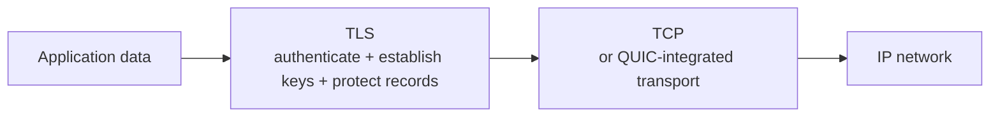
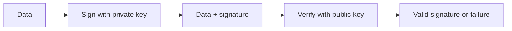
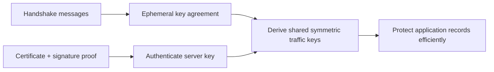
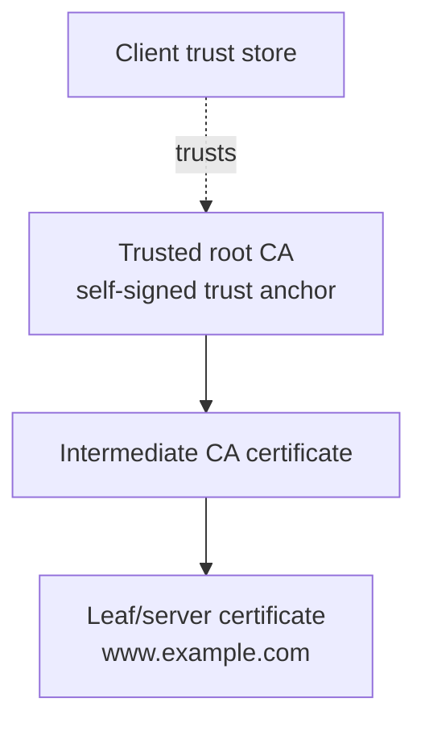
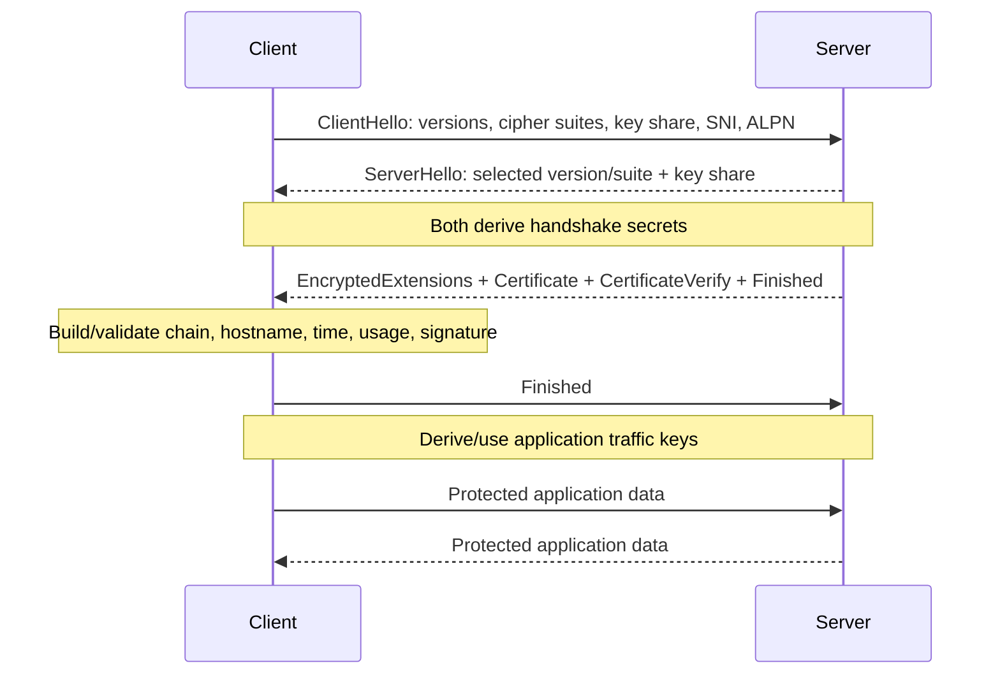
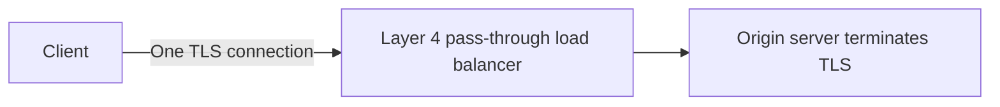
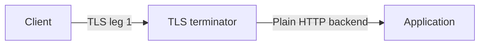
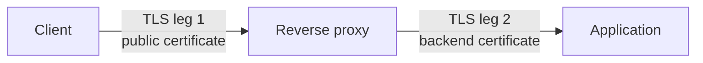
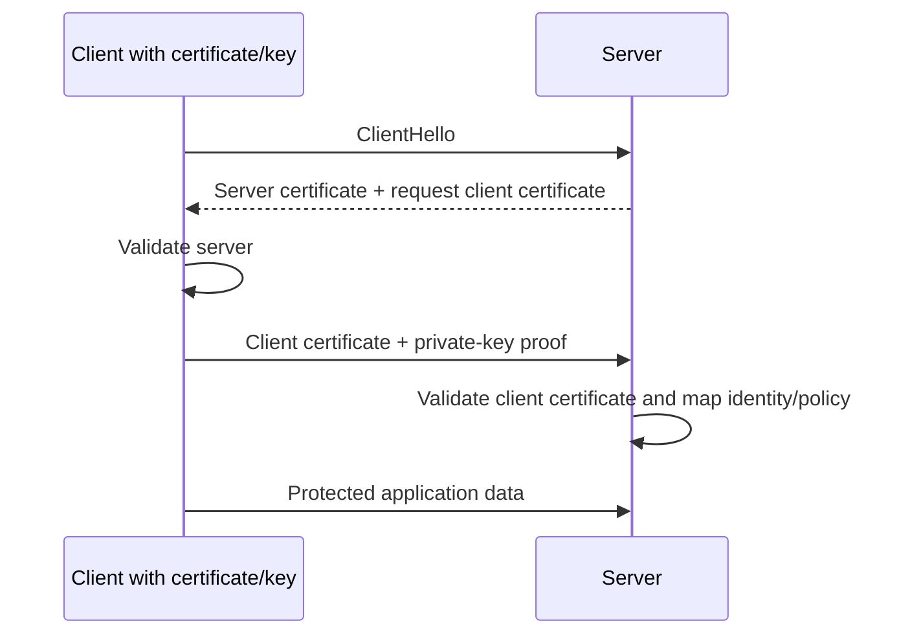
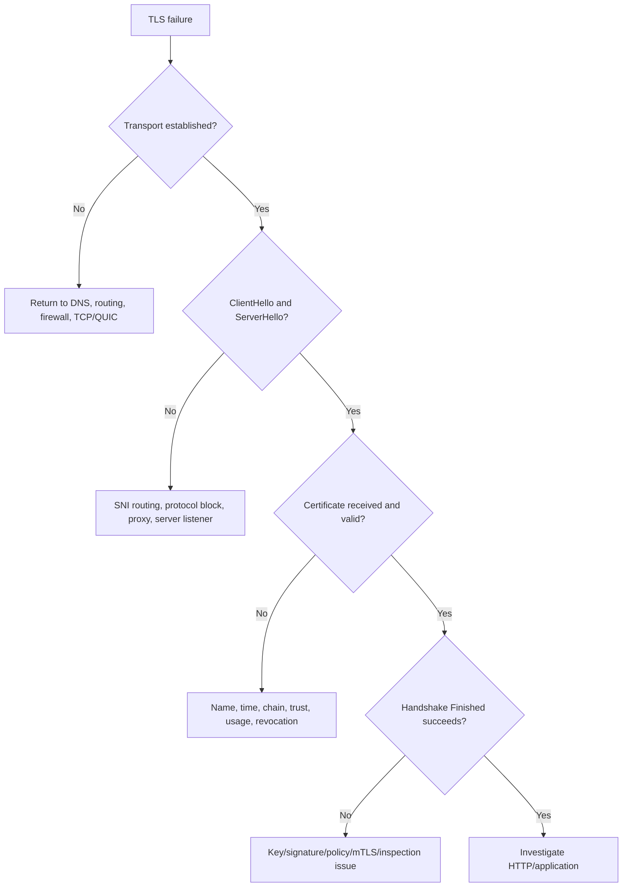

# Part G - TLS, Certificates & Public Key Infrastructure (PKI)

> **Section goal:** explain what TLS protects, validate a certificate chain, follow a modern TLS handshake, and distinguish termination, pass-through, bridging, inspection, and mutual TLS.

Covers index items **44-51**.

[Back to the master guide](../Networking%20Security%20and%20Azure%20Identity%20-%20Study%20Guide.md) | [Previous: Part F](Part-F-http-https-apis.md)

---

## Start Here: TLS Solves Three Main Problems

**Transport Layer Security (TLS)** protects application communication against eavesdropping and undetected modification while authenticating at least the server in ordinary HTTPS.

| Security property | Plain meaning | Everyday analogy |
|-------------------|---------------|------------------|
| Confidentiality | Unauthorized observers cannot read content | Opaque locked envelope |
| Integrity | Unauthorized changes are detected | Tamper-evident seal |
| Authentication | A party proves control of expected credentials/key | Verified identity at delivery |

TLS does not automatically decide whether an authenticated user is authorized to read a record. Authentication and business authorization remain separate.



---

## 44. Encryption, Hashing, Signing, and Encoding

These operations are often confused because all can transform data. They solve different problems.

### Encoding

**Encoding** changes representation so data can be stored or transported in a compatible form. It does not require a secret.

Examples include Base64, hexadecimal, UTF-8, and URL percent-encoding.

```text
Text:   hello
Base64: aGVsbG8=
```

Anyone can decode Base64. It is not encryption.

### Encryption

**Encryption** uses a key to transform plaintext into ciphertext so unauthorized parties cannot understand it. **Decryption** uses the appropriate key to recover plaintext.

Confidentiality depends on secure algorithms, key sizes, key generation, key storage, protocol use, and implementation.

### Hashing

A cryptographic **hash function** maps arbitrary input to a fixed-size digest.

Desired properties include:

- Small input changes produce very different digests.
- It is infeasible to reconstruct the input from the digest.
- It is infeasible to find distinct inputs with the same digest.

A plain hash can detect accidental change when compared with a trusted digest, but an attacker who can replace both data and digest can defeat that check.

### MAC and HMAC

A cryptographic **Message Authentication Code (MAC)** uses a secret key to provide integrity and source authentication among key holders. This MAC is unrelated to the networking **Media Access Control** address taught in Part A. **HMAC** is a standardized construction using a cryptographic hash.

Unlike a digital signature, every party that can verify a MAC with the shared secret can generally also produce one.

### Digital signature

A digital signature is generated with a private key and verified with the corresponding public key.

At a high level:

1. Signer computes a digest under a secure signature scheme.
2. Signer uses the private key to create a signature.
3. Verifier uses the public key to verify the signature against the data.

Signatures can provide integrity and proof that the matching private key authorized the signature. Trust in the signer still depends on how the public key is bound to an identity.



### Comparison

| Operation | Reversible? | Secret/key? | Main purpose |
|-----------|-------------|-------------|--------------|
| Encoding | Yes, by anyone | No | Compatible representation |
| Encryption | Yes, with proper key | Yes | Confidentiality |
| Hashing | Designed as one-way | No secret required | Digest/fingerprint primitive |
| HMAC | Verification recomputes MAC | Shared secret | Integrity + shared-key authentication |
| Digital signature | Verification does not recover original from signature; data is separate | Private key signs, public key verifies | Integrity + private-key proof |

> 🔍 **Plain-English deep dive: "encrypted password" is often the wrong phrase**
>
> Systems should normally store passwords using a slow, salted password-hashing function, not reversible encryption. The server verifies a guess by deriving and comparing a value. A unique salt prevents equal passwords from having equal stored values and frustrates precomputed tables.

---

## 45. Symmetric vs Asymmetric Cryptography

### Symmetric cryptography

The same secret key, or closely related shared secret material, is used to protect and recover data.

| Strength | Challenge |
|----------|-----------|
| Fast and efficient for bulk data | Parties must establish/protect shared keys |
| Suitable for long application streams | One compromised shared key affects data protected with it |

Examples in modern TLS include Advanced Encryption Standard in Galois/Counter Mode (**AES-GCM**) and ChaCha20-Poly1305 authenticated encryption.

### Asymmetric cryptography

Asymmetric systems use a mathematically related public/private key pair.

- The **private key** must remain controlled by its owner.
- The **public key** can be distributed.
- Depending on the algorithm, key pairs support signatures, key agreement, or encryption operations.

Do not assume every asymmetric algorithm supports every operation. For example, modern Elliptic Curve Diffie-Hellman Ephemeral (**ECDHE**) provides key agreement; certificate keys prove identity through signatures.

### Why TLS uses a hybrid design

Asymmetric operations help authenticate and establish shared secrets. Symmetric authenticated encryption efficiently protects ongoing application data.



### Forward secrecy

Modern TLS commonly uses ephemeral key agreement. **Forward secrecy** means later compromise of a long-term certificate private key should not reveal previously recorded sessions, assuming ephemeral secrets were erased and the protocol/implementation remained secure.

The certificate private key authenticates the handshake; it is not simply used to encrypt all web data.

---

## 46. Certificates, Public/Private Keys, CAs, and Trust Chains

A public-key **certificate** is a signed document that binds identity information to a public key and usage constraints for a period.

### What a certificate commonly contains

| Field | Purpose |
|-------|---------|
| Subject / identity context | Entity described by certificate |
| Subject Alternative Name (SAN) | DNS names, IPs, or identities certificate covers |
| Public key and algorithm | Public half of represented key pair |
| Issuer | Entity that signed certificate |
| Validity period | Not Before and Not After times |
| Serial number | Issuer-specific identifier |
| Key Usage | Allowed cryptographic operations |
| Extended Key Usage (EKU) | Purposes such as server or client authentication |
| Basic Constraints | Whether certificate can act as a Certificate Authority (CA) |
| Issuer signature | Protects certificate integrity and links to issuer key |

The private key is **not inside the public certificate**. The service must separately control the matching private key.

### Certificate Authority

A **Certificate Authority (CA)** issues and signs certificates under a policy.

Typical chain:



- A **root CA** is a trust anchor distributed through an operating-system, browser, application, or enterprise trust store.
- An **intermediate CA** is signed by another CA and limits operational exposure of the root.
- A **leaf/end-entity certificate** represents the server or client.

### Chain building vs trust

The server usually sends its leaf certificate and needed intermediate certificates. The client builds a path to a locally trusted root.

Trust is not created merely because certificates link together. The chain must end at a trust anchor accepted by that client under current policy.

### Public vs private CA

| Public CA | Private enterprise CA |
|-----------|-----------------------|
| Roots broadly included in public trust stores | Root distributed by the organization |
| Suitable for public service names under CA policy | Suitable for controlled internal identities/devices |
| Public validation and issuance requirements | Enterprise controls enrollment and policy |
| Clients usually trust without custom setup | Unmanaged clients will not trust it automatically |

### Certificate is not identity by itself

A client must validate the certificate and prove that the peer controls the matching private key during the handshake. Copying a public certificate without the private key does not let an attacker complete that proof.

---

## 47. The TLS Handshake

The handshake agrees on protocol settings, establishes fresh traffic secrets, authenticates the server, and verifies that handshake messages were not altered.

### Simplified TLS 1.3 full handshake



This is simplified: optional client authentication, HelloRetryRequest, session resumption, early data, and other details can alter the exchange.

### Key messages

| Message | Main role |
|---------|-----------|
| ClientHello | Advertise capabilities and send client key share/context |
| ServerHello | Select version/cipher suite and send server key share |
| EncryptedExtensions | Return protected negotiated extensions |
| Certificate | Present server certificate chain |
| CertificateVerify | Prove control of certificate private key over handshake context |
| Finished | Authenticate accumulated handshake transcript with derived secret |

### What the client must validate

At minimum for ordinary HTTPS, client policy commonly checks:

1. Certificate chain signatures build to an accepted trust anchor.
2. Current time is within certificate validity.
3. Requested host matches a SAN entry under hostname rules.
4. Certificate is allowed for server authentication and CA constraints are valid.
5. Signatures and algorithms satisfy policy.
6. Revocation is considered according to platform/application policy.
7. Server proves possession of matching private key.
8. Handshake Finished verification succeeds.

### TLS 1.2 vs TLS 1.3 at a glance

| TLS 1.2 | TLS 1.3 |
|---------|---------|
| Supports a wider legacy set of key-exchange/cipher constructions | Removes many obsolete constructions and requires modern authenticated encryption |
| More handshake messages remain visible before encryption | Encrypts more handshake content after ServerHello |
| Full handshake commonly takes more round trips | Full handshake generally reaches protected application data sooner |
| Version/cipher configuration is more complex | Simplified, stronger mandatory design choices |

Exact packet appearance depends on resumption, implementation, extensions, and transport.

### Session resumption and early data

TLS can resume earlier security context to reduce latency. TLS 1.3 can support **zero round-trip-time (0-RTT) early data**, but early data can be replayed under threat models and should be limited to operations safe against replay. It does not provide the same freshness guarantees as ordinary post-handshake data.

---

## 48. SNI, ALPN, Cipher Suites, and Hostname Validation

### SNI

**Server Name Indication (SNI)** is a ClientHello extension identifying the intended server name. It lets one IP address host many HTTPS sites with different certificates.

Traditional SNI may be visible to network observers even though later HTTP content is encrypted. **Encrypted Client Hello (ECH)** is designed to protect sensitive ClientHello information when correctly supported and configured.

### ALPN

**Application-Layer Protocol Negotiation (ALPN)** lets peers select an application protocol during TLS negotiation.

Common identifiers include:

- `http/1.1`
- `h2` for HTTP/2
- HTTP/3 uses QUIC/TLS negotiation identifiers such as `h3`

ALPN avoids an additional application-level negotiation round trip.

### Cipher suite

A TLS cipher suite names negotiated cryptographic algorithms. In TLS 1.3, suites primarily select authenticated encryption and hash components; key agreement and signature algorithms are negotiated separately through extensions.

```text
TLS_AES_128_GCM_SHA256
```

This TLS 1.3 suite uses AES-128-GCM for authenticated encryption and SHA-256 in the key-schedule/hash context.

### Hostname validation

The client compares the requested reference identity with certificate SAN entries according to hostname rules.

| Request | Certificate SAN | Result concept |
|---------|-----------------|----------------|
| `api.example.com` | `api.example.com` | Match |
| `api.example.com` | `www.example.com` | Mismatch |
| `a.example.com` | `*.example.com` | Common single-label wildcard match |
| `a.b.example.com` | `*.example.com` | Not matched by a single-label wildcard |
| IP literal request | DNS SAN only | Normally requires matching IP-address SAN instead |

Modern validation uses SAN; relying on Common Name alone is obsolete behavior.

### SNI vs Host header

| SNI | HTTP Host / `:authority` |
|-----|--------------------------|
| Sent during TLS/QUIC handshake | Sent inside HTTP after secure channel exists |
| Helps choose certificate/TLS virtual service | Helps choose HTTP virtual origin/routing |
| Can fail before HTTP begins | Can be routed/rejected at application proxy layer |

They normally represent the same intended public host but occur at different layers and times.

---

## 49. TLS Termination, Bridging, Pass-Through, and Inspection

### Pass-through

A pass-through device forwards encrypted TLS without possessing the session keys needed to decrypt application content.



It can still make decisions using visible network/transport metadata and some handshake metadata, depending on protocol and encryption features.

### Termination/offload

A proxy/load balancer accepts and decrypts the client TLS connection. It can inspect HTTP and apply Layer 7 policy.



The backend traffic is unencrypted in this example. That may be acceptable only within a deliberately trusted boundary and policy.

### Bridging/re-encryption

The intermediary terminates one TLS connection and creates a separate TLS connection to the backend.



Each leg has separate keys, certificates, protocol negotiation, and possible failures.

### Forward-proxy TLS inspection

An authorized enterprise inspection service may:

1. Receive a client's request to reach an external TLS service.
2. Establish its own TLS connection to that external service.
3. Present the client with a dynamically issued substitute certificate for the requested name.
4. Decrypt and inspect policy-relevant traffic.
5. Re-encrypt approved traffic toward the destination.

```mermaid
sequenceDiagram
    participant C as Managed client trusting enterprise CA
    participant P as Inspection proxy
    participant S as Internet server
    C->>P: TLS to requested name; proxy-issued leaf certificate
    P->>S: Separate TLS connection; validate server certificate
    C->>P: Decrypted-at-proxy HTTP request
    P->>P: Inspect and enforce policy
    P->>S: Re-encrypted request
    S-->>P: Protected response
    P-->>C: Inspected and re-encrypted response
```

### Inspection trade-offs

| Benefit | Risk/constraint |
|---------|-----------------|
| Malware, category, and Data Loss Prevention (DLP) inspection | Proxy becomes a trusted plaintext processing point |
| Policy on otherwise encrypted content | Enterprise root/private issuing keys need strong protection |
| Central logging and control | Privacy, legal, regulatory, and data-minimization obligations |
| Threat detection | Certificate pinning, mutual TLS (mTLS), ECH, or unsupported protocols can fail |
| Protocol normalization | Proxy security and TLS policy can weaken or break applications if misconfigured |

Inspection requires explicit authorization, managed trust distribution, exclusions for sensitive/unsupported flows, strong key controls, and auditable policy.

> 🔍 **Plain-English deep dive: end-to-end depends on the endpoints**
>
> If TLS terminates at a proxy, the cryptographic endpoints of that connection are the client and proxy. A second proxy-to-server TLS leg is separately protected. The user may see one URL, but the architecture contains two security channels and a plaintext decision point inside the proxy.

---

## 50. mTLS, Revocation, Expiry, and Common Failures

### Mutual TLS

In normal public HTTPS, the server presents a certificate and the client usually authenticates later with a password, token, or other application mechanism.

In **mutual TLS (mTLS)**, the client also presents a certificate and proves control of its private key.



mTLS is useful for device, workload, partner, and service-to-service authentication. It requires certificate enrollment, private-key protection, renewal, revocation, identity mapping, and trust lifecycle operations.

### Revocation

A certificate may need to be distrusted before its expiry, such as after private-key compromise.

| Mechanism | Description | Operational issue |
|-----------|-------------|-------------------|
| Certificate Revocation List (CRL) | CA-published signed list of revoked serials | Lists can become large or stale |
| Online Certificate Status Protocol (OCSP) | Client/responder query about one certificate | Adds availability/privacy concerns |
| OCSP stapling | Server includes a signed OCSP response | Reduces client lookup but depends on fresh staple/configuration |
| Short-lived certificates | Limit exposure window by frequent renewal | Requires reliable automation |

Clients differ in revocation policy and in whether failures are hard-fail or soft-fail. Do not assume one universal behavior.

### Common TLS failure categories

| Symptom/error concept | Likely checks |
|-----------------------|---------------|
| Certificate expired/not yet valid | Certificate times and client/server clock |
| Name mismatch | URL/SNI vs SAN entries |
| Untrusted issuer | Missing root trust or wrong chain |
| Incomplete chain | Server omitted intermediate certificate |
| No shared protocol/cipher | Client/server security-policy overlap |
| Handshake alert | Which peer sent alert and at which handshake stage |
| Private-key mismatch | Certificate public key does not match configured key |
| Revocation failure | Status, reachability, policy, staple/CRL freshness |
| mTLS client-certificate rejection | Issuer, EKU, expiry, mapping, proof, trust |
| Works without proxy only | Inspection trust, protocol, pinning, mTLS, bypass, or policy |
| Intermittent by backend | Certificate/configuration differs among nodes |

### A disciplined TLS troubleshooting flow



Capture exact time, requested hostname, client/platform, proxy path, TLS version, alert direction, certificate chain, and working comparison. Avoid disabling validation as a "fix."

---

## 51. Why SSL Is Obsolete and How to Answer "SSL vs TLS"

**Secure Sockets Layer (SSL)** was the predecessor to TLS.

Historical sequence:

```text
SSL 2.0 -> SSL 3.0 -> TLS 1.0 -> TLS 1.1 -> TLS 1.2 -> TLS 1.3
```

SSL 2.0 and SSL 3.0 are obsolete and insecure. TLS 1.0 and 1.1 are also deprecated for modern general use. TLS 1.2 and TLS 1.3 are the commonly relevant versions, subject to product and organizational policy.

### Why people still say SSL

- Product interfaces historically used terms such as "SSL certificate."
- "SSL/TLS inspection" is common industry shorthand.
- Teams may call all HTTPS cryptography "SSL" informally.

The certificate itself is an X.509 public-key certificate; the negotiated channel protocol is TLS in a modern deployment.

### Strong interview answer

> "SSL is the obsolete predecessor of TLS. Modern HTTPS should negotiate supported TLS versions, generally TLS 1.2 or 1.3 under current policy. People still say SSL informally, but I would verify the actual negotiated protocol rather than rely on the label."

### Version negotiation and downgrade protection

Client and server must share a permitted TLS version and algorithm set. Modern TLS includes mechanisms to prevent an attacker from silently forcing an obsolete version, but endpoints and middleboxes must be correctly configured.

Never enable obsolete SSL/TLS versions merely to hide a compatibility problem without explicit risk ownership. Prefer upgrading the incompatible endpoint, isolating legacy dependencies, and measuring use before removal.

### TLS quick-reference table

| Question | Evidence |
|----------|----------|
| Which name was requested? | URL, SNI, application configuration |
| Which protocol was selected? | Handshake/version/ALPN evidence |
| Which identity was presented? | Leaf SAN and chain |
| Why is it trusted? | Chain to local trust anchor and policy |
| Who holds private keys? | Endpoint/terminator key configuration |
| Where is plaintext available? | TLS termination/inspection points |
| Is client identity required? | CertificateRequest/mTLS policy |
| Why did it fail? | Alert source/stage plus validation result |

> 💡 **Tie-in for any background:** Think of TLS as a secure introduction followed by a protected conversation. Certificates are signed identity documents containing public keys; the handshake validates the document, proves key control, agrees fresh secrets, and only then protects application data.

---

## ⭐ Likely Interview Questions for This Section

**Q1. Compare encoding, encryption, hashing, and digital signatures.**

> *Model answer:* Encoding changes representation and needs no secret. Encryption uses keys for confidentiality and is reversible with the proper key. Hashing creates a one-way fixed-size digest. A digital signature uses a private key to authorize a signature that others verify with the public key, providing integrity and proof of private-key control under a trusted identity binding.

**Q2. Why does TLS use both asymmetric and symmetric cryptography?**

> *Model answer:* Asymmetric signatures and ephemeral key agreement help authenticate endpoints and establish shared secrets without a pre-shared session key. Symmetric authenticated encryption then protects bulk application data efficiently. Modern ephemeral agreement also supports forward secrecy.

**Q3. What is in a certificate, and is the private key included?**

> *Model answer:* A certificate contains identity/SAN information, a public key, issuer, validity, serial, usage constraints, and issuer signature. The private key is not in the certificate; the endpoint stores it separately and proves control during the handshake.

**Q4. Explain certificate-chain validation.**

> *Model answer:* The client builds a signature path from the leaf through intermediates to a locally trusted root, checks time, SAN hostname, usage and constraints, algorithm policy, signatures, and revocation according to policy, then verifies the server's proof of the matching private key.

**Q5. Summarize a TLS 1.3 handshake.**

> *Model answer:* The client sends ClientHello with versions, algorithms, key share, SNI, and ALPN. The server selects settings and sends its key share, then protected extensions, certificate, private-key proof, and Finished. The client validates these, sends Finished, and both use derived application traffic keys.

**Q6. What are SNI and ALPN?**

> *Model answer:* SNI tells the TLS service which hostname the client intends, helping select a virtual service and certificate. ALPN negotiates the application protocol, such as HTTP/2 versus HTTP/1.1. They are handshake extensions, not HTTP headers.

**Q7. Compare TLS pass-through, termination, bridging, and inspection.**

> *Model answer:* Pass-through forwards one encrypted connection to the origin. Termination decrypts at an intermediary. Bridging terminates client TLS and creates a separate backend TLS leg. Inspection is authorized interception where a managed client trusts an enterprise CA and the proxy decrypts, enforces policy, and re-encrypts toward the destination.

**Q8. What is mTLS, and how does SSL differ from TLS?**

> *Model answer:* mTLS requires both server and client certificates with proof of their private keys, often for workload or device identity. SSL is TLS's obsolete predecessor; modern services should use allowed TLS versions, generally TLS 1.2 or 1.3 under current policy, despite "SSL" remaining informal terminology.

---

## 🧠 30-Second Memory Hooks

- **Encode for format; encrypt for secrecy; hash for digest; sign for private-key proof.**
- **Certificate contains public key; private key stays private.**
- **Leaf -> intermediate -> trusted root.**
- **SAN answers "which name?"; trust store answers "which root?"**
- **Asymmetric establishes/authenticates; symmetric protects bulk data.**
- **SNI selects the name; ALPN selects the application protocol.**
- **Pass-through keeps one TLS flow; termination decrypts; bridging creates two TLS legs.**
- **mTLS authenticates both peers with certificates.**
- **TLS protects a channel, not business authorization.**
- **SSL is obsolete terminology; verify the negotiated TLS version.**

---

*Next suggested section:* **[Part H - Direct, Forward & Reverse Proxy Traffic](Part-H-direct-forward-reverse-proxies.md)**, which shows who selects each intermediary, how CONNECT works, and how proxy routing changes identity, visibility, and troubleshooting.