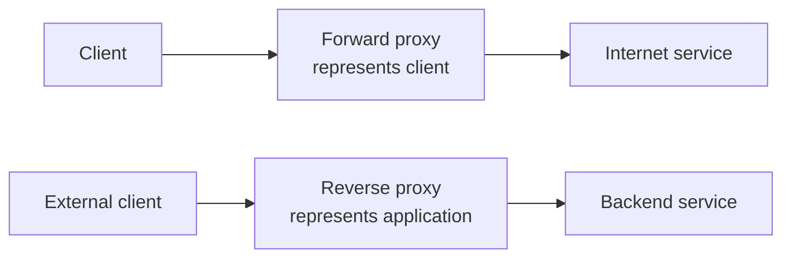
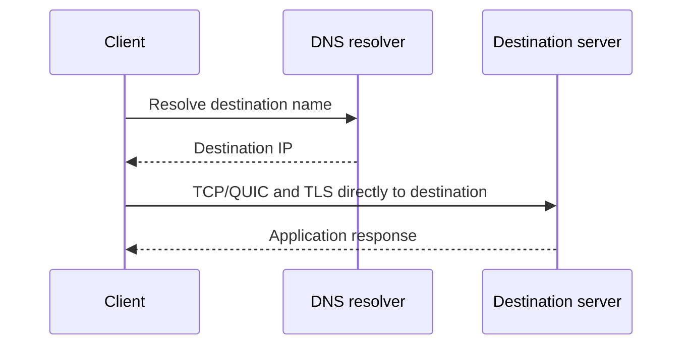
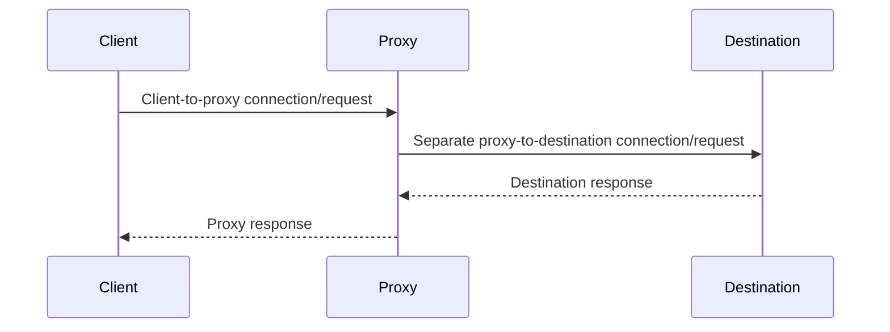
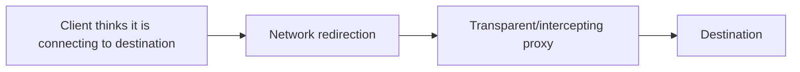
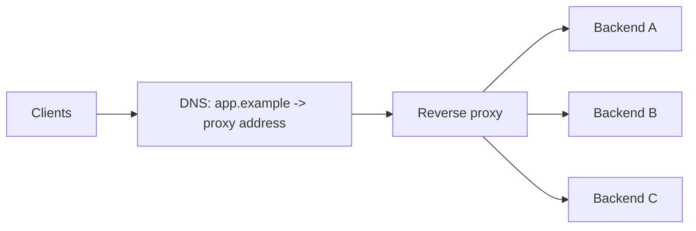
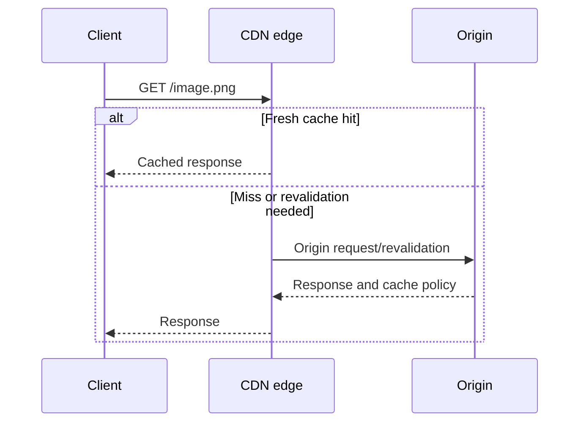
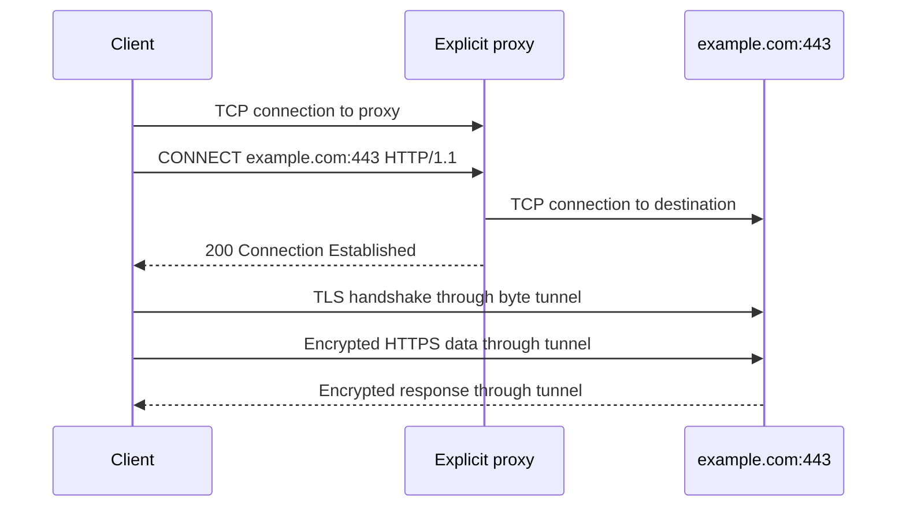
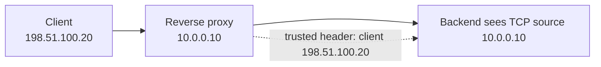
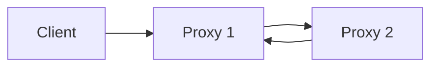
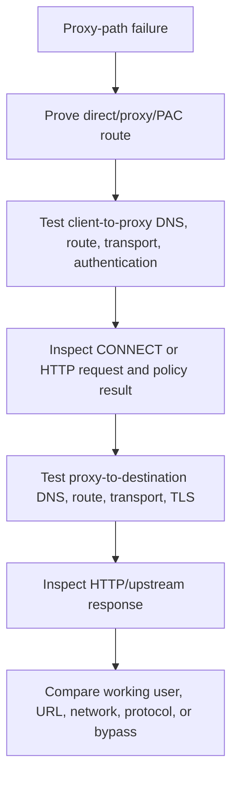

# Part H - Direct, Forward & Reverse Proxy Traffic

> **Section goal:** draw direct and proxied traffic paths, explain who each proxy represents, and diagnose failures involving CONNECT, DNS, TLS inspection, headers, bypasses, loops, and timeouts.

Covers index items **52-58**.

[Back to the master guide](../Networking%20Security%20and%20Azure%20Identity%20-%20Study%20Guide.md) | [Previous: Part G](Part-G-tls-certificates-pki.md)

---

## Start Here: A Proxy Speaks on Someone Else's Behalf

A **proxy** is an intermediary that participates in communication on behalf of a client or server.

**Analogy:** a travel agent can act for a traveler when contacting airlines; a hotel receptionist can act for hotel departments when guests make requests. Both are intermediaries, but they represent opposite sides.

| Pattern | Intermediary represents | Typical purpose |
|---------|--------------------------|-----------------|
| Forward proxy | Clients/users | Outbound access policy, privacy, logging, inspection |
| Reverse proxy | Servers/applications | Inbound publishing, protection, routing, scale |



---

## 52. Direct Connections Compared with Proxied Connections

### Direct path

In a direct connection, the client selects and connects to the destination service without an application proxy acting in the middle.



Routers, switches, NAT, and firewalls still exist on the path. "Direct" means no forward/reverse application proxy terminates or relays the conversation, not that only one cable exists.

### Proxied path

A proxy commonly creates two transport conversations:



Each leg can have different:

- Source and destination IP/port tuples
- DNS resolver and answer
- TLS session and certificate validation
- Protocol version
- Timeout
- Retry and connection-pooling behavior
- Logging identity

### Direct vs proxy comparison

| Direct | Proxied |
|--------|---------|
| Client connects to destination IP | Client or network reaches proxy first |
| Destination commonly sees client/NAT source | Destination sees proxy source |
| One end-to-end transport/TLS conversation in simple design | Often two independently managed legs |
| Fewer policy/translation points | Central control, logging, caching, and inspection |
| Client resolves destination in common designs | Client or proxy may resolve, depending on proxy method |

### How to prove the path

Do not rely on browser UI alone. Useful evidence includes:

- Operating-system and application proxy settings
- Proxy Auto-Configuration (**PAC**) result
- Destination of the client's TCP connection
- `Via`, `Forwarded`, or product-specific response headers
- Proxy authentication or block pages
- Certificate issuer during TLS inspection
- Proxy/firewall logs with matching timestamp and user/device
- DNS capture showing whether client or proxy resolves the target

---

## 53. Forward Proxies: Explicit, Transparent, and PAC-Based

A **forward proxy** accepts outbound requests from clients and accesses destinations on their behalf.

### Explicit proxy

The client application or operating system is configured with the proxy address.

For unencrypted HTTP, an explicit proxy request can use an absolute URI:

```http
GET http://example.com/products HTTP/1.1
Host: example.com
```

The TCP connection is to the proxy, while the request identifies the intended destination.

For HTTPS, clients commonly use the HTTP `CONNECT` method, covered in Section 55.

### PAC file

A **Proxy Auto-Configuration (PAC)** file contains a JavaScript function named `FindProxyForURL` that returns a routing choice.

```javascript
function FindProxyForURL(url, host) {
    if (isPlainHostName(host) || dnsDomainIs(host, ".corp.example")) {
        return "DIRECT";
    }
    return "PROXY proxy.example:8080; DIRECT";
}
```

The ordered return list means try the proxy, then direct if the client supports that fallback behavior. Whether direct fallback is acceptable is a security-policy decision.

PAC evaluation can depend on URL, hostname, DNS-related helper functions, network location, and client implementation. Troubleshooting must capture the actual result for the failing URL.

### Transparent/intercepting proxy

A transparent or intercepting design redirects selected traffic to a proxy without the application explicitly naming that proxy.



For HTTPS, interception is not automatically invisible. To inspect content, the client must trust the inspection issuer and the proxy must participate in TLS. Otherwise the proxy can tunnel/pass traffic or apply only metadata-based decisions.

### Forward-proxy categories

| Type | How client reaches it | Client awareness | Common issue |
|------|------------------------|------------------|--------------|
| Static explicit | Manual/device/app setting | Aware | Wrong address, bypass, or authentication |
| PAC explicit | PAC returns proxy | Aware through proxy stack | Stale PAC, rule order, DNS helper behavior |
| Auto-discovered | Client discovers configuration, such as Web Proxy Auto-Discovery (WPAD) in some environments | Partly automatic | Discovery trust and inconsistent clients |
| Transparent/intercept | Network redirects flow | Application may be unaware | Protocol compatibility, attribution, TLS handling |

Automatic discovery should be deployed with strong control because an untrusted proxy configuration can redirect sensitive traffic.

### Forward proxy goals

- User/device-aware outbound policy
- URL/category filtering
- Malware scanning
- TLS inspection where authorized
- Data Loss Prevention (**DLP**)
- Bandwidth control and caching
- Central logging and egress IP control

Part J explains Secure Web Gateways, which deliver an expanded forward-proxy security service.

---

## 54. Reverse Proxies, Load Balancers, API Gateways, and CDNs

A **reverse proxy** accepts requests for one or more published services and sends them to backend applications.

The client connects to the public service name and may not know the origin topology.



### Related roles

| Component | Primary job | Common overlap |
|-----------|-------------|----------------|
| Reverse proxy | Terminate/relay and route inbound application requests | TLS, header changes, authentication, caching |
| Load balancer | Distribute traffic across healthy service instances | Layer 4 or Layer 7 proxying |
| API gateway | Publish/manage APIs | Authentication, authorization, quotas, transformations, analytics |
| CDN | Serve/cache content from distributed edge locations | TLS, Distributed Denial-of-Service (DDoS) attack absorption, WAF, reverse proxy to origin |
| WAF | Apply HTTP-aware attack and application policy | Often integrated into CDN/reverse proxy |

These are roles, not mutually exclusive product boxes. One cloud service may perform several.

### Layer 4 vs Layer 7 load balancing

| Layer 4 | Layer 7 |
|---------|---------|
| Routes using IP, port, and connection metadata | Parses application protocol such as HTTP |
| Can pass TLS through to backend | Commonly terminates TLS to inspect request |
| Lower application awareness | Can route by host, path, method, header, cookie |
| Backend may see proxy/NAT source | Can add trusted forwarding headers |

### Health probes

A load balancer uses health probes to decide which backends should receive new traffic.

- A TCP probe can show that a port accepts a connection.
- An HTTP probe can check a path and expected status.
- A shallow health endpoint may pass while a critical dependency is broken.
- A costly deep health endpoint can overload dependencies or cause widespread removal.

Probe design should reflect service readiness without creating a new failure source.

### CDN cache flow



A stale or poisoned cache, inconsistent cache key, or missing `Vary` can create user-specific correctness and security problems.

---

## 55. CONNECT Tunnels and HTTPS Through a Forward Proxy

The HTTP **CONNECT** method asks an explicit proxy to establish a TCP tunnel to a host and port.

### Non-inspecting tunnel



In this mode:

- Client validates the destination server certificate.
- Proxy relays encrypted bytes after tunnel establishment.
- Proxy sees destination host/port requested in CONNECT and flow metadata.
- Proxy does not see HTTP paths/body inside properly protected TLS.

### Inspecting CONNECT flow

With authorized TLS inspection, the proxy may accept CONNECT, then establish separate TLS sessions:

1. Client-to-proxy TLS using a proxy-issued certificate for the requested name.
2. Proxy-to-server TLS using the server's real certificate.

The proxy can then inspect HTTP and enforce content policy.

### Common CONNECT responses

| Result | Meaning |
|--------|---------|
| `200 Connection Established` | Proxy accepted tunnel request |
| `407 Proxy Authentication Required` | Client must authenticate to proxy |
| `403 Forbidden` | Proxy policy refused destination/tunnel |
| `502 Bad Gateway` | Proxy failed while reaching/using upstream |
| Timeout | Client-proxy or proxy-upstream stage did not finish in time |

A successful CONNECT only proves tunnel establishment. TLS or HTTP can fail afterward.

### DNS location

With hostname-based CONNECT, the proxy commonly resolves the target when making its upstream connection. In other proxy styles or application behavior, the client may resolve first.

To determine which:

- Capture client DNS traffic.
- Inspect CONNECT target: hostname or IP.
- Review proxy DNS/upstream logs.
- Compare client and proxy resolver answers.

Split DNS can make client and proxy see different destinations for the same name.

---

## 56. Proxy Authentication, Headers, TLS Inspection, and Certificates

### Proxy authentication vs origin authentication

| Origin/server authentication | Proxy authentication |
|------------------------------|----------------------|
| Usually indicated by HTTP 401 | Usually indicated by HTTP 407 |
| `WWW-Authenticate` challenge | `Proxy-Authenticate` challenge |
| `Authorization` credentials | `Proxy-Authorization` credentials |
| Proves identity to destination/app | Proves identity to forward proxy |

Integrated enterprise authentication, client certificates, device identity, or agents can also identify clients. Avoid placing reusable credentials in URLs or logs.

### Forwarding headers

Reverse proxies commonly add information about the original request:

| Header | Typical purpose |
|--------|-----------------|
| `Forwarded` | Standardized client/proxy information such as `for`, `proto`, `host` |
| `X-Forwarded-For` | De facto list of client/proxy IP addresses |
| `X-Forwarded-Proto` | Original client scheme, such as HTTPS |
| `X-Forwarded-Host` | Original Host value |
| `Via` | HTTP intermediaries/protocol information |
| Trace/request ID | Correlate request across hops |

### Hop-by-hop vs end-to-end headers

Some HTTP/1.1 headers apply only to one transport connection and must be handled/removed by a proxy, such as headers named by `Connection`. Other headers represent end-to-end request semantics, though proxies can still enforce and transform policy.

Protocol translation between HTTP versions requires correct header normalization. Request smuggling vulnerabilities can arise when front-end and back-end components disagree about message boundaries or conflicting length encodings.

### TLS inspection certificate signal

When an enterprise forward proxy inspects TLS:

- Browser certificate subject/SAN still matches requested site.
- Issuer often belongs to the enterprise inspection PKI, not the site's public CA chain.
- Managed client trusts the enterprise root.
- Unmanaged clients or pinned applications may reject the substitute certificate.

### Inspection exceptions

Organizations may bypass inspection for:

- Legal/privacy-restricted categories
- Certificate-pinned applications
- mTLS applications
- Unsupported protocols
- High-risk operational services where interception breaks trust

Bypass reduces content visibility, so metadata policy, endpoint controls, application controls, and destination allow-listing may compensate.

---

## 57. Source-IP Visibility, X-Forwarded-For, and Trust Boundaries

A backend connected through a reverse proxy sees the proxy's transport source IP, not automatically the original client's IP.



### The spoofing problem

Any direct client can send an `X-Forwarded-For` header. A backend must not trust arbitrary inbound values.

Safe pattern:

1. Prevent untrusted clients from reaching backend directly.
2. Configure trusted ingress proxies explicitly.
3. At the edge, remove or normalize untrusted forwarding headers.
4. Append/set the verified connection source under a documented convention.
5. At the backend, parse only the trusted number/direction of proxy hops.

### X-Forwarded-For chain

A chain might look like:

```http
X-Forwarded-For: 198.51.100.20, 203.0.113.8
```

Interpretation depends on the deployment convention. Commonly, the leftmost value is the original client and proxies append their observed upstream source. Never assume this without knowing which proxies are trusted and how they modify the list.

### PROXY protocol

The **PROXY protocol** is a connection-level header used by supporting load balancers/proxies to send original connection address information to a backend. It is not ordinary HTTP and both ends must be configured consistently.

Sending PROXY protocol to a backend that does not expect it corrupts the application conversation; expecting it when absent also fails.

### Identity is stronger than IP alone

Source IP can be shared by NAT, VPN, proxies, offices, and carrier networks. It can also change. Access decisions should use authenticated user/device/workload identity where possible, with IP as one contextual signal.

> 🔍 **Plain-English deep dive: trust the messenger, then the message**
>
> A forwarding header is only trustworthy when it arrives through a controlled proxy that is authorized to assert it. The header text itself has no magic authenticity. Build the network boundary first, then configure exact header handling.

---

## 58. Proxy Bypasses, Loops, Timeouts, and Troubleshooting

### Bypass

A **proxy bypass** sends selected traffic directly rather than through the normal proxy.

Common reasons:

- Local/intranet destinations
- Private applications reached through another connector
- mTLS or certificate-pinned services
- Real-time/unsupported protocols
- Inspection-restricted categories
- Proxy infrastructure bootstrap services

Bypass rules can match hostnames, suffixes, IP ranges, or local names. A hostname rule and an IP rule are not equivalent when DNS returns multiple/changing addresses.

### Fail-open vs fail-closed

| Fail-open | Fail-closed |
|-----------|-------------|
| Client may connect directly when proxy unavailable | Traffic is blocked if policy service is unavailable |
| Better availability | Better enforcement consistency |
| Can silently bypass security/logging | Can stop business traffic during control-plane failure |

The choice requires explicit risk and availability ownership. PAC strings that end in `DIRECT` may create fail-open behavior.

### Proxy loops

A loop occurs when proxies repeatedly send a request back toward an earlier proxy or themselves.

Causes include:

- Proxy uses the same PAC/system proxy for its own upstream connection
- Reverse proxies point host/path routes at each other
- CDN origin points to the CDN public hostname instead of origin
- Scheme redirects conflict across TLS terminator and application
- Service mesh or gateway rules re-enter the same route



Hop-count headers, repeated `Via` values, duplicate trace IDs, and rapidly repeated logs help reveal loops.

### Layered timeouts

| Timer owner | Example |
|-------------|---------|
| Client | Overall request timeout |
| Forward proxy | Connect or tunnel idle timeout |
| Reverse proxy/load balancer | Backend connect/response/idle timeout |
| Application | Downstream database/API deadline |
| Firewall/NAT | Idle connection-state timeout |

The shortest effective deadline usually wins. A proxy may return 504 while an upstream operation continues and later commits, so retries require idempotency awareness.

### Proxy troubleshooting workflow



Collect:

1. Exact URL, time, user/device, and network location.
2. Effective proxy/PAC decision, not only configured PAC URL.
3. Client-to-proxy tuple and result.
4. Proxy authentication identity and policy rule.
5. CONNECT target/result or HTTP request metadata.
6. Proxy-side DNS answer and upstream tuple.
7. TLS version, certificate, inspection/bypass decision, and alert.
8. HTTP status and component that generated it.
9. Correlation/request ID across logs.
10. Working comparison with one changed variable.

### Symptom map

| Symptom | Productive first check |
|---------|------------------------|
| 407 | Proxy authentication path |
| Proxy block page/403 | Matched user/device/category/policy rule |
| CONNECT 200 then TLS failure | Inspection certificate, trust, SNI, protocol, mTLS/pinning |
| 502 | Proxy's upstream connection/response |
| 504 | Which upstream deadline expired |
| Direct works, proxy fails | Proxy policy, DNS, TLS inspection, protocol support |
| Proxy works, direct fails | Egress routing/firewall/DNS or direct access intentionally blocked |
| Some destinations loop | PAC/route/origin/redirect rule for those names |
| Wrong client IP in app | Trusted proxy/header-chain configuration |

> 💡 **Tie-in for any background:** Troubleshoot a proxy as two conversations joined by one decision-maker. Prove the route, test each leg independently, and identify which component generated the visible error.

---

## ⭐ Likely Interview Questions for This Section

**Q1. Compare a forward proxy and reverse proxy.**

> *Model answer:* A forward proxy represents clients making outbound requests and applies user/device egress policy. A reverse proxy represents published servers and handles inbound routing, protection, TLS, and scale. The destination sees the forward proxy as source; the client sees the reverse proxy as the service endpoint.

**Q2. What is the difference between explicit and transparent proxying?**

> *Model answer:* An explicit proxy is selected by application/OS configuration, often static or PAC-based. A transparent/intercepting design redirects traffic in the network without the application explicitly selecting it. HTTPS inspection still requires trusted TLS participation; redirection alone cannot reveal encrypted content.

**Q3. How does HTTPS work through an explicit forward proxy?**

> *Model answer:* The client connects to the proxy and sends CONNECT for the target host and port. If accepted, a non-inspecting proxy relays a byte tunnel and the client performs TLS with the destination through it. An inspecting proxy instead creates separate client-proxy and proxy-server TLS sessions.

**Q4. Compare a reverse proxy, load balancer, API gateway, CDN, and WAF.**

> *Model answer:* Reverse proxy is the broad inbound intermediary role. Load balancers distribute among healthy instances, API gateways manage API-specific identity/quotas/transformation, CDNs cache and serve from distributed edges, and WAFs enforce HTTP attack/application rules. One product can combine several roles.

**Q5. What is HTTP 407?**

> *Model answer:* It is Proxy Authentication Required. The proxy challenges through `Proxy-Authenticate`, and the client can respond with proxy credentials, distinct from origin authentication's 401, `WWW-Authenticate`, and `Authorization` flow.

**Q6. Can an application trust X-Forwarded-For?**

> *Model answer:* Only within a controlled proxy trust boundary. The backend should be unreachable directly from untrusted clients, the edge should remove/normalize spoofed headers, trusted proxies should append verified sources consistently, and the application should parse only known trusted hops.

**Q7. Why can direct access work while proxy access fails?**

> *Model answer:* Proxying introduces separate client-proxy and proxy-upstream legs, possibly different DNS, authentication, TLS inspection, protocols, policy, and timeouts. I would prove the PAC route, test each leg, inspect CONNECT/policy/TLS results, and compare logs with a correlation ID.

**Q8. How do you diagnose a proxy timeout?**

> *Model answer:* Identify which component returned the error and which timer expired. Correlate client, proxy, and upstream timestamps; separate connect, TLS, first-byte, idle, and overall deadlines; check whether the upstream continued; and ensure retries are safe for the operation.

---

## 🧠 30-Second Memory Hooks

- **Forward proxy represents clients; reverse proxy represents servers.**
- **Direct still has routers and firewalls; it simply lacks an application proxy.**
- **PAC returns the route; inspect the actual decision.**
- **CONNECT builds a tunnel; 200 does not prove TLS or HTTP success.**
- **Proxying usually creates two independently failing legs.**
- **407 is proxy authentication; 401 is origin authentication.**
- **Load balancer distributes, API gateway governs APIs, CDN serves edges, WAF filters HTTP.**
- **Trust forwarding headers only from trusted forwarding infrastructure.**
- **Fail-open favors availability; fail-closed favors enforcement.**
- **For timeouts, find the owner and the expired timer.**

---

*Next suggested section:* **[Part I - Firewalls, NGFW & WAF](Part-I-firewalls-ngfw-waf.md)**, which explains state, zones, application signatures, intrusion prevention, HTTP-aware protection, and rule design.