# Part I - Firewalls, NGFW & WAF

> **Section goal:** explain how different firewall families make decisions, place NGFW and WAF controls correctly, and troubleshoot policy outcomes using state, application, identity, and logs.

Covers index items **59-66**.

[Back to the master guide](../Networking%20Security%20and%20Azure%20Identity%20-%20Study%20Guide.md) | [Previous: Part H](Part-H-direct-forward-reverse-proxies.md)

---

## Start Here: A Firewall Enforces a Traffic Policy

A **firewall** allows, blocks, or otherwise handles network traffic according to policy and observed context.

**Analogy:** a building checkpoint compares a visitor, origin, destination room, purpose, and current authorization against access rules. Different checkpoints know different amounts about the visitor and request.

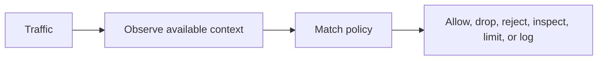

No firewall sees unlimited truth. Its decision depends on position, routing, decryption, identity integration, signatures, configuration, and product capability.

### Security vocabulary from zero

| Term | Plain meaning | Example |
|------|---------------|---------|
| Asset | Something valuable that needs protection | Customer data, identity, service availability |
| Threat | Actor/event that could cause harm | Credential thief, ransomware, flood, insider misuse |
| Vulnerability | Weakness that can be exploited | Missing patch, weak rule, unsafe input handling |
| Exploit | Technique/code that uses a vulnerability | Crafted request triggering a software flaw |
| Attack surface | All reachable ways a system can be interacted with | Public ports, APIs, identities, supply chain |
| Risk | Likelihood and impact of a harmful event, considering controls | Probability and consequence of account takeover |
| Control | Safeguard that changes likelihood or impact | Multifactor Authentication (MFA), firewall rule, backup, alert |
| Exposure | Condition that places an asset within reach of a threat | Admin port open to internet |
| Incident | Event that compromises or threatens security and needs response | Confirmed token theft |

Risk is often expressed conceptually as:

$$
R = L I
$$

Here, $R$ represents conceptual risk, $L$ represents likelihood, and $I$ represents impact. This is a decision model, not necessarily a precise numeric formula. Asset value, threat capability, vulnerability, existing controls, and uncertainty all influence the assessment.

### CIA security objectives

The **CIA triad** is a basic way to classify security goals:

| Objective | Meaning | Example failure |
|-----------|---------|-----------------|
| Confidentiality | Only authorized parties can read data | Packet/token/data disclosure |
| Integrity | Data/system changes are authorized and detectable | Route, file, or transaction tampering |
| Availability | Authorized users can use the service when needed | Distributed Denial-of-Service (DDoS), outage, destructive change |

Security also needs authentication, authorization, accountability/audit, privacy, and safety. CIA is a starting model, not the entire discipline.

### Control functions

| Function | Purpose | Example |
|----------|---------|---------|
| Preventive | Reduce likelihood before event | Least privilege, secure configuration, firewall |
| Detective | Discover suspicious or failed control | Intrusion Detection System (IDS), logs, anomaly alert |
| Corrective | Limit damage and restore | Quarantine, patch, credential reset |
| Deterrent | Discourage misuse | Warning banner, sanctions, monitoring notice |
| Compensating | Alternative when primary control is unavailable | Strict allow list when legacy app cannot support MFA |

One product can serve several functions. A firewall can prevent prohibited access, log attempted access for detection, and isolate a segment during response.

### Threat, vulnerability, and risk example

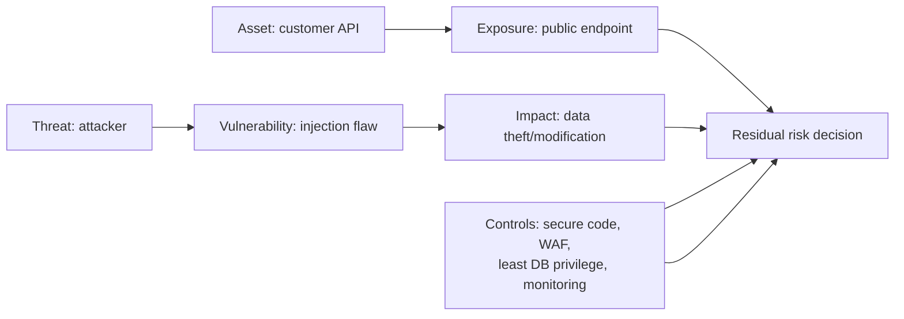

The WAF can reduce exploit likelihood, but fixing the application flaw and limiting database privilege reduce the underlying vulnerability and impact.

---

## 59. Allow Lists, Deny Lists, Zones, and Policy Order

### Policy elements

A network firewall rule commonly considers:

| Element | Example question |
|---------|------------------|
| Source | Which IP, subnet, zone, user, device, or workload initiated? |
| Destination | Which IP, service, zone, or application is targeted? |
| Protocol/port | TCP 443, UDP 53, ICMP type, or identified application? |
| Direction | Inbound, outbound, or between internal segments? |
| State | New, established, related, invalid? |
| Content/threat | Does traffic match malware, exploit, or data policy? |
| Time/context | Is rule active now, on this device posture/location? |
| Action | Allow, drop silently, reject, inspect, rate-limit, redirect, log? |

### Allow-list and deny-list approaches

| Allow-list approach | Deny-list approach |
|---------------------|--------------------|
| Permit only explicitly approved traffic | Permit broadly except known prohibited traffic |
| Strong least-privilege posture | Easier initial connectivity |
| Requires service/dependency understanding | Unknown threats/paths may remain allowed |
| Often ends with default deny | Often depends heavily on signatures and updates |

Good security commonly combines a restrictive access allow list with deny/threat intelligence controls.

### Zones

A **security zone** groups interfaces or networks with a similar trust/function context.

Examples:

- Internet/untrusted
- User network
- Server network
- Management network
- DMZ (demilitarized zone) for published services
- Partner network
- Cloud workload zone

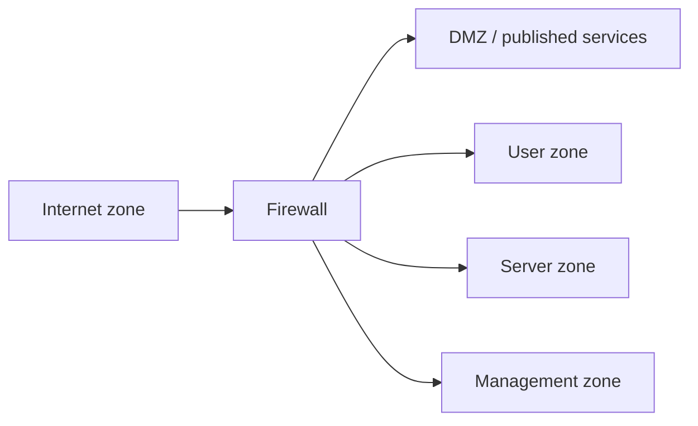

Zones provide readable policy boundaries, but membership alone is not proof of trust. Zero Trust designs evaluate explicit identity, device, application, and risk signals rather than assuming "inside means safe."

### Rule order

Many firewalls use first-match processing; others use priorities, best-match logic, or layered policy stages. Always verify product behavior.

In a first-match policy:

```text
1. Allow IT admins to management service
2. Deny all other users to management network
3. Allow approved user web access
4. Default deny
```

Putting a broad allow before a narrow deny can **shadow** the deny so it is never reached.

### Drop vs reject

| Drop | Reject |
|------|--------|
| Silently discard | Send an explicit error, such as TCP RST or ICMP unreachable |
| Client often retries until timeout | Client can fail quickly |
| Reveals less immediate information | Improves diagnostics but exposes policy response |

The choice depends on threat model, protocol behavior, user experience, and product design.

> 🔍 **Plain-English deep dive: default deny is a statement of ownership**
>
> A default-deny policy says traffic must have an identified business purpose and owner before it is allowed. The hard work is not writing "deny all"; it is discovering legitimate dependencies, defining narrow rules, monitoring impact, and maintaining them as systems change.

---

## 60. Stateless Filters vs Stateful Firewalls

### Stateless filtering

A stateless filter evaluates each packet independently against fields such as source/destination IP, protocol, port, direction, and flags.

It does not inherently remember that one packet belongs to an established conversation.

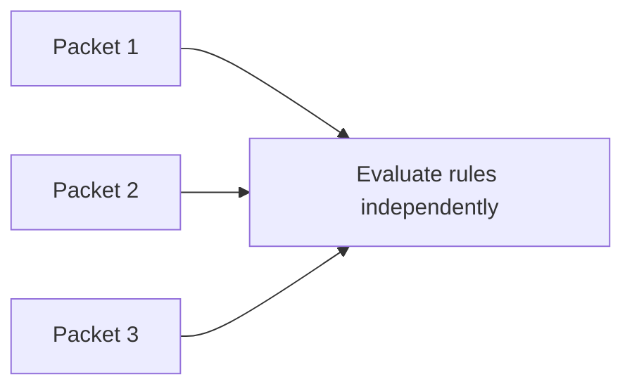

Benefits include simple, predictable, high-speed filtering. Challenges include explicitly handling both directions and limited understanding of connection behavior.

### Stateful inspection

A stateful firewall records connection/flow state and evaluates packets in that context.

For TCP, it can observe handshake state, sequence-related validity, and closure. For UDP, it commonly creates temporary flow state after outbound traffic despite UDP having no handshake.

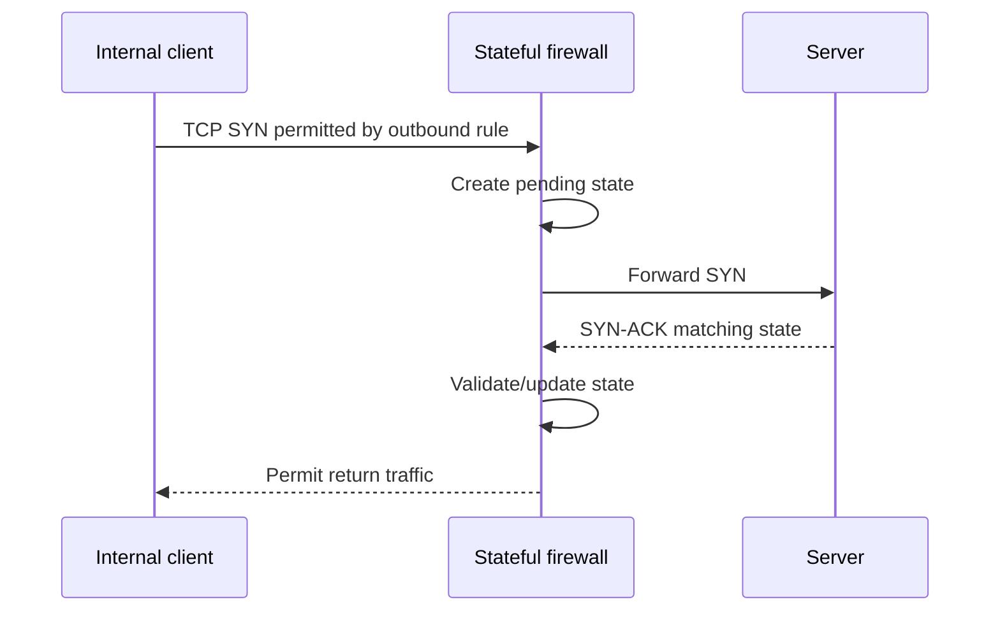

### Comparison

| Stateless | Stateful |
|-----------|----------|
| Each packet evaluated independently | Packets evaluated with flow/connection state |
| Return direction often needs explicit rule | Valid return traffic commonly allowed by state |
| Less state resource consumption | State table consumes resources and has timeouts |
| Limited handshake awareness | Detects invalid/unexpected connection transitions |
| Asymmetry less disruptive to state | Asymmetric paths can break if one firewall misses half the flow |

### State table

A state entry can include:

- Original and translated tuples
- Direction and zone
- TCP state/flags
- Last activity and timeout
- Identified application/user
- Policy and security profile
- Byte/packet counters

### Asymmetric routing

If outbound traffic crosses firewall A but return traffic crosses firewall B, neither may see a complete conversation. A stateful policy can drop the return as invalid.

Fix the routing/state architecture rather than simply allowing all invalid packets.

### State exhaustion

Large connection rates, attacks, leaks, or excessive timeouts can exhaust state-table capacity. Symptoms include new-flow failures while existing flows continue. Monitor current/maximum state, setup rate, drops, timeouts, and source distribution.

---

## 61. Network Firewalls, Host Firewalls, and Cloud Security Groups

Defense in depth places controls at several boundaries.

### Network firewall

Sits in a routed traffic path between networks/zones.

- Central policy and visibility
- Segmentation and internet/partner boundaries
- NAT, VPN, threat prevention, and application inspection depending on product
- Sees only traffic routed through it

### Host firewall

Runs on an endpoint/server operating system.

- Protects the host even on local segments
- Can use local process/service/profile identity
- Helps limit lateral movement
- Depends on endpoint policy health and management

### Cloud controls

Cloud platforms provide distributed virtual-network controls, such as security groups, network security groups, or firewall policies.

Common characteristics:

- Attached to virtual interfaces, subnets, workloads, or network boundaries
- Defined through cloud control plane and automation
- Often stateful, though exact behavior is product-specific
- Logs/flow records may be separate features

### Azure-oriented examples

| Control | Typical role |
|---------|--------------|
| Network Security Group (NSG) | Stateful Layer 3/4 allow/deny rules on subnet/NIC traffic |
| Application Security Group (ASG) | Logical grouping used in NSG rules |
| Azure Firewall | Managed centralized network firewall with broader policy capabilities |
| Web Application Firewall | HTTP/HTTPS application protection on supported gateways/edges |
| User Defined Route (UDR) | Steers traffic, possibly through a network virtual appliance/firewall |

Routing and policy are separate. An allow rule does not create a route, and a route does not automatically allow traffic.

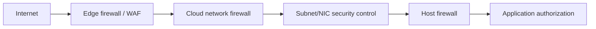

### Control placement questions

1. Which traffic path actually crosses this control?
2. Which identity/context can it reliably observe?
3. Is policy centralized, distributed, or both?
4. Can traffic bypass it through another route/interface?
5. Where are logs and who owns response?
6. How are rules deployed, reviewed, and rolled back?

---

## 62. Next-Generation Firewalls: Application, Identity, IPS, and TLS

A **Next-Generation Firewall (NGFW)** combines stateful network control with deeper context and threat-prevention capabilities.

Common capabilities include:

- Application identification beyond port numbers
- User/group and device-context policy
- Intrusion Prevention System (**IPS**)
- URL/category and content controls
- Malware/file analysis
- TLS decryption/inspection where authorized
- Threat intelligence and reputation
- VPN and segmentation
- Central policy and analytics

### Traditional vs NGFW policy

| Traditional stateful rule | NGFW rule |
|---------------------------|-----------|
| Source/destination IP | Network plus user/device/workload identity |
| TCP/UDP port | Identified application and behavior |
| Connection state | State plus threat/content signals |
| Allow/deny | Allow with inspection profiles, rate controls, isolation, or deny |

### IDS vs IPS

| IDS | IPS |
|-----|-----|
| Intrusion Detection System | Intrusion Prevention System |
| Observes and alerts, often out of band | Operates inline and can block/reset/drop |
| Lower direct availability risk | Prevention errors can block legitimate traffic |
| May see copied traffic | Must receive traffic in enforcement path |

An NGFW often embeds IPS capabilities inline.

### TLS visibility

Without decryption, a firewall may see IP/port, timing, sizes, transport, and selected handshake metadata, but not protected HTTP paths or file content.

With authorized decryption, it can inspect much more, but introduces:

- Privacy and compliance obligations
- Key/trust infrastructure risk
- Performance cost
- Compatibility problems with mTLS, pinning, ECH, QUIC, or unsupported apps
- Need for careful bypass and failure policy

### User identity

Identity can come from:

- Authenticated proxy/VPN sessions
- Directory mappings
- Endpoint agents
- Captive portals
- Cloud identity integration
- Workload/service identity

IP-to-user mappings can become stale or ambiguous on shared/NAT systems. Strong policy records identity source and confidence.

### Security profiles

An allow rule may attach profiles for IPS, anti-malware, URL policy, DNS security, file type, and DLP. "Allowed by access rule" does not mean later threat/content stages cannot block it.

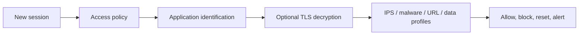

Product evaluation order differs, so use the firewall's session-end reason and stage-specific logs.

---

## 63. Application Signatures

An **application signature** identifies traffic by protocol behavior and context rather than assuming destination port equals application.

### Signals a signature may use

- Handshake and message patterns
- HTTP host, method, path, headers, or content when visible
- TLS SNI, certificate, and ALPN metadata
- DNS names and destination reputation
- Packet size/timing sequences
- Known protocol fields or magic values
- Behavioral heuristics and machine-learning models

### Why port-only policy is weak

- Applications can run on nonstandard ports.
- Tunneling can carry one protocol inside another.
- Many unrelated applications share TCP/UDP 443.
- Cloud services share addresses/CDNs.
- Dynamic Software as a Service (SaaS) dependencies change.

### Identification lifecycle

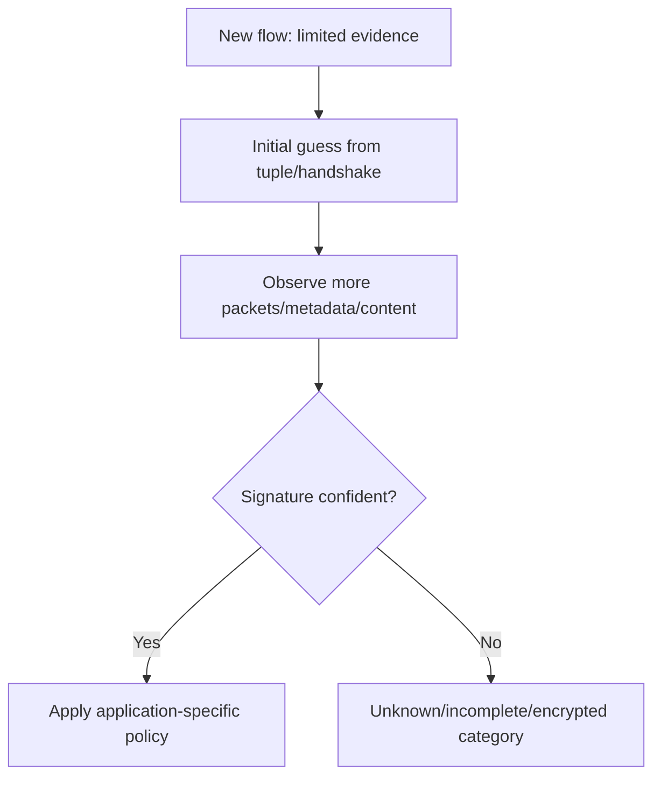

Some firewalls initially allow enough traffic to identify the application, then re-evaluate policy. A session log may show a final application different from the initial classification.

### Risks and limitations

| Challenge | Why it matters |
|-----------|----------------|
| Encryption | Content-based signatures are unavailable without decryption |
| Protocol evolution | Signatures require updates |
| Evasion/tunneling | Attackers imitate or hide protocols |
| Shared cloud infrastructure | IP/domain can represent many tenants/services |
| False positive | Legitimate app misclassified and blocked |
| False negative | Prohibited/malicious app not recognized |
| "Unknown" traffic | Needs explicit policy, investigation, and ownership |

### Signature vs identity

Application signature answers "what traffic appears to be." User/workload identity answers "who initiated it." Strong policy can combine both:

> Allow the Finance group to use the sanctioned accounting SaaS from compliant devices, inspect approved content, and deny unsanctioned file-sharing applications.

---

## 64. WAF Operation and Common Web Attacks

A **Web Application Firewall (WAF)** understands HTTP/HTTPS and applies policy intended to protect web applications.

It is commonly deployed as part of a reverse proxy, application gateway, CDN edge, or ingress service.

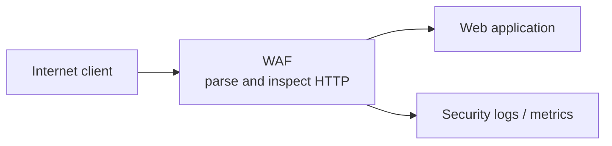

### What a WAF can inspect

- Host, method, path, query, headers, cookies, and body
- Request size and rate
- Encodings and protocol validity
- IP/reputation/geography signals
- Bot characteristics
- Known attack patterns
- Application-specific positive rules
- API schema/format in capable products

TLS must terminate at or before the WAF for it to inspect protected HTTP content.

### Common attack categories

| Attack | Plain meaning | WAF contribution |
|--------|---------------|------------------|
| SQL injection | Untrusted input alters a database query | Detect/block patterns; code should use parameterized queries |
| Cross-Site Scripting (XSS) | Attacker-controlled script reaches another user's browser | Detect suspicious payloads; app must encode output and use Content Security Policy (CSP) |
| Path traversal | Input attempts to escape intended file path | Normalize and block patterns; app must constrain file access |
| Command injection | Input becomes operating-system command syntax | Detect patterns; app must avoid shell construction and validate |
| Request smuggling | Front/back ends disagree about HTTP message boundaries | Normalize/reject ambiguity; components must parse consistently |
| Malicious file upload | Upload contains executable/malicious content | Size/type/scanning controls; app needs safe storage and processing |
| Credential stuffing | Automated use of stolen credentials | Rate, bot, reputation controls; MFA and identity detection are critical |
| Layer 7 denial of service | Expensive/repeated HTTP requests exhaust service | Rate limiting/challenges/caching; capacity and app efficiency matter |

A WAF is a compensating control, not a replacement for secure application design, patching, authentication, authorization, input validation, output encoding, and dependency security.

### Negative vs positive security

| Negative model | Positive model |
|----------------|----------------|
| Block known-bad patterns | Allow only known-valid request shapes |
| Faster broad deployment | Stronger for stable, well-described APIs/apps |
| Can miss novel variants | Can produce false positives when app changes |
| Managed signatures common | Schema, method, path, type, and range allow lists |

Many deployments combine both.

### Detection vs prevention mode

- **Detection/log mode** records matches without blocking, useful for baselining.
- **Prevention/block mode** enforces actions.
- A staged rollout can observe impact, tune exclusions narrowly, then enforce.

Avoid globally disabling a managed rule because one parameter triggers it. Scope an exclusion to the exact rule, route, parameter, method, and expected content where possible.

---

## 65. WAF vs NGFW vs Reverse Proxy vs IDS/IPS

| Control | Primary traffic context | Main job | Typical placement |
|---------|-------------------------|----------|-------------------|
| Network firewall | IP, port, state, zone | Network access/segmentation | Between networks |
| NGFW | State + application/user/threat context | Broad network/application policy and prevention | Internet edge, data center, cloud hub, segmentation |
| WAF | HTTP/HTTPS request/response | Protect web apps/APIs | Reverse proxy/CDN/app gateway |
| Reverse proxy | Application request routing | Publish/route/terminate services | In front of backends |
| IDS | Observed traffic/signatures | Detect and alert | Out-of-band or host/network sensor |
| IPS | Inline traffic/signatures | Detect and block | Inline path or NGFW |
| Host firewall | Local host connections/process context | Protect one endpoint/workload | Endpoint/server |

### Scenario placement

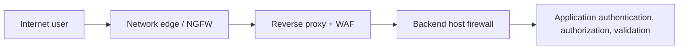

Each control answers different questions:

- NGFW: Should this network/application session cross this boundary?
- WAF: Is this HTTP request valid and safe for this web application?
- Reverse proxy: Which backend should receive it and how?
- Host firewall: Should this host accept the connection?
- Application: Is this identity allowed to perform this exact action on this object?

### Examples

| Requirement | Best primary control | Supporting controls |
|-------------|----------------------|---------------------|
| Block inbound SSH from internet | Network/host firewall | VPN/ZTNA, identity, monitoring |
| Block SQL injection in web parameter | Secure code + WAF | App testing, logging, DB least privilege |
| Stop known exploit packet pattern across services | IPS/NGFW | Patching, endpoint controls |
| Route `/api` to API servers | Reverse proxy/API gateway | WAF, health probes |
| Deny unsanctioned file-sharing app on TCP 443 | NGFW/Secure Web Gateway (SWG) application control | Cloud Access Security Broker (CASB), endpoint policy, DLP |

Do not use a WAF to solve non-HTTP network segmentation, or a port Access Control List (ACL) as the sole control for HTTP input attacks.

---

## 66. Rule Design, False Positives, Logging, and Least Privilege

### Least privilege

**Least privilege** grants only the access needed for a defined purpose, scope, and duration.

A well-formed rule documents:

- Business owner and technical owner
- Source identity/network/device
- Exact destination/service/application
- Required protocol and direction
- Security inspection profiles
- Environment and schedule/expiry
- Logging and alert expectation
- Change ticket/reason
- Validation and rollback plan

### Weak vs strong rule

| Weak | Stronger |
|------|----------|
| Any source -> any destination -> any service | Finance app subnet -> payment API endpoints -> HTTPS application |
| Permanent "temporary" access | Time-bounded rule with owner and review date |
| Broad decryption bypass | Exact app/category bypass with compensating controls |
| Disable entire WAF group | Narrow exclusion for one validated parameter/rule |
| No logging | Log session end/deny and correlate identity/policy |

### Rule lifecycle

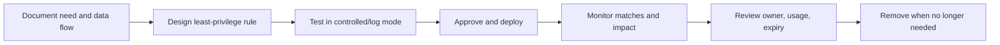

### False positive and false negative

- **False positive:** legitimate traffic is classified as malicious/prohibited.
- **False negative:** malicious/prohibited traffic is allowed or not detected.

Tuning one affects the other. An "allow everything to prevent false positives" policy eliminates useful enforcement; "block anything unusual" can make services unusable.

### Log fields worth preserving

| Category | Useful fields |
|----------|---------------|
| Time/context | Precise timestamp/time zone, device, policy version |
| Flow | Original/NAT source and destination, ports, protocol, direction |
| Identity | User, device, workload, identity source |
| Policy | Rule ID/name, stage, action, reason, profile |
| Application | Initial/final app classification, URL/SNI/host where lawful |
| Threat | Signature ID, severity, category, confidence |
| Lifecycle | Session start/end, duration, bytes, end reason |
| Correlation | Request/trace/session ID |

Logs can contain sensitive data. Minimize, protect, retain, and grant access according to policy.

### Troubleshooting firewall policy

1. Define exact source, destination, protocol, port/application, time, and direction.
2. Confirm route crosses the expected firewall/interface/zone.
3. Check original and translated tuples.
4. Find the exact session/traffic log and matched rule.
5. Check later decryption, IPS, URL, malware, WAF, or DLP stages.
6. Confirm return path crosses compatible stateful enforcement.
7. Compare with a working flow using one changed variable.
8. Make the narrowest test change with approval and rollback.

### Symptom interpretation

| Symptom | Evidence direction |
|---------|--------------------|
| Silent SYN retries | Drop, route, return path, or listener |
| Immediate RST/ICMP | Reject action or endpoint response |
| Access rule says allow but session blocked | Later threat/content/decryption stage |
| Only return traffic drops | State/asymmetric routing/NAT issue |
| WAF 403 with rule ID | HTTP rule match and scoped tuning |
| Intermittent during bursts | Rate limit, state exhaustion, backend health, attack protection |

> 💡 **Tie-in for any background:** A firewall policy is a decision table with evidence. First prove that traffic crossed the device, then identify the exact tuple, identity, rule, inspection stage, and action. "The firewall allows 443" is only the beginning of the answer.

---

## ⭐ Likely Interview Questions for This Section

**Q1. Compare stateless and stateful firewalls.**

> *Model answer:* A stateless filter evaluates each packet independently, so both directions usually need explicit rules. A stateful firewall tracks flow/connection context and permits valid return traffic based on state. Stateful inspection adds awareness but depends on state capacity, timeouts, and symmetric visibility.

**Q2. What is default deny and why is it difficult?**

> *Model answer:* Default deny blocks traffic without an explicit approved rule. It supports least privilege, but safe adoption requires discovering legitimate dependencies, assigning owners, writing narrow rules, monitoring impact, and maintaining policy as systems change.

**Q3. What makes an NGFW "next generation"?**

> *Model answer:* It combines stateful firewalling with deeper application identification, user/device identity, IPS, threat intelligence, URL/content controls, malware inspection, and optional TLS decryption. Capabilities vary, so I would describe the actual product and visibility.

**Q4. What is an application signature?**

> *Model answer:* It identifies application behavior using protocol patterns and available metadata/content rather than trusting ports alone. It may use handshakes, HTTP/TLS/DNS fields, payload patterns, behavior, and reputation, but encryption and protocol evolution limit confidence.

**Q5. What is a WAF, and what can it not replace?**

> *Model answer:* A WAF is an HTTP-aware control in front of web apps/APIs that detects or blocks malicious/invalid requests. It can mitigate SQL injection, XSS, traversal, bots, and rate attacks, but cannot replace secure code, patching, strong identity, authorization, validation, or database least privilege.

**Q6. Compare WAF, NGFW, and reverse proxy.**

> *Model answer:* A reverse proxy is the inbound intermediary/routing role. A WAF applies web-application security policy to HTTP at that layer. An NGFW enforces broader network, application, identity, and threat policy across zones. One product may combine roles, but their primary jobs differ.

**Q7. Why might a firewall allow rule match but the connection still fail?**

> *Model answer:* Routing, NAT, return path, listener state, TLS, or application can fail later. An NGFW may also allow at the access stage but block during decryption, IPS, malware, URL, or DLP inspection. I would use stage-specific logs and session-end reason.

**Q8. How would you handle a WAF false positive?**

> *Model answer:* Capture the exact request and rule ID, confirm the input is legitimate and safe, reproduce in detection mode, and tune the narrowest scope: specific rule, path, method, parameter, and expected format. Test, approve, monitor, document expiry/owner, and avoid disabling broad protections.

---

## 🧠 30-Second Memory Hooks

- **Firewall = observe context, match policy, take action.**
- **Stateless sees packets; stateful remembers flows.**
- **A route is not an allow, and an allow is not a route.**
- **Asymmetric path can break state.**
- **NGFW adds app + identity + threat context.**
- **Port suggests; application signature identifies behavior.**
- **IDS alerts; IPS can block inline.**
- **WAF protects HTTP; it does not repair code.**
- **Reverse proxy routes, WAF filters web attacks, NGFW controls broader sessions.**
- **Least privilege needs owner, purpose, scope, evidence, and expiry.**

---

*Next suggested section:* **[Part J - SWG, CASB, DLP, SASE & App Connectors](Part-J-swg-casb-dlp-connectors.md)**, which combines web, cloud-app, data, identity, and private-application controls into an enterprise access architecture.