# Part J - SWG, CASB, DLP, Secure Access Service Edge (SASE) & App Connectors

> **Section goal:** distinguish the major cloud-delivered security controls, explain inline and API enforcement, and design a coherent user-to-internet/Software as a Service (SaaS)/private-application access path.

Covers index items **67-74**.

[Back to the master guide](../Networking%20Security%20and%20Azure%20Identity%20-%20Study%20Guide.md) | [Previous: Part I](Part-I-firewalls-ngfw-waf.md)

---

## Start Here: Control Destination, Application, Data, and Access

These controls answer related but different questions:

| Control | Primary question |
|---------|------------------|
| Secure Web Gateway (SWG) | May this user/device access this web destination and content? |
| Cloud Access Security Broker (CASB) | How is this cloud application used, and under which policy? |
| Data Loss Prevention (DLP) | Does this content contain protected data, and what action is allowed? |
| Zero Trust Network Access (ZTNA) | May this identity/device reach this private application now? |
| App connector | How does the security service safely reach a private app or cloud API? |
| Secure Access Service Edge (SASE) / Security Service Edge (SSE) | How are networking and these security controls delivered together? |

**Analogy:** SWG controls the road to external sites, CASB governs behavior inside rented cloud offices, DLP checks protected documents, and ZTNA grants a verified person a temporary door to one private room.

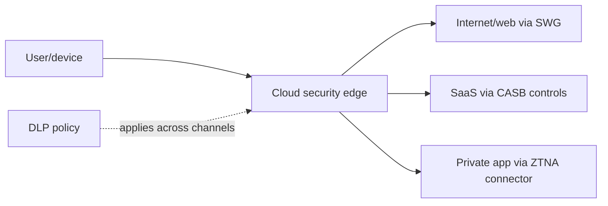

---

## 67. Secure Web Gateway

A **Secure Web Gateway (SWG)** controls and protects user/device access to internet web destinations.

It is the security-focused evolution of a forward proxy and web filter, commonly delivered from a distributed cloud edge.

### Common SWG capabilities

- URL/domain categorization and reputation
- User, group, device, location, and risk-aware access policy
- Malware scanning and sandbox integration
- TLS inspection where authorized
- File type and download/upload policy
- Application identification/control
- DLP inspection
- Phishing and command-and-control blocking
- Logging, reporting, and incident integration
- Isolation or safe rendering in some products

### Traffic steering

Traffic must reach the SWG before it can be enforced.

| Steering method | Typical use | Common failure |
|-----------------|-------------|----------------|
| Explicit proxy/PAC | Browser and proxy-aware traffic | PAC mismatch, auth, bypass |
| Endpoint agent/tunnel | Managed roaming users and broader traffic | Agent health, tunnel, identity, conflict with VPN |
| Branch tunnel | Site traffic forwarded with Generic Routing Encapsulation (GRE), Internet Protocol Security (IPsec), or Software-Defined Wide Area Networking (SD-WAN) | Route/tunnel/MTU/failover |
| Network forwarding | Controlled egress integration | Asymmetric path or source identity loss |

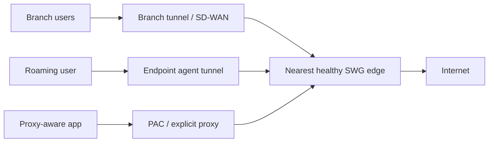

### SWG policy example

> Allow authenticated employees on compliant devices to use business/productivity categories; inspect supported TLS; block known malware, newly registered high-risk domains, and unsanctioned uploads; coach users for low-risk exceptions; log only approved metadata.

### URL category vs reputation

- **Category** describes purpose, such as business, social media, gambling, or file sharing.
- **Reputation/risk** estimates maliciousness or threat likelihood.

A legitimate category can host a compromised page. A new domain can be benign but carry uncertain reputation. Strong policy uses both plus identity and content context.

### Remote users

Cloud SWGs help apply similar policy away from an office. The endpoint agent or proxy configuration must cover intended traffic and resist easy bypass, while providing a controlled recovery path when the service is unavailable.

### SWG troubleshooting

1. Prove traffic steering and selected edge.
2. Confirm user/device identity and posture.
3. Identify destination category/reputation and matched rule.
4. Check TLS inspection or bypass decision.
5. Check application, malware, file, and DLP stages.
6. Separate client-edge from edge-destination performance.

---

## 68. CASB: Visibility and Policy for Cloud Applications

A **Cloud Access Security Broker (CASB)** provides visibility, policy, and protection for the use of cloud applications.

It is a capability set/control point, not necessarily one physical appliance.

### CASB goals

| Goal | Example |
|------|---------|
| Discover | Identify cloud apps being used from logs/traffic |
| Assess | Rate app risk, compliance, ownership, and data practices |
| Govern | Sanction, restrict, coach, or block apps/actions |
| Protect data | Apply DLP, labels, encryption/quarantine workflows |
| Protect accounts | Detect anomalous sign-in or usage behavior |
| Control sessions | Restrict download/upload/copy on risky/unmanaged sessions |
| Remediate at rest | Scan cloud content through provider APIs and quarantine/share-change |

### CASB operating modes

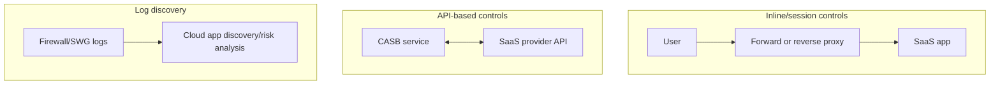

| Mode | Strength | Limitation |
|------|----------|------------|
| Forward-proxy inline | Covers many outbound apps/actions | Needs traffic steering and supported decryption/identification |
| Reverse-proxy/session control | Granular controls after identity redirect/federation | Usually applies to supported apps/sessions and identity paths |
| API integration | Scans/remediates data at rest and configuration | Near-real-time or periodic, limited to provider API permissions/features |
| Log discovery | Broad visibility from existing egress logs | Usually detective, with limited direct action |

### CASB vs SWG

| SWG | CASB |
|-----|------|
| Broad internet/web destination control | Deep cloud-application visibility and governance |
| URL, threat, file, and web policy | Cloud app risk, actions, accounts, sharing, stored data |
| Primarily inline | Inline, API, and log modes |
| "Can this web access occur?" | "How may this cloud app and its data be used?" |

Products often combine both, but the mental distinction remains useful.

### CASB does not replace SaaS configuration

Strong cloud governance also requires:

- Identity and Conditional Access
- SaaS tenant security settings
- Least-privilege administrator roles
- Sharing/guest lifecycle
- Audit logs and retention
- Secure development/integration
- Backup and incident response

---

## 69. DLP: Discovering, Classifying, Monitoring, and Protecting Data

**Data Loss Prevention (DLP)** identifies sensitive information and applies policy to reduce unauthorized disclosure, movement, or use.

"Loss" includes accidental sharing, malicious exfiltration, insecure storage, and policy violations. DLP cannot guarantee that data never leaves; it is one control in a broader data-protection program.

### DLP lifecycle

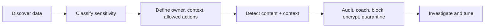

### Detection methods

| Method | Example | Strength/constraint |
|--------|---------|---------------------|
| Pattern/regular expression | Card-like number | Fast but can create false positives |
| Checksum/validation | Valid payment-card structure | Improves confidence over pattern alone |
| Keyword/dictionary | Project codenames or medical terms | Context-sensitive and language-dependent |
| Exact Data Match (EDM) | Fingerprinted customer records | High precision; reference data lifecycle matters |
| Document fingerprint | Forms/templates | Identifies structured document families |
| Sensitivity label | "Confidential - Finance" metadata | Uses owner classification; label integrity/governance matters |
| Machine learning/classifier | Contract or source-code category | Handles semantics but needs quality evaluation |
| Optical Character Recognition (OCR) | Sensitive text in image | Adds visibility with performance/error trade-offs |

### Context matters

The same content can be allowed or blocked depending on:

- Sender/user/workload
- Device management/compliance
- Destination app/tenant/domain
- Internal vs external recipient
- Action: view, upload, download, print, copy, share
- Data volume and sensitivity
- Business justification or approval
- Encryption and rights protection
- User/risk signals

### DLP actions

| Action | Use |
|--------|-----|
| Audit only | Baseline impact and investigate |
| User coaching | Warn and collect justification/override |
| Block | Stop prohibited transfer/action |
| Quarantine | Isolate item for review |
| Encrypt/apply rights | Limit who can open/use content |
| Remove external sharing | Remediate cloud content |
| Alert/case | Trigger security workflow |

### False positives and false negatives

DLP tuning balances user productivity and protection.

- Combine multiple evidence signals.
- Use confidence levels and occurrence counts.
- Pilot in audit mode.
- Scope rules to data owner, action, destination, and device.
- Give users clear remediation, not only a generic block.
- Review overrides and incidents for policy improvement.

> 🔍 **Plain-English deep dive: DLP begins with data ownership**
>
> A scanner can find patterns, but it cannot invent business policy. The organization must know which data matters, who owns it, where it may go, who may use it, and what exceptions are legitimate. Classification and ownership make detection actionable.

---

## 70. Inline vs API Controls and Data States

### Three data states

| State | Meaning | Example controls |
|-------|---------|------------------|
| Data at rest | Stored | SaaS API scan, storage permissions, encryption, labels |
| Data in motion | Being transmitted | SWG/CASB/email gateway/network DLP, TLS |
| Data in use | Opened/processed on an endpoint/workload | Endpoint DLP, app authorization, rights management |

### Inline control

An inline control handles a request while it occurs.

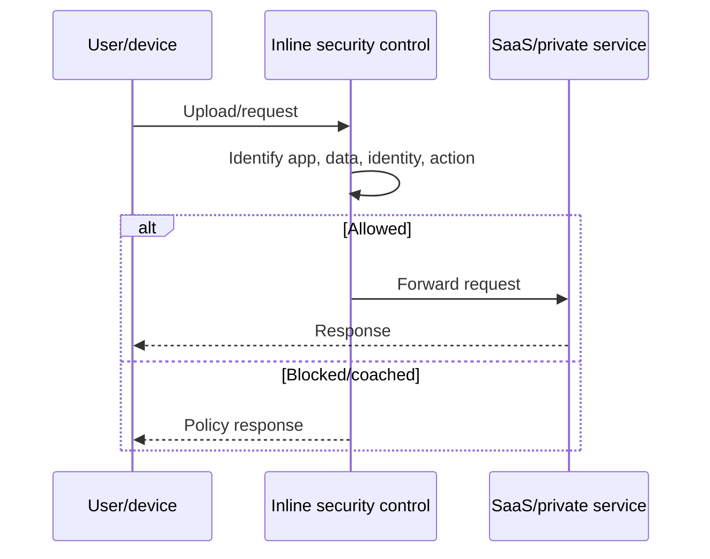

Benefits:

- Can block before transfer completes
- Uses live session context
- Gives immediate user feedback

Constraints:

- Must be in the traffic path
- Encryption/protocol support affects visibility
- Adds latency and availability dependency
- Very large/password-protected/end-to-end encrypted content may resist inspection

### API-based control

An API integration receives authorized access to a cloud service's objects, sharing settings, events, or configuration.

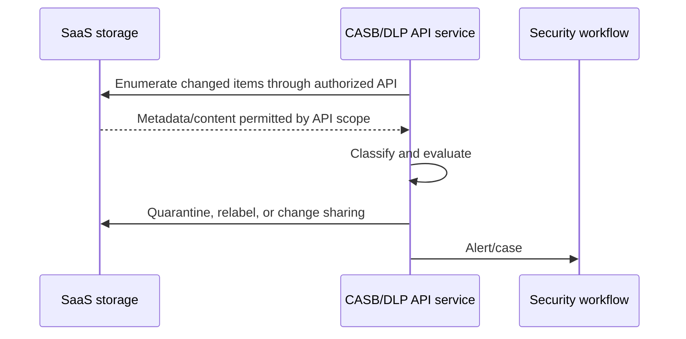

Benefits:

- Finds data already stored
- Does not require all user traffic inline
- Can inspect sharing/configuration context

Constraints:

- Action may occur after initial upload
- Limited by API coverage, permissions, rate limits, and change latency
- Broad API credentials create high-value risk
- Must handle deletions, ownership, errors, and remediation loops safely

### Inline plus API

Mature designs use both:

- Inline control prevents high-confidence risky transfers.
- API control discovers/remediates stored content and configuration drift.
- Endpoint control handles local copy/print/removable-media paths.
- Identity control restricts sessions before data actions occur.

---

## 71. Application Signatures, Sanctioned Apps, and Shadow IT

### Application signature

An application signature identifies cloud/web application behavior from available traffic and metadata. Part I covered the mechanism; CASB/SWG use the result for governance.

Examples of policy granularity:

- Allow viewing a personal storage site but block uploads.
- Allow company tenant login but block personal tenant login.
- Allow sanctioned collaboration app; coach on tolerated app; block prohibited app.
- Permit source-code upload only to approved organization repositories.

### Sanction states

| State | Meaning | Typical action |
|-------|---------|----------------|
| Sanctioned | Formally approved with owner and controls | Allow under defined policy |
| Tolerated | Not strategic but temporarily accepted | Monitor, coach, limit actions |
| Unsanctioned | Not approved due to risk/duplication | Block or restrict; offer approved alternative |
| Unknown/unassessed | Insufficient review | Discover, assess, restrict sensitive actions |

### Shadow IT

**Shadow IT** is technology used without appropriate organizational approval or visibility.

Drivers include:

- Approved tool does not meet user need
- Procurement is slow
- Users do not know policy
- Free SaaS is easy to adopt
- Remote teams solve local problems independently

Blocking without an alternative can push use into harder-to-see channels. Good governance combines discovery, risk assessment, user education, usable approved services, and proportionate enforcement.

### Cloud app risk assessment

| Dimension | Example question |
|-----------|------------------|
| Identity | Supports Single Sign-On (SSO), MFA, least-privilege administration? |
| Data | Encryption, retention, deletion, ownership, training use? |
| Compliance | Relevant certifications, audit, data location? |
| Sharing | External links, guests, public exposure controls? |
| Operations | Availability, incident response, export/backup? |
| Integration | API scopes, OAuth 2.0 authorization consent, webhooks, secrets? |
| Vendor | Financial/security maturity and contract terms? |

### Tenant restriction

Identifying an app is sometimes insufficient. Organizations may allow the application only for the corporate tenant and block personal tenants. Enforcement can use identity federation, proxy headers/tokens, application controls, and provider-supported tenant restrictions.

---

## 72. Application Connectors and Private Application Access

"Connector" can mean different things. Always name its job.

### Private-app/ZTNA connector

A lightweight connector runs near a private application and makes an **outbound** authenticated connection to a cloud access service.

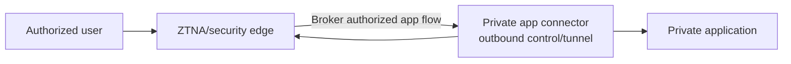

Benefits:

- No public inbound listener directly on the private app
- Hides private network addressing from users
- Grants access to an application rather than broad subnet routing
- Central identity/device/session policy
- Supports apps in data centers or cloud networks

### Connector is not magic isolation

Connector security still requires:

- Minimal network reach from connector to defined apps
- Hardened host/runtime and automatic updates
- Unique credentials/certificates and rotation
- High availability across failure domains
- Egress firewall rules only to required service endpoints
- Correct DNS from connector location
- Monitoring, capacity, and health checks
- Protection against connector compromise and lateral movement

### Connector selection

The cloud edge chooses a healthy connector group based on application configuration, location, health, and capacity. Multiple connectors avoid one process becoming a single point of failure.

### CASB API connector

A CASB **API connector** is different: it uses a SaaS provider API with delegated/application permissions to inspect and remediate tenant data/configuration.

| Private-app connector | CASB API connector |
|-----------------------|--------------------|
| Brokers live network access to private app | Calls cloud provider management/content API |
| Deployed near app/network | Configured through cloud authorization/consent |
| Outbound tunnel/control connection | API tokens/service principal/permissions |
| Main risk: network reach and connector compromise | Main risk: excessive API scope and credential abuse |

### App connector troubleshooting

1. Is connector registered, authenticated, current, and healthy?
2. Can connector resolve the private app name correctly?
3. Can it connect to the app IP/port with expected TLS trust?
4. Is app configuration mapped to the correct connector group?
5. Does user identity/device policy allow this application?
6. Is return traffic bound to the same proxied session?
7. Are connector capacity and regional edge healthy?

---

## 73. ZTNA, SASE, and SSE

### Zero Trust

Zero Trust follows the principle: **never trust solely because of network location; verify explicitly, use least privilege, and assume breach.**

It is a strategy and architecture, not one product.

### ZTNA

**Zero Trust Network Access (ZTNA)** brokers access to specific private applications based on identity, device, context, and policy.

| Traditional remote-access VPN tendency | ZTNA tendency |
|----------------------------------------|---------------|
| Connect user/device to a network | Connect authorized identity to an application |
| Broad route visibility may be granted | Private app can remain hidden from unauthorized users |
| Network location becomes major trust signal | Identity/device/context evaluated per access/session |
| Often appliance/concentrator based | Commonly cloud broker + outbound connectors |

Real products vary, and some ZTNA solutions support non-web protocols. ZTNA still depends on endpoint, identity, connector, DNS, and application security.

### SSE

**Security Service Edge (SSE)** converges cloud-delivered security functions commonly including:

- SWG
- CASB
- ZTNA
- Firewall as a Service (**FWaaS**) in many offerings
- DLP and threat protection across those channels

SSE focuses on security services, not the full branch/WAN networking stack.

### SASE

**Secure Access Service Edge (SASE)** combines wide-area networking and cloud-delivered security around distributed users, sites, devices, and applications.

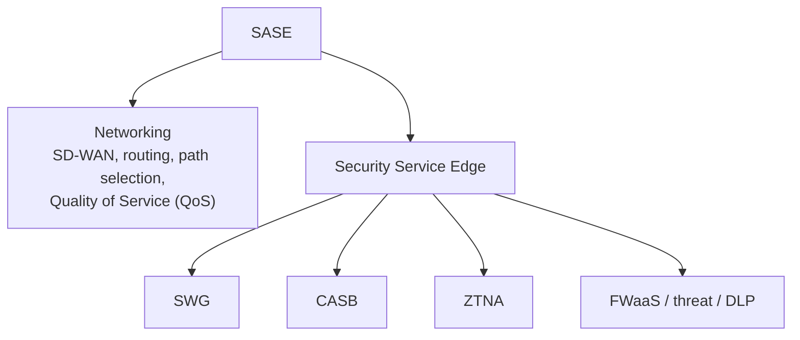

### SASE is an architecture, not "send everything to one cloud"

Good design considers:

- Regional points of presence and latency
- Local internet breakout
- Branch and endpoint traffic steering
- Identity/device integration
- Private and SaaS application location
- Resilience and failover
- Data residency and inspection policy
- Unified policy/logging without one operational blast radius

### Control plane vs data plane

- **Control plane:** policy, identity, configuration, routing decisions, orchestration.
- **Data plane:** actual user/application packets and enforcement.

A management portal outage and a data-forwarding outage are different failure modes. Document whether existing sessions continue under cached policy when control-plane connectivity fails.

---

## 74. How SWG, CASB, DLP, NGFW, WAF, and Identity Work Together

### User to sanctioned SaaS

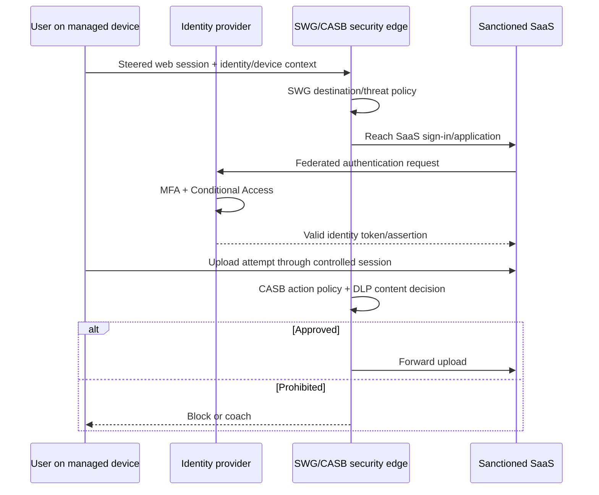

### Internet user to protected web application

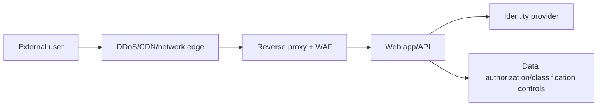

### Employee to private application

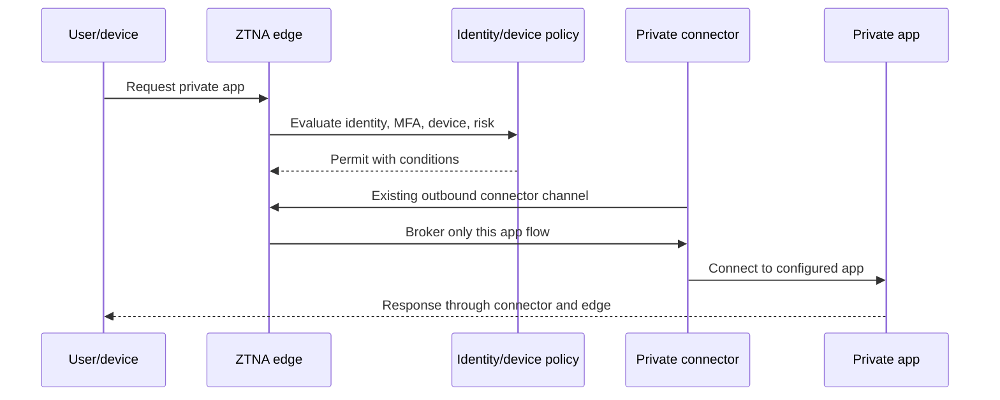

### Primary control map

| Question | Primary answer |
|----------|----------------|
| Can employee visit this website? | SWG |
| Is this cloud app approved? | CASB governance/application control |
| Can confidential data be uploaded there? | DLP using identity/app/action context |
| Can this user reach this private app? | ZTNA + identity/device policy |
| Is this inbound HTTP request an attack? | WAF |
| Can this network flow cross a zone? | Firewall/NGFW |
| Is this user/workload who it claims? | Identity provider/authentication protocol |
| Which backend receives the request? | Reverse proxy/load balancer/API gateway |

### Avoiding duplicate-control confusion

When several products can block the same flow:

1. Define the **primary enforcement point** for each use case.
2. Define defense-in-depth controls and expected order.
3. Use consistent identity and app/data taxonomy.
4. Correlate decision IDs and timestamps.
5. Ensure users receive the message from the actual blocker.
6. Test failover, bypass, unsupported protocol, and encrypted traffic.
7. Assign one policy owner even when several teams operate products.

### End-to-end troubleshooting

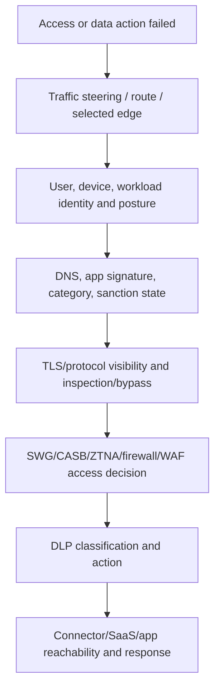

> 💡 **Tie-in for any background:** Name the protected object first: destination, cloud application, private application, or sensitive data. Then select the control whose primary job matches that object. Product bundles overlap, but clear questions prevent vague answers.

---

## ⭐ Likely Interview Questions for This Section

**Q1. What is a Secure Web Gateway?**

> *Model answer:* An SWG is a forward-proxy-oriented security service that controls user/device web access using identity, URL category/reputation, application, malware, TLS inspection, file, and DLP policy. Traffic can be steered by PAC, endpoint agent, branch tunnel, or network integration.

**Q2. Compare SWG and CASB.**

> *Model answer:* SWG broadly controls access to internet/web destinations and content. CASB focuses on cloud-application discovery, risk, actions, accounts, sharing, and stored data through inline, API, and log modes. Integrated products overlap, but their primary questions differ.

**Q3. What is DLP?**

> *Model answer:* DLP discovers/classifies sensitive information and applies contextual policy to data at rest, in motion, and in use. Detection can use patterns, validation, exact match, fingerprints, labels, classifiers, and OCR; actions include audit, coach, block, encrypt, quarantine, and remediation.

**Q4. Compare inline and API-based CASB/DLP controls.**

> *Model answer:* Inline controls evaluate live traffic and can block before completion but require supported traffic in path. API controls inspect and remediate cloud data/configuration at rest without steering every session, but depend on provider scope, latency, permissions, and rate limits. Mature designs combine them.

**Q5. What are sanctioned apps and shadow IT?**

> *Model answer:* A sanctioned app is formally approved with an owner and controls. Shadow IT is technology used without appropriate visibility/approval. CASB/SWG discovery can inventory use and risk; governance should also provide usable alternatives, education, and proportionate action.

**Q6. What is a private application connector?**

> *Model answer:* It is software near a private app that creates an outbound authenticated channel to a ZTNA/security service, allowing brokered app access without exposing a public inbound listener. It still needs least network reach, hardening, High Availability (HA), credential rotation, monitoring, and correct DNS/TLS.

**Q7. Compare ZTNA, SSE, and SASE.**

> *Model answer:* ZTNA grants identity/device-aware least-privilege access to private applications. SSE converges cloud security such as SWG, CASB, ZTNA, FWaaS, DLP, and threat protection. SASE combines that security edge with WAN networking such as SD-WAN and path selection.

**Q8. Where would you place SWG, CASB, DLP, NGFW, and WAF in one design?**

> *Model answer:* NGFW/firewall controls network-zone flows, SWG controls employee web egress, CASB governs cloud-app use, DLP evaluates sensitive content across channels, and WAF protects inbound HTTP applications. Identity supplies user/device/workload context. I would define a primary enforcement point and correlation for overlaps.

---

## 🧠 30-Second Memory Hooks

- **SWG controls the web road.**
- **CASB governs cloud-app behavior and stored data.**
- **DLP asks what the data is, where it may go, and who may act.**
- **At rest, in motion, in use.**
- **Inline blocks now; API finds/remediates in cloud storage.**
- **Sanctioned has approval and owner; shadow IT lacks visibility/approval.**
- **Private connector calls out; it does not expose the app inbound.**
- **ZTNA grants an app, not a whole network by default.**
- **SSE is security services; SASE adds WAN/networking.**
- **Pick primary enforcement by the question, then add defense in depth.**

---

*Next suggested section:* **[Part K - VPNs & IPsec](Part-K-vpn-ipsec.md)**, which explains tunnels, remote/site connectivity, IPsec/IKE, full versus split routing, and common VPN failures.