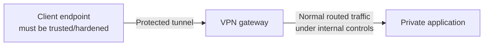
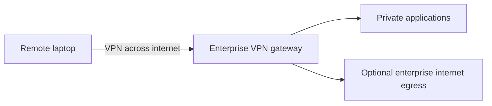
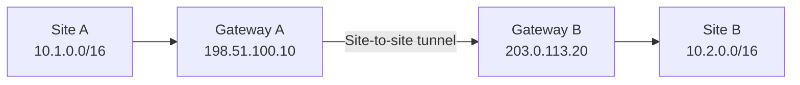
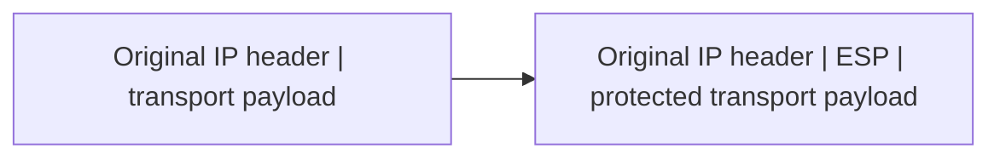
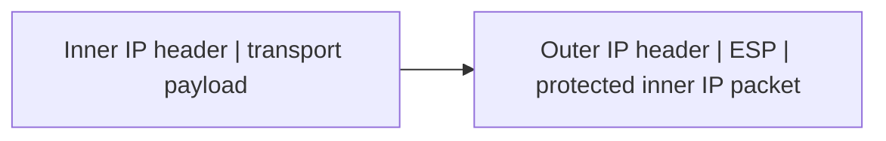
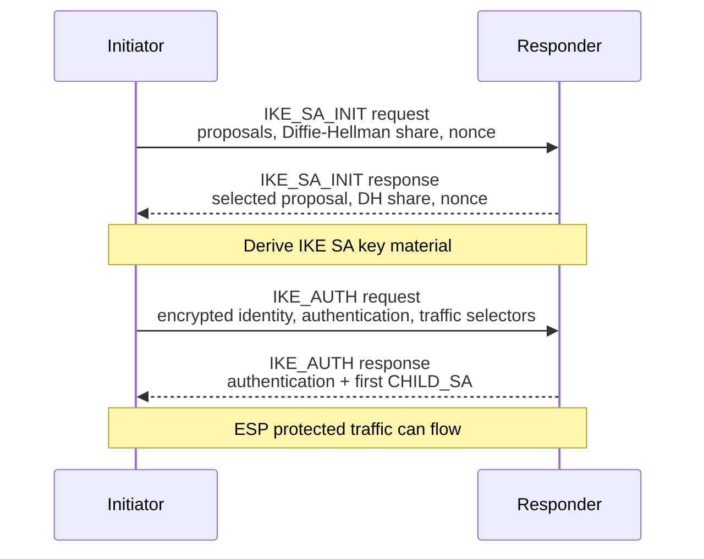
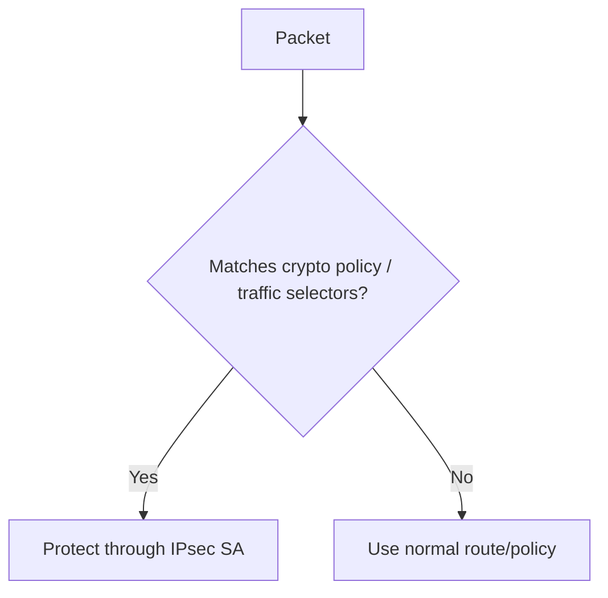
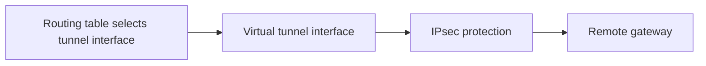
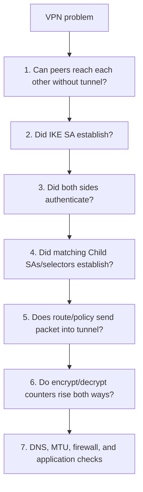

# Part K - VPNs & IPsec

> **Section goal:** explain how VPN tunnels carry protected traffic, distinguish remote-access and site-to-site designs, follow IPsec/IKEv2 negotiation, and isolate common routing, DNS, MTU, authentication, and proposal failures.

Covers index items **75-81**.

[Back to the master guide](../Networking%20Security%20and%20Azure%20Identity%20-%20Study%20Guide.md) | [Previous: Part J](Part-J-swg-casb-dlp-connectors.md)

---

## Start Here: A VPN Creates a Protected Logical Path

A **Virtual Private Network (VPN)** creates a logical communication path across another network, commonly with encryption, integrity, and peer authentication.

**Analogy:** ordinary packets are parcels. A VPN places selected parcels inside a locked courier container for travel across public roads. At the tunnel endpoint, the container is opened and the original parcel continues.

---

## 75. What a Tunnel and VPN Do and Do Not Guarantee

### Tunnel

A **tunnel** carries one packet/protocol inside another wrapper between tunnel endpoints.

Tunneling and encryption are separate ideas:

- Generic routing tunnels can encapsulate without encryption.
- IPsec can encrypt/authenticate tunnel traffic.
- TLS-based VPNs protect traffic through TLS-based channels.

### VPN security properties

A well-configured VPN can provide:

| Property | Meaning |
|----------|---------|
| Peer authentication | Tunnel endpoint/user/device proves accepted identity |
| Confidentiality | Protected payload is unreadable to ordinary path observers |
| Integrity | Unauthorized changes are detected |
| Anti-replay | Replayed protected packets are detected/rejected |
| Private addressing/routing | Selected private prefixes become reachable through virtual path |

### What a VPN does not automatically solve

- Compromised client or server endpoints
- Malware or unsafe application content
- Excessive user authorization after connection
- Weak authentication or stolen credentials
- Data leakage outside tunnel policy
- Vulnerable applications
- DNS privacy if DNS is routed elsewhere
- Traffic after it exits the tunnel endpoint
- Availability when the endpoint/path fails

### Outer and inner packets

In a site-to-site tunnel:

| Packet | Example source -> destination | Visible to internet path? |
|--------|-------------------------------|---------------------------|
| Inner/private | `10.1.0.10 -> 10.2.0.20` | Protected by tunnel |
| Outer | `198.51.100.10 -> 203.0.113.20` | Yes, needed to route between gateways |

Observers can still see outer endpoints, timing, sizes, and volume even when inner content is protected.

### Overhead

Tunnel, encryption, and outer headers consume bytes. The usable inner packet size is smaller than the physical path Maximum Transmission Unit (**MTU**). Incorrect MTU/MSS handling can produce "small requests work, large transfers hang."

> 🔍 **Plain-English deep dive: protection has boundaries**
>
> Draw a box around the exact tunnel endpoints. Traffic is cryptographically protected between those points. Before entry and after exit, endpoint, application, firewall, identity, and data controls remain necessary.

---

## 76. Remote-Access vs Site-to-Site; Full vs Split Tunnel

### Remote-access VPN

Connects an individual user/device to an organization's VPN service.

The client commonly receives:

- Virtual interface/address
- Routes for protected destinations
- DNS server/search settings
- Security policy
- Session lifetime and reauthentication rules

### Site-to-site VPN

Connects networks through gateways; individual endpoints do not each establish the tunnel.

Common uses include branch-to-data-center, data-center-to-cloud, and cloud-to-cloud connectivity.

### Full tunnel

The VPN becomes the route for most or all client traffic, commonly including internet access.

| Benefit | Trade-off |
|---------|-----------|
| Central security inspection and egress identity | Added latency and gateway bandwidth |
| Consistent DNS/web policy | VPN outage can affect all connectivity |
| Reduced direct local breakout | Hairpin path for nearby internet/SaaS services |

### Split tunnel

Only selected prefixes or applications use the VPN; other traffic goes directly or through another security service.

| Benefit | Trade-off |
|---------|-----------|
| Lower VPN bandwidth and better SaaS locality | More complex route/DNS/policy design |
| Public traffic can use cloud SWG directly | Endpoint has simultaneous private and external paths |
| Reduced hairpin latency | Need strong endpoint, identity, and leakage controls |

### Split-tunnel security questions

1. Which prefixes, names, or applications enter the tunnel?
2. Which DNS server resolves each namespace?
3. Can the device bridge traffic between local and corporate paths?
4. Are endpoint firewall and posture enforced?
5. Does internet traffic still pass through SWG/SSE controls?
6. What happens when a destination address changes?

### Overlapping subnets

If a user's home LAN and corporate network both use `192.168.1.0/24`, the client may select the wrong on-link route. Solutions include non-overlapping address plans, more-specific host routes, NAT, app proxy/ZTNA, or redesign.

---

## 77. IPsec: AH, ESP, Transport Mode, and Tunnel Mode

**Internet Protocol Security (IPsec)** is a suite that protects IP traffic at the network layer.

### Security protocols

| Protocol | IP protocol number | Confidentiality | Integrity/authentication | NAT friendliness |
|----------|--------------------|-----------------|--------------------------|------------------|
| AH (Authentication Header) | 51 | No | Yes, including selected immutable IP-header fields | Poor; NAT changes protected fields |
| ESP (Encapsulating Security Payload) | 50 | Yes when encryption used | Commonly yes with modern authenticated encryption | Used with NAT Traversal (NAT-T) when NAT exists |

Modern VPN deployments normally use ESP. AH is uncommon.

### ESP concept

ESP can provide:

- Payload confidentiality
- Integrity and data-origin authentication
- Anti-replay sequence protection
- Padding/traffic-format requirements

Algorithm suites and policy determine exact properties.

### Transport mode

IPsec transport mode protects the payload of the original IP packet while keeping the original IP header for routing.

Commonly associated with host-to-host protection or specific encapsulation designs.

### Tunnel mode

IPsec tunnel mode protects the entire original IP packet and adds a new outer IP header.

This is common for gateway-to-gateway site VPNs and remote-access designs.

### Transport vs tunnel mode

| Transport mode | Tunnel mode |
|----------------|-------------|
| Original IP header remains outer routing header | New outer IP header identifies tunnel endpoints |
| Protects original IP payload | Protects complete inner IP packet |
| Lower encapsulation overhead | Hides inner addresses from transit path |
| Common in host-specific designs | Common for network-to-network/remote gateways |

### Anti-replay

ESP sequence numbers and a receiver window help reject duplicated old protected packets. Anti-replay is not the same as application transaction replay protection; it applies to IPsec packets within a Security Association (SA).

---

## 78. IKEv2, Security Associations, Proposals, Keys, and Lifetimes

IPsec needs agreed algorithms, keys, peer identities, protected prefixes, and lifetimes. **Internet Key Exchange (IKE)** negotiates and maintains that state.

Modern designs commonly use **IKEv2**.

### Simplified IKEv2 exchange

### IKE SA and Child SA

| State | Job |
|-------|-----|
| IKE Security Association | Protects IKE management messages and authenticates peers |
| Child SA | Protects data traffic, commonly with ESP |

A **Security Association (SA)** is unidirectional. Bidirectional communication uses paired inbound/outbound SAs with Security Parameter Index (**SPI**) values.

### Negotiated proposal elements

Depending on IKE/IPsec version and algorithms:

- Encryption/authenticated encryption algorithm
- Integrity algorithm where separate
- Pseudorandom function (**PRF**)
- Diffie-Hellman group
- Authentication method
- Traffic selectors/protected subnets
- SA lifetime and rekey behavior
- Optional Perfect Forward Secrecy (**PFS**) for Child SA rekey

### Authentication methods

| Method | Typical use | Main operational concern |
|--------|-------------|--------------------------|
| Pre-Shared Key (PSK) | Simple site-to-site deployments | Unique strong secret storage/rotation; avoid sharing widely |
| Certificates | Scalable gateways/devices | PKI enrollment, trust, expiry, identity mapping |
| EAP/user authentication | Remote access | Identity provider, MFA integration, method strength |

### Diffie-Hellman concept

Diffie-Hellman lets peers derive a shared secret over an observable network without sending that secret directly. Authentication is still needed to prevent an active attacker from impersonating each peer.

### Lifetimes and rekey

SAs expire by time and sometimes data volume. Rekey establishes fresh key material before expiry. If peers disagree or rekey traffic is blocked, a tunnel can work initially and fail periodically.

### IKE ports

- IKE commonly uses UDP 500.
- With NAT traversal, IKE and ESP-in-UDP commonly use UDP 4500.

Packet capture may show an initial exchange on UDP 500 followed by UDP 4500 after NAT detection.

---

## 79. Policy-Based vs Route-Based VPNs and NAT Traversal

### Policy-based VPN

Policy/crypto selectors decide which source/destination/protocol traffic should be protected.

Peers must have compatible selectors. A subnet mismatch can establish IKE but prevent desired traffic from using a Child SA.

### Route-based VPN

A virtual tunnel interface participates in routing. Routes select the tunnel; IPsec protects traffic on it.

Route-based designs integrate more naturally with dynamic routing and many-prefix topologies, while policy-based designs can be simple for small fixed selector sets. Product capabilities vary.

### Comparison

| Policy-based | Route-based |
|--------------|-------------|
| Crypto policy selects interesting traffic | Routing selects virtual tunnel interface |
| Selectors often enumerate protected networks | Broad selectors may support many routed prefixes |
| Can become complex with many subnet pairs | Better fit for dynamic routing/large topology |
| Troubleshoot selector match plus route | Troubleshoot route plus tunnel/interface policy |

### NAT problem

Native ESP is IP protocol 50, not TCP/UDP, and NAT devices may have difficulty tracking multiple flows. NAT also changes IP/port information used in negotiation.

### NAT Traversal (NAT-T)

NAT-T encapsulates ESP inside UDP, commonly UDP 4500, so it traverses NAT devices more predictably.

### Keepalives and liveness

NAT mappings and firewall state expire when idle. NAT keepalives, IKE liveness checks/Dead Peer Detection, and rekey messages help maintain/detect state. Excessively short state timeouts can cause periodic tunnel interruption.

### Routing protocols over tunnels

Route-based site VPNs may run Border Gateway Protocol (**BGP**) or another supported routing method to exchange prefixes. This improves failover and scale but adds policy risks: incorrect advertisement can redirect or black-hole large networks.

---

## 80. TLS VPNs Compared with IPsec VPNs

Products often say **SSL VPN**, but modern secure implementations use TLS, not obsolete SSL.

### TLS-based remote access

TLS VPNs may provide:

- Browser portal access to selected web apps
- Agent/client tunnel for broader IP traffic
- Per-application proxying
- Integration with web authentication and MFA
- Traversal over TCP 443 and sometimes UDP-based optimized transport

### Comparison

| IPsec VPN | TLS-based VPN |
|-----------|---------------|
| Network-layer protection | TLS/proxy or client tunnel design |
| Strong fit for site-to-site and full network tunnels | Strong fit for remote user/app access |
| IKE + ESP, often UDP 500/4500 | Commonly uses familiar HTTPS/TLS reachability |
| Can carry many IP protocols transparently | Browser mode may cover only web apps; agent mode broader |
| Gateway and traffic-selector/routing complexity | Portal/proxy/app compatibility and TLS policy complexity |

Neither is universally "more secure." Security depends on:

- Authentication and MFA
- Cryptographic policy
- Client/device posture
- Access scope
- Segmentation
- Endpoint and gateway hardening
- Logging/response
- Patch and credential lifecycle

### TCP-over-TCP problem

If a TLS VPN tunnel itself uses TCP and carries inner TCP traffic, loss can trigger independent retransmission/congestion behavior in both layers, harming performance. Many VPN products use UDP-based data channels where possible and fall back to TCP for reachability.

### VPN vs ZTNA

| VPN | ZTNA tendency |
|-----|---------------|
| Extends routed network reach | Brokers named application reach |
| User may discover/reach multiple subnet services | Unauthorized apps are not exposed |
| Policy often at session/network boundary | Policy often identity/device/app specific |
| Useful for broad protocol/site connectivity | Useful for least-privilege user-to-app access |

Organizations can use both for different needs.

---

## 81. Common VPN Failures and a Layered Workflow

### Failure categories

| Stage | Symptom | Evidence to collect |
|-------|---------|---------------------|
| Underlay | Gateway unreachable | DNS, route, UDP/TCP reachability, packet loss |
| IKE proposal | `NO_PROPOSAL_CHOSEN`-style failure | Both peers' offered/accepted algorithms/groups |
| Authentication | Peer/user rejected | Certificate/PSK/EAP/MFA logs and identity |
| Child SA/selectors | IKE up, no data SA or one subnet fails | Traffic selectors, crypto policy, SPIs |
| Routing | Tunnel up, packets use wrong interface | Route tables, metrics, BGP/static routes |
| NAT/policy | UDP 500 works but ESP/data fails | NAT detection, UDP 4500, firewall state |
| DNS | IP works, private name fails | VPN DNS assignment, suffix, resolver route/answer |
| MTU/MSS | Small traffic works, large transfer stalls | Packet Too Big/fragmentation, retransmission, MSS |
| Return path | Outbound enters tunnel, replies elsewhere | Remote route, NAT, asymmetric capture |
| Lifetime/rekey | Fails at regular intervals | SA timers, rekey logs, clock, state timeout |
| Overlap | Local device reached instead of corporate host | Client on-link routes and address overlap |

### Systematic workflow

### Tunnel-up is not traffic-working

An IKE SA can be established while:

- No correct Child SA exists
- Desired subnet is missing from selectors
- Local route points elsewhere
- Remote return route is absent
- Firewall after decapsulation blocks traffic
- NAT exemption is missing
- DNS returns unreachable address

Always test a defined inner five-tuple and inspect both peers' encrypt/decrypt/drop counters.

### Counter reasoning

| Observation | Likely boundary |
|-------------|-----------------|
| Local encrypt rises; remote decrypt does not | Underlay/NAT/policy between peers or wrong peer/SA |
| Remote decrypt rises; app never sees packet | Post-decrypt route/firewall/destination issue |
| App replies; remote encrypt rises; local decrypt does not | Return underlay/NAT/policy issue |
| Both decrypt counters rise; client fails | Inner endpoint/application/DNS/MTU issue |

### DNS over VPN

Private-name resolution requires:

- Correct DNS server assigned
- Route to that server
- Appropriate suffix/search or exact FQDN
- Split-DNS rule selecting private resolver
- Resolver able to reach/resolve authoritative zone
- No conflicting public cache/answer

### MTU/MSS diagnosis

Common pattern:

- Ping with small payload works.
- TCP handshake works.
- Small requests succeed.
- Large upload/download stalls with retransmissions.

Check tunnel overhead, interface MTU, Path MTU Discovery ICMP, TCP MSS adjustment, and devices that drop required ICMP. Do not simply reduce MTU everywhere without locating the path constraint.

### Authentication diagnosis

For certificates, check:

- Peer identity/SAN expected by policy
- Chain and trust
- Validity and clock
- Extended Key Usage
- Revocation policy
- Private-key access

For PSK, verify exact peer mapping and secret on both ends without exposing it in logs. For user access, correlate identity provider, MFA, device posture, and VPN gateway events.

> 💡 **Tie-in for any background:** Treat a VPN as an underlay connection, a negotiated security relationship, a routing decision, and then an ordinary inner application flow. "Tunnel is up" verifies only part of that chain.

---

## Quick Reference

| Prompt | Recall |
|--------|--------|
| Tunnel | One packet/protocol inside another wrapper |
| Remote access | One client/device to gateway |
| Site-to-site | Network gateway to network gateway |
| Full tunnel | Most/all traffic through VPN |
| Split tunnel | Selected routes/apps through VPN |
| ESP | IPsec confidentiality/integrity/anti-replay data protection |
| IKEv2 | Negotiates/authenticates and creates SAs |
| UDP 500 | IKE |
| UDP 4500 | IKE/ESP with NAT-T |
| Route-based | Route selects virtual tunnel interface |
| Policy-based | Crypto policy/selectors choose protected traffic |

---

## ⭐ Likely Interview Questions for This Section

**Q1. What does a VPN provide, and what does it not provide?**

> *Model answer:* A VPN can authenticate tunnel peers and provide confidentiality, integrity, anti-replay, and private routing between defined endpoints. It does not secure compromised endpoints, authorize every application action, prevent all leakage, or protect traffic after it exits the tunnel.

**Q2. Compare remote-access and site-to-site VPNs.**

> *Model answer:* Remote access connects an individual user/device to a gateway and assigns virtual routes/DNS/policy. Site-to-site connects networks through gateways, commonly protecting traffic between defined prefixes without each endpoint running a VPN client.

**Q3. Compare full and split tunnel.**

> *Model answer:* Full tunnel sends most traffic through enterprise VPN egress for consistent control but adds bandwidth, latency, and outage dependence. Split tunnel sends selected private traffic through VPN and other traffic elsewhere, improving locality but requiring careful route, DNS, endpoint, and leakage policy.

**Q4. What are ESP and AH?**

> *Model answer:* ESP is IP protocol 50 and commonly provides IPsec confidentiality, integrity/authentication, and anti-replay. AH is protocol 51 and authenticates payload plus selected immutable IP-header fields but does not encrypt and works poorly with NAT. Modern VPNs normally use ESP.

**Q5. Explain a simplified IKEv2 negotiation.**

> *Model answer:* IKE_SA_INIT negotiates algorithms and exchanges Diffie-Hellman values/nonces to derive IKE keys. IKE_AUTH exchanges protected identities/authentication and creates the first Child SA with traffic selectors. Paired Child SAs then protect ESP data and are rekeyed by lifetime.

**Q6. What is NAT-T?**

> *Model answer:* NAT Traversal detects NAT and wraps ESP inside UDP, commonly port 4500, so NAT/firewalls can track it. IKE normally starts on UDP 500 and can move to UDP 4500 after NAT detection.

**Q7. Compare policy-based and route-based VPNs.**

> *Model answer:* Policy-based VPNs use crypto rules/traffic selectors to decide which packets enter SAs. Route-based VPNs expose a virtual tunnel interface and let routing select it, which scales better with many prefixes and dynamic routing. Both peers still need compatible IPsec policy.

**Q8. The VPN says connected, but the private app fails. What do you check?**

> *Model answer:* Verify the underlay, IKE and Child SAs, selectors, client route, local encrypt and remote decrypt counters, remote return route, post-decrypt firewall/NAT, split DNS, MTU/MSS, and application listener. "Connected" does not prove the inner flow works.

---

## 🧠 30-Second Memory Hooks

- **VPN = protected logical path; draw its exact endpoints.**
- **Remote access joins a device; site-to-site joins networks.**
- **Full sends most; split sends selected.**
- **ESP protects data; IKE negotiates/authenticates.**
- **Tunnel mode wraps the whole inner IP packet.**
- **IKEv2: INIT agrees keys, AUTH proves identity and builds Child SA.**
- **SA is one direction; a tunnel needs paired SAs.**
- **UDP 500 for IKE, 4500 for NAT-T.**
- **Policy selects vs route selects.**
- **Tunnel up is not route, DNS, MTU, firewall, or app success.**

---

*Next suggested section:* **[Part L - Azure Identity & Authentication Protocols](Part-L-azure-identity-auth-protocols.md)**, which explains Entra ID, tokens, OAuth 2.0, OpenID Connect, SAML, Kerberos, workload identity, and sign-in diagnosis.