# Part L - Azure Identity & Authentication Protocols

> **Section goal:** explain Microsoft Entra ID objects and access decisions, choose among modern and legacy identity protocols, validate token boundaries, secure workload identity, and diagnose sign-in versus authorization failures.

Covers index items **82-90**.

[Back to the master guide](../Networking%20Security%20and%20Azure%20Identity%20-%20Study%20Guide.md) | [Previous: Part K](Part-K-vpn-ipsec.md)

---

## Start Here: Identity Answers More Than "Who Are You?"

An identity system supports several distinct decisions:

1. **Identification:** which identity is being claimed?
2. **Authentication:** how was control of that identity verified?
3. **Authorization:** what may that identity do to this resource?
4. **Accounting/auditing:** what happened, when, and under which policy?

**Analogy:** a passport names you, border inspection authenticates the document/person, a visa authorizes a specific activity, and entry records provide audit history.

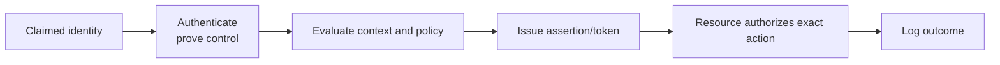

---

## 82. Identity, Authentication, Authorization, Accounting, and Federation

### Core terms

| Term | Plain meaning | Example |
|------|---------------|---------|
| Identity | Representation of a person, device, application, or workload | User account or service principal |
| Principal | Identity acting in a security decision | Signed-in user calling an API |
| Credential | Evidence used to authenticate | Passkey, certificate, secret, password |
| Authentication (AuthN) | Verify control of claimed identity | Verify passkey and user presence |
| Authorization (AuthZ) | Decide permitted action | User may read but not delete record |
| Claim | Statement about subject/context | Tenant ID, subject ID, role, authentication method |
| Token/assertion | Signed security message carrying claims | OAuth access token, OpenID Connect (OIDC) ID token, Security Assertion Markup Language (SAML) assertion |
| Identity Provider (IdP) | Authenticates and issues identity assertions/tokens | Microsoft Entra ID |
| Relying party / service provider | Trusts an IdP under configuration | SaaS application |
| Federation | Trust relationship across security domains | SaaS trusts Entra-issued SAML assertions |
| Provisioning | Create/update/disable accounts and attributes | System for Cross-domain Identity Management (SCIM) lifecycle synchronization |

### Authentication is not authorization

A user can successfully authenticate but receive HTTP 403 because the application denies the requested action. Conversely, an application can have a serious authorization bug even if authentication is strong.

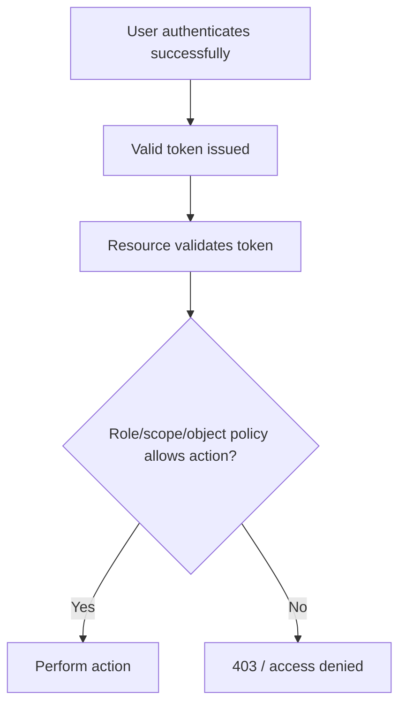

### Authentication factors

| Factor | Meaning | Examples |
|--------|---------|----------|
| Something you know | Memorized knowledge | Password, PIN |
| Something you have | Possession | Security key, device, authenticator app |
| Something you are | Biometric characteristic | Fingerprint, face |

Two passwords are not two factors because both are "something you know."

### Federation vs synchronization

- **Federation** establishes trust in another authority's signed authentication result.
- **Synchronization** copies selected identity data between systems.
- **Provisioning** manages account lifecycle in a target system.
- **Single Sign-On (SSO)** reduces repeated user sign-in through a trusted session/token flow.

These can be combined but are not synonyms.

> 🔍 **Plain-English deep dive: identity is a control plane for access**
>
> The IdP authenticates and issues trustworthy claims. The resource still owns final authorization for its data/action. A valid token is not a universal pass; it has an issuer, audience, subject, time window, permissions, and policy context.

---

## 83. Microsoft Entra ID: Tenants, Users, Groups, Applications, and Service Principals

**Microsoft Entra ID** is Microsoft's cloud identity and access management service, formerly named Azure Active Directory.

It is not simply Windows Server Active Directory Domain Services (**AD DS**) moved to the cloud.

| Microsoft Entra ID | AD DS |
|--------------------|-------|
| Cloud identity and modern app access | Windows domain directory and network authentication |
| OAuth 2.0, OIDC, SAML, WS-Federation (WS-Fed) | Kerberos, NT LAN Manager (NTLM), LDAP, Group Policy |
| Internet-oriented identity endpoints/tokens | Domain controllers and domain-joined environment |
| SaaS/Azure/Microsoft 365 integration | Traditional Windows device/user/workload domain services |

Hybrid environments connect them, but each has distinct objects, protocols, and administration.

### Tenant

A **tenant** is a dedicated Microsoft Entra identity boundary containing objects, policy, and configuration for an organization or external-identity scenario.

Each tenant has:

- Tenant/directory ID
- Verified domains
- Users, groups, devices, applications, and service principals
- Roles, policies, logs, and consent grants
- Trust/integration configuration

Tenant boundaries matter in token issuer, object IDs, guest access, application consent, and administration.

### Users, groups, devices, and roles

| Object | Job |
|--------|-----|
| User | Represents a human account/member or external guest context |
| Group | Collects users/devices/service principals for access or administration |
| Device | Represents registered/joined device identity and state |
| Directory role | Grants administrative permissions in Microsoft Entra |
| Azure Role-Based Access Control (RBAC) role assignment | Grants data/control actions on Azure resource scopes |

Microsoft Entra directory roles and Azure Role-Based Access Control (**RBAC**) are different authorization systems. Global Administrator does not automatically mean unlimited data-plane permission in every Azure resource, and Azure subscription Owner is not the same as Entra Global Administrator.

### Application object/app registration

Registering an application creates an **application object** in its home tenant. It is the global definition or blueprint.

It describes information such as:

- Application/client ID
- Sign-in audience (single-tenant/multitenant/account types)
- Redirect URIs
- Exposed API scopes/app roles
- Required API permissions
- Certificates, secrets, and federated credentials where configured
- Token/branding settings

### Service principal/enterprise application

A **service principal** is the tenant-local representation of an application or workload for authentication and authorization.

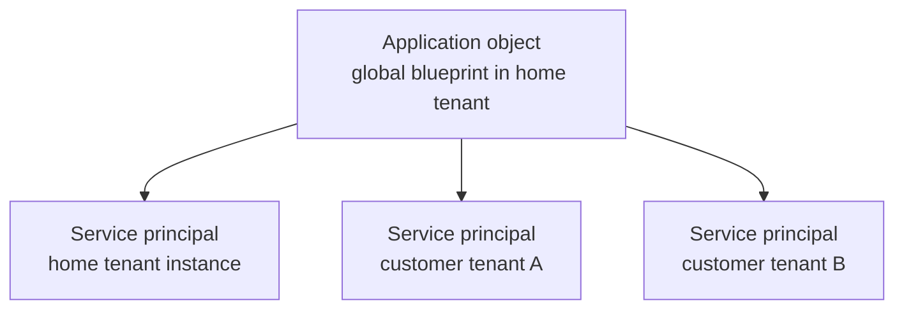

In the admin center:

- **App registrations** lists/manages application objects in the home tenant.
- **Enterprise applications** lists/manages service principals in the tenant.

The service principal defines local assignments, consented permissions, access policy, and sign-in behavior. A multitenant application has one app object but a service principal in each tenant where it is used/consented.

### Object IDs are contextual

- Application/client ID identifies the application definition globally.
- Application-object ID identifies that directory object in the home tenant.
- Service-principal object ID identifies the local enterprise application instance.
- Tenant/directory ID identifies the tenant.

Using the wrong ID is a common automation and troubleshooting error.

---

## 84. Passwords, Passwordless, MFA, Conditional Access, and Device Identity

### Password risks

Passwords are shared secrets vulnerable to phishing, reuse, spraying, credential stuffing, malware, and help-desk/social-engineering attacks.

Controls include:

- Block weak/compromised passwords
- Smart lockout and risk detection
- Disable legacy/basic authentication
- Multifactor authentication (**MFA**)
- Phishing-resistant passwordless methods
- Privileged identity governance with time-bound elevation and access review

### MFA

MFA requires evidence from at least two factor categories.

Microsoft Entra methods can include Microsoft Authenticator, Windows Hello for Business, passkeys using FIDO2 standards for phishing-resistant public-key authentication, certificate-based authentication, Initiative for Open Authentication (OATH) tokens, Temporary Access Pass for onboarding/recovery, SMS, voice, and external MFA depending on configuration.

Not all MFA methods offer equal phishing resistance. SMS or one-time codes can be relayed; passkeys/FIDO2 and properly designed certificate/Windows Hello flows bind authentication more strongly to the legitimate service/device.

### Passwordless

Passwordless authentication removes a reusable password from the sign-in experience and can use:

- Passkeys/FIDO2 security keys
- Windows Hello for Business
- Certificate-based authentication
- Microsoft Authenticator passwordless methods, where supported

Biometrics commonly unlock a key on the local device; a fingerprint image is not sent as the remote password.

### Conditional Access

Microsoft Entra **Conditional Access** evaluates signals and enforces access controls.

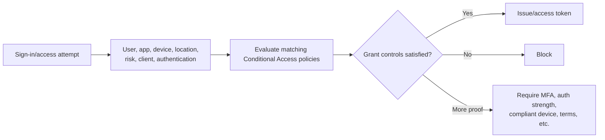

Conditional Access is often described as an "if-then" engine:

> If a selected user accesses a selected app under these conditions, then require these grant/session controls or block.

Signals can include:

- User/group/role scope
- Target resource/application
- Device platform and compliance/join state
- Named network location/IP
- User and sign-in risk
- Client application/protocol
- Authentication strength

Controls can include block, MFA/authentication strength, compliant device, approved client/app protection, terms of use, session frequency, and continuous-access behavior where supported.

### User Conditional Access vs workload Conditional Access

Human users and nonhuman workloads cannot satisfy the same controls.

| User/device access | Workload-identity access |
|--------------------|--------------------------|
| Can perform interactive authentication and MFA | A service principal cannot perform MFA |
| Can present device compliance/join and authentication strength | Common policy signals focus on supported workload risk/location scenarios |
| Can receive interactive terms, step-up, or sign-in frequency prompts | Must use noninteractive credential/federation and cannot answer prompts |
| Policies commonly target users/groups/roles | Workload policies must target supported service principals directly |

Important current boundaries:

- Conditional Access for workload identities applies to supported **single-tenant service principals owned by the organization**, subject to licensing and current service support.
- It does not cover Microsoft/third-party multitenant SaaS service principals in the same way.
- Managed identities are not covered by workload-identity Conditional Access policy; govern them with least-privilege role assignments, access reviews, network/resource policy, monitoring, and lifecycle controls.
- A Conditional Access policy assigned to a group containing a service principal is not thereby enforced for that service principal; supported workload targeting is direct.

Do not copy a user policy that requires MFA or a compliant device onto a daemon and expect it to succeed. Design workload controls around credential elimination/federation, permission scope, trusted execution, location/risk capabilities, and monitoring.

### Policy safety

- Use report-only/simulation and sign-in logs.
- Exclude monitored emergency-access accounts from policies that could cause tenant lockout.
- Roll out to pilot groups.
- Block legacy authentication.
- Test service/workload and device scenarios separately.
- Document dependencies and rollback.

### Device identity

A device can be registered, joined to Microsoft Entra ID, hybrid joined, and/or managed/compliant through management systems.

Device identity is a signal, not proof that every process or user action is safe. Conditional Access combines it with user, authentication, app, and risk context.

### Identity governance and PIM

Authentication proves identity at sign-in; **identity governance** manages who should have access, why, for how long, and who verifies that it remains necessary.

**Microsoft Entra Privileged Identity Management (PIM)** reduces standing administrative privilege through eligible and time-bound role assignments.

| Assignment/state | Meaning |
|------------------|---------|
| Eligible | User may activate a role when needed under configured requirements |
| Active | Role permissions are currently available to the user |
| Permanent | Assignment has no scheduled end date |
| Time-bound | Assignment or activation has defined start/end time |

A common just-in-time activation flow is:

```mermaid
sequenceDiagram
    participant A as Eligible administrator
    participant P as PIM
    participant V as Approver/policy
    participant R as Privileged resource
    A->>P: Request role activation + justification
    P->>A: Require MFA/authentication context if configured
    P->>V: Request approval when required
    V-->>P: Approve for limited duration
    P-->>A: Role becomes active temporarily
    A->>R: Perform audited privileged task
    P->>P: Activation expires; privilege removed
```

PIM policy can require approval, justification, MFA/authentication context, limited duration, notification, and audit. Avoid permanent active privilege except explicitly governed emergency-access scenarios. Eligible activation is for principals capable of performing the activation workflow; applications, service principals, and managed identities cannot interactively activate an Azure role like a user.

### Access reviews

An **access review** asks an accountable reviewer to confirm whether users, guests, groups, applications, or supported service principals still need assigned access.

Useful review evidence includes:

- Resource/app owner
- Last sign-in/use and business justification
- Employment/contract state
- Privilege and data sensitivity
- Conflicting or duplicate access
- Review decision and automatic-remediation behavior

Reviews must have a defined outcome. A campaign that records decisions but never removes denied/unreviewed access is not effective governance.

### Entitlement management and access packages

**Entitlement management** groups resources and access policy into an **access package** that users can request or receive under approval, expiration, and review rules.

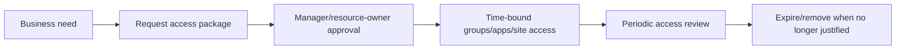

This is useful for employees, projects, guests, and partners who need a known bundle of access rather than unrelated manual grants.

### Joiner, mover, leaver lifecycle

| Event | Governance action |
|-------|-------------------|
| Joiner | Create identity from authoritative source, assign baseline access, enroll authentication/device |
| Mover | Re-evaluate old and new role access; remove incompatible privilege rather than only adding |
| Leaver | Disable sign-in, revoke sessions, remove access/ownership, preserve/transfer data under policy |
| Guest/contract expiry | Time-bound access, sponsor review, automatic expiration |
| Privilege elevation | PIM activation, approval, audit, and automatic expiry |

**Lifecycle Workflows** and provisioning integrations can automate selected joiner/mover/leaver tasks. Automation still needs authoritative data, exception handling, audit, and ownership.

### Emergency access

Maintain highly protected, monitored emergency-access accounts for tenant recovery according to current Microsoft guidance. Keep them independent of normal failure dependencies, test them safely, alert on use, and never use them for routine administration.

---

## 85. Tokens, Claims, Scopes, Roles, Consent, and Lifetime

A security **token** is a signed statement issued for a defined purpose and audience.

### Common token types

| Token | Intended consumer | Main purpose |
|-------|-------------------|--------------|
| ID token | Client application | Tell client about authenticated user/sign-in |
| Access token | Resource server/API | Authorize calls to that API |
| Refresh token | Authorization client/token endpoint flow | Obtain new tokens without full interactive sign-in |
| SAML assertion | SAML service provider | Federated authentication/attributes |

Do not send an ID token to an API as though it were an access token. Do not make one API validate a token whose audience is another API.

### Claims

Claims are signed statements in a token, such as:

| Claim concept | Question answered |
|---------------|-------------------|
| Issuer (`iss`) | Which authority issued it? |
| Audience (`aud`) | Which application/API should accept it? |
| Subject/object identity (`sub`, `oid`) | Which principal does it represent in context? |
| Tenant (`tid`) | Which directory context? |
| Expiry/not-before (`exp`, `nbf`) | When is it usable? |
| Scopes (`scp`) | Which delegated API permissions? |
| Roles (`roles`) | Which app roles/application permissions? |
| Nonce/auth context | Replay binding and authentication information |

Exact claims depend on token type, version, flow, account type, and configuration.

### Token validation

A resource/API should use a supported validation library and validate at least:

1. Cryptographic signature using trusted issuer metadata/keys
2. Expected issuer/tenant policy
3. Its own expected audience
4. Valid time window with controlled clock skew
5. Token type/version as required
6. Required scope or app role
7. Subject/tenant/business authorization

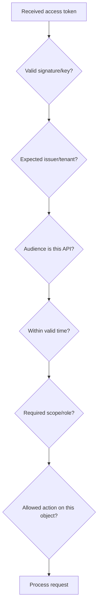

Decoding Base64URL, a URL-safe Base64 variant used for token segments, is not validation. Tokens for APIs you do not own may use formats you should not depend on.

### Delegated vs application permissions

| Delegated permission | Application permission |
|----------------------|------------------------|
| App acts on behalf of a signed-in user | App/workload acts as itself |
| Effective access is intersection of user and granted app permission/policy | No user context; app role/permission grants matter |
| Scopes commonly appear in `scp` | App roles commonly appear in `roles` |
| User or admin consent depending on permission/policy | Admin consent generally required |

### Scopes vs roles

- An OAuth **scope** represents delegated permission an API exposes, such as `Orders.Read`.
- An **app role** can represent application permission or user/group assignment, depending on design.
- Azure RBAC roles authorize Azure resources and are not simply OAuth scopes.
- Directory roles grant Entra administration.

### Consent

Consent creates an authorization grant for requested permissions. It does not mean:

- The app should receive every possible permission
- The user is authorized for every data object
- The grant can never be revoked
- The app is safe forever

Admin consent should follow least privilege, publisher/app risk review, ownership, and periodic review.

### Bearer tokens and lifetime

Most access tokens are **bearer tokens**: whoever possesses one can present it. Protect tokens from logs, URLs, browser leakage, insecure storage, and replay.

Short access-token lifetimes limit exposure but do not remove the need for revocation/session/risk controls. Refresh tokens require stronger storage and rotation/revocation handling.

> 🔍 **Plain-English deep dive: a token is addressed mail**
>
> The issuer signs it, the audience says who should open it, time claims limit use, and scopes/roles describe granted authority. A valid envelope addressed to API A must not be accepted by API B.

---

## 86. OAuth 2.0 Roles and Common Flows

**OAuth 2.0 is an authorization framework.** It lets a client obtain limited access to a protected resource. It is not, by itself, a user-authentication protocol.

OpenID Connect adds the standard identity layer for sign-in.

### OAuth roles

| Role | Plain meaning | Example |
|------|---------------|---------|
| Resource owner | Entity able to grant access | User whose files are requested |
| Client | Application requesting access | Web/mobile app |
| Authorization server | Authenticates/authorizes and issues token | Microsoft identity platform |
| Resource server | API hosting protected data/actions | Microsoft Graph or custom API |

### Authorization code flow with PKCE

**Proof Key for Code Exchange (PKCE)** binds the authorization code to the client instance that started the flow.

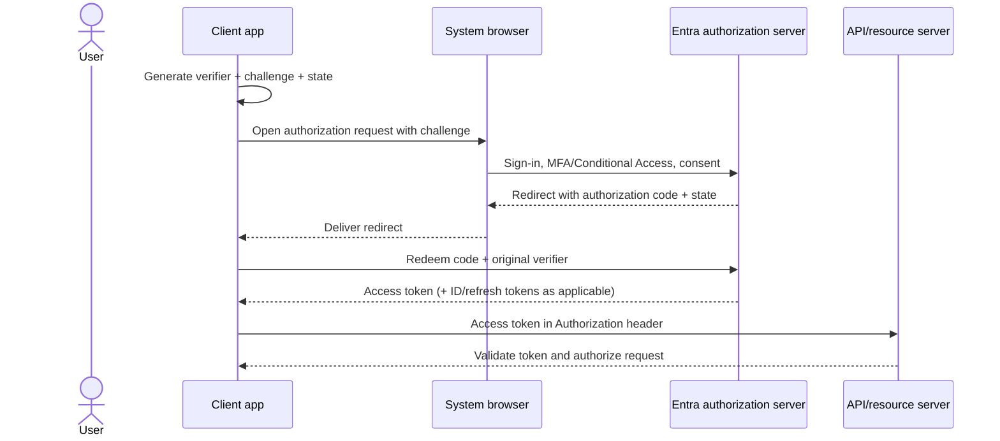

Use a system browser/approved library rather than collecting user passwords inside the app. Register exact redirect URIs and verify `state`; OIDC also uses `nonce` for ID-token replay binding.

### Common flows/grants

| Flow | Use | Key caution |
|------|-----|-------------|
| Authorization code + PKCE | Interactive web, mobile, desktop, Single-Page Application (SPA) | Protect code flow, state, verifier, redirect URI; server clients also authenticate |
| Client credentials | Service/daemon acts as itself | Use least-privilege app permissions and strong workload credentials |
| Device authorization grant | Input-constrained device/user completes sign-in elsewhere | Codes can be phished; restrict to genuine need and apply Conditional Access |
| On-Behalf-Of (OBO) | API calls downstream API for user | Preserve delegated boundary/audience; not token forwarding to arbitrary APIs |
| Refresh token | Obtain new access/ID tokens under grant/session policy | Secure storage, rotation, revocation, lifetime behavior |

### Client credentials

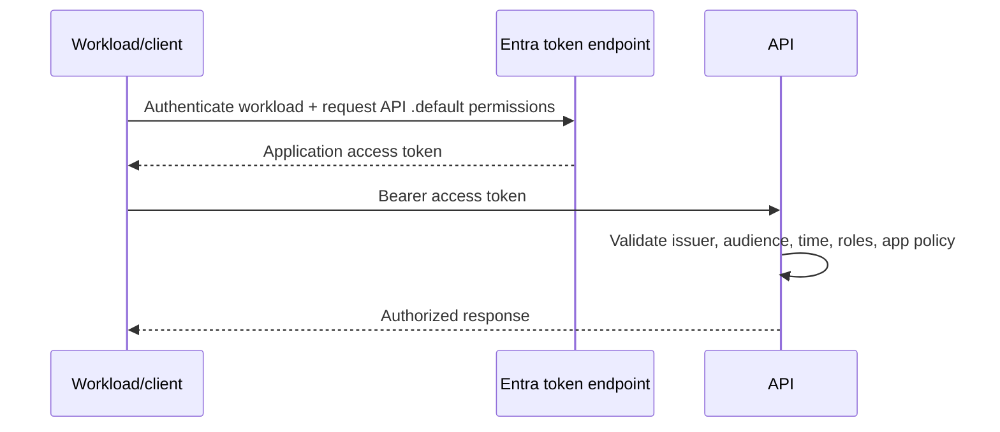

There is no user in this flow, so MFA cannot be performed by the workload. Protect workload identity through managed identity/federation, certificate credentials, network and runtime controls, least privilege, and monitoring.

### Flows to avoid for new designs

- **Implicit flow:** replaced by authorization code + PKCE for modern browser/public clients.
- **Resource Owner Password Credentials (ROPC):** app collects password, does not support modern authentication well, and breaks federation/MFA patterns; use only for constrained legacy migration where explicitly supported and risk accepted.
- **Sharing one client secret across environments:** destroys attribution and broadens compromise.

### Use libraries

Use Microsoft Authentication Library (**MSAL**) or a supported standards library for protocol details, token caching, Conditional Access interaction, key rollover, and secure browser flows. Do not hand-roll OAuth/OIDC simply because HTTP messages look straightforward.

---

## 87. OIDC, SAML, WS-Federation, Kerberos, NTLM, and LDAP

### Protocol comparison

| Protocol | Primary purpose | Token/message | Common fit |
|----------|-----------------|---------------|------------|
| OpenID Connect (OIDC) | Modern user authentication/SSO on OAuth 2.0 | ID token (often a JSON Web Token, or JWT) + OAuth artifacts | Web, mobile, SPA, modern apps |
| OAuth 2.0 | Delegated/application authorization to APIs | Access token | API access |
| SAML 2.0 | Browser federation/SSO | Signed Extensible Markup Language (XML) assertion | Enterprise SaaS/legacy federation |
| WS-Federation | Web federation/SSO | WS-* tokens, often SAML-format | Legacy Microsoft/enterprise web apps |
| Kerberos | Network authentication with tickets | Ticket Granting Ticket (TGT) and service ticket | AD DS domain services |
| NTLM | Legacy challenge-response authentication | Challenge/response messages | Legacy Windows compatibility |
| LDAP | Directory query/update and bind | Directory operations | AD DS and LDAP directories |
| SCIM | Cross-domain provisioning lifecycle | REST/JSON resources | Create/update/disable users/groups in SaaS |

### OpenID Connect

OIDC extends OAuth 2.0 for authentication and SSO. It introduces the **ID token** and discovery/user-info/logout standards.

- Client requests `openid` scope.
- IdP authenticates the user and applies policy.
- Client validates ID token and starts its local session.
- An access token, if requested, is for the resource/API, not for the client session.

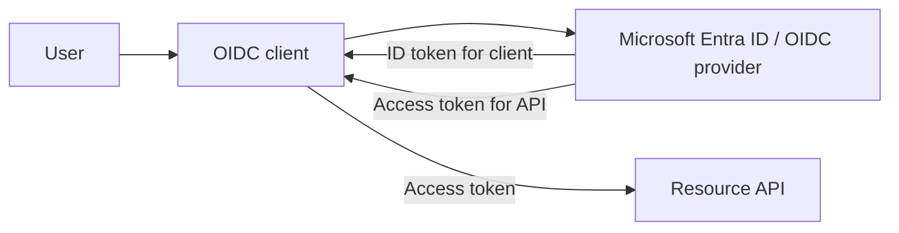

### SAML 2.0

Roles:

- **Identity Provider (IdP):** authenticates and issues assertion.
- **Service Provider (SP):** application relying on assertion.

Simplified SP-initiated flow:

```mermaid
sequenceDiagram
    actor U as User/browser
    participant SP as SAML service provider
    participant IDP as Entra ID / SAML IdP
    U->>SP: Request app
    SP-->>U: Redirect with AuthnRequest
    U->>IDP: Send request through browser
    IDP->>IDP: Authenticate + policy
    IDP-->>U: Signed SAML Response
    U->>SP: POST assertion to Assertion Consumer Service
    SP->>SP: Validate signature, issuer, audience, time, InResponseTo; create session
```

SAML assertions are bearer-sensitive and must be protected in transit. The SP validates signature, trusted issuer, audience, recipient/Assertion Consumer Service (ACS), time, request correlation, and subject conditions.

### WS-Federation

WS-Fed supports passive browser federation in many legacy enterprise applications. It uses realm/reply URLs and token services. Modern new development generally favors OIDC, while existing WS-Fed apps may be federated or fronted by modernization/proxy solutions.

### Kerberos

Kerberos uses a Key Distribution Center (**KDC**) and tickets.

1. Client obtains Ticket Granting Ticket (**TGT**).
2. Client requests a service ticket for a Service Principal Name (**SPN**).
3. Client presents service ticket.
4. Service validates it and can mutually authenticate.

Kerberos depends on DNS, time, SPN uniqueness, domain trust, and reachable KDCs. A duplicate/missing SPN or clock skew can cause fallback/failure.

### NTLM

NTLM is a legacy challenge-response protocol. It lacks Kerberos's ticket-based mutual-authentication design and creates relay/credential risks. Prefer Kerberos or modern authentication; reduce/monitor NTLM and avoid enabling it as a casual fix.

### LDAP

LDAP is primarily a directory access protocol. An LDAP **bind** can authenticate a connection, but LDAP is not a replacement label for all identity/authentication.

- LDAP on 389 can use StartTLS when correctly configured.
- LDAPS commonly uses TLS from connection start on 636.
- Unsigned/unencrypted binds can expose or permit tampering with credentials/data.

---

## 88. Managed Identities, Workload Identities, Secrets, and Certificates

A **workload identity** represents software such as an application, service, automation, container, or agent.

### Credential choices

| Method | Benefit | Risk/operation |
|--------|---------|----------------|
| Client secret | Simple compatibility | Copyable shared secret; expiry/storage/rotation risk |
| Certificate credential | Private key need not be sent; stronger than simple secret | PKI/key protection, rotation, expiry |
| Managed identity | Azure manages credential lifecycle; app obtains Entra token | Supported Azure host/resource and correct authorization required |
| Workload identity federation | Trust external/OIDC workload assertion; no stored Entra secret | Trust subject/issuer/audience configuration precisely |

Preferred order is usually credential-free managed/federated identity where supported, then certificate, with client secrets limited and rotated as needed.

### Managed identity

A managed identity lets supported Azure resources obtain Microsoft Entra tokens without developers managing credentials.

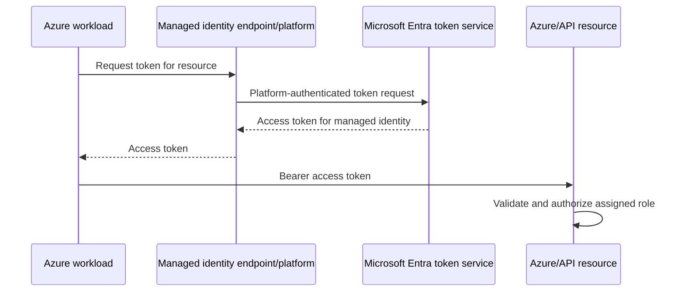

The workload never receives a reusable managed-identity password/secret. It still receives an access token and must protect it.

### System-assigned vs user-assigned

| System-assigned | User-assigned |
|-----------------|---------------|
| Enabled directly on one Azure resource | Standalone Azure resource assigned to one or more hosts |
| Lifecycle tied to parent; deletion removes identity service principal | Independent lifecycle; explicit deletion |
| Cannot be shared across resources | Can be shared where supported |
| Good for one resource with matching lifecycle | Good for preauthorization, recycled/multiple resources, shared identity |

Current Microsoft guidance recommends user-assigned managed identities for Microsoft services in many scenarios because of independent lifecycle and reuse, but choose per isolation and ownership requirements. Sharing one identity across unrelated workloads weakens attribution and least privilege.

### Workload identity federation

Federation lets Entra trust a token/assertion from an external workload identity provider, such as a supported Continuous Integration/Continuous Delivery (CI/CD) or Kubernetes OIDC issuer, and exchange it for an Entra access token.

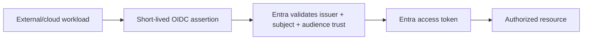

There is no long-lived Entra client secret in the external system. Configure issuer, subject, and audience narrowly; a broad subject pattern can grant unintended workloads access.

### Workload least privilege

- One identity per trust boundary/function where practical
- Minimal API application permissions/Azure roles
- Avoid directory-wide privileges
- Separate development/test/production identities
- Automate credential/certificate rotation where still needed
- Monitor service-principal and managed-identity sign-ins
- Review unused permissions and owners
- Restrict who can add credentials/federated trusts

---

## 89. SSO, Federation, External Identity, and Hybrid Identity

### Single Sign-On

**SSO** lets a user access multiple applications through an existing trusted authentication session rather than repeatedly entering credentials.

SSO depends on:

- IdP session/cookie or device broker state
- Application trust and protocol configuration
- Token/assertion lifetime
- Conditional Access and reauthentication policy
- Browser/device account context

Signing out of one application does not automatically clear every IdP and application session unless single-logout behavior is supported and correctly implemented.

### Federation

An application trusts Entra as IdP through OIDC, SAML, or WS-Fed configuration. Entra can also federate authentication to another identity provider under defined domain/external identity configuration.

Trust configuration includes exact issuer, metadata/signing keys, audience/entity ID/client ID, reply/redirect URI, claims, certificates, and rollover processes.

### External ID B2B collaboration

Microsoft Entra External ID B2B collaboration lets an organization invite or enable external users to access workforce-tenant applications/resources while using external/home identities where supported.

The resource tenant controls authorization and Conditional Access context; cross-tenant trust settings can affect which MFA/device claims are accepted.

### External tenants and CIAM

Microsoft Entra External ID also supports customer identity and access management (**CIAM**) in an external tenant for consumers, customers, citizens, and business customers.

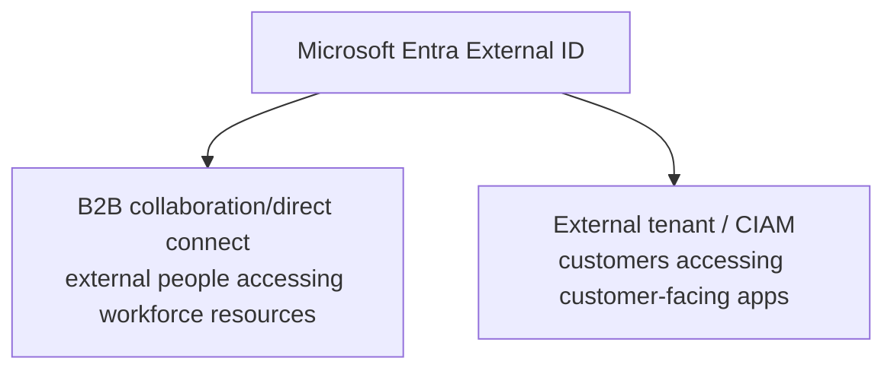

### Current Azure AD B2C status

Azure AD B2C is **not merely the new name for External ID**.

As of this guide's August 2026 grounding:

- Azure AD B2C stopped being available to purchase for new customers on May 1, 2025.
- Existing customers can continue using it.
- Microsoft states support continues until at least May 2030.
- Microsoft Entra External ID is the next-generation CIAM direction.

Verify current migration/licensing documentation before making a project decision.

### Hybrid identity

Hybrid identity connects on-premises AD DS identities with Microsoft Entra ID.

| Method | Simplified behavior | Dependency trade-off |
|--------|---------------------|----------------------|
| Password Hash Synchronization (PHS) | Synchronizes a derived password hash representation for cloud authentication | Cloud authentication can continue without on-prem sign-in agent availability |
| Pass-through Authentication (PTA) | Entra securely validates password through on-prem agents | Sign-in depends on healthy agents/on-prem connectivity |
| Federation (such as Active Directory Federation Services, or AD FS) | Entra redirects domain authentication to federated service | More infrastructure, certificate, endpoint, and trust operations |

Synchronization/provisioning tools also maintain users/groups/attributes. Account state, source of authority, writeback, duplicate identifiers, and deletion rules require deliberate lifecycle design.

### B2B vs B2C/CIAM

| B2B collaboration | Customer CIAM/external tenant |
|-------------------|-------------------------------|
| Partners/guests access workforce resources | Customers access customer-facing applications |
| Guest/external object in workforce tenant context | Customer accounts managed in external tenant context |
| Resource organization governs collaboration | Product team governs sign-up/sign-in experience |
| Employee-like access patterns with external identities | Large-scale self-service consumer/business-customer flows |

---

## 90. Diagnosing Sign-In and Authorization Failures

### First separate the phases

```mermaid
flowchart LR
    Request["1. App creates auth request"] --> Reach["2. Browser/device reaches IdP"]
    Reach --> Auth["3. User/workload authenticates"]
    Auth --> Conditional["4. Conditional Access/risk/consent"]
    Conditional --> Issue["5. Token/assertion issued"]
    Issue --> Return["6. Redirect/response reaches app"]
    Return --> Validate["7. App/API validates token"]
    Validate --> Authorize["8. Resource authorizes action"]
```

"Cannot log in" can fail at any of these boundaries.

### Evidence to capture

- Exact UTC/local time and time zone
- User/workload identifier and tenant
- Application/client ID and target resource/audience
- Correlation ID, request ID, trace ID
- Error code and full non-secret message
- Client/browser/OS and network/proxy path
- Redirect URI and authority/tenant endpoint
- Authentication method and MFA outcome
- Conditional Access tab/policies and device state
- Token issuer/audience/time/scope/role validation result
- Application authorization decision
- Working comparison

Do not collect passwords, refresh tokens, session cookies, or full bearer tokens in ordinary tickets.

### Microsoft Entra logs

| Log | Main use |
|-----|----------|
| User sign-in logs | Interactive/non-interactive user authentication and Conditional Access details |
| Service principal sign-ins | Application/workload authentication |
| Managed identity sign-ins | Managed identity token activity |
| Audit logs | Configuration/object/policy changes |
| Provisioning logs | Account/group lifecycle to integrated apps |
| Risk detections | Identity Protection risk evidence where licensed/configured |

### Common failures

| Symptom | Likely checks |
|---------|---------------|
| Redirect URI mismatch | Exact registered URI, scheme/host/port/path/trailing slash rules |
| User from wrong tenant | Authority and app sign-in audience; guest/resource-tenant context |
| Consent required/denied | Requested delegated/application permission, admin-consent policy, service principal grant |
| MFA/Conditional Access block | Matching policies, exclusions, device/risk/client conditions, grant controls |
| Invalid client secret/certificate | Correct app, credential, validity, private key, rollover, environment |
| Access token rejected as wrong audience | Token requested for different API/resource |
| Invalid issuer | Tenant/authority mismatch or validation configuration |
| Token expired/not yet valid | Clock, token cache, refresh behavior, policy |
| Signature/key failure | Correct metadata, key rollover handling, supported validation library |
| 401 from API | Missing/invalid access token or failed authentication challenge |
| 403 from API | Token valid but scope/role/object authorization denied |
| Works for one user only | Assignment, consent, group claims, role, Conditional Access, guest state, license |
| Works interactively, daemon fails | Wrong flow/permission type; workload credential or admin consent |

### Token boundary checklist

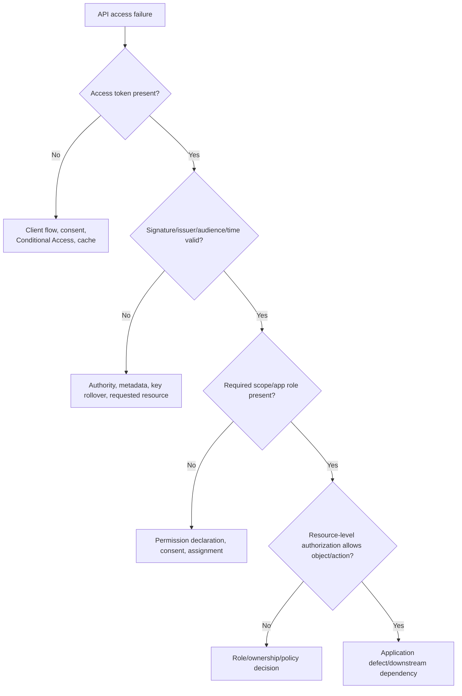

### Network vs identity

An identity failure still uses DNS, HTTPS, TLS, proxies, and time.

| Evidence | Boundary |
|----------|----------|
| Cannot resolve/reach login endpoint | DNS/network/proxy |
| TLS certificate error | TLS trust/inspection/time |
| Entra sign-in log with policy failure | Authentication/Conditional Access reached |
| Token returned but app rejects | Token validation/app configuration |
| API accepts token but denies object | Authorization |

### Safe diagnosis method

1. Find the exact failing phase and component.
2. Use correlation IDs to join client, Entra, proxy, and app evidence.
3. Compare with one working user/app/network while changing one variable.
4. Do not disable MFA, token validation, or Conditional Access globally to test.
5. Use report-only/pilot/narrow exclusions with approval and expiry.
6. Retest and confirm both success and preserved security controls.

> 💡 **Tie-in for any background:** Identity troubleshooting is another layered packet journey. The browser must reach the IdP, authentication and policy must succeed, the right token must return to the right client, and the right API must validate and authorize it. Locate the earliest failed boundary.

### Official Microsoft grounding used for this Part

- [Application and service principal objects](https://learn.microsoft.com/entra/identity-platform/app-objects-and-service-principals)
- [OpenID Connect on the Microsoft identity platform](https://learn.microsoft.com/entra/identity-platform/v2-protocols-oidc)
- [Managed identities for Azure resources](https://learn.microsoft.com/entra/identity/managed-identities-azure-resources/overview)
- [Microsoft Entra External ID FAQ](https://learn.microsoft.com/entra/external-id/customers/faq-customers)
- [Plan a Privileged Identity Management deployment](https://learn.microsoft.com/entra/id-governance/privileged-identity-management/pim-deployment-plan)
- [Conditional Access for workload identities](https://learn.microsoft.com/entra/identity/conditional-access/workload-identity)

---

## ⭐ Likely Interview Questions for This Section

**Q1. Compare authentication and authorization.**

> *Model answer:* Authentication verifies control of an identity; authorization decides what that principal may do to a resource. Entra can authenticate and issue claims, but the target API/application must validate the token and enforce scopes, roles, ownership, and business policy.

**Q2. What is the difference between an app registration and enterprise application?**

> *Model answer:* The app registration/application object is the global blueprint in its home tenant: client ID, redirect URIs, exposed permissions, and credentials. An enterprise application/service principal is the tenant-local instance used for assignments, consented permissions, access policy, and sign-ins.

**Q3. What does Conditional Access do?**

> *Model answer:* It evaluates signals such as user, target app, device state, location, risk, client, and authentication, then blocks or requires controls such as MFA strength or compliant device. I would pilot/report-only, preserve emergency access, inspect sign-in results, and avoid broad exclusions.

**Q4. Compare ID, access, and refresh tokens.**

> *Model answer:* An ID token tells a client about an authenticated user and supports local sign-in. An access token is addressed to an API and carries delegated scopes or app roles. A refresh token lets a client request new tokens under the grant/session policy. They are not interchangeable.

**Q5. Why is OAuth 2.0 not authentication, and what does OIDC add?**

> *Model answer:* OAuth authorizes a client to access a protected resource and issues access tokens for APIs. It does not standardize user sign-in identity. OIDC adds authentication semantics, the `openid` scope, ID token, discovery, user-info, and session/logout behavior.

**Q6. Compare OIDC, SAML, Kerberos, and LDAP.**

> *Model answer:* OIDC is modern web/mobile authentication over OAuth with ID tokens. SAML is browser federation using signed XML assertions. Kerberos is ticket-based network authentication common in AD DS. LDAP is a directory query/update protocol whose bind can authenticate a connection; it is not a universal authentication system.

**Q7. What is a managed identity?**

> *Model answer:* It is a workload identity assigned to supported Azure resources that obtains Entra access tokens without developer-managed credentials. System-assigned identity shares the resource lifecycle; user-assigned identity is independent and reusable. The target resource still needs a least-privilege role assignment.

**Q8. A user signs in but the API returns 403. How do you investigate?**

> *Model answer:* Confirm the API received an access token for its audience and validated signature, issuer, and time. Then check required delegated scope/app role, consent and assignment, tenant/user identity, and object-level authorization. A 403 after valid authentication usually points to authorization, not password/MFA.

---

## 🧠 30-Second Memory Hooks

- **Identify, authenticate, authorize, audit.**
- **Tenant is the identity boundary.**
- **App object is blueprint; service principal is tenant-local instance.**
- **MFA means different factor categories; phishing resistance varies.**
- **Conditional Access: signals -> policy -> grant control or block.**
- **ID token is for client sign-in; access token is for API.**
- **Issuer signs, audience receives, time limits, scope/role permits.**
- **OAuth authorizes; OIDC authenticates on top.**
- **SAML is browser XML federation; Kerberos is tickets; LDAP is directory access.**
- **Managed identity removes developer-managed credentials, not authorization.**
- **401 asks for valid authentication; 403 denies authorized action.**
- **Find the earliest failed identity phase and correlate IDs.**

---

*Next suggested section:* **[Part M - Wireshark & Systematic Troubleshooting](Part-M-wireshark-troubleshooting.md)**, which turns packet and identity flows into capture filters, display filters, evidence patterns, and a repeatable diagnostic method.