# Part M - Wireshark & Systematic Troubleshooting

> **Section goal:** capture and read packets responsibly, use correct Wireshark filters, recognize protocol and TCP patterns, and correlate network evidence with endpoint, firewall, proxy, identity, application, and Event Tracing for Windows (ETW) logs.

Covers index items **91-98**.

[Back to the master guide](../Networking%20Security%20and%20Azure%20Identity%20-%20Study%20Guide.md) | [Previous: Part L](Part-L-azure-identity-auth-protocols.md)

---

## Start Here: A Capture Is an Observation from One Place

A **packet capture** records network frames/packets visible at a capture point during a time range.

**Analogy:** one traffic camera records what passed one intersection. It can prove that a vehicle appeared there, but it cannot by itself prove what happened at every earlier or later intersection.

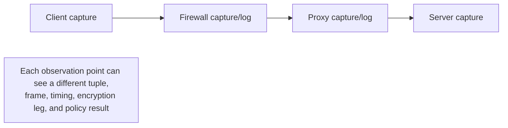

Wireshark is a packet-analysis interface. It does not fix networks automatically; it helps transform observed bytes, protocol structure, and timing into testable evidence.

---

## 91. What Packet Capture Can and Cannot Prove

### What a good capture can show

- Frames/packets observed at that interface and time
- Source/destination addresses and ports as visible there
- Protocol fields that are not encrypted
- Timing, order, sizes, flags, and acknowledgement progress
- DNS questions/answers when visible
- TCP handshakes, closes, resets, retransmission patterns, and windows
- TLS handshake metadata and alerts that are visible
- Unencrypted HTTP messages or decrypted traffic when keys/termination access are legitimately available

### What it cannot prove alone

- Packets that never reached the capture point
- What another interface/path observed
- Why a device dropped traffic without its logs/state
- Which process generated traffic unless correlated with endpoint evidence
- Encrypted application content without authorized keys/decryption
- Whether a TCP-acknowledged business transaction committed
- User intent or authorization policy
- The true cause of every Wireshark expert warning

### Observation language

Prefer precise statements:

| Weak conclusion | Evidence-grounded statement |
|-----------------|-----------------------------|
| "The server never replied" | "The client capture did not observe a reply during the measured interval" |
| "The firewall dropped it" | "SYN appears before the firewall but not after it; firewall log/counter is needed for cause" |
| "The network is slow" | "Round-trip time rose from 20 ms to 350 ms after hop/path change while server processing metric stayed stable" |
| "The app reset it" | "RST used the server-side address; process/proxy/firewall logs are needed to identify its generator" |

### Capture placement

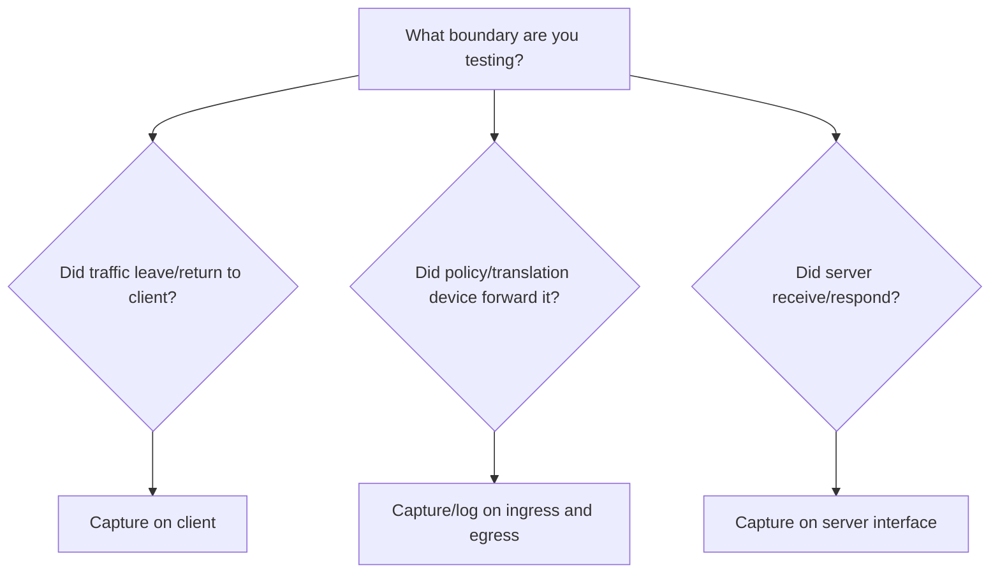

Simultaneous captures with synchronized clocks can isolate the boundary where a packet disappears or delay is introduced.

### Ethics, privacy, and authorization

Packet captures can contain credentials, tokens, cookies, personal data, messages, internal names, and business content.

Before capture:

1. Obtain authorization and define purpose.
2. Limit interface, hosts, ports, duration, and snapshot length where practical.
3. Avoid capturing unrelated users/traffic.
4. Protect files in transit and at rest.
5. Redact or sanitize before sharing.
6. Follow retention and deletion policy.
7. Never attempt TLS decryption without explicit authorization and appropriate key handling.

### Capture quality caveats

| Caveat | Effect |
|--------|--------|
| Capture drops | Missing packets can look like network loss |
| Truncated snapshot length | Payload/header fields may be incomplete |
| Switched Port Analyzer (SPAN)/mirror oversubscription | Monitoring port drops during bursts |
| Asymmetric routing | One capture sees only one direction |
| NIC offload | Host capture shows unusual checksums/large segments |
| Virtual switch/container path | Wrong interface misses traffic |
| Clock drift | Cross-system timing becomes misleading |
| Encryption | Application fields are unavailable |

> 🔍 **Plain-English deep dive: capture loss vs network loss**
>
> Network loss means the packet did not reach its intended path point. Capture loss means the packet may have traveled normally but the monitoring mechanism failed to record it. Check Wireshark capture-drop statistics, interface counters, endpoint ACK behavior, and another capture point before blaming the network.

---

## 92. Wireshark Interface, Capture Filters, Display Filters, and Profiles

### Main interface areas

| Area | Job |
|------|-----|
| Interface list | Select where to capture |
| Packet list | One-line summary per frame |
| Packet details | Expand decoded protocol fields |
| Packet bytes | Raw hexadecimal/character representation |
| Display filter bar | Select already-captured packets for view |
| Expert information | Summarize analysis notes/warnings/errors |
| Conversations/endpoints | Aggregate peers, bytes, packets, duration |
| Statistics/flow graph | Visualize protocol and timing relationships |

### Capture filter vs display filter

| Capture filter | Display filter |
|----------------|----------------|
| Applied while recording | Applied after packets are recorded |
| Uses Berkeley Packet Filter (BPF) style syntax | Uses Wireshark field syntax |
| Excluded traffic is never saved | Hidden traffic remains in capture |
| Reduces volume/sensitive collection | Supports rich protocol-field analysis |
| Example: `tcp port 443` | Example: `tcp.port == 443` |

Do not paste display-filter syntax into a capture-filter field.

### Useful capture-filter examples

```text
host 192.0.2.10
src host 192.0.2.10
dst host 203.0.113.20
net 10.0.0.0/8
tcp port 443
udp port 53
host 192.0.2.10 and (tcp port 443 or udp port 443)
not broadcast and not multicast
```

BPF capabilities vary by capture engine/link type. Test the filter and preserve the exact expression with case notes.

### Useful display-filter examples

```text
arp
icmp || icmpv6
ip.addr == 192.0.2.10
ipv6.addr == 2001:db8::10
tcp.port == 443
udp.port == 53
dns.qry.name == "www.example.com"
dns.flags.response == 1
tcp.flags.syn == 1 && tcp.flags.ack == 0
tcp.flags.reset == 1
tcp.stream eq 7
tcp.analysis.retransmission
tcp.analysis.duplicate_ack
tcp.analysis.zero_window
http.request
http.response.code >= 400
tls.handshake.type == 1
tls.alert_message
quic
```

Display-field names can vary with Wireshark version, protocol dissection, and encapsulation. Use autocomplete and inspect the field in Packet Details.

### Combining filters

- `&&` means AND.
- `||` means OR.
- `!` means NOT.
- Parentheses make grouping explicit.

```text
(ip.addr == 192.0.2.10) && (tcp.port == 443) && !tcp.analysis.retransmission
```

### Profiles

A Wireshark **profile** stores analysis preferences such as:

- Columns
- Coloring rules
- Display-filter buttons
- Protocol preferences
- Name-resolution settings
- Layout

Create purpose-specific profiles, for example:

| Profile | Helpful columns/buttons |
|---------|-------------------------|
| TCP | Stream, relative seq/ack, window, analysis flags |
| DNS | Query name/type, response code, answer, transaction ID |
| HTTP/TLS | Host/SNI, version, status, ALPN, alert |
| VPN | Outer/inner tuple, ESP/IKE fields, length |

### Name resolution

Wireshark can replace numeric addresses/ports with resolved names. This improves readability but can hide the exact observed value or generate additional DNS traffic during live analysis.

For forensic clarity:

- Preserve numeric address columns.
- Record whether name resolution was enabled.
- Do not assume a displayed hostname was present in the packet.

### 20-minute lab: DNS -> TCP -> TLS -> HTTPS

**Goal:** capture one controlled HTTPS request and prove each observable stage without attempting to decrypt content.

**Safety:** use only your own device and the public documentation domain `example.com`. Close unrelated applications where practical, capture for less than one minute, and delete or protect the capture under your local policy.

#### Prerequisites

- Wireshark installed with permission to capture on your active interface
- Windows PowerShell or Command Prompt
- Internet access
- No credentials or private application data in the test

#### Step 1: identify the active interface

Run:

```powershell
Get-NetIPConfiguration | Where-Object IPv4DefaultGateway
```

In Wireshark, choose the matching Ethernet or Wi-Fi interface. Activity graphs help confirm the active one.

#### Step 2: apply a narrow capture filter

Enter this in the **capture filter** field before starting:

```text
port 53 or tcp port 443
```

This records classic DNS plus TCP 443 traffic. It intentionally excludes HTTP/3 over UDP 443 so the lab shows a TCP handshake. Other applications can still generate matching traffic, which is why the display filters later narrow by name and stream.

#### Step 3: start capture and generate known traffic

Start Wireshark, then run:

```powershell
nslookup example.com
curl.exe --http1.1 -v --connect-timeout 10 https://example.com/
```

Stop the capture as soon as `curl` completes. Record the exact start/end time and any proxy shown by verbose output.

If your environment requires an explicit proxy, the TCP destination may be the proxy rather than `example.com`; that is valid and becomes part of the lesson.

#### Step 4: isolate DNS

Apply this **display filter**:

```text
dns.qry.name == "example.com"
```

Expected observations:

1. A DNS query for an A and/or AAAA record.
2. A response with the same transaction ID.
3. A response code, answer(s), and TTL.
4. Source/destination UDP ports commonly using destination 53; TCP DNS is also valid.

If no DNS packet appears, `nslookup` may have used a different suffix/name, encrypted DNS, or the capture/interface/filter may be wrong. Inspect `nslookup` output and temporarily use display filter `dns` to find the exact query. Do not assume DNS failed merely because the intended query is absent from this capture.

#### Step 5: identify the TCP connection

Select the address used by `curl`, then apply:

```text
tcp.port == 443 && tcp.flags.syn == 1
```

Find the SYN initiated at the recorded time. Select it and note its `tcp.stream` number. Replace `N` below with that number:

```text
tcp.stream eq N
```

Expected opening sequence:

```text
Client -> server/proxy: SYN
Server/proxy -> client: SYN, ACK
Client -> server/proxy: ACK
```

Record:

- Client ephemeral source port
- Destination IP and port
- Initial round-trip estimate from SYN to SYN-ACK
- MSS, window scale, SACK-permitted, and timestamp options when present

#### Step 6: inspect TLS

Within the stream, apply or inspect:

```text
tls.handshake.type == 1 || tls.handshake.type == 2 || tls.alert_message
```

Expected observations:

- ClientHello from the client
- ServerHello from the remote TLS endpoint
- SNI `example.com` if visible and sent
- ALPN offering/selection such as `http/1.1`
- TLS version/cipher-suite negotiation
- Protected TLS records after the handshake

With TLS 1.3, much of the handshake after ServerHello is encrypted. A normal unaided capture may not display the server certificate or HTTP request, and that is expected.

Useful display filters include:

```text
tls.handshake.type == 1
tls.handshake.extensions_server_name == "example.com"
tls.alert_message
```

If a proxy performs TLS inspection, the observed TLS peer/certificate issuer belongs to that managed proxy leg rather than necessarily the public origin.

#### Step 7: prove HTTP is protected

Try:

```text
http.request || http.response
```

For ordinary undecrypted HTTPS, this should return no HTTP/1.1 request/response packets even though `curl` reports HTTP success. Return to the stream filter and observe TLS Application Data records instead.

This demonstrates:

- The TCP/IP metadata remains visible.
- TLS handshake metadata is partly visible.
- HTTP method, path, headers, and body are protected after negotiation.

#### Step 8: inspect closure

Apply:

```text
tcp.stream eq N && (tcp.flags.fin == 1 || tcp.flags.reset == 1)
```

You may see a FIN-based graceful close, an RST, or no close if a proxy/client keeps the connection alive beyond the capture. Describe only what was observed.

#### Expected packet-story diagram

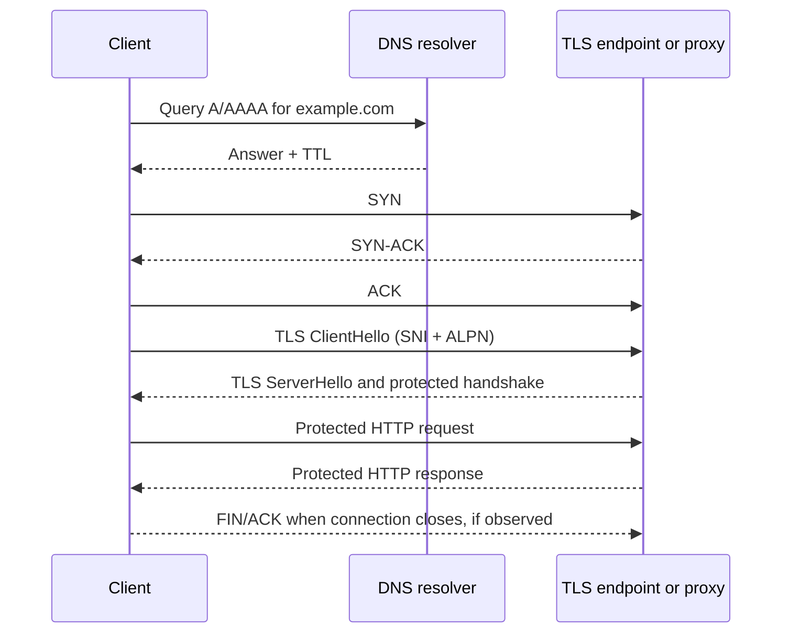

#### Lab questions

1. Which resolver answered, and which A/AAAA records and TTLs were returned?
2. Did the TCP destination equal an `example.com` DNS answer or a proxy address?
3. What client ephemeral port and destination port formed the TCP tuple?
4. Did SYN/SYN-ACK/ACK complete, and what approximate handshake RTT did the capture show?
5. Which SNI and ALPN values were offered/selected?
6. Why can `curl` show HTTP 200 while `http.request` shows nothing in Wireshark?
7. Did the connection close with FIN, RST, or remain open during the capture?
8. What can this capture not prove about the origin server or application?

<details>
<summary>Lab answer guide</summary>

1. Read the DNS response source, answer records, response code, and per-record TTL. Values vary by resolver, location, and time.
2. A direct connection should target one selected service address. An explicit proxy connection targets the proxy; CONNECT/proxy logs or packet content before TLS can identify the requested origin.
3. The client source is a temporary high port; destination is TCP 443 for a direct HTTPS/TLS connection, or the configured proxy port for an explicit proxy leg.
4. The three handshake packets prove transport establishment at that time. Approximate RTT is SYN-to-SYN-ACK at the client capture, subject to capture timing.
5. SNI should identify `example.com` when visible; ALPN should be consistent with forced HTTP/1.1, though proxy/TLS-stack behavior can vary.
6. HTTPS carries HTTP inside protected TLS records. `curl` is a TLS endpoint and can read decrypted HTTP; an ordinary passive capture cannot.
7. Report the actual flags and direction. Absence of closure only means it was not observed before capture stopped.
8. It cannot prove unseen path behavior, server internal processing, authorization, or unobserved packets. If a proxy terminates TLS, it also does not show the separate proxy-to-origin leg.

</details>

#### Lab completion checkpoint

You can move on when you can point to evidence for DNS answer, TCP handshake, TLS negotiation, and protected application data, while stating at least two things the capture cannot prove.

---

## 93. Reading Ethernet, ARP, IP, ICMP, TCP, UDP, DNS, HTTP, and TLS

Read a packet from outside inward, then place it in conversation context.

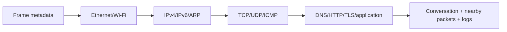

### Frame and Ethernet

Check:

- Capture timestamp and frame length vs captured length
- Source/destination MAC
- VLAN tag if present
- EtherType indicating IPv4, IPv6, ARP, and so on
- Frame check sequence availability (often not captured by host NIC)

A destination MAC identifies the next local hop, not necessarily the final IP destination.

### ARP

For an ARP request/reply, inspect:

- Opcode: request or reply
- Sender protocol (IPv4) and hardware (MAC) addresses
- Target IPv4 and target MAC
- Repeated unanswered requests
- Conflicting replies for the same IP

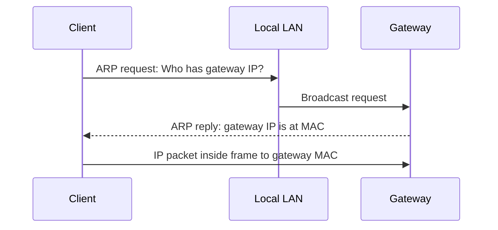

### IPv4/IPv6

Check:

- Source/destination IP
- Header length and total/payload length
- TTL or Hop Limit
- Next protocol/header
- Fragmentation fields/extension headers
- Differentiated Services/ECN when relevant

TTL is not elapsed time. It is a hop budget reduced by routers.

### ICMP/ICMPv6

Inspect Type and Code, quoted original packet, and MTU information where provided.

| Message | Meaning clue |
|---------|--------------|
| Echo request/reply | Ping-style reachability exchange |
| Destination unreachable | Routing, host, port, policy, or fragmentation clue depending on code |
| Time exceeded | TTL/Hop Limit expired; traceroute evidence |
| Packet Too Big | IPv6 Path MTU signal |
| Neighbor Solicitation/Advertisement | IPv6 neighbor discovery |

An ICMP error often contains part of the packet that triggered it, letting you identify the failed flow.

### TCP

Check:

- Stream number and five-tuple
- SYN/SYN-ACK/ACK sequence
- Relative/absolute sequence and acknowledgement numbers
- Flags and payload length
- Advertised window and scaling
- MSS, SACK, timestamps
- RTT estimates and ACK progress
- FIN/RST source and timing
- Analysis flags in context

### UDP

Check:

- Five-tuple and datagram length
- Request/response transaction identifier in upper protocol
- ICMP errors
- Repetition/retry timing
- Fragmentation/size

UDP has no transport ACK. A response is application-protocol evidence, not a UDP acknowledgement.

### DNS

Check:

- Transaction ID and request/response flag
- Query name, type, and class
- Response code: `NOERROR`, `NXDOMAIN`, `SERVFAIL`, `REFUSED`, and others
- Answer, authority, additional sections
- TTL and CNAME chain
- Truncation flag and TCP retry
- Resolver address and response time

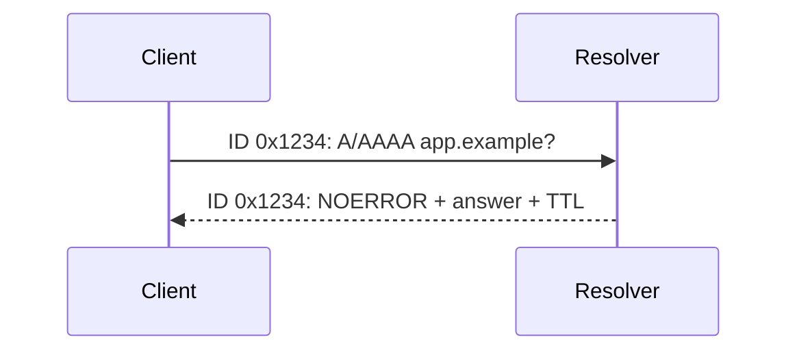

`NOERROR` with no desired answer and `NXDOMAIN` are different. `SERVFAIL` means the resolver failed to complete processing, not that the name is proven nonexistent.

### HTTP

When visible/decrypted, inspect:

- Request method, host/authority, path, headers, body length
- Status code, response headers, body type
- Redirect `Location`
- Proxy/WAF/CDN identifiers and request IDs
- Timing from request to first/last response byte
- Authentication challenges without exposing credentials/tokens

### TLS

Inspect visible handshake fields:

- ClientHello SNI where visible
- Supported/selected versions and cipher suite
- ALPN
- Server certificate chain when visible in that handshake/version
- Alerts and which endpoint sent them
- Session resumption behavior
- Record sizes/timing after encryption

A TLS Application Data label does not reveal whether the encrypted content is HTTP, a token, or a particular business action.

---

## 94. Following Streams, Handshakes, and Expert Information

### Follow stream

Wireshark can reconstruct data for a selected TCP, UDP, TLS, HTTP, HTTP/2, QUIC, or supported protocol stream where dissection permits.

Use it to:

- Isolate one conversation
- Inspect direction and order
- Read unencrypted application exchanges
- Export authorized payload evidence
- Create a stream-specific display filter

Follow Stream is not proof that captured order equals application processing order; TCP reassembly, capture gaps, and multiplexed protocols matter.

### TCP handshake checklist

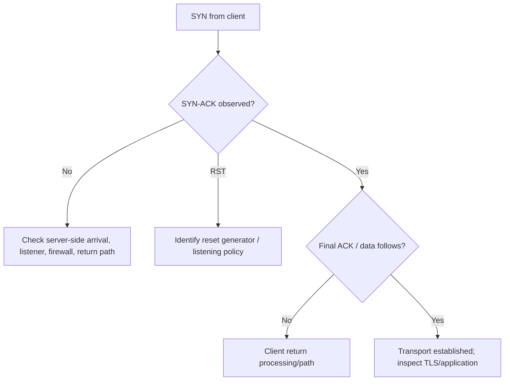

Record retransmitted SYN timing and whether the server sees the same attempts. A single-side capture cannot locate the drop.

### TLS handshake checklist

1. Did TCP/QUIC establishment reach TLS?
2. Is ClientHello sent, and with expected SNI/version/ALPN?
3. Does a ServerHello or alert return?
4. Which protocol/cipher was selected?
5. Is a certificate chain presented/validated by client?
6. Which side sends first alert or closes?
7. Is a proxy/inspection certificate expected?
8. Does protected application data begin?

### Expert Information

Wireshark Expert Information categorizes protocol observations as chat, note, warning, or error.

It is a triage list, not a root-cause engine.

| Expert item | Why caution is needed |
|-------------|-----------------------|
| Retransmission | Could reflect actual loss, capture loss, path asymmetry, or timing heuristic |
| Previous segment not captured | Could be capture started late or packets missed |
| Out-of-order | Could be real reordering or capture/interface ordering |
| Bad checksum | Often transmit checksum offload on host capture |
| TCP window full/zero | Needs receiver window scaling and application context |
| Malformed packet | Could be truncation, unsupported encapsulation, or genuine invalid input |

### Useful statistics

| Wireshark view | Question answered |
|----------------|-------------------|
| Endpoints | Which addresses transferred traffic? |
| Conversations | Which pairs/flows, bytes, duration? |
| Protocol Hierarchy | Which protocol mix was decoded? |
| I/O Graph | When did rates, loss indicators, or latency change? |
| Flow Graph | What was message order among endpoints? |
| TCP Stream Graphs | Sequence progress, RTT, throughput, window behavior |
| Service Response Time | How long did supported request/response protocols take? |

### Time references

Set a time reference on a key packet and display relative time to explain:

- DNS duration
- TCP handshake duration
- TLS handshake duration
- Request-to-first-byte delay
- Retransmission timeout intervals
- Idle period before RST/FIN

Separate network RTT from application think time whenever possible.

---

## 95. Retransmissions, Duplicate ACKs, Resets, Zero Windows, and Fragmentation

### TCP loss/recovery pattern

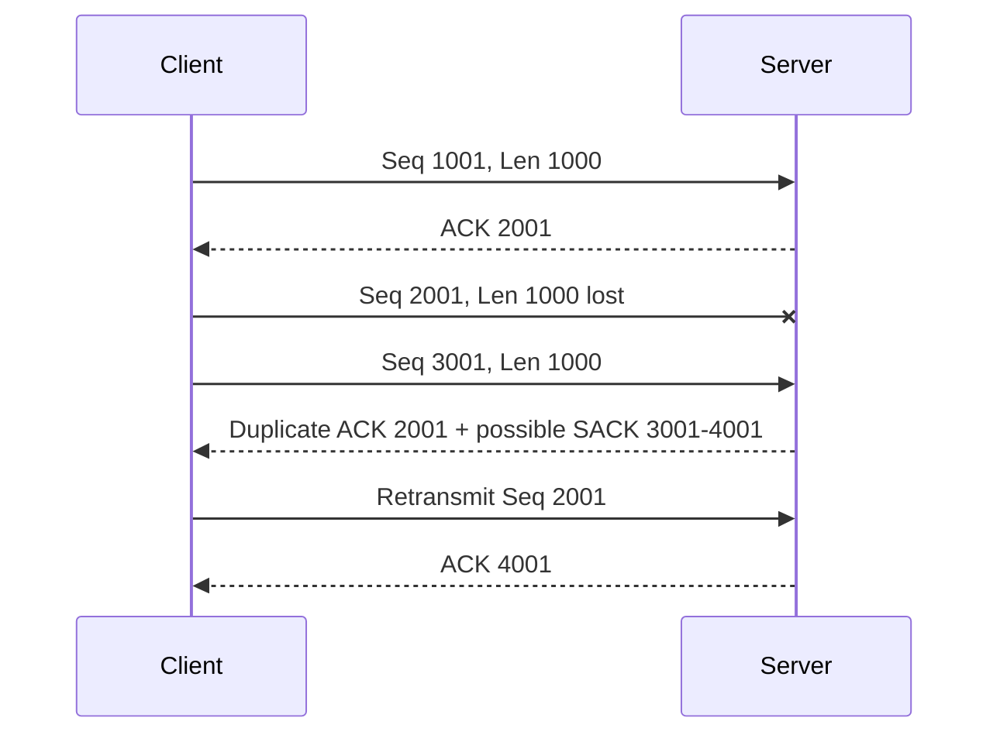

Questions:

1. Which direction lost progress?
2. Is loss seen at both capture points?
3. Did SACK show later data arrived?
4. Was retransmission fast or timer-driven?
5. Did RTT/congestion window/throughput change?
6. Could the capture itself have dropped packets?

### Duplicate ACK

A duplicate ACK commonly repeats the same next expected sequence number because later data arrived while a gap remains. It can also appear from reordering or duplicate packets. Count and sequence context matter.

### RST

An RST aborts a TCP connection.

Investigate:

- Exact endpoint/address that emitted it at this capture point
- Whether SYN hit a closed port
- Whether proxy/firewall generated it
- Application/process logs at same time
- Idle timeout or backend pool removal
- Sequence acceptability and stale connection state

An address can belong to a load balancer, NAT, or proxy, so source IP alone may not identify the originating software.

### Zero Window

The receiver advertises no available buffer space.

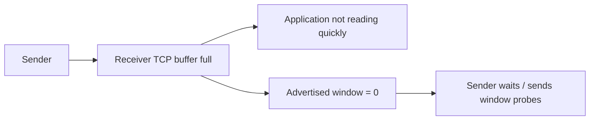

Check receiver process CPU, pause/deadlock, downstream storage, backpressure, and memory. Network bandwidth is not the first suspect.

### Window Full vs Zero Window

- **TCP Window Full** is Wireshark inference that sent data reached the currently advertised limit.
- **TCP Zero Window** is an explicit receiver advertisement of zero.
- **Zero Window Probe** tests whether the window reopened.

### Fragmentation

IPv4 routers may fragment packets when allowed; IPv6 routers do not fragment transit packets and use ICMPv6 Packet Too Big for the sender.

Capture clues:

- IPv4 More Fragments flag and fragment offset
- Reassembled packet references
- ICMP fragmentation-needed / ICMPv6 Packet Too Big
- Large packets absent after a path boundary
- Small exchanges work while large transfers fail

Fragment loss prevents reassembly of the whole original packet. Firewalls may handle fragments cautiously because later fragments lack the full transport header.

### Checksum offload

On a sending host, the capture may occur before the NIC fills the final TCP/UDP/IP checksum, causing Wireshark to mark it bad. If the remote host receives/ACKs the packet, it was not sent with a fatal bad checksum.

Similarly, segmentation/coalescing offload can make host captures show unusually large TCP segments or different packet grouping than the wire.

---

## 96. A Layer-by-Layer Troubleshooting Method

Start with a precise symptom:

> "From managed Windows client X at 10:03 UTC, `https://app.example.com/orders` times out after 30 seconds through proxy P; another user on the same network succeeds."

Then use an evidence loop:

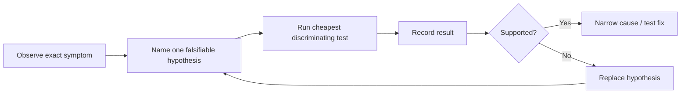

### Layer checklist

| Stage | Question | Evidence examples |
|-------|----------|-------------------|
| Scope | Who/what/when/how often? | Reproduction matrix, exact timestamp |
| Physical/link | Is interface connected and framing healthy? | Link state, Wi-Fi, interface errors, ARP/ND |
| Addressing | Correct IP/prefix/gateway/DNS? | Interface configuration, DHCP lease |
| Routing | Which route/next hop wins both ways? | Route table, traceroute, multi-point capture |
| Name resolution | Correct name, type, resolver, answer, TTL? | DNS packets/cache/server logs |
| Policy/translation | Which firewall/proxy/NAT rule acted? | Original/translated tuple, session log |
| Transport | Handshake, ACK progress, window, close? | TCP/UDP capture and socket state |
| TLS | Version, SNI, ALPN, certificate, alert? | TLS capture/client diagnostics/proxy logs |
| Identity | Which principal, policy, token audience/permission? | Entra sign-in and app logs |
| HTTP/app | Method/status/timing/request ID? | HTTP trace, reverse-proxy/app logs |
| Dependency | Did app wait on DB/API/storage? | Distributed traces and dependency metrics |

### Baseline and differential diagnosis

Compare failing and working cases with one changed variable:

- Same user, different device
- Same device, different network
- Same network, different destination
- Same destination, direct vs proxy
- Same flow, HTTP/2 vs HTTP/3
- Same app, one backend/region vs another

A broad difference list produces speculation. One controlled difference creates discrimination.

### Localize delay

For a web request, measure separately:

$$
T_{total} = T_{DNS} + T_{connect} + T_{TLS} + T_{request/queue} + T_{server/dependency} + T_{transfer}
$$

These can overlap with reuse and parallelism, so treat the equation as a decomposition model rather than blindly adding every browser timing field.

### Evidence table habit

| Time | Observation point | Observed fact | Supports/refutes |
|------|-------------------|---------------|------------------|
| 10:03:01.120 | Client capture | DNS answer `203.0.113.20` in 18 ms | Refutes DNS timeout |
| 10:03:01.141 | Client capture | SYN to proxy; SYN-ACK in 12 ms | Refutes client-proxy TCP failure |
| 10:03:01.170 | Proxy log | CONNECT allowed; upstream connect starts | Refutes category block |
| 10:03:31.171 | Proxy log | Upstream connect timeout | Supports proxy-to-origin path/listener issue |

---

## 97. Ping, Tracert, Ipconfig, Nslookup, Curl, and Connection Tools

Commands are evidence probes. Know what each does and does not prove.

### Windows-oriented quick reference

| Command | Main question |
|---------|---------------|
| `ipconfig /all` | Interface addresses, DHCP, gateway, DNS, suffix |
| `Get-NetIPConfiguration` | Structured PowerShell interface configuration |
| `route print` / `Get-NetRoute` | Which routes and metrics exist? |
| `arp -a` / `Get-NetNeighbor` | Which ARP/neighbor mappings exist? |
| `ping <host>` | Does ICMP echo exchange work and with what RTT/loss? |
| `tracert <host>` | Which TTL-expiring hops respond? |
| `pathping <host>` | Multi-hop probing/loss estimate over time |
| `nslookup <name> <server>` | Basic DNS query against chosen resolver |
| `Resolve-DnsName <name> -Type A` | Structured DNS result |
| `Test-NetConnection <host> -Port 443` | DNS/route/TCP-connect-oriented Windows test |
| `curl.exe -v https://host/path` | HTTP/TLS/proxy transaction details |
| `netstat -ano` / `Get-NetTCPConnection` | Local sockets and owning Process Identifier (PID)/state |
| `pktmon` | Windows packet/stack collection and counters |
| `netsh trace` / ETW tooling | Windows network event tracing where applicable |

### Linux/macOS equivalents

| Command | Main question |
|---------|---------------|
| `ip addr`, `ip route`, `ip neigh` | Address, route, neighbor state |
| `ping`, `traceroute` / `tracepath` | Reachability/path/MTU clues |
| `dig`, `host` | DNS details |
| `curl -v` | HTTP/TLS/proxy exchange |
| `ss -tanp` | Socket state/process context |
| `tcpdump` | Command-Line Interface (CLI) packet capture |
| `openssl s_client` | TLS handshake/certificate diagnostics when installed |

### Example diagnostic probes

```powershell
Resolve-DnsName app.example.com -Type A
Test-NetConnection app.example.com -Port 443 -InformationLevel Detailed
curl.exe -v --connect-timeout 10 https://app.example.com/health
Get-NetRoute -AddressFamily IPv4 | Sort-Object DestinationPrefix
Get-NetTCPConnection -RemotePort 443
```

These are examples; use only authorized targets and avoid putting credentials/tokens into shell history.

### Interpretation cautions

| Test result | Does prove | Does not prove |
|-------------|------------|----------------|
| Ping succeeds | ICMP request/reply path worked | TCP 443/app works |
| Ping fails | No echo reply observed | Host/service is down |
| TCP connect succeeds | Transport handshake to that endpoint/port | TLS/HTTP/auth works |
| DNS query succeeds | Resolver returned an answer | Answer is reachable/correct for every client |
| Curl gets 401 | HTTP/TLS reached responder | User is authorized |
| Traceroute has `*` | Hop did not return expected probe response | Forwarding stopped there |

### Capture before and during reproduction

1. Synchronize clock and note timezone.
2. Select correct interface(s).
3. Apply narrow authorized capture filter.
4. Start capture before the failure begins.
5. Reproduce once with exact timestamp.
6. Stop promptly.
7. Save original read-only evidence and analyze a copy.
8. Record commands, filters, topology, and capture point.

---

## 98. Correlating Packets with Firewall, Proxy, Identity, App, and ETW Logs

Packets show network events. Logs explain policy, process, and application decisions.

### Correlation keys

| Key | Use | Limitation |
|-----|-----|------------|
| Timestamp | Align events | Clock skew/time zones |
| Five-tuple | Match flow | NAT/proxy changes tuple |
| NAT translation | Link internal/external tuples | Mapping expires; needs exact time |
| User/device ID | Link policy identity | Shared devices/stale mapping |
| HTTP request/trace ID | Link proxy/app/dependencies | Must propagate consistently |
| TLS session/connection context | Link secure leg | Proxy creates separate legs |
| Process Identifier (PID)/socket | Link endpoint process | PID can be reused; use time/process identity |
| Entra correlation/request ID | Link sign-in attempt | Must capture exact failed attempt |
| ETW Activity ID | Link Windows events | Provider propagation/configuration varies |

### End-to-end correlation example

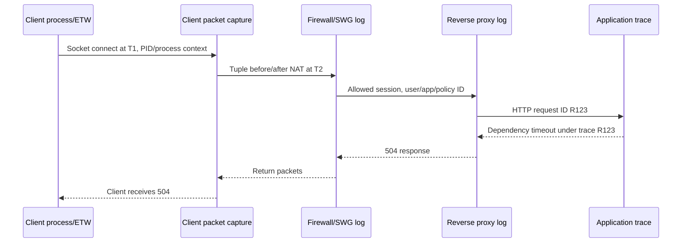

### Correlation workflow

1. Normalize all timestamps to UTC while preserving originals.
2. Anchor on one exact reproduction/request.
3. Identify client process and pre-translation tuple.
4. Map NAT/proxy tuples at each leg.
5. Carry request/trace IDs from HTTP edge to application dependencies.
6. Join identity policy through user/device and Entra correlation ID.
7. Build an ordered timeline of observed facts.
8. Mark gaps explicitly instead of guessing.

### ETW

**Event Tracing for Windows (ETW)** is a high-performance Windows event infrastructure. Providers emit timestamped events that consumers record/analyze.

Network-related ETW can add evidence not visible in packets:

- Socket API and process context
- Windows Filtering Platform decisions
- TCP/IP stack state and errors
- DNS client behavior
- HTTP stack events
- WinINet/WinHTTP/proxy behavior
- TLS/Schannel events
- Network profile/connectivity changes

Provider names, fields, and capture methods vary by Windows version and scenario. Collect narrowly and protect traces as sensitive data.

### Packet vs ETW example

| Packet evidence | ETW/log evidence | Combined conclusion |
|-----------------|------------------|---------------------|
| SYN sent, no reply observed | Windows Filtering Platform (WFP) block event names rule/filter | Local policy blocked before/at stack boundary |
| RST from local address | Process/socket close event | Owning process aborted connection |
| DNS query absent | DNS client cache-hit event | Name came from cache, not wire |
| 407 response | WinHTTP proxy auth event | Proxy identity negotiation failed |
| TLS alert | Schannel status/certificate error | Exact trust/protocol cause narrowed |

### Existing advanced companion

After mastering this Part, use the workspace's [Windows TCP Socket Flow and ETW Correlation](../TCP-Socket-Flow-and-ETW-Correlation.md) note for a source-grounded deep dive into Windows sockets, the Ancillary Function Driver for Winsock (AFD), TCP/IP, and ETW event paths.

### Final evidence standard

A strong technical conclusion states:

- **Symptom:** exact failed behavior
- **Scope:** affected and unaffected cases
- **Timeline:** ordered, normalized events
- **Boundary:** earliest component where expected behavior diverges
- **Mechanism:** how that divergence produces the symptom
- **Evidence:** packets/logs/counters supporting it
- **Contradictions considered:** plausible alternatives and disconfirming checks
- **Fix/verification:** narrow change and post-fix evidence

> 💡 **Tie-in for any background:** Packet analysis is disciplined storytelling with timestamps. Each packet is one observed fact; topology, logs, and controlled comparisons connect those facts into a defensible explanation.

---

## ⭐ Likely Interview Questions for This Section

**Q1. What can a packet capture prove?**

> *Model answer:* It proves that recorded packets were visible at a specific capture point and time, with the shown fields. It cannot prove what an unobserved interface saw, why a device dropped traffic, or what encrypted content meant. I state capture location, clock, filter, drops, offload, and path limitations.

**Q2. Compare capture and display filters.**

> *Model answer:* Capture filters use BPF-style syntax while recording and excluded traffic is never saved, such as `tcp port 443`. Display filters use Wireshark fields after capture and only hide packets, such as `tcp.port == 443`. They use different syntax and purposes.

**Q3. How do you analyze a TCP handshake failure?**

> *Model answer:* Filter the exact five-tuple and locate SYN. If no SYN-ACK/RST appears, compare captures before/after policy devices and at server, then check listener, route, NAT, and return path. A client-only capture proves no response was observed, not where it disappeared.

**Q4. Are Wireshark retransmission warnings proof of network loss?**

> *Model answer:* No. They are analysis based on observed sequence behavior and may reflect real loss, capture drops, late capture start, asymmetry, reordering, or offload. I inspect sequence/ACK/SACK timing, capture statistics, interface counters, and another observation point.

**Q5. What does TCP Zero Window mean?**

> *Model answer:* The receiver explicitly advertised no current receive-buffer space. The sender pauses and may probe. I investigate whether the receiving application is draining data, along with CPU, downstream blocking, memory, and window scaling, rather than first blaming bandwidth.

**Q6. Why might Wireshark show bad TCP checksums on a healthy host?**

> *Model answer:* Transmit checksum offload can cause capture before the NIC calculates the final checksum. Remote receipt/ACK and offload settings distinguish this from an on-wire bad checksum. Segmentation/coalescing offloads can also change packet appearance.

**Q7. How do you troubleshoot "a website is slow"?**

> *Model answer:* Define exact URL/user/time, then separate DNS, connect, TLS, proxy queue/upstream, request-to-first-byte, server dependency, and transfer time. Compare a working case, use packets for transport timing, and correlate request IDs with proxy/app/dependency logs.

**Q8. How do you correlate a packet capture with logs?**

> *Model answer:* Normalize timestamps, anchor one reproduction, identify client process and tuple, map NAT/proxy tuple changes, propagate HTTP trace/request IDs, link identity with user/device and Entra correlation ID, then build a factual timeline and mark missing evidence explicitly.

---

## 🧠 30-Second Memory Hooks

- **A capture is one camera at one place and time.**
- **Observed absence is not global absence.**
- **Capture filter records less; display filter shows less.**
- **BPF: `tcp port 443`; display: `tcp.port == 443`.**
- **Read outside in: frame -> link -> IP -> transport -> application.**
- **Expert Information suggests; it does not conclude.**
- **Duplicate ACK points to a gap; prove whether gap is network or capture.**
- **Zero Window points to receiver capacity/application progress.**
- **Bad checksum on sender can be offload.**
- **One changed variable makes a useful comparison.**
- **Packets show movement; logs show decisions.**
- **Timestamp + tuple + translation + trace ID builds the timeline.**

---

*Next suggested section:* **[Part N - Applied Architecture & Troubleshooting Scenarios](Part-N-applied-scenarios.md)**, which combines every layer into user-to-SaaS, internet-to-app, secure-access, packet-reading, and interview-whiteboard cases.