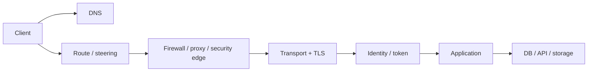
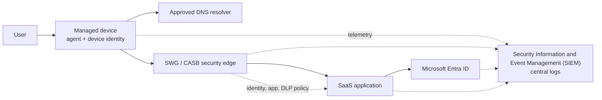
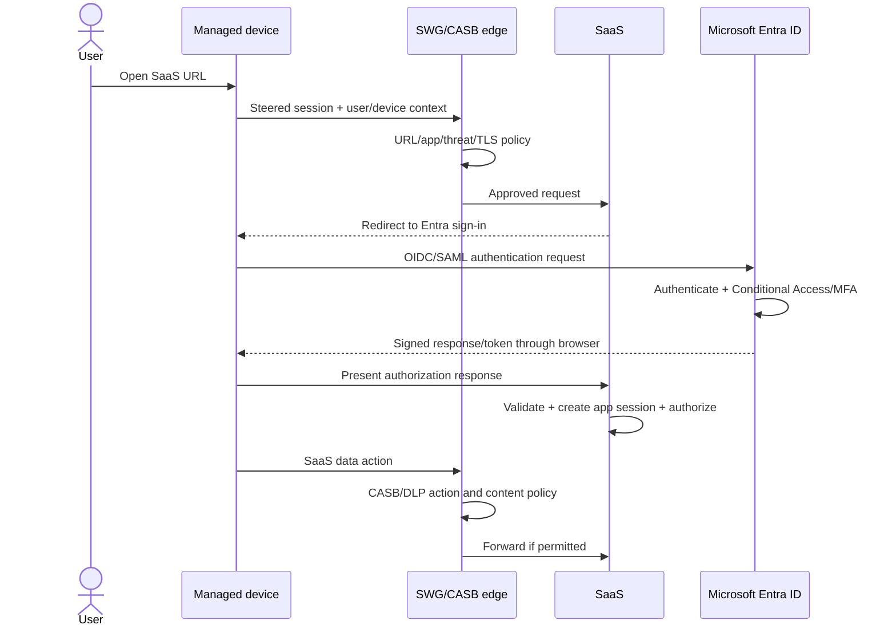
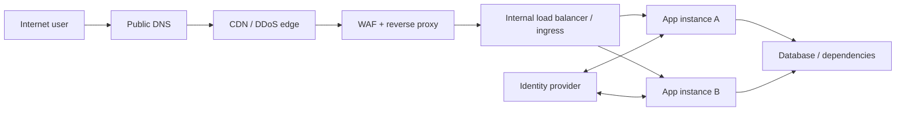
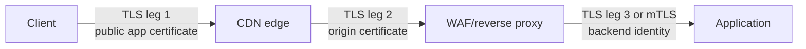
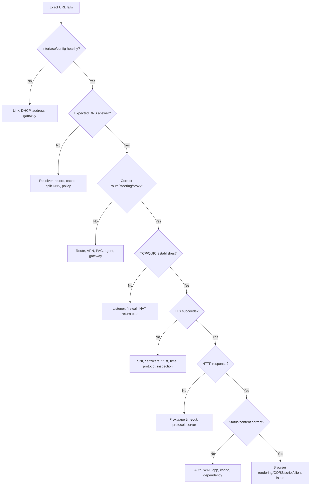
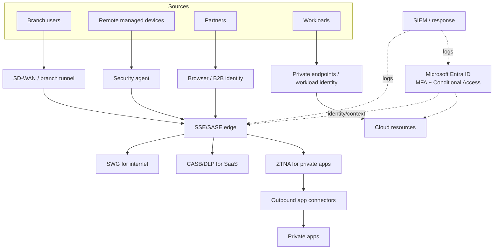
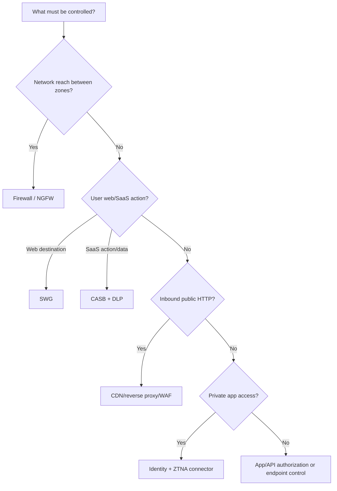
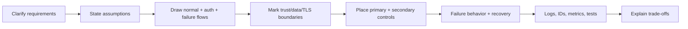
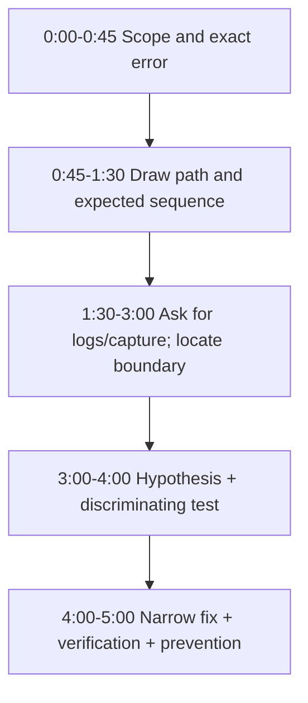

# Part N - Applied Architecture & Troubleshooting Scenarios

> **Section goal:** combine networking, web, TLS, proxy, security, identity, VPN, and packet evidence into clear end-to-end designs and defensible interview answers.

Covers index items **99-106**.

[Back to the master guide](../Networking%20Security%20and%20Azure%20Identity%20-%20Study%20Guide.md) | [Previous: Part M](Part-M-wireshark-troubleshooting.md)

---

## Start Here: Always Draw the Actual Path

Most advanced networking questions are several simple stages connected together.

Before diagnosing or designing, identify:

1. Client/user/workload
2. Name resolution
3. Route and traffic steering
4. Network/security intermediaries
5. Transport and TLS legs
6. Identity/token flow
7. Application and dependencies
8. Return path and logs



**Analogy:** an airport journey includes booking, travel to airport, security, boarding, flight, immigration, and baggage. "The trip failed" is too vague; identify the earliest stage that did not produce its expected output.

---

## 99. User-to-SaaS Through DNS, SWG, TLS, and Identity

### Reference architecture



### Step-by-step flow

Suppose a managed employee opens `https://crm.example-saas.com`.

1. Device obtains network configuration and effective SWG steering policy.
2. Browser or agent determines that the destination uses the SWG.
3. Client and/or SWG resolves the SaaS name, depending on proxy method.
4. Client establishes connection to the selected SWG edge.
5. SWG authenticates/maps user and device, then evaluates destination/app policy.
6. For HTTPS, the SWG either tunnels TLS or performs authorized inspection with separate TLS legs.
7. SWG connects to the SaaS edge.
8. SaaS redirects the browser to Microsoft Entra ID for sign-in.
9. Entra authenticates user and evaluates Conditional Access, device, MFA, and risk.
10. Entra returns an OIDC/SAML response to the SaaS through the browser.
11. SaaS validates it, creates an application session, and authorizes access.
12. During uploads/downloads, SWG/CASB/DLP may evaluate action, app tenant, content, and destination.



### Control ownership

| Decision | Likely owner/control |
|----------|----------------------|
| Is destination malicious/prohibited? | SWG URL/reputation/threat policy |
| Is SaaS sanctioned and corporate tenant required? | CASB/SWG app control |
| Is user/device allowed to sign in? | Entra Conditional Access |
| Is assertion/token valid? | SaaS/OIDC/SAML validation |
| May user read this CRM object? | SaaS authorization |
| May confidential data be uploaded? | DLP + SaaS authorization/data policy |

### Troubleshooting matrix

| Symptom | Earliest likely boundary | Evidence |
|---------|--------------------------|----------|
| Name not resolved | Client/SWG DNS | Query, resolver, response code/answer |
| Agent cannot select edge | Steering/control service | Agent logs, route, edge health |
| SWG block page | SWG policy | User/device/app/category/rule ID |
| Certificate issuer unexpected | TLS inspection/bypass | Chain, SNI, policy, managed trust |
| Entra sign-in blocked | Authentication/Conditional Access | Correlation ID and sign-in log |
| SaaS says invalid assertion | Federation/token validation | Issuer, audience, time, signing key, reply URI |
| Sign-in succeeds but record denied | SaaS authorization | Role/group/object policy |
| Download blocked only | CASB/DLP action policy | File classification, device, rule/action |

### Design cautions

- Avoid double TLS inspection by overlapping VPN, endpoint, SWG, and firewall services.
- Decide whether DNS occurs on client or edge and support private/split names deliberately.
- Keep Entra endpoints reachable during bootstrap and recovery.
- Preserve privacy with scoped decryption, logging, and retention.
- Correlate device session, SWG transaction, Entra sign-in, and SaaS request IDs.

---

## 100. Internet-to-Web-App Through CDN, WAF, Proxy, and Application Tiers

### Reference architecture



### Request path

1. Public DNS returns CDN/edge addresses, often anycast.
2. Client establishes TCP/TLS or QUIC/TLS to the edge.
3. CDN applies DDoS controls and serves a valid cache hit or forwards to origin.
4. WAF parses HTTP and applies managed/custom/bot/rate/schema policy.
5. Reverse proxy normalizes request, attaches trusted forwarding/request-ID metadata, and selects upstream.
6. Internal load balancer selects a healthy application instance.
7. Application authenticates/authorizes and calls dependencies.
8. Response returns through layers; each can cache, transform, compress, or reject according to policy.

### TLS legs and trust



Each TLS leg needs:

- Correct endpoint identity/SAN
- Trusted issuing chain
- Private-key protection
- Version/algorithm policy
- Certificate rotation
- Monitoring for expiry/handshake failures

"HTTPS at the browser" does not prove every backend leg is protected.

### Source identity and forwarding headers

At every public edge:

1. Strip or normalize client-supplied `Forwarded`/`X-Forwarded-*` headers.
2. Add verified connection-source information.
3. Allow origin access only from trusted edge/reverse proxy paths.
4. Configure backend to trust only known hops.
5. Prefer authenticated workload identity/mTLS between critical service tiers.

### Cache security

Cache key should account for relevant host, path, query, headers, encoding, and authenticated/personalized context. Sensitive responses should have correct `Cache-Control` and must not be served across users.

### WAF and application responsibility

| Threat | Edge/WAF contribution | Application responsibility |
|--------|-----------------------|----------------------------|
| SQL injection | Detect/block common/known patterns | Parameterized queries and least-privilege DB access |
| XSS | Detect suspicious input | Contextual output encoding and Content Security Policy |
| Credential stuffing | Rate/bot/reputation control | MFA, risk detection, lockout, user protection |
| Authorization bypass | Limited anomaly rules | Object/action authorization on every request |
| Large upload abuse | Size/rate/type controls | Safe parsing/storage and quotas |

### Availability design

- Multiple edge locations and origin routes
- Multiple WAF/proxy/app instances across failure domains
- Health probes that reflect readiness without overloading dependencies
- Timeouts aligned from outer to inner layers
- Retry budgets and idempotency
- Circuit breakers/load shedding
- Static/error fallback where appropriate
- Observability per hop

### 502 vs 503 vs 504 scenario

| Response | Likely generator interpretation |
|----------|---------------------------------|
| 502 | Gateway could not use upstream response/connection correctly |
| 503 | Service/gateway currently unavailable, overloaded, or no healthy backend |
| 504 | Gateway's upstream deadline expired |

Find the component branding/header/request ID and correlate upstream logs. The origin application may never have generated the visible code.

---

## 101. Diagnose "Website Does Not Load" Without Guessing

### Step 1: define the symptom

Capture:

- Exact URL, not "the internet"
- User/device/network/location
- Exact time/timezone and duration
- Browser/app and version
- Error text/status/certificate details
- Frequency and first/last occurrence
- Working comparison

### Decision path



### Fast evidence sequence

```powershell
ipconfig /all
Resolve-DnsName app.example.com -Type A
Test-NetConnection app.example.com -Port 443 -InformationLevel Detailed
curl.exe -v https://app.example.com/health
```

These probes are examples for authorized targets. They do not replace browser/proxy behavior: `curl` can use different proxy, trust store, cookies, HTTP version, or authentication.

### Comparison grid

| Comparison | If result changes, suspect |
|------------|----------------------------|
| Name vs known IP (with correct TLS/SNI test method) | DNS/address selection |
| Same device, different network | Local path, ISP, VPN/SWG steering |
| Same network, different device | Device, agent, trust, identity |
| Same device/user, direct vs proxy | Proxy/SWG DNS, policy, TLS, upstream leg |
| Browser vs `curl` | Browser policy/session/proxy/trust/protocol |
| HTTP/3 disabled vs enabled | QUIC/UDP 443 path/product handling |
| One region/backend vs another | Edge/origin/backend configuration |

Change one variable at a time.

### Timing decomposition

| Delay segment | Evidence |
|---------------|----------|
| DNS | Query to response |
| Client-edge connect | SYN to SYN-ACK or QUIC handshake |
| TLS | ClientHello to Finished/application data |
| Proxy upstream connect | Proxy timing/log |
| Time to first byte | Request complete to first response byte |
| Content transfer | First to last response byte |
| Browser processing | Resource waterfall, script/layout metrics |

### Avoid common non-fixes

- Do not flush every cache before preserving evidence.
- Do not disable firewall, TLS validation, or Conditional Access globally.
- Do not change DNS and proxy and VPN simultaneously.
- Do not call a timeout "packet loss" without proof.
- Do not treat ping failure as website failure proof.
- Do not stop at "works for me" without comparing variables.

> 🔍 **Plain-English deep dive: preserve the failure before changing it**
>
> Random resets erase caches, routes, state, and logs that could identify the boundary. First record the exact symptom, capture evidence, and choose one cheap test that separates two plausible causes.

---

## 102. Diagnose DNS, TCP, TLS, HTTP, Proxy, Firewall, VPN, and Identity Separately

### Boundary table

| Area | Expected success evidence | Typical failure evidence | Best next source |
|------|---------------------------|--------------------------|------------------|
| DNS | Correct typed answer from intended resolver | NXDOMAIN, SERVFAIL, timeout, wrong/stale answer | DNS packet/cache/resolver log |
| Routing | Correct longest-prefix route and return path | Unreachable, wrong interface, asymmetric path | Route tables, traceroute, captures |
| TCP | SYN, SYN-ACK, ACK and ACK progress | SYN retry, RST, retransmission, zero window | Multi-point capture, socket/firewall logs |
| UDP/QUIC | Bidirectional datagrams and protocol handshake | Silent retries, ICMP, blocked UDP | Capture and edge policy |
| TLS | Finished/protected data; valid chain/name | Alert, timeout after ClientHello, cert error | TLS capture, Schannel/app/proxy logs |
| HTTP | Request and response/status | 4xx/5xx, no response, redirect loop | Browser/curl, proxy/app logs |
| Proxy/SWG | Route selected, auth and policy allow, upstream success | 407, block, 502/504 | PAC/agent and proxy transaction log |
| Firewall/NGFW | Session log shows allow and valid return state | Deny/drop/reset/threat end reason | Rule/session/threat logs |
| VPN | IKE + Child SA, routes, encrypt/decrypt counters | Proposal/auth/selector/MTU/DNS failure | Both peers' logs/counters |
| Identity | Sign-in/token validation/required permission | Conditional Access block, wrong audience, 401/403 | Entra and app authorization logs |

### "Earliest failed expected event" method

```mermaid
sequenceDiagram
    participant C as Client
    participant D as DNS
    participant P as Proxy/security path
    participant S as Service
    C->>D: DNS query
    D-->>C: Correct answer
    C->>P: TCP SYN
    P-->>C: SYN-ACK
    C->>S: TLS ClientHello through path
    Note over C,S: Expected ServerHello missing
    Note over C: DNS and TCP evidence succeeded;<br/>investigate TLS routing/server/inspection boundary
```

Do not continue blaming DNS after a correct DNS response and successful connection to the intended address. Do not blame HTTP before a TLS channel exists.

### Same symptom, different mechanism

"Timeout" can mean:

- DNS resolver did not answer
- SYN or SYN-ACK dropped
- Proxy could not connect upstream
- TLS peer did not complete negotiation
- Application/dependency exceeded deadline
- Client did not receive response due return-path loss

Name the timer owner and expected event.

### Error attribution

| Error | Component that can generate it |
|-------|-------------------------------|
| TCP RST | Endpoint, proxy, firewall/load balancer acting as endpoint/middlebox |
| ICMP unreachable | Router, firewall, destination host |
| TLS alert | TLS peer/terminator |
| HTTP 403 | WAF, proxy, gateway, app/authorization layer |
| HTTP 407 | Forward proxy |
| HTTP 502/504 | Gateway/proxy |
| Entra error | Identity authorization server/policy |

Use source address, certificate, headers/body branding, and correlation logs to identify which component spoke.

---

## 103. Design Secure Access for Users, Branches, Remote Workers, Cloud Apps, and Private Apps

### Requirements first

Ask:

- Who: employees, partners, customers, workloads?
- From what: managed/unmanaged device, branch, remote, service?
- To what: internet, SaaS, private web/non-web app, Azure resource?
- Which data and actions?
- Performance and geography?
- Availability and recovery requirements?
- Regulatory/privacy/logging constraints?
- Legacy protocol dependencies?

### Reference design



### Design principles

1. **Verify explicitly:** user, device, workload, app, risk, and request context.
2. **Least privilege:** grant app/action/data access, not broad network reach.
3. **Assume breach:** segment, monitor, constrain lateral movement.
4. **Protect data:** classify and apply DLP/rights/access controls.
5. **Minimize exposure:** private connectors/endpoints rather than public listeners.
6. **Secure workload identity:** managed/federated identity over stored secrets.
7. **Make policy observable:** correlated logs, owner, reason, and response playbook.
8. **Design failure behavior:** fail-open/closed choice, redundant edges/connectors, emergency access.

### Traffic classes

| Traffic | Preferred path/control |
|---------|------------------------|
| User to general internet | SWG with threat/category/app policy |
| User to sanctioned SaaS | SWG + CASB + DLP + Entra SSO/Conditional Access |
| User to private app | ZTNA + outbound connector + app authz |
| Branch to branch/network service | SD-WAN/site VPN + segmentation/firewall |
| Workload to Azure service | Private endpoint/service networking + managed identity/RBAC |
| Partner to selected app | External ID B2B + Conditional Access + ZTNA/reverse proxy |
| Customer to public app | CDN/DDoS/WAF + External ID CIAM + app authz |

### DNS architecture

Plan:

- Public and private zones
- Resolver selection by source/application
- Conditional forwarding/split DNS
- Private endpoint name resolution
- Connector and branch reachability
- Encrypted DNS policy and visibility
- Cache/TTL/failover behavior

Many "network" designs fail because the address is reachable but the name resolves differently from the enforcement point.

### Availability

- At least two connectors/gateways across failure domains
- Multiple network paths/edges
- Tested identity/DNS dependencies
- Capacity and timeout budgets
- Safe policy/config rollout and rollback
- Emergency access accounts and recovery procedure
- Regular failover exercises

---

## 104. Compare Controls and Choose the Correct Enforcement Point

### Control matrix

| Control | Best at | Weak at |
|---------|---------|---------|
| Router/ACL | Fast prefix/port forwarding boundary | User identity and encrypted app content |
| Stateful firewall | Network segmentation and connection state | Deep SaaS action/data context |
| NGFW | App/user/threat-aware network policy | Stored SaaS data outside traffic path |
| SWG | User/device web egress | Protecting inbound public app code |
| CASB inline/API | Cloud app actions, accounts, sharing, stored data | General non-cloud network routing |
| DLP | Sensitive content/action policy across channels | Knowing business value without classification/owners |
| WAF | Inbound HTTP attack/application rules | Non-HTTP protocols and object authorization |
| Reverse proxy/API gateway | Publish, route, authenticate, rate, transform | Endpoint malware and broad branch routing |
| VPN | Protected network tunnel | Least-privilege app authorization by itself |
| ZTNA | Identity/device-aware private app access | General site-to-site routing in all designs |
| Endpoint security/DLP | Data in use, process/device context | Traffic never reaching managed endpoint |
| Identity/Conditional Access | Principal, device, authentication, token policy | Packet routing and application object authorization alone |
| Application | Exact business/object authorization | Network DDoS/volumetric filtering alone |

### Enforcement-point questions



### Primary and secondary controls

Example: prevent source code upload to personal file sharing.

- Primary: SWG/CASB application/tenant/action control with DLP.
- Secondary: endpoint DLP for browser and sync clients.
- Identity: only approved corporate tenant/app consent.
- Data: repository labels/classification.
- Monitoring: app, endpoint, identity, and DLP incidents.

Avoid configuring five controls with inconsistent definitions and no owner. Defense in depth needs deliberate order and correlation.

### Control selection answer format

1. State protected asset/action.
2. State actor and trust context.
3. Choose control that sees required data/identity.
4. Place it on unavoidable path.
5. Add secondary control for bypass/failure.
6. Define logs, owner, exception, and validation.

---

## 105. Read a Small Packet Trace and Present Evidence

### Synthetic trace

Client `10.10.1.25` attempts `https://portal.example.com` through an explicit proxy `10.10.1.5:8080`.

| No. | Relative time | Source -> destination | Summary |
|----:|--------------:|-----------------------|---------|
| 1 | 0.000 | `10.10.1.25 -> 10.10.1.5` | TCP SYN, `53120 -> 8080` |
| 2 | 0.012 | `10.10.1.5 -> 10.10.1.25` | SYN-ACK |
| 3 | 0.013 | `10.10.1.25 -> 10.10.1.5` | ACK |
| 4 | 0.020 | `10.10.1.25 -> 10.10.1.5` | `CONNECT portal.example.com:443` |
| 5 | 0.031 | `10.10.1.5 -> 10.10.1.25` | `HTTP/1.1 200 Connection Established` |
| 6 | 0.034 | `10.10.1.25 -> 10.10.1.5` | TLS ClientHello, SNI `portal.example.com` |
| 7 | 0.050 | `10.10.1.5 -> 10.10.1.25` | TLS ServerHello + certificate issued by `Corp Inspection Certificate Authority (CA)` |
| 8 | 0.054 | `10.10.1.25 -> 10.10.1.5` | TLS Alert: unknown CA |
| 9 | 0.055 | `10.10.1.25 -> 10.10.1.5` | TCP FIN |

### Evidence statement

> The client-to-proxy TCP handshake completed in 13 ms. The proxy accepted CONNECT with HTTP 200. TLS then began for the intended SNI. The proxy presented an inspection certificate chained to `Corp Inspection CA`, and the client sent an unknown-CA alert before HTTP application data. Therefore, the observed failure boundary is client validation of the inspection certificate, not DNS, client-proxy TCP, proxy authentication, or HTTP application response.

### Hypothesis

The client does not trust the current enterprise inspection CA chain, or the proxy served an incomplete/incorrect chain.

### Cheapest discriminating checks

1. Inspect the client trust store and certificate path for the presented chain.
2. Compare with a working managed device using the same URL/edge.
3. Confirm proxy certificate chain and policy node consistency.

### Remediation choices

- Repair authorized enterprise trust deployment on managed client.
- Correct proxy chain/issuer configuration and rotation.
- If the application is intentionally not inspectable, apply a narrowly approved bypass with compensating controls.

Do not disable certificate validation.

### Verification

A post-fix capture should show:

1. Same intended proxy route and CONNECT success.
2. Valid certificate chain accepted by client.
3. TLS Finished/application data.
4. HTTP request and expected response.
5. Proxy inspection/policy log under correct identity.

### Contrarian checks

Could the certificate error be a symptom of a malicious proxy? Yes. That is why trust should be distributed only through managed policy, issuer keys strongly protected, and proxy identity/configuration verified before adding trust.

Could DNS still be wrong? The proxy may perform upstream DNS after CONNECT; this trace does not prove proxy-to-origin resolution. However, the observed client failure occurs before it could receive an origin HTTP result, and the explicit TLS alert is sufficient to fix the current boundary first.

> 🔍 **Plain-English deep dive: stop where the evidence stops**
>
> The trace supports a client-to-proxy certificate-trust failure. It does not prove the origin application is healthy. After fixing this earliest failure, continue the workflow if a later failure appears.

---

## 106. Whiteboard and Scenario-Answer Frameworks

### Architecture question framework

Use this sequence:

1. **Clarify:** users, apps, data, protocols, locations, scale, latency, compliance, availability.
2. **State assumptions:** say what is unknown and what you assume.
3. **Draw flows:** normal request, identity, DNS, return path, management/logging.
4. **Mark boundaries:** internet, branch, cloud, tenant, trust, TLS termination, data classification.
5. **Assign controls:** primary decision and defense-in-depth control.
6. **Design failure behavior:** redundancy, timeout, retry, fail-open/closed, recovery.
7. **Make observable:** IDs, logs, metrics, packet points, owner.
8. **Test trade-offs:** security, availability, performance, cost, operation.



### Troubleshooting question framework

1. Define exact symptom and scope.
2. Draw expected event sequence.
3. Identify earliest missing/wrong event.
4. Form one falsifiable hypothesis.
5. Run cheapest test separating it from alternatives.
6. Move observation point to narrow boundary.
7. Fix root mechanism with minimal blast radius.
8. Verify expected behavior and preserved security.

### Strong interview language

| Instead of | Say |
|------------|-----|
| "It is probably DNS" | "I would test whether the intended resolver returns the expected A/AAAA/CNAME chain" |
| "Open port 443" | "Verify route, stateful policy, listener, TLS SNI/certificate, and application result" |
| "Disable the firewall to test" | "Use logs/counters or a narrow time-bound rule test with rollback" |
| "The server did not reply" | "This capture point did not observe a reply; I would compare at the server/path" |
| "Use Zero Trust" | "Authenticate user/device and broker least-privilege access to the named app" |
| "Put a WAF" | "Terminate TLS at a trusted edge and apply HTTP-aware WAF policy while retaining secure code" |
| "OAuth logs users in" | "OIDC authenticates the user; OAuth access tokens authorize APIs" |

### Thirty-second compare answer

For any X-vs-Y question:

1. Define both in one sentence.
2. State primary job and layer.
3. Compare identity/visibility/state.
4. Give one use case each.
5. State how they work together.
6. Name one limitation/trade-off.

Example, WAF vs NGFW:

> "A WAF is an HTTP-aware control protecting inbound web apps and APIs. An NGFW controls broader network sessions using state, application, identity, and threat context. I would use NGFW for zone/application access and WAF for request-level attacks such as injection; neither replaces application authorization or secure code."

### Five-minute troubleshooting answer



### Security design answer checklist

- Identity: human/device/workload and phishing-resistant authentication
- Authorization: least privilege at app/resource/object
- Network: routing, segmentation, egress/ingress controls
- Encryption: TLS/IPsec endpoints and key/certificate lifecycle
- Data: classification, DLP, retention, encryption/rights
- Availability: redundancy, failover, timeout/retry/idempotency
- Observability: correlated logs, privacy, SIEM, response
- Operations: ownership, rollout, exception, review, removal

### Final answer discipline

Do not attempt to name every product. A senior answer chooses a simple architecture, states assumptions, explains evidence/control boundaries, and acknowledges trade-offs.

> 💡 **Tie-in for any background:** Clear reasoning beats perfect recall. You can earn trust by separating known facts from assumptions, drawing the path, and explaining the next test even when you do not yet know the final cause.

---

## Scenario Practice Prompts

1. A remote employee can reach public sites but not a private app after VPN connects.
2. A SaaS upload works on a managed device but is blocked on an unmanaged browser.
3. One app receives 502 from a CDN only in one region.
4. HTTP/2 works but HTTP/3 times out.
5. Entra sign-in succeeds, but API returns 401 for one environment.
6. TCP handshake succeeds and TLS fails only through SWG.
7. Site-to-site VPN is up; one new subnet is unreachable.
8. WAF blocks one valid JSON field after a release.

For each, state the path, earliest likely boundary, evidence, alternate hypothesis, and verification.

### Practice prompt answer guide

These are model reasoning paths, not answers to memorize. A real investigation can reveal a different cause.

#### 1. Public sites work; private app fails after VPN connects

- **Expected path:** client route -> VPN virtual interface -> Child SA/tunnel -> remote route/firewall -> private DNS/app.
- **Earliest likely boundary:** missing or wrong private route, traffic selector, or split-DNS result after tunnel establishment.
- **Evidence:** client route table and DNS answer; both gateways' encrypt/decrypt counters for the app tuple; remote firewall and app-listener logs.
- **Alternative:** overlapping home subnet or Path MTU problem if small packets work but application data stalls.
- **Verification:** private name resolves correctly, route selects VPN, counters rise both ways, and the app succeeds without broadening unrelated access.
- **Related solved drill:** [Part P, Drill 5](Part-P-interview-question-bank-behavioral.md#drill-5-vpn-up-subnet-down).

#### 2. SaaS upload works on a managed device but is blocked on an unmanaged browser

- **Expected path:** browser -> SWG/CASB -> SaaS, with Entra identity/device context and DLP action policy.
- **Earliest likely boundary:** Conditional Access/session control or CASB policy deliberately distinguishes device compliance for upload/download.
- **Evidence:** Entra Conditional Access result, device-compliance state, CASB transaction, and DLP rule ID.
- **Alternative:** unmanaged browser lacks the enterprise TLS trust or agent path, producing a technical failure rather than an intentional policy block.
- **Verification:** approved managed device uploads, unmanaged device receives the intended restriction/coaching, and another client cannot bypass the data policy.

#### 3. One application receives CDN 502 only in one region

- **Expected path:** regional edge -> origin route -> reverse proxy/load balancer -> backend.
- **Earliest likely boundary:** that edge's upstream connection, regional origin configuration, or one regional backend pool.
- **Evidence:** CDN point-of-presence/request ID, upstream connect/TLS/status timing, origin access logs, backend selection, and health.
- **Alternative:** a cached error or regional DNS/anycast path problem.
- **Verification:** the repaired region returns expected status across multiple edges/backends while other regions remain unchanged.
- **Related solved drill:** [Part P, Drill 7](Part-P-interview-question-bank-behavioral.md#drill-7-intermittent-502).

#### 4. HTTP/2 works but HTTP/3 times out

- **Expected path:** HTTP/2 uses TCP/TLS 443; HTTP/3 uses QUIC over UDP 443.
- **Earliest likely boundary:** UDP 443 routing/firewall/NAT/SWG support or the QUIC listener/advertisement.
- **Evidence:** UDP 443 packets and responses, firewall/SWG session log, QUIC handshake, server HTTP/3 configuration, and fallback timing.
- **Alternative:** Path MTU or QUIC version/interoperability issue rather than a blanket UDP block.
- **Verification:** QUIC handshake and HTTP/3 response complete through intended policy, and TCP fallback still works.

#### 5. Entra sign-in succeeds, but one environment's API returns 401

- **Expected path:** client obtains access token for the environment API -> API validates issuer, audience, signature, time, and permission.
- **Earliest likely boundary:** environment-specific token acquisition or API token-validation configuration.
- **Evidence:** compare nonsecret token claims/metadata and API logs: authority, `iss`, `aud`, tenant, version, expiry, scope/role, and signing-key metadata.
- **Alternative:** a gateway strips the Authorization header or routes to the wrong environment.
- **Verification:** API accepts only tokens for its own audience/issuer policy and rejects a deliberately wrong-audience token.

#### 6. TCP succeeds and TLS fails only through SWG

- **Expected path:** client -> SWG TLS/CONNECT decision -> optional inspection -> SWG-to-origin TLS.
- **Earliest likely boundary:** inspection trust/chain, unsupported TLS/QUIC feature, certificate pinning, mTLS, SNI, or proxy-side origin validation.
- **Evidence:** CONNECT result, presented issuer/chain, TLS-alert direction, SWG inspection/bypass decision, and upstream TLS log.
- **Alternative:** proxy DNS resolves a different origin with a different certificate.
- **Verification:** intended inspected or bypassed mode succeeds with certificate validation preserved and policy logged.
- **Related solved drill:** [Part P, Drill 3](Part-P-interview-question-bank-behavioral.md#drill-3-proxy-only-failure).

#### 7. Site-to-site VPN is up; one new subnet is unreachable

- **Expected path:** route -> matching traffic selector/Child SA -> encryption -> remote decryption -> remote route/firewall -> return path.
- **Earliest likely boundary:** new prefix absent from route, policy-based selector, crypto policy, NAT exemption, or remote return route.
- **Evidence:** both peers' routes, Child SA selectors, and per-SA encrypt/decrypt counters for the new tuple.
- **Alternative:** new-subnet host firewall or duplicate/overlapping address range.
- **Verification:** counters rise both ways and only the approved new prefix works; existing prefixes and NAT behavior remain correct.
- **Related solved drill:** [Part P, Drill 5](Part-P-interview-question-bank-behavioral.md#drill-5-vpn-up-subnet-down).

#### 8. WAF blocks one valid JSON field after a release

- **Expected path:** client -> TLS/WAF HTTP parsing -> managed/custom rule -> application.
- **Earliest likely boundary:** a specific WAF signature or schema rule matches the new field/value before the app receives it.
- **Evidence:** WAF request/rule ID, matched variable/operator, sanitized request, release diff, app absence log, and detection-mode reproduction.
- **Alternative:** the application generated the branded error through the proxy, so identify the response generator first.
- **Verification:** a narrowly scoped exclusion/schema update permits the valid field, malicious variants remain blocked, and monitoring shows no broad bypass.

### Practice completion checkpoint

For at least six of eight prompts, produce a two-minute answer that includes all five requested elements without reading the guide. Then choose two prompts and draw the packet, identity, and logging paths from memory.

---

## ⭐ Likely Interview Questions for This Section

**Q1. Explain a user-to-SaaS flow through an SWG and Entra ID.**

> *Model answer:* The device is steered/authenticated to SWG, which evaluates destination/app/threat and possibly TLS. SaaS redirects to Entra; Entra authenticates and applies Conditional Access/MFA, then returns OIDC/SAML response. SaaS validates and authorizes. CASB/DLP can control later actions such as upload.

**Q2. Design a secure public web application path.**

> *Model answer:* Public DNS leads to DDoS/CDN edge, then TLS-terminating reverse proxy/WAF, internal load balancer/ingress, segmented app instances, and protected dependencies. Use secure TLS or mTLS legs, trusted forwarding headers, application authz, least-privilege identities, safe caching, HA, and correlated logs.

**Q3. How do you diagnose "website does not load"?**

> *Model answer:* Define exact URL/user/time/error, then verify link/address, DNS, route/proxy steering, TCP/QUIC, TLS, HTTP status/timing, identity, and app dependencies. Find the earliest failed expected event and compare one working case with one variable changed.

**Q4. Where would you enforce a confidential-file upload restriction?**

> *Model answer:* Primary enforcement is CASB/SWG inline application/action control with DLP because it sees user, destination tenant, upload, and content. Add endpoint DLP for local/sync channels, identity/tenant restrictions, labels, app authorization, and correlated incident handling.

**Q5. How do you choose between VPN and ZTNA?**

> *Model answer:* Use VPN where broad routed protocol or site connectivity is genuinely required. Use ZTNA for identity/device-aware access to named private apps without exposing broad networks. Many organizations use both; access scope, protocols, availability, and legacy dependencies drive the choice.

**Q6. A CONNECT tunnel succeeds but TLS sends unknown-CA alert. What failed?**

> *Model answer:* Client-proxy TCP and CONNECT succeeded; failure is client certificate-chain validation during TLS, often for an inspection certificate. Verify managed trust and proxy chain/configuration or an approved inspection bypass. Do not disable validation.

**Q7. How do you present a packet-trace conclusion?**

> *Model answer:* State capture point/time, ordered observed facts, earliest divergence, mechanism, one hypothesis, disconfirming alternatives, and next test. Use precise language such as "not observed here" and stop conclusions where evidence stops.

**Q8. How do you answer an unfamiliar architecture scenario?**

> *Model answer:* Clarify actors, applications, data, protocols, and Service Level Objectives (SLOs); state assumptions; draw normal and identity flows; mark trust/TLS/data boundaries; place primary/secondary controls; design failure behavior; add observability/ownership; and explain security-performance-availability trade-offs.

---

## 🧠 30-Second Memory Hooks

- **Draw client -> DNS -> route -> controls -> TLS -> identity -> app -> dependency.**
- **Every proxy creates legs; every leg can fail differently.**
- **Earliest missing event controls the next test.**
- **Name the timer owner, not merely "timeout."**
- **Primary enforcement point must see the required identity, action, and data.**
- **Public app: CDN/DDoS -> WAF/proxy -> app authz -> dependency.**
- **User SaaS: steering -> SWG -> Entra -> SaaS -> CASB/DLP action.**
- **VPN grants routed reach; ZTNA grants app reach.**
- **Packets show observed movement; logs explain decisions.**
- **Clarify, draw, mark boundaries, control, recover, observe, trade off.**

---

*Next suggested section:* **[Part O - Miscellaneous & Deeper Topics](Part-O-miscellaneous-deeper-topics.md)**, which adds IPv6, MTU, high availability, SDN/SD-WAN/cloud networking, security operations, Zero Trust, and current trends.