# Part O - Miscellaneous & Deeper Topics

> **Section goal:** add senior-level depth around IPv6, path size, resilience, software-defined/cloud networking, security operations, Zero Trust, shared responsibility, and current protocol direction.

Covers index items **107-113**.

[Back to the master guide](../Networking%20Security%20and%20Azure%20Identity%20-%20Study%20Guide.md) | [Previous: Part N](Part-N-applied-scenarios.md)

---

## Start Here: Advanced Means Seeing Interactions

Advanced networking is less about memorizing more acronyms and more about recognizing interactions:

- IPv4 and IPv6 can choose different paths.
- Tunnels reduce usable packet size.
- Load balancers add state and health decisions.
- Cloud routes, names, identities, and private endpoints must agree.
- Encryption improves privacy while reducing inspection visibility.
- Resilience and security controls can conflict unless designed together.

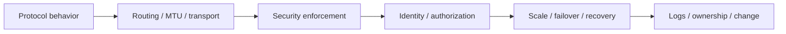

---

## 107. IPv6, Dual Stack, Transition, and Misconceptions

### Why IPv6 exists

IPv6 provides 128-bit addressing and redesigns parts of IP operation for scale and modern networking.

It is not merely IPv4 with longer text. Important differences include:

- No broadcast; multicast and anycast are used
- Neighbor Discovery through ICMPv6 instead of ARP
- Router Advertisements and SLAAC
- Routers do not fragment transit packets
- Simpler fixed base header with extension headers
- IPsec support is standardized but not automatically enabled/encrypted
- Abundant addressing reduces the technical need for address-sharing NAT

### Address anatomy

```text
2001:db8:1234:0056:abcd:0000:0000:0042/64
|------ network ------|------ interface ------|
```

Compression rules:

- Leading zeros within a group may be omitted.
- One consecutive run of all-zero groups may be replaced by `::`.
- `::` can appear only once in an address.

Example:

```text
2001:0db8:0000:0000:0000:0000:0000:0042
2001:db8::42
```

### SLAAC, RA, and DHCPv6

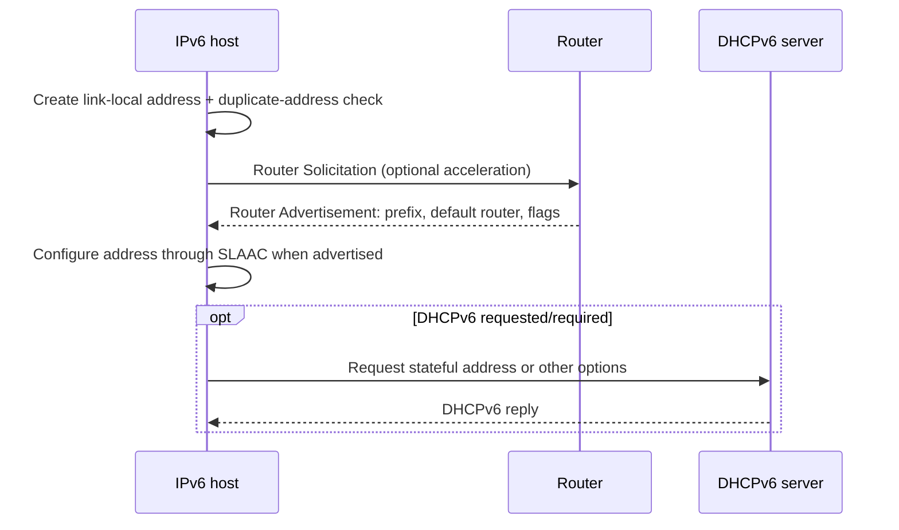

Router Advertisements provide the default-router relationship. DHCPv6 does not directly provide the IPv6 default gateway.

### Neighbor Discovery dependencies

ICMPv6 is essential for:

- Router/neighbor discovery
- Duplicate Address Detection
- Neighbor Unreachability Detection
- Packet Too Big / Path MTU Discovery

Blanket blocking of ICMPv6 can break IPv6 even when basic addresses exist.

### Dual stack and address selection

**Dual stack** means endpoints/networks support both IPv4 and IPv6.

A client can receive A and AAAA records, apply address-selection policy, and race/fallback between families using techniques commonly called **Happy Eyeballs**.

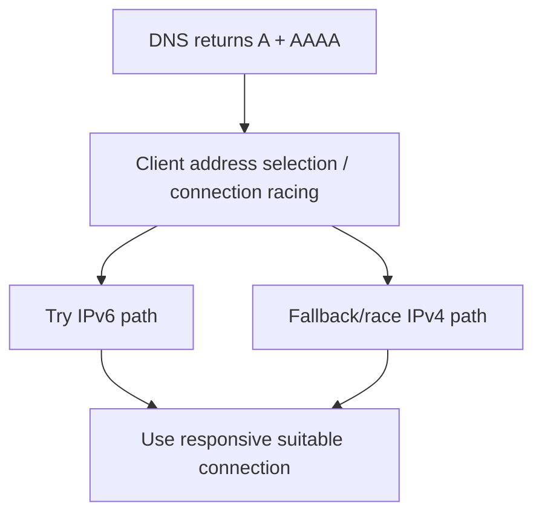

A website may work over IPv4 and fail over IPv6. Test and log both explicitly instead of treating the hostname as one path.

### Transition mechanisms

| Mechanism | Purpose |
|-----------|---------|
| Dual stack | Run IPv4 and IPv6 together |
| NAT64 | Translate IPv6 client traffic toward IPv4 service |
| DNS64 | Synthesize AAAA answers from A records for NAT64 path |
| Tunneling | Carry one IP family over another under defined design |
| Application proxy | Terminate one family and connect with another |

Literal IPv4 addresses and applications embedding addresses can fail in IPv6-only/NAT64 environments.

### Common misconceptions

| Misconception | Correction |
|---------------|------------|
| IPv6 is automatically encrypted | IPsec capability does not mean every IPv6 packet uses IPsec |
| IPv6 needs no firewall | Globally reachable addressing still requires least-privilege policy |
| IPv6 has no private-style addresses | Unique local addresses exist; link-local is mandatory for local functions |
| Disabling IPv6 fixes dual-stack problems | It hides the broken path and can break platform assumptions; diagnose/fix policy and routing |
| NAT is the firewall | Address translation and security policy remain distinct |

> 🔍 **Plain-English deep dive: dual stack means two networks to operate**
>
> IPv4 and IPv6 need complete DNS, address, route, firewall, monitoring, and troubleshooting coverage. A policy applied only to IPv4 can become an IPv6 bypass; an IPv6 route failure can cause intermittent delays before IPv4 fallback.

---

## 108. MTU, MSS, Fragmentation, PMTUD, and Black Holes

### MTU

The **Maximum Transmission Unit (MTU)** is the largest network-layer packet a link can carry in one frame without fragmentation for that interface/path context.

Ethernet commonly has an IP MTU of 1500 bytes, though tunnels, WANs, jumbo frames, and providers differ.

### MSS

TCP **Maximum Segment Size (MSS)** is the largest TCP payload an endpoint advertises it can receive in one segment for that direction.

For a simple IPv4/TCP path with MTU 1500 and minimum headers:

$$
MSS = 1500 - 20\text{ (IPv4)} - 20\text{ (TCP)} = 1460
$$

For minimum IPv6/TCP base headers:

$$
MSS = 1500 - 40\text{ (IPv6)} - 20\text{ (TCP)} = 1440
$$

TCP options, IP extension headers, tunnels, and other encapsulation can reduce available payload further.

### Tunnel overhead

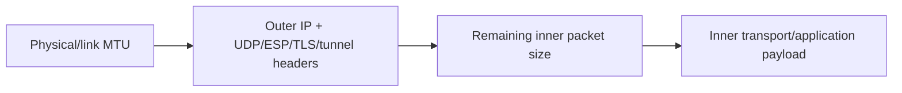

A VPN can carry small pings successfully while large TCP/UDP traffic fails because the inner packet plus tunnel overhead exceeds path capacity.

### IPv4 fragmentation

- A source or router may fragment IPv4 when permitted.
- The Don't Fragment (**DF**) bit can prohibit transit fragmentation.
- Destination reassembles fragments.
- Losing one fragment loses the entire original packet.

### IPv6 fragmentation

IPv6 routers do not fragment transit packets. The source may use a Fragment extension header after learning path constraints. Routers send ICMPv6 Packet Too Big when necessary.

### Path MTU Discovery

**Path MTU Discovery (PMTUD)** attempts to find the smallest MTU along a path.

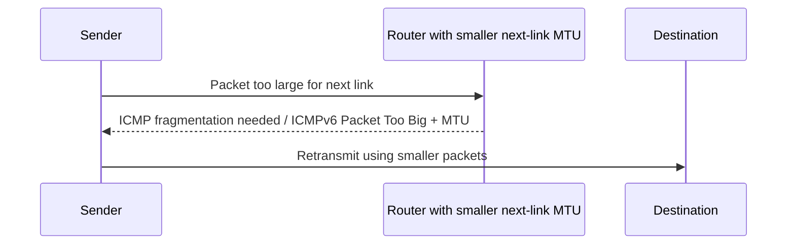

**Packetization Layer PMTUD (PLPMTUD)** can probe usable sizes at a higher layer without relying solely on ICMP behavior.

### PMTU black hole

A black hole occurs when oversized packets are dropped and the sender does not receive/use the required size signal.

Symptoms:

- TCP handshake succeeds
- Small HTTP response works
- Large upload/download stalls
- Repeated retransmissions at similar sizes
- VPN path affected while direct path works
- One direction fails due asymmetric MTU

### MSS clamping

A tunnel/firewall can rewrite TCP SYN MSS downward so endpoints avoid sending segments too large for the tunnel. It helps TCP but does not solve large UDP or every encapsulation problem.

### Diagnostic method

1. Record interface/tunnel MTUs and encapsulation overhead.
2. Check TCP MSS in both handshake directions.
3. Look for ICMP Packet Too Big/fragmentation-needed.
4. Compare working small and failing large traffic.
5. Test both directions and protocol families.
6. Fix ICMP policy/path MTU or set justified interface/tunnel size.
7. Verify without unexplained fragmentation/retransmission.

---

## 109. High Availability, Load Balancing, Health, and Failover

### Availability terms

| Term | Meaning |
|------|---------|
| High Availability (HA) | Design to continue service despite defined component failures |
| Redundancy | More than one component/path |
| Fault domain | Components likely to fail together |
| Failover | Shift work after failure |
| Recovery Time Objective (RTO) | Target maximum restoration time |
| Recovery Point Objective (RPO) | Target maximum acceptable data loss in time |
| Graceful degradation | Keep reduced critical function rather than total outage |

Here, **RTO means Recovery Time Objective**. In Part E's TCP discussion, RTO meant **retransmission timeout**. The shared abbreviation is contextual; the concepts are unrelated.

Two instances in one rack/zone are not resilient to that shared fault domain.

### Active-active vs active-passive

| Active-active | Active-passive |
|---------------|----------------|
| Multiple instances serve traffic | Standby takes over after failure |
| Uses capacity continuously | Simpler state ownership in some systems |
| Requires consistency/distribution | Failover time and standby readiness matter |
| Failures remove partial capacity | Standby may be untested or stale |

### Load-balancing algorithms

| Algorithm | Decision | Trade-off |
|-----------|----------|-----------|
| Round robin | Rotate across backends | Ignores connection cost/load |
| Weighted round robin | More traffic to higher weight | Static weight may not reflect live load |
| Least connections | Choose backend with fewer active connections | Connections can have unequal work |
| Least response time | Use observed latency/load | Measurement noise and feedback loops |
| Hash | Deterministic choice from source/cookie/key | Uneven keys and remapping after pool change |
| Random/power of choices | Sample and choose | Statistical behavior, simple at scale |

### Health dimensions

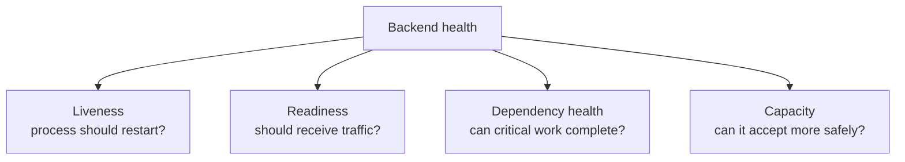

- A liveness probe should not restart a healthy process because one remote dependency briefly failed.
- A readiness probe should remove a node unable to serve expected requests.
- A deep dependency probe can remove every node during a shared dependency outage, worsening failure.

### Session persistence

**Persistence/stickiness** sends a client/session to a consistent backend using cookie, source hash, or another key.

It can support legacy server-local session state, but creates uneven load and failover challenges. Prefer external/shared session state or stateless services where appropriate.

### Failover mechanisms

| Mechanism | Speed/constraint |
|-----------|------------------|
| Local load balancer health removal | Fast, per-backend |
| Anycast routing withdrawal | Network convergence and route policy |
| Global traffic manager/DNS | Resolver/client caching and TTL |
| Active-passive Virtual IP address (VIP) | Detection, state sync, address movement |
| Application retry | Must use budget/backoff/idempotency |

### Retry storms

If every layer retries independently, one failure can multiply load.

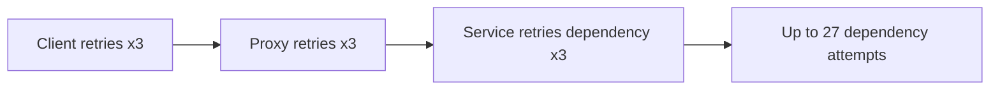

Use deadlines, capped exponential backoff with jitter, retry budgets, circuit breakers, load shedding, and idempotency.

### Verify HA

Do not equate configured redundancy with tested resilience. Exercise:

- Instance loss
- Zone/region/path loss
- DNS/identity/control-plane loss
- Certificate/secret rotation
- Capacity loss during failover
- State/session continuity
- Recovery and failback

### Worked HA exercise: remove one backend safely

**Goal:** prove that a service survives one application-instance failure without losing new requests or corrupting session state.

**Prerequisites:** a nonproduction service with at least two backends, a load balancer, health telemetry, request IDs, and an approved rollback method.

1. Record the healthy backend pool, request rate, error rate, latency, and capacity headroom.
2. Send a steady test workload containing idempotent reads and a small number of traceable writes.
3. Gracefully stop or remove one backend.
4. Observe health-probe failure, pool removal, connection draining, retry behavior, and request distribution.
5. Verify new requests use healthy backends and traceable writes are neither lost nor duplicated.
6. Restore the backend, wait for readiness, and verify controlled re-entry rather than an immediate traffic spike.
7. Repeat with an abrupt process failure to compare graceful and ungraceful behavior.

| Checkpoint | Expected observation | Failure signal |
|------------|----------------------|----------------|
| Detection | Failed node becomes unhealthy within the designed interval | Detection exceeds recovery objective |
| Removal | New traffic stops reaching failed node | Requests continue to dead backend |
| User impact | Error/latency remains within agreed target | Retry storm, timeout, or capacity saturation |
| State | Session/data remains correct | Lost session, duplicate write, inconsistent state |
| Recovery | Node passes readiness before receiving traffic | Traffic arrives before dependencies/cache are ready |
| Audit | Request IDs and event timeline explain the transition | Missing logs or conflicting clocks |

**Success criteria:** observed recovery stays inside the documented **Service Level Objective (SLO)** and Recovery Time Objective, no traceable write is duplicated/lost, healthy capacity remains below its safe limit, and logs identify each state transition.

---

## 110. SDN, SD-WAN, Cloud Virtual Networks, Peering, and Private Access

### Control plane and data plane

| Plane | Job | Example |
|-------|-----|---------|
| Data plane | Forwards actual traffic | Switch/router forwarding table |
| Control plane | Learns/decides paths and policy | Routing protocol/controller |
| Management plane | Configuration, monitoring, administration | Portal/API/automation |

A control-plane outage may prevent policy changes while existing data-plane forwarding continues, depending on design.

### Software-Defined Networking

**Software-Defined Networking (SDN)** separates/logically centralizes control and programs distributed forwarding behavior through software interfaces.

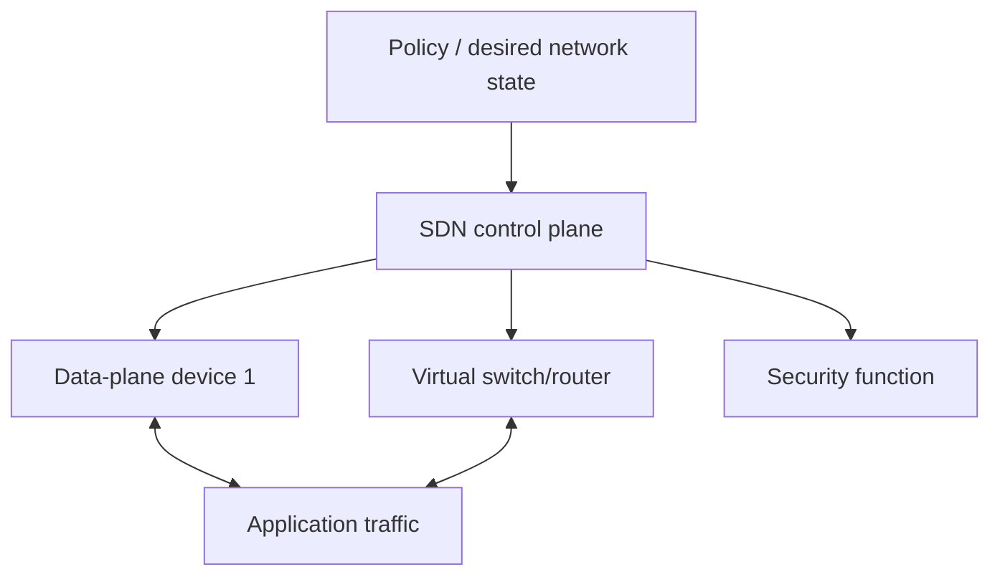

Benefits: automation, consistent policy, rapid virtual topology, telemetry. Risks: controller/API authorization, software bugs, blast radius, stale state, and troubleshooting abstraction.

### SD-WAN

**Software-Defined Wide Area Networking (SD-WAN)** builds managed overlays across links such as broadband, Multiprotocol Label Switching (MPLS), cellular, and internet.

MPLS is a provider/network forwarding technology that uses labels to steer traffic through engineered paths. Enterprises often compare or combine private MPLS services with internet-based SD-WAN overlays.

Capabilities can include:

- Central intent/policy
- Encrypted tunnels
- Application-aware path selection
- Quality of Service (**QoS**)
- Local internet/SaaS breakout
- Link health measurement
- Automated failover
- Integration with SASE/SSE

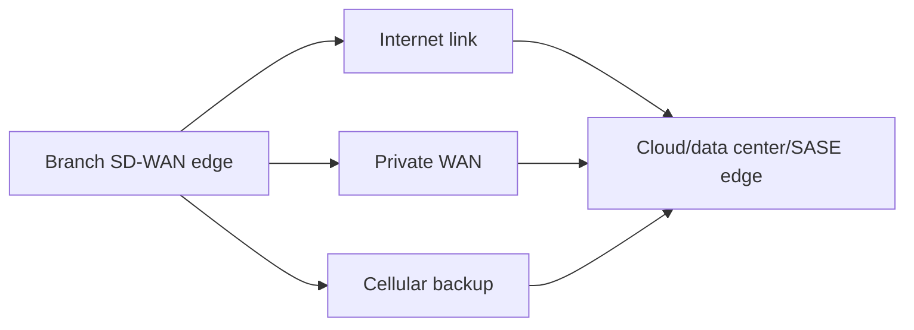

Path policy must avoid flapping. Measurements need hysteresis, hold-down, Service Level Agreement (SLA) thresholds, and state/session-aware failover.

### QoS: protect important traffic during congestion

**Quality of Service (QoS)** classifies traffic and gives classes different forwarding treatment when a link is congested.

QoS does not create bandwidth and usually has little visible effect on an uncongested link.

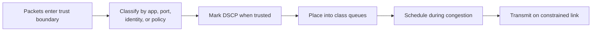

| Function | Meaning | Example |
|----------|---------|---------|
| Classification | Decide which traffic class applies | Voice, interactive app, backup |
| Marking | Write a priority code point | Differentiated Services Code Point (DSCP) in IP header |
| Trust boundary | Decide whose markings are accepted/replaced | Access switch trusts managed phone, remarks user device |
| Queuing/scheduling | Decide transmission order/share under congestion | Low-latency queue for voice plus weighted queues |
| Shaping | Buffer/delay traffic to enforce a smoother average rate | Send backup at contracted WAN rate |
| Policing | Drop or remark traffic exceeding a rate | Enforce tenant/customer traffic contract |

#### Voice versus backup example

Suppose a 100 Mb/s WAN is temporarily saturated by a backup while voice calls need low delay and jitter.

1. Classify and mark real-time voice at a controlled trust boundary.
2. Give voice a bounded priority/low-latency queue.
3. Give business applications a guaranteed weighted share.
4. Shape bulk backup to use remaining capacity without building an excessive provider queue.
5. Police untrusted or abusive markings so every device cannot claim highest priority.
6. Measure loss, latency, jitter, queue drops, and class rates during actual congestion.

Strict priority without a limit can starve other classes. QoS policy must be consistent across each bottleneck; markings alone do nothing when downstream devices ignore them.

#### QoS troubleshooting

| Symptom | Check |
|---------|-------|
| Voice degrades only during backup | Actual congestion point, class match, DSCP preservation, queue drops |
| Packets marked at client but default-queued at WAN | Trust boundary remarked/ignored DSCP |
| One class starves others | Priority bandwidth cap/scheduler configuration |
| Shaped rate lower than intended | Header overhead, nested shaping, provider contract |
| Policer drops bursts | Burst allowance/token bucket and application behavior |

### Cloud service models from scratch

Cloud service models change who operates each layer:

| Model | You primarily manage | Provider primarily manages | Example category |
|-------|----------------------|----------------------------|------------------|
| Infrastructure as a Service (IaaS) | Guest OS, applications, identities, data, much network configuration | Physical facility, hardware, virtualization platform | Virtual machines |
| Platform as a Service (PaaS) | Application, data, identities, service configuration | OS/runtime platform and underlying infrastructure | Managed app/database platform |
| SaaS | Users, data, sharing, tenant settings, integrations | Complete application platform and infrastructure | Hosted CRM/email |

**IaaS** means Infrastructure as a Service, **PaaS** means Platform as a Service, and **SaaS** means Software as a Service. Shared responsibility never disappears; it shifts upward as more of the stack is managed by the provider.

### Azure management hierarchy

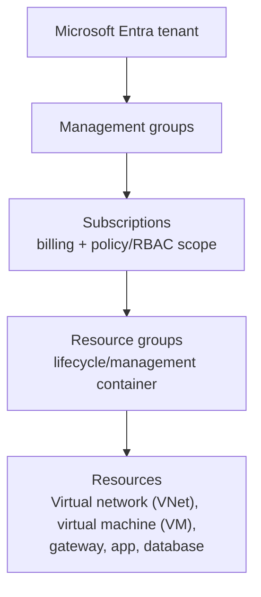

| Scope | Main purpose |
|-------|--------------|
| Microsoft Entra tenant | Identity directory and trust boundary |
| Management group | Organize subscriptions for policy and access governance |
| Subscription | Billing, quotas, Azure Policy/RBAC boundary |
| Resource group | Logical lifecycle/management container; resources can span regions |
| Resource | Deployable service instance |

Azure RBAC and Azure Policy can inherit down this hierarchy. A resource group's name/location is not the packet-routing path; network reach is determined by VNet, DNS, routes, endpoints, gateways, and policy.

### Azure virtual network concepts

An Azure **Virtual Network (VNet)** is a logically isolated IP network containing subnets.

| Component | Job |
|-----------|-----|
| VNet/subnet | Address and routing boundary for Azure resources |
| NIC/private IP | Workload network interface identity/location |
| NSG | Stateful Layer 3/4 traffic policy |
| Route table/UDR | Custom forwarding/next-hop selection |
| VNet peering | Private connectivity between VNets |
| VNet gateway | VPN or Azure ExpressRoute private connectivity and supported transit functions |
| Private DNS zone/resolver | Private name resolution |

### Azure traffic and connectivity service placement

| Azure service | Primary job | Layer/decision | Choose when |
|---------------|-------------|----------------|-------------|
| Public IP | Publicly routable frontend identity for supported resource | IP addressing | A supported Azure frontend must receive/send public traffic |
| NAT Gateway | Scalable explicit outbound SNAT for a subnet | Outbound address translation | Private workloads need stable scalable internet egress without inbound publishing |
| Azure DNS | Host public DNS zones; private DNS uses separate private-zone services | Name resolution | Authoritative public records or Azure-integrated private names |
| Azure Load Balancer | Regional Layer 4 TCP/UDP load balancing | Five-tuple/health probe | High-performance network load distribution without HTTP routing |
| Application Gateway | Regional Layer 7 HTTP/HTTPS reverse proxy with optional WAF | Host/path/header/TLS | Regional web routing, TLS termination, WAF near VNets |
| Azure Front Door | Global HTTP/HTTPS edge, acceleration, routing, CDN/WAF capabilities | Global Layer 7 | Global web applications needing edge entry and regional failover |
| Azure CDN | Cache static/dynamic content at distributed edges | HTTP cache/delivery | Reduce origin load and user latency for cacheable content |
| Traffic Manager | DNS-based global traffic distribution | DNS answer/policy | Direct clients to regional endpoints using DNS policies; not an inline proxy |
| Azure Firewall | Managed stateful network/NGFW service | Network/application policy | Centralized hub/egress/segmentation controls |
| VPN Gateway | Managed IPsec VPN connectivity | Encrypted network tunnel | Site-to-site, point-to-site, or VNet connectivity where supported |
| ExpressRoute | Private provider connectivity to Microsoft cloud | Private WAN connectivity | Predictable private enterprise-cloud path; encryption is separate/design-specific |
| Azure Bastion | Managed browser/client-mediated RDP/SSH access to VMs | Administrative access proxy | Manage VMs without exposing their RDP/SSH ports via public IP |

#### Regional web application example

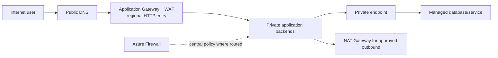

#### Global web application example

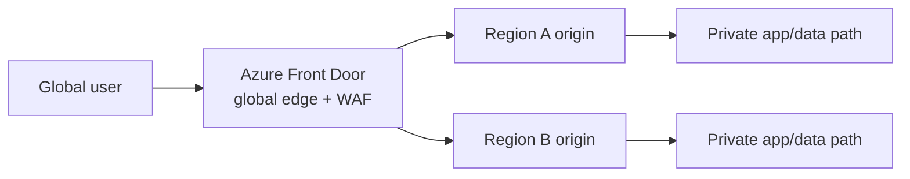

Front Door/Application Gateway, Traffic Manager/Front Door, and Load Balancer/Application Gateway are not interchangeable. Ask whether the decision must be DNS-based or inline, global or regional, Layer 4 or Layer 7, and whether TLS/WAF/content caching is required.

#### Hybrid connectivity example

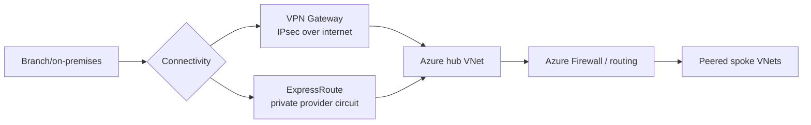

ExpressRoute provides private connectivity but should not be described as automatically end-to-end encrypted. Add encryption at the appropriate layer when the threat model requires it.

### Peering

VNet peering connects two VNets privately. Peering is not transitive by default: if A peers with B and B peers with C, A does not automatically reach C through B without a designed transit function/routes/permissions.

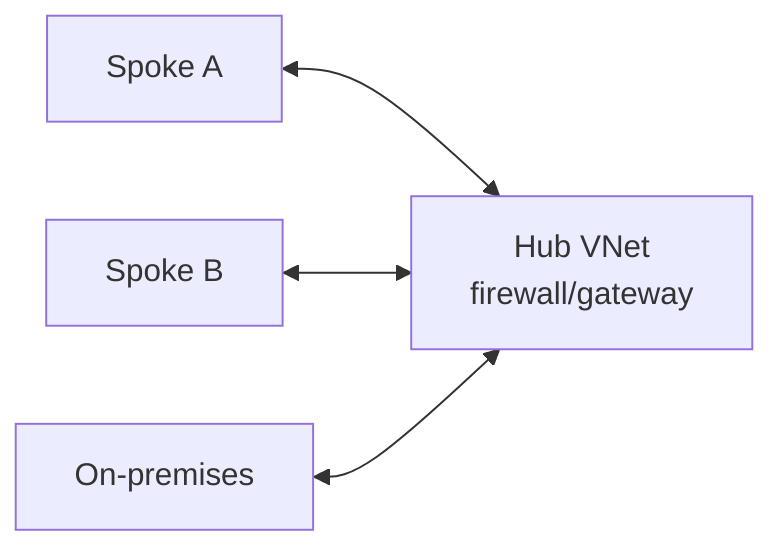

Hub-spoke designs centralize shared services and inspection, but route symmetry, scale limits, DNS, and failure domains require care.

### Private endpoint vs service endpoint

| Private endpoint | Service endpoint |
|------------------|------------------|
| Network interface with private IP in your VNet for a specific service resource | Extends subnet identity/routing context to supported Azure service public endpoint |
| Uses Azure Private Link | Service still uses its service endpoint/public address model |
| Requires private DNS planning to resolve service name to private IP | DNS commonly remains public service address |
| Can disable/restrict public access on service | Service firewall can allow selected VNets/subnets |
| Per-resource private connectivity | Service-level endpoint integration |

### Private endpoint DNS flow

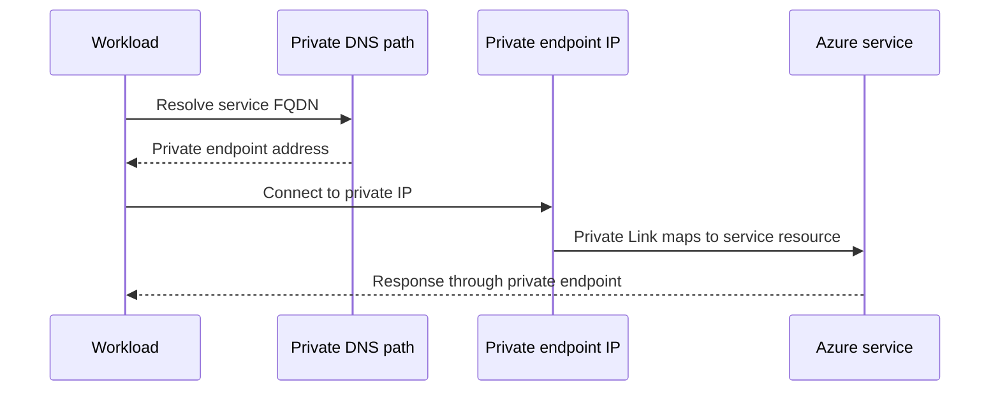

If DNS returns the public address, traffic may bypass the intended private path or fail when public access is disabled.

---

## 111. IDS/IPS, EDR/XDR, SIEM/SOAR, and NAC

### Control map

| Control | Full name | Primary visibility/action |
|---------|-----------|---------------------------|
| IDS | Intrusion Detection System | Detect suspicious network/host activity and alert |
| IPS | Intrusion Prevention System | Inline detect and block/drop/reset |
| EDR | Endpoint Detection and Response | Endpoint process, file, memory, identity, network telemetry and response |
| XDR | Extended Detection and Response | Correlate detections across endpoint, identity, email, cloud, network, apps |
| SIEM | Security Information and Event Management | Centralize/search/correlate logs and alerts |
| SOAR | Security Orchestration, Automation, and Response | Automate enrichment and response workflows |
| NAC | Network Access Control | Decide device/user admission and network segment/access |

### Where they fit

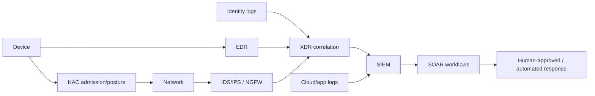

### NAC

NAC can use 802.1X, certificates, device posture, MAC-based fallback, and policy to place a device in an allowed/quarantine/guest segment.

802.1X roles:

- Supplicant: endpoint requesting access
- Authenticator: switch/access point controlling port
- Authentication server: commonly RADIUS service validating credentials/policy

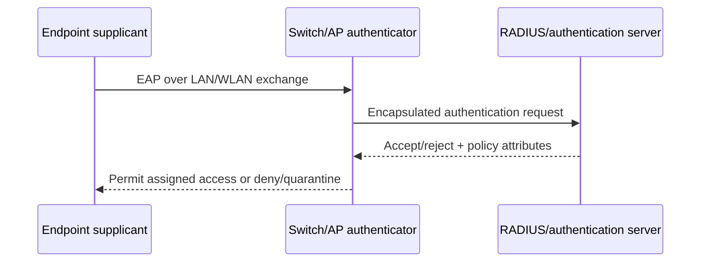

### Detection-to-response lifecycle

1. Collect relevant telemetry.
2. Normalize and enrich identity/asset context.
3. Detect behavior/signature/anomaly.
4. Correlate across systems.
5. Triage severity and confidence.
6. Contain with proportionate action.
7. Investigate root cause and scope.
8. Recover, verify, and improve detections/controls.

### Automation caution

SOAR can isolate a device, disable an account, block an indicator, or open a case. Automation needs:

- Confidence and severity thresholds
- Human approval for high-impact actions
- Idempotent/reversible operations
- Scope safeguards
- Audit trail
- Failure/rollback handling
- Regular testing

---

## 112. Zero Trust, Defense in Depth, and Shared Responsibility

### Zero Trust principles

1. Verify explicitly.
2. Use least-privilege access.
3. Assume breach.

Zero Trust is not "trust nothing and block everything." It replaces implicit location trust with continuously evaluated identity, device, app, data, and risk context.

### Zero Trust pillars

| Pillar | Example controls |
|--------|------------------|
| Identity | Phishing-resistant MFA, risk, lifecycle, least roles |
| Endpoints | Management, compliance, EDR, host firewall |
| Applications | SSO, app inventory, secure development, ZTNA |
| Network | Segmentation, NGFW, SWG, private access, encrypted transport |
| Data | Classification, DLP, rights, encryption, retention |
| Infrastructure | Workload identity, configuration, vulnerability management |
| Visibility/automation | SIEM/XDR, response, governance |

### Defense in depth

**Defense in depth** uses multiple independent or complementary controls so one failure does not expose the asset completely.

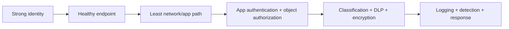

Layers should not duplicate the same blind spot. For example, three port firewalls do not replace application authorization.

### Shared responsibility

In cloud services, provider and customer responsibilities differ by service model.

| Area | Provider commonly owns | Customer commonly owns |
|------|-------------------------|------------------------|
| Physical data center | Facilities, hardware foundation | Provider/vendor assessment |
| Managed platform | Underlying service operation/patching per offering | Configuration, identity, data, application use |
| Network service | Service availability/capability | Routes, rules, exposure, logging configuration |
| Identity service | Platform controls and token service | Accounts, roles, Conditional Access, consent, app configuration |
| SaaS | Application platform | Users, sharing, tenant settings, data, integrations |

Exact boundaries come from the service contract/documentation. "The cloud provider secures it" does not absolve the customer from secure configuration and access governance.

### Responsibility questions

1. Who patches each layer?
2. Who manages identities/keys/certificates?
3. Who defines network and data policy?
4. Which logs exist, who enables/retains/reviews them?
5. Who backs up and restores data?
6. Who handles incidents and regulatory notifications?
7. Which failures are covered by SLA, and which are customer design?

### Zero Trust maturity

Move iteratively:

1. Inventory identities, apps, data, devices, and paths.
2. Remove legacy authentication and standing excess privilege.
3. Deploy strong authentication/device posture.
4. Segment/broker access to applications.
5. Classify data and control actions.
6. Correlate telemetry and automate safe response.
7. Measure bypasses, exceptions, and recovery.

> 🔍 **Plain-English deep dive: least privilege has a time dimension**
>
> Access should be limited by action, resource, identity, condition, and duration. Just-in-time privileged access and short-lived tokens reduce the window in which stolen authority can be abused.

---

## 113. Current Direction: Encrypted DNS, QUIC, Passwordless, SSE, and Identity-Aware Access

### Encrypted DNS

DNS over HTTPS (**DoH**) and DNS over TLS (**DoT**) protect DNS transport between client and resolver.

Benefits:

- Reduces local-path query observation/tampering
- Authenticates encrypted resolver channel

Operational challenges:

- Apps/browsers can bypass enterprise resolvers if unmanaged
- Security teams lose plaintext DNS visibility on path
- Resolver policy, logging, privacy, and jurisdiction become important
- Encrypted malicious DNS still needs endpoint/resolver controls

### QUIC and HTTP/3

QUIC uses UDP with integrated TLS 1.3, multiplexed streams, and connection IDs.

Implications:

- Better connection setup/migration and stream loss behavior
- UDP 443 must be deliberately supported or fallback understood
- Middleboxes cannot rely on TCP behavior
- Encryption limits passive inspection
- Endpoint/proxy support and policy visibility matter

### ECH

**Encrypted Client Hello (ECH)** is designed to protect sensitive TLS ClientHello information such as the requested server name when supported with appropriate DNS/configuration.

This improves privacy but reduces SNI-based network policy. Controls shift toward trusted resolvers, endpoint agents, authenticated proxies, destination IP/reputation, and application-layer enforcement.

### Passwordless and phishing resistance

Direction is moving from passwords and relayable one-time codes toward:

- Passkeys/FIDO2
- Windows Hello for Business
- Certificate-bound methods
- Authentication-strength policy
- Device-bound and risk-aware sessions

Recovery/help-desk processes must be as strong as normal authentication; attackers target enrollment and recovery when sign-in hardens.

### SSE/SASE and identity-aware access

Security controls increasingly follow users and workloads rather than a fixed office perimeter:

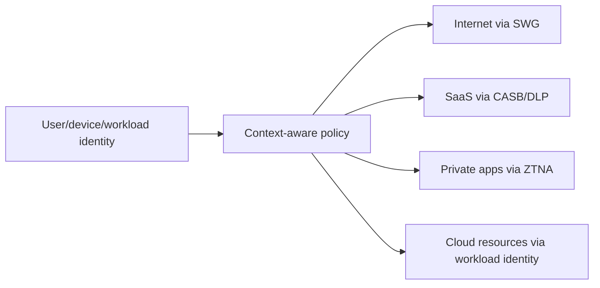

Network location remains a useful signal, but not the sole source of trust.

### More encryption, less passive visibility

| Trend | Visibility impact | Control adaptation |
|-------|-------------------|--------------------|
| TLS 1.3 | More handshake/application encryption | Endpoint/terminator telemetry |
| ECH | Less visible destination-name metadata | Trusted DNS/agent/proxy/app identity |
| DoH/DoT | DNS hidden from path sensors | Managed resolver and endpoint policy |
| QUIC | Encrypted UDP transport, fewer TCP signals | QUIC-aware edge/endpoint logs |
| End-to-end app encryption | Proxy cannot inspect content | App/endpoint/data classification controls |

### Post-quantum transition awareness

Long-lived sensitive data may face "harvest now, decrypt later" risk. Standards and products are introducing post-quantum and hybrid key-establishment mechanisms. Do not invent custom cryptography or assume universal deployment; inventory cryptographic dependencies, follow standards/vendor support, test interoperability/performance, and plan crypto agility.

### Durable interview answer

> "Protocols are encrypting more metadata and moving identity/control closer to endpoints and applications. I would not fight that with blanket interception alone. I would combine managed DNS, endpoint and identity signals, standards-aware security edges, app authorization, DLP, and correlated telemetry while preserving privacy and fallback behavior."

> 💡 **Tie-in for any background:** Current trends do not replace fundamentals. DNS still locates, routes still select paths, transports still manage delivery, and resources still authorize. What changes is which metadata an intermediary can see and where policy must move.

---

## Advanced Quick Reference

| Topic | One-line recall |
|-------|-----------------|
| Dual stack | Operate complete IPv4 and IPv6 paths/policies |
| PMTU black hole | Small works, large stalls, size signal missing |
| MSS clamp | Reduce TCP segment payload for tunnel/path; not a universal UDP fix |
| HA | Redundancy across independent fault domains, tested under load |
| Health | Liveness is not readiness or dependency health |
| SDN | Software programs distributed forwarding from control intent |
| SD-WAN | Policy-driven WAN overlay and path selection |
| VNet peering | Private connection, not automatically transitive |
| Private endpoint | Private IP/NIC mapping to specific service resource |
| SIEM vs SOAR | SIEM analyzes events; SOAR automates response workflows |
| Zero Trust | Verify explicitly, least privilege, assume breach |
| ECH/DoH/QUIC | More privacy/encryption, policy moves to trusted endpoints/edges/apps |

---

## ⭐ Likely Interview Questions for This Section

**Q1. Why can an app work on IPv4 but fail on IPv6?**

> *Model answer:* Dual stack has separate address selection, DNS AAAA, routes, firewall policy, ICMPv6/ND, MTU, and provider paths. I would force/test each family, compare DNS and captures, verify return path and policy, and avoid simply disabling IPv6 to hide the defect.

**Q2. What is a PMTU black hole?**

> *Model answer:* Packets larger than a path link can carry are dropped, but required ICMP size feedback is missing or ignored. Handshakes/small data work while large transfers retransmit/stall. Check MTU, tunnel overhead, MSS, ICMP Packet Too Big/fragmentation-needed, and both directions.

**Q3. Compare liveness and readiness probes.**

> *Model answer:* Liveness asks whether the process should be restarted; readiness asks whether it should receive new traffic. Tying liveness to a shared dependency can restart healthy instances, while a shallow readiness probe can send traffic to an unusable service.

**Q4. What causes retry storms?**

> *Model answer:* Independent retries at client, proxy, service, and dependency multiply attempts during failure. Control them with overall deadlines, capped exponential backoff plus jitter, retry budgets, idempotency, circuit breakers, and load shedding.

**Q5. Compare SDN and SD-WAN.**

> *Model answer:* SDN is the broader approach of software-driven control programming distributed network forwarding. SD-WAN applies centralized policy and overlays to WAN links for path selection, encrypted connectivity, QoS, and failover across branches/cloud edges.

**Q6. Compare an Azure private endpoint and service endpoint.**

> *Model answer:* A private endpoint creates a private IP/NIC in a VNet mapped through Private Link to a specific service resource and needs private DNS. A service endpoint extends subnet identity/connectivity to a supported service's public endpoint model for service firewall policy.

**Q7. Compare EDR, XDR, SIEM, and SOAR.**

> *Model answer:* EDR detects/responds on endpoints. XDR correlates across endpoint, identity, email, cloud, network, and apps. SIEM centralizes/searches/correlates logs and alerts. SOAR automates enrichment and response workflows with safeguards.

**Q8. How do encryption trends change network security?**

> *Model answer:* TLS 1.3, ECH, DoH/DoT, QUIC, and app encryption reduce passive metadata/content visibility. Policy shifts toward managed endpoints/resolvers, authenticated proxies/security edges, identity/device context, app authorization, DLP, and correlated endpoint/terminator logs.

---

## 🧠 30-Second Memory Hooks

- **Dual stack means two complete networks to secure and troubleshoot.**
- **IPv6: no ARP/broadcast; ND and ICMPv6 are essential.**
- **MTU is packet limit; MSS is TCP payload advertisement.**
- **Small works, large stalls: suspect path MTU.**
- **HA crosses fault domains and must be tested.**
- **Liveness restarts; readiness receives traffic.**
- **Retries multiply across layers.**
- **SDN programs forwarding; SD-WAN applies it to WAN overlays.**
- **Peering connects two VNets; it is not automatically transitive.**
- **Private endpoint gives a private IP path and needs correct DNS.**
- **SIEM sees/correlates; SOAR acts.**
- **More encryption means policy moves toward endpoint, identity, and app context.**

---

*Next suggested section:* **[Part P - Interview Question Bank & Behavioral Closing](Part-P-interview-question-bank-behavioral.md)**, which turns all Parts into a 115-question retrieval plan, scenarios, STAR stories, closing answers, and night-before sheet.